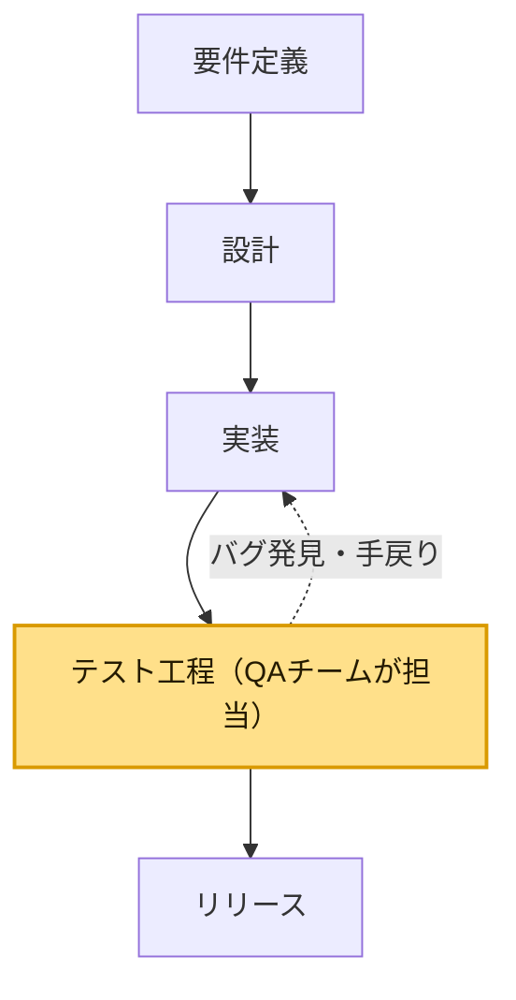
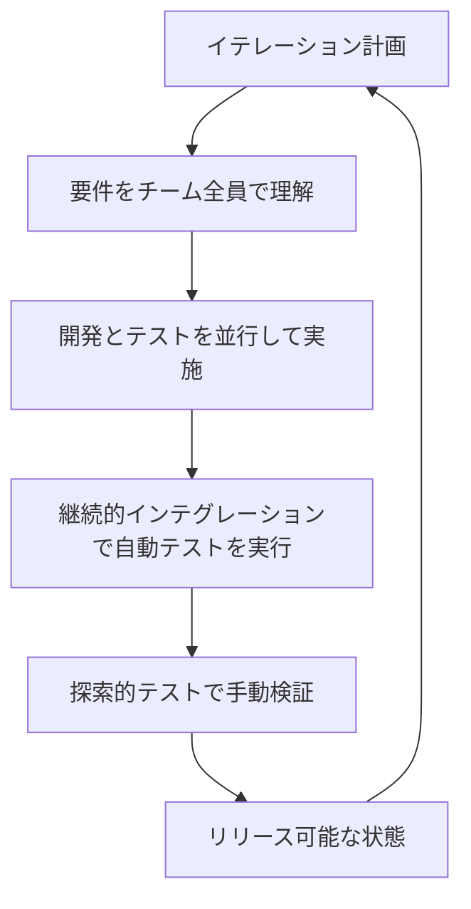
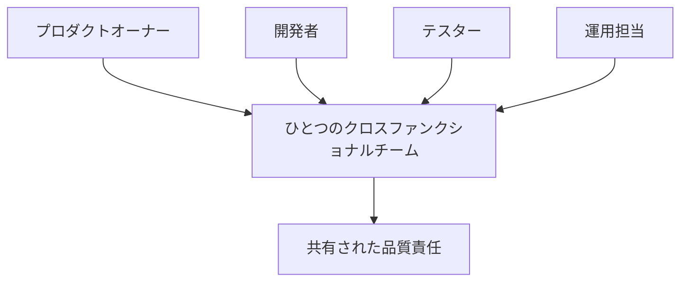
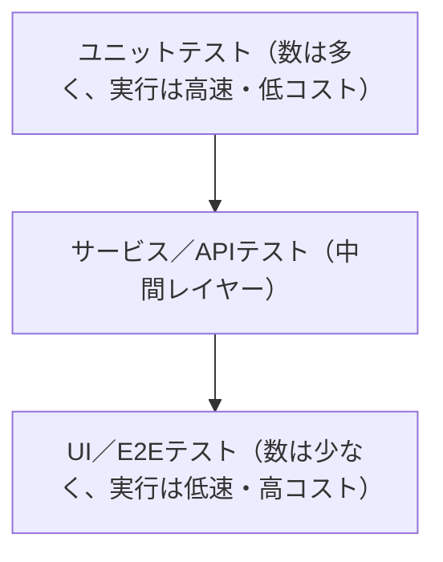
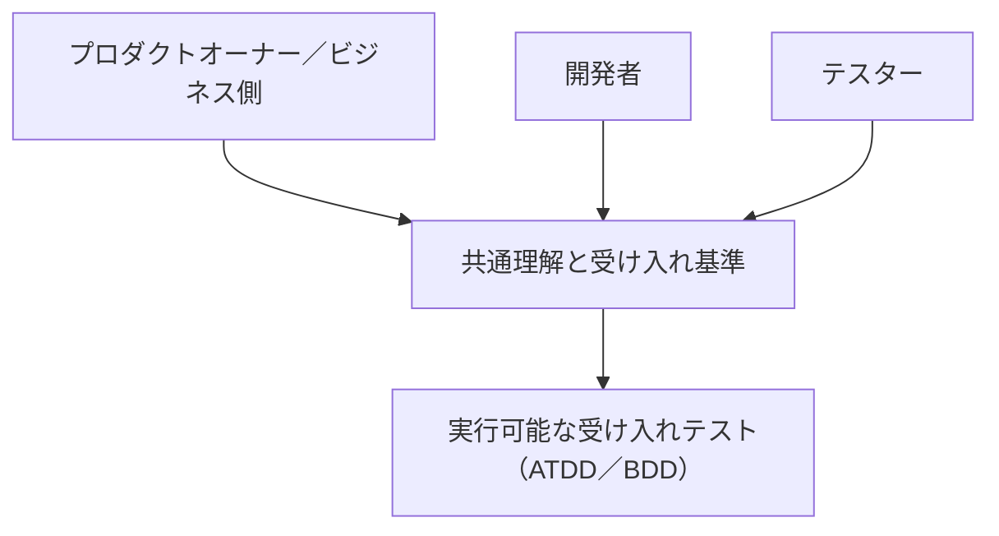
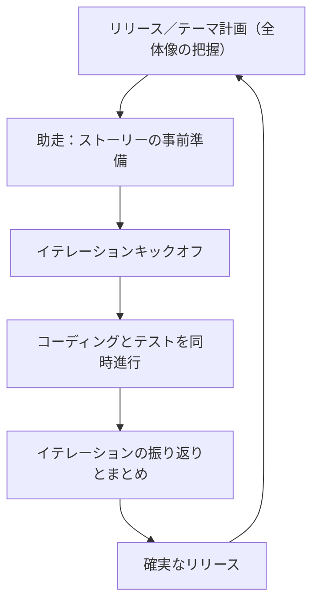
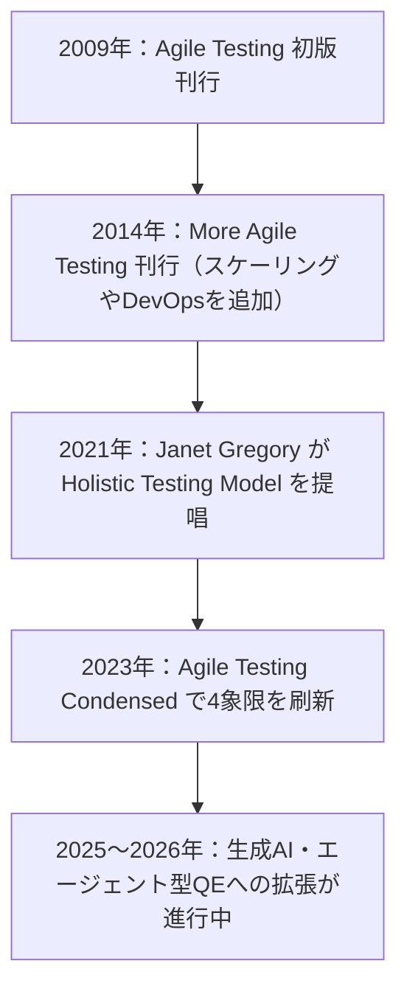

# 初学者のための実践ガイド：Agile Testing: A Practical Guide for Testers and Agile Teams

> 本ガイドは、Lisa Crispin と Janet Gregory の共著書『**Agile Testing: A Practical Guide for Testers and Agile Teams**』（Addison-Wesley Professional, 2009年／O'Reilly版: <https://www.oreilly.com/library/view/agile-testing-a/9780321616944/>）の内容を、初めてアジャイルテストに触れる方向けにステップ・バイ・ステップで解説したものです。あわせて、著者らのその後の発信（ブログ・カンファレンス講演など）や、Martin Fowler・Elisabeth Hendrickson・Gojko Adzic といった著名な国際的開発者・テスト専門家の解説も参照し、2026年9月時点での「現在どう語られているか」も補足しています。

---

## 目次

1. [この本について](#この本について)
2. [ステップ1：アジャイルテストとは何か](#ステップ1アジャイルテストとは何か)
3. [ステップ2：アジャイルテスターの10の原則](#ステップ2アジャイルテスターの10の原則)
4. [ステップ3：組織的な課題とホールチームアプローチ](#ステップ3組織的な課題とホールチームアプローチ)
5. [ステップ4：アジャイルテストの4象限（Agile Testing Quadrants）](#ステップ4アジャイルテストの4象限agile-testing-quadrants)
6. [ステップ5：テスト自動化戦略とテストピラミッド](#ステップ5テスト自動化戦略とテストピラミッド)
7. [ステップ6：Power of Three（Three Amigos）と受け入れテスト](#ステップ6power-of-threethree-amigosと受け入れテスト)
8. [ステップ7：テスターのイテレーションサイクル](#ステップ7テスターのイテレーションサイクル)
9. [ステップ8：探索的テストという技法](#ステップ8探索的テストという技法)
10. [ステップ9：成功の鍵となる7つの要因](#ステップ9成功の鍵となる7つの要因)
11. [ステップ10：この本の思想はどう進化したか（2014〜2026）](#ステップ10この本の思想はどう進化したか20142026)
12. [実践チェックリスト：明日から始める7ステップ](#実践チェックリスト明日から始める7ステップ)
13. [よくある落とし穴](#よくある落とし穴)
14. [参考文献・出典URL](#参考文献出典url)

---

## この本について

| 項目 | 内容 |
|---|---|
| 原題 | *Agile Testing: A Practical Guide for Testers and Agile Teams* |
| 著者 | Lisa Crispin、Janet Gregory |
| 出版社 | Addison-Wesley Professional（Addison-Wesley Signature Series） |
| 初版 | 2008年12月（2009年刊行） |
| ページ数 | 576ページ |
| 序文 | Mike Cohn、Brian Marick |
| 対象レベル | 初級〜中級 |
| O'Reilly掲載ページ | <https://www.oreilly.com/library/view/agile-testing-a/9780321616944/> |

この本は、テスターとQAマネージャーが「アジャイルチームの中でテスターは何をすべきか」という長年の疑問に答えるために書かれた、アジャイルテスト分野における最初期の体系的な実践書のひとつです。単なる理論書ではなく、実際のアジャイルチームで働いていた著者らの経験と、寄稿された数多くの実例（ストーリー）で構成されているのが特徴です。

著名なアジャイル開発者であり ThoughtWorks のチーフサイエンティストである Martin Fowler と同時代に活動してきた Gojko Adzic（『Specification by Example』著者）は自身のブログで、この本が「テスターにとって長らく不足していた実践的な指針を埋める、間違いなく優れた本」だと評しています。

本のコンテンツは大きく6部・21章から構成されています。

| Part | 主な内容 | 本ガイドの対応ステップ |
|---|---|---|
| Part I. Introduction | アジャイルテストの定義／10の原則 | ステップ1・2 |
| Part II. Organizational Challenges | 文化的課題／チームの物理配置／プロセス移行 | ステップ3 |
| Part III. The Agile Testing Quadrants | 4象限による分類とツールキット | ステップ4 |
| Part IV. Automation | 自動化を阻む壁と戦略 | ステップ5 |
| Part V. An Iteration in the Life of a Tester | 計画からリリースまでの1イテレーション | ステップ6・7 |
| Part VI. Summary | 成功の鍵となる7要因 | ステップ9 |

---

## ステップ1：アジャイルテストとは何か

（原著 第1〜2章「What Is Agile Testing, Anyway?」）

まず押さえるべきは、アジャイルテストは**「テストという工程」ではなく「チーム全体で品質をつくり込む考え方」**だという点です。従来型（ウォーターフォール的）の開発では、テストは開発の後工程として独立したフェーズになりがちでした。



このモデルの問題は、バグの発見が遅く、手戻りコストが大きいことです。これに対しアジャイルテストでは、テストは開発と並行して継続的に行われ、チーム全員（プログラマー・テスター・プロダクトオーナーなど）が品質に責任を持ちます。



この違いこそが本書の出発点であり、著者らは「品質は最後にテストして“作り込む”ものではなく、開発の最初から全員で作り込むものだ」という考え方を一貫して主張しています。

---

## ステップ2：アジャイルテスターの10の原則

（原著 第2章）

著者らは、XP（エクストリーム・プログラミング）の価値観とアジャイル宣言の原則を踏まえ、アジャイルテスターに求められる姿勢を10の原則としてまとめています。開発者コミュニティでもよく引用される要約（Jeff Langr と Tim Ottinger による "Agile in a Flash" カード）を基に、初学者向けに整理すると次のようになります。

| # | 原則 | 初学者向けポイント |
|---|---|---|
| 1 | 継続的にフィードバックを提供する | 受け入れ基準を明確にし、進捗を早く・頻繁に伝える |
| 2 | 顧客に価値を届ける | 受け入れテストで「スコープが膨らんでいないか」を常にチェックする |
| 3 | 対面のコミュニケーションを可能にする | テスターは顧客と開発者の“翻訳者”になれる |
| 4 | 勇気を持つ | 短いイテレーションで動くソフトウェアを出し続ける覚悟を持つ |
| 5 | シンプルさを保つ | 過剰な作り込みを避け、必要十分なテストにとどめる |
| 6 | 継続的な改善を実践する | ふりかえり（レトロスペクティブ）に必ず参加する |
| 7 | 変化に対応する | 仕様変更にも耐えられるよう自動テストを整備する |
| 8 | 自己組織化する | チームの誰もがテスト作業を担える状態を目指す |
| 9 | 人にフォーカスする | テスターを「下請け」ではなく対等な貢献者として扱う文化をつくる |
| 10 | 楽しむ | プロセスを主体的に動かせることが、テスターの働きがいになる |

> 出典：Crispin, L. & Gregory, J. *Agile Testing*, Addison-Wesley, 2009（第2章）。要約は Jeff Langr / Tim Ottinger, *"Ten Principles for Agile Testers"*, Agile in a Flash, 2009 を参照（Lisa Crispin 自身のブログでも「うまくまとめられている」と紹介されています）。

---

## ステップ3：組織的な課題とホールチームアプローチ

（原著 第3〜5章：Cultural Challenges / Team Logistics / Transitioning Typical Processes）

アジャイルへの移行で最も難しいのは、ツールや技術ではなく「組織文化」です。本書はこの部分に3章を割いており、代表的な課題は次のとおりです。

| 課題領域 | 従来型の状態 | アジャイルで目指す状態 |
|---|---|---|
| 組織構造 | テスターは独立したQA部門に所属 | テスターは機能横断チームの一員 |
| 物理配置／コミュニケーション | 部署ごとに離れた席・非同期連絡が中心 | 同じチームで密に対面（またはリモートでも高頻度）コミュニケーション |
| 役割意識 | 「テスターがバグを見つける責任者」 | 「品質はチーム全員の責任」 |
| プロセス | フェーズゲート型の承認プロセス | 継続的な検証と早期フィードバック |

この考え方の中心にあるのが**ホールチームアプローチ（Whole-Team Approach）**です。Lisa Crispin は自身のブログで、これは本書の「成功の鍵となる7要因」の第1番目に挙げるほど重要な原則だとし、「チーム全員が最高品質を届けることにコミットしない限り、長期的な成功はあり得ない」という趣旨を述べています。



---

## ステップ4：アジャイルテストの4象限（Agile Testing Quadrants）

（原著 第6〜12章：The Agile Testing Quadrants）

本書で最も有名な概念が、この「4象限（Agile Testing Quadrants）」です。もともと Brian Marick が提唱した「アジャイルテストマトリクス」を、Crispin と Gregory がチームの実践に合わせて発展させたもので、Lisa Crispin は2024年のブログ記事で「20年以上使い続けている」と述べ、著書『Agile Testing Condensed』掲載の最新版図を公開しています（原案者である Brian Marick へのクレジットも重視されています）。

この図は「①テストの目的が“ビジネス向け”か“技術向け”か」「②テストが“チームを支援する（開発を導く）”ものか“プロダクトを批評する”ものか」という2つの軸で、テストの種類を4つに分類する**思考の道具（thinking tool）**です。

| | ビジネス視点で捉える（Business-Facing） | 技術視点で捉える（Technology-Facing） |
|---|---|---|
| **チームを支援する**（開発を導くテスト） | **Q2**：機能テスト、ストーリーテスト、プロトタイプ、受け入れ基準の具体例（ATDD/BDD） | **Q1**：ユニットテスト、コンポーネントテスト。CIで完全自動化されるべき領域 |
| **プロダクトを批評する**（できたものを検証） | **Q3**：探索的テスト、シナリオテスト、ユーザビリティテスト、UAT／アルファ・ベータテスト。多くは手動 | **Q4**：性能・負荷・セキュリティ・保守性・互換性などの非機能テスト |

初学者がまず意識すべきポイントは次の3つです。

- **4象限に「実施順序」はない**（Lisa Crispin 自身がブログで繰り返し強調している点です）。プロジェクトやチームの状況に応じて重み付けを変えてよい思考ツールです。
- Q1・Q4は「技術的な観点」、Q2・Q3は「ビジネス／ユーザーの観点」という軸で捉えると理解しやすい。
- Q1・Q2は「開発を導く」＝コードを書く前・書いている最中に使う。Q3・Q4は「できたものを批評する」＝完成に近づいてから使う。

---

## ステップ5：テスト自動化戦略とテストピラミッド

（原著 第13〜14章：Why We Want to Automate Tests and What Holds Us Back / An Agile Test Automation Strategy）

Q1（技術視点でチームを支援するテスト）を実現する上で欠かせないのが自動化戦略です。本書ではテスト自動化を阻む典型的な壁（スキル不足、ツール選定の失敗、経営層の理解不足など）を挙げたうえで、どのレイヤーにどれだけテストを持つべきかという指針を示します。

この考え方は、Mike Cohn が提唱し、ThoughtWorks のチーフサイエンティスト Martin Fowler が広く一般化した「**テストピラミッド（Test Pyramid）**」とも強く結びついています。Fowler は自身のサイトで、テストピラミッドを「異なる粒度の自動テストをどう使うべきかを考えるための比喩」と説明し、「GUIを通しで実行する高コストなテストより、低レベルなユニットテストをはるかに多く持つべきだ」という原則を提示しています。



初学者向けの実践ステップは次のとおりです。

1. **まずユニットテストの土台を作る**：最も数を増やしやすく、実行も速いレイヤー。
2. **サービス／APIレベルの統合テストを追加する**：ユニットテストではカバーできない、コンポーネント間の結合部分を検証。
3. **UI／E2Eテストは最小限に絞る**：壊れやすく実行が遅いため、重要なユーザーシナリオに限定する。

なお、Martin Fowler は2021年の記事で、チームによっては「ピラミッド」よりも「ハニカム（蜂の巣）」や「トロフィー」型（ユニットテストより統合テストを厚めにする考え方）を好む場合があるとも紹介しており、テストピラミッドは唯一絶対の正解ではなく、システムの性質に応じて調整すべき指針であることも初学者は知っておくとよいでしょう。

---

## ステップ6：Power of Three（Three Amigos）と受け入れテスト

（原著 第8〜9章：Business-Facing Tests that Support the Team / そのツールキット）

Q2（ビジネス視点でチームを支援するテスト）を実現する代表的なプラクティスが、**Power of Three（通称 Three Amigos）**です。これは、プロダクトオーナー（ビジネス）、開発者、テスターの3者が要件定義の初期段階から一緒に会話し、具体例（Examples）を通じて認識を合わせる手法です。



Janet Gregory と Lisa Crispin は、あるポッドキャスト（Tech Lead Journal, 2022年）の中で、この Power of Three の考え方が「ホリスティックテスティング」実践の中核にもなっていると説明しています。3者が事前に会話することで、コードが書かれる前に曖昧さを解消でき、手戻りを大幅に減らせるのがメリットです。

---

## ステップ7：テスターのイテレーションサイクル

（原著 第15〜20章：An Iteration in the Life of a Tester）

本書の中核となるもう一つのパートが、実際の1イテレーション（スプリント）を通してテスターが何をするかを時系列で描いた部分です。初学者はこの流れをそのまま自分のチームに当てはめて考えると理解しやすくなります。



| ステップ | 原著の章 | テスターの主な活動 |
|---|---|---|
| リリース／テーマ計画 | 第15章 | 大きな受け入れ基準の洗い出し、リスクの洗い出し |
| 助走（Hit the Ground Running） | 第16章 | ストーリーの事前準備、テスト観点の整理 |
| イテレーションキックオフ | 第17章 | Power of Threeでの会話、受け入れ基準の合意 |
| コーディングとテスト | 第18章 | 開発と並行したテスト設計・自動化・探索的テスト |
| イテレーションのまとめ | 第19章 | デモ、ふりかえり、未完了項目の扱い |
| 確実なリリース | 第20章 | リリース判定、UAT、本番影響の確認 |

このサイクルが1回で終わらず、次のイテレーションへ継続的にループしていく点が、従来型の「テストフェーズ」との決定的な違いです。

---

## ステップ8：探索的テストという技法

（Q3の中核技法として原著でも扱われ、著者らのその後の発信でも繰り返し重視されているテーマ）

Q3（ビジネス視点でプロダクトを批評するテスト）の代表格が**探索的テスト（Exploratory Testing）**です。用語自体は Cem Kaner が1980年代に提唱し、James Bach らが定義を発展させたものですが、Crispin と Gregory はこれをアジャイルテストの必須スキルとして本書に組み込みました。

探索的テストの第一人者である Elisabeth Hendrickson は、著書『Explore It!』の中で、探索的テストを「事前にすべてのテストケースを設計するのではなく、小さく素早い実験を設計・実行し、直前の学びを次の一手に活かす」プロセスだと説明しています。ポイントは次の3つです。

- **同時並行で行う**：ソフトウェアについて学びながら、テストを設計し、実行する。
- **「でたらめに触る」ことではない**：目的を持った調査であり、通常は「チャーター（何を確認したいかの簡潔な宣言）」を用いて範囲を絞る。
- **タイムボックスで管理する**：セッションベースドテストマネジメントなどの手法で、探索の時間と成果を管理する。

なお Hendrickson の同書には、Janet Gregory 自身が「チームメンバー全員の机に置いておくべき一冊」という推薦コメントを寄せています。

---

## ステップ9：成功の鍵となる7つの要因

（原著 第21章：Key Success Factors、本のまとめにあたる章）

本書の最終章では、アジャイルテストを機能させるための7つの成功要因が示されています。

| # | 成功要因 | 初学者向けポイント |
|---|---|---|
| 1 | ホールチームアプローチを使う | 品質はテスターだけの責任にしない |
| 2 | アジャイルなテストマインドセットを持つ | 「バグ探し」ではなく「価値の実現を支援する」姿勢に切り替える |
| 3 | 回帰テストを自動化する | 変化に強いチームであるための土台をつくる |
| 4 | フィードバックを提供し、また受け取る | デモ・レトロスペクティブ・日々の会話を通じて双方向に |
| 5 | 基盤となるプラクティスを整える | 継続的インテグレーション、テスト環境、技術的負債の管理など |
| 6 | 顧客と協働する | ビジネス側を「向こう側の人」にせず、一緒にテストをつくる |
| 7 | 全体像を見る | 個々のテストではなく、プロダクト全体の価値提供という視点を持つ |

---

## ステップ10：この本の思想はどう進化したか（2014〜2026）

2009年の初版刊行後も、Crispin と Gregory は継続的にこの分野をアップデートし続けています。初学者は「本の内容がそのまま現在の実務に使えるのか」が気になるところですが、著者ら自身の発信を追う限り、**基本概念（ホールチームアプローチ・4象限・探索的テスト）は今も有効であり、その上に新しい実践が積み重ねられてきた**、というのが実情です。



特に注目すべき動きは次の2つです。

1. **ホリスティックテスティング（Holistic Testing Model）**：Janet Gregory が2021年に提唱した考え方で、テスト活動を「開発ライフサイクル全体を取り巻く、終わりのない円環」として可視化するモデルです。Lisa Crispin は自身のブログで、「チームが品質とテストへのホールチームアプローチに合意した後、テスト戦略をどう組み立てればよいか」という悩みに答えるためのツールだと説明しています。

    ```mermaid
    flowchart TB
        P["計画"] --> D["開発"]
        D --> T["テストと自動化"]
        T --> R["リリース"]
        R --> O["本番監視／オブザーバビリティ"]
        O --> P
    ```

2. **AI・エージェント型QEへの拡張**：2026年に入り、Lisa Crispin は DORA（DevOps Research and Assessment）チームが公開した「AI Capabilities Model」について、Beyond Quality ポッドキャストのホストら（Maryia Tuleika、Vitaly Shapovalov、Anupam Krishnamurthy）と議論した内容をブログで紹介しています。ここでは「AIエージェントは時間とともに劣化するため継続的なテストが必要」「セキュリティ上の落とし穴に注意」といった論点とともに、**ペアリングやアンサンブル（複数人での協働）の重要性はAI時代にこそ増している**という見解が共有されています。これは、本書が一貫して主張してきた「テストはチームで行うもの」という思想が、AI時代にも形を変えて生き続けていることを示す好例です。

---

## 実践チェックリスト：明日から始める7ステップ

初めてアジャイルテストに取り組むチーム・個人向けの、実践的な第一歩です。

- [ ] チーム全員で「品質は誰の責任か」を話し合い、ホールチームアプローチを合言葉にする
- [ ] 現在のテストを4象限（Q1〜Q4）に仕分けし、抜け・偏りを可視化する
- [ ] 最も数の少ないユニットテスト（Q1）から自動化の土台を作り始める
- [ ] ストーリー着手前にPower of Three（プロダクトオーナー・開発者・テスター）で会話する時間を確保する
- [ ] 探索的テストの時間をイテレーションに明示的に組み込み、チャーターを書く習慣をつける
- [ ] イテレーションの終わりに、7つの成功要因のどれが弱いかをふりかえりで確認する
- [ ] AIツールを導入する場合も、「チームでの協働」を置き換えるのではなく補強する形で使う

---

## よくある落とし穴

| 落とし穴 | 症状 | 対処法 |
|---|---|---|
| テスターだけが品質責任者になっている | 開発者がテストに無関心、リリース前にテスターだけが忙しい | ホールチームアプローチをふりかえりで再確認する |
| Q1・Q4を軽視している | 手動のQ2・Q3ばかりでリグレッションの自動防御がない | まずQ1（ユニットテスト）から自動化に着手する |
| 4象限を「実施順序」だと誤解している | 「Q1が終わらないとQ2に進めない」と思い込む | 4象限は分類のための思考ツールであり、順序ではないと理解する |
| 探索的テストを「行き当たりばったりの作業」だと誤解している | 成果が記録されず再現できない | チャーターとセッションベースドテストマネジメントを導入する |
| E2Eテストに偏重している | テストが遅く、頻繁に壊れる | テストピラミッドの比率を見直し、下位レイヤーを厚くする |

---

## 参考文献・出典URL

- Lisa Crispin, Janet Gregory. *Agile Testing: A Practical Guide for Testers and Agile Teams*（O'Reilly掲載ページ／目次） — <https://www.oreilly.com/library/view/agile-testing-a/9780321616944/>
- Amazon 書籍ページ（書誌情報） — <https://www.amazon.com/Agile-Testing-Practical-Guide-Testers/dp/0321534468>
- Lisa Crispin, *"The Agile Testing Quadrants"*（2024年・最新版4象限図） — <https://lisacrispin.com/2024/10/11/the-agile-testing-quadrants/>
- Lisa Crispin, *"Using the Agile Testing Quadrants"*（2011年） — <https://lisacrispin.com/2011/11/08/using-the-agile-testing-quadrants/>
- Lisa Crispin, *"The Whole Team Approach"*（2009年） — <https://lisacrispin.com/2009/01/30/the-whole-team-approach/>
- Lisa Crispin, *"Learn how to apply the Holistic Testing Model"*（2023年） — <https://lisacrispin.com/2023/05/15/holistic-testing-model-mini-book/>
- Lisa Crispin, *"AI, testing, and the DORA AI Capabilities Model"*（2026年4月） — <https://lisacrispin.com/2026/04/20/ai-testing-and-the-dora-ai-capabilities-model/>
- Jeff Langr, Tim Ottinger, *"Ten Principles for Agile Testers"*, Agile in a Flash（2009年） — <http://agileinaflash.blogspot.com/2009/03/ten-principles-for-agile-testers.html>
- Martin Fowler, *"TestPyramid"*（Bliki） — <https://martinfowler.com/bliki/TestPyramid.html>
- Martin Fowler / Ham Vocke, *"The Practical Test Pyramid"* — <https://martinfowler.com/articles/practical-test-pyramid.html>
- Martin Fowler, *"On the Diverse And Fantastical Shapes of Testing"*（2021年） — <https://martinfowler.com/articles/2021-test-shapes.html>
- Elisabeth Hendrickson, *Explore It!: Reduce Risk and Increase Confidence with Exploratory Testing*（Pragmatic Programmers） — <https://pragprog.com/titles/ehxta/explore-it/>
- Gojko Adzic, *"Agile Testing (Crispin/Gregory) is a great book, long overdue"*（書評） — <https://gojko.net/2009/02/23/agile-testing-crispingregory-is-a-great-book-long-overdue/>
- Tech Lead Journal, *"#92 - Agile and Holistic Testing - Janet Gregory & Lisa Crispin"*（2022年） — <https://techleadjournal.dev/episodes/92/>
- PMI Disciplined Agile, *"Testing Quadrants"*（4象限の背景解説） — <https://www.pmi.org/disciplined-agile/agile/testingquadrants>
- InfoQ, *"Book Excerpt: Agile Testing"*（第21章「Key Success Factors」の抜粋紹介） — <https://www.infoq.com/articles/agile-testing-book-excerpt/>

*本ガイドは2026年9月2日時点で確認できる公開情報をもとに作成しています。各リンク先の内容は今後更新される可能性があるため、最新の議論については著者らのブログ（lisacrispin.com、agiletester.ca）を直接ご確認ください。*
