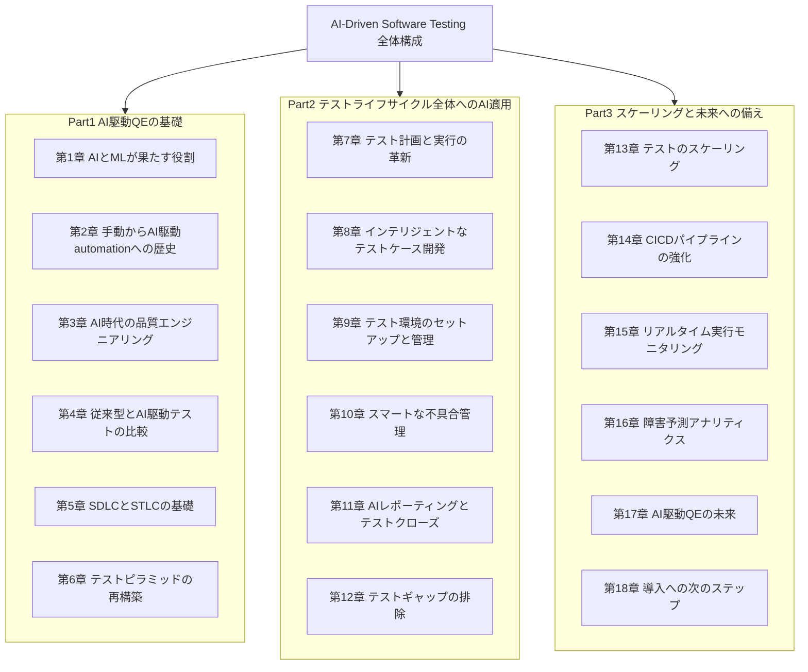
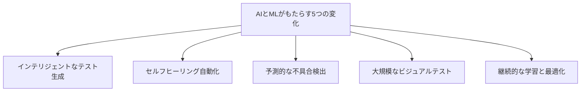
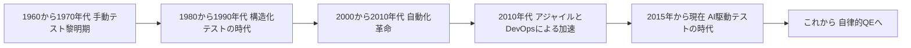
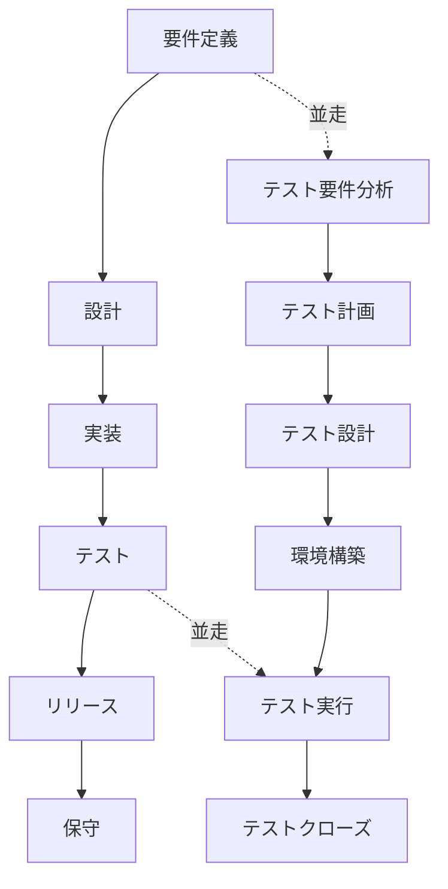
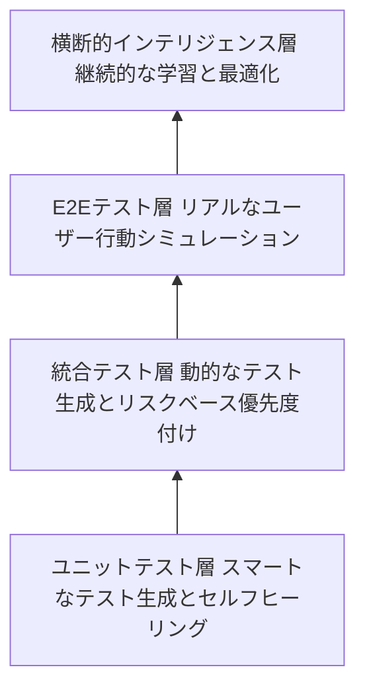
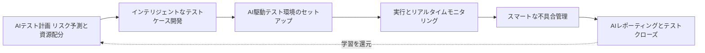
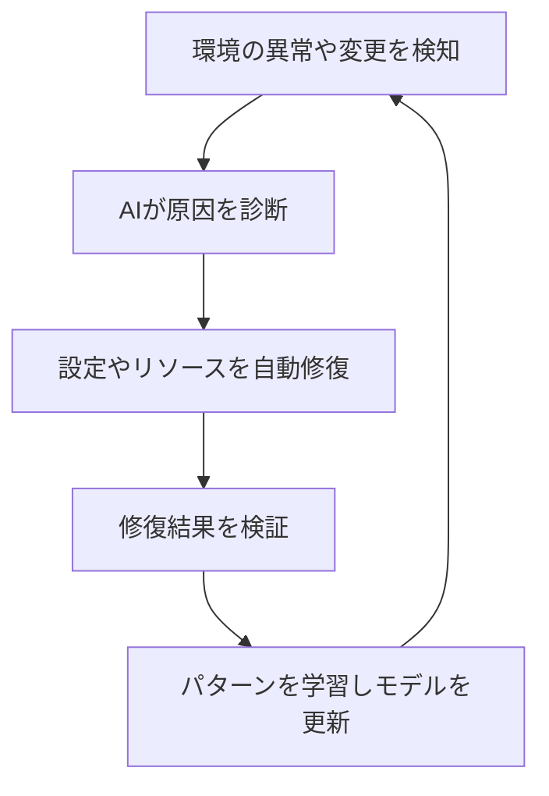
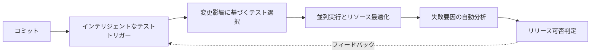
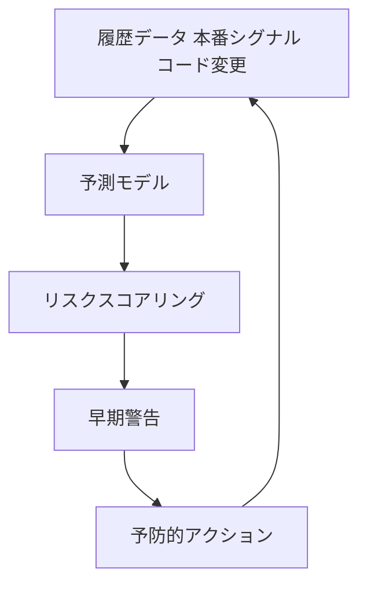
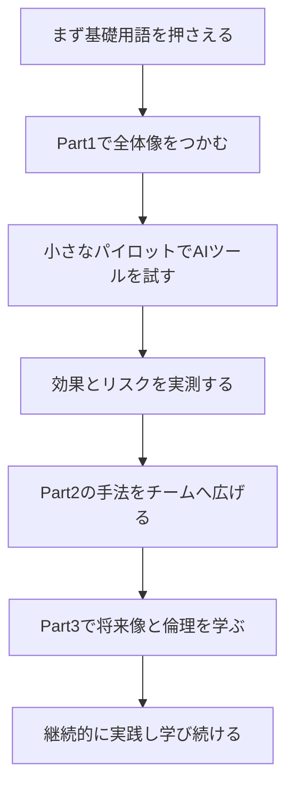

# AI駆動ソフトウェアテスト入門ガイド ― Srinivasa Rao Bittla『AI-Driven Software Testing』で学ぶAI×QEの実践

> 本ガイドは、Apress刊行・O'Reilly収録の書籍『AI-Driven Software Testing: Transforming Software Testing with Artificial Intelligence and Machine Learning』（著者: Srinivasa Rao Bittla、2025年10月刊、536ページ）の目次構成をもとに、AIによるソフトウェアテスト変革のテーマを初学者向けに再構成し、業界の著名な実践者・組織による2026年時点の一次情報を交えて解説したものです。書籍本文の逐語的な引用は行わず、各章のテーマを独自の説明・図解で再構成しています。

---

## この記事の読み方

- ソフトウェアテストの基礎（テストケース、CI/CD、回帰テストなど）を触ったことがある人を主な対象にしつつ、専門用語はその都度かみ砕いて説明します。
- 図解はすべてMermaidのフローチャートを使用しています（ASCIIアートは使用していません）。GitHub、VS Code、多くのMarkdownビューアでそのまま描画されます。
- 各ステップは書籍の該当する章に対応させていますが、内容は独自にまとめ直したものです。書籍そのものを読む際の「地図」として使ってください。
- 末尾に、Mark WinteringhamやAngie Jones、ThoughtWorks、DORA、ISTQB、James Bach/Michael Boltonなど、国際的に著名な実践者・組織による一次情報・参考情報への参照リンクをまとめています。

---

## 用語ミニ辞典

| 用語 | 意味 |
|---|---|
| QE（Quality Engineering） | 品質エンジニアリング。バグを見つける「テスト」より広く、品質を作り込む活動全体を指す言葉 |
| SDLC | Software Development Life Cycle。要件定義からリリース・保守までのソフトウェア開発全体の流れ |
| STLC | Software Testing Life Cycle。テスト要件分析からテストクローズまでのテスト活動の流れ |
| 自己修復（セルフヒーリング）テスト | UIの変更などでテストが壊れたとき、AIがセレクタや手順を自動的に修正する仕組み |
| 予測分析（Predictive Analytics） | 過去のデータやパターンから、将来起こりうる不具合やリスクを事前に予測する手法 |
| CI/CD | Continuous Integration／Continuous Delivery（継続的インテグレーション・継続的デリバリー）。コード変更を自動でビルド・テスト・リリースする仕組み |
| LLM | Large Language Model（大規模言語モデル）。ChatGPTなどの基盤となる自然言語処理モデル |

---

## 書籍情報

| 項目 | 内容 |
|---|---|
| タイトル | AI-Driven Software Testing: Transforming Software Testing with Artificial Intelligence and Machine Learning |
| 著者 | Srinivasa Rao Bittla |
| 出版社 | Apress（O'Reilly収録） |
| 刊行 | 2025年10月 |
| ページ数 | 536ページ |
| 読者レベル | 中級から上級（Intermediate to advanced） |
| 想定読者 | 品質エンジニア、データサイエンティスト、AI/MLをテスト・自動化に組み込みたい開発者 |
| 構成 | 全3部・18章 |

---

## 全体構成をつかむ

書籍は「基礎」「実践」「発展」の3部構成になっています。まず全体地図を頭に入れておくと、各章がどこに位置づけられるかが分かりやすくなります。

---

## Part I 基礎編 ― なぜ今、テストにAIなのか

### Step1 AIとMLはソフトウェアテストの何を変えるのか（第1章対応）

書籍の第1章は「目覚まし時計」のような章として位置づけられています。ソフトウェアの複雑さとリリース速度は年々上がり続けている一方で、従来のQEプロセスはその速度に追いつけなくなっている、という問題提起から始まります。

AI・MLがQEにもたらす代表的な変化は、次の5つに整理できます。

- **インテリジェントなテスト生成**: 要件やユーザー行動ログから、人間が思いつかないようなテストケースをAIが提案する。
- **セルフヒーリング自動化**: UIのセレクタ変更などでテストが壊れても、AIが自動的に修復する。
- **予測的な不具合検出**: 過去の障害データやコード変更の傾向から、不具合が起きやすい箇所を事前に予測する。
- **大規模なビジュアルテスト**: 画面の見た目の差分を、ピクセル単位ではなく「意味のある変化かどうか」で判定する。
- **継続的な学習と最適化**: テストスイート自体が実行結果から学習し、優先順位や実行方法を継続的に改善する。

一方で、書籍が強調しているのは「変わらないもの」の存在です。テストの目的（リスクを可視化し、意思決定を支える）や、批判的思考力、ドメイン知識の重要性は、AIが導入されても変わりません。AIは代替ではなく増幅装置であるという視点は、後述するAngie JonesやThoughtWorksの見解とも一致します。

### Step2 手動からAI駆動へ ― テストの歴史をたどる（第2章対応）

テストの実務がどのように進化してきたかを俯瞰すると、AI駆動テストが「突然現れたもの」ではなく、数十年にわたる進化の延長線上にあることが分かります。

| 時代 | 特徴 | 主な課題 |
|---|---|---|
| 手動テスト黎明期 | 品質は後工程で確認するものという認識 | 品質危機、体系的な手法の欠如 |
| 構造化テストの時代 | ウォーターフォール、テストドキュメントの整備 | 硬直的なプロセス、フィードバックの遅さ |
| 自動化革命 | ツールによるスクリプト実行の自動化 | メンテナンスコストの増大、過信によるハネムーン期の終焉 |
| アジャイルとDevOpsの加速 | シフトレフト、CI、継続的デリバリー | スピードと品質のトレードオフ、テストの負債化 |
| AI駆動テストの時代 | 学習・予測・自己修復を組み込んだテスト | データ品質、説明可能性、組織文化の変化 |

### Step3 AI時代の品質エンジニアリングとは何か（第3章対応）

第3章では、QEを「バグを見つける仕事」から「リスクを予測し、継続的に品質を作り込む仕事」へと再定義しています。AIがQEにもたらす変化は、次の観点で整理されています。

- **ルールベースから学習ベースへ**: 固定的なテストスクリプトから、データから学習し状況に適応するアプローチへ。
- **速度と精度のトレードオフの緩和**: 従来は速さと正確さが両立しにくかったが、AIによる優先順位付けでその緊張関係が緩和される。
- **スケールでの信頼性**: 大規模なテストスイートでも、人手を線形に増やさずに信頼性を維持できる。

同時に、書籍は「データの質」「スキルギャップ」「組織文化の抵抗」といった、AI導入時に実際につまずきやすい課題も率直に扱っています。この点は、後述するDORAの調査結果とも重なります。

### Step4 従来型テストとAI駆動テストを比較する（第4章対応）

両者の違いを整理すると、次のようになります。

| 観点 | 従来型テスト | AI駆動テスト |
|---|---|---|
| テストケース作成 | 人手による設計・記述 | 要件やログからAIが候補を生成し、人が精査 |
| メンテナンス | UI変更のたびに手動修正 | セルフヒーリングによる自動修正を併用 |
| 優先順位付け | 経験と勘に基づく | リスクスコアや影響範囲分析に基づく |
| 不具合検出のタイミング | テスト実行後に判明することが多い | 予測モデルによる事前の兆候検知を併用 |
| スケール対応 | 人員増強に依存しやすい | 並列実行とリソース最適化で対応 |
| 限界 | 網羅性・速度の限界 | データ品質・説明可能性・過信のリスク |

ここで重要なのは、AI駆動テストが従来型テストを「置き換える」のではなく「補完する」ものとして描かれている点です。書籍はこれを「パートナーシップモデル」と呼び、最終的な判断は人間が担うという前提を繰り返し強調しています。

### Step5 SDLCとSTLCの基礎を理解する（第5章対応）

AI駆動テストを理解する前提として、SDLC（ソフトウェア開発ライフサイクル）とSTLC（テストライフサイクル）の関係を押さえておく必要があります。

シフトレフト、探索的テスト、DevOps、CI/CDパイプラインといった現代的な実践は、いずれもSDLCとSTLCを「順番に実行する別々の工程」から「並走し継続的にフィードバックし合う工程」へと変える取り組みです。AIはこの並走関係を、より速く、より高い頻度で回すための手段として位置づけられています。

### Step6 テストピラミッドをAIで再構築する（第6章対応）

古典的なテストピラミッド（ユニットテストを土台に、統合テスト、E2Eテストを積み上げる考え方）は理論上は優れていますが、実践では「メンテナンスの悪夢」「スケールの壁」「カバレッジの幻想」といった痛点を抱えがちです。

各層でAIが果たす役割は次のように整理できます。

- **ユニットテスト層**: コンテキストを理解したテスト生成、変更に応じたセルフヒーリング。
- **統合テスト層**: 動的なテストケース作成、リスクに基づく優先順位付け、予測的なテスト選択。
- **E2Eテスト層**: 完璧なロボットではなく実際のユーザー行動を模したシナリオ生成、ビジネスインパクトに基づく重み付け。
- **横断的インテリジェンス層**: 実行結果を学習し、テストスイート全体を継続的に最適化する。

---

## Part II 実践編 ― テストライフサイクル全体へのAI適用

Part IIでは、テスト計画から不具合管理、テストクローズまで、STLCの各フェーズにAI/MLをどう組み込むかが具体的に扱われます。全体像を先に示します。

### Step7 AIによるテスト計画と実行の革新（第7章対応）

テスト計画の分野でAIが貢献するのは、主に次の3点です。

1. **要件分析の高度化**: 自然言語で書かれた要件から、リスクの高い領域を自動的に抽出する。
2. **リスク予測**: 過去の障害履歴と変更内容を突き合わせ、どの機能がリスクを持ちやすいかをスコアリングする。
3. **動的なリソース配分**: テスト実行の進捗や結果に応じて、リソース配分やスケジュールをリアルタイムに調整する。

書籍ではこれを「フラッシュセールのテスト計画」のような具体例で説明していますが、共通しているのは「固定された計画書」から「実行しながら更新され続ける生きた計画」への転換という考え方です。

### Step8 インテリジェントなテストケース開発（第8章対応）

手動でのテストケース作成には限界があります。AIが貢献できる領域は次の通りです。

- **履歴データからのパターン抽出**: 過去の不具合パターンから、優先的にテストすべきケースを推定する。
- **動的なテストケース**: 要件変更をリアルタイムに追跡し、テストケース自体を追従させる。
- **カバレッジの最適化**: 単なる網羅率ではなく、ユーザー行動やビジネスインパクトに基づいたギャップ分析を行う。
- **エッジケースの予測**: 組み合わせ爆発が起きやすい領域や、時間依存の不具合など「人間が想定しづらいケース」を合成データで再現する。
- **再利用可能なシナリオ**: モジュール化されたテスト部品を、コンテキストに応じて組み合わせ直す。

### Step9 AI/MLによるテスト環境のセットアップと管理（第9章対応）

環境構築は地味ながら時間を奪われがちな領域です。AIはここで、テンプレート駆動の一貫性のある環境構築、需要予測に基づくリソースのスケーリング、そして障害発生時の自己修復に貢献します。

このサイクルは、テスト実行自体のセルフヒーリング（Step1で紹介した自動修復）と対になる「環境レベルのセルフヒーリング」と捉えると理解しやすくなります。

### Step10 スマートな不具合管理と解決（第10章対応）

「自分の環境では再現しない」という古典的な問題に対して、AIはコンテキストの自動収集、根本原因分析、そしてビジネスインパクトに基づく優先順位付けで貢献します。

- **コンテキストの自動収集**: ログ、環境情報、直前の変更履歴をAIが自動的に紐付ける。
- **根本原因分析**: 複数システムをまたぐ障害パターンを、過去の類似事例と照合して特定する。
- **現実を反映した優先順位付け**: 政治的な声の大きさではなく、実際のユーザー影響や収益インパクトに基づいて優先順位を決める。
- **開発者とQEの協働**: 共有されたインテリジェンスプラットフォームにより、双方が同じコンテキストを見ながら議論できる。

### Step11 AIレポーティングとフィードバックループによるテストクローズ（第11章対応）

テストクローズを「チェックボックスを埋める儀式」で終わらせず、実際に意思決定に使えるレポートに変えることが、この章のテーマです。

- リアルタイムの目標達成状況の追跡と、動的な優先順位の調整。
- ステークホルダーごとに異なる粒度で情報を提示するダッシュボード。
- リリース可否を予測する「予測的リリース判定」。
- 過去のリリースからパターンを学習し、次のテスト戦略を自動的に改善するフィードバックループ。

### Step12 AI/MLでテストギャップを排除する（第12章対応）

「自分たちが知らないことを知らない」という盲点（ブラインドスポット）をどう発見するかが、この章の核心です。ユーザー行動分析、過去の不具合との相関、システム間の依存関係の変化を組み合わせることで、AIは人間が見落としがちな領域を可視化します。あわせて、複数プラットフォーム間の一貫性検証（機能面・パフォーマンス面・UI/UX面）も重要なテーマとして扱われています。

---

## Part III 発展編 ― スケーリングと未来への備え

### Step13 AI/MLでソフトウェアテストをスケーリングする（第13章対応）

クラウド環境でのテストは、過剰プロビジョニングによるコスト増大という古典的な問題を抱えています。AIによるキャパシティプランニング、地域ごとのスケーリング、そしてコスト最適化がこの章のテーマです。

### Step14 CI/CDパイプラインをAI/MLで強化する（第14章対応）

CI/CDパイプラインにおけるAIの役割は、インテリジェントなテストトリガー、変更内容に応じた適応的なテスト選択、そして目に見えにくいボトルネックの発見に整理できます。

書籍が強調しているのは「説明可能な判断」「人間による上書き可能性」「継続的な検証」という3原則です。AIによる判断がブラックボックス化しないようにする設計思想は、後述するThoughtWorksの見解とも一致しています。

### Step15 AI/MLによるリアルタイムテスト実行モニタリング（第15章対応）

何を監視すべきかを整理すると、次のようになります。

| 指標 | 何を教えてくれるか |
|---|---|
| テスト実行時間 | パイプライン全体の健全性を示す「炭鉱のカナリア」 |
| テストカバレッジ | 単なる数値ではなく、どこがカバーされていないかの質 |
| 不具合検出率 | 品質プロセスそのものの質を測る指標 |
| 成功／失敗比率 | ビルドの脈拍のような即時シグナル |
| 不具合の再オープン率 | 修正の正直さを測る指標 |

AIはこれらの指標をリアルタイムに関連付け、異常検知や「先の角を見通す」ような予測的インサイトを提供します。

### Step16 AI/MLアナリティクスで障害を予測する（第16章対応）

多くの障害は、実は「予兆のない突然の出来事」ではなく、事前にパターンとして現れていることが多いという前提から出発します。

書籍は同時に「予測精度への正直な向き合い方」も扱っており、誤検知（フォールスポジティブ）への備えや、人間の専門知識とAIの洞察を組み合わせることの重要性を強調しています。この慎重さは、後述するDORAの「検証税」の議論とも通じるものです。

### Step17 AI駆動QEの未来とQEの倫理（第17章対応）

第17章では、現在すでに実用段階にあるもの（セルフヒーリングテスト、部分的な自律テスト生成、行動を変える予測的リスク評価）と、まだ実験段階にあるもの（真に探索的なAIテスト、完全自律型のE2E QE）を区別しています。

同時に、次のような倫理的課題にも正面から向き合っています。

- **見えないバイアス**: AIが学習データに含まれる偏りをそのまま反映してしまうリスク。
- **透明性の課題**: なぜその判断に至ったのかを説明できるかどうか。
- **説明責任のギャップ**: AIの判断ミスが引き起こした問題を、誰がどう説明責任を負うか。
- **プライバシーとデータ取り扱い**: テストデータや本番データをAIに学習させる際のガバナンス。

### Step18 AI駆動QE導入への次のステップ（第18章対応）

最終章は、実際に組織へ導入するための現実的なロードマップです。

書籍は「準備ができているかどうかの正直な自己評価」から始めることを勧めています。現在のテストプロセス、データの状態、インフラの現実、チームのスキルという4つの観点でのチェックリストは、多くの組織にとってそのまま出発点として使えるでしょう。

---

## 全18章 一覧

| Part | 章 | タイトル |
|---|---|---|
| I | 1 | AIとMLが現代のソフトウェアテストで果たす役割 |
| I | 2 | 手動からAI駆動自動化へのソフトウェアテストの変遷 |
| I | 3 | AI時代の品質エンジニアリング |
| I | 4 | 従来型テストとAI駆動テストの比較 |
| I | 5 | SDLCとSTLC 基本の理解 |
| I | 6 | 従来型とAI駆動テストにおけるテストピラミッド |
| II | 7 | AI／MLによるテスト計画と実行の革新 |
| II | 8 | AI／MLによるインテリジェントなテストケース開発 |
| II | 9 | AI／MLによるテストセットアップと管理 |
| II | 10 | AI／MLによるスマートな不具合管理と解決 |
| II | 11 | AI／MLレポーティングとフィードバックループによるテストクローズ |
| II | 12 | AI／MLの精度でテストギャップを排除する |
| III | 13 | AI／MLによるソフトウェアテストのスケーリング |
| III | 14 | AI／MLによるCI/CDパイプラインの強化 |
| III | 15 | AI／MLによるリアルタイムテスト実行モニタリング |
| III | 16 | AI／MLアナリティクスによる障害予測 |
| III | 17 | AI駆動テストによるQEの未来 |
| III | 18 | AI駆動QE実装への次のステップ |

---

## 業界の声から読み解く：期待と実像

書籍のテーマである「AIによるテストの変革」は、業界全体で議論が進んでいるホットな領域です。ここでは、国際的に著名な実践者・組織の2026年時点での見解を紹介します。

### Mark Winteringham ― 「ハイプ抜き」の実践論

Ministry of TestingのDojoBossであり、『Software Testing with Generative AI』（Manning刊）の著者でもあるMark Winteringhamは、AIツールを使ったテストデータ生成、探索的テストの発想支援、プロンプトエンジニアリングなど、実務に即した活用法を体系化しています。彼の議論で一貫しているのは「AIはテスターを置き換えるのではなく、思考の及ぶ範囲を広げる」という姿勢です。テストエンジニアがAIの台頭に不安を感じやすい中で、AIはあくまで人間の判断力・目的意識を中心に据えた「増幅装置」であるべきだという考え方は、本書の「パートナーシップモデル」とも響き合います。

### Angie Jones ― エージェント型AIとテストピラミッドの再解釈

Block社でグローバルVP of Developer Relationsを務め、Test Automation Universityの創設者でもあるAngie Jonesは、Sauce Labsのポッドキャストでエージェント型AIについて語っています。彼女は、決定論的なユニットテスト、記録された対話、繰り返しベンチマーク、ルーブリックに基づく評価を組み合わせることで、AIエージェントのような非決定論的な振る舞いを測定可能にする「エージェント評価のためのテストピラミッド」を提唱しています。これは、本書の第6章が扱う「テストピラミッドの再構築」というテーマの、AIエージェント時代における発展形と位置づけられます。

### ThoughtWorks Technology Radar ― 実験から実務への移行

ThoughtWorksのTechnology Radar（2026年4月発行のVol.34を含む）は、AI支援によるテストファースト開発や、Playwright・SeleniumのMCPサーバーを活用したAI駆動UIテストといった技術を継続的に評価しています。同時に、Vol.34では「AIが加速させる複雑さに対抗するため、エンジニアリングの基礎に立ち返る必要がある」という強いメッセージも打ち出されており、ミューテーションテストのような地に足のついた品質保証手法への回帰が指摘されています。AIによる速度の獲得と、品質保証の基礎の再確認は、両輪であるべきだという視点です。

### DORA ― 「検証税」という現実的なブレーキ

Google CloudのDORA（DevOps Research and Assessment）チームは、2026年の記事で紹介された2025年のDORAレポートの調査結果として「検証税（verification tax）」という概念を提示しました。これは、AIによってコード生成やテスト生成が速くなった分、その成果物が本当に信頼できるかを確認する作業に時間が再投資されるという現象です。AI導入直後に生産性が一時的に落ち込む「Jカーブ」の存在も指摘されており、学習曲線・検証負荷・下流工程（テストや変更承認プロセス）の適応という3つの要因がその落ち込みを説明するとされています。本書がAI駆動テストの「約束」を語る一方で、DORAのデータは、その約束が無条件に実現するわけではないことを示す重要なカウンターバランスです。

---

## 批判的に読む：AIテスト言説を鵜呑みにしないために

AI駆動テストに関する書籍や記事の多くは、成功事例を印象的なストーリーとして語ります。本書もその例外ではありません。初学者として読み進める際は、次の3つの視点を持っておくことをおすすめします。

### 1. James Bach / Michael Boltonのチェックリストを借りる

Rapid Software Testingの創始者であるJames BachとMichael Boltonは、GenAIを使った作業を批判的に評価するためのチェックリストを提唱しています。「そのツールをどう選んだのか」「AIを直接使ったのか、それとも特定の構造を強制するツール経由だったのか」「AIにどんな文脈をどれだけ与えたのか」「対話的な支援として使ったのか、自律的なエージェントとして使ったのか」といった問いは、AI駆動テストの成功事例を読むときにそのまま使える検証の視点です。派手な成功事例を見たときほど、この種の問いを自分自身に投げかける価値があります。

### 2. 「テストにAIを使う」と「AIをテストする」は別のスキルである

国際的なテスト資格認定団体ISTQBは、2026年4月にCertified Tester AI Testing（CT-AI）シラバスのバージョン2.0をリリースしました。このバージョンでは、旧バージョンに含まれていた「テストにAIを活用する」という内容が切り離され、「AIベースのシステムそのものをどうテストするか」（データ品質、モデルの振る舞い、公平性、説明可能性など）に特化した内容へと再編されています。「テストにAIを使う」テーマは、新設のCT-GenAI資格が担うことになりました。本書のタイトルにある「AI-Driven Software Testing」は基本的に前者（AIを使ってテストを行う）を扱っていますが、AI／ML機能そのものを含む製品を開発・テストする立場の人は、後者（AIシステムのテスト）についても別途学ぶ必要があることを意識しておくとよいでしょう。

### 3. 成功事例は「参考になる仮説」であって「統計的な証拠」ではない

本書の各章には、印象的な「現場のストーリー」形式の事例が多数含まれています。こうした事例は具体的なイメージをつかむのに有用ですが、多くの実践者向け書籍と同様、特定の企業に対する検証可能な公開データというより、教育的に構成された例示として読むのが妥当です。組織としての投資判断を行う際は、DORAのような大規模調査データや、自社のパイロットプロジェクトで得られた実測値と突き合わせることをおすすめします。

---

## 学習ロードマップ

初学者におすすめの進め方は次の通りです。

1. まず本ガイドの「用語ミニ辞典」とPart Iで全体像をつかむ。
2. 自分のチームで最も痛みを感じている領域（テストのメンテナンス負荷、実行時間、不具合の見逃しなど）を1つ選ぶ。
3. その領域に対応するPart IIの章を読み、小さなパイロットプロジェクトとして試す。
4. DORAの「検証税」の考え方を念頭に、導入前後で実際にかかる時間・工数を計測する。
5. Part IIIを読み、スケーリングと倫理の観点から、パイロットの結果を組織全体に展開すべきかを判断する。

---

## まとめ

- 『AI-Driven Software Testing』は、AI・MLがソフトウェアテストのライフサイクル全体（計画・設計・実行・不具合管理・クロージャー・スケーリング・CI/CD・将来展望）にどう関わるかを、実務目線で網羅的に整理した書籍です。
- 本書が一貫して強調しているのは「AIは人間の代替ではなく増幅装置である」という考え方で、これはMark WinteringhamやAngie Jonesといった国際的な実践者の見解とも一致しています。
- 一方で、DORAの「検証税」やThoughtWorksの「エンジニアリングの基礎への回帰」というメッセージが示すように、AI導入には見えにくいコストとリスクが伴います。
- ISTQBのCT-AIとCT-GenAIの分離が示すように、「テストにAIを使う」ことと「AIシステムをテストする」ことは別のスキルセットです。自分がどちらの課題に取り組んでいるのかを常に意識することが、初学者にとって最初の一歩になります。
- James Bach / Michael Boltonのチェックリストのように、華やかな成功事例に対しても批判的な問いを持ち続ける姿勢が、AI駆動テストを実務に活かすうえでの鍵になります。

---

## 参考文献

1. O'Reilly（Apress） 書籍ページ『AI-Driven Software Testing』: <a href="https://www.oreilly.com/library/view/ai-driven-software-testing/9798868818295/" target="_blank" rel="noopener noreferrer">https://www.oreilly.com/library/view/ai-driven-software-testing/9798868818295/</a>
2. Apress 公式購入ページ（出版社サイト）: <a href="https://www.apress.com/9798868818295" target="_blank" rel="noopener noreferrer">https://www.apress.com/9798868818295</a>
3. Mark Winteringham『Software Testing with Generative AI』紹介ページ（Manning）: <a href="https://www.manning.com/books/software-testing-with-generative-ai" target="_blank" rel="noopener noreferrer">https://www.manning.com/books/software-testing-with-generative-ai</a>
4. Mark Winteringham Medium プロフィール: <a href="https://medium.com/@mwinteringham" target="_blank" rel="noopener noreferrer">https://medium.com/@mwinteringham</a>
5. Sauce Labs「Agentic AI and the Future of Software Testing」（Angie Jonesへのインタビュー）: <a href="https://saucelabs.com/resources/blog/agentic-ai-and-the-future-of-software-testing-a-q-and-a-with-angie-jones" target="_blank" rel="noopener noreferrer">https://saucelabs.com/resources/blog/agentic-ai-and-the-future-of-software-testing-a-q-and-a-with-angie-jones</a>
6. ThoughtWorks Technology Radar「AI-aided test-first development」: <a href="https://www.thoughtworks.com/en-us/radar/techniques/ai-aided-test-first-development" target="_blank" rel="noopener noreferrer">https://www.thoughtworks.com/en-us/radar/techniques/ai-aided-test-first-development</a>
7. ThoughtWorks Technology Radar「AI-powered UI testing」: <a href="https://www.thoughtworks.com/en-us/radar/techniques/ai-powered-ui-testing" target="_blank" rel="noopener noreferrer">https://www.thoughtworks.com/en-us/radar/techniques/ai-powered-ui-testing</a>
8. ThoughtWorks Technology Radar Vol.34 発行に関するニュースリリース: <a href="https://www.thoughtworks.com/about-us/news/2026/combat-ai-cognitive-debt-radar-v34" target="_blank" rel="noopener noreferrer">https://www.thoughtworks.com/about-us/news/2026/combat-ai-cognitive-debt-radar-v34</a>
9. James Bach / Michael Boltonの GenAI批判的評価チェックリストを紹介する記事（tjmaher.com）: <a href="https://www.tjmaher.com/2026/06/testing-and-ai-workshop-by-james-bach.html" target="_blank" rel="noopener noreferrer">https://www.tjmaher.com/2026/06/testing-and-ai-workshop-by-james-bach.html</a>
10. DORA「Balancing AI tensions: Moving from AI adoption to effective SDLC use」（検証税の解説）: <a href="https://dora.dev/insights/balancing-ai-tensions/" target="_blank" rel="noopener noreferrer">https://dora.dev/insights/balancing-ai-tensions/</a>
11. ISTQB「ISTQB Releases Certified Tester AI Testing (CT-AI) Syllabus Version 2.0」: <a href="https://istqb.org/istqb-releases-certified-tester-ai-testing-ct-ai-syllabus-version-2-0/" target="_blank" rel="noopener noreferrer">https://istqb.org/istqb-releases-certified-tester-ai-testing-ct-ai-syllabus-version-2-0/</a>
12. ISTQB「Certified Tester AI Testing (CT-AI)」公式資格ページ: <a href="https://istqb.org/certifications/certified-tester-ai-testing-ct-ai/" target="_blank" rel="noopener noreferrer">https://istqb.org/certifications/certified-tester-ai-testing-ct-ai/</a>

---

*本ガイドは2026年9月14日時点の公開情報をもとに作成しています。AI駆動テストは変化の速い領域のため、実務での採用検討にあたっては各ソース元の最新情報も併せてご確認ください。*
