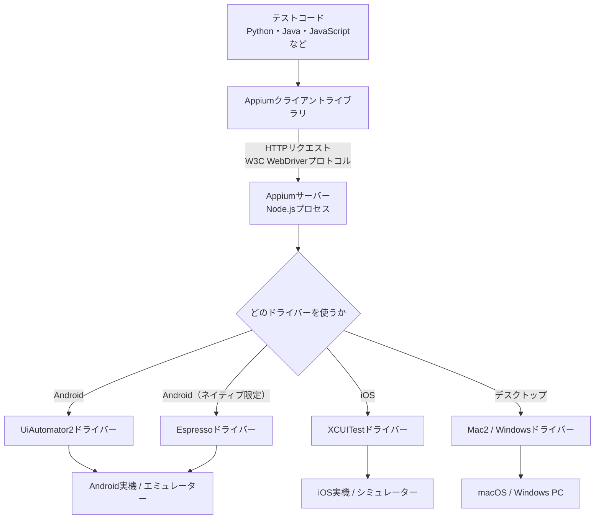
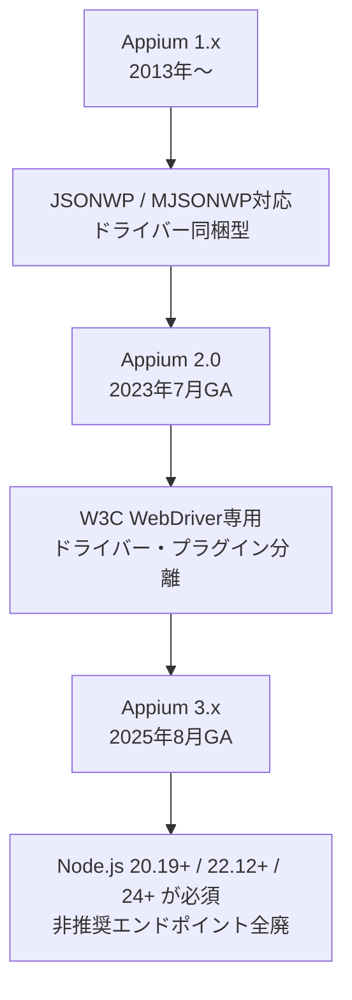
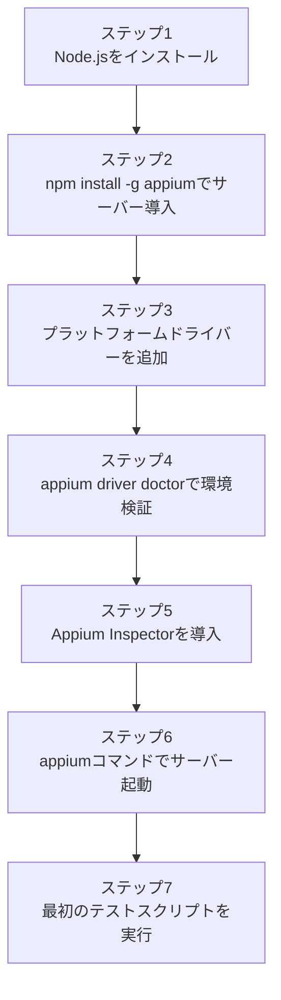
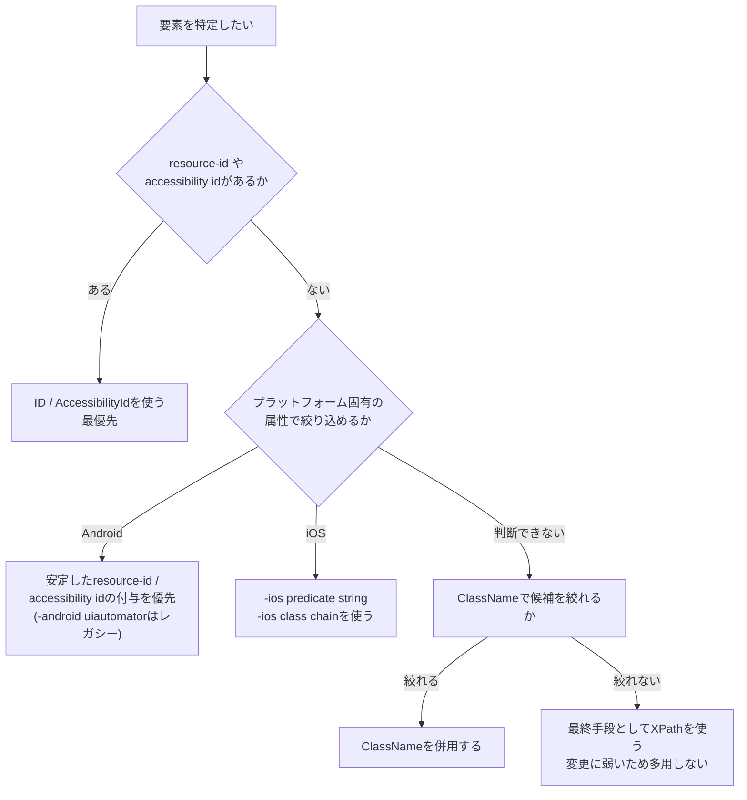
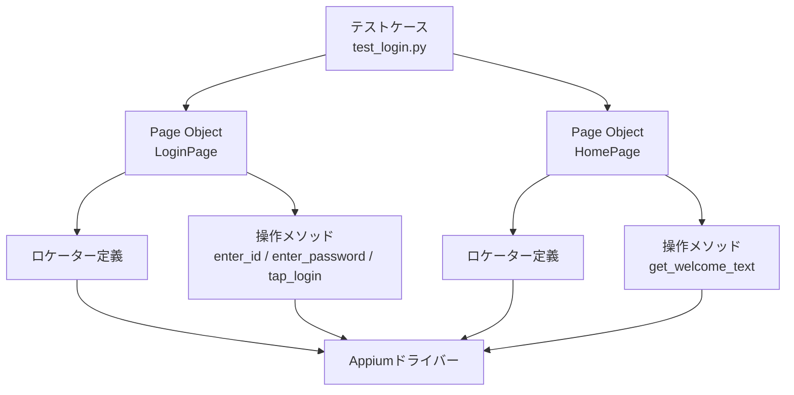
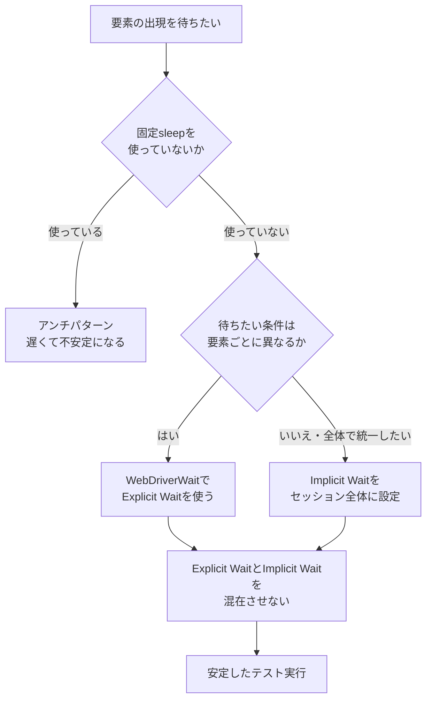
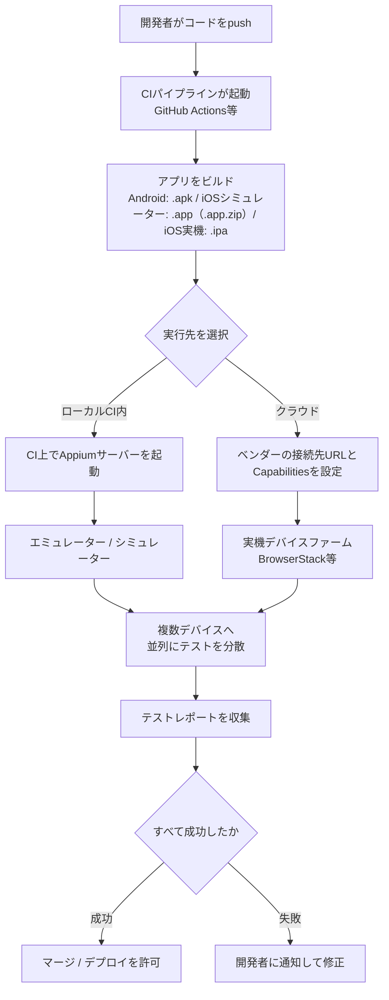

# Appium Essentials 完全ガイド ― モバイルテスト自動化の基礎とベストプラクティス

> 初学者がゼロからAppiumを使えるようになるための、ステップバイステップ解説書です。
> 2026年8月時点の最新情報（Appium 3.x系）に基づいて執筆しています。

---

## 目次

1. [このガイドについて](#このガイドについて)
2. [Appiumとは何か](#appiumとは何か)
3. [Appiumのアーキテクチャを理解する](#appiumのアーキテクチャを理解する)
4. [Appiumのバージョンの歴史と現在地](#appiumのバージョンの歴史と現在地)
5. [環境構築ステップバイステップ](#環境構築ステップバイステップ)
6. [Capabilitiesを理解する](#capabilitiesを理解する)
7. [はじめてのテストを書く](#はじめてのテストを書く)
8. [要素を見つけるロケーター戦略](#要素を見つけるロケーター戦略)
9. [Page Object Modelを実践する](#page-object-modelを実践する)
10. [待機戦略でテストを安定させる](#待機戦略でテストを安定させる)
11. [ジェスチャー操作を自動化する](#ジェスチャー操作を自動化する)
12. [実機・エミュレーター・クラウドデバイスファームでの実行](#実機エミュレータークラウドデバイスファームでの実行)
13. [並列実行とCI/CD統合](#並列実行とcicd統合)
14. [よくあるアンチパターンと落とし穴](#よくあるアンチパターンと落とし穴)
15. [ベストプラクティスチェックリスト](#ベストプラクティスチェックリスト)
16. [まとめ](#まとめ)
17. [参考文献と情報源](#参考文献と情報源)

---

## このガイドについて

このガイドは、モバイルアプリのテスト自動化ツール「Appium」を初めて学ぶ人のために書かれています。想定する読者は次のような人です。

- Selenium（Web自動化）の経験はあるが、モバイル自動化は初めて
- 手動テストからテスト自動化にステップアップしたいQAエンジニア
- Android/iOSアプリの開発者で、UIテストを自分で組みたい人

出発点として、O'Reilly（Packt Publishing）から出版されている書籍『[Appium Essentials](https://www.oreilly.com/library/view/appium-essentials/9781784392482/)』（著者: Manoj Hans、2015年刊）を参照しました。同書はAppiumアーキテクチャ、Desired Capabilities、ロケーター戦略、実機での自動化、ジェスチャー操作といった、Appium学習に必要な骨格となる章立てを持つ良書です。ただし刊行から10年以上が経過しており、当時前提だったAppium 1.x／Selenium JSON Wire Protocolの記述は、現在の主流であるAppium 2.x/3.x系とW3C WebDriverプロトコルの仕様とは異なる点が多くあります。

そこで本ガイドでは、同書が扱っている「概念の骨格」（アーキテクチャ、Capabilities、ロケーター、実機自動化、ジェスチャー）を踏襲しつつ、2026年8月26日時点の公式ドキュメントおよび著名な国際的開発者・企業ブログの情報で内容を全面的にアップデートしています。具体的な出典は末尾の「参考文献と情報源」にまとめています。

---

## Appiumとは何か

Appiumは、ネイティブアプリ・モバイルWebアプリ・ハイブリッドアプリのUIを自動操作するための、オープンソースのテスト自動化フレームワークです。著作権はOpenJS Foundationが保持しており、Apache 2.0ライセンスの下で公開されています。

Appiumの大きな特徴は、Web自動化の標準であるSelenium/WebDriverの資産をそのままモバイルに持ち込んだことです。ブラウザ自動化のために策定された「W3C WebDriverプロトコル」を、Appiumはモバイルやデスクトップの自動化にも採用しています。これにより、Seleniumの経験があるエンジニアは、比較的小さな学習コストでAppiumに移行できます。

Appiumが対応する主なプラットフォームと、それを支える「ドライバー」の対応関係は次の通りです。

| プラットフォーム | 代表的なドライバー | 内部で利用する自動化技術 |
|---|---|---|
| Android（ネイティブ/ハイブリッド） | UiAutomator2 | Google製 UI Automator |
| Android（ネイティブ限定・高速） | Espresso | Google製 Espresso |
| iOS（ネイティブ/ハイブリッド） | XCUITest | Apple製 XCUITest |
| Windowsデスクトップアプリ | Windows Driver（代替候補: NovaWindows） | Microsoft製 WinAppDriver系技術。ただしWinAppDriver自体は2022年以降Microsoftによる保守が停止しているため、保守が継続している NovaWindows ドライバーが代替候補として挙がっている |
| macOSデスクトップアプリ | Mac2 | Apple製 XCTest（macOS版） |
| モバイル/デスクトップWeb | 各ドライバー経由でSafari/Chrome等を制御 | ブラウザベンダー製WebDriver実装 |

ポイントは、Appium本体（サーバー）が自動化の実処理を行っているわけではないということです。実際にOSやアプリを操作しているのは、それぞれのプラットフォームベンダーが提供する自動化技術（UiAutomator、XCUITestなど）であり、Appiumはそれらを統一的なWebDriver APIの背後に「ラップ」しているだけ、というのが正確な理解です。この設計方針により、Appiumは「未改造のアプリをそのまま自動化できる」という強みを持っています。

---

## Appiumのアーキテクチャを理解する

Appiumを使いこなすうえで最初につまずきやすいのが、「サーバー」「クライアント」「ドライバー」という3つの言葉の関係です。ここを最初に整理しておくと、後のトラブルシューティングが格段に楽になります。



それぞれの役割は次の通りです。

- **テストコード**：あなたが書くテストスクリプトそのもの。Python、Java、JavaScript、Rubyなど好きな言語で書けます。
- **Appiumクライアントライブラリ**：あなたのテストコードの命令（「このボタンをタップして」など）を、HTTPリクエストに変換する薄いラッパーです。`Appium-Python-Client`や`java-client`などがこれにあたります。
- **Appiumサーバー**：Node.jsで動くHTTPサーバーです。クライアントからのリクエストを受け取り、適切なドライバーに処理を委譲します。サーバー自体は自動化ロジックを持たず、あくまで「交通整理役」です。
- **ドライバー**：各プラットフォーム固有の自動化を実際に行うモジュールです。UiAutomator2ドライバーであれば内部でGoogleのUiAutomator2をラップしており、XCUITestドライバーであれば内部でAppleのXCUITestをラップしています。

ここで重要なのは、**Appiumサーバーとテストコードは同じマシンで動かす必要がない**という点です。WebDriverプロトコルはネットワーク越しのHTTP通信を前提としているため、テストコードは手元のPCで実行し、Appiumサーバーとデバイスはクラウド上のデバイスファーム（BrowserStackやSauce Labsなど）に置く、という構成が広く使われています。

---

## Appiumのバージョンの歴史と現在地

Appiumは大きく3つの世代に分けられます。バージョンごとの違いを理解しておくと、ネット上の古い記事と最新のドキュメントを見比べたときに混乱しにくくなります。



| バージョン | 主な特徴 | 現在の位置づけ |
|---|---|---|
| Appium 1.x | JSON Wire Protocol（JSONWP）/ Mobile JSONWPをサポート。ドライバーはサーバーに同梱され、`http://localhost:4723/wd/hub`が既定のベースパスだった。 | 2022年1月にコアチームによるサポートが終了。Android 13/iOS 16以降との相性問題があり、新規利用は非推奨。 |
| Appium 2.x | 2023年7月に正式リリース。W3Cプロトコルのみをサポートし、ドライバーとプラグインをサーバー本体から分離。`appium driver install`のような専用CLIでドライバーを個別に管理する方式に変更。カスタムドライバー・プラグインの作成も可能になった。 | 依然として広く使われているが、Appium 3系への移行が進んでいる世代。 |
| Appium 3.x | 2025年8月に正式リリース。Node.jsの対応範囲が`^20.19.0 \|\| ^22.12.0 \|\| >=24.0.0`（20.19.0以上の20系、22.12.0以上の22系、または24.0.0以上）、npm 10以上が必須に。奇数メジャー（21系・23系）は対象外。内部で使うExpressをv4からv5へ更新。過去に非推奨化されていたエンドポイントを完全に廃止し、`adb_shell`のようなセキュリティ関連の機能フラグに`uiautomator2:`のようなベンダープレフィックスが必須になった。 | 2026年8月時点の最新メジャーバージョン系列。パッチバージョンは頻繁に更新されるため、固定値を覚えるのではなく `appium -v` で導入済みバージョンを確認する。 |

Appium 2から3への移行は、Appium 1から2への移行ほど破壊的ではありません。インストール方法自体は変わらず、既存環境に対して`npm install -g appium`を実行すれば上書きアップグレードできます。ただし、Node.jsのバージョンが古い場合は先にNode.js自体をアップグレードする必要があります。

これから新規にAppiumを学ぶのであれば、Appium 3.x系を前提に学習を始めて問題ありません。

---

## 環境構築ステップバイステップ

Appiumの環境構築は「Appium本体」と「テスト対象プラットフォームに応じたドライバー」を別々にインストールする、という2段階の考え方を理解すると迷いません。

> **本リポジトリのBun-only方針に対する例外**：本リポジトリはパッケージ管理・スクリプト実行に Bun を用いる方針ですが、Appium は Node.js `^20.19.0 || ^22.12.0 || >=24.0.0` と npm 10 以上を動作要件として明示しているサーバー実装であり、公式にサポートされる導入手順は `npm` ベースです。したがって **Appium のサーバー・ドライバー・プラグインの管理手順に限り、Node.js / npm の使用を規約上の例外として認めます**。具体的には `npm install -g appium` によるサーバー導入、`appium driver install` によるドライバー管理、`appium plugin install` によるプラグインのインストール、および `--use-plugins` を伴うサーバー起動がこの例外の対象です。この例外は Appium 関連コマンドのみに適用され、本プロジェクト自体のビルド・テストは従来どおり Bun を使用してください。



### ステップ1: Node.jsをインストールする

Appium 3.xはNode.js `^20.19.0 || ^22.12.0 || >=24.0.0`（20.19.0以上の20系、22.12.0以上の22系、または24.0.0以上のいずれか）、npm 10以上を要求します。奇数メジャーである21系・23系はサポート対象外です。まずは公式サイトからLTS版のNode.jsを導入し、バージョンを確認します。

```bash
node -v
npm -v
```

古いNode.jsが入っている場合は、`nvm`（Node Version Manager）などを使って切り替えることをおすすめします。

### ステップ2: Appiumサーバーをインストールする

Appium本体はnpmパッケージとして配布されています。グローバルインストールが一般的です。

```bash
npm install -g appium
appium -v
```

この時点でインストールされるのは「サーバー本体」だけで、Android用・iOS用のドライバーはまだ何も入っていません。Appium 2.x以降は、ドライバーを必要な分だけ個別に追加する設計になっています。

### ステップ3: プラットフォームドライバーを追加する

テスト対象に応じて、必要なドライバーを`appium driver`サブコマンドでインストールします。

```bash
# Androidを自動化する場合
appium driver install uiautomator2

# iOSを自動化する場合（macOSが必要）
appium driver install xcuitest

# 現在インストール済みのドライバーを確認する
appium driver list --installed
```

Android向けにはAndroid SDK（Android Studio経由でのインストールが簡単）、iOS向けにはXcodeとCommand Line Toolsなど、ドライバーごとに追加の前提ソフトウェアが必要です。これらはドライバーの公式ドキュメントに従って個別に用意します。

### ステップ4: 環境をセルフチェックする

Appium 1.x時代は`appium-doctor`という独立パッケージで環境診断していましたが、現在はAppium本体に統合された`driver doctor`サブコマンドを使います。

診断はドライバー単位で行うため、**ステップ3でインストールしたドライバーに対してのみ**実行します。未インストールのドライバーを指定するとエラーになります。

```bash
# uiautomator2 をインストールしている場合のみ
appium driver doctor uiautomator2

# xcuitest をインストールしている場合のみ（macOS）
appium driver doctor xcuitest
```

不足しているSDKや環境変数があれば、ここで警告として表示されます。

### ステップ5: Appium Inspectorを導入する

Appium Inspectorは、アプリの画面キャプチャを見ながら要素のロケーター情報（IDやXPathなど）を確認できるGUIツールです。Appiumサーバーとは別のデスクトップアプリとして配布されており、要素の特定にかかる試行錯誤の時間を大幅に短縮してくれます。公式リポジトリからOS別のインストーラーをダウンロードして使用します。

### ステップ6・7: サーバーを起動し、最初のテストを動かす

```bash
appium --address 127.0.0.1
```

`http://127.0.0.1:4723`でサーバーが起動します（Appium 1.x時代のような`/wd/hub`パスは不要になっています）。サーバーが起動したら、次章以降で作成するテストスクリプトを実行して疎通確認を行います。

Appiumサーバーの既定の待受アドレスは、Appium 2.x／3.xともに`0.0.0.0`です。起動しただけで同一ネットワーク上の他ホストからサーバーへ到達できてしまううえ、Appiumサーバー自体は認証機構を持ちません。ローカル開発では上記のように`--address 127.0.0.1`を明示し、ループバックに限定してください。

なお、ファイル操作やシェル実行に相当する「安全でない機能」は既定では無効化されており、利用するには`--allow-insecure`（機能を個別に許可）または`--relaxed-security`（まとめて緩和）の指定が必要です。Appium 3.xでは`--allow-insecure`に渡す機能名にドライバーの指定が必須となり、`uiautomator2:adb_shell`のように`<ドライバー名>:<機能名>`の形式で記述します。

CIやデバイスファームなど**リモートから接続する必要がある場合**は、次を満たした上で公開します。

- 接続元の制限はAppium単体では行えないため、VPN・ファイアウォール（ソースIP制限）・認証付きリバースプロキシのいずれかで到達可能な範囲を絞る。`--relaxed-security`や`--allow-insecure`は原則として有効化しない（必要な機能だけを個別に許可する）。
- サーバーを直接インターネットに公開せず、VPNまたは信頼済みネットワーク内に閉じる。
- 外部からアクセスさせる場合はTLSで暗号化する。Appiumサーバー自体は`--ssl-cert-path`と`--ssl-key-path`を指定することで`https://`を直接提供できる。ただしAppiumは認証機構を持たないため、認証が必要な場合はBasic認証やmTLSを設定したリバースプロキシを前段に置く構成にする。

---

## Capabilitiesを理解する

Capabilities（能力）は、Appiumセッションを開始する際に「どのプラットフォームの」「どのアプリを」「どのドライバーで」自動化するかをサーバーに伝えるための設定値です。書籍『Appium Essentials』ではこれを「Desired Capabilities」と呼んでいますが、この呼び方と実装形式はAppium 2.x以降で大きく変わっています。

### 何が変わったのか

Appium 1.x時代は、`deviceName`や`app`のようなキーをそのままフラットに並べるだけで動作しました。しかしAppium 2.x以降はW3C WebDriver仕様に準拠したため、標準仕様にないキー（Appium独自の拡張capability）には「ベンダープレフィックス」を付けることが必須になりました。多くの場合、そのプレフィックスは`appium:`です。

| 世代 | 記述例 | 備考 |
|---|---|---|
| Appium 1.x（旧式） | `{"deviceName": "Pixel 6", "app": "/path/app.apk"}` | プレフィックスなしでも動作した |
| Appium 2.x/3.x（現行） | `{"platformName": "Android", "appium:deviceName": "Pixel 6", "appium:automationName": "UiAutomator2", "appium:app": "/path/app.apk"}` | `platformName`など一部のW3C標準capability以外には`appium:`が必要 |
| Appium 2.x/3.x（まとめ記法） | `appium:options`オブジェクトの中に`deviceName`や`automationName`をまとめて指定 | 個々のキーへのプレフィックス付与を省略できる |

また、Appium 1.xでは「iOSなら自動的にXCUITestが使われる」「Androidなら自動的にUiAutomator2が使われる」といった暗黙のデフォルトがありましたが、Appium 2.x以降はこの暗黙デフォルトが廃止され、`automationName`を必ず明示する必要があります。

### コード例（Python）

```python
from appium.options.android import UiAutomator2Options

options = UiAutomator2Options()
options.platform_name = "Android"
options.automation_name = "UiAutomator2"
options.device_name = "Pixel_7_API_34"
# avd と udid は排他。どちらか一方だけを指定する
# ここでは avd を有効にし、エミュレーターをAVD名から起動して使う
options.avd = "Pixel_7_API_34"
# 実機、または既に起動済みのエミュレーターに接続する場合は、
# 上の avd を指定せず、代わりに udid を指定する
# options.udid = "emulator-5554"   # adb devices で確認できるID
options.app = "/path/to/your/app.apk"
# テスト間の独立性を確保するため、アプリのデータを毎回初期化する
options.full_reset = True
```

### コード例（Java）

```java
import io.appium.java_client.android.options.UiAutomator2Options;

UiAutomator2Options options = new UiAutomator2Options();
options.setPlatformName("Android");
options.setAutomationName("UiAutomator2");
options.setDeviceName("Pixel_7_API_34");
// エミュレーターを起動して使う場合は setAvd() でAVD名を指定する
options.setAvd("Pixel_7_API_34");
// 実機、または既に起動済みのエミュレーターに接続する場合は setUdid() を指定する
// options.setUdid("emulator-5554");   // adb devices で確認できるID
options.setApp("/path/to/your/app.apk");
// テスト間の独立性を確保するため、アプリのデータを毎回初期化する
options.setFullReset(true);
```

このように、Appium 2系以降の公式クライアントライブラリには`UiAutomator2Options`や`XCUITestOptions`といった型安全なオプションクラスが用意されており、キー名のタイプミスを防ぎながらCapabilitiesを組み立てられます。

### 対象デバイスの指定方法に注意する

`deviceName`は、Appiumが実際に接続先デバイスを決めるための一意なキーではありません。ローカル環境（開発マシンやセルフホストのCIランナー）でAndroidの対象を確実に指定するには、次のどちらかを併用します。

| 状況 | 使用するcapability | 説明 |
|---|---|---|
| エミュレーターをAppiumに起動させる | `appium:avd`（Java: `setAvd()`） | AVD Managerで作成したAVD名を指定する。該当のエミュレーターが起動していなければAppiumが自動的に起動する。 |
| 実機、または起動済みのエミュレーターに接続する | `appium:udid`（Java: `setUdid()`） | `adb devices`で表示されるデバイスIDを指定する。複数端末が接続されている環境では必須。 |

`deviceName`だけに頼ると、複数のデバイスやエミュレーターが接続されている環境で意図しない端末が選ばれることがあります。ローカル実行や並列実行の環境では、必ず`avd`か`udid`で対象を明示してください。

一方、**クラウドの実機デバイスファームでは`avd`や`udid`による端末指定は使えません**。`avd`はAppiumが自分でエミュレーターを起動する前提の設定であり、`udid`もベンダー側が管理する端末プールに対しては指定できないためです。クラウド実行では、どの端末で走らせるかを各ベンダーが定める形式のCapabilitiesで指定します（例：BrowserStackもSauce Labsも、端末とOSの選択はトップレベルの`appium:deviceName`／`appium:platformVersion`で行い、`bstack:options`／`sauce:options`にはアカウント情報やビルド名といったベンダー固有の設定のみを入れます）。キー名も、指定できる端末名・OSバージョンの表記もベンダーごとに異なるため、各社のデバイス一覧ドキュメントに従ってください。

### リセット系capabilityとテストの独立性

`noReset`を`true`にすると、セッション開始時にアプリのデータが初期化されず、前のテストが残したログイン状態やキャッシュを引き継ぎます。これは実行時間を短縮できる反面、テストの実行順序に依存する不安定なテストを生みやすく、本ガイドが後述する「テストの独立性を保つ」という方針と衝突します。

したがって、既定では`fullReset`（セッションの前後でアプリのアンインストールと再インストールを行う設定）を使うか、テストのセットアップ／ティアダウンでアプリ固有のクリーンアップを明示的に行ってください。なお`fullReset`は「あらゆるデータが必ず消える」ことを保証する設定ではありません。特にXCUITest（iOS）の実機では、アプリを再インストールしてもキーチェーンや共有コンテナに保存されたデータが残る場合があります。その場合は`mobile: removeApp`による明示的な削除や、アプリ固有のクリーンアップ手段（テスト用APIによるデータリセットなど）を併用してください。ただし`fullReset`は再インストール元となる`appium:app`（APK／IPAのパス）が指定されている場合にのみ使用できます。`appium:appPackage`だけで端末にプリインストール済みのアプリを対象にしている場合は、アンインストール後に再インストールする手段がないため`fullReset`を使ってはいけません。この場合は後述の`mobile: clearApp`か、アプリ固有のクリーンアップ手段を使ってください。ここで注意したいのは、`driver.terminate_app()`と`driver.activate_app()`の組み合わせは**アプリのプロセスを停止して起動し直すだけ**であり、保存済みのデータや認証情報は消えないという点です。データそのものを初期化したい場合は、`fullReset`による再インストール、Androidであれば`mobile: clearApp`（アプリのデータ削除）、あるいはテスト用APIによるデータリセットといった手段を別途使い分けてください。UiAutomator2の`mobile: clearApp`は、対象アプリが**インストール済みかつ停止済み**の状態でのみ実行でき、パッケージ名は`appId`引数で渡す必要があります。したがって、次のようにアプリを終了させてから呼び出します。

```python
# 対象アプリのパッケージ名を変数にまとめておく
app_id = "com.example.myapp"

# プロセス停止 → データ削除の順に実行する
driver.terminate_app(app_id)
driver.execute_script("mobile: clearApp", {"appId": app_id})
```

`noReset`は、初期化コストが極端に高くテスト間で状態を共有しても安全だと確認できた場合に限り、理由をコメントに残したうえで使用します。

---

## はじめてのテストを書く

ここでは、Androidアプリに対してAppiumセッションを開始し、要素を1つ操作するだけの最小構成のテストを、PythonとJavaそれぞれで見てみます。

### Python版（pytest + Appium-Python-Client）

```python
import pytest
from appium import webdriver
from appium.options.android import UiAutomator2Options
from appium.webdriver.common.appiumby import AppiumBy
from selenium.webdriver.support.ui import WebDriverWait
from selenium.webdriver.support import expected_conditions as EC


@pytest.fixture
def driver():
    options = UiAutomator2Options()
    options.platform_name = "Android"
    options.device_name = "Pixel_7_API_34"
    options.automation_name = "UiAutomator2"
    options.app = "/path/to/your/app.apk"
    # 対象デバイスを明示する（前述のとおりdevice_nameだけでは一意に決まらない）
    # エミュレーターをAppiumに起動させる場合:
    options.avd = "Pixel_7_API_34"
    # 実機や起動済みエミュレーターに接続する場合は、avdの代わりにudidを指定する:
    # options.udid = "emulator-5554"  # adb devices で確認したデバイスID

    drv = webdriver.Remote("http://127.0.0.1:4723", options=options)
    yield drv
    drv.quit()


def test_login_screen_shows_header(driver):
    wait = WebDriverWait(driver, 10)
    header = wait.until(
        EC.visibility_of_element_located((AppiumBy.ACCESSIBILITY_ID, "login_header"))
    )
    assert header.text == "ログイン"
```

### Java版（TestNG）

```java
import io.appium.java_client.AppiumBy;
import io.appium.java_client.android.AndroidDriver;
import io.appium.java_client.android.options.UiAutomator2Options;
import org.openqa.selenium.WebElement;
import org.openqa.selenium.support.ui.ExpectedConditions;
import org.openqa.selenium.support.ui.WebDriverWait;
import org.testng.Assert;
import org.testng.annotations.*;

import java.net.URL;
import java.time.Duration;

public class LoginScreenTest {
    private AndroidDriver driver;

    @BeforeMethod
    public void setUp() throws Exception {
        UiAutomator2Options options = new UiAutomator2Options();
        options.setPlatformName("Android");
        options.setDeviceName("Pixel_7_API_34");
        options.setAutomationName("UiAutomator2");
        options.setApp("/path/to/your/app.apk");
        // 対象デバイスを明示する（deviceNameだけでは一意に決まらない）
        // エミュレーターをAppiumに起動させる場合:
        options.setAvd("Pixel_7_API_34");
        // 実機や起動済みエミュレーターに接続する場合は、setAvd()の代わりにsetUdid()を使う:
        // options.setUdid("emulator-5554");  // adb devices で確認したデバイスID

        driver = new AndroidDriver(new URL("http://127.0.0.1:4723"), options);
    }

    @Test
    public void loginScreenShowsHeader() {
        WebDriverWait wait = new WebDriverWait(driver, Duration.ofSeconds(10));
        WebElement header = wait.until(
            ExpectedConditions.visibilityOfElementLocated(AppiumBy.accessibilityId("login_header"))
        );
        Assert.assertEquals(header.getText(), "ログイン");
    }

    @AfterMethod
    public void tearDown() {
        if (driver != null) {
            driver.quit();
        }
    }
}
```

両言語のコードで共通しているポイントは次の3つです。

1. `UiAutomator2Options`のような型安全なオプションクラスでCapabilitiesを組み立てている
2. セッション開始後は必ず`quit()`でセッションを終了している（後片付けを忘れるとデバイス/エミュレーターのリソースを圧迫します）
3. 要素の取得は固定`sleep`ではなく、後述する明示的な待機（Explicit Wait）で行っている

---

## 要素を見つけるロケーター戦略

Appiumのテストが壊れる最大の原因は、多くの場合「不安定なロケーター」です。著名なAppiumプロジェクトの開発者であるJonathan Lipps氏も、Appiumテストが不安定になる要因の多くは、フレームワーク自体の問題ではなく、待機処理の不備や壊れやすいロケーターの選び方に起因すると指摘しています。ロケーター戦略の優先順位を理解しておくことが、保守しやすいテストへの近道です。



### 主なロケーター戦略の比較

| ロケーター戦略 | 対応プラットフォーム | 特徴・推奨度 |
|---|---|---|
| ID（resource-id） | Android | ネイティブのID属性を利用。高速かつ安定。最優先候補。 |
| Accessibility ID | Android / iOS | アクセシビリティラベルを利用。クロスプラットフォームで同じ書き方ができ、テストコードの再利用性が高い。最優先候補。 |
| `-android uiautomator` | Android | UiAutomatorのUiSelectorをそのまま文字列で渡せる。複雑な条件での絞り込みに強いが、UI階層や表示文言の変更に追随しづらいレガシーな選択肢。まずはresource-idやaccessibility idを付与してもらう方向で解決し、それが難しい場合の代替手段とする。 |
| `-ios predicate string` | iOS | NSPredicateベースの柔軟な条件指定。iOS版XPathの代替として推奨される。 |
| `-ios class chain` | iOS | XPathとpredicate stringのハイブリッド的な記法。階層的な問い合わせをXPathより高速に処理できる。 |
| ClassName | Android / iOS | UI部品の型（ボタン、テキストフィールドなど）で絞り込む。単独では要素を一意に特定しにくいことが多い。 |
| XPath | Android / iOS | 最も柔軟だが、DOM階層のわずかな変更にも弱く、実行速度も他の戦略より遅い傾向がある。他の戦略で特定できない場合の最終手段とするのが定石。 |
| Image（テンプレート画像） | Android / iOS | 画像テンプレートとのマッチングで要素を特定する。**Appium 2.x以降ではドライバー標準の機能ではなく、別途Imagesプラグインの導入が必要**（下記参照）。他の戦略が使えない特殊なケース向けで、解像度やUIの見た目の変化に弱くテストが不安定になりやすい。 |

### Imageロケーターを使う場合のみ必要な追加セットアップ

`-image`ロケーター戦略は、Appium 2.xでコア機能からプラグインとして分離されました。`uiautomator2`や`xcuitest`といったドライバーを入れただけでは利用できず、`-image`を使うテストがある場合に限り、次の追加セットアップを行います。他のロケーター戦略しか使わないのであれば、前章のドライバー導入手順だけで十分です。

```sh
# 1. Imagesプラグインをインストールする（-image を使う場合のみ）
appium plugin install images

# 2. インストール済みプラグインを確認する
appium plugin list --installed

# 3. プラグインを有効にしてサーバーを起動する（認証を持たないため接続元をループバックに限定する）
appium --use-plugins=images --address 127.0.0.1
```

プラグインは明示的に有効化しないと読み込まれません。手順3の`--use-plugins=images`を忘れると、テスト実行時に`-image`ロケーターが未知の戦略として拒否されます。複数のプラグインを同時に使う場合は`--use-plugins=images,other-plugin`のようにカンマ区切りで指定します。指定できるのは`appium plugin install`でインストール済みのプラグインだけです。

要素を実際に調べる際は、前章で紹介したAppium Inspectorを使い、画面をキャプチャしながらresource-idやaccessibility idの有無を確認するのが最も効率的です。アプリ開発チームと連携し、主要なUI部品にaccessibility idやresource-idを付与してもらう「テスト容易性の作り込み」も、長期的には非常に効果の高い施策です。

---

## Page Object Modelを実践する

テストが増えてくると、「同じ画面のロケーターが複数のテストファイルに散らばる」という問題が起きます。あるボタンのIDがアプリの改修で変わっただけで、数十個のテストファイルを直さなければならない、という状況です。これを防ぐデザインパターンがPage Object Model（POM）です。

POMの考え方はシンプルです。画面（ページ）ごとに1つのクラスを作り、その画面に関するロケーターと操作メソッドをそのクラスの中に閉じ込めます。テストコード側は「ログインページでIDとパスワードを入力してログインボタンを押す」という意図だけを書き、実際にどのロケーターでどう操作するかはPage Objectクラスに任せます。



### コード例（Python）

```python
from appium.webdriver.common.appiumby import AppiumBy
from selenium.webdriver.support.ui import WebDriverWait
from selenium.webdriver.support import expected_conditions as EC


class LoginPage:
    ID_FIELD = (AppiumBy.ACCESSIBILITY_ID, "login_id_field")
    PASSWORD_FIELD = (AppiumBy.ACCESSIBILITY_ID, "login_password_field")
    LOGIN_BUTTON = (AppiumBy.ACCESSIBILITY_ID, "login_submit_button")

    def __init__(self, driver):
        self.driver = driver
        self.wait = WebDriverWait(driver, 10)

    def enter_id(self, user_id: str):
        field = self.wait.until(EC.visibility_of_element_located(self.ID_FIELD))
        field.send_keys(user_id)
        return self

    def enter_password(self, password: str):
        field = self.wait.until(EC.visibility_of_element_located(self.PASSWORD_FIELD))
        field.send_keys(password)
        return self

    def tap_login(self):
        button = self.wait.until(EC.element_to_be_clickable(self.LOGIN_BUTTON))
        button.click()
        return self
```

テストコード側は次のようにシンプルになります。

```python
def test_successful_login(driver):
    login_page = LoginPage(driver)
    login_page.enter_id("demo_user").enter_password("demo_pass").tap_login()
```

POMを導入する効果は次の3点に集約されます。

1. **保守性**：UI変更があってもPage Objectクラス1箇所を直せばよい
2. **可読性**：テストコードが「業務シナリオ」の記述に集中できる
3. **再利用性**：複数のテストシナリオで同じ画面操作を使い回せる

また、Android/iOSで同じユーザーシナリオを検証する場合、Page Objectの内部実装（ロケーターの種類など）だけをプラットフォームごとに分岐させ、テストシナリオ本体はプラットフォームに依存しないコードとして共通化する、という設計も広く採用されています。

---

## 待機戦略でテストを安定させる

モバイルアプリはネットワーク通信やアニメーションを伴うことが多く、画面遷移や要素の表示に時間差が生じます。この時間差を正しく吸収できないと、テストは「たまに失敗する」不安定な状態（Flaky Test）に陥ります。



### Implicit WaitとExplicit Waitの違い

| 項目 | Implicit Wait（暗黙的待機） | Explicit Wait（明示的待機） |
|---|---|---|
| 適用範囲 | セッション全体に一律で適用される | 個々の要素・条件ごとに個別指定できる |
| 柔軟性 | 低い（すべての検索に同じ時間がかかる） | 高い（可視性・クリック可能性など条件を選べる） |
| 向いている場面 | アプリ全体でおおよそ同じ応答速度が期待できる小規模なテスト | 画面ごとに読み込み時間が大きく異なる実務的なテストスイート |
| 注意点 | Explicit Waitと併用すると待機時間が予測できなくなるため、基本的にどちらか一方に統一する |Explicit Waitを使う場合はImplicit Waitを0にしておくのが定石 |

現場のノウハウとして広く共有されているのが、「固定の`sleep`は使わない」という原則です。`sleep(5)`のようなハードコードされた待機は、通信が速いときには無駄に時間を浪費し、通信が遅いときにはタイムアウトしてテストが失敗する、という両方向のデメリットしかありません。Explicit Waitで「特定の状態になるまで、最大N秒だけポーリングする」という書き方にすることで、平均実行時間の短縮とテストの安定化を同時に達成できます。

### Explicit Waitのコード例（Python）

```python
from selenium.webdriver.support.ui import WebDriverWait
from selenium.webdriver.support import expected_conditions as EC
from appium.webdriver.common.appiumby import AppiumBy

wait = WebDriverWait(driver, 15, poll_frequency=0.5)
element = wait.until(
    EC.visibility_of_element_located((AppiumBy.ACCESSIBILITY_ID, "checkout_button"))
)
element.click()
```

ImplicitとExplicitのWaitを同一セッション内で混在させると、「Explicit Waitのポーリングのたびに、内部的なfindElement呼び出しにImplicit Waitの待機時間が上乗せされる」といった、直感に反する遅延が発生することが実務でも報告されています。どちらか一方の戦略に統一することを強くおすすめします。

---

## ジェスチャー操作を自動化する

スワイプ・スクロール・ロングタップ・ピンチといったタッチジェスチャーは、モバイルアプリのテストにおいて避けて通れません。Appiumは、W3C WebDriver仕様で定義された「Actionsクラス」（複数の入力ポインターを組み合わせて任意のジェスチャーを合成できる低レベルAPI）と、各ドライバーが独自に提供する`mobile:`名前空間の高レベルコマンドの、2種類の方法でジェスチャーを実現します。

初学者には、まず各ドライバー標準の`mobile:`コマンドを使うことをおすすめします。W3C Actions APIは非常に柔軟な反面、複雑なジェスチャーを一から組み立てる必要があり、学習コストが高いためです。

### 代表的な `mobile:` ジェスチャーコマンド

| ジェスチャー | Android（UiAutomator2） | iOS（XCUITest） |
|---|---|---|
| タップ | `mobile: clickGesture` | 標準の`click()`で代用可能 |
| ロングプレス | `mobile: longClickGesture` | `mobile: touchAndHold` |
| スワイプ | `mobile: swipeGesture` | `mobile: swipe` |
| スクロール | `mobile: scrollGesture` | `mobile: scroll` |
| ドラッグ＆ドロップ | `mobile: dragGesture` | `mobile: dragFromToForDuration` |
| ピンチ（拡大縮小） | `mobile: pinchOpenGesture` / `mobile: pinchCloseGesture` | `mobile: pinch` |

### コード例（Python・Android）

```python
driver.execute_script("mobile: scrollGesture", {
    "left": 100, "top": 300, "width": 200, "height": 800,
    "direction": "down",
    "percent": 1.0,
})

driver.execute_script("mobile: swipeGesture", {
    "left": 100, "top": 800, "width": 200, "height": 400,
    "direction": "up",
    "percent": 0.75,
})
```

`left`・`top`・`width`・`height`でジェスチャーを行う矩形領域を指定し、`direction`と`percent`（その領域に対する移動量の割合）で動きを制御する、という設計になっています。座標を直接ハードコードするのではなく、対象要素の`elementId`を渡すオプションも用意されており、画面サイズの異なる端末間でも同じロジックを再利用しやすくなっています。

W3C Actions APIは、ドライバー標準のジェスチャーコマンドでは表現できない特殊な複合入力（マルチタッチでの複雑な同時操作など）が必要になったときの、より汎用的な選択肢として押さえておくとよいでしょう。

---

## 実機・エミュレーター・クラウドデバイスファームでの実行

Appiumのテストは、大きく分けて3つの環境で実行できます。それぞれにトレードオフがあります。

| 実行環境 | メリット | デメリット |
|---|---|---|
| エミュレーター（Android）/ シミュレーター（iOS） | 無料。CI環境に組み込みやすい。起動・リセットが速い。 | 実機特有の挙動（カメラ、センサー、通知、キャリア差異など）を再現しきれない。 |
| 手元の実機 | 実際のハードウェア挙動を検証できる。 | 保有台数に限りがあり、OSバージョンや機種のカバレッジを増やしにくい。USB接続の管理コストもかかる。 |
| クラウド実機デバイスファーム | 数百〜数千台規模の実機・OSバージョンの組み合わせに、必要なときだけアクセスできる。CI/CDとの統合機能が充実している。 | 利用料金がかかる。ネットワーク越しの実行になるため、通信環境に依存する部分がある。 |

クラウド型の実機デバイスファームは、BrowserStack App Automate、Sauce Labs、TestMu AI（旧LambdaTest）、Kobitonなど複数のベンダーが提供しています。いずれもAppiumクライアントの接続先URLとCapabilitiesを変更するだけで、既存のテストコードをほぼそのまま実機クラウドに向けて実行できる点が共通しています。多くのベンダーがGitHub ActionsやJenkinsといった主要CIツールとの連携も公式にサポートしています。

ただし「接続先URLとCapabilitiesを変えるだけ」と言っても、**アプリ本体の指定方法だけはローカル実行と同じにはできません**。本ガイドのこれまでの例で使ってきた`options.app = "/path/to/your/app.apk"`（Python）や`options.setApp("/path/to/your/app.apk")`（Java）のようなローカルファイルパスは、CIマシン上のパスを指しています。クラウド実行ではAppiumサーバーがベンダー側で動いているため、CIマシンのローカルパスは解決できず、セッション開始時に失敗します。クラウドでは次のいずれかの方法でアプリを配置します。

- **事前アップロードしてアプリIDを指定する（推奨）**：CIのビルドステップで生成したAPK／IPAを、ベンダーのREST APIまたはCLIでアップロードし、返却されたアプリIDを`appium:app`に指定する。IDの形式はベンダーごとに異なり、BrowserStackは`bs://<hash>`、Sauce Labsは`storage:<file-id>`といった独自スキームを用いる。Sauce Labsにはファイル名で参照する`storage:filename=<name>`という形式もあるが、同名のファイルは最後にアップロードされたものへ解決されるため、`app.apk`のような固定名のままでは並列実行中の別ジョブがアップロードしたビルドを掴んでしまうおそれがある。**ファイル名で参照する場合は`app-<commit-sha>.apk`のようにビルドごと（またはジョブごと）に一意な名前を付け、確実性を優先するならアップロード時に返る`<file-id>`を直接指定してください。** 多くのベンダーはビルド名やカスタムIDによる再利用にも対応しているため、意図的に同じビルドを複数ジョブから参照させることもできる。
- **Appiumサーバーから到達可能なアプリURLを指定する**：アーティファクトストレージ上のAPK／IPAを、ベンダー側から取得できる公開URLまたは署名付きURLとして`appium:app`に渡す。社内ネットワーク内のURLは到達できないため、この方式を使う場合は外部から取得可能であることが前提になる。

```python
# ローカル実行: CIマシン上のパス
options.app = "/path/to/your/app.apk"

# クラウド実行: 事前アップロードで得たアプリID、または到達可能なURL
options.app = "bs://<uploaded-app-hash>"          # BrowserStackの例
# options.app = "storage:8b0e1a3c-..."             # Sauce Labsの例（アップロードで得たfile-id）
# options.app = "storage:filename=app-<commit-sha>.apk"  # 名前で参照する場合はビルドごとに一意にする
# options.app = "https://example.com/builds/app.apk"  # URL指定の例
```

あわせて、クラウド実行では次の2点の設定も必要になります。

- **認証情報**：ベンダーが発行するユーザー名とアクセスキーは、**接続先URLではなくベンダー固有のCapabilitiesで渡すことを既定とします**（BrowserStackなら`bstack:options`の`userName`／`accessKey`、Sauce Labsなら`sauce:options`の`username`／`accessKey`）。接続先URLは`https://hub.<vendor>.com/wd/hub`のように資格情報を含まない形にしておけば、URL自体をログやCI設定にそのまま出しても安全です。URLへの埋め込み形式（`https://<user>:<accessKey>@hub.<vendor>.com/wd/hub`）は、ツールの制約でCapabilities経由の指定ができない場合に限って使い、その際は**実行時に環境変数から組み立てて**リポジトリに残さないようにします。**いずれの場合も値はCIのシークレット管理機能（GitHub ActionsのSecretsなど）から環境変数として注入し、テストコードやリポジトリにハードコードしないでください。** あわせて、接続先URLやCapabilitiesをログ・レポート・失敗時のスタックトレースへ出力する箇所ではアクセスキーをマスクします（自前のログ出力では`accessKey`相当の値を`***`へ置換する、CIのシークレットは`add-mask`等でマスク登録する、`--verbose`系のHTTPトレースを本番CIで有効にしない、といった対策を組み合わせます）。
- **ベンダー固有Capabilities**：セッション名・ビルド名、ログや画面録画の取得可否、社内環境へアクセスするためのローカルトンネルの有効化といった設定は、W3C標準ではなくベンダー独自の名前空間（`bstack:options`、`sauce:options`など）にまとめて指定します。名前空間ごと差し替えれば済むよう、これらの設定は共通のCapabilities組み立て処理に切り出しておくと、ローカル／クラウドの切り替えが容易になります。

実務でよく採用される方針は、「開発中のスモークテストはローカルのエミュレーター/シミュレーターで高速に回し、リリース前の網羅的な回帰テストはクラウド実機デバイスファームで多機種並列実行する」という、フェーズに応じた使い分けです。

---

## 並列実行とCI/CD統合

Appiumのテストを1台のデバイスで直列に実行していると、テストケースが増えるほどフィードバックが遅くなります。複数のデバイス（エミュレーターや実機ファーム）に対してテストを並列分散させることで、実行時間を大幅に短縮できます。



ビルド成果物は実行環境ごとに形式が異なります。Androidの実機・エミュレーターには`.apk`、iOSシミュレーターには`.app`（クラウド実行では`.app.zip`に圧縮したもの）、iOS実機には`.ipa`を`appium:app`へ渡します。なお、Google Playへの配信形式であるAndroid App Bundle（`.aab`）はAppiumへ直接渡せません。`.aab`を扱う場合は、CIのビルド後に[bundletool](https://developer.android.com/tools/bundletool)で`.apks`を生成する変換手順をパイプラインへ組み込んでください。

このとき、**`--mode=universal`ではなくテスト対象デバイスのデバイススペックを指定して`.apks`を生成し、その`.apks`をそのまま`appium:app`へ渡す**ことを推奨します。ユニバーサルAPKは単一ファイルにまとまる反面、実際に端末へ配信される分割APKの組み合わせとは異なる構成になるため、本番配信時と違う状態でテストしてしまう恐れがあります。`bundletool get-device-spec`で接続中のデバイス（実機・エミュレーター）のスペックを取得し、`build-apks --device-spec`でそのデバイス向けの分割APK群を生成すれば、実際に配信されるのと同じ分割APK（インストール時に配信されるモジュールを含む）で検証できます。`build-apks`では入力の`.aab`を`--bundle`で、出力の`.apks`を`--output`で指定します。UiAutomator2ドライバーは`.apks`を受け取ると内部で分割APKをまとめてインストールするため、`.apks`から`universal.apk`を取り出す必要はありません（この処理にはCI上のPATHから`bundletool`が解決できる必要があります）。

オンデマンド配信のDynamic Feature Moduleは、上記の`--device-spec`で生成した`.apks`には初期インストール対象として含まれません。オンデマンドモジュールの取得・動作まで検証したい場合は、通常のデバイス向けAPK生成手順とは分けて、`bundletool build-apks --local-testing`で`.apks`を生成し、`bundletool install-apks`で対象端末へインストールする流れを使います。`--local-testing`を付けると分割APKが端末のローカル領域へ配置され、Play Feature Deliveryによるオンデマンド取得をストアからの配信なしでローカル検証できます。

```bash
# 0) 失敗を握りつぶさないようフェイルファストにする
set -euo pipefail

# 端末ごとに成果物を分離する（並列実行時に device-spec / .apks が混ざらないようにする）
#   DEVICE_ID: 対象端末のシリアル（`adb devices` で確認できる値）
DEVICE_ID="${DEVICE_ID:?対象端末のシリアル（adb devices の値）を指定してください}"
OUT_DIR="build/${DEVICE_ID}"
mkdir -p "$OUT_DIR"

# 1) テスト対象デバイス（接続中の実機 / 起動中のエミュレーター）のスペックを取得する
bundletool get-device-spec \
  --device-id="$DEVICE_ID" \
  --output="$OUT_DIR/device-spec.json" \
  --overwrite

# 2) 署名オプションを組み立てる
#    4つのシークレットは「すべて設定」か「すべて未設定」のいずれかでなければならない
#    （すべて未設定なら bundletool が既定のデバッグ署名鍵で署名する）
SIGNING_ARGS=()
CLEANUP_FILES=()
if [ -n "${ANDROID_KEYSTORE_PATH:-}" ] \
  && [ -n "${ANDROID_KEYSTORE_PASSWORD:-}" ] \
  && [ -n "${ANDROID_KEY_ALIAS:-}" ] \
  && [ -n "${ANDROID_KEY_PASSWORD:-}" ]; then
  # パスワードは引数ではなくパーミッションを絞った一時ファイル経由で渡す
  # （プロセス一覧やCIのコマンドエコーへ露出させないため）
  KS_PASS_FILE="$(mktemp)"; KEY_PASS_FILE="$(mktemp)"
  chmod 600 "$KS_PASS_FILE" "$KEY_PASS_FILE"
  CLEANUP_FILES=("$KS_PASS_FILE" "$KEY_PASS_FILE")
  # ジョブが途中で失敗しても削除されるようにしておく
  trap 'rm -f "${CLEANUP_FILES[@]}"' EXIT
  printf '%s' "$ANDROID_KEYSTORE_PASSWORD" > "$KS_PASS_FILE"
  printf '%s' "$ANDROID_KEY_PASSWORD" > "$KEY_PASS_FILE"
  SIGNING_ARGS=(
    --ks="$ANDROID_KEYSTORE_PATH"
    --ks-pass="file:$KS_PASS_FILE"
    --ks-key-alias="$ANDROID_KEY_ALIAS"
    --key-pass="file:$KEY_PASS_FILE"
  )
elif [ -z "${ANDROID_KEYSTORE_PATH:-}" ] \
  && [ -z "${ANDROID_KEYSTORE_PASSWORD:-}" ] \
  && [ -z "${ANDROID_KEY_ALIAS:-}" ] \
  && [ -z "${ANDROID_KEY_PASSWORD:-}" ]; then
  # 4つとも未設定 → デバッグ署名鍵へフォールバックする（署名オプションを付けない）
  :
else
  # 一部だけ設定されている状態は設定漏れなので、黙ってデバッグ署名へ落とさず失敗させる
  echo "ERROR: ANDROID_KEYSTORE_PATH / ANDROID_KEYSTORE_PASSWORD / ANDROID_KEY_ALIAS / ANDROID_KEY_PASSWORD は、4つすべて設定するか4つとも未設定にしてください" >&2
  exit 1
fi

# 3) AAB から対象デバイス向けの APK セット（.apks）を生成する
#    ${ARRAY[@]+"${ARRAY[@]}"} は set -u 環境で空配列を安全に展開するための書き方
bundletool build-apks \
  --bundle=app/build/outputs/bundle/release/app-release.aab \
  --output="$OUT_DIR/app.apks" \
  --device-spec="$OUT_DIR/device-spec.json" \
  --overwrite \
  ${SIGNING_ARGS[@]+"${SIGNING_ARGS[@]}"}

# 4) パスワードファイルを確実に削除する
#    シークレット未設定（配列が空）の場合もここで失敗しないようにする
if [ ${#CLEANUP_FILES[@]} -gt 0 ]; then
  rm -f "${CLEANUP_FILES[@]}"
fi

# 5) "$OUT_DIR/app.apks" をそのまま appium:app へ渡す
#    （分割APK・Dynamic Feature Module を含んだ状態でインストールされる）
```

なお、上記の手順は**ローカルやセルフホストランナーのように、`adb`から対象端末へ直接到達できるローカル実行を前提**としています。クラウド端末ファーム上で実行する場合は、CI側から対象端末に`adb`で接続できないため`bundletool get-device-spec`を実行できません。クラウド実行では bundletool による変換を行わず、**ベンダーのアップロードAPIへ成果物を登録して払い出されるアプリID（`bs://...`、`lt://...`、`storage:...` など）か、ベンダー側から到達可能なURLを`appium:app`へ渡す**別手順として整理してください。`.aab`をそのまま受け付けて内部で分割APKへ変換するベンダーもあるため、対応形式は利用するサービスのドキュメントで確認します。

上のスクリプトのように、署名オプション（`--ks`／`--ks-pass`／`--ks-key-alias`／`--key-pass`）をすべて省略すると、bundletoolはデバッグ署名鍵で署名します。動作確認だけならそれで足りるため、シークレットが未設定の環境では署名オプションを付けずに実行してください。リリース版と同じ署名で検証したい場合のみ、CIで署名鍵を渡します。その際、**キーストアファイルとパスワードはリポジトリに置かず、CIのシークレット管理機能で扱ってください**（キーストアはBase64エンコードしてSecretに登録し、ジョブ内で一時ディレクトリへ復元してからパスを渡す、パスワードはパーミッションを絞った一時ファイルへ書き出して`file:`形式で渡し、bundletoolの完了後に削除する、ジョブ終了時に復元したキーストアを削除する、といった手順が一般的です）。`--ks-pass`／`--key-pass`に`pass:`形式でパスワードを渡すと、値がプロセス引数として`ps`などから見える点にも注意してください（上記のように`file:`形式を使えば回避できます）。あわせて、CIのコマンドエコー設定でシークレットがログへ出力されないようにします。

CI/CDにAppiumテストを組み込む際に押さえておきたいポイントは次の通りです。

- **テストの独立性を保つ**：並列実行するテストケース同士が同じデバイス状態やアプリデータに依存しないよう設計する。テスト間でアプリの状態がリセットされることを前提にする。
- **セッションごとに端末識別子とポートを分離する**：同一マシン上で複数セッションを並列実行する場合、識別子とポートが衝突するとセッション同士が干渉して不可解な失敗を起こす。Androidの端末指定は実行形態で使い分ける：Appiumにエミュレーターを起動させる場合は `appium:avd`（起動するAVD名）、実機または起動済みのエミュレーターへ接続する場合は `appium:udid`（対象端末の一意な指定）、クラウド端末ファームでの実行では、ベンダーが定める形式のCapabilitiesで対象端末を指定する（BrowserStack SDKを使わずAppium 2/3から直接接続する場合は、端末とOSの選択をトップレベルの `appium:deviceName`／`appium:platformVersion` で行い、`bstack:options` にはアカウント情報やビルド名といったベンダー固有の設定のみを入れる。BrowserStack SDK（`browserstack.yml`）を使う場合は、SDKの記法に従って `platforms:` 配下に `platformName`／`deviceName`／`platformVersion` を並べて対象端末を指定する）。そのうえでAndroidでは端末指定に加えて `appium:systemPort`（UiAutomator2サーバーの待受ポート）を、iOSでは `appium:udid` に加えて `appium:wdaLocalPort`（WebDriverAgentの待受ポート）と `appium:derivedDataPath`（ビルド成果物の格納先）を、**セッションごとに必ず別の値**で指定する。画面録画やスクリーンストリーミングを併用する場合は `appium:mjpegServerPort` も同様にセッションごとへ分離する。さらにAndroidでWebViewやChromeを並列に自動化する場合は、`appium:chromedriverPort`（Chromedriverの待受ポート）と `appium:webviewDevtoolsPort`（WebViewのDevToolsへ接続するためのポート）にもセッションごとに異なる値を指定しておく。未指定の場合、`appium:chromedriverPort`は空きポートが自動的に選択され、`appium:webviewDevtoolsPort`は10900〜11000の範囲から空きポートが選択されるため、既定のままでも必ず衝突するわけではない。ただしポートを確保できなかった場合はセッションが失敗するため、並列度の高いCIではセッションごとに一意な値を明示的に割り当てることを推奨する。
- **失敗時の証跡を残す**：スクリーンショットやAppiumサーバーのログ、可能であれば画面録画を自動保存し、CI上でも失敗原因を追いやすくする。
- **リトライの扱いに注意する**：一時的なネットワーク遅延などによる偶発的失敗を吸収するためにリトライ機構を入れるチームは多いが、リトライで「隠れた不安定テスト」を放置しないよう、リトライ発生自体もメトリクスとして可視化しておくとよい。
- **段階的なテスト戦略**：コミットごとに全テストを実機ファームでフル実行するとコストと時間がかさむため、プルリクエスト時はスモークテストのみエミュレーターで実行し、マージ後や夜間バッチで実機ファームによるフル回帰テストを走らせる、といった段階分けが一般的です。

---

## よくあるアンチパターンと落とし穴

| アンチパターン | 何が問題か | 代わりにすべきこと |
|---|---|---|
| 固定`sleep`を多用する | テストが遅くなる上に、環境によっては待機時間が足りず失敗する | Explicit Waitで条件ベースの待機に置き換える |
| XPathを第一候補にする | UI階層のわずかな変更で壊れやすく、実行速度も遅い | ID / Accessibility IDを優先し、XPathは最終手段にする |
| ロケーターをテストコードに直書きする | UI変更のたびに複数ファイルを修正することになる | Page Object Modelでロケーターを1箇所に集約する |
| Implicit WaitとExplicit Waitを併用する | 待機時間が予測できなくなり、かえって不安定になる | どちらか一方の戦略に統一する |
| `automationName`を省略する | Appium 2.x以降はドライバーの暗黙デフォルトがないため、どのドライバーを使うか解決できずセッション作成が失敗する（エラーとして拒否される） | Capabilitiesで`automationName`を必ず明示する |
| セッション終了処理（`quit()`）を省略する | エミュレーター/実機のリソースが解放されず、後続テストに悪影響を与える | `finally`句やテストフレームワークのteardownフックで確実に呼び出す |
| すべてのテストをクラウド実機ファームで直列実行する | CI全体の実行時間が長くなり、フィードバックサイクルが遅くなる | テストのレイヤーに応じてエミュレーター/実機/並列実行を使い分ける |

---

## ベストプラクティスチェックリスト

- [ ] `automationName`を含め、Capabilitiesにベンダープレフィックス（`appium:`など）を正しく付与しているか
- [ ] ロケーターはID/Accessibility IDを優先し、XPathを乱用していないか
- [ ] Page Object Modelなどの設計パターンでロケーターと操作ロジックを分離しているか
- [ ] 固定`sleep`を使わず、Explicit Waitで条件ベースの待機を行っているか
- [ ] ImplicitとExplicit、どちらか一方のWait戦略に統一しているか
- [ ] セッション終了処理を確実に実行し、リソースリークを防いでいるか
- [ ] ジェスチャー操作はハードコードした座標ではなく、要素基準やパーセンテージ指定で組んでいるか
- [ ] CI/CDパイプラインに組み込み、失敗時のスクリーンショット・ログを自動保存しているか
- [ ] テストのレイヤー（スモーク/回帰）に応じて、エミュレーター・実機・クラウドデバイスファームを使い分けているか
- [ ] Appiumのメジャーバージョン（現在は3.x系）とNode.jsの必須バージョンを把握し、計画的にアップグレードしているか

---

## まとめ

Appiumは「W3C WebDriverプロトコルを介して、各プラットフォームベンダー純正の自動化技術をラップする」という一貫した設計思想を持つツールです。この骨格さえ理解してしまえば、Appium 1.xから2.x、3.xへの変化も「サーバーとドライバーの分離が進んだ」「プロトコルがより標準に寄った」という延長線上の出来事として自然に理解できます。

初学者がまず身につけるべきは、以下の3点に集約されます。

1. アーキテクチャ（クライアント・サーバー・ドライバーの関係）を理解すること
2. 安定したロケーター戦略（ID/Accessibility ID優先）とPage Object Modelを組み合わせること
3. 固定`sleep`に頼らない、条件ベースの待機戦略を徹底すること

この3点を押さえたうえで、CI/CD統合やクラウドデバイスファームの活用へとステップアップしていくのが、実務で通用するAppiumスキルへの近道です。

---

## 参考文献と情報源

本ガイドの作成にあたり、2026年8月26日時点で参照した主な情報源です。公式ドキュメントおよび、Appiumプロジェクトの主要開発者やBrowserStack・Sauce Labsなど著名な国際的テスト自動化ベンダーの技術ブログを優先的に参照しました。

1. Appium公式ドキュメント（Getting Started / Quickstart）: <https://appium.io/docs/en/3.2/quickstart/>
2. Appium公式ドキュメント（Intro to Appium / アーキテクチャ解説）: <https://appium.io/docs/en/2.0/intro/>
3. Appium公式ドキュメント（Appium Documentation トップページ）: <https://appium.io/docs/en/2.0/>
4. Appium公式ブログ「Migrating to Appium 3」（移行ガイド）: <https://appium.io/docs/en/3.4/guides/migrating-2-to-3/>
5. Appium公式ブログ「🚀 Appium 3」（リリースアナウンス）: <https://appium.io/docs/en/3.1/blog/2025/08/07/-appium-3/>
6. Appium公式ドキュメント「Migrating from Appium 1.x to Appium 2.x」: <https://appium.io/docs/en/2.16/guides/migrating-1-to-2/>
7. Appium公式ドキュメント「Capabilities」: <https://appium.io/docs/en/2.0/guides/caps/>
8. Appium公式ドキュメント「Install the UiAutomator2 Driver」: <https://appium.io/docs/en/2.0/quickstart/uiauto2-driver/>
9. Appium Pro（Appiumプロジェクト主要開発者 Jonathan Lipps氏によるニュースレター）「How to Pick the Right Locator Strategy」: <https://appiumpro.com/editions/60-how-to-pick-the-right-locator-strategy>
10. Appium Pro「How to Find Elements in iOS (Not) By XPath」: <https://appiumpro.com/editions/8-how-to-find-elements-in-ios-not-by-xpath>
11. Appium Pro「Installing Appium 2.0 and the Driver and Plugins CLI」: <https://appiumpro.com/editions/122-installing-appium-20-and-the-driver-and-plugins-cli>
12. BrowserStack「Appium Best Practices Every Developer Must Know in 2026」: <https://www.browserstack.com/guide/appium-best-practices>
13. BrowserStack「Effective Locator Strategies in Appium」: <https://www.browserstack.com/guide/locators-in-appium>
14. Sauce Labs公式ドキュメント「Appium Versions」: <https://docs.saucelabs.com/mobile-apps/automated-testing/appium/appium-versions/>
15. Sauce Labs公式ドキュメント「Migrating to Appium 2 on Sauce Labs」: <https://docs.saucelabs.com/mobile-apps/automated-testing/appium/appium-2-migration/>
16. TestingBot公式ドキュメント「Supported Appium Versions」: <https://testingbot.com/support/appium/appium2.html>
17. TestMu AI（旧LambdaTest）「Latest Version of Appium」: <https://www.testmuai.com/latest-version/appium-latest-version/>
18. TestMu AI（旧LambdaTest）「How to Automate Mobile Gestures With Appium」: <https://www.testmuai.com/learning-hub/appium-gestures/>
19. HeadSpin「Automating Mobile Gestures with Appium」: <https://www.headspin.io/blog/automating-mobile-gestures-with-appium>
20. Kobiton「Appium Desired Capabilities Explained」: <https://kobiton.com/blog/understanding-appium-desired-capabilities/>
21. 参考書籍: Manoj Hans 著『Appium Essentials』（Packt Publishing, 2015年）／O'Reilly掲載ページ: <https://www.oreilly.com/library/view/appium-essentials/9781784392482/>
