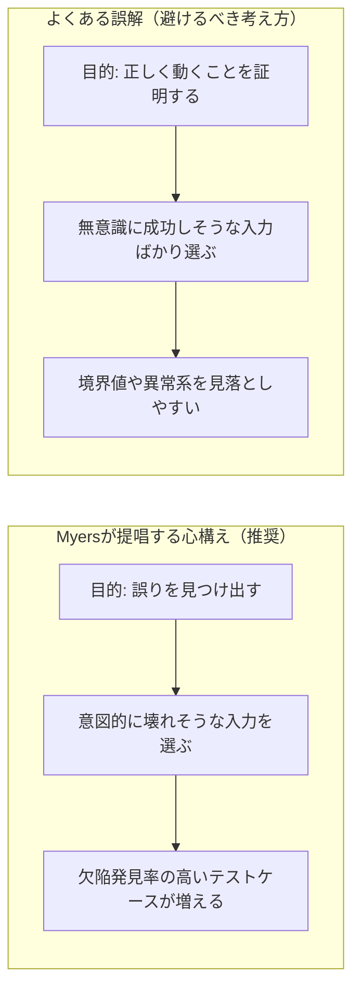
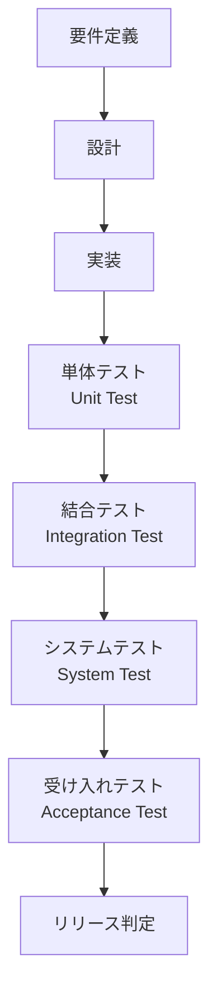
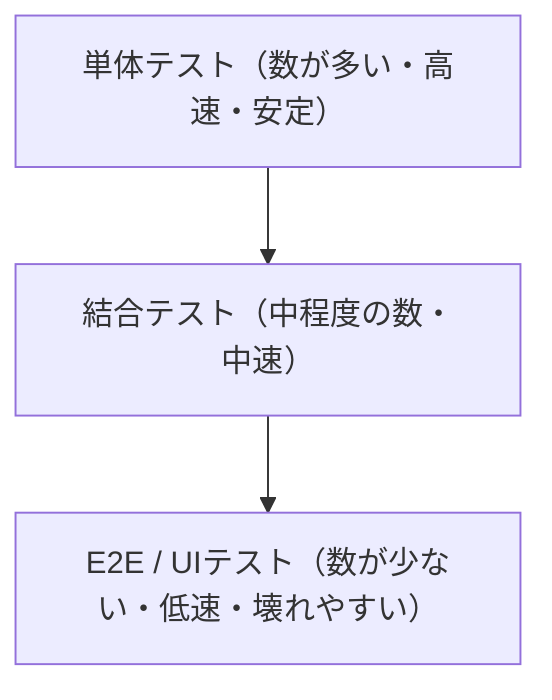
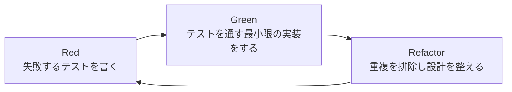
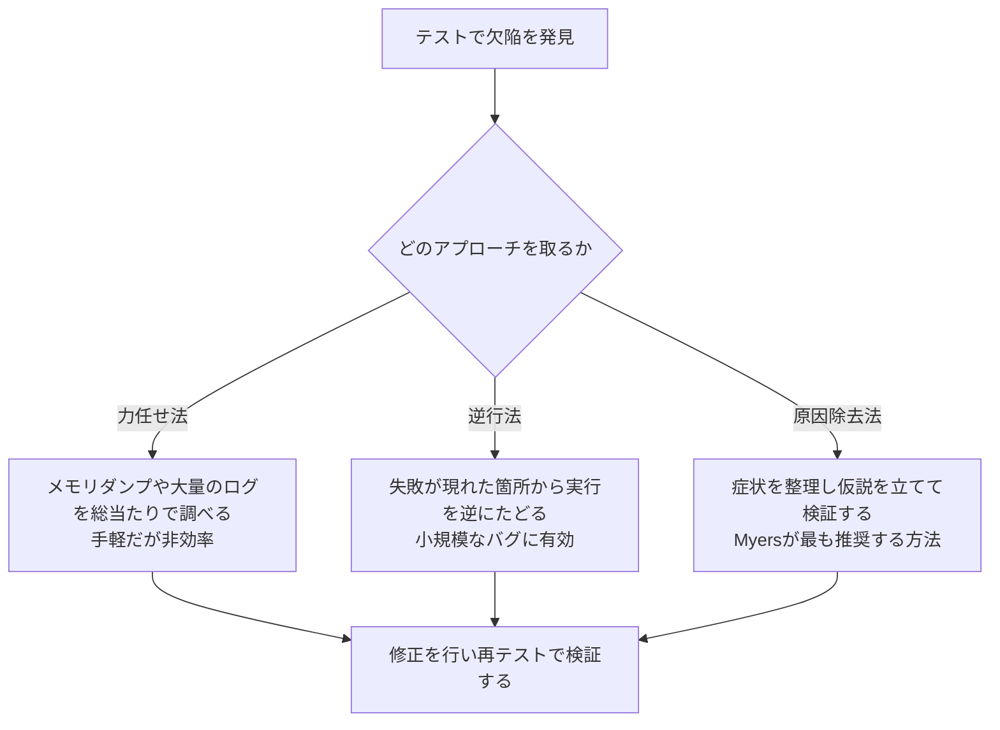
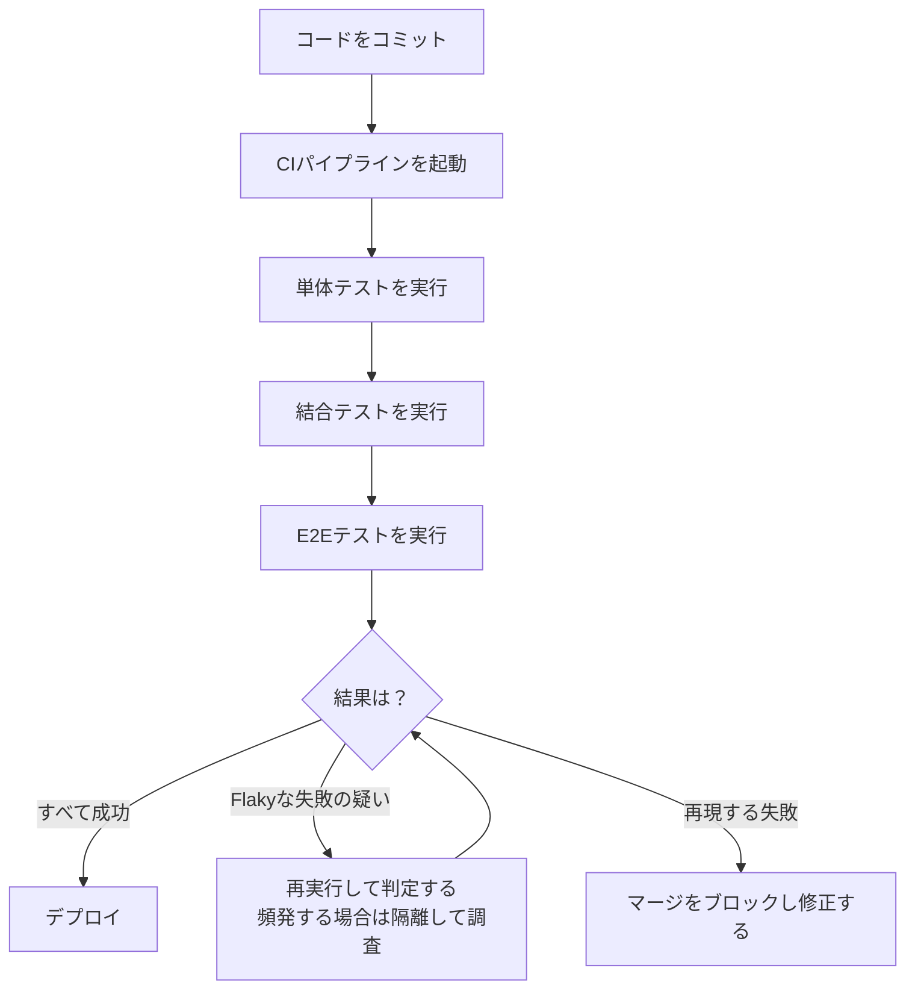

# 『The Art of Software Testing』から学ぶソフトウェアテスト実践ガイド
### 初学者のためのステップバイステップ・ベストプラクティス

> 参考書籍: Glenford J. Myers, Tom Badgett, Corey Sandler『The Art of Software Testing, 3rd Edition』
> https://www.oreilly.com/library/view/the-art-of/9780471469124/

---

## 目次

- [はじめに](#intro)
- [第1章: テストの心理学 — なぜ「バグを探す」姿勢が重要なのか](#ch1)
- [第2章: ソフトウェアテストの7原則](#ch2)
- [第3章: テストレベルの全体像](#ch3)
- [第4章: ブラックボックステスト技法](#ch4)
- [第5章: ホワイトボックステスト技法とコードカバレッジ](#ch5)
- [第6章: 非実行型テスト — インスペクション・ウォークスルー・デスクチェック](#ch6)
- [第7章: テストピラミッドと自動テスト戦略](#ch7)
- [第8章: テスト駆動開発（TDD）](#ch8)
- [第9章: 良いテストコードを書くためのFIRST原則](#ch9)
- [第10章: デバッグの技法](#ch10)
- [第11章: 継続的テストとFlaky Testへの対処](#ch11)
- [第12章: AI時代のソフトウェアテスト（2026年動向）](#ch12)
- [実践ステップバイステップ・チェックリスト](#checklist)
- [参考文献](#references)

---

## はじめに

『The Art of Software Testing』は1979年にGlenford J. Myersが著し、2004年・2012年に改訂された、ソフトウェアテスト分野における最も古典的な書籍の一つです。ハードウェアやプログラミング言語は大きく変わりましたが、この本が説く「テストに対する考え方（心理学）」と「テストケースを設計する方法論」は、今日のアジャイル開発やAI支援開発の時代においても色褪せていません。

このガイドは、その古典的な原則を土台としながら、Martin Fowler、Kent Beck、Robert C. Martin（Uncle Bob）、Googleのテストエンジニアリングチームなど、国際的に著名な開発者たちが発展させてきた現代のベストプラクティス（テストピラミッド、TDD、FIRST原則、Flaky Test対策など）を組み合わせ、初学者が最初の一歩を踏み出せるように、ステップバイステップで解説するものです。

対象読者は、これからソフトウェアテストを学ぶプログラマー・QAエンジニアの初学者です。各章は独立して読める構成になっていますが、順番に読み進めることで、テストの考え方 → 技法 → 実践の流れが自然につながるようになっています。

---

## 第1章: テストの心理学 — なぜ「バグを探す」姿勢が重要なのか

Myersが本書の中で最も強調したのは、テストの「目的」に関する定義でした。多くの人は無意識のうちに「プログラムが正しく動くことを証明するためにテストする」と考えてしまいますが、Myersはこれを明確に否定します。その代わりに、彼はテストを「プログラムの誤りを見つけ出す意図を持って実行するプロセス」であると再定義しました。

この違いは些細な言葉遊びに見えるかもしれませんが、実務においては大きな差を生みます。「動作を証明したい」という気持ちでテストを設計すると、人は無意識に「失敗しなさそうな入力」ばかりを選んでしまい、結果として欠陥を見逃しやすくなります。逆に「壊してやろう」という意図を持つと、境界値や異常系など、欠陥が潜んでいそうな箇所を積極的に狙うようになり、テストの価値（欠陥発見率）が高まります。

Myersはさらに、「良いテストケースとは、まだ見つかっていない欠陥を発見する確率が高いテストケースである」「成功したテストケースとは、まだ見つかっていない欠陥を検出できたテストケースである」という2つの原則を示しました。一般的な業務用語で言う「テストが成功した（＝エラーが出なかった）」という感覚とは、正反対の定義になっている点に注意してください。

この心構えの転換は、後述するテストピラミッドやTDD、境界値分析といった、あらゆる現代的な技法の土台になっています。

---

## 第2章: ソフトウェアテストの7原則

Myersの心理学的な原則は、その後ISTQB（International Software Testing Qualifications Board）によって体系化され、「テストの7原則」として世界中のテスト教育のベースになっています。初学者はまずこの7つを頭に入れておくと、以降の技法の意味が理解しやすくなります。

| # | 原則 | 内容 | 実務での意味 |
|---|------|------|--------------|
| 1 | テストは欠陥があることは示せるが、欠陥がないことは示せない | どれだけテストしても「バグゼロ」を証明することはできない | 「全テスト成功＝安全」と過信しない |
| 2 | 全数テストは不可能 | 入力の組み合わせは無限に近く、すべてを網羅することは非現実的 | リスクベースで優先順位をつけて選択する |
| 3 | 早期テストの原則 | 開発の早い段階でテスト活動を始めるほど欠陥修正コストが下がる | 要件定義・設計段階からテスト観点を洗い出す |
| 4 | 欠陥の偏在（クラスタリング） | 欠陥は一部のモジュールに集中する傾向がある（パレートの法則的） | 複雑・変更頻度の高い箇所を重点的にテストする |
| 5 | 殺虫剤のパラドックス | 同じテストを繰り返すだけでは新しい欠陥は見つからなくなる | テストケースを定期的に見直し・追加する |
| 6 | テストは状況に依存する | 医療機器と社内ダッシュボードでは求められるテストの厳格さが異なる | プロジェクトのリスクに応じてテスト戦略を調整する |
| 7 | 「バグゼロ」の誤信 | バグがなくてもユーザーのニーズを満たさなければ失敗作である | 機能要件だけでなくユーザー価値も検証する |

出典: ASTQB（ISTQB公認団体）による解説を要約 — 詳細は参考文献を参照してください。

---

## 第3章: テストレベルの全体像

Myersは著書の中で、テストを「単体テスト」と「高次テスト（結合・システム・受け入れ・設置テストなど）」に分類しました。この考え方は、現在の開発プロセスにもそのまま受け継がれています。

各テストレベルの目的を表にまとめます。

| テストレベル | 目的 | 対象 | 主な実施者 |
|--------------|------|------|------------|
| 単体テスト | 関数・クラス単位のロジックが正しいか検証する | 個々のモジュール | 開発者 |
| 結合テスト | モジュール間のインターフェースが正しく連携するか検証する | 複数モジュールの組み合わせ | 開発者・QA |
| システムテスト | システム全体が仕様どおりに動作するか検証する | システム全体 | QAチーム |
| 受け入れテスト | ユーザーの要求を満たしているか、ビジネス視点で検証する | システム全体 | 顧客・プロダクトオーナー |

---

## 第4章: ブラックボックステスト技法

ブラックボックステストとは、内部の実装コードを見ずに、入力と出力の関係だけに着目してテストケースを設計する手法です。Myersはこの分野の代表的な技法として「同値分割」と「境界値分析」を紹介しており、これらは今日でも実務で最も使われる技法です。

### 4.1 同値分割（Equivalence Partitioning）

入力データを「同じ挙動をするはずのグループ（同値クラス）」に分割し、各グループから代表値を1つずつ選んでテストする技法です。これにより、無限に近い入力パターンを現実的な数のテストケースに絞り込めます。

例: 「年齢18〜65歳のみ会員登録できるサービス」の場合

| 区分 | 範囲 | 代表値の例 |
|------|------|------------|
| 無効パーティション（下限未満） | 18歳未満 | 10 |
| 有効パーティション | 18〜65歳 | 30 |
| 無効パーティション（上限超過） | 65歳超 | 80 |

### 4.2 境界値分析（Boundary Value Analysis）

Myers自身が強調したように、欠陥は範囲の「境界」付近に集中しやすい性質があります（オフバイワンエラーなど）。境界値分析は、同値分割で求めた境界の直前・直後・境界そのものの値を重点的にテストする技法です。

先ほどの例（18〜65歳）で境界値分析を行うと、以下のようなテストケースになります。

| テストケース | 入力値 | 期待結果 |
|--------------|--------|----------|
| 下限境界の直前 | 17 | 登録拒否 |
| 下限境界 | 18 | 登録許可 |
| 下限境界の直後 | 19 | 登録許可 |
| 上限境界の直前 | 64 | 登録許可 |
| 上限境界 | 65 | 登録許可 |
| 上限境界の直後 | 66 | 登録拒否 |

同値分割だけで3件、境界値分析を加えることで6件のテストケースとなり、少ないコストで欠陥の出やすい箇所を効率よくカバーできます。

---

## 第5章: ホワイトボックステスト技法とコードカバレッジ

ホワイトボックステストは、内部のソースコード構造（分岐やループ）に着目してテストケースを設計する手法です。Myersは「どれだけコードを通しても、それだけでは正しさを保証できない」と繰り返し警告しており、この考え方はGoogleのテストエンジニアリングチームが公開している「コードカバレッジのベストプラクティス」にも引き継がれています。

| カバレッジ種別 | 意味 | 特徴 |
|----------------|------|------|
| ステートメント（命令網羅） | すべての行が最低1回実行されたか | 最も基本的だが弱い基準 |
| ブランチ（分岐網羅） | すべてのif/switch分岐の両方が実行されたか | ステートメントより厳格 |
| 条件網羅 | 複雑な論理式の各条件が真偽両方をとったか | AND/OR条件のバグを検出しやすい |
| パス網羅 | すべての実行経路を網羅したか | 理論上最も厳格だが現実的には組み合わせ爆発を起こす |

Googleのテストブログが指摘しているように、カバレッジ率が高いこと自体は「そのコードを実行した」ことを示すに過ぎず、「意味のある検証（アサーション）をした」ことは保証しません。カバレッジは目的ではなく、テストの抜け漏れを見つけるための手がかりとして使うのが健全な運用です。ミューテーションテスト（コードにわざと小さなバグを注入し、テストがそれを検知できるか確認する手法）を併用すると、カバレッジだけでは見えない「見せかけのテスト」を発見できます。

---

## 第6章: 非実行型テスト — インスペクション・ウォークスルー・デスクチェック

Myersの著書でもう一つ重要なのが、プログラムを実際に実行せずにレビューする「非実行型テスト」です。現代のコードレビュー文化の原型とも言える考え方です。

| 手法 | 進め方 | 向いている場面 |
|------|--------|-----------------|
| インスペクション | 作成者含む3〜4名で、チェックリストに沿って一行ずつ声に出して確認する | 重要なモジュールの品質を厳格に担保したいとき |
| ウォークスルー | グループで簡単なテストケースを使い、プログラムの実行を人力でたどる | 設計の妥当性を早期に確認したいとき |
| デスクチェック | 個人でコードを静かに読み返し、論理的な誤りを探す | 個人作業の最終確認、レビュー前のセルフチェック |

Myersは、これらの人手によるレビューだけでも、実行テストと同程度、あるいはそれ以上の欠陥を発見できると述べています。現代のプルリクエストレビューやペアプログラミングも、この考え方の延長線上にあります。

---

## 第7章: テストピラミッドと自動テスト戦略

Myersの時代にはまだ「自動テストをどのバランスで書くか」という問題は顕在化していませんでしたが、2010年代以降、Martin Fowlerが自身のサイトで解説し広めた「テストピラミッド」が、この問題に対する標準的な指針になっています。

Fowlerの考え方の要点は、GUIを介した大規模なE2Eテストばかりに頼ると、実行が遅く、失敗の原因特定が難しく（Flakyになりやすく）、フィードバックサイクルが遅くなるという点です。そのため、下層の単体テストを厚く、上層のE2Eテストを薄くする「ピラミッド型」の配分が推奨されています。Googleのテストブログでも、大きすぎるテストは非決定的（non-deterministic）になりやすいことが繰り返し指摘されています。

なお、ピラミッドの層の名前や境界線はチームによって解釈が分かれるため、Fowlerのサイトに掲載されている実践的な解説記事（The Practical Test Pyramid）では、「まず自分たちのチームにおける各層の定義を明確にすること」が最初のステップとして推奨されています。

---

## 第8章: テスト駆動開発（TDD）

TDD（Test-Driven Development）は、Kent BeckがExtreme Programmingの一部として体系化した開発手法です。Myersの「テストは欠陥を見つけるためのもの」という思想をさらに一歩進め、「テストを先に書くことで設計そのものを駆動する」という考え方を導入しました。

この「Red → Green → Refactor」サイクルを短い時間単位（数分〜十数分）で繰り返すのがTDDの基本です。Kent Beckは、TDDの目的を「開発中の恐怖心を取り除くこと」だと説明しています。テストという安全網があることで、開発者は思い切ったリファクタリングや設計変更に踏み出せるようになります。

初学者がTDDを始める際のステップは以下の通りです。

1. 実装したい機能を、最も小さい単位のテストケースとして書き出す
2. そのテストを実行し、失敗する（Red）ことを確認する
3. テストを通すために必要最小限のコードだけを書く（Green）
4. テストが通った状態を保ちながら、重複や汚いコードを整理する（Refactor）
5. 次の小さなテストケースに進み、1〜4を繰り返す

---

## 第9章: 良いテストコードを書くためのFIRST原則

自動テストが増えてくると、「テストコード自体の品質」が課題になります。Robert C. Martin（通称Uncle Bob）は著書『Clean Code』の中で、良い単体テストが備えるべき性質を「FIRST」という頭字語にまとめました。

| 頭文字 | 原則 | 意味 |
|--------|------|------|
| F | Fast（高速） | テストは高速に実行できるべき。遅いと開発者が実行を嫌がる |
| I | Independent（独立） | テスト同士が依存せず、どの順番で実行しても結果が変わらない |
| R | Repeatable（繰り返し可能） | どの環境で実行しても同じ結果が得られる |
| S | Self-Validating（自己検証可能） | テスト結果が合否（true/false）としてコード自身で判定できる。人間が目視で判定しない |
| T | Timely（適時性） | テストはプロダクションコードを書くのと同じタイミング、できれば直前に書く |

これらはMyersが提示した「テストケースは反復可能で、期待結果を明確に持つべき」という原則と本質的に同じ方向性を持っており、古典的な原則が現代のコーディング規約に形を変えて息づいていることが分かります。

---

## 第10章: デバッグの技法

テストで欠陥を発見した後には、原因を特定して修正する「デバッグ」の工程が必要です。Myersは著書の中でデバッグのアプローチをいくつかに分類しており、その分類は現在でも有効な整理の仕方です。

特にMyersが推奨するのは「原因除去法（帰納法・演繹法による推論）」です。やみくもにコードを追いかけるのではなく、症状を整理し、「もしこの仮説が正しければ、他にどんな現象が起きるはずか」を論理的に組み立てて検証を絞り込んでいくアプローチです。これはTDDにおける「小さな失敗テストから仮説を検証する」という発想とも親和性が高い考え方です。

---

## 第11章: 継続的テストとFlaky Testへの対処

CI/CD（継続的インテグレーション／継続的デリバリー）の普及により、テストは「開発の最後にまとめて行うもの」から「コードの変更のたびに自動実行されるもの」へと役割が変わりました。この文脈で近年重要視されているのが「Flaky Test（不安定なテスト）」への対処です。

Googleのテストブログによれば、大規模なテストスイートの一定割合は避けがたくFlakyになる傾向があり、その原因は並行処理のタイミング、外部依存、テスト間の状態共有などにあります。重要なのは、Flaky Testを「よくあること」として放置せず、隔離（quarantine）・原因調査・再設計のプロセスを継続的に回すことです。Flaky Testを放置すると、開発者がテストの失敗を信頼しなくなり、テストスイート全体の価値が損なわれてしまいます。

---

## 第12章: AI時代のソフトウェアテスト（2026年動向）

2026年時点では、AIコーディングアシスタントの普及により、コードの半分以上がAI生成・AI支援によるものになっているという調査結果が複数報告されています。これに伴い、テストのあり方にも変化が生まれています。

- AIが生成したコードは、一見正しく見えても論理的な誤りやセキュリティ上の欠陥を含む割合が高いと報告されており、AI生成コードほど本章までに紹介した原則（境界値分析、テストピラミッド、コードレビュー）を丁寧に適用する必要性が指摘されています。
- テストケース自体をAIが生成する「AI支援テスト」が普及していますが、業界調査では「テストケースを生成するだけ」にとどまる利用が多く、リスクの特定や設計の質向上まで踏み込めているチームはまだ少数派だと報告されています。
- セルフヒーリングテスト（UI変更などを自動検知してテストコードを追従させる仕組み）や、変更内容から実行すべきテストを優先順位付けする仕組みなど、テストの「量」より「実行の賢さ」を重視する方向にシフトしています。

これらの動向を踏まえても、根底にあるのは本ガイドで解説してきた古典的な原則です。AIはテストケースの「作成」を助けてくれますが、「何を、なぜテストすべきか」という設計判断は、Myersが説いた心理学的な姿勢と、Fowlerたちが体系化した技法を理解している人間が担う必要があります。

---

## 実践ステップバイステップ・チェックリスト

初学者がこのガイドの内容を実務に落とし込むための手順をまとめます。

1. まず自分の中の「証明したい」という気持ちを「壊してやろう」という意図に切り替える（第1章）
2. テストの7原則を頭に入れ、「全部テストする」ことを目指さず、リスクベースで優先順位をつける（第2章）
3. 要件からテスト観点を洗い出し、単体・結合・システム・受け入れの各レベルで何を検証するか整理する（第3章）
4. 入力に対しては同値分割で代表値を選び、境界値分析で境界付近を重点的にテストする（第4章）
5. カバレッジ計測を導入しつつ、カバレッジ率を過信せず抜け漏れ発見の手がかりとして使う（第5章）
6. コードレビューやペアプログラミングを、非実行型テストの一種として意識的に活用する（第6章）
7. 自動テストはテストピラミッドを意識し、単体テストを厚く、E2Eテストを薄く配分する（第7章）
8. 可能な範囲でTDDのRed-Green-Refactorサイクルを実践し、小さく安全に開発を進める（第8章）
9. 書いたテストコード自体がFIRST原則を満たしているか定期的に振り返る（第9章）
10. バグが見つかったら、力任せに追いかける前に症状を整理し仮説検証で絞り込む（第10章）
11. CI/CDにテストを組み込み、Flaky Testを見つけたら放置せず隔離・調査する（第11章）
12. AIが生成したコードや、AIが生成したテストケースにも、これまでの原則をそのまま適用して品質を確認する（第12章）
13. 一定期間ごとにテストケース自体を見直し、殺虫剤のパラドックスに陥っていないか確認する（第2章・第11章）

---

## 参考文献

本ガイドの作成にあたり、2026年8月30日時点の情報をもとに、書籍および国際的に著名な開発者・組織による記事を参照しました。

| No. | タイトル / 発信者 | URL |
|-----|--------------------|-----|
| 1 | The Art of Software Testing, 3rd Edition（Glenford J. Myers, Tom Badgett, Corey Sandler）— O'Reilly | https://www.oreilly.com/library/view/the-art-of/9780471469124/ |
| 2 | The Art of Software Testing（書評・要約）— Yegor Bugayenko | https://www.yegor256.com/2014/08/22/art-of-software-testing.html |
| 3 | The Art of Software Testing, from Glenford Myers — José Sobral (Medium) | https://medium.com/@JSobral/the-art-of-software-testing-from-glenford-myers-871ac1073264 |
| 4 | The Practical Test Pyramid（Ham Vocke, Martin Fowler氏のサイトに掲載） | https://martinfowler.com/articles/practical-test-pyramid.html |
| 5 | Test Driven Development — Martin Fowler's Bliki | https://martinfowler.com/bliki/TestDrivenDevelopment.html |
| 6 | Code Coverage Best Practices — Google Testing Blog | https://testing.googleblog.com/2020/08/code-coverage-best-practices.html |
| 7 | Flaky Tests at Google and How We Mitigate Them — Google Testing Blog | https://testing.googleblog.com/2016/05/flaky-tests-at-google-and-how-we.html |
| 8 | FIRST Principles as Solid Rules for Tests（Robert C. Martinの提唱を解説）— DZone | https://dzone.com/articles/first-principles-solid-rules-for-tests |
| 9 | ISTQB Foundation Level - Seven Testing Principles — ASTQB（ISTQB公認団体） | https://astqb.org/istqb-foundation-level-seven-testing-principles/ |
| 10 | Using Equivalence Partitioning and Boundary Value Analysis in Black Box Testing — StickyMinds | https://www.stickyminds.com/article/using-equivalence-partitioning-and-boundary-value-analysis-black-box-testing |
| 11 | Flaky test — Wikipedia | https://en.wikipedia.org/wiki/Flaky_test |
| 12 | Top Software Testing Trends in 2026 for QA Leaders — AccelQ | https://www.accelq.com/blog/software-testing-trends/ |

---

*本ガイドは2026年8月時点で公開されている情報をもとに作成されています。ツールや統計データは今後更新される可能性があるため、最新情報は各参考文献の一次情報を直接ご確認ください。*
