# データ品質モニタリングの自動化を学ぶ：ルールベースを超えて機械学習でスケールする方法

> 初学者向け・ステップバイステップ解説ガイド
> 参照書籍: Jeremy Stanley, Paige Schwartz 著『*Automating Data Quality Monitoring: Scaling Beyond Rules with Machine Learning*』（O'Reilly Media, 2024）

## この記事について

「データが多すぎて、どのテーブルが壊れているか誰も気づけない」——多くのデータチームが抱えるこの悩みに、正面から答えるのが本ガイドで取り上げる書籍です。世界中の企業が1日に生み出すデータ量は2.5エクサバイト（約250京バイト、2.5×10^18バイト相当）に達するという2012年時点の推計が広く引用されていますが[^1]、その中のどれだけが「良品」なのかを人手だけで確かめるのはもはや不可能です。

本書の著者であるJeremy StanleyとPaige Schwartzは、データ品質モニタリング企業Anomaloの共同創業者兼CTO、および同社のテクニカルライターです。二人は前職のInstacart（米国の食料品配達大手）で、共同創業者のElliot Shmuklerとともに「ルールベースのテストだけでは、企業規模のデータ品質は守れない」という現実に直面した経験からAnomaloを立ち上げました[^2]。本書には、元米国チーフ・データサイエンティストのDJ Patil氏が序文を寄せています[^3]。

このガイドは、原書の8章構成に沿って、**教師なし機械学習（Unsupervised Machine Learning, UML）を使ってデータ品質を自動監視する考え方**を、初学者にもわかりやすいようにステップ・バイ・ステップで解説します。あわせて、Uber・Netflix・Monte Carlo（Barr Moses氏）など他の著名なデータエンジニアリング組織の実践例や、Great Expectations・Soda・dbtといったオープンソースのデータ品質ツールの位置づけにも触れ、原書の内容を2026年9月時点の業界動向と接続します。

**対象読者**：データエンジニア、データアナリスト、データサイエンティスト、そして自社のデータ品質戦略を検討しているCDAO（チーフ・データ&アナリティクス・オフィサー）やデータガバナンス責任者まで、データに関わるすべての人。

---

## 書籍情報

| 項目 | 内容 |
| --- | --- |
| タイトル | Automating Data Quality Monitoring: Scaling Beyond Rules with Machine Learning |
| 著者 | Jeremy Stanley（Anomalo共同創業者・CTO）、Paige Schwartz（Anomaloテクニカルライター） |
| 序文 | DJ Patil（元米国チーフ・データサイエンティスト） |
| 出版社 | O'Reilly Media |
| 出版日 | 2024年2月13日 |
| ページ数 | 200ページ超 |
| ISBN | 9781098145934 |
| 想定読者 | CDAO/VP of Data、データガバナンス責任者、データエンジニア・アナリスト・データサイエンティスト |
| 参照URL | <a href="https://www.oreilly.com/library/view/automating-data-quality/9781098145927/" target="_blank" rel="noopener noreferrer">https://www.oreilly.com/library/view/automating-data-quality/9781098145927/</a> |

### 章構成一覧

| 章 | タイトル（原題） | 内容の要点 |
| --- | --- | --- |
| 1 | The Data Factory | データ品質はなぜ・どこで劣化するのか、ビジネスへの影響 |
| 2 | A Four-Pillar Approach to Data Quality Monitoring | 観測性・検証ルール・主要指標・教師なしMLの4本柱 |
| 3 | Is Automated Data Quality Monitoring Right for Your Business? | 自動化の投資判断とROIの考え方 |
| 4 | How to Build a Machine Learning Model for Data Quality Monitoring | 教師なしMLモデルの設計アルゴリズム |
| 5 | Making Data Quality Monitoring Models Work in the Real World | 季節性・カオスなテーブルなど実データ特有の課題への対処 |
| 6 | High-Quality Notifications | アラート疲れを避けながら適切な通知を届ける設計 |
| 7 | Integrations Multiply the Power of Your Tools | データウェアハウスからMLOpsまでの統合ポイント |
| 8 | Towards a Self-Driving Data Future | 本番展開、ビルド・バイ判断、継続的改善 |
| 付録 | Common Data Quality Issues | よくあるデータ品質問題のカタログ |

---

## 学習ロードマップ

以下のステップで、ルールベースの限界から教師なし機械学習による自動化、そして組織への定着までを順に見ていきます。

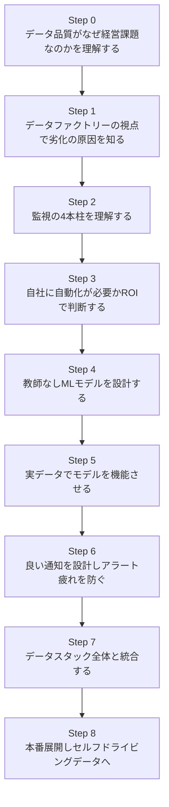

---

## Step 0：なぜ「データ品質」が経営課題なのか

多くの組織では「データはだいたい正しい」という前提で意思決定が行われています。しかし、実際にはデータの誤りのほとんどは発見されないまま埋もれており、そのうちのいくつかは深刻な被害を引き起こしています。書籍のChapter 1では、次のような実例が紹介されています[^4]。

- 英国では、Excelの行数上限に起因する集計ミスによって、新型コロナウイルスの検査結果約1万6000件が報告から漏れた
- 米国の不動産テック企業Zillowは、住宅価格予測モデルの誤りが一因となり、住宅買取転売事業（iBuying）を停止し人員削減に至った
- ゲーム開発企業Unity Softwareは、機械学習モデルに投入したデータの品質問題を一因として株価が急落した

これらは「派手な失敗例」ですが、書籍が強調するのは、**むしろ気づかれない小さな品質劣化の方が積み重なると危険**だという点です。AIや分析基盤が組織の隅々まで浸透するほど、汚れたデータが引き起こす被害の範囲は広がります。特に生成AIの学習データのように、非構造化データの品質を評価すること自体が難しい領域では、リスクはさらに大きくなります[^4]。

> 💡 **初学者向けポイント**：「データ品質モニタリング」と聞くと難しそうに聞こえますが、要は「昨日までと比べて、今日のデータはおかしくないか？」を継続的にチェックする仕組みのことです。人間が毎日全テーブルを目視確認するのは不可能なので、これを自動化する方法を学んでいきます。

---

## Step 1：データファクトリーという視点で劣化の原因をつかむ

書籍では、データ基盤を「倉庫（warehouse）」ではなく**「データファクトリー（工場）」**という比喩で捉えることを提案しています[^5]。倉庫は「保管する場所」というニュアンスが強いですが、現代のデータスタックはETL・変換・オーケストレーションを通じて、原材料（生データ）を製品（分析可能なデータ）へと絶えず「加工」しているからです。

| 観点 | 物理工場 | データファクトリー |
| --- | --- | --- |
| 入力 | 原材料、前工程からの半製品 | 生のデータフィード、サードパーティAPI経由の加工済みデータなど純度がさまざまなデータ |
| 加工 | 機械・コンベア等による変形・結合・加工 | ETL・オーケストレーション・変換ツールによる結合・破棄・計算 |
| 人の関与 | 作業員・監督者による品質監視、対応、改善、そして時にミスの混入 | アナリスト・エンジニアによる品質監視、対応、改善、そして時にミスの混入 |
| 出力 | エンドユーザー向け製品、または次工程への入力 | ユーザー/ソフトウェアによる直接利用、または分析基盤や生成AIへの入力 |

### 工場のどこで品質が壊れるか

データが移動・複製・加工されるたびに、品質が損なわれるリスクが生まれます。書籍が挙げる典型的な原因は次のとおりです[^5]。

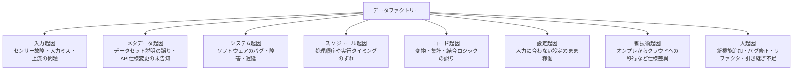

さらに、意外に見落とされがちなのが「バグ修正」自体がデータ品質問題を生むケースです。下流のシステムがすでに「バグがある前提」でロジックを組んでいた場合、その修正は下流にとって新たな“ズレ”として現れます[^5]。

### データの「傷」と「ショック」

書籍は品質問題の影響を2種類に分けて説明します[^5]。

- **データ傷（Data scars）**：信頼できない異常・不正なレコードそのもの。問題が長引くほど傷は深くなり、クリーンアップのコストも増える
- **データショック（Data shocks）**：トレンドの急激な変化。問題の発生そのものもショックだが、実は問題の「修正」もまたショックになりうる（例：異常値が急に正常な水準へ戻ることで、トレンド分析が惑わされる）

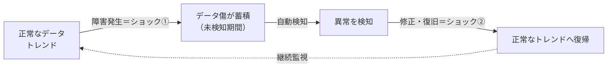

COVID-19のような「現実に起きた急変」もショックとして現れますが、それとデータ品質問題由来のショックを区別できるようにすることが、この後のStepで学ぶ機械学習モデルの重要な役割になります。

---

## Step 2：監視の4本柱を理解する

「大きな問題ならいずれ誰かが気づくだろう」という発見任せの姿勢や、「このカラムはNULLを許さない」といった手作業のルールベース検証だけでは、テーブル数が数十から数百、数千へとスケールした瞬間に破綻します。ルールのコピー＆ペーストとカスタマイズはシーシュポスの岩のような終わりなき作業になり、しかも大半のルールは「過去に起きた既知の問題」を後追いでチェックするだけで、未知の問題には無力です[^6]。

書籍が提案するのは、単一の万能薬ではなく、**性質の異なる4種類のチェックを組み合わせる「4本柱」アプローチ**です[^6]。

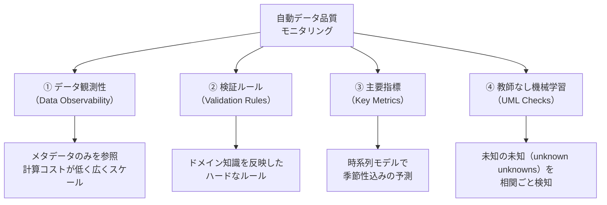

### 4本柱の比較表

書籍で示されている比較表を、初学者向けに整理し直したものが以下です[^6]。

| 特性 | データ観測性 | 検証ルール | 主要指標 | 教師なしML |
| --- | --- | --- | --- | --- |
| 導入の速さ | ◎ 速い | △ 遅い | △ 遅い | ◎ 速い |
| スケールのしやすさ | ◎ しやすい | △ しにくい | △ しにくい | ◎ しやすい |
| 未知の未知を検知できるか | ✕ | ✕ | ✕ | ◎ |
| 履歴を加味するか | ✕ | ✕ | ◎ | ◎ |
| 針の中の一本を見つける精度 | ✕ | ◎ | ✕ | ✕ |
| 既存の問題を発見できるか | ✕ | ◎ | ✕ | ✕ |
| テーブルの一部だけを厳密に監視 | ✕ | ◎ | ◎ | ✕ |

- **データ観測性**：テーブルが「更新されているか」「利用可能か」といった、データの中身に踏み込まない“バイタルサイン”を大量のテーブルに対して低コストでチェックする手法。
- **検証ルール**：「このカラムにNULLがあってはいけない」のような、チームのドメイン知識に基づくハードな条件。既知の問題や重要な一部データの厳密なチェックに強い。
- **主要指標**：売上や利用者数のような重要指標を時系列モデルで予測し、季節性を織り込んだ「ゆらぎの範囲」を超えたときにアラートする。
- **教師なし機械学習**：テーブル固有のパターンや列同士の関係性を学習し、想定していなかった構造的な変化＝「未知の未知」を検知する。4本柱の中で最も革新的な柱として、本書では特に詳しく扱われます。

> ⚠️ **注意点**：世の中には「AI搭載」を謳いながら、実際には定型的な主要指標チェックをしているだけのツールもあります。また教師なしMLにも限界があり、既存の問題や「針の中の一本」的な希少な異常は検知できません。4本柱はあくまで補完関係にあり、どれか一つで完結すると考えないことが重要です[^6]。

---

## Step 3：自社に自動化が必要か？ ROI（投資対効果）で判断する

自動化はいつでも正義とは限りません。書籍は「上級スキーヘルメット」の比喩を使います——毎週上級コースを滑るなら装備投資は賢明ですが、年に数回子どもとソリ遊びをする程度なら過剰投資かもしれません[^7]。自社にとって自動データ品質モニタリングが見合う投資かどうかを判断するための観点が、Chapter 3で整理されています。

### データの特性で判断する（4つのV）

IBMが提唱した「ビッグデータの4V（volume, variety, velocity, veracity）」をベースに、書籍はより分かりやすい言葉で判断軸を示しています[^7]。

| 観点 | 自動化の効果が高い | 自動化の効果が低い |
| --- | --- | --- |
| データ量（Volume） | 数十億行規模、セグメント分割されたデータ | 工場の製造記録のような小規模データ |
| データ種別（Variety） | 構造化・非構造化を問わず多様な種類 | 後から修正しにくいデータ（顧客住所等）、単発の大規模ダンプ（治験データ等） |
| 更新頻度（Velocity） | 週次以上の更新頻度 | 年次・四半期更新のテーブル |
| リスクプロファイル（Veracity） | サードパーティ由来、複雑なシステム連携、継続変更中のシステム、レガシーシステム由来 | ほぼ静的で「密閉」されたデータ |

### 業界・データ成熟度・ステークホルダーの観点

- **業界特性**：金融・ヘルスケアのような規制産業は品質要求が厳しい。AI/MLを活用する企業はデータ品質の悪さが特徴量のショックや過学習に直結する。データそのものを商品として扱う企業（データプロバイダー）にとっては品質＝製造業でいう品質管理そのもの[^7]。
- **データ成熟度**：モダンデータスタック（Snowflake、BigQueryなどのウェアハウスやAirflow、dbtなどの変換ツール）を導入済みの組織ほど自動化の恩恵は大きい[^7]。
- **ステークホルダー別の便益**：エンジニアは設定のしやすさとAPI連携を、データチームの管理職は俯瞰的なダッシュボードを、非エンジニアのアナリストは直感的なUIと根本原因分析の可視化を、それぞれ重視する[^7]。

### 概算ROIの考え方

書籍が示す簡易試算の流れは次のとおりです（書籍61〜62ページにより詳細な計算例あり）[^7]。

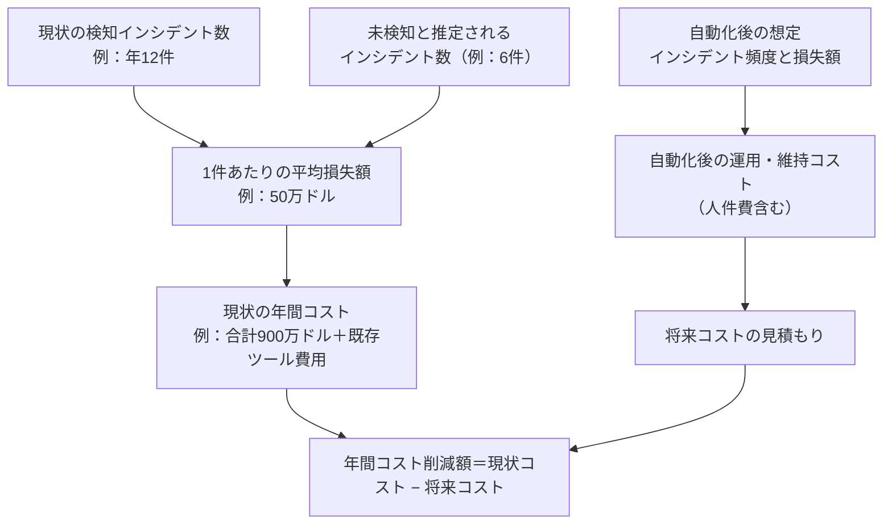

数値化しにくい効果・リスクも考慮に入れる必要があります。

- **効果**：開発サイクルの短縮、監査証跡としてのドキュメント、社内外からのデータ信頼性の向上
- **リスク**：新しい運用に対するトレーニング負荷や抵抗感によるモラル低下、セキュリティ上の考慮点、設定を誤った場合のアラート疲れ[^7]

自社のデータがこの表の「効果が高い」列に多く当てはまるほど、次のStepで扱う機械学習アプローチへの投資が報われやすいと言えます。

---

## Step 4：教師なし機械学習モデルの作り方

ここからが本書の技術的な核心です。Chapter 4では、Anomaloが実際に採用している**「今日のデータは“今日”のものだと当てられるか？」**という、一見不思議なアイデアに基づくアルゴリズムが解説されています[^8]。

> 補足：ここで扱うのは生成AI（ChatGPTのような大規模言語モデル）ではありません。テーブルの異常検知に特化した、目的特化型の機械学習モデルの話です[^8]。

### モデルに求める4つの性質（ウィッシュリスト）

書籍は、実運用に耐えるモデルの要件を4つに整理しています[^8]。

| 性質 | 意味 | 具体例 |
| --- | --- | --- |
| 感度（Sensitivity） | 偽陰性を避ける＝本当の問題を見逃さない | データの1%以上に影響する「構造的」な問題を捉える水準が目安。それ以下は検証ルールに任せる |
| 特異度（Specificity） | 偽陽性を避ける＝誤報でオオカミ少年にならない | サイバーマンデーの売上急増やクリスマスの売上急減などの季節性に反応しない |
| 透明性（Transparency） | 人間が読める形で説明できる | 深刻度と根本原因の手がかりを示す。詳細のない汎用アラートは逆にアラート疲れを招く |
| スケーラビリティ（Scalability） | 個別カスタマイズなしで広く適用できる | どのテーブルにもそのまま使え、設定が必要なのは通知先などの上位レイヤーのみ |

同時に、あえて「モデルに求めないこと（非要件）」を明確にしている点もユニークです[^8]。

| 非要件 | 理由 |
| --- | --- |
| 個々の不正レコードの特定 | 重要なテーブル・カラムには検証ルールを使う |
| リアルタイム処理 | 時間次・日次バッチで十分。それ以上はスケールが難しく計算コストに見合わない |
| 既存の問題の発見 | MLモデルは「これからのデータ」を評価する。過去データは検証ルールで確認する |
| タイムスタンプのないテーブルの監視 | MLは時間経過での変化を検知する仕組みのため。静的情報はテーブル観測性や検証ルールで |
| 外れ値（outlier）の検出 | 外れ値自体は価値中立。MLが探すのは「構造的な変化」であり、単に大きい・小さい値ではない |

### コアとなるアイデア：「今日のデータは今日のものか？」を機械学習に当てさせる

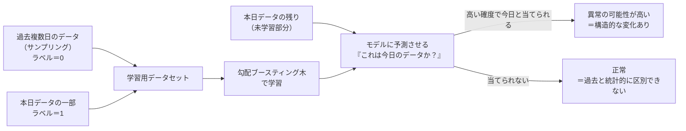

もしモデルが「今日のデータかどうか」を高い確度で当てられるなら、それは今日のデータが過去のパターンと明確に異なっているという意味であり、何らかの異常が疑われます。逆に見分けがつかなければ、構造的な異常はないと判断できます[^8]。

### モデル構築で考慮すべき4つの論点

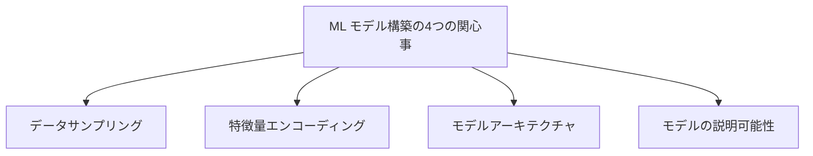

#### ① データサンプリング

- **何を**：本日・昨日・先週の同じ曜日など、複数の過去日からランダムな行を抽出し、今日を「1」、それ以外を「0」とラベル付けする[^8]
- **どれくらい**：1万行程度が目安。大規模テーブルでも十分。これは世論調査が約2000人のサンプルで数億人の意見を推定できるのと同じ統計的原理に基づく（ただし真にランダムな抽出であることが前提）[^8]
- **どうやって**：ウェアハウスにそのまま「ランダムな1万行」を要求すると、テーブル全体をメモリに読み込んでしまい非効率かつ高コストになる。個々の日付ごとに切り出し、`TABLESAMPLE`などの機能で必要量より多めに抜き出してから、その中からランダムサンプリングするのが実践的な方法[^8]

#### ② 特徴量エンコーディング

文字列や、ZIPコード・電話番号のように数値の「意味」を持たない値も、機械学習で扱うには数値に変換する必要があります。代表的なエンコード方式は次のとおりです[^8]。

| エンコード種別 | 内容 |
| --- | --- |
| numeric | 個数や金額などそのまま数値として扱う |
| frequency | その値が列内で何回登場するかに置き換える |
| isNull | 値があれば1、なければ0 |
| secondOfDay / timeDelta | 発生時刻、または2つの出来事の間の時間差 |
| OneHot | カテゴリ変数を複数の二値列に変換する |

複雑なエンコーダーほど検知できる異常の幅は広がりますが、その分「なぜ異常と判定されたか」の直感的な理解が難しくなるトレードオフがある点には注意が必要です[^8]。

#### ③ モデルアーキテクチャ：勾配ブースティング決定木

書籍は数ある機械学習手法の中から**勾配ブースティング決定木（Gradient-Boosted Decision Trees）**を推奨しています。理由は次のとおりです[^8]。

- 比較的少量のサンプルで学習できる一方、数百万件規模のレコードも高速に処理できる
- 特徴量エンコーディングさえ適切なら、あらゆる表形式データに汎化できる
- 推論（予測）が高速
- チューニングすべきパラメータが少なく、主に学習率と各決定木の複雑さ程度で済む

実装ライブラリとしては<a href="https://xgboost.readthedocs.io/en/latest/index.html" target="_blank" rel="noopener noreferrer">XGBoost</a>の利用が勧められています[^8]。

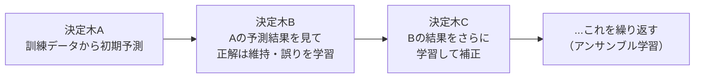

線形モデルでは複雑な構造化データのパターンを捉えきれず単純すぎる一方、ニューラルネットワークは要求されるデータ量・計算資源が過大です。勾配ブースティング決定木は、この中間の「ちょうどよい複雑さ」に位置づけられます。理論上は無限に木を追加できてしまうため、どこで学習を打ち切るかの見極めも必要です[^8]。

#### ④ モデルの説明可能性：SHAP値

異常を検知できても、「どこが」「どれくらい深刻か」がわからなければ対応しようがありません。書籍が推奨するのは<a href="https://shap.readthedocs.io/en/latest/index.html" target="_blank" rel="noopener noreferrer">SHAP（SHapley Additive exPlanations）</a>を用いて、各セル（行×列）がモデルの予測にどれだけ寄与したかを算出する方法です[^8]。

SHAP値を使うことで、「軽微」から「深刻」までの重大度を可視化し、数千ものデータポイントを横断して「どこを調査すべきか」を一目で把握できるようになります。たとえば、ある値の出現頻度が急に減り、別の値が急増していれば、その部分でラベル付けの誤りが起きている可能性が高い、といった読み解きができます[^8]。

---

## Step 5：実データでモデルを機能させる

理論上きれいなモデルも、現実のデータにぶつかると簡単には機能しません。Chapter 5では、実データ特有の"クセ"とその対処法が具体的に示されています[^9]。

### モデルをつまずかせる5つの現象と対策

| 現象 | 何が起きるか | 対策の要点 |
| --- | --- | --- |
| 季節性 | 12月のアイスクリーム販売のように、周期的な変動を異常と誤認する | 行数や平均取引額などのメタデータを時系列で蓄積し、周期パターンを明示的にモデルへ教える |
| 時間依存の特徴量 | 自動採番IDやタイムスタンプは「今日かどうか」を機械学習にとって自明にしてしまい、偽陽性が量産される | 補助的な単純モデルを作り、常に予測に強く効く特徴量を特定して本番モデルから除外する |
| カオスなテーブル | 倉庫の臨時棚卸しのような不定期な更新は、日によって変化量が大きくぶれる | SHAP値の平均的な大きさを時系列で追い、テーブルごとの「カオスの度合い」に応じてしきい値を動的に調整する |
| 特殊な更新タイプ（静的テーブル／その場更新テーブル） | ディメンションテーブルや、配送日のように後から値が埋まる列は、毎日「異常」に見えてしまう | 定期的にテーブルのスナップショットを取得し、生きたデータではなくスナップショットの差分をモデルに評価させる |
| カラム相関 | 1つのカラムの異常が複数の関連カラムに波及し、別々のアラートとして重複してしまう | SHAP値のパターンと大きさが似ている列同士をクラスタリングし、まとめて1つのアラートにする |

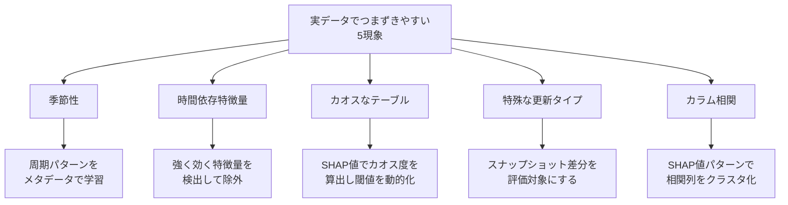

### 「良性のカオス」でモデルを鍛える：合成異常によるテスト

人手でラベル付けされたデータでモデルを評価するのが機械学習の一般的な方法ですが、企業規模でそれをやるのはコストが高く、しかも人間側の誤りが混入するリスクがあります。書籍が勧めるのは、**意図的に「合成異常（synthetic chaos）」をデータに注入し、モデルがそれを検知できるかをテストする**アプローチです[^9]。

代表的な合成異常の例：

- あるカラムの値をランダムな係数で乗算する
- カラムの15%の値をNULLに置き換える
- 最頻値（モード）に一致する行を削除する
- カラムの値をランダムな浮動小数点数に置き換える

実際の異常の多くも、何らかのコンピュータ処理の結果として発生するため、「合成異常を検知できるモデルは、現実の異常も検知しやすくなる」というのが書籍の基本的な考え方です[^9]。ただし、これはあくまで意図的に注入したパターンに対する評価であり、実データに似せた合成異常や履歴データでのバックテストだけで実際の異常の検知能力そのものが証明されるわけではありません。過去インシデントの再現検証など、追加の検証範囲も併せて必要になります。Anomaloは、このような合成異常を体系的に生成する「カオスライブラリ」を社内で保有しており、Databricks Data + AI Summitでの講演でもその仕組みが紹介されています[^9]。

### バックテストと評価指標

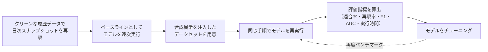

主な評価指標は次のとおりです[^9]。

| 指標 | 意味 |
| --- | --- |
| 実行時間 | モデルは毎日実行されるため、精度向上とのトレードオフを見極める必要がある |
| 適合率（Precision） | アラートのうち実際に異常だった割合。高いほど誤報が少ない |
| 再現率（Recall） | 実際の異常のうちアラートできた割合。高いほど見逃しが少ない |
| F1スコア | 適合率と再現率のバランスを示す指標。改善が一方を犠牲にしがちなため重要 |
| AUC（Area Under the Curve） | 0.5がランダム推測、1.0が完全な検知性能を表す |

この一連の検証プロセスによって、適合率と再現率、そして計算コストの間のトレードオフを定量的に把握しながらモデルを磨き込むことができます。

---

## Step 6：良い通知を設計し、アラート疲れを防ぐ

どれほど優れたモデルで異常を検知できても、担当者に届かなければ意味がありません。Chapter 6は、検知した問題を「人間が対応できる形」に変換するための実践的なノウハウを扱います[^10]。

### アラートが支える4つの解決ステップ

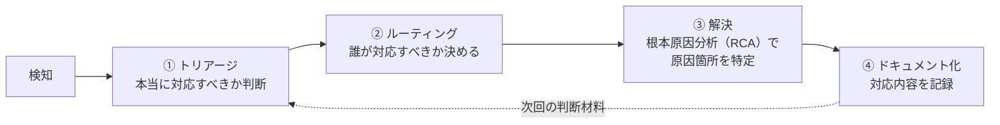

- **トリアージ**：「先日の寒波でアイスの売上が落ちた」のように、状況を判断できる文脈が重要。アラートは受け取った人にとって暗黙の“タスク”になるため、簡潔で構造化されている必要がある[^10]
- **ルーティング**：ETL起因ならデータエンジニアリングチーム、コード変更起因ならプロダクトエンジニアリングチームなど、組織や部門によって最適な担当は異なる。初期設定には手間がかかるが、迅速な対応につながる投資[^10]
- **解決（RCA）**：どのセグメントに問題が集中しているかを可視化し、調査の起点を示す
- **ドキュメント化**：解決後すぐに記録することで、次に同様の問題が起きたときの判断材料になる

### 良いアラートに必要な要素

| 要素 | 内容 |
| --- | --- |
| タイトル | 一目で状況を把握できる短い説明（特にメール通知で重要） |
| 説明文 | テーブル名・カラム名・問題の内容・期待値を含む、自動生成された要約 |
| 可視化 | グラフ1点に絞る。情報過多は逆効果 |
| トラッキング情報 | 手動設定のチェック（検証ルール・主要指標）については作成者・最終更新者・日時 |
| クイックアクション | 「詳細を見る」「チェックを編集する」「トリアージを開始する」など次の行動への導線 |

通知の送り先設計では、**誰に（Audience）・どこに（Channel）・いつ（Timing）**を明確にすることが重要です。関係者が複数部門にまたがる場合は専用チャンネルを作って情報を一元化し、Slack・メールに加えてPagerDuty・OpsGenieのようなオンコール管理ツールや、Jira・ServiceNowのようなチケット管理ツールとの連携も検討します。ルーティング漏れを防ぐデフォルトチャンネルの設置も忘れてはいけません[^10]。

### アラート疲れを防ぐ5つの工夫

| 工夫 | 内容 |
| --- | --- |
| チェックの実行順序を最適化 | 観測性チェック（データが届いているか）を最初に実行し、揃ってから他のチェックを走らせる |
| 関連アラートのクラスタリング | 同一原因が疑われる複数カラムの異常（例：クレジットカード番号・有効期限・郵便番号が同時にNULL）はまとめて1通に |
| 優先度によるサプレッション | Low（通知しない）・Normal（3回連続失敗まで通知、その後は週1回）・High（毎回通知）といった段階を用意する |
| 継続的な再学習 | 翌日には「新しい正常」に適応させ、キャンペーンなど正当な変化への過検知を防ぐ（Step 4のモデルは日次で自動的にこれを行う） |
| 柔軟な感度調整 | 信頼区間を95%・80%のように調整できるようにし、ユーザーが許容できる変動幅を選べるようにする |

ただし、「予期される変化」を一律に抑制するのは禁物です。マーケティング施策による急上昇であっても、初回だけはアラートを出しておくことで、将来の分析に役立つ文脈情報を残し、本当に想定外の変化を見逃すリスクも避けられます。アラートは「間違っている」ことを意味するのではなく、「普段と違う」ことを知らせるものだという前提を忘れないことが大切です[^10]。

---

## Step 7：データスタック全体との統合で価値を最大化する

自動データ品質モニタリングは、単体で動いているだけでは真価を発揮しません。Chapter 7では、モニタリングを組織のデータスタック全体に組み込むための5つの統合ポイントが紹介されています[^11]。

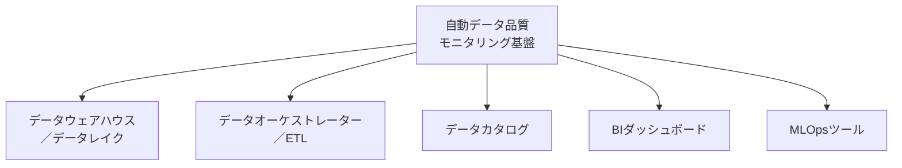

| 統合先 | 役割 | 必須度 |
| --- | --- | --- |
| データウェアハウス | 監視対象データの本拠地。ネットワーク接続・読み取り権限・スキャン機構・メタデータ抽出が基本要素 | 必須（ここがないと監視対象が存在しない） |
| データオーケストレーター | データが取り込まれる早い段階で問題を捕捉できる。チェックの実行・完了検知・検証の3機能が求められる | 必須 |
| データカタログ | データ資産の一元的な発見・理解を支援。品質状況をカタログ側に表示し、逆にカタログの情報をモニタリング側の判断材料にする双方向連携が理想 | 任意（価値が大きい） |
| BIダッシュボード | TableauやPower BIのようなツール上で、そのデータが信頼できるかを利用者に示す | 任意（価値が大きい） |
| MLOpsツール | Amazon SageMakerやMetaflowのような基盤に対し、モデルの再学習が必要かを、データそのものの品質から判断する材料を提供する | 任意（価値が大きい） |

データウェアハウス統合では、SOC 2準拠のようなセキュリティ基準を満たしつつ、PIIなど機微情報の扱いに注意する必要があります。また、エージェント型AIがデータとどう対話し、その会話データがどう保存・利用されるかについても、事前に方針を確認しておくべきだと書籍は指摘しています[^11]。

---

## Step 8：本番展開とセルフドライビングデータへの道

最終章では、実際に組織へ導入・定着させるための意思決定ポイントが扱われます[^12]。

### ビルド（自社構築）か、バイ（購入）か

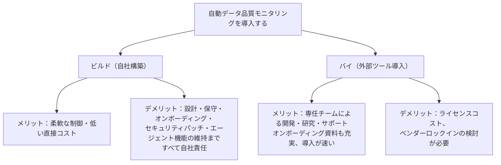

「制御性」や「初期コストの低さ」がビルドの魅力ですが、実際にはライブラリ更新・セキュリティパッチ・新規統合の構築・進化するエージェントAI機能への追随など、継続的な工数がかかります。近年はオンプレ／VPC内完結のデプロイメントを提供するベンダーも増えており、「セキュリティ上の理由で自社構築しかない」という前提は必ずしも成り立たなくなってきています[^12]。

### オンボーディングと展開計画

| 観点 | 実践のポイント |
| --- | --- |
| テーブルの監視範囲 | 最初から全テーブルを網羅しようとせず、まず重要なテーブルから始めて信頼を積み上げる。SQLクエリログを見て頻繁に参照されるテーブル・カラムを特定するのも有効 |
| 時間軸 | 直近データとの比較を基本としつつ、「その場更新」テーブルなど例外にはStep 5のスナップショット手法を活用する |
| 設定アプローチ | 似た性質のテーブルはAPIでまとめて設定して構わないが、性質の異なるテーブルを一括設定するのは避ける。UIからの個別調整も並行して用意し、非エンジニアの専門家も貢献できるようにする |
| ユーザーオンボーディング | 小規模でフラットな組織ならライブセッションや週次オフィスアワー、大規模で規制の厳しい組織ならオンデマンド教材や役割別アクセス制御など、組織文化に応じて設計する |

### 定着のための継続的な改善

導入して終わりではなく、継続的に運用を磨き込むための実践が示されています[^12]。

- **手順のドキュメント化**：オンボーディングやトリアージ・対応のプロセスをランブックとして標準化する（チームごとのカスタマイズは歓迎される）
- **オーナーシップの明確化**：どのテーブルの問題を誰が対応するのかを明確にする
- **データ基盤自体の強化**：モニタリングを通じて見えてきた弱点を継続的に改善する
- **社内規範の確立**：データ提供の適時性や、深刻度に応じた対応時間の目安を定める
- **ダッシュボードの整備**：経営層を含む関係者が、モニタリングの成果パターンを俯瞰できるようにする

---

## 他社事例に学ぶ：Uber・Netflix・Monte Carloの視点

原書はAnomalo発の書籍ですが、「教師なし機械学習で構造的な変化を検知する」という発想そのものは、他の主要テック企業のデータ基盤チームでも独立して採用されてきました。ここでは国際的に著名なエンジニアリング組織の発信を補助線として紹介します。

### Uber：統計モデリングによるData Quality Monitor（DQM）

Uberのエンジニアリングブログでは、1日1400万件規模のトリップデータを抱える同社が、数万テーブルを人手で確認することは不可能だとして、統計モデリングに基づく異常検知の仕組み「DQM」を構築した経緯が説明されています[^13]。DQMは主成分分析（PCA）とHolt-Winters時系列モデルによる1期先予測を組み合わせ、予測値と実際の値が乖離した場合にデータを異常とみなします。テーブルレベルのアラートはメトリックレベルのアラートよりもはるかに少なく、アラート疲れの軽減につながっていると報告されています[^13]。

### Monte Carlo（Barr Moses氏）：データ観測性の5本柱

データ観測性プラットフォームMonte Carloの共同創業者兼CEOであるBarr Moses氏は、「データダウンタイム」という概念を提唱し、鮮度（freshness）・ボリューム（volume）・分布（distribution）・スキーマ（schema）・系譜（lineage）という**データ観測性の5本柱**を広めた、この分野で著名な人物の一人です[^14]。これは本書の「4本柱」における「①データ観測性」の柱をさらに深掘りする視点として参考になります。Monte Carloも同じくO'Reillyから『Data Quality Fundamentals』という書籍を出版しており、業界全体でデータ品質のベストプラクティスを体系化しようとする動きが並行して進んでいることがわかります[^14]。

### Netflix・Uber出身者が語るデータ観測性の実務

データ観測性ツールBigeyeの共同創業者Kyle Kirwan氏（元Uberデータプラットフォームチーム）は、Netflixのデータチームが鮮度・完全性・重複・外れ値・分布シフトなど、複数の観点を組み合わせて品質を監視している事例を紹介しています[^15]。これは本書が強調する「単一の手法では不十分で、複数の監視手法を組み合わせる必要がある」という思想と軌を一にしています。

---

## ルールベースツールとのすみ分け：オープンソースのデータ品質エコシステム

本書の「4本柱」のうち「②検証ルール」を実装する手段として広く使われているのが、Great Expectations・Soda・dbt testsといったオープンソースツールです。2026年時点の状況を踏まえて整理します。

| ツール | 特徴 | 2026年の動向 |
| --- | --- | --- |
| Great Expectations（GX Core） | 2017年公開。宣言的な「Expectation」でデータの期待値を記述する、最も表現力の高い検証フレームワークの一つ | 2026年5月、Fivetranが同OSSコミュニティとGX Coreプロジェクトのスチュワードシップを引き継ぐと発表。GX Coreは引き続きOSSとして開発が続く一方、商用のGX Cloudは同年6月に提供終了[^16] |
| Soda Core | SQLネイティブで軽量なチェックを記述できる。ステークホルダーにも読みやすい構文が特徴 | dbtプロジェクトへの統合や、データ契約（data contracts）機能の強化が進む[^16] |
| dbt tests | モデル・ソース・シード・スナップショットを対象にテストを書ける。dbtプロジェクトを持つチームにとって着手コストが低い | これらdbtの管理対象アセットに検証範囲が限られる制約があり、それ以外の取り込みデータには別のツールを併用する必要がある[^16] |

これらのルールベース・検証系ツールは、本書の4本柱でいう「②検証ルール」に相当します。一方、Anomalo・Monte Carloのような商用データ観測性／教師なしML型プラットフォームは、「①データ観測性」と「④教師なしML」の柱を担うことが多く、**「ルールで既知の問題をブロックしつつ、MLで未知の問題を拾う」という組み合わせ**が2026年時点でも実務上のベストプラクティスとして語られています[^16]。書籍のChapter 2が主張する「4本柱はどれも単独では不十分」というメッセージは、この2026年のツールランドスケープにもそのまま当てはまります。

---

## 実践チェックリスト

これから自動データ品質モニタリングに取り組む方向けの、行動ベースのチェックリストです。

- [ ] 自社で過去に起きたデータ品質インシデントを棚卸しし、検知までの時間と損失額を概算した
- [ ] 監視したいデータの量・種類・更新頻度・リスクプロファイルを4つのVで整理した
- [ ] 現在の監視手法が「4本柱」のどこに該当し、どこが欠けているかを整理した
- [ ] ROI試算（現状コストと自動化後の想定コスト）を大まかにでも算出した
- [ ] 教師なしMLモデルを使う場合、季節性・時間依存特徴量・カオスなテーブル・特殊な更新タイプ・カラム相関の5つの落とし穴を意識した設計にした
- [ ] 合成異常を使ったバックテスト計画（適合率・再現率・F1・AUCの計測方法）を用意した
- [ ] アラートの宛先（Audience）・チャンネル（Channel）・タイミング（Timing）を明確に設計した
- [ ] 優先度別のアラート抑制ルール（Low/Normal/High）を定義した
- [ ] データウェアハウス・オーケストレーター・カタログ・BI・MLOpsとの統合計画を立てた
- [ ] ビルドかバイかを、初期コストだけでなく継続的な保守コストまで含めて検討した
- [ ] 監視対象テーブルの優先順位付けとロールアウト計画を立てた
- [ ] ランブック・オーナーシップ・社内規範・ダッシュボードによる継続改善の仕組みを用意した

---

## まとめ

本ガイドでは、『Automating Data Quality Monitoring: Scaling Beyond Rules with Machine Learning』の8章構成に沿って、次の流れを見てきました。

1. データ品質はビジネスに直結する経営課題であり、気づかれない劣化ほど危険である
2. データ基盤を「ファクトリー」として捉えると、劣化が発生しうるポイントを体系的に洗い出せる
3. データ観測性・検証ルール・主要指標・教師なしMLという4本柱を組み合わせることで、初めて「広さ」と「深さ」を両立した監視が実現する
4. 自動化への投資判断は、データの量・種類・更新頻度・リスクプロファイル、そして定量・定性両面のROIから行う
5. 教師なしMLモデルの核心は「今日のデータを今日だと当てられるか」というシンプルな発想にあり、勾配ブースティング決定木とSHAP値による説明可能性の組み合わせが実務解となっている
6. 実データには季節性やカオスなテーブルなど固有のクセがあり、合成異常によるバックテストで継続的に鍛える必要がある
7. どれほど優れた検知でも、良い通知設計とアラート疲れ対策がなければ人に届かない
8. モニタリングはデータスタック全体に統合されて初めて価値を発揮し、ビルドかバイかを含めた組織的な定着が最後の鍵を握る

Uber・Netflix・Monte Carloなど他の著名な組織の実践や、Great Expectations・Soda・dbtといったOSSエコシステムの動向も、この「4本柱」という枠組みで理解すると、自社にとって今どの柱が強く、どの柱が弱いのかを整理しやすくなります。本書はあくまで技術書ですが、「データ品質は技術の問題であると同時に、組織運用の問題でもある」というメッセージが一貫して流れている点が、初学者にとっても実務者にとっても学びの多いポイントだと言えるでしょう。

---

## 参考文献・出典

[^1]: Amazon.com、書籍紹介ページ「Automating Data Quality Monitoring: Scaling Beyond Rules with Machine Learning」 — <a href="https://www.amazon.com/Automating-Data-Quality-Monitoring-Scale/dp/1098145933" target="_blank" rel="noopener noreferrer">https://www.amazon.com/Automating-Data-Quality-Monitoring-Scale/dp/1098145933</a>
[^2]: Paige Schwartz, "An O'Reilly Book for Data Quality in the Age of AI," Anomalo Blog — <a href="https://www.anomalo.com/blog/an-oreilly-book-for-data-quality-in-the-age-of-ai/" target="_blank" rel="noopener noreferrer">https://www.anomalo.com/blog/an-oreilly-book-for-data-quality-in-the-age-of-ai/</a>
[^3]: 同上（DJ Patil氏による序文についての記載を含む）
[^4]: Team Anomalo, "Chapter 1: The data factory: How data quality degrades and why it matters," Anomalo Blog — <a href="https://www.anomalo.com/blog/chapter-1-the-data-factory-how-data-quality-degrades-and-why-it-matters/" target="_blank" rel="noopener noreferrer">https://www.anomalo.com/blog/chapter-1-the-data-factory-how-data-quality-degrades-and-why-it-matters/</a>
[^5]: 同上
[^6]: Team Anomalo, "Chapter 2: A Four-Pillar Approach to Data Quality Monitoring," Anomalo Blog — <a href="https://www.anomalo.com/blog/chapter-2-a-four-pillar-approach-to-data-quality-monitoring/" target="_blank" rel="noopener noreferrer">https://www.anomalo.com/blog/chapter-2-a-four-pillar-approach-to-data-quality-monitoring/</a>
[^7]: Team Anomalo, "Chapter 3: Is Automated Data Quality Monitoring Right for Your Business?," Anomalo Blog — <a href="https://www.anomalo.com/blog/chapter-3-is-automated-data-quality-monitoring-right-for-your-business/" target="_blank" rel="noopener noreferrer">https://www.anomalo.com/blog/chapter-3-is-automated-data-quality-monitoring-right-for-your-business/</a>
[^8]: Team Anomalo, "Chapter 4: How to Build a Machine Learning Model for Data Quality Monitoring," Anomalo Blog — <a href="https://www.anomalo.com/blog/chapter-4-how-to-build-a-machine-learning-model-for-data-quality-monitoring/" target="_blank" rel="noopener noreferrer">https://www.anomalo.com/blog/chapter-4-how-to-build-a-machine-learning-model-for-data-quality-monitoring/</a>（XGBoost公式ドキュメント: <a href="https://xgboost.readthedocs.io/en/latest/index.html" target="_blank" rel="noopener noreferrer">https://xgboost.readthedocs.io/en/latest/index.html</a> ／ SHAP公式ドキュメント: <a href="https://shap.readthedocs.io/en/latest/index.html" target="_blank" rel="noopener noreferrer">https://shap.readthedocs.io/en/latest/index.html</a>）
[^9]: Team Anomalo, "Chapter 5: Making Data Quality Monitoring Models Work in the Real World," Anomalo Blog — <a href="https://www.anomalo.com/blog/chapter-5-making-data-quality-monitoring-models-work-in-the-real-world/" target="_blank" rel="noopener noreferrer">https://www.anomalo.com/blog/chapter-5-making-data-quality-monitoring-models-work-in-the-real-world/</a>
[^10]: Team Anomalo, "Chapter 6: High-quality notifications bring the right information to the right people at the right time," Anomalo Blog — <a href="https://www.anomalo.com/blog/chapter-6-high-quality-notifications-bring-the-right-information-to-the-right-people-at-the-right-time/" target="_blank" rel="noopener noreferrer">https://www.anomalo.com/blog/chapter-6-high-quality-notifications-bring-the-right-information-to-the-right-people-at-the-right-time/</a>
[^11]: Team Anomalo, "Chapter 7: Integrations multiply the power of your autonomous data tools," Anomalo Blog — <a href="https://www.anomalo.com/blog/chapter-7-integrations-multiply-the-power-of-your-autonomous-data-tools/" target="_blank" rel="noopener noreferrer">https://www.anomalo.com/blog/chapter-7-integrations-multiply-the-power-of-your-autonomous-data-tools/</a>
[^12]: Team Anomalo, "Chapter 8: Towards a self-driving data future," Anomalo Blog — <a href="https://www.anomalo.com/blog/chapter-8-towards-a-self-driving-data-future/" target="_blank" rel="noopener noreferrer">https://www.anomalo.com/blog/chapter-8-towards-a-self-driving-data-future/</a>
[^13]: Uber Engineering, "Monitoring Data Quality at Scale with Statistical Modeling," Uber Engineering Blog — <a href="https://eng.uber.com/monitoring-data-quality-at-scale/" target="_blank" rel="noopener noreferrer">https://eng.uber.com/monitoring-data-quality-at-scale/</a>
[^14]: Barr Moses, "Celebrating the New Pioneers of Data Reliability" / "Monte Carlo's Series D and the Future of Data Observability," Medium — <a href="https://barrmoses.medium.com/celebrating-the-new-pioneers-of-data-reliability-f0a631a90611" target="_blank" rel="noopener noreferrer">https://barrmoses.medium.com/celebrating-the-new-pioneers-of-data-reliability-f0a631a90611</a> ／ <a href="https://barrmoses.medium.com/monte-carlos-series-d-and-the-future-of-data-observability-52f4aba71b91" target="_blank" rel="noopener noreferrer">https://barrmoses.medium.com/monte-carlos-series-d-and-the-future-of-data-observability-52f4aba71b91</a>
[^15]: Bigeye, "Data in Practice: Anomaly detection for data quality at Netflix," Bigeye Blog — <a href="https://www.bigeye.com/blog/data-in-practice-anomaly-detection-for-data-quality-at-netflix" target="_blank" rel="noopener noreferrer">https://www.bigeye.com/blog/data-in-practice-anomaly-detection-for-data-quality-at-netflix</a>
[^16]: "Data Quality Tooling Compared: Great Expectations, Soda, dbt Tests, and Anomaly Detection," Data Lakehouse Hub — <a href="https://datalakehousehub.com/blog/data-quality-tooling-compared/" target="_blank" rel="noopener noreferrer">https://datalakehousehub.com/blog/data-quality-tooling-compared/</a>（Great Expectations/GX Coreのスチュワードシップ移管に関する2026年5月の発表を含む）

**書籍そのものの参照元**：O'Reilly Media, *Automating Data Quality Monitoring: Scaling Beyond Rules with Machine Learning* — <a href="https://www.oreilly.com/library/view/automating-data-quality/9781098145927/" target="_blank" rel="noopener noreferrer">https://www.oreilly.com/library/view/automating-data-quality/9781098145927/</a>
