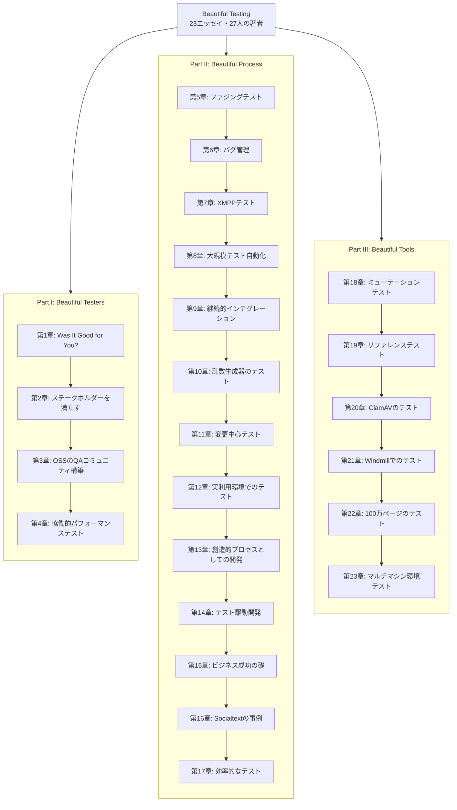
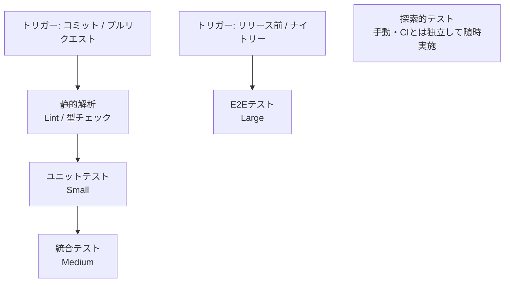
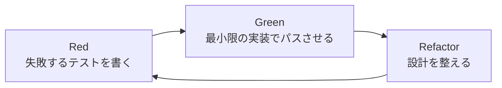
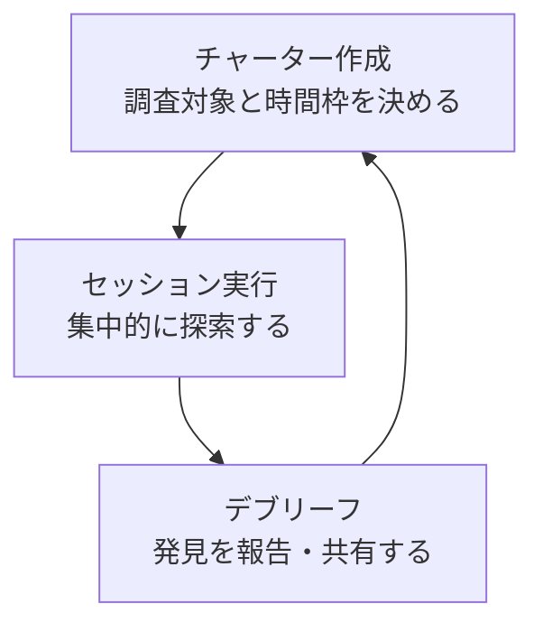
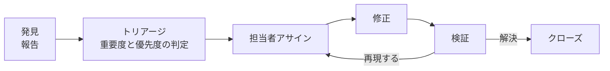
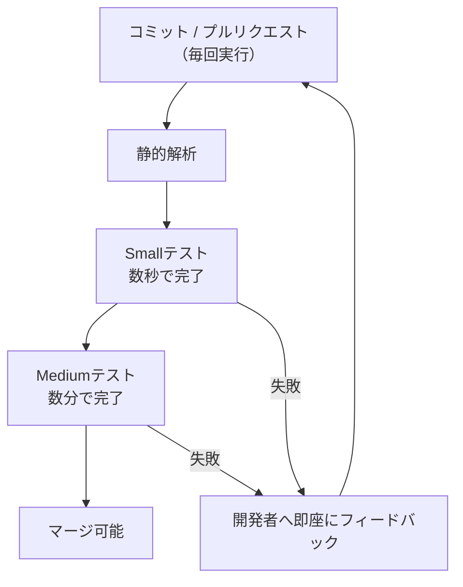
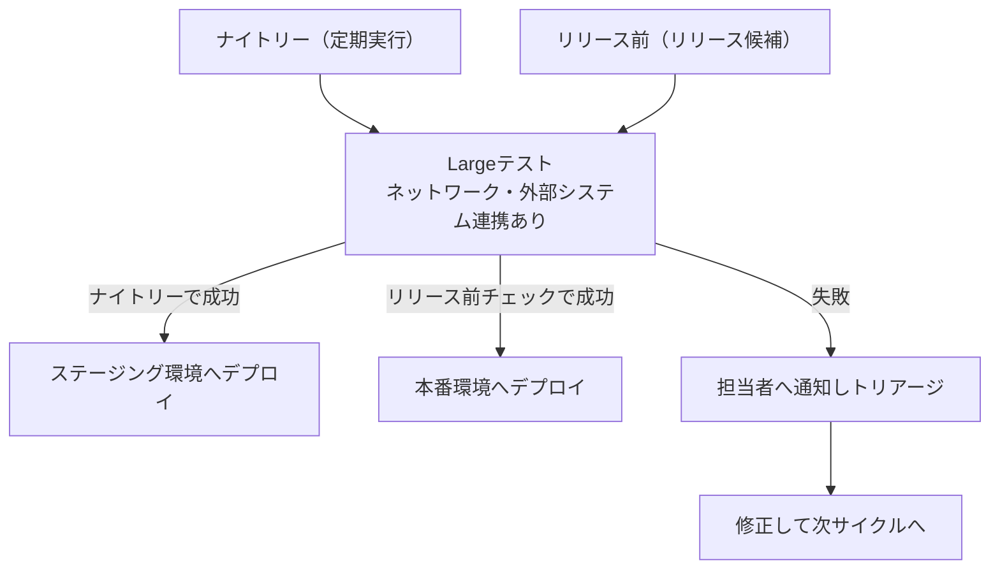
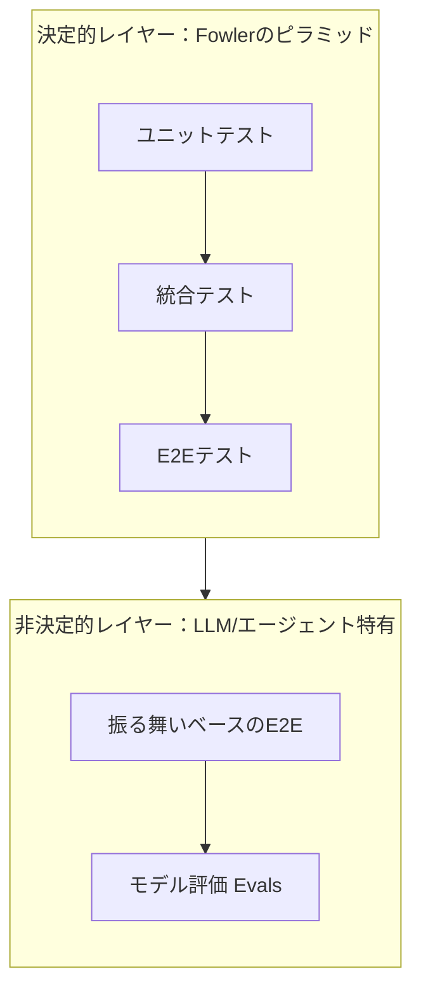

# 『Beautiful Testing』完全ガイド ― 初学者のためのステップバイステップ・ベストプラクティス

> 原著: *Beautiful Testing: Leading Professionals Reveal How They Improve Software*（O'Reilly Media, 2009年10月刊）
> 編者: Adam Goucher / Tim Riley（Mozilla QAディレクター）
> 参照元: <https://www.oreilly.com/library/view/beautiful-testing/9780596806934/>

本ガイドは、ソフトウェアテストの古典的名著『Beautiful Testing』の構成とエッセンスを、2026年時点の現代的なテスト実践（テストピラミッド／テスティングトロフィー／Googleのテストサイズ分類／AIエージェント時代のテストなど）と橋渡ししながら、初学者が実務で使える形に再構成した学習ガイドです。主要な解説セクションの末尾には、根拠とした参考資料のURLを明記しています（章のまとめにあたるチェックリストなど、一部のセクションには個別のURLを付していません）。

---

## 目次

1. [はじめに：なぜ「美しい」テストなのか](#1-はじめになぜ美しいテストなのか)
2. [本書の全体構成（3部構成マップ）](#2-本書の全体構成3部構成マップ)
3. [ステップ1：誰のためにテストするのかを理解する](#3-ステップ1誰のためにテストするのかを理解する)
4. [ステップ2：現代の「地図」を持つ ― ピラミッド／トロフィー／テストサイズ](#4-ステップ2現代の地図を持つ--ピラミッドトロフィーテストサイズ)
5. [ステップ3：小さく始める ― ユニットテストとTDD](#5-ステップ3小さく始める--ユニットテストとtdd)
6. [ステップ4：探索的テストとアジャイルテストの4象限](#6-ステップ4探索的テストとアジャイルテストの4象限)
7. [ステップ5：バグを「美しく」管理する](#7-ステップ5バグを美しく管理する)
8. [ステップ6：自動化を大規模に育て、CIに組み込む](#8-ステップ6自動化を大規模に育てciに組み込む)
9. [ステップ7：パフォーマンステストは「協働」で行う](#9-ステップ7パフォーマンステストは協働で行う)
10. [ステップ8：ファジングとミューテーションテストで質を深める](#10-ステップ8ファジングとミューテーションテストで質を深める)
11. [ステップ9：コミュニティとプロセスを育てる](#11-ステップ9コミュニティとプロセスを育てる)
12. [現代への架け橋：AIエージェント時代のテストピラミッド（2026年視点）](#12-現代への架け橋aiエージェント時代のテストピラミッド2026年視点)
13. [章立て早見表（原著23章サマリー）](#13-章立て早見表原著23章サマリー)
14. [ベストプラクティス・チェックリスト](#14-ベストプラクティスチェックリスト)
15. [参考文献・出典](#15-参考文献出典)

---

## 1. はじめに：なぜ「美しい」テストなのか

『Beautiful Testing』は、Adam GoucherとTim Rileyが編集し、27名の著名なテスター・開発者が23本のエッセイを寄稿したオムニバス形式の書籍です。表紙の惹句が語るとおり、「ソフトウェアの成功は、優れたアーキテクチャや洗練されたコードと同じくらい、入念なテストに支えられている」という思想が本書全体を貫いています。

本書がユニークなのは、テストを単なる「バグ探しの作業」ではなく、**創造性・コミュニケーション・美意識を伴う職人技（クラフト）**として描いている点です。寄稿者にはMicrosoftのAlan Page、パフォーマンステストの専門家Scott Barber、25年のキャリアを持つRex Black、アジャイルテストの第一人者Lisa Crispin、数学者John D. Cookなど、業界で広く知られる実務家・研究者が名を連ねています。また、著者印税はマラリア予防のための慈善活動「Nothing But Nets」に全額寄付されるという背景も、本書の「テストへの誠実な姿勢」を象徴しています。

初学者がこの本から学ぶべき最大のポイントは、**「テストのやり方（How）」の前に「テストの目的（Why / For Whom）」を考える**という姿勢です。本ガイドでは、この考え方を軸に、原著の各章のエッセンスを実務で使えるステップに分解し、2026年現在の標準的な実践（テストピラミッド、TDD、CI/CD、探索的テストなど）と接続していきます。

参照: <https://www.oreilly.com/library/view/beautiful-testing/9780596806934/> ／ <https://www.oreilly.com/pub/pr/2453>

---

## 2. 本書の全体構成（3部構成マップ）

原著は「Beautiful Testers（美しいテスター）」「Beautiful Process（美しいプロセス）」「Beautiful Tools（美しいツール）」の3部・23章で構成されています。まず全体像を俯瞰しましょう。

- **Part I（第1〜4章）**は「誰がテストするのか／誰のためにテストするのか」という人とステークホルダーの視点。
- **Part II（第5〜17章）**は最もボリュームが大きく、バグ管理・自動化・TDD・アジャイルなど「プロセス」に焦点を当てます。
- **Part III（第18〜23章）**は具体的なOSSプロジェクト（ClamAV、eBox等）での実践事例を通じて「ツール」を学びます。

初学者は、いきなり全章を読むのではなく、次章以降で示す「9つのステップ」の順で本書のエッセンスをつまみ食いすることをお勧めします。

参照: <https://www.oreilly.com/library/view/beautiful-testing/9780596806934/>

---

## 3. ステップ1：誰のためにテストするのかを理解する

第2章「Beautiful Testing Satisfies Stakeholders（美しいテストはステークホルダーを満たす）」は、25年のテストキャリアを持つRex Blackの知見が反映された章とされ、「誰のためにテストするのか（For Whom Do We Test?）」という根源的な問いから出発します。本書は、テストの「美しさ」を**外的な美しさ（ユーザーが実際に満足するか）**と**内的な美しさ（開発チームにとって保守しやすく、シグナルが明確か）**の2軸で捉えます。

初学者がまず実践すべきことは、テストを書き始める前に以下を自問することです。

| 問い | 具体例 |
|---|---|
| このテストは誰のためのものか | エンドユーザー／プロダクトマネージャー／運用担当／将来の自分自身 |
| 何を「満足」とみなすか | 機能要件を満たす／規制要件を満たす／性能要件を満たす |
| 失敗したとき誰が困るか | 顧客が使えなくなる／開発者がデバッグに時間を取られる |

このステークホルダー思考は、後述する「アジャイルテストの4象限」（第6章）や「テストピラミッド／トロフィー」の判断基準にも直結します。「とりあえず全部テストする」のではなく、「誰の、どんな不安を解消するテストか」を先に決めることが、美しいテストの第一歩です。

参照: <https://www.oreilly.com/library/view/beautiful-testing/9780596806934/>

---

## 4. ステップ2：現代の「地図」を持つ ― ピラミッド／トロフィー／テストサイズ

『Beautiful Testing』刊行(2009年)後の約17年（2026年8月時点）で、テスト戦略を可視化する「地図」がいくつも生まれました。初学者はまずこの地図を知っておくと、大量にあるテストの種類を迷わず整理できます。

下図は、後述する3つのモデルを統合した唯一の正解モデルでも、必ずこの順に実施しなければならないという規範でもありません。**どのトリガーでどこまでのテストを流すかの一例**として示すものです（速く安く失敗を見つけられるものから先に流す、という考え方）。探索的テストは人手で行うため、CIの直列フローには載せず、独立した活動として並記しています。それぞれのモデルの違いは、直後の比較表で整理します。

代表的な3つのモデルを比較します。これらは「どれか1つを選ぶ」排他的な選択肢ではなく、異なる軸を扱う補完的なモデルです。テストピラミッドとテスティングトロフィーは**テストの配分**（どの層をどれだけ厚く書くか）を論じるモデルであり、Googleのテストサイズは**実行制約**（プロセス・ネットワーク・I/Oをどこまで許すか）でテストを分類する枠組みです。軸が違うため、たとえば「配分はトロフィーに寄せつつ、CIでの実行制御はテストサイズで管理する」といった併用が自然に成立します。いずれも、上図のような実行順序とはさらに別の観点を示すものです。

| 観点 | テストピラミッド | テスティングトロフィー | Googleのテストサイズ |
|---|---|---|---|
| 提唱者・時期 | Mike Cohnが著書で提示、Martin Fowlerが2012年のbliki記事で整理 | Kent C. Dodds（2018年） | Google Testing Blog（2010年）／書籍『Software Engineering at Google』 |
| 分類軸 | テストの粒度（Unit → Integration → E2E） | 費用対効果（実装コストに対する「確信度」のROI） | 実行に必要なリソース（プロセス数・スレッド数・I/Oの有無） |
| 主張の要旨 | 下位（Unit）ほど数を多く、上位（E2E）ほど数を絞る | 静的解析を土台に据えつつ、費用対効果が最も高い統合テストを厚く書く | テストを「Small／Medium／Large」で分類し、実行速度と隔離性でCIの実行頻度を制御する |
| 背景にある技術変化 | 2009年前後、E2Eツールは遅く不安定だった | Jest・Testing Library・Cypressなど高速なJS向けツールの登場により前提が変化 | 数万件規模のテストを継続的に実行するGoogle社内のインフラ事情 |

初学者へのアドバイスは「どれか1つが正解ではない」ということです。フロントエンド開発ならトロフィーの考え方（統合テスト重視）が馴染みやすく、バックエンドのライブラリ開発ならピラミッド（ユニットテスト重視）が向いていることが多く、大規模な社内基盤ではGoogle方式のテストサイズ分類がCI設計に役立ちます。まず自分のプロジェクトがどのモデルに近いかを意識するだけで、「何をどれだけテストすべきか」の判断がぐっと楽になります。

参照:
<https://martinfowler.com/bliki/TestPyramid.html> ／
<https://martinfowler.com/articles/practical-test-pyramid.html> ／
<https://kentcdodds.com/blog/write-tests> ／
<https://kentcdodds.com/blog/the-testing-trophy-and-testing-classifications> ／
<https://testing.googleblog.com/2010/12/test-sizes.html> ／
<https://abseil.io/resources/swe-book/html/ch14.html>

---

## 5. ステップ3：小さく始める ― ユニットテストとTDD

第14章「Test-Driven Development: Driving New Standards of Beauty」では、テスト駆動開発（TDD）が「美しさ」の新しい基準としてアジャイル開発と結びつけて論じられています。TDDの基本サイクルは、Kent Beckが体系化した **Red → Green → Refactor** というシンプルな3ステップです。

初学者が最初につまずきやすいポイントと、その対策をまとめます。

- **いきなり大きなテストを書こうとしてしまう**
  → まず「1つのテストで1つの振る舞いだけを検証する」という粒度の方針を守り、テストを小さく刻む。そのうえで、個々のテストの中身はAAAパターン（Arrange＝準備、Act＝実行、Assert＝検証）の3段階で構造を整理すると、何を準備し、何を実行し、何を検証しているのかが読み取りやすくなる。
- **実装を先に書いてからテストを後付けしてしまう**
  → まず失敗するテスト（Red）を書き、それが正しい理由で失敗することを確認してから実装に進む。
- **リファクタリングを省略してしまう**
  → テストがGreenの状態は「安全網が張られた状態」なので、このタイミングでこそ設計を整理する。

原著が強調するのは、TDDで書かれたテストが単なる検証コードにとどまらない、という点です。ただしすべてのテストが同じ役割を担うわけではありません。ストーリーの完了条件を表現する機能テストは、関係者が読んで仕様を確認できる**「読める仕様書（Readable Examples）」であり「恒久的な要求仕様の記録（Permanent Requirement Artifacts）」**として機能します。一方、TDDのサイクルで書かれる個々のユニットテストは、主に詳細設計を駆動しフィードバックを速くするための手段であり、実装のリファクタリングに伴って書き換えられたり破棄されたりする前提のものも含まれます。どちらを書く場合でも、「後で読む人（未来の自分やチームメイト）が意図を理解できるか」を常に意識しましょう。

参照: <https://www.oreilly.com/library/view/beautiful-testing/9780596806934/>

---

## 6. ステップ4：探索的テストとアジャイルテストの4象限

第12章「Software in Use」は、医療ソフトウェアのテスト経験を持つKaren N. Johnsonの知見が反映された章とされ、実利用環境でのテスト（探索的・アドホック・スクリプト化テストの使い分け）を扱います。この章が参考文献に挙げているJames Bachの「Exploratory Testing Explained」は、探索的テストの古典的な定義を示す資料として今も広く参照されています。

探索的テストを構造化して行う代表的な手法が、James BachとJonathan Bachが考案した**セッションベース・テストマネジメント（Session-Based Test Management）**です。

また、「どこにどんなテストを配置すべきか」を整理するフレームワークとして、**アジャイルテストの4象限**が国際的に広く使われています。原型は2003年にBrian Marickが示したテスト分類のマトリクスで、それをLisa CrispinとJanet Gregoryがアジャイル開発の文脈へ適用・発展させ、書籍『Agile Testing』を通じて広く普及させました。

| | ビジネス視点（Business-facing） | 技術視点（Technology-facing） |
|---|---|---|
| **開発を支援する（Supporting the team）** | Q2: ストーリーテスト（例示ベースの受け入れ基準テスト。例: Cucumber, FitNesse）。**「何を作るか」を具体例で合意し、チームの開発を支援する**ことを目的とするテスト | Q1: ユニットテスト・コンポーネントテスト（TDDの土台） |
| **製品を批評する（Critiquing the product）** | Q3: 探索的テスト・ユーザビリティテスト・ユーザー受け入れテスト（UAT）。**ユーザー視点で「本当に価値があるか」を吟味し、製品を批評する**ことを目的とするテスト | Q4: 性能・セキュリティなど非機能要件のテスト |

> この4象限が分類しているのは、実施時期や実行順序ではなく、テストの**目的**です。同じ「受け入れテスト」という語がQ2とQ3の両方に現れますが、Q2は合意形成のための**例示ベースのストーリーテスト**、Q3は利用者視点で製品を吟味する**批評としてのUAT**であり、目的が異なります。どの象限のテストを自動化し、どれを人手で実行するかは象限だけで決まるものではなく、プロジェクトのリスクや運用上の必要性に応じて判断します。

初学者は、まず「自分が今書こうとしているテストはこの4象限のどこに位置するか」＝何を目的としたテストなのかを意識するだけで、自動化すべきか、人手で探索すべきかを検討する足がかりが得られます。探索的テストは「行き当たりばったりのテスト」ではなく、**仮説を立てて検証しながら学習する、規律あるプロセス**であることを覚えておきましょう。

参照:
<https://satisfice.us/articles/et-article.pdf> ／
<https://agiletester.ca/>

---

## 7. ステップ5：バグを「美しく」管理する

第6章「Bug Management and Test Case Effectiveness」は、本書のレビューでも「隠れた名章」と評される内容で、コンピュータ史上最初のバグ報告のエピソードから始まり、「バグとは何か」という定義論、そしてテストケースの効果測定（Test Case Effectiveness）までを扱います。

バグの一生は、多くの現場で概ね次のようなライフサイクルをたどります。

原著は、バグを単なる「不具合の記録」ではなく、**プロダクトの品質を測る計測器**として扱うことを提案しています。特に印象的なのは、「重要度（Severity）」と「優先度（Priority）」を区別する視点です。

| 用語 | 意味 | 例 |
|---|---|---|
| 重要度（Severity） | バグそのものが引き起こす技術的・機能的な影響の大きさ | データ消失を伴うクラッシュは重要度が高い |
| 優先度（Priority） | ビジネス上、いつ・どの順番で対応すべきかという判断 | 重要度は低いが、目立つ画面の表示崩れは優先度が高くなることがある |

さらに本書は、OpenSolarisデスクトップチームの事例を通じて「テストケース効果測定（TCE: Test Case Effectiveness）」という考え方を紹介します。これは「テストをすり抜けたバグ（Test Escape）」を分析し、どのテストを強化すべきかをデータで判断する手法です。初学者は、バグを見つけて直して終わりにするのではなく、**「なぜこのテストで検出できなかったのか」を振り返る習慣**を早いうちから身につけると、テストスイート全体の質が着実に向上します。

参照: <https://www.oreilly.com/library/view/beautiful-testing/9780596806934/>

---

## 8. ステップ6：自動化を大規模に育て、CIに組み込む

第8章「Beautiful Large-Scale Test Automation」は、Microsoftのテスト自動化専門家Alan Pageの知見が反映された章とされ、大規模なテスト自動化システムを構築するための基盤（テストインフラ、テスト資材の管理、テスト配布、失敗分析、レポーティング）を体系的に解説しています。

また第9章「Beautiful Is Better Than Ugly」（このタイトルはPython の設計思想「The Zen of Python」の一節そのものです）は、Python本体の品質を支えるBuildbotによる継続的インテグレーション、リファレンスカウントのリーク検出（Refleak Testing）、ドキュメントテスト、静的解析・動的解析までを扱い、「地味だが継続的な検証の積み重ねこそが美しい」という思想を示します。

これらの章のエッセンスは、現代のCI/CDパイプラインにそのまま応用できます。ステップ2で紹介したGoogleのテストサイズ分類と組み合わせると、**トリガーごとに別のパイプライン**としてゲーティング構造を描けます。すべてのテストを毎コミットで回すのではなく、速いテストほど高頻度に、遅いテストほど低頻度に配置するのが要点です。なお、手動の探索的テストはこれらの自動ゲートには含めず、別途スケジュールして実施します。

コミット／プルリクエストのたびに走らせるのは、静的解析とSmall／Mediumテストまでに留めます。

Largeテストとデプロイは、リリース前またはナイトリーなどの定期実行に切り出します。同じLargeテストを流す場合でも、デプロイ先はトリガーによって変わります。ナイトリーの成功はステージング環境への反映までを意味し、本番環境へのデプロイはリリース前のパイプラインが担います。

初学者が自動化を始める際は、次の順番で育てていくのがお勧めです。

1. まず「実行が速く、壊れにくい」Smallテスト——ネットワーク・データベース・ファイルシステム・外部システムのいずれにもアクセスしないテスト——をコミットのたびに実行できるようにする。ユニットテストが典型例です。
2. 次に、データベースやファイルシステムなど単一マシン内のリソースにアクセスするMediumテストをプルリクエスト単位で実行する。複数コンポーネントの結合を検証する統合テストが典型例です。
3. 最後に、ネットワーク越しの通信や外部システムとの連携を伴うLargeテストは数を絞り、ナイトリー（ステージングへの反映まで）とリリース前（本番デプロイのゲート）に切り出す。E2Eテストが典型例です。

なお、Small／Medium／Largeはテストレベル（ユニット／統合／E2E）の言い換えではありません。サイズを決めるのは「そのテストが何にアクセスするか」という実行制約——ネットワーク・データベース・ファイルシステム・外部システムへのアクセスの有無——であり、上に挙げた対応はあくまで典型例です。外部依存をすべてテストダブルに置き換えた統合テストはSmallになり得ますし、実データベースを起動して1つの関数だけを検証するテストはユニットテストであってもMediumに分類されます。

「大規模自動化」と聞くと難しく感じますが、本質は「テストインフラを"資産"として設計し、失敗したときに誰が・どこを見ればよいかを明確にする」という地道な積み重ねです。

参照: <https://www.oreilly.com/library/view/beautiful-testing/9780596806934/>

---

## 9. ステップ7：パフォーマンステストは「協働」で行う

第4章「Collaboration Is the Cornerstone of Beautiful Performance Testing」は、パフォーマンステストの国際的な専門家Scott Barberの知見が反映された章とされ、「パフォーマンステストを一人のテスターが孤立して行う"計測作業"にしてはいけない」という強いメッセージを発しています。

本書が紹介する失敗パターンには、次のようなものがあります。

- **「100%でないと失敗」という硬直した基準設定**（100%?!? Fail）：現実的でない完璧主義がかえってチームの協力を妨げる。
- **メモリリークだと思ったら実は違った**（The Memory Leak That Wasn't）：表面的な現象だけで原因を決めつけない。
- **負荷に耐えられないなら、UIを変えるという発想**（Can't Handle the Load? Change the UI）：性能問題の解決策はコードの最適化だけとは限らない。
- **「ネットワークのせいにする」思考停止**（It Can't Be the Network）：安易な原因の押し付け合いを避け、関係者全員でデータを見る。

初学者にとっての教訓はシンプルです。パフォーマンステストの結果は、開発者・インフラ担当・プロダクトオーナーなど複数のステークホルダーと一緒に解釈しないと、誤った結論（あるいは誤った犯人探し）に陥りやすいということです。ステップ1で述べた「誰のためのテストか」という視点は、パフォーマンステストでこそ強く効いてきます。

参照: <https://www.oreilly.com/library/view/beautiful-testing/9780596806934/>

---

## 10. ステップ8：ファジングとミューテーションテストで質を深める

テストがある程度整った後、初学者が次に学ぶとよいのが「テストの"抜け"を見つけるテスト」です。原著には2つの好例があります。

**ファジングテスト（第5章「Just Peachy: Making Office Software More Reliable with Fuzz Testing」）**
オフィスソフトウェアの信頼性向上を題材に、意図的に不正・想定外の入力データを大量に投入し、クラッシュや予期しない挙動を発見する手法を解説しています。相互運用性（Interoperability）、ユーザー満足度、セキュリティという3つの観点からファジングの価値が語られます。

**ミューテーションテスト（第18章「Seeding Bugs to Find Bugs: Beautiful Mutation Testing」）**
本章はAndreas ZellerとDavid Schulerによる研究（Javalancheフレームワーク）が土台になっているとみられ、「意図的にコードへ小さなバグ（ミューテーション）を仕込み、既存のテストスイートがそれを検出できるかどうかでテストの"強さ"そのものを測定する」という発想を紹介します。行カバレッジ（テストで実行された行の割合）などの指標だけでは測れない、**「本当にテストがバグを捕まえられるか」**を検証する手法です。

初学者はまず、通常のユニットテスト・統合テストで「動くこと」を確認する段階を終えたら、次のステップとして「自分のテストスイートは本当に有効か？」を問うために、これらの手法の存在を知っておくとよいでしょう（いきなり自前でミューテーションテストを実装する必要はなく、既存のミューテーションテストツールを使うのが現実的です）。

参照: <https://www.oreilly.com/library/view/beautiful-testing/9780596806934/>

---

## 11. ステップ9：コミュニティとプロセスを育てる

テストは個人の技術だけでなく、**組織・コミュニティのプロセス**としても機能します。第3章「Building Open Source QA Communities」は、Mozillaのようなオープンソースプロジェクトにおいて、ボランティアテスターのコミュニティをどう立ち上げ、維持し、彼らのモチベーションを保つかを扱います。コミュニケーション、ボランティアの募集、イベントの運営など、技術というより「人と組織」に関するノウハウが中心です。

また第16章「Peeling the Glass Onion at Socialtext」や第15章「Beautiful Testing As the Cornerstone of Business Success」は、テスターと開発者が役割を分けずに協働する**ホールチーム・アプローチ（Whole-Team Approach）**の実例（Wikitestsのような独自ツールを含む）を紹介しています。「どのストーリーもテストされるまで完了とみなさない（No Story Is "Done" Until It's Tested）」という原則は、現代のアジャイル開発において多くのチームが「Definition of Done」に含める代表的な要素の一つです（Definition of Doneはこの原則だけでなく、コードレビューやドキュメント整備などチームが合意した複数の条件で構成されます）。

初学者、特にこれから小さなチームやOSSプロジェクトに関わる人へのアドバイスは、「テストを一人で抱え込まない」ことです。テストの基準やプロセスをチーム全員で合意し、ドキュメント化し、新しく参加する人にも伝わる形にしておくことが、長期的に「美しいテスト文化」を維持する鍵になります。

参照: <https://www.oreilly.com/library/view/beautiful-testing/9780596806934/>

---

## 12. 現代への架け橋：AIエージェント時代のテストピラミッド（2026年視点）

『Beautiful Testing』が刊行された2009年から現在（2026年）までの最大の変化の一つが、**LLM（大規模言語モデル）やAIエージェントを組み込んだソフトウェアの登場**です。従来のテストピラミッドは「同じ入力には常に同じ出力が返る」という決定性（Determinism）を暗黙の前提としていましたが、LLMを含むシステムでは同じプロンプトでも毎回微妙に異なる出力が返ることがあります。

2026年に提唱された「Agentic Test Pyramid（エージェント的テストピラミッド）」という考え方は、Fowlerの伝統的なピラミッドを**置き換えるのではなく拡張する**アプローチを取ります。次の図は元モデルを簡略化したもので、決定的レイヤーに含まれる「静的な不変条件によるトリップワイヤー（Static-invariant tripwires）」の層は省略しています。

この考え方のポイントは、「決定的な部分（従来型のロジック）は今までどおりFowlerのピラミッドに従い、モデル駆動の非決定的な部分だけを新しいレイヤーとして上に積み増す」という点です。バグを検出するコストが最も低いのは依然として下位の決定的なテストであるため、**可能な限り多くのチェックを決定的なテストに"押し下げる"努力**が推奨されています。

また、E2Eテスト自動生成ツールを提供するベンダーである Autonoma は2026年に、AIによるコード生成が高速化する一方で人手によるE2Eテスト作成が追いつかなくなっているため、**E2Eテストの自動生成**が「あれば良い機能」から「戦略的な優先事項」に変わりつつある、という分析を公開しています（自社製品の領域に関するベンダー発の主張である点は割り引いて読む必要があります）。同様に前掲の「Agentic Test Pyramid」も、標準化された枠組みではなく個人の技術者による提案です。『Beautiful Testing』が説いた「テストは静的な作業ではなく、常に進化する探求である」という思想は、こうした最新の変化の中でも色褪せていません。

参照:
<https://matthewboston.com/blog/the-agentic-test-pyramid.html> ／
<https://getautonoma.com/blog/unit-vs-integration-vs-e2e-testing>

---

## 13. 章立て早見表（原著23章サマリー）

| Part | 章 | タイトル（原題） | 概要 |
|---|---|---|---|
| I | 1 | Was It Good for You? | テスト経験を振り返る導入エッセイ |
| I | 2 | Beautiful Testing Satisfies Stakeholders | ステークホルダーごとの「満足」の定義（Rex Blackの知見） |
| I | 3 | Building Open Source QA Communities | OSSにおけるボランティアQAコミュニティの構築 |
| I | 4 | Collaboration Is the Cornerstone of Beautiful Performance Testing | 協働型パフォーマンステスト（Scott Barberの知見） |
| II | 5 | Just Peachy: Making Office Software More Reliable with Fuzz Testing | ファジングによる信頼性向上 |
| II | 6 | Bug Management and Test Case Effectiveness | バグ管理とテストケース効果測定 |
| II | 7 | Beautiful XMPP Testing | XMPPプロトコルのユニット・相互運用性テスト |
| II | 8 | Beautiful Large-Scale Test Automation | 大規模テスト自動化基盤（Alan Pageの知見） |
| II | 9 | Beautiful Is Better Than Ugly | Buildbotによる継続的インテグレーション |
| II | 10 | Testing a Random Number Generator | 乱数生成器のテスト（John D. Cookの知見） |
| II | 11 | Change-Centric Testing | 変更差分に基づくカバレッジ分析 |
| II | 12 | Software in Use | 実利用環境・探索的テスト（Karen N. Johnsonの知見） |
| II | 13 | Software Development Is a Creative Process | アジャイル開発を「パフォーマンス」に例える視点 |
| II | 14 | Test-Driven Development: Driving New Standards of Beauty | TDDと「美しさ」の再定義 |
| II | 15 | Beautiful Testing As the Cornerstone of Business Success | ホールチーム・アプローチとビジネス価値 |
| II | 16 | Peeling the Glass Onion at Socialtext | Socialtext社のWikitests事例 |
| II | 17 | Beautiful Testing Is Efficient Testing | 効率的なテストのためのヒューリスティクス |
| III | 18 | Seeding Bugs to Find Bugs: Beautiful Mutation Testing | ミューテーションテスト（Javalanche） |
| III | 19 | Reference Testing As Beautiful Testing | リファレンステスト（ブラウザ等のレンダリング検証） |
| III | 20 | Clam Anti-Virus: Testing Open Source with Open Tools | ClamAVにおけるOSSツールでのテスト |
| III | 21 | Web Application Testing with Windmill | Windmillによるブラウザテスト自動化 |
| III | 22 | Testing One Million Web Pages | 大規模Webページ検証の実践 |
| III | 23 | Testing Network Services in Multimachine Scenarios | eBox/ANSTEによるマルチマシン環境テスト |

> 本書には他に、編者でもあるAdam GoucherとTim Riley、第12章に知見が反映されたKaren N. Johnson、ミューテーションテストの章の土台となったAndreas ZellerとDavid Schuler、そしてLinda Wilkinson、Martin Schröder、Clint Talbert、Kamran Khan、Emily Chen、Brian Nitz、Remko Tronçon、Neal Norwitz、Michelle Levesque、Jeffrey Yasskin、Murali Nandigama、Chris McMahon、Jennitta Andrea、Matt Heusser、Tomasz Kojm、Adam Christian、Isaac Clerenciaが寄稿しています。上記と本文中で触れたAlan Page、Scott Barber、Rex Black、Lisa Crispin、John D. Cookを合わせた27名が本書の寄稿者です。個々の章とすべての著者の厳密な対応は原著（目次・各章冒頭）でご確認ください。

参照: <https://www.oreilly.com/library/view/beautiful-testing/9780596806934/> ／ <https://books.apple.com/us/book/beautiful-testing/id396905423>

---

## 14. ベストプラクティス・チェックリスト

初学者が「美しいテスト」を実践するための総まとめです。

- [ ] テストを書く前に「誰のためのテストか」「何を満足とみなすか」を言語化した
- [ ] プロジェクトの性質に合わせて、**テストの配分**の方針（テストピラミッド／テスティングトロフィー）と、**実行制約**による分類（Googleのテストサイズ）をそれぞれ決めた（3つは排他的な選択肢ではなく、軸の異なる補完的なモデルとして併用する）
- [ ] Red → Green → Refactorのサイクルで小さくTDDを回している
- [ ] テストコードを「未来の読者への仕様書」として書いている
- [ ] 自動化できる部分と、探索的テストで人が判断すべき部分を区別している（アジャイルテストの4象限）
- [ ] バグには重要度（Severity）と優先度（Priority）を分けて記録している
- [ ] テストをすり抜けたバグについて、テストスイート側の改善点を振り返っている
- [ ] CIパイプラインで、速いテスト（Small）から遅いテスト（Large）へと段階的にゲーティングしている
- [ ] パフォーマンステストの結果は関係者と協働で解釈し、犯人探しで終わらせていない
- [ ] テストの基準やプロセスをチームで共有し、属人化させていない
- [ ] LLM/AIエージェントを含む機能については、決定的な部分と非決定的な部分を切り分けてテスト戦略を設計している

---

## 15. 参考文献・出典

本ガイドの作成にあたり、2026年8月27日時点の情報をもとに以下の資料を参照しました。書籍の公式ページ・商品ページ・レビュー等はメタデータや二次的な評価であり、一次情報として扱っていません。

1. Beautiful Testing（O'Reilly公式ページ／目次全文）: <https://www.oreilly.com/library/view/beautiful-testing/9780596806934/>
2. Beautiful Testing – New from O'Reilly（プレスリリース・編者コメント）: <https://www.oreilly.com/pub/pr/2453>
3. Beautiful Testing（Amazon商品ページ／レビュー詳細）: <https://www.amazon.com/Beautiful-Testing-Professionals-Software-Practice/dp/0596159811>
4. Beautiful Testing（Apple Books／寄稿者全リスト）: <https://books.apple.com/us/book/beautiful-testing/id396905423>
5. Martin Fowler – Test Pyramid（bliki, 2012年）: <https://martinfowler.com/bliki/TestPyramid.html>
6. Martin Fowler / Ham Vocke – The Practical Test Pyramid（2018年）: <https://martinfowler.com/articles/practical-test-pyramid.html>
7. Kent C. Dodds – Write tests. Not too many. Mostly integration.: <https://kentcdodds.com/blog/write-tests>
8. Kent C. Dodds – The Testing Trophy and Testing Classifications: <https://kentcdodds.com/blog/the-testing-trophy-and-testing-classifications>
9. Google Testing Blog – Test Sizes（2010年）: <https://testing.googleblog.com/2010/12/test-sizes.html>
10. Software Engineering at Google, Chapter 14: Larger Testing（Titus Winters, Tom Manshreck, Hyrum Wright）: <https://abseil.io/resources/swe-book/html/ch14.html>
11. Matthew Boston – The Agentic Test Pyramid（2026年）: <https://matthewboston.com/blog/the-agentic-test-pyramid.html>
12. Autonoma – Unit vs Integration vs E2E Testing: Testing Pyramid Decision Framework（2026年）: <https://getautonoma.com/blog/unit-vs-integration-vs-e2e-testing>
13. Lisa Crispin & Janet Gregory – Agile Testing / Agile Testing Quadrants: <https://agiletester.ca/>
14. James Bach – Exploratory Testing Explained: <https://satisfice.us/articles/et-article.pdf>

---

*本ガイドは学習目的の要約・再構成であり、原著本文の引用ではありません。詳細な内容は必ず原著『Beautiful Testing』（O'Reilly）をご参照ください。*
