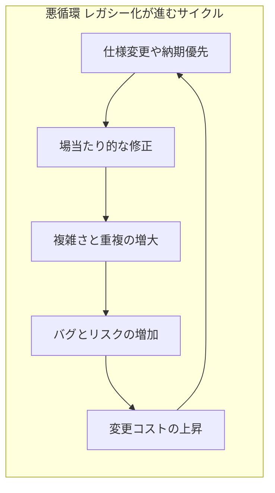
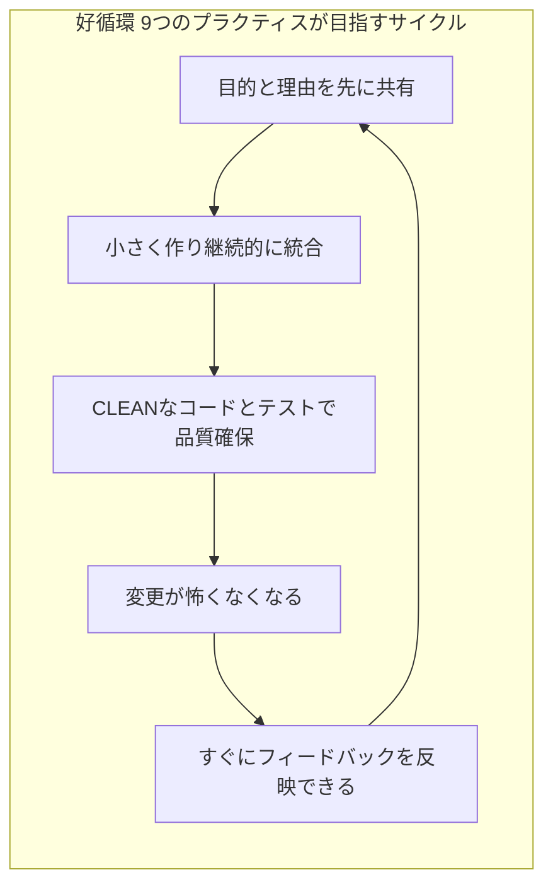
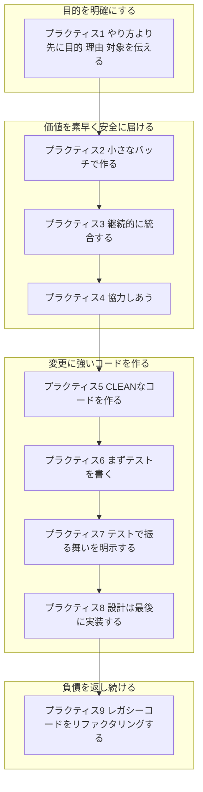
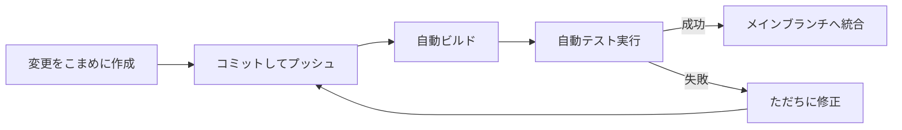
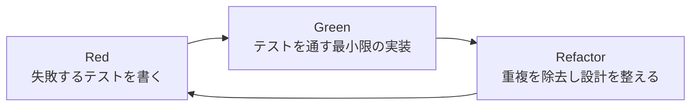
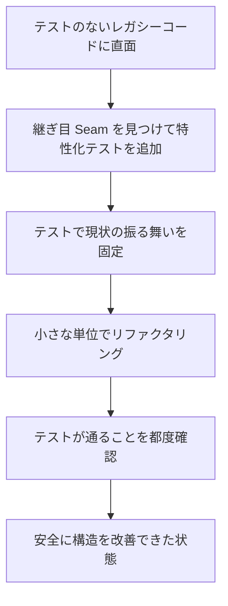

# レガシーコードからの脱却 ― 初学者向け9つのプラクティス実践ガイド

> 原著: *Beyond Legacy Code: Nine Practices to Extend the Life (and Value) of Your Software*（David Scott Bernstein 著, Pragmatic Bookshelf, 2015）
> 日本語版: 『レガシーコードからの脱却 ―ソフトウェアの寿命を延ばし価値を高める9つのプラクティス』（吉羽龍太郎・永瀬美穂・原田騎郎・有野雅士 訳, オライリー・ジャパン, 2019）

このガイドは、上記書籍の構成と主張を初学者向けに整理し直した解説資料です。書籍本文の引用ではなく、公開されている書誌情報・目次・書評・著者自身の解説記事をもとに要点を独自にまとめたものです。原文を読みたい方は末尾の参考情報からアクセスしてください。

---

## 目次

1. [この本が生まれた背景](#この本が生まれた背景)
2. [レガシーコードとは何か](#レガシーコードとは何か)
3. [学び方の姿勢：守破離](#学び方の姿勢守破離)
4. [9つのプラクティス全体像](#9つのプラクティス全体像)
5. [プラクティス1〜9 詳細解説](#プラクティス1から9詳細解説)
6. [初学者がつまずきやすいポイント](#初学者がつまずきやすいポイント)
7. [4週間ではじめる実践ロードマップ](#4週間ではじめる実践ロードマップ)
8. [まとめ](#まとめ)
9. [参考情報源（URL付き）](#参考情報源url付き)

---

## この本が生まれた背景

書籍の第I部では、ソフトウェア業界が抱える構造的な問題が描かれています。Standish Group の「CHAOSレポート」など業界調査を引き合いに出しながら、要求を厳密に固めてから作り始めるウォーターフォール型の進め方が、変化の速いソフトウェア開発には適合しにくいことを説明しています。O'Reilly / Pragmatic Bookshelf の公式紹介文でも、壊れたソフトウェアによって米国だけで年間数百億ドル規模の損失が生まれていると述べられており、著者はアジャイルやスクラムを導入しただけでは根本的な解決にならず、技術面のプラクティスが伴わなければ「レガシーコード」を量産し続けてしまうと指摘しています。

つまりこの本の主題は、

- 「できあがってしまったレガシーコードをどう改善するか」ではなく
- 「そもそもレガシーコードを生み出さないためにどう開発するか」

という点にあります。タイトルの「脱却」は、悪くなったコードとの戦い方ではなく、悪くなる土壌そのものを断つための考え方を指しています。

## レガシーコードとは何か

書籍内での定義は、単に「古いコード」ではなく、**理由を問わず修正・拡張・作業が困難になったコード**を指しています。書かれてから1年しか経っていなくても、テストがなく変更のたびに副作用が起きるようなコードは、この定義においてはすでにレガシーコードです。

以下は、レガシーコードが生まれ続ける典型的な悪循環と、9つのプラクティスが目指す好循環を対比した図です。

## 学び方の姿勢：守破離

書籍の第4章では、9つのプラクティスを身につける過程を、日本の武道・芸事に由来する「守破離（Shu-Ha-Ri）」という考え方になぞらえています。初学者はまずこの3段階を意識すると挫折しにくくなります。

| 段階 | 意味 | この本での位置づけ |
|---|---|---|
| 守（Shu） | 決められた型を忠実に守る | まずは9つのプラクティスを教科書どおりに実践してみる |
| 破（Ha） | 型の背景にある原則を理解し、応用し始める | なぜそのプラクティスが有効なのかを理解し、状況に合わせて調整する |
| 離（Ri） | 型から離れ、自分たちに合った形を確立する | チームやプロダクトの文脈に最適化された独自のプラクティスへ発展させる |

初学者はまず「守」から始め、理由を理解しないままアレンジを加えないことが推奨されています。

## 9つのプラクティス全体像

9つのプラクティスは、著者によれば主にエクストリーム・プログラミング（XP）に由来する実践を、初学者にも扱いやすい形に整理し直したものです。全体は大きく4つの目的グループに分けて理解すると把握しやすくなります。

一覧表としてもまとめておきます。

| # | 英語名 | 日本語名 | ひとことで言うと |
|---|---|---|---|
| 1 | Say What, Why, and for Whom Before How | やり方より先に目的・理由・対象を伝える | 実装方法の指示ではなく、達成したいゴールを共有する |
| 2 | Build in Small Batches | 小さなバッチで作る | 作業を小さく分割し、早く頻繁にフィードバックを得る |
| 3 | Integrate Continuously | 継続的に統合する | 変更をこまめに統合し、統合の痛みを分散する |
| 4 | Collaborate | 協力しあう | ペアプロやモブ、レビューで知識を分散・共有する |
| 5 | Create CLEAN Code | CLEANなコードを作る | 5つの品質特性を満たすコードを書く |
| 6 | Write the Test First | まずテストを書く | テストを実装より先に書き、テスト容易性の高い設計に導く |
| 7 | Specify Behaviors with Tests | テストで振る舞いを明示する | テストを仕様書として扱う |
| 8 | Implement the Design Last | 設計は最後に実装する | 設計を先に固定せず、小さなサイクルの中で発展させる |
| 9 | Refactor Legacy Code | レガシーコードをリファクタリングする | 動作を変えずに構造を継続的に改善する |

## プラクティス1から9詳細解説

### プラクティス1: やり方より先に目的・理由・対象を伝える

開発チームに実装手順（How）だけを渡すと、要求の背景が失われ、状況が変わったときに柔軟に対応できません。本書では、依頼する側が「How」を「What」に翻訳し、目的・理由・対象者（誰のためか）を先に共有することを勧めています。具体的な手段として、プロダクトオーナーを置くこと、ユーザーストーリーで要求を表現すること、受け入れ基準を明確にして自動化することが挙げられています。

初学者向けの第一歩:

- タスクを受け取ったら「これは誰のために、なぜ必要なのか」を確認する習慣をつける
- チケットやIssueに実装方法ではなく期待する振る舞いを書く
- 受け入れ条件（Acceptance Criteria）を箇条書きで明文化する

### プラクティス2: 小さなバッチで作る

大きな作業をひとまとめに進めると、フィードバックが得られるまでの時間が長くなり、認識のズレが手遅れになってから発覚します。バッチサイズを小さくすることで、フィードバックサイクルを短縮し、ビルドを高速化し、スコープを管理しやすくすることが狙いです。ストーリーをタスクに分解し、バックログとして管理する考え方もここに含まれます。

| バッチサイズ | フィードバックまでの時間 | リスクの発見 |
|---|---|---|
| 大きい（数週間〜数か月） | 遅い | 手遅れになってから発覚しやすい |
| 小さい（数時間〜数日） | 速い | 早期に軌道修正できる |

### プラクティス3: 継続的に統合する

このプラクティスは、プロジェクトの「鼓動（ハートビート）」を確立し、ビルドを自動化し、変更を早く頻繁に統合することを指します。「Done」「Done-Done」「Done-Done-Done」のように完了の定義を段階的に区別する考え方も紹介されており、単に動くコードを書いた状態と、リリース可能な状態は別物であることを強調しています。

初学者向けの第一歩:

- 1日に複数回、小さな単位でメインブランチに統合することを目指す
- ビルドとテストをCIサービスで自動化する
- テストが失敗した状態を放置せず、最優先で直す文化を作る

### プラクティス4: 協力しあう

XP由来のプラクティスとして、ペアプログラミング、バディプログラミング、スパイク（時間を区切った調査）、スウォーミングやモブプログラミング、コードレビューとレトロスペクティブの実施が紹介されています。目的は知識を個人に閉じ込めず、チーム全体で学習を増幅させることです。

| 手法 | 概要 | 向いている場面 |
|---|---|---|
| ペアプログラミング | 2人で1台のマシンを使い常に協働する | 複雑なロジックや設計判断が必要な作業 |
| バディプログラミング | 別々に作業しつつ定期的にレビューし合う | ペアほど密着できない状況 |
| スパイク | 時間を区切って未知の技術を調査する | 見積もりが困難な不確実性の高い作業 |
| モブプログラミング | チーム全員で1つの作業に取り組む | 知識共有を最優先したいとき |
| コードレビュー | 実装後または実装中に他者がコードを確認する | 品質のばらつきを減らしたいとき |

### プラクティス5: CLEANなコードを作る

このプラクティスは、Robert C. Martin（Uncle Bob）の『Clean Code』や Miško Hevery の「テスタビリティのためのコード」といった考え方へのオマージュとして、著者が独自に提唱した **CLEAN** という頭字語で語られています。

| 頭文字 | 英語 | 意味するコードの性質 |
|---|---|---|
| C | Cohesive（凝集度が高い） | 1つのクラス・関数が1つの明確な責務だけを持つ |
| L | Loosely Coupled（疎結合） | モジュール同士の依存が最小限で、変更の影響範囲が狭い |
| E | Encapsulated（カプセル化されている） | 内部の実装詳細が外部から隠蔽されている |
| A | Assertive（自己主張がある） | オブジェクトが自分の責務を自分で果たし、他者に状態を晒しすぎない |
| N | Nonredundant（重複がない） | 同じ意図のロジックが複数箇所に存在しない |

初学者向けの第一歩:

- 1つの関数・クラスが「1つの理由でしか変更されない」状態を意識する
- 他のオブジェクトの内部状態を取得して外部で判断するのではなく、振る舞いをそのオブジェクトに委譲する
- コピー＆ペーストでコードを増やす前に、共通化できないか一度立ち止まる

### プラクティス6: まずテストを書く

テストを実装の後に書くのではなく先に書くことで、設計そのものがテストしやすい形に矯正されます。本書ではテスト駆動開発（TDD）が、素早いフィードバックを生み、リファクタリングを支える安全網になり、テストしやすいコードを書く規律を作ると説明されています。あわせて、TDDがうまく機能しない場合の注意点や、チームへの導入方法にも触れられています。

初学者向けの第一歩:

- いきなり大きな機能ではなく、1つの小さな振る舞いに対して1つのテストから始める
- テストが赤（失敗）であることを必ず確認してから実装に進む
- テストを通すための実装は、まず最小限のコードで済ませる

### プラクティス7: テストで振る舞いを明示する

テストを単なる動作確認の手段ではなく、**仕様書（Specification）**として扱う考え方です。テスト名は実装の詳細ではなく期待される振る舞いを表すべきであり、テストは網羅的かつ一意であるべきだとされています。「バグが見つかる」ということは、その振る舞いを保証するテストが存在しなかったことの裏返しである、という捉え方も紹介されています。

| 悪いテスト名の例 | 良いテスト名の例 |
|---|---|
| test_constructor | 生成直後は初期値が0になっていることを確認する |
| test_case1 | 在庫が0のとき注文を拒否することを確認する |

### プラクティス8: 設計は最後に実装する

大規模な設計を最初にすべて固定してしまうと、要求の変化に対応できず、かえって変更コストが増大します。本書では、意図が伝わるコードを書くこと（Program by Intention）、循環的複雑度を下げること、オブジェクトの生成と利用を分離すること、そして小さなサイクルを積み重ねながら設計を発展させる「創発的設計（Emergent Design）」が紹介されています。ソフトウェアは書かれるよりも読まれる回数の方が多いため、読みやすさを優先する姿勢も強調されています。

初学者向けの第一歩:

- 「あとで使うかもしれない」という理由だけで抽象化や汎用化を先取りしない（YAGNI原則）
- 意味のある名前をつけ、コメントに頼らずコード自体で意図を語らせる
- 設計に行き詰まったら、まず小さくリファクタリングして状況を整理してから次に進む

### プラクティス9: レガシーコードをリファクタリングする

最後のプラクティスは、既存のコードに手を入れる場面での指針です。技術的負債を「投資」と「借金」のどちらとして扱うかという視点、コードに変更が必要になったときの判断基準、そしてオープン・クローズドの原則に沿ったリファクタリング技法などが紹介されています。著者は、テストのないレガシーコードに対しては、まずテスト用の「継ぎ目（Seam）」を作ることを勧めています。これはMichael Feathersの『Working Effectively with Legacy Code』（レガシーコード改善ガイド）の考え方とも重なります。

初学者向けの第一歩:

- レガシーコードに手を入れる前に、まず現状の振る舞いを固定するテストを書く
- 一度に大きく書き換えず、小さな安全なステップに分解する
- 「動くコードを書く」作業と「コードを整える」作業を区別して意識する

## 初学者がつまずきやすいポイント

| つまずきポイント | 起こりがちな誤解 | 対処のヒント |
|---|---|---|
| CLEANやTDDを一度に完璧に適用しようとする | 最初から高品質でなければ意味がないと考えてしまう | 守破離の「守」から始め、小さく試して徐々に習慣化する |
| テストを後回しにする | 動くコードができてからテストを書けば十分だと考える | テストを先に書くことで設計自体が整理されることを体感する |
| バッチサイズを小さくすることに抵抗を感じる | 小さく分けると非効率に見える | 統合の痛みとフィードバック遅延のコストの方が大きいことを意識する |
| リファクタリングと機能追加を同時に行う | 「ついでに直しておこう」と混在させてしまう | 変更の種類（振る舞いを変えない整理か、機能追加か）を明確に分けてコミットする |

## 4週間ではじめる実践ロードマップ

チーム全体でいきなり9つ全部を導入するのは難しいため、段階的に取り入れる例を示します。あくまで一例であり、チームの状況に合わせて調整してください。

| 週 | 重点プラクティス | やること |
|---|---|---|
| 1週目 | プラクティス1・4 | チケットに目的・理由・対象を書く運用を始め、週1回のレビュー会を設定する |
| 2週目 | プラクティス2・3 | 作業を小さく分割し、CIで自動ビルド・自動テストを毎コミットで走らせる |
| 3週目 | プラクティス6・7 | 新規コードに限りテストファーストで実装し、テスト名を振る舞いベースにする |
| 4週目 | プラクティス5・8・9 | CLEANの観点でコードレビューし、既存コードの一部に特性化テストを追加してから小さくリファクタリングする |

## まとめ

『レガシーコードからの脱却』は、アジャイルやスクラムのようなプロセス面の改善だけでは技術的負債の増大を防げないという問題意識から出発し、エクストリーム・プログラミングに由来する技術プラクティスを9つに整理し直した一冊です。書評では、新規性そのものよりも、既存の優れたプラクティスを一貫した理由づけとともに9つへ絞り込んだ点に価値があると整理されています。内容が特定の技術に依存しない点は公式紹介でも書評でも共通して挙げられており、本ガイドとしては、これが刊行から年数を経ても参照しやすい一冊であり続けている要因だと考えています。初学者はまず守破離の「守」の姿勢で1つずつ小さく試し、なぜそのプラクティスが有効なのかを体感しながら身につけていくことが推奨されます。

## 参考情報源(URL付き)

- [O'Reilly（原著の目次・概要ページ、ユーザー指定URL）](https://www.oreilly.com/library/view/beyond-legacy-code/9781680501827/)
- [Pragmatic Bookshelf 公式ページ（原著出版元、詳細目次あり）](https://pragprog.com/titles/dblegacy/beyond-legacy-code/)
- [Agile Alliance 書籍紹介ページ（国際的なアジャイル団体による紹介）](https://agilealliance.org/resources/books/beyond-legacy-code/)
- [The Agile Revolution ポッドキャスト 第171回（著名な国際的アジャイルコミュニティの人物 Craig Smith が著者 David Bernstein 本人にインタビュー）](https://theagilerevolution.com/2019/10/07/episode-171-beyond-legacy-code-with-david-bernstein/)
- [Christian Tietze氏のブログ（国際的な開発者によるCLEANコード頭字語の紹介記事）](https://christiantietze.de/posts/2015/09/clean-code/)
- [Numerickly（読了レビューと要約記事）](https://www.numerickly.com/2021/08/23/beyond-legacy-code-by-david-scott-bernstein-review-and-summary/)
- [著者 David Scott Bernstein 自身によるCLEANコード解説記事（Goodreads author blog）](https://www.goodreads.com/author_blog_posts/18772891-share-common-quality-practices?tab=book)
- [Goodreads 書籍ページ（読者レビュー、CLEAN頭字語への評価コメントを含む）](https://www.goodreads.com/book/show/26088456-beyond-legacy-code)
- [O'Reilly Japan 日本語版書誌ページ](https://www.oreilly.com/library/view/9/9784873118864/)
- [株式会社アトラクタ（日本語版訳者の一人 吉羽龍太郎氏が代表を務める会社による紹介ページ）](https://www.attractor.co.jp/book/beyond-legacy-code/)
- [irof氏のブログ（日本のアジャイル・テストコミュニティで知られるブロガーによる書評）](https://irof.hateblo.jp/entry/2019/10/02/012433)

---

*本ガイドは2026年8月27日時点のウェブ検索結果と公開書誌情報をもとに作成した独自の要約・解説であり、原著・訳書の本文を直接引用したものではありません。正確な内容は必ず原著・訳書をご参照ください。*
