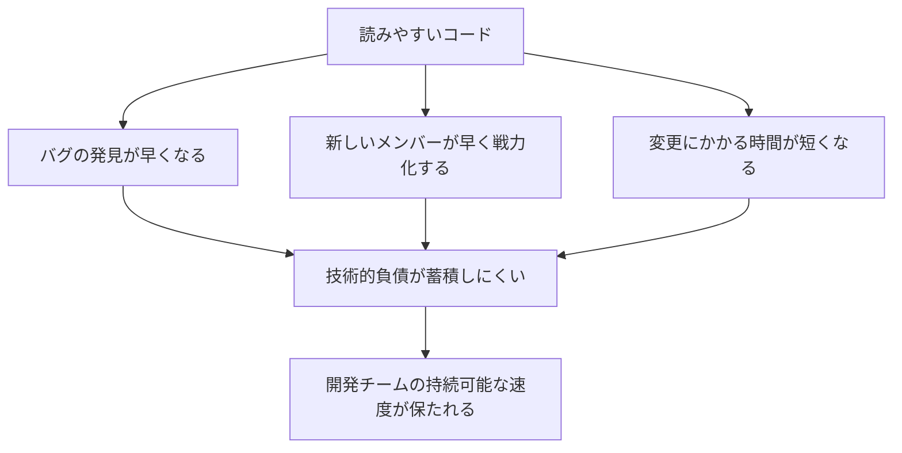
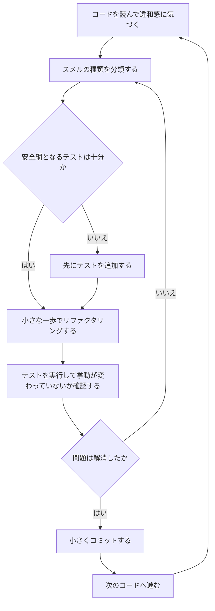
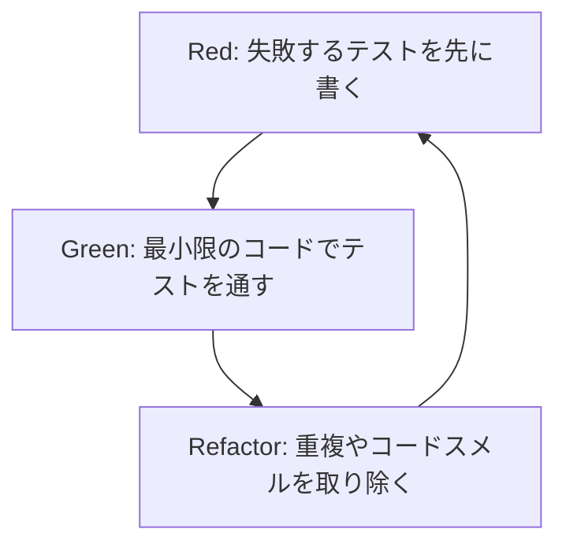
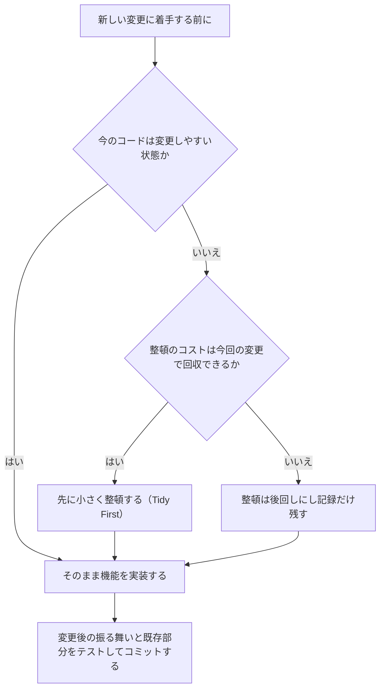

# Clean Code Cookbook 実践ガイド：初心者のためのステップバイステップ・ベストプラクティス

> 本ガイドは O'Reilly 刊『Clean Code Cookbook』（著者: Maximiliano Contieri）を軸に、Martin Fowler、Kent Beck、Robert C. Martin（Uncle Bob）、Sandi Metz など世界的に著名な開発者たちの知見を統合し、初学者が実務でそのまま使えるステップバイステップの手順としてまとめたものです。2026年8月27日時点の情報をもとにウェブ調査を行い、根拠となる一次情報（著者・出版社による公式ページや原典）または信頼できる二次情報（技術メディアの解説記事など）のURLを本文および巻末の参考文献に記載しています。

---

## 目次

1. [この本について](#1-この本について)
2. [クリーンコードとコードスメルの基礎知識](#2-クリーンコードとコードスメルの基礎知識)
3. [本書の全体像：25章とその関連](#3-本書の全体像25章とその関連)
4. [ステップバイステップ実践ガイド（初心者向け8ステップ）](#4-ステップバイステップ実践ガイド初心者向け8ステップ)
5. [数値で分かるベストプラクティス：Sandi Metzのルール](#5-数値で分かるベストプラクティスsandi-metzのルール)
6. [世界的に著名な開発者の視点](#6-世界的に著名な開発者の視点)
7. [AI時代の新しいコードスメル（2025〜2026年の動向）](#7-ai時代の新しいコードスメル20252026年の動向)
8. [保存版チェックリスト](#8-保存版チェックリスト)
9. [まとめ](#9-まとめ)
10. [参考文献・出典一覧](#10-参考文献出典一覧)

---

## 1. この本について

『Clean Code Cookbook』は、25年以上ソフトウェアエンジニアおよび講師として活動してきた Maximiliano Contieri 氏（アルゼンチン・ブエノスアイレス在住）が執筆した書籍で、O'Reilly Media から刊行されています。JavaScript、PHP、Java、Python など複数の言語による実例を使い、可読性・結合度・テスト容易性・拡張性の観点から「コードスメル（コードの臭い）」を見つけ、それを改善するための具体的なレシピ（recipe）を提示する構成になっています。

| 項目 | 内容 |
|---|---|
| タイトル | Clean Code Cookbook |
| 著者 | Maximiliano Contieri |
| 出版社 | O'Reilly Media, Inc. |
| 出版時期 | 2023年9月 |
| ページ数 | 約430ページ（音声換算 約8時間6分） |
| 対象レベル | 中級〜上級（Intermediate to Advanced） |
| 使用言語例 | JavaScript, PHP, Java, Python ほか多数 |
| 章構成 | 全25章 + 序文・用語集・索引 |
| 参照元 | O'Reilly公式書誌ページ（巻末参照） |

著者自身は、ソフトウェア設計・リファクタリング・テスト駆動開発（TDD）・コードスメルに関する記事を500本以上執筆しており、自身のブログや Substack、DEV Community、HackerNoon などでも継続的に情報発信を行っている、コードスメル分野で国際的に広く読まれている実務者です。

---

## 2. クリーンコードとコードスメルの基礎知識

初学者がまず押さえておくべきなのは、「コードスメル」と「リファクタリング」という2つの言葉の正確な意味です。

### 2.1 コードスメルとは何か

コードスメルという用語は Kent Beck が考案し、Martin Fowler の著書『Refactoring: Improving the Design of Existing Code』で広く紹介されました。Fowler はコードスメルを「システムのより深い問題を示唆する表面的な兆候」と定義しています。

重要なのは、コードスメルは「絶対に直さなければならないルール」ではなく、「注意を払うべきだという手がかり（ヒント）」に過ぎないという点です。『Clean Code Cookbook』自身も、コードスメルは症状であり、それ自体が「今すぐ全部作り直すべき」という証拠ではないという立場を取っています。

> 出典: [LinearB Blog – Code Smells: What Are They And How Can I Prevent Them?](https://linearb.io/blog/what-is-a-code-smell)

### 2.2 リファクタリングとは何か

Fowler は著書の中でリファクタリングを名詞と動詞の両面から定義しています。要約すると次のとおりです。

- **名詞としてのリファクタリング**: 外部から見た振る舞いを変えずに、ソフトウェアの内部構造だけを変更すること。
- **動詞としてのリファクタリング**: 一連の小さなリファクタリングを適用しながら、振る舞いを変えずにソフトウェアを再構築していく行為。

この「振る舞いを変えない」という制約が、リファクタリングを単なる「書き直し」と区別する最大のポイントです。なお、リファクタリングという技法自体は William Opdyke の1992年の博士論文「Refactoring Object-Oriented Frameworks」に起源を持ち、Fowler の書籍によって業界に広まりました。

> 出典: [O'Reilly – Clean Code Cookbook, Chapter 1](https://www.oreilly.com/library/view/clean-code-cookbook/9781098144715/ch01.html)

### 2.3 なぜクリーンコードが重要なのか

コードは書く時間よりも読まれる時間・保守される時間の方が圧倒的に長くなります。読みやすく変更しやすいコードは、次のような複利効果を生みます。



---

## 3. 本書の全体像：25章とその関連

『Clean Code Cookbook』は25の章で構成されており、それぞれが特定の種類のコードスメルとその解消レシピを扱っています。初学者が迷わないよう、本ガイドでは各章を5つのカテゴリーに独自に整理しました（この分類は本ガイド独自の学習用整理であり、原著の目次構成そのものではありません）。

| カテゴリー | 該当する章 |
|---|---|
| A. 設計の基礎 | 1章 Clean Code／2章 公理の設定（Setting Up the Axioms）／6章 宣言的コード |
| B. オブジェクト指向設計 | 3章 貧血モデル（Anemic Models）／4章 プリミティブ執着（Primitive Obsession）／17章 結合度（Coupling）／18章 グローバル／19章 階層（Hierarchies） |
| C. 可読性とコミュニケーション | 7章 命名（Naming）／8章 コメント／9章 標準（Standards） |
| D. 複雑さの制御 | 5章 可変性（Mutability）／10章 複雑さ（Complexity）／11章 肥大化（Bloaters）／12章 YAGNI／16章 早すぎる最適化（Premature Optimization）／23章 メタプログラミング／24章 型（Types） |
| E. 安全性と品質保証 | 13章 フェイルファスト／14章 If文／15章 Null／20章 テスト／21章 技術的負債／22章 例外／25章 セキュリティ |

原著の全25章の一覧は以下のとおりです（章タイトルの日本語訳）。

| 章 | 原題 | 内容の要点 |
|---|---|---|
| 1 | Clean Code | コードスメル・リファクタリング・レシピという用語の定義 |
| 2 | Setting Up the Axioms | 設計の前提となる「モデル」の考え方 |
| 3 | Anemic Models | データだけを持ち振る舞いを持たないオブジェクトの改善 |
| 4 | Primitive Obsession | プリミティブ型を使いすぎることの弊害と対処 |
| 5 | Mutability | 不変性（イミュータビリティ）の活用 |
| 6 | Declarative Code | 命令的コードを宣言的に書き換える |
| 7 | Naming | 命名の具体的な改善パターン |
| 8 | Comments | コメントに頼らない設計への転換 |
| 9 | Standards | コーディング規約・一貫性の確保 |
| 10 | Complexity | 不必要な複雑さの除去 |
| 11 | Bloaters | 長すぎるメソッド・引数過多などの肥大化 |
| 12 | YAGNI | 使われない機能・デッドコードの除去 |
| 13 | Fail Fast | 早期にエラーを検知する設計 |
| 14 | Ifs | 条件分岐の単純化とポリモーフィズムへの置き換え |
| 15 | Null | Nullに起因する問題の解消 |
| 16 | Premature Optimization | 早すぎる最適化を避ける |
| 17 | Coupling | クラス間の結合度を下げる |
| 18 | Globals | グローバルな状態・関数の排除 |
| 19 | Hierarchies | 継承階層の適切な設計 |
| 20 | Testing | テストコード自体の品質改善 |
| 21 | Technical Debt | 技術的負債の可視化と削減 |
| 22 | Exceptions | 例外処理の適切な設計 |
| 23 | Metaprogramming | メタプログラミングの乱用を避ける |
| 24 | Types | 型の扱い方の改善 |
| 25 | Security | 入力値のサニタイズなどセキュリティ上の基本対策 |

> 出典: [O'Reilly – Clean Code Cookbook（書誌・目次ページ）](https://www.oreilly.com/library/view/clean-code-cookbook/9781098144715/)

---

## 4. ステップバイステップ実践ガイド（初心者向け8ステップ）

ここからは、本書と著名開発者たちの知見を組み合わせた「実際に手を動かすための8ステップ」を紹介します。全体の流れは次のループ図の通りです。1つのコードスメルを見つけてから改善しコミットするまでを1サイクルとして、これを繰り返します。



### ステップ1：コードスメルに気づく（発見）

最初のステップは「何かがおかしい」と感じる感覚を養うことです。Robert C. Martin（Uncle Bob）は、優れたコードを書く感覚は経験によって養われる「鼻」のようなものだと述べています。最初は意識的にチェックリスト（本ガイドの[8章](#8-保存版チェックリスト)を参照）を使い、徐々に自然に気づけるようにしていきましょう。

代表的な初期サインには次のようなものがあります。

- 同じようなコードが複数箇所にコピーされている（重複コード）
- 1つの関数やメソッドが数十行を超えている
- 変数名が `data`、`temp`、`obj` のように意味を持たない
- if文やswitch文が深くネストしている
- コメントがないと処理内容が理解できない

### ステップ2：スメルを分類する

気づいた違和感がどのカテゴリーに属するかを、[3章の表](#3-本書の全体像25章とその関連)を使って分類します。分類することで、どの改善レシピ（リファクタリング手法）を適用すべきかの見当がつきやすくなります。

### ステップ3：変更前にテストの安全網を用意する

リファクタリングの定義は「振る舞いを変えないこと」でした。振る舞いが変わっていないことを機械的に検証する手段がテストです。テストが存在しない、または不十分な場合は、まず現状の振る舞いを固定する「特性化テスト」を先に書きます。特性化テストが守れるのは、そこで書いたケースの範囲だけです。正常系をなぞるだけでは変更による退行を見逃すため、境界値と異常系（例外・エラー経路）も併せて確認しておきます。

新規のロジックを書く場合は、Kent Beck が提唱し普及させた TDD（テスト駆動開発）の Red-Green-Refactor サイクルが世界中の現場で広く実践されています。



### ステップ4：小さな一歩から始める（Tidy First の考え方）

Kent Beck は2023年の著書『Tidy First?』の中で、大きなリファクタリングをいきなり行うのではなく、「Tidying（整頓）」と呼ばれる数分〜数時間で終わる小さく安全な変更を積み重ねる方法を提案しています。ガード節の導入、変数名の変更、不要コードの削除などがその代表例です。

新しい機能を実装する前には、次のような判断をするとよいでしょう。



**コード例（マジックナンバーの整頓）**

```python
# Before
if user.age > 17:
    grant_access(user)

# After
# user.age は満年齢（整数）である前提。この前提のもとで `> 17` と `>= 18` は同値になる。
LEGAL_ADULT_AGE = 18

if user.age >= LEGAL_ADULT_AGE:
    grant_access(user)
```

数値の意味を名前で表すだけでも、読み手の理解速度は大きく変わります。

### ステップ5：名前を改善する

命名は『Clean Code Cookbook』7章、そして Robert C. Martin の著書『Clean Code』の両方で最重要トピックの一つとして扱われています。良い名前は「なぜ存在し、何をし、どう使われるか」を説明できる名前です。

**コード例**

```javascript
// Before
function calc(a, b, t) {
  return a * b * (1 + t);
}

// After
function calculatePriceWithTax(basePrice, quantity, taxRate) {
  return basePrice * quantity * (1 + taxRate);
}
```

### ステップ6：関数とクラスを小さく保つ

長すぎるメソッドや肥大化したクラスは「複雑さ」「肥大化（Bloaters）」の章で扱われる典型的なスメルです。1つの関数・クラスが持つ責務は1つに絞るという考え方（単一責任原則、SRP）に基づき、機能ごとに小さな単位へ分割します。数値による具体的な目安は[5章](#5-数値で分かるベストプラクティスsandi-metzのルール)で紹介します。

**コード例（メソッドの抽出）**

```python
# Before
def process_order(order):
    total = 0
    for item in order.items:
        total += item.price * item.quantity
    tax = total * 0.1
    total_with_tax = total + tax
    send_email(order.customer_email, f"合計: {total_with_tax}")
    return total_with_tax

# After
def process_order(order):
    subtotal = calculate_subtotal(order.items)
    total_with_tax = apply_tax(subtotal)
    notify_customer(order.customer_email, total_with_tax)
    return total_with_tax

def calculate_subtotal(items):
    return sum(item.price * item.quantity for item in items)

def apply_tax(amount, tax_rate=0.1):
    return amount * (1 + tax_rate)

def notify_customer(email, total):
    send_email(email, f"合計: {total}")
```

### ステップ7：条件分岐・Null・例外を安全にする

If文の乱立、Nullチェックの散在、握りつぶされた例外は、いずれもバグを見えにくくする典型的なスメルです。以下は代表的な対処パターンです。

| スメル | 症状 | 対処パターン |
|---|---|---|
| 深くネストしたif文 | 可読性が低く分岐を追いにくい | ガード節（早期return）で平坦化する |
| 種類ごとの分岐（switch/if-elseif） | 種類が増えるたびに分岐を修正する必要がある | ポリモーフィズム（多態性）に置き換える |
| null チェックの散在 | `if (x != null)` があちこちに存在する | Null Object パターンで代替する |
| 空のcatchブロック | 例外が握りつぶされ原因不明のバグになる | 例外を握りつぶさず、適切な粒度で再送出・記録する |

**コード例（ガード節）**

```java
// Before
public void ship(Order order) {
    if (order != null) {
        if (order.isPaid()) {
            if (!order.isShipped()) {
                dispatch(order);
            }
        }
    }
}

// After
public void ship(Order order) {
    if (order == null) return;
    if (!order.isPaid()) return;
    if (order.isShipped()) return;

    dispatch(order);
}
```

### ステップ8：小さくコミットし、継続的に磨き続ける

Robert C. Martin が提唱する「ボーイスカウト・ルール」は、「キャンプ場を、来たときよりも綺麗にして帰る」という考え方をソフトウェア開発に当てはめたものです。触れたコードは、変更のついでに少しだけ綺麗にしてからコミットする、という小さな習慣の積み重ねがコードベース全体の劣化を防ぎます。

> 出典: [InformIT – The Boy Scout Rule（Robert C. Martin）](https://www.informit.com/articles/article.aspx?p=1235624&seqNum=6)

このステップが終わったら、ステップ1に戻って次のコードスメルを探します。これが本ガイド冒頭のループ図の意味です。

---

## 5. 数値で分かるベストプラクティス：Sandi Metzのルール

「小さく保つ」と言っても、初学者にとっては具体的な基準がないと判断が難しいものです。著名なRuby技術者 Sandi Metz が提唱した「開発者のためのルール」は、経験の浅い開発者でも判断しやすい具体的な数値基準を示しており、Ruby以外の言語のコミュニティでも広く参照されています。

| ルール | 内容 |
|---|---|
| クラスの行数 | 1クラスは100行を超えない |
| メソッドの行数 | 1メソッドは5行を超えない |
| 引数の数 | メソッドの引数は4個まで |
| コントローラの責務 | 1つのコントローラアクションはインスタンス化するオブジェクトを1つまでにする |

著者自身が明言しているとおり、これらは絶対的な法則ではなく「良い設計判断が難しい人のための簡略化された指標」です。ペアやレビュアーに理由を説明できるのであれば、ルールを破ってもよいとされています。

> 出典: [thoughtbot – Sandi Metz' Rules For Developers](https://thoughtbot.com/blog/sandi-metz-rules-for-developers)

---

## 6. 世界的に著名な開発者の視点

| 開発者 | 代表的な功績 | クリーンコードに関する視点（要約） | 出典URL |
|---|---|---|---|
| Martin Fowler | 『Refactoring』著者、リファクタリングカタログの体系化 | コードスメルは「表面的な兆候」であり、深い問題を示唆するサインである | [laputan.org（Fowlerの書籍原文PDF）](https://www.laputan.org/pub/patterns/fowler/smells.pdf) |
| Kent Beck | XPの創始者、TDDの普及者、『Tidy First?』著者 | 大きなリファクタリングより、数分〜数時間で終わる小さな「整頓」を積み重ねる方が持続可能 | [Kent Beck's Substack – Software Design: Tidy First?](https://tidyfirst.substack.com/p/management-section-intro-tidy-together) |
| Robert C. Martin (Uncle Bob) | 『Clean Code』『Clean Architecture』著者、SOLID原則の提唱者 | 「触れたコードは来たときより綺麗にして帰る」というボーイスカウト・ルールを提唱 | [InformIT – The Boy Scout Rule](https://www.informit.com/articles/article.aspx?p=1235624&seqNum=6) |
| Sandi Metz | 『Practical Object-Oriented Design in Ruby』著者 | クラス100行・メソッド5行など、判断に迷ったときの具体的な数値基準を提供 | [thoughtbot – Sandi Metz' Rules For Developers](https://thoughtbot.com/blog/sandi-metz-rules-for-developers) |
| Maximiliano Contieri | 『Clean Code Cookbook』著者、コードスメルシリーズを500本以上執筆 | コードスメルは「意見」であり絶対的なルールではなく、文脈に応じた判断が必要 | [maximilianocontieri.com – Code Smells series](https://maximilianocontieri.com/series/code-smells) |

---

## 7. AI時代の新しいコードスメル（2025〜2026年の動向）

生成AIによるコーディング支援が一般化したことで、Contieri 氏をはじめとする実務者は、AI特有の新しいコードスメルについても発信を続けています。2026年8月時点で特に参照する価値のあるトピックを3つ紹介します。

### 7.1 Workslop（ワークスロップ）コード

AIが生成したコードを、内容を十分に理解しないままコピー＆ペーストして採用してしまう状態を指します。コンパイルは通り、テストもパスし、一見きれいに見えても、なぜそのコードが動作するのかを自分で説明できない場合は要注意です。「AIが書いたコードであっても、あなた自身がそのコードに責任を持つ」という原則が強調されています。

> 出典: [HackerNoon – Code Smell 313: "Workslop" in AI-Assisted Programming](https://hackernoon.com/code-smell-313-workslop-in-ai-assisted-programming)

### 7.2 Model Collapse（モデル崩壊）パターン

人間によるレビューを挟まずにAIによる修正を何度も繰り返すと、機械学習分野の「モデル崩壊」に似た劣化が発生するという指摘です。ドメイン固有の語彙が失われたり（例えば `Customer` が汎用的な `data` に変わっていくなど）、命名の一貫性が徐々にぶれていく現象が起こり得ます。対策として、AIによる変更のたびに人間がレビューする、ドメイン語彙を保つゴールデンテストを用意する、といった方法が挙げられています。

> 出典: [DEV Community – Code Smell 314: Model Collapse](https://dev.to/mcsee/code-smell-314-model-collapse-5ckc)

### 7.3 Nitpicking（枝葉末節への固執）

コードレビューの注意力を、カンマの位置や命名の些細な癖といったフォーマット上の指摘に使い切ってしまい、アーキテクチャやセキュリティ、設計意図といった本質的な問題を見逃してしまう現象です。フォーマットや静的解析で機械的に検出できる部分は自動化ツール（Linter・フォーマッタなど）に任せ、人間のレビューはアーキテクチャや意図の議論に集中させることが推奨されています。

> 出典: [Maximiliano Contieri – Code Smell 316: Nitpicking](https://maxicontieri.substack.com/p/code-smell-316-nitpicking)

---

## 8. 保存版チェックリスト

コードをコミットする前、あるいはコードレビューを行う際に使えるチェックリストです。

| 観点 | チェック項目 |
|---|---|
| 命名 | 変数・関数・クラス名が「何をするか」を説明しているか |
| 関数の大きさ | 1つの関数が1つのことだけを行っているか |
| クラスの大きさ | クラスが単一の責務に絞られているか（目安: 100行、メソッド5行） |
| 重複 | 同じロジックが複数箇所にコピーされていないか |
| 条件分岐 | ネストが深すぎないか、ポリモーフィズムで置き換えられないか |
| Null | Nullチェックが散在せず、Null Objectなどで代替できないか |
| 例外 | 例外を握りつぶしていないか、適切な粒度で扱っているか |
| テスト | 変更前にテストが存在するか、テストが実際の振る舞いを検証しているか |
| コメント | コメントに頼らず、コード自体で意図が伝わるか |
| マジックナンバー・文字列 | 意味のある定数や値オブジェクトに置き換えられているか |
| セキュリティ | 外部入力のサニタイズや検証が行われているか |
| AIコード | AIが生成したコードの内容を自分で説明できるか、レビューを経ているか |
| コミット単位 | 変更は小さく、整頓（振る舞いを変えない変更）と機能変更を分けたうえで、テストが通る単位でコミットされているか |

---

## 9. まとめ

『Clean Code Cookbook』は、コードスメルという「気づきの言語」を軸に、命名・複雑さ・条件分岐・Null・例外・テスト・セキュリティなど幅広いテーマを、実践的なレシピ形式でカバーしている書籍です。本ガイドで紹介したステップ（発見 → 分類 → テストの安全網 → 小さな一歩 → 命名 → サイズ管理 → 分岐とNullの安全化 → 継続的改善）を繰り返すことで、初学者でも徐々にコードの「臭い」に気づけるようになります。

重要なのは、Fowler・Beck・Martin・Metz・Contieri のいずれもが強調しているとおり、これらは絶対的な規則ではなく、状況に応じて判断するための「指針」であるという点です。まずは小さく試し、チームで理由を説明できる形で適用していくことが、クリーンコードへの最も確実な近道です。

---

## 10. 参考文献・出典一覧

- [O'Reilly – Clean Code Cookbook（書誌・目次ページ）](https://www.oreilly.com/library/view/clean-code-cookbook/9781098144715/)
- [O'Reilly – Clean Code Cookbook, Chapter 1（Clean Code）](https://www.oreilly.com/library/view/clean-code-cookbook/9781098144715/ch01.html)
- [Maximiliano Contieri 公式サイト](https://maximilianocontieri.com/)
- [Maximiliano Contieri – Code Smells series](https://maximilianocontieri.com/series/code-smells)
- [Maximiliano Contieri – Code Smell 316: Nitpicking（2025年12月）](https://maxicontieri.substack.com/p/code-smell-316-nitpicking)
- [Maximiliano Contieri / DEV Community – Code Smell 314: Model Collapse（2025年11月）](https://dev.to/mcsee/code-smell-314-model-collapse-5ckc)
- [Maximiliano Contieri / HackerNoon – Code Smell 313: "Workslop" in AI-Assisted Programming（2025年11月）](https://hackernoon.com/code-smell-313-workslop-in-ai-assisted-programming)
- [Martin Fowler – Bad Smells in Code（『Refactoring』原文PDF）](https://www.laputan.org/pub/patterns/fowler/smells.pdf)
- [LinearB Blog – Code Smells: What Are They And How Can I Prevent Them?](https://linearb.io/blog/what-is-a-code-smell)
- [Kent Beck's Substack – Software Design: Tidy First?](https://tidyfirst.substack.com/p/management-section-intro-tidy-together)
- [Sandor Dargo's Blog – Tidy First? by Kent Beck（書評）](https://www.sandordargo.com/blog/2024/03/16/tidy-first-by-kent-beck)
- [thoughtbot – Sandi Metz' Rules For Developers](https://thoughtbot.com/blog/sandi-metz-rules-for-developers)
- [InformIT – The Boy Scout Rule（Robert C. Martin, What Is Clean Code?より）](https://www.informit.com/articles/article.aspx?p=1235624&seqNum=6)
- [Wikipedia – Design smell（Fowler・R.C. Martinの定義の整理）](https://en.wikipedia.org/wiki/Design_smell)

*本ガイドは2026年8月27日時点で参照可能な上記情報をもとに作成しています。書籍の内容そのものの引用は最小限にとどめ、可能な限り独自の説明・独自のコード例で構成しています。*
