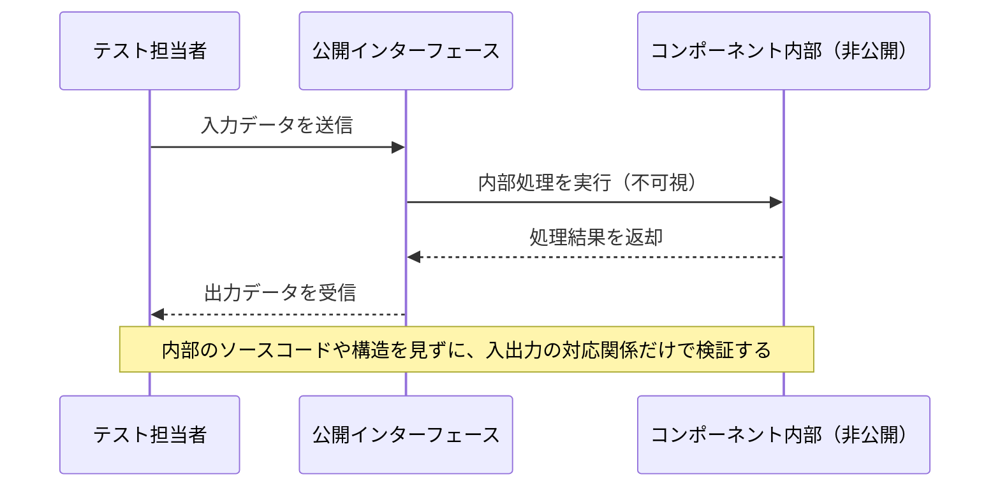
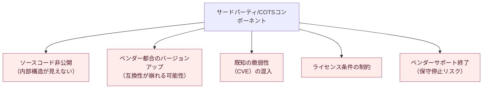
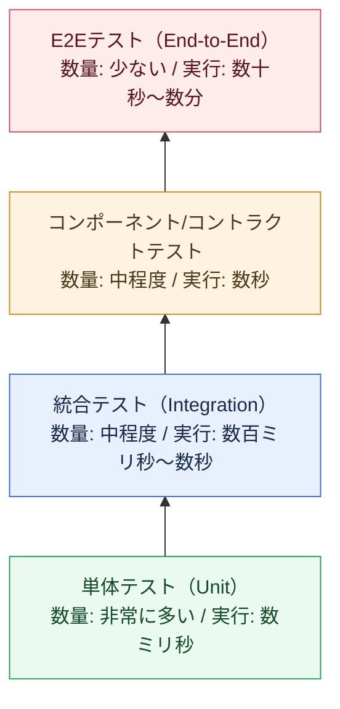
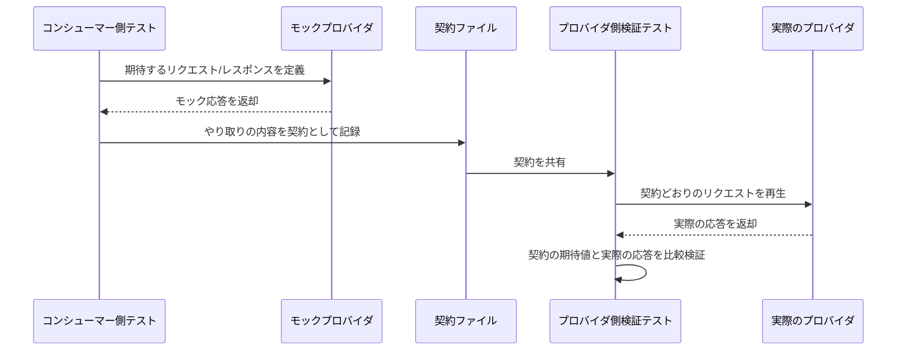
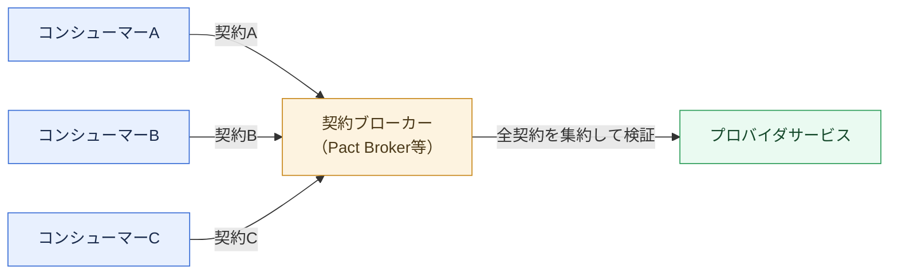
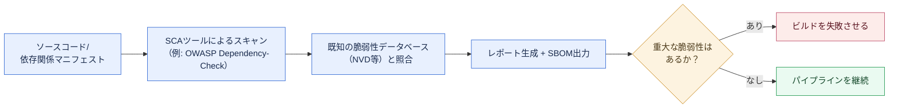
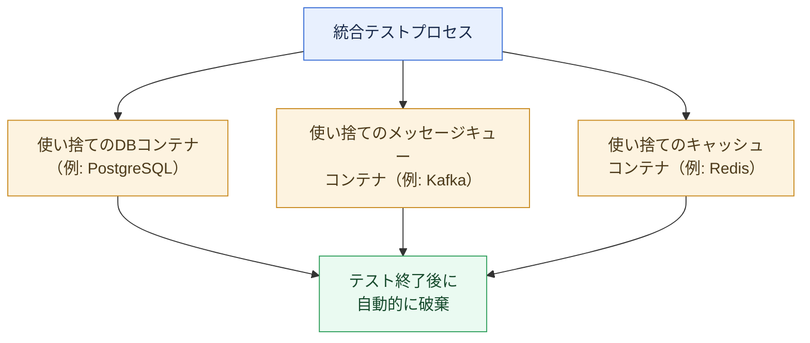
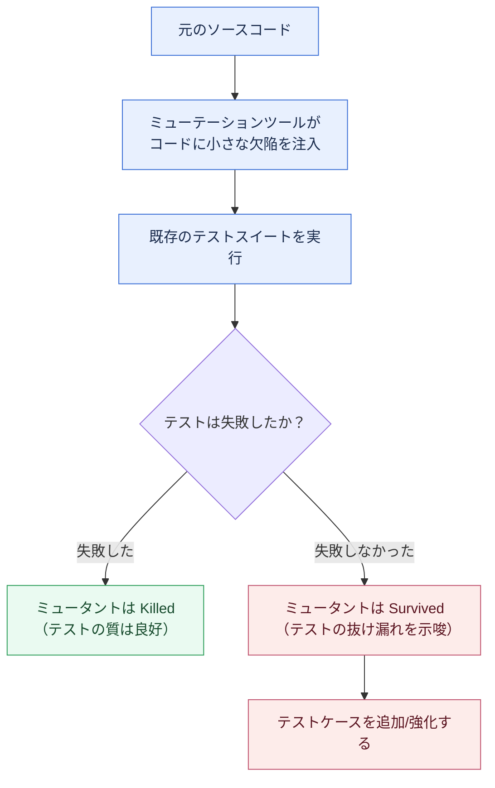

# コンポーネントベースソフトウェアシステムのテストと品質保証 完全ガイド ― 初学者のためのステップバイステップ解説

---

## はじめに：このガイドについて

現代のソフトウェアは、ゼロからすべてを自前で書き上げることはほとんどありません。認証機能はライブラリを使い、決済はサードパーティのSDKを呼び出し、ログ基盤はOSSパッケージに頼り、システム全体はマイクロサービスという名の小さな「コンポーネント」の集合体として組み上がっています。このように、独立して開発・配布・交換可能な部品（コンポーネント）を組み合わせてシステムを構築するアプローチを**コンポーネントベースソフトウェア工学（Component-Based Software Engineering, CBSE）**と呼びます。

CBSEが普及するほど、テストと品質保証（QA）のやり方は、昔ながらの「1つの巨大なプログラムを頭から尾まで読んでテストする」方式では通用しなくなります。コンポーネントの中身（ソースコード）が見えないことすらあり、テスト対象は「関数」ではなく「契約（インターフェース）」になり、品質保証は「自分のコードだけ」ではなく「自分が組み込んだ他人のコードの品質」まで含めて考える必要が出てきます。

このガイドは、Jerry Gao・H.-S. J. Tsao・Ye Wu共著『Testing and Quality Assurance for Component-based Software』（Artech House, 2003）[1] が体系立てた「コンポーネントの導入」「ソフトウェアの検証手法」「コンポーネントベースソフトウェアの検証手法」「品質保証」という4部構成の考え方を土台にしながら、2026年現在の実務（マイクロサービス、コンテナ、コンテナ化されたCI/CD、コントラクトテスト、サプライチェーンセキュリティなど）に合わせてアップデートした内容です。Martin Fowler（ThoughtWorks）、Google、OWASP、ISTQBなど、国際的に著名な開発者・組織の発信内容を参照しながら、初学者でも迷わないようステップバイステップで解説していきます。

### 対象読者

- ソフトウェアテストを学び始めたばかりのエンジニア・QAエンジニア
- マイクロサービスやOSSライブラリを多用したシステムで「どこまで自分でテストすればよいか」に悩んでいる方
- コンポーネント/モジュール単位の品質保証プロセスを設計したいテックリード・アーキテクト

### このガイドで学べること

- コンポーネントベースソフトウェアとは何か、なぜ普通のテストと違うのか
- 単体テストからE2Eテストまでの全体像と、テストピラミッドの正しい読み方
- ブラックボックスのコンポーネント／COTS（商用オフザシェルフ）コンポーネントを安全に組み込むための考え方
- コントラクトテスト（契約テスト）とコンシューマー駆動契約（CDC）の仕組み
- サードパーティ依存関係のセキュリティ品質保証（SCA/SBOM）
- テストの「質」そのものを測定するミューテーションテスト
- CI/CDパイプラインへのテスト自動化の組み込み方

---

## 目次

1. コンポーネントベースソフトウェアの基礎
2. なぜコンポーネントのテストは難しいのか
3. テストレベルの全体像とテストピラミッド
4. コンポーネントテストと統合テストの実践
5. コントラクトテストとコンシューマー駆動契約（CDC）
6. サードパーティ／COTSコンポーネントの品質保証
7. 現実的な依存関係を使ったテスト（Testcontainers）
8. テストの「質」を測る：カバレッジとミューテーションテスト
9. 品質特性と非機能テスト
10. CI/CDにおける継続的テストパイプライン
11. まとめ：品質保証チェックリスト
12. 参考文献

---

## 1. コンポーネントベースソフトウェアの基礎

### 1.1 「ソフトウェアコンポーネント」とは何か

コンポーネントという言葉は現場でかなり緩く使われますが、学術的にもっとも広く引用される定義は、マイクロソフトリサーチのClemens Szyperskiによるものです。Szyperskiは著書『Component Software: Beyond Object-Oriented Programming』の中で、ソフトウェアコンポーネントを次のような性質を持つ合成の単位として整理しています[2], [3]。

- **契約によって明示されたインターフェースを持つ**：何を提供し、何を必要とするかが仕様として明確になっている
- **明示的なコンテキスト依存のみを持つ**：実行環境への依存関係が隠れておらず、宣言されている
- **独立してデプロイできる**：一部だけを切り出して配布することができない、まとまった単位である
- **サードパーティによる合成の対象になる**：作った本人以外が、ソースコードを見ずに組み合わせて使える

この定義のポイントは、「コンポーネント＝クラス」でも「コンポーネント＝マイクロサービス」でもなく、**独立して配布・合成できる単位である**という点です。npmパッケージ、Javaのライブラリ、REST APIを公開するマイクロサービス、社内で共有されるSDK、さらにはOS上で動く実行ファイルまで、この定義に当てはまるものはすべて「コンポーネント」として同じ枠組みで語ることができます。

### 1.2 コンポーネントベースソフトウェアシステム（CBSS）の特徴

Gao・Tsao・Wuの書籍では、こうしたコンポーネントを組み合わせて作られたシステムを **CBSS（Component-Based Software System）** と呼び、次のような特徴を挙げています[1]。

| 特徴 | 説明 |
| --- | --- |
| 独立した開発ライフサイクル | 各コンポーネントは別々のチーム・会社が別々のスケジュールで開発する |
| ブラックボックス性 | 利用者はソースコードではなく、インターフェース仕様だけを頼りに使う |
| 再利用性 | 同じコンポーネントが複数のシステムで再利用される |
| 合成可能性 | 複数のコンポーネントを組み合わせて新しい機能を作れる |
| 進化の非同期性 | コンポーネントごとにバージョンアップのタイミングが異なる |

### 1.3 モノリシックな開発との違い

下図は、1つのアプリケーションを最初から最後まで自社で書き切る「モノリシック開発」と、複数のコンポーネントを選定・統合していく「コンポーネントベース開発」のテストの流れを比較したものです。


モノリシック開発では「設計者＝テスト対象コードを書いた人」であることが多く、ソースコードを見ながらテストを設計する**ホワイトボックステスト**が中心になります。一方、コンポーネントベース開発では「自分が書いていないコード」をどう検証するかが主戦場になり、インターフェース仕様と入出力だけを頼りにする**ブラックボックステスト**の比重が大きくなります。

### 1.4 現代における「コンポーネント」の広がり

2003年の原著が主に念頭に置いていたのはCORBA・COM・EJBといったコンポーネントモデルでしたが、その考え方は形を変えて現在も生き続けています。

| 時代 | 代表的なコンポーネントの形 |
| --- | --- |
| 2000年代前半 | CORBA、COM/DCOM、Enterprise JavaBeans（EJB） |
| 2000年代後半〜2010年代 | Webサービス（SOAP/WSDL）、OSGiバンドル |
| 2010年代〜現在 | REST/gRPCマイクロサービス、npm/PyPI/Maven等のパッケージ、コンテナイメージ |
| 現在進行形 | サーバーレス関数（FaaS）、AIエージェントが呼び出すツール/MCPサーバー |

呼び方や技術は変わっても、「独立して配布され、契約によってのみやり取りする単位を、ソースコードを見ずに組み合わせて使う」という本質的な課題は変わっていません。

---

## 2. なぜコンポーネントのテストは難しいのか

### 2.1 ブラックボックスの壁

自社で書いたコードなら、バグが疑われる箇所にログを仕込んだり、デバッガでステップ実行したりできます。しかし、サードパーティのライブラリやマイクロサービスが相手だと、そうはいきません。



このように「入力と出力の対応関係だけで正しさを判断する」テストが**ブラックボックステスト**です。ISTQB（国際ソフトウェアテスト資格認定委員会）の用語集でも、コンポーネントテストは個々のソフトウェア／ハードウェアコンポーネントに焦点を当てたテストレベルであり、ブラックボックス・ホワイトボックス・グレーボックスのいずれの技法も使われうると定義されています[4]。ただしコンポーネントの中身が見えない場合、選べる技法は自然とブラックボックス寄りになります。

### 2.2 COTS（商用オフザシェルフ）コンポーネント特有の課題

自社が管理していない「買ってきた」「借りてきた」コンポーネント（COTS: Commercial Off-The-Shelf）を組み込む場合、原著が指摘する課題は今でもそのまま当てはまります[1]。



これらのリスクへの向き合い方は第6章（サードパーティ／COTSコンポーネントの品質保証）で詳しく扱います。

### 2.3 テスト容易性（Testability）という設計上の課題

コンポーネントが「テストしやすいかどうか」は、そのコンポーネントの設計そのものに左右されます。原著ではこれを**コンポーネントテスタビリティ（component testability）**と呼び、次のような観点を挙げています[1]。

- **可観測性（Observability）**：内部の状態や処理結果を外部から観測できるか（ログ、メトリクス、ヘルスチェックエンドポイントなど）
- **制御可能性（Controllability）**：外部からテスト用の入力や状態を注入できるか（テスト用フラグ、フィーチャーフラグ、モック可能な依存注入など）
- **組み込みテスト（Built-in Test）**：コンポーネント自身が自己診断機能やセルフテスト機能を持っているか

自社でコンポーネントを設計する立場であれば、この3点を意識するだけでテストのしやすさが大きく変わります。

### 2.4 バージョンと互換性の問題

コンポーネントベースシステムでは、あるコンポーネントのバージョンアップが、それを利用している他のコンポーネントを壊す「破壊的変更（Breaking Change）」がいつでも起こり得ます。これは第5章で扱う**コントラクトテスト**が解決しようとしている中心的な課題です。

---

## 3. テストレベルの全体像とテストピラミッド

### 3.1 テストピラミッド（Fowler / Cohn）

「どの種類のテストを、どれくらいの比率で書くべきか」という問いに対する古典的な回答が**テストピラミッド**です。この概念はMike Cohnの著書に由来し、Martin Fowlerが自身のbliki（ブログ兼wiki）で広く紹介したことで実務者の間に定着しました[5]。Fowlerは、GUIを介した従来型のテストよりもはるかに多くの自動テストを単体テストレベルで行うべきだと説明しています[5]。



ピラミッドの下ほどテストの数が多く、実行が速く、対象範囲が狭い。上に行くほどテストの数は少なく、実行に時間がかかり、対象範囲（ユーザーシナリオ全体）は広くなります。Googleのテストブログも、E2Eテストばかりに頼るとテストスイート全体が遅く壊れやすくなると警告し、下位レイヤーのテストを厚くすることを推奨しています[6]。

### 3.2 Googleの「Small/Medium/Large」モデル

Googleは社内で「単体/統合/システム」という分類の代わりに、テストが使うリソース（プロセス数、ネットワーク、時間）に着目した **Small・Medium・Large** という分類を使っています[7], [8]。

| サイズ | 実行環境 | 典型的な対応関係 | 目的 |
| --- | --- | --- | --- |
| Small | 単一プロセス内、ネットワークI/O禁止 | 単体テストに相当 | 1つの関数・クラスのロジックを検証 |
| Medium | 単一マシン上の複数バイナリ | 統合テストに相当 | 少数のコンポーネント間の連携を検証 |
| Large | 複数マシンにまたがる分散環境 | E2E/システムテストに相当 | 本番に近い環境でユーザーシナリオ全体を検証 |

書籍『Software Engineering at Google』でも、システム全体を1つのバイナリにまとめてしまうと本番トポロジーへの忠実度は下がるが実行は速くなり、逆に複数マシンに分散させるほど忠実度は上がるがテストは遅く不安定（flaky）になりやすいという、忠実度と速度のトレードオフが説明されています[8]。

### 3.3 テストレベル比較表

ここまでの内容を、実務でよく使われる5つのテストレベルとして整理すると次のようになります。ThoughtWorksのToby Clemsonがマイクロサービス向けにまとめたテスト戦略も、基本的にこの5層構造に沿っています[9]。

| テストレベル | 検証すること | 依存関係の扱い | 実行速度 | 主な担当者 |
| --- | --- | --- | --- | --- |
| 単体テスト | 1つの関数/クラスのロジック | すべてモック/スタブ | 非常に速い | 開発者 |
| 統合テスト | 自コンポーネントと直接の依存先（DB等） | 実物 or 軽量な代替（コンテナ等） | 速い〜中程度 | 開発者 |
| コンポーネントテスト | 1つのサービス/コンポーネント全体 | 外部依存はスタブ化 | 中程度 | 開発者/QA |
| コントラクトテスト | サービス間のインターフェース契約の整合性 | モックプロバイダ/コンシューマー | 速い | 開発者 |
| E2Eテスト | ユーザーシナリオ全体 | すべて実物（本番同等環境） | 遅い | QA/開発者 |

なお、Fowler自身も「単体テスト」や「統合テスト」といった用語は業界内でも定義が揺れがちであることを認めており、チームごとに用語の定義をすり合わせておくことが重要だと述べています[10]。

---

## 4. コンポーネントテストと統合テストの実践

### 4.1 コンポーネントテストとは

ISTQBの定義では、コンポーネントテストは個々のソフトウェアコンポーネントに焦点を当てたテストレベルとされています[4]。原著の言葉を借りれば、コンポーネントテストの目的は「そのコンポーネント単体が、公開された仕様どおりに振る舞うこと」を、他のコンポーネントと組み合わせる前に確認することです[1]。

コンポーネントテストと単体テストの違いは、スコープの粒度にあります。単体テストが「1つの関数・1つのクラス」を対象にするのに対し、コンポーネントテストは「1つのマイクロサービス」や「1つのデプロイ可能な単位」全体を対象にし、外部の依存先だけをスタブ化して検証します。

### 4.2 統合テスト：トップダウンとボトムアップ

複数のコンポーネントを組み合わせていく際、すべてのコンポーネントが同時に完成することはまずありません。そこで、未完成の部分を仮の実装で埋めながら段階的に統合していく2つの伝統的な戦略があります。


| 戦略 | 仮の実装 | メリット | デメリット |
| --- | --- | --- | --- |
| トップダウン | スタブ（下位コンポーネントの代役） | 上位の制御ロジックを早期に検証できる | 下位コンポーネントの実際の挙動は後回しになる |
| ボトムアップ | ドライバ（上位コンポーネントの代役） | 基盤となる部品から確実に固められる | ユーザーに近いシナリオの検証が遅れる |

実務では、この2つを組み合わせた「サンドイッチ統合」や、後述するTestcontainersのように実物に近い依存関係を使う方法が広く使われています。

### 4.3 テストダブル（Test Double）の使い分け

コンポーネントテストや単体テストでは、外部依存の代わりに「テストダブル」と呼ばれる代役を使います。Fowlerは、外部サービスとの通信のように低速・不安定・チーム管理外な依存関係に対してテストダブルを使うことで、テストの速度と決定性を確保できると説明しています[11]。ただし同時に、テストダブルが実際のサービスの挙動を正しく模倣できているかという新たな課題が生まれる点にも注意が必要です[11]。この課題こそが、次章で扱う「コントラクトテスト」が解決しようとしている問題です。

| 種類 | 役割 |
| --- | --- |
| ダミー（Dummy） | 引数を埋めるためだけに存在し、実際には使われない |
| スタブ（Stub） | あらかじめ決められた固定の応答を返す |
| スパイ（Spy） | 呼び出された内容を記録し、後で検証できる |
| モック（Mock） | 期待される呼び出しをあらかじめ定義し、それ以外の呼び出しがあれば失敗させる |
| フェイク（Fake） | 簡易だが実際に動作する実装（インメモリDBなど） |

---

## 5. コントラクトテストとコンシューマー駆動契約（CDC）

### 5.1 なぜサービス間の統合テストは壊れやすいのか

マイクロサービス間の連携をすべてE2Eテストで確認しようとすると、関係するサービスをすべて起動する必要があり、テストは遅く、環境要因で不安定（flaky）になりがちです。Toby Clemsonのテスト戦略解説でも、統合テストの層は「自分のサービスと直接の依存先との間のやり取りだけ」に絞り、より広い範囲の検証は別の手法に委ねることが推奨されています[9]。

その「別の手法」の1つが**コントラクトテスト（契約テスト）**です。コントラクトテストは、サービス間でやり取りされるメッセージが「契約」としてドキュメント化された共通認識に沿っているかどうかを、それぞれのアプリケーションを単独でテストすることによって確認する手法です[12]。Pactプロジェクトの公式ドキュメントは、これを「家に火をつけて火災報知器をテストする必要はなく、ボタンを押してテストすればよい」という比喩で説明しています[12]。

### 5.2 コンシューマー駆動契約（CDC）とは

**コンシューマー駆動契約（Consumer-Driven Contracts, CDC）**は、ThoughtWorksのIan Robinsonが2006年に提唱したパターンで、契約をプロバイダ側ではなく、そのサービスを利用するコンシューマー側が主導して定義するという考え方です[13]。Robinsonは、コンシューマーがそれぞれプロバイダに期待する内容を伝え、それらを組み合わせたものがプロバイダ側の責務になると説明しています[13]。



このデファクトスタンダードとなっているオープンソース実装が**Pact**です。Pactの公式ドキュメントによれば、コンシューマー側のテストで発生した各リクエストと期待するレスポンスのペア（インタラクション）が契約ファイルとして記録され、プロバイダ側ではその契約ファイルを再生して実際の応答と比較することで、双方のテストを同期させる仕組みになっています[14]。

### 5.3 複数のコンシューマーを持つプロバイダの契約管理

1つのプロバイダに複数のコンシューマーが存在する場合、それぞれの契約を集約して管理する必要があります。



コンシューマー駆動契約の大きな利点は、コンシューマーが実際に使っている部分だけが契約として検証され、使われていない部分はプロバイダが自由に変更できるという点です。つまり、プロバイダを壊すかもしれない変更を、本番デプロイの前に、しかも高速なテストとして検出できます。

### 5.4 コントラクトテストのコード例（イメージ）

以下は、注文サービス（コンシューマー）が在庫サービス（プロバイダ）に対して抱く期待を、Pactに似たAPIで表現した例です（学習用の簡略化されたサンプルコードであり、特定の書籍やドキュメントからの引用ではありません）。

```javascript
// コンシューマー側：注文サービスが在庫サービスに期待する契約を定義する
describe("在庫サービスとの契約", () => {
  it("商品IDを渡すと在庫数を返す", async () => {
    await provider.addInteraction({
      state: "商品1001が5個在庫にある",
      uponReceiving: "在庫確認リクエスト",
      withRequest: { method: "GET", path: "/inventory/1001" },
      willRespondWith: {
        status: 200,
        body: { productId: 1001, quantity: 5 },
      },
    });

    const result = await inventoryClient.getStock(1001);
    expect(result.quantity).toBe(5);
  });
});
```

このテストが成功すると、コンシューマーが期待する内容が契約ファイルとして書き出され、プロバイダ側のパイプラインでその契約を満たしているかどうかが自動的に検証されます。

---

## 6. サードパーティ／COTSコンポーネントの品質保証

### 6.1 「動くかどうか」だけでは足りない

自社が直接書いていないコンポーネントを組み込む際、機能的な正しさに加えて、セキュリティ・ライセンス・保守性という観点の品質保証が欠かせません。OWASP（Open Web Application Security Project）は、こうした活動を **コンポーネント分析（Component Analysis）** と呼び、サードパーティおよびオープンソースコンポーネントのコードベース内でのリスクを管理する自動化プロセスと位置づけています[15]。

### 6.2 ソフトウェア構成分析（SCA）とSBOM

サードパーティコンポーネントの中身を1つ1つ人間がレビューすることは現実的ではないため、自動化ツールによる**ソフトウェア構成分析（Software Composition Analysis, SCA）**が使われます。代表的なOSSツールであるOWASP Dependency-Checkは、プロジェクトの依存関係を解析し、既知の脆弱性データベース（NVD等）と突き合わせることで、公開済みの脆弱性を検出します[16]。



SCAツールが出力する**SBOM（Software Bill of Materials、ソフトウェア部品表）**は、システムがどのコンポーネントのどのバージョンに依存しているかを一覧化したものです。OWASPは、正確なインベントリ（在庫目録）を持つことがリスク特定の前提であり、SBOMなどの依存関係管理の仕組みがこのインベントリ作成に役立つと説明しています[15]。

### 6.3 サードパーティコンポーネントに対するQAチェック項目

| チェック項目 | 目的 |
| --- | --- |
| 既知の脆弱性（CVE）の有無 | セキュリティリスクの早期発見 |
| ライセンス条件の確認 | 法的リスクの回避 |
| 最終更新日・メンテナンス状況 | 保守停止（EOL）リスクの把握 |
| バージョン固定（ピン留め） | 意図しない自動アップデートによる破壊的変更の防止 |
| インターフェース仕様のテスト（第5章のコントラクトテスト） | 期待どおりに動作することの確認 |

### 6.4 「信頼するが検証する」という姿勢

サードパーティコンポーネントに対しては、ソースコードを読んで完全に理解することよりも、「公開されているインターフェース仕様どおりに動くこと」と「セキュリティ上の既知の問題を持ち込まないこと」を継続的に検証し続ける姿勢が現実的です。これは原著が強調する、コンポーネントベースシステムにおける品質保証が単発のテストではなく継続的なプロセスであるという考え方[1]とも一致します。

---

## 7. 現実的な依存関係を使ったテスト

### 7.1 モックだけでは見えないもの

単体テストではモックを使って依存関係を切り離すのが定石ですが、モックはあくまで「自分がそう思い込んでいる依存先の振る舞い」を再現しているに過ぎません。実際のデータベースやメッセージキューが持つ細かな挙動の違い（SQLの方言、トランザクションの分離レベルなど）は、モックでは検出できないことがあります。

### 7.2 Testcontainersという選択肢

**Testcontainers**は、Dockerコンテナとして提供される「使い捨て」の実サービス（データベース、メッセージキュー、キャッシュなど）をテストコードから直接起動・破棄できるライブラリです。公式ドキュメントは、Testcontainersを使うことでモックやインメモリサービスに頼らず、本番で使うものと同じ種類のサービスに対してテストを書けると説明しています[17], [18]。



各テスト（またはテストクラス）の実行に合わせてコンテナのライフサイクルが管理されるため、「前回のテストで残ったゴミデータ」に悩まされることもなく、テスト終了時には確実にクリーンアップされます。

### 7.3 モックと実物、どちらを使うべきか

| 観点 | モック/スタブ | Testcontainers（実物） |
| --- | --- | --- |
| 実行速度 | 非常に速い | やや遅い（コンテナ起動時間） |
| 本番との忠実度 | 低い（思い込みに依存） | 高い（実際のミドルウェアと同じ挙動） |
| セットアップの手間 | 少ない | Dockerが必要 |
| 向いているテストレベル | 単体テスト | 統合テスト・コンポーネントテスト |

両者は対立するものではなく、テストピラミッドの中で役割分担するのが基本です。単体テストは高速なモックで数を稼ぎ、統合テストではTestcontainersのような実物に近い依存関係を使って忠実度を確保します。

---

## 8. テストの「質」を測る：カバレッジとミューテーションテスト

### 8.1 コードカバレッジの限界

「カバレッジ80%達成」といった目標はよく聞かれますが、カバレッジはあくまで「そのコードがテスト実行中に通過したかどうか」を示すだけで、「そのコードの結果が正しく検証されたかどうか」までは保証しません。アサーションのないテストでも、コードを実行しさえすればカバレッジは上がってしまいます。

| カバレッジの種類 | 測定対象 |
| --- | --- |
| 行カバレッジ（Line Coverage） | 実行された行の割合 |
| 分岐カバレッジ（Branch Coverage） | 条件分岐の各方向が実行された割合 |
| パスカバレッジ（Path Coverage） | 取りうる実行経路が網羅された割合 |
| ミューテーションカバレッジ（後述） | テストが実際にバグを検出できる能力の割合 |

### 8.2 ミューテーションテストという発想

**ミューテーションテスト**は、「テストの質そのもの」を測定する手法です。代表的なJVM向けツールPIT（PITest）の公式サイトによれば、まずコードに小さな欠陥（ミュータント）を自動的に埋め込み、その状態でテストスイートを実行し、テストが失敗すればそのミュータントは「Killed（撃退された）」、成功してしまえば「Survived（生き残った）」と判定します[19]。テストの質は、この撃退されたミュータントの割合（ミューテーションスコア）で測ることができます[19]。



例えば、コード中の比較演算子`>`が誤って`>=`に書き換えられた「ミュータント」に対してテストが何も反応しなければ、そのテストは境界値をきちんと検証できていないということが分かります。ミューテーションテストは実行コストが高いため、コミットのたびに実行するのではなく、定期的なバッチやリリース前のゲートとして使うのが現実的です。

### 8.3 コンポーネント単位での品質メトリクス

原著が強調するもう1つの観点は、品質を「テストの合否」という一点だけでなく、継続的に追跡できるメトリクスとして捉えることです[1]。実務でよく使われる指標を以下にまとめます。

| メトリクス | 意味 |
| --- | --- |
| 欠陥密度（Defect Density） | コンポーネントの規模あたりに検出された欠陥の数 |
| テストカバレッジ | テストが通過したコードの割合 |
| ミューテーションスコア | テストが実際に欠陥を検出できる能力の割合 |
| 平均故障間隔（MTBF） | 障害と障害の間の平均稼働時間 |
| 依存関係の脆弱性件数 | SCAツールで検出された未対応の既知脆弱性の数 |

---

## 9. 品質特性と非機能テスト

### 9.1 コンポーネントベースシステムにおける品質特性

原著は、コンポーネントおよびコンポーネントベースシステムの品質を評価する観点として、機能性・信頼性・性能・保守性・移植性・使用性といった品質特性を体系的に検証することの重要性を説いています[1]。これは現在のISO/IEC 25010（旧ISO/IEC 9126）が定める品質特性モデルとも通底する考え方です。

| 品質特性 | コンポーネントベースシステムにおける具体例 |
| --- | --- |
| 機能性 | インターフェース仕様どおりの入出力が得られるか |
| 信頼性 | 依存先コンポーネントの障害時にどう振る舞うか（リトライ、フォールバック） |
| 性能効率性 | コンポーネント間通信のレイテンシ、スループット |
| 保守性 | コンポーネントの差し替え・バージョンアップの容易さ |
| 移植性 | 異なる実行環境やクラウド間での可搬性 |
| 互換性 | 新旧バージョンの共存、契約の後方互換性 |

### 9.2 コンポーネントの性能テスト

コンポーネント単体では性能に問題がなくても、複数のコンポーネントを直列・並列に組み合わせたときにボトルネックが発生することがあります。性能テストでは、単一コンポーネントの応答時間だけでなく、コンポーネント間の呼び出し連鎖（コールチェーン）全体のレイテンシやタイムアウト設定の妥当性を検証する必要があります。

### 9.3 検証（Verification）と妥当性確認（Validation）

品質保証の文脈では、「検証（Verification）」と「妥当性確認（Validation）」はしばしば次のように区別されます。

- **検証（Verification）**：「正しく作られているか（Are we building the product right）」を確認する活動。仕様どおりに実装されているかのチェック
- **妥当性確認（Validation）**：「正しいものを作っているか（Are we building the right product）」を確認する活動。ユーザーの実際のニーズを満たしているかのチェック

コンポーネントベースシステムでは、個々のコンポーネントの検証（契約どおりに動くか）と、システム全体の妥当性確認（ユーザーの業務要件を満たしているか）の両方が必要であり、どちらか一方だけでは品質保証として不十分です。

---

## 10. CI/CDにおける継続的テストパイプライン

### 10.1 テストピラミッドをパイプラインに落とし込む

ここまでに説明してきた各テストレベルは、実行時間とフィードバック速度が異なります。これをCI/CDパイプラインの中でどう配置するかが、開発チームの生産性を大きく左右します。


Googleのテストブログは、E2Eテストへの過度な依存がパイプライン全体を不安定にすると警告しており、コミットのたびに実行する軽量なテスト（単体・コンポーネント・コントラクト）と、定期的にしか実行しない重量級のテスト（E2E）を明確に使い分けることを推奨しています[6]。

### 10.2 「速いテストを頻繁に、遅いテストをたまに」という原則

| 実行タイミング | 含めるべきテスト |
| --- | --- |
| コミットのたび（数分以内） | 単体テスト、コンポーネントテスト、コントラクトテスト |
| プルリクエストのマージ前 | 上記に加えて主要な統合テスト |
| 定期実行（夜間・週次） | フルのE2Eテスト、性能テスト、ミューテーションテスト、SCAスキャン |
| リリース前ゲート | セキュリティスキャン、契約の後方互換性チェック |

このように実行タイミングを分けることで、開発者への即時フィードバックの速さと、リリース前の網羅的な品質保証の両方を実現できます。

---

## 11. まとめ：品質保証チェックリスト

コンポーネントベースソフトウェアシステムのテストと品質保証を実践する際のチェックリストです。

- [ ] 自分たちが依存しているコンポーネントの境界（インターフェース仕様）を明文化している
- [ ] テストピラミッドを意識し、単体テストを最も厚く、E2Eテストを最も薄くしている
- [ ] サービス間の連携には、E2Eテストだけでなくコントラクトテストを併用している
- [ ] サードパーティ／OSSコンポーネントに対してSCAツールによる脆弱性スキャンを自動化している
- [ ] SBOM（ソフトウェア部品表）を生成し、依存関係のインベントリを把握している
- [ ] 統合テストでは、必要に応じてTestcontainers等で実物に近い依存関係を使っている
- [ ] コードカバレッジだけでなく、ミューテーションテストでテストの質そのものを定期的に検証している
- [ ] コンポーネントの信頼性・性能・保守性といった非機能品質特性を継続的に測定している
- [ ] CI/CDパイプラインの中で、テストの実行速度に応じて実行タイミングを分けている
- [ ] コンポーネントの脆弱性・バージョン・ライセンス・保守状況を定期的に棚卸ししている

---

## 12. 参考文献

### 学術文献・専門書籍

- **[1]** Jerry Gao, H.-S. J. Tsao, Ye Wu, *Testing and Quality Assurance for Component-based Software*, Artech House, 2003. Google Books: <https://books.google.co.jp/books/about/Testing_and_Quality_Assurance_for_Compon.html?id=oUEwDwAAQBAJ&redir_esc=y>
- **[2]** Clemens Szyperski, *Component Software: Beyond Object-Oriented Programming*, Addison-Wesley, 1998（定義の引用に関する解説）: <https://arxiv.org/pdf/0906.1667>
- **[3]** *A Practical Guide to Testing Object-Oriented Software* — Component Models（Szyperskiの定義をテストの文脈で解説）: <https://www.oreilly.com/library/view/a-practical-guide/0201325640/0201325640_ch10lev1sec1.html>
- **[4]** ISTQB Glossary, *Component Testing* / *Component Integration Testing*: <https://glossary.istqb.org/en_US/term/component-testing-4-3>、<https://istqb-glossary.page/component-integration-testing/>

### Martin Fowler / ThoughtWorks

- **[5]** Martin Fowler, *TestPyramid* (bliki): <https://martinfowler.com/bliki/TestPyramid.html>
- **[9]** Toby Clemson, *Testing Strategies in a Microservice Architecture*, martinfowler.com, 2014: <https://martinfowler.com/articles/microservice-testing/>
- **[10]** Martin Fowler, *Software Testing Guide*: <https://martinfowler.com/testing/>
- **[11]** Martin Fowler, *TestDouble* / *IntegrationTest* (test categories タグ一覧): <https://martinfowler.com/tags/test%20categories.html>
- **[13]** Ian Robinson, *Consumer-Driven Contracts: A Service Evolution Pattern*, martinfowler.com, 2006: <https://www.martinfowler.com/articles/consumerDrivenContracts.html>

### Google

- **[6]** Google Testing Blog, *Just Say No to More End-to-End Tests*, 2015: <https://testing.googleblog.com/2015/04/just-say-no-to-more-end-to-end-tests.html>
- **[7]** Google Testing Blog, *Test Sizes*, 2010: <https://testing.googleblog.com/2010/12/test-sizes.html>
- **[8]** *Software Engineering at Google* — Chapter 14: Larger Testing: <https://abseil.io/resources/swe-book/html/ch14.html>

### 標準・非営利団体

- **[15]** OWASP, *Component Analysis*: <https://owasp.org/www-community/Component_Analysis>
- **[16]** OWASP Dependency-Check: <https://owasp.github.io/www-project-dependency-check/>

### ツール公式ドキュメント

- **[12]** Pact Docs, *Introduction*: <https://docs.pact.io/>
- **[14]** Pact Docs, *How Pact Works*: <https://docs.pact.io/getting_started/how_pact_works>
- **[17]** Testcontainers, *Getting Started*: <https://testcontainers.com/getting-started/>
- **[18]** Docker, *Testcontainers: Testing with Real Dependencies*: <https://www.docker.com/blog/testcontainers-testing-with-real-dependencies/>
- **[19]** PIT Mutation Testing, 公式サイト: <https://pitest.org/>

---

*本ガイドは、コンポーネントベースソフトウェアのテストとQAを体系的に学ぶための教育目的の資料です。実際のプロジェクトに適用する際は、チームの技術スタックやリスク許容度に応じて、テストレベルの比重やツール選定を調整してください。*
