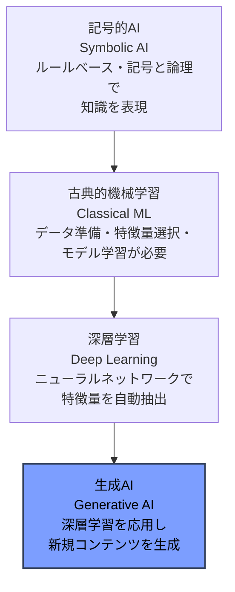
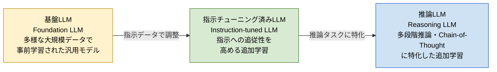
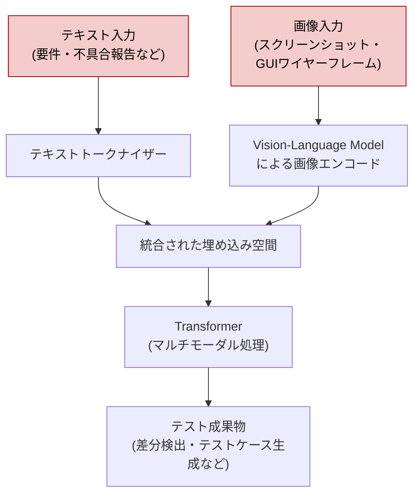
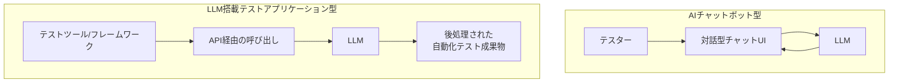

# CT-GenAI 第1章：生成AIソフトウェアテスト入門 完全ガイド

> 本ガイドは ISTQB® Certified Tester – Testing with Generative AI（CT-GenAI）シラバスの**第1章「Introduction to Generative AI for Software Testing」**を、初学者向けに独自の言葉で解説したものです。シラバス原文の逐語的な引用ではなく、内容を咀嚼した解説となっています。試験対策には必ず巻末の出典に記載した公式シラバス原文も併せてご確認ください。

---

## 目次

1. [この章の位置づけと全体像](#この章の位置づけと全体像)
2. [学習目標一覧](#学習目標一覧)
3. [重要キーワード一覧](#重要キーワード一覧)
4. [1.1 生成AIの基礎と主要概念](#11-生成aiの基礎と主要概念)
   - [1.1.1 AIの系譜：記号的AI・古典的機械学習・深層学習・生成AI](#111-aiの系譜記号的ai古典的機械学習深層学習生成ai)
   - [1.1.2 生成AIとLLMの基礎](#112-生成aiとllmの基礎)
   - [1.1.3 基盤LLM・指示チューニング済みLLM・推論LLM](#113-基盤llm指示チューニング済みllm推論llm)
   - [1.1.4 マルチモーダルLLMとVision-Language Model](#114-マルチモーダルllmとvision-language-model)
5. [1.2 ソフトウェアテストにおける生成AI活用の原則](#12-ソフトウェアテストにおける生成ai活用の原則)
   - [1.2.1 テストタスクにおけるLLMの主要能力](#121-テストタスクにおけるllmの主要能力)
   - [1.2.2 AIチャットボットとLLM搭載テストアプリケーション](#122-aiチャットボットとllm搭載テストアプリケーション)
6. [章のまとめ](#章のまとめ)
7. [出典・参考文献](#出典参考文献)

---

## この章の位置づけと全体像

CT-GenAI試験は、ISTQB® Certified Tester Foundation Level（CTFL）取得を前提資格とするスペシャリストレベルの認定です。試験は**40問・合計46点・合格ライン30点（65%）・制限時間60分**（非母語受験者は+25%）で構成されており、全5章のうち、この第1章はシラバス全体（約13.6時間）の中で**100分**が割り当てられた「導入」にあたる章です。

第1章は大きく2つの節から構成されています。

| 節 | タイトル | 内容の要旨 |
|---|---|---|
| 1.1 | 生成AIの基礎と主要概念 | AIの分類、LLMの仕組み（トークン化・埋め込み・Transformer）、LLMの種類、マルチモーダルLLM |
| 1.2 | ソフトウェアテストにおける生成AI活用の原則 | テストタスクにおけるLLMの能力、AIチャットボットとLLM搭載アプリケーションの違い |

この章を理解することは、第2章（プロンプトエンジニアリング）、第3章（リスク管理）、第4章（LLM搭載テスト基盤）を学ぶための土台になります。特に「トークン化」「コンテキストウィンドウ」「非決定性」といった概念は、後続の章で繰り返し登場する重要な基礎知識です。

---

## 学習目標一覧

CT-GenAI試験では、各学習目標（Learning Objective）に認知レベル（K1〜K3）が付与されています。K1は「記憶」、K2は「理解」、K3は「応用」を意味します。

| 項番 | 認知レベル | 学習目標の要旨 |
|---|---|---|
| GenAI-1.1.1 | K1（記憶） | 記号的AI・古典的機械学習・深層学習・生成AIという異なるAIの種類を思い出せる |
| GenAI-1.1.2 | K2（理解） | 生成AIと大規模言語モデル（LLM）の基礎を説明できる |
| HO-1.1.2 | H1（実践演習） | LLM使用時のトークン化とトークン数評価を実践する |
| GenAI-1.1.3 | K2（理解） | 基盤LLM・指示チューニング済みLLM・推論LLMを区別できる |
| GenAI-1.1.4 | K2（理解） | マルチモーダルLLMとVision-Language Modelの基本原理を要約できる |
| HO-1.1.4 | H1（実践演習） | テストタスクに対応する所与のプロンプト（テキストと画像入力を用いるもの）をレビューし、マルチモーダルLLMで実行する |
| GenAI-1.2.1 | K2（理解） | テストタスクにおけるLLMの主要な能力の例を挙げられる |
| GenAI-1.2.2 | K2（理解） | ソフトウェアテストで生成AIを利用する際の対話モデル（チャットボット/アプリケーション）を比較できる |

> 💡 **ベストプラクティス（学習の進め方）**
>
> - K1項目（1.1.1）は用語と分類の暗記が中心なので、まず分類の観点（ルールベースか／データ駆動か／自動特徴抽出か）を整理してから覚えると定着しやすい。
> - K2項目が大半を占めるため、単純暗記よりも「なぜその概念が必要か」「テスト業務のどの場面で使われるか」をセットで理解することが得点に直結する。
> - HO（ハンズオン）項目は本番の試験には直接出題されないが、実際に無料のトークナイザーやチャットボットを触っておくと、K2レベルの理解が格段に深まる。

---

## 重要キーワード一覧

シラバスでは、章の冒頭に記載された「Generative AI Specific Keywords」はK1レベルで暗記すべき用語とされています。

| 英語用語 | 日本語 | 簡単な説明 |
|---|---|---|
| generative AI | 生成AI | 学習データのパターンを模倣し、新しいテキスト・画像・コードなどを生成するAI技術 |
| large language model (LLM) | 大規模言語モデル | 大量のテキストデータで事前学習された生成AIモデル |
| machine learning | 機械学習 | データからパターンを学習する技術全般 |
| deep learning | 深層学習 | ニューラルネットワークを用いて特徴量を自動的に学習する機械学習の一種 |
| symbolic AI | 記号的AI | 記号と論理規則を用いて知識を表現するルールベースのAI |
| feature | 特徴量 | 機械学習モデルが学習に用いるデータの特性・変数 |
| generative pre-trained transformer | 生成的事前学習済みTransformer | LLMの基盤となるTransformerアーキテクチャに基づく事前学習モデル |
| foundation LLM | 基盤LLM | 多様な大規模データで事前学習された汎用モデル |
| instruction-tuned LLM | 指示チューニング済みLLM | 指示に従うよう追加調整された基盤LLM |
| reasoning LLM | 推論LLM | 多段階の論理的推論に特化したLLM |
| multimodal model | マルチモーダルモデル | テキスト・画像・音声など複数種類のデータを扱えるモデル |
| tokenization | トークン化 | テキストをトークンという単位に分割する処理 |
| embedding | 埋め込み | トークンを意味的関係を表す数値ベクトルに変換したもの |
| transformer | Transformer | 注意機構によりトークン間の関係を学習するニューラルネットワーク構造 |
| context window | コンテキストウィンドウ | モデルが一度に考慮できる入力・出力トークンの範囲 |
| AI chatbot | AIチャットボット | 対話形式でLLMとやり取りするインターフェース |

---

## 1.1 生成AIの基礎と主要概念

### 1.1.1 AIの系譜：記号的AI・古典的機械学習・深層学習・生成AI

AI（人工知能）は単一の技術ではなく、問題解決アプローチの異なる複数の技術群の総称です。CT-GenAIシラバスでは、この系譜を4つの段階に整理しています。

- **記号的AI（Symbolic AI）**：人間の意思決定を模倣するルールベースのシステムです。知識を記号と論理規則で表現します。IF-THENルールで動作する古典的な専門家システムをイメージすると分かりやすいでしょう。
- **古典的機械学習（Classical Machine Learning）**：データ駆動型のアプローチで、データ準備・特徴量選択・モデル学習という工程が必要です。不具合の分類やソフトウェア障害の予測などに使われます。
- **深層学習（Deep Learning）**：ニューラルネットワークという構造を用いて、データから特徴量を自動的に学習します。画像・音声・テキストといった大規模で複雑なデータの中からパターンを発見できますが、実務ではデータのアノテーションやモデル調整、結果検証といった人間の関与が依然として必要です。
- **生成AI（Generative AI）**：深層学習の技術を応用し、学習データのパターンを模倣・学習することで、テキスト・画像・コードといった**新しいコンテンツ**を生み出します。LLMはこの生成AIの代表例です。

これら4つは新しい技術が古い技術を置き換えるものではなく、それぞれ異なる強みと限界を持つ並存的な技術群です。生成AIの最大の利点は、適したテストタスクであれば追加の学習フェーズを経ずに事前学習済みのモデルを適用できる点にあります（ドメイン固有の用途などでは、タスクに応じてファインチューニング等の追加調整が必要になる場合もあります）が、これには相応のリスクも伴います（リスクの詳細は第3章で扱います）。

| 種類 | アプローチ | 必要な工程 | ソフトウェアテストでの活用例 |
|---|---|---|---|
| 記号的AI | ルールベース | 論理規則の設計 | 決定表・状態遷移に基づくルール判定 |
| 古典的機械学習 | データ駆動 | データ準備・特徴量選択・モデル学習 | 不具合分類、障害発生確率の予測 |
| 深層学習 | ニューラルネットワーク | 大量データでの学習（特徴量は自動抽出） | 画像・ログのパターン認識 |
| 生成AI | 深層学習の応用 | 事前学習済みモデルの活用（適したタスクでは追加学習なしで適用可。追加調整の要否はタスクに応じる） | テストケース・スクリプト・レポートの自動生成 |

> 💡 **ベストプラクティス**
>
> - 「なぜ生成AIがテスト業務に向いているか」を説明する際は、**適したタスクでは追加の学習フェーズが不要**という利点を軸に説明すると、他の機械学習手法との違いが明確になる。
> - 一方で、事前学習モデルをそのまま使うことは「学習データに起因するリスク（ハルシネーション・バイアスなど）」と表裏一体であることを、活用前に必ずチームで共有しておく。
> - 不具合予測や分類のように、明確な正解ラベル付きデータが大量にある場合は、生成AIより古典的機械学習の方が適していることもあるため、タスクの性質を見極めてから技術を選定する。

---

### 1.1.2 生成AIとLLMの基礎

大規模言語モデル（LLM）は、書籍・記事・Webサイトなど非常に大規模な言語データで学習されたモデルの総称です。代表例の Generative Pre-trained Transformer（GPT）は、トランスフォーマーを基盤とする深層学習モデルの一種です。パラメータ数を絞り、軽量かつ特定用途に特化させたモデルは**小規模言語モデル（SLM）**と呼ばれます。

LLMが言語のニュアンスを扱い、一貫した文章を生成できるのは、**トークン化**と**埋め込み**という2つの仕組みのおかげです。

- **トークン化（Tokenization）**：テキストを「トークン」という小さな単位に分解する処理です。トークンは1文字程度の場合もあれば、単語やサブワード単位になることもあります。LLMは入力文をまずトークン化し、全体の文脈を保ちながら各トークンを処理します。
- **埋め込み（Embedding）**：トークンを、意味的・構文的・文脈的な関係を表す数値ベクトルに変換したものです。似た意味や役割を持つトークンは、高次元空間上で近い位置に配置されます。これによりLLMは単語同士の関係性を理解し、文脈を保持し、一貫性のある応答を生成できます。

LLMは**Transformer**というニューラルネットワーク構造を利用しています。Transformerは長いテキスト列の文脈を処理し、トークン同士の関係を学習することに優れています。推論時にはこの学習済みの関係性を活用し、統計的にもっともらしい次のトークンを予測して文章を生成します。ここで重要なのは、**「統計的にもっともらしい」ことは「正しい」ことを意味しない**という点です。

また、LLMは推論の確率的な性質やハイパーパラメータの設定に起因して**非決定的（non-deterministic）**に振る舞います。つまり、まったく同じ入力を与えても、出力が毎回変わることがあります。

**コンテキストウィンドウ（Context Window）**とは、LLMが応答生成時に考慮できる、直前のテキスト量（トークン数）の範囲を指します。コンテキストウィンドウが大きいほど、長いテストログの分析のように長い文章の一貫性を保てますが、その分、計算負荷と処理時間も増加します。

#### ハンズオン演習（HO-1.1.2）の狙い

シラバスが推奨する演習は、①テキストを実際にトークナイザーにかけてトークンの区切られ方を観察すること、②異なる長さ・構造の入力文のトークン数を計測し、コンテキストウィンドウの制限や処理効率にどう影響するかを分析すること、の2部構成です。この演習を通じて、入力文の構造や長さがLLMとのやり取りにどう影響するかを体感的に理解できます。

> 💡 **ベストプラクティス**
>
> - 長いテストログや大量の要件文書をLLMに入力する前に、**概算のトークン数**を確認する習慣をつける。コンテキストウィンドウの上限に近づくほど、処理の一貫性や精度が落ちるリスクがある。
> - 日本語は英語に比べて1文字あたりのトークン消費量が多くなりがちなので、日本語プロンプトを設計する際はこの点を考慮し、余裕を持ったトークン見積もりを行う。
> - 出力の**非決定性**を前提に、重要なテスト成果物（テストケースやテストオラクルなど）は必ず人手でレビューするプロセスを組み込む。同じプロンプトでも実行のたびに結果が変わり得ることをチームで共有しておく。
> - 大量のテキストを一度に処理させるのではなく、コンテキストウィンドウに収まる単位に分割して段階的に処理させることで、精度と再現性を高められる（この考え方は第2章の「プロンプトチェイニング」に発展する）。

---

### 1.1.3 基盤LLM・指示チューニング済みLLM・推論LLM

LLMは、段階的に専門性を高める学習プロセスを経て開発されます。この段階に応じて、大きく3つのカテゴリに分類されます。

- **基盤LLM（Foundation LLM）**：テキスト・コード・画像などを含む多様な大規模データで事前学習された汎用モデルです。要約・翻訳・質問応答など多様なタスクに対応できる柔軟性を持ちますが、強力である一方、特定タスクに適用するにはさらなる調整が必要になることが一般的です。なお、事前学習に用いたデータの種類と、モデルが入出力として扱えるモダリティ（1.1.4 のマルチモーダルLLMを参照）は別の観点です。
- **指示チューニング済みLLM（Instruction-tuned LLM）**：基盤モデルから派生し、「プロンプトと期待される応答」のペアのデータセットで追加調整（ファインチューニング）されたモデルです。これにより人間の指示への追従性が高まり、実世界での使いやすさが向上します。
- **推論LLM（Reasoning LLM）**：指示チューニング済みモデルをさらに拡張し、論理的推論・多段階の問題解決・Chain-of-Thought（思考の連鎖）といった構造化された認知能力を強化したモデルです。文脈理解や中間推論ステップ、複雑な情報の統合が求められる高負荷なタスクに適しています。

ソフトウェアテストの現場では、指示チューニング済みLLM（「非推論型」と呼ばれることもあります）と推論LLMの両方が利用されており、**タスクの複雑さと推論の必要性に応じて使い分ける**ことが重要です。

| 種類 | 学習方法 | 強み | テストでの適用イメージ |
|---|---|---|---|
| 基盤LLM | 多様な大規模データで事前学習のみ | 汎用性が高いが追加調整が前提 | 汎用的な文章要約・下書き作成 |
| 指示チューニング済みLLM | プロンプトと期待応答のペアで追加学習 | 人間の指示に忠実に従う | 日常的なテスト業務のチャットボット支援 |
| 推論LLM | 論理推論に特化した追加学習 | 多段階推論・複数基準の判断が得意 | 依存関係を考慮したテストケースの優先順位付け |

> 💡 **ベストプラクティス**
>
> - 単純な文章生成や要約であれば指示チューニング済みLLMで十分なことが多く、推論LLMは計算コストが高い傾向があるため、**タスクの複雑さに見合ったモデルを選ぶ**ことがコストと精度のバランスを取る鍵になる。
> - テスト計画やテストケースの優先順位付けのように、複数のリスク要因や依存関係を同時に考慮する必要があるタスクには推論LLMの活用を検討する。
> - モデルの世代・種類は日々更新されるため、自組織で利用するLLMがどのカテゴリに属するか（あるいはハイブリッドか）を定期的に確認し、選定基準をドキュメント化しておく。

---

### 1.1.4 マルチモーダルLLMとVision-Language Model

マルチモーダルLLMは、従来のTransformerモデルを拡張し、テキストだけでなく画像・音声・動画など複数の種類のデータを処理できるようにしたモデルです。多様なモダリティ間の関係性を学習できるよう、大規模かつ多様なデータセットで学習されています。データ種別ごとにトークン化の方法が異なり、例えば画像はVision-Language Modelを用いて埋め込みに変換されたうえでTransformerに入力されます。

**Vision-Language Model（VLM）**はマルチモーダルLLMの一種で、視覚情報とテキスト情報を統合し、画像キャプション生成・視覚的質問応答・テキストと画像の整合性分析といったタスクを実行します。

ソフトウェアテストにおいて、マルチモーダルLLM（特にVLMを組み込んだLLM）は大きな可能性を秘めています。スクリーンショットやGUIワイヤーフレームといった視覚要素を、不具合報告やユーザーストーリーなどの関連するテキスト情報と合わせて分析できるため、**期待結果と実際の画面表示との齟齬をテスターが特定する**ことを支援します。さらに、テキストデータと視覚的な手がかりの両方を組み込んだ、より豊かで現実的なテストケースの生成にも活用でき、全体的なカバレッジの向上につながります。

#### ハンズオン演習（HO-1.1.4）の狙い

シラバスの演習では、テストタスクに対応する所与のプロンプトについて、(1) プロンプトと入力データ（テキストと画像）をレビューし、(2) マルチモーダルLLMに画像とテキストの両方を入力して実行し、その応答を確認・検証する、という2ステップを踏みます。プロンプトを自分で一から作成する演習ではありません。これにより、テキストと画像を組み合わせたテストタスクにおけるマルチモーダルLLM活用の利点と課題の両方を体感できます。

> 💡 **ベストプラクティス**
>
> - GUIのスクリーンショットをLLMに渡す際は、画面キャプチャだけでなく「期待される仕様（テキスト）」もセットで提供すると、差分検出の精度が大きく向上する。
> - 個人情報や機密情報が映り込んだスクリーンショットを外部LLMサービスに送信しないよう、事前にマスキング・モザイク処理を行う運用ルールを整備する（データプライバシーの詳細は第3章）。
> - マルチモーダルプロンプトの結果は、テキストのみのプロンプトよりも検証コストが高くなりがちなので、まずは小規模な画面や単純なUIコンポーネントから試し、段階的に対象範囲を広げる。

---

## 1.2 ソフトウェアテストにおける生成AI活用の原則

生成AIは、自然言語やコードの処理、一貫した文章・コードの生成、質問応答、情報要約、翻訳、マルチモーダル文脈での画像分析など、テストのさまざまな活動において変革的な能力を提供します。あらゆる役割のテスト専門家は、**AIチャットボット**（即時応答を返す対話型ツール）と、**LLM搭載アプリケーション**（テストツールに統合された仕組み）という2つの補完的な方法で生成AIを活用できます。

### 1.2.1 テストタスクにおけるLLMの主要能力

LLMは要件・仕様書・スクリーンショット・コード・テストケース・不具合報告書といった様々な情報を解釈できるため、テストプロセス全体を通じて情報の理解・明確化やテストウェアの生成を支援するツールとなります。

| LLMの能力 | 概要 | 具体例 |
|---|---|---|
| 要件分析・改善支援 | 要件やテストベースの曖昧さ・矛盾・不足情報を特定する | ステークホルダーとの議論に向けた確認質問の生成 |
| テストケース作成支援 | システム要件やユーザーストーリーからテストケース・テスト目的を提案する | 要件に基づくテストケース案の生成 |
| テストオラクル生成 | 期待結果の生成を支援する | 特定の入力に対する期待される出力の提示 |
| テストデータ生成 | データセットの生成、境界値の設定、多様なテストデータの組み合わせ作成 | 合成テストデータの生成 |
| テスト自動化支援 | テストケース記述からのスクリプト生成、既存スクリプトの改善提案 | 適切なテスト技法の提案を含むスクリプト改良 |
| テスト結果分析 | テスト結果の要約作成、重大度・優先度に基づく異常の分類 | 実行結果サマリーの自動生成 |
| テストウェア作成 | テスト計画書・テストレポート・不具合報告書などの作成と、プロジェクト進行に応じた更新 | プロジェクトの進捗に合わせた文書の自動更新 |

これらの能力はテストプロセス全体（要件分析からテスト完了報告まで）に及ぶ点が重要です。特定の工程だけでなく、複数の工程で組み合わせて活用することで、より大きな効果を発揮します。

> 💡 **ベストプラクティス**
>
> - LLMを使ったテストケース生成は「たたき台の作成」として位置づけ、必ず人間のテスターがレビュー・修正してから正式なテストケースとして採用する運用フローを確立する。
> - テストオラクル生成やテストデータ生成のように誤りが後工程に伝播しやすいタスクほど、生成結果を既存の仕様書やテストベースと突き合わせる検証ステップを設ける。
> - 各能力（要件分析、テストケース作成、テストデータ生成など）ごとに、自組織でどのLLM能力をどの工程に導入するかをロードマップとして整理しておくと、次章以降のプロンプトエンジニアリングの学習をスムーズに実務へ接続できる。

---

### 1.2.2 AIチャットボットとLLM搭載テストアプリケーション

AIチャットボットとLLM搭載テストアプリケーションは、どちらもテスターを支援しますが、機能性・柔軟性・統合方法において異なります。

**AIチャットボット**は、テスターがLLMと直接コミュニケーションを取れる、使いやすい対話型インターフェースを提供します。テスターは質問・コマンド・プロンプトを自然言語で入力し、即座に文脈を踏まえた応答を受け取れます。プロンプトチェイニングのような手法を使えば、テスターは出力を反復的に洗練させることができ、定型的なタスクや探索的テスト、さらには新しいテスターへのオンボーディング（テストの知識・実践への素早いアクセス提供）にも効果的です。直感的なインターフェースは、非技術者を含む幅広い利用者にとってアクセスしやすいという利点もあります。

**LLM搭載テストアプリケーション**は対照的に、APIを介してLLMの能力を統合し、明確に定義された自動化テストタスクを実行します。これらのアプリケーションはより高いカスタマイズ性とスケーラビリティを備え、組織やツールベンダーが既存のテストフレームワークに生成AIを組み込むことを可能にします。これにより、テストケース生成・不具合分析・テストデータ合成といった、反復的または複雑なタスクの自動化が実現します。より発展した実装では、特定のテスト業務を遂行するために設計されたAIエージェントを組織が構築することもあります（AIエージェントの詳細は第4章）。

テスターがチャットボットを使うか、統合されたLLM搭載アプリケーションを使うかにかかわらず、生成AIをテストにうまく取り入れるには**強力なプロンプトエンジニアリング**が欠かせません。丁寧に設計されたプロンプトと明確で具体的な指示は、LLMが生成する出力の正確性・関連性・テスト目的への適合性を高めます。ただしプロンプト設計だけで出力の正しさが保証されるわけではないため、生成された出力は別途検証が必要です。

| 観点 | AIチャットボット | LLM搭載テストアプリケーション |
|---|---|---|
| インターフェース | 自然言語による対話形式 | API経由の統合・テストフレームワークへの組み込み |
| 柔軟性 | 探索的・即興的な利用に強い | 定型化・自動化されたタスクに強い |
| 対象ユーザー | 非技術者でも利用しやすい | 開発者・自動化エンジニア向け |
| 得意な用途 | 日常的な質問対応、テスト概念の確認、新人のオンボーディング | 反復的・定型的なテストタスクの自動化 |
| 発展の方向性 | プロンプトチェイニングによる対話的な出力改善 | AIエージェントによる自律的なタスク実行（第4章） |

> 💡 **ベストプラクティス**
>
> - 探索的な確認作業や学習目的にはAIチャットボット、CI/CDに組み込むような反復実行が前提の作業にはLLM搭載アプリケーション、というように**タスクの性質に応じて使い分ける**基準をチーム内で明文化する。
> - どちらの方式を使う場合でも、出力品質はプロンプトの設計品質に大きく依存するため、チャットボット利用者にも最低限のプロンプト構造（役割・文脈・指示・入力データ・制約・出力形式）の知識を共有する（第2章で詳説）。
> - LLM搭載アプリケーションを本番のテスト基盤に組み込む際は、API呼び出しのコスト・レイテンシ・可用性も考慮し、チャットボットでの試験運用を経てから段階的に自動化範囲を広げる。

---

## 章のまとめ

第1章では、生成AIとLLMを理解するための土台となる概念を学びました。

- AIには記号的AI・古典的機械学習・深層学習・生成AIという異なるアプローチがあり、生成AIは深層学習を応用して新しいコンテンツを作り出す技術である。
- LLMはトークン化と埋め込みによってテキストを数値表現に変換し、Transformer構造によって文脈を踏まえた応答を生成する。ただし出力は非決定的であり、「もっともらしい」ことと「正しい」ことは異なる。
- LLMは基盤LLM・指示チューニング済みLLM・推論LLMという段階的な専門化のカテゴリに分類され、タスクの複雑さに応じて使い分けるべきである。
- マルチモーダルLLM・Vision-Language Modelはテキストと画像を組み合わせて処理でき、GUIのスクリーンショット分析など、テストにおける新しい可能性を開く。
- LLMは要件分析からテストウェア作成まで、テストプロセス全体を通じて多様な能力を発揮できる。
- AIチャットボットとLLM搭載テストアプリケーションはどちらも有効な活用形態であり、それぞれの強みを理解して使い分けることが重要である。いずれの場合も、成果を最大化する鍵はプロンプトエンジニアリング（第2章）にある。

---

## 出典・参考文献

本ガイドの作成にあたり、以下のISTQB®公式情報を直接確認しました。

1. **ISTQB® 公式 CT-GenAI認定ページ**（起点として指定されたURL）
   <https://istqb.org/certifications/gen-ai/>
2. **CT-GenAI Syllabus v1.1**（公式ダウンロードリンク、2026年4月27日改訂版）
   <https://istqb.org/?sdm_process_download=1&download_id=6295>
3. **CT-GenAI Syllabus v1.0 全文**（章立て・学習目標・詳細内容の確認に使用。v1.1でも第1章の構成・学習目標は実質的に変更されていないことを公式ページで確認済み）
   <https://atsqa.org/assets/documents/CT-GenAI-Syllabus-v1.0.pdf>
4. **ISTQB® v1.1リリースに関する公式アナウンス**（v1.0からv1.1への変更点の確認）
   <https://istqb.org/istqb-announces-minor-update-to-certified-tester-testing-with-generative-ai-ct-genai/>
5. **ISTQB® Glossary**（用語の正式な定義を確認する際に活用）
   <https://glossary.istqb.org/en_US/search?term=>

> 📌 **補足**：v1.1では「few-shot」から「one-shot」への用語更新など、主に第2〜4章に関わる用語・記述の明確化が行われましたが、公式ページに掲載されている第1章の目次構成（1.1 生成AIの基礎と主要概念 / 1.2 ソフトウェアテストにおける生成AI活用の原則）自体に変更はありません。試験直前には、必ず最新版シラバス原文（出典2）で細部の文言を確認してください。
