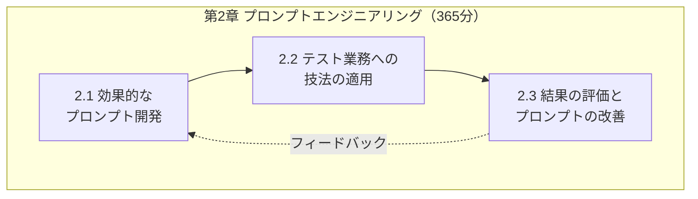
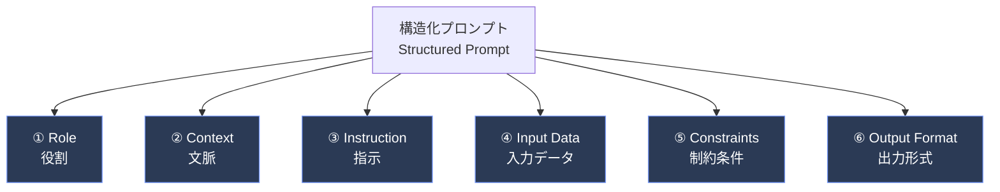
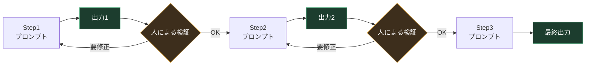
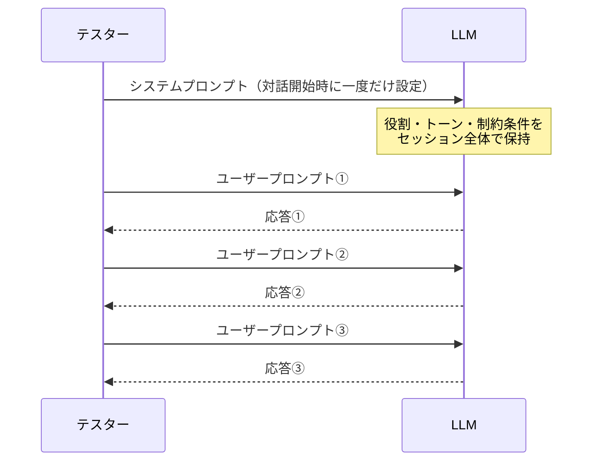
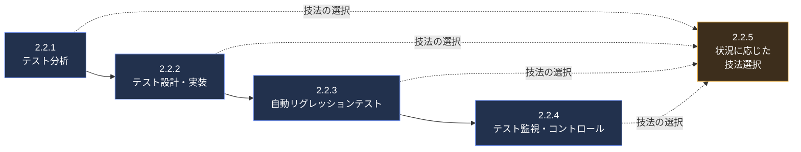
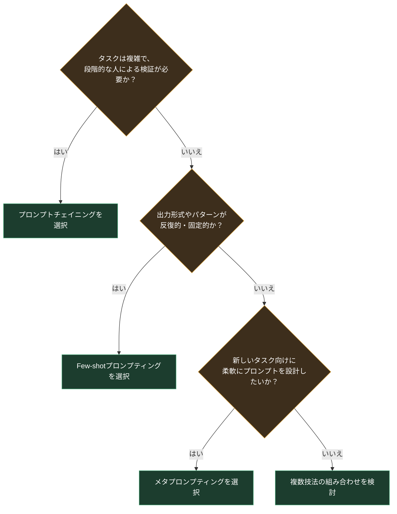
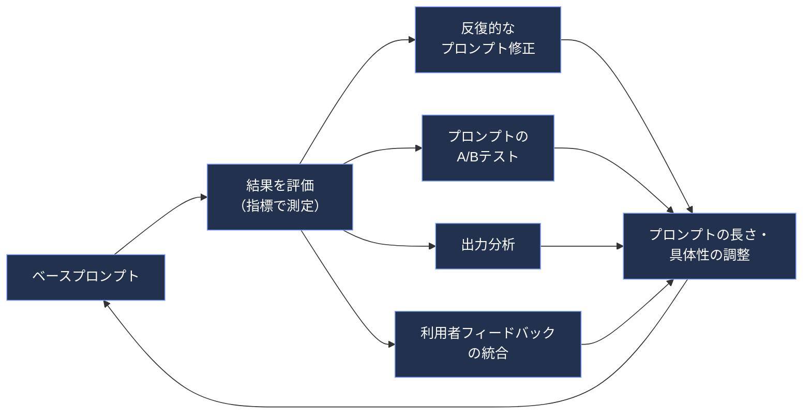

# ISTQB® CT-GenAI 第2章 完全解説ガイド

## 「効果的なソフトウェアテストのためのプロンプトエンジニアリング」（Prompt Engineering for Effective Software Testing）

> 本ガイドは、ISTQB®（International Software Testing Qualifications Board）が公開している **Certified Tester – Testing with Generative AI（CT-GenAI）** シラバスの **第2章** を、初学者向けにステップバイステップで解説するものです。
>
> - 認定試験ページ：<https://istqb.org/certifications/gen-ai/>
> - シラバス本体（公式ダウンロード, v1.1）：<https://istqb.org/?sdm_process_download=1&download_id=6295>
> - シラバス本文（本ガイド執筆にあたり全文を直接参照したミラー, v1.0）：<https://atsqa.org/assets/documents/CT-GenAI-Syllabus-v1.0.pdf>
> - v1.1 リリースノート（v1.0→v1.1の変更点）：<https://istqb.org/wp-content/uploads/2026/05/ISTQB-CT-GenAI_v1.1_Release_Notes.pdf>
>
> **バージョンについての注記**：現行の最新シラバスは **v1.1（2026年4月27日リリース）** です。v1.1は v1.0 に対する **マイナーアップデート**（章立て・学習目標・出題範囲は変更なし）であり、用語の一部修正や説明文の微調整が中心です。本ガイドは章の内容を v1.0 の全文（英語原文）に基づいて詳細に解説し、v1.1 で変更された箇所は本文中および第7章に明記しています。正確な最終文言は必ず上記の公式シラバスでご確認ください。

---

## 目次

0. [第2章の全体像と学習目標](#0-第2章の全体像と学習目標)
1. [2.1 効果的なプロンプト開発](#1-21-効果的なプロンプト開発)
   - 1.1 [プロンプトの6要素構造（2.1.1）](#11-プロンプトの6要素構造211)
   - 1.2 [コアプロンプティング技法（2.1.2）](#12-コアプロンプティング技法212)
   - 1.3 [システムプロンプトとユーザープロンプト（2.1.3）](#13-システムプロンプトとユーザープロンプト213)
2. [2.2 テスト業務へのプロンプトエンジニアリング技法の適用](#2-22-テスト業務へのプロンプトエンジニアリング技法の適用)
   - 2.1 [テスト分析（2.2.1）](#21-テスト分析221)
   - 2.2 [テスト設計・テスト実装（2.2.2）](#22-テスト設計テスト実装222)
   - 2.3 [自動リグレッションテスト（2.2.3）](#23-自動リグレッションテスト223)
   - 2.4 [テスト監視・テストコントロール（2.2.4）](#24-テスト監視テストコントロール224)
   - 2.5 [状況に応じた技法選択（2.2.5）](#25-状況に応じた技法選択225)
3. [2.3 GenAIの結果評価とプロンプトの改善](#3-23-genaiの結果評価とプロンプトの改善)
   - 3.1 [評価指標（2.3.1）](#31-評価指標231)
   - 3.2 [プロンプト評価・改善技法（2.3.2）](#32-プロンプト評価改善技法232)
4. [章末チェックリスト（学習目標一覧）](#4-章末チェックリスト学習目標一覧)
5. [ベストプラクティス総集編](#5-ベストプラクティス総集編)
6. [v1.0→v1.1 変更点（第2章に関わる箇所）](#6-v10v11-変更点第2章に関わる箇所)
7. [参考文献・出典](#7-参考文献出典)

---

## 0. 第2章の全体像と学習目標

CT-GenAIシラバス全5章の中で、第2章は**365分**と最も長い学習時間が割り当てられており、試験における比重も最大です。第1章で学んだGenAI/LLMの基礎知識を、実際に**プロンプト**という「LLMへの指示文」に落とし込み、テスト業務で実践的に使えるようにすることが目的です。

第2章は大きく3つの節で構成されています。

| 節 | タイトル | 学習内容の要旨 |
|---|---|---|
| 2.1 | 効果的なプロンプト開発 | プロンプトの構造（6要素）、3つのコア技法（プロンプトチェイニング／Few-shot／メタプロンプティング）、システムプロンプトとユーザープロンプトの違い |
| 2.2 | テスト業務への技法の適用 | テスト分析、テスト設計・実装、自動リグレッションテスト、テスト監視・コントロールの各局面でのGenAI活用と、技法の選択方法 |
| 2.3 | 結果の評価とプロンプトの改善 | GenAIの出力を測る評価指標と、プロンプトを継続的に改善していくための技法 |

### キーワード（第2章シラバス記載）

- **一般キーワード**：受け入れ基準（acceptance criteria）、テストスクリプト、テストケース、テスト条件、テストデータ、テスト設計、テストレポート
- **GenAI特有キーワード**：Few-shotプロンプティング、メタプロンプティング、自然言語処理、One-shotプロンプティング、プロンプト、プロンプトチェイニング、プロンプトエンジニアリング、システムプロンプト、ユーザープロンプト、Zero-shotプロンプティング

これらは試験でK1（記憶）レベルとして問われる可能性があるため、定義を正確に押さえておく必要があります。

### 学習目標（Learning Objectives）とハンズオン目標（Hands-on Objectives）の全体マップ

| 節 | 学習目標（K-レベル） | 対応するハンズオン目標（H-レベル） |
|---|---|---|
| 2.1.1 | GenAI-2.1.1 (K2) プロンプトの構造の例を挙げられる | HO-2.1.1 (H0) 構成要素の観察・分析 |
| 2.1.2 | GenAI-2.1.2 (K2) コアプロンプティング技法を区別できる | HO-2.1.2a (H0) 技法のデモ観察／HO-2.1.2b (H1) 技法の識別演習 |
| 2.1.3 | GenAI-2.1.3 (K2) システムプロンプトとユーザープロンプトを区別できる | （ハンズオンなし） |
| 2.2.1 | GenAI-2.2.1 (K3) テスト分析にGenAIを適用できる | HO-2.2.1a (H2) マルチモーダルプロンプト演習／HO-2.2.1b (H2) プロンプトチェイニングと人による検証 |
| 2.2.2 | GenAI-2.2.2 (K3) テスト設計・実装にGenAIを適用できる | HO-2.2.2a〜c (H2) テストケース生成・Gherkin生成・優先順位付け |
| 2.2.3 | GenAI-2.2.3 (K3) 自動リグレッションテストにGenAIを適用できる | HO-2.2.3a〜b (H2) キーワード駆動スクリプト作成・テストレポート分析 |
| 2.2.4 | GenAI-2.2.4 (K3) テスト監視・コントロールにGenAIを適用できる | HO-2.2.4 (H0) 監視メトリクスの観察 |
| 2.2.5 | GenAI-2.2.5 (K3) 状況に応じた技法を選択・適用できる | HO-2.2.5 (H1) 技法選択演習 |
| 2.3.1 | GenAI-2.3.1 (K2) 評価指標を理解している | HO-2.3.1 (H0) 指標活用の観察 |
| 2.3.2 | GenAI-2.3.2 (K2) 評価・改善技法の例を挙げられる | HO-2.3.2 (H1) プロンプトの評価と最適化演習 |

> K1=記憶（Remember）、K2=理解（Understand）、K3=適用（Apply）。第2章はK3（適用）レベルの学習目標が多く、単なる知識暗記ではなく「実際にプロンプトを設計・適用できる」ことが問われる点が特徴です。

---

## 1. 2.1 効果的なプロンプト開発

### 1.1 プロンプトの6要素構造（2.1.1）

シラバスでは、ソフトウェアテスト向けの**構造化プロンプト（structured prompt）**は、次の**6つの構成要素**から成るとされています。この構造を守ることで、LLMに対して明確・正確に要求事項と期待値を伝えることができます。

| 要素 | 説明 | ソフトウェアテストでの例 |
|---|---|---|
| ① Role（役割） | GenAIモデルが応答生成時にとるべき視点・ペルソナを定義する。役割を指定することで、LLMは自身の責務や適切なトーン・アプローチを判断しやすくなる。 | 「あなたは経験豊富なテストアナリストです」「テスト自動化エンジニアとして振る舞ってください」 |
| ② Context（文脈） | GenAIがテスト条件を判断するために必要な背景情報。テスト対象、テストすべき具体的な機能、その他関連する文脈情報を含む。 | 「対象システムはECサイトの決済機能で、クレジットカード決済とコンビニ決済に対応しています」 |
| ③ Instruction（指示） | 実行すべき具体的なタスクを示す指令。明確・命令形・簡潔であり、タスクの説明と関連要件を含む。 | 「以下のユーザーストーリーから機能テストケースを生成してください」 |
| ④ Input Data（入力データ） | タスク遂行に必要な情報。ユーザーストーリー、受け入れ基準、スクリーンショット、コード、既存のテストケース、出力例など。詳細で構造化された入力データはより正確で文脈に即した結果につながる。 | ユーザーストーリー本文、GUIワイヤーフレーム画像、既存のテストケース一覧 |
| ⑤ Constraints（制約条件） | LLMが遵守すべき制限や特別な考慮事項。指示を入力データにどう適用すべきかを指定する。 | 「境界値分析の手法を使うこと」「出力は日本語で。テストケース数は10件以内」 |
| ⑥ Output Format（出力形式） | 期待される応答の形式・構造・特性を示す指標。LLMの出力を望む形に整える役割を持つ。 | 「Markdownの表形式で、列は『前提条件／手順／期待結果』とすること」 |

> 💡 **ベストプラクティス**：6要素すべてを毎回フルに書く必要はありませんが、**Instruction（指示）とOutput Format（出力形式）は省略しないこと**が推奨されます。指示と出力形式が曖昧なままだと、たとえ十分な文脈や入力データを与えても、期待と異なる形式・粒度の出力になりやすいためです。また、この6要素構造は次項で解説する「コアプロンプティング技法」と組み合わせて使うことで真価を発揮します（2.1.1と2.1.2は独立した知識ではなく、常にセットで運用するものと理解しましょう）。

<!-- -->

> 🖐 **ハンズオン目標 HO-2.1.1 (H0)**：AIチャットボット上でいくつかの構造化プロンプトのデモを観察し、役割・文脈・指示・入力データ・制約条件・出力形式という6つの構成要素が、それぞれどのようにLLMからの正確で関連性が高く実用的な洞察の提供に寄与しているかを分析します。

---

### 1.2 コアプロンプティング技法（2.1.2）

シラバスは、多数のプロンプティング技法が提案されている中で（出典：Schulhoff et al., 2024, "The Prompt Report"）、ソフトウェアテストのタスクにおいて特によく使われる**3つのコア技法**を挙げています。これらは前項の6要素プロンプト構造と組み合わせて使用します。

1. **プロンプトチェイニング（Prompt Chaining）**
2. **Few-shotプロンプティング（Few-shot Prompting）**
3. **メタプロンプティング（Meta Prompting）**

まず、Few-shotプロンプティングの前提となる「例示の数」による分類を整理します。

| 分類 | 定義 |
|---|---|
| Zero-shot（ゼロショット） | 例を与えず、モデルの事前学習済みの知識のみに依拠して応答を生成させる。 |
| One-shot（ワンショット） | 与えられた入力に対する望ましい結果を、1つの例で示す。 |
| Few-shot（フューショット） | 複数（a few）の例をプロンプトに含めることで、モデルの望ましい応答パターンをさらに強化する。 |

#### ① プロンプトチェイニング（Prompt Chaining）

タスクを一連の中間ステップ（複数のプロンプト）に分解する手法です。各ステップの結果は、次のステップに進む前に**手動または自動でチェック・修正**されます。このアプローチは各応答が次のプロンプトの情報源となるため、精度の向上につながります。特に、複雑で複数のサブタスクへの分解と、中間出力の体系的なチェックが必要なテスト工程で有用です。

#### ② Few-shotプロンプティング（Few-shot Prompting）

プロンプトの中にLLMへの**例（examples）**を含める手法です。明確な参照例を与えることで、モデルの応答を一定の期待水準に沿わせ、一貫性のある結果を得やすくなります。出力に特定のパターンや形式が求められるタスク（例：Gherkin形式のテストケース生成）で特に有効です。

#### ③ メタプロンプティング（Meta Prompting）

AI自身にプロンプトを生成・改善させる能力を活用する手法です。反復的なサイクルの中で、LLMが生成したプロンプトをテスターが評価・洗練していきます。効率とプロンプト最適化が重要な場面で特に有益であり、テスターが効果的なプロンプトの作り方に不慣れな場合でも、LLMと協働（ペアリング）してプロンプトを共創できるという利点があります。

### 3つの技法の比較表

| 技法 | 推奨されるユースケース | 主な特徴・適用例 |
|---|---|---|
| プロンプトチェイニング | 各ステップで人による検証が必要な、精度が求められる複雑なタスク | タスクを小さなステップに分解。テスト分析・テスト設計・テスト自動化など、各テストステップの正確性をチェックしたい場面で有用 |
| Few-shotプロンプティング | 反復的、または特定・制約された出力形式が求められるタスク | 特定パターンでの反復生成に例を提供。Gherkin形式のテストケース、キーワード駆動テスト、特定形式のテストレポートなど |
| メタプロンプティング | 柔軟で動的なタスク、新しいタスク向けのプロンプト作成に有用 | 目的・タスクの一般的な説明を与え、LLM自身にプロンプト作成を誘導させる。テストレポート分析や異常検知など複雑なタスク全般に有用 |

> 💡 **ベストプラクティス**：技法は**タスクの性質と使用するモデルに応じて選択**します。上の比較表のとおり、単一の技法で十分なタスクも多くあります。そのうえで、必要に応じて**組み合わせる**選択肢もあります。シラバスが挙げる組み合わせの典型例は次の流れです。①まず**メタプロンプティング**で初期プロンプトを作成する → ②そのプロンプトに含まれる例を調整・強化する（**Few-shotプロンプティング**）→ ③タスクをより小さなサブタスクに分割し、中間ステップの検証を可能にする（**プロンプトチェイニング**）。組み合わせは「常に必要なもの」ではなく「単一技法では不十分な場合に取れる選択肢」と理解しましょう。

<!-- -->

> 🖐 **ハンズオン目標**
>
> - **HO-2.1.2a (H0)**：AIチャットボット上でプロンプトチェイニング・Few-shotプロンプティング・メタプロンプティングのデモを、それぞれ具体的なソフトウェアテストタスクに適用しながら観察・議論します。
> - **HO-2.1.2b (H1)**：ソフトウェアテストに関連する複数のプロンプト例を読み、どのコアプロンプティング技法が使われているかを識別する演習を行います。

<!-- -->

> ⚠️ **v1.1での用語変更に関する注記**：v1.1のリリースノートによると、HO-2.1.2b内の記述で「few-shot」という表記の一部が「one-shot」に修正されています。正確な文言は公式リリースノート（本ガイド末尾のリンク）でご確認ください。

---

### 1.3 システムプロンプトとユーザープロンプト（2.1.3）

LLMとの対話において、**システムプロンプト**と**ユーザープロンプト**はそれぞれ異なる役割を担います。

| 項目 | システムプロンプト（System Prompt） | ユーザープロンプト（User Prompt） |
|---|---|---|
| 定義者 | 開発者またはテスターが定義 | チャットボットの利用者（テスター）が入力 |
| 可視性 | ほとんどのインターフェースでは、チャットボット利用者からは見えない・編集できない | 利用者に直接見える。各やり取りの直接的な文脈を形成する |
| 変化の頻度 | 対話セッション全体を通じて**一定**（変わらない） | やり取りごとに**変化**する |
| 役割 | LLMの振る舞い・性格・運用パラメータを規定する「事前定義されたコマンドセット」。会話全体のルールを設定する。構造化プロンプトのRole・Context・Constraintsの一部を含みうる | 実際の入力や質問。特定の指示・質問・タスクを含みうる |
| 例 | 「あなたはプロフェッショナルなソフトウェアテスト支援アシスタントです。常に明確に、フォーマルな言葉遣いで回答し、ISTQBに準拠した実践に焦点を当ててください。推測は避け、関連するテスト原則を引用してください。」 | 「ブラックボックステストとホワイトボックステストの主な違いを、例を挙げて列挙してください。」 |

典型的な使い方は、**対話の開始時にシステムプロンプトを一度だけ設定**し、その後は**ユーザープロンプトを繰り返し送信**するというものです。LLMは、変化しないシステムプロンプトと現在のユーザープロンプトの両方を考慮して応答を生成します。

> 💡 **ベストプラクティス**：効果的な運用のために、システムプロンプトは**LLMの役割と制約について明確かつ具体的**であるべきです。また、期待される出力に関する文脈や一般的な指示を含めても構いません。一方、ユーザープロンプトは**焦点を絞り、明確な指示・関連する追加の文脈・出力形式の指定**を含む、構造化されたものにする必要があります。組織内で共通のシステムプロンプト（例：「ISTQB用語に準拠する」「日本語で応答する」等）をテンプレート化しておくと、チーム全体でのプロンプト品質のばらつきを抑えられます。

---

## 2. 2.2 テスト業務へのプロンプトエンジニアリング技法の適用

前節で学んだ6要素構造と3つのコア技法を、実際のテストプロセスの各局面に適用していきます。プロンプトチェイニング・Few-shotプロンプティング・メタプロンプティングを組み合わせることで、チームはテスト目的に合わせてAIプロンプトを調整し、より正確で関連性が高く効果的な出力を得ることができます。**高品質な入力（Input Data）が、意味のあるAI結果を得るために不可欠**である点は、全ての局面に共通する重要な前提です。

### 2.1 テスト分析（2.2.1）

GenAIは、テスト条件の生成・優先順位付け、テストベース（要件・ユーザーストーリー等）における欠陥の特定、カバレッジ分析など、テスト分析業務を支援できます。

| 典型タスク | GenAIによる支援内容 |
|---|---|
| テストベース内の潜在的欠陥の特定 | 類似の要件パターンの比較や過去の欠陥報告の知識を活用し、矛盾・曖昧さ・情報不足を検出して改善を提案する |
| テストベースに基づくテスト条件の生成 | 自然言語処理を用いて要件・ユーザーストーリーの意味を解釈し、測定可能でテスト可能なステートメントに分解する |
| リスクレベルに基づくテスト条件の優先順位付け | 各テスト条件のリスク発生可能性・影響度の情報をもとに、規制遵守やユーザー向け機能（ログイン、決済処理等）、過去の欠陥データを考慮して優先度を推奨する |
| カバレッジ分析の支援 | 要件・ユーザーストーリーをテスト条件にマッピングし、テストベースの全側面がカバーされているかを判定する |
| テスト技法の提案 | 要件・ユーザーストーリーの種類に応じて、境界値分析や同値分割など適切なテスト技法を提案する |

> 💡 **ベストプラクティス**：テスト分析でGenAIを使う際は、入力データの質がそのまま出力の精度に直結します。要件やユーザーストーリーだけでなく、**GUIワイヤーフレームなどのマルチモーダル情報も併せて与える**ことで、テキストだけでは伝わりにくい制約（画面上のレイアウトや入力フィールドの制限など）まで反映した、より高品質な受け入れ基準やテスト条件を得やすくなります。

<!-- -->

> 🖐 **ハンズオン目標**
>
> - **HO-2.2.1a (H2)**：テキストとGUIワイヤーフレーム画像の両方を入力に用いた構造化マルチモーダルプロンプトを作成し、ユーザーストーリーから高品質な受け入れ基準を生成する演習を行います。構造化プロンプトの各要素（役割・文脈・指示・テキストと画像の入力データ・制約条件・出力形式）の異なる書き方による結果を比較します。
> - **HO-2.2.1b (H2)**：プロンプトチェイニングと人による検証を用いて、あるユーザーストーリーを段階的に分析し受け入れ基準を洗練する演習を行います。まず曖昧さの特定、次にテスト可能性の評価、最後に完全性の評価という3段階で進め、各段階でLLMの出力を人手で確認・修正します。

---

### 2.2 テスト設計・テスト実装（2.2.2）

テスト設計はテスト条件を精緻化・洗練しテストケース等のテストウェアへ変換する工程、テスト実装はテストの実施に必要なテストウェアを作成・取得する工程です（詳細はISTQB Foundation Levelシラバス [ISTQB_CTFL_SYL] を参照）。GenAIは、手動テストと自動テストスクリプトの両方の作成・優先順位付け・実行スケジュールへの組み込みを支援できます。

| 典型タスク | GenAIによる支援内容 |
|---|---|
| テストケース生成 | 自然言語処理により機能要件・非機能要件からテストケースのドラフトを作成。前提条件・入力・期待結果・カバレッジ基準を提案し、基本的な機能検証から複雑なエンドツーエンドテストまで対応 |
| テストデータの合成 | プライバシーに配慮した、本番データに類似する代表的な合成テストデータを生成。極端なケースや多様なテスト条件をカバーし、現実的なシナリオをシミュレート。合成データは本番データの直接利用に比べてプライバシーリスクを低減できるが、機微な情報の再現・混入がないことや妥当性は生成後に検証する必要がある |
| 自動テストスクリプトの生成 | 構造化されたテストケースから手動手順や自動テストスクリプトを生成し、様々なテスト自動化フレームワークに対応するコードへ変換。新要件に応じた更新・拡張も可能 |
| テスト実行のスケジューリングと優先順位付け | テストケースとその相互依存関係を分析し、優先度・関連リスク・リソースの可用性・テスト目的に基づいて実行スケジュールを最適化 |

> 🖐 **ハンズオン目標**
>
> - **HO-2.2.2a (H2)**：プロンプトチェイニング・構造化プロンプト・メタプロンプティングを使い、ユーザーストーリーから機能テストケースを生成します。①受け入れ基準から特定の出力形式で機能テストケースを生成するプロンプトを作成→②各受け入れ基準がカバーされているかを表形式で要約させて完全性を検証→③エンドツーエンドのテスト手順作成を支援するメタプロンプトを作成、という3ステップで進めます。
> - **HO-2.2.2b (H2)**：Few-shotプロンプティング技法を用いて、与えられたユーザーストーリーからGherkinスタイルのテスト条件・テストケースを生成します。まず事前定義された例とGherkin構文を確認し、n個の例（ユーザーストーリー・テスト条件・Given-When-Then形式の期待テストケース）を選んでプロンプトに含め、新しいユーザーストーリーに適用します。
> - **HO-2.2.2c (H2)**：プロンプトチェイニングを使い、リスク分析や依存関係を考慮しながら、与えられたテストスイート内のテストケースを優先順位付けします。リスクベース・カバレッジベース・要件ベースなど異なるテストアプローチの概要を確認したうえで、優先順位付け計画を生成するプロンプトを作成し、結果を人手で検証します。

<!-- -->

> 💡 **ベストプラクティス**：Few-shotプロンプティングでGherkinスタイルのテストケースを生成する場合、**例の数（n）を増やしすぎない**ことが重要です。例が多すぎるとコンテキストウィンドウを圧迫し処理効率が下がる一方、少なすぎると期待するパターンが安定しません。まず2〜3例から始め、結果が不安定な場合に例を追加する、という段階的なアプローチが実務的です。

---

### 2.3 自動リグレッションテスト（2.2.3）

新しいイテレーションやリリースのたびにリグレッションテストケースの数は増加する傾向にあり、特に実行頻度の高いCI/CD（継続的インテグレーション／継続的デリバリー）パイプラインにおいては自動化の理想的な対象となります。GenAIは、コードベースの変更に動的に適応し影響分析を行うことで、リグレッションテストの効率化を支援します。

| 典型タスク | GenAIによる支援内容 |
|---|---|
| キーワード駆動自動化によるテストスクリプト実装 | 事前定義されたキーワードが共通のテストステップを表すキーワード駆動テスト自動化フレームワークに基づき、キーワードを特定のテストケースにマッピングしてテストスクリプトを生成 |
| 影響分析とテストの最適化 | コード変更を分析して高リスク領域を特定し、最も必要な箇所にリグレッションテストを絞り込む |
| セルフヒーリング・アダプティブテスト | 軽微なUIやAPIの変更に自動的にテストスクリプトを適応させ、不要な失敗を防ぎテストスイートの安定性を維持 |
| 自動テストレポーティングとインサイト | 成功率指標・失敗・主要な洞察を含む詳細なテストレポートを生成し、トレンドや潜在的な失敗ポイントを予測するダッシュボードを提供 |
| 欠陥報告と根本原因分析の強化 | テストログ・スクリーンショット・テスト環境データを含む包括的な欠陥報告の自動作成を支援 |

GUIテストとAPIテストでは課題の性質が異なります。

- **GUIテスト**：UIの頻繁な変更により不安定になりやすい。GenAIは動的ロケータや変更されたインタラクションなど変化に自動的に適応させ、手動介入を削減できる。
- **APIテスト**：リクエスト／レスポンス形式、エンドポイント、認証の変化が課題。GenAIは進化するAPI仕様にスクリプトを自動適応させ、多様なテストデータを生成してカバレッジを維持できる。

> ⚠️ **注意点**：これらの活動は機能・非機能の様々なリグレッションテストに適用できますが、**GenAIは誤りを犯す可能性がある**ことをテスターは認識しておく必要があります。生成された出力は、関連するリスクに応じて注意深くチェックされなければなりません（リスクの詳細は第3章「GenAIのリスク管理」で扱います）。

<!-- -->

> 🖐 **ハンズオン目標**
>
> - **HO-2.2.3a (H2)**：GUIテスト自動化フレームワークを用いた、あるWebアプリケーション向けのテストスクリプトの開発・自動化を演習します。前半はキーワードライブラリのドキュメント作成・初期スクリプト生成・AIによる検証・カバレッジ拡張、後半はシステムプロンプトを用いてテストスクリプトのチェック・修正を行うAIアシスタントの作成に重点を置きます。
> - **HO-2.2.3b (H2)**：構造化プロンプトを用いてリグレッションテストレポートを分析する演習です。テスト結果の分析とテスト仕様との比較から始め、類似欠陥のクラスタリング、既知の異常リストの維持、結果のクロスチェックへと段階的に進めます（各ステップは1つのLLM対話の中でつながっています）。

---

### 2.4 テスト監視・テストコントロール（2.2.4）

テスト監視業務では、しばしばテスト管理ツールに既に存在する大量の（時には非構造化な）データの取得が必要であり、GenAIはこれらのデータの分析・統合を支援できます。

| 典型タスク | GenAIによる支援内容 |
|---|---|
| テスト監視とメトリクス分析 | テスト監視の自動化や、潜在リスクを予測するためのトレンド分析、計画からの逸脱をチームに警告 |
| テストコントロール | テストの再優先順位付け、スケジュール調整、リソースの再配分に関する洞察を提供し、テストを高優先度領域に柔軟に集中させる |
| テスト完了に関するインサイトと継続的学習 | テスト完了報告書を生成し、成功点や教訓を強調。チームが将来のテストプロセスを改善する材料を提供 |
| 高度化されたテストメトリクスの可視化とレポーティング | 動的なダッシュボードや自然言語での要約を作成し、全ステークホルダーが関連メトリクスにアクセスできるようにする |

> 🖐 **ハンズオン目標 HO-2.2.4 (H0)**：テストツールから抽出されたテストデータをLLMが処理し、テスト進捗・欠陥トレンド・カバレッジなどの主要メトリクスと潜在リスクを生成する様子をデモとして観察します。生成されたメトリクスはダッシュボードに表示され、全ステークホルダー向けに自然言語で要約されます。

<!-- -->

> ⚠️ **v1.1での学習目標の文言変更**：v1.0では「GenAI-2.2.4 (K3) Apply generative AI to **test control and monitoring** tasks」でしたが、v1.1では「Apply generative AI to **test monitoring and control** task」と、監視とコントロールの語順および単複表現が微調整されています（内容・出題範囲に変更はありません）。

---

### 2.5 状況に応じた技法選択（2.2.5）

2.1.2で紹介した3つのコア技法（プロンプトチェイニング／Few-shotプロンプティング／メタプロンプティング）を、テストタスクの特性に応じてどう選ぶべきかをまとめます。

| プロンプティング技法 | 推奨されるユースケース | 主な特徴・適用例 |
|---|---|---|
| プロンプトチェイニング | 各ステップで人による検証を伴う精度が求められる複雑なタスク | タスクを小さなステップに分解。テスト分析・テスト設計・テスト自動化など、各テストステップの正確性がチェックされる場面で有用 |
| Few-shotプロンプティング | 反復的、または特定・制約のある出力形式が求められるタスク | 特定パターンでの反復生成のための例を提供。Gherkin形式のテストケース（シナリオベース）、キーワード駆動テスト、特定形式のテストレポートなど |
| メタプロンプティング | 柔軟で動的なタスク。新しいタスク向けのプロンプト作成に有用 | 達成すべき目的とタスクの一般的な説明を与えることで、LLMのプロンプト作成を誘導。テストレポート分析や異常検知などあらゆる複雑なタスクに有用 |

以下は、テストタスクの性質から技法を選択するための意思決定フローの一例です（シラバスの説明を図式化したものです）。

シラバスが強調する通り、**1つのユースケースに複数の技法を使うことも可能**です。例えば、メタプロンプティングで初期プロンプトを作成し、そのプロンプトに含まれる例をFew-shotプロンプティングで調整・強化し、さらにタスクをプロンプトチェイニングで小さなサブタスクに分割して中間ステップの検証を可能にする、という組み合わせが典型例です。

> 🖐 **ハンズオン目標 HO-2.2.5 (H1)**：様々な課題を持つ複数のテストタスクが与えられ、各タスクについて「精度が必要か」「反復的な構造が必要か」といった性質を評価し、そのタスクの文脈と具体的なニーズに最も適した技法を提案してグループで議論します。

---

## 3. 2.3 GenAIの結果評価とプロンプトの改善

ソフトウェアテストにおけるGenAIのパフォーマンス評価には、生成された出力の品質・関連性・有効性を評価するための明確な指標セットが必要です（出典：Li et al., 2024の評価指標研究を参照。詳細は本ガイド末尾）。これらの指標は、一般的なものであれタスク固有のものであれ、LLMプロンプティングの最適化に役立ちます。

### 3.1 評価指標（2.3.1）

| 指標 | 説明 | 例 |
|---|---|---|
| **正確性（Accuracy）** | 生成された出力全体の正しさを、専門家が作成したテストケース・要件・その他の基準と比較して測定する | 生成されたテストケースが、指定されたすべての要件をどの程度カバーしているか |
| **適合率（Precision）** | 特定の目的に関して、生成された出力の正しさを評価する | 生成されたテストケースが異常を正しく識別している度合い |
| **再現率（Recall）** | データセット内の関連するすべてのインスタンスをモデルが識別できる能力を測定する | 生成されたテストケースがデータクラスの有効・無効な同値クラスをどの程度カバーしているか |
| **関連性と文脈適合性（Relevance and Contextual Fit）** | 生成された出力が特定の文脈に対して適用可能かつ適切であるかを判定する | 生成されたテストケースがテストベースと整合し、ドメイン固有の要件を統合している度合い |
| **多様性（Diversity）** | 幅広い入力とシナリオがカバーされ、反復を回避できているかを保証する | 生成されたテストケースが多様なユーザー行動をカバーし、エッジケースを探索している度合い |
| **実行成功率（Execution Success Rate）** | 生成されたテスト成果物のうち、テスト環境でそのまま実行できるものの割合を測定する | 稼働しているテスト環境で、構文エラーや出力形式の問題なく実行できる生成テストスクリプトの数 |
| **時間効率（Time Efficiency）** | 手動テスト作業と比較して節約された時間を評価する | AIがテストケースを生成するのに要する時間と、人間が同等のテストを手動作成する時間との比較 |

これらの一般的な指標に加え、特定のテスト活動をどれだけうまく支援できているかを評価するための**タスク固有の指標**をカスタマイズすることも可能です。これらの指標を効果的に評価するために、テスターは手動レビューを行うか、あらかじめ定めた参照結果とLLM出力を比較するなどして自動化することができます。

> ⚠️ **重要な前提**：GenAIの**非決定的な性質（non-deterministic nature）**を踏まえ、これらの指標は**統計的に妥当なデータ（statistically relevant data）**に基づいて評価される必要があります。1回の出力結果だけで「このプロンプトは良い／悪い」と判断するのではなく、複数回の試行結果を集計して評価することが重要です。

<!-- -->

> ⚠️ **v1.1での変更に関する注記**：v1.1のリリースノートによれば、上表の「実行成功率（Execution Success Rate）」の説明文はv1.0から改訂されています。上表はv1.0の原文に基づく訳出です。正確な最新の文言は公式シラバスをご確認ください。

<!-- -->

> 🖐 **ハンズオン目標 HO-2.3.1 (H0)**：あるテストタスクについてのデモの中で、GenAI結果を評価するためのタスクに適応された指標が示され、そのタスクでLLMから得られた結果への具体的な適用例が提示されます。

---

### 3.2 プロンプト評価・改善技法（2.3.2）

前項の評価指標を土台として、AIの結果を改善するための具体的なプロンプト評価・改善技法が使われます。

| 技法 | 内容 |
|---|---|
| **反復的なプロンプト修正（Iterative prompt modification）** | ベースとなるプロンプトから始め、観察された結果に基づいて段階的に修正する。文脈を追加したり、用語などの表現を調整したりして、具体性と関連性を高めていく |
| **プロンプトのA/Bテスト（A/B testing of prompts）** | プロンプトの複数バージョンを作成し、事前に定義した指標に基づいてどちらがより良い結果を生むかを評価する。どのようなフレーズや構造がより正確で関連性の高い結果を生むかを判断する助けとなる |
| **出力分析（Output analysis）** | テストベースなどとの整合性の観点から、AIが生成した出力の不正確さや矛盾を検証する。エラーや矛盾のタイプを理解することで、将来の反復での同様の欠陥を回避するプロンプト改善につなげる |
| **利用者フィードバックの統合（Integrate user feedback）** | 生成された出力の有用性や明確さ（生成テストの詳細レベルなど）についてテスターからの意見を収集し、その洞察を分析して、現実のテストニーズに合うようプロンプトを改善する |
| **プロンプトの長さと具体性の調整（Adjust prompt length and specificity）** | 異なるプロンプトの長さ・詳細レベルで実験する。文脈を追加することで応答品質が向上する場合もあれば、短いプロンプトの方がより良い汎化を生む場合もある |

> 💡 **ベストプラクティス**：これらの技法を使って、テストチームは**プロンプト評価・最適化セッション**を組織的に運営し、GenAIプロンプトの継続的改善を確保することができます。テストチームやテスト組織全体で実践を共有することは、プロンプト技法の標準化と一貫した品質の維持に役立つだけでなく、学習と反復的改善の文化を促進します。この協調的アプローチは、テストチームが集合的な知見を積み上げ、繰り返しの誤りを避け、GenAIツールの活用をより効果的に洗練させることを可能にします（例：プロンプトライブラリの共有）。**個人のノウハウに留めず、チームの資産としてプロンプトを管理する**ことが、組織的なGenAI活用の成熟度を高める鍵となります。

<!-- -->

> 🖐 **ハンズオン目標 HO-2.3.2 (H1)**：与えられたテストタスクにプロンプト最適化技法を適用する演習です。初期プロンプトから始め、AI生成結果を改善するために反復的に洗練していきます。A/Bテストや人による検証などの技法を使って、プロンプトの品質を評価・改善します。演習の終わりまでに、複数回のプロンプト改善サイクルを経験し、AI出力品質を高めるために議論した指標を使って各反復を評価します。

---

## 4. 章末チェックリスト（学習目標一覧）

以下は第2章の全学習目標をK-レベル付きでチェックリスト化したものです。試験前の最終確認にご活用ください。

- [ ] GenAI-2.1.1 (K2)：ソフトウェアテストにおけるGenAI向けプロンプトの構造（6要素）の例を挙げられる
- [ ] GenAI-2.1.2 (K2)：ソフトウェアテスト向けのコアプロンプティング技法（プロンプトチェイニング／Few-shot／メタプロンプティング）を区別できる
- [ ] GenAI-2.1.3 (K2)：システムプロンプトとユーザープロンプトを区別できる
- [ ] GenAI-2.2.1 (K3)：GenAIをテスト分析タスクに適用できる
- [ ] GenAI-2.2.2 (K3)：GenAIをテスト設計・テスト実装タスクに適用できる
- [ ] GenAI-2.2.3 (K3)：GenAIを自動リグレッションテストに適用できる
- [ ] GenAI-2.2.4 (K3)：GenAIをテストコントロール・監視タスクに適用できる
- [ ] GenAI-2.2.5 (K3)：与えられた文脈とテストタスクに対して適切なプロンプティング技法を選択・適用できる
- [ ] GenAI-2.3.1 (K2)：テストタスクにおけるGenAI結果の評価指標を理解している
- [ ] GenAI-2.3.2 (K2)：プロンプトを評価し反復的に改善する技法の例を挙げられる

---

## 5. ベストプラクティス総集編

本章全体を通じて登場したベストプラクティスを、実務での参照用に一箇所にまとめます。

1. **6要素すべてを毎回書く必要はないが、Instruction（指示）とOutput Format（出力形式）は省略しない。** 曖昧な指示・出力形式は、十分な文脈があっても期待とズレた結果を招きやすい。
2. **プロンプト構造（2.1.1）を土台に、タスクに合ったコア技法（2.1.2）を選ぶ。** 構造化したプロンプトに、タスクとモデルの特性に適した技法を適用することで、安定した高品質な出力を得やすくなる。
3. **コア技法はタスクとモデルに応じて選択し、必要な場合に組み合わせる。** 単一の技法で十分なら単独で使う。単独では不十分な場合の選択肢として、メタプロンプティングで初期プロンプトを作り、Few-shotで例を強化し、プロンプトチェイニングでサブタスクに分解する、という組み合わせパターンを押さえておく。
4. **Few-shotの例の数は少数から始めて段階的に増やす。** 例が多すぎるとコンテキストウィンドウを圧迫し、効率が低下する。
5. **システムプロンプトは組織でテンプレート化する。** 役割・トーン・制約条件・出力言語などをチーム共通のシステムプロンプトとして定義しておくことで、個人差によるアウトプット品質のばらつきを抑えられる。
6. **マルチモーダル入力（テキスト＋画像）を積極的に活用する。** 特にテスト分析局面では、GUIワイヤーフレームなど画像情報を併用することで、テキストだけでは伝わらない制約を反映できる。
7. **GenAIの出力は必ずリスクに応じて人がチェックする。** 特に自動リグレッションテストや本番影響のあるタスクでは、生成結果をそのまま採用せず、関連するリスクレベルに応じた検証プロセスを設ける。
8. **GenAIの非決定性を前提に、評価は統計的に行う。** 単発の出力結果だけで技法やプロンプトの良否を判断せず、複数回の試行を集計して評価指標を算出する。
9. **プロンプト評価・改善は個人ではなくチームの活動として運営する。** プロンプトライブラリの共有やA/Bテストのナレッジ化により、組織全体のGenAI活用成熟度を高める。
10. **入力データの質が出力の質を決める。** どの局面においても「高品質な入力（Input Data）が意味のあるAI結果の前提条件である」という原則を忘れない。

---

## 6. v1.0→v1.1 変更点（第2章に関わる箇所）

v1.1（2026年4月27日リリース）は構造・学習目標・出題範囲を変更しない**マイナーアップデート**ですが、第2章に関わる変更点として以下がリリースノートに明記されています。

| 箇所 | v1.0 | v1.1での変更内容 |
|---|---|---|
| HO-2.1.2b (H1) の本文表記 | 本文中に "few-shot" という表記を含む記述 | "few-shot" の一部表記が "one-shot" に修正（正確な文言は公式リリースノート参照） |
| 2.3.1 表内「Execution Success Rate（実行成功率）」の説明文 | 本ガイド3.1節の表に記載の通り | 説明文の文言が改訂（詳細は公式シラバス・リリースノート参照） |
| GenAI-2.2.4 の学習目標文言 | "Apply generative AI to **test control and monitoring** tasks" | "Apply generative AI to **test monitoring and control** task" に微調整（語順・単複表現の変更のみ、範囲に変更なし） |
| ハンズオン目標のタイトル表記 | 章TOCとハンズオン見出しの表記に一部揺れあり | 各章の目次（TOC）の見出しに整合するようタイトルを統一 |
| 全体 | — | 誤字脱字の修正、謝辞（Acknowledgements）への貢献者名の追加 |

> なお、第3章に関わる変更（例：3.2.2節の攻撃ベクトル名称「Data exfiltration」→「Context Manipulation」への変更など）は本ガイドの対象範囲外のため割愛しています。第3章の学習時には必ず最新のv1.1シラバス原文をご確認ください。

---

## 7. 参考文献・出典

本ガイドの作成にあたり、以下の一次情報源を直接参照しました。

### ISTQB公式資料

- ISTQB® CT-GenAI 認定試験ページ（概要・出題範囲・ダウンロードリンク）：<https://istqb.org/certifications/gen-ai/>
- CT-GenAI シラバス v1.1（公式ダウンロードリンク）：<https://istqb.org/?sdm_process_download=1&download_id=6295>
- CT-GenAI シラバス v1.0 全文（本ガイドの本文解説で直接参照したミラー。v1.1は構造・LOに変更のないマイナーアップデートのため、詳細な章立て・本文理解にはv1.0全文を使用）：<https://atsqa.org/assets/documents/CT-GenAI-Syllabus-v1.0.pdf>
- CT-GenAI v1.1 リリースノート（v1.0→v1.1の全変更点）：<https://istqb.org/wp-content/uploads/2026/05/ISTQB-CT-GenAI_v1.1_Release_Notes.pdf>
- ISTQB® Glossary（用語集）：<https://glossary.istqb.org/en_US/search?term=>

### シラバス内で引用されている学術文献（第2章関連）

- Schulhoff, S., Ilie, M., Balepur, N., et al. (2024). *The Prompt Report: A Systematic Survey of Prompting Techniques*. arXiv:2406.06608. <https://arxiv.org/abs/2406.06608> （2.1.2「コアプロンプティング技法」の出典）
- Li, Y., Liu, P., Wang, H., Chu, J., & Wong, W. E. (2025). *Evaluating large language models for software testing*. Computer Standards & Interfaces, 93, 103942. <https://doi.org/10.1016/j.csi.2024.103942> （2024年オンライン公開。2.3「GenAI結果の評価」で引用されるシラバス中の "Li 2024" に対応）

> 📌 **注記**：シラバス本文中の引用表記（例："(Schulhoff 2024)"、"(Li 2024)"）は著者名と年のみが示され、完全な書誌情報はシラバス第6章「References」に一覧化されています。本ガイドでは主要な引用について検索により該当論文を特定し掲載していますが、シラバスの正式な参考文献リストと完全に一致することを保証するものではないため、正確な書誌情報は公式シラバスの「6 References」セクションをご確認ください。

### 関連する公式ドキュメント（学習の前提・次のステップ）

- [ISTQB_CTFL_SYL]（ISTQB Foundation Level シラバス）：CT-GenAI受験の前提資格。2.2.2節「テスト設計・テスト実装」の定義はこのシラバスに準拠しています。
- CT-GenAI Exam Structures and Rules：試験の形式（問題数40問、合格点30/46点＝65%、試験時間60分）の詳細。

---

*本ガイドは学習補助を目的とした要約・解説であり、ISTQB®公式シラバスの著作権はInternational Software Testing Qualifications Board（ISTQB®）に帰属します。試験対策の最終判断には、必ず上記リンクから最新の公式シラバス原文をご確認ください。*
