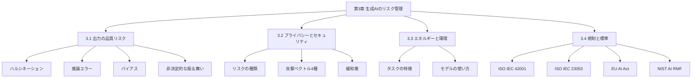
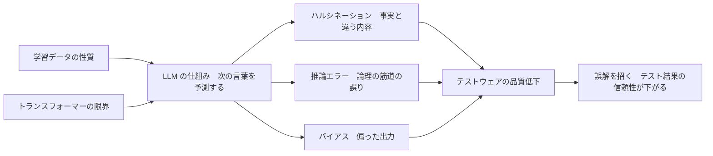
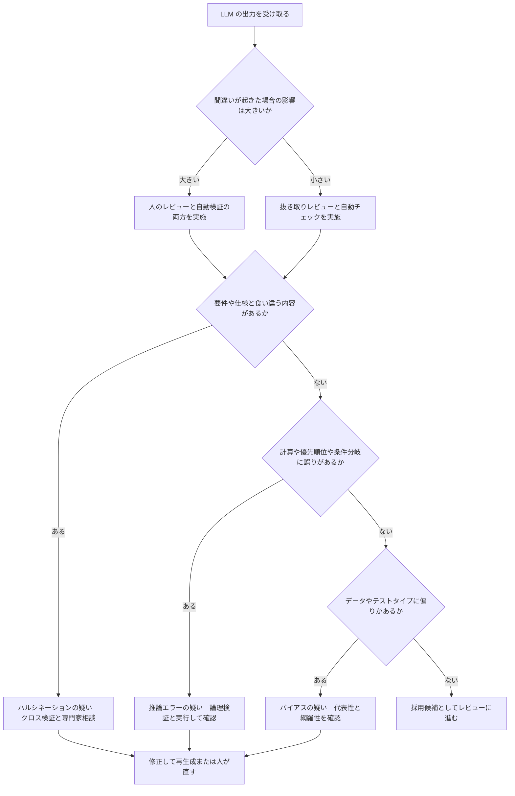
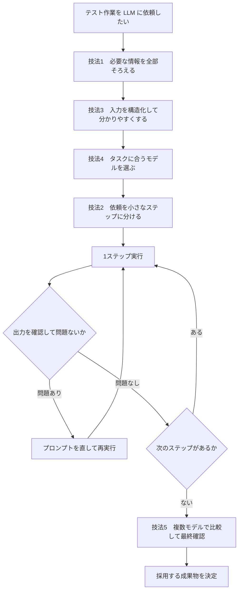
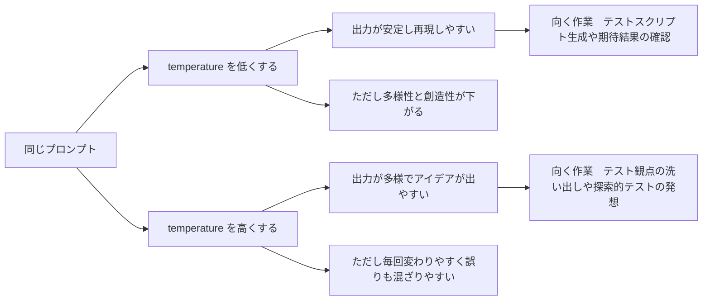
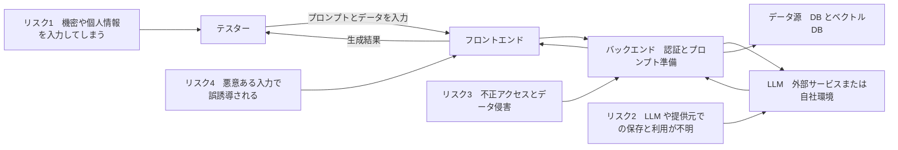
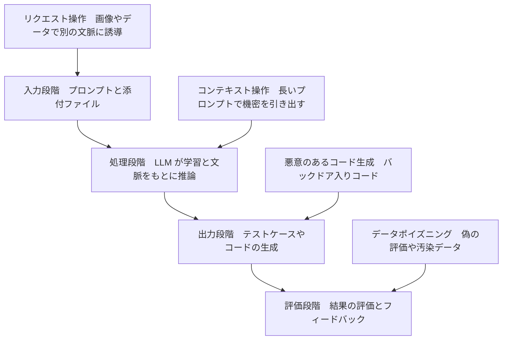
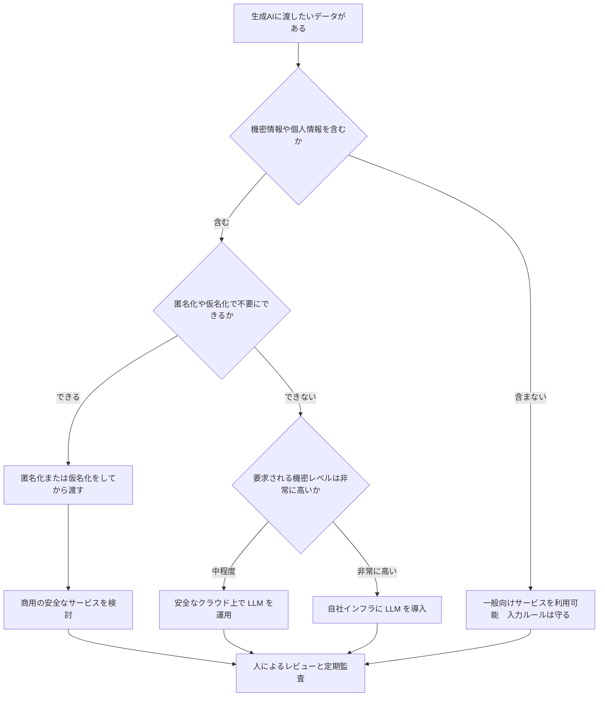
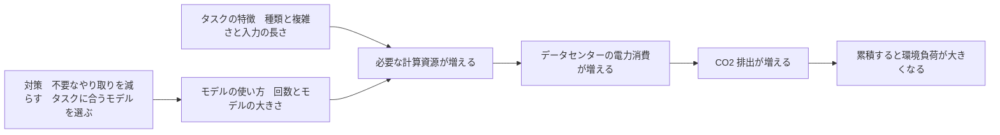
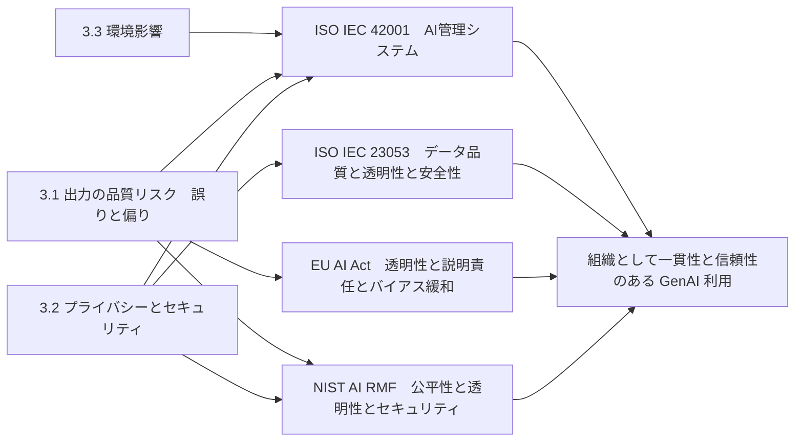

# CT-GenAI 第3章：ソフトウェアテストにおける生成AIのリスク管理　初学者向けステップバイステップ解説

> **対象試験**：ISTQB® Certified Tester Specialist Level – Testing with Generative AI（CT-GenAI）
> **対象シラバス**：Syllabus v1.1（2026/04/27 版）第3章「Managing Risks of Generative AI in Software Testing」（学習時間 160 分）
> **作成日**：2026/09/24
> **表記ルール**：図解は mermaid と markdown の表のみを使用（ASCII アートは使いません）

---

## 📌 この文書の読み方

| 記号 | 意味 |
|------|------|
| 📌 **シラバス記載** | ISTQB 公式シラバス v1.1 に書かれている内容。試験に出る範囲です |
| 💡 **補足（シラバス外）** | 実務で役立つ追加知識やベストプラクティス。試験範囲外ですが、理解を深めるために載せています |
| 🧪 **動作トレース** | 具体例を1ステップずつ追いかけるセクション |
| 📖 **用語集** | 各セクション末尾に、そのセクションで登場した用語をまとめています |
| K1 / K2 / K3 | 学習目標の認知レベル。K1＝思い出せる、K2＝説明できる、K3＝実際に使える |

> ⚠️ **重要**：シラバス 0.6 節によると、試験の出題範囲は「序文・ハンズオン目標（HO）・付録を除く全セクション」です。本文書のハンズオン（HO）の解説は**理解を助けるための練習**であり、出題対象そのものではありません。ただし、HO で体験する内容は K3 問題（実際に使えるか）の理解に直結します。

---

## 目次

1. [第3章の全体像](#1-第3章の全体像)
2. [3.1 ハルシネーション・推論エラー・バイアス](#2-31-ハルシネーション推論エラーバイアス)
3. [3.2 データプライバシーとセキュリティのリスク](#3-32-データプライバシーとセキュリティのリスク)
4. [3.3 エネルギー消費と環境への影響](#4-33-エネルギー消費と環境への影響)
5. [3.4 AI規制・標準・ベストプラクティスフレームワーク](#5-34-ai規制標準ベストプラクティスフレームワーク)
6. [試験対策：まとめ・チェックリスト・練習問題](#6-試験対策まとめチェックリスト練習問題)
7. [参考URL（根拠ソース一覧）](#7-参考url根拠ソース一覧)

---

## 1. 第3章の全体像

💡 この章では、第3章が「何の章で」「どんな順番で」学ぶのかを説明します。細かい内容に入る前にこの地図を頭に入れておくと、後の説明が整理しやすくなります。

### 1.1 この章は一言で言うと

**「生成AI（GenAI＝文章やコードを新しく作り出すAI）をテスト作業に使うと便利だが、間違い・情報漏えい・環境負荷・法規制という4種類のリスクがある。それぞれを見つけて、減らす方法を学ぶ章」** です。

たとえるなら、新人アシスタントを雇うときの心得です。

| 新人アシスタントの例え | 対応する節 |
|----------------------|-----------|
| 自信満々に間違ったことを言う／計算を間違える／偏った知識で判断する → **チェックが必要** | 3.1 |
| 社外秘の資料を不用意に外に持ち出す／悪意ある人にだまされる → **情報管理のルールが必要** | 3.2 |
| 仕事量が増えるほど電気代（＝環境への負荷）が増える → **無駄な依頼を減らす** | 3.3 |
| 会社や国の就業規則・法律を守る → **ルールブックを知る** | 3.4 |

### 1.2 学習目標（Learning Objectives）一覧

📌 **シラバス記載**（原文の意味を日本語に直しています）

| ID | レベル | 学習目標 | 本文書の場所 |
|----|--------|---------|-------------|
| GenAI-3.1.1 | K1 | ハルシネーション・推論エラー・バイアスの**定義を思い出せる** | 2.1 |
| GenAI-3.1.2 | K3 | LLM の出力の中の、ハルシネーション・推論エラー・バイアスを**見つけられる** | 2.2 |
| GenAI-3.1.3 | K2 | ハルシネーション・推論エラー・バイアスの**軽減方法を要約できる** | 2.3 |
| GenAI-3.1.4 | K1 | LLM の非決定的な振る舞いの**軽減方法を思い出せる** | 2.4 |
| GenAI-3.2.1 | K2 | データプライバシーとセキュリティの**主なリスクを説明できる** | 3.1 |
| GenAI-3.2.2 | K2 | データプライバシーと脆弱性の**例を挙げられる** | 3.2 |
| GenAI-3.2.3 | K2 | プライバシー保護とセキュリティ強化の**緩和策を要約できる** | 3.3 |
| GenAI-3.3.1 | K2 | タスクの特徴とモデルの使い方が**エネルギー消費に与える影響を説明できる** | 4.1 |
| GenAI-3.4.1 | K1 | 関連する AI 規制・標準・フレームワークの**例を思い出せる** | 5.1 |

**ハンズオン目標（HO）**：HO-3.1.2a（ハルシネーション実験）、HO-3.1.2b（推論エラー実験）、HO-3.2.3（ケーススタディでリスクを見つける）、HO-3.3.1（シミュレータでエネルギーと CO₂ を計算）

**シラバス指定キーワード**（試験では K1 レベルで覚えておく必要があります）

| 種類 | キーワード |
|------|-----------|
| 一般キーワード | security（セキュリティ）、vulnerability（脆弱性）、data privacy（データプライバシー） |
| 生成AI固有キーワード | hallucination（ハルシネーション）、temperature（温度）、reasoning error（推論エラー）、bias（バイアス）、context manipulation（コンテキスト操作） |

### 1.3 第3章の全体マップ

この図は、第3章の4つの節と、それぞれの中で学ぶ主な項目の関係を表しています。上から下へ読み進めてください。



各ノードの意味：

- 「第3章」（一番上）：章全体。160 分の学習時間が割り当てられています。
- 「3.1 出力の品質リスク」：AI の**答えが間違っている**問題。テストの成果物（テストケースなど）の品質に直結します。
- 「3.2 プライバシーとセキュリティ」：AI に渡す**データが漏れる**問題と、AI が**攻撃される**問題。
- 「3.3 エネルギーと環境」：AI を使うと**電力を消費し CO₂ が出る**問題。
- 「3.4 規制と標準」：上の3つのリスクに対処するための**ルールブック**（法律・規格・指針）。

### 1.4 試験の基本情報

📌 **シラバス記載／ISTQB 公式ページ記載**

| 項目 | 内容 |
|------|------|
| 問題数 | 40 問 |
| 合格点 | 30 点（65%）／満点 46 点 |
| 試験時間 | 60 分（英語が母国語でない場合は +25%） |
| 受験の前提条件 | ISTQB® Certified Tester Foundation Level（CTFL）の取得 |
| 章別の学習時間 | 第1章 100 分／第2章 365 分／**第3章 160 分**／第4章 110 分／第5章 80 分 |

> 💡 満点が 46 点で問題数が 40 問なのは、問題ごとに配点が異なるためです（K レベルが高い問題ほど配点が高くなる設計）。配点の詳細は ISTQB Exam Structures and Rules 文書を確認してください。

📖 **このセクションで登場した用語**

- **GenAI（生成AI）**：学習したパターンをもとに、文章・画像・コードなどを新しく作り出すAI
- **LLM（大規模言語モデル）**：大量の文章で学習した、文章を扱うのが得意なAIモデル
- **テストウェア**：テスト作業で作られる成果物の総称（テストケース、テストスクリプト、テストデータ、報告書など）
- **K レベル**：学習目標の難しさを表す段階。K1＝記憶、K2＝理解、K3＝応用

---

## 2. 3.1 ハルシネーション・推論エラー・バイアス

💡 この章では、生成AIが出力する内容に含まれる3種類の「間違い」（ハルシネーション・推論エラー・バイアス）の意味、見つけ方、減らし方、そして毎回結果が変わる問題（非決定性）への対処を説明します。テストの成果物の品質を守る、第3章の中心的な節です。

### 2.0 なぜこの節が必要なのか

📌 **シラバス記載**：LLM は「次に来そうな言葉（トークン）を予測して並べる」仕組みで動いています。そのため、出力は**「もっともらしい」が「正しい」とは限りません**。シラバス 1.1.2 節でも「plausible is not necessarily correct（もっともらしいことは、必ずしも正しいことを意味しない）」と述べられています。

さらに、LLM の出力は毎回少しずつ変わる（非決定的）ため、**ある出力で間違いを直したように見えても、別の会話で同じ間違いが再発することがあります**。だからこそ「人が確認する仕組み」と「間違いを減らす工夫」の両方が必要になります。

### 2.1 【GenAI-3.1.1 / K1】3つの「間違い」の定義

📌 **シラバス記載**

この3つの違いを最初に押さえます。日常の例え話と合わせて覚えると、混同しにくくなります。

| 用語 | 定義（シラバスの意味） | 日常の例え | テスト現場での具体例 |
|------|----------------------|-----------|---------------------|
| **ハルシネーション**（hallucination＝幻覚） | 事実と異なる、またはタスクに無関係な内容を出力すること | 知らないことでも自信満々に「あの店は駅の北口にあるよ」と作り話をする人 | 存在しない受け入れ基準を確認するテストケースを作る／動かないテストスクリプトを作る／架空のテストケースを作る |
| **推論エラー**（reasoning error） | 原因と結果、条件分岐、段階的な問題解決といった**論理の筋道**を取り違え、間違った結論に至ること | 電卓を使わずに暗算して、途中の桁を間違える人。式の形は正しく見えるのに答えがずれる | テスト計画やテストケースの優先順位付けで、リスクの計算や依存関係の判断を間違える |
| **バイアス**（bias＝偏り） | 学習データに含まれていた偏りが原因で、特定の種類の情報・進め方・前提を優先した出力になること | 片寄った内容の教科書だけで勉強した人。他の考え方が視野に入らない | 英語データ中心の学習で、日本語や他言語の観点が少ないテストデータになる／非機能テスト（性能・使いやすさなど）が抜け落ちる |

**押さえどころ**（シラバスの記述）

- 推論エラーの背景：LLM は人間のような**真の論理的推論をしているのではなく、パターンの照合**に頼っています。そのため数学的な推論などで筋の通らない結果を出すことがあります。
- 3つとも、**「学習データの性質」と「トランスフォーマー（transformer＝LLM の基本構造）の限界」**から生まれます。
- 影響を受けやすいテスト作業の例：
  - ハルシネーション → テストケース生成、テストスクリプト生成、受け入れ基準のレビュー
  - 推論エラー → **テスト計画**、**テストケースの優先順位付け**
  - バイアス → **テストデータ生成**、**受け入れ基準の改善**

#### 3つの間違いの関係図

この図は、3つの間違いがどこから生まれ、テストの成果物にどう影響するかを表しています。左から右へ読み進めてください。



各ノードの意味：

- 「学習データの性質」「トランスフォーマーの限界」：3つの間違いの**共通の原因**。
- 「LLM の仕組み」：次のトークンを確率で予測する仕組み。ここから「もっともらしいが正しいとは限らない」出力が生まれます。
- 「ハルシネーション／推論エラー／バイアス」：出力に現れる3つの**症状**。
- 「テストウェアの品質低下」：症状が積み重なった結果、テストケースなどの成果物が**期待に届かない**状態。

#### 試験で問われやすいポイント（K1）

| 出題パターン | 正解の考え方 |
|------------|------------|
| 「存在しない受け入れ基準を検証するテストケースを生成した」はどれか | ハルシネーション |
| 「リスク値の掛け算を間違えて優先順位が逆転した」はどれか | 推論エラー |
| 「テストデータの氏名が英語圏の名前ばかりだった」はどれか | バイアス |
| これらのリスクが直りにくい理由は何か | 非決定的な振る舞いのため、ある出力で直っても別の会話で再発しうる |

📖 **このセクションで登場した用語**

- **ハルシネーション**：AI が事実と異なる、または無関係な内容をそれらしく出力すること
- **推論エラー**：AI が論理の筋道（原因と結果、条件分岐、段階的な計算など）を取り違えること
- **バイアス**：学習データの偏りから生じる、出力の偏り
- **トークン**：LLM が文章を処理するときの最小単位（文字、単語、単語の一部など）
- **トランスフォーマー**：LLM の土台になっているニューラルネットワークの構造
- **非決定的**：同じ入力でも毎回同じ出力になるとは限らない性質

---

### 2.2 【GenAI-3.1.2 / K3】LLM の出力から3つの間違いを見つける

💡 この章では、間違いを見つけるための具体的な方法を説明します。K3（実際に使える）レベルなので、「この出力にはどの間違いが含まれているか」を判断する練習問題が出題されやすい部分です。

#### なぜ「見つける力」が必要なのか

📌 **シラバス記載**：LLM を使ったテストでは、AI が作った成果物をそのまま信じると、間違ったテストが実行され、**本当の不具合を見逃す**恐れがあります。そこで、人によるレビューと自動検証を組み合わせて、間違いを発見します。

#### 検出方法の一覧

📌 **シラバス記載**

| 対象 | 検出方法 | 内容 | 例え話 |
|------|---------|------|--------|
| **ハルシネーション** | ① クロス検証（cross-verification） | AI の出力を、既存の文書・要件・既知のシステムの動作と**突き合わせる**。自動ツールで参照元と照合することもできる | 新人が書いた議事録を、録音や資料と照らし合わせる |
| | ② ドメイン専門家への相談 | 該当分野の専門家（SME＝Subject Matter Expert）に内容の正確さを確認してもらう。自動化では見落とすニュアンスを拾える | 専門医が診断書を確認する |
| | ③ 一貫性チェック（consistency check） | 出力同士や、既知の情報との間で**矛盾がない**かを確認する | 同じ報告書の1ページ目と5ページ目で数字が食い違っていないか見る |
| **推論エラー** | ① 論理的検証（logical validation） | 出力の論理の流れ（一貫性・筋道・構造化された推論）が正しいかをレビューで確認する。複雑なケースは人の判断が必要 | 数学の答案の途中式を1行ずつ確認する |
| | ② 出力のテスト（output testing） | 生成されたテストケースやテストスクリプトを**実際にテスト対象に対して実行**して結果を確認する。部分的または完全に自動化できる | 料理のレシピを、実際に作って味見する |
| **バイアス** | ① 生成物の代表性の確認 | テストコードや合成テストデータが、**定義したテスト戦略とカバレッジ要件を公平・正確に反映**しているかをレビューする | クラス全員の意見が入っているかを名簿と照らして確認する |
| | ② テストタイプの偏りの確認 | 例えば、**非機能テストが少ない**など、特定のテストタイプが不足していないかを評価する | 「味」ばかりで「衛生」の検査が抜けていないか確認する |

> 📌 **重要な条件**：これらの検出方法をどこまで深く実施するかは、**そのテスト作業で間違いが起きた場合のリスクの大きさ**に応じて決めます（シラバス 3.1.2 節末尾）。リスクが小さい作業は軽い確認、リスクが大きい作業は厳しい確認、というリスクベースの考え方です。

#### 検出の判断フロー

この図は、LLM の出力を受け取ってから、どの検出方法を選ぶかの考え方を表しています。上から下へ読み進めてください。



各ノードの意味：

- 「間違いが起きた場合の影響は大きいか」（ひし形）：**リスク判定**。影響が大きいほど検証を厚くします（シラバスの考え方）。
- 「要件や仕様と食い違う内容があるか」：ハルシネーションの検出。要件・仕様と**突き合わせる**のがポイントです。
- 「計算や優先順位や条件分岐に誤りがあるか」：推論エラーの検出。**論理を確認**するか、**実際に動かして**確かめます。
- 「データやテストタイプに偏りがあるか」：バイアスの検出。**全体の偏り**を見る視点です。
- 「修正して再生成または人が直す」：見つけた間違いは、プロンプトを直して再生成するか、人が直接修正します。

#### 🧪 動作トレース：ログイン機能のテストケース生成

**題材**：次のユーザーストーリーとテスト基盤情報を LLM に渡して、テストケースを作らせた場面です。

- ユーザーストーリー：「ユーザーとして、メールアドレスとパスワードでログインしたい」
- 受け入れ基準 AC-1：正しいメールアドレスとパスワードでログインできる
- 受け入れ基準 AC-2：パスワードを5回連続で間違えると、アカウントが30分間ロックされる

LLM が出力した内容を1つずつ追い、どの間違いに当たるかを判定します。

| 手順 | LLM の出力内容 | 判定 | 見つけた方法 | 対処 |
|------|---------------|------|-------------|------|
| 1 | TC-01：正しい認証情報でログインできることを確認する | 問題なし | 受け入れ基準 AC-1 と一致 | そのまま採用 |
| 2 | TC-05：**2段階認証コードを入力してログインできる**ことを確認する | **ハルシネーション** | クロス検証：AC-1・AC-2 に2段階認証の記述が**無い** | 削除。「存在しない要件」を検証するテストは、テストの信頼を損なう |
| 3 | 優先順位の計算：「リスク値＝発生可能性 3 × 影響度 5 ＝ **8**」 | **推論エラー** | 論理的検証：3 × 5 は 15。**掛け算が足し算になっている** | 計算し直し（正しくは 15）。優先順位の順番も再確認 |
| 4 | TC-09：「4回失敗後にログインできる」「5回失敗でロック」の境界値テスト | 問題なし | 出力のテスト：実際に実行して期待どおりになることを確認 | 採用 |
| 5 | テストデータ：ユーザー名が `John Smith`、`Alice Brown` など**英語圏の名前のみ** | **バイアス** | 代表性の確認：日本語名、長い名前、全角文字、記号を含む名前が無い | 「日本語名・全角・最大文字数」のデータを追加するよう指示して再生成 |
| 6 | 全10ケースがすべて機能テスト。性能・アクセシビリティ（利用しやすさ）の観点がゼロ | **バイアス**（テストタイプの偏り） | テストタイプの偏りの確認 | 非機能テストの観点を追加するようプロンプトで指示 |

**このトレースから分かること**：1つの出力の中に、**3種類の間違いが混ざる**ことがあります。1つの方法では見つけきれないため、複数の検出方法を組み合わせます。

#### ハンズオン目標の追体験（HO-3.1.2a / HO-3.1.2b：H1）

📌 **シラバス記載**（手順は学習用に整理）

| HO | ねらい | 進め方 |
|----|--------|--------|
| **HO-3.1.2a**（ハルシネーションの実験） | 少なくとも2種類の LLM に、**与えていない基準を勝手に付け足す**状況を起こさせ、プロンプトの違いが与える影響を観察する | ① 与える情報を意図的に少なくしたユーザーストーリーを用意する → ② 同じプロンプトを2つの LLM に送る → ③ 元の情報に無い受け入れ基準が出ていないかを確認する → ④ プロンプトを変えて（例：「情報に無いことは書かない」）差を比べる |
| **HO-3.1.2b**（推論エラーの実験） | テスト計画（工数見積もり、優先順位付け）のように**複雑な入力を持つ問題**で、LLM の限界を体験する | ① 正解が分かっている問題（例：優先順位付け）を用意する → ② LLM、SLM（小さい言語モデル）、推論モデルの3タイプで解かせる → ③ 正解と比べる → ④ プロンプトを変えて改善を試みる |

#### 💡 補足：実務で使える「検出」のベストプラクティス

| 場面 | ベストプラクティス | 理由 |
|------|-------------------|------|
| チャットボットで単発にテストケースを作る | 生成結果の各ケースに**「根拠となる要件 ID」を併記させ**、根拠が無いケースは「要件外」と書かせる | ハルシネーションを見つけやすくなる（クロス検証の手間が減る） |
| テストスクリプトを生成する | 生成後は**必ず実際に実行**してから採用する | 出力のテストが、推論エラーとハルシネーションの両方を最も確実に見つけられる |
| 優先順位や見積もりの計算を任せる | 計算部分は AI に任せきりにせず、**表計算ソフトやコードで再計算**する | LLM は計算が苦手（パターン照合のため）。人が検算できる形で出力させる |
| テストデータ生成 | 生成後に「言語・長さ・文字種・境界値」の**チェックリスト**で偏りを確認する | バイアスは見た目では気づきにくい |
| LLM 搭載のテストツールを使う | ツールが出す結果にも**同じ検証**をかける。ツール内部でも LLM が使われている | シラバス 4.1.3 節でも、エージェントはハルシネーション・推論エラー・バイアスの問題を引き継ぐと明記 |

📖 **このセクションで登場した用語**

- **クロス検証**：AI の出力を既存の文書や既知の動作と突き合わせて、食い違いを見つけること
- **SME（ドメイン専門家）**：その分野に詳しい人。AI が間違えやすい細かい点を判断できる
- **一貫性チェック**：出力同士や既知の情報との間に矛盾が無いかを確認すること
- **論理的検証**：出力の筋道が正しいか（原因と結果、条件の順序など）を確認すること
- **出力のテスト**：生成したテストケースやスクリプトを実際に実行して確認すること
- **SLM（小規模言語モデル）**：LLM より小さく軽い言語モデル。特定の用途向けに使われる
- **境界値**：条件が切り替わる境目の値（例：5回目でロック→ 4回と5回が境界）
- **非機能テスト**：機能以外の品質（性能、使いやすさ、セキュリティなど）を確認するテスト

---
### 2.3 【GenAI-3.1.3 / K2】ハルシネーション・推論エラー・バイアスの軽減方法

💡 この章では、間違いを**そもそも起きにくくする**ための5つの技法を説明します。前の 2.2 節が「起きた間違いを見つける」話だったのに対し、ここは「起きる前に減らす」話です。

#### なぜ「入力」を整えると間違いが減るのか

📌 **シラバス記載**：これらの問題は、**プロンプトが適切に設計されていない**とき、または**そのテスト作業に必要な文脈（コンテキスト）の情報が足りない**ときに、起きやすくなります。

たとえるなら、初めて来たアルバイトに「いい感じに片付けておいて」とだけ頼むと、意図と違う片付け方をされるのと同じです。**頼み方（プロンプト）と渡す情報（コンテキスト）を整える**ことが、最初の対策になります。

#### 5つの軽減技法

📌 **シラバス記載**

| # | 技法 | 内容 | 例え話 | 関連する章 |
|---|------|------|--------|-----------|
| 1 | **完全なコンテキストを与える**（Provide complete context） | プロンプトに、そのタスクに必要な情報をすべて含める（役割・文脈・指示・入力データ・制約・出力形式） | 引っ越し業者に、荷物の量・階数・エレベーターの有無を全部伝える | 2.1.1 節 |
| 2 | **プロンプトを扱いやすい単位に分ける**（Divide prompts into manageable segments） | 複雑な依頼を小さなステップに分け（プロンプトチェイニング）、**各ステップの出力を確認してから次へ進む**。推論エラーを早く見つけられる | 料理を「下ごしらえ→炒める→味付け」と分け、各段階で味見する | 2.1.2 節 |
| 3 | **明確で解釈しやすいデータ形式を使う**（Use clear, interpretable data formats） | あいまいで解釈しにくい形式を避け、構造化されたシンプルな形式にする | 手書きのメモより、罫線のある表の方が読み間違えにくい | ― |
| 4 | **タスクに適した GenAI モデルを選ぶ**（Select the appropriate GenAI model） | そのタスク向けに学習されたモデルを使う | 家の修理は、料理人ではなく大工さんに頼む | 5.1.3 節 |
| 5 | **モデル間で結果を比較する**（Compare results across models） | 同じプロンプトを複数の LLM に送り、出力を比べて誤りを見つけ、信頼できる結果を選ぶ | 医療の「セカンドオピニオン」 | ― |

**追加の対策**：📌 シラバスは「第4章で、LLM の結果を良くする補完的な技法として **RAG（Retrieval-Augmented Generation＝検索拡張生成）** と **ファインチューニング**を学ぶ」と述べています。第3章の試験では「これらが軽減策として第4章で扱われる」ことを押さえておけば十分です。

#### 軽減技法の使い方フロー

この図は、テスト作業を LLM に依頼するときに、5つの技法をどの順に使うかを表しています。上から下へ読み進めてください。



各ノードの意味：

- 「技法1」：役割・文脈・指示・入力データ・制約・出力形式の**6要素**（シラバス 2.1.1 節）をそろえます。
- 「技法3」：表・箇条書き・JSON など、**曖昧さの少ない形式**にします。
- 「技法4」：タスクの難しさに応じて、**推論モデル**か**通常の指示調整モデル**かを選びます（シラバス 1.1.3 節）。
- 「技法2」（ステップ実行のループ）：**1ステップごとに確認**し、問題があればそのステップだけやり直します。
- 「技法5」：最後に**別のモデル**にも同じ依頼をして結果を比べ、食い違いがあれば調べます。

#### 💡 補足：プロンプトの改善例（Before / After）

**Before（情報不足で、ハルシネーションが起きやすい依頼）**

```text
ログイン機能のテストケースを作ってください。
```

**After（技法1・3を適用した依頼。6要素を含める）**

```text
# 役割
あなたは ISTQB の考え方に沿ってテスト設計をするテストアナリストです。

# コンテキスト
対象は Web アプリのログイン画面です。ユーザーはメールアドレスとパスワードで認証します。

# 指示
下の受け入れ基準だけを根拠に、機能テストケースを作成してください。
各テストケースには、根拠となる受け入れ基準の ID を必ず書いてください。
受け入れ基準に無い内容は作らず、不明点は最後に「質問」として列挙してください。

# 入力データ
AC-1：正しいメールアドレスとパスワードでログインできる
AC-2：パスワードを5回連続で間違えると、アカウントが30分間ロックされる

# 制約
- 2段階認証やソーシャルログインなど、上記に無い機能は含めない
- 境界値分析を使い、4回・5回・6回の失敗を検証する

# 出力形式
表形式（列：TC-ID、根拠AC、前提条件、手順、期待結果）
```

**なぜ Before/After で結果が変わるのか**：After では ①根拠 ID を書かせることで、**あとから突き合わせやすく**（クロス検証しやすく）なり、②「無いことは作らない」と明示することで**ハルシネーションが起きにくく**なり、③具体的な技法（境界値分析）を指定することで**推論の方向が定まります**。

> 💡 補足：この書き方は、あくまで**リスクを下げる工夫**です。プロンプトを工夫しても間違いがゼロになるわけではないため、2.2 節の検出方法とセットで使います。

📖 **このセクションで登場した用語**

- **コンテキスト**：AI が答えを作るときの背景情報（対象システム、機能の説明、参考資料など）
- **プロンプトチェイニング**：複雑な依頼を複数のプロンプトに分け、結果を確認しながら順に進める方法
- **構造化データ**：表や JSON のように、項目と値が整理された形式のデータ
- **指示調整モデル（instruction-tuned LLM）**：人の指示に沿って答えるよう追加訓練された LLM
- **推論モデル（reasoning LLM）**：段階的な思考が必要な問題に強くなるよう調整された LLM
- **RAG**：AI が回答を作る前に社内文書などを検索して、その内容を材料に加える仕組み（第4章で詳述）
- **ファインチューニング**：既存のモデルを特定の用途向けに追加学習させること（第4章で詳述）
- **境界値分析**：条件の境目の値を重点的にテストする技法

---

### 2.4 【GenAI-3.1.4 / K1】非決定的な振る舞い（Non-Deterministic Behavior）への対処

💡 この章では、「同じ質問でも答えが毎回変わる」LLM の性質と、その変動を小さくする2つの設定（temperature と random seed）を説明します。K1（思い出せる）レベルなので、**用語と効果を正確に覚える**ことが大切です。

#### なぜ答えが毎回変わるのか

📌 **シラバス記載**：LLM は、次に来る言葉を**確率にしたがってサンプリング（選択）**して文章を作ります。このため、**同じ入力を与えても出力が変わる**ことがあります。特に**長い出力ほど**変動しやすくなります。完全に同じ結果になることを**保証することはできません**が、変動を減らす方法があります。

たとえるなら、**サイコロを振って次の言葉を選ぶ**イメージです。サイコロの振れ幅が大きいと毎回違う結果になり、振れ幅を小さくすると同じ目が出やすくなります。

#### 2つの軽減策

📌 **シラバス記載**

| 設定 | 何をするか | 効果 | 注意点（トレードオフ） | 例え話 |
|------|-----------|------|---------------------|--------|
| **temperature（温度）を下げる** | 生成時に、次の言葉の**確率分布を狭める**（可能性の高い言葉に集中させる） | ランダム性が減り、**出力が安定**する | **創造性や多様性が下がり**、出力が単調・繰り返しになりやすい（決まりきった答えになる） | レシピどおりに作る（安定）↔ アレンジを加える（多様） |
| **random seed（乱数シード）を固定する** | 乱数を作る元の値（シード）を固定し、**同じ乱数の並び**を使わせる | **再現性**が上がる | すべての LLM 実装で使えるわけではない。**完全な再現は保証されない** | くじ引きの結果を、同じ並び順の名簿で毎回再現する |

> 📌 シラバスは「seed を設定できる LLM 実装もある（Some LLM implementations allow...）」と表現しています。**すべてのモデル・サービスで使えるとは限りません**。試験では「すべての LLM で seed を固定できる」という記述は誤りになります。

さらにシラバスは、非決定的な振る舞いによるハルシネーションや推論エラーのリスクを減らすため、**出力の検証の一部を自動化**して、構造化された一貫性のある評価プロセスにすることを勧めています。

#### temperature の効果の図

この図は、temperature を変えたときの出力の違いを表しています。左から右へ読み進めてください。



各ノードの意味：

- 「temperature を低くする」：確率の高い言葉に集中させる設定。**安定・再現性重視**。
- 「temperature を高くする」：確率の低い言葉も選ばれやすくなる設定。**多様性・発想重視**。
- 「向く作業」の2つ：これは 💡 補足（実務上の目安）です。シラバスは「低くすると安定するが多様性が下がる」というトレードオフまでを述べています。

#### 🧪 動作トレース：同じプロンプトを5回実行して安定度を測る

**題材**：「ログインの受け入れ基準 AC-2 から、境界値テストケースを3つ出して」というプロンプトを5回実行し、出力が何種類できるかを数えます。

| 設定 | 1回目 | 2回目 | 3回目 | 4回目 | 5回目 | 出力の種類数 | 読み取れること |
|------|------|------|------|------|------|-------------|---------------|
| temperature 高め、seed なし | A | B | C | A' | D | 5種類 | 毎回違う。再現性が低く、比較や自動検証が難しい |
| temperature 低め、seed なし | A | A | A' | A | A | 2種類 | かなり安定するが、わずかな揺れが残る |
| temperature 低め、seed 固定 | A | A | A | A | A | 1種類 | 最も再現しやすい。ただし**保証はされない** |

> ※ 表の A〜D は「出力の内容」を表す記号で、**学習用に作った例**です。実際の結果はモデルやサービスにより異なります。

**注意点**：この結果は「今日のこの環境」での傾向です。提供側でモデルや基盤設定が更新されると、同じ seed でも結果が変わることがあります（下の補足を参照）。

#### 💡 補足：コードで確認する（OpenAI API の例）

OpenAI の公式ドキュメントでは、`seed` を指定すると「**ベストエフォート（できる限り）**でも決定的にサンプリングする」と説明され、**決定性は保証されない**ことが明記されています。また、バックエンドの構成が変わったかを知るため、応答の `system_fingerprint` を確認するよう案内されています。

```python
from openai import OpenAI  # OpenAI 公式 SDK。他社の API でも考え方は同じ

# API キーは環境変数から自動で読み込まれる。
# コードに直接書くと、リポジトリ経由で漏えいする恐れがあるため。
client = OpenAI()

PROMPT = "受け入れ基準 AC-2 から、境界値のテストケースを3つ、表形式で作成してください。"
RUNS = 5  # 1回だけでは偶然か傾向か判別できないため、複数回実行して傾向を見る

def run_once(seed: int):
    response = client.chat.completions.create(
        model="YOUR_MODEL_NAME",   # 利用するモデル名に置き換える
        messages=[{"role": "user", "content": PROMPT}],
        temperature=0.0,           # ランダム性を最小にするため。ただし多様性は下がる
        seed=seed,                 # 同じ seed を使い、再現性を高めるため
    )
    # system_fingerprint：サーバー側の構成を表す識別子。
    # これが変わると、同じ seed でも結果が変わりうるため一緒に記録する。
    return response.choices[0].message.content, response.system_fingerprint

results = [run_once(seed=42) for _ in range(RUNS)]

unique_outputs = {text for text, _ in results}    # 重複を除いて、出力が何種類できたかを数える
fingerprints = {fp for _, fp in results}          # 構成が途中で変わっていないかを確認する

print(f"出力の種類数：{len(unique_outputs)} / {RUNS}")
print(f"system_fingerprint の種類数：{len(fingerprints)}")
```

**コードを読むときのポイント**：

- `temperature=0.0` と `seed=42` の2つが、シラバスで述べられている2つの軽減策に対応しています。
- **すべてのモデルでこれらのパラメータが指定できるとは限りません**。モデルや提供元ごとにドキュメントを確認してください（例：一部のモデルでは temperature が固定、または指定できないことがあります）。
- 出力を**複数回実行して統計的に見る**のは、シラバス 2.3.1 節の「非決定的な性質があるため、評価指標は統計的に意味のあるデータに基づく必要がある」という考え方にも合っています。

#### 💡 補足：3.1 全体のサービス・機能別ベストプラクティス

| 使っているもの | 主なリスク | ベストプラクティス | 根拠 |
|--------------|-----------|-------------------|------|
| **AI チャットボット**（ブラウザ上で対話する形式） | ハルシネーション、対話ごとの出力のぶれ | 6要素のプロンプトを使う／根拠 ID を併記させる／**1ステップごとに人が確認**して次に進む（プロンプトチェイニング） | シラバス 1.2.2、2.1.2、3.1.3 |
| **LLM 搭載のテストツール**（API 連携で自動化） | 自動処理のため、間違いが**そのまま後続に流れる** | 出力の**自動検証**（形式チェック、実行テスト）を組み込む／重要なタスクは**人の承認を挟む** | シラバス 3.1.4、4.1.3 |
| **API のパラメータ**（temperature・seed） | 再現性の不足 | temperature を下げ、seed を固定し、応答の構成識別子も記録する。**完全な再現は保証されない**前提で評価する | シラバス 3.1.4、OpenAI Cookbook |
| **推論モデル／通常モデルの選択** | 複雑な計算・優先順位付けでの推論エラー | 論理的な多段階の作業は推論モデルを検討し、結果は必ず**検算**する | シラバス 1.1.3、3.1.3 |
| **複数モデル** | 1つのモデル特有の誤り | 重要なタスクは**複数モデルで結果を比較** | シラバス 3.1.3 |
| **RAG／ファインチューニング**（第4章） | 社内情報の不足による誤り | 最新の仕様・要件を検索して渡す（RAG）／専門領域の用語に合わせる（ファインチューニング） | シラバス 3.1.3、4.1.2、4.2.1 |

#### 3.1 節の試験ポイントまとめ

| 観点 | 覚えること |
|------|-----------|
| 定義（K1） | ハルシネーション＝事実と異なる／無関係。推論エラー＝論理の取り違え。バイアス＝学習データ由来の偏り |
| 検出（K3） | ハルシネーション＝クロス検証・専門家・一貫性。推論エラー＝論理検証・実行して確認。バイアス＝代表性・テストタイプの偏り |
| 軽減（K2） | 完全なコンテキスト／プロンプトを分割／明確なデータ形式／適切なモデル／複数モデル比較 |
| 非決定性（K1） | temperature を下げる（多様性は下がる）／seed を固定（使える実装のみ・完全再現は保証されない） |
| 前提 | 検出の深さは**リスクの大きさ**で決める |

📖 **このセクションで登場した用語**

- **サンプリング**：確率にもとづいて、次の言葉の候補から1つを選ぶこと
- **temperature（温度）**：次の言葉を選ぶときのランダムさの強さを決める設定。低いほど安定し、高いほど多様
- **確率分布**：各候補の「選ばれやすさ」の並び
- **random seed（乱数シード）**：乱数を作る元の値。固定すると同じ乱数の並びになる
- **再現性**：同じ条件で同じ結果を再び得られること
- **system_fingerprint**：OpenAI の API 応答に含まれる、サーバー側の構成を表す識別子（参考：他社では別名の場合があります）
- **ベストエフォート**：できる限り努力するが、結果を保証しないこと

---
## 3. 3.2 データプライバシーとセキュリティのリスク

💡 この章では、生成AIをテストに使うときの**情報漏えい（プライバシー）**と**攻撃（セキュリティ）**のリスクを3段階（リスクの種類 → 攻撃の具体例 → 緩和策）で説明します。3.1 が「答えの質」の話だったのに対し、ここは「データと守り」の話です。

### 3.0 なぜこの節が必要なのか

📌 **シラバス記載**：生成AIは大量のデータを処理し、その中には**機密情報や個人を特定できる情報（PII＝Personally Identifiable Information）**が含まれる場合があります。また、LLM を組み込んだテスト基盤は、**攻撃の入り口**にもなります。データ保護が弱いと、情報漏えい・不正アクセス・機密データの露出につながります。

テストの現場では、本番データのコピー、不具合の再現ログ、顧客情報を含む画面キャプチャなどを、つい AI に貼り付けたくなる場面があります。**「便利だから貼る」が、最も起きやすい情報漏えいの入口**です。

---

### 3.1 【GenAI-3.2.1 / K2】データプライバシーとセキュリティの主なリスク

📌 **シラバス記載**

#### プライバシーの3つの懸念

| # | 懸念 | 内容 | テスト現場の例 |
|---|------|------|---------------|
| 1 | **意図しないデータの露出**（Unintentional data exposure） | GenAI が出力の中に、**うっかり機密情報を含めて**しまう | AI が生成したテストデータに、実在する顧客のメールアドレスが混ざる |
| 2 | **データ利用の制御不能**（Lack of control over data usage） | GenAI ツールが、利用者の**明確な同意や制御なしに**機密データを保存・処理し、不正利用や不正アクセスにつながりうる | 本番ログを貼った内容が、提供元でどう保存・利用されるか分からない |
| 3 | **コンプライアンスリスク**（Compliance risks） | **GDPR（一般データ保護規則：Regulation (EU) 2016/679）**などのデータ保護規則を守らずに GenAI ツールを使うと、法的な紛争になりうる | EU 居住者の個人データを、必要な根拠なく外部の AI サービスに送る |

#### セキュリティの3つのリスク

| # | リスク | 内容 |
|---|--------|------|
| 1 | **テスト基盤への攻撃** | LLM を使ったテスト基盤が、データ侵害や不正アクセスなどの攻撃を受けやすい |
| 2 | **LLM の脆弱性の悪用** | 悪意のある人が LLM の弱点（後述の「操作型攻撃」）を悪用して、振る舞いを変えたり、機密情報を引き出したりする |
| 3 | **悪意ある入力データ** | 攻撃者が意図的に有害な入力データを与え、LLM を誤誘導して、**正確性やセキュリティを損なわせる** |

#### プライバシーとセキュリティの整理図

この図は、テストで生成AIを使うときの「データの流れ」と、リスクが発生する場所を表しています。左から右へ読み進めてください。



各ノードの意味：

- 「テスター」「フロントエンド」「バックエンド」「LLM」「データ源」：LLM を組み込んだテスト基盤の**基本構成**（シラバス 4.1.1 節の構成）。
- 点線の矢印（リスク1〜4）：**どの場所でどのリスクが発生するか**を表しています。人による入力（リスク1）、外部サービスの扱い（リスク2）、基盤への侵入（リスク3）、悪意ある入力（リスク4）です。

📖 **このセクションで登場した用語**

- **PII（個人を特定できる情報）**：氏名、メールアドレス、電話番号、住所など、個人を識別できる情報
- **GDPR**：EU の個人データ保護に関する規則。個人データの処理に、適法性や目的の限定などのルールを定める
- **コンプライアンス**：法律や社内ルール、契約を守ること
- **データ侵害**：データが外部の第三者に不正に見られたり持ち出されたりすること
- **セキュリティ（security）**：不正アクセスや攻撃から、システムやデータを守ること
- **脆弱性（vulnerability）**：攻撃に悪用されうるシステムの弱点

---

### 3.2 【GenAI-3.2.2 / K2】データプライバシーと脆弱性の例：攻撃ベクトル4種

💡 この章では、シラバスの表にある**4種類の攻撃ベクトル（attack vector＝攻撃の入り口・経路）**を説明します。表の名称と例は、そのまま試験で問われやすい部分です。

#### 4つの攻撃ベクトル

📌 **シラバス記載**（原文の表の意味を日本語にしています）

| 攻撃ベクトル | 内容 | シラバスの例 | 例え話 |
|------------|------|-------------|--------|
| **コンテキスト操作**（Context Manipulation） | 機密の学習データを**引き出そうとするリクエスト**を送る | LLM のコンテキストウィンドウ（一度に扱える量）を超える**長いプロンプト**で AI の記憶を過負荷にし、学習データの断片を**うっかり漏らさせる**。機密情報の露出につながる可能性がある | 長い雑談で相手を疲れさせ、ぽろっと秘密を話させる |
| **リクエスト操作**（Request manipulation） | AI の出力を**乱すデータ**を混入させる | 画像を使って AI を**別の文脈に誘導**し、受け入れ基準について**ハルシネーションを引き起こす** | 道案内の看板をすり替えて、道に迷わせる |
| **データポイズニング**（Data poisoning） | **学習データを操作**する（毒を混ぜる） | AI が作ったテストレポートを評価する際に、**偽の評価**を与える | レシピ本に、間違ったレシピをこっそり紛れ込ませる |
| **悪意のあるコード生成**（Malicious code generation） | LLM を操作して、使用中に**バックドア**（外部コマンド呼び出しなど）を生成させる | 特定の**悪意のある IP アドレス**と通信経路を開くコードを生成させる | 頼んだ設計図に、こっそり秘密の裏口を書き足される |

#### 攻撃ベクトルがどこに入り込むかの図

この図は、4つの攻撃ベクトルが、テストの作業の流れのどこに入り込むかを表しています。上から下へ読み進めてください。



各ノードの意味：

- 「入力段階」「処理段階」「出力段階」「評価段階」：テストで生成AIを使うときの**作業の流れ**。
- 左側の4つの攻撃：**それぞれの段階に入り込みやすい攻撃**。ただし、実際の攻撃は複数の段階にまたがることもあります。この割り当ては覚えやすさのための整理です。

> ⚠️ **暗記のコツ**：「**コ**ンテキスト＝**引き出す**」「**リ**クエスト＝**乱す**（誤誘導）」「**デ**ータポイズニング＝**汚す**（学習・評価）」「**悪**意コード＝**裏口**」と、動詞1つで覚えると混同しにくくなります。

#### 💡 補足：OWASP Top 10 for LLM Applications との対応

シラバスの4種類は代表例です。実務では、OWASP（Open Worldwide Application Security Project）が公開する「**OWASP Top 10 for LLM Applications 2025**」が、より網羅的な整理として広く参照されます（**試験範囲外**）。

| シラバスの攻撃ベクトル | OWASP LLM Top 10（2025）で近いもの |
|----------------------|----------------------------------|
| コンテキスト操作 | LLM02 機密情報の漏えい（Sensitive Information Disclosure）、LLM07 システムプロンプトの漏えい |
| リクエスト操作 | LLM01 プロンプトインジェクション（Prompt Injection） |
| データポイズニング | LLM04 データとモデルのポイズニング（Data and Model Poisoning） |
| 悪意のあるコード生成 | LLM05 不適切な出力の扱い（Improper Output Handling）、LLM06 過剰な権限付与（Excessive Agency） |

> 💡 この対応は**学習のための目安**です。攻撃の分類は、資料により切り口が異なります。

📖 **このセクションで登場した用語**

- **攻撃ベクトル**：攻撃者がシステムに入り込む経路や手段
- **コンテキストウィンドウ**：LLM が一度に扱える情報量の上限（トークン数で表す）
- **データポイズニング**：学習データや評価データに悪意あるデータを混ぜて、AI の振る舞いを歪めること
- **バックドア**：正規の認証を通らずに侵入できる、不正な裏口
- **プロンプトインジェクション**：入力文に命令を紛れ込ませて、AI の指示を上書きしようとする攻撃（OWASP の用語）

---

### 3.3 【GenAI-3.2.3 / K2】プライバシー保護とセキュリティ強化の緩和策

💡 この章では、リスクを減らすための**基本のデータ保護策 4つ**と、**追加の緩和策 5つ**を説明します。組み合わせて使うのが前提です。

#### 前提：規制は GenAI を「禁止」しているわけではない

📌 **シラバス記載**：GDPR のようなデータ保護規則は、GenAI の利用を**明示的に制限してはいません**が、データを集める・処理する・保存する際の**適法性**や**目的の制限**といった**安全策（セーフガード）**を定めており、それが「できること」を制限することがあります。

#### 基本のデータ保護策（4つ）

📌 **シラバス記載**

| # | 対策 | 内容 | 例え話 | テスト現場の実践例 |
|---|------|------|--------|-------------------|
| 1 | **データ最小化**（Data minimization） | 法的に許される場合を除き**機密データを処理しない**。必要最小限の**機密でないデータ**だけを使う | 旅行には必要な荷物だけ持っていく | ログ全体ではなく、不具合の再現に必要な数行だけを渡す |
| 2 | **匿名化・仮名化**（Anonymization / Pseudonymization） | 機密情報を、**個人を特定できないデータ**で**隠す・置き換える** | 名札を外す（匿名化）／あだ名に替える（仮名化） | 氏名・メール・電話番号を、ダミー値やトークンに置換 |
| 3 | **安全なデータ保存と通信**（Secure data storage and transmission） | 強力な**暗号化**と**アクセス制御**を実装する | 金庫に保管し、鍵を持つ人だけが開けられる | 送信は暗号化通信、保存先は権限を絞る |
| 4 | **教育・方針**（Resources training） | GenAI を責任を持って使うための**研修プログラムとポリシー**を整え、倫理的な実践を促し、リスクを減らす | 入社時の安全教育 | 「入力してよいデータ・いけないデータ」を一覧にして周知 |

> 📌 **匿名化と仮名化の違い**（シラバスは「機密情報を、個人を特定できないデータで隠す・置き換える」と述べています）：
> - **匿名化**：元に戻せない形にする（例：`山田太郎` → `[名前]`）。
> - **仮名化**：別の識別子に置き換えるが、対応表があれば元に戻せる（例：`山田太郎` → `USER_001`、対応表は別管理）。
> 　この区別は一般的な定義です。シラバスは両者をまとめて「隠す・置き換える」と述べており、試験では**「機密情報をそのまま渡さず、置き換える」という理解**があれば十分です。

#### 追加の緩和策（5つ）

📌 **シラバス記載**

| # | 対策 | 内容 |
|---|------|------|
| 1 | **生成物の体系的なレビュー** | **人による評価**が、GenAI が作るテスト作業の品質と正確性に欠かせない |
| 2 | **別の LLM との比較による評価** | 複数の LLM に同じ作業をさせ、回答を比べて評価する |
| 3 | **安全な運用環境の選択** | 機密度に応じて選ぶ：**LLM 提供元の商用の安全なサービスを使う**／**安全なクラウドで LLM を動かす**／**自社のインフラに LLM をインストールする** |
| 4 | **定期的なセキュリティ監査と脆弱性評価** | GenAI システムの弱点を見つけて対処する |
| 5 | **最新のセキュリティのベストプラクティスの把握** | 最新のガイドラインや技術に追いつく |

**組み合わせが前提**：📌 シラバスは「これらの策は互いに補完的であり、データを守るには**組み合わせが必要**」と述べ、さらに、**上級セキュリティエンジニア、法務担当、CTO、CISO（最高情報セキュリティ責任者）**が組織にいる場合は、彼らを**巻き込むことを強く推奨**しています。

#### 運用環境の選択フロー

この図は、扱うデータの機密度に応じて、どの環境で LLM を動かすかを考えるときの判断の流れを表しています。上から下へ読み進めてください。



各ノードの意味：

- 「機密情報や個人情報を含むか」（ひし形）：**最初の分岐**。含まないなら悪影響が小さい一方、含むなら以降の判断に進みます。
- 「匿名化や仮名化で不要にできるか」：データ最小化・匿名化で、リスクそのものを**取り除けないか**を先に検討します。
- 「商用の安全なサービス／安全なクラウド／自社インフラ」：シラバスの**3つの選択肢**。右に行くほどコストと運用負担は大きくなりますが、管理は強くなります（💡 一般的な傾向）。
- 「人によるレビューと定期監査」：どの環境でも**最終的に必要**な共通の対策です。

> 💡 この図の分岐条件は、**学習のための整理**です。実際の判断は、社内のセキュリティ方針や契約、各国の法律に従い、セキュリティ担当・法務担当と決めてください。

#### 🧪 動作トレース：本番ログを AI に貼り付けたい場面

**題材**：本番環境で起きた「支払い画面のエラー」の原因を、LLM に調べてもらいたい場面です。

| 手順 | 行うこと | 対応する対策 | 理由 |
|------|---------|-------------|------|
| 1 | まず、社内の**入力ルール**を確認する。本番ログの外部サービス送信が許可されているか調べる | 教育・方針 | 個人判断で送ると、ルール違反や規則違反になりうる |
| 2 | ログ全体ではなく、**エラーが起きた前後の数行だけ**を抜き出す | データ最小化 | 渡す情報が少ないほど、漏えい時の被害が小さい |
| 3 | 氏名・メール・電話番号・カード番号などを**置換**する（下のコード例） | 匿名化・仮名化 | 個人を特定できる情報を AI に渡さないため |
| 4 | 機密度が高ければ、**商用の安全なサービス／安全なクラウド／自社環境**から選ぶ | 安全な運用環境の選択 | データの扱われ方を、自分たちで制御しやすくするため |
| 5 | AI の回答（原因の推測）を、**実際のログや仕様と突き合わせて検証**する | 生成物のレビュー | ハルシネーションの可能性があるため（3.1 節と連動） |
| 6 | 提案された修正コードを**そのまま本番に入れず**、レビューとテストを経る | レビュー／セキュリティ監査 | 悪意のあるコード生成のリスクに備えるため |

#### 💡 補足：仮名化のサンプルコード（Python）

**なぜこのコードを示すのか**：「データを渡す前に置き換える」という緩和策を、具体的な手順としてイメージできるようにするためです。**簡易的な例**であり、実務ではこの正規表現だけでは不十分です（氏名・住所などは検出できません）。

```python
import re

# メールアドレスと、日本の一般的な電話番号（ハイフン区切り）を探すパターン。
# 完全ではないため、実務では専用ツール（例：Microsoft Presidio）の利用も検討する。
EMAIL_PATTERN = re.compile(r"[A-Za-z0-9._%+-]+@[A-Za-z0-9.-]+\.[A-Za-z]{2,}")
PHONE_PATTERN = re.compile(r"0\d{1,4}-\d{1,4}-\d{4}")

def pseudonymize(text: str):
    """個人情報を仮の識別子に置き換え、元に戻すための対応表も返す。"""
    mapping = {}  # 対応表。AI には送らず、自分たちの環境だけで保管するため

    def replace(pattern, label, source):
        counter = 0

        def _sub(match):
            nonlocal counter
            original = match.group(0)
            # 同じ値には同じ識別子を割り当てる。
            # 別の識別子にすると、「同一人物のエラー」という手がかりが失われるため。
            for key, value in mapping.items():
                if value == original:
                    return key
            counter += 1
            token = f"[{label}_{counter}]"
            mapping[token] = original
            return token

        return pattern.sub(_sub, source)

    text = replace(EMAIL_PATTERN, "EMAIL", text)
    text = replace(PHONE_PATTERN, "PHONE", text)
    return text, mapping

raw_log = "ERROR pay failed user=taro@example.com tel=03-1234-5678 retry user=taro@example.com"
safe_log, table = pseudonymize(raw_log)

print(safe_log)   # AI に渡してよい形（個人情報を置換済み）
print(table)      # 手元にだけ残す対応表（AI には渡さない）
```

**実行結果のイメージ**：

| 変数 | 内容 |
|------|------|
| `safe_log` | `ERROR pay failed user=[EMAIL_1] tel=[PHONE_1] retry user=[EMAIL_1]` |
| `table` | `[EMAIL_1]` → `taro@example.com`、`[PHONE_1]` → `03-1234-5678` |

同じメールアドレスには同じ `[EMAIL_1]` が割り当てられるため、AI は「同じユーザーで再試行が起きた」という**手がかりは保ったまま**、個人情報だけを見ずに分析できます。

#### 💡 補足：3.2 全体のサービス・機能別ベストプラクティス

| 使っているもの | 主なリスク | ベストプラクティス | 根拠 |
|--------------|-----------|-------------------|------|
| **AI チャットボット**（利用者が直接入力） | 個人情報・機密の貼り付け | 入力してよいデータの**ルールを周知**する／**データ最小化と置換**をしてから貼る／提供元の**データ利用条件を確認**する | シラバス 3.2.3 |
| **LLM 搭載テストツール**（API 連携） | 基盤への不正アクセス、通信内容の漏えい | **認証・アクセス制御**、**暗号化**、**ログ管理**。定期的な**セキュリティ監査と脆弱性評価** | シラバス 3.2.3 |
| **テストデータ生成** | 本番データの混入、実在の個人情報の再現 | 本番データを元にせず**合成データ**を使う。生成結果に実在データが混ざっていないか確認する | シラバス 2.2.2（合成テストデータはプライバシーを守れる）、3.2.1 |
| **コード・スクリプト生成** | バックドア入りコード | 生成コードを**コードレビューと静的解析**にかけ、**隔離した環境で実行**してから使う | シラバス 3.2.2（悪意のあるコード生成）、3.2.3 |
| **RAG（社内文書の検索）**（第4章） | 権限のない情報が検索結果に混ざる | 検索対象文書の**アクセス権限を尊重**し、**データ源の信頼性**を確認する。悪意ある文書の混入に注意 | 💡 OWASP LLM Top 10（Vector and Embedding Weaknesses 等） |
| **エージェント**（自律的に動く AI）（第4章） | 過剰な権限、意図しない操作 | **最小権限**にする／重要な操作は**人の承認**を必須にする（半自律型） | シラバス 4.1.3、💡 OWASP LLM06 |
| **個人利用のAIサービス（無断利用）**（Shadow AI・第5章） | 組織が把握していない情報流出 | 承認された安全な選択肢を用意し、**利用ルールと研修**を整備する | シラバス 3.2.3（研修）、5.1.1 |

#### 3.2 節の試験ポイントまとめ

| 観点 | 覚えること |
|------|-----------|
| プライバシーの懸念（K2） | 意図しない露出／データ利用の制御不能／コンプライアンス（GDPR 等） |
| セキュリティのリスク（K2） | 基盤への攻撃／LLM の脆弱性の悪用／悪意ある入力 |
| 攻撃ベクトル4種（K2） | コンテキスト操作・リクエスト操作・データポイズニング・悪意のあるコード生成（**それぞれの例も**） |
| 基本の保護策4つ（K2） | データ最小化・匿名化／仮名化・安全な保存と通信・教育／方針 |
| 追加の緩和策5つ（K2） | 生成物レビュー・別 LLM との比較・安全な運用環境の選択・定期監査・最新の把握 |
| 環境の選択肢3つ | 商用の安全なサービス／安全なクラウド／自社インフラ |
| 関与させる人 | 上級セキュリティエンジニア、法務、CTO、CISO |

📖 **このセクションで登場した用語**

- **データ最小化**：目的に必要な最小限のデータだけを使うこと
- **匿名化**：個人を特定できない形に変え、元に戻せなくすること
- **仮名化**：別の識別子に置き換え、対応表があれば元に戻せる形にすること
- **暗号化**：データを、鍵を持つ人だけが読める形に変換すること
- **アクセス制御**：誰がどのデータを見たり変更したりできるかを制限すること
- **CISO**：最高情報セキュリティ責任者。組織の情報セキュリティの責任者
- **CTO**：最高技術責任者
- **セキュリティ監査**：システムの安全性を、第三者や専門家が点検すること
- **脆弱性評価**：システムの弱点を洗い出し、深刻度を評価すること
- **Shadow AI（シャドウAI）**：組織が承認していない、個人の判断で使う AI サービス
- **静的解析**：コードを実行せずに、書かれた内容から問題を検出する手法
- **最小権限**：作業に必要な最低限の権限だけを与える原則

---
## 4. 3.3 エネルギー消費と環境への影響

💡 この章では、生成AIを使うと**電力を消費し CO₂ が出る**という環境面のリスクと、テスト作業でそれを減らす考え方を説明します。K2（説明できる）レベルなので、**「何が消費量を増やすのか」を理由つきで説明できる**ことが目標です。

### 4.0 なぜこの節が必要なのか

📌 **シラバス記載**：LLM の**学習**にも**処理（利用）**にも、大量の専用計算資源が必要です。LLM は Web サービスとして提供されるため、利用が増えるほど、**端末・ネットワーク・データセンターへの負荷**が増え、エネルギー消費が高まります。

たとえるなら、**車で遠くまで出かけるほどガソリンを使う**のと同じです。1回の運転は小さな消費でも、多くの人が何度も運転すれば、全体では大きな環境負荷になります。

---

### 4.1 【GenAI-3.3.1 / K2】タスクの特徴とモデルの使い方が消費量に与える影響

#### シラバスが述べているポイント

📌 **シラバス記載**

| # | ポイント | 内容 |
|---|---------|------|
| 1 | 環境への影響を軽視してはならない | 利用が増えるほど、エネルギー消費は**急激に増える** |
| 2 | **タスクの複雑さ**と**必要な計算資源**が消費量に影響する | 同じ「1回の依頼」でも、内容によって消費量は大きく違う |
| 3 | **画像生成**は消費が大きく、**テキスト生成**は小さい | 強力な AI モデルで**画像を1枚生成**すると、**スマートフォン1台をフル充電するほど**のエネルギーを消費しうる。**テキスト生成**は、充電量の**ごく一部**で済む（Heikkilä 2023 を引用） |
| 4 | 正確なデータを得ることは難しい | 環境影響の正確な数値は入手しづらい（Luccioni 2024b） |
| 5 | **累積の影響**が大きい | 1回の検索やテキスト生成は無視できるほど小さく見えても、**世界中の何百万人分**が積み重なると、大きな環境負荷になる（CO₂ 排出、Berthelot 2024） |
| 6 | **ベストプラクティス** | **不要なモデルとのやり取りを減らす**ことが、環境リスクを減らすうえで重要 |

> 💡 **補足（出典の確認済みの数値）**：シラバスが引用した MIT Technology Review の記事（2023/12/01、Melissa Heikkilä 著）は、Hugging Face と Carnegie Mellon 大学の研究者らによる研究を紹介しています。記事によれば、**画像生成1枚がスマートフォンのフル充電1回分**に相当し、**テキスト生成を1,000回行っても充電量の 16%** にとどまるとされています。なお、この記事の時点では、その研究は**査読前**でした。数値は**モデルや条件によって大きく変わる**ため、「傾向」として理解してください。

#### 消費量を左右する要因（整理）

📌 は**シラバスの記述**、💡 は**一般的な補足**です。

| 要因 | 消費量への影響 | 区分 |
|------|--------------|------|
| **タスクの種類**（テキスト／画像／マルチモーダル） | 画像生成はテキスト生成より**大幅に大きい** | 📌 |
| **タスクの複雑さと必要な計算資源** | 複雑で大きな計算が必要なほど大きい | 📌 |
| **利用の回数・規模** | 使う回数が多いほど**累積で増える** | 📌 |
| **不要なやり取り** | 減らすことが推奨されるベストプラクティス | 📌 |
| **コンテキストウィンドウの長さ** | 入力トークンが増えるほど計算量と処理時間が増える（シラバス 1.1.2 節） | 📌（1.1.2 節） |
| **モデルの大きさ**（LLM と SLM） | 一般に大きいモデルほど計算量が大きい。タスクに見合った大きさのモデルを選ぶ | 💡 |
| **出力の長さ** | 長い出力ほど計算が多い | 💡 |
| **推論モデルの利用** | 内部で多くの中間トークンを生成するため計算が増える傾向 | 💡 |

#### エネルギー消費が増える仕組みの図

この図は、テスト作業での利用のしかたが、エネルギー消費と CO₂ にどう結びつくかを表しています。左から右へ読み進めてください。



各ノードの意味：

- 「タスクの特徴」「モデルの使い方」：**利用者が変えられる2つの要因**。シラバスの学習目標（GenAI-3.3.1）の言い回しどおりです。
- 「必要な計算資源が増える」→「電力消費が増える」→「CO2 排出が増える」：**原因から結果への連鎖**です。
- 「対策」（点線）：利用のしかたを見直すことで、この連鎖の**入口**を小さくできます。

#### 🧪 動作トレース：エネルギーと CO₂ を概算する（HO-3.3.1 の考え方）

📌 **シラバス記載（HO-3.3.1：H1）**：シミュレータを使って、テスト作業ごとのエネルギー消費と CO₂ 排出量を計算し、**タスクの特徴とモデルの使い方がどう影響するか**を観察します。

> ⚠️ **重要な注意**：下の数値は、**計算の考え方を学ぶための「仮の数値」**です。実際の LLM の消費量ではありません。実測には、Code Carbon などの計測ツールや、シラバスの HO で使うシミュレータを使ってください。

**基本の式**：

- 消費電力量（Wh）＝ 1回あたりの消費電力量 × 実行回数
- CO₂ 排出量 ＝ 消費電力量（kWh）× 排出係数（kg-CO₂ / kWh）

**仮の前提**：1回の生成で 0.3 Wh、排出係数 0.45 kg-CO₂/kWh、1日 200 回 × 20 日 ＝ 4,000 回

| ケース | 1回あたり（仮） | 回数 | 消費電力量 | CO₂ 排出量（仮） | 読み取れること |
|--------|---------------|------|-----------|-----------------|---------------|
| A：ベースライン | 0.3 Wh | 4,000 回 | 1,200 Wh ＝ 1.2 kWh | 0.54 kg | 基準となる値 |
| B：プロンプトを5ステップに分割（プロンプトチェイニング） | 0.3 Wh | 20,000 回 | 6,000 Wh ＝ 6.0 kWh | 2.70 kg | 回数が5倍なので**消費も5倍**。ただし、品質向上の効果もある |
| C：同じ依頼を「試し打ち」で無駄に10回繰り返す習慣 | 0.3 Wh | 40,000 回 | 12,000 Wh ＝ 12.0 kWh | 5.40 kg | **不要なやり取り**は、そのまま消費の増加になる |
| D：軽いタスクを小さいモデルに切り替え（1回 0.1 Wh と仮定） | 0.1 Wh | 4,000 回 | 400 Wh ＝ 0.4 kWh | 0.18 kg | **モデルの大きさ**を見直すと減らせる |

**このトレースから分かること**：

1. **回数**と**1回あたりの大きさ**の掛け算が、消費量を決めます。
2. プロンプトチェイニング（3.1 節の推奨策）は**品質を上げる一方、回数が増える**ため、環境面ではトレードオフです（💡 補足）。**品質のための検証ステップを削るのではなく、「無駄な試行」を減らす**方向で調整します。
3. 「不要なやり取りを減らす」というシラバスの推奨は、ケース C → A の改善に相当します。

#### 💡 補足：サービス・機能別ベストプラクティス

| 使っているもの | 主な環境リスク | ベストプラクティス | 根拠 |
|--------------|--------------|-------------------|------|
| **AI チャットボット** | 「とりあえず試す」の繰り返し | 依頼を**事前に整理して**から送る／良いプロンプトを**再利用**（プロンプトライブラリを共有） | シラバス 3.3.1、2.3.2 |
| **画像・マルチモーダル入力** | 画像生成や画像入力は計算が大きい | テキストで足りる作業は**テキストで行う**。画像が必要な場合に限定する | シラバス 3.3.1 |
| **LLM 搭載テストツール（自動実行）** | CI で毎回・大量に自動実行される | 変更のあった箇所だけを対象にする（**影響分析**）／同じ入力の結果を**再利用**する | シラバス 2.2.3、3.3.1 |
| **モデル選択** | 大きなモデルを常用 | 軽いタスクは**小さなモデル（SLM）**、重い推論だけ大きなモデルというように**使い分ける** | シラバス 1.1.2、3.1.3、5.1.3 |
| **利用状況の把握** | 実態が見えない | 利用回数やトークン量を**記録**し、必要に応じて**計測ツール**で概算する | 💡 一般的な実践 |
| **品質とのバランス** | 削りすぎて品質が下がる | 環境負荷を下げるために**検証ステップ自体を省かない**（ハルシネーション対策が優先） | シラバス 3.1 と 3.3 の両立 |

#### 3.3 節の試験ポイントまとめ

| 観点 | 覚えること |
|------|-----------|
| 影響する要因（K2） | **タスクの特徴**（複雑さ・計算資源・画像かテキストか）と**モデルの使い方**（回数・規模） |
| 具体例 | 画像1枚 ≒ スマートフォンのフル充電／テキスト生成は充電量の一部 |
| 累積の考え方 | 1回は小さくても、世界規模では大きい |
| ベストプラクティス | **不要なモデルとのやり取りを制限する** |
| 正確な数値 | 得るのは難しい（Luccioni 2024b） |

📖 **このセクションで登場した用語**

- **エネルギー消費**：AI を動かすために使う電力の量
- **CO₂（二酸化炭素）排出**：発電などで生じる温室効果ガス。使った電力が多いほど増えやすい
- **データセンター**：多数のサーバーを集めて運用する施設。Web サービスとして提供される LLM が動く場所
- **排出係数**：電力 1 kWh を作る際に出る CO₂ の量。国や年、電力会社で変わる
- **Wh / kWh**：電力量の単位。1 kWh ＝ 1,000 Wh
- **累積の影響**：1回は小さくても、多数回・多人数で積み重なって大きくなること
- **Code Carbon**：機械学習の実行による電力消費と CO₂ 排出を推定するオープンソースの計測ツール

---

## 5. 3.4 AI規制・標準・ベストプラクティスフレームワーク

💡 この章では、3.1〜3.3 のリスクに対処するときに**拠りどころになる4つのルールブック**（標準2つ、規制1つ、フレームワーク1つ）を説明します。K1（思い出せる）レベルなので、**名称・種類・ひとことの内容**を正確に覚えることが目標です。

### 5.0 なぜこの節が必要なのか

📌 **シラバス記載**：GenAI はテストを変革しますが、推論エラー、データプライバシー、脆弱性、環境影響といった**重大なリスク**も伴います。これらに対処するには、**AI に関する一般的な規制・標準・ベストプラクティスフレームワーク**を考慮する必要があります。

### 5.1 【GenAI-3.4.1 / K1】4つの例

#### 3種類のルールの違い

| 種類 | 意味 | 守らないと | 例え話 |
|------|------|-----------|--------|
| **規制**（Regulation） | **法律**としての決まり | 罰則や法的責任が生じうる | 交通法規 |
| **標準**（Standard） | 国際規格。組織が**満たす要件**や進め方を定める | 認証や取引で不利になりうる | 品質管理の国際規格（ISO 認証） |
| **フレームワーク**（Framework） | 推奨される**指針・進め方の枠組み** | 直接の罰則は無いが、ベストプラクティスから外れる | 業界のガイドブック |

#### シラバスの4つの例

📌 **シラバス記載**（表の意味を日本語にしています）

| 名称 | 種類 | 概要 | テストでの適用 |
|------|------|------|---------------|
| **ISO/IEC 42001:2023** Information technology – Artificial intelligence – Management system | **標準** | 組織内で **AI システムを管理するための要件**を定める | テストでの GenAI 利用が、**推奨される実践に沿う**ようにし、**一貫性と信頼性**を高める |
| **ISO/IEC 23053:2022** Framework for Artificial Intelligence (AI) Systems Using Machine Learning | **標準** | **AI のライフサイクル（開発から運用まで）の各プロセス**の枠組みを示し、**安全性と透明性**を重視する | GenAI をテストに使うときの**データ品質・透明性・安全性**の枠組みになる |
| **EU AI Act**（欧州の AI 規則） | **規制** | AI のリスクに対処する**法的枠組み**。用途を**リスクレベル別に分類**する | テストで使う GenAI に対しても、**透明性・説明責任・バイアス緩和**への準拠が求められる |
| **NIST AI Risk Management Framework**（米国、AI RMF 1.0） | **フレームワーク** | AI のリスクを管理するための指針。**公平性・透明性・セキュリティ**を重視する | GenAI の**公平性を支え**、**偏ったテスト結果を防ぐ**ためのリスクを軽減する |

**試験での覚え方（3種類 × 4件）**

| 種類 | 名称 | 覚えるキーワード |
|------|------|-----------------|
| 標準 | ISO/IEC 42001 | **管理システム**（組織で AI を管理） |
| 標準 | ISO/IEC 23053 | **ML を使う AI システムの枠組み**（ライフサイクル、安全性・透明性） |
| 規制 | EU AI Act | **リスクレベル別の分類**（法律） |
| フレームワーク | NIST AI RMF | **公平性・透明性・セキュリティ**（米国の指針） |

> 📌 **ひっかけに注意**：「EU AI Act は標準である」「NIST AI RMF は規制である」といった**種類の取り違え**が誤りの選択肢になりやすい部分です。**規制はEU AI Act 1つだけ**と覚えましょう。

#### リスクと4つのルールブックの対応図

この図は、第3章の3つのリスクと、4つのルールブックが**どの領域を支えるか**を表しています。左から右へ読み進めてください。



各ノードの意味：

- 「3.1／3.2／3.3」：第3章の3つのリスク領域。
- 4つのルールブック：**シラバスが述べる「テストでの適用」**に沿って、関係の深いリスクと結びつけた図です。
- 「ISO IEC 42001」が3つのリスクすべてに結びつくのは、これが**組織の AI 管理全体**を扱う標準だからです。

> 📌 この対応は、シラバスの「テストでの適用」欄をもとにした**学習のための整理**です。シラバスが各ルールブックとリスクの1対1の対応を定めているわけではありません。

#### 変化に追いつくこと

📌 **シラバス記載**：AI 技術と規制の状況は**変わり続けるため**、テスト組織は、**規制・標準・国内法・ベストプラクティスフレームワーク**の**最新の動向を把握し続ける**ことが必須です。

#### 💡 補足：2026年9月時点の EU AI Act の動き（試験範囲外）

EU AI Act の適用時期は、2026年に変更がありました。以下は検索で確認できた情報です（**今後さらに変わる可能性があります**。最新は公式情報を確認してください）。

| 項目 | 内容 |
|------|------|
| Digital Omnibus on AI | **Regulation (EU) 2026/1744**。2026/07/24 に EU 官報で公表され、**2026/07/27 に施行** |
| 高リスク AI（Annex III の独立したシステム）の適用 | 当初の 2026/08/02 から **2027/12/02** へ延期 |
| 製品に組み込まれる高リスク AI（Annex I） | **2028/08/02** へ延期 |
| Article 50 の透明性義務 | **2026/08/02** から適用（AI と対話していることの開示、AI 生成コンテンツの表示など）。既存システムの電子透かしについては 2026/12/02 まで猶予 |

> ⚠️ **注意**：EU AI Act がテスト作業での GenAI 利用にどの程度関係するかは、**用途・立場（提供者か利用者か）・対象システム**によって異なります。**自社への適用の判断は、法務担当や専門家に確認**してください（本文書は法的助言ではありません）。シラバスの試験では、**「EU AI Act は AI をリスクレベル別に分類する規制である」**ことを思い出せれば十分です。

#### 💡 補足：あわせて知っておくと役立つ関連文書（試験範囲外）

| 文書 | 概要 | 使いどころ |
|------|------|-----------|
| **NIST AI 600-1**（生成AIプロファイル） | NIST AI RMF を生成AIに合わせて具体化した文書 | 生成AI固有のリスクを整理するとき |
| **OWASP Top 10 for LLM Applications 2025** | LLM を使うアプリの主なセキュリティリスク10種 | 3.2 節の攻撃ベクトルを実務で点検するとき |
| **AI事業者ガイドライン（第1.1版、2025/03/28）**（総務省・経済産業省） | 日本の AI の開発・提供・利用に関する指針。AI ガバナンスの基本の考え方を示す | 日本の組織で、社内ルールを作るとき（**最新版の有無を公式ページで確認**） |
| **GDPR（Regulation (EU) 2016/679）** | EU の個人データ保護規則。3.2 節で触れられている | EU 居住者のデータを扱う場合 |

#### 💡 補足：サービス・機能別ベストプラクティス

| 使っているもの | 押さえたいルールブック | ベストプラクティス |
|--------------|----------------------|-------------------|
| **組織としての GenAI 導入全体** | ISO/IEC 42001 | AI 利用の**方針・責任者・手順・記録**を組織として定める（管理システムの発想） |
| **テスト用データの品質と透明性** | ISO/IEC 23053 | **どのデータで、どのモデルを、どう使ったか**を記録し、説明できる状態にする |
| **EU 市場に関わる利用** | EU AI Act | 自社の用途が**どのリスク分類に当たるか**を**法務と確認**する。透明性の要件を確認する |
| **公平性・リスク管理の運用** | NIST AI RMF | テスト結果の**偏りの確認**を、リスク管理のプロセスに組み込む |
| **全体** | すべて | **最新動向を定期的に確認**する担当者・頻度を決める |

#### 3.4 節の試験ポイントまとめ

| 観点 | 覚えること |
|------|-----------|
| 4つの例（K1） | ISO/IEC 42001（標準・管理システム）／ISO/IEC 23053（標準・ML の枠組み）／EU AI Act（規制・リスク分類）／NIST AI RMF（フレームワーク・米国） |
| 前提 | 規制や標準は変わり続けるため、**最新を把握し続ける** |
| 出題形式（K1） | 名称と種類、および「どんな内容か」の**組み合わせ**を選ぶ形式が想定される |

📖 **このセクションで登場した用語**

- **規制**：法律としての決まり。守らないと罰則や責任が生じうる
- **標準**：国際機関などが定める規格。組織が満たす要件や進め方を示す
- **フレームワーク**：推奨される指針や進め方の枠組み
- **ISO / IEC**：国際標準化機構 / 国際電気標準会議。国際規格を作る組織
- **管理システム**：方針・目標・手順・責任を定めて組織的に運用する仕組み
- **EU AI Act**：欧州連合の AI に関する法律。リスクの大きさに応じて義務を変える
- **NIST**：米国国立標準技術研究所
- **透明性**：AI がどう動き、どのデータを使い、どんな結果を出したかを説明できること
- **説明責任**：AI の利用の結果について、責任を持って説明できること

---
## 6. 試験対策：まとめ・チェックリスト・練習問題

💡 この章では、第3章全体を**試験直前に見直せる形**にまとめます。ここまでの内容を読み終えたあとに、**用語の総まとめ → よくある間違い → 練習問題**の順で確認してください。

### 6.1 第3章 総まとめ表（試験直前チェック用）

| 節 | K | 覚える中心 | 一言 |
|----|---|-----------|------|
| 3.1.1 | K1 | ハルシネーション／推論エラー／バイアスの定義 | 事実と違う／論理の取り違え／学習データ由来の偏り |
| 3.1.2 | K3 | 検出方法 | クロス検証・専門家・一貫性／論理検証・実行して確認／代表性・テストタイプの偏り |
| 3.1.3 | K2 | 軽減5技法 | 完全なコンテキスト／分割（チェイニング）／明確な形式／適切なモデル／複数モデル比較 |
| 3.1.4 | K1 | 非決定性の軽減 | temperature を下げる（多様性は下がる）／seed を固定（使える実装のみ） |
| 3.2.1 | K2 | リスク | プライバシー3（露出・制御不能・コンプライアンス）＋セキュリティ3 |
| 3.2.2 | K2 | 攻撃ベクトル4 | コンテキスト操作／リクエスト操作／データポイズニング／悪意のあるコード生成 |
| 3.2.3 | K2 | 緩和策 | 基本4（最小化・匿名化・暗号化とアクセス制御・教育）＋追加5＋環境3択 |
| 3.3.1 | K2 | エネルギー | タスクの特徴とモデルの使い方／画像＞テキスト／不要なやり取りを減らす |
| 3.4.1 | K1 | 規制・標準・枠組み | ISO/IEC 42001・ISO/IEC 23053（標準）／EU AI Act（規制）／NIST AI RMF（枠組み） |

### 6.2 よくある間違い（ひっかけポイント）

| ひっかけの言い回し（誤り） | 正しい理解 | 理由 |
|--------------------------|-----------|------|
| 「ある LLM 出力でハルシネーションを直せば、以後は再発しない」 | **再発しうる** | 非決定的なので、別の会話で同じ問題が再び出る（シラバス 3.1 節冒頭） |
| 「temperature を上げると、出力が安定する」 | **下げる**と安定する | 確率分布が狭まるため。ただし多様性は下がる |
| 「seed を固定すれば、完全に同じ結果が保証される」 | **保証されない** | 再現性を**高める**のみ。使える実装も限られる |
| 「LLM は真の論理的推論をしている」 | パターン**照合**に頼っている | このため、推論エラーが起きる |
| 「検出は、すべての出力に同じ深さで行う」 | **リスクの大きさ**に応じて決める | シラバス 3.1.2 節の条件 |
| 「GDPR は GenAI の利用を明示的に禁止している」 | **明示的には制限しない**が、安全策が課される | 適法性・目的の制限などが、できることに影響する |
| 「データ最小化とは、できるだけ多くのデータを渡すこと」 | **必要最小限**に絞ること | 漏えい時の被害を小さくするため |
| 「機密データは、商用サービスなら常に安全に処理できる」 | **機密度に応じて環境を選ぶ** | 商用の安全なサービス、安全なクラウド、自社インフラの3択がある |
| 「GenAI の環境影響は、1回の利用が小さいので無視してよい」 | **累積で大きくなる** | 世界中の利用が積み重なる（シラバス 3.3.1 節） |
| 「EU AI Act は標準、ISO/IEC 42001 は規制である」 | EU AI Act＝**規制**、ISO/IEC 42001＝**標準** | 種類の取り違え |
| 「AI の出力は、人のレビューなしでも自動検証だけで十分」 | 人による**体系的なレビュー**が必須 | 人の評価は品質と正確性に欠かせない（3.2.3 節） |

### 6.3 実務導入チェックリスト（💡 補足）

**A. 出力の品質（3.1）**

- [ ] プロンプトに、役割・文脈・指示・入力データ・制約・出力形式を含めているか
- [ ] 複雑な依頼を分割し、各ステップの出力を確認しているか
- [ ] 生成物に「根拠（要件 ID など）」を併記させ、突き合わせているか
- [ ] 生成されたテストスクリプトを、実際に実行してから採用しているか
- [ ] 計算・優先順位付けの結果を、人または別の手段で検算しているか
- [ ] テストデータの偏り（言語・長さ・文字種・境界値）と、テストタイプの偏り（非機能テスト）を確認しているか
- [ ] temperature や seed の設定と、使ったモデル名を記録しているか
- [ ] 重要なタスクは、複数モデルで結果を比較しているか

**B. プライバシーとセキュリティ（3.2）**

- [ ] 「入力してよいデータ・いけないデータ」のルールを、チームに周知しているか
- [ ] 機密情報・個人情報を、匿名化または仮名化してから渡しているか
- [ ] 必要最小限のデータだけを渡しているか
- [ ] データの機密度に応じて、運用環境（商用サービス／安全なクラウド／自社インフラ）を選んでいるか
- [ ] 通信と保存が暗号化され、アクセス権限が絞られているか
- [ ] 生成コードをレビューし、隔離環境で実行してから使っているか
- [ ] エージェントなどに、最小権限を与え、重要な操作に人の承認を挟んでいるか
- [ ] 定期的なセキュリティ監査と脆弱性評価を実施しているか
- [ ] セキュリティ担当・法務・CTO・CISO などを関与させているか

**C. エネルギーと環境（3.3）**

- [ ] 依頼を整理してから送り、不要な試行を減らしているか
- [ ] 画像生成など消費の大きい機能を、必要な場合に限定しているか
- [ ] 軽いタスクに、小さなモデルを使い分けているか
- [ ] 利用回数やトークン量を記録し、概算しているか

**D. 規制・標準（3.4）**

- [ ] 自社の GenAI 利用に関係する規制・標準・指針を、一覧にしているか
- [ ] 最新動向を確認する担当者と頻度を決めているか

### 6.4 練習問題（オリジナル・12問）

> ⚠️ これらは、本文書の作成者が**学習用に作ったオリジナル問題**です。公式のサンプル問題ではありません。公式の **CT-GenAI Sample Exam A（Questions／Answers v1.1）**は ISTQB 公式ページからダウンロードできます。本文書の作成時には、その内容を確認できていません。**必ず公式サンプルも解いてください。**

**問題 1（K1）** LLM が、要件に存在しない「パスワードの再発行機能」を検証するテストケースを生成した。これは何に該当するか。

- A. バイアス　　B. ハルシネーション　　C. 推論エラー　　D. データポイズニング

<details>
<summary>答えと解説</summary>

**B**。存在しない内容を出力しているため、**ハルシネーション**です。バイアスは学習データ由来の偏り、推論エラーは論理の取り違え、データポイズニングは学習・評価データの汚染を指します。
</details>

**問題 2（K3）** LLM がテストケースの優先順位付けで「リスク値＝発生可能性 3 × 影響度 4 ＝ 7」と出力した。どの間違いで、どの検出方法が最も適切か。

- A. ハルシネーション／クロス検証　　B. 推論エラー／論理的検証　　C. バイアス／代表性の確認　　D. ハルシネーション／専門家への相談

<details>
<summary>答えと解説</summary>

**B**。3 × 4 ＝ 12 であり、掛け算の論理を誤っているため**推論エラー**です。検出には、論理の流れを確認する**論理的検証**（または再計算して確認）が適切です。
</details>

**問題 3（K3）** LLM が生成したテストデータの氏名が、すべて英語圏の名前だった。これに対する最も適切な対応はどれか。

- A. temperature を上げる　　B. 生成物が定義したテスト戦略・カバレッジ要件を公平に反映しているか確認し、多様な名前を追加するようプロンプトで指示する　　C. seed を固定する　　D. 匿名化する

<details>
<summary>答えと解説</summary>

**B**。**バイアス**の検出と軽減です。代表性を確認し、コンテキストを補って再生成します。A・C は非決定性への対処で、D はプライバシー対策であり、この問題の解決にはなりません。
</details>

**問題 4（K1）** LLM の temperature を下げたときの効果として正しいものはどれか。

- A. 出力の多様性が増える　　B. 出力のランダム性が減り、一貫性が高まるが、創造性や多様性は下がる　　C. 完全に同じ出力になることが保証される　　D. コンテキストウィンドウが広がる

<details>
<summary>答えと解説</summary>

**B**。確率分布が狭まりランダム性が減ります。**完全な再現は保証されません**（C は誤り）。
</details>

**問題 5（K2）** random seed に関する記述として、シラバスの内容に最も合うものはどれか。

- A. すべての LLM で seed を指定できる　　B. seed を固定すれば、常に同一の出力が得られる　　C. seed を設定できる実装もあり、同じ疑似乱数列が使われるため再現性が高まる　　D. seed は temperature と同じ働きをする

<details>
<summary>答えと解説</summary>

**C**。「設定できる実装もある」「再現性が高まる」という表現がポイントです。A・B は言い過ぎ、D は別の仕組みです。
</details>

**問題 6（K2）** 攻撃者が、LLM のコンテキストウィンドウを超える非常に長いプロンプトを送り、学習データの断片を漏らさせようとした。どの攻撃ベクトルか。

- A. データポイズニング　　B. 悪意のあるコード生成　　C. コンテキスト操作　　D. リクエスト操作

<details>
<summary>答えと解説</summary>

**C**。シラバスの表にある、**コンテキスト操作**の例そのものです。
</details>

**問題 7（K2）** AI が生成したテストレポートを評価する場面で、攻撃者が偽の評価を与えて AI の振る舞いを歪めようとした。どの攻撃ベクトルか。

- A. データポイズニング　　B. リクエスト操作　　C. コンテキスト操作　　D. 悪意のあるコード生成

<details>
<summary>答えと解説</summary>

**A**。**データポイズニング**（学習・評価データの操作）のシラバスの例です。
</details>

**問題 8（K2）** 高い機密性が求められる組織が選べる運用環境として、シラバスに挙げられていないものはどれか。

- A. LLM 提供元の商用の安全なサービス　　B. 安全なクラウドで LLM を運用　　C. 自社インフラに LLM を導入　　D. 公開の無料チャットサービスに機密データを直接入力

<details>
<summary>答えと解説</summary>

**D**。機密度に応じて A・B・C から選びます。D は、データ最小化や匿名化を行わずに機密データを入力するため、リスクを高めます。
</details>

**問題 9（K2）** GenAI のエネルギー消費について、正しい記述はどれか。

- A. 1回の利用は小さいので、環境影響は無視できる　　B. 画像生成は、テキスト生成より一般に消費エネルギーが大きい　　C. 消費量はモデルの使い方とは関係しない　　D. 環境影響の正確なデータは、誰でもすぐに得られる

<details>
<summary>答えと解説</summary>

**B**。A は累積の影響を無視しており誤り、C はモデルの使い方（回数・規模）が影響するため誤り、D は正確なデータを得ることが難しいというシラバスの記述と食い違います。
</details>

**問題 10（K1）** 種類と名称の組み合わせとして正しいものはどれか。

- A. EU AI Act ― 標準　　B. ISO/IEC 42001 ― 規制　　C. NIST AI RMF ― フレームワーク　　D. ISO/IEC 23053 ― 規制

<details>
<summary>答えと解説</summary>

**C**。EU AI Act は**規制**、ISO/IEC 42001 と 23053 は**標準**、NIST AI RMF は**フレームワーク**です。
</details>

**問題 11（K2）** GDPR と GenAI の関係について、シラバスの内容に合うものはどれか。

- A. GDPR は GenAI の利用を明示的に禁止している　　B. GDPR は GenAI の利用を明示的には制限しないが、データ処理の適法性や目的の制限といった安全策により、できることが制限されうる　　C. GDPR は EU 域外の組織には一切関係しない　　D. GDPR は匿名化を禁止している

<details>
<summary>答えと解説</summary>

**B**。シラバス 3.2.3 節の記述どおりです。C と D はシラバスに書かれていない誤った内容です。
</details>

**問題 12（K3）** 本番環境のエラーログを、LLM に分析させたい。個人情報が含まれている。最も適切な進め方はどれか。

- A. ログ全体をそのまま貼り付け、回答を全面的に信頼する　　B. 必要な部分だけに絞り（データ最小化）、個人情報を置換し、機密度に応じた環境を選び、回答は突き合わせて検証する　　C. 個人情報を含むログは、どのような場合も分析できない　　D. 別の LLM で確認するだけで十分なので、社内ルールは確認しない

<details>
<summary>答えと解説</summary>

**B**。データ最小化・匿名化／仮名化・安全な運用環境の選択・生成物のレビューを**組み合わせる**進め方です。シラバスは「策は補完的であり、組み合わせが必要」と述べています。C は「機密データは法的に許される場合を除き処理しない」という原則を極端に解釈した誤りで、A・D はリスクを高めます。
</details>

📖 **このセクションで登場した用語**

- **ひっかけ**：一見正しそうに見えるが誤っている選択肢の書き方
- **チェックリスト**：確認すべき項目を並べた一覧
- **サンプル試験**：公式が公開している、試験形式の練習問題

---

## 7. 参考URL（根拠ソース一覧）

💡 この章では、本文書の各内容の**根拠となるソース**を、種類別にまとめます。試験の出題範囲は**公式シラバス**であり、それ以外のソースは理解を深めるための**補足**です。

### 7.1 【最重要】ISTQB 公式（一次ソース）

| # | ソース | URL | 本文書での根拠となる内容 |
|---|--------|-----|------------------------|
| 1 | ISTQB 公式ページ：Certified Tester – Testing with Generative AI (CT-GenAI) | https://istqb.org/certifications/gen-ai/ | 認定の概要、シラバス構成、試験構成（40問／合格 30点／60分）、前提条件（CTFL）、ダウンロード資料 |
| 2 | CT-GenAI Syllabus v1.1（ISTQB 公式ダウンロード） | https://istqb.org/?sdm_process_download=1&download_id=6295 | 第3章（3.1〜3.4）の全内容：学習目標、キーワード、定義、検出方法、軽減技法、攻撃ベクトル表、緩和策、エネルギー、規制・標準の表 |
| 3 | CT-GenAI Syllabus v1.1（ISQI 掲載の同一PDF。本文書作成時に全文を確認したもの） | https://isqi.org/media/b9/8c/34/1777291646/ISTQB-CT-GenAI%20-%20Syllabus%20v1.1.pdf | 同上（2026/04/27 版、71ページ） |
| 4 | CT-GenAI Sample Exam A Questions v1.1 | https://istqb.org/?sdm_process_download=1&download_id=6309 | 公式サンプル問題（練習用。本文書では内容未確認） |
| 5 | CT-GenAI Sample Exam A Answers v1.1 | https://istqb.org/?sdm_process_download=1&download_id=6301 | 公式サンプル問題の解答（本文書では内容未確認） |
| 6 | CT-GenAI Release Notes v1.1 | https://istqb.org/?sdm_process_download=1&download_id=9550 | v1.0 から v1.1 の変更点 |
| 7 | ISTQB Exam Structures and Rules v1.2 | https://istqb.org/?sdm_process_download=1&download_id=3829 | 試験の構造とルール（配点の詳細など） |

### 7.2 学習の補助資料（二次ソース）

| # | ソース | URL | 内容 |
|---|--------|-----|------|
| 8 | Exactpro：Chapter 3 – Managing Risks of Generative AI in Software Testing（v1.1）Slides | https://speakerdeck.com/exactpro/chapter-3-managing-risks-of-generative-ai-in-software-testing-istqb-ct-genai-v1-dot-1-slides | 第3章の学習目標と構成の確認（160分の学習活動として整理） |
| 9 | Exactpro：同 Reading Materials | https://speakerdeck.com/exactpro/chapter-3-managing-risks-of-generative-ai-in-software-testing-istqb-ct-genai-v1-dot-1-reading | 同上（読み物形式） |

### 7.3 3.1 節（非決定性・temperature・seed）の補足

| # | ソース | URL | 内容 |
|---|--------|-----|------|
| 10 | OpenAI Cookbook：How to make your completions outputs reproducible with the new seed parameter | https://cookbook.openai.com/examples/reproducible_outputs_with_the_seed_parameter | seed は**ベストエフォート**で決定性は**保証されない**こと、`system_fingerprint` の意味 |
| 11 | Microsoft Learn：Azure OpenAI reproducible output | https://learn.microsoft.com/azure/ai-services/openai/how-to/reproducible-output | 同様の説明。seed と `system_fingerprint` が同じでも変動が残りうること |
| 12 | Mirzadeh et al. 2024（GSM-Symbolic）※シラバス引用文献 | https://arxiv.org/abs/2410.05229 | LLM の数学的推論の限界（推論エラーの背景） |
| 13 | Gallegos et al. 2024（Bias and Fairness in LLMs: A Survey）※シラバス引用文献 | https://arxiv.org/abs/2309.00770 | LLM のバイアスに関する調査 |

### 7.4 3.2 節（プライバシー・セキュリティ）の補足

| # | ソース | URL | 内容 |
|---|--------|-----|------|
| 14 | OWASP Top 10 for LLM Applications 2025 | https://genai.owasp.org/llm-top-10/ | LLM アプリの10種のリスク（プロンプトインジェクション、機密情報漏えい、データ・モデルポイズニング、過剰な権限付与など） |
| 15 | GDPR：Regulation (EU) 2016/679（EUR-Lex） | https://eur-lex.europa.eu/eli/reg/2016/679/oj | EU の個人データ保護規則の原文 |
| 16 | Microsoft Presidio | https://microsoft.github.io/presidio/ | 個人情報の検出・匿名化のためのオープンソースツール（本文書の仮名化コード例の実務代替） |

### 7.5 3.3 節（エネルギー）の補足

| # | ソース | URL | 内容 |
|---|--------|-----|------|
| 17 | MIT Technology Review（Heikkilä, 2023/12/01）Making an image with generative AI uses as much energy as charging your phone ※シラバス引用文献 | https://www.technologyreview.com/2023/12/01/1084189/making-an-image-with-generative-ai-uses-as-much-energy-as-charging-your-phone/ | 画像1枚≒スマートフォン1回のフル充電、テキスト1,000回で充電の16% |
| 18 | Luccioni et al. 2024（Power Hungry Processing）※シラバス引用文献 | https://arxiv.org/abs/2311.16863 | タスク別のエネルギー消費を測定した研究 |
| 19 | Code Carbon | https://codecarbon.io/ | 実行時の電力消費と CO₂ 排出を推定する計測ツール |

### 7.6 3.4 節（規制・標準・フレームワーク）の補足

| # | ソース | URL | 内容 |
|---|--------|-----|------|
| 20 | EU AI Act：Regulation (EU) 2024/1689（EUR-Lex） | https://eur-lex.europa.eu/eli/reg/2024/1689/oj | EU AI Act の原文 |
| 21 | EU 理事会プレスリリース（2026/06/29）：Digital Omnibus on AI の最終承認 | https://www.consilium.europa.eu/en/press/press-releases/2026/06/29/artificial-intelligence-council-gives-final-green-light-to-simplify-and-streamline-rules/ | 高リスク AI の新しい適用日（2027/12/02、2028/08/02） |
| 22 | Cloud Security Alliance Lab：EU AI Act’s High-Risk Deadline: Deferred, Not Cancelled | https://labs.cloudsecurityalliance.org/research/csa-research-note-eu-ai-act-high-risk-deadline-omnibus-20260/ | Regulation (EU) 2026/1744 の官報公表・施行日、Article 50 の適用 |
| 23 | Gibson Dunn：EU AI Act Omnibus Agreement | https://www.gibsondunn.com/eu-ai-act-omnibus-agreement-postponed-high-risk-deadlines-and-other-key-changes/ | 延期の合意内容の解説 |
| 24 | NIST AI Risk Management Framework | https://www.nist.gov/itl/ai-risk-management-framework | NIST AI RMF の公式ページ |
| 25 | NIST AI RMF 1.0（NIST AI 100-1）PDF | https://nvlpubs.nist.gov/nistpubs/ai/nist.ai.100-1.pdf | AI RMF 1.0 の本文 |
| 26 | NIST AI 600-1（Generative AI Profile）PDF | https://nvlpubs.nist.gov/nistpubs/ai/NIST.AI.600-1.pdf | 生成AI向けプロファイル |
| 27 | ISO/IEC 42001:2023（ISO 公式） | https://www.iso.org/standard/81230.html | AI マネジメントシステム規格の概要 |
| 28 | ISO/IEC 23053:2022（ISO 公式） | https://www.iso.org/standard/74438.html | ML を使う AI システムの枠組み規格の概要 |
| 29 | AI事業者ガイドライン（第1.1版）概要（総務省・経済産業省、令和7年3月28日） | https://www.soumu.go.jp/main_content/001000989.pdf | 日本の AI ガバナンスの指針（最新版は公式ページで要確認） |
| 30 | 経済産業省：AI事業者ガイドライン（第1.0版）公表 | https://www.meti.go.jp/press/2024/04/20240419004/20240419004.html | ガイドラインの位置づけと公表の経緯 |

### 7.7 本文書の情報の確からしさについて

| 区分 | 内容 |
|------|------|
| ✅ 直接確認したもの | 公式シラバス v1.1 の第3章全文（ISQI 掲載 PDF）、ISTQB 公式ページ、MIT Technology Review の記事の内容、OpenAI／Microsoft の seed に関する説明、EU AI Act の 2026 年の日程に関する複数の解説 |
| ⚠️ 直接確認できていないもの | 公式サンプル試験 A の問題・解答（PDF のため取得できず）、ISO の各規格の本文（有料）、各 URL の最新の状態 |
| 📝 本文書独自の整理 | 覚え方、図解、動作トレース、仮の数値による概算、OWASP との対応、練習問題（学習を助けるための作成物） |

> 📌 規制・標準・ツールの仕様は**変わり続けます**。実務で使う前に、必ず公式ページで最新の情報を確認してください。本文書は法的助言ではありません。
