# ISTQB CT-GenAI 第5章 テスト組織における生成AIの導入と統合 — 初学者向けステップバイステップ解説ガイド

> **対象資格**：ISTQB® Certified Tester – Testing with Generative AI（CT-GenAI）
> **対象シラバス**：v1.1（2026年改訂版）／ 第5章 *Deploying and Integrating Generative AI in Test Organizations*（80分）
> **想定読者**：CTFL（Foundation Level）取得済み、または同等の知識を持つ初学者（テスター、テストマネージャー、開発者、QA・品質管理担当）
> **作成日**：2026-09-24
> **表記ルール**：図解は Mermaid（フローチャート）と Markdown 表のみを使用しています。

---

## 目次

1. [この章の全体像](#1-この章の全体像)
2. [5.1 生成AI導入ロードマップ（概要）](#2-51-生成ai導入ロードマップ概要)
3. [5.1.1 シャドーAIのリスク（K1）](#3-511-シャドーaiのリスクk1)
4. [5.1.2 生成AI戦略の主要な観点（K2）](#4-512-生成ai戦略の主要な観点k2)
5. [5.1.3 テストタスク向けLLM/SLMの選定（K2）](#5-513-テストタスク向けllmslmの選定k2)
6. [5.1.4 生成AI導入のフェーズ（K1）](#6-514-生成ai導入のフェーズk1)
7. [5.2 変革管理（チェンジマネジメント）（概要）](#7-52-変革管理チェンジマネジメント概要)
8. [5.2.1 生成AIを使ったテストに必要なスキルと知識（K2）](#8-521-生成aiを使ったテストに必要なスキルと知識k2)
9. [5.2.2 テストチームの生成AI能力の構築（K1）](#9-522-テストチームの生成ai能力の構築k1)
10. [5.2.3 AI対応テスト組織におけるテストプロセスの進化（K1）](#10-523-ai対応テスト組織におけるテストプロセスの進化k1)
11. [導入形態ごとのベストプラクティス（サービス・機能別）](#11-導入形態ごとのベストプラクティスサービス機能別)
12. [関連する規制・標準・フレームワーク（第3章との接続）](#12-関連する規制標準フレームワーク第3章との接続)
13. [章のまとめ・重要用語・暗記表](#13-章のまとめ重要用語暗記表)
14. [確認問題（オリジナル練習問題）](#14-確認問題オリジナル練習問題)
15. [学習チェックリスト](#15-学習チェックリスト)
16. [参考文献・出典URL](#16-参考文献出典url)

---

## このガイドの読み方

本ガイドの各項目は、次の **3種類のラベル** で情報を区別しています。試験対策では 🟦 を最優先で覚えてください。

| ラベル | 意味 | 試験との関係 |
|:---:|---|---|
| 🟦 **シラバス準拠** | シラバスv1.1（および公式教材）に書かれている内容 | **出題対象** |
| 🟩 **実務ベストプラクティス** | 現場で役立つ推奨事項。シラバス記載を補う形で、外部の標準・ガイドラインを根拠にしたもの | 出題対象外（理解を深める用） |
| 🟨 **例（イメージ）** | 理解を助けるための架空の例・テンプレート | 出題対象外 |

> ⚠️ **重要な注意**：シラバス本文は ISTQB の著作物です。本ガイドは内容を日本語で**要約・言い換え**したものです。試験直前には必ず[公式シラバスv1.1](https://istqb.org/certifications/gen-ai/)の原文で最終確認してください。

---

## 1. この章の全体像

### 1.1 第5章は何を学ぶ章か

第1章〜第4章では、「生成AIとは何か」「どう指示するか（プロンプト）」「どんな危険があるか」「どんな仕組みで動かすか」を学びました。第5章はその**最後の仕上げ**として、次の問いに答えます。

> **「個人が使えるだけでなく、テスト組織として、安全に・継続的に・成果が出る形で、生成AIを導入するにはどうすればよいか？」**

つまり、**技術の話から「組織と人」の話へ**視点が切り替わる章です。

### 1.2 第5章の構成（2つの柱）

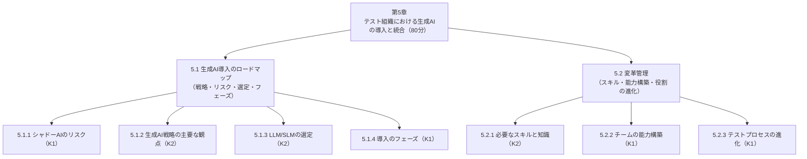

### 1.3 学習目標（Learning Objectives）一覧

各項目の **K レベル**（K1＝思い出す／K2＝理解して説明する）が試験の出題スタイルを決めます。

| LO番号 | 学習目標（要約） | Kレベル | 出題スタイルの目安 |
|:---:|---|:---:|---|
| GenAI-5.1.1 | シャドーAIのリスクを**思い出せる** | **K1** | 用語・リスクの種類を選ぶ |
| GenAI-5.1.2 | テスト向け生成AI戦略を定める際の**主要な観点を説明できる** | **K2** | 観点の意味・理由を選ぶ |
| GenAI-5.1.3 | テストタスク向けLLM/SLMの**選定基準を要約できる**（状況に応じて） | **K2** | 状況に合う基準を選ぶ |
| GenAI-5.1.4 | 導入の**主要フェーズを思い出せる** | **K1** | フェーズ名・特徴を選ぶ |
| GenAI-5.2.1 | 生成AIを使ったテストに必要な**スキルと知識を説明できる** | **K2** | スキルの理由・具体例を選ぶ |
| GenAI-5.2.2 | テストチームでAIスキルを育てる**戦略を思い出せる** | **K1** | プロンプトパターン等を選ぶ |
| GenAI-5.2.3 | 導入に伴い**テストプロセスと責任がどう変わるか認識できる** | **K1** | テスター/マネージャーの役割変化 |

> 出典：Exactpro「Chapter 5 Reading Materials（CT-GenAI v1.1）」および ISTQB公式シラバス。K レベルは各見出しに付記されたものに基づきます。

### 1.4 試験での位置づけ（参考情報）

| 項目 | 内容 | 根拠の種類 |
|---|---|---|
| 試験全体 | 40問／合計46点／合格30点（65%）／60分（非母語話者は+25%） | 🟦 ISTQB公式ページ |
| 第5章の想定配点 | 7問・7点（全体の約15%）、K1が4問・K2が3問・K3なし | 参考：第三者の学習サイト（Mock Exam Network）による整理。**公式数値ではありません** |
| 前提資格 | CTFL（Foundation Level）取得が必須 | 🟦 ISTQB公式ページ |

**この章が「得点源」と言われる理由**：K3（応用）問題が無く、すべて K1/K2（暗記＋理解）です。**用語と分類を正確に覚えれば取りこぼしが少ない**章です。

### 1.5 前の章とのつながり

第5章は、第2〜4章の知識を「組織導入」の文脈で再利用します。**どの章のどの知識が使われるか**を先に押さえておくと、暗記が楽になります。

| 第5章の項目 | 参照される章 | 何が使われるか |
|---|---|---|
| 5.1.1 シャドーAI | 第3章（3.2 プライバシー・セキュリティ、3.4 規制） | 情報漏えい、GDPR等の規制リスク |
| 5.1.2 戦略の観点 | 第2章（2.3.1 評価指標） | 精度・再現率・実行成功率・時間効率などの指標 |
| 5.1.3 LLM/SLM選定 | 第1章（1.1.2 LLM/SLM）、第3章（3.1.3 モデル選択） | モデルの種類、モデル比較による誤り検出 |
| 5.1.3 ファインチューニング可能性 | 第4章（4.2.1 ファインチューニング） | 追加学習で精度を上げられるか |
| 5.1.4 フェーズ2（インフラ評価） | 第4章（4.1 LLM搭載テストインフラ） | RAG、エージェント、LLMOps |
| 5.2.1 スキル | 第2章（プロンプト）、第1章（コンテキストウィンドウ） | プロンプト設計、入力量と出力品質 |
| 5.2.2 能力構築 | 第2章（2.3.2 プロンプトライブラリの共有） | プロンプトの評価・共有 |

---

## 2. 5.1 生成AI導入ロードマップ（概要）

### 2.1 まず結論（1分で分かる要約）🟦

テスト戦略に生成AIを組み込むときは、次の**4つの関心事がつながっている**ことを意識します。

1. **テスト目標**：何を達成したいのか（例：テスト工数削減、品質向上）
2. **モデル選定**：どのLLM/SLMを使うか
3. **入力データの品質と取り扱い**：プロンプトに入れるデータは正確か、安全か
4. **AI関連の標準・規制への準拠**：守るべきルールは何か

この戦略から、**現実的なロードマップ**（段階的な導入計画）を作り、進捗を監視します。ロードマップには次を含めます。

- **段階的な導入ステップ**（いきなり全面導入しない）
- **コンプライアンスと品質のマイルストーン確認**
- **フィードバックの仕組み**（現場の結果やリスクの変化に合わせて戦略を調整する）

### 2.2 戦略とロードマップの関係（図解）

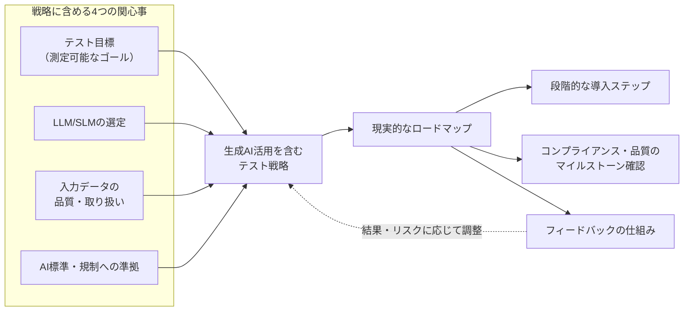

### 2.3 なぜ「ロードマップ」が必要なのか（初学者向けの説明）

生成AIの導入を「新しいツールを入れる」程度に考えると、次のような失敗が起こりがちです。

| よくある失敗 | 何が起きるか | ロードマップがあると |
|---|---|---|
| 目的があいまいなまま導入 | 「使ってみたが効果が測れない」 | 測定可能な目標が最初に決まる |
| 個人がバラバラにAIを使う | 情報漏えい、品質のばらつき（→ 5.1.1 シャドーAI） | 承認済みツールと利用ルールが揃う |
| 一気に全面展開 | 現場が混乱、反発、リスク顕在化 | 小さく試して段階的に広げられる |
| 導入して終わり | 効果が続かず、使われなくなる | 継続的に計測・改善する仕組みがある |

> 💡 **覚え方**：ロードマップ ＝ **「目的 → 準備 → 小さく試す → 測る → 広げる」** をあらかじめ設計すること。

---

## 3. 5.1.1 シャドーAIのリスク（K1）

### 3.1 用語の定義 🟦

**シャドーAI（Shadow AI）** とは、**従業員が、組織の承認を得ていない個人用または未承認のAIツールを、非公式に業務で使うこと**です。

> たとえとして：「会社が許可していない私物のUSBメモリで社内データを持ち出す」のAI版と考えると理解しやすいでしょう。悪意がなくても、「早く仕事を終わらせたい」という善意から起こります。

### 3.2 シラバスが挙げる3つのリスク 🟦

| # | リスク | 内容（要約） | テスト業務での具体例 🟨 |
|:---:|---|---|---|
| ① | **情報セキュリティ・データプライバシーの弱点** | 個人向けAIツールは企業水準のセキュリティを備えていないことが多く、機密情報が漏れる可能性がある | 本番相当の顧客データを含むテストログを、個人アカウントのチャットボットに貼り付けて解析させる |
| ② | **コンプライアンス・規制上の問題** | 未承認ツールを使うと、法令・規制・監査要件に違反し、法的・監査上の問題を招く恐れがある | 個人情報を含むテストデータを、承認されていない外部サービスに送信してしまい、GDPR等に抵触 |
| ③ | **知的財産（IP）の不明確さ** | ライセンスが不明確なツールや、許可なく著作物を処理することで、紛争・請求のリスクがある | 顧客から預かった仕様書や、他社製ソースコードを、利用規約を確認していないAIに入力する |

> 📝 **暗記用フレーズ**：**「漏れる・違反する・権利があいまい」**（セキュリティ／コンプライアンス／IP）

### 3.3 シャドーAIが生まれる構図（図解）

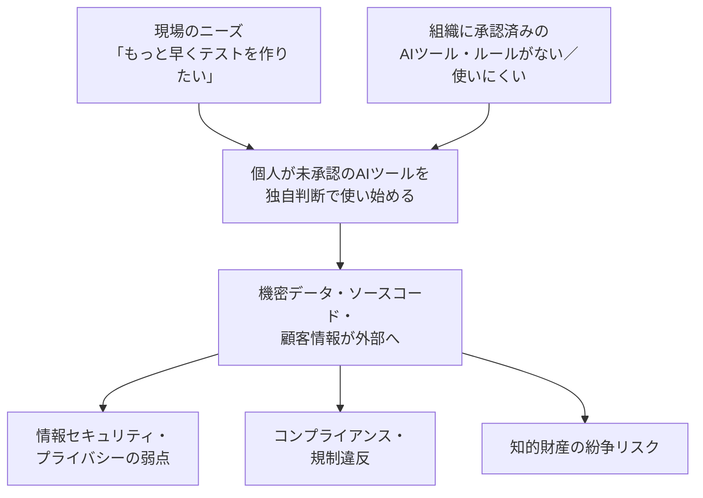

### 3.4 対策：シラバスの結論 🟦

シラバスは、シャドーAIのリスクを避ける方法として、次の組み合わせを示しています。

| 対策の要素 | 意味 |
|---|---|
| **明確な生成AI戦略** | 何のために、どのAIを、どこまで使うかを決める |
| **統制された導入ステップ** | 段階的に、管理された形で展開する |
| **ガバナンス** | 利用ルール、責任者、監視・監査の仕組み |
| **承認済みツール** | 組織が安全性・契約・ライセンスを確認したツールを用意する |

> 🔑 **ポイント**：単に「禁止」するのではなく、**安全に使える承認済みの選択肢を用意すること**が対策の中心です。

### 3.5 ベストプラクティス（シャドーAI対策）

#### 🟦 シラバス準拠のベストプラクティス

- 生成AI戦略の中で、**利用してよいツール・データ・用途**をあらかじめ定める
- **データの機密度に応じた環境**を選ぶ（第3章の3.2.3）：商用LLMプロバイダーのセキュアな提供プラン、セキュアなクラウド上での運用、自組織のインフラ内へのLLM導入、などから機密性に合わせて選ぶ
- 個人情報などの**機密データはそもそも入力しない（データ最小化）**、**匿名化・仮名化**する
- **教育とポリシー**：責任ある使い方を徹底する（第3章の3.2.3、5.2.1）

#### 🟩 実務ベストプラクティス（試験範囲外）

| 実務施策 | ねらい | 根拠 |
|---|---|---|
| 承認済みAIツールの**一覧（インベントリ）**を作り公開する | 「何を使ってよいか」を明確にし、未承認利用を減らす | NIST AI RMF（Govern機能）、ISO/IEC 42001（AIマネジメントシステム） |
| **データ分類ルール**（公開／社内／機密／個人情報）と、AIに入力してよい区分の対応表を作る | 判断のばらつきを防ぐ | NIST AI 600-1（生成AIのデータプライバシー・情報セキュリティリスク） |
| **利用ログ・監査**を取れる法人向け環境を用意する | 個人アカウント利用では追跡できないため | OWASP Top 10 for LLM Applications 2025：LLM02 Sensitive Information Disclosure |
| **申請から承認までを短く**する（使いたいツールの審査フローを軽くする） | 承認が遅いと、現場が非公式ツールに流れるため | 実務で広く指摘されている点（各社セキュリティ解説） |
| 「入れてはいけない情報」を**具体例付きで**周知する | 善意の誤用を防ぐ | 同上 |

#### 🟨 判断フロー例：「このデータをこのAIに入れて良いか？」

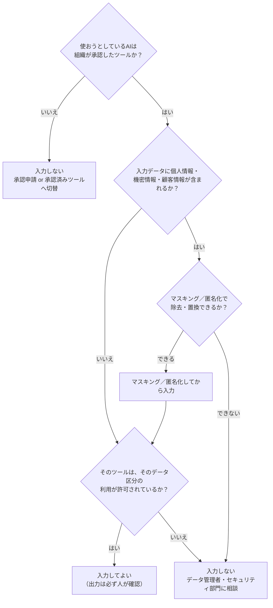

### 3.6 試験対策メモ（5.1.1）

- 出題は **K1（思い出す）**。「シャドーAIの定義」と「3つのリスク」を選ばせる形が中心です。
- **ひっかけ注意**：「シャドーAIとは、承認済みの高性能AIツールを社内で運用すること」→ ❌。**未承認・個人用ツールの非公式利用**です。
- シャドーAIは**悪意の問題ではなく、統制の問題**として整理されています。

---

## 4. 5.1.2 生成AI戦略の主要な観点（K2）

### 4.1 学ぶこと 🟦

生成AIをテストに導入するとき、**戦略に含めるべき観点**を説明できるようにします。シラバス（v1.1の解説教材）が示す観点を、次の6つに整理します。

| # | 観点 | 一言でいうと | 中身（要約） |
|:---:|---|---|---|
| ① | **明確で測定可能な目標** | 「何のために使うか」を数字で決める | テスト生産性の向上、テストサイクル短縮、テスト品質の向上など |
| ② | **LLM/SLMの選定** | 目標に合うモデルを選ぶ | 目標に照らし、既存テストインフラとの統合しやすさ、拡張性（スケーラビリティ）で選ぶ |
| ③ | **データ品質とセキュリティ** | 入力が悪ければ出力も悪い | 正確で関連性の高い入力データを、堅牢なセキュリティ手順で保護する。データ品質は信頼できる出力の**前提条件** |
| ④ | **教育・トレーニング** | 技術と倫理の両方を教える | 技術スキルと、責任ある利用のための倫理意識の両方が必要 |
| ⑤ | **効果を測る指標** | 効果を客観的に確認する | 第2章 2.3.1 の評価指標（精度、再現率など）を活用する |
| ⑥ | **プロセスガイドライン** | 使い方のルール | 機密データの取り扱い、**透明性**（どの成果物がGenAI由来かを明記）、**品質ゲート**（生成物を受け入れる前にレビューを必須にする） |

> 教材は、これらをまとめて「**パイロット段階のGenAI機能を、繰り返し利用できる、統制された（ガバナンスされた）テストプロセスの一部へ変えるための運用の背骨**」と表現しています。

### 4.2 観点どうしの関係（図解）

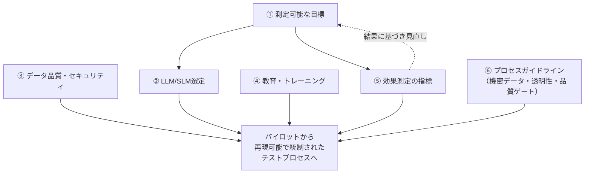

### 4.3 各観点を初学者向けにステップバイステップで理解する

#### ステップ1：測定可能な目標を決める（観点①）

「AIを使う」は目標ではなく手段です。**数字で確認できる目標**にします。

| ダメな目標 🟨 | 良い目標の例 🟨 | 対応する目標カテゴリ 🟦 |
|---|---|---|
| AIでテストを効率化する | 「テストケース作成にかかる時間を、四半期内に現状比30%短縮する（レビュー後の品質は維持）」 | テスト生産性 |
| AIで速くする | 「リグレッションテスト結果の分析リードタイムを、翌営業日から当日中へ短縮する」 | テストサイクル短縮 |
| AIで品質を上げる | 「要件レビューで見つかる曖昧さの指摘件数を増やし、後工程の要件起因欠陥を減らす」 | テスト品質向上 |

> 上の数値は理解のための**架空の例**です。実際の数値は、自組織の現状（ベースライン）を計測してから決めます。

#### ステップ2：モデルを目標に合わせて選ぶ（観点②）

モデル選定は「有名だから」ではなく、**目標・既存インフラとの統合・拡張性**から決めます。詳細は次節 5.1.3 で扱います。

#### ステップ3：データ品質とセキュリティを確保する（観点③）

生成AIは、**渡された情報（プロンプトの入力データ）を材料に出力を作る**ため、入力データが不正確・古い・あいまいだと、出力も悪くなります（第2章・第3章で学んだ「完全な文脈を渡す」「明確な形式のデータを使う」の再確認）。

| データ品質の観点 🟩 | チェックの例 |
|---|---|
| 正確性 | 要件・仕様書が最新版か？矛盾していないか？ |
| 関連性 | このタスクに不要な情報を大量に混ぜていないか？（コンテキストウィンドウの節約にもなる） |
| 形式 | 表・箇条書き・JSONなど、あいまいさの少ない形式か？ |
| 安全性 | 個人情報・機密情報を含んでいないか？含むならマスキング済みか？ |

#### ステップ4：教育・トレーニングを計画する（観点④）

**技術スキル（プロンプト、評価方法）と、倫理意識（プライバシー、透明性、責任ある利用）の両方**を教えます。詳細は 5.2.1 と 5.2.2 で扱います。

#### ステップ5：効果測定の指標を先に決める（観点⑤）

第2章の 2.3.1 で学んだ指標を、導入効果の測定に流用します。

| 指標 🟦（第2章 2.3.1） | 意味 | 導入評価での使い方の例 🟨 |
|---|---|---|
| 正確性（Accuracy） | 生成物が要件や専門家の作成物に照らして正しいか | 生成テストケースが要件を正しく網羅しているか |
| 適合率（Precision） | 目的に対して出力がどれだけ正しいか | 生成したテストケースが異常を正しく捉えている割合 |
| 再現率（Recall） | 関連するものをどれだけ漏れなく見つけられるか | 有効/無効の同値クラスをどれだけカバーしたか |
| 関連性・文脈適合 | その状況にふさわしいか | テストベースやドメイン要件との整合 |
| 多様性（Diversity） | 重複を避け幅広く網羅しているか | 異なるユーザー行動やエッジケースを探索しているか |
| 実行成功率 | 生成したテストが実行できる割合 | 構文エラーなく実行できたスクリプトの割合 |
| 時間効率 | 手作業と比べてどれだけ時間を節約できたか | AIによる作成時間 vs 人手での作成時間 |

> 🔑 LLMは**非決定的**（同じ入力でも出力が変わる）ため、指標は**統計的に意味のあるデータ量**で評価する必要があります（第2章 2.3.1）。1回の成功・失敗で判断してはいけません。

#### ステップ6：プロセスガイドラインを定める（観点⑥）

ガイドラインには、少なくとも次の3つを入れます。

| ガイドライン | 内容 | 例 🟨 |
|---|---|---|
| **機密データの取り扱い** | 何を入力してよいか／いけないか | 「顧客の実名・メールアドレスを含むデータは、匿名化してから入力する」 |
| **透明性** | 生成AIで作られた成果物であることを明記する | テストケースのメタデータに「AI生成（レビュー済み）」欄を設ける |
| **品質ゲート** | 生成物を受け入れる前に、レビューを必須にする | 「AI生成テストケースは、テスト担当者のレビュー承認後にのみテスト管理ツールへ登録する」 |

#### 品質ゲートの流れ（図解）🟨

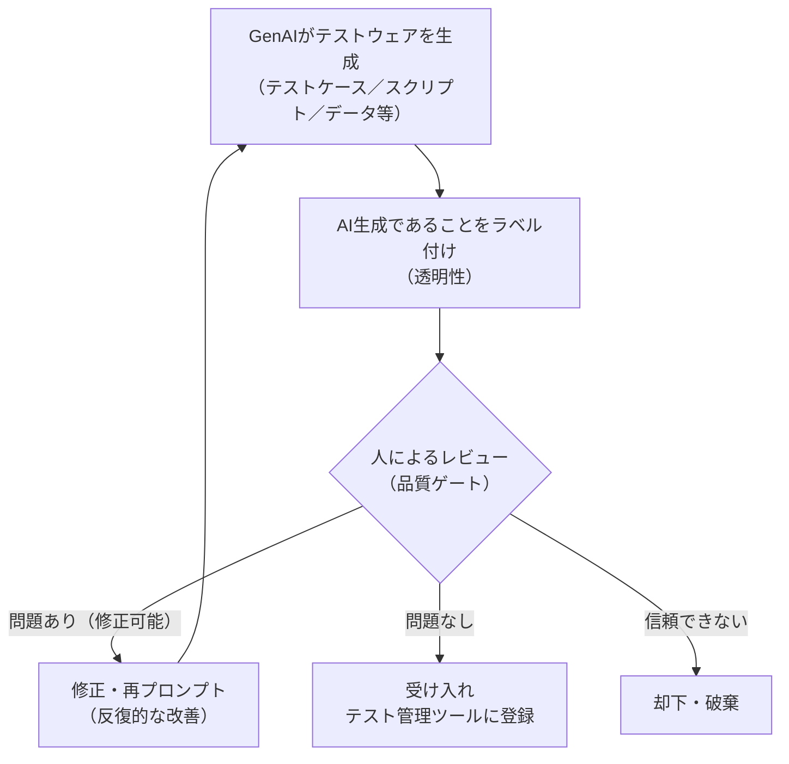

### 4.4 ベストプラクティス（5.1.2）

#### 🟦 シラバス準拠

- 目標 → モデル選定 → データ → 教育 → 指標 → ガイドライン、という**一連の観点をセットで**設計する（どれか1つだけでは不十分）
- **パイロット**で小さく試し、モデルを比較し、データ品質とコンプライアンスを確認し、手作業のテストケース作成がどれだけ減るかを測る
- 生成物は**必ず品質ゲート（レビュー）を通す**（人間の説明責任は残る）

#### 🟩 実務ベストプラクティス

| 施策 | ねらい | 根拠 |
|---|---|---|
| **導入前のベースライン計測**（現状の工数・欠陥・リードタイム） | 効果を客観的に比較するため | ISTQB CTFLの測定・モニタリングの考え方に準じる |
| リスクの大きさに応じた**レビューの深さ**の調整（重要なテストほど厳しく） | 過剰なレビューで生産性を潰さないため | 第3章 3.1.2「リスクレベルに応じた検出方法の実施」 |
| **NIST AI RMFの4機能（Govern／Map／Measure／Manage）**に沿って、責任・文脈・測定・対処を整理する | 生成AI固有のリスクを抜け漏れなく管理するため | NIST AI RMF 1.0、NIST AI 600-1（生成AIプロファイル） |
| 経営層・セキュリティ・法務を早期に巻き込む | 後戻りコストを減らすため | 第3章 3.2.3（CTO、CISO、法務の関与を強く推奨） |

### 4.5 試験対策メモ（5.1.2）

- 出題は **K2（理解して説明する）**。「戦略に含める観点として**適切なもの／不適切なもの**」を選ばせる形が想定されます。
- **キーワード**：測定可能な目標／データ品質は前提条件／技術＋倫理の教育／指標／透明性／品質ゲート。
- **ひっかけ注意**：「AIの出力は正確なので、品質ゲートは不要」→ ❌。生成物は**受け入れ前にレビュー**が必要です。

---

## 5. 5.1.3 テストタスク向けLLM/SLMの選定（K2）

### 5.1 背景 🟦

LLM/SLMには、次のような**違い**があります。

| 違いの軸 | 例 |
|---|---|
| **機能面** | マルチモーダル入力（画像等）に対応するか、推論（reasoning）能力があるか |
| **技術面** | コンテキストウィンドウの大きさ |
| **ライセンス** | 商用か、オープンソースか |

また、LLM/SLMの評価用ベンチマークは多数ありますが（自然言語処理、コード生成、画像分析など）、**ソフトウェアテストのタスクに特化したものは少ない**とされています（例：TestEval ＝ テストケース生成向けLLMの評価ベンチマーク）。

> したがって、**世間の一般的な評価だけに頼らず、自組織のテストタスクで評価する**ことが重要です。

### 5.2 シラバスの4つの選定基準 🟦

| # | 基準 | 何を見るか | 評価のヒント 🟩 |
|:---:|---|---|---|
| ① | **モデル性能（Model performance）** | 対象のテストタスクで、**自組織のベンチマーク**に対し、2.3.1のような指標で性能を評価する | 実際の要件・テストケースで小さな評価セットを作り、複数回実行して統計的に判断 |
| ② | **ファインチューニングの可能性（Fine-tuning potential）** | ドメイン固有データで追加学習でき、それが有用か | 自組織のテストケース形式・用語に合わせられるか（第4章 4.2.1）。SLMは計算負荷が比較的小さい |
| ③ | **継続的コスト（Recurring cost）** | ライセンス料や運用費など、繰り返し発生する費用が予算に収まるか | 想定するトークン量・実行回数から**月額を試算** |
| ④ | **コミュニティとサポート** | 活発なコミュニティ、詳しいドキュメントがあるか | 導入・トラブル対応のしやすさに直結 |

> 📝 **暗記用フレーズ**：**「性能・チューニング・コスト・サポート」**（せいのう・ちゅーにんぐ・こすと・さぽーと）

### 5.3 選定の流れ（図解）🟨

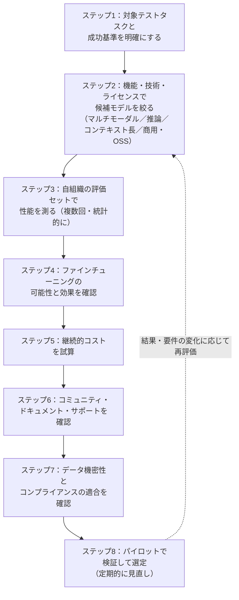

### 5.4 選定スコアカード（テンプレート例）🟨

複数候補を比較するときは、**評価軸と重みを事前に決めて**から点数を付けると、好みや印象に左右されにくくなります。

| 評価軸（シラバスの4基準ベース） | 重み（例） | 候補A | 候補B | 候補C（SLM） | 確認方法の例 |
|---|:---:|:---:|:---:|:---:|---|
| モデル性能（対象テストタスク） | 40% | ＿点 | ＿点 | ＿点 | 評価セットでの精度・実行成功率 |
| ファインチューニング可能性 | 20% | ＿点 | ＿点 | ＿点 | 提供機能・必要データ量の確認 |
| 継続的コスト | 25% | ＿点 | ＿点 | ＿点 | 月間想定トークン量×単価＋運用費 |
| コミュニティ・サポート | 15% | ＿点 | ＿点 | ＿点 | ドキュメント・事例・更新頻度 |
| （追加）データ保護・配置形態 | 必須条件 | ○/× | ○/× | ○/× | 機密データを扱える環境か |

> 🔑 データ保護・コンプライアンスは「点数で足し合わせる」のではなく、**満たさなければ候補から外す必須条件**として扱うのが安全です。

### 5.5 ベストプラクティス（5.1.3）

#### 🟦 シラバス準拠

- **タスクの複雑さに合ったモデル**を選ぶ：高い推論が必要なタスクには推論モデル、単純なタスクには軽量なモデル（第1章 1.1.3、第3章 3.1.3）
- **複数のモデルで結果を比較する**と、誤りを検出しやすく、より信頼できる結果を選べる（第3章 3.1.3）
- **SLM**は、ファインチューニングにより特定タスクで高い性能を、LLMほどの計算負荷なしで得られる可能性がある（第4章 4.2.1）
- 「右サイズ（right-sized）」のモデルを選ぶことは、コストとエネルギーの観点でも重要（5.2.1）

#### 🟩 実務ベストプラクティス

| 施策 | ねらい | 根拠 |
|---|---|---|
| **自組織専用の評価セット（ゴールデンセット）**を作る：実際の要件・既存のテストケース・過去の欠陥を使う | 一般ベンチマークでは分からない、自組織のタスクでの実力を測る | シラバスの「テスト特化ベンチマークは少ない」という記述、TestEval論文 |
| **同じ入力で複数回実行**して、ばらつきも評価する | LLMの非決定的な性質に対応する | 第2章 2.3.1／第3章 3.1.4 |
| **モデルの入れ替えを前提**にした設計（特定モデルへのロックインを避ける） | モデルの進化が速く、契約・価格も変わるため | LLMOps（第4章 4.2.2）の考え方 |
| **データの機密性**に応じて、商用のセキュアな提供／セキュアなクラウド／自社インフラを使い分ける | 情報漏えいとコンプライアンスのリスクを下げる | 第3章 3.2.3 |

### 5.6 試験対策メモ（5.1.3）

- 出題は **K2**。**「ある状況で、どの基準を重視すべきか」**を選ぶ形が想定されます。
  - 予算が厳しい → **継続的コスト**
  - 自社独自の用語・形式に合わせたい → **ファインチューニングの可能性**
  - 導入時のトラブル対応が心配 → **コミュニティとサポート**
  - 業務要件を満たすか不安 → **モデル性能（自組織のベンチマークで）**
- **ひっかけ注意**：「一般的なNLPベンチマークの順位が高いモデルを選べばよい」→ ❌。**テスト特化ベンチマークは少ない**ため、自組織のタスクで評価します。

---

## 6. 5.1.4 生成AI導入のフェーズ（K1）

### 6.1 基本の考え方 🟦

生成AIの導入は、**一度きりの決定や実装ではなく、段階的な移行**です。通常、**重なり合う3つのフェーズ**で進みます。

| フェーズ | 英語名 | 一言でいうと |
|:---:|---|---|
| **フェーズ1** | **Discovery**（発見） | 触ってみて、慣れて、学ぶ |
| **フェーズ2** | **Initiation and usage definition**（開始と利用方法の定義） | 使い道を見極め、戦略として固める |
| **フェーズ3** | **Utilization and iteration**（活用と反復） | 日常業務に組み込み、測って、改善して、広げる |

### 6.2 3フェーズの流れ（図解）

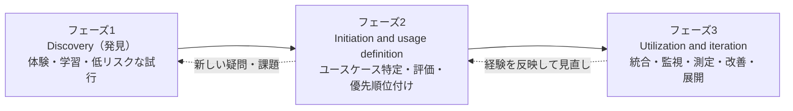

> 🔑 実際には、**フェーズは厳密に順番どおりには進みません**。ユースケースごとに成熟速度が違うため、行き来したり、並行したりします。

### 6.3 各フェーズを詳しく理解する 🟦

#### フェーズ1：Discovery（発見）

| 項目 | 内容 |
|---|---|
| **目的** | 基本的な**認識と自信**をつくる |
| **主な活動** | テスターにGenAIの概念を紹介／LLMやSLMへのアクセスを提供／**単純で低リスク**なユースケースで試してもらう |
| **ゴール** | 完全自動化ではなく、**「やってみて学ぶ」**こと。強みと限界を理解し、**不確実性を減らす** |
| **典型的な落とし穴 🟩** | 好き勝手に使い始めてシャドーAI化する（→ 5.1.1）。**承認済みの安全な試験環境**を用意する |

#### フェーズ2：Initiation and usage definition（開始と利用方法の定義）

| 項目 | 内容 |
|---|---|
| **目的** | 実験から**戦略**へ焦点を移す |
| **主な活動** | 実用的なGenAIユースケースを**特定・評価・優先順位付け**／適切な**LLM搭載テストインフラ**（第4章：RAG、エージェント等）を評価／社内の専門性を強化／組織のテスト・品質目標との整合を確認（CTFLシラバスの指針に沿う） |
| **ゴール** | 「どこに、どう使うか」を決め、5.1.2の戦略に落とし込む |
| **典型的な落とし穴 🟩** | 効果測定の指標を決めないまま次へ進む |

#### フェーズ3：Utilization and iteration（活用と反復）

| 項目 | 内容 |
|---|---|
| **目的** | GenAIを「目新しいもの」から**テストプロセスの統合された一部**にする |
| **主な活動** | 利用状況を**継続的に監視・測定・改善**／GenAIが**持続的な利益**をもたらしているか追跡／経験に基づき**アプローチを調整**／成功したやり方を**チームやプロジェクト全体に展開（スケール）** |
| **ゴール** | 効果が続き、広がる状態 |
| **典型的な落とし穴 🟩** | 導入して終わりにして、モデルや運用の変化に追随しない（→ 第4章 LLMOps） |

### 6.4 「重なり合う」とはどういうことか（具体例）🟦＋🟨

教材が挙げる例：**テストレポート分析はすでにフェーズ3（活用）にあるが、自動テスト生成はまだフェーズ1（発見）にある**、ということが現実に起こります。

| ユースケース（例） | 現在のフェーズ（例） | この時に取るべき行動の例 🟨 |
|---|:---:|---|
| テストレポート分析 | フェーズ3：活用と反復 | 指標を定期確認し、効果が続いているか測る。他チームへ展開 |
| テストケース生成（機能テスト） | フェーズ2：利用方法の定義 | 優先順位、プロンプトパターン、レビュー基準を整備 |
| 自動テストスクリプト生成 | フェーズ1：発見 | 低リスクな範囲で試し、限界を学ぶ |

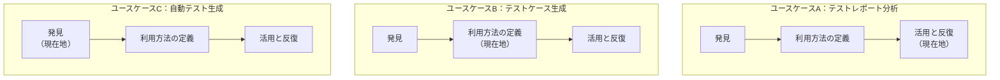

### 6.5 人的要因を「早期に」扱う 🟦

教材は、**雇用への不安（仕事を奪われるのでは、という懸念）など人的要因は、早い段階で扱うことが不可欠**であり、不確実性や恐れは**導入を遅らせ、チームの関与を下げる**と述べています。

| 人的要因 | 起こり得ること | 対応の例 🟩 |
|---|---|---|
| 雇用不安 | 使うことへの抵抗、協力の低下 | AIは「置き換え」ではなく「支援」であり、人の判断が重要になることを丁寧に説明（→ 5.2.3） |
| スキル不安 | 「使いこなせない」と感じて避ける | 段階的な研修、ハンズオン、相談できる場（→ 5.2.2） |
| 過信 | AI出力を確認せず受け入れる | 品質ゲートとレビュー文化（→ 5.1.2） |

### 6.6 ベストプラクティス（5.1.4）

#### 🟦 シラバス準拠

- **一気に全面導入せず**、フェーズを踏んで進める（ただし厳密な直線ではないと理解する）
- フェーズ1では**低リスクのユースケース**から
- フェーズ2では**ユースケースの評価と優先順位付け**、LLM搭載テストインフラの評価、社内専門性の強化
- フェーズ3では**継続的な監視・測定・改善**と、成功事例の**スケール**
- **人的要因（雇用不安等）を早期に扱う**

#### 🟩 実務ベストプラクティス

| フェーズ | 施策 | ねらい | 根拠 |
|---|---|---|---|
| 1 | サンドボックス環境（承認済み・ダミーデータ）を用意する | 安全に学べる場を作りシャドーAIを防ぐ | NIST AI 600-1（データプライバシー・情報セキュリティリスク） |
| 2 | ユースケースを「効果の大きさ」×「リスクの小ささ」で評価・優先順位付け | 成功体験を早く作る | シラバス（ユースケースの評価・優先順位付け）に基づく実務的な整理 |
| 2 | 成功基準（KPI）と、撤退基準をあらかじめ決める | 継続・中止の判断を客観化 | 5.1.2「測定可能な目標」 |
| 3 | 定期的な**振り返り**とモデル・プロンプトの見直し | 品質の劣化やモデル更新に追随 | LLMOps（第4章 4.2.2）、ISO/IEC 42001の継続的改善の考え方 |
| 3 | 成功したプロンプトと手順を**共有資産**として標準化 | 展開しやすくする | 5.2.2 プロンプトライブラリ |

### 6.7 試験対策メモ（5.1.4）

- 出題は **K1**。**フェーズ名・順序・各フェーズの特徴の対応**が中心です。
- **覚え方**：**「試す → 決める → 回す」**（Discovery → Initiation and usage definition → Utilization and iteration）
- **ひっかけ注意**：
  - 「各フェーズは厳密に順番に完了させる」→ ❌（**重なり合い、ユースケースごとに速度が違う**）
  - 「フェーズ1の目的は、完全なテスト自動化の達成」→ ❌（目的は**学習と不確実性の低減**）
  - 「導入は一度きりの実装」→ ❌（**段階的な移行**）

---

## 7. 5.2 変革管理（チェンジマネジメント）（概要）

### 7.1 なぜ変革管理が必要なのか 🟦

生成AIの導入は、**単なる技術アップグレードではなく、人の働き方・役割・品質管理の仕方に影響する変革**です。成功には、**構造化された変革管理**が不可欠です。

含まれるもの：

- **新しいスキル**の育成
- **従来のテスト職務の再定義**
- 移行の**技術面と組織面の両方**への対応

> 変革管理がないと、どんなに強力なAIツールでも、**使われない・誤用される・積極的に抵抗される**リスクがあります。

### 7.2 5.2の全体像（図解）

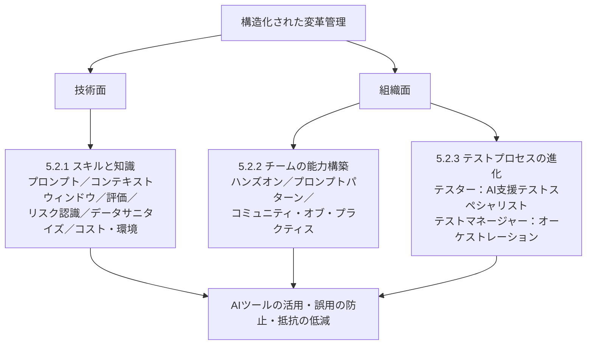

---

## 8. 5.2.1 生成AIを使ったテストに必要なスキルと知識（K2）

### 8.1 考え方 🟦

生成AIを使いこなすには、**従来のテスト専門性に加えて、新しいスキルの組み合わせ**が必要です。基本は「**ドメイン知識・テスト経験 ＋ AI固有のスキル**」です。

### 8.2 必要なスキル一覧 🟦

| # | スキル領域 | 中身（要約） | 関連する章 |
|:---:|---|---|---|
| ① | **プロンプトエンジニアリング** | 明確で、正確で、目的志向のプロンプトを作る力。これがスキルの**中核** | 第2章 |
| ② | **コンテキストウィンドウの理解** | 入力の量と構造が、出力の品質に影響することを理解する | 第1章 1.1.2 |
| ③ | **AI生成テストウェアのレビュー・評価** | テストケース、欠陥レポート、合成テストデータなどを**評価できる**。「AI結果を評価する力は、かつて手動でテストを設計する力と同じくらい重要になる」 | 第2章 2.3、第3章 3.1 |
| ④ | **LLMの能力と限界の見極め・反復的改善** | 何ができ、どこまでか。反復的なプロンプトで出力を磨く | 第2章 2.3.2 |
| ⑤ | **GenAIのリスクと軽減策の認識** | テスト成果物をLLMへ送ることのデータセキュリティ上の意味を理解する | 第3章 |
| ⑥ | **データサニタイズ（無害化）** | 機微・個人・機密情報を**マスキングまたは除去**する。**プライバシー保護型のプロンプトエンジニアリング**が日常業務の一部になる | 第3章 3.2.3 |
| ⑦ | **環境・コストへの配慮** | 「右サイズ」のモデルを選ぶ／不要な計算を避ける使い方に最適化する／生産性向上とコスト・エネルギー消費のバランスをとる | 第3章 3.3 |

> 教材は、これを「**責任あるテストとは、技術的に有能なだけでなく、経済的・環境的にも意識が高いこと**」と表現しています。

### 8.3 スキルの全体像（図解）

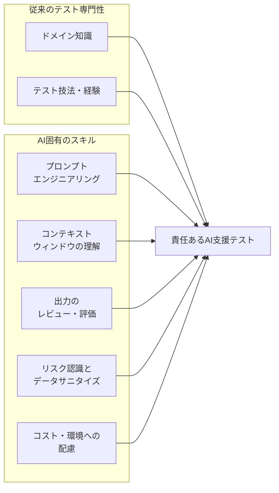

### 8.4 データサニタイズをステップバイステップで理解する

**データサニタイズ（Data sanitisation）**とは、LLMに送る前に、**個人情報・機密情報を、マスキング（伏せ字化・置換）または除去する**ことです（第3章のデータ最小化・匿名化・仮名化と連動）。

#### ステップ1：送信前に「含まれていないか」を確認する

| 種類 | 例 🟨 |
|---|---|
| 個人を特定できる情報 | 氏名、メールアドレス、電話番号、住所、会員ID |
| 認証情報・秘密情報 | パスワード、APIキー、アクセストークン、内部URL |
| 業務上の機密 | 顧客名、契約金額、未公開の仕様、ソースコードの秘匿部分 |

#### ステップ2：マスキング／除去／置換を行う

| 元のデータ（例） 🟨 | サニタイズ後（例） 🟨 | 方法 |
|---|---|---|
| `山田太郎 taro.yamada@example.com` | `【氏名A】 user_001@example.test` | 仮名化（架空値へ置換） |
| `顧客: 株式会社ABC商事、契約額 1,200万円` | `顧客: 【顧客X】、契約額: 【金額】` | マスキング（プレースホルダー） |
| `Authorization: Bearer eyJhbGciOi...` | （行ごと除去） | 除去（そもそも送らない） |

#### ステップ3：サニタイズ後の入力でプロンプトを作る（プライバシー保護型プロンプト）🟨

```text
【役割】あなたはテスト分析の経験豊富なテストアナリストです。
【状況】以下は、あるWebアプリのエラーログです。個人情報・認証情報はすでにマスキング済みです。
【指示】エラーの原因候補を3つ挙げ、それぞれの確認手順を示してください。
【制約】ログに存在しない情報を推測で補わないでください。不明な点は「不明」と書いてください。
【出力形式】表（原因候補／根拠となるログ行／確認手順）
【入力データ】
（マスキング済みログをここに貼り付け）
```

#### 送信前チェックの流れ（図解）🟨

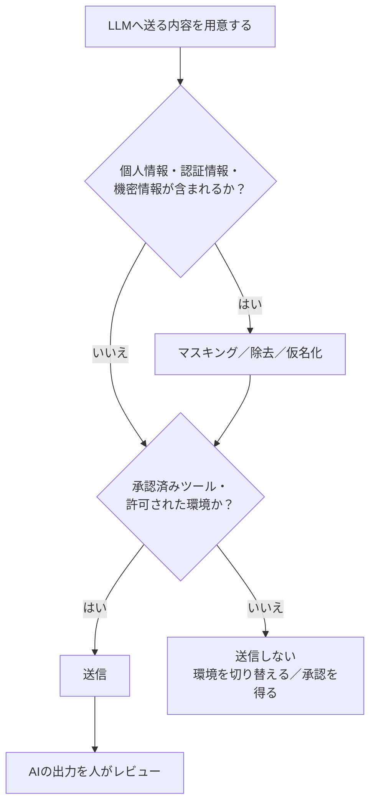

### 8.5 「右サイズ」モデルとコスト・エネルギーの考え方 🟦

- 全部のタスクに最大・最高性能のモデルを使う必要はありません。**タスクに見合ったモデル（右サイズ）**を選びます。
- 不要な計算（重複した問い合わせ、必要以上に長い入力など）を減らし、**使い方を最適化**します（第3章 3.3：不要なモデル操作を制限することが重要）。
- **生産性向上とコスト・エネルギー消費のバランス**を考えます。

| タスクの性質（例） 🟨 | 適したモデルの方向性（例） | 理由 |
|---|---|---|
| ログの要約、定型的な分類 | 軽量なモデル（SLM等）で足りる場合がある | 計算負荷・コストを抑えられる |
| リスクに基づく優先順位付けなど複雑な多段階推論 | 推論能力の高いモデルを検討 | 推論エラーの抑制（第3章 3.1.1） |
| 画面キャプチャの不整合検出 | マルチモーダル対応モデル | 画像入力が必要（第1章 1.1.4） |

### 8.6 ベストプラクティス（5.2.1）

#### 🟦 シラバス準拠

- **プロンプト設計**、**入力量・構造の調整**、**出力の評価**を「日常業務のスキル」として身につける
- LLMへ送る前に**データサニタイズ**（マスキング・除去）を行う
- **右サイズ**のモデルを選び、使い方を最適化する

#### 🟩 実務ベストプラクティス

| 施策 | ねらい | 根拠 |
|---|---|---|
| **スキルマトリクス**（役割別に必要なAIスキルと現在レベル）を作る | 教育の優先順位を決める | EU AI Act 第4条（AIリテラシー）の考え方に沿う実務的な整理 |
| 役割に応じた**AIリテラシー研修**を実施し、記録する | 組織としての説明責任を果たす | EU AI Act 第4条（原文と改正の最新内容は公式条文で要確認） |
| **プロンプトインジェクション**や**機密情報の出力**などのリスクを、テスターも基本レベルで理解する | 攻撃・漏えいの早期気づき | OWASP Top 10 for LLM Applications 2025（LLM01/LLM02） |

### 8.7 試験対策メモ（5.2.1）

- 出題は **K2**。**「テスターが身につけるべきスキルとして適切なもの」**、**「なぜそれが必要か」**を選ぶ形が想定されます。
- **キーワード**：プロンプトエンジニアリング／コンテキストウィンドウ／出力評価／データサニタイズ（マスキング・除去）／右サイズのモデル／コストと環境。
- **ひっかけ注意**：「AI導入後は、ドメイン知識・テスト経験は不要になる」→ ❌。**テスト経験とAIスキルの組み合わせ**が必要です。

---

## 9. 5.2.2 テストチームの生成AI能力の構築（K1）

### 9.1 基本の考え方 🟦

チームの本当のGenAI能力は、**理論だけでは身につきません**。**ハンズオン中心**のアプローチが不可欠です。

| 必要なもの | 内容 |
|---|---|
| 実践的な体験 | 複数のLLM/SLMに実際に触れる |
| 段階的な学習パス | 順序立てて学べる道筋 |
| 継続的な機会 | 実際のテストシナリオでGenAIを適用し続ける機会 |

能力は、**実験・振り返り・共有された経験**を通じて徐々に育ちます。

### 9.2 能力の成長ステップ（図解）

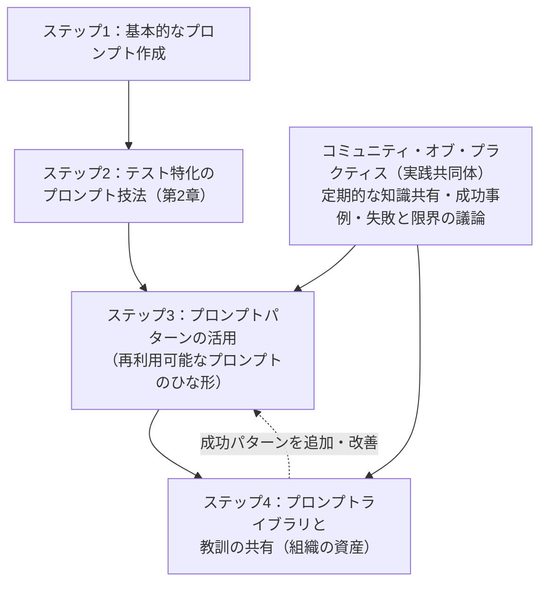

### 9.3 重要キーワードの解説 🟦

| 用語 | 意味 | ポイント |
|---|---|---|
| **プロンプトパターン（Prompt patterns）** | **再利用可能なプロンプトのテンプレート**。一貫性と信頼性のある結果を得るために設計 | 「何がうまくいき、何がうまくいかないか」という**組織の知識が詰まっている** |
| **コミュニティ・オブ・プラクティス（Communities of practice）** | 学習を継続させる社内の実践共同体 | 定期的に**成功したユースケース**を共有／**失敗と限界**を議論／アプローチを**共同で改善** |
| **共有プロンプトライブラリ** | 使えるプロンプトを集めた共有の仕組み | **戦略的な資産**になる |
| **文書化された教訓（Lessons learned）** | 得られた学びの記録 | 同上。**戦略的な資産** |

> 🔑 **狙い**：GenAI能力が一部の専門家に**閉じない**こと。**組織全体の集団的な強み**にすること。

### 9.4 プロンプトライブラリの作り方（ステップバイステップ）🟨＋🟩

#### ステップ1：1件のプロンプトを「部品」として整理する

第2章の**6つの構成要素**（役割・文脈・指示・入力データ・制約・出力形式）を使って、再利用しやすい形にします。

#### ステップ2：メタ情報を付ける（ライブラリ登録フォーマット例）

| 項目 | 記入例 🟨 |
|---|---|
| **プロンプトID／名前** | TC-GEN-001／ユーザーストーリーからのテストケース生成 |
| **目的・対象タスク** | 受け入れ基準から機能テストケースを作成する |
| **想定モデル・設定** | 使用モデル、温度パラメータ等（第3章 3.1.4） |
| **プロンプト本文（6要素）** | 役割／文脈／指示／入力データ／制約／出力形式 |
| **使用する技法** | プロンプトチェーン、フューショット、メタプロンプト（第2章） |
| **入力してよいデータ区分** | 「個人情報は禁止。マスキング済みのみ」など（5.1.1、5.2.1） |
| **評価結果** | 使用した指標（正確性、実行成功率など）と結果（2.3.1） |
| **既知の限界・注意点** | 「非機能要件を出しにくい」など |
| **バージョン・更新日・オーナー** | v1.2／2026-09-24／担当者名 |

#### ステップ3：評価・改善のサイクルに乗せる

第2章 2.3.2の**プロンプト評価・改善技法**（反復的な修正、A/Bテスト、出力分析、ユーザーフィードバック、長さ・具体性の調整）を、ライブラリのプロンプトに継続適用します。

#### ステップ4：チームで共有・レビューする

定期的な**プロンプト評価・最適化セッション**を開催し、成功例・失敗例を共有します（第2章 2.3.2）。

### 9.5 ベストプラクティス（5.2.2）

#### 🟦 シラバス準拠

- **ハンズオン**中心の学習（複数のLLM/SLMを体験）
- **基本 → テスト特化 → パターン**へと段階的に進む
- **コミュニティ・オブ・プラクティス**で定期的に共有する
- **プロンプトライブラリと教訓**を戦略的資産として蓄積する

#### 🟩 実務ベストプラクティス

| 施策 | ねらい | 根拠 |
|---|---|---|
| プロンプトを**コード成果物として扱う**（バージョン管理、レビュー） | 変更履歴の追跡、品質の維持 | AWS Prescriptive Guidance（「Treat prompts as code artifacts」） |
| 社内に**チャンピオン**（推進役）を置き、相談窓口にする | 一部の専門家依存を避けつつ、立ち上がりを早める | 変革管理の一般的な実務（教材の「コミュニティ」の趣旨と整合） |
| 学習コンテンツに**失敗例**を含める | 過信を防ぐ | 第3章 3.1（ハルシネーション、推論エラー、バイアス） |
| 社内公開するプロンプトに**入力禁止データ**を明記する | シャドーAI・情報漏えいの防止 | 5.1.1、第3章 3.2.3 |

### 9.6 試験対策メモ（5.2.2）

- 出題は **K1**。**「プロンプトパターン」の定義**、**「コミュニティ・オブ・プラクティスの役割」**、**「共有プロンプトライブラリが資産になる」**が狙われやすい点です。
- **ひっかけ注意**：
  - 「GenAI能力は座学の研修だけで十分に身につく」→ ❌（**ハンズオンが不可欠**）
  - 「GenAIに詳しい少数の専門家だけが使えればよい」→ ❌（**集団的な強みにする**）

---

## 10. 5.2.3 AI対応テスト組織におけるテストプロセスの進化（K1）

### 10.1 全体像 🟦

GenAIがテストプロセスに組み込まれると、**テスターとテストマネージャーの役割が根本的に変わります**。

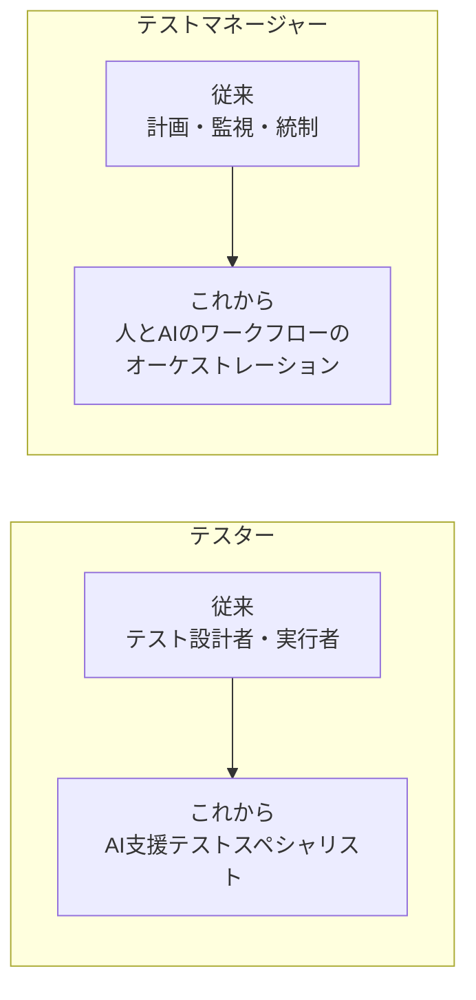

### 10.2 テスターの役割の変化 🟦

| 従来の責任 | AI支援後に加わる／重みが増す責任 |
|---|---|
| テストケースの作成・テストの実行が中心 | それだけで終わらない |
| — | **巧みに作られたプロンプトでAIを導く** |
| — | **AI生成結果を批判的にレビューする** |
| — | **反復的なプロンプトで出力を改善する** |
| — | **テスト用のプロンプトライブラリを維持する** |
| — | **どのAI結果を信頼し、どれを修正・破棄するかを判断する** |

> 🔑 **最重要ポイント**：**人間の判断は、より重要になる**（less ではなく more）。

### 10.3 テストマネージャーの役割の変化 🟦

| 責任領域 | 内容（要約） |
|---|---|
| **AIベースのテスト戦略の策定** | 5.1.2 の観点を踏まえた戦略づくり |
| **AIを意識したリスクマネジメント** | AI固有のリスク（ハルシネーション、データ、規制等）を織り込む |
| **AI支援テストプロセスの監視と統制** | 指標に基づき効果とリスクを見る |
| **人の専門性とAI能力のバランス** | 何をAIに任せ、何を人が判断するか |
| **ガバナンスの枠組みの定義** | 利用ルール、責任、承認済みツール等 |
| **品質への人の説明責任の維持** | 「自動化に盲目的に委ねない」 |
| **AI対応ワークフローの調整** | 人間のテスターだけでなく、AI支援のワークフローも統括 |
| **ポリシー・規制へのコンプライアンス確保** | 規制や社内ポリシーの順守（第3章 3.4） |
| **戦略的・倫理的・運用上のリスクからの保護** | 組織を守る |

> 教材は、マネージャーの役割を「**オーケストレーション（人・プロセス・知的システムを、一貫した統制されたテスト戦略へ整合させること）**」と表現しています。

### 10.4 役割の変化と責任分担のイメージ（責任分担表の例）🟨

以下は、理解を助けるための**架空の責任分担表**です（実際の体制は組織に合わせて設計します）。

| 活動 | テスター | テストマネージャー | 承認者・関係部門（例） |
|---|:---:|:---:|:---:|
| プロンプトの作成・改善 | 実行 | 助言 | — |
| AI生成物のレビュー（品質ゲート） | 実行・判断 | 基準の設定 | — |
| プロンプトライブラリの維持 | 実行 | 方針・監督 | — |
| 利用ポリシー・ガバナンス枠組みの策定 | 意見 | 実行 | セキュリティ・法務が承認 |
| 効果測定・監視・改善判断 | データ提供 | 実行・判断 | 経営層へ報告 |
| 規制・ポリシー順守の確認 | 遵守 | 責任 | 法務・コンプライアンス |

### 10.5 ベストプラクティス（5.2.3）

#### 🟦 シラバス準拠

- **人の判断を中心に置く**：AI出力は、テスターが批判的にレビューし、信頼・修正・破棄を判断する
- テストマネージャーは、**AI戦略・AIリスク管理・監視統制・ガバナンス**を担う
- **品質は人の説明責任のもとにある**（AIに丸投げしない）

#### 🟩 実務ベストプラクティス

| 施策 | ねらい | 根拠 |
|---|---|---|
| **役割記述書・評価項目を更新**し、AIレビュー、プロンプトライブラリ保守などを明記する | 新しい責任を「業務」として認める | 変革管理の一般的な実務（5.2の趣旨） |
| AI支援の**判断ログ**（採用・修正・却下の理由）を残す | 説明責任と学習の両立 | NIST AI RMF（Govern／Measure）、ISO/IEC 42001（説明責任・継続的改善） |
| **AI活用の成果を人の評価に適切に反映**する | 「効率化＝要員削減」という不安を和らげる | 5.1.4 人的要因を早期に扱う |

### 10.6 試験対策メモ（5.2.3）

- 出題は **K1**。**「テスター／テストマネージャーの責任として、AI導入後に適切なもの」**を選ぶ形が想定されます。
- **キーワード**：**AI支援テストスペシャリスト**／プロンプトで導く／批判的レビュー／プロンプトライブラリ維持／**オーケストレーション**／人の説明責任。
- **ひっかけ注意**：「AIが進歩すると、人間の判断の重要性は下がる」→ ❌。**より重要になります**。

---

## 11. 導入形態ごとのベストプラクティス（サービス・機能別）

第5章では特定の製品名は扱いませんが、**どの「形」で生成AIを導入するか**によって、注意点とベストプラクティスが変わります。ここでは、第1章〜第4章で学んだ**導入形態・機能の種類**ごとに整理します。

### 11.1 導入形態の全体像 🟦

| 導入形態 | 概要 | 参照章 |
|---|---|---|
| **AIチャットボット** | 会話形式でLLMとやりとりする。素早い質問・探索・日常的な作業向け | 第1章 1.2.2 |
| **LLM搭載テストアプリケーション** | APIでLLMを組み込み、テストツールやフレームワークに統合。明確に定義された作業を自動化 | 第1章 1.2.2／第4章 4.1.1 |
| **RAG（検索拡張生成）** | 社内文書やテストデータを検索して、その内容を根拠に回答を生成 | 第4章 4.1.2 |
| **LLM搭載エージェント** | 定義されたツールを呼び出し、半自律／自律的にタスクを実行 | 第4章 4.1.3 |
| **ファインチューニングしたモデル（LLM/SLM）** | 自組織のデータで追加学習し、形式・用語・専門性に合わせる | 第4章 4.2.1 |
| **運用基盤（LLMOps）** | 展開・監視・管理のための運用プロセス | 第4章 4.2.2 |

### 11.2 導入形態別ベストプラクティス表

| 導入形態 | 向いている用途 | 🟦 シラバス準拠のポイント | 🟩 実務ベストプラクティス | 導入の目安フェーズ（5.1.4） |
|---|---|---|---|---|
| **AIチャットボット** | 定型作業、探索的テスト、要件の疑問出し、新人のオンボーディング、素早いフィードバック | プロンプトチェーンで出力を段階的に洗練。**強いプロンプトエンジニアリング**が必須 | **法人向けの承認済み環境**を用意し、個人アカウントの利用を減らす。入力禁止データを明文化 | 1（発見）→ 2 |
| **LLM搭載テストアプリ** | テストケース生成、欠陥分析、テストデータ合成の**定型的・反復的**な自動化 | バックエンドが認証・データ取得・プロンプト準備・**後処理**を担う。既存テストフレームワークへ組み込み可能 | **プロンプトをコードと同様にバージョン管理**。実行ログ・出力を保存して評価に使う | 2 → 3 |
| **RAG** | 最新の仕様・要件・既存テストデータに沿った**根拠ある**テスト分析・設計 | 文書をチャンクに分割し埋め込み（ベクトル）化して検索。**最新の企業データに基づく**回答を得られる | 検索対象の**アクセス権とデータ分類**を整理する（機密文書の漏えい防止）。出典を出力に含めて確認しやすくする | 2 → 3 |
| **LLM搭載エージェント** | 反復的なテストタスクの自動化 | ハルシネーション・推論エラー・バイアスは**エージェントでも起こる**。**自動検証手順**の実装、または**重要タスクには半自律型**を使う | 権限を**最小限**に絞る。人の承認ポイントを設ける。エージェントの行動ログを残す | 2 → 3（慎重に） |
| **ファインチューニング済みモデル** | 組織固有の形式・用語でのテストケース生成など | **高品質でタスク特化のデータ**で学習させる（バイアス・不正確さの回避）。SLMなら計算負荷を抑えられる | 学習データから**機密・個人情報を除去**。再学習の手順と評価指標を決めておく | 2 → 3 |
| **運用基盤（LLMOps）** | 継続運用・監視・管理 | モデルの展開と管理のための運用プロセス | バージョン、性能低下、コストを監視。ロールバック手順を用意 | 3 |

> 上の表の 🟦 は主に第1章・第4章・第3章の記述に基づき、5.1.4 との対応づけと 🟩 は本ガイド独自の整理です。

### 11.3 ホスティング（配置）の選び方 🟦＋🟩

第3章 3.2.3 は、**機密性のレベルに応じて、次の3つの安全な運用環境**から選ぶことを示しています。

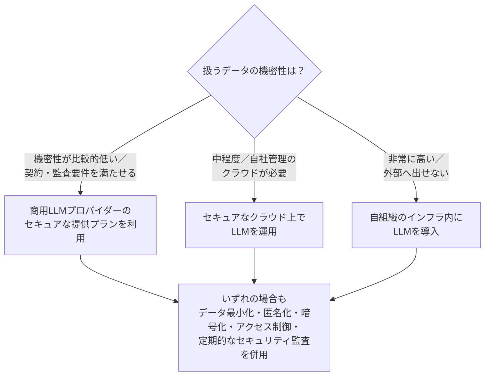

| 配置 | メリット（一般論） 🟩 | 注意点（一般論） 🟩 |
|---|---|---|
| 商用のセキュアな提供プラン | 導入が早い、運用負担が小さい | 契約条件（データの学習利用の有無、保存、所在地）を確認 |
| セキュアなクラウド運用 | 管理の自由度と拡張性のバランス | 構成・アクセス制御・監視を自組織が担う |
| 自組織インフラへの導入 | データを外に出さずに済む | 設備・人材・保守・モデル更新のコストが大きい |

> 第3章 3.2.3：セキュリティエンジニア、法務、CTO、CISOなどの**関与が強く推奨**されています。

### 11.4 テスト活動別：導入の始め方と品質ゲート 🟦＋🟩

第2章で学んだ4つのテスト活動を、5.1.4 のフェーズ導入と組み合わせて考えます。**どのAI出力にどれだけレビューを掛けるか**は、リスクの大きさで調整します（第3章 3.1.2）。

| テスト活動 | GenAIの支援例 🟦 | 導入の始め方（低リスクから） 🟩 | 品質ゲートの例 🟩 |
|---|---|---|---|
| **テスト分析** | テストベースの欠陥（曖昧さ・矛盾）検出、テスト条件の生成、リスクに基づく優先順位付け、カバレッジ分析、テスト技法の提案 | まず**要件の曖昧さの指摘**（人が最終判断できる用途）から | 生成されたテスト条件を、元の要件と**照合**（相互検証） |
| **テスト設計・実装** | テストケース生成、合成テストデータ、テストスクリプト生成、実行スケジュール・優先順位付け | 小さな機能の**下書き作成**から。実際の個人情報は使わず合成データで | 実行してみて**実行成功率**を確認。レビュー承認後に登録 |
| **自動リグレッション** | キーワード駆動スクリプト、影響分析、自己修復テスト、レポート・欠陥レポート作成 | **テストレポート分析**（読み取り中心）から。教材では、すでにフェーズ3に達し得る例として挙げられている | 誤りの可能性を前提に**リスクに応じて出力を検証**。自己修復の結果は人が確認 |
| **テスト監視・統制** | 指標分析、傾向予測、再優先順位付けの提案、完了レポート、ダッシュボード・自然言語要約 | ダッシュボードの**要約・傾向の説明**から | 元データとの**整合確認**。意思決定は人が行う |

> 各活動の一般的な誤りの対策として、**プロンプトチェーンで段階ごとに検証**し（第3章 3.1.3）、**完全な文脈**と**明確なデータ形式**を与えることが有効です。

---

## 12. 関連する規制・標準・フレームワーク（第3章との接続）

### 12.1 シラバス（第3章 3.4.1）に挙げられているもの 🟦

第5章の「ガバナンス」「コンプライアンス」「AIリスクマネジメント」の背景として、第3章の一覧を再確認しておきます。**名称と種別の対応**は K1（暗記）で問われ得ます。

| 名称 | 種別 | 概要（要約） | テストでの適用（要約） |
|---|---|---|---|
| **ISO/IEC 42001:2023** | 標準 | 組織内でAIシステムを管理するための**マネジメントシステム**の要求事項 | テストでのGenAI利用が推奨される実践に沿い、一貫性・信頼性を高める |
| **ISO/IEC 23053:2022** | 標準 | 機械学習を用いたAIシステムの**フレームワーク**。AIライフサイクルのプロセス、フォールトトレランス、透明性を重視 | データ品質、透明性、フォールトトレランスの枠組みを提供 |
| **EU AI Act** | 規制 | AIリスクを扱う**法的枠組み**。用途をリスクレベルで分類 | 透明性、説明責任、バイアス軽減へのコンプライアンスを求める |
| **NIST AI Risk Management Framework（米国）** | フレームワーク | AIリスクを管理する指針（公平性、透明性、セキュリティ） | 公平性を確保し、偏ったテスト結果を防ぐ |

> 📝 **覚え方**：**標準2つ（ISO）、規制1つ（EU）、フレームワーク1つ（NIST）**。シラバスは、これらの**最新動向を組織が継続的に把握すること**の重要性も述べています。

### 12.2 第5章の各項目との対応 🟩

| 第5章の項目 | 関連する規制・標準（例） | どう役立つか |
|---|---|---|
| 5.1.1 シャドーAI | EU AI Act、NIST AI RMF（Govern）、GDPR（第3章 3.2.1） | 未承認ツールの利用は、統制・透明性・データ保護の要求に反しやすい |
| 5.1.2 戦略の観点 | NIST AI RMF（Govern／Map／Measure／Manage）、ISO/IEC 42001 | 目標・責任・測定・改善のサイクルを整理する枠組み |
| 5.1.4 フェーズ3（継続的改善） | ISO/IEC 42001（継続的改善） | 監視・測定・改善を仕組みにする考え方 |
| 5.2.1 スキル・リテラシー | EU AI Act 第4条（AIリテラシー） | 従業員のAI理解を高める措置 |
| 5.2.3 マネージャーの役割 | EU AI Act、NIST AI RMF | 人による監督・説明責任の位置づけ |

### 12.3 補足：EU AI Act 第4条（AIリテラシー）に関する注意 🟩（試験範囲外）

- 第4条は、**AIシステムの提供者・導入者に対し、従業員等が十分なAIリテラシーを持つよう措置を講じる**ことを求める条文で、**2025年2月2日から適用**されています。
- 2026年7月に**条文の文言が改正された**とする解説が複数あります（義務の表現が「十分なレベルを確保する」から、リテラシー向上を「支援する措置」を求める形へ）。ただし、私が確認できたのは**第三者の解説記事**であり、公式条文（EUR-Lex）の最新版は本ガイド作成時点で直接確認できていません。
- **実務で対応する場合は、必ず公式条文と最新の公的ガイダンスを確認してください**（URLは[16章](#16-参考文献出典url)）。試験（CT-GenAI）では、この改正の詳細は問われません。

---

## 13. 章のまとめ・重要用語・暗記表

### 13.1 第5章の全体フロー（総まとめの図解）

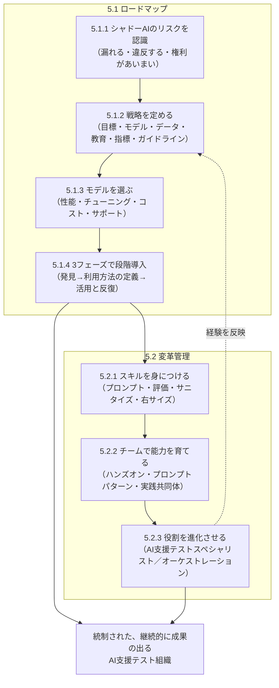

### 13.2 暗記表（K1問題の対策）

| 項目 | 暗記内容 | 覚え方 |
|---|---|---|
| **シャドーAIとは** | 個人用・未承認のAIツールの非公式利用 | 「私物USBのAI版」 |
| **シャドーAIの3リスク** | ①情報セキュリティ・プライバシーの弱点 ②コンプライアンス・規制問題 ③知的財産の不明確さ | 「漏れる・違反する・権利があいまい」 |
| **戦略の観点** | 測定可能な目標／LLM・SLM選定／データ品質とセキュリティ／教育／指標／ガイドライン（機密データ・透明性・品質ゲート） | 「目・モ・デ・教・指・ガ」 |
| **モデル選定の4基準** | モデル性能／ファインチューニング可能性／継続的コスト／コミュニティとサポート | 「性能・チューニング・コスト・サポート」 |
| **導入の3フェーズ** | Discovery／Initiation and usage definition／Utilization and iteration | 「試す・決める・回す」 |
| **フェーズの性質** | 重なり合う。ユースケースごとに成熟速度が違う。人的要因（雇用不安）を早期に扱う | 「直線ではない」 |
| **必要なスキル** | プロンプト、コンテキストウィンドウ理解、出力評価、リスク認識、データサニタイズ、右サイズとコスト・環境 | 「書く・見る・守る・選ぶ」 |
| **能力構築** | ハンズオン、段階的な学習、プロンプトパターン、実践共同体、共有ライブラリ | 「触る・型にする・共有する」 |
| **テスターの進化** | 設計者・実行者 → AI支援テストスペシャリスト | 「導く・見極める・磨く」 |
| **マネージャーの進化** | AI戦略・AIリスク管理・監視統制・ガバナンス → オーケストレーション | 「整える・束ねる」 |

### 13.3 重要用語集（日本語／英語）

| 日本語 | 英語 | 説明 |
|---|---|---|
| シャドーAI | Shadow AI | 個人用または未承認のAIツールを非公式に業務で使うこと |
| 生成AI戦略 | Generative AI strategy | テストにGenAIを組み込むための目標・選定・データ・教育・指標・ガイドラインの方針 |
| ロードマップ | Roadmap | 段階的な導入計画（マイルストーンとフィードバックを含む） |
| LLM／SLM | LLM／SLM | 大規模言語モデル／小規模言語モデル |
| コンテキストウィンドウ | Context window | モデルが一度に考慮できる入力量（トークン数） |
| ファインチューニング | Fine-tuning | 事前学習済みモデルを、特定タスク・ドメイン向けに追加学習すること |
| 継続的コスト | Recurring cost | ライセンス料や運用費など、繰り返し発生する費用 |
| 品質ゲート | Quality gate | 生成物を受け入れる前に、レビューを必須にする関門 |
| 透明性 | Transparency | GenAIで作られた成果物であることを明示すること |
| データサニタイズ | Data sanitisation | 機微・個人・機密情報のマスキングまたは除去 |
| 右サイズのモデル | Right-sized model | タスクに見合った規模のモデル |
| プロンプトパターン | Prompt pattern | 再利用可能なプロンプトのテンプレート |
| プロンプトライブラリ | Prompt library | 共有できるプロンプトの集まり |
| コミュニティ・オブ・プラクティス | Community of practice | 知識共有を続ける実践共同体 |
| AI支援テストスペシャリスト | AI-assisted test specialist | AIを導き、結果を批判的に評価するテスターの姿 |
| オーケストレーション | Orchestration | 人・プロセス・知的システムを、統制された戦略へ整合させること |
| 変革管理 | Change management | 導入に伴う人・役割・プロセスの変化を計画的に管理すること |
| 発見 | Discovery | フェーズ1：体験と学習 |
| 開始と利用方法の定義 | Initiation and usage definition | フェーズ2：ユースケースの特定・評価・優先順位付け |
| 活用と反復 | Utilization and iteration | フェーズ3：統合、監視・測定・改善、展開 |

---

## 14. 確認問題（オリジナル練習問題）

> ⚠️ 以下は本ガイド用に作成した**オリジナル問題**です。実際の試験問題や公式サンプル問題ではありません。公式サンプル問題は[ISTQB公式ページ](https://istqb.org/certifications/gen-ai/)からダウンロードできます。

**問1（5.1.1／K1）** シャドーAIのリスクとして**適切でないもの**はどれか。

- A. 個人用AIツールにより、機密情報が漏れる可能性がある
- B. 未承認ツールの利用により、規制・コンプライアンス上の問題が生じる可能性がある
- C. ライセンスが不明確なツールにより、知的財産の紛争リスクが生じる可能性がある
- D. 承認済みのLLMのコンテキストウィンドウが大きいため、処理時間が長くなる

**問2（5.1.1／K1）** 組織がシャドーAIのリスクを避けるうえで、シラバスが示す方向性に**最も近いもの**はどれか。

- A. すべての生成AIツールの利用を一律に禁止する
- B. 明確な生成AI戦略、統制された導入ステップ、ガバナンス、承認済みツールを組み合わせる
- C. 各個人の判断に任せ、問題が起きたら対応する
- D. 最も高性能なモデルを全員に開放する

**問3（5.1.2／K2）** 生成AI戦略の「品質ゲート」の説明として**最も適切なもの**はどれか。

- A. モデルの学習データを一定の品質まで絞り込むこと
- B. 生成されたテストウェアを、受け入れる前にレビューすることを求めるプロセス上の関門
- C. AIが自動的にテストケースの合否を判定する仕組み
- D. LLMへのアクセス回数を制限する仕組み

**問4（5.1.2／K2）** 生成AI戦略において、**透明性**を確保する施策として最も適切なものはどれか。

- A. 生成AIの利用を社外に公表しない
- B. GenAIで作成した成果物であることを記録・明記する
- C. すべてのプロンプトを社外に公開する
- D. AI生成物のレビューを省略する

**問5（5.1.3／K2）** あるチームは、自社独自のテストケース形式と専門用語に合わせて、テストケースを生成したい。モデル選定で**特に重視すべき基準**はどれか。

- A. ファインチューニングの可能性
- B. モデルを提供する企業の知名度
- C. モデルのパラメータ数の大きさだけ
- D. 一般的なNLPベンチマークの順位だけ

**問6（5.1.3／K2）** ソフトウェアテスト向けのLLM/SLM選定について、**正しい記述**はどれか。

- A. テスト特化のベンチマークは豊富にあるため、それだけで選定できる
- B. テスト特化のベンチマークは少ないため、自組織のベンチマークと指標でテストタスクの性能を評価する
- C. 継続的コストは選定基準に含めない
- D. 商用モデルのみが選定対象である

**問7（5.1.4／K1）** ある組織では、テストレポート分析はすでに日常業務に組み込まれ効果を測っているが、自動テスト生成はまだ試行段階である。この状況が示すこととして**最も適切なもの**はどれか。

- A. 導入フェーズは必ず順番どおりに全社で一斉に進む
- B. 導入フェーズは重なり合い、ユースケースごとに成熟速度が異なる
- C. 導入に失敗している
- D. 自動テスト生成はフェーズ3を飛ばしてよい

**問8（5.1.4／K1）** フェーズ1（Discovery：発見）の目的として**最も適切なもの**はどれか。

- A. 全テストの完全自動化を達成する
- B. 簡単で低リスクなユースケースで試し、強みと限界を学び、不確実性を減らす
- C. 導入効果を全社に展開する
- D. AI関連の規制を作成する

**問9（5.2.1／K2）** テスト成果物をLLMへ送る前に行う**データサニタイズ**として最も適切なものはどれか。

- A. 個人情報や機密情報を、マスキングまたは除去する
- B. LLMの温度パラメータを下げる
- C. 出力を別のLLMで比較する
- D. 入力を長くして情報を増やす

**問10（5.2.2／K1）** 「プロンプトパターン」の説明として**最も適切なもの**はどれか。

- A. モデルの内部構造を表す設計図
- B. 一貫した信頼できる結果を得るために設計された、再利用可能なプロンプトのテンプレート
- C. AIが生成するテストデータの形式
- D. プロンプトに含めてはならない禁止語のリスト

**問11（5.2.3／K1）** AI対応のテスト組織で、**テストマネージャー**の責任として**最も適切なもの**はどれか。

- A. AI生成のテストケースを一切レビューせずに承認する
- B. AIベースのテスト戦略、AIを意識したリスク管理、AI支援テストプロセスの監視・統制、ガバナンスの枠組みの定義を担う
- C. 人間のテスターをすべてAIに置き換える
- D. プロンプトの作成だけを行う

**問12（5.2／K2）** 生成AI導入に**構造化された変革管理**が必要な理由として**最も適切なもの**はどれか。

- A. 変革管理があれば、モデルの精度が自動的に上がるため
- B. 変革管理がないと、優れたAIツールでも、使われない・誤用される・抵抗される恐れがあるため
- C. 変革管理は、規制上の必須要件であるため
- D. 変革管理は、ツールの購入費用を減らすため

### 解答と解説

| 問 | 正解 | 解説 |
|:---:|:---:|---|
| 1 | **D** | Dはシャドーアイの3リスク（セキュリティ・プライバシー／コンプライアンス／IP）に含まれない。A・B・Cが3リスクに対応。 |
| 2 | **B** | 教材では、明確な戦略・統制された導入ステップ・ガバナンス・承認済みツールの組み合わせがシャドーAI回避に有効とされる。一律禁止は挙げられていない。 |
| 3 | **B** | 品質ゲート＝生成テストウェアを受け入れる前にレビューを必須にするプロセスガイドライン。 |
| 4 | **B** | 透明性の例として「どの成果物がGenAI由来かを明記する」が挙げられている。 |
| 5 | **A** | 組織固有の形式・用語に合わせるには、ファインチューニングの可能性が重要（第4章 4.2.1の例と整合）。 |
| 6 | **B** | テスト特化のベンチマークは少ない。だから自組織のベンチマークと（2.3.1のような）指標で評価する。継続的コストも基準に含まれる。 |
| 7 | **B** | フェーズは重なり合い、ユースケースごとに成熟速度が違う（教材の例そのもの）。 |
| 8 | **B** | フェーズ1の目的は、完全自動化ではなく、学習と不確実性の低減。 |
| 9 | **A** | データサニタイズ＝機微・個人・機密情報のマスキングまたは除去。Bは非決定性の軽減（第3章）、Cは別LLMによる評価（第3章）。 |
| 10 | **B** | プロンプトパターン＝再利用可能なプロンプトのテンプレート。組織の知識が詰まる。 |
| 11 | **B** | マネージャーは、AI戦略・AIリスク管理・監視統制・ガバナンスを担い、人の説明責任のもとで品質を守る。 |
| 12 | **B** | 教材は、変革管理がなければAIツールが使われない・誤用される・積極的に抵抗されるリスクがあると述べている。 |

> ※問1の解説の「シャドーアイ」は「シャドーAI」の誤記です（下の訂正欄参照）。

---

## 15. 学習チェックリスト

**5.1 ロードマップ**

- [ ] シャドーAIの定義を、自分の言葉で説明できる
- [ ] シャドーAIの3つのリスク（セキュリティ・プライバシー／コンプライアンス／IP）を挙げられる
- [ ] 生成AI戦略の6つの観点（目標／モデル選定／データ品質／教育／指標／ガイドライン）を言える
- [ ] 「透明性」と「品質ゲート」の意味を説明できる
- [ ] モデル選定の4基準（性能／ファインチューニング可能性／継続的コスト／コミュニティとサポート）を言える
- [ ] テスト特化ベンチマークが少ないため、自組織で評価する必要があると説明できる
- [ ] 導入の3フェーズの名称・順序・目的を言える
- [ ] フェーズが「重なり合う」とはどういうことか、例を挙げられる
- [ ] 人的要因（雇用不安）を早期に扱う理由を説明できる

**5.2 変革管理**

- [ ] 変革管理が必要な理由を説明できる
- [ ] 必要なスキル（プロンプト、コンテキストウィンドウ、評価、リスク認識、サニタイズ、右サイズ）を挙げられる
- [ ] データサニタイズの具体例を示せる
- [ ] プロンプトパターンの定義を言える
- [ ] コミュニティ・オブ・プラクティスの役割を説明できる
- [ ] テスターとテストマネージャーの役割の変化を、それぞれ説明できる
- [ ] 「人間の判断はより重要になる」の意味を説明できる

**全体**

- [ ] 第2章（評価指標）、第3章（リスク）、第4章（インフラ）との関連を説明できる
- [ ] 確認問題12問に、根拠を添えて解答できた
- [ ] 公式シラバスv1.1の第5章を、原文で最終確認した

---

## 16. 参考文献・出典URL

### 16.1 出典の信頼度と、このガイドの検証状況（重要）

| 区分 | 説明 |
|:---:|---|
| **A（一次情報）** | ISTQB公式ページ、公式シラバス、公式サンプル試験 |
| **B（準一次情報）** | ISTQBのシラバスに準拠して作られた、トレーニング提供会社の教材 |
| **C（外部標準・ガイドライン）** | NIST、ISO、OWASP、EU法令など（🟩実務ベストプラクティスの根拠） |
| **D（第三者の解説）** | 個人・企業のブログ、学習サイトなど（補足のみ。公式ではない） |

> **検証状況の正直な報告**
> - 公式ページは直接確認できました（試験構成、章立て、前提条件、ダウンロード資料の一覧）。
> - **シラバスv1.1のPDF**は、私の環境ではバイナリのままでテキスト抽出できませんでした。
> - そのため、5.1〜5.2の各項目の詳細は、**シラバスv1.1に準拠したExactproの第5章教材（B）**（学習目標のKレベル、各項の本文を確認）と、**シラバスv1.0の目次・第1〜4章本文（A）**を突き合わせて作成しました。
> - 章の想定配点（7問／K1が4問・K2が3問）は**第三者の学習サイト（D）**の情報です。
> - **試験前には、公式シラバスv1.1の第5章を必ず原文で確認**してください。

### 16.2 A：公式（ISTQB）

| 資料 | URL | このガイドでの使いどころ |
|---|---|---|
| CT-GenAI 認定ページ（出発点） | https://istqb.org/certifications/gen-ai/ | 試験構成（40問／46点／65%／60分）、章立て、前提条件（CTFL）、資料一覧 |
| CT-GenAI シラバス v1.1（公式ダウンロード） | https://istqb.org/?sdm_process_download=1&download_id=6295 | 第5章の学習目標・本文（原文で最終確認） |
| CT-GenAI サンプル試験A 問題 v1.1 | https://istqb.org/?sdm_process_download=1&download_id=6309 | 出題形式の確認 |
| CT-GenAI サンプル試験A 解答 v1.1 | https://istqb.org/?sdm_process_download=1&download_id=6301 | 解答と解説の確認 |
| CT-GenAI リリースノート v1.1 | https://istqb.org/?sdm_process_download=1&download_id=9550 | v1.0からの変更点の確認 |
| ISTQB 試験構成とルール v1.2 | https://istqb.org/?sdm_process_download=1&download_id=3829 | 試験のルール |
| ISTQB 用語集 | https://glossary.istqb.org/ | 用語の確認 |
| CT-GenAI シラバス v1.0（ASTQBミラー） | https://astqb.org/assets/documents/CT-GenAI-Syllabus-v1.0.pdf | 第1〜4章の本文、第3章3.4.1の規制一覧、第5章の目次・学習目標構成 |
| CT-GenAI シラバス v1.0（ISQI ミラー） | https://isqi.org/media/3d/d9/7e/1762964279/CT-GenAI-Syllabus-v1.0_EN_.pdf | 第5章の目次（5.1.1〜5.2.3）の確認 |

### 16.3 B：シラバス準拠の解説教材

| 資料 | URL | このガイドでの使いどころ |
|---|---|---|
| Exactpro「Chapter 5 – Deploying and Integrating Generative AI in Test Organisations（v1.1）Reading Materials」 | https://speakerdeck.com/exactpro/chapter-5-deploying-and-integrating-generative-ai-in-test-organisations-istqbr-ct-genai-v1-dot-1-reading-materials | **5.1〜5.2の各項の詳細**（3つのリスク、戦略の観点、4つの選定基準、3フェーズ、スキル、プロンプトパターン、役割の進化）、各項のKレベル |
| 同 PDF | https://files.speakerdeck.com/presentations/5c4e688bcd4a452193aecb648a10b6dd/Reading_ISTQB_CT-GenAI_Chapter_5.pdf | 同上（PDF版） |
| Exactpro「Chapter 5 …（v1.1）Slides」 | https://speakerdeck.com/exactpro/chapter-5-deploying-and-integrating-generative-ai-in-test-organisations-istqbr-ct-genai-v1-dot-1-slides | 3フェーズの補足（例：ロードマップのマイルストーン、フィードバック） |

### 16.4 C：外部の標準・フレームワーク・ガイドライン（🟩実務ベストプラクティスの根拠）

| 資料 | URL | 使いどころ |
|---|---|---|
| NIST AI Risk Management Framework（AI RMF） | https://www.nist.gov/itl/ai-risk-management-framework | Govern／Map／Measure／Manage の4機能。戦略・ガバナンスの整理 |
| NIST AI 600-1 生成AIプロファイル | https://doi.org/10.6028/NIST.AI.600-1 （PDF：https://nvlpubs.nist.gov/nistpubs/ai/NIST.AI.600-1.pdf） | 生成AI固有のリスク（データプライバシー、情報セキュリティ等）と推奨アクション |
| OWASP Top 10 for LLM Applications 2025 | https://genai.owasp.org/resource/owasp-top-10-for-llm-applications-2025/ | LLM01（プロンプトインジェクション）、LLM02（機微情報の漏えい）など |
| OWASP LLM02:2025 機微情報の漏えい（ページ） | https://genai.owasp.org/llmrisk/llm02-insecure-output-handling/ | 機微情報の漏えいリスクと対策（URLのスラッグは旧称ですが、表示内容はLLM02:2025） |
| ISO/IEC 42001:2023（AIマネジメントシステム） | https://www.iso.org/standard/42001 | AIマネジメントシステムの位置づけ（有償規格。概要ページ） |
| EU AI Act（Regulation (EU) 2024/1689）公式条文 | https://eur-lex.europa.eu/eli/reg/2024/1689/oj | 第4条（AIリテラシー）等。**最新の改正状況は公式で確認** |
| AWS Prescriptive Guidance「Agentic AI security」（OWASPとの対応） | https://docs.aws.amazon.com/prescriptive-guidance/latest/agentic-ai-security/owasp-top-ten.md | 「プロンプトをコード成果物として扱う」等の実務指針への入口 |
| TestEval：テストケース生成向けLLMのベンチマーク（arXiv:2406.04531） | https://arxiv.org/abs/2406.04531 | 「テスト特化ベンチマークは少ない」という点の背景（Exactpro教材の参考文献より） |

### 16.5 D：第三者の解説（補足。公式ではない）

| 資料 | URL | 使いどころ |
|---|---|---|
| Mock Exam Network「CT-GenAI v1.1 学習ガイド」 | https://mockexamnetwork.com/guides/how-to-pass-istqb-ct-genai/ | 第5章の想定配点（7問／K1:4・K2:3）、LO番号とKレベルの対応（**公式数値ではない**） |
| Elevate Consult「What is shadow AI: risks and governance」 | https://elevateconsult.com/insights/what-is-shadow-ai-risks-and-governance/ | シャドーAIの具体例（機密文書の貼り付け、未承認の文字起こし等）と、「禁止だけでは解決しにくい」という指摘 |
| Adaptive Security「Shadow AI Risks」 | https://www.adaptivesecurity.com/blog/shadow-ai-risks-2026 | シャドーAIの事例・リスクの整理 |
| Gradually「AI Literacy under Article 4 of the EU AI Act」 | https://www.gradually.ai/en/ai-literacy-eu-ai-act/ | 第4条の改正に関する解説（**公式条文での確認が必要**） |

### 16.6 このガイドの各節と出典の対応

| 節 | 主な出典 |
|---|---|
| 1（全体像・LO） | 16.2 公式ページ、16.3 Exactpro教材、16.2 v1.0の目次 |
| 2（ロードマップ概要） | 16.3 Exactpro教材（5.1の導入部） |
| 3（5.1.1 シャドーAI） | 16.3 Exactpro教材、16.2 v1.0第3章3.2.3、16.4 NIST／OWASP、16.5 補足 |
| 4（5.1.2 戦略の観点） | 16.3 Exactpro教材、16.2 v1.0第2章2.3.1（指標） |
| 5（5.1.3 モデル選定） | 16.3 Exactpro教材、16.4 TestEval、16.2 v1.0第1章・第3章・第4章 |
| 6（5.1.4 フェーズ） | 16.3 Exactpro教材 |
| 7〜10（5.2 変革管理） | 16.3 Exactpro教材、16.2 v1.0第2章2.3.2・第3章 |
| 11（導入形態別） | 16.2 v1.0第1章1.2.2・第3章3.2.3・第4章、16.4（実務） |
| 12（規制・標準） | 16.2 v1.0第3章3.4.1、16.4 NIST／ISO／EU |
| 14（確認問題） | 本ガイド独自（オリジナル） |

---

### 訂正欄（作成者メモ）

- 14章 解答表「問1」の解説内「シャドーアイ」は「**シャドーAI**」の誤記です。

*最終更新：2026-09-24*
