# ISTQB® Certified Tester – Testing with Generative AI（CT-GenAI）完全学習ガイド

> 本ガイドは ISTQB®（International Software Testing Qualifications Board）が公開している **CT-GenAI Syllabus v1.1**（2026年4月27日改訂）の出題範囲に沿って、初学者にもわかりやすいようにステップバイステップで解説したものです。根拠となる出典URLは、主に各章の解説末尾と巻末の「出典・参考資料」一覧に掲載しています。

---

## 目次

- [0. 資格の概要](#0-資格の概要)
- [第1章 ソフトウェアテストにおける生成AI入門](#第1章-ソフトウェアテストにおける生成ai入門100分)
- [第2章 効果的なソフトウェアテストのためのプロンプトエンジニアリング](#第2章-効果的なソフトウェアテストのためのプロンプトエンジニアリング365分)
- [第3章 ソフトウェアテストにおける生成AIのリスク管理](#第3章-ソフトウェアテストにおける生成aiのリスク管理160分)
- [第4章 ソフトウェアテストのためのLLM搭載テストインフラ](#第4章-ソフトウェアテストのためのllm搭載テストインフラ110分)
- [第5章 テスト組織における生成AIの導入と統合](#第5章-テスト組織における生成aiの導入と統合80分)
- [学習ロードマップと試験対策のポイント](#学習ロードマップと試験対策のポイント)
- [出典・参考資料](#出典参考資料)

---

## 0. 資格の概要

CT-GenAI は ISTQB® が提供する **Specialist Level**（専門レベル）の資格で、テスター・テストアナリスト・テスト自動化エンジニア・テストマネージャー・UAT担当者・開発者など、ソフトウェアテストに生成AIを活用するすべての人を対象としています。

### 0.1 試験概要

| 項目 | 内容 |
|---|---|
| 出題数 | 40問 |
| 配点 | 46点 |
| 合格基準 | 30点（約65%） |
| 試験時間 | 60分（非母語受験者は+25%＝75分） |
| 前提資格 | ISTQB® Certified Tester Foundation Level（CTFL）の取得が必須 |
| 出題形式 | 多肢選択式（1つの正解を選ぶ問題と、複数の正解を選ぶ問題を含む）・シナリオベース問題（K1/K2/K3の認知レベルにマッピング） |
| 次のステップ | Core Advanced Level（Test Analyst、Technical Test Analyst、Test Manager、Test Engineering）、その後 Expert Level |

### 0.2 ビジネスアウトカム（合格者が到達すべき状態）

| ID | 内容 |
|---|---|
| GenAI-BO1 | 生成AIの基本概念・能力・限界を理解する |
| GenAI-BO2 | ソフトウェアテストのために大規模言語モデル（LLM）へプロンプトを与える実践スキルを身につける |
| GenAI-BO3 | ソフトウェアテストで生成AIを使う際のリスクと緩和策への洞察を得る |
| GenAI-BO4 | ソフトウェアテスト向け生成AIソリューションの応用への洞察を得る |
| GenAI-BO5 | 組織における生成AI戦略・ロードマップの策定と実装に効果的に貢献する |

### 0.3 認知レベル（K-レベル）

シラバスの内容は **序章・ハンズオン目標・付録を除き**、すべて試験範囲です。なお、参照されている標準・書籍・記事の内容は、シラバス本文での要約を超える部分は出題対象外です。学習目標（Learning Objective, LO）は次の3段階で示されます。

- **K1（記憶）**：用語や事実を思い出せる
- **K2（理解）**：概念を説明・比較・要約できる
- **K3（適用）**：与えられたテストタスクに技法を適用できる

> 💡 **ベストプラクティス**
> - 各章冒頭に列挙される「キーワード」は、学習目標に明記されていなくても K1 として暗記が必須です。見出し直下のキーワード一覧を軽視しないこと。
> - **第2章（プロンプトエンジニアリング、365分）は学習時間が最も長い章**のため優先的に学習してください。章ごとの出題数・配点は学習時間から推定せず、公式の試験構成で確認してください。

### 0.4 章構成と学習時間

合計学習時間は約13.6時間（815分）が推奨されています。

出典：[ISTQB CT-GenAI 公式ページ](https://istqb.org/certifications/gen-ai/)、[CT-GenAI Syllabus v1.1](https://isqi.org/media/b9/8c/34/1777291646/ISTQB-CT-GenAI%20-%20Syllabus%20v1.1.pdf)

---

## 第1章 ソフトウェアテストにおける生成AI入門（100分）

**キーワード（GenAI固有）**：AIチャットボット、コンテキストウィンドウ、深層学習、埋め込み（embedding）、特徴量、基盤LLM、生成AI、生成事前学習済みトランスフォーマー、指示チューニング済みLLM、大規模言語モデル、機械学習、マルチモーダルモデル、推論LLM、記号的AI、トークン化、トランスフォーマー

### 1.1 生成AIの基礎と主要概念

#### 1.1.1 AIスペクトラム：記号的AI／古典的機械学習／深層学習／生成AI（K1）

AI技術は単一の手法ではなく、以下のようなスペクトラムとして理解すると整理しやすくなります。

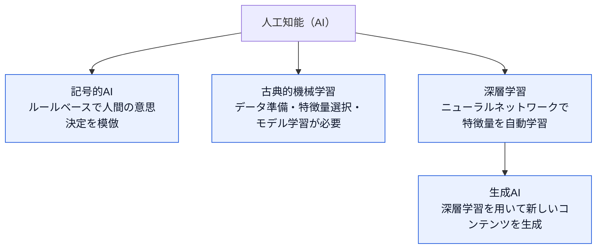

| 種類 | 特徴 | テストでの用途例 |
|---|---|---|
| 記号的AI | 記号と論理ルールで知識を表現 | ルールベースの検証エンジン |
| 古典的機械学習 | データ駆動、特徴量選択とモデル学習が必要 | 欠陥分類、不具合予測 |
| 深層学習 | ニューラルネットワークで特徴を自動抽出（データアノテーション等は人手が残る） | 画像・音声・テキストの大規模パターン認識 |
| 生成AI | 深層学習で学習データのパターンを模倣し、新しいコンテンツ（文章・画像・コード）を生成 | テストケース生成、コード生成、推論の模擬 |

生成AI最大の利点は、**追加の学習フェーズなしに事前学習済みモデルをそのままテストタスクへ適用できる**点ですが、これには一定のリスク（第3章参照）が伴います。

#### 1.1.2 生成AIとLLMの基礎（K2）

LLM（大規模言語モデル）はトランスフォーマーなどの深層学習アーキテクチャをベースとするモデルで（「生成事前学習済みトランスフォーマー（GPT）」はその代表例）、書籍・記事・Webサイトなど極めて大規模なデータセットで学習されます。**SLM（小規模言語モデル）**はパラメータ数を抑えた軽量版で、特定用途に特化した使い方に向きます。

LLMが言語を処理・生成するための2つの中核概念：

- **トークン化（tokenization）**：文章をトークン（文字・サブワード・単語などの単位）に分割する処理。
- **埋め込み（embedding）**：各トークンを高次元ベクトル空間上の数値表現に変換する処理。意味的に近いトークンは空間上でも近い位置に配置され、これによりLLMは文脈理解や一貫した応答生成が可能になります。

LLMはトランスフォーマーというニューラルネットワーク構造を用い、推論時には「次に来る可能性の高いトークン」を統計的に予測して文章を生成します。ここで重要なのは、**生成される文章は「統計的にもっともらしい」だけであり、必ずしも正しいとは限らない**という点です。また、推論の確率的性質・ハイパーパラメータ設定に起因して、同じ入力でも実行のたびに異なる出力になる**非決定的な挙動**を示します。

**コンテキストウィンドウ**は、モデルが応答生成時に考慮できる直前テキストの量（トークン数）を指します。ウィンドウが大きいほど長い文脈（大量のテストログなど）を一貫して扱えますが、その分計算コストと処理時間が増加します。

> 💡 **ベストプラクティス**
> - 大きなテストログや長い要件文書をLLMに渡す前に、トークン数を見積もり、コンテキストウィンドウの上限に収まるよう要約・分割すること。
> - 「もっともらしいが誤り」という性質を前提に、生成結果は必ず人間または自動検証で裏取りする運用を組み込むこと（第3章参照）。

#### 1.1.3 基盤LLM／指示チューニング済みLLM／推論LLM（K2）

LLMは段階的な学習プロセスを経て、以下の3カテゴリに分類されます。

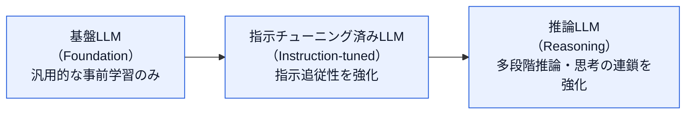

| 種類 | 特徴 |
|---|---|
| 基盤LLM | テキスト・コード・画像など多様なモダリティの大規模データで学習された汎用モデル。柔軟だが特定タスクへの追加適応が必要 |
| 指示チューニング済みLLM | 基盤モデルをプロンプトと期待応答のペアで微調整し、指示追従性・応答の一貫性を高めたもの |
| 推論LLM | 指示チューニング済みモデルをさらに拡張し、論理的推論・多段階の問題解決・思考の連鎖（Chain-of-Thought）を強化したもの。認知負荷の高いタスクに適する |

> 💡 **ベストプラクティス**
> テスト設計のような複雑な多段階推論を要するタスク（優先順位付け、依存関係分析など）には推論LLMを、定型的な文章生成や単純な変換タスクには指示チューニング済み（非推論）LLMを使い分けることでコストと精度のバランスを最適化する。

#### 1.1.4 マルチモーダルLLMとVision-Languageモデル（K2）

マルチモーダルLLMはテキストに加えて画像・音声・動画など複数のモダリティを扱えるようトランスフォーマーを拡張したモデルです。画像はVision-Languageモデルによって埋め込みへ変換されたうえでトランスフォーマーに入力されます。

テストにおける主な活用：

- スクリーンショットやGUIワイヤーフレームと、テキスト（ユーザーストーリー・欠陥報告）を組み合わせて解析し、期待結果と実際の画面表示の差異を検出する
- テキストと視覚情報の両方を組み込んだ、より現実的で網羅性の高いテストケースを生成する

> 💡 **ベストプラクティス**
> ワイヤーフレーム画像から受け入れ基準を生成する際は、画像だけでなく入力フィールドの制約やビジネスルールをテキストで補足することで、生成結果の精度が大きく向上する。

### 1.2 ソフトウェアテストにおける生成AI活用の基本原則

#### 1.2.1 テストタスクにおけるLLMの主要な能力（K2）

| 能力 | 内容 |
|---|---|
| 要件分析・改善 | 曖昧さ・矛盾・欠落情報を特定し、ステークホルダーへの確認質問を生成 |
| テストケース作成支援 | 要件・ユーザーストーリーからテストケース／テスト目的を生成 |
| テストオラクル生成 | 期待結果の生成を支援 |
| テストデータ生成 | データセット生成、境界値設定、多様なデータ組み合わせの作成 |
| テスト自動化支援 | テストケース記述からのスクリプト生成、既存スクリプトの改善提案・適切な技法の特定 |
| テスト結果分析 | 結果の要約作成、重大度・優先度に基づく異常分類 |
| テストウェア作成 | テスト計画・テストレポート・欠陥報告などの文書作成・更新 |

#### 1.2.2 AIチャットボット vs LLM搭載テストアプリケーション（K2）

| 観点 | AIチャットボット | LLM搭載テストアプリケーション |
|---|---|---|
| インターフェース | 会話型・自然言語での直接対話 | APIを介した組み込み型（テストツール内に統合） |
| 柔軟性 | 探索的・即興的な利用に強い（プロンプトチェイニング等で反復改善） | 定型・自動化されたタスク向けにカスタマイズ・スケール可能 |
| 想定ユーザー | 非技術者を含む幅広い利用者、新任テスターのオンボーディングにも有用 | 組織・ツールベンダーが既存フレームワークにGenAIを組み込む場合 |
| 発展形 | — | 特定のテスト役割を担うAIエージェントの構築（第4章） |

> 💡 **ベストプラクティス**
> どちらの方式でも、出力の正確性・関連性・テスト目的との整合性を高める鍵は**プロンプトエンジニアリング**（第2章）です。チャットボットでの試行錯誤で有効だったプロンプトパターンを、LLM搭載アプリケーションのテンプレートへ昇華させると再現性が上がる。

出典：[CT-GenAI Syllabus v1.1 第1章](https://isqi.org/media/b9/8c/34/1777291646/ISTQB-CT-GenAI%20-%20Syllabus%20v1.1.pdf)

---

## 第2章 効果的なソフトウェアテストのためのプロンプトエンジニアリング（365分）

**キーワード**：受け入れ基準、テストスクリプト、テストケース、テスト条件、テストデータ、テスト設計、テストレポート
**キーワード（GenAI固有）**：few-shotプロンプティング、メタプロンプティング、自然言語処理、one-shotプロンプティング、プロンプト、プロンプトチェイニング、プロンプトエンジニアリング、システムプロンプト、ユーザープロンプト、zero-shotプロンプティング

### 2.1 効果的なプロンプト開発

#### 2.1.1 プロンプトの6要素構造（K2）

構造化プロンプトは次の6つの要素で構成されます。

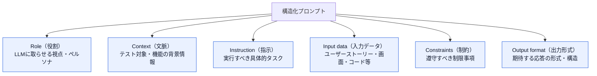

| 要素 | 役割 |
|---|---|
| Role | 「テスター」「テストマネージャー」「テスト自動化エンジニア」など、LLMに取らせる視点・トーンを指定 |
| Context | テスト対象、対象機能、関連する背景情報を提供 |
| Instruction | 実行すべきタスクを明確・命令形・簡潔に指示 |
| Input data | ユーザーストーリー、受け入れ基準、スクリーンショット、コード、既存テストケース、出力例など |
| Constraints | 遵守すべき制約・特別な考慮事項 |
| Output format | 期待する応答の形式・構造・特性 |

> 💡 **ベストプラクティス**
> 6要素はテンプレート化して再利用すること。特に Output format を明示しないと、後段の自動処理（パース・テスト管理ツールへの取り込み）が壊れやすくなるため必ず指定する。

#### 2.1.2 コアプロンプト技法（K2）

テストタスクで一般的に使われる3つのコア技法です。

| 技法 | 概要 | 向いているケース |
|---|---|---|
| プロンプトチェイニング | タスクを複数の中間ステップ（複数プロンプト）に分解し、各ステップの結果を人手または自動で検証してから次へ進める | 複雑なタスクで、サブタスクへの分解と中間出力の系統的チェックが必要な場合 |
| Few-shotプロンプティング | プロンプト内に例を提示する。例なし＝zero-shot、例1つ＝one-shot、複数例＝few-shot | 出力形式が決まった反復的タスク（Gherkin形式のテストケース生成など） |
| メタプロンプティング | LLM自身にプロンプトを生成・改善させる反復サイクル | 新しいタスク向けにプロンプトを設計する効率化、テスターとLLMの協働（ペアリング） |

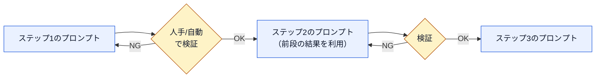

上記はプロンプトチェイニングの典型的な流れです。3つの技法は組み合わせて使うこともでき、例えば「メタプロンプティングで初期プロンプトを作成 → few-shotの例を追加して精緻化 → プロンプトチェイニングでサブタスクに分割し中間検証を行う」という多層的な適用が可能です。

> 💡 **ベストプラクティス**
> - 出力が不安定・不正確な場合、まずプロンプトチェイニングでタスクを分割し、どのステップで精度が落ちるかを切り分ける。
> - Few-shotの例は3〜5件程度から始め、モデルの応答パターンを見ながら例の質と数を調整する。

#### 2.1.3 システムプロンプトとユーザープロンプト（K2）

| 種別 | 定義者 | 可視性 | 役割 |
|---|---|---|---|
| システムプロンプト | 開発者・テスター | 多くのインターフェースでユーザーには非表示 | 会話全体を通じてLLMの振る舞い・トーン・ドメインルールを規定する。Role/Context/Constraintsを含むことが多い |
| ユーザープロンプト | チャットボット利用者 | 常に可視 | 各やり取りごとに変化する実際の入力・質問・タスク指示 |

例：
- システムプロンプト：「あなたはプロフェッショナルなソフトウェアテスト支援アシスタントです。常に明確に、フォーマルな言葉で回答し、ISTQBに準拠したプラクティスに焦点を当ててください。推測は避け、関連するテスト原則を引用してください。」
- ユーザープロンプト：「ブラックボックステストとホワイトボックステストの違いを例とともに挙げてください。」

> 💡 **ベストプラクティス**
> チーム共通のシステムプロンプトを整備し、役割・出力フォーマット・禁止事項をあらかじめ固定しておくことで、個々のユーザープロンプトを簡潔に保ちつつ組織全体で一貫した品質を維持できる。

### 2.2 プロンプトエンジニアリング技法の適用（K3）

#### 2.2.1 テスト分析

| タスク | GenAIの役割 |
|---|---|
| テストベースの潜在的欠陥特定 | 要件パターンの比較や過去の欠陥報告の知見を用い、矛盾・曖昧さ・不完全な情報を検出 |
| テスト条件の生成 | 要件・ユーザーストーリーを自然言語処理で解釈し、テスト可能な条件に分解 |
| リスクベースの優先順位付け | リスク発生可能性・影響度、規制遵守、履歴データを踏まえて優先度を提案 |
| カバレッジ分析支援 | 要件とテスト条件の対応関係をマッピングし、抜け漏れを検出 |
| テスト技法の提案 | 要件の性質に応じて境界値分析・同値分割などの技法を提案 |

#### 2.2.2 テスト設計・実装

| タスク | GenAIの役割 |
|---|---|
| テストケース生成 | 機能／非機能要件からドラフトのテストケース（前提条件・入力・期待結果・カバレッジ基準）を生成 |
| テストデータ合成 | プライバシーを保持した現実的な合成テストデータを生成 |
| 自動テストスクリプト生成 | 構造化されたテストケースからテスト自動化フレームワーク向けのスクリプトを生成 |
| テスト実行スケジューリング・優先順位付け | 優先度・リスク・リソース可用性に基づき実行順序を最適化 |

#### 2.2.3 自動回帰テスト

| タスク | GenAIの役割 |
|---|---|
| キーワード駆動自動化 | 定義済みキーワードを具体的なテストケースにマッピングしスクリプト生成 |
| 影響分析・テスト最適化 | コード変更の影響範囲を分析し回帰テスト対象を絞り込み |
| セルフヒーリング／適応型テスト | UI/API の軽微な変更にスクリプトを自動追従させ、不要な失敗を防止 |
| 自動テストレポート・洞察 | 成功率・失敗・重要な知見を含むレポート生成、傾向のダッシュボード化 |
| 欠陥報告・根本原因分析の強化 | ログ・スクリーンショット・環境情報を含む詳細な欠陥報告を自動作成 |

CI/CD パイプラインのように実行頻度が高い回帰テストほど自動化の恩恵が大きく、GUIテストでは動的ロケータへの適応、APIテストではリクエスト／レスポンス仕様の変化への追従にGenAIが有効です。

#### 2.2.4 テストモニタリング・コントロール

| タスク | GenAIの役割 |
|---|---|
| モニタリング・メトリクス分析 | 傾向分析による潜在リスクの予測、計画からの逸脱アラート |
| テストコントロール | 再優先順位付け・スケジュール調整・リソース再配分の提案 |
| 完了時の知見・継続学習 | テスト完了報告書の生成、成功要因・教訓の抽出 |
| メトリクス可視化・報告強化 | 動的ダッシュボードと自然言語要約の生成 |

#### 2.2.5 プロンプト技法の使い分け（公式シラバス掲載表）

| プロンプト技法 | 推奨ユースケース | 主な特徴・用途 |
|---|---|---|
| プロンプトチェイニング | 各ステップでの人手検証を伴う高精度が必要な複雑タスク | タスクを小ステップに分解。テスト分析・テスト設計・テスト自動化で、各ステップの機能的正確性をチェックする用途に有用 |
| Few-shotプロンプティング | 反復的または特定・制約された出力形式が求められるタスク | 特定パターンでの反復生成に例を提示。Gherkin形式のテストケース、キーワード駆動テスト、特定形式のテストレポート等 |
| メタプロンプティング | 柔軟・動的なタスク、新しいタスク向けプロンプト作成に有用 | 目的とタスクの概要を与え、LLM自身にプロンプト作成を促す。テストレポート分析や異常検知など複雑タスク全般に有用 |

> 💡 **ベストプラクティス**
> 単一の技法に固執せず、「メタプロンプティングで骨格を作る → few-shotで型を固める → プロンプトチェイニングで検証点を挟む」という組み合わせを標準ワークフローとして定着させる。

### 2.3 生成AI結果の評価とプロンプトの改善

#### 2.3.1 評価メトリクス（K2）

| メトリクス | 説明 | 例 |
|---|---|---|
| Accuracy（正確性） | 専門家が作成したテストケース・要件等との全体的な正しさ | 生成されたテストケースが全要求事項を網羅している度合い |
| Precision（適合率） | 特定の目的に対する生成出力の正確さ | 生成されたテストケースが異常を正しく識別する度合い |
| Recall（再現率） | データセット内の関連インスタンスをすべて識別できる能力 | 有効・無効な同値クラスの網羅度合い |
| Relevance and Contextual Fit（関連性・文脈適合性） | 出力が文脈に適切かどうか | テストベース・ドメイン固有要件との整合性 |
| Diversity（多様性） | 幅広い入力・シナリオを重複なくカバーできるか | 様々なユーザー行動やエッジケースの網羅度 |
| Execution Success Rate（実行成功率） | 生成されたテスト成果物がそのまま実行可能な割合 | 構文エラーや形式問題なく実行できるスクリプトの割合 |
| Time Efficiency（時間効率） | 手動作業と比較した時間節約効果 | 人手作成に比べたAI生成の所要時間 |

生成AIは非決定的な性質を持つため、評価は**統計的に妥当なデータ（十分なサンプル数のデータ）**に基づく必要があります。単発の出力だけで判断しないこと。

#### 2.3.2 プロンプトの評価・改善技法（K2）

- **反復的プロンプト修正**：ベースプロンプトから出発し、結果を見ながら文脈追加や用語調整を段階的に行う
- **A/Bテスト**：複数バージョンのプロンプトを作成し、事前定義メトリクスで比較する
- **出力分析**：AI生成出力の不正確さ・不整合を分析し、将来の欠陥を防ぐ知見を得る
- **ユーザーフィードバックの統合**：テスターからの有用性・明確さに関するフィードバックを反映
- **プロンプトの長さ・具体性の調整**：文脈追加が有効な場合もあれば、短いプロンプトの方が汎化性能が高い場合もある

> 💡 **ベストプラクティス**
> チームでプロンプトライブラリを共有し、評価済みの高品質プロンプトをテンプレート化する。属人化を防ぎ、プロンプト設計のばらつきによる品質低下を抑制できる。

出典：[CT-GenAI Syllabus v1.1 第2章](https://isqi.org/media/b9/8c/34/1777291646/ISTQB-CT-GenAI%20-%20Syllabus%20v1.1.pdf)

---

## 第3章 ソフトウェアテストにおける生成AIのリスク管理（160分）

**キーワード**：セキュリティ、脆弱性、データプライバシー
**キーワード（GenAI固有）**：ハルシネーション、温度（temperature）、推論エラー、バイアス、コンテキスト操作

### 3.1 ハルシネーション・推論エラー・バイアス

#### 3.1.1 定義（K1）

| 種類 | 定義 | テストでの現れ方 |
|---|---|---|
| ハルシネーション | LLMが事実に反する、またはタスクと無関係な出力を生成する現象 | 架空・無関係なテストケースの生成、動作しないテストスクリプト、存在しない受け入れ基準の検証を提案 |
| 推論エラー | 因果関係・条件論理・段階的問題解決などの論理構造をLLMが誤って解釈する現象。LLMは真の論理推論ではなくパターンマッチングに依存するため発生 | テスト計画（工数見積り、テストケース優先順位付け）など論理推論を要するタスクで顕著 |
| バイアス | 学習データに由来する偏り。特定の情報・アプローチ・前提を過度に優先する | 英語データ中心の学習による非英語圏視点の過小評価、テストデータ生成や受け入れ基準の偏り |

LLMの非決定的な挙動（1.1.2参照）により、これらの欠陥は「一度直ったように見えても、別の会話で再発する」ことがある点に注意が必要です。

#### 3.1.2 検出方法（K3）

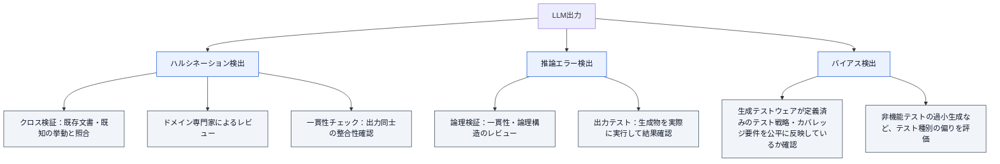

検出方法の実際の適用度合いは、そのテストタスクにおけるハルシネーション・推論エラー・バイアスの推定リスクレベルに応じて調整します。

#### 3.1.3 緩和技法（K2）

- **完全な文脈の提供**：プロンプトに関連情報を漏れなく含める（2.1.1参照）
- **プロンプトの分割**：プロンプトチェイニングで複雑なプロンプトを管理可能な単位に分割し、各出力を段階的に検証する
- **明確で解釈可能なデータ形式の使用**：曖昧・解釈が難しい形式を避け、構造化された明快なフォーマットを用いる
- **タスクに適したモデルの選定**：そのタスク向けに特化して学習されたLLMを使用する（5.1.3参照）
- **複数モデルでの結果比較**：複数のLLMで同じプロンプトを評価し、出力誤りの検出と信頼できる結果の選定に役立てる

さらに第4章で扱う **Retrieval-Augmented Generation（RAG）** と **ファインチューニング** は、LLM出力の質を改善する補完的技法として位置づけられています。

#### 3.1.4 非決定的挙動の緩和（K1）

| 手法 | 内容 | トレードオフ |
|---|---|---|
| 温度（temperature）パラメータの調整 | 推論時の温度を下げることで確率分布を狭め、ランダム性を低減し、より一貫した出力を得る | 創造性・応答の多様性が低下し、出力が反復的・過度に決定論的になりうる |
| ランダムシードの設定 | 一部のLLM実装では乱数生成器のシード値を固定でき、同じ疑似ランダム系列を再現できる | 完全な再現性は保証されない |

> 💡 **ベストプラクティス**
> 完全な再現性は保証できないという前提に立ち、出力検証の一部を自動化して構造化・一貫した評価プロセスを組み込むことで、非決定性に起因するハルシネーション・推論エラーのリスクを実務的に低減する。

### 3.2 データプライバシーとセキュリティリスク

#### 3.2.1 主なリスク（K2）

- **意図しないデータ露出**：モデルが機密情報を偶発的に開示する出力を生成
- **データ利用の管理欠如**：明示的な同意・管理なくツールが機微データを保存・処理する
- **コンプライアンスリスク**：GDPR（EU一般データ保護規則、Regulation (EU) 2016/679）などのデータ保護規制への非準拠が法的紛争を招く

加えて、LLM搭載テストインフラ自体がデータ侵害・不正アクセスなどの攻撃対象になりうること、悪意ある入力データによってLLMの精度・セキュリティが損なわれうることにも留意が必要です。

#### 3.2.2 攻撃ベクトルの例（K2）

| 攻撃ベクトル | 説明 | 具体例 |
|---|---|---|
| コンテキスト操作 | 機密の学習データを引き出すよう設計されたリクエストの送信 | 長大なプロンプトでコンテキストウィンドウを超過させ、モデルに学習データの断片を漏出させる |
| リクエスト操作 | AIの出力を混乱させるデータの投入 | 画像でAIを別の文脈に誘導し、受け入れ基準等でハルシネーションを誘発 |
| データポイズニング | 学習データの改ざん | AI生成テストレポートの評価に偽の評価を与える |
| 悪意あるコード生成 | 使用中にバックドア（外部コマンド呼び出し等）を生成するようLLMを操作 | 特定の悪意あるIPと通信するコードの生成 |

#### 3.2.3 緩和戦略（K2）

- **データ最小化**：法的に許容される範囲のみ機微データを処理し、非機微データの利用に留める
- **匿名化**：追加情報を用いても特定の個人を識別できない状態へデータを加工する
- **仮名化**：追加情報（対応表など）と照合しない限り特定の個人を識別できない状態へデータを加工する。追加情報があれば再識別できるため、仮名化しただけでは個人データに該当しなくなるわけではない（引き続き個人データとして保護が必要）
- **安全なデータ保存・伝送**：強固な暗号化とアクセス制御を実装
- **リソーストレーニング**：責任あるGenAI利用のための明確な教育プログラムとポリシーを策定
- **生成出力の体系的レビュー**：人手による評価で品質・正確性を担保
- **他モデルとの比較評価**：複数LLMで出力を比較検証
- **セキュアな運用環境の選択**：機密性の要求水準に応じ、商用の安全なLLMサービス、セキュアなクラウド、または自組織インフラへのLLM設置を選択
- **定期的なセキュリティ監査・脆弱性評価**の実施
- **最新のセキュリティベストプラクティスへの追随**

> 💡 **ベストプラクティス**
> これらの戦略は互いに補完的であり、単独では不十分。組織内にセキュリティエンジニア・法務・CTO・CISOが在籍する場合は、GenAI導入の初期段階から関与させることが強く推奨される。

### 3.3 エネルギー消費と環境影響

生成AIの学習・推論には大量の専用計算資源が必要であり、Web経由の利用増加はデバイス・ネットワーク・データセンターの負荷、ひいてはエネルギー消費とCO₂排出量の増加につながります。タスクの複雑性・利用モデルによって消費エネルギーは変動し、正確な環境影響データの取得は依然として困難ですが、単発の利用では僅かでも、世界規模での累積利用は無視できない環境負荷となります。

> 💡 **ベストプラクティス**
> 不要なモデル呼び出しを制限する（例：同一タスクを何度も再実行しない、キャッシュを活用する）ことが、環境影響を抑える現実的な第一歩となる。

### 3.4 AI規制・標準・ベストプラクティスフレームワーク（K1）

| 名称／種別 | 概要 | ソフトウェアテストへの適用 |
|---|---|---|
| ISO/IEC 42001:2023（標準） | 組織内のAIシステム管理システム（AIMS）に関する要求事項を規定 | GenAIテストが推奨プラクティスに準拠し、一貫性・信頼性を促進 |
| ISO/IEC 23053:2022（標準） | 機械学習を用いるAIシステムのライフサイクルプロセスの枠組み。安全性・透明性を重視 | GenAIテストにおけるデータ品質・透明性・安全性の枠組みを提供（CT-GenAI Syllabus v1.1 の表記は「安全性（safety）」、Sample Exam A 解答 Q28 の表記は「耐障害性（fault tolerance）」で、公式資料間で用語が異なる。試験対策では各資料に記載された表現に沿って扱う） |
| EU AI Act（規制） | AIリスクに対処する法的枠組みを確立し、リスクレベルに応じてアプリケーションを分類 | テストで使用するGenAIに課される透明性・説明責任・バイアス緩和などの義務は、システムの分類（リスク区分）と、組織の役割（提供者／導入者）に応じて異なる |
| NIST AI Risk Management Framework 1.0（フレームワーク・米国） | 公平性・透明性・セキュリティに焦点を当てたAIリスク管理指針 | GenAIの公平性を支え、偏ったテスト結果のリスクを緩和 |

> 💡 **ベストプラクティス**
> 規制・標準は継続的に更新されるため、テスト組織は定期的な情報収集の仕組み（法務・コンプライアンス部門との連携、業界動向のウォッチ）を制度化しておく。

出典：[CT-GenAI Syllabus v1.1 第3章](https://isqi.org/media/b9/8c/34/1777291646/ISTQB-CT-GenAI%20-%20Syllabus%20v1.1.pdf)、[ISO/IEC 42001:2023](https://www.iso.org/standard/81230.html)、[ISO/IEC 23053:2022](https://www.iso.org/standard/74438.html)、[EU AI Act（Regulation (EU) 2024/1689）](https://eur-lex.europa.eu/eli/reg/2024/1689/oj)、[NIST AI Risk Management Framework](https://www.nist.gov/itl/ai-risk-management-framework)、[GDPR（Regulation (EU) 2016/679）](https://eur-lex.europa.eu/eli/reg/2016/679/oj)

---

## 第4章 ソフトウェアテストのためのLLM搭載テストインフラ（110分）

**キーワード**：テストインフラ
**キーワード（GenAI固有）**：ファインチューニング、LLM搭載エージェント、大規模言語モデルオペレーション（LLMOps）、Retrieval-Augmented Generation、ベクトルデータベース

### 4.1 LLM搭載テストインフラのアーキテクチャアプローチ

#### 4.1.1 主要アーキテクチャコンポーネント（K2）

LLM搭載テストインフラとは、LLMをテストプロセスに統合し、自動化・推論・意思決定を強化するシステムです。単なる会話型チャットボットと異なり、テスト関連クエリの処理・要件分析・テストケース生成・出力評価を行うよう設計されています。

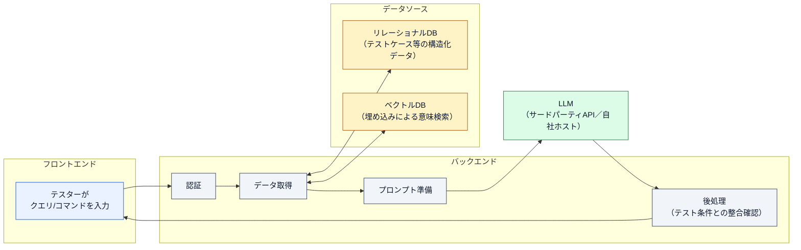

このアーキテクチャは従来のクライアント・サーバーモデルを超えて、次のような知的処理を組み込みます。

1. LLMは単なるサーバーではなく、テストウェアに基づいて解釈・推論する「賢い処理コンポーネント」である
2. ルールベースのチャットボットと異なり、要件・コード・テスト結果といった文脈から動的にテストの洞察を生成する
3. バックエンドは複数のデータソース（構造化データ用のリレーショナルDB、埋め込みによる意味検索用のベクトルDB）を統合する
4. バックエンドはLLMの生の出力を後処理し、フロントエンドに提示する前にテストプロセスの条件と整合させる

#### 4.1.2 Retrieval-Augmented Generation（RAG）（K2）

RAGは、追加のデータソースを応答生成プロセスに組み込むことでLLMの出力の関連性・正確性を高める技法です。

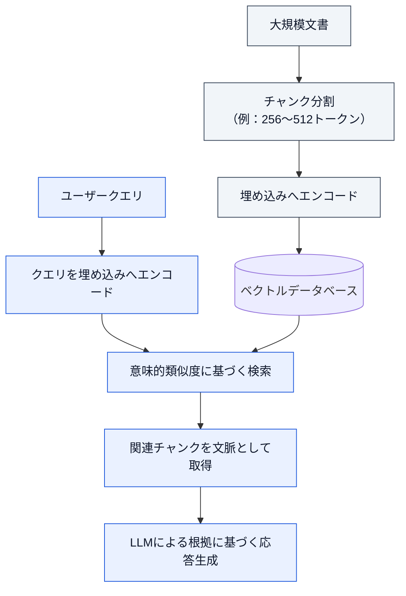

処理は大きく2段階です。

1. **検索（Retrieval）**：ユーザークエリに基づき、事前に作成済みのベクトルデータベースから、プロンプトの埋め込みとチャンクの埋め込みとの意味的類似度により関連情報を取得
2. **生成（Generation）**：取得情報をLLMに与え、既存の知識と新規取得データを組み合わせたより正確で文脈に即した出力を生成

ソフトウェアテストにおいてRAGは、LLM搭載テストインフラが企業内のデータベース・ドキュメント・リポジトリへリアルタイムにアクセスすることを可能にし、テスト分析やテスト設計が最新の仕様・要件・既存テストデータと整合するようにします。

> 💡 **ベストプラクティス**
> チャンクサイズ（256〜512トークン程度）はモデルのコンテキストウィンドウとの兼ね合いで調整し、大きすぎて検索精度が落ちない・小さすぎて文脈が失われないバランスを検証しながら決める。

#### 4.1.3 LLM搭載エージェントの役割（K2）

LLM搭載エージェントは、LLMを核とした半自律的・自律的なタスク処理を目的とした特化型GenAIアプリケーションです。「ツール」と呼ばれる事前定義済み関数群を呼び出すことでシステムに作用し、外部システムとの連携・操作が可能です。

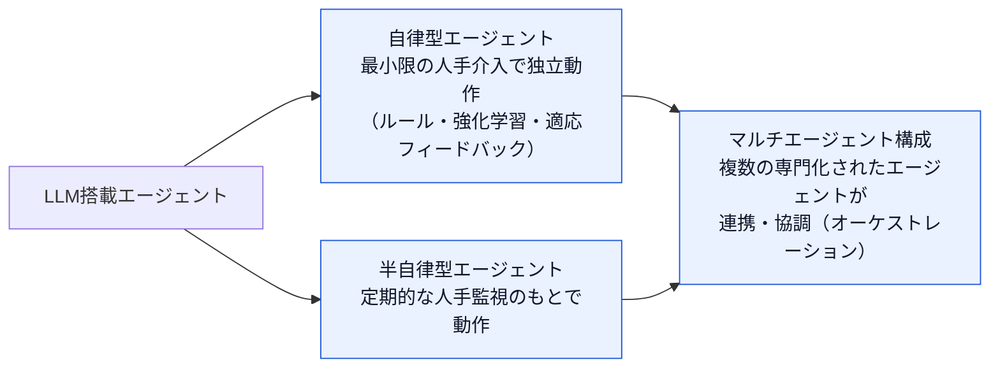

現代のテストツールでは、これらのエージェントがAIアシスタントとしてワークフローに組み込まれ、ユーザーストーリーや要件をテスト成果物へ変換しながら、テスト分析・設計・実装・実行・レポーティングまでを半自律的に自動化する、継続的でエンドツーエンドなワークフローを実現しています。これはスクリプトベースの実行から、目標駆動・エージェントベースの自動化へのシフトを意味します。

ただし、これらのエージェントもLLM由来のハルシネーション・推論エラー・バイアス（3.1参照）を抱える点は変わりません。自動検証手続きの実装や、重要タスクでは半自律型エージェントの採用によってリスクを緩和できます。

> 💡 **ベストプラクティス**
> エージェントに与える「ツール」は最小権限の原則で設計し、重大な判断（本番環境への反映など）が必要なタスクには必ず人手承認のステップ（半自律動作）を残す。

### 4.2 ファインチューニングとLLMOps

#### 4.2.1 ファインチューニング（K2）

ファインチューニングとは、事前学習済みの言語モデル（LLMまたはSLM）を、対象データセットでさらに学習させることで特定タスクやドメインに適応させる手法です。これにより、モデルはドメイン固有の知識・語彙を学習し、対象用途での性能・関連性が向上します。

- 汎用LLMに特定ドメインの専門的な推論能力や独自語彙を持たせる用途に適する
- 計算負荷を抑えたいときはSLMをファインチューニングすることで、LLMと比べ少ない計算リソースで高い性能を狙える
- 例：組織固有のユーザーストーリーとそれに対応するテストケースで学習させ、その組織のテストプロセス・用語に沿った形式でテストケースを生成できるようにする

ファインチューニングの課題としては、高品質でタスク特化型の学習データセットを用いて偏りや不正確さを避けることなどが挙げられます。

> 💡 **ベストプラクティス**
> ファインチューニングはRAG（4.1.2）と競合する手段ではなく補完関係にある。「知識の更新頻度が高い」場合はRAG、「振る舞い・出力形式・語彙をドメインに合わせて恒久的に変えたい」場合はファインチューニング、と使い分けの軸を持つとよい。

#### 4.2.2 LLMOps：生成AIの運用化（K2）

LLMOpsとは、テスト業務でLLMを運用に乗せる際の一連の実践であり、MLOps（機械学習の運用）の考え方をLLM特有の課題（プロンプト管理・非決定性・大規模推論コスト・継続的な品質劣化の監視など）に適用したものです。ファインチューニング（4.2.1）と並び、LLM搭載テストインフラを実運用へ乗せるための中核的な実践に位置づけられます。

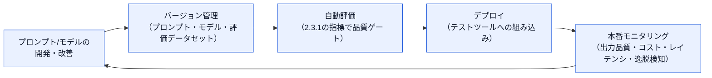

テスト現場でLLMOpsが対象とする主な活動：

- **プロンプト・モデルのバージョン管理**：プロンプトテンプレートやファインチューニング済みモデルを、コードと同様に変更履歴・レビューの対象として管理する
- **継続的な評価**：新しいプロンプト・モデルをリリースする前に、2.3.1で紹介した指標（正確性・実行成功率など）による回帰評価を自動実行する
- **デプロイと統合**：テスト管理ツールやCI/CDパイプラインへLLM機能を組み込む
- **本番モニタリング**：出力品質の劣化、応答レイテンシ、API利用コスト、非決定的挙動による逸脱を継続的に監視する
- **フィードバックループ**：モニタリング結果やテスターからのフィードバックを、プロンプト・モデルの改善サイクルへ還元する

> 💡 **ベストプラクティス**
> プロンプトの変更は通常のソースコード変更と同様に扱い、レビュー・自動評価・段階的ロールアウトを経てから全面展開する運用を確立する。これにより、非決定性に由来する品質のばらつきを本番投入前に検出しやすくなる。

出典：[CT-GenAI Syllabus v1.1 第4章](https://isqi.org/media/b9/8c/34/1777291646/ISTQB-CT-GenAI%20-%20Syllabus%20v1.1.pdf)

---

## 第5章 テスト組織における生成AIの導入と統合（80分）

**キーワード**：なし（本章の一般キーワードはシラバス上明記されていません）

**GenAI固有キーワード**：Shadow AI

### 5.1 生成AI導入のロードマップ

#### 5.1.1 Shadow AIのリスク（K1）

**Shadow AI** とは、組織内で正式承認を得ていないAIツールが利用される状態を指します。セキュリティ・コンプライアンス・データプライバシーに関する重大なリスクを伴います。

| リスク領域 | 内容 | 例 |
|---|---|---|
| 情報セキュリティ・データプライバシーの弱点 | 個人利用のAIツールは機微データ保護に必要な堅牢なセキュリティ対策を欠くことが多く、データ漏えいにつながりうる | テスターが未承認のAIチャットボットに顧客情報を含むテストデータを入力し、顧客データ露出のリスクが生じる |
| コンプライアンス・規制上の問題 | コンプライアンス検証を経ていないAIツールの利用が業界標準・規制への違反を招く | GDPR未対応のAIツールを金融アプリのテストに使用し、規制義務に違反する |
| 知的財産の不明確さ | ライセンス条件が不明確なAIツールが知的財産紛争のリスクを生む | 生成AIが著作権のある学習データを再利用したテストスクリプトを生成し、ライセンス問題を引き起こす |

> 💡 **ベストプラクティス**
> Shadow AIを「取り締まる」だけでなく、承認済みツールへのアクセスを容易にし、明確な利用ガイドラインを周知することで、テスターが未承認ツールに頼る動機自体を減らす。

#### 5.1.2 生成AI戦略の主要側面（K2）

| 側面 | 内容 | 例 |
|---|---|---|
| 測定可能なテスト目標の設定 | GenAIで達成したいことをSMART（具体的・測定可能・達成可能・関連性・期限付き）な目標として定義 | 回帰テスト時間を50%削減する |
| テスト目標とインフラ互換性に合ったLLM選定 | 対象テストタスクに適し、既存インフラとシームレスに統合できるLLMを選ぶ | — |
| 高品質かつ安全でサニタイズされた入力データの確保 | 入力データが正確・完全・機微情報を含まないことを保証する | — |
| 技術的利用法・倫理基準に関する教育の提供 | チームがGenAIを効果的かつ倫理的に使うための知識・スキルを身につける | — |
| 生成AI出力品質の評価指標の確立 | 正確性・関連性など出力品質を測る指標を定義（2.3.1参照） | 正確性、関連性 |
| データ利用・透明性・出力レビューに関するプロセスガイドラインの策定 | データ利用、透明性、生成出力のレビューに関する明確な指針を確立 | — |

#### 5.1.3 テストタスク向けLLM/SLM選定基準（K2）

| 基準 | 内容 |
|---|---|
| モデル性能 | 標準ベンチマークを用いて対象テストタスクにおける性能を評価 |
| ファインチューニング能力 | ドメイン固有データでのファインチューニングのしやすさを評価 |
| 継続コスト | ライセンス費用・APIトークン利用に伴う継続的コストを考慮 |
| ドキュメント・コミュニティサポートの充実度 | 十分なドキュメントとコミュニティサポートが存在するか確認 |

例：あるチームがGPT-4・Claude・オープンソースのLLaMA-3をプロンプトによるテスト生成タスクで比較し、予算と結果品質に基づいて最適なモデルを選定する。

> 💡 **ベストプラクティス**
> 入出力のトークン使用量とタスク実行頻度をベンダー料金と掛け合わせ、継続コストを事前に見積もるハンズオン演習を選定プロセスに組み込むと、導入後の想定外のコスト増を防げる。

#### 5.1.4 生成AI導入のフェーズ（K1）

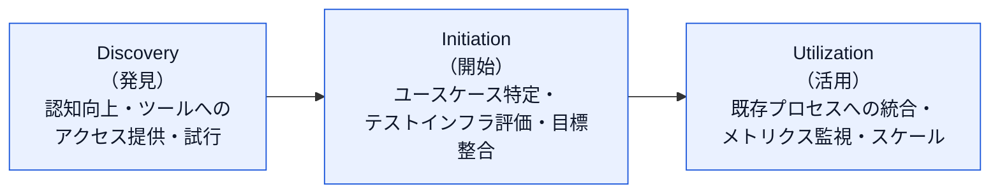

| フェーズ | 内容 | 例 |
|---|---|---|
| Discovery（発見） | 認知向上・ツールへのアクセス提供・試行的ユースケースの探索に注力 | 受け入れ基準生成のサンプルプロンプトを実行してみる |
| Initiation（開始） | 具体的なユースケースの特定、テストインフラの評価、目標の整合 | テスト自動化と欠陥トリアージをパイロット領域として選定 |
| Utilization（活用） | 既存プロセスへのGenAI統合、メトリクスの監視、実装のスケール | CI/CDパイプラインへGenAIを組み込みダッシュボードを整備 |

> 💡 **ベストプラクティス**
> 異なるユースケースはこれらのフェーズを独立して進行しうる点に注意する。あるユースケースがUtilizationに達していても、別のユースケースはまだDiscoveryかもしれない。また、雇用不安などチームの懸念には早期から向き合い、士気を維持することが導入の成否を左右する。

### 5.2 生成AI導入における変更管理

#### 5.2.1 必要なスキルと知識（K2）

テスターが生成AIをテストプロセスで効果的に活用するために必要とされる主なスキル領域：

- **プロンプトエンジニアリングの実践力**：第2章で扱う6要素構造とコア技法を実務で使いこなす力
- **出力の批判的評価力**：生成結果を鵜呑みにせず、ハルシネーション・推論エラー・バイアスを見抜き検証する力（第3章）
- **AI／データリテラシー**：LLMの仕組み・限界・非決定性についての基礎理解
- **テストドメインの専門知識**：GenAIの出力がテスト目的・品質基準に合致しているかを判断できるドメイン知識
- **データプライバシー・セキュリティ意識**：機微データの扱いに関するリスク認識（3.2参照）

#### 5.2.2 テストチームにおける生成AI能力の構築（K1）

- **技術的利用法・倫理基準に関する教育プログラム**の整備（5.1.2の戦略要素と連動）
- **推進役（チャンピオン）や卓越性センター（Center of Excellence）の設置**による知見の集約と横展開
- **実践コミュニティ（community of practice）の形成**による経験・プロンプトライブラリの共有
- **メンタリング・ペアリング**（メタプロンプティングにおける「AIとのペアリング」的発想をチーム内の人同士の学び合いにも応用）

#### 5.2.3 AI対応テスト組織におけるテストプロセスの進化（K1）

生成AIの導入は、単にツールを追加するだけでなく、テストプロセス・役割そのものの再設計を伴います。

- 手動でのテスト実行中心のプロセスから、AIが生成した成果物を**人間が監督・検証する**プロセスへの重心移動
- スクリプトベースの自動化から、目標駆動・エージェントベースの自動化（第4章）へのシフトに伴う、テスト自動化エンジニアの役割変化
- プロンプトエンジニアリングやAI出力レビューといった新しいスキルセットの、既存のテスト役割への統合
- LLMOps（4.2.2）やモデル選定（5.1.3）など、これまでテストチームが直接関与してこなかった運用上の意思決定への関与拡大

> 💡 **ベストプラクティス**
> 変更管理を「一度きりの研修」で終わらせず、Discovery→Initiation→Utilizationの各フェーズに対応した継続的な学習機会と、成功事例の可視化（例：削減できた工数の定量提示）をセットで提供することで、組織全体の定着率を高める。

出典：[CT-GenAI Syllabus v1.1 第5章](https://isqi.org/media/b9/8c/34/1777291646/ISTQB-CT-GenAI%20-%20Syllabus%20v1.1.pdf)、[CT-GenAI公式ページ（第5章要約に基づく二次資料）](https://dev.to/qa-leaders/roadmap-for-the-adoption-of-generative-ai-in-software-testing-4em4)

---

## 学習ロードマップと試験対策のポイント

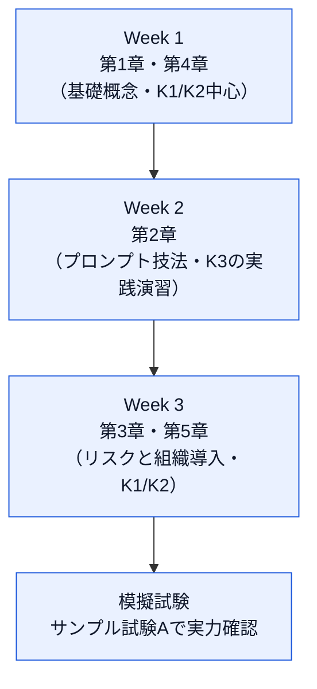

- **配点の重心**：40問46点のうち、プロンプトエンジニアリング（第2章）とリスク管理（第3章）に関連する出題が多くを占めます。特に K3（適用）レベルの問題は主に第2章の「2.2 プロンプトエンジニアリング技法の適用」に集中しているため、単なる暗記でなく実際にプロンプトを書いて試す学習が有効です。
- **キーワードの暗記を軽視しない**：各章冒頭の「GenAI固有キーワード」は学習目標に明記されていなくてもK1（記憶）として出題されます。
- **表形式の内容は対応関係で覚える**：プロンプト技法の使い分け（2.2.5）、評価指標（2.3.1）、攻撃ベクトル（3.2.2）、規制・標準（3.4）などの対応表は、単語単位でなく「状況→技法／リスク→対策」という関係性で覚えると応用問題に強くなります。
- **前提資格を忘れずに**：CT-GenAI受験にはISTQB® CTFL（Foundation Level）の取得が必須です。
- **公式サンプル試験の活用**：公式サイトで配布されているサンプル試験A（問題・解答）で出題形式に慣れておくことを推奨します。

---

## 出典・参考資料

| 資料名 | URL |
|---|---|
| ISTQB CT-GenAI 公式認定ページ | <https://istqb.org/certifications/gen-ai/> |
| CT-GenAI Syllabus v1.1（本ガイドの一次情報源） | <https://isqi.org/media/b9/8c/34/1777291646/ISTQB-CT-GenAI%20-%20Syllabus%20v1.1.pdf> |
| CT-GenAI Syllabus v1.0（比較参照用） | <https://astqb.org/assets/documents/CT-GenAI-Syllabus-v1.0.pdf> |
| CT-GenAI Sample Exam A（問題） | <https://istqb.org/?sdm_process_download=1&download_id=6309> |
| CT-GenAI Sample Exam A（解答） | <https://istqb.org/?sdm_process_download=1&download_id=6301> |
| ISTQB Exam Structures and Rules | <https://istqb.org/?sdm_process_download=1&download_id=3829> |
| ISTQB Exam Structure Tables（章別の出題数・配点） | <https://istqb.org/sdm_downloads/istqb_exam-structure-tables_v1-9-1b-master/> |
| ISO/IEC 42001:2023（AIマネジメントシステム） | <https://www.iso.org/standard/81230.html> |
| ISO/IEC 23053:2022（機械学習AIシステムの枠組み） | <https://www.iso.org/standard/74438.html> |
| EU AI Act（Regulation (EU) 2024/1689） | <https://eur-lex.europa.eu/eli/reg/2024/1689/oj> |
| NIST AI Risk Management Framework 1.0 | <https://www.nist.gov/itl/ai-risk-management-framework> |
| GDPR（Regulation (EU) 2016/679） | <https://eur-lex.europa.eu/eli/reg/2016/679/oj> |
| 第5章ロードマップの理解を補助する二次資料 | <https://dev.to/qa-leaders/roadmap-for-the-adoption-of-generative-ai-in-software-testing-4em4> |

> 注：シラバス本文では上記に加え、プロンプト技法（Schulhoff 2024）、LLMバイアス（Gallegos 2024）、非決定性（Shuyin 2023）、RAG（Zhao 2024）、LLM搭載エージェント（Wang 2024）、LLMOps（Mailach 2024）、ファインチューニング（Parthasarathy 2024）、環境影響（Luccioni 2024a/2024b, Heikkilä 2023, Berthelot 2024）などの学術文献・調査記事が参考文献として引用されています（詳細な書誌情報は公式シラバス第6章「References」を参照してください）。
