# CTAL-TA v4.0 第4章「品質特性のテスト」完全ガイド（初学者向け）

> ISTQB® Certified Tester Advanced Level Test Analyst（CTAL-TA）v4.0 ／ Chapter 4 "Testing Quality Characteristics"
> 対象：CTFL を学んだ直後で、Advanced Level は初めての方

| 項目 | 内容 |
|---|---|
| 対象シラバス | ISTQB® CTAL-TA Syllabus v4.0（表紙の GA 日付は 2025/05/02） |
| 対象章 | 第4章 Testing Quality Characteristics（品質特性のテスト） |
| 章の学習時間 | 60分（シラバス全体 1,215 分のうち約 4.9%） |
| 学習目標（LO） | 4本すべて K2（理解）：TA-4.1.1 ／ TA-4.2.1 ／ TA-4.3.1 ／ TA-4.4.1 |
| 作成日 | 2026-09-19 |
| 形式 | Markdown（フローチャートは mermaid、図解・表は Markdown。ASCII アートは使用しません） |

## 目次

- [0. このガイドの読み方](#0-このガイドの読み方)
  - [0.1 ゴールと学習の進め方](#01-ゴールと学習の進め方)
  - [0.2 信頼度タグの見方](#02-信頼度タグの見方)
  - [0.3 ⚠ このガイドの限界（必ず読んでください）](#03--このガイドの限界必ず読んでください)
  - [0.4 バージョン情報（受験前に確認）](#04-バージョン情報受験前に確認)
- [1. 第4章の全体像](#1-第4章の全体像)
  - [1.1 章の位置づけ](#11-章の位置づけ)
  - [1.2 なぜ TA が品質特性のテストを扱うのか](#12-なぜ-ta-が品質特性のテストを扱うのか)
  - [1.3 ISO/IEC 25010:2023 との対応](#13-isoiec-250102023-との対応)
  - [1.4 v3.1 から v4.0 への用語・構成の変更点](#14-v31-から-v40-への用語構成の変更点)
  - [1.5 キーワード13語（K1：定義を思い出せること）](#15-キーワード13語k1定義を思い出せること)
- [2. 4.1 機能テスト（TA-4.1.1・K2）](#2-41-機能テストta-411k2)
  - [2.1 まず結論：3つの違いを一枚で](#21-まず結論3つの違いを一枚で)
  - [2.2 機能適合性（Functional suitability）とは](#22-機能適合性functional-suitabilityとは)
  - [2.3 3つのサブ特性を詳しく](#23-3つのサブ特性を詳しく)
  - [2.4 見分け方：どの特性の問題か迷ったとき](#24-見分け方どの特性の問題か迷ったとき)
  - [2.5 機能テストの進め方（ステップバイステップ）](#25-機能テストの進め方ステップバイステップ)
  - [2.6 特性ごとの技法の選び方](#26-特性ごとの技法の選び方)
  - [2.7 いつ・どのレベルでテストするか](#27-いつどのレベルでテストするか)
  - [2.8 ベストプラクティス（機能テスト）](#28-ベストプラクティス機能テスト)
  - [2.9 ✅／❌ 対比](#29--対比)
  - [2.10 公式サンプル試験 Q34 の考え方](#210-公式サンプル試験-q34-の考え方)
  - [2.11 4.1 のまとめ](#211-41-のまとめ)
- [3. 4.2 ユーザビリティテスト（TA-4.2.1・K2）](#3-42-ユーザビリティテストta-421k2)
  - [3.1 用語の整理：usability・interaction capability・UX](#31-用語の整理usabilityinteraction-capabilityux)
  - [3.2 インタラクション能力の8つのサブ特性](#32-インタラクション能力の8つのサブ特性)
  - [3.3 TA はユーザビリティテストにどう貢献するか](#33-ta-はユーザビリティテストにどう貢献するか)
  - [3.4 ユーザビリティテスト（利用者テスト）の進め方](#34-ユーザビリティテスト利用者テストの進め方)
  - [3.5 具体例：ECサイトの「初回購入」](#35-具体例ecサイトの初回購入)
  - [3.6 評価手法の使い分け](#36-評価手法の使い分け)
  - [3.7 アクセシビリティ（包括性・ユーザー支援）の扱い](#37-アクセシビリティ包括性ユーザー支援の扱い)
  - [3.8 ベストプラクティス（ユーザビリティテスト）](#38-ベストプラクティスユーザビリティテスト)
  - [3.9 ✅／❌ 対比](#39--対比)
  - [3.10 公式サンプル試験 Q35 の考え方](#310-公式サンプル試験-q35-の考え方)
  - [3.11 4.2 のまとめ](#311-42-のまとめ)
- [4. 4.3 フレキシビリティテスト（TA-4.3.1・K2）](#4-43-フレキシビリティテストta-431k2)
  - [4.1 フレキシビリティ（柔軟性）とは](#41-フレキシビリティ柔軟性とは)
  - [4.2 適応性（Adaptability）テスト](#42-適応性adaptabilityテスト)
  - [4.3 インストール性（Installability）テスト](#43-インストール性installabilityテスト)
  - [4.4 ベストプラクティス（フレキシビリティテスト）](#44-ベストプラクティスフレキシビリティテスト)
  - [4.5 ✅／❌ 対比](#45--対比)
  - [4.6 公式サンプル試験 Q36 の考え方](#46-公式サンプル試験-q36-の考え方)
  - [4.7 4.3 のまとめ](#47-43-のまとめ)
- [5. 4.4 互換性テスト（TA-4.4.1・K2）](#5-44-互換性テストta-441k2)
  - [5.1 互換性（Compatibility）とは](#51-互換性compatibilityとは)
  - [5.2 相互運用性（Interoperability）の定義](#52-相互運用性interoperabilityの定義)
  - [5.3 TA は相互運用性テストにどう貢献するか](#53-ta-は相互運用性テストにどう貢献するか)
  - [5.4 テスト観点](#54-テスト観点)
  - [5.5 相互運用性テストの進め方](#55-相互運用性テストの進め方)
  - [5.6 具体例：ECサイトと決済サービス・在庫システム](#56-具体例ecサイトと決済サービス在庫システム)
  - [5.7 テストダブル・サービス仮想化・契約テスト](#57-テストダブルサービス仮想化契約テスト)
  - [5.8 ベストプラクティス（相互運用性テスト）](#58-ベストプラクティス相互運用性テスト)
  - [5.9 ✅／❌ 対比](#59--対比)
  - [5.10 公式サンプル試験 Q37 の考え方](#510-公式サンプル試験-q37-の考え方)
  - [5.11 4.4 のまとめ](#511-44-のまとめ)
- [6. 機能・サービス別 適用早見表](#6-機能サービス別-適用早見表)
- [7. 試験対策](#7-試験対策)
  - [7.1 混同しやすい概念の比較](#71-混同しやすい概念の比較)
  - [7.2 LO ごとの「これだけは説明できる」ポイント](#72-lo-ごとのこれだけは説明できるポイント)
  - [7.3 公式サンプル試験の第4章（Q34〜Q37）一覧](#73-公式サンプル試験の第4章q34q37一覧)
  - [7.4 自己診断ミニクイズ（💡 筆者作成・公式問題ではありません）](#74-自己診断ミニクイズ-筆者作成公式問題ではありません)
  - [7.5 学習プラン（💡 目安）](#75-学習プラン-目安)
  - [7.6 公式シラバス（44〜47 ページ）通読時のチェックポイント](#76-公式シラバス4447-ページ通読時のチェックポイント)
- [8. 実務チェックリスト](#8-実務チェックリスト)
- [9. 参考文献（根拠ソースの URL）](#9-参考文献根拠ソースの-url)
  - [9.1 ISTQB 公式（一次情報）](#91-istqb-公式一次情報)
  - [9.2 ISO 規格](#92-iso-規格)
  - [9.3 ユーザビリティ・アクセシビリティ](#93-ユーザビリティアクセシビリティ)
  - [9.4 環境・CI・用語（補足）](#94-環境ci用語補足)
  - [9.5 二次情報（学習の補助）](#95-二次情報学習の補助)
- [付録 A：このガイドの記述と根拠の対応（要点）](#付録-aこのガイドの記述と根拠の対応要点)
- [付録 B：用語の対応表（日本語・英語）](#付録-b用語の対応表日本語英語)

---

## 0. このガイドの読み方

### 0.1 ゴールと学習の進め方

この章を学び終えたときに、次の4つを**自分の言葉で説明できる**ことがゴールです。

| LO | レベル | 学習時間の目安（LO 比較表） | 説明できるようになること |
|---|---|---|---|
| TA-4.1.1 | K2 | 15 分 | 機能正確性・機能適切性・機能完全性の**テストの違い** |
| TA-4.2.1 | K2 | 15 分 | テストアナリスト（TA）が**ユーザビリティテストにどう貢献するか** |
| TA-4.3.1 | K2 | 15 分 | TA が**適応性（adaptability）とインストール性（installability）のテストにどう貢献するか** |
| TA-4.4.1 | K2 | 15 分 | TA が**相互運用性（interoperability）のテストにどう貢献するか** |

出典：[ISTQB CTAL-TA v4.0 LO new vs old syllabus（xlsx を PDF 化したもの）](https://istqb.org/?sdm_process_download=1&download_id=6363)


### 0.2 信頼度タグの見方

このガイドでは、内容の根拠の強さを次のタグで区別します。**試験で問われるのは公式文書に書かれていること**なので、タグを意識して読んでください。

| タグ | 意味 | 扱い方 |
|---|---|---|
| 📘 公式根拠 | ISTQB 公式文書（シラバスの取得できた範囲、LO、キーワード、サンプル試験の解説、LO 比較表、リリースノート）や ISO/IEC 25010:2023 の本文で**直接確認できた内容** | 試験対策の軸にしてよい |
| 💡 実務補足 | 筆者による解説・具体例・ベストプラクティス。公式文書の逐語的な記述ではない | 理解の助けとして使い、試験では公式表現を優先 |
| ⚠ 要確認 | 原典の確認が必要な点 | 公式 PDF で必ず裏取りする |

### 0.3 ⚠ このガイドの限界（必ず読んでください）

> **第4章の本文（シラバス PDF の 44〜47 ページ）を、この文書の作成環境では全文取得できませんでした。**
> 取得できたのは PDF の 1〜43 ページと、第4章のタイトル・キーワード・LO の冒頭までです。

そのため、次の方針で作成しています。

1. **確認できた公式情報**を土台にしました：目次（4.1〜4.4）、キーワード、LO、第0〜3章の関連記述（たとえば第3章が第4.1節を参照している箇所）、公式サンプル試験 v4.1 の第4章の問題（Q34〜Q37）の**解説文**、LO 新旧比較表、ISO/IEC 25010:2023 の定義。
2. 本文を直接読めていない部分（典型的な欠陥の一覧、手順の細目など）は **💡 実務補足** と明記しました。
3. **学習の最後に、公式シラバスの 44〜47 ページ（約4ページ）を必ず通読してください。** 差異があれば公式を優先します。

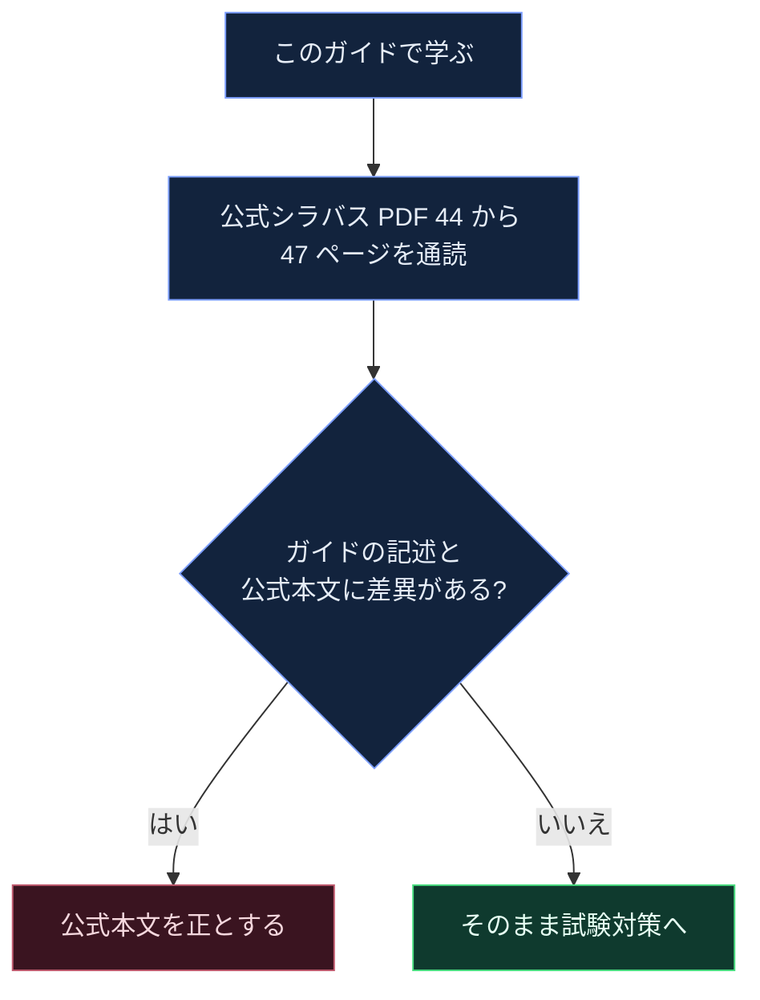

### 0.4 バージョン情報（受験前に確認）

| 項目 | 内容 | 根拠 |
|---|---|---|
| 試験構成 | 45 問・合計 78 点・合格 51 点・120 分（非母国語は +25%） | 📘 [ISTQB 認定ページ](https://istqb.org/certifications/certified-tester-advanced-level-test-analyst/) |
| v3.1 の失効日 | 英語 2026-05-16、英語以外 2026-11-16 | 📘 同上 |
| v4.0 の発効日 | リリースノートでは 2025-05-30 が発効日と記載 | 📘 [リリースノート](https://istqb.org/?sdm_process_download=1&download_id=5762) |
| 日本語で受験する場合 | 提供されている試験バージョンは各国の Member Board（日本は JSTQB）で確認 | ⚠ 要確認 |

---

## 1. 第4章の全体像

### 1.1 章の位置づけ

📘 **第4章の基本情報**

| 項目 | 内容 |
|---|---|
| 章タイトル | Testing Quality Characteristics（60 分） |
| 節構成 | 4.1 Functional Testing ／ 4.2 Usability Testing ／ 4.3 Flexibility Testing ／ 4.4 Compatibility Testing |
| 章の学習内容（シラバス 0.10） | いくつかの種類の**機能テスト**の実施方法、および機能に関する専門知識を使った**非機能テスト**（ユーザビリティ・柔軟性・互換性）への貢献 |
| LO | 4本（すべて K2） |
| キーワード（K1） | 13語（1.5 節に一覧） |

出典：[CTAL-TA v4.0 シラバス](https://istqb.org/?sdm_process_download=1&download_id=5745)（目次、0.10、第4章冒頭）

**配点のイメージ**

- 公式サンプル試験 v4.1 では、第4章に対応する問題は **Q34〜Q37 の4問**（すべて K2・各 1 点）です。
- 4 点 ÷ 78 点 ≒ **5.1%**。学習時間の割合（60 ÷ 1,215 ≒ 4.9%）とほぼ一致します。
- ただし**サンプル試験は本番の配点配分を保証しません**。本番の構成は「Exam Structures and Rules」を確認してください。

出典：[公式サンプル試験 解答 v4.1](https://istqb.org/?sdm_process_download=1&download_id=5759)

**ベストプラクティス**

- 4問しかなくても、合格ラインは 51/78 点です。K2 の 1 点問題は**落としにくい問題**なので、取りこぼさないことが効率的な得点源になります。
- 第4章は「用語の違いを区別する」問題が中心です。1.5 節のキーワードと、第 7 章の比較表を重点的に覚えましょう。

### 1.2 なぜ TA が品質特性のテストを扱うのか

📘 シラバスは TA を次のような役割として定義しています（0.2）。

- 顧客のビジネスニーズに、技術的な側面よりも重点を置く
- 主に**機能テスト**を行い、さらにユーザー志向の**非機能テスト**（ユーザビリティ、適応性、インストール性、相互運用性）にも貢献する
- ホワイトボックスよりも、**ブラックボックス技法と経験ベースのテスト**を使う

第2章では、TA が**プロダクトリスクを品質特性で分類**すること（ISO/IEC 25010:2023 を使用）、そしてリスク軽減策の一つとして「**適切なテストタイプを適用すること**」があり、それは**第4章で扱う**と明記されています。


出典：📘 [シラバス 0.2、2.1、2.2](https://istqb.org/?sdm_process_download=1&download_id=5745)

### 1.3 ISO/IEC 25010:2023 との対応

第4章は ISO/IEC 25010:2023（製品品質モデル）を**枠組み**として使います（シラバス 0.8）。ISO/IEC 25010:2023 は **9つの品質特性**を定義しています。

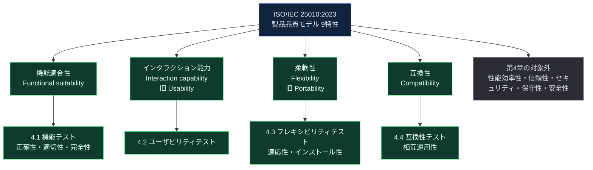

| # | 特性（英語） | 日本語（仮訳） | サブ特性 | 第4章 |
|---|---|---|---|---|
| 1 | Functional suitability | 機能適合性 | 完全性・正確性・適切性 | **4.1** |
| 2 | Performance efficiency | 性能効率性 | 時間効率性・資源効率性・容量 | 対象外 |
| 3 | Compatibility | 互換性 | 共存性・**相互運用性** | **4.4**（LO は相互運用性） |
| 4 | Interaction capability | インタラクション能力 | 適切性の認識・学習性・操作性・ユーザーエラー防止・ユーザーエンゲージメント・包括性・ユーザー支援・自己記述性 | **4.2** |
| 5 | Reliability | 信頼性 | 無欠陥性・可用性・耐障害性・回復性 | 対象外 |
| 6 | Security | セキュリティ | 機密性・完全性・否認防止・責任追跡性・真正性・耐性 | 対象外 |
| 7 | Maintainability | 保守性 | モジュール性・再利用性・解析性・修正性・試験性 | 対象外 |
| 8 | Flexibility | 柔軟性 | **適応性**・拡張性・**インストール性**・置換性 | **4.3**（LO は適応性とインストール性） |
| 9 | Safety | 安全性 | 運用上の制約・リスク特定・フェールセーフ・危険警告・安全な統合 | 対象外 |

- 📘 9特性の名称と、Usability→Interaction capability／Portability→Flexibility への置き換えは ISO の前文で確認済みです。
- 💡 「対象外」は「第4章の LO の対象外」という意味です。TA が性能やセキュリティにまったく関与しないという意味ではありません（第2章のとおり、リスクの分類では TA も関与します）。
- ⚠ 一部のWebサイト（arc42 の一覧）では testability が柔軟性の行に並んで表示されますが、ISO/IEC 25010:2023 では保守性の下位と理解しています。原典で確認してください。

出典：[ISO/IEC 25010:2023（iso.org）](https://www.iso.org/standard/78176.html) ／ [ISO/IEC 25010:2023 プレビュー PDF（iteh）](https://cdn.standards.iteh.ai/samples/78176/13ff8ea97048443f99318920757df124/ISO-IEC-25010-2023.pdf) ／ [arc42 Quality Model：ISO 25010 一覧](https://quality.arc42.org/standards/iso-25010)

### 1.4 v3.1 から v4.0 への用語・構成の変更点

📘 旧版の知識（や古い学習教材）が混ざると混乱しやすいので、違いを整理します。

| 観点 | 旧（ISO 25010:2011／CTAL-TA v3.1） | 新（ISO 25010:2023／CTAL-TA v4.0） | 根拠 |
|---|---|---|---|
| ユーザビリティの特性名 | Usability | **Interaction capability**（第4章のキーワードには usability と interaction capability の両方が残る） | ISO 前文、v4.0 キーワード |
| 移植性の特性名 | Portability | **Flexibility**（LO 比較表：ISO 25010 (2023) に合わせて名称変更） | LO 比較表 |
| アクセシビリティ | Accessibility | **Inclusivity（包括性）と User assistance（ユーザー支援）に分割** | ISO 前文 |
| UI の美しさ | User interface aesthetics | **User engagement** に置き換え | ISO 前文 |
| 成熟性 | Maturity | **Faultlessness（無欠陥性）** に置き換え | ISO 前文 |
| 追加された特性・サブ特性 | — | Safety（特性）、Self-descriptiveness・Inclusivity（インタラクション能力）、Resistance（セキュリティ）、Scalability（柔軟性） | ISO 前文 |
| 章の学習時間 | 180 分（v3.1 の 4 章） | **60 分** | LO 比較表 |
| 機能テストの扱い | 4.2.1〜4.2.3 で技法・欠陥・時期を K2 で3本の LO | 1 本の LO（TA-4.1.1）に**簡素化**。詳細は第3章の技法の説明に移動 | LO 比較表 |
| 学習目標の焦点 | 「対象とする典型的な欠陥を定義する」など | 「**TA がどう貢献するか**を説明する」に書き換え | LO 比較表 |

出典：[ISO/IEC 25010:2023 前文](https://cdn.standards.iteh.ai/samples/78176/13ff8ea97048443f99318920757df124/ISO-IEC-25010-2023.pdf) ／ [LO 新旧比較表](https://istqb.org/?sdm_process_download=1&download_id=6363)

**ベストプラクティス**

- v3.1 の教材（「Portability」「Usability evaluation」などの表現）で学ぶ場合は、v4.0 の用語（Flexibility／Interaction capability）に**読み替える**メモを作りましょう。
- v3.1 が学習目標にしていた「典型的な欠陥の一覧」は、v4.0 では LO から外れています。暗記より「TA が何をするか」を説明できることを優先してください。

### 1.5 キーワード13語（K1：定義を思い出せること）

📘 第4章の冒頭に列挙されたキーワードです。LO に含まれなくても、**用語集（ISTQB Glossary）の名称と定義を思い出せる**ことが求められます（シラバス 0.5）。日本語は仮訳で、正式な訳語は JSTQB 用語集を確認してください。

| # | キーワード | 日本語（仮訳） | 一言でいうと | 定義の根拠 |
|---|---|---|---|---|
| 1 | functional suitability | 機能適合性 | 利用者の明示・暗黙のニーズを満たす機能を提供できる能力 | 📘 ISO 25010:2023 3.1 |
| 2 | functional completeness | 機能完全性 | 特定されたタスクと利用者の目的を**すべて**カバーする機能がある | 📘 ISO 3.1.1 |
| 3 | functional correctness | 機能正確性 | **正確な結果**を提供できる（精度も含む） | 📘 ISO 3.1.2 |
| 4 | functional appropriateness | 機能適切性 | タスクや目的の達成を**助ける**機能である（不要な手順がない） | 📘 ISO 3.1.3 |
| 5 | functional testing | 機能テスト | 機能適合性を評価するテスト | 💡 用語集で確認 |
| 6 | usability | ユーザビリティ（使用性） | 利用者が目標を効果的・効率的・満足して達成できる度合い | 💡 用語集／ISO 25019 |
| 7 | interaction capability | インタラクション能力 | 利用者が UI を介して情報をやりとりし、タスクを完了できる能力（**旧 usability**） | 📘 ISO 3.4 |
| 8 | user experience | ユーザーエクスペリエンス（UX） | 製品の利用（または利用の予期）によって生じる人の知覚や反応 | 💡 用語集／ISO 9241-210 で確認 |
| 9 | flexibility | 柔軟性 | 異なる、または変化する環境に適応できる度合い（**旧 portability**） | 💡 ISO 25010:2023 |
| 10 | adaptability | 適応性 | 異なる環境に**適応**できる | 💡 用語集で確認 |
| 11 | installability | インストール性 | 指定環境に**インストール／アンインストール**できる | 💡 用語集で確認 |
| 12 | compatibility | 互換性 | 他製品と情報を交換できる、または同じ環境や資源を共有しながら機能を果たせる | 📘 ISO 3.3 |
| 13 | interoperability | 相互運用性 | 他製品と情報を**交換し、その情報を相互に利用**できる | 📘 ISO 3.3.2、サンプル試験 Q37 の解説 |

出典：[シラバス 第4章 Keywords](https://istqb.org/?sdm_process_download=1&download_id=5745) ／ [ISO/IEC 25010:2023 プレビュー](https://cdn.standards.iteh.ai/samples/78176/13ff8ea97048443f99318920757df124/ISO-IEC-25010-2023.pdf) ／ [ISTQB Glossary](https://glossary.istqb.org/)

**覚え方のコツ（💡）**：4.1 の3特性は「**正（correctness）・適（appropriateness）・完（completeness）**」の3文字で覚えます。


---
## 2. 4.1 機能テスト（TA-4.1.1・K2）

> **LO TA-4.1.1（K2）**：機能正確性・機能適切性・機能完全性のテストを**区別できる**（Differentiate）

### 2.1 まず結論：3つの違いを一枚で

| | 機能正確性<br/>Functional correctness | 機能適切性<br/>Functional appropriateness | 機能完全性<br/>Functional completeness |
|---|---|---|---|
| 一言で | **正しく**動くか | タスクの達成に**役立つ**か | 必要な機能が**漏れなく**あるか |
| ISO 25010:2023 の定義 📘 | 利用者が使ったとき**正確な結果**を返す能力（精度も含む） | 指定されたタスクや目的の達成を**促進する**機能を提供する能力 | 特定されたタスクと利用者の目的を**すべてカバーする**機能を提供する能力 |
| 確かめる問い | 出力・計算・状態遷移は期待どおりか | 手順は必要十分か。不要な手順や役に立たない選択肢はないか | 要件・利用者の目的に対して、機能の抜けはないか |
| 典型的な不具合 💡 | 計算ミス、絞り込み条件の誤り、境界値の誤判定 | 意味の薄い選択肢、余計な確認画面、タスクに不要な入力 | 要件にある機能が未実装、データの更新はできるが削除できない |
| 主な検証の視点 | 仕様との**一致** | 利用者の**目的への適合** | 要求に対する**網羅** |

出典：📘 [ISO/IEC 25010:2023 3.1〜3.1.3](https://cdn.standards.iteh.ai/samples/78176/13ff8ea97048443f99318920757df124/ISO-IEC-25010-2023.pdf)（定義・注記・例）／ [公式サンプル試験 解答 v4.1 Q34](https://istqb.org/?sdm_process_download=1&download_id=5759)

ISO の注記には、機能適合性は「機能が**明示・暗黙のニーズ**を満たすか」だけでなく「**機能仕様**を満たすか」にも関わる、とあります。つまり「仕様どおりか」と「ニーズに合うか」の**両方**を見る特性です。

### 2.2 機能適合性（Functional suitability）とは

- 📘 ISO/IEC 25010:2023：指定された条件で使用したとき、**明示された、および暗黙のニーズ**を満たす機能を提供する製品の能力。
- 📘 第1章の導入：TA は品質特性のうち、まず**機能適合性**に専門性を持ちます。TA が主に担当するテストレベルは、システムテスト・受け入れテスト・システム統合テストです。
- 💡 機能テストは「ボタンを押して画面が変わるか」だけではありません。**要件に書かれていない暗黙のニーズ**（たとえば「検索結果は関連度順に並ぶはず」）も対象になります。

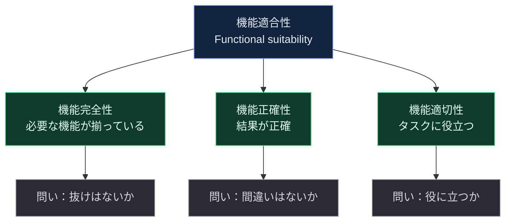

### 2.3 3つのサブ特性を詳しく

#### 2.3.1 機能正確性（Functional correctness）

**定義**：📘 利用者が使用したとき、**正確な結果**を提供できる能力。精度（precision）は正確性の属性の一つで、科学計算ソフトのように高い精度が必要な製品では、必要な桁数まで正確であることが求められます。

**なぜ重要か**：💡 結果が間違っていると、利用者は誤った判断・誤った金額・誤ったデータを受け取ります。金融・医療・会計のように、誤りがそのまま損害に直結する領域ではもっとも優先度が高い特性です。

**具体例（ECサイト）**

- 送料無料の判定：合計 5,000 円以上で無料 → 4,999 円と 5,000 円で判定が変わる
- 消費税の計算：端数処理（切り捨て・四捨五入）が仕様どおりか
- 絞り込み検索：「価格 1,000 円以上 3,000 円以下」で結果が条件どおりか（サンプル試験 Q34 が「絞り込み機能の正しさ」を正確性の例として挙げている 📘）

**ポイント**：仕様（期待結果＝テストオラクル）と**実際の結果を比べる**ことが基本です。オラクルが作りにくい場合の対策は第1章 1.3.4 にあります（疑似オラクル、メタモルフィックテストなど 📘）。

#### 2.3.2 機能適切性（Functional appropriateness）

**定義**：📘 指定されたタスクや目的の**達成を促進する**機能を提供できる能力。ISO の例では「**必要十分なステップ**を提供し、不要なステップを含まない」ことが挙げられています。ISO 9241-110 の「タスクへの適合性（suitability for the task）」に相当します。

**なぜ重要か**：💡 仕様どおりに正しく動いていても、利用者の目的に対して**遠回り**だったり**役に立たなかったり**すれば、製品としての価値が下がります。仕様の妥当性そのものを疑う観点で、レビューや利用者の声から見つかることが多い特性です。

**具体例（ECサイト）**

- 商品カテゴリの一覧が、利用者にとって探しやすい分類になっているか（サンプル試験 Q34 が**適切性の例**として挙げている 📘）
- 購入完了までに、目的に不要な入力項目や確認画面がないか
- 「注文履歴」を見たい利用者が、ログイン後に何ステップで到達できるか

**正確性との違い**：💡 正確性は「間違っていないか」、適切性は「**間違っていなくても、役に立つか**」です。仕様どおりなのに使えない場合は、適切性の問題である可能性が高いです。

#### 2.3.3 機能完全性（Functional completeness）

**定義**：📘 特定されたタスクと利用者の目的を**すべてカバー**する機能一式を提供できる能力。

**なぜ重要か**：💡 機能が**存在しない**ことは、テストを実行しても見つかりません（実行するものがないため）。要件・ユースケース・データのライフサイクルと突き合わせる**網羅の確認**が必要です。

**具体例（ECサイト）**

- 要件に「領収書の発行」があるのに、画面から発行できない
- 住所を「登録」「参照」「更新」できるのに、「削除」できない（CRUD の欠落）
- 返品の申請はできるが、返品状況を確認する機能がない

**第3章との接続 📘**：CRUD テストの**完全性テスト（completeness testing）**は静的テストで、すべてのエンティティに C・R・U・D の全操作が存在するかを確認し、**操作の欠落は調査が必要な異常**とされます（シラバス 3.2.1）。また第3章 3.5.1 は、振る舞いベースの技法が**機能の欠落**（missing features）のような欠陥を見つけやすいと述べています。

### 2.4 見分け方：どの特性の問題か迷ったとき

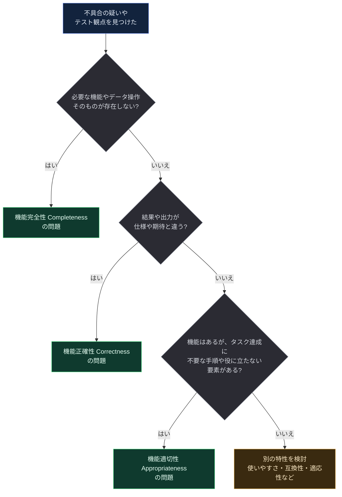

**間違えやすいペア（💡）**

| 迷う例 | 正しい分類 | 理由 |
|---|---|---|
| 送料の計算結果が 1 円ずれる | 正確性 | 結果が間違っている |
| 「削除」ボタン自体がない | 完全性 | 機能が存在しない |
| 削除の前に確認画面が3回出る | 適切性（または使いやすさ） | 不要なステップが多い。ステップの分かりにくさや操作感が主なら 4.2 |
| ボタンの文言が分かりにくい | 使いやすさ（4.2） | 機能の有無・結果ではなく、認識・操作の問題 |
| 他システムに注文データが渡らない | 相互運用性（4.4） | 機能単体ではなく、システム間の情報交換の問題 |

### 2.5 機能テストの進め方（ステップバイステップ）


| Step | やること | 根拠・補足 |
|---|---|---|
| 1 | テストベース（要件、ユーザーストーリー、受け入れ基準、有識者の知識）を集める。会話で得た情報も含める | 📘 シラバス 1.2.1（口頭情報もテストベースに含める）。💡 暗黙のニーズは有識者へのヒアリングで補う |
| 2 | テスト条件を、まず「画面 x の機能」のような**高レベル**で、次に「画面 x は 1 桁足りない口座番号を拒否する」のように**詳細**に定義する | 📘 シラバス 1.2.1。アジャイルでは受け入れ基準として表現できる |
| 3 | 各テスト条件を、正確性・適切性・完全性のどれを確かめるものか**振り分ける**（複数に該当してよい） | 💡 実務補足 |
| 4 | 特性ごとに適切な技法を選ぶ（2.6 節） | 📘 第3章 |
| 5 | 高レベルテストケースから低レベルへ具体化し、テストデータを用意。**ロジックとデータを分離**する | 📘 シラバス 1.3.1、1.3.5 |
| 6 | 実行して実際の結果と期待結果を比較し、異常の原因を分析する（テストスクリプトや環境の欠陥、仕様の誤解の可能性も） | 📘 シラバス 1.2.4 |
| 7 | テストベースとのトレーサビリティを更新し、結果をリスクやカバレッジの情報に変換する | 📘 シラバス 1.2.4 |

### 2.6 特性ごとの技法の選び方

第3章は「**どの欠陥を狙うか**でテスト技法を選ぶ」考え方を示しています。

- 📘 データベースの技法：データ処理・ドメイン実装・UI・計算・パラメータの組み合わせの欠陥
- 📘 振る舞いベースの技法：機能の欠落・コミュニケーション・処理の欠陥
- 📘 ルールベースの技法：ロジックと制御フローの欠陥

これを 4.1 の3特性に当てはめると、次のようになります（💡 対応づけは実務的な整理）。

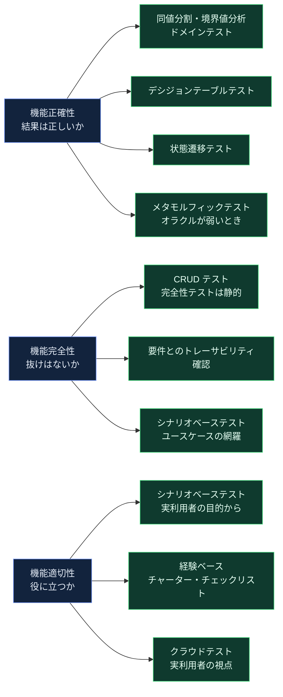

| 特性 | 主な技法（第3章） | 何を確かめるか | 根拠 |
|---|---|---|---|
| 正確性 | 同値分割・境界値分析・ドメインテスト（3.1.1）、デシジョンテーブル（3.3.1）、状態遷移（3.2.2）、メタモルフィック（3.3.2） | 計算・判定・状態ごとの結果・ルールの正しさ | 📘 技法の説明は第3章。特性との対応づけは 💡 |
| 完全性 | CRUD テストの完全性テスト（3.2.1）、シナリオベース（3.2.3）、要件・ユースケースとのトレーサビリティ | 機能・操作・シナリオの抜け | 📘 3.2.1、3.5.1。トレーサビリティの位置づけは 1.2.2 |
| 適切性 | シナリオベース（3.2.3）、セッションベース（3.4.1）、チェックリスト（3.4.2）、クラウドテスト（3.4.3） | 実利用者の目的に対する有用性、手順の必要十分さ | 📘 3.2.3 は「システムの機能適合性を利用者の視点で見るエンドツーエンドテスト」と説明。3.4.3 は「実利用者の視点」を利点に挙げる |

**この節のポイント**：📘 第3章 3.2.3 は、シナリオベーステストを「**機能適合性（第4.1節参照）を、利用者の視点から見るエンドツーエンドのテスト**」と説明しています。4.1 と 3.2.3 は**つながっている**ので、セットで理解しましょう。

出典：[シラバス 3.1〜3.5](https://istqb.org/?sdm_process_download=1&download_id=5745)

### 2.7 いつ・どのレベルでテストするか

- 📘 TA が主に担当するのは、**システムテスト、受け入れテスト、システム統合テスト**です（シラバス 1 章の導入）。
- 📘 アジャイルでは、テスト条件を**受け入れ基準**として表現できます（1.2.1）。
- 📘 **シフトレフト**の考え方で、リスク軽減に最も早く効くテスト活動（レビューなどの静的テスト）を示します（2.1）。**完全性の欠落は、要件やユースケースのレビューで最も早く見つけられます**（💡）。

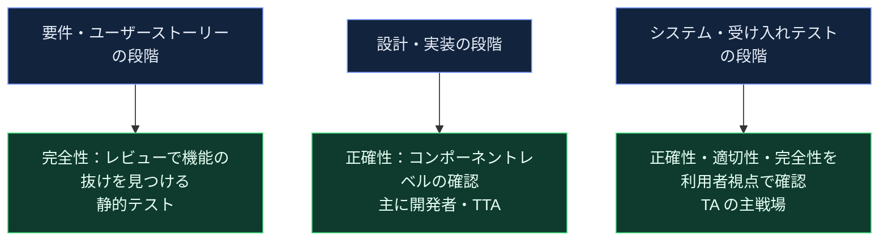

### 2.8 ベストプラクティス（機能テスト）

**ベストプラクティス（全体）**

- **トレーサビリティを保つ**：要件 → テスト条件 → テストケース → 結果をたどれるようにします。完全性の確認（要件に対する網羅）はこれが前提です（📘 シラバス 1.2.2、1.2.4）。
- **仕様の適合とニーズの適合を分けて記録する**：正確性の欠陥は「仕様との差」、適切性・完全性の欠陥は「ニーズや目的との差」であることが多く、修正の相談先（開発者か、プロダクトオーナーか）が変わります（💡）。
- **暗黙のニーズを言語化する**：「当然こうなるはず」という期待を、有識者へのインタビューやペルソナから拾い、テスト条件にします（💡。ペルソナの活用は 📘 1.3.5 のテストデータの説明にも登場）。
- **リスクに応じて厚みを変える**：重要度が高い機能ほど厳密なカバレッジ（例：ペアワイズよりすべての組み合わせ）、低い場合は経験ベースで軽く（📘 シラバス 3.5.1）。

**ベストプラクティス（正確性）**

- 期待結果（テストオラクル）を**独立して**用意する：仕様書、レガシーシステム（疑似オラクル）、メタモルフィック関係など（📘 1.3.4）。
- 精度が要件になる機能では、**許容誤差と桁数**をテスト条件に含める（📘 ISO の注記で精度は正確性の属性）。
- 境界値は **ON／OFF／IN／OUT 点**の考え方で漏れなく選ぶ（📘 3.1.1 ドメインテスト）。

**ベストプラクティス（適切性）**

- 実利用者の**操作パターン（オペレーショナルプロファイル）とペルソナ**からシナリオを作る（📘 サンプル試験 Q35 の解説が使用を示唆。3.2.3 も、ユーザー調査・ペルソナ・ジャーニーマップを挙げる）。
- 手順数を**測る**：目的達成までのクリック数・画面数を記録し、要件やベースラインと比べる（💡）。
- 客観的な判断が難しいため、**複数の利用者視点**（クラウドテスト、受け入れテスト）を組み合わせる（📘 3.4.3）。

**ベストプラクティス（完全性）**

- **CRUD マトリクス**を作り、エンティティごとに C・R・U・D の欠落を静的に確認する（📘 3.2.1）。
- ユースケースの**主シナリオ・拡張・例外**がすべて実装されているか確認する（📘 3.2.3）。
- 要件レビューの段階で、「この目的を達成するために足りない機能はないか」を**利用者の目的**から逆算して確認する（💡）。

出典：[シラバス 1.2、1.3、3.1、3.2、3.5](https://istqb.org/?sdm_process_download=1&download_id=5745)

### 2.9 ✅／❌ 対比

| 観点 | ❌ 悪い例 | ✅ 良い例 |
|---|---|---|
| 特性の切り分け | 「不具合＝正確性」とだけ分類する | 正確性・適切性・完全性のどれかを明示して記録する |
| 期待結果 | 開発者が書いた実装を見て期待結果を決める | 仕様・有識者・独立したオラクルから決める |
| 完全性 | 実装済みの機能だけをテストする | 要件・ユースケース・CRUD と突き合わせて**抜け**を探す |
| 適切性 | テスト担当者の感覚だけで「使いにくい」と報告する | ペルソナ・実利用者の観察・手順数などの根拠を添える |
| テストケース | 期待結果が「正しく動く」だけ | 具体的な値・状態を期待結果に書く（📘 1.3.2 の「正確さ・完全性」基準） |

### 2.10 公式サンプル試験 Q34 の考え方

📘 公式サンプル試験 v4.1 の Q34（LO：TA-4.1.1・K2）は、次のような**具体的なテスト活動がどの種類のテストか**を選ばせる問題です。解説文の要点は次のとおりです（設問の全文は公式資料で確認してください）。

| 解説から読み取れる選択肢の内容 | 解説が示す分類 |
|---|---|
| 分類のカテゴリが利用者にとって役立つかを確認する | **機能適切性**のテスト |
| フィルタ機能の正しさを確認する | **機能正確性**のテスト（正解） |
| 2つのシステム間のやりとりを確認する | **相互運用性**のテスト |
| インタフェースの学習しやすさや見た目を確認する | **ユーザビリティ**のテスト |

**解き方**：活動の**目的語**を見ます。「役に立つか」なら適切性、「正しいか」なら正確性、「システム間」なら相互運用性、「学習しやすさ・見た目」ならユーザビリティです。

出典：[公式サンプル試験 解答 v4.1 Q34](https://istqb.org/?sdm_process_download=1&download_id=5759)

### 2.11 4.1 のまとめ

- 機能適合性 ＝ 完全性（漏れなく）＋正確性（正しく）＋適切性（役に立つ）。
- 3つは**確かめる問いが違う**：抜けはないか／間違いはないか／役に立つか。
- 完全性は**存在しないものを探す**ので、静的なレビュー・CRUD マトリクス・トレーサビリティが有効。
- 適切性は**利用者の目的**が基準なので、シナリオ・ペルソナ・実利用者が有効。
- 第3章の技法（特にシナリオベースと CRUD）と**つなげて**理解する。

---
## 3. 4.2 ユーザビリティテスト（TA-4.2.1・K2）

> **LO TA-4.2.1（K2）**：テストアナリストが**ユーザビリティテストにどう貢献するか**を説明できる（Explain）

### 3.1 用語の整理：usability・interaction capability・UX

第4章のキーワードには、**usability・interaction capability・user experience** の3語が並びます。混同しやすいので、まず関係を整理します。

| 用語 | 何を指すか | 根拠 |
|---|---|---|
| **Interaction capability**（インタラクション能力） | 製品が、利用者と UI を介して情報をやりとりし、意図したタスクを完了できる**製品側の能力**。旧 Usability を置き換えた特性名 | 📘 ISO/IEC 25010:2023 3.4 |
| **Usability**（ユーザビリティ） | 利用の**結果**として、利用者が目標を効果的・効率的・満足して達成できたか（quality-in-use モデル：ISO/IEC 25019） | 📘 ISO 3.4 の注記 |
| **User experience**（UX） | 製品の利用（や利用の予期）によって生じる、人の知覚や反応 | 💡 用語集／ISO 9241-210 で確認（⚠） |

ISO の注記には、「**インタラクション能力はユーザビリティの前提条件**」とあります。つまり、製品側がインタラクション能力を備えていて、はじめて利用の結果としてのユーザビリティが得られます。


出典：[ISO/IEC 25010:2023 プレビュー（3.4 と注記）](https://cdn.standards.iteh.ai/samples/78176/13ff8ea97048443f99318920757df124/ISO-IEC-25010-2023.pdf)

### 3.2 インタラクション能力の8つのサブ特性

📘 ISO/IEC 25010:2023 のサブ特性名は arc42 の一覧と ISO 前文で確認できます。定義文は、下表の上から4つ（★）を ISO の本文で確認しました。残り4つは 💡 平易な言い換えです（原典で確認してください）。

| # | サブ特性（英語） | 日本語（仮訳） | 意味 | テスト観点の例（💡） |
|---|---|---|---|---|
| 1 | Appropriateness recognizability ★ | 適切性の認識 | 利用者が、その製品が自分のニーズに合うと**認識できる**（初期の印象・説明・ホームページなどから） | トップ画面やデモで「何ができる製品か」が伝わるか |
| 2 | Learnability ★ | 学習性 | 指定された利用者が、**指定の時間内**に機能の使い方を学べる | 初回利用者が説明なしで主要タスクを完了できるまでの時間 |
| 3 | Operability ★ | 操作性 | 機能や属性が**操作・制御しやすい**（制御のしやすさ、期待との一致、マウスやペンなどの入力装置の効率にも関係） | キーボード操作、戻る・取り消し、操作の一貫性 |
| 4 | User error protection ★ | ユーザーエラー防止 | **操作ミスを防ぐ** | 入力チェック、確認ダイアログ、取り消し（Undo）、危険操作の誤クリック防止 |
| 5 | User engagement | ユーザーエンゲージメント | 魅力的で、継続して使いたくなる提示（旧 UI aesthetics に相当） | 視覚デザインの一貫性、快適さ |
| 6 | Inclusivity | 包括性 | 多様な背景（言語・文化・年齢・能力など）の人が使える | 多言語、文字サイズ、色覚への配慮 |
| 7 | User assistance | ユーザー支援 | 幅広い能力の人が使えるようにする支援（旧 accessibility の一部） | スクリーンリーダー対応、キーボードのみでの操作 |
| 8 | Self-descriptiveness | 自己記述性 | 説明書に頼らずとも、必要なときに必要な情報が提示され、使い方が分かる | ラベル、ヘルプ、エラーメッセージの分かりやすさ |

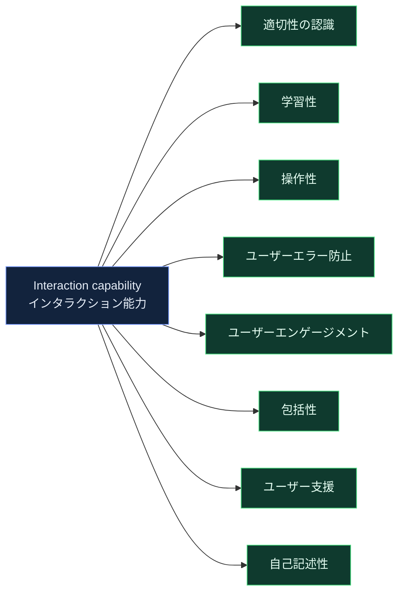

出典：[ISO/IEC 25010:2023 プレビュー](https://cdn.standards.iteh.ai/samples/78176/13ff8ea97048443f99318920757df124/ISO-IEC-25010-2023.pdf)（★の定義）／ [arc42：ISO 25010 の特性一覧](https://quality.arc42.org/standards/iso-25010)（サブ特性名）／ [arc42：2023 版の変更点](https://quality.arc42.org/articles/iso-25010-update-2023)

### 3.3 TA はユーザビリティテストにどう貢献するか

📘 LO 比較表は、この LO を「**言い換えて簡素化し、専門資格 CT-UT との重複を減らした**」と説明しています。つまり Advanced Level TA では、ユーザビリティの**深い専門技法**ではなく、**TA の強み（業務知識・機能知識・シナリオ設計）を使った貢献**が問われます。

公式サンプル試験 Q35 の解説から、TA の貢献として次の点が読み取れます（📘）。

| # | TA の貢献 | 根拠となる解説の要点 |
|---|---|---|
| 1 | **オペレーショナルプロファイル（利用パターン）とペルソナ**を使い、実際の利用を反映した**シナリオ**を作る | 正解の選択肢の内容 |
| 2 | セッションの参加者は、**対象となる利用者グループの特性**を代表する実利用者にする（最も経験豊富な人ばかりを選ばない） | 誤答 a の否定理由 |
| 3 | 参加者を TA 自身で代用しない。**組織の利用者**が参加する | 誤答 b の否定理由 |
| 4 | 参加者を**訂正・誘導せず、観察**する（助けると、実際の利用での効率や有効性を正しく評価できない） | 誤答 c の否定理由 |

💡 さらに、TA が日常的に行える貢献を実務として補足します。

- 要件や UI 設計を**レビュー**して、学習性・操作性・エラー防止の問題を早期に指摘する（静的テスト）
- 機能テストの結果や不具合の傾向から、使いにくい箇所（誤操作が多い画面）を指摘する
- ヒューリスティクスやチェックリストを使った**専門家評価**を行う（3.6 節）
- 利用者テストの**タスク設計・データ準備・実施・記録**を支える

出典：[公式サンプル試験 解答 v4.1 Q35](https://istqb.org/?sdm_process_download=1&download_id=5759) ／ [LO 新旧比較表](https://istqb.org/?sdm_process_download=1&download_id=6363)

### 3.4 ユーザビリティテスト（利用者テスト）の進め方

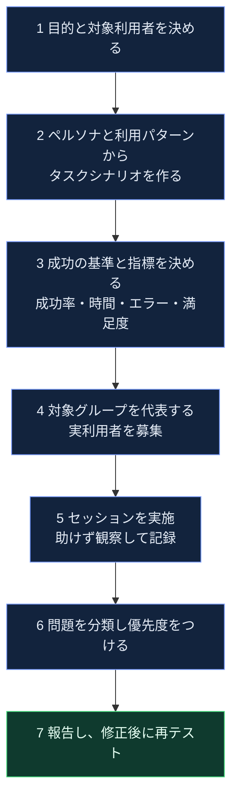

| Step | やること | 補足 |
|---|---|---|
| 1 | 何を判断するための調査か（新規機能の受容性、フロー改善など）と、対象利用者を決める | 💡 目的が曖昧だと結果が使えない |
| 2 | ペルソナとオペレーショナルプロファイルから、現実的なタスクシナリオを作る | 📘 Q35 の解説 |
| 3 | 指標を事前に決める：**タスク成功率、所要時間、エラー数、主観的満足度** | 💡 効果（成功率）・効率（時間）・満足（アンケート）に対応 |
| 4 | 対象利用者グループの**属性**（経験、年齢、環境など）で参加者を選ぶ | 📘 Q35 の解説 |
| 5 | 参加者に**タスクを与え、観察**する。声かけで誘導しない | 📘 Q35 の解説 |
| 6 | 見つかった問題を、影響（タスク失敗か遅延か）と頻度で優先度づけ | 💡 |
| 7 | 修正案とともに報告し、修正後に**再テスト**して改善を確認 | 💡 |

### 3.5 具体例：ECサイトの「初回購入」

**ペルソナ（💡 例）**：田中さん（50 代・スマートフォンで初めてネットショッピングをする）／ 佐藤さん（30 代・PC で日常的に購入する）

| タスク | 成功基準 | 指標 |
|---|---|---|
| 会員登録して、商品を 1 つカートに入れる | 説明なしで完了 | 完了率、所要時間、つまずいた画面 |
| クーポンコードを入力して注文を確定する | 割引が適用されて確定 | 入力エラー回数、ヘルプ参照の有無 |
| 誤って入れた商品をカートから取り除く | 操作 3 回以内に完了 | 迷いの回数、取り消しの発見のしやすさ |

**チャーターの書き方（📘 3.4.1 の形式）**：

- 形式：「Explore [対象] With [資源] To discover [情報]」
- 例：**Explore 会員登録から初回購入までのフロー With 上記 2 つのペルソナとスマートフォン実機 To discover 学習しにくい箇所と、入力エラーから回復しにくい箇所**

### 3.6 評価手法の使い分け

| 手法 | 内容 | 向く場面 | 根拠 |
|---|---|---|---|
| 利用者テスト | 実利用者に代表タスクをやってもらい観察 | 学習性・操作性を実際の行動で確認 | 📘 Q35 |
| チェックリストベース | ヒューリスティクスなどをチェックリスト化して確認 | 短時間で広く網羅、専門家評価 | 📘 3.4.2、💡 ヒューリスティクス |
| セッションベース（探索的） | チャーターで範囲と目的を決めて探索 | 新機能の UX 検証、仕様が固まっていない段階 | 📘 3.4.1 |
| クラウドテスト | 多様な実利用者に分散して実施 | 多様な端末・環境・利用者の意見を集める | 📘 3.4.3 |
| アンケート型指標 | 利用後に満足度を尺度で測る | 主観的満足の定量化 | 💡 SUS など。⚠ v3.1 では SUMI／WAMMI が例示されていた（ANZTB の資料） |

**ヒューリスティクス評価に使えるチェックリスト（💡）**：Jakob Nielsen の「ユーザーインターフェース設計の 10 ヒューリスティクス」は、次のような観点を挙げています。

| # | 観点 | 意味 | 対応するサブ特性（💡） |
|---|---|---|---|
| 1 | システム状態の可視性 | 適切なフィードバックを合理的な時間内に返す | 自己記述性 |
| 2 | システムと実世界の一致 | 利用者の言葉・概念で話す | 適切性の認識・学習性 |
| 3 | ユーザーの制御と自由 | 間違えたときの「非常口」、Undo／Redo | ユーザーエラー防止・操作性 |
| 4 | 一貫性と標準 | 同じ意味は同じ表現、慣習に従う | 操作性・学習性 |
| 5 | エラーの防止 | 問題が起きる前に防ぐ、確認を挟む | ユーザーエラー防止 |
| 6 | 再生より再認 | 記憶に頼らず、選択肢を見えるように | 操作性 |
| 7 | 柔軟性と効率 | 初心者にも熟練者にも合う近道 | 操作性 |
| 8〜10 | ミニマルなデザイン／エラーの認識・診断・回復／ヘルプとドキュメント | 情報の取捨、分かるエラー、必要な支援 | 自己記述性・ユーザー支援 |

出典：[Nielsen Norman Group：10 Usability Heuristics](https://nngroup.com/articles/ten-usability-heuristics/)

### 3.7 アクセシビリティ（包括性・ユーザー支援）の扱い

- 📘 ISO/IEC 25010:2023 は、旧 accessibility を**包括性（Inclusivity）とユーザー支援（User assistance）に分割**しました。
- 📘 シラバス第3章のサンプル問題（Q29）は、ゲームの**アクセシビリティ**（読字に困難がある人、視覚障害のある人）を確認するチェックリスト項目を作らせる問題で、**「はい／いいえ／該当なし」で答えられる項目**にする点が重要とされています。
- 💡 実務では、W3C の WCAG（Web Content Accessibility Guidelines）が、Web の達成基準の代表的な参照先です（⚠ 本ガイドでは原典を再取得していません）。

出典：[公式サンプル試験 解答 v4.1 Q29](https://istqb.org/?sdm_process_download=1&download_id=5759) ／ [W3C：WCAG 2.2](https://www.w3.org/TR/WCAG22/)

### 3.8 ベストプラクティス（ユーザビリティテスト）

**ベストプラクティス**

- **実利用者を代表する参加者**を選ぶ：TA 自身や開発者では代用しない（📘 Q35）。
- **観察に徹する**：参加者がつまずいても助けない。助けが必要だった事実を記録する（📘 Q35）。
- **タスクは目的で書く**：「ボタン A を押す」ではなく「クーポンを使って注文する」のように、利用者の目的で書く（💡）。
- **成功基準を事前に決める**：完了率、時間、エラー数などを、テスト前に定義する（💡）。
- **早い段階から**：完成後だけでなく、ワイヤーフレームやプロトタイプの段階で試す（💡 シフトレフト。📘 2.1 のシフトレフトの考え方）。
- **チェックリストを育てる**：見つかった問題をチェックリストに追加して再利用する（📘 3.4.2）。
- **多様性を確保する**：クラウドテストで、端末・環境・利用者のバリエーションを補う（📘 3.4.3）。

### 3.9 ✅／❌ 対比

| 観点 | ❌ 悪い例 | ✅ 良い例 |
|---|---|---|
| 参加者 | 開発チームの詳しい人だけで確認する | 対象利用者グループの属性を代表する人を選ぶ |
| 実施中 | 迷っている参加者に操作方法を教える | 黙って観察し、どこで迷ったかを記録する |
| シナリオ | 機能一覧を順番に押させる | ペルソナの目的から実際の利用パターンを再現する |
| 指標 | 「使いやすいと思う」の感想のみ | 完了率・時間・エラー数と感想を併用する |
| 範囲 | 画面の見た目だけを見る | 学習性・操作性・エラー防止・包括性まで観点を広げる |

### 3.10 公式サンプル試験 Q35 の考え方

📘 Q35（LO：TA-4.2.1・K2）は、**TA がユーザビリティテストのセッションを準備するときの正しい進め方**を選ぶ問題です。

| 誤答のパターン | 否定される理由 |
|---|---|
| 最も経験豊富な利用者だけを選ぶ | 対象利用者グループの特性を考慮していない |
| 参加者を TA にする | 参加者は組織の**利用者**であるべき |
| 誤りを訂正し、誘導する | 実際の有効性・効率を評価できなくなる |
| **利用パターンとペルソナからシナリオを作る**（正解） | 実際の利用を反映できる |

出典：[公式サンプル試験 解答 v4.1 Q35](https://istqb.org/?sdm_process_download=1&download_id=5759)

### 3.11 4.2 のまとめ

- Interaction capability（製品側の能力）→ Usability（利用の結果）→ UX（受け止め方）。
- 8つのサブ特性のうち、ISO 本文で確認した4つ（適切性の認識・学習性・操作性・ユーザーエラー防止）は定義を押さえる。
- TA の貢献の核は、**ペルソナと利用パターンからシナリオを作る／実利用者を代表として選ぶ／観察に徹する**。
- 深い専門技法は専門資格（CT-UT）に任せ、Advanced TA では**貢献の仕方**を説明できればよい（📘 LO 比較表）。

---

## 4. 4.3 フレキシビリティテスト（TA-4.3.1・K2）

> **LO TA-4.3.1（K2）**：テストアナリストが**適応性（adaptability）とインストール性（installability）のテストにどう貢献するか**を説明できる（Explain）

### 4.1 フレキシビリティ（柔軟性）とは

- 📘 ISO/IEC 25010:2023 では、旧 **Portability（移植性）が Flexibility（柔軟性）に置き換わりました**。LO 比較表も「ISO 25010 (2023) に合わせて名称変更」と説明しています。
- 💡 ISO の考え方：異なる、または変化していくハードウェア・ソフトウェア・その他の運用環境や利用環境に、製品が適応できる度合い。
- 📘 サブ特性には Scalability（拡張性）が新たに追加されました。

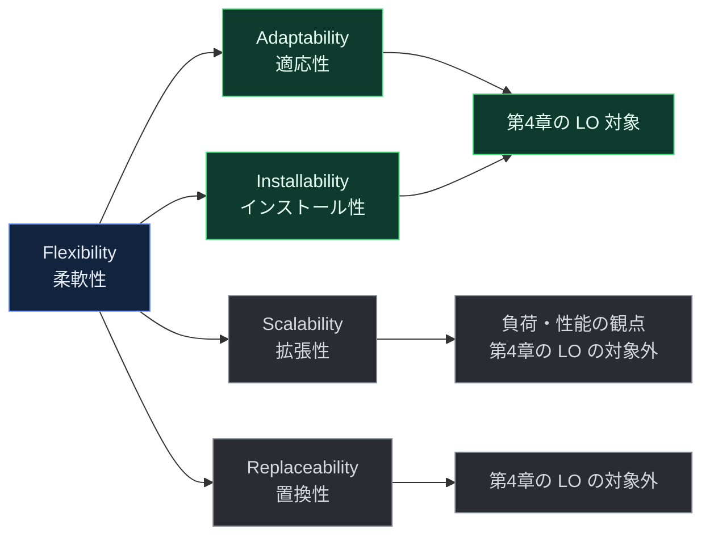

- 📘 サンプル試験 Q36 の解説は、**負荷テスト・スケーラビリティテスト**を適応性テストとは別のものとして扱っています。適応性は「システムが環境に合わせる」ことで、「利用者がシステムに合わせる」ことではありません。

出典：[LO 新旧比較表](https://istqb.org/?sdm_process_download=1&download_id=6363) ／ [ISO/IEC 25010:2023 前文](https://cdn.standards.iteh.ai/samples/78176/13ff8ea97048443f99318920757df124/ISO-IEC-25010-2023.pdf) ／ [公式サンプル試験 解答 v4.1 Q36](https://istqb.org/?sdm_process_download=1&download_id=5759)

### 4.2 適応性（Adaptability）テスト

**定義（📘・旧版の用語集に基づく）**：**異なる指定環境に、そのために用意された手段以外の操作を加えずに適応できる**能力（ISO 9126 に由来する定義。⚠ v4.0 の用語集で最新の文言を確認）。

**なぜ重要か（💡）**：利用者の環境は多様です。OS・ブラウザ・端末・DB・クラウド基盤の組み合わせによって、同じ機能でも動作が変わることがあります。

**TA の貢献（📘 サンプル試験 Q36 の解説）**：

> TA は、**意図した対象環境を特定**し、**それらの環境の組み合わせを網羅するテストを設計**することで、適応性テストを支援する。

例：解説は「**さまざまなクラウドサービス基盤への適応**」を適応性テストの例として挙げています。

**具体例（💡）**：業務システムを Windows／macOS／Linux、DB を PostgreSQL／MySQL／Oracle、クラウドを AWS／Azure／GCP に展開する場合

| 特徴 | 内容 |
|---|---|
| 組み合わせの総数 | 3 × 3 × 3 = **27 通り** |
| 目的 | どの環境でも**同じ機能が同じ結果**を返すことを確認する |
| 課題 | すべてを試すのは非現実的 → 組み合わせを減らす技法を使う |

#### 4.2.1 適応性テストの手順

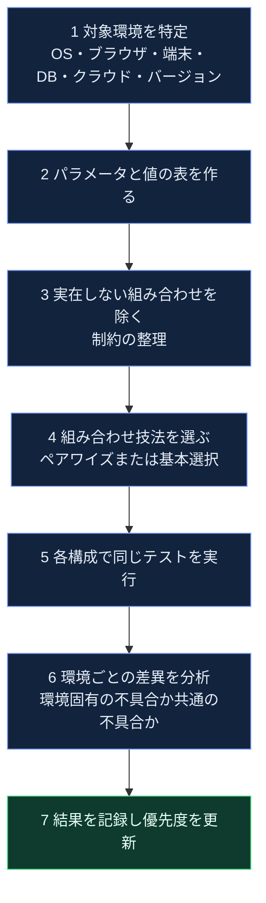

| Step | やること | 根拠・補足 |
|---|---|---|
| 1 | 利用者・運用者にとって**実際に対象となる環境**を特定する。利用統計や契約条件から優先度を決める | 📘 Q36 の解説（環境の特定）、💡 優先度づけ |
| 2 | 環境を「パラメータ（OS、DB…）」と「値（Windows、macOS…）」で整理する | 📘 3.1.2（構成パラメータの組み合わせ） |
| 3 | 存在しない組み合わせや、サポート対象外の組み合わせを除く | 📘 3.1.2（パラメータ値ペア間の制約、無効・実行不可能な組み合わせ） |
| 4 | **ペアワイズ**または**基本選択（base choice）**で組み合わせを減らす。重要度が高い場合は全組み合わせ | 📘 3.1.2、3.5.1 |
| 5 | 各構成で**同じテストケース**を実行する（構成パラメータの組み合わせは同じテストケースで確認できる） | 📘 3.1.2 |
| 6 | 失敗した環境に共通点がないか分析する。テスト環境の問題か、製品の問題かを切り分ける | 📘 1.2.4（異常の原因分析）、1.3.3（環境の忠実度） |
| 7 | 結果を記録し、環境ごとのリスクを更新する | 📘 1.2.4 |

#### 4.2.2 組み合わせの削減：27 通りを 9 通りに

📘 ペアワイズカバレッジは、**任意の 2 つのパラメータの値の組み合わせをすべてカバー**します。3.1.2 は、失敗の大半が 1〜2 個の条件の相互作用で起きるという**限定的な研究**（約 97%）を引用しています。

| # | OS | DB | クラウド |
|---|---|---|---|
| 1 | Windows | PostgreSQL | AWS |
| 2 | Windows | MySQL | Azure |
| 3 | Windows | Oracle | GCP |
| 4 | macOS | PostgreSQL | Azure |
| 5 | macOS | MySQL | GCP |
| 6 | macOS | Oracle | AWS |
| 7 | Linux | PostgreSQL | GCP |
| 8 | Linux | MySQL | AWS |
| 9 | Linux | Oracle | Azure |

💡 この 9 行で、OS×DB の 9 組、OS×クラウドの 9 組、DB×クラウドの 9 組が**すべて 1 回以上**現れます（27 通り → 9 通り）。実際にはツールで生成し、制約（実在しない組み合わせ）も反映します。

**基本選択（base choice）カバレッジ**（📘 3.1.2）：最も重要な値の組み合わせを基準に、**1 つのパラメータずつ他の値に置き換える**方法です。上の例で基準を「Windows／PostgreSQL／AWS」とすれば、1 + 2 + 2 + 2 = **7 通り**になります（💡 計算例）。

#### 4.2.3 サービス・ツール活用

| 場面 | 使えるサービス・機能 | 注意点 |
|---|---|---|
| CI で OS やランタイムの組み合わせを自動テスト | GitHub Actions の **matrix**（`strategy.matrix`）。`include`／`exclude` で組み合わせを追加・除外、`max-parallel` で同時実行数を制限 📘 | matrix は**指定した値の全組み合わせ**を実行する（ペアワイズではない）。ペアワイズ生成ツールの出力を `include` に渡す運用も可能（💡） |
| 端末・ブラウザの多様性 | 実機・仮想化サービス、コンテナ、VM、スナップショット | 💡 環境の忠実度（本番との近さ）を明記する（📘 1.3.3） |
| 多様な利用者環境の検証 | クラウドテスト | 📘 3.4.3（多様な端末・ブラウザ・ネットワーク条件） |

```yaml
jobs:
  compat:
    runs-on: ${{ matrix.os }}
    strategy:
      matrix:
        os: [ubuntu-latest, windows-latest, macos-latest]
        node: [18, 20, 22]
        exclude:
          - os: macos-latest
            node: 18
    steps:
      - uses: actions/checkout@v4
      - uses: actions/setup-node@v4
        with:
          node-version: ${{ matrix.node }}
      - run: npm test
```

💡 上記は matrix の書式を示す例です（3 × 3 = 9 通りから、除外指定の 1 通りを引いた 8 ジョブ）。

出典：[GitHub Docs：Using a matrix for your jobs](https://docs.github.com/actions/using-jobs/using-a-matrix-for-your-jobs) ／ [シラバス 3.1.2、3.4.3](https://istqb.org/?sdm_process_download=1&download_id=5745)

### 4.3 インストール性（Installability）テスト

**定義（💡）**：指定された環境に、製品を**インストールおよびアンインストールできる**ことの度合い（⚠ 用語集で確認）。

**なぜ重要か（💡）**：インストールできなければ、機能に問題がなくても利用が始まりません。最初に触れる部分なので、印象と信頼にも直結します。

**具体例（💡）**：業務用デスクトップアプリ、モバイルアプリ、オンプレミス製品のセットアップ、SaaS の初期設定

| テスト観点 | 確認内容 |
|---|---|
| 新規インストール | 手順書どおりに完了し、起動できる |
| 前提条件 | 必要な OS バージョン・空き容量・権限が**不足**しているとき、分かるエラーで止まる |
| 設定パラメータ | インストール時に選べる設定（言語・保存先・コンポーネント）が正しく反映される |
| 中断・失敗 | 途中で中断・失敗した場合に、環境が壊れず**再実行できる** |
| アップグレード | 旧バージョンから更新でき、**既存データが保持される** |
| ロールバック | 更新に失敗したとき、元の状態に戻せる |
| アンインストール | 残骸（ファイル・設定・サービス）が残らない、または仕様どおりに残る |
| インストール後の確認 | スモークテストで、主要機能が動作する |
| 文書 | 手順書・メッセージが正確で理解できる |

**製品のライフサイクルを状態で見る**（💡）：

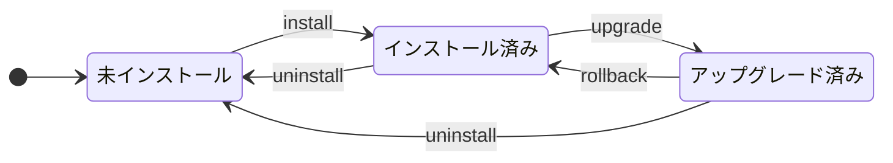

📘 状態遷移テストの**ラウンドトリップカバレッジ**（3.2.2）は、開始と終了が同じ状態のループ（ただし途中で同じ状態を 2 回通らない）をカバー対象とします。上の図では「インストール済み → アップグレード済み → インストール済み（rollback）」が1つのラウンドトリップです。

**メタモルフィックテストとの関係（📘 3.3.2）**：シラバスは、メタモルフィックテストの適用例として「**さまざまなインストールパラメータを、複数の順序で選択するインストール性テスト**」を挙げています。

**TA の貢献（💡）**：

- **利用者の視点**で、手順書どおりにインストール・アンインストールを行い、誤解しやすい手順・メッセージを指摘する
- 対象環境と**インストール構成**（新規・更新・パラメータ）の組み合わせを整理する
- テスト環境の**要件**（クリーンな環境、旧バージョンが入った環境、権限）を定義する（📘 1.3.3）
- 実行後の**環境の初期化手順**を決める（📘 1.2.3：リセット手順）

出典：[シラバス 1.2.3、1.3.3、3.2.2、3.3.2](https://istqb.org/?sdm_process_download=1&download_id=5745)

### 4.4 ベストプラクティス（フレキシビリティテスト）

**ベストプラクティス**

- **対象環境を要件として明文化**する：サポート対象の OS・ブラウザ・DB・クラウドを一覧にしないと、テスト範囲を決められません（💡。📘 Q36 の解説は環境の特定を TA の貢献としている）。
- **利用実態で優先度づけ**する：利用者の多い環境から厚くテストする（💡。📘 3.2.3 は運用プロファイルを柔軟性・互換性テストにも使えると述べる）。
- **組み合わせ技法を使い分ける**：通常はペアワイズ、リスクが高い組み合わせは全組み合わせ、基準構成が明確なら基本選択（📘 3.1.2、3.5.1）。
- **クリーンな環境を再現可能にする**：インストール性テストは環境の初期状態が結果を左右する。スナップショットやコンテナで**毎回同じ状態から始める**（💡）。
- **アンインストールとアップグレードを必ず含める**：新規インストールだけでは不十分（💡）。
- **環境の忠実度を記録する**：本番との差（ネットワーク、データ量、権限）を明記する（📘 1.3.3：忠実度 fidelity）。
- **環境の準備が整っているかをスモークテストで確認**する（📘 1.2.3）。

### 4.5 ✅／❌ 対比

| 観点 | ❌ 悪い例 | ✅ 良い例 |
|---|---|---|
| 対象環境 | 開発者の手元の環境だけで確認する | サポート対象環境を一覧化し、優先度をつけて確認する |
| 組み合わせ | 思いつく環境だけを試す | パラメータと値の表を作り、ペアワイズなどで系統的に選ぶ |
| インストール | 新規インストールだけ確認する | アップグレード・失敗・中断・アンインストールも確認する |
| 環境の初期状態 | 前回の残骸が残った環境で再テストする | スナップショットなどで毎回クリーンな状態に戻す |
| 記録 | 「動いた」とだけ記録する | 環境の構成と結果を組み合わせで記録する |

### 4.6 公式サンプル試験 Q36 の考え方

📘 Q36（LO：TA-4.3.1・K2）は、**どの活動が適応性テストの支援になるか**を選ぶ問題です。

| 解説から読み取れる選択肢の内容 | 解説が示す分類 |
|---|---|
| 利用者がシステムに慣れるよう支援する活動 | **アクセシビリティ**のテストの支援（適応性ではない） |
| 他システムとのデータ交換の確認 | **相互運用性**のテストの支援 |
| 大量の利用者による負荷の確認 | **負荷テスト・スケーラビリティテスト**の支援 |
| **さまざまなクラウド基盤への適応を確認する**（正解） | 対象環境を特定し、組み合わせを網羅するテストを設計する |

**解き方**：適応性は「**システムが環境に合わせる**」。利用者が慣れる話（アクセシビリティ）や、他システムとのやりとり（相互運用性）、負荷（拡張性）とは別物です。

出典：[公式サンプル試験 解答 v4.1 Q36](https://istqb.org/?sdm_process_download=1&download_id=5759)

### 4.7 4.3 のまとめ

- Portability → **Flexibility** への名称変更を覚える。
- LO の対象は**適応性**と**インストール性**。拡張性（負荷）や置換性は対象外。
- 適応性は「**対象環境を特定し、組み合わせを網羅するテストを設計する**」が TA の貢献の核。
- 組み合わせの削減は第3章の**組み合わせテスト**（ペアワイズ・基本選択）と直結する。
- インストール性は、新規だけでなく**アップグレード・ロールバック・アンインストール**まで見る。

---
## 5. 4.4 互換性テスト（TA-4.4.1・K2）

> **LO TA-4.4.1（K2）**：テストアナリストが**相互運用性（interoperability）のテストにどう貢献するか**を説明できる（Explain）

### 5.1 互換性（Compatibility）とは

📘 ISO/IEC 25010:2023 の定義：**他の製品と情報を交換する**、および／または、**共通の環境や資源を共有しながら**必要な機能を果たす能力。サブ特性は次の2つです。

| サブ特性 | 意味 | 第4章での扱い |
|---|---|---|
| **Co-existence（共存性）** | 同じ環境・資源を共有する他の製品に**悪影響を与えず**、必要な機能を効率的に果たす | LO の対象外 ⚠（旧 v3.1 では TTA の領域として整理されていた） |
| **Interoperability（相互運用性）** | 他の製品と情報を**交換し、その情報を相互に利用**できる | **LO TA-4.4.1 の対象** |

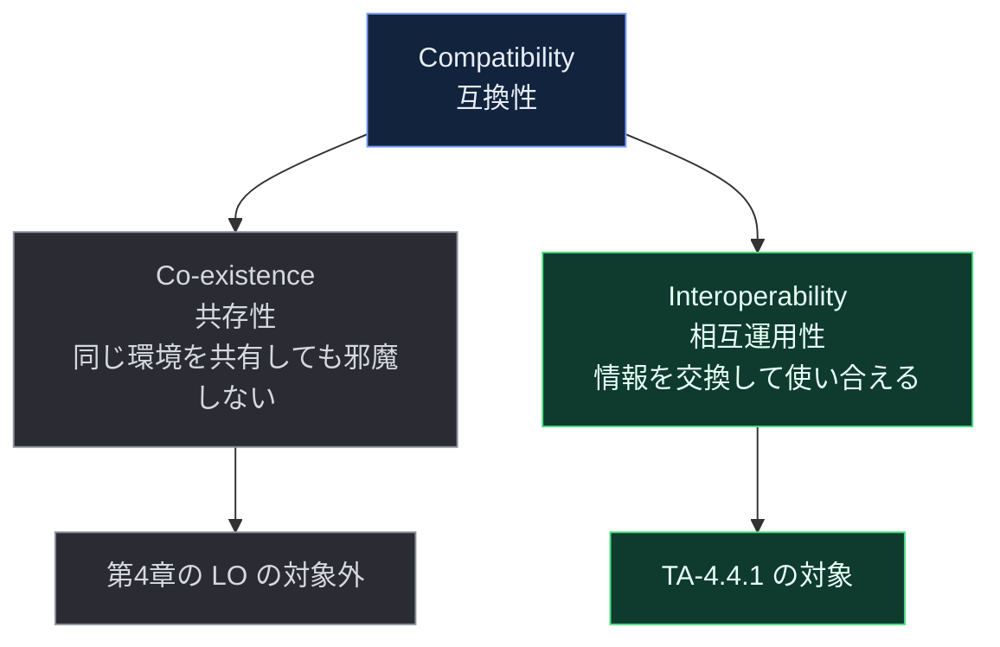

出典：[ISO/IEC 25010:2023 プレビュー（3.3、3.3.1、3.3.2）](https://cdn.standards.iteh.ai/samples/78176/13ff8ea97048443f99318920757df124/ISO-IEC-25010-2023.pdf) ／ [LO 新旧比較表（TA-4.4.1 の LO）](https://istqb.org/?sdm_process_download=1&download_id=6363)

### 5.2 相互運用性（Interoperability）の定義

- 📘 ISO：他の製品と情報を交換し、**交換された情報を相互に使う**能力。注記：ここでいう「情報」とは**意味のあるデータ**であり、情報の交換には**交換のためのデータ変換**も含まれる。
- 📘 サンプル試験 Q37 の解説：2つ以上のコンポーネントまたはシステムが**情報を交換し、交換された情報を使える**度合い。

**ポイント（💡）**：「データが**届いた**」だけでは不十分です。受け取った側が**意味を理解して正しく使える**（型・単位・文字コード・意味の解釈が合う）ことが相互運用性です。

### 5.3 TA は相互運用性テストにどう貢献するか

📘 シラバスの関連記述から、TA の貢献は次のように整理できます。

| # | TA の貢献 | 根拠 |
|---|---|---|
| 1 | テストベースを分析するとき、**テスト対象と環境（利用者・他システム・機器）の相互作用**を洗い出す | 📘 1.3.6（キーワード駆動テストの説明の中で、TA が相互作用を探すと記述） |
| 2 | 交換される**データの形式**（CSV・JSON・XML・データベース）を整理し、テストデータを用意する | 📘 1.3.5（データ形式の項目） |
| 3 | 相手システムがテスト時に使えない場合、**テストダブル（スタブ・ドライバ）**や**サービス仮想化**で補う | 📘 1.3.3、1.3.5 |
| 4 | **システム間のシナリオ**を設計する（エンドツーエンド）。運用プロファイルから互換性テストのシナリオ要素を作る | 📘 3.2.3（シナリオが柔軟性・互換性テストの運用プロファイルの要素になりうる） |
| 5 | 過去に見つかった**互換性・相互運用性の欠陥**を、チャーターの履歴情報に活かす | 📘 3.4.1（チャーターの履歴情報の例に、互換性・相互運用性の欠陥が挙がる） |

💡 実務では、TA が**業務データの意味**を理解していることが最大の強みです。「この項目は税込か税抜か」「この日付はどのタイムゾーンか」といった**意味の食い違い**を見つけられるのは、業務を知る TA です。

### 5.4 テスト観点

相互運用性の不具合は、次のどこで起きるかを分けて考えると設計しやすくなります（💡）。

| 観点 | 何を確認するか | 不具合の例 |
|---|---|---|
| 形式・構造 | 必須項目、型、桁数、区切り、スキーマ | 必須項目が欠けて受信側がエラー |
| 意味・単位 | 単位、通貨、税込・税抜、コード値の意味 | 金額の単位が円と銭で解釈が食い違う |
| 文字・日時 | 文字コード、改行、タイムゾーン、日付形式 | UTF-8 と Shift_JIS で文字化け |
| データ変換 | 変換ルール、丸め、null と空文字の扱い | 小数の丸めで 1 円のずれ |
| プロトコル・バージョン | API のバージョン、認証方式、必須ヘッダ | 旧バージョンの項目が新 API で無視される |
| タイミング・順序 | 応答時間、タイムアウト、リトライ、順序保証 | 二重送信で二重登録 |
| エラー処理 | 相手側の失敗・遅延・不正応答への対応 | 相手が失敗を返しても成功扱いにする |

### 5.5 相互運用性テストの進め方

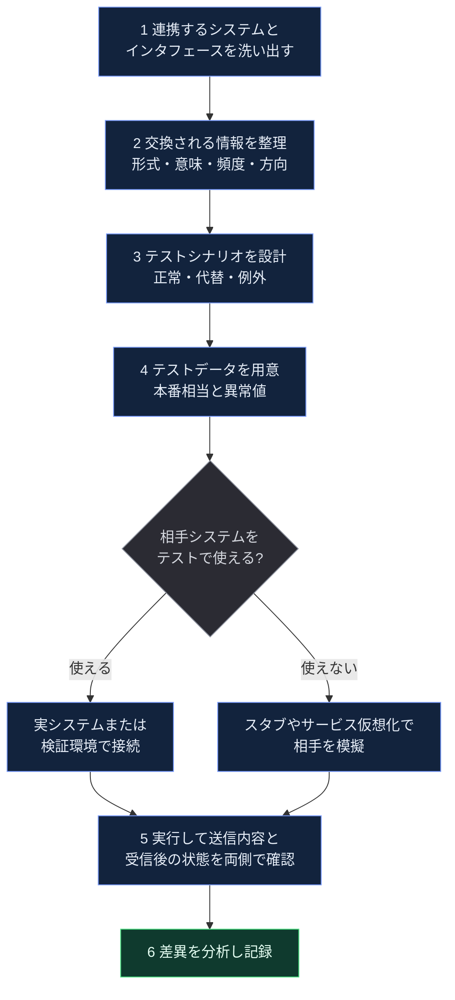

### 5.6 具体例：ECサイトと決済サービス・在庫システム

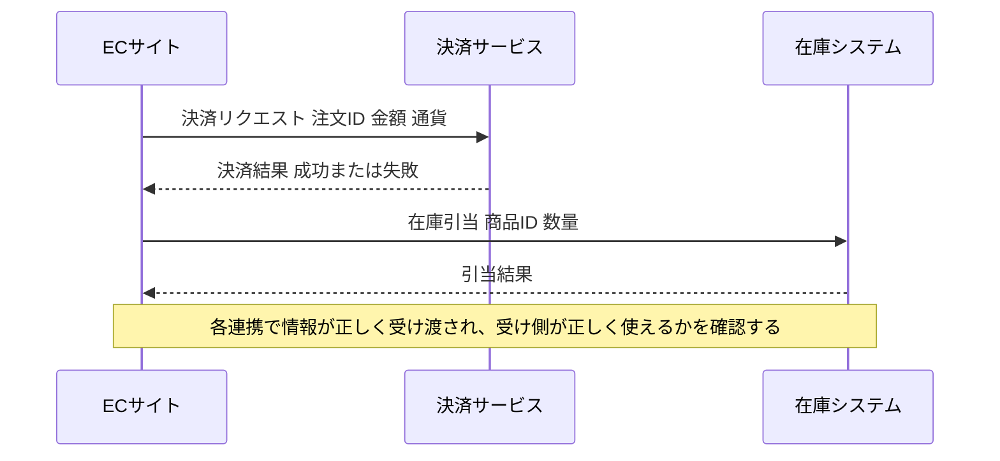

| # | 確認する内容 | 期待する結果 | 観点 |
|---|---|---|---|
| 1 | 金額 1,980 円の注文を送る | 決済サービス側でも 1,980 円として処理される | 意味・単位 |
| 2 | 商品名に全角文字・絵文字・改行を含める | 文字化けせず、相手側でも同じ内容で保持される | 文字・日時 |
| 3 | 注文日時をタイムゾーン違いで送る | 相手側の日付が仕様どおり（日跨ぎでずれない） | 文字・日時 |
| 4 | 決済サービスが「失敗」を返す | EC は注文を確定せず、在庫を引き当てない | エラー処理 |
| 5 | 決済サービスの応答が遅延・タイムアウトする | 二重決済せず、状態が整合する | タイミング・順序 |
| 6 | 相手 API のバージョンが上がり、項目が追加される | 既存の項目は従来どおり処理される | プロトコル・バージョン |

💡 これらは**振る舞い（シナリオ）**として設計でき、第3章のシナリオベーステスト（主シナリオ・拡張・例外）と組み合わせられます。

### 5.7 テストダブル・サービス仮想化・契約テスト

| 手法 | 内容 | 使いどころ | 根拠 |
|---|---|---|---|
| テストダブル（スタブ・ドライバ） | 相手システムを模擬する部品 | 相手が未完成、またはテストで使えない | 📘 1.3.3 |
| サービス仮想化 | 不在・アクセス不能な外部サービスを**シミュレート**する | 外部サービスがテスト用に用意されない、課金がある、不安定 | 📘 1.3.5 |
| 契約テスト（consumer-driven contract testing など） | 送り手と受け手が、インタフェースの**期待を契約として共有**し、それぞれ独立に検証する | 複数チームが独立して開発・リリースするマイクロサービス | 💡 実務手法 |
| 疑似オラクル | 同じ仕様を満たす別系統のシステムを期待結果の基準にする | 旧システムの置き換え時など | 📘 1.3.4 |

**ベストプラクティス**

- **仮想化した結果と実システムの差**を必ず記録する：仮想化は速く安定するが、実システム固有の挙動は見えない（💡）。
- **本番に近い検証環境**での**最終確認**を必ず残す（📘 1.3.3：本番と同じ結果になる環境が理想）。

### 5.8 ベストプラクティス（相互運用性テスト）

**ベストプラクティス**

- **インタフェース一覧（連携マップ）を作る**：送り手・受け手・方向・形式・頻度を一覧にすると、テストの網羅と漏れの確認ができます（💡）。
- **データの意味を確認する**：項目の型だけでなく、単位・コード値・null の扱い・日時の基準を、**仕様と実データの両方**で確認する（💡）。
- **正常だけでなく例外を設計する**：相手の失敗・遅延・不正応答を、**シナリオの例外**として設計する（📘 3.2.3）。
- **両側の状態を確認する**：送信側の画面だけでなく、**受信側に届いたデータと状態**も確認する（💡）。
- **テストデータを機密面で保護する**：本番データを使う場合は、仮名化・匿名化を検討する（📘 1.3.5）。
- **バージョン変更の影響を調べる**：相手システムが変更されたときに影響を受ける回帰テストを、インパクト分析で選ぶ（📘 2.2）。
- **過去の互換性の欠陥を記録して活かす**：チャーターやチェックリストに反映する（📘 3.4.1、3.4.2）。

### 5.9 ✅／❌ 対比

| 観点 | ❌ 悪い例 | ✅ 良い例 |
|---|---|---|
| 確認範囲 | 送信側の画面表示だけを確認する | 受信側の保存内容と後続処理の結果まで確認する |
| データ | 正常な短い半角データだけを使う | 全角・長文・特殊文字・境界値・欠損を含める |
| 例外 | 成功だけを確認する | 相手の失敗・タイムアウト・不正応答も確認する |
| 相手システム | 使えないのでテストしない | スタブやサービス仮想化で模擬し、最終確認は実環境で行う |
| 仕様 | 「連携できた」で終わる | 項目ごとの意味・単位・変換ルールを仕様と照合する |

### 5.10 公式サンプル試験 Q37 の考え方

📘 Q37（LO：TA-4.4.1・K2）は、**相互運用性テストの例**を選ぶ問題です。解説の要点は次のとおりです。

| 選択肢の内容（解説から読み取れる分類） | 分類 |
|---|---|
| 環境への適応を確認するテスト（4.3.1 と用語集を参照） | **適応性**テスト |
| 2つ以上のコンポーネント・システムが情報を交換し、その情報を使えるかを確認する（正解） | **相互運用性**テスト |
| 利用者の使いやすさを確認するテスト（4.2.1 を参照） | **ユーザビリティ**テスト |
| 精度に焦点を当てた結果の正しさの確認（4.1 を参照） | **機能正確性**テスト |

**解き方**：**「情報の交換」**が出てきたら相互運用性。「環境」なら適応性、「使いやすさ」ならユーザビリティ、「結果の正しさ・精度」なら正確性です。

出典：[公式サンプル試験 解答 v4.1 Q37](https://istqb.org/?sdm_process_download=1&download_id=5759)

### 5.11 4.4 のまとめ

- Compatibility ＝ 共存性＋相互運用性。**LO の対象は相互運用性**。
- 相互運用性 ＝ 情報を**交換**し、**交換した情報を使える**。届くだけでなく、**意味が合う**ことが重要。
- TA の貢献は、**連携する相手・情報・シナリオを洗い出して設計する**こと。業務データの意味を知る TA の強みが生きる。
- 相手が使えないときは**テストダブル／サービス仮想化**、最終確認は本番に近い環境で。

---

## 6. 機能・サービス別 適用早見表

現場では「この機能・サービスに、どの特性のテストを当てるか」を迷います。次の表は、代表的な機能・サービスに対する**観点の割り当て例**です（💡 実務の整理。第4章の LO を実務に落とし込むための目安です）。

| 機能・サービス | 主に見る特性 | 重点となる観点 | 有効な技法・手法 | 参照節 |
|---|---|---|---|---|
| ログイン・会員登録 | 正確性・完全性・ユーザビリティ | 認証結果の正しさ、パスワード再設定などの機能の抜け、エラーからの回復のしやすさ | 状態遷移、デシジョンテーブル、CRUD 完全性、利用者テスト | 2、3 |
| 検索・絞り込み | 正確性・適切性 | 条件どおりの結果、結果の並び順・カテゴリの有用性 | 同値分割・ドメインテスト、メタモルフィック（検索条件の変更に対する結果の関係）、クラウドテスト | 2 |
| カート・決済 | 正確性・完全性・相互運用性 | 金額・税・送料、決済失敗時の整合性、決済サービスとのデータ交換 | デシジョンテーブル、シナリオベース、スタブ／サービス仮想化 | 2、5 |
| 帳票・PDF・CSV 出力 | 正確性・相互運用性 | 桁・丸め・文字コード、受け取る側での取り込み | ドメインテスト、実データでの取り込み確認 | 2、5 |
| 外部 API 連携 | 相互運用性 | 形式・意味・バージョン・エラー・タイムアウト | シナリオベース（例外を含む）、契約テスト、サービス仮想化 | 5 |
| データ管理（登録・更新・削除） | 完全性・正確性 | 操作の抜け（削除できない）、更新後の整合性 | CRUD テスト（完全性テストと整合性テスト） | 2 |
| インストーラ・モバイルアプリ | インストール性・適応性 | 新規・更新・アンインストール、端末や OS の組み合わせ | 状態遷移（ラウンドトリップ）、ペアワイズ、クラウドテスト | 4 |
| Web アプリ（ブラウザ対応） | 適応性・ユーザビリティ | ブラウザ×OS×画面サイズ、文字サイズや操作方法の違い | ペアワイズ、CI の matrix、チェックリスト | 3、4 |
| SaaS の管理画面 | 適切性・ユーザビリティ | 管理者の業務手順の必要十分さ、誤操作の防止 | シナリオベース、ヒューリスティクス評価、利用者テスト | 2、3 |
| データ移行・バッチ | 正確性・完全性・相互運用性 | 件数・金額の一致、欠損、変換ルール | 疑似オラクル（旧システム）、ドメインテスト | 2、5 |

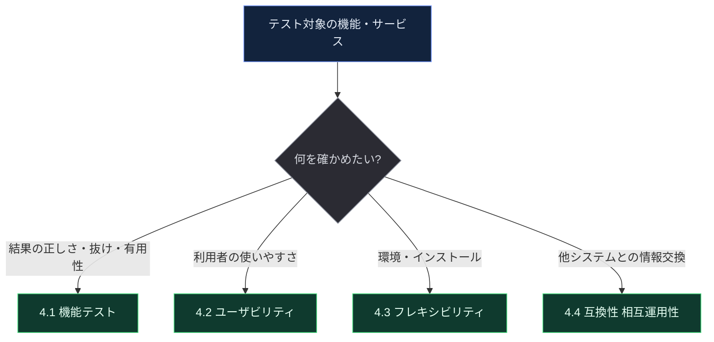

**ベストプラクティス（特性の割り当て）**

- 1つの機能に**複数の特性**が該当することは普通です。特性ごとに**テスト条件を分けて**書きます。
- どの特性を厚くするかは、**リスクの大きさ**で決めます（📘 2.1：TA は品質特性の観点でリスクを分類し、各リスクに対するテスト活動を提案する）。
- 優先度が低い特性は、**チェックリストや探索的テスト**で軽く見る（📘 3.5.1：リスクが低い・スケジュールが厳しいときは経験ベース）。

---

## 7. 試験対策

### 7.1 混同しやすい概念の比較

| | 確かめる問い | キーワード | 例 | 該当節 |
|---|---|---|---|---|
| 機能正確性 | 結果は正しいか | 精度・計算・判定 | 送料の判定が仕様どおり | 4.1 |
| 機能適切性 | タスクに役立つか | 必要十分・不要なステップなし | カテゴリが利用者に有用 | 4.1 |
| 機能完全性 | 必要な機能が揃っているか | 抜け・網羅・CRUD | 削除機能がない | 4.1 |
| ユーザビリティ（インタラクション能力） | 学びやすく、操作しやすく、誤りを防げるか | ペルソナ・観察・実利用者 | 初回利用者が説明なしで購入できる | 4.2 |
| 適応性 | 異なる環境で同じように動くか | 環境の特定・組み合わせ | 複数のクラウド基盤で動作する | 4.3 |
| インストール性 | インストール・アンインストールできるか | 新規・更新・アンインストール | 更新に失敗しても元に戻せる | 4.3 |
| 相互運用性 | 情報を交換し、使い合えるか | 連携・データ形式・意味 | EC と決済サービスの連携 | 4.4 |
| （参考）アクセシビリティ | 幅広い人が使えるか | 包括性・ユーザー支援 | スクリーンリーダー対応 | 4.2（ISO では分割） |
| （参考）負荷・拡張性 | 大量の利用に耐えるか | 負荷・スケーラビリティ | 同時 1 万人のアクセス | 第4章 LO の対象外 |

### 7.2 LO ごとの「これだけは説明できる」ポイント

| LO | 答えられるべき問い | 模範的な要点 |
|---|---|---|
| TA-4.1.1 | 3特性はどう違う？ | 正確性＝結果が正確／適切性＝タスクに役立つ・必要十分／完全性＝必要な機能・目的がすべて揃っている |
| TA-4.2.1 | TA はどう貢献する？ | ペルソナ・利用パターンからシナリオを作る／対象グループを代表する実利用者を選ぶ／誘導せず観察する |
| TA-4.3.1 | TA はどう貢献する？ | 対象環境を特定し、その組み合わせを網羅するテストを設計する（適応性）／インストール手順・構成を利用者視点で確認する（インストール性） |
| TA-4.4.1 | TA はどう貢献する？ | 連携する相手・交換される情報を洗い出し、システム間のシナリオとデータを設計する。相手が使えないときはテストダブルなどで補う |

### 7.3 公式サンプル試験の第4章（Q34〜Q37）一覧

| Q | LO | 問われていること | 正解の考え方 | 点 |
|---|---|---|---|---|
| 34 | TA-4.1.1（K2） | 具体的なテスト活動がどの特性のテストか | 「フィルタの正しさ」→ 機能正確性 | 1 |
| 35 | TA-4.2.1（K2） | ユーザビリティテストの準備で TA がすべきこと | 利用パターンとペルソナからシナリオを作る | 1 |
| 36 | TA-4.3.1（K2） | 適応性テストの支援になる活動 | 対象環境（クラウド基盤）を特定し、組み合わせを網羅するテストを設計する | 1 |
| 37 | TA-4.4.1（K2） | 相互運用性テストの例 | 情報の交換とその利用の確認 | 1 |

### 7.4 自己診断ミニクイズ（💡 筆者作成・公式問題ではありません）

以下は K2 の理解を確認するための練習問題です。答えは最後にあります。

1. 要件に「領収書の発行」があるのに、画面のどこにも発行機能がない。どの特性の問題か。
2. 合計 5,000 円以上で送料無料の仕様で、ちょうど 5,000 円のとき送料が加算された。どの特性の問題か。
3. 購入完了までに、目的に不要な確認画面が 5 つ表示される。仕様どおりに実装されている。最も近い特性はどれか（機能面から見る場合）。
4. ユーザビリティテストの参加者を選ぶとき、TA が最も重視すべきことは何か。
5. TA が適応性テストで行う中心的な貢献は何か。
6. ISO/IEC 25010:2023 で、旧 Portability に置き換わった特性名は何か。
7. Interaction capability と Usability の関係を一言で説明せよ。
8. パラメータ 3 つ・各 3 値のとき、ペアワイズの最小テスト数と、全組み合わせの数はいくつか。
9. CRUD テストの「完全性テスト」は静的テストか動的テストか。
10. 「EC サイトが送った注文データを、在庫システムが正しく解釈して使えるか」は、どの種類のテストか。

**答え（💡）**：

1. 機能完全性　2. 機能正確性（境界値の誤り）　3. 機能適切性（手順が必要十分でない）　4. 対象利用者グループの特性を代表する実利用者を選ぶ　5. 対象環境を特定し、その組み合わせを網羅するテストを設計する　6. Flexibility（柔軟性）　7. Interaction capability は Usability の前提条件（製品側の能力と、利用の結果の関係）　8. 9 通り（全組み合わせは 27 通り）　9. 静的テスト　10. 相互運用性テスト

### 7.5 学習プラン（💡 目安）

| ステップ | 内容 | 所要 |
|---|---|---|
| 1 | 第0〜1章：限界の確認、ISO 25010:2023 マップ、キーワード 13 語 | 30 分 |
| 2 | 第2〜5章：各 LO を「説明できる」まで音読・書き出し | 60 分 |
| 3 | 公式サンプル試験 Q34〜Q37 を解き、解説を読む | 15 分 |
| 4 | **公式シラバス PDF の 44〜47 ページを通読し、本ガイドとの差異を確認** | 30 分 |
| 5 | 第7章の比較表と、自己診断クイズを復習 | 15 分 |

### 7.6 公式シラバス（44〜47 ページ）通読時のチェックポイント

本ガイドは第4章の本文を全文確認できていません（0.3 節）。通読するときは、次を確認してください。

- [ ] 4.1：3特性それぞれの**定義文**、テスト時期・テストレベルの記述、典型的な欠陥・使う技法の記述（本ガイドの 2.6 節と比較）
- [ ] 4.2：TA の貢献として**列挙された項目**が、本ガイドの 3.3 節と一致するか。ユーザビリティ指標や評価手法の例示があるか
- [ ] 4.3：適応性・インストール性の**定義**と、TA の貢献の**具体的な列挙**（4.2、4.3 節と比較）
- [ ] 4.4：相互運用性の**定義**と、TA の貢献の具体例。共存性の扱い
- [ ] キーワード13語が、本文中でどう定義・使用されているか
- [ ] 図・表・例に書かれた固有の用語（試験で問われやすい）

---

## 8. 実務チェックリスト

**機能テスト（4.1）**

- [ ] テスト条件を、正確性・適切性・完全性のどれに関するものかで**分類した**
- [ ] 要件・ユーザーストーリー・ユースケースと**トレーサビリティ**が取れている
- [ ] CRUD マトリクスで、各エンティティの操作の**欠落**を確認した
- [ ] 期待結果を**独立したオラクル**から決めた（実装を見て決めていない）
- [ ] 主要シナリオを、ペルソナ・利用パターンから作った

**ユーザビリティテスト（4.2）**

- [ ] 対象利用者グループと**代表する参加者**を定義した
- [ ] タスクを**利用者の目的**で書き、成功基準と指標を決めた
- [ ] セッションでは**観察に徹する**手順を関係者と合意した
- [ ] 学習性・操作性・エラー防止・包括性までの**観点**をチェックリスト化した
- [ ] 問題を**影響と頻度**で優先度づけし、再テスト計画を立てた

**フレキシビリティテスト（4.3）**

- [ ] サポート対象環境（OS・ブラウザ・DB・クラウドなど）を**一覧化**した
- [ ] 環境をパラメータと値で整理し、**制約**を反映した
- [ ] 組み合わせ技法（ペアワイズ・基本選択・全組み合わせ）を**リスクに応じて**選んだ
- [ ] インストール性で、**新規・更新・失敗・ロールバック・アンインストール**を確認した
- [ ] テスト環境の**初期状態と初期化手順**、本番との忠実度を記録した

**互換性テスト（4.4）**

- [ ] 連携する**システムとインタフェース**を一覧化した
- [ ] 交換される情報の**形式・意味・単位・文字コード・日時**を確認した
- [ ] **正常・代替・例外**のシナリオを設計した
- [ ] 相手が使えない部分は、テストダブルやサービス仮想化で補い、**最終確認は実環境で**行った
- [ ] **両側**（送信側・受信側）の状態を確認した

---

## 9. 参考文献（根拠ソースの URL）

「確認状況」は、このガイドの作成時にどこまで実際に内容を確認できたかを示します。

### 9.1 ISTQB 公式（一次情報）

| # | 資料 | URL | 確認状況 |
|---|---|---|---|
| 1 | ISTQB CTAL-TA v4.0 認定ページ（試験構成、失効日、ダウンロード） | https://istqb.org/certifications/certified-tester-advanced-level-test-analyst/ | 取得して確認 |
| 2 | CTAL-TA v4.0 シラバス（PDF） | https://istqb.org/?sdm_process_download=1&download_id=5745 | 1〜43 ページと第4章冒頭（キーワード・LO）まで確認。**44〜47 ページの本文は未確認** |
| 3 | シラバスの別配布元（ASTQB） | https://astqb.org/assets/documents/ISTQB-CTAL-TA-Syllabus-v4.0-EN-4.pdf | 検索結果で存在を確認（内容は同一の版と思われるが未取得） |
| 4 | CTAL-TA v4.0 公式サンプル試験 解答 v4.1（Q34〜Q37 の解説） | https://istqb.org/?sdm_process_download=1&download_id=5759 | 取得して確認 |
| 5 | CTAL-TA v4.0 公式サンプル試験 問題 v4.1 | https://istqb.org/?sdm_process_download=1&download_id=5749 | 未取得（解答側で内容を確認） |
| 6 | LO 新旧比較表（v3.1 と v4.0 の対応） | https://istqb.org/?sdm_process_download=1&download_id=6363 | 取得して確認 |
| 7 | CTAL-TA v4.0 リリースノート | https://istqb.org/?sdm_process_download=1&download_id=5762 | 取得して確認 |
| 8 | ISTQB Glossary（用語集） | https://glossary.istqb.org/ | 未取得（キーワードの正式定義の確認先） |
| 9 | v4.0 リリースのプレスリリース | https://istqb.org/istqb-certified-tester-advanced-level-test-analyst-ctal-ta-v4-0-press-release/ | 検索結果で確認 |
| 10 | （旧版）CTAL-TA シラバス v3.1.0 | https://www.gtb.de/wp-content/uploads/2023/10/ISTQB_CTAL-TA_Syllabus_v3.1.0_EN.pdf | 検索結果（目次）で確認。旧版との比較用 |

### 9.2 ISO 規格

| # | 資料 | URL | 確認状況 |
|---|---|---|---|
| 11 | ISO/IEC 25010:2023 製品品質モデル（規格ページ） | https://www.iso.org/standard/78176.html | 検索結果で確認 |
| 12 | ISO/IEC 25010:2023 プレビュー PDF（定義 3.1〜3.4.4、前文の変更点） | https://cdn.standards.iteh.ai/samples/78176/13ff8ea97048443f99318920757df124/ISO-IEC-25010-2023.pdf | 取得して確認（柔軟性の定義以降は未確認） |
| 13 | arc42 Quality Model：ISO/IEC 25010 の特性・サブ特性一覧 | https://quality.arc42.org/standards/iso-25010 | 取得して確認（二次情報） |
| 14 | arc42：ISO 25010 2023 版の変更点 | https://quality.arc42.org/articles/iso-25010-update-2023 | 検索結果で確認（二次情報） |

### 9.3 ユーザビリティ・アクセシビリティ

| # | 資料 | URL | 確認状況 |
|---|---|---|---|
| 15 | Nielsen Norman Group：10 Usability Heuristics | https://nngroup.com/articles/ten-usability-heuristics/ | 検索結果で URL と内容（ミラーを含む）を確認 |
| 16 | W3C：WCAG 2.2 | https://www.w3.org/TR/WCAG22/ | 未取得（一般に知られる標準の URL） |

### 9.4 環境・CI・用語（補足）

| # | 資料 | URL | 確認状況 |
|---|---|---|---|
| 17 | GitHub Docs：Using a matrix for your jobs | https://docs.github.com/actions/using-jobs/using-a-matrix-for-your-jobs | 検索結果で確認（matrix、include／exclude） |
| 18 | QA 用語集（適応性の旧定義 ISO 9126 の引用） | https://aspiritech.org/news/quality-assurance-definitions-and-software-testing-industry-terms/ | 検索結果で確認（二次情報） |

### 9.5 二次情報（学習の補助）

| # | 資料 | URL | 確認状況 |
|---|---|---|---|
| 19 | ISTQB.com（非公式）CTAL-TA v4.0 ガイド | https://www.istqb.com/ctal-ta-v4-0/ | 取得して確認（民間サイト。ISTQB 公式ではない。第4章の記述は要約であり、シラバスと照合が必要） |
| 20 | Trendig：CTAL-TA v4.0 の概要 | https://trendig.com/en/blog/new-version-released-istqb-certified-tester-advanced-level-test-analyst-v4/ | 検索結果で確認（民間） |
| 21 | ANZTB：CTAL-TA ページ | https://www.anztb.org/certification/ctal-ta/ | 検索結果で確認（旧版の学習目標の記述が混在しうる） |

---

## 付録 A：このガイドの記述と根拠の対応（要点）

| 記述 | 主な根拠 |
|---|---|
| 第4章は 60 分・4 節・LO 4 本（すべて K2）・キーワード 13 語 | シラバス（目次・第4章冒頭） |
| 各 LO は 15 分、v3.1 から「簡素化・言い換え」 | LO 新旧比較表 |
| サンプル試験の第4章は Q34〜Q37 の 4 問（各 1 点） | 公式サンプル試験 解答 v4.1 |
| 機能適合性の3サブ特性の定義、互換性・相互運用性・インタラクション能力の定義 | ISO/IEC 25010:2023（プレビュー PDF） |
| Usability → Interaction capability、Portability → Flexibility | ISO 25010:2023 前文、LO 新旧比較表 |
| TA の貢献（ユーザビリティ、適応性、相互運用性）の具体点 | サンプル試験 Q35〜Q37 の解説、シラバス第0〜3章の関連記述 |
| 「典型的な不具合」「手順の細目」「実務のベストプラクティス」 | 筆者の実務補足（💡）。公式本文との照合が必要 |

## 付録 B：用語の対応表（日本語・英語）

| 日本語（仮訳） | English |
|---|---|
| 機能適合性 | Functional suitability |
| 機能完全性 | Functional completeness |
| 機能正確性 | Functional correctness |
| 機能適切性 | Functional appropriateness |
| 機能テスト | Functional testing |
| インタラクション能力 | Interaction capability |
| ユーザビリティ（使用性） | Usability |
| ユーザーエクスペリエンス | User experience |
| 柔軟性 | Flexibility |
| 適応性 | Adaptability |
| インストール性 | Installability |
| 拡張性 | Scalability |
| 置換性 | Replaceability |
| 互換性 | Compatibility |
| 共存性 | Co-existence |
| 相互運用性 | Interoperability |
| テストダブル | Test double |
| サービス仮想化 | Service virtualization |
| ペルソナ | Persona |
| オペレーショナルプロファイル（運用プロファイル） | Operational profile |
