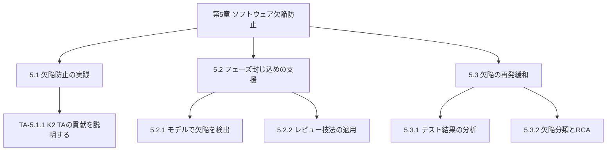
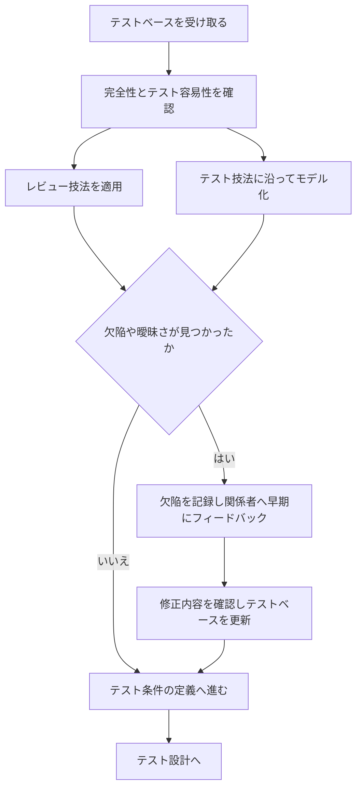
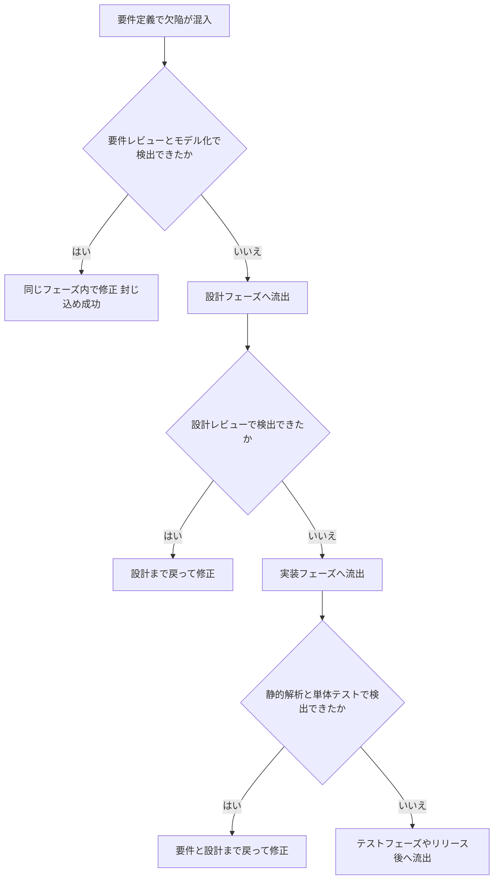
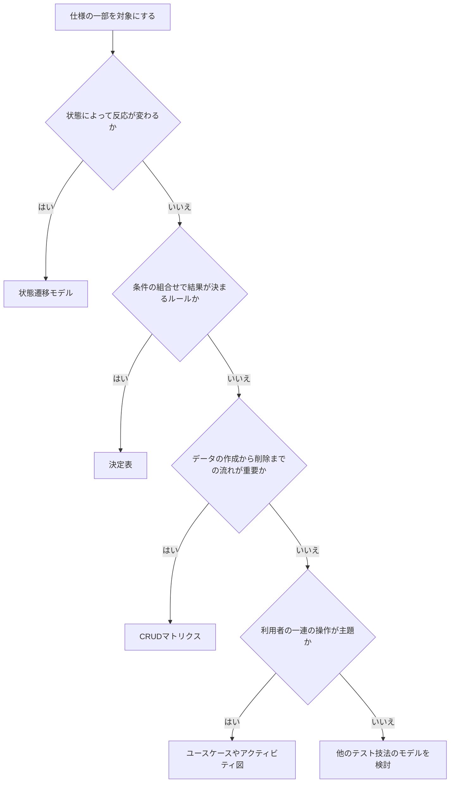
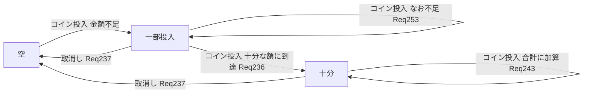
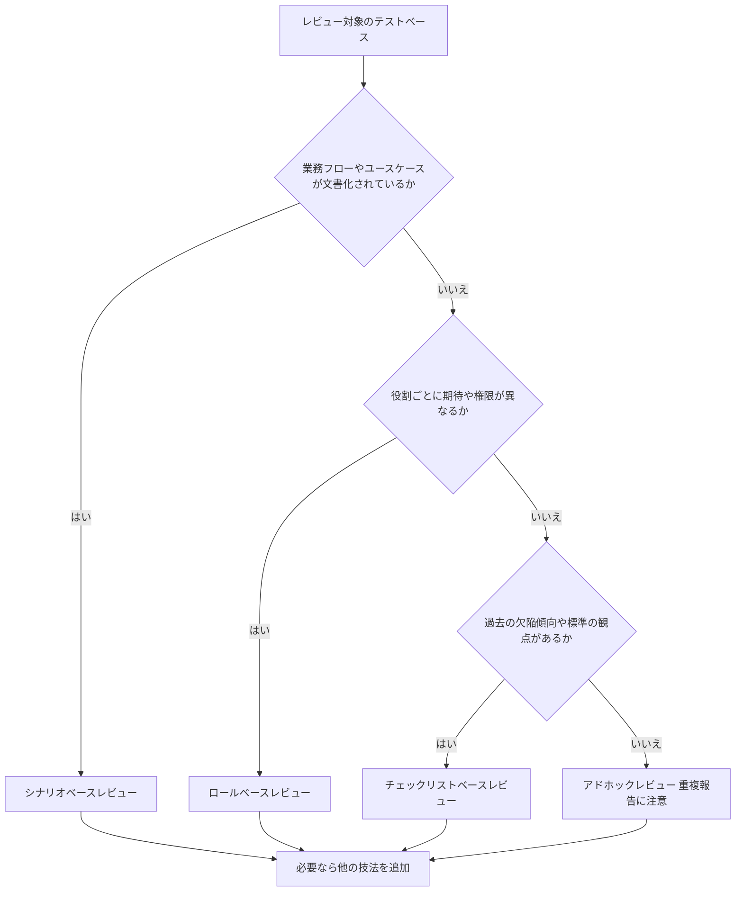
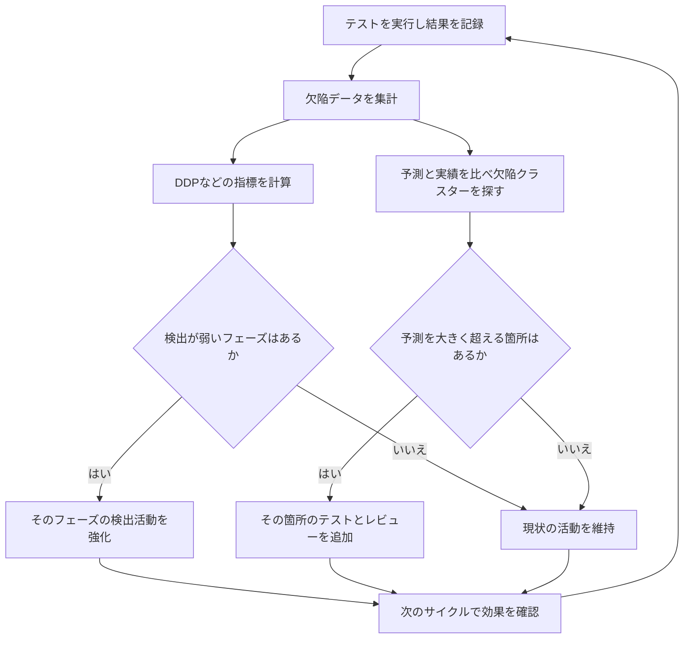
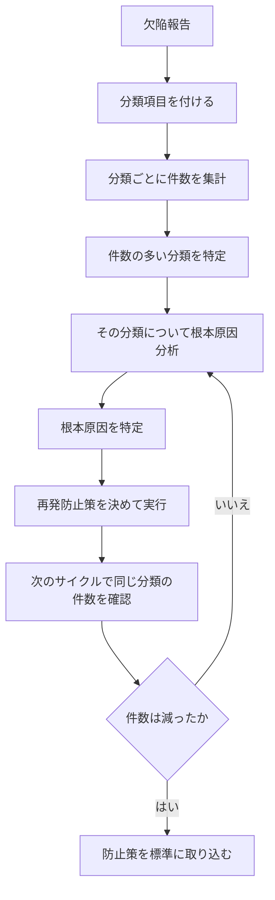

# CTAL-TA v4.0 第5章「ソフトウェア欠陥防止」初学者向けガイド

> **対象資格**: ISTQB® Certified Tester Advanced Level Test Analyst（CTAL-TA）v4.0
> **対象章**: シラバス第5章 Software Defect Prevention（ソフトウェア欠陥防止）— 学習時間 225 分
> **想定読者**: テスト初学者〜CTFL（Foundation Level）取得直後の方
> **作成日**: 2026-09-20
> **この文書の構成**: パート0〜8。シラバス本文の節番号（5.1〜5.3）と区別するため、本ガイドの区切りは「パート」と呼びます。

---

## パート0　このガイドの使い方と情報源の確度

💡 このパートでは、本ガイドの各記述がどの資料に基づくのかを説明します。試験勉強では「公式に確認できた内容」と「補足知識」を区別して覚えることが大切なので、先にここを読んでおくと後のパートを安全に使えます。

### 0.1 情報源の確度マーク

なぜマークを付けるのか：資格試験の出題範囲は公式シラバスで決まります。補足知識を公式内容と混同すると、試験で間違った知識を根拠に答えてしまうおそれがあるためです。

| マーク | 意味 | 例 |
|:---:|---|---|
| ◎ | 公式シラバス v4.0 の本文で確認した内容（第1〜4章にある第5章への参照記述を含む） | 決定表のレビュー観点、状態遷移テストが欠陥防止に貢献する旨の記述 |
| ○ | 公式サンプル試験 v4.1（設問と解答解説）または公式の学習目標（LO）新旧対応表で確認した内容 | DDP の計算式、レビュー技法4種の特徴 |
| △ | 一般的な業界知識に基づく補足。シラバス第5章の本文では確認できていない内容 | PCE（フェーズ封じ込め有効性）の式、5 Whys の進め方 |

### 0.2 重要な注意（必ず読んでください）

- 第5章の本文（シラバス PDF の 48〜54 ページ）は、資料の取得ツールの上限により、全文を読み込めませんでした。
- そのため第5章の各項目は、次の4つの資料から再構成しています。
  1. 公式ページ掲載の目次と学習目標（LO）
  2. 公式 LO 新旧対応表（v3.1 → v4.0 の変更理由つき）
  3. 公式サンプル試験 v4.1 の第5章関連問題 #38〜#45 とその解答解説
  4. シラバス第1〜3章にある第5章への参照記述（例：「Section 5.2.1 参照」）
- 章内の**正確な文言・図表・キーワード一覧（K1 で暗記が必要な用語）**は、必ず公式シラバス PDF の 48〜54 ページで照合してください（URL はパート8）。

📖 このパートで登場した用語
- LO（Learning Objective）：学習目標。試験問題は LO から作られる
- K レベル：理解の深さの段階。K1＝覚える、K2＝理解する、K3＝適用する、K4＝分析する
- サンプル試験：ISTQB が公開している練習用の試験問題と解答解説

---

## パート1　第5章の全体像

💡 このパートでは、第5章が何を目指していて、どの節が何分で、どのレベルまで問われるのかを整理します。地図を先に見ておくと、後のパートで迷いにくくなります。

### 1.1 一言でいうと

第5章は「テストアナリスト（TA＝ビジネス寄りのテストを担当する役割）が、欠陥を**見つけるだけでなく、生まれにくく・逃げにくくする**ための章」です。

たとえ話：虫歯は、治療（歯医者）より予防（毎日の歯磨きと定期検診）のほうが、痛みも費用も小さくて済みます。テストも同じで、完成した製品を動かして欠陥を探す（治療）より、仕様書の段階で誤りを止める（予防）ほうが、手戻りが小さくなります。

### 1.2 章の構造

この図は、第5章の3つの節と、その下にある学習目標の関係を表しています。上から下へ読み進めてください。

各ノードの意味：
- 「5.1 欠陥防止の実践」：TA が防止のためにできることの全体像（説明できれば十分な K2）
- 「5.2 フェーズ封じ込めの支援」：欠陥を混入したフェーズの中で止めるための2つの手段（モデルとレビュー。どちらも実際に使える K3）
- 「5.3 欠陥の再発緩和」：テスト結果を分析し、同じ欠陥を繰り返さないようにする（分析まで求められる K4 を含む）

### 1.3 学習目標（LO）一覧【○】

| LO | K | 目安時間 | 内容 |
|---|:---:|:---:|---|
| TA-5.1.1 | K2 | 15 分 | TA が欠陥防止にどう貢献できるかを説明する |
| TA-5.2.1 | K3 | 60 分 | テスト対象のモデルを使って、仕様の欠陥を検出する |
| TA-5.2.2 | K3 | 60 分 | テストベースにレビュー技法を適用して欠陥を検出する |
| TA-5.3.1 | K4 | 75 分 | テスト結果を分析して、欠陥検出の改善点を特定する |
| TA-5.3.2 | K2 | 15 分 | 欠陥分類が根本原因分析をどう支えるかを説明する |
| **合計** | | **225 分** | 公式ページの章別時間と一致 |

読み取りのポイント：
- 時間が大きい 5.2.1・5.2.2・5.3.1（合計 195 分）が、学習の中心です。
- K3・K4 の LO は「手を動かして答える」問題（計算や当てはめ）が出る前提で練習します。

### 1.4 v3.1 から v4.0 で何が変わったか【○】

| 観点 | v3.1（旧） | v4.0（新） |
|---|---|---|
| 章タイトル | 5 Reviews（レビュー） | 5 Software Defect Prevention（ソフトウェア欠陥防止） |
| 学習時間 | 120 分 | 225 分 |
| 中心の内容 | チェックリストを使ったレビュー（要件・ユーザーストーリーの問題を特定） | 防止の実践、モデルによる欠陥検出、レビュー技法、テスト結果分析、欠陥分類と RCA |
| 位置づけ | 「レビューに参加する人」 | 「防止と品質管理に多面的に貢献する人」 |

LO 対応表には、v4.0 で「TA の欠陥防止と品質管理への多様な貢献」へ範囲を広げ、「建設的な品質保証の手段を追加した」という趣旨の説明があります。旧版の資格対策書だけで学ぶと、5.1・5.2.1・5.3 の内容が抜けるので注意してください。

### 1.5 試験の基本情報

| 項目 | 内容 | 根拠 |
|---|---|:---:|
| 問題数 | 45 問 | ◎ |
| 合計点 | 78 点 | ◎ |
| 合格点 | 51 点（約 65%） | ◎ |
| 試験時間 | 120 分（非ネイティブ言語は +25%） | ◎ |
| 前提資格 | CTFL（v4.0 が推奨、旧版も可） | ◎ |
| サンプル試験での第5章の配点 | #38〜#45 の 8 問・16 点（78 点中 約 20.5%） | ○ |

- サンプル試験は「実際の試験と同じ配点配分」を保証するものではありません。実際の構成は公式の Exam Structures and Rules 文書で確認してください。
- 公式ページには、旧版 v3.1 の試験終了日（英語：2026-05-16、英語以外：2026-11-16）が告知されています。日本で受けられる版は JSTQB の案内で確認してください。

📖 このパートで登場した用語
- TA（テストアナリスト）：ビジネス要求に近い立場で、テスト分析・設計・実行を担う役割
- 欠陥防止：欠陥が作り込まれる・後工程へ伝わることを減らす活動全般
- テストベース：テストの根拠になる資料（要件、ユーザーストーリー、仕様書など）
- RCA（根本原因分析）：欠陥の「なぜ起きたか」をさかのぼって原因を特定する分析

---

## パート2　5.1 欠陥防止の実践（TA-5.1.1 / K2）

💡 このパートでは、TA が「欠陥を作らせない・早く止める」ために具体的に何をするのかを説明します。ここを理解しておくと、パート3のモデル化やレビューが「防止のための道具」として見えるようになります。

### 2.1 なぜ「検出」だけでは足りないのか

なぜ先に理由を示すのか：テストで欠陥を見つけた時点で、欠陥はすでに作り込まれています。見つけて直す作業（手戻り）にはコストがかかるので、作り込みの段階で減らす発想が必要になります。

| 観点 | 欠陥防止 | 欠陥検出 |
|---|---|---|
| 目的 | 欠陥を作り込ませない、または早い段階で止める | すでにある欠陥を見つける |
| 代表的な活動 | レビュー、リスク分析、モデル化、RCA、設計レビュー | 動的テスト（ソフトウェアを実際に動かすテスト） |
| 効果が出る時期 | 上流ほど大きい | 動くソフトウェアができてから |
| たとえ | 歯磨きと定期検診 | 歯医者での治療 |

サンプル試験の #38（○）は「欠陥防止に**最も効果が低い**活動はどれか」を問い、答えは**動的テスト**です。理由は、動的テストが「すでにテスト対象に存在する欠陥を検出するもの」であり、作り込みを防ぐものではないからです。対して、リスク分析、アーキテクチャ設計のレビュー、根本原因分析は、いずれも防止に効果があると説明されています。

注意したい点：上流の成果物（要件書や設計書）で欠陥を見つけて直すこと自体は、「欠陥が後工程へ伝わるのを防ぐ」ので、防止活動に数えられます（○：#33 と #38 の解説）。「静的テスト＝検出だから防止ではない」と切り分けないようにしてください。

### 2.2 TA が貢献できる活動

この表は、シラバス第1〜3章で確認できる「TA の防止に関わる活動」をまとめたものです。

| 活動 | TA がすること | 防止につながる理由 | 根拠 |
|---|---|---|:---:|
| テストベースの評価 | 要件やユーザーストーリーに含まれる欠陥とテスト容易性を評価し、プロダクトオーナーへ早期にフィードバックする | 実装前に誤りを取り除ける | ◎ 1.2.1 |
| 会話も情報源にする | ユーザーストーリーの協働作成での会話など、口頭の情報も含めてテストベースの完全性を確認する | 文書に無い前提のずれを早く見つけられる | ◎ 1.2.1 |
| リスク分析への参加 | 経験に基づいてリスクを特定・評価し、リスクを最も早く軽減できるテスト活動を提案する（シフトレフト） | 早い段階の対策ほどテスト工数が小さい | ◎ 2.1 |
| モデル化 | テスト技法に沿ってモデル（決定表、状態遷移など）を作り、仕様の矛盾や抜けを見つける | 仕様の欠陥をテスト設計の時点で発見できる | ◎ 3.2.2、3.5.2 / ○ #33 |
| レビュー技法の適用 | テスト分析の一部としてレビュー技法を使い、テストベースの欠陥を見つける | 欠陥が設計・実装へ伝わる前に止められる | ◎ 1.2.1 |
| チェックリストの整備 | 過去の失敗や欠陥の経験をチェックリストに記録して再利用する | 同じ種類の見落としを減らせる | ◎ 3.4.2 |
| テスト結果の分析 | 欠陥の集中や検出の弱いフェーズを見つけ、改善案を出す | 同種の欠陥の再発を減らせる | ◎ 1.2.4 / 5.3 |

シフトレフト（＝テストや品質活動をライフサイクルの早い側へ寄せる考え方）は、シラバス 2.1 に明記されています。

### 2.3 TA の防止活動の流れ

この図は、テスト分析の中で TA が行う防止活動の流れを表しています。上から下へ読み進めてください。

各ノードの意味：
- 「完全性とテスト容易性を確認」：要件に抜けがないか、テストできる書き方になっているかを見る（◎ 1.2.1）
- 「欠陥や曖昧さが見つかったか」（ひし形）：見つかれば記録して共有、なければ次の作業へ進む
- 「欠陥を記録し…」：直接修正されない場合でも、テストベースの欠陥は必ず記録する（◎ 1.2.1）
- 「修正内容を確認し…」：直った内容がテスト条件に反映されているかを確認する

### 2.4 ベストプラクティス

| 項目 | 推奨すること | 避けたいこと | 根拠 |
|---|---|---|:---:|
| テストベースの評価 | テスト分析の入口で必ず行い、直されない欠陥も記録する | 「仕様が悪いのは自分の担当外」と黙って進める | ◎ |
| リスク分析 | 対象を機能やコンポーネントなどのテスト項目に分けて評価する | システム全体を1つのリスクとして扱う | ◎ 2.1 |
| 提案するテスト活動 | 「最も早くリスクを下げられる活動」を選んで提案する | 実装後の動的テストだけに頼る | ◎ 2.1 |
| モデル化 | テストに必要な詳細度で作る | 実装の細部まで描いて保守できなくなる | ◎ 3.2.2 |
| 欠陥報告 | 混入したと思われるフェーズや分類を、報告の項目として残す | 修正内容だけを書く（後で分析できない） | △ |
| 学びの共有 | レトロスペクティブ（＝振り返り会）で防止策を共有する | 個人の経験にとどめる | ◎ 2.1 |
| 決定権 | 矛盾や曖昧さは関係者に確認して解決する | TA が自分の解釈で仕様を決める | △ |

### 2.5 よくある誤解

| 誤解 | 正しい理解 |
|---|---|
| 防止はテスト管理者（TM）の仕事で、TA には関係ない | v4.0 では、TA の成果（BO7：欠陥防止への貢献）として明記されている（◎） |
| 動的テストを増やせば欠陥防止になる | 動的テストは既存の欠陥を検出するもので、防止の効果は最も低い（○ #38） |
| レビューで見つけた欠陥は「検出」であって防止ではない | 上流の欠陥を直すと下流へ伝わらないので、防止に寄与する（○ #38 の解説） |

📖 このパートで登場した用語
- 欠陥防止：欠陥が作り込まれる、または後工程へ伝わるのを減らす活動
- 動的テスト：ソフトウェアを実際に動かして結果を確認するテスト
- 静的テスト：ソフトウェアを動かさず、文書やコードを読んで欠陥を探すテスト（レビューなど）
- シフトレフト：テスト活動をライフサイクルの早い時期へ前倒しする考え方
- 手戻り：完成したと思った作業を、欠陥のために前の状態へ戻してやり直すこと
- レトロスペクティブ：反復や期間の終わりに行う振り返り会
- テスト容易性：仕様がテストしやすい書き方になっている度合い

---

## パート3　5.2 フェーズ封じ込めの支援（前半：考え方・指標・TA-5.2.1 / K3）

💡 このパートでは、欠陥を「混入したフェーズの中で止める」考え方（フェーズ封じ込め）と、その指標（DDP・PCE）、および手段の1つであるモデル化（5.2.1）を説明します。もう1つの手段であるレビュー（5.2.2）は次のパート4で扱います。K3（適用）の範囲なので、計算や当てはめを自分で手を動かして練習してください。

### 3.1 フェーズ封じ込めとは【○／△】

なぜ重要か：後の工程へ流れた欠陥ほど、直すときに戻る範囲が広がり、手戻りが大きくなるためです。

たとえ話：川の上流で汚れを止めれば、下流の浄水場の負担は小さくなります。要件定義という上流で混入した欠陥を、要件の段階で止めるイメージです。

この図は、要件定義で混入した欠陥が、検出の網をすり抜けるたびに後工程へ流れていく様子を表しています。上から下へ読み進めてください。

各ノードの意味：
- 「同じフェーズ内で修正 封じ込め成功」：混入したフェーズの中で欠陥が見つかった状態（最も手戻りが小さい）
- 「流出」：混入したフェーズの検出活動で見つからず、次のフェーズへ持ち越された状態
- 「…まで戻って修正」：見つかったフェーズが遅いほど、戻って直す範囲が広がる

### 3.2 封じ込めの効き目を数字で見る：DDP と PCE

なぜ数字で見るのか：「どのフェーズの検出活動が弱いか」を感覚ではなく数字で示せば、改善の優先順位を関係者と合意しやすくなるためです。

#### (1) 元データの表【○】

サンプル試験 #43 の解答解説の数式から復元した、欠陥の「混入フェーズ × 検出フェーズ」の件数表です（元の設問にある表の画像は取得できなかったため、解説の計算式と矛盾しないように再構成しています）。

| 混入フェーズ ＼ 検出フェーズ | 要件 | 設計 | 実装 | テスト | 合計 |
|---|:---:|:---:|:---:|:---:|:---:|
| 要件 | 10 | 10 | 40 | 20 | 80 |
| 設計 | － | 10 | 90 | 30 | 130 |
| 実装 | － | － | 10 | 90 | 100 |
| テスト | － | － | － | 0 | 0 |

- 設問の前提：4フェーズすべての検出活動を通過し、リリース後に顧客からの欠陥報告はゼロでした。
- 各フェーズの検出活動は、要件＝モデル化とレビュー、設計＝モデル化とレビュー、実装＝静的解析と単体テスト（コンポーネントテスト）、テスト＝システムテストと受入テストです。

#### (2) DDP（欠陥検出率）の計算【○】

DDP（Defect Detection Percentage）は、次の式で求めます。

$$\mathrm{DDP} = \frac{D}{D + E}$$

意味：「そのフェーズの検出活動が見つけた欠陥数 D」を、「D と、そのフェーズを通過して後で見つかった欠陥数 E の合計」で割った値です。網にたとえると、「網の前にいた魚のうち、その網で捕れた割合」です。

計算の手順（トレース）：

| フェーズ | D（そのフェーズで検出） | E（後工程へ逃げた） | D + E | DDP |
|---|:---:|:---:|:---:|:---:|
| 要件 | 10 | 10 + 40 + 20 = 70 | 80 | 10 ÷ 80 = 12.5% |
| 設計 | 10 + 10 = 20 | 40 + 90 + 20 + 30 = 180 | 200 | 20 ÷ 200 = 10% |
| 実装 | 40 + 90 + 10 = 140 | 20 + 30 + 90 = 140 | 280 | 140 ÷ 280 = 50% |
| テスト | 20 + 30 + 90 + 0 = 140 | 0 | 140 | 100% |

- 設計フェーズの D に含まれる「10 + 10」は、要件由来の 10 件と設計由来の 10 件です。
- 4フェーズの中で DDP が最も低いのは設計（10%）です。限られた資源で1か所だけ改善するなら、設計のモデル化とレビューを強化する、という結論になります（○ #43 の正解 b）。

読み取りのコツ：最終のテストフェーズは DDP が 100% でも、それは「最後の網で全部止められた」だけです。上流の DDP が低いことが、後工程での大きな手戻りとして隠れています（△ 読み取りの目安）。

#### (3) PCE（フェーズ封じ込め有効性）【△】

PCE（Phase Containment Effectiveness）は業界でよく使われる指標で、次の式で表されます。

$$\mathrm{PCE} = \frac{\text{そのフェーズで混入し、そのフェーズ内で検出した欠陥数}}{\text{そのフェーズで混入した欠陥の総数}}$$

意味：「作り込んだフェーズの中で、どれだけ自分で見つけて止められたか」です。上の表から計算すると次のとおりです。

| フェーズ | 混入した欠陥数 | 同じフェーズで検出 | PCE |
|---|:---:|:---:|:---:|
| 要件 | 80 | 10 | 12.5% |
| 設計 | 130 | 10 | 約 7.7% |
| 実装 | 100 | 10 | 10% |

DDP と PCE の違い：

| 観点 | DDP | PCE |
|---|---|---|
| 見ているもの | フェーズの検出活動が、その時点で存在する欠陥をどれだけ捕まえたか | フェーズが、自分で混入した欠陥をどれだけ自分で捕まえたか |
| 分母 | その時点で残っている欠陥（前フェーズ由来を含む） | そのフェーズが混入した欠陥だけ |
| 必要なデータ | 検出フェーズ | 混入フェーズ と 検出フェーズ |

注意：PCE の式はシラバス第5章の本文で確認できていません。試験対策では DDP（○）を確実に計算できることを優先してください。ただし、PCE を求めるには**欠陥の混入フェーズを記録している**ことが前提になります。これは 5.3.2 の欠陥分類につながります。

### 3.3 5.2.1 モデルで欠陥を検出する（TA-5.2.1 / K3）

なぜモデルを使うのか：文章の仕様は、読み手が頭の中で補ってしまうため、矛盾や抜けに気づきにくい性質があります。たとえ話：建築の図面を描くと、「この扉を開けると壁にぶつかる」と工事の前に気づけます。仕様を図や表（モデル）にすると、同じように文章では隠れていた欠陥が見えてきます。

シラバスの根拠：状態遷移テストは「モデル化の過程で仕様の欠陥を見つけるので、欠陥防止に貢献する」と書かれています（◎ 3.2.2）。テスト設計の自動化の利点の1つも「テストのためのモデル化が、テストベースの品質を評価する有効な方法」であることです（◎ 3.5.2）。

#### (1) 仕様の種類とモデルの選び方

この図は、仕様の性質からどのモデルを使うかを決める流れを表しています。上から下へ読み進めてください。

各ノードの意味：
- 「状態遷移モデル」：状態を丸、遷移（＝状態が変わること）を矢印で表す
- 「決定表」：条件の組合せ（ルール）と結果（アクション）を表にする
- 「CRUD マトリクス」：機能とデータの対応を、作成・参照・更新・削除の頭文字で示す
- 「ユースケースやアクティビティ図」：利用者とシステムのやり取りを、正常系・代替・例外の流れとして描く

| 仕様の性質 | モデル | 見つかりやすい欠陥 | 根拠 |
|---|---|---|:---:|
| 状態に依存しないビジネスルール | 決定表 | 不整合、不完全、実現不能なルール、重複 | ◎ 3.3.1 / ○ #39 |
| 状態に依存する振る舞い | 状態遷移モデル | 同じ状態・同じイベントで結果が複数ある曖昧さ、未定義の遷移 | ◎ 3.2.2 / ○ #40 |
| データのライフサイクル | CRUD マトリクス | 欠けている操作（完全性テストは静的テスト） | ◎ 3.2.1 |
| 業務フロー | ユースケース、アクティビティ図 | 抜けている代替フローや例外フロー | ◎ 3.2.3 |

#### (2) 決定表のレビュー基準【◎ 3.3.1】

シラバスは、決定表を関係者とレビューする際の基準として次の4つを挙げています。

| 基準 | 意味 | 問題があるとどうなるか |
|---|---|---|
| 一貫性（consistency） | 同じ条件の組合せに複数のルールが当てはまるなら、結果が同じである | 矛盾する結果が仕様に書かれている |
| 実現可能性（feasibility） | 現実に起こり得ない条件の組合せのルールを含まない | 意味のないルールが混ざる |
| 完全性（completeness） | 起こり得る条件の組合せが漏れなく含まれる | 仕様に無い振る舞いが生まれる |
| 正しさ（correctness） | ルールが意図した振る舞いを表している | 意図と違う仕様になる |

チェックサム手順（◎）：最小化した決定表の各ルールが「元の完全な決定表の何個のルールを表すか」を数え、その合計を元の表のルール数と比べます。合計が少なければ不完全、多ければルールの重なり（または余分なルール）があると分かります。合計が等しくても、元の表と同等だと保証されるわけではありません。

#### (3) 実例A：決定表で矛盾を見つける【○ #39 を題材に再構成】

なぜこの例か：要件の文章だけでは気づきにくい矛盾が、決定表にすると表の中で見えるようになる、という流れを体験できるからです。

設定（ある割引システムの仕様）：
- 仕様1：ロイヤルティカードを持つ顧客、または直近の購入額が 1,000 ドル以上の顧客は 10% 割引。それ以外でニュースレター購読者は 5% 割引。
- 仕様2：ニュースレター未登録の顧客は割引なし。

手順1：条件を3つに分け、値を「はい／いいえ」にする。完全な決定表は 2 × 2 × 2 = 8 通りです。

手順2：仕様を4つのルールにする。

| ルール | ロイヤルティカード | 購入額 1,000 ドル以上 | ニュースレター購読 | 割引 |
|---|:---:|:---:|:---:|:---:|
| R1 | はい | － | － | 10% |
| R2 | － | はい | － | 10% |
| R3 | いいえ | いいえ | はい | 5% |
| R4 | － | － | いいえ | 0% |

（「－」は、その条件の値を問わない、という意味です。）

手順3：チェックサムを求める。R1 は 4 通り、R2 は 4 通り、R3 は 1 通り、R4 は 4 通りを表すので、合計は 4 + 4 + 1 + 4 = **13** です。元の表は 8 通りなので 13 は多く、**ルールの重なりがある**と分かります。

手順4：8 通りの組合せそれぞれに、どのルールが当てはまるかを調べる。

| 番号 | ロイヤルティ | 購入額 | ニュースレター | 当てはまるルール | 割引の結果 | 判定 |
|:---:|:---:|:---:|:---:|---|---|:---:|
| 1 | はい | はい | はい | R1、R2 | 10%、10% | 重なりだが結果は同じ |
| 2 | はい | はい | いいえ | R1、R2、R4 | 10%、10%、0% | **矛盾** |
| 3 | はい | いいえ | はい | R1 | 10% | 問題なし |
| 4 | はい | いいえ | いいえ | R1、R4 | 10%、0% | **矛盾** |
| 5 | いいえ | はい | はい | R2 | 10% | 問題なし |
| 6 | いいえ | はい | いいえ | R2、R4 | 10%、0% | **矛盾** |
| 7 | いいえ | いいえ | はい | R3 | 5% | 問題なし |
| 8 | いいえ | いいえ | いいえ | R4 | 0% | 問題なし |

結論：番号 2・4・6 で、同じ組合せに異なる結果が指定されています。これは**不整合**（＝矛盾）という要件の欠陥です（○ #39 の正解 a）。R1 と R2 のように「重なっているが結果が同じ」なものは、それだけでは欠陥ではありません。

TA の次の行動：ロイヤルティ会員がニュースレター未登録のとき 10% と 0% のどちらを優先するのかを、プロダクトオーナーなどの関係者に確認します。TA が自分の解釈で決めてはいけません（△）。

#### (4) 実例B：状態遷移モデルで曖昧さを見つける【○ #40 を題材に再構成】

設定：飲料の自動販売機のコインコントローラー。要件から次の情報を読み取り、状態遷移モデルにします。

- 状態は「空」「一部投入」「十分」の3つ。
- Req253：足りないコインを入れると「一部投入」のまま、金額を加算する。
- Req236：十分な額になったら「十分」へ変わる。
- Req215：「十分」のとき、さらにコインを入れたら**すぐに返却**する。
- Req243：「十分」のとき、さらにコインを入れたら**合計に加算**して表示する。
- Req237：取消しを選ぶとコインを返却し、コントローラーは空になる。

この図は、上の要件から作った状態遷移モデルを、フローチャートの形で表しています。矢印のラベルが「イベントと要件番号」です。

各ノードの意味：
- 「十分」から「十分」へ戻る矢印が2本あり、どちらも**同じ状態・同じイベント（コイン投入）**なのに、結果が「返却」と「加算」で食い違っています。これが曖昧さ（同じ条件で結果が決まらない＝非決定的な振る舞い）です。
- 状態遷移モデルは「状態とイベントの組合せごとに結果は1つ」という形式なので、この食い違いがモデル化の途中で見つかります（○ #40 の正解 d）。

もう1つの学び：Req236 にある「十分なコイン」という言葉の曖昧さは、状態遷移モデルでは**見つかりません**（○ #40 の選択肢 a の解説）。モデルが得意な欠陥（矛盾・未定義の遷移）と、苦手な欠陥（言葉の曖昧さ）があるため、レビューと組み合わせるのが安全です。

#### (5) 実例C：CRUD マトリクスで抜けを見つける【◎ 3.2.1 を題材に再構成】

CRUD マトリクスは、行に機能、列にデータ（エンティティ）を置き、機能がデータに行う操作を C（作成）、R（参照）、U（更新）、D（削除）で記入した表です。「完全性テスト」は、この表を使って**すべてのエンティティに 4 つの操作がそろっているか**を確認する静的テストです。操作が無いのは、調査が必要な異常（アノマリー）とされます（◎）。

| 機能 ＼ データ | 会員 | 注文 |
|---|:---:|:---:|
| 会員登録 | C | |
| 会員情報の変更 | R U | |
| 退会 | D | |
| 注文する | R | C |
| 注文履歴の表示 | R | R |
| 注文内容の変更 | | U |

読み取り：「注文」の列には C・R・U はありますが **D（削除）がありません**。注文の取消し機能が仕様から漏れているのか、意図して削除させないのかを確認する必要があります。「会員」の列は C・R・U・D がそろっています。

#### (6) モデル化のベストプラクティス

| 項目 | 推奨すること | 避けたいこと | 根拠 |
|---|---|---|:---:|
| モデルの詳細度 | テストに必要な粒度に合わせる | 詳細すぎて保守できない | ◎ 3.2.2 |
| 既存モデルの利用 | テストベースにモデルがあれば、テスト条件が入っているかを確認し、足りなければ調整する | そのまま鵜呑みにする | ◎ 3.2.2 |
| 決定表の高リスク部分 | リスクが高いときは最小化せず、完全な決定表で確認する | 高リスクなのに「－」で圧縮する | ◎ 3.3.1 |
| 発見した矛盾 | 関係者と一緒に決定表やモデルをレビューして解決する | TA が単独で結論を出す | ◎ 3.3.1 / △ |
| モデルの限界の認識 | 言葉の曖昧さなどはレビューで補う | モデルを作れば全ての欠陥が見つかると考える | ○ #40 |
| モデルの保守 | モデルを唯一の情報源とし、保守の負荷を見積もる | モデルを作りっぱなしにする | ◎ 3.5.2 |

📖 このパートで登場した用語
- フェーズ封じ込め：欠陥を、それが混入したフェーズの中で見つけて止めること
- DDP（欠陥検出率）：D ÷ (D + E)。そのフェーズが、その時点の欠陥のうち何割を見つけたか
- PCE：混入したフェーズの中で検出できた割合（△）
- 流出：欠陥が混入したフェーズで見つからず、次のフェーズへ持ち越されること
- モデル：仕様の一部を図や表で表現したもの（決定表、状態遷移図など）
- 状態遷移：イベントをきっかけに、システムの状態が別の状態へ変わること
- 決定表：条件の組合せとその結果（アクション）を表にしたもの
- 不整合：同じ条件の組合せに、異なる結果が指定されていること
- チェックサム（決定表）：最小化した表の各ルールが表す組合せ数の合計。元の表と比べて抜けや重なりを見つける
- CRUD：Create（作成）・Read（参照）・Update（更新）・Delete（削除）
- アノマリー：期待と違う、調べるべき状態や異常

---

## パート4　5.2.2 レビュー技法の適用（TA-5.2.2 / K3）

💡 このパートでは、テストベース（要件・ユーザーストーリーなど）にレビュー技法を適用して欠陥を見つける方法を説明します。パート3のモデル化が「矛盾や抜け」に強いのに対し、レビューは「言葉の曖昧さや利用者視点の問題」にも強いので、両方を使い分けられるようになることが目標です。

### 4.1 なぜレビュー技法を学ぶのか

なぜ先に理由を示すのか：テストベースは文章で書かれているため、人が読んで確認しないと見つからない欠陥が多く残ります。レビューは動くソフトウェアが無い段階で実施できるので、欠陥防止の中心的な手段です。

LO 対応表（○）によると、v3.1 では「要件」「ユーザーストーリー」ごとに別々の LO があり、どちらもチェックリストが前提でした。v4.0 では2つを1つにまとめ、対象を「テストベース」に一般化し、手法も**チェックリストベースだけでなく、さまざまなレビュー技法**へ広げています。

### 4.2 4つのレビュー技法【○ #42】

| 技法 | 進め方 | 向く場面【△】 | 注意点【△】 |
|---|---|---|---|
| シナリオベースレビュー | ユースケースやアクティビティ図を使い、処理を頭の中で「ドライラン」（＝通しで実行）する。文書に書かれたシナリオの外も探索してよい | 業務フローに抜けや矛盾が無いかを見たいとき | 元のシナリオの質に左右される |
| ロールベースレビュー | 架空のペルソナ（管理者、一般利用者など）を使い、特定の役割の立場から読む | 役割ごとに権限や画面、期待が違うとき | ペルソナが現実の利用者とずれると外れる |
| チェックリストベースレビュー | 事前に用意した質問リストに沿って読む。リストに無い項目も探索してよい | 過去に起きた種類の欠陥を見逃したくないとき | リストの項目だけを見て満足してしまう |
| アドホックレビュー | 決まった手順や観点を持たずに読む | 時間が無いとき、初期の粗い確認 | 複数の人が同じ欠陥を報告し、重複が増える |

たとえ話：新築の内覧で、シナリオ＝「朝起きてから出勤するまでの動線を歩く」、ロール＝「車いすの家族の目線で見る」、チェックリスト＝「水回り・電気・鍵の点検表で確認する」、アドホック＝「気になるところを自由に見て回る」です。

#### 選び方の流れ【△ 学習用の目安】

実際のレビューは技法を組み合わせるのが普通です。この図は、最初にどの技法から始めるかを決める目安です。上から下へ読み進めてください。

各ノードの意味：
- 「シナリオベースレビュー」：処理の流れを追って抜けを探す技法
- 「ロールベースレビュー」：役割の立場に立って読む技法
- 「チェックリストベースレビュー」：質問リストを使う技法
- 「アドホックレビュー」：観点を決めずに読む技法。使う場合は、複数人で担当範囲を分けて重複を減らす

### 4.3 レビューの進め方【△ 一般的な手順】

| 手順 | やること | なぜ必要か |
|---|---|---|
| 1. 観点を決める | 使う技法と、確認する品質（正しさ、完全性、テスト容易性など）を決める | 観点が無いと重複と見落としが増える |
| 2. 版を固定する | レビューする文書の版（バージョン）を関係者と合わせる | 版が違うと指摘が噛み合わない |
| 3. 個別に読む | 各自が観点に沿って読み、指摘をためる | 会議の前に十分な指摘を集めるため |
| 4. 指摘を記録する | 場所、内容、理由（根拠）を残す | 後で分類や分析に使うため |
| 5. 集約して確認する | 重複を除き、「本当に欠陥か」を関係者と確認する | 偽陽性（＝欠陥でないものを欠陥と報告すること）を減らすため |
| 6. 修正を確認する | 直った内容が正しいか、テスト条件へ反映されたかを確認する | 修正による新たな欠陥を防ぐため |

シラバス第1章（◎ 1.2.1）は、テスト分析でテスト条件を関係者とレビューして、テストベースが正しく理解されているかを確かめるように述べています。

### 4.4 実例：シナリオベースレビューと偽陽性【○ #41 を題材に再構成】

なぜこの例か：レビューで出した指摘の中に「欠陥ではない指摘（偽陽性）」が混ざる状況を体験し、判断の軸を持てるようにするためです。

設定：オンラインショップに「新規顧客向けガイド」を追加します。ユースケースの流れは次のとおりです。

| 番号 | 主体 | 内容 |
|:---:|---|---|
| 1 | 利用者 | サイトを訪れる |
| 2 | システム | ガイドを案内するバナーを表示する |
| 3 | 利用者 | 案内をクリックする |
| 4 | システム | ガイドを開く |
| 5 | 利用者 | ガイドの導入部を読み、サイトの機能や構成を知る |
| 6 | 利用者 | ガイドの指示に従って購入を完了する |
| 7 | システム | 購入の完了を表示する |
| 8 | 利用者 | ガイドを閉じる |
| 9 | システム | ガイドを終了する |

レビュー担当者が出した4件の指摘と、判断の理由：

| 指摘 | 判断 | 理由 |
|---|:---:|---|
| a. 経験のある利用者が、ガイドを恒久的に非表示にできる選択肢が必要 | 妥当 | 経験者に毎回ガイドを見せると邪魔になる |
| b. 手順4で、利用者が応答したらバナーを隠すべき | 妥当 | 応答後にバナーが残ると、ガイドに集中できない |
| c. ガイドを、好きなときに再表示できる選択肢が必要 | 妥当 | 後から必要になったときに情報へ戻れる |
| d. 手順5の後、ガイドが不要とみなして**自動で閉じる**べき | **偽陽性** | 利用者の同意なく閉じるのは、利用者の制御を奪う。後で必要になるかもしれない |

正解は d の指摘が偽陽性（○ #41 の正解 d）です。判断の軸は「利用者の視点で、その指摘は本当に問題の解決になっているか」です。

### 4.5 チェックリストの作り方と例

シラバス（◎ 3.4.2）は、チェックリストの項目を「はい・いいえ・該当なし」で答えられる質問にし、具体的・曖昧さがない・実行可能・測定可能にして、優先度をつけ、グループに分けるよう述べています。また、チェックリストは完成させず、新しい発見やフィードバックで見直し続けるとされています。以下の項目は、この作り方に沿って本ガイドが用意した**例【△】**です。

#### 要件仕様書のチェックリスト例

| ID | 質問（はい／いいえ／該当なしで答える） | 優先度 | 見つかる欠陥 |
|---|---|:---:|---|
| REQ-01 | 各要件は「誰が・何を・どの条件で」を特定できるか | 高 | 曖昧、不完全 |
| REQ-02 | 「適切な」「必要に応じて」「いくつか」のような曖昧な語を使っていないか | 高 | 曖昧（解釈が複数） |
| REQ-03 | 数値の範囲や境界が、以上・超えるなどを含めて明記されているか | 高 | 境界の誤り |
| REQ-04 | 入力が不正・空のときの振る舞いが書かれているか | 高 | 抜け |
| REQ-05 | 要件同士が矛盾していないか | 高 | 不整合 |
| REQ-06 | 各要件に、合否を判定できる期待結果があるか | 高 | テスト不能 |
| REQ-07 | 同じ用語が、常に同じ意味で使われているか | 中 | 用語のずれ |
| REQ-08 | エラーや例外のときの振る舞いが書かれているか | 中 | 抜け |

「曖昧な語を避ける」観点は、シラバス 1.3.2 が、テストケースの精密さの基準として「適切な」「必要に応じて」「いくつか」などの語を避けるよう述べていることに対応します（◎）。

#### ユーザーストーリーのチェックリスト例

| ID | 質問 | 優先度 | 見つかる欠陥 |
|---|---|:---:|---|
| US-01 | 誰として・何をしたい・なぜ、の3点が書かれているか | 高 | 目的の欠落 |
| US-02 | 受け入れ基準は、テストで合否を判定できる形か | 高 | テスト不能 |
| US-03 | 受け入れ基準に、異常系や境界の条件が含まれているか | 高 | 抜け |
| US-04 | 1回の反復（イテレーション）で終えられる大きさか | 中 | 大きすぎる |
| US-05 | 他のストーリーや外部システムへの依存が書かれているか | 中 | 依存の見落とし |
| US-06 | 必要な非機能の期待（応答時間など）が書かれているか | 中 | 非機能の抜け |

### 4.6 ベストプラクティス

| 項目 | 推奨すること | 避けたいこと | 根拠 |
|---|---|---|:---:|
| 技法の選択 | 対象と目的に合わせて、複数の技法を組み合わせる | 1つの技法だけで完了とする | ○ / △ |
| チェックリスト | 過去の欠陥から項目を育て、定期的に見直す | 一度作って放置する | ◎ 3.4.2 |
| チェックリストの外 | 項目に無い箇所も探索するよう促す | 項目を機械的に消化する | ○ #42 |
| アドホックレビュー | 担当範囲を分けて重複を減らす | 全員が同じ箇所を読む | ○ #42 |
| 指摘の確認 | 「利用者や業務の視点で本当に欠陥か」を関係者と確かめる | 個人の好みを欠陥として報告する | ○ #41 |
| 記録 | 指摘の場所・内容・理由を残し、混入フェーズや分類も付ける | 口頭で伝えて終える | △ |
| 関係者の参加 | テスト条件やモデルを、関係者と一緒にレビューする | TA だけで完結する | ◎ 1.2.1 / 3.3.1 |

📖 このパートで登場した用語
- レビュー技法：文書などを人が読んで欠陥を探すための、観点や進め方の型
- シナリオベースレビュー：ユースケースなどの流れを追いながら読む技法
- ロールベースレビュー：ペルソナ（役割）の立場に立って読む技法
- チェックリストベースレビュー：質問リストに沿って読む技法
- アドホックレビュー：決まった観点を持たずに読む技法
- ペルソナ：典型的な利用者を、人物像として具体的に描いたもの
- ドライラン：実際には動かさず、手順を頭の中や紙の上で通して確認すること
- 偽陽性：欠陥でないものを欠陥として報告してしまうこと
- ユースケース：利用者とシステムのやり取りを、目的ごとにまとめた記述
- 受け入れ基準：ユーザーストーリーが完成したと認める条件

---

## パート5　5.3 欠陥の再発緩和（TA-5.3.1 / K4・TA-5.3.2 / K2）

💡 このパートでは、テスト結果を分析して検出の弱い点を見つける方法（5.3.1）と、欠陥を分類して根本原因分析（RCA）を効率よく行う方法（5.3.2）を説明します。同じ欠陥を繰り返さないための「学習のしくみ」が主題です。

### A. TA-5.3.1 テスト結果を分析して検出の改善点を特定する（K4）

なぜ K4（分析）なのか：与えられた数字から自分で原因や改善点を導く力が求められるためです。試験では表のデータを見て、計算し、どこを改善すべきかを選ぶ形式（○ #43、#44）が出ます。

シラバスの根拠（◎）：
- 1.2.4：TA はテスト結果を評価し、**欠陥クラスター（欠陥が集中している箇所）**を認識して、その部分にさらにテストが必要かを判断する。
- 2.2：各テストサイクルの後に、回帰テスト選択技法の効果をテスト結果から分析し、効果のあった技法を残し、効果の無かった技法を置き換える。

#### 分析のサイクル

この図は、テスト結果の分析から次のサイクルの改善までの流れを表しています。上から下へ読み進めてください。

各ノードの意味：
- 「DDP などの指標を計算」：フェーズごとの検出の強さを数字にする（パート3.2）
- 「予測と実績を比べ…」：欠陥の予測モデルと実績のずれから、欠陥が集中する箇所を探す
- 「次のサイクルで効果を確認」：改善が効いたかどうかを、次のデータで確かめる

#### 技法1：DDP による検出の弱いフェーズの特定

計算の手順と結果はパート3.2にあります。要点だけ再掲します。

| 手順 | 内容 |
|---|---|
| 1 | 混入フェーズと検出フェーズの件数表を作る |
| 2 | フェーズごとに D（そこで検出）と E（後工程へ逃げた）を数える |
| 3 | D ÷ (D + E) を計算する |
| 4 | 最も低いフェーズを、改善の第一候補にする（資源が1か所分だけなら、そこを選ぶ） |

#### 技法2：欠陥クラスター分析【○ #44 を題材に再構成】

なぜこの技法か：欠陥は特定の場所に集まる傾向があるため（欠陥の集中の原則）、集中している箇所を追加で調べると、残っている欠陥を効率よく見つけられるからです。

設定：ホームセキュリティシステムは4つの部品でできています。類似プロジェクトでは、部品の大きさと欠陥数に強い相関があり、**平均で 50 行あたり 1 件**の欠陥が見つかっていました。これを予測モデル（予測件数 ＝ 行数 ÷ 50）として使います。

| 部品 | 行数 | 予測件数（行数 ÷ 50） | 実績件数 | 実績 ÷ 予測 | 判定 |
|---|:---:|:---:|:---:|:---:|---|
| 制御パネル | 600 | 12 | 14 | 約 1.17 | 予測どおり |
| ユーザーインターフェース | 2,000 | 40 | 45 | 約 1.13 | 予測どおり |
| バックエンド | 400 | 8 | 17 | 約 2.13 | **予測の2倍超 → 欠陥が集中** |
| イベント処理エンジン | 500 | 10 | 8 | 0.8 | 予測より少ない |

結論：さらに厳しくテストすれば欠陥が見つかりそうなのは**バックエンド**です（○ #44 の正解 c）。

見落としやすい点：
- 実績の**絶対数**が最も多いのはユーザーインターフェースの 45 件ですが、部品が最も大きいので、この件数は予測とほぼ一致します。「多い」ではなく「予測より多い」に注目します。
- 「予測の2倍超」を集中の目印として読み取っているのは、この問題の解説です。実務での閾値は、組織の過去データで決めます（△）。

#### 技法3：回帰テスト選択の効果の検証【◎ 2.2】

シラバスは、回帰テストの選択技法（リスクベース、履歴ベース、カバレッジベース、要件トレーサビリティマトリクス、運用プロファイル、影響分析）を挙げたうえで、サイクルごとに効果を分析して見直すよう述べています。たとえば、各技法で選んだテストがそのサイクルで見つけた欠陥の数を比べ、効果の低い技法を別の技法へ置き換えます（△ 進め方の例）。

#### 分析結果から改善アクションへ【△】

| 分析でわかったこと | 考えられる改善アクション |
|---|---|
| 設計フェーズの DDP が低い | 設計のモデル化を増やす、設計レビューのチェックリストを強化する |
| 要件由来の欠陥が下流で多く見つかる | 要件レビューに、シナリオベースやロールベースを追加する |
| 特定の部品に欠陥が集中している | その部品のテストを追加し、レビューの観点も増やす |
| 同じ種類の欠陥が繰り返される | 欠陥を分類して RCA を行う（次の B） |
| 回帰テストの選択が空振りしている | 選択技法を見直す |

#### K4 問題の解き方【△ 学習法】

| 手順 | やること |
|---|---|
| 1 | 表の意味（行と列、何を数えているか）を確認する |
| 2 | 設問が求める指標（DDP、予測との比、など）を式にして計算する |
| 3 | 計算結果を並べて、最低または最大の乖離を見つける |
| 4 | 設問の制約（例：資源の都合で1か所だけ）に合う選択肢を選ぶ |
| 5 | 理由を1文で言えるか確かめる（「設計の DDP が 10% で最低だから」など） |

### B. TA-5.3.2 欠陥分類が根本原因分析をどう支えるか（K2）

なぜ分類が必要なのか：欠陥は数が多く、1件ずつ根本原因を調べて対策を立てるのは時間がかかりすぎます。たとえ話：散らかった部屋を片付けるとき、1個ずつ考えるより、「衣類」「書類」「食器」に仕分けてから収納方法を決めるほうが早く終わります。欠陥も、似た特徴ごとに仕分けしてから原因を調べると効率が上がります。

サンプル試験 #45（○）の正解と理由：**「欠陥の個々ではなく、似た特徴を持つ欠陥のグループを対象に分析できるので、RCA が効率的になる」**。他の選択肢が誤りである理由も、理解の助けになります。

| 誤った説明 | なぜ誤りか（○ #45 の解説） |
|---|---|
| 分類すれば、静的・動的テストの前に、抽象的なカテゴリだけで RCA ができる | RCA は具体的な欠陥や故障が存在して初めて行える。先にテストが必要 |
| 分類はテスト技法と同じ開発ライフサイクルモデルを使うので、RCA をテスト技法と組み合わせられる | RCA とテスト技法に、そのような共通点は無い |
| 分類で欠陥をより深く分析でき、より多くの根本原因が見つかる | 分類は問題をより一般的な高い視点へ引き上げるので、詳細な分析の手段ではない |

#### 分類から再発防止までの流れ

この図は、欠陥報告から再発防止策の効果確認までの流れを表しています。上から下へ読み進めてください。

各ノードの意味：
- 「分類項目を付ける」：欠陥報告に、あらかじめ決めた分類を記録する
- 「件数の多い分類を特定」：どのグループに集中して対策すると効果が大きいかを選ぶ
- 「根本原因分析」：選んだグループについて、なぜ起きたかをさかのぼる
- 「件数は減ったか」（ひし形）：対策が効いたかを、次のサイクルの分類別件数で確認する

#### 分類の軸の例【△】

| 分類の軸 | 例 | 何に使うか |
|---|---|---|
| 混入フェーズ | 要件、設計、実装、テストウェア | PCE の計算、上流の弱点の特定 |
| 検出フェーズ | レビュー、単体テスト、システムテスト、本番 | DDP の計算 |
| 欠陥タイプ | 曖昧な要件、境界の誤り、状態管理、データ、環境 | 再発しやすい種類の特定 |
| 原因カテゴリ | 知識不足、レビュー漏れ、ツール、コミュニケーション | RCA の入口 |
| 影響度 | 重大、高、中、低 | 対策の優先順位 |

既存の分類体系として、シラバス 3.4.2 は、欠陥のライブラリや分類（Beizer、Kaner ら）をチェックリスト作りの情報源に挙げています（◎）。組織では、これらを参考に自社の分類項目を決めます（IEEE 1044 や ODC など、他の体系もあります【△】）。

#### 根本原因分析の例：5 Whys【△】

5 Whys（＝「なぜ」を5回ほど繰り返して原因をさかのぼる手法）の例です。サンプル試験 #11 の状況（銀行口座番号の検証不足で、決済が拒否された）を題材に、本ガイドが作った**説明用の例**です。

| 段階 | 問い | 答え |
|:---:|---|---|
| 1 | なぜ決済が拒否されたか | 不正な口座番号が送られた |
| 2 | なぜ不正な番号が送られたか | モバイルアプリで口座番号の検証をしていなかった |
| 3 | なぜ検証をしていなかったか | 要件に、入力検証の仕様が書かれていなかった |
| 4 | なぜ要件に無かったか | 要件レビューのチェックリストに、入力検証の観点が無かった |
| 5 | なぜ観点が無かったか | 過去の欠陥をチェックリストへ反映する決まりが無かった |

対策の例：チェックリストに入力検証の観点（REQ-03、REQ-04）を追加する、欠陥を分類して定期的にチェックリストへ反映する、ドメインテストで境界を確認する。

#### 分類の落とし穴【△】

| 落とし穴 | 対策 |
|---|---|
| 分類が細かすぎて、選ぶのに迷う | 項目を絞り、選択基準を用語集にする |
| 「その他」が増える | 「その他」が一定割合を超えたら、項目を見直す |
| 人によって付け方が違う | 判断例を共有し、定期的にそろえる |
| 分類を付けるだけで分析しない | 集計と RCA の担当と頻度を決める |

### C. ベストプラクティス

| 項目 | 推奨すること | 避けたいこと | 根拠 |
|---|---|---|:---:|
| テスト結果の評価 | サイクルごとに欠陥クラスターを確認する | 件数の多い少ないだけで判断する | ◎ 1.2.4 / ○ #44 |
| 指標の使い方 | DDP を、フェーズ間で比べて改善先を決める | 最終テストの DDP だけを見て安心する | ○ #43 / △ |
| 予測との比較 | 大きさなどで正規化した予測と実績を比べる | 絶対数だけで判断する | ○ #44 |
| 回帰テスト選択 | サイクルごとに技法の効果を見直す | 選択技法を固定し続ける | ◎ 2.2 |
| 欠陥分類 | 混入フェーズと検出フェーズを必ず記録する | 修正内容だけを記録する | △ |
| RCA | 分類で集計し、件数の多いグループから行う | 全件を1つずつ分析する | ○ #45 |
| 防止策の確認 | 次のサイクルで同じ分類の件数が減ったかを確かめる | 対策を実施して終わりにする | △ |

📖 このパートで登場した用語
- 欠陥クラスター：欠陥が特定の部品や機能に集中している状態
- 欠陥の集中の原則：欠陥は一部のモジュールに集中する傾向があるという考え方
- 予測モデル：過去のデータから、欠陥件数などを見積もる式（例：行数 ÷ 50）
- 正規化：大きさの違いを取り除いて比べられるようにすること（例：行数あたりの欠陥数）
- 欠陥分類：欠陥を、種類や混入フェーズなどの特徴でグループに分けること
- 根本原因：欠陥を引き起こした、最も深いところにある原因
- 5 Whys：「なぜ」を繰り返して根本原因へ近づく手法
- 回帰テスト：変更によって、既存の機能が壊れていないかを確かめるテスト
- 影響分析：変更の影響が及ぶ範囲（部品やテスト）を調べること

---

## パート6　ツール・機能別のベストプラクティス

💡 このパートでは、欠陥防止と再発緩和を支える各種ツール（機能）を、どう使い、どう設定するとよいかを整理します。パート3〜5の手法を、日々の運用へ落とし込むための章です。

なぜツールを取り上げるのか：DDP の計算やクラスター分析、分類別の集計は、欠陥データが整っていないと実行できません。ツールの項目設計が、防止活動の土台になるためです。

シラバス 1.3.7（◎）は、テストウェアの管理に使うツールの種類として、テスト管理、欠陥管理、テストデータ管理、構成管理、要件管理の各ツールを挙げています。次の表は、その種類ごとに、防止・再発緩和での使い方を本ガイドがまとめたものです。

| ツールの種類 | シラバスでの位置づけ【◎】 | 防止・再発緩和での使い方【△】 | 設定・運用のベストプラクティス【△】 |
|---|---|---|---|
| 欠陥管理ツール | 欠陥の記録・優先度づけ・解決状況の追跡 | 混入フェーズ、検出フェーズ、分類を項目にして、DDP・クラスター・RCA の元データにする | 分類は選択式にする。必須項目にして記入漏れを防ぐ。分類の意味を用語集にする |
| テスト管理ツール | テスト条件・テストケース・実行結果などの保管庫。トレーサビリティ（追跡性）の確保、進捗と品質の報告 | 欠陥が出た要件から、関連するテストや影響範囲をたどる。欠陥の集中を機能別に集計する | 要件・テスト条件・テスト・実行・欠陥をつなぐ。テストケースにメタデータを付ける |
| 要件管理ツール | 要件の保持、版管理、ライフサイクル全体での追跡 | レビューの対象版を固定する。要件変更の影響を、関連するテストへ伝える | レビューした版を記録する。変更履歴を残す |
| 構成管理ツール | 開発・リリース・運用に関わるテスト活動、テスト環境の構成と可用性の管理 | 変更された構成項目から、影響を受けるテストを選ぶ（影響分析）。古くなったテストケースを見つける | 版とテスト対象の版を対応づける（◎ 1.3.7） |
| モデルベーステスト・テスト設計自動化のツール | モデルからテストウェアを生成。利点：欠陥防止、追跡性、保守の軽さ、関係者との協働（◎ 3.5.2） | 状態遷移モデルなどをレビューして仕様の欠陥を見つける。モデルを唯一の情報源にする | リスクにも注意する：モデルに無い条件の見落とし、モデル保守の見積もり不足、関係者にとって分かりにくいモデル（◎ 3.5.2） |
| テキストで書ける作図ツール（例：Mermaid） | （シラバスの記述なし） | フローチャートや状態遷移を文書内に書き、版管理とレビューの対象にする | 図もテキストとして版管理し、レビュー時の差分を確認する |

📖 このパートで登場した用語
- トレーサビリティ（追跡性）：要件・テスト条件・テストケース・欠陥などの関係をたどれること
- メタデータ：テストケースに付ける付随情報（実行の工数、必要な環境など）
- 構成管理：成果物の版や構成を管理し、変更を追跡できるようにすること
- モデルベーステスト：モデルからテストを導く（または生成する）方法
- 版管理：文書やコードの変更履歴を管理すること

---

## パート7　試験対策

💡 このパートでは、公式サンプル試験の第5章関連問題を整理し、混同しやすい概念を比べ、自作の練習問題で手を動かします。試験の直前にここだけ見返しても使えるようにまとめています。

### 7.1 公式サンプル試験 #38〜#45 の整理【○】

設問文は原文を写さず、要点を言い換えています。実際の設問は公式のサンプル試験（パート8）で確認してください。

| 問 | LO | K | 点 | 論点 | 正解（原本の記号） | 根拠の要点 |
|:---:|---|:---:|:---:|---|:---:|---|
| #38 | TA-5.1.1 | K2 | 1 | 欠陥防止に最も効果が低い活動 | a（動的テスト） | 既存の欠陥を検出する活動で、作り込みは防げない |
| #39 | TA-5.2.1 | K3 | 2 | 決定表の分析で見つかる要件の問題 | a（不整合） | 同じ組合せに、異なる割引が指定されている |
| #40 | TA-5.2.1 | K3 | 2 | 状態機械でのモデル化で見つかりやすい異常 | d | 同じ状態・同じイベントに、競合する結果が2つある曖昧さ |
| #41 | TA-5.2.2 | K3 | 2 | シナリオベースレビューでの偽陽性の指摘 | d | 利用者の同意なくガイドを自動で閉じる提案は、問題の解決になっていない |
| #42 | TA-5.2.2 | K3 | 2 | レビュー技法の説明と名称の対応 | c（1-C、2-D、3-A、4-B） | シナリオ＝ドライラン、ロール＝ペルソナ、アドホック＝無構造、チェックリスト＝事前の質問リスト |
| #43 | TA-5.3.1 | K4 | 3 | DDP で改善すべきフェーズ | b（設計） | 設計の DDP が 10% で最低 |
| #44 | TA-5.3.1 | K4 | 3 | 欠陥クラスターの特定 | c（バックエンド） | 実績が予測の2倍超 |
| #45 | TA-5.3.2 | K2 | 1 | 分類が RCA を支える理由 | c | 個別ではなくグループで分析でき、効率的 |

### 7.2 混同しやすい概念の比較

| 比べるもの | 違い |
|---|---|
| 欠陥防止 と 欠陥検出 | 防止は作り込みや流出を減らす活動。検出は存在する欠陥を見つける活動。上流での検出・修正は防止に寄与する（○） |
| DDP と PCE | DDP はその時点で残る欠陥のうち何割を見つけたか。PCE は自分で混入した欠陥のうち何割を自分で見つけたか（PCE は△） |
| 不整合・不完全・重複（決定表） | 不整合＝同じ組合せに異なる結果。不完全＝起こり得る組合せに結果が無い。重複＝複数のルールが同じ組合せに当てはまる（結果が同じなら欠陥とは限らない） |
| モデルが得意な欠陥 と レビューが得意な欠陥 | モデルは矛盾・未定義の遷移・抜けに強い。言葉の曖昧さはモデルでは見つからない（○ #40） |
| 4つのレビュー技法 | シナリオ＝流れを追う、ロール＝役割の目線、チェックリスト＝質問リスト（リスト外も探索）、アドホック＝無構造（重複に注意） |
| 欠陥の多さ と 欠陥の集中 | 多さは絶対数。集中は予測（大きさなどから見積もった件数）との比較で判断する（○ #44） |
| 欠陥分類 と RCA | 分類は仕分け。RCA は原因をさかのぼる分析。分類で件数の多いグループを選び、そこで RCA を行う（○ #45） |

### 7.3 この章の暗記ポイント

- LO と K レベル：5.1.1＝K2、5.2.1＝K3、5.2.2＝K3、5.3.1＝K4、5.3.2＝K2（○）
- DDP ＝ D ÷ (D + E)（○）
- 決定表のレビュー基準：一貫性、実現可能性、完全性、正しさ（◎ 3.3.1）
- 欠陥防止に最も効果が低い活動は動的テスト（○ #38）
- 分類が RCA を効率的にする理由は、グループ単位で分析できること（○ #45）
- K1 で暗記が必要な**キーワード一覧は、シラバス第5章の冒頭（48 ページ付近）で確認してください**（本ガイドでは未確認）

### 7.4 練習問題（本ガイドのオリジナル）

#### 問1（K2）
テストアナリストの活動のうち、欠陥防止への貢献として最も適切なものはどれか。

a) 完成したシステムのシステムテストで、欠陥を報告する
b) 要件レビューで曖昧な表現を指摘し、関係者に確認する
c) 自動テストの実行回数を増やす
d) 修正された欠陥の再テストを行う

#### 問2（K3）
設計フェーズの検出活動で 30 件の欠陥を見つけました。設計フェーズを通過して、後のフェーズで見つかった欠陥は 90 件でした。設計フェーズの DDP を求めなさい。

#### 問3（K3）
次の決定表について、問題点を2つ挙げなさい。条件は「会員か」「クーポンがあるか」で、値はどちらも「はい／いいえ」です。

| ルール | 会員 | クーポン | 割引 |
|---|:---:|:---:|:---:|
| R1 | はい | － | 10% |
| R2 | － | はい | 20% |

#### 問4（K4）
4つの部品で、予測件数（行数から見積もった値）と実績件数を比べました。追加のテストとレビューを最も優先すべき部品はどれか。理由もあわせて答えなさい。

| 部品 | 予測件数 | 実績件数 |
|---|:---:|:---:|
| A | 10 | 11 |
| B | 20 | 45 |
| C | 30 | 28 |
| D | 5 | 6 |

#### 問5（K2）
欠陥分類が根本原因分析（RCA）を支える理由を、1文で説明しなさい。

#### 問6（K3）
次の説明と、レビュー技法の名称を対応づけなさい。

1. 管理者と一般利用者のような、架空の役割の立場から読む
2. 観点を決めず、自由に読む
3. 事前に用意した質問リストに沿って読み、リストに無い箇所も探索する
4. ユースケースを頭の中で通して確認する

#### 解答と解説

| 問 | 解答 | 解説 |
|:---:|---|---|
| 1 | b | 上流の成果物で欠陥や曖昧さを止めるのが防止。a・c・d は既存の欠陥の検出や確認の活動 |
| 2 | 25% | 30 ÷ (30 + 90) ＝ 30 ÷ 120 ＝ 0.25 |
| 3 | ①不整合：会員かつクーポンありの組合せに、10% と 20% の2つが指定されている　②不完全：会員でなく、クーポンも無い組合せにルールが無い | 元の表は 2 × 2 ＝ 4 通り。R1 は 2 通り、R2 は 2 通りを表し、チェックサムは 4 で元と等しい。しかし、重なりが1通りと、抜けが1通りあり、**チェックサムが等しくても正しいとは限らない**（◎ 3.3.1） |
| 4 | B | 実績 ÷ 予測は、A＝1.1、B＝2.25、C＝約 0.93、D＝1.2。B だけが予測を大きく超え、欠陥が集中していると考えられる |
| 5 | 欠陥を似た特徴のグループにまとめるので、個々ではなくグループ単位で原因を分析でき、RCA が効率的になる | ○ #45 の趣旨 |
| 6 | 1＝ロールベース、2＝アドホック、3＝チェックリストベース、4＝シナリオベース | ○ #42 の対応と同じ |

### 7.5 学習計画の例【△】

| 順 | 内容 | 目安 |
|:---:|---|---|
| 1 | パート1〜2 を通読し、防止の全体像を理解する | 30 分 |
| 2 | パート3 の DDP と決定表を、自分で紙に書いて計算する | 60 分 |
| 3 | パート4 の 4 技法と偽陽性の判断を、自分の言葉で説明する | 45 分 |
| 4 | パート5 の DDP とクラスター分析の計算を、データを変えて繰り返す | 60 分 |
| 5 | 公式サンプル試験の #38〜#45 を、解説を見ずに解く | 30 分 |
| 6 | 公式シラバス 48〜54 ページを読み、本ガイドの△の記述を照合する | 60 分 |

📖 このパートで登場した用語
- サンプル試験：ISTQB が公開している、練習用の試験問題と解答解説。実際の試験そのものではない
- 混同しやすい概念：似ているために取り違えやすい用語や手法。比較表で違いを整理して覚える
- オリジナル練習問題：本ガイドが学習用に作った問題。ISTQB の公式問題ではない
- 照合：本ガイドの記述を、公式資料の原文と突き合わせて確かめること

---

## パート8　根拠となるソース（URL）

💡 このパートでは、本ガイドの根拠になった資料の URL と、何に使ったかを示します。試験の根拠は公式資料が最優先なので、迷ったらここへ戻って原文を確認してください。確認日はすべて 2026-09-20 です。

| 資料 | URL | 本ガイドでの使い方 | 取得状況 |
|---|---|---|---|
| CTAL-TA 公式ページ | https://istqb.org/certifications/certified-tester-advanced-level-test-analyst/ | 目次、試験構造（45 問・78 点・合格 51 点・120 分）、ビジネスアウトカム、旧版の試験終了日 | 本文を取得 |
| CTAL-TA シラバス v4.0（公式ダウンロード） | https://istqb.org/?sdm_process_download=1&download_id=5745 | 第1〜4章の本文（◎）、目次、章別時間 | 第4章冒頭まで取得。**第5章本文は未取得** |
| 同シラバスの公式サイト内保管先 | https://istqb.org/wp-content/uploads/sdm-uploads/ISTQB-CTAL-TA-Syllabus-v4.0-EN-4.pdf | 第5章本文の照合先（48〜54 ページ） | 検索結果で存在を確認。本文は未取得 |
| サンプル試験 問題 v4.1 | https://istqb.org/?sdm_process_download=1&download_id=5749 | 第5章関連 #38〜#45 の設問（○） | 全文を取得 |
| サンプル試験 解答 v4.1 | https://istqb.org/?sdm_process_download=1&download_id=5759 | 正解、LO、K レベル、各選択肢の解説（○） | 全文を取得 |
| LO 新旧対応表（v4.0 と v3.1） | https://istqb.org/?sdm_process_download=1&download_id=6363 | 第5章の LO、時間、変更理由（○） | 全文を取得 |
| リリースノート v4.0 | https://istqb.org/?sdm_process_download=1&download_id=5762 | 改訂の位置づけ、移行期限の確認 | 全文を取得 |
| 試験の構造とルール | https://istqb.org/?sdm_process_download=1&download_id=3829 | 実際の配点構成の確認先 | 未取得（公式ページ記載の URL） |
| 試験の構造とルール（一覧表） | https://istqb.org/?sdm_process_download=1&download_id=3832 | 同上 | 未取得（公式ページ記載の URL） |
| ISTQB 用語集 | https://glossary.istqb.org/en_US/search?term= | K1 の用語の定義確認先 | 未取得 |
| v4.0 リリースのプレスリリース | https://istqb.org/istqb-certified-tester-advanced-level-test-analyst-ctal-ta-v4-0-press-release/ | 改訂の背景（参考） | 検索結果の抜粋のみ |
| 第三者による v4.0 解説（Trendig） | https://trendig.com/en/blog/new-version-released-istqb-certified-tester-advanced-level-test-analyst-v4/ | 「欠陥防止」が独立した新章になった旨の参考。公式ではない | 検索結果の抜粋のみ |
| JSTQB（日本の加盟団体） | https://jstqb.jp/ | 日本語版シラバス・試験の提供状況の確認先 | 未取得 |

### 8.1 公式シラバス 48〜54 ページで照合すべき項目

本ガイドの△の記述と、未確認の項目を、次の順に照合してください。

1. 第5章冒頭のキーワード一覧（K1 で暗記する用語）
2. 5.1：欠陥防止の実践として挙げられている項目と、その説明の文言
3. 5.2.1：モデルの例と、モデルで検出できる欠陥の種類
4. 5.2.2：各レビュー技法の定義文と、チェックリストの例
5. 5.3.1：分析の指標の名前と式（DDP 以外の指標の有無）
6. 5.3.2：欠陥分類の例と、RCA の説明

### 8.2 このガイドの限界

- 第5章の本文は未取得のため、5.1 の「TA の貢献」の一覧は、第1〜3章の記述とサンプル試験から再構成したものです。シラバスの列挙とは異なる可能性があります。
- PCE の式、レビューの手順、5 Whys、分類の軸、各種チェックリスト、学習計画は、業界一般の知識に基づく補足（△）です。試験の出題根拠としては、必ず公式資料で確認してください。
- 実例A・B・C とレビューの実例は、公式サンプル試験や本ガイドの説明用の設定を、学習用に再構成したものです。

📖 このパートで登場した用語
- 取得状況：本ガイドの作成時に、その資料の本文を実際に読めたかどうか
- 公式資料：ISTQB が発行した文書（シラバス、サンプル試験、用語集など）
- 第三者による解説：ISTQB 以外の組織が書いた解説。参考にはなるが、試験の根拠にはならない

---
