# CTAL-TA v4.0 学習ガイド — 第3章「テスト分析・設計(Test Analysis and Test Design)」

> ISTQB® Certified Tester Advanced Level Test Analyst (CTAL-TA) v4.0 シラバス 第3章の完全解説
> 対象読者: CTFL(Foundation Level)取得済みで、Advanced Level Test Analystを目指す初学者〜中級者のQAエンジニア

---

## 0. このガイドについて

### 0.1 なぜ第3章が重要なのか

CTAL-TA v4.0シラバスは全5章・合計1,215分(20.25時間)の学習時間で構成されていますが、**第3章「テスト分析・設計」だけで615分(全体の約50.6%)** を占めています。CTAL-TA合格の鍵は第3章の理解度にあると言っても過言ではありません。

| 章 | タイトル | 学習時間 | 全体に占める割合 |
|---|---|---|---|
| 第1章 | テストプロセスにおけるテストアナリストのタスク | 225分 | 約18.5% |
| 第2章 | リスクベーステストにおけるテストアナリストのタスク | 90分 | 約7.4% |
| **第3章** | **テスト分析・設計** | **615分** | **約50.6%** |
| 第4章 | 品質特性のテスト | 60分 | 約4.9% |
| 第5章 | ソフトウェア欠陥予防 | 225分 | 約18.5% |
| 合計 | — | 1,215分 | 100% |

出典: ISTQB® CTAL-TA Syllabus v4.0, Section 0.10「How this Syllabus is Organized」

### 0.2 試験の全体像

| 項目 | 内容 |
|---|---|
| 問題数 | 45問 |
| 配点合計 | 78点 |
| 合格ライン | 51点(約65%) |
| 試験時間 | 120分(母国語以外で受験する場合は+25%) |
| 前提資格 | ISTQB® Certified Tester Foundation Level(CTFL)必須 |

出典: ISTQB®公式サイト CTAL-TA v4.0 認定ページ「Exam Structure」

### 0.3 本ガイドの読み方

第3章の各テスト技法は、以下の一貫した流れで解説します。初学者がつまずきやすい「用語は知っているが使い方が分からない」という状態を避けるため、必ず**具体例**と**図解**をセットで提示します。

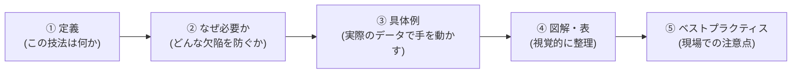

### 0.4 Kレベル(認知レベル)バッジの見方

CTAL-TA シラバスの学習目標には、以下の3段階の認知レベル(Bloom's Taxonomyに基づく)が付与されています。試験問題の難易度に直結するため、各節の冒頭で必ず確認してください。

| バッジ | 意味 | 試験での出され方 |
|---|---|---|
| `K2: 理解` | 概念を要約・説明できる | 定義や特徴を問う選択式問題 |
| `K3: 適用` | 与えられた状況に技法を適用できる | シナリオに基づき、テストケースやカバレッジ項目を実際に導出させる問題 |
| `K4: 分析` | 状況を分析し、最適な選択をくだせる | 複数の技法・アプローチから、状況に最も適したものを選ばせる問題 |

第3章は特に`K3`と`K4`の学習目標が多く、**「知っている」だけでは合格できない章**です。手を動かしてカバレッジ項目やテストケースを実際に導出する演習が不可欠です。

---

## 1. 第3章の全体構造 — 4分類のテスト技法

CTAL-TAシラバスは、ブラックボックステスト技法を**「何をモデル化するか」**という観点で3つに分類し、これに経験ベーステストを加えた4系統で第3章を構成しています。

- **データベースド(data-based)**: データの要素をモデル化する
- **ビヘイビアベースド(behavior-based)**: 動的な振る舞いの要素をモデル化する
- **ルールベースド(rule-based)**: 静的な振る舞いのルール(ビジネスルールなど)をモデル化する
- **経験ベースド(experience-based)**: テスト担当者の経験・知識を活用する

```mermaid
flowchart TD
    ROOT["第3章: テスト分析・設計<br/>(615分/全体の約50.6%)"]

    ROOT --> DB["3.1 データベースド<br/>テスト技法"]
    ROOT --> BB["3.2 ビヘイビアベース<br/>テスト技法"]
    ROOT --> RB["3.3 ルールベース<br/>テスト技法"]
    ROOT --> EB["3.4 経験ベーステスト"]
    ROOT --> AP["3.5 最適な技法の適用"]

    DB --> DB1["3.1.1 ドメインテスト<br/>[K3]"]
    DB --> DB2["3.1.2 組み合わせテスト<br/>[K3]"]
    DB --> DB3["3.1.3 ランダムテスト<br/>[K2]"]

    BB --> BB1["3.2.1 CRUDテスト<br/>[K2]"]
    BB --> BB2["3.2.2 状態遷移テスト<br/>[K3]"]
    BB --> BB3["3.2.3 シナリオベーステスト<br/>[K3]"]

    RB --> RB1["3.3.1 デシジョンテーブルテスト<br/>[K3]"]
    RB --> RB2["3.3.2 メタモルフィックテスト<br/>[K3]"]

    EB --> EB1["3.4.1 テストチャーター<br/>(セッションベーステスト)[K3]"]
    EB --> EB2["3.4.2 チェックリスト<br/>[K3]"]
    EB --> EB3["3.4.3 クラウドテスト<br/>[K2]"]

    AP --> AP1["3.5.1 製品リスクを軽減する<br/>技法選定 [K4]"]
    AP --> AP2["3.5.2 テスト設計自動化の<br/>利点とリスク [K2]"]

    classDef dataFill fill:#dbeafe,stroke:#2563eb,color:#1e3a5f
    classDef behaviorFill fill:#dcfce7,stroke:#16a34a,color:#14532d
    classDef ruleFill fill:#fef3c7,stroke:#d97706,color:#78350f
    classDef expFill fill:#f3e8ff,stroke:#9333ea,color:#581c87
    classDef applyFill fill:#fee2e2,stroke:#dc2626,color:#7f1d1d

    class DB,DB1,DB2,DB3 dataFill
    class BB,BB1,BB2,BB3 behaviorFill
    class RB,RB1,RB2 ruleFill
    class EB,EB1,EB2,EB3 expFill
    class AP,AP1,AP2 applyFill
```

> 💡 **ベストプラクティス — 分類の軸を覚える**
>
> 試験では「この技法はどのカテゴリに属するか」を問う問題が頻出します。迷ったら次の質問で切り分けましょう。
>
> - データの「値」に注目している → **データベースド**
> - システムの「状態遷移」や「時間の流れ」に注目している → **ビヘイビアベースド**
> - 状態に依存しない「条件と結果のルール」に注目している → **ルールベースド**
> - 明文化された網羅基準がなく、担当者の経験や探索に頼る → **経験ベースド**

### 1.1 用語集(キーワード・K1レベル)

シラバスの章見出し直下に列挙されている用語は、明示的な学習目標がなくても定義を暗記すべき`K1`レベルの必須キーワードです。

| 英語キーワード | 日本語訳 |
|---|---|
| checklist-based testing | チェックリストベーステスト |
| behavior-based test technique | ビヘイビアベーステスト技法 |
| combinatorial testing | 組み合わせテスト |
| crowd testing | クラウドテスト |
| CRUD testing | CRUDテスト |
| data-based test technique | データベースドテスト技法 |
| decision table testing | デシジョンテーブルテスト |
| domain testing | ドメインテスト |
| equivalence partition | 同値パーティション |
| experience-based testing | 経験ベーステスト |
| metamorphic relation | メタモルフィック関係 |
| metamorphic testing | メタモルフィックテスト |
| random testing | ランダムテスト |
| rule-based test technique | ルールベーステスト技法 |
| scenario-based testing | シナリオベーステスト |
| session-based testing | セッションベーステスト |
| state transition testing | 状態遷移テスト |
| test charter | テストチャーター |

出典: ISTQB® CTAL-TA Syllabus v4.0, Chapter 3 “Keywords”

---

## 2. 3.1 データベースドテスト技法(Data-Based Test Techniques)

Foundation Levelで学んだ**同値分割(EP)**と**境界値分析(BVA)**は、実は「データベースド」というカテゴリの入り口にすぎません。CTAL-TAでは、この2つの技法を拡張・発展させた3つの技法を扱います。

- **ドメインテスト** — EP/BVAを、複数パラメータが絡む複雑なドメインへ拡張したもの
- **組み合わせテスト** — 複数パラメータの「相互作用」に着目したもの
- **ランダムテスト** — 確率分布に基づきランダムに入力を選択するもの

### 2.1 3.1.1 ドメインテスト(Domain Testing) `K3: 適用`

#### 定義

ドメインテストとは、テスト対象が**同値パーティションの境界(border)付近でどのように振る舞うか**を検証する技法です。ここでいう「境界」は、単純な1変数の不等式(Foundation LevelのBVA)だけでなく、**複数の変数が絡み合う複合条件**(AND/OR/NOTで結合された条件式)によって定義されます。

境界には2種類あります。

| 境界の種類 | 演算子 | 例 |
|---|---|---|
| 閉じた境界(closed border) | `≤` `≥` `=` | `合計金額 ≥ 10000` |
| 開いた境界(open border) | `<` `>` `≠` | `割引率 < 0.5` |

#### なぜ必要か

同値分割やBVAは1つの変数を前提としていますが、実務のシステムでは「複数の入力の組み合わせ」が1つの境界を形成することがほとんどです。例えば「プレミアム会員 **かつ** 購入金額が1万円以上」という条件は、2つの変数が交差してできる2次元の境界線です。この交差点付近にこそ、演算子の取り違え(`>`と`≥`の実装ミスなど)や定数の誤り(`10000`を`1000`と実装するミスなど)が潜みます。ドメインテストは、まさにこの種の欠陥を狙い撃ちする技法です。

#### 4種類の点:ON・OFF・IN・OUT

境界に対して、テストデータは以下の4種類に分類されます。

| 点の種類 | 閉じた境界の場合 | 開いた境界の場合 |
|---|---|---|
| **ON点** | 境界線上の点 | 境界に最も近い、パーティション**内側**の点 |
| **OFF点** | 境界に最も近い、パーティション**外側**の点 | 境界線上の点 |
| **IN点** | パーティションに属し、ON点ではない点 | パーティションに属し、ON点ではない点 |
| **OUT点** | パーティションに属さず、OFF点ではない点 | パーティションに属さず、OFF点ではない点 |

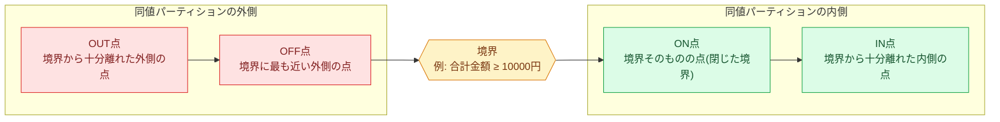

#### 具体例

条件: 「注文数量が5個以上、かつ、合計金額が10,000円を超える場合に送料無料」

- 数量条件: `数量 ≥ 5`(閉じた境界)
- 金額条件: `合計金額 > 10000`(開いた境界)

| 境界 | ON点 | OFF点 | IN点 | OUT点 |
|---|---|---|---|---|
| `数量 ≥ 5`(閉) | 数量=5 | 数量=4 | 数量=10 | 数量=1 |
| `合計金額 > 10000`(開) | 合計金額=10001 | 合計金額=10000 | 合計金額=50000 | 合計金額=3000 |

#### カバレッジ基準

| 基準 | 必要なカバレッジ項目 | 特徴 |
|---|---|---|
| **簡略化ドメインカバレッジ** (Simplified domain coverage) | 各境界(`<` `≤` `>` `≥`)につきON点1つ+OFF点1つ。`=`演算子の境界はON点1つ+反対側のOFF点2つ。`≠`演算子の境界はOFF点1つ+反対側のON点2つ | 項目数が少なく効率的。1つのIN/OUT点を複数の境界で使い回すなど最適化も可能 |
| **信頼性ドメインカバレッジ** (Reliable domain coverage) | 上記に加え、各境界についてIN点・OUT点も追加で取得 | 項目数はやや増えるが、検出できるドメイン欠陥の数は大きく向上する |

> 💡 **ベストプラクティス**
>
> - 境界が多いドメインでは、1つのON/OFF点のペアを隣接するパーティションのOFF/ON点として**使い回す**ことで、テストケース数を最適化できます。
> - リスクが高い機能(決済金額の計算など)には信頼性ドメインカバレッジを、リスクが低い補助的な入力には簡略化ドメインカバレッジを、というように**リスクベースでカバレッジ基準を使い分ける**のが実務的です。
> - 境界条件は要件定義書の「以上・より・未満・以下」といった表現の揺れが原因で誤って実装されやすいため、**要件レビューの段階で境界の演算子を明示的に確認する**ことが上流での欠陥予防につながります。

✅ **良い例**: 「`≥`と`>`を混同していないか」を検証するため、ON点とOFF点を必ずペアで用意する
❌ **悪い例**: IN点だけをテストし、境界そのもの(ON点)をテストしない → 演算子の実装ミスを見逃す典型的な失敗パターン

---

### 2.2 3.1.2 組み合わせテスト(Combinatorial Testing) `K3: 適用`

#### 定義

組み合わせテストは、**複数のパラメータの値が組み合わさったときにのみ発生する不具合(interaction failure/相互作用障害)**を検出するための技法です。設定パラメータの組み合わせを対象にする場合と、入力データ値の組み合わせを対象にする場合の2つのアプローチがあります。

#### なぜ必要か

すべてのパラメータの全組み合わせをテストするのは、パラメータ数が増えると指数的に組み合わせが爆発し、非現実的です。しかし興味深いことに、NISTの実証研究(D. Kuhn et al., 2004)では、**多くのソフトウェア障害が1つまたは2つのパラメータの相互作用だけで引き起こされる**一方、対象システムによっては3つ以上のパラメータが絡む相互作用障害も一定数存在することが分かっています。これは「カップリング効果仮説」(単純な欠陥を検出できれば複雑な欠陥も検出できる)とも整合しつつ、少数パラメータの組み合わせ(特にペアワイズ)を重点的にテストすることの有効性を裏付けていますが、医療機器ソフトウェアのような高リスク領域では3-way以上の組み合わせテストの採用も検討すべきとされています。

#### カバレッジ基準

| カバレッジ基準 | 説明 |
|---|---|
| **ベースチョイスカバレッジ** (Base choice coverage) | 各パラメータについて「基準値」を1つ選び、その組み合わせを「基準カバレッジ項目」とする。以降は、基準カバレッジ項目から**1つのパラメータだけ**を非基準値に置き換えたバリエーションを作成していく |
| **ペアワイズカバレッジ** (Pairwise coverage) | 任意の2つのパラメータについて、その値のすべての組み合わせ(ペア)を少なくとも1回はテストで網羅する |

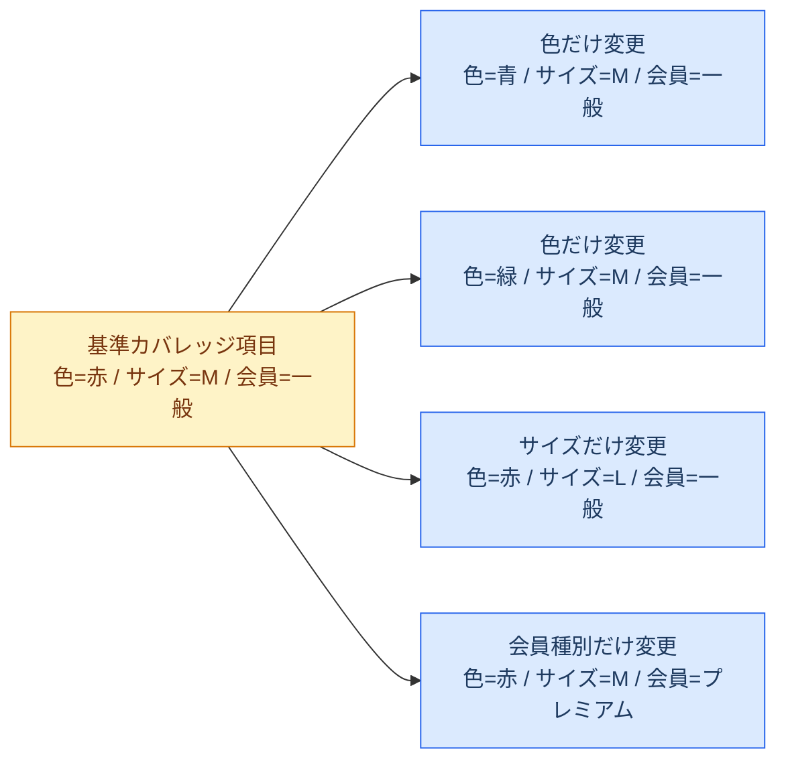

#### 具体例(ペアワイズカバレッジ)

3つのパラメータ「OS(Windows/Mac/Linux)」「ブラウザ(Chrome/Firefox/Safari)」「言語(日本語/英語)」を全組み合わせでテストすると `3 × 3 × 2 = 18` パターンになりますが、ペアワイズ法を使えばそれぞれのペア(OS×ブラウザ、OS×言語、ブラウザ×言語)をすべて1回以上カバーする**わずか数パターン**まで削減できます。パラメータの値が多い場合は、先に同値分割で値の数自体を絞り込み、分類ツリーやフィーチャーモデルで整理してから組み合わせを生成すると効率的です。

> 💡 **ベストプラクティス**
>
> - パラメータ数が多い場合は、専用ツールでペアワイズの組み合わせを自動生成する(手作業での最小集合の算出は一般に困難)。
> - 「無効な組み合わせ」(例: OSがiOSなのにブラウザがInternet Explorer)は制約条件として除外し、実行不可能な組み合わせを生成しないようにする。
> - リスクが非常に高い機能には、ペアワイズではなく**全組み合わせ**、あるいは3パラメータ以上の相互作用も見るn-wiseテストを検討する。

---

### 2.3 3.1.3 ランダムテスト(Random Testing) `K2: 理解`

#### 定義

ランダムテストは、**指定された確率分布に基づき、入力ドメインからテストデータをランダムに選択する**技法です。ガイド付き(guided)とガイドなし(unguided)の2種類があります。

| 種類 | 説明 |
|---|---|
| ガイドなしランダムテスト | 確率分布はプロセス全体を通じて固定 |
| ガイド付きランダムテスト(例: 適応的ランダムテスト) | 過去に選択した値に基づいて分布を調整し、ドメイン全体をより効果的にカバーしようとする |

#### 利点と限界

| 利点 | 限界 |
|---|---|
| ドメイン知識が少なくても実施できる | データの意味(セマンティクス)を考慮しないため、意味に関連する欠陥を見逃す可能性がある |
| 大量のテストデータが必要な場合にコスト効率が良い | 冗長なテストが生成されやすい |
| テスト対象の信頼性を確率論的に把握できる | 自動テストオラクルへの依存度が高い |
| 人手によるテストで生じがちな「思い込みによる見落とし」を回避できる | 出力自体がランダムなため、テスト結果の一貫性が損なわれることがある |

ランダムテストには決まったカバレッジ基準がないため、終了基準は「実行したテスト数」や「テスト時間」など、完了度合いを示す代替指標に頼らざるを得ません。近年の実証研究では、条件が整えば他のデータベースドテスト技法よりも効果的・効率的な場合があることも分かってきています。ファジングやカオスエンジニアリングも、このランダムテストの応用形です。

> 💡 **ベストプラクティス**
>
> - 妥当性確認(validation)目的では実際の使われ方に基づく分布(運用プロファイル)を、検証(verification)目的では使用状況に偏らない分布を選ぶ。
> - 自動化された結果比較(自動テストオラクル)を用意できない場合、ランダムテストの効果は大きく制限されるため、事前にオラクルの確保を検討する。
> - 探索的テストや他の系統的技法と組み合わせることで、「見落としがちな領域」を補完する位置づけで使うと効果的。

---

## 3. 3.2 ビヘイビアベーステスト技法(Behavior-Based Test Techniques)

ビヘイビアベーステスト技法は、テスト対象の**動的(状態依存的)な振る舞い**の仕様からテストケースを導出します。

### 3.1 3.2.1 CRUDテスト(CRUD Testing) `K2: 理解`

#### 定義

CRUDテストは、テスト対象が処理する**データエンティティのライフサイクル**を検証する技法です。CRUDは Create(作成)・Read(参照)・Update(更新)・Delete(削除)の頭文字です。

#### なぜ必要か

多くの業務システムは「会員」「注文」「商品」のようなエンティティを中心に構築されています。これらのエンティティに対する4つの基本操作のうち、**どれか1つでも実装が漏れていたり、操作の順序に矛盾があったりすると、データ不整合やアクセス制御の欠陥に直結**します。CRUDテストは、これを体系的に洗い出すための技法です。

#### CRUDマトリクスの作成

行に機能、列にエンティティを配置し、各機能がどのエンティティに対してどの操作を行うかをC・R・U・Dの頭文字でマッピングします。

| 機能 | 会員 | 注文 | 商品 |
|---|---|---|---|
| 会員登録 | **C** | | |
| 会員情報照会 | **R** | | |
| 会員情報変更 | **U** | | |
| 会員退会 | **D** | | |
| 注文作成 | R | **C** | R |
| 注文照会 | | **R** | |
| 注文キャンセル | | **U** | |
| 商品登録 | | | **C** |
| 在庫更新 | | | **U** |
| 商品削除 | | | **D** |

> 特に**Read操作**は、C・U・D操作に暗黙的に付随することが多いため(例:注文作成時に商品情報をReadする)、見落としがちです。マトリクス作成時は必ず明示的に確認しましょう。

#### 網羅性テストと一貫性テスト

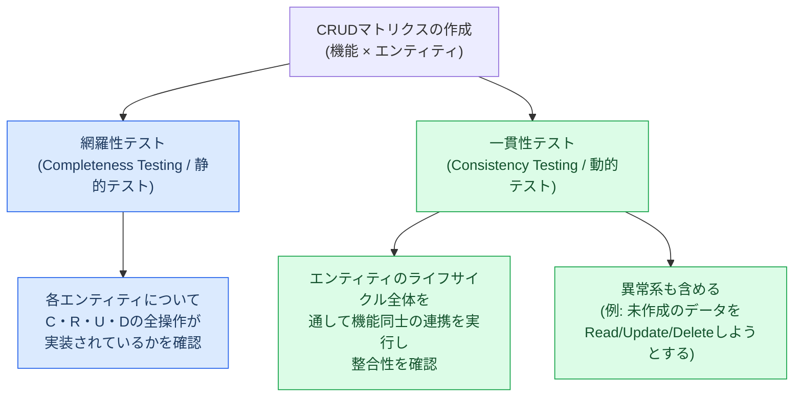

| テストの種類 | 分類 | 目的 |
|---|---|---|
| 網羅性テスト(Completeness testing) | 静的テスト | すべてのエンティティに対してC・R・U・Dの全操作が実装されているか(ライフサイクル全体が実装されているか)を確認。操作の欠落は要調査の異常 |
| 一貫性テスト(Consistency testing) | 動的テスト | 複数機能を組み合わせて実際にエンティティのライフサイクルを通し、機能間の連携の整合性を検証。「未作成のデータを参照する」などの異常系も含める |

CRUDカバレッジは、テストスイートで実行した操作数をCRUDマトリクス全体の操作数で割ることで測定します。より厳密には「更新(U)の後に、想定されるすべての参照(R)が実行されているか」のように、特定の操作の組み合わせをカバレッジ項目とすることも可能です。CRUDテストは主にシステムレベルで用いられ、データ整合性違反、アクセス制御欠陥、データの不整合といった欠陥の検出に強みがあります。

> 💡 **ベストプラクティス**
>
> - CRUDマトリクスは、機能一覧・エンティティ一覧が確定した段階で早期に作成し、**実装前のレビュー資料**として使うと、そもそもの設計漏れ(Read操作の実装忘れなど)を上流で防げる。
> - 一貫性テストでは、正常なライフサイクル順序だけでなく、**順序違反**(例: 削除済みエンティティへのUpdate)を意図的にテストケース化する。

---

### 3.2 3.2.2 状態遷移テスト(State Transition Testing) `K3: 適用`

#### 定義

多くの複雑なシステムは「ステートフル」、つまり**現在の状態によってイベントへの反応が変わる**性質を持ちます(組込みシステム、対話型システム、制御システム、エンティティのライフサイクルを扱うシステムなど)。状態遷移テストは、状態モデル(ノード=状態、エッジ=遷移)を基にテストケースを導出する技法です。Foundation Levelで学んだ基本的な網羅基準に加え、CTAL-TAでは実証的に欠陥検出効果が高いとされる2つの追加カバレッジ基準を学びます。

#### 具体例:注文の状態遷移モデル

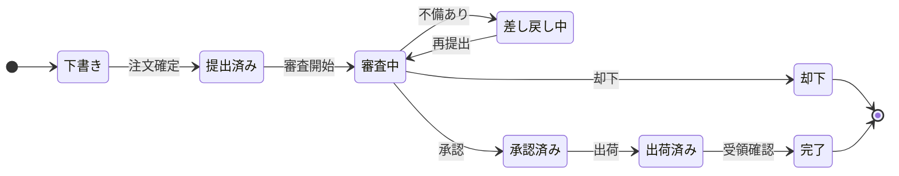

#### 追加のカバレッジ基準

| カバレッジ基準 | 説明 | 適用場面 |
|---|---|---|
| **0-switchカバレッジ** | すべての有効な単一遷移を1回以上通過する(Foundation Levelの「遷移カバレッジ」と同義) | 基本的な網羅性確認。上図の例では「下書き→提出済み」のような個々の矢印を1本ずつ通過することを指す |
| **1-switchカバレッジ** | ある状態への入力遷移と、そこからの出力遷移のペア(連続する2遷移)をすべて通過する | 実務で最もよく使われる。上図では「提出済み→審査中→差し戻し中」のような連続する2遷移の組み合わせ |
| **N-switchカバレッジ** | 連続するN+1個の遷移の有効な並びをすべて通過する | Nを大きくするほど組み合わせが指数的に増えるため、想定外のイベント順序によるリスクが高い場合のみ、2-switch以上を検討する |
| **ラウンドトリップカバレッジ** (Round-trip coverage) | 開始状態と終了状態が同じで、途中で他のどの状態も2度通らない「ループ」をすべて通過する | 上図の「審査中→差し戻し中→審査中」がラウンドトリップの例。実証研究でも欠陥検出効果の高さが示されている |

状態遷移モデルにはガード条件やアクションを含めることができ、拡張有限状態機械・Harelステートチャート・UMLステートマシンなど複数の記法が実務で使われます。

> 💡 **ベストプラクティス**
>
> - 状態遷移テストはモデルベーステストツールとの相性が良く、自動化に向いている。
> - 白紙の状態からモデルを作る過程そのものが、仕様の曖昧さや欠落を早期発見する**欠陥予防**の効果を持つ(モデリング自体がレビューになる)。
> - N-switchカバレッジは組み合わせ爆発を招くため、「高リスクな遷移の並び」だけをピンポイントで2-switch以上にする、といったリスクベースの適用が現実的。

✅ **良い例**: ラウンドトリップ(差し戻し→再提出のループ)を明示的にテストケース化し、無限ループや状態の巻き戻り不良を検出する
❌ **悪い例**: 単一遷移(0-switch)だけをテストし、「差し戻し後に再提出した場合に画面の表示が壊れる」といった連続遷移特有の不具合を見逃す

---

### 3.3 3.2.3 シナリオベーステスト(Scenario-Based Testing) `K3: 適用`

#### 定義

シナリオベーステストは、**現実的なシナリオ(利用者が実際にたどるであろう一連の操作の流れ)**でテスト対象の振る舞いを評価する技法です。ユーザーリサーチ、ユーザーストーリー、ペルソナ、ユーザージャーニーマップなどがシナリオ発見の手がかりになります。CTAL-TAでは特に「アクティビティ図」と「ユースケース」の2つのモデルを扱います。

#### アクティビティ図とユースケース

- **アクティビティ図**: システム内のワークフローを表現する図。開始/終了ノード、アクション、遷移、判断ノード、マージノード、フォークノード、ジョインノード、スイムレーンなどで構成され、フローチャートを拡張して並行処理も表現できる。
- **ユースケース**: ユーザーとシステム(またはシステム同士)の相互作用をテキストまたは図で記述したもの。以下の3種類のシナリオに分類される。

| シナリオ種別 | 説明 |
|---|---|
| **メインシナリオ(ハッピーパス)** | ユーザー視点で目標を達成する典型的・期待通りの一連の行動。1つのユースケースにつき**必ず1つだけ**存在する |
| **拡張シナリオ(代替シナリオ)** | メインシナリオとは異なる経路をたどるが、最終的には同じ目標を達成する一連の行動 |
| **例外シナリオ** | 予期しない事象(異常な使い方や無効な入力など)により、目標を達成できない一連の行動 |

#### 具体例:ログイン機能のシナリオモデル

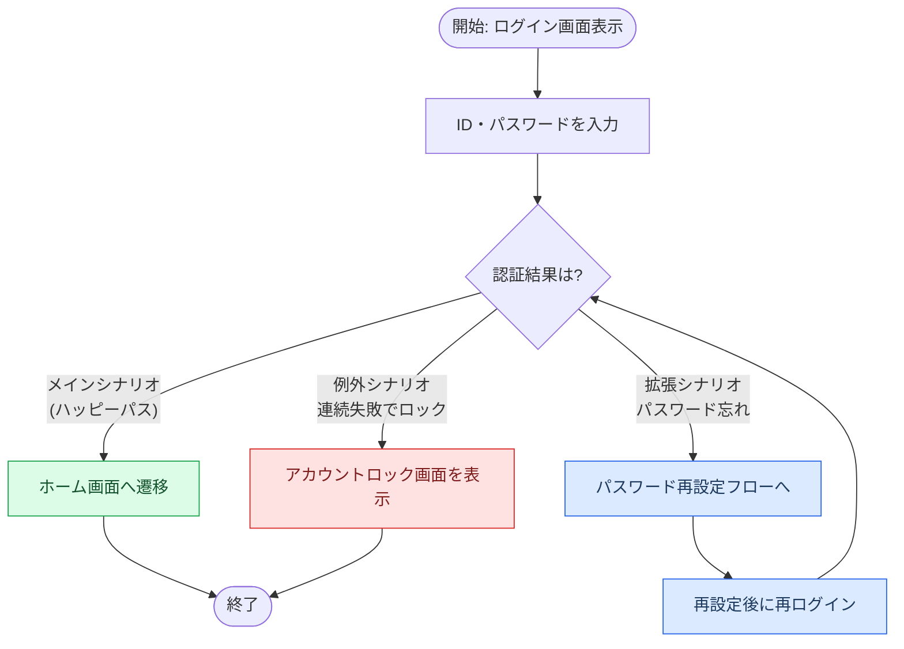

#### カバレッジ

ループを含まないシナリオモデルであれば、それぞれのシナリオを個別のテストケースでカバーできます(すべてのシナリオ=パスをテストスイートで網羅可能)。しかし上図の「再設定後に再ログイン」のようにループがあると、理論上パスの数が無限になり得ます。この場合は**単純ループカバレッジ(simple loop coverage)**を適用し、以下の4パターンをテストします。

| パターン | 説明 |
|---|---|
| 0回(スキップ) | ループを一度も実行しない |
| 1回 | ループをちょうど1回実行する |
| 複数回(典型的な回数) | ループを2回以上、一般的な回数だけ実行する |
| 最大回数 | 可能であれば、ループの上限回数まで実行する |

シナリオベースカバレッジは「実行したシナリオ数 ÷ 識別された全シナリオ数」で測定します。1つのシナリオに対して、さらにEP/BVAのような追加カバレッジが必要になる場合、1シナリオを複数のテストケースに分けて実装することもあります。

主にシステムテストや受け入れテストでエンドツーエンドテストとして使われますが、コンポーネント統合テスト(インターフェースの相互作用プロトコルに基づく)やコンポーネントテスト(ステートフルなオブジェクト指向クラスのメソッド呼び出し)、さらには非機能テスト(信頼性・柔軟性・互換性テストにおける運用プロファイルの構成要素として)にも応用できます。

> 💡 **ベストプラクティス**
>
> - シナリオはリスクベースで優先順位付けする(ビジネス上重要な、または利用頻度の高いシナリオから着手する)。
> - ループを含むシナリオでは、単純ループカバレッジの4パターン(0回・1回・複数回・最大回数)を意識的にテストケース化しないと、「2回目のリトライで状態が壊れる」といった欠陥を見逃しやすい。
> - デシジョンカバレッジ(ホワイトボックス技法)やラウンドトリップカバレッジと組み合わせることで、業務プロセス内の分岐や周期的な処理のリスクをより厳密にカバーできる。

---

## 4. 3.3 ルールベーステスト技法(Rule-Based Test Techniques)

ルールベーステスト技法は、**状態に依存しない静的な振る舞いのルール**(ビジネスルールなど)の実装を検証します。

### 4.1 3.3.1 デシジョンテーブルテスト(Decision Table Testing) `K3: 適用`

#### 定義

デシジョンテーブルテストは、Foundation Levelの基礎を発展させ、より高度なトピック(最小化・レビュー基準・チェックサム手続き)を扱います。表記法はOMG® DMN(Decision Model and Notation)標準に準拠します。

#### フル・デシジョンテーブルと最小化

フル・デシジョンテーブルのルール数は「各条件の値の数の積」で決まり、条件や値が増えると指数的に増加します。このため、実務では**最小化(minimization)**が不可欠です。最小化は、同じアクションを持つルール同士を「ドントケア演算子(`–`)」でマージすることで行います。

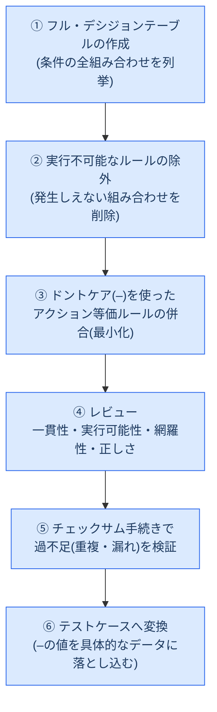

#### 具体例

条件: プレミアム会員か(C1)、注文金額が10,000円以上か(C2)、送料無料キャンペーン中か(C3)。ただし割引率は**C1とC2のみ**で決まり、C3には依存しない、という仕様だとします。

**フル・デシジョンテーブル(全8ルール)**

| ルール | C1: プレミアム会員 | C2: 金額≥10,000円 | C3: キャンペーン中 | 割引率 |
|---|---|---|---|---|
| R1 | Y | Y | Y | 15% |
| R2 | Y | Y | N | 15% |
| R3 | Y | N | Y | 10% |
| R4 | Y | N | N | 10% |
| R5 | N | Y | Y | 5% |
| R6 | N | Y | N | 5% |
| R7 | N | N | Y | 0% |
| R8 | N | N | N | 0% |

**最小化後のデシジョンテーブル(4ルール)**

| ルール | C1: プレミアム会員 | C2: 金額≥10,000円 | C3: キャンペーン中 | 割引率 |
|---|---|---|---|---|
| M1 | Y | Y | **–** | 15% |
| M2 | Y | N | **–** | 10% |
| M3 | N | Y | **–** | 5% |
| M4 | N | N | **–** | 0% |

#### チェックサム手続きによる検証

各ルールのスコアは「`–`が付いた条件ごとに、その条件が取りうる値の数を掛け合わせる」ことで計算します(値を1つも持たないルール=`–`が1つもないルールはスコア1)。

| ルール | 計算式 | スコア |
|---|---|---|
| M1(C3が`–`、2値) | 1 × 1 × 2 | 2 |
| M2(C3が`–`、2値) | 1 × 1 × 2 | 2 |
| M3(C3が`–`、2値) | 1 × 1 × 2 | 2 |
| M4(C3が`–`、2値) | 1 × 1 × 2 | 2 |
| **チェックサム合計** | | **8** |

元のフル・デシジョンテーブルはルール数がそのままチェックサム(各ルールスコア1×8ルール=8)になるため、**最小化後のチェックサム(8)と一致**しています。これにより「最小化によってルールが漏れていない(合計が減っていない)」「重複や余分なルールが混入していない(合計が増えていない)」ことを機械的に確認できます。ただし、チェックサムが一致しても最小化後のテーブルが元のテーブルと**論理的に完全に等価である保証にはならない**点に注意してください。

#### レビュー観点

| 観点 | 内容 |
|---|---|
| 一貫性(consistency) | 同じ条件値の組み合わせに複数のルールが適用される場合、それらはアクションが等価であること |
| 実行可能性(feasibility) | 実行不可能なルール(絶対に発生し得ない組み合わせ)が含まれていないこと |
| 網羅性(completeness) | 実行可能な組み合わせに漏れがないこと |
| 正しさ(correctness) | ルールがシステムの意図した振る舞いを正しくモデル化していること |

デシジョンテーブルカバレッジは「実行した列数 ÷ 実行可能な全列数」で測定します。テストケース化の際、`–`の値をどう具体化するかはテストアナリストの判断ですが、**リスクが高いデシジョンテーブルでは最小化を避け、フルテーブルの実行可能な列でカバレッジを測定すべき**とされています。

> 💡 **ベストプラクティス**
>
> - 最小化アルゴリズムの結果は列を処理する順序に依存し、必ずしも最適(最小)にならない。最小化後も**さらに縮約できないか手動で確認**する。
> - 高リスクな判定ロジック(与信判定、医療機器の投薬量計算など)では、最小化によるテストケース削減よりも網羅性を優先し、フルテーブルでのカバレッジを検討する。
> - デシジョンテーブルはビジネスルールの「生きた仕様書」としてステークホルダーとレビューする場に使うと、要件の曖昧さそのものを早期に発見できる。

---

### 4.2 3.3.2 メタモルフィックテスト(Metamorphic Testing) `K3: 適用`

#### 定義

メタモルフィックテスト(MT)は、**既存のソーステストケースを基に、メタモルフィック関係(MR)に従ってフォローアップテストケースを生成**する技法です。MRは、テスト対象の性質(プロパティ)を定義し、「入力をこう変化させたら、期待結果はこう変化するはずだ」という関係を記述します。

#### なぜ必要か

多くのシステム(特にAIベースのシステムや、複雑な計算を行うシステム)では、個々の入力に対する「正解」を事前に用意すること自体が困難、あるいは非常に高コストです(**テストオラクル問題**、Section 5参照)。メタモルフィックテストは、個々の絶対的な正解が分からなくても、**入力同士・出力同士の相対的な関係**さえ定義できればテストが成立するという発想の転換によって、この問題を回避します。

#### 具体例

「数値の系列の平均を求める関数」を例にとります。

1. **ソーステストケース**: 入力 `[3, 5, 7]` → 期待結果「平均 = 5」(実行して合格を確認済み)
2. **メタモルフィック関係(MR)①**: 「系列の順序をどう並び替えても、平均は変わらない」
3. **フォローアップテストケース**: 入力 `[7, 3, 5]` → 期待結果は同じく「平均 = 5」

別のMRとして「系列の各値をすべて`x`倍すると、期待結果(平均)も`x`倍になる」を使えば、`x`の値を変えるだけで無数のフォローアップテストケースを自動生成できます。2つ以上のMRを組み合わせる(並び替え+2倍する、など)ことも可能です。

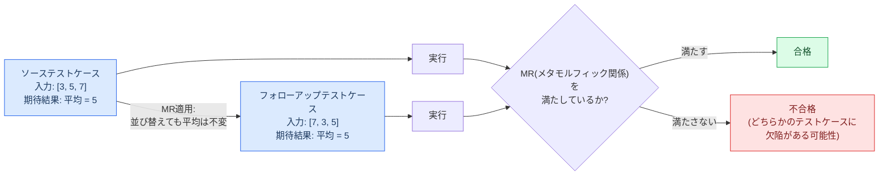

テストオラクル問題が存在する状況(例: 喫煙本数から死亡予測年齢を算出するAIベースの保険数理プログラム)でも、「喫煙本数が増えれば、予測死亡年齢は下がるはずだ」というMRを使えば、個々の絶対値の正解が分からなくても、関係性の破れとして欠陥を検出できます。

#### カバレッジ

現時点でMTには認められたカバレッジ尺度がなく、各MRを1回カバーするだけでは検証が部分的にとどまるため不十分とされています。テストアナリストは、しばしば**ランダムテストと組み合わせて**、同一のMRに対して大量のソース/フォローアップテストケースのペアを自動生成する手法を取ります。

MTはほぼすべてのテスト対象に適用可能で、機能テストだけでなく非機能テスト(負荷生成にMRを使う負荷テスト、複数のインストール順序を試すインストール性テストなど)にも使えます。特に**AIベースシステムのテスト**では推奨される技法の一つです。

> 💡 **ベストプラクティス**
>
> - まず「この関数・機能にはどんな不変の性質(対称性、単調性、可換性など)があるか」を洗い出すところから始めると、有効なMRを見つけやすい。
> - テストが失敗した場合、ソースとフォローアップのどちらに欠陥があるかは追加のデバッグが必要になる点を事前にチーム内で共有しておく。
> - テストオラクル問題を抱える機能(AI予測、非決定的な処理)を優先的にメタモルフィックテストの対象候補とする。

---

## 5. 3.4 経験ベーステスト(Experience-Based Testing)

経験ベーステストは、テストアナリスト自身の**専門知識と過去の経験**を活用してテストを導く手法です。

### 5.1 3.4.1 テストチャーター(Test Charters Supporting Session-Based Testing) `K3: 適用`

#### 定義

探索的テストにおいて、**テストチャーター**はテストセッションの「ミッション(使命)」を定義するものです。スコープ・目的に加え、制約・タイムライン・リスクなどの情報を含み、セッションの羅針盤として機能します。ただし、チャーターはセッション中に実行する具体的なテストスイートまでは規定しません。

#### ミッションの記述形式

軽量なミッション記述として、以下のフォーマットが広く使われます。

> **Explore [対象] With [リソース] To discover [発見したい情報]**

**具体例**:「Explore 決済画面のクレジットカード入力フォーム With 無効なカード番号・期限切れカード・複数ブラウザ To discover 入力検証の欠陥やエラーメッセージの不備」

#### テストチャーターに含める情報

| 情報カテゴリ | 内容の例 |
|---|---|
| 組織情報 | セッションの所要時間、開始日時、担当者名 |
| テスト目的 | テストの動機、チャーターのミッション |
| テストスコープ | 対象領域、テストレベル、使用する技法、テストアイデア、終了基準、優先度、対象外の範囲 |
| 開始基準 | セッション開始に必要な前提条件 |
| 製品関連情報 | コンポーネント間の定義・データ・ワークフロー、システムアーキテクチャ |
| 制限事項 | 「製品が絶対にしてはいけないこと」 |
| テスト環境の説明 | 使用する環境の情報 |
| 既存のリソース | 既存のデータソース、製品情報、テストツール |
| 過去の情報 | 過去に発見された欠陥(互換性・相互運用性欠陥など)、未解決の疑問点、過去の障害パターン |
| 制約・リスク | 規制、ルール、標準 |

#### セッションの流れ

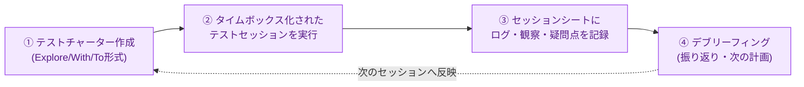

チャーターに含める情報の粒度は、テストアナリストに与える自由度をコントロールします。目的だけを大まかに定義すれば探索の余地は広がり、逆に使用すべき技法まで指定すればより制約された(しかし予測可能な)テストになります。「製品が絶対にしてはいけないこと」のような情報を加えると、誤検知(false-positive)の報告を減らす効果もあります。

> 💡 **ベストプラクティス**
>
> - チャーターの粒度は、テスト対象の成熟度や担当者の経験レベルに応じて調整する(新人には制約多めのチャーター、熟練者には自由度の高いチャーターが向く)。
> - セッションシートへの記録は「テスト結果」だけでなく「疑問点」「次に試したいアイデア」も残し、デブリーフィングと次セッションの計画に活かす。

---

### 5.2 3.4.2 チェックリストベーステスト(Checklists Supporting Experience-Based Test Techniques) `K3: 適用`

#### 定義

チェックリストベーステストは、適応性・シンプルさ・有効性から広く使われる技法です。チェックリストを使うことで、テスト対象の**既知の重要な観点を漏れなくカバー**し、過去の失敗や欠陥の経験を再利用できます。

#### 2種類のチェックリスト

| 種別 | 特徴 | 具体例 |
|---|---|---|
| **Read-doチェックリスト** | あるプロセスで考慮すべき具体的な項目(入力データなど)を列挙する | 「入力フィールドに全角文字を入力する」「255文字を超える文字列を入力する」 |
| **Do-confirmチェックリスト** | 探索を深めるための「観点・問い」を提示し、思考を促す | 「検索結果は入力条件と関連性があるか?」「エラーメッセージは利用者にとって分かりやすいか?」 |

#### チェックリスト作成の手順

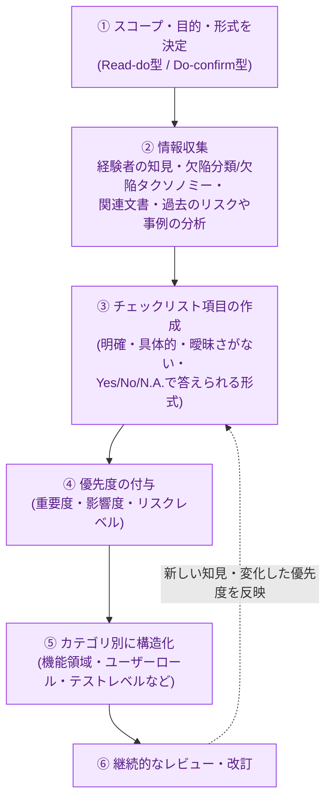

チェックリスト項目は、明確・具体的・曖昧さがなく・一貫性があり・関連性があり・保守可能で・実行可能で・測定可能であるべきとされ、「Yes/No/該当なし」で答えられる問いの形式で書くことが推奨されます。チェックリストは網羅的な手順書ではなく、**熟練者向けの手早い思考の補助ツール**である点を忘れないでください。既存のテンプレートや業界標準に沿った定義済みチェックリストを再利用できる場合は、それを活用することで作成コストを削減できます。

> 💡 **ベストプラクティス**
>
> - チェックリストは「完成」することがない、生きたドキュメントとして扱い、新しい欠陥や振り返りから得た教訓を反映し続ける。
> - 長いチェックリストは機能領域・ユーザーロール・テストレベルなどでカテゴリ分けし、実行時に迷わないようにする。
> - チームでチェックリストを共有することで、テストアナリスト間の一貫性を高め、重点領域についての共通理解を促進する。

---

### 5.3 3.4.3 クラウドテスト(Crowd Testing) `K2: 理解`

#### 定義

クラウドテストは、多様な背景・所在地を持つ社内外のテスト担当者グループにテストを分散させる手法です。機能テストと非機能テストの両方、特にユーザビリティの妥当性確認をコスト効率よく行う手段として用いられます。

#### 利点と限界

| 利点 | 限界 |
|---|---|
| **多様なテスト環境**: 様々な地域・デバイス・ブラウザ・ネットワーク条件でテストできる | **テスト品質のばらつき**: 担当者のスキルによって品質が変動する(ただしUX重視の目的では大きな問題にならないこともある) |
| **柔軟性**: 短期間に多数のテストをスケール可能 | **コミュニケーションの課題**: 多くの担当者・複数のタイムゾーン・文化・言語の違いによる調整の難しさ |
| **コスト効率**: 大規模な社内チームや外部委託より安価な場合が多い | **セキュリティ**: 社外テスト担当者にソフトウェアを共有することによるデータセキュリティ・機密性のリスク |
| **迅速なフィードバック**: 早期に欠陥を発見・修正できる | **ドキュメント・報告の管理**: 大人数から寄せられる大量の報告(重複や誤検知を含む)の管理が煩雑になりやすい |
| **実際の利用者視点**: 実ユーザーによるUX上の知見が得られる(受け入れテストで特に有用) | |
| **多様性(バラつき)**: 実行の再現性は低いが、その分カバレッジが広がり欠陥発見の可能性が高まる | |

クラウドテストは、テストアナリストが体系的なテスト技法を適用することの**代替にはならず**、あくまで多様なテスト環境のカバレッジを底上げする補完的アプローチである点に注意してください。

> 💡 **ベストプラクティス**
>
> - 機密性の高い機能や未公開情報を含む場合は、NDAの締結や機能の一部マスキングなど、事前のセキュリティ対策を徹底する。
> - 重複報告や誤検知の仕分けルール(トリアージ基準)を事前に定義し、大量の報告に対応できる体制を整える。
> - 「多様な実環境でのカバレッジ拡大」という強みを活かし、社内テストで手薄になりがちな互換性・ユーザビリティの検証に重点的に活用する。

---

## 6. 3.5 最適なテスト技法の適用(Applying the Most Appropriate Test Techniques)

### 6.1 3.5.1 製品リスクを軽減する技法の選定 `K4: 分析`

#### 定義

テストマネージャーを支援し、状況に応じて最も効果的・効率的なテスト技法を選定することは、テストアナリストの重要な役割です。これは第3章の中でも唯一`K4(分析)`レベルが設定されている学習目標であり、試験では「与えられたシナリオに最も適した技法を選ばせる」形式で出題されます。

#### 技法カテゴリと検出しやすい欠陥の対応

| テスト技法カテゴリ | 検出しやすい欠陥の種類 |
|---|---|
| データベースドテスト技法 | データ処理、ドメイン実装、ユーザーインターフェース、計算、パラメータの組み合わせに関する欠陥 |
| ビヘイビアベーステスト技法 | ユーザー要件の欠陥(機能の欠落、コミュニケーション不足、処理誤り) |
| ルールベーステスト技法 | ロジック・制御フローに関する欠陥 |
| 経験ベーステスト | 網羅基準を定義しづらい領域、過去の類似欠陥、暗黙知に基づく欠陥 |

#### 技法選定に影響する要因

| 要因 | 選定への影響 |
|---|---|
| **テスト目的** | システムの種類によって適した技法が異なる(例: 数値計算にはドメインテスト、与信管理にはデシジョンテーブルテスト) |
| **製品リスク** | リスクレベルが高いほど、より厳密なカバレッジ基準(例: ペアワイズではなく全組み合わせ)を要求する。ただし網羅の強度とテスト工数のトレードオフを常に意識する |
| **リスクが低い/スケジュールが厳しい場合** | 経験ベーステストが有効な選択肢になる |
| **テストベース** | 仕様がモデルで記述されていればそのモデルに基づく技法が使える。テストオラクルの導出が困難ならメタモルフィックテストや経験ベーステストを検討する |
| **既知の欠陥傾向** | 繰り返し発生する欠陥パターンには、それを検出しやすい技法(チェックリストベーステストなど)を選ぶ |
| **テストアナリストの知識・経験** | 不慣れな技法をクリティカルな案件でいきなり使うのは推奨されない。ドメイン知識が乏しい場合、探索的テストは効果が薄れる |
| **SDLC(開発ライフサイクル)** | 逐次型モデルは形式的な技法向き、反復型モデルは軽量な技法(経験ベーステスト)やテスト設計自動化向き |
| **顧客・契約要件** | 契約でシナリオベーステストなど特定の技法・テストレベルが求められる場合がある |
| **規制要件** | 業界標準(例: 自動車のISO 26262)がASIL(自動車安全度水準)に応じて特定の技法を要求することがある |
| **プロジェクト制約** | 時間・予算が、時間のかかる技法や高価なリソースを要する技法の採用可否を左右する |

#### 技法選定の考え方(実践的な整理図)

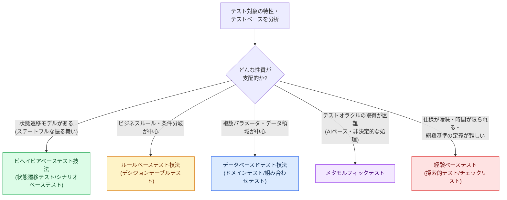

#### 技法の組み合わせ例

複数の技法を組み合わせることで、欠陥検出の効率と効果をさらに高められます。

- 境界値分析(BVA)を、状態遷移テストの**ガード条件**の検証に使う
- ドメインテストを、シナリオベーステストや**デシジョンテーブルの条件値**の決定に使う
- シナリオベーステストを、ホワイトボックス技法の**デシジョンカバレッジ**と組み合わせ、業務プロセス内の分岐を厳密に網羅する
- シナリオベーステストを**ラウンドトリップカバレッジ**と組み合わせ、周期的な業務プロセスのリスクに対応する

> 💡 **ベストプラクティス**
>
> - 技法選定は一度きりの意思決定ではなく、プロジェクトの進行やリスクの変化に応じて**継続的に見直す**。
> - 「使い慣れているから」という理由だけで技法を選ばず、対象の性質(データ・状態・ルール・探索の必要性)に立ち返って選定する。
> - 複数技法の併用は効果的だが、テストケース数の増大にもつながるため、リスクベースの優先順位付けとセットで運用する。

---

### 6.2 3.5.2 テスト設計自動化の利点とリスク `K2: 理解`

#### 定義

テストアナリストは、特にブラックボックステスト技法の適用にツールを活用できます。テスト設計を自動化する場合、テストモデルを作成し、そのモデルから自動的にテストウェアを生成します(例: 状態遷移モデルを作成し、モデルベーステストツールにラウンドトリップカバレッジのテストケースを生成させる)。

#### 利点

| 利点 | 説明 |
|---|---|
| 欠陥予防 | モデリング自体がテストベースの品質評価として機能する |
| 適用範囲の拡大 | 組み合わせテスト・ランダムテスト・N-switchカバレッジなど複雑な技法を適用しやすくなり、テスト漏れのリスクを低減する |
| 理解しやすさの向上 | ツールで指定したテスト選択基準は、テスト条件との対応関係が明確で、生成されたカバレッジの根拠を説明しやすい |
| 反復作業の削減 | テストモデルからテストウェアを生成するため、手作業でのテスト仕様作成が減る |
| 保守コストの低減 | テストモデルを唯一の真実の情報源(シングルソース)として管理することで、モデル変更時に生成されるテストウェアを個別に手作業で保守する範囲が減る |
| テストウェアの品質向上 | 手作業に伴うミスが減り、生成されたテストウェアの品質と一貫性が高まる |
| チーム協働の促進 | ステークホルダーがテストモデルをレビューすることで、欠陥の早期発見や理解の共有につながる |
| トレーサビリティの向上 | テストケースそのものよりも、テストモデルの要素とテスト条件を紐づけるほうが容易であり、生成されたテストケースにもその追跡可能性が引き継がれる |
| 出力形式の多様性 | 他のツールや後続作業に必要な様々な形式でテストウェアを出力できる |

#### リスク

- モデルに現れない**テスト条件を見落とす**リスク
- テストモデル自体の**保守コストを過小評価**するリスク
- ステークホルダーが**モデルを理解しにくい**リスク
- テスト自動化一般に共通するリスク(Foundation Levelシラバス参照)

> 💡 **ベストプラクティス**
>
> - テスト設計自動化を導入する際は、「モデルの保守」自体が新たな作業コストになることをプロジェクト計画に織り込む。
> - モデルをステークホルダー(開発者・ビジネスアナリストなど)とレビューする機会を意図的に設け、モデルの理解しやすさとテストベースの品質を同時に高める。
> - すべてのテスト条件をモデル化できるとは限らないため、**モデル化されない条件を補完する手動テスト・経験ベーステストを併用**する。

---

## 7. 学習目標(Learning Objectives)一覧表

試験対策として、第3章の学習目標とKレベルを一覧表にまとめます。`K3`・`K4`の項目は、定義の暗記だけでなく**実際に手を動かして導出する練習**を重点的に行ってください。

| コード | 学習目標 | Kレベル |
|---|---|---|
| TA-3.1.1 | ドメインテストを適用できる | K3 |
| TA-3.1.2 | 組み合わせテストを適用できる | K3 |
| TA-3.1.3 | ランダムテストの利点と限界を要約できる | K2 |
| TA-3.2.1 | CRUDテストを説明できる | K2 |
| TA-3.2.2 | 状態遷移テストを適用できる | K3 |
| TA-3.2.3 | シナリオベーステストを適用できる | K3 |
| TA-3.3.1 | デシジョンテーブルテストを適用できる | K3 |
| TA-3.3.2 | メタモルフィックテストを適用できる | K3 |
| TA-3.4.1 | セッションベーステストのためのテストチャーターを準備できる | K3 |
| TA-3.4.2 | 経験ベーステストを支援するチェックリストを準備できる | K3 |
| TA-3.4.3 | クラウドテストの利点と限界の例を挙げられる | K2 |
| TA-3.5.1 | 特定の状況において、製品リスクを軽減する適切なテスト技法を選択できる | K4 |
| TA-3.5.2 | テスト設計自動化の利点とリスクを説明できる | K2 |

出典: ISTQB® CTAL-TA Syllabus v4.0, “Learning Objectives for Chapter 3”

---

## 8. 章末チェックリスト(自己診断用)

学習の総仕上げとして、以下の問いにすべて自分の言葉で説明できるかセルフチェックしてください。

- [ ] ON点・OFF点・IN点・OUT点の違いを、閉じた境界と開いた境界それぞれについて説明できる
- [ ] 簡略化ドメインカバレッジと信頼性ドメインカバレッジの違いを説明できる
- [ ] ベースチョイスカバレッジとペアワイズカバレッジの違いを説明できる
- [ ] なぜペアワイズテストが効果的とされるのか(相互作用障害の統計的傾向)を説明できる
- [ ] CRUDマトリクスを実際に作成し、網羅性テストと一貫性テストの違いを説明できる
- [ ] 0-switch・1-switch・N-switch・ラウンドトリップカバレッジをそれぞれ図で示せる
- [ ] メインシナリオ・拡張シナリオ・例外シナリオの違いを具体例で説明できる
- [ ] 単純ループカバレッジの4パターンを説明できる
- [ ] デシジョンテーブルの最小化とチェックサム手続きを、実際の数値例で計算できる
- [ ] メタモルフィック関係(MR)を使ったテストケースを、テストオラクル問題と絡めて説明できる
- [ ] テストチャーターの「Explore/With/To」形式で、自分の担当システムの例を1つ作れる
- [ ] Read-doチェックリストとDo-confirmチェックリストの違いを具体例で説明できる
- [ ] クラウドテストの利点・限界を、体系的テスト技法との使い分けの観点で説明できる
- [ ] 与えられたシナリオに対し、どの技法カテゴリ(データ/ビヘイビア/ルール/経験ベース)が適切かを判断できる
- [ ] テスト設計自動化の利点とリスクを、自分のプロジェクトに当てはめて具体的に語れる

> 💡 **学習のヒント**
> 第3章は`K3`(適用)・`K4`(分析)の学習目標が集中する章です。定義の暗記だけで終わらせず、公式サンプル問題の演習(特に第3章の実践的な演習)に取り組んだうえで、本ガイドの具体例をノートに写経し、**自分の担当プロダクトの実データに置き換えて再度導出してみる**ことを強く推奨します。

---

## 9. v3.1からv4.0への主な変更点(参考)

CTAL-TAは2025年5月2日にv4.0が正式リリースされました。v3.1は英語版が2026年5月16日にサンセット(廃止)済みで、非英語版は2026年11月16日まで有効です。第3章に関する主な変更点は以下の通りです。

- ブラックボックステスト技法の分類が、v3.1の分類から**「データベースド」「ビヘイビアベースド」「ルールベースド」**という新しい3分類に整理された
- **メタモルフィックテスト**、**CRUDテスト**、**クラウドテスト**がv4.0で新たに体系立てて追加された
- 状態遷移テストに**N-switchカバレッジ**・**ラウンドトリップカバレッジ**という2つの追加カバレッジ基準が導入された

出典: trendig.com「New Version Released: ISTQB Certified Tester Advanced Level - Test Analyst v4」(非公式の解説記事)

---

## 10. 参考文献・出典URL

### 公式ISTQB®資料

| 資料名 | URL |
|---|---|
| CTAL-TA v4.0 認定ページ(公式) | [https://istqb.org/certifications/certified-tester-advanced-level-test-analyst/](https://istqb.org/certifications/certified-tester-advanced-level-test-analyst/) |
| CTAL-TA Syllabus v4.0(PDF・ISTQB公式ダウンロード) | [https://istqb.org/?sdm_process_download=1&download_id=5745](https://istqb.org/?sdm_process_download=1&download_id=5745) |
| CTAL-TA Syllabus v4.0(PDF・ASTQBミラー) | [https://astqb.org/assets/documents/ISTQB-CTAL-TA-Syllabus-v4.0-EN-4.pdf](https://astqb.org/assets/documents/ISTQB-CTAL-TA-Syllabus-v4.0-EN-4.pdf) |
| ISTQB® Glossary(用語集) | [https://glossary.istqb.org/](https://glossary.istqb.org/) |
| ISTQB® 本部サイト | [https://istqb.org/](https://istqb.org/) |

### 国際規格・標準

| 規格名 | URL |
|---|---|
| ISO/IEC 25010:2023(品質特性モデル) | [https://www.iso.org/standard/78176.html](https://www.iso.org/standard/78176.html) |
| ISO/IEC/IEEE 29119-4:2021(テスト技法) | [https://www.iso.org/standard/79430.html](https://www.iso.org/standard/79430.html) |
| OMG® DMN(Decision Model and Notation) | [https://www.omg.org/dmn/](https://www.omg.org/dmn/) |

### 学術文献・技術資料(本文中で言及されたもの)

| 文献 | URL |
|---|---|
| Kuhn, D.R. et al.「Software Fault Interactions and Implications for Software Testing」の背景研究解説(NIST) | [https://csrc.nist.gov/projects/automated-combinatorial-testing-for-software/combinatorial-methods-in-testing/interactions-involved-in-software-failures](https://csrc.nist.gov/projects/automated-combinatorial-testing-for-software/combinatorial-methods-in-testing/interactions-involved-in-software-failures) |
| NIST SP 800-142「Practical Combinatorial Testing」 | [https://nvlpubs.nist.gov/nistpubs/legacy/sp/nistspecialpublication800-142.pdf](https://nvlpubs.nist.gov/nistpubs/legacy/sp/nistspecialpublication800-142.pdf) |
| Kuhn & Kacker (2013)「Introduction to Combinatorial Testing」関連資料(NIST) | [https://www.nist.gov/publications/introduction-combinatorial-testing-preface-appendix-mathematics-review-and-appendix-b](https://www.nist.gov/publications/introduction-combinatorial-testing-preface-appendix-mathematics-review-and-appendix-b) |

### 非公式ながら参考になる解説記事(数値・見解は公式シラバスで必ず裏取りしてください)

| 記事 | URL |
|---|---|
| trendig.com「New Version Released: ISTQB® CTAL-TA v4」(v3.1→v4.0の変更点解説) | [https://trendig.com/en/blog/new-version-released-istqb-certified-tester-advanced-level-test-analyst-v4/](https://trendig.com/en/blog/new-version-released-istqb-certified-tester-advanced-level-test-analyst-v4/) |

---

*本ガイドはISTQB® CTAL-TA Syllabus v4.0の内容を、初学者向けに図解・具体例を交えて再構成した非公式の学習補助資料です。試験対策の最終確認には、必ず上記の公式シラバスおよび公式サンプル問題をご参照ください。*
