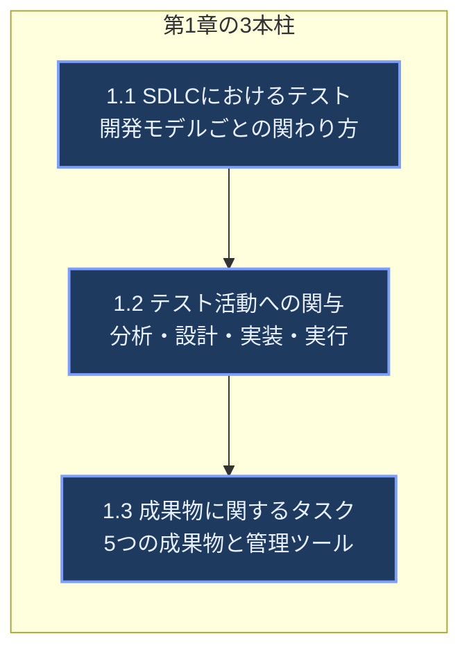
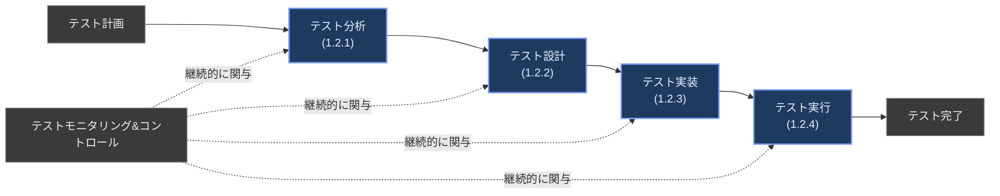
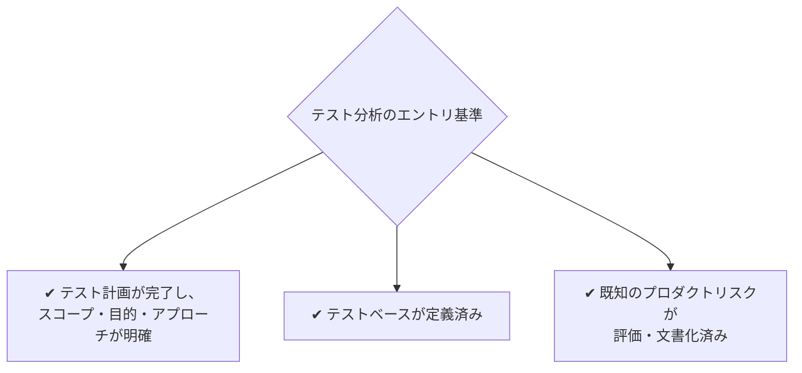
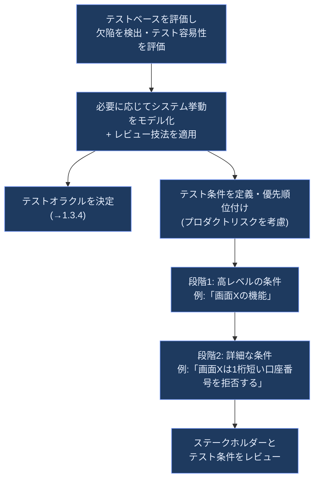
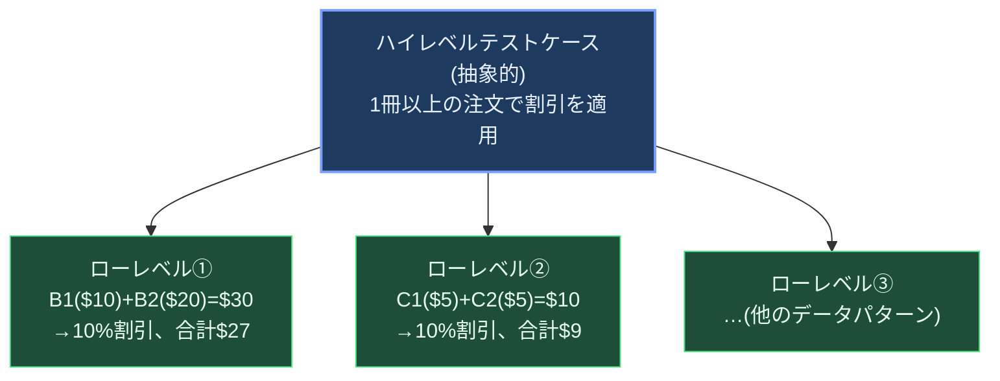
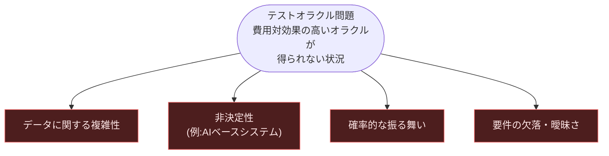
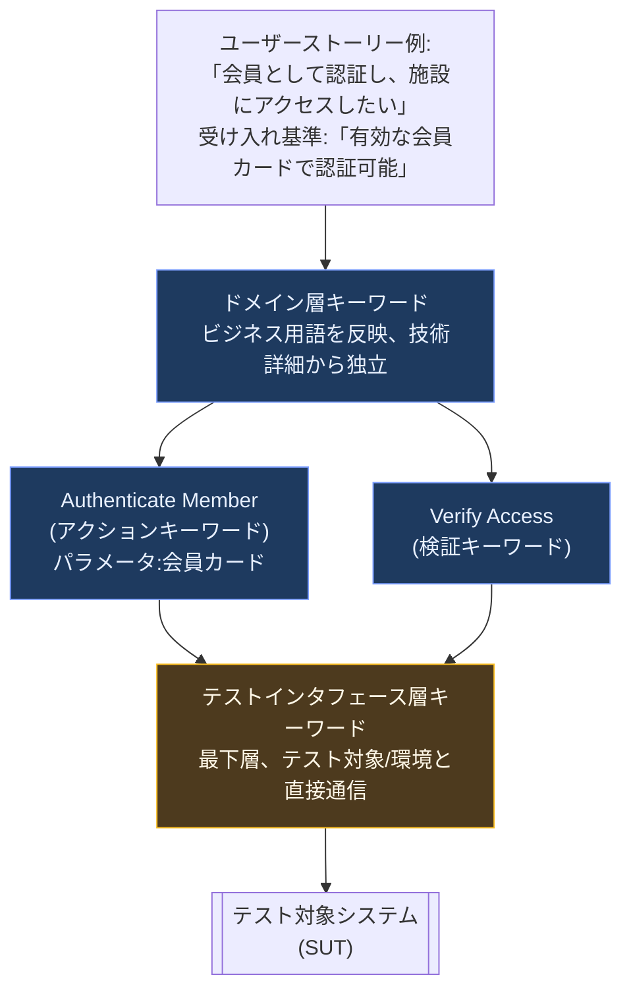
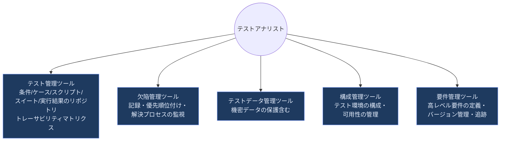

# ISTQB® CTAL-TA v4.0 第1章

## テストプロセスにおけるテストアナリストのタスク

### The Tasks of the Test Analyst in the Test Process — 初学者向け完全ガイド

> 対象試験: **ISTQB® Certified Tester Advanced Level Test Analyst (CTAL-TA) v4.0**
> 対象章: **第1章「テストプロセスにおけるテストアナリストのタスク」**(学習時間: 225分、全5章1215分中)
> 前提知識: ISTQB Foundation Level (CTFL v4.0.1) 修了者向け

---

## 0. この章の全体像

CTAL-TA は「テストアナリスト(TA)」という役割にフォーカスした資格です。TAとは、**技術面よりもビジネス要件・顧客価値を重視し、システムテストや受け入れテストを中心に、ブラックボックス技法と経験ベーステストを使いこなす人材**と定義されています。第1章は、その TA が標準的なテストプロセスの各段階で「具体的に何をするか」を定義する、いわば本試験全体の土台となる章です。

> **出典:** ISTQB® CTAL-TA Syllabus v4.0, Section 1 (Introduction), p.13–14 — <https://astqb.org/assets/documents/ISTQB-CTAL-TA-Syllabus-v4.0-EN-4.pdf>

### 0.1 キーワード(K1レベルで暗記必須)

ハイレベルテストケース、キーワード、キーワード駆動テスト、ローレベルテストケース、ソフトウェア開発ライフサイクル(SDLC)、テスト分析、テストアナリスト、テストケース、テスト条件、テストデータ、テスト設計、テスト環境、テスト実行、テスト実装、テストオラクル、テストスクリプト、テストウェア

> **ベストプラクティス:** これらの用語は ISTQB® Glossary の定義と一言一句違わずに覚えること。K1レベルの用語は学習目標に明記されていなくても出題対象になります。用語の定義は <https://glossary.istqb.org/> で検索可能です。

### 0.2 学習目標(Learning Objectives)と認知レベル

| コード | K-Level | 学習目標 |
|---|:---:|---|
| TA-1.1.1 | **K2** | 様々なソフトウェア開発ライフサイクルにおけるテストアナリストの関与を要約できる |
| TA-1.2.1 | **K2** | テスト分析の一環としてテストアナリストが行うタスクを要約できる |
| TA-1.2.2 | **K2** | テスト設計の一環としてテストアナリストが行うタスクを要約できる |
| TA-1.2.3 | **K2** | テスト実装の一環としてテストアナリストが行うタスクを要約できる |
| TA-1.2.4 | **K2** | テスト実行の一環としてテストアナリストが行うタスクを要約できる |
| TA-1.3.1 | **K2** | ハイレベルテストケースとローレベルテストケースを区別できる |
| TA-1.3.2 | **K2** | テストケースの品質基準を説明できる |
| TA-1.3.3 | **K2** | テスト環境要件の例を挙げられる |
| TA-1.3.4 | **K2** | テストオラクル問題と潜在的な解決策を説明できる |
| TA-1.3.5 | **K2** | テストデータ要件の例を挙げられる |
| TA-1.3.6 | **K3** | キーワード駆動テストを用いてテストスクリプトを作成できる |
| TA-1.3.7 | **K2** | テストウェアを管理するツールの種類を要約できる |

K2(理解)が大半を占めますが、**TA-1.3.6 のみ K3(適用)**である点に注意してください。単なる暗記ではなく、実際にキーワードを設計する演習問題が出題される可能性があります。

---

## 1.1 ソフトウェア開発ライフサイクル(SDLC)におけるテスト `[K2]`

### 定義

SDLC(ソフトウェア開発ライフサイクル)の型によって、開発活動の組み立て方が異なるため、**TAがテストプロセスの中でいつ・何を担当するかも変化します**。CTAL-TAでは、SDLCを大きく3種類に分類し、それぞれにおけるTAの関わり方を整理しています。

### なぜ重要か(理由)

同じ「テスト分析」というタスクでも、ウォーターフォール型では一度きりの大きな塊として発生するのに対し、アジャイル型では毎スプリント短いサイクルで繰り返し発生します。この違いを理解していないと、プロジェクトに応じた適切なテスト計画・見積もり・体制を提案できません。

### 3つのSDLCモデルの比較

| SDLCモデル | 開発活動の特徴 | TAのタスクの変化パターン | 回帰テストへの意識 |
|---|---|---|---|
| **順次(ウォーターフォール型)** | フェーズ間の重複が少なく、前フェーズ完了後に次フェーズが開始 | 時間の経過とともにタスクの種類が変わる(計画支援→分析→設計/実装→実行) | 変更の影響範囲に応じて要否・範囲を判断する(モデル自体が高低を決めるわけではない) |
| **インクリメンタル** | ソフトウェアを小さな増分に分割し、各増分を独立して開発・テスト | 各増分で**同じ5活動**(分析・設計・実装・実行・マネジメント支援)を繰り返す | **高い**。リファクタリングや回帰スイート構築に特に注意が必要 |
| **イテレーティブ** | プロトタイピング→テスト→改善→デプロイのサイクルを反復 | 動的・適応的。開発者やビジネス代表と密に協働し、都度テスト条件・ケースを見直す | 反復頻度が高いほど回帰テストの継続的な保守が重要 |

> **備考:** 実際のプロジェクトでは複数モデルの要素が混在することが多く(例:アジャイル開発はイテレーティブ+インクリメンタルの複合)、その場合TAの関わり方はSDLCの具体的な組み合わせ方次第で変わります。

### ✅ ベストプラクティス / ❌ アンチパターン

- ✅ **ベストプラクティス:** どのSDLCモデルであっても、TAは**SDLCの初期段階から関与する**。要件が固まる前から参加することで、テスト容易性の観点から早期にフィードバックできる。
- ❌ **アンチパターン:** 「テストは実装が終わってから」という発想でTAの参加を後工程まで遅らせること。特にインクリメンタル/イテレーティブ開発では手戻りが増え、回帰テストの負債が蓄積する。

---

## 1.2 テスト活動への関与 `[K2]`

Foundation Levelでは7つのテスト活動が定義されていますが、TAは主に **テスト分析・テスト設計・テスト実装・テスト実行** の4つに集中して関与します。

### 1.2.1 テスト分析

**定義:** テストベース(要件、ユーザーストーリー等)の完全性を確認し、テストに関連する追加情報(ドキュメントだけでなく口頭でのやり取りも含む)を収集する活動です。

**エントリ基準(この活動を効果的に始めるための前提条件):**

**主なタスクの流れ:**

- テスト条件は必ず**テストベースの要素までトレーサブル**でなければならない。
- インクリメンタル/イテレーティブ開発では、影響分析(インパクトアナリシス)に基づき回帰テストの範囲を決定する作業もここに含まれる。
- アジャイル開発では、テスト条件は**受け入れ基準(Acceptance Criteria)**として表現されることが多い。

> ✅ **ベストプラクティス:** 高レベル→詳細レベルという段階的アプローチを取ることで、まだ詳細化されていないユーザーストーリーに対しても早期にテスト設計を開始できる。
> ❌ **アンチパターン:** テストベースの欠陥(曖昧な要件など)を発見してもTA自身の判断で握りつぶし、文書化せずに次工程に進めてしまうこと。

### 1.2.2 テスト設計

**定義:** 定められたテスト目標を達成するために、どのようにテストを実施するかを記述する活動。多くの場合テストケースという形で表現されます。

**主なタスク:**

| タスク | 説明 |
|---|---|
| テストケースの粒度決定 | 高レベル/低レベルどちらのテストケースが適切かを領域ごとに判断(→1.3.1) |
| 合否判定基準の明確化 | すべてのテストケースについて明確なpass/fail基準を定義する |
| テストケース設計 | 新規・変更されたテスト条件に対し、品質基準(→1.3.2)に沿って設計 |
| 回帰テストの選定 | 既存の高レベルテストケースの選択、または低レベルテストケースの優先度に基づく適応 |
| トレーサビリティの記録 | テストベース・テスト条件・テストケース間の関連を記録 |
| テスト環境要件の定義 | →1.3.3 |
| テストデータ要件の特定 | →1.3.5 |

**終了基準:** テスト計画で定めた終了基準の他、残存リスクレベルやプロジェクト制約(予算・時間)も設計終了の判断材料になります。

**テストケースが果たすコミュニケーション上の役割:** テストケースは設計者以外(他のテスター、開発者、監査者)が実行・理解できる必要があります。複雑なテストケースは分割・簡素化すべきです。

> ✅ **ベストプラクティス:** テスト設計はツールに支援されつつも「ツール・技術に依存しない(agnostic)」形で行い、体系的な技法(→第3章)またはアドホックな手法を明示的に選択する。
> ❌ **アンチパターン:** 「自分さえ分かればよい」という発想で暗黙の前提を書かないテストケースを作ること。後任者や監査者が実行不能になる。

### 1.2.3 テスト実装

**定義:** テスト実行に必要な**テストウェア**(テスト手順・テストスクリプト等)を準備する活動。

**主なタスク:**

1. テスト手順・テストスクリプトをテストスイートに整理、または自動化候補として提案
2. テスト手順の定義 — 前提条件の設定手順、期待結果・事後条件の検証手順、実行後のリセット手順(DB初期化等)を含める
3. リスク分析・テスト計画で決定した優先順位に基づき、テスト手順/スクリプトの実行順を決定
4. テストベースとテストウェア間のトレーサビリティを更新
5. テストマネージャ(TM)を支援し、リソース配分を含むテスト実行スケジュールの策定を補助
6. 入力データ・環境データを作成しDB等にロード(→1.3.5)
7. **テスト環境の準備完了を検証**(スモークテストの設計・実行が最も一般的な手法)

**テスト環境が満たすべき3条件:**

> ✅ **ベストプラクティス:** テスト実行前に必ずスモークテストでテスト環境の健全性を確認する。規制業界(例:RTCA DO-178C)ではテストウェア自体が標準準拠のエビデンスとなるため、証跡管理も忘れずに行う。

### 1.2.4 テスト実行

**定義:** テスト実行スケジュールに従い、実際にテストケース/手順を実行し、実測結果と期待結果を比較して結果を記録する活動。

**典型的なタスク:**

- 手動でのテスト実行(探索的テスト、テスト手順の実行、回帰テスト、確認テストを含む)
- 探索的テストでは**セッションベーステスト**とテストチャーターを活用(→3.4.1)
- 自動テストスクリプトの実行(実行自体は開発者・TAE・TTAが担当することもある)
- 異常(アノマリー)の分析による原因特定 — 欠陥そのものだけでなく、前提条件の欠落、テストデータの誤り、テストスクリプト/環境の欠陥、仕様の誤解なども原因になり得る
- 実測結果のログ記録、欠陥のコミュニケーション、報告

**テスト結果評価における追加タスク:**

| タスク | 目的 |
|---|---|
| 欠陥クラスタの認識 | 特定領域への追加テストの必要性を判断(→5.3.1) |
| 失敗した自動テストの手動再実行 | 自動化による**偽陽性(false positive)**でないことを確認 |
| 追加テストの提案 | それまでのテストで得た知見を活用 |
| 新たなリスクの特定 | テスト実行中に得られた情報から |
| テスト設計/実装の改善提案 | テスト手順やシステム自体への改善提案を含む |
| 回帰テストスイートの改善提案 | リファクタリング、スコープ調整、自動化の提案(→第2章) |

> ✅ **ベストプラクティス:** 自動テストが失敗した際は、必ず手動で再現確認を行ってから欠陥として報告する。これにより自動化基盤自体の不具合(偽陽性)を欠陥として誤登録するリスクを防げる。
> ❌ **アンチパターン:** 実測結果と期待結果の単純比較だけで終わらせ、異常の「根本原因」を分析せずに全てをそのまま欠陥として起票すること。テストデータ不備や環境要因を見逃す。

---

## 1.3 成果物(work products)に関するタスク `[K2 / K3]`

TAは、自身が責任を持つ成果物 — テストケース、テスト環境、テストデータ、テストオラクル、テストスクリプト — の品質を保証する責任があります。

### 1.3.1 ハイレベルテストケースとローレベルテストケース `[K2]`

| 項目 | ハイレベルテストケース(抽象的/論理的) | ローレベルテストケース(具体的/物理的) |
|---|---|---|
| 別名 | abstract test case, logical test case | concrete test case, physical test case |
| 内容 | どのテスト条件をカバーするかを**抽象的に**記述 | 前提条件・入力データ・期待結果・事後条件を**具体的に**記述 |
| 例 | 「1冊以上の本を注文し、割引が適用される価格になる場合。期待結果:割引が付与される」 | 「本B1($10)とB2($20)を注文、合計$30。期待結果:10%割引が適用され合計$27」 |
| 用途 | すべての関連テスト条件を確実にカバーしていることの確認に適する | 実際の実行・自動化に適する |

- 通常、TAは**まずハイレベルを設計し、それを基にローレベルへ詳細化**する。1つのハイレベルテストケースは複数のローレベルテストケースに展開されうる。
- 高レベルのまま残し、**テスト実行時に具体的な値を決める**ケースもある(例:探索的テストのテストチャーター内の目標記述)。
- ハイレベル→ローレベルへの移行は単なる値の穴埋めではなく、**概念(conceptual)から技術(technical)への変換**でもある。多くの場合、この変換はテスト設計ではなくテスト実装の段階まで遅延される。
- 実務では「一部は具体的、一部は抽象的」という**ハイブリッド型**のテストケースも多く、これは保守性と理解しやすさのトレードオフに起因する。

> ✅ **ベストプラクティス:** 保守性を重視するならハイレベルテストケースを基準にトレーサビリティを管理し、実行時にローレベルへ展開する。テストデータが頻繁に変わるプロジェクトでは特に有効。

### 1.3.2 テストケースの品質基準 `[K2]`

テストケースの品質を軽視すると、高い保守コスト・理解しづらさ・実行遅延を招きます。以下の9つの基準が「保守しやすいテストケース」への第一歩です。

| # | 基準 | 説明 | ❌ 悪い例 | ✅ 良い例 |
|---|---|---|---|---|
| 1 | **正確性 (Correctness)** | 対象のテスト条件を正確に検証できること | 検証すべき条件と無関係な手順が混入 | テスト条件と1対1で対応する検証手順 |
| 2 | **実行可能性 (Feasibility)** | 実際に実行可能であること | 存在しない画面遷移を前提にした手順 | 実環境で再現可能な手順のみで構成 |
| 3 | **必要性 (Necessity)** | 明確なテスト目標を持ち、重複や不要なテストを避ける | 同じ条件を検証する重複テストケースが複数存在 | タイトル/要約だけで目的が分かり、重複が排除されている |
| 4 | **理解容易性 (Understandability)** | 作成者以外も理解できる言語・書式で記述 | 専門用語や暗黙の前提を説明なく使用 | 平易な言葉で、複雑なケースは分割して記述 |
| 5 | **トレーサビリティ (Traceability)** | テスト条件・要件・リスクへ追跡可能であること | どの要件の検証かが不明 | 要件ID・リスクIDが明記されている |
| 6 | **一貫性 (Consistency)** | 用語・書式・構造が統一されている | 同じ概念に異なる用語を使う | プロジェクト共通の用語集(グロッサリー)に準拠 |
| 7 | **精度 (Precision)** | 解釈が一意であること | 「適切に」「必要に応じて」「いくつか」等の曖昧語を使用 | 具体的な数値・条件で記述(誤検出/検出漏れの防止) |
| 8 | **完全性 (Completeness)** | 必要な属性(テストデータ含む)と明確な期待結果を含む | 期待結果の記載が無い、または曖昧 | ISO/IEC/IEEE 29119-3 に沿った属性一式+明確な期待結果 |
| 9 | **簡潔性 (Conciseness)** | 粒度がテスト条件と対応しており、過不足がない | 1つの巨大なテストケースに多数の検証を詰め込む | 小さく焦点を絞ったテストケースに分割(失敗時の原因特定が容易、柔軟に組み合わせ可能) |

> **出典:** ISTQB® CTAL-TA Syllabus v4.0, Section 1.3.2, p.18 — <https://astqb.org/assets/documents/ISTQB-CTAL-TA-Syllabus-v4.0-EN-4.pdf>
>
> ✅ **ベストプラクティス:** テストケースの粒度は「小さく・単一目的」に保つ。1つの失敗が他の検証をブロックしない設計にすることで、原因特定と保守が容易になる。
> ❌ **アンチパターン:** 「効率がいいから」という理由で1つのテストケースに多数の検証項目を詰め込むこと。1箇所の失敗で後続の検証が全滅し、原因の切り分けが困難になる。

### 1.3.3 テスト環境要件 `[K2]`

**なぜ重要か:** テスト環境の実装品質は、テスト容易性・欠陥検出力・総テストコスト・**テスト結果の信頼性**に直接影響します。理想的なテスト環境は「テスト環境で合格/不合格になった結果が本番でも同じ結果になる」ことを目指す理想像であり、実際にはテストレベル・テストタイプごとに本番環境との類似度と柔軟性のトレードオフを分析し、各テスト環境項目の忠実度と残存する差異を管理していくことが求められます。

**テスト環境要件を導出する際にTAが分析すべき3つの観点:**

**テスト環境項目のカテゴリ:** ハードウェア、ミドルウェア、ソフトウェア、仮想化サービス、ネットワーク、インタフェース、ツール、セキュリティ、構成、会場(venue)

**各テスト環境項目が満たすべき5属性(ISO/IEC/IEEE 29119-3準拠):**

| 属性 | 説明 |
|---|---|
| **一意識別子 (unique identifier)** | トレーサビリティ確保のため |
| **説明 (description)** | 実装に必要十分な詳細度で記述 |
| **責任 (responsibility)** | 誰が用意する責任を持つか |
| **必要な期間 (period needed)** | いつから・どれくらいの期間必要か |
| **忠実度 (fidelity)** | 本番環境をどの程度再現しているか、または乖離しているか |

さらに、環境全体としての**セットアップ、バックアップ/リストア、セキュリティ要件、変更可能性、権限・役割**についても要件化が必要です。

> ✅ **ベストプラクティス:** 冗長な文書化を避けるため、既存のテスト環境を参照(リンク)しつつ、そのテストレベル固有の差分要件のみを追加記述する。図や表で視覚的に整理し、開発者・TTA・ビジネスアナリスト・スポンサー等の関連ステークホルダーにレビュー・承認・更新してもらう。

### 1.3.4 テストオラクルの決定 `[K2]`

**定義:** テストオラクルとは、動的テストにおいて「期待結果を判定するための拠り所」です。理想的にはテストベース自体(仕様書等)がオラクルを提供しますが、それが難しい場合は他の手段が必要になります。

**テストオラクル問題:** テストベースの品質・完全性やシステム特性によっては、費用対効果の高いオラクルが得られないことがあります。これを「テストオラクル問題」と呼び、主な要因は以下の通りです。

**5つの解決策:**

| 解決策 | 概要 | 適した場面 |
|---|---|---|
| **① 疑似オラクル (pseudo-oracle)** | 同じ仕様を満たす独立開発システム(レガシーシステムや簡易版など)で結果を照合 | クリティカルシステムでのコスト許容時 |
| **② モデルベーステスト** | テストモデルの一部としてオラクルを形式化し、期待結果の生成とテスト導出を両立 | 状態遷移など振る舞いベース技法との相性が良い(→3.2.2, 3.2.3) |
| **③ プロパティベーステスト** | 入力と期待結果の「関係性(プロパティ)」を検証。関係が破られたら失敗 | 自動化と相性が良いが、有効な関係の特定が難しい場合がある |
| **④ メタモルフィックテスト** | 入力の変化が結果にどう反映されるべきかという関係(MR)を使う(→3.3.2) | AIベースシステム等、オラクルが原理的に存在しない場合に有効 |
| **⑤ 人間オラクル** | 人の経験・知識で期待結果を判定 | 探索的テストなど。コストが高く希少なリソースである点に注意 |

**アサーション(assertions):** テスト自動化コードやテスト対象自体に組み込まれる実行可能な検証文で、自動化されたオラクルの実装手段の一つです。テスト対象に組み込む場合は通常、タスク続行に必要な最小限の検証にとどめます。

> ✅ **ベストプラクティス:** AIベースシステムや非決定的なシステムをテストする場合、従来型の「厳密な期待値との一致」オラクルに固執せず、メタモルフィックテストやプロパティベーステストのような「関係性」でオラクル問題を回避する設計を検討する。

### 1.3.5 テストデータ要件 `[K2]`

**定義:** テスト設計時にTAが特定・要求するデータで、その目的・形式・利用文脈まで考慮する必要があります(ISO/IEC/IEEE 29119-3, 8.5節も参照)。

| # | 考慮事項 | ポイント |
|---|---|---|
| 1 | **本番データとの類似性** | 本番データは現実性が高いが多様性に欠けることがある。合成(シンセティック)データは変動性を制御しやすいが、本番データパターン・分布・外れ値を反映する必要がある。ペルソナの活用で現実的なユーザーシナリオを反映しやすくなる |
| 2 | **機密性** | 個人情報等の機密データは保護が必要。**仮名化(pseudonymization)**は識別子を人工的なものに置換、**匿名化(anonymization)**は識別情報自体を除去する。GDPR(EU)、HIPAA(米国)等の規制順守が必要な場合がある |
| 3 | **目的** | 前提条件・期待結果に影響するデータ(システム日時、ユーザー権限、製品/部門/カテゴリ間の関係など) |
| 4 | **カバレッジ基準** | 選択した技法のカバレッジ基準に整合させる。有効データだけでなく、ネガティブテスト用の無効データも必要 |
| 5 | **データ形式** | API テストなどでは CSV, JSON, XML, DB など構造化データが必要になることがある |
| 6 | **トレーサビリティ** | テストケース変更時にテストデータの保守性を確保するため |
| 7 | **保守性** | ローレベルテストケースへのハードコードは避け、テストロジックとテストデータを分離する(→1.3.2) |
| 8 | **依存関係** | 依存データの作成には一連の手順が必要になる |
| 9 | **可用性** | サービス仮想化により、欠落/アクセス不能な外部サービスをシミュレートできる |
| 10 | **時間的感度・データの経年変化** | 古い/時間依存のデータがシステム挙動に予期せぬ影響を与える可能性がある |

> **出典:** ISTQB® CTAL-TA Syllabus v4.0, Section 1.3.5, p.20–21 — <https://astqb.org/assets/documents/ISTQB-CTAL-TA-Syllabus-v4.0-EN-4.pdf>
>
> ✅ **ベストプラクティス:** テストロジック(テストケースの手順)とテストデータを分離して管理する。データをテストケース本体にハードコードすると、データ変更のたびに多数のテストケースを修正する必要が生じ、保守コストが跳ね上がる。
> ❌ **アンチパターン:** 機密データを匿名化・仮名化せずにそのままテスト環境へコピーすること。GDPR/HIPAA等の規制違反リスクを負う。

### 1.3.6 キーワード駆動テストによるテストスクリプト開発 `[K3]`

**定義:** キーワード駆動テストでは、TAが**キーワード**を用いてテストスクリプトを作成します(実装自体はTTA・TAE・開発者の役割)。

**キーワードの2分類:**

| 種別 | 説明 |
|---|---|
| **アクションキーワード** | テスト対象との対話(機能実行、データ送信、画面遷移)、テスト環境の操作(設定、シミュレータ起動)、他システムとの連携(インタフェース呼び出し)を行う |
| **検証キーワード** | テスト対象の実測結果が期待結果と一致するかを評価するアサーションを表す |

**キーワードの抽象化レイヤー:**

- キーワードは**アトミック(単一動作)**または**コンポジット(他のキーワードの組み合わせ)**になり得る。構造(atomic/composite)と抽象化レイヤーは独立した属性だが、実務上コンポジットは上位レイヤーに、アトミックはインタフェース層に位置する傾向がある。
- 中間レイヤーを追加することで保守性を高められる。

**キーワード設計時にTAが行うタスク:**

1. キーワードとそのパラメータの specify(仕様化)
2. キーワードテストケース(キーワードを使ったテストスクリプト)の specify
3. 前提条件・検証アクション・環境クリーンアップ等の追加ステップの specify
4. テスト対象の変更を反映したキーワードテストケースの保守
5. キーワードテストスクリプトの実行(自動・手動問わず)
6. 失敗したキーワードテストケースの原因分析

**良いキーワードの6条件:**

| # | 条件 |
|---|---|
| 1 | 動詞(+名詞)を含む |
| 2 | 動詞(+名詞)は命令形を使う |
| 3 | 意味が一意である |
| 4 | 適切に文書化されている |
| 5 | アプリケーションドメインの語彙を反映している |
| 6 | 再利用可能である |

> ✅ **ベストプラクティス:** キーワードはプロジェクトを通じて変化しやすく、冗長に定義されがちである。命名規則(上記6条件)を徹底し、既存キーワードの棚卸しを定期的に行うことで、重複キーワードの氾濫と保守コスト増大を防ぐ。
> ❌ **アンチパターン:** 名詞のみ、または技術用語のみのキーワード(例:`ClickButton3`)を作ること。ドメイン語彙を反映しておらず、非技術者のレビューアが理解できない。

### 1.3.7 テストウェア管理に使うツール `[K2]`

**TAがテストウェア管理を支援するための具体的な活動:**

- プロジェクト/リリースを分析し、SUTのバージョンに対応する正しいテストウェアの部分集合を選定する
- 機能別(featureやモジュール単位)または技術別(テストタイプや環境単位)の構造をテスト管理ツール内に定義する
- テストケースにメタデータを付与する(実行工数、必要な特定のテスト環境など)
- 要件・テスト条件・テスト・テスト実行・欠陥間のトレーサビリティを確保する
- 回帰テスト用の正しいテストスイートを選定する(手動/自動問わず)
- テストケースの構成管理(陳腐化したテストケースの識別を含む)を行う

> ✅ **ベストプラクティス:** テスト管理ツールの構造は「機能別」と「技術別」のどちらか一方に固定せず、プロジェクトの性質に応じて選択・併用する。陳腐化したテストケースを定期的に棚卸しし、構成管理の一部として除外/更新する仕組みを運用に組み込む。

---

## 2. 章末チェックリスト

- [ ] 3種類のSDLCモデル(順次/インクリメンタル/イテレーティブ)ごとにTAのタスクの変化パターンを説明できる
- [ ] テスト分析のエントリ基準を3つ挙げられる
- [ ] テスト分析→設計→実装→実行の各活動でTAが担う代表的なタスクを説明できる
- [ ] ハイレベルテストケースとローレベルテストケースの違いを具体例付きで説明できる
- [ ] テストケースの品質基準9つを列挙し、それぞれの意味を説明できる
- [ ] テスト環境要件の5属性(識別子・説明・責任・期間・忠実度)を説明できる
- [ ] テストオラクル問題の要因と5つの解決策を説明できる
- [ ] テストデータ要件の10の考慮事項を説明できる(特に類似性・機密性・保守性)
- [ ] キーワード駆動テストにおけるアクション/検証キーワードの違い、ドメイン層/インタフェース層の違いを説明できる
- [ ] キーワードが満たすべき6条件を列挙できる
- [ ] テストウェア管理に使う5種類のツールとそれぞれの役割を説明できる

---

## 3. 参考文献・出典(References)

### 公式一次情報

| カテゴリ | タイトル | URL |
|---|---|---|
| 公式試験ページ | ISTQB® Certified Tester Advanced Level – Test Analyst (CTAL-TA) v4.0 | <https://istqb.org/certifications/certified-tester-advanced-level-test-analyst/> |
| シラバス本体(第1章の一次ソース) | ISTQB® CTAL-TA Syllabus v4.0(PDF、全77ページ) | <https://astqb.org/assets/documents/ISTQB-CTAL-TA-Syllabus-v4.0-EN-4.pdf> |
| 用語集 | ISTQB® Glossary(公式オンライン用語集) | <https://glossary.istqb.org/> |
| よくある質問 | Advanced Level Test Analyst v4.0 — 移行に関するFAQ | <https://istqb.org/help/test-analyst/> |

### シラバス内で参照されている規格・関連文書

| 規格/文書 | 関連箇所 |
|---|---|
| ISO/IEC/IEEE 29119-3:2021(テストドキュメンテーション) | 1.3.2(テストケース属性)、1.3.3(テスト環境要件)、1.3.5(テストデータ要件) |
| ISTQB® Foundation Level Syllabus v4.0.1 (ISTQB-CTFL) | 1.2(7つのテスト活動の定義の前提)、2.1/2.2(リスクベーステストの前提) |
| GDPR(EU一般データ保護規則, 2016) | 1.3.5(機密データの取り扱い) |
| HIPAA(米国医療保険の携行性と責任に関する法律) | 1.3.5(機密データの取り扱い、米国基準) |

> **免責事項:** 本ガイドはISTQB® CTAL-TA v4.0シラバスの内容を、学習者の理解を助ける目的で独自に要約・再構成・翻訳し、図解(Mermaid)や表形式を追加したものです。正確な出題範囲・正式な定義は必ず上記の公式シラバスPDFおよびISTQB® Glossaryで確認してください。シラバスの著作権は International Software Testing Qualifications Board (ISTQB®) に帰属します。
