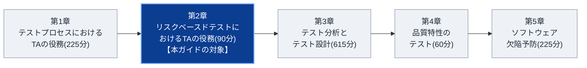
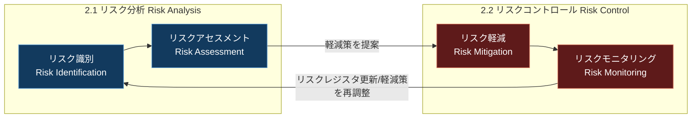
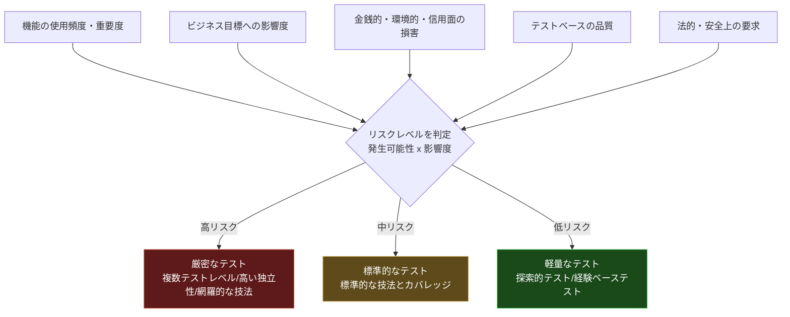
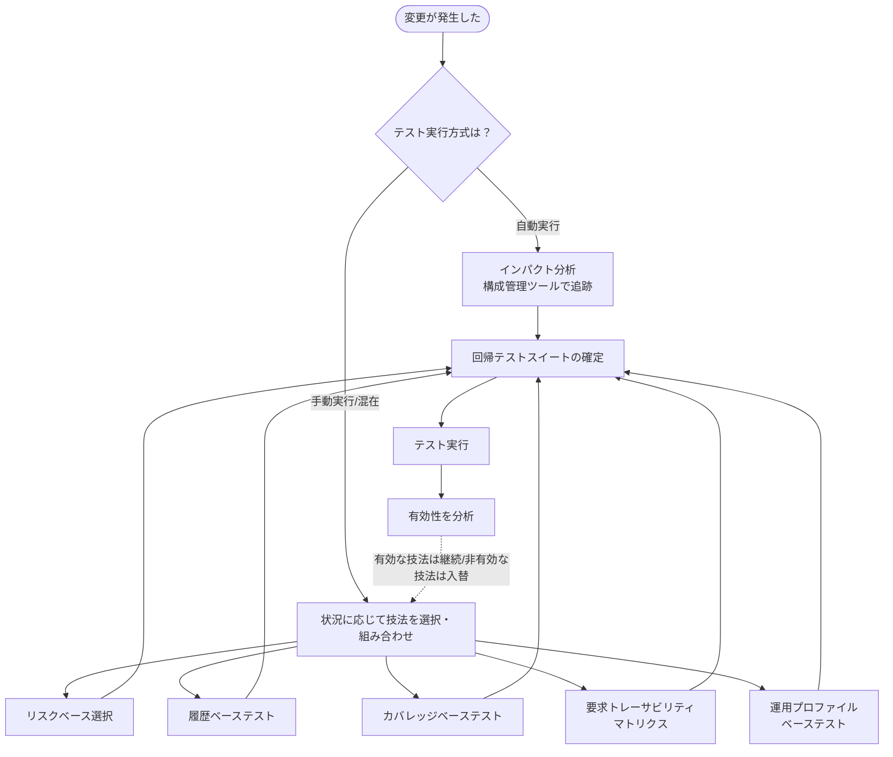
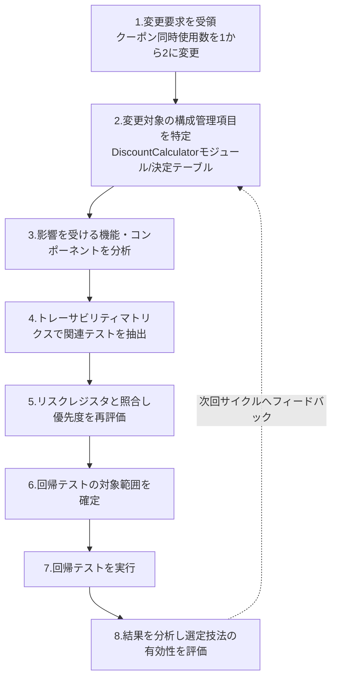

# CTAL-TA v4.0 学習ガイド 第2章：リスクベースドテストにおけるテストアナリストの役割

> **対象試験**: ISTQB® Certified Tester Advanced Level Test Analyst (CTAL-TA) v4.0
> **対象範囲**: Chapter 2 “The Tasks of the Test Analyst in Risk-Based Testing”（公式シラバス学習時間目安：**90分** / 全5章1215分中）
> **前提資格**: ISTQB® Foundation Level (CTFL) v4.0.1 合格が受験の必須条件
> **想定読者**: ソフトウェアテスト初学者〜中級のQAエンジニア（CTFLの基礎用語は既知として解説します）
> **本ガイドの立ち位置**: [ISTQB®公式CTAL-TA認定ページ](https://istqb.org/certifications/certified-tester-advanced-level-test-analyst/) と [公式シラバスv4.0 PDF](https://istqb.org/wp-content/uploads/sdm-uploads/ISTQB-CTAL-TA-Syllabus-v4.0-EN-4.pdf) の内容を、初学者向けに図解・具体例・ベストプラクティスを加えて再構成した学習補助教材です。試験の正答は必ず公式シラバスを参照してください。

---

## 目次

1. [このガイドの使い方と第2章の全体像](#1-このガイドの使い方と第2章の全体像)
2. [イントロダクション：リスクベースドテストとは何か](#2-イントロダクションリスクベースドテストとは何か)
3. [2.1 リスク分析（Risk Analysis）](#3-21-リスク分析risk-analysisk2)
4. [2.2 リスクコントロール（Risk Control）](#4-22-リスクコントロールrisk-controlk4)
5. [実践演習：インパクト分析をステップバイステップで行う](#5-実践演習インパクト分析をステップバイステップで行う)
6. [ベストプラクティス総まとめ（✅/❌）](#6-ベストプラクティス総まとめ)
7. [第2章のまとめ表](#7-第2章のまとめ表)
8. [理解度チェック問題](#8-理解度チェック問題)
9. [参考文献](#9-参考文献)
10. [次のステップ](#10-次のステップ)

---

## 1. このガイドの使い方と第2章の全体像

### 1.1 CTAL-TA試験全体における第2章の位置づけ

CTAL-TA v4.0のシラバスは、examinable（試験範囲）な章が5つあります。第2章は全体の中では最も学習時間が短い章（90分）ですが、**「リスクに基づいてテストの濃淡をつける」という考え方は、第3章のテスト技法選択や第4章の品質特性テストなど、後続のすべての章の土台になる**ため、分量以上に重要度の高い章です。

**この章と他の章のつながり**

| 章 | 第2章との関係 |
|---|---|
| 第1章（テストプロセス） | 1.2.1のテスト分析で「プロダクトリスクをすでに評価済みであること」が入場基準になっており、第2章の内容を前提にしている |
| 第3章（テスト分析・設計） | 3.5.1「リスクを緩和するテスト技法の選定」は第2章のリスクアセスメントの結果を直接使う |
| 第4章（品質特性テスト） | リスク軽減アクションとして「適切なテストタイプの適用」を選ぶ判断材料になる |
| 第5章（欠陥予防） | 回帰テストの有効性分析（5.3.1）は、第2章で選定した回帰テスト技法の改善サイクルと連動する |

### 1.2 学習目標（Learning Objectives）とコグニティブレベル（K-Level）

CTAL-TAのシラバスでは、各学習項目に「どのレベルまで理解・応用できればよいか」を示す**K-Level（認知レベル）**が明記されています。K-Levelを意識することは、単なる暗記で終わらせず「どこまで深く学べばよいか」を判断する上で非常に重要です。

| レベル | 意味 | 求められる行動の例 |
|---|---|---|
| **K1** | 記憶（Remember） | 用語とその定義を思い出せる |
| **K2** | 理解（Understand） | 概念を自分の言葉で説明できる、理由を要約できる |
| **K3** | 適用（Apply） | 与えられた状況に技法を実際に適用できる |
| **K4** | 分析（Analyze） | 複雑な状況を分解し、根拠を持って判断・選択できる |

第2章の学習目標は次の2つだけですが、片方はK4（分析）という、CTAL-TA全体でも高いレベルが要求される項目です。

| コード | K-Level | 学習目標 |
|---|:---:|---|
| **TA-2.1.1** | `K2` | テストアナリストがプロダクトリスク分析にどう貢献するかを要約できる |
| **TA-2.2.1** | `K4` | 変更の影響を分析し、回帰テストの対象範囲を決定できる |

> 💡 **ポイント**: TA-2.2.1がK4であることから、本試験ではおそらく「あるシステム変更のシナリオが与えられ、どの回帰テスト技法をどう組み合わせるべきかを判断させる」応用問題が出題されます。単なる用語暗記では対応できないため、本ガイドでは[5章の実践演習](#5-実践演習インパクト分析をステップバイステップで行う)でこの分析プロセスを丁寧に扱います。

### 1.3 覚えるべきキーワード（K1）

シラバスの各章冒頭にはキーワード一覧が示され、これらは学習目標に明記がなくても**K1（用語の正確な名称と定義の記憶）**として試験範囲に含まれます。

| キーワード | 定義（要約） |
|---|---|
| **product risk（プロダクトリスク）** | テスト対象そのものに直接関係するリスク（例：機能が仕様通りに動かない） |
| **risk（リスク）** | 将来ネガティブな結果を招く可能性のある要因 |
| **risk analysis（リスク分析）** | 識別したリスクの発生可能性と影響度を見積もり、リスクレベルを判定するプロセス。リスク識別とリスクアセスメントから成る |
| **risk identification（リスク識別）** | どのようなリスクが存在するかを洗い出すプロセス |
| **risk assessment（リスクアセスメント）** | 識別されたリスクに対して、発生可能性と影響度を見積もり、リスクレベルを判定するプロセス |
| **risk control（リスクコントロール）** | リスク軽減とリスクモニタリングから成る、リスクへの対応プロセス全体 |
| **risk mitigation（リスク軽減）** | リスクを許容水準まで下げる、または維持するための対策を決定・実施するプロセス |
| **risk monitoring（リスクモニタリング）** | リスクとリスクレベルは時間とともに変化するため、継続的にリスク状況を監視し直すプロセス |
| **risk-based testing（リスクベースドテスト）** | プロダクトリスクのレベルに基づいてテスト活動の優先順位・濃淡を決め、プロジェクト初期段階からステークホルダーにリスク状況を伝えるテストアプローチ |
| **regression testing（回帰テスト）** | 変更（不具合修正を含む）によって、既存の正しく動いていた部分に悪影響が出ていないことを確認するテスト |
| **impact analysis（インパクト分析）** | ある変更によってシステムのどの部分が影響を受ける可能性があるかを分析し、回帰テストの対象範囲を最適化するための分析活動 |

---

## 2. イントロダクション：リスクベースドテストとは何か

### 2.1 定義と基本的な考え方

**リスクベースドテスト（Risk-Based Testing）** とは、「テスト対象のすべての部分を均等にテストする」のではなく、**プロダクトリスクのレベルが高い部分により多くのテスト労力を投じる**というテストアプローチです。CTFL（Foundation Level）のSection 5.2で基礎が説明されており、CTAL-TAの第2章はその発展として「テストアナリスト（TA）が具体的に何をするか」にフォーカスしています。

**なぜこの考え方が必要なのか（理由）**

- 現実のプロジェクトでは、時間・予算・人員は常に有限であり、「全機能を100%網羅的にテストする」ことは不可能に近い
- 一方で、機能ごとに「壊れたときの被害の大きさ」と「壊れる可能性の高さ」は均一ではない
- そこで、限られたリソースを**最もリスクの高い部分に優先的に配分**することで、テストの投資対効果（ROI）を最大化する

### 2.2 テストマネージャとテストアナリストの役割分担

リスクベースドテストという「アプローチを採用するかどうか」自体は**テストマネージャ（TM）**が決定します。テストアナリスト（TA）は、その方針のもとで**実際にリスク分析・リスクコントロールの実務を遂行する**という役割分担です。より体系的な内容は[ISTQB® Advanced Level Test Management (CTAL-TM) v3.0](https://istqb.org/certifications/certified-tester-advanced-level-test-management-ctal-tm-v3-0/)で扱われます。

| 役割 | 主な責務 |
|---|---|
| テストマネージャ（TM） | リスクベースドテストを採用するかの意思決定、全体のリスク管理プロセスの設計 |
| テストアナリスト（TA） | リスク識別・リスクアセスメントへの実務的な参加、リスクレジスタの更新、回帰テスト範囲の分析・決定 |

### 2.3 リスクベースドテストの3本柱：分析・コントロール・モニタリングのサイクル

リスクベースドテストは、一度リスクを洗い出したら終わりではありません。**リスクとリスクレベルは時間とともに変化する**ため、継続的なモニタリングが不可欠です。この関係を図解すると次のようになります。

**モニタリングの頻度**は開発ライフサイクルによって異なります。

- **反復型（イテレーティブ）開発**: チームが決めた頻度（多くの場合イテレーションごとに1回）
- **その他の開発モデル**: プロダクトリスク管理の責任者（多くの場合テストマネージャ）が設定する頻度

TAは、変更内容に基づいてリスクレジスタを更新し、必要であればリスク軽減アクションを調整するという形でこのサイクルに貢献します。

### 2.4 本ガイドで使う統一シナリオ

抽象的な説明だけでは定着しにくいため、本ガイドでは以降すべてのセクションで**同じ具体例（ECサイトの「クーポン割引計算」機能）**を使って解説します。

> **シナリオ**：あなたはECサイトのカート・決済機能を担当するテストアナリストです。開発中の新機能は「複数のクーポンコードを同時に適用できるようにする、割引金額の自動計算ロジック」です。この機能は、商品の数量・会員ランク・クーポンの組み合わせによって最終価格が変わるため、計算ミスが起きると売上への直接的な損害や、顧客からの信頼低下につながります。

---

## 3. 2.1 リスク分析（Risk Analysis）`[K2]`

> **学習目標**: TA-2.1.1 (K2) テストアナリストのプロダクトリスク分析への貢献を要約できる

リスク分析は「**リスク識別**」と「**リスクアセスメント**」の2つの活動から構成されます。ここでのポイントは、**リスク分析の「意思決定」自体はTAの役割ではなく、TAは自分の持つ深い技術知識・経験を武器に、他のステークホルダーと協働してリスク分析に「貢献」する**という立ち位置です。

### 3.1 リスク識別（Risk Identification）

#### 定義

システムやプロジェクトにどのようなプロダクトリスクが存在するかを洗い出すプロセスです。

#### なぜTAが重要な貢献者になれるのか（理由）

TAは通常、システムに関する深い知識に加えて、「過去にどこでよく問題が起きるか」「その問題がどんな影響を及ぼすか」についての経験と直感を持っています。これは机上の仕様書だけでは得られない、実務経験に裏打ちされた情報であり、プロダクトリスク分析において非常に価値の高いインプットになります。

#### TAが参加する具体的な活動

| 活動 | TAの貢献の仕方 |
|---|---|
| **レトロスペクティブ（振り返り会）** | 過去のイテレーションで発生した不具合傾向を共有する |
| **リスクワークショップ** | 自分の経験・知識をもとに、想定されるリスクをその場で提案する |
| **ブレインストーミング** | 制約を設けずに「何が起こりうるか」を自由に発想して出し合う |
| **チェックリストの作成** | 過去の欠陥パターンをチェックリスト化し、リスクの洗い出し漏れを防ぐ（詳細は第3章 3.4.2） |
| **ステークホルダーへのインタビュー** | 開発者・プロダクトオーナー・ビジネス側それぞれの視点から「最も重大だと考えるリスク」を聞き出す |

#### 具体例（シナリオ適用）

クーポン割引機能について、TAは以下のようにリスク識別に貢献します。

- 過去のレトロスペクティブから「割引ロジックの改修は過去にも計算誤りのバグが多かった」という傾向を共有する
- プロダクトオーナーへのインタビューで「値引きしすぎて赤字になること」と「割引が適用されず顧客からクレームが来ること」の両方が重大リスクと判明する
- 開発者へのインタビューで「クーポンの組み合わせパターンが将来的に増える設計になっており、テストの組み合わせ爆発が起きやすい」という技術的リスクが判明する

#### ベストプラクティス

- **✅ 受け身にならず、自ら発言する**：TAは「リスクを教えてもらう側」ではなく「リスクを提案する側」として積極的にワークショップに参加する
- **✅ 定量的な過去データと定性的な経験の両方を使う**：過去の欠陥密度データだけでなく、「あの機能はいつも危ない」という現場感覚も貴重な情報として提示する
- **✅ 多様なステークホルダーの視点を集める**：ビジネス側・開発側・運用側など、視点が異なる人にインタビューすることで見落としを減らす
- **❌ 避けるべきこと**：一人のTAの主観だけでリスクを確定させてしまうこと。リスク識別は必ず複数のステークホルダーとの協働で行う

### 3.2 リスクアセスメント（Risk Assessment）

#### 定義

識別されたリスクについて、**発生可能性（Likelihood）**と**影響度（Impact）**を見積もり、総合的な**リスクレベル**を判定するプロセスです。TAは他のステークホルダーと共同でこの判定に貢献します。

#### リスクレベルを判定するための5つの評価要因

シラバスでは、リスクレベルを見積もる際に考慮すべき要因として次を挙げています。

| # | 評価要因 | 説明 |
|---|---|---|
| 1 | **機能の使用頻度・重要度** | その機能がどれだけ頻繁に使われ、業務上どれだけ重要か |
| 2 | **ビジネス目標への影響度** | 不具合が発生した場合、会社の目標達成にどれだけ悪影響を与えるか |
| 3 | **金銭的・環境的・信用面の損害** | 不具合による直接的な金銭損失、環境影響、ブランドイメージの毀損 |
| 4 | **テストベース（仕様書等）の品質** | 仕様があいまい・不完全であるほど実装ミスの可能性が高まる |
| 5 | **法的・安全上の要求** | 法規制や安全基準への抵触リスク |

> 上記に加えて、TAは**ISO/IEC 25010の品質特性モデル**などを用いて、リスクが「どの品質特性（機能適合性、セキュリティ、信頼性など）に影響するか」で分類することにも貢献します。分類しておくことで、後の第4章（品質特性テスト）でどのテストタイプを重点的に行うべきかの判断材料になります。

#### 具体例：発生可能性 × 影響度によるリスクレベルの判定（シナリオ適用）

| リスクID | リスクの内容 | 発生可能性 | 影響度 | リスクレベル |
|---|---|:---:|:---:|:---:|
| R-01 | クーポン併用時の割引額計算ミスによる過剰値引き | 高 | 高 | **高** |
| R-02 | クーポン併用時に割引が正しく適用されず顧客がクレーム | 中 | 中 | **中** |
| R-03 | クーポン入力欄のUIラベルの表記ゆれ | 低 | 低 | **低** |

このように、リスクを一覧化して優先順位を可視化することで、後述するテスト活動の濃淡（どこに厚く、どこに薄くテストを配分するか）の根拠が明確になります。

#### リスクレベルとテスト活動の対応関係

リスクレベルが決まったら、TAは**そのリスクを軽減する具体的なテスト活動**を提案します。考慮すべき観点は以下の通りです。

- どの**テストレベル**（コンポーネント/統合/システム/受け入れ）で対応すべきか
- どの**テストタイプ**（機能/非機能）で対応すべきか
- どの**テスト技法**（第3章で扱うデータベース・振る舞いベース・ルールベース・経験ベース技法）が適切か
- どの程度の**テストの独立性**（別チームによるレビューが必要か等）が必要か
- どの程度の**テストの網羅性（厳密さ）**が必要か

#### シフトレフトの原則

TAは、**できるだけ早い段階でリスクを軽減できるテスト活動**を提案することが推奨されています（シフトレフトの精神）。例えば、コードが書かれる前の仕様レビューの段階で欠陥を発見できれば、実装後にテストで発見するよりもはるかに低コストで修正できます。

#### 具体例（シナリオ適用）

先ほどのリスク一覧に対して、TAは次のようなテスト活動を提案します。

| リスクID | リスクレベル | 提案するテスト活動 |
|---|:---:|---|
| R-01（過剰値引き） | 高 | 実装前に決定テーブルのレビュー（静的テスト）を実施。実装後は決定テーブルテストとコンビナトリアルテスト（第3章）で組み合わせを網羅的に検証。テスト実行はレビュー担当者以外の高い独立性を持つTAが担当 |
| R-02（割引未適用） | 中 | シナリオベーステストでチェックアウトの代表的なユースケースを検証。標準的なEP/BVAで境界値も確認 |
| R-03（UI表記ゆれ） | 低 | 探索的テストの中で軽くチェック。専用のテストケースは作成しない |

#### ベストプラクティス

- **✅ リスクを均一に扱わない**：テスト対象全体を1つのリスクとして扱うのではなく、コンポーネント・インターフェース・機能単位（テストアイテム）に分解し、それぞれ個別にリスクレベルを評価する
- **✅ 品質特性で分類する**：ISO/IEC 25010のような標準的なモデルを使ってリスクを分類し、テストタイプの選定（第4章）につなげる
- **✅ シフトレフトを意識する**：可能な限り早い工程（レビュー等の静的テスト）でリスクを低減できないか検討する
- **❌ 避けるべきこと**：仕様書の記載の有無だけでリスクレベルを判断すること。仕様が書かれていても「その仕様自体があいまいで解釈が割れる」場合はテストベースの品質という観点でリスクが上がる点を見落とさない

---

## 4. 2.2 リスクコントロール（Risk Control）`[K4]`

> **学習目標**: TA-2.2.1 (K4) 変更の影響を分析し、回帰テストの対象範囲を決定できる

リスクコントロールは「**リスク軽減（Risk Mitigation）**」と「**リスクモニタリング（Risk Monitoring）**」の2つの活動から構成されます。

### 4.1 リスク軽減（Risk Mitigation）を構成する4つのアクション

CTFL（Section 5.2.4）で紹介されているリスク軽減アクションのうち、TAが特に重要な役割を担う4つは以下の通りです。それぞれ本シラバスの別の章・節で詳しく扱われます。

| # | アクション | 詳細を扱う箇所 |
|---|---|---|
| 1 | レビューの実施 | 本シラバス 5.2.2「レビュー技法の適用」 |
| 2 | 適切なテスト技法・カバレッジレベルの適用 | 本シラバス 3.5「最も適切なテスト技法の適用」 |
| 3 | 適切なテストタイプの適用 | 本シラバス 第4章「品質特性のテスト」 |
| 4 | **回帰テストの実施** | 本章（2.2）で詳しく解説 |

このガイドでは、第2章の学習目標がK4（分析）に設定されている**回帰テスト**に焦点を当てて深掘りします。

### 4.2 回帰テスト（Regression Testing）の目的と現実的な制約

#### 定義

回帰テストとは、**変更（不具合修正を含む）を加えた後も、既存の正しく動いていた部分に悪影響（デグレード）が出ていないことを確認するテスト**です。

#### なぜ「全部」再実行できないのか（理由）

理想を言えば、変更のたびに既存のテストをすべて再実行できれば安心です。しかし現実には、以下のような制約から**すべての回帰テストを毎回実行することは不可能**な場合がほとんどです。

- 時間の制約（リリースサイクルが短い）
- 予算の制約
- テスト環境の制約
- テストデータの制約
- （自動テストであっても）テストサイクルが短く、実行に時間のかかる自動テストが大量にある場合は同様の問題が起きる

したがって、TAは**「どの回帰テストを実行すべきか」を、限られたリソースの中で合理的に選定する**という重要な役割を担います。また、**回帰テストの対象範囲は毎テストサイクルごとに見直すべき**であり、一度決めたら固定という考え方は誤りです。

### 4.3 回帰テスト選択技法：6つのアプローチを徹底解説

シラバスでは、状況に応じて使い分けるべき回帰テスト選択技法が紹介されています。**「どれか1つが常に優れている」という決定的な証拠はなく**、TAは状況に応じて技法を選択・組み合わせる必要があります。

#### 技法①：インパクト分析（Impact Analysis）

- **定義**：構成管理システムと連携したツールを使い、各テストケースの実行時にどの構成アイテム（モジュール・ファイル等）が使われたかを記録しておき、変更が入った際にその変更に関わる構成アイテムを使うテストだけを自動的に選び出す技法
- **理由**：自動テストの選定において**最も信頼性が高い**とされる技法。変更箇所と実際に紐づくテストだけを機械的に特定できるため、人手による見落としが起きにくい
- **具体例**：`DiscountCalculator.js` が変更されたら、過去の実行ログから「このファイルを経由したテストケース」を自動抽出し、それらだけを回帰テスト対象とする
- **適用しやすい場面**：自動テストが充実しており、構成管理ツールとテスト管理ツールが連携している環境

#### 技法②：リスクベース選択（Risk-Based Test Selection）

- **定義**：回帰テストスイートとリスクレジスタのトレーサビリティを維持しておき、リスクレジスタが更新されたタイミングで、最もリスクレベルの高い部分をカバーするように回帰テストスイートを調整する技法
- **理由**：第2章2.1で行ったリスク分析の成果をそのまま回帰テストの優先順位付けに再利用できる、一貫性のあるアプローチ
- **具体例**：クーポン併用ロジックの変更が入った際、R-01（過剰値引きリスク：高）に紐づく決定テーブルテスト・コンビナトリアルテストを最優先で回帰テスト対象にする

#### 技法③：履歴ベーステスト（History-Based Testing）

- **定義**：過去のテスト実行結果を振り返り、「過去に欠陥を検出した」または「似た変更に敏感に反応した」テストケースを重点的に再実行する技法。また、長期間実行されていないテストをあえて含めることで、それらが依然としてパスすることも確認する
- **理由**：過去に問題が起きた箇所は、将来も同様の問題を起こしやすい傾向がある（欠陥の再発・類似欠陥の傾向）という経験則に基づく
- **具体例**：過去に「クーポン+会員ランク割引の重複適用」でバグが見つかったテストケースを、今回の変更でも優先的に再実行する

#### 技法④：カバレッジベーステスト（Coverage-Based Testing）

- **定義**：選択したテスト技法のカバレッジ基準に基づき、できるだけ少ないテスト数でできるだけ高いカバレッジを達成するテストの小集合を選ぶ技法
- **理由**：テスト数とカバレッジ増加量のバランスを取ることで、効率的な回帰テストスイートを構築できる
- **具体例**：決定テーブルの全ルールをカバーする最小限のテストケースの組み合わせを選び、回帰テストとして実行する

#### 技法⑤：要求トレーサビリティマトリクス（Requirement Traceability Matrix）

- **定義**：要求（アクセプタンス基準を含む）と、それに関連するテストとの対応関係を一覧化した表を使い、変更された要求に対応するテストだけでなく、**間接的に影響を受ける可能性がある関連機能のテストも合わせて選定する**技法
- **理由**：新規・変更された要求が、直接関係のなさそうな別の既存機能に予期しない副作用を与えるケースを捉えられる
- **具体例**：クーポン適用ロジックの変更が「送料無料条件の判定ロジック」にも間接的に影響する場合、トレーサビリティマトリクスをたどることでこの関連機能のテストも回帰対象に含める

#### 技法⑥：運用プロファイルベーステスト（Testing Based on Operational Profiles）

- **定義**：実際のユーザーの利用パターン（操作の頻度・順序）に基づいて回帰テストケースを選定する技法。システムに大きな変更が入った際、システム全体の機能性を素早く俯瞰する目的で有効
- **理由**：実際のユーザーがよく通る道筋（ログイン→検索→カート追加→注文、など）を優先的に確認することで、実利用への影響を効率よく検証できる
- **具体例**：「ログイン→商品検索→カート追加→クーポン適用→注文確定」という一連の操作パターンをE2Eテストとして回帰テスト対象にする。もし対象パターンが多すぎる場合は、頻度が高く重要な業務プロセスをカバーするパターンを優先する

#### 6技法の比較表

| 技法 | 主な適用場面 | 長所 | 短所・留意点 |
|---|---|---|---|
| インパクト分析 | 自動テスト・構成管理連携がある環境 | 最も信頼性が高い、機械的に選定可能 | ツール導入・構成管理の整備が前提 |
| リスクベース選択 | リスク分析の成果を活用したい場合 | リスク管理と一貫性を保てる | リスクレジスタの継続的な更新が前提 |
| 履歴ベーステスト | 過去データが蓄積されている場合 | 実績に基づく高い検出力が期待できる | 未経験の新しい欠陥パターンは捉えにくい |
| カバレッジベーステスト | 効率的な小規模スイートを作りたい場合 | テスト数とカバレッジのバランスが良い | 技法選定・カバレッジ基準の理解が必要 |
| 要求トレーサビリティマトリクス | 要求変更の間接的影響が懸念される場合 | 関連機能への副作用を捕捉しやすい | マトリクスの維持コストがかかる |
| 運用プロファイルベーステスト | 大規模変更時の全体俯瞰 | 実利用への影響を効率的に確認できる | パターンが多すぎると絞り込みが必要 |

### 4.4 複数技法の組み合わせと継続的な改善

シラバスは明確に「**多くの場合、複数の選択技法を組み合わせる必要がある**」としています。TAは、カバレッジの十分性と、テストスイートの管理可能なサイズとのバランスを常に取る必要があります。

**継続的改善のポイント**：各テストサイクルの後、TAは「今回選んだ技法・テストケースは実際に欠陥を検出できたか」を分析します（この分析手法は本シラバス5.3.1で扱われます）。効果的だった技法は次回も継続し、効果が薄かった技法は別の技法に置き換える、というサイクルを繰り返すことで、回帰テスト選定の精度は時間とともに向上していきます。この継続的改善は、変更が頻繁に発生する**反復型・インクリメンタル型の開発モデルにおいて特に重要**です。

### 4.5 リスクモニタリング（Risk Monitoring）

#### 定義

リスクとリスクレベルは静的なものではなく、プロジェクトの進行とともに変化します。リスクモニタリングは、この変化を継続的に把握し直すプロセスです。

#### TAの貢献

- 変更が加えられるたびに、その変更内容に基づいてリスクレジスタを更新する
- リスクレベルの変化に応じて、リスク軽減アクション（テスト技法・カバレッジ・テストタイプの選定など）を調整する
- モニタリングの頻度は、反復型開発では「イテレーションごとに1回程度」が目安。それ以外の開発モデルでは、プロダクトリスク管理の責任者（多くの場合テストマネージャ）が定める頻度に従う

#### ベストプラクティス

- **✅ リスクレジスタを"生きたドキュメント"として扱う**：プロジェクト開始時に一度作って終わりにせず、変更のたびに更新する運用を定着させる
- **✅ 技法の組み合わせを前提にする**：単一の回帰テスト選択技法に固執せず、状況に応じて複数技法を併用する
- **✅ 選定結果を毎サイクル振り返る**：欠陥検出につながったか否かを分析し、次サイクルの選定精度を上げる
- **❌ 避けるべきこと**：「前回と同じテストセットだから今回もそのまま実行すればよい」という思考停止。変更内容とリスクの状況は毎回異なるため、都度見直しが必要

---

## 5. 実践演習：インパクト分析をステップバイステップで行う

TA-2.2.1（K4：分析）の学習目標を体感するために、統一シナリオを使った実践演習を行います。

> **状況設定**：クーポン割引機能の仕様変更が決定しました。「同時に適用できるクーポンの数を、これまでの**最大1枚**から**最大2枚**に緩和する」という変更です。この変更に対して、TAとしてどのように回帰テストの対象範囲を決定すればよいでしょうか。

### ステップ①：変更要求を受領する

「クーポン同時使用数を1→2枚に変更」という要求内容を正確に把握します。この時点でTAは、単に「言われた通りにテストする」のではなく、**この変更がどこまで波及しうるか**を意識し始めます。

### ステップ②：変更対象の構成管理項目を特定する

開発者と連携し、実際にコード変更が入る構成アイテムを特定します。

- `DiscountCalculator`モジュール（割引金額の計算ロジック本体）
- 「割引ルール」決定テーブル（クーポン種別×会員ランク×数量の組み合わせルール）
- カートUIのクーポン入力欄（2枚目の入力欄追加が必要な場合）

### ステップ③：影響を受ける機能・コンポーネントを分析する

直接変更されたモジュールだけでなく、**間接的に影響を受けうる機能**まで視野を広げます。

- 送料無料判定ロジック（割引後の合計金額を参照している場合、影響を受ける可能性がある）
- ポイント付与ロジック（割引後金額を基準にポイントを計算している場合、影響を受ける可能性がある）
- 注文確認メールに表示される割引内訳の表示ロジック

### ステップ④：トレーサビリティマトリクスで関連テストを抽出する

要求トレーサビリティマトリクス（技法⑤）を使い、「クーポン適用」「送料無料判定」「ポイント付与」といった要求・機能に紐づく既存のテストケース群を洗い出します。

### ステップ⑤：リスクレジスタと照合し優先度を再評価する

洗い出されたテストケースを、[3章で作成したリスクレベル表](#具体例発生可能性--影響度によるリスクレベルの判定シナリオ適用)と突き合わせます。「過剰値引き（R-01：高リスク）」に直結する決定テーブルテストとコンビナトリアルテストは最優先、UIの表記レベルのテスト（R-03：低リスク）は優先度を下げる、といった判断を行います。

### ステップ⑥：回帰テストの対象範囲を確定する

ここまでの分析結果を統合し、複数の技法を組み合わせて最終的な回帰テストスイートを決定します。

| 選定技法 | この変更における適用例 |
|---|---|
| インパクト分析 | `DiscountCalculator`と決定テーブルを経由する既存の自動テストを機械的に抽出 |
| リスクベース選択 | R-01（高リスク）に紐づくテストを最優先 |
| 要求トレーサビリティマトリクス | 送料無料判定・ポイント付与への間接影響テストを追加 |
| 運用プロファイルベーステスト | 「クーポン2枚適用→注文確定」という新しい主要利用パターンをE2Eで1本追加 |

### ステップ⑦・⑧：実行と振り返り

回帰テストを実行し、結果を記録します。テスト実行後は、「今回選んだテストの中で実際に欠陥を検出できたものはどれか」を分析し（5.3.1の欠陥分析手法と連動）、次回同様の変更が入った際の選定精度向上につなげます。

> 💡 **学習ポイント**：このように、インパクト分析は「1つの技法」であると同時に、**複数の選択技法を組み合わせるプロセス全体の起点**にもなります。K4レベルの試験問題では、こうした「複数ステップを順序立てて分析し、根拠を持って回帰範囲を決定する」思考プロセスそのものが問われると考えられます。

---

## 6. ベストプラクティス総まとめ（✅/❌）

| 観点 | ✅ 良いプラクティス | ❌ 避けるべきアンチパターン |
|---|---|---|
| リスク識別 | 複数のステークホルダー（開発・ビジネス・運用）を巻き込み、経験に基づく知見を積極的に提案する | 一人のTAの主観だけでリスク一覧を確定させる |
| リスクの粒度 | リスクが均一に分布しないことを前提に、テスト対象をテストアイテム単位に分解して評価する | システム全体を1つの塊として単一のリスクレベルで扱う |
| テスト活動の選定 | シフトレフトを意識し、可能な限り早い工程（レビュー等）でリスクを軽減する方法を検討する | 実装が終わってから初めてテスト計画を考え始める |
| 回帰テスト選定 | 複数の選択技法（インパクト分析・リスクベース・履歴ベース等）を状況に応じて組み合わせる | 常に「全件再実行」または「毎回同じ固定セット」で済ませる |
| リスクモニタリング | 変更のたびにリスクレジスタを更新し、軽減アクションを見直す「生きた運用」にする | プロジェクト開始時に一度リスクを決めたら、以後見直さない |
| 継続的改善 | 各テストサイクル後に選定技法の有効性（欠陥検出につながったか）を振り返り、次回に活かす | テスト結果を分析せず、同じ方法をただ繰り返す |

---

## 7. 第2章のまとめ表

| セクション | K-Level | 一言まとめ |
|---|:---:|---|
| 2.1 リスク分析（リスク識別） | K2 | TAは経験と知識を武器に、ワークショップ・インタビュー等を通じてリスク識別に積極的に貢献する |
| 2.1 リスク分析（リスクアセスメント） | K2 | 使用頻度・重要度・損害規模・テストベースの品質・法的要求などからリスクレベルを判定し、品質特性で分類し、テスト活動を提案する |
| 2.2 リスクコントロール（リスク軽減） | — | レビュー、テスト技法・カバレッジの選定、テストタイプの選定、回帰テストという4つのアクションでリスクを低減する |
| 2.2 リスクコントロール（回帰テスト選択） | K4 | インパクト分析・リスクベース選択・履歴ベース・カバレッジベース・トレーサビリティマトリクス・運用プロファイルの6技法を、状況に応じて組み合わせて回帰テストの範囲を分析・決定する |
| 2.2 リスクコントロール（リスクモニタリング） | — | リスクは変化し続けるものとして、継続的にリスクレジスタを更新し軽減策を調整する |

---

## 8. 理解度チェック問題

以下の問題で、本章の理解度を確認しましょう（解答・解説は各問題の直後に記載しています）。

**Q1.** リスクベースドテストのアプローチを「採用するかどうか」を決定するのは誰の役割か。

解答を見る

**解答**：テストマネージャ（TM）。テストアナリスト（TA）は、その方針のもとで実際にリスク分析・リスクコントロールを実行する役割を担う。

**Q2.** リスクアセスメントにおいて、リスクレベルを見積もる際に考慮すべき要因を3つ以上挙げよ。

解答を見る

**解答例**：機能の使用頻度・重要度／ビジネス目標への影響度／金銭的・環境的・信用面の損害／テストベースの品質／法的・安全上の要求（このうち3つ以上を挙げられればOK）

**Q3.** 「変更が入った構成アイテムを構成管理ツールで自動追跡し、それに紐づくテストのみを機械的に選定する」回帰テスト選択技法の名称は何か。

解答を見る

**解答**：インパクト分析（Impact Analysis）。自動テストの選定において最も信頼性が高いとされる技法。

**Q4.** 手動実行の回帰テストにおいて、「唯一絶対に優れている」選択技法は存在するか。

解答を見る

**解答**：存在しない。結果は様々な要因に依存するため、TAは状況に応じてどの技法を使うかを判断し、多くの場合は複数の技法を組み合わせる必要がある。

**Q5.** リスクモニタリングの頻度は、開発ライフサイクルによってどう異なるか。

解答を見る

**解答**：反復型（イテレーティブ）開発では、チームが決めた頻度（多くの場合イテレーションごとに1回）で実施される。それ以外の開発モデルでは、プロダクトリスク管理の責任者（多くの場合テストマネージャ）が設定する頻度に従う。

---

## 9. 参考文献

### 公式ISTQBシラバス・認定情報

- ISTQB®. *Certified Tester Advanced Level Test Analyst (CTAL-TA) v4.0* 認定ページ. [https://istqb.org/certifications/certified-tester-advanced-level-test-analyst/](https://istqb.org/certifications/certified-tester-advanced-level-test-analyst/)
- ISTQB®. *Certified Tester Advanced Level Test Analyst (CTAL-TA) Syllabus v4.0*（2025年5月2日 GA版）. Chapter 2「The Tasks of the Test Analyst in Risk-Based Testing」. [https://istqb.org/wp-content/uploads/sdm-uploads/ISTQB-CTAL-TA-Syllabus-v4.0-EN-4.pdf](https://istqb.org/wp-content/uploads/sdm-uploads/ISTQB-CTAL-TA-Syllabus-v4.0-EN-4.pdf)
- ISTQB®. *Certified Tester Foundation Level (CTFL) Syllabus v4.0.1*（Section 5.2「リスクベースドテスト」— CTAL-TA第2章の基礎となる章）. [https://astqb.org/assets/documents/ISTQB_CTFL_Syllabus_v4.0.1.pdf](https://astqb.org/assets/documents/ISTQB_CTFL_Syllabus_v4.0.1.pdf)
- ISTQB®. *Certified Tester Advanced Level Test Management (CTAL-TM) v3.0* 認定ページ（リスクベースドテストのより詳細な内容を扱う）. [https://istqb.org/certifications/certified-tester-advanced-level-test-management-ctal-tm-v3-0/](https://istqb.org/certifications/certified-tester-advanced-level-test-management-ctal-tm-v3-0/)

### ISTQB用語集（Glossary）

- ISTQB® Glossary（公式）. [https://glossary.istqb.org/](https://glossary.istqb.org/)
- Risk-Based Testing. [https://istqb-glossary.page/risk-based-testing/](https://istqb-glossary.page/risk-based-testing/)
- Risk Analysis. [https://istqb-glossary.page/risk-analysis/](https://istqb-glossary.page/risk-analysis/)
- Risk Assessment. [https://istqb-glossary.page/risk-assessment/](https://istqb-glossary.page/risk-assessment/)
- Risk Mitigation. [https://istqb-glossary.page/risk-mitigation/](https://istqb-glossary.page/risk-mitigation/)
- Product Risk. [https://istqb-glossary.page/product-risk/](https://istqb-glossary.page/product-risk/)
- Risk Management. [https://istqb-glossary.page/risk-management/](https://istqb-glossary.page/risk-management/)

### 関連国際規格

- ISO/IEC 25010:2023. *Systems and software engineering — Systems and software Quality Requirements and Evaluation (SQuaRE) — Product quality model*（リスクを品質特性で分類する際の参照モデル）. [https://www.iso.org/standard/78176.html](https://www.iso.org/standard/78176.html)

---

## 10. 次のステップ

第2章で学んだ「リスクに基づいて優先順位をつける」という考え方は、次の**第3章「テスト分析とテスト設計」**、特に**3.5.1「プロダクトリスクを緩和するテスト技法の選定」**で直接活用されます。データベース技法・振る舞いベース技法・ルールベース技法・経験ベース技法という具体的な武器を学ぶ前に、本章の内容（特にリスクレベルとテスト活動のマッピング、回帰テスト選択技法の使い分け）を確実に自分の言葉で説明できる状態にしておくことを推奨します。

また、リスクベースドテストをより実務的・戦略的なレベル（プロジェクト全体のリスク管理体制の構築など）で深めたい場合は、[ISTQB® Advanced Level Test Management (CTAL-TM) v3.0](https://istqb.org/certifications/certified-tester-advanced-level-test-management-ctal-tm-v3-0/)の学習もあわせて推奨します。
