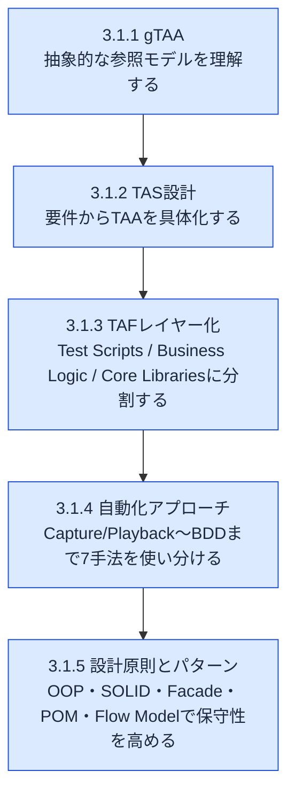
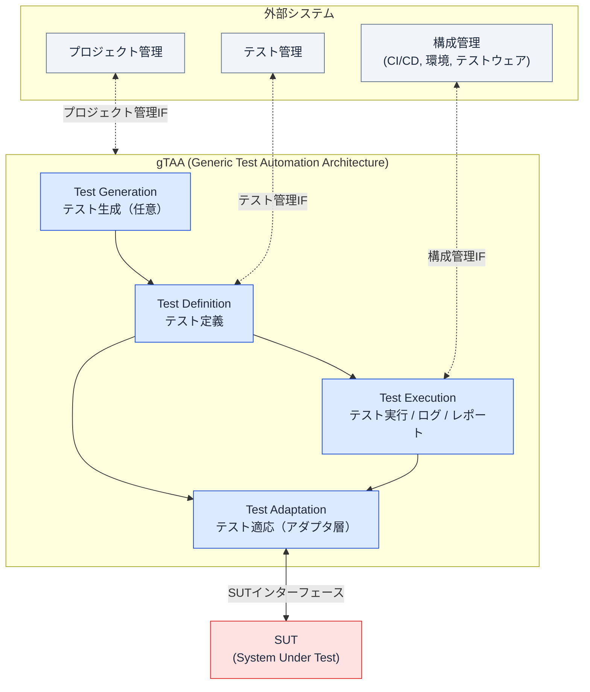
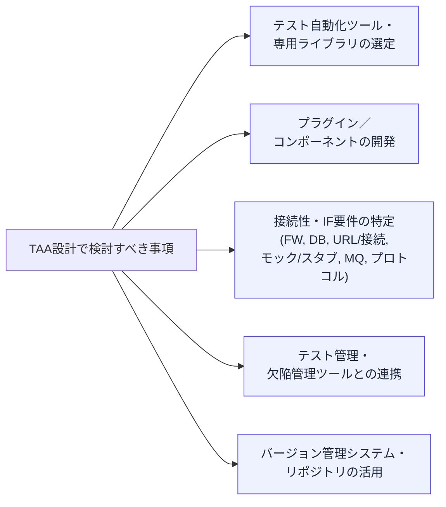
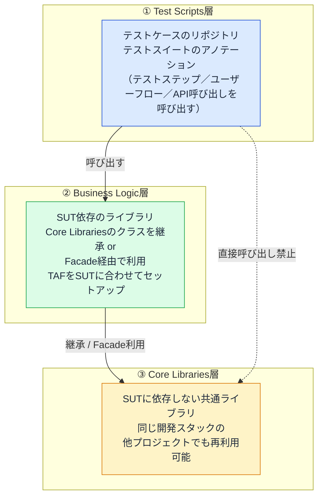
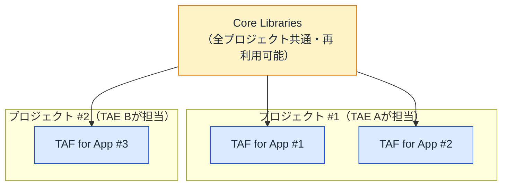
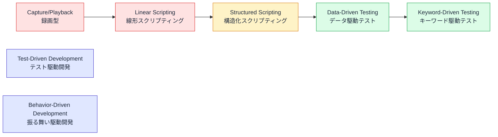
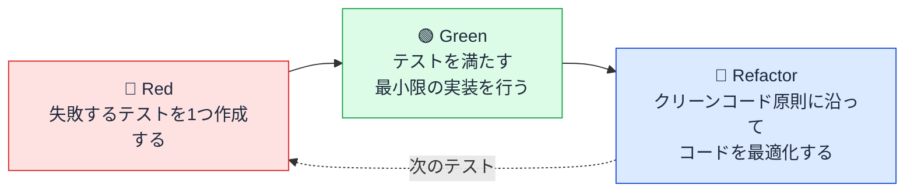
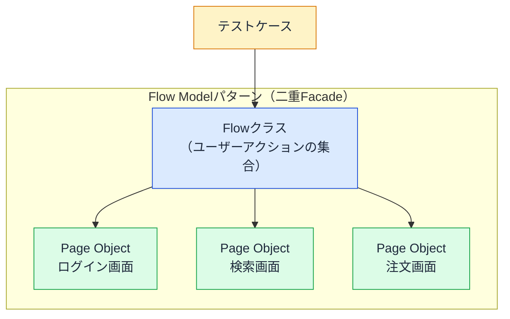
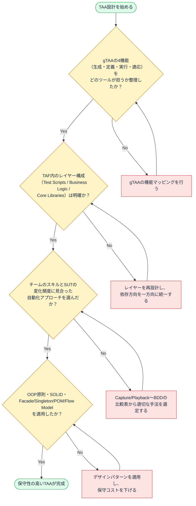

# CTAL-TAE v2.0 第3章：Test Automation Architecture（テスト自動化アーキテクチャ）徹底解説

> 対象試験：ISTQB® Certified Tester Advanced Level Test Automation Engineering (CTAL-TAE) v2.0
> 章の配分時間：210分（学習目標レベル：K3＝適用）
> 本章の試験配点は10点（全66点中）で、実務でも中核となる章です。

---

## 0. この章の全体像

第3章は「テスト自動化ソリューション（TAS: Test Automation Solution）をどう設計するか」を扱う、CTAL-TAEのコア中のコアです。以下の5つの学習目標（Learning Objectives）から構成されています。

| LO番号 | 認知レベル | 内容 |
|---|---|---|
| TAE-3.1.1 | K2（理解） | テスト自動化アーキテクチャにおける主要な機能を説明できる |
| TAE-3.1.2 | K2（理解） | テスト自動化ソリューションの設計方法を説明できる |
| TAE-3.1.3 | K3（適用） | テスト自動化フレームワークのレイヤー化を適用できる |
| TAE-3.1.4 | K3（適用） | テストケース自動化のさまざまなアプローチを適用できる |
| TAE-3.1.5 | K3（適用） | テスト自動化における設計原則・デザインパターンを適用できる |

**必須キーワード（試験で暗記必須）**：
behavior-driven development（BDD）, capture/playback, data-driven testing（DDT）, generic test automation architecture（gTAA）, keyword-driven testing（KDT）, linear scripting, model-based testing（MBT）, structured scripting, test adaptation layer, test automation framework（TAF）, test automation solution（TAS）, test harness, test script, testware, test step, test-driven development（TDD）

この章の骨格を図にすると、以下のような流れで理解が積み上がっていきます。

---

## 1. TAE-3.1.1：テスト自動化アーキテクチャにおける主要な機能（gTAA）

### 1.1 gTAA（Generic Test Automation Architecture）とは

**gTAA（汎用テスト自動化アーキテクチャ）**は、テスト自動化の「参照モデル」です。個別の製品や実装方法に依存せず、テスト自動化ソリューション（TAS）が持つべき機能・コンポーネント・インターフェースを抽象的に定義したものです。

gTAAは、次の4つの外部システムとテスト自動化がどう連携するかをインターフェースとして定義します。

| インターフェース | 説明 |
|---|---|
| **SUTインターフェース** | SUT（System Under Test：テスト対象システム）とTAF（テスト自動化フレームワーク）間の接続を表す |
| **プロジェクト管理インターフェース** | テスト自動化の開発進捗を表す |
| **テスト管理インターフェース** | テストケース定義と自動化されたテストケースのマッピングを表す |
| **構成管理インターフェース** | CI/CDパイプライン、環境、テストウェアを表す |

gTAAが定義する4つのコア機能（ケーパビリティ）は次の通りです。

| 機能 | 役割 | 補足 |
|---|---|---|
| **Test Generation（テスト生成）** | テストモデルに基づき自動的にテストケースを設計する | モデルベーステスト（MBT）ツールが活用できる。**任意（オプション）**の機能 |
| **Test Definition（テスト定義）** | テストケース／テストスイートの定義と実装を支援する | テストモデルから導出できる場合もある。テスト定義をSUT・テストツールから分離する |
| **Test Execution（テスト実行）** | テスト実行とテストログ記録を支援する | 選択したテストを自動実行するツール、およびログ・レポートのコンポーネントを持つ |
| **Test Adaptation（テスト適応）** | 自動化されたテストをSUTの各種コンポーネント/インターフェースに適応させる機能を提供する | API・プロトコル・サービスへ接続するための各種アダプタを提供する |

これらの関係を図解すると以下のようになります。

> 💡 **ベストプラクティス**
> - gTAAはあくまで「参照モデル」であり、すべてのプロジェクトが4機能すべてを実装する必要はない。特にTest Generation（モデルベースのテスト生成）は多くの現場で任意扱いになる。
> - ツール選定・アーキテクチャ設計を始める前に、まず「自分たちのTASはgTAAのどの機能を、どのツール／コンポーネントで担うのか」をマッピングしておくと、後工程での抜け漏れ（例：レポーティング機能の欠落）を防げる。
> - Test Adaptation層を意識的に独立させておくと、SUTのAPIやUI構造が変わってもTest Definition層（テストケースそのもの）への影響を最小化できる（後述3.1.5のFacadeパターンとも直結する）。

---

## 2. TAE-3.1.2：テスト自動化ソリューション（TAS）の設計方法

### 2.1 TASとTAAの関係

- **TAS（Test Automation Solution）**：SUTの機能要件・非機能要件・技術要件の理解に基づいて定義される、実際に稼働する自動化の仕組み全体。商用ツールやOSSツールで実装され、必要に応じてSUT固有のアダプタが追加される。
- **TAA（Test Automation Architecture）**：TAS全体の技術設計そのものを指す。

TAAを設計する際に検討すべき事項は以下の通りです。

| 検討項目 | 具体例・観点 |
|---|---|
| ツール・ライブラリ選定 | ツール固有のライブラリ、言語との整合性 |
| プラグイン／コンポーネント開発 | SUT固有のアダプタ、カスタム拡張 |
| 接続性・インターフェース要件 | ファイアウォール、DB接続、URL、モック/スタブ、メッセージキュー、プロトコル |
| テスト管理・欠陥管理ツール連携 | JiraやXray等、レポート・トレーサビリティの自動連携 |
| バージョン管理・リポジトリ | Git等でのテストウェアのバージョン管理 |

> 💡 **ベストプラクティス**
> - TAA設計は「SUTの要件理解」から始める。ツール選定を先に決めてしまう（ツールありきの設計）は、後々の接続性・拡張性の問題につながりやすい。
> - モック/スタブや外部依存のエミュレーション方法を早期に検討することで、外部システム側の制約（サードパーティAPIのレート制限など）に自動化がブロックされるリスクを減らせる。

---

## 3. TAE-3.1.3：テスト自動化フレームワーク（TAF）のレイヤー化

### 3.1 TAFとは

**TAF（Test Automation Framework）**はTASの土台（基盤）です。一般的に以下を含みます。

- **テストハーネス（テストランナー）**：テストを実行する仕組み
- **テストライブラリ**
- **テストスクリプト**
- **テストスイート**

### 3.2 TAFレイヤーの設計原則

TAFレイヤーとは、目的が似ているクラス群（テストケース、テストレポーティング、テストロギング、暗号化、テストハーネスなど）を明確に分離する境界のことです。

**重要な原則：レイヤーは1目的につき1つ導入できるが、増やしすぎると設計が複雑になるため、レイヤー数はできるだけ少なく保つことが推奨される。**

代表的な3層構造は以下の通りです。

| 層 | 役割 | 重要な制約 |
|---|---|---|
| **Test Scripts（テストスクリプト層）** | SUTのテストケースリポジトリ、テストスイートのアノテーションを提供。ビジネスロジック層のサービス（テストステップ、ユーザーフロー、API呼び出し）を呼び出す | **Core Librariesへの直接呼び出しは禁止**（必ずBusiness Logic層を経由する） |
| **Business Logic（ビジネスロジック層）** | SUTに依存するすべてのライブラリを格納。Core Librariesのクラスファイルを継承する、またはCore Librariesが提供するFacadeを利用する。TAFをSUTに対して実行するためのセットアップや追加設定を担う | Core Librariesとの結合点。SUTごとに実装が変わる |
| **Core Libraries（コアライブラリ層）** | SUTに依存しないすべてのライブラリを格納 | 同一の開発スタックであれば、**あらゆる種類のプロジェクトで再利用可能** |

### 3.3 テスト自動化のスケーリング（複数プロジェクトへの拡張）

Core Librariesを複数のTAF・複数プロジェクトで再利用することで、組織全体のテスト自動化をスケールできます。シラバスの例（Figure 3）は以下のような構成です。

> 💡 **ベストプラクティス**
> - レイヤー間の依存方向は必ず「Test Scripts → Business Logic → Core Libraries」の一方向に保つ。Test ScriptsからCore Librariesへの直接呼び出しを許すと、SUT固有のロジックが混入し、Core Librariesの再利用性が崩れる。
> - Core Librariesに「SUT固有の情報」を一切含めないことを設計ルールとして明文化する。含めてしまうと、他プロジェクトへの再利用時に予期しない副作用が発生する。
> - 複数プロジェクトでCore Librariesを共有する場合は、バージョニング（後述8章の内容とも関連）と後方互換性の方針を先に決めておく。

---

## 4. TAE-3.1.4：テストケース自動化のさまざまなアプローチ

シラバスでは7つのアプローチが紹介されています。これらは優劣の順位ではなく、**前の手法を土台に積み上がる関係**として理解すると覚えやすいです。たとえば DDT は Structured Scripting を基礎とし、KDT は DDT を基礎とする場合が多い、という具合です。どれを採用するかは、SUT の安定性、テストデータの量、テスト作成者のスキル、保守にかけられる工数などの状況に応じて選びます。後段の手法ほど準備・設計のコストも増えるため、常に後段が優れているわけではありません（TDD/BDDは開発方法論ですが、正しく実践すれば自動化テストケースの生成につながります）。

### 4.1 比較表（メリット・デメリット・向いている場面）

| アプローチ | 概要 | メリット | デメリット |
|---|---|---|---|
| **Capture/Playback（録画・再生）** | 手動操作をツールが記録し、テストスクリプトを自動生成する。コードを公開しないものは**ノーコード**、コードを公開するものは**ローコード**と呼ばれる | 初期セットアップと利用が容易 | 保守・拡張が困難／SUTが可用である必要がある／小規模かつ変化の少ないSUT向け／SUTバージョンへの依存度が高い／再利用より個別録画になりがちで工数がかかる |
| **Linear Scripting（線形スクリプティング）** | カスタムライブラリを使わずにテストスクリプトを記述・実行するプログラミング手法。Capture/Playbackで録画したスクリプトを流用・修正することも可能 | セットアップと記述開始が容易／Capture/Playbackより修正しやすい | 保守・拡張が困難／SUTが可用である必要がある／小規模向け／多少のプログラミング知識が必要 |
| **Structured Scripting（構造化スクリプティング）** | 再利用可能な要素（テストステップ、ユーザージャーニー）を持つテストライブラリを導入する | 保守・拡張・移植性が高い／ビジネスロジックとテストスクリプトを分離できる | プログラミング知識が必要／TAF開発とテストウェア定義に初期投資が必要 |
| **Test-Driven Development（TDD）** | 新機能実装前にテストケースを定義する。**Red→Green→Refactor**のサイクルで進める | コンポーネントレベルのテストケース開発が単純化／コード品質・構造の向上／テスタビリティの向上／コードカバレッジ達成が容易／上位テストレベルへの欠陥伝播を削減／開発者・ビジネス担当者・テスト担当者間のコミュニケーション改善 | 最初は習得に時間がかかる／正しく実践しないとコード品質への過信につながる |
| **Data-Driven Testing（DDT）** | 構造化スクリプティングを発展させ、テストスクリプトにテストデータ（CSV、Excel、DBダンプ等）を与える。同じスクリプトを異なるデータで繰り返し実行できる | データ投入だけでテストケースを迅速に拡張できる／新規テスト追加コストを大幅削減／テストアナリストがデータファイル作成だけでテストを指定でき、技術的なテスト自動化エンジニアへの依存を減らせる | 適切なテストデータ管理が必要 |
| **Keyword-Driven Testing（KDT）** | ユーザー視点で定義された「キーワード」とそれが操作するテストデータからなる、テストステップのリスト/表。多くはDDTの上に構築される | テストアナリストやビジネスアナリストがテストケース作成に参加できる／手動テストにも応用可能（ISO/IEC/IEEE 29119-5参照） | キーワードの実装・保守が複雑／スコープが拡大すると困難／小規模システムには過剰な労力になる |
| **Behavior-Driven Development（BDD）** | Given-When-Thenという自然言語形式で受け入れ基準を記述し、フィーチャーファイルとして保存。BDDツールがこれを解釈・実行する | 開発者・ビジネス担当者・テスト担当者間のコミュニケーション改善／自動化されたシナリオが仕様のカバレッジを保証／テストピラミッドの複数レベルで活用可能 | ネガティブ条件・エッジケースは別途定義が必要（通常テストアナリストやTAEが担当）／自然言語記述だけがBDDだと誤解され、ビジネス担当者・開発者を巻き込めていないチームが多い／自然言語テストステップの実装・保守が複雑／ステップが過度に複雑だとデバッグが困難でコストがかかる |

### 4.2 TDDのRed-Green-Refactorサイクル

> 💡 **ベストプラクティス**
> - チームの技術レベルとSUTの変化頻度に応じてアプローチを選ぶ。プログラミング未経験者が多い場合はCapture/Playback系のノーコード/ローコードツールから始め、成熟に応じてStructured Scripting以降へ移行するのが現実的。
> - DDT・KDTを導入する際は「誰が何を担当するか」（技術者がキーワード実装、非技術者がデータ・キーワード列を記述）を明確にし、テストデータ管理の仕組み（バージョン管理・命名規則）を最初に整備する。
> - BDDを導入する際は「自然言語で書くこと」自体を目的化しない。ビジネス担当者・開発者・テスト担当者が三者で仕様策定に参加する（Three Amigos的な進め方）ことがBDD本来の価値を引き出す条件である。
> - TDDは「テストファースト」を徹底しないと効果が出ない。テストを後付けする「TDDもどき」は品質への過信（false confidence）を生むため注意する。

---

## 5. TAE-3.1.5：テスト自動化における設計原則とデザインパターン

テスト自動化はソフトウェア開発活動そのものであるため、TAEにもソフトウェア開発者と同様に**設計原則**と**デザインパターン**の適用が求められます。

### 5.1 オブジェクト指向プログラミングの4原則

| 原則 | 説明 |
|---|---|
| **カプセル化（Encapsulation）** | データと処理を1つの単位にまとめ、内部実装を隠蔽する |
| **抽象化（Abstraction）** | 本質的な部分だけを見せ、複雑な詳細を隠す |
| **継承（Inheritance）** | 既存クラスの性質を引き継いで新しいクラスを作る |
| **ポリモーフィズム（Polymorphism）** | 同じインターフェースで異なる実装を扱えるようにする |

### 5.2 SOLID原則

**SOLID**は以下5つの原則の頭文字です。コードの可読性・保守性・拡張性を高めます。

| 頭文字 | 原則名 | 意味 |
|---|---|---|
| **S** | 単一責任の原則（Single Responsibility） | 1つのクラスは1つの責任のみを持つ |
| **O** | オープン・クローズドの原則（Open-Closed） | 拡張に対して開いており、修正に対して閉じている |
| **L** | リスコフの置換原則（Liskov Substitution） | サブクラスは親クラスと置換可能でなければならない |
| **I** | インターフェース分離の原則（Interface Segregation） | クライアントが使わないインターフェースへの依存を強制しない |
| **D** | 依存性逆転の原則（Dependency Inversion） | 上位モジュールは下位モジュールの具象ではなく抽象に依存する |

### 5.3 テスト自動化における3大デザインパターン

| パターン | 説明 | 得られる効果 |
|---|---|---|
| **Facadeパターン** | 実装の詳細を隠し、テスターが必要とする操作だけを公開する | テストケース作成者が内部実装を意識せずに済む |
| **Singletonパターン** | SUTと通信するドライバのインスタンスが1つだけであることを保証する | ドライバの重複生成による競合・リソース浪費を防ぐ |
| **Page Object Model（POM）** | 画面ごとに「ページモデル」というクラスファイルを作成し、ロケータ（要素の場所）をそこに集約する | SUTの構造が変わっても、修正箇所はページモデル内の1箇所のみで済む（各テストケースを個別修正する必要がない） |
| **Flow Modelパターン** | POMをさらに拡張し、Page Objectの上にもう1つのFacade（ユーザーアクションの集合）を重ねる「二重Facade」構造 | テストステップを複数のテストスクリプトで再利用でき、抽象度・保守性がさらに向上する |

> 💡 **ベストプラクティス**
> - Page Object Modelを導入する際は「ロケータ（要素特定情報）」と「操作（クリック・入力など）」を明確に分離し、ロケータの変更が起きても操作メソッドのシグネチャは変えずに済むよう設計する。
> - Flow Modelパターンは、テストケース数が増え「同じユーザー操作の組み合わせ」が複数のテストで重複し始めたタイミングで導入を検討するとよい。導入が早すぎると過剰設計（over-engineering）になりやすい。
> - SOLID原則の中でも特に**単一責任の原則**と**依存性逆転の原則**は、Core Libraries／Business Logic／Test Scriptsのレイヤー分離（3.1.3参照）と直接結びつく。レイヤー設計そのものがSOLID原則の実践例になっていることを意識すると理解が深まる。
> - Singletonパターンを使う際は、並列実行（並列テスト）環境でのスレッドセーフ性に注意する。単純なSingleton実装は並列実行時にドライバの共有・競合を引き起こすことがある。

---

## 6. 章全体のまとめ：TAAを設計する際のチェックリスト

---

## 7. 出典・参考ソース

| 資料名 | URL |
|---|---|
| ISTQB CTAL-TAE v2.0 認定試験ページ（公式） | https://istqb.org/certifications/certified-tester-advanced-level-test-automation-engineering-ctal-tae-v2-0/ |
| ISTQB CTAL-TAE Syllabus v2.0（シラバスPDF・第3章 Test Automation Architecture, p.22-28 が本ガイドの主な出典） | https://istqb.org/wp-content/uploads/2024/11/ISTQB_CTAL-TAE_Syllabus_v2.0.pdf |
| Robert C. Martin, *Clean Code: A Handbook of Agile Software Craftsmanship*（クリーンコード原則の引用元としてシラバス内で言及） | https://www.oreilly.com/library/view/clean-code-a/9780136083238/ |
| ISO/IEC/IEEE 29119-5（キーワード駆動テストに関する標準。シラバス内で参照） | https://www.iso.org/standard/81675.html |
| ISTQB Certified Tester Model-Based Testing (CT-MBT) Syllabus（テスト生成・モデルベーステストの詳細） | https://istqb.org/certifications/model-based-tester/ |
| ISTQB Glossary（gTAA・TAF・TAS等の用語定義の一次情報） | https://glossary.istqb.org/ |

---

**次の章へ**：第4章「Implementing Test Automation（テスト自動化の実装）」では、本章で設計したTAAをもとに、パイロット導入・デプロイリスク・保守性の観点を学びます。
