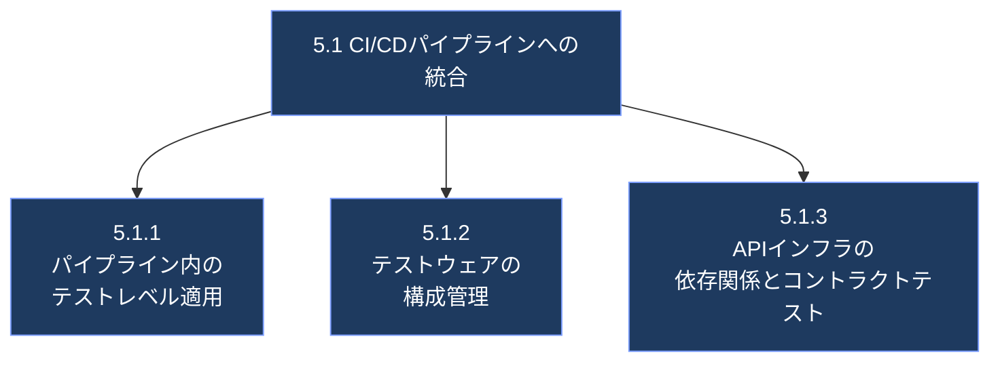
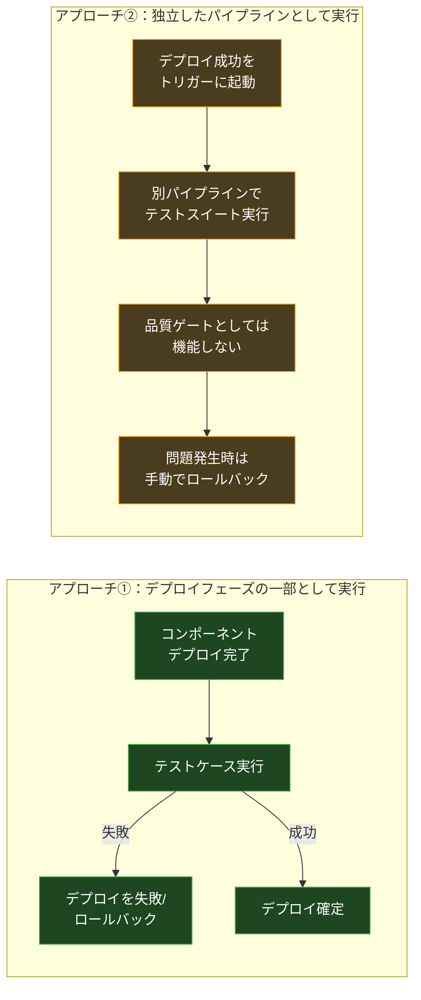
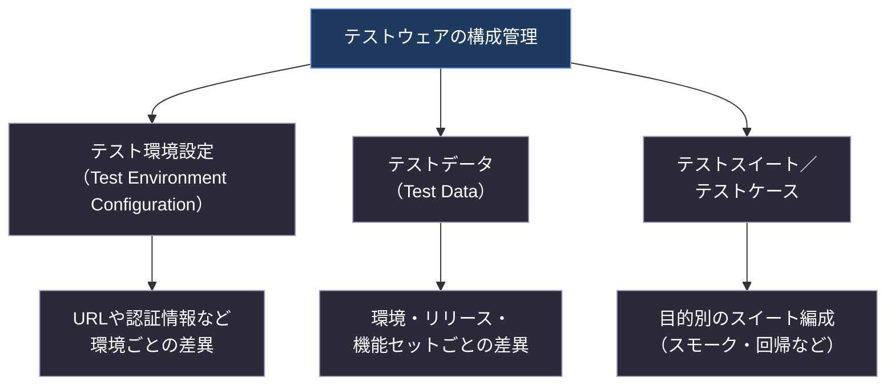
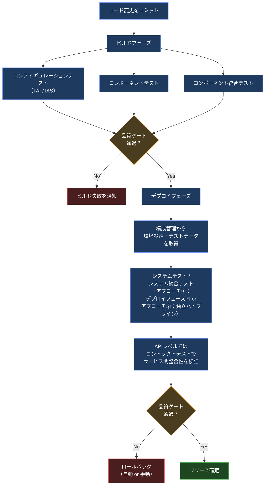

# CTAL-TAE v2.0 Ch.5「Implementation and Deployment Strategies for Test Automation」初学者向け解説ガイド

> **対象試験**：ISTQB® Certified Tester Advanced Level Test Automation Engineering (CTAL-TAE) v2.0
> **対象章**：Chapter 5 - Implementation and Deployment Strategies for Test Automation（90分、認知レベル K3：Apply）
> **キーワード**：contract testing（コントラクトテスト）

---

## 0. この章で学ぶこと（全体像）

Chapter 5 は、これまでの章（Ch.1〜Ch.4 でテスト自動化の目的・準備・アーキテクチャ・実装方法を学んだ）の集大成として、**実装したテスト自動化ソリューション（TAS）を実際の CI/CD パイプラインにどう組み込み、どう運用・維持していくか**を扱います。

学習目標（Learning Objectives）は次の3つです。

| ID | 認知レベル | 内容 |
|---|---|---|
| TAE-5.1.1 | K3（Apply） | パイプライン内の異なるテストレベルにテスト自動化を適用する |
| TAE-5.1.2 | K2（Understand） | テストウェアの構成管理（Configuration Management）を説明する |
| TAE-5.1.3 | K2（Understand） | API インフラストラクチャに対するテスト自動化の依存関係を説明する |

この章は大きく1つの節「5.1 Integration to CI/CD Pipelines（CI/CDパイプラインへの統合）」で構成されており、その中に上記3つのサブテーマが含まれます。

---

## 1. 5.1.1 パイプライン内の異なるテストレベルへのテスト自動化の適用

### 1.1 なぜテスト自動化とパイプラインの相性が良いのか

テスト自動化の最大の利点の一つは、**人手を介さず（unattended）に実行できる**ことです。この特性により、自動化されたテストは CI/CD パイプラインや定期実行パイプラインに組み込む理想的な候補になります。

### 1.2 テストレベルごとのパイプライン統合パターン

シラバスでは、伝統的なテストレベル（コンポーネントテスト、コンポーネント統合テスト、システムテスト、システム統合テスト）がパイプラインの中でどう位置づけられるかを説明しています。

| テストレベル | パイプライン上の位置づけ | 説明 |
|---|---|---|
| **コンフィギュレーションテスト（TAF/TAS）** | ビルド時 | コンポーネントテストの一種とみなせる。テストスクリプトが使用するファイルへのパスが正しいか、ファイルが実際に指定場所に存在するかを確認する |
| **コンポーネントテスト** | ビルドステップの一部 | ライブラリクラスや Web コンポーネントなど個々のコンポーネントに対して実行。継続的インテグレーション（CI）パイプラインの**品質ゲート**として重要な役割を持つ |
| **コンポーネント統合テスト** | CIパイプラインの一部 | 低レベルコンポーネントや SUT を対象とする場合、コンポーネントテストと合わせて実行される |
| **システムテスト** | 継続的デプロイメント（CD）パイプライン | 提供される SUT に対する**最後の品質ゲート**として機能することが多い |
| **システム統合テスト** | 継続的デリバリーパイプライン | 個別に開発されたシステムコンポーネント同士が正しく連携して動作することを保証する品質ゲート |

> 💡 **ポイント**：多くの最新のCIシステムは、継続的デリバリーパイプラインを「ビルドフェーズ」と「デプロイフェーズ」に分けて考えます。この場合、コンポーネントテスト・コンポーネント統合テストは最初のビルドフェーズに属し、これが成功した場合にのみ、コンポーネント／SUT がデプロイされます。

### 1.3 システム統合テスト・システムテスト・受け入れテストをパイプラインに組み込む2つのアプローチ

システム統合テスト、システムテスト、受け入れテストをパイプラインに統合する方法には、主に **2つのアプローチ**があります。これは K3（Apply）レベルの学習目標に対応する、この章で最も実践的に理解すべきポイントです。

#### アプローチ①：デプロイフェーズ内でテストを実行する

- コンポーネントのデプロイ**後**にテストケースを実行する。
- **メリット**：テスト結果に基づいてデプロイを失敗させたり、ロールバックしたりできる（＝品質ゲートとして機能する）。
- **デメリット**：テストを再実行したい場合、**再デプロイが必要**になる。

#### アプローチ②：独立したパイプラインとしてテストを実行する

- デプロイ成功をトリガーとして、テスト専用の別パイプラインを起動する。
- **メリット**：デプロイのたびに異なるテストスイートや自動化コードを実行したい場合に有効。
- **デメリット**：テストが品質ゲートとして機能しないため、デプロイに問題があった場合は**通常は手動での**ロールバック等の対応が必要。
- この場合、SUT が正しくデプロイされたことだけを確認する**簡易な自動テストスクリプト（デプロイメントチェック）**を使うことがあるが、これは広範な機能適合性を検証するものではない。

### 1.4 パイプラインのその他の活用方法

テスト自動化とパイプラインの組み合わせは、通常のテストレベルの実行以外にも応用できます。

| 用途 | 説明 |
|---|---|
| **定期的なテストスイート実行** | 回帰テストスイートを毎晩実行する（＝ナイトリーリグレッション）。特に実行時間が長いテストスイートに有効で、朝にはチーム全員が SUT の品質状況を把握できる |
| **非機能テストの実行** | 継続的デプロイメントパイプラインの一部として、あるいは独立して、パフォーマンス効率などの非機能品質特性を定期的にモニタリングする |

### ✅ ベストプラクティス（5.1.1）

- コンポーネントテスト・コンポーネント統合テストは**ビルドフェーズの品質ゲート**として位置づけ、失敗時は早期にビルドを止める。
- システムテスト・システム統合テストをパイプラインに組み込む際は、「デプロイフェーズ内で実行して品質ゲートにする」か「独立パイプラインで実行して柔軟性を確保する」かを、**再実行コスト**と**ロールバック運用**の観点から意識的に選択する。
- 実行時間の長い回帰テストは**ナイトリーリグレッション**として定期実行し、朝までに結果を確認できる体制を作る。
- 非機能テスト（パフォーマンス効率など）も継続的にモニタリングできるようパイプラインに組み込む。

---

## 2. 5.1.2 テストウェアの構成管理（Configuration Management）

### 2.1 なぜ構成管理が必要か

テスト自動化は、**複数のテスト環境**や**複数バージョンの SUT** に対して実行されることが多いため、構成管理（Configuration Management）はテスト自動化における不可欠な要素です。

シラバスでは、テスト自動化における構成管理の対象を次の3つに整理しています。

#### ① テスト環境設定（Test Environment Configuration）

- パイプライン上の各テスト環境は、URL や認証情報などの**異なる構成**を持つことが多い。
- 通常、この設定はテストウェアと一緒に保存される。
- ただし、複数プロジェクトや複数の TAF（Test Automation Framework）で共有される場合は、**共通のコアライブラリ**や**共有リポジトリ**の一部として管理することもある。

#### ② テストデータ（Test Data）

- テスト環境固有、あるいは SUT のリリース・機能セット固有になり得る。
- テスト環境設定と同様、通常は小規模な TAF と一緒に保存されるが、**テストデータ管理システム**を利用することもある。

#### ③ テストスイート／テストケース

- 目的（スモークテスト、回帰テストなど）に応じて異なるテストスイートを構成するのが一般的な慣行。
- これらは異なるテストレベル・異なるパイプライン・異なるテスト環境で個別に実行されることが多い。

### 2.2 SUT のリリースと機能セットへの対応方法

SUT の各リリースは特定の「機能セット（feature set）」を持ち、それに対応するテストケース・テストスイートで品質を評価します。テストウェアがこれにどう追従するかには、**2つの選択肢**があります。

| 方式 | 内容 | 特徴 |
|---|---|---|
| **フィーチャートグル方式** | リリースまたはテスト環境ごとにフィーチャートグル設定を定義。各フィーチャーに対応するテストケース・スイートを用意し、トグルでどのスイートを実行するか制御する | 1つのテストウェアで複数のリリース・環境を柔軟に切り替えられる |
| **バージョン一致方式** | テストウェア自体を SUT と**同じリリースバージョンで**リリースする | SUT のバージョンとテストウェアの間に**厳密な対応関係**が生まれる。通常はタグやブランチを使った構成管理システムで実現する |

### ✅ ベストプラクティス（5.1.2）

- テスト環境設定・テストデータ・テストスイートの3つを分けて考え、**どのレベルで共有すべきか**（プロジェクト固有 vs. 共有コアライブラリ）を判断する。
- 複数の TAF や複数プロジェクトで共通する設定は、**共有リポジトリやコアライブラリ層**に集約し、個別プロジェクトでの重複管理を避ける。
- 機能セットの管理には、要件に応じて「フィーチャートグル方式」と「バージョン一致（タグ／ブランチ）方式」を使い分ける。柔軟な切り替えが必要ならトグル方式、SUTとテストウェアの厳密な対応が必要ならバージョン一致方式を選ぶ。
- テストスイートは目的別（スモーク／回帰など）に整理し、適切なテストレベル・パイプライン・環境に紐づける。

---

## 3. 5.1.3 API インフラストラクチャに対するテスト自動化の依存関係

### 3.1 API テスト自動化に必要な2つの前提情報

API のテスト自動化を行う際、適切な戦略を構築するために次の情報が不可欠です。

| 必要情報 | 内容 |
|---|---|
| **API 接続関係（API connections）** | 自動的にテストできるビジネスロジックと、API 同士の関係性を理解すること |
| **API ドキュメント（API documentation）** | パラメータ、ヘッダー、リクエスト／レスポンスオブジェクトの型など、テスト自動化のベースラインとなる情報一式 |

統合された自動 API テストは、開発者・TAE のどちらが担当することもありますが、**シフトレフト**の考え方に基づき、複数のテストレベルで分担することが推奨されます。ISTQB CTFL シラバスで説明されているコンポーネント統合テストやシステム統合テストは、**コントラクトテスト（contract testing）**というベストプラクティスによって拡張できます。

### 3.2 コントラクトテスト（Contract Testing）とは

**コントラクトテスト**は、サービス同士が正しく通信できること、および共有されるデータが規定されたルール一式と整合していることを検証する、**統合テストの一種**です。

- 2つの独立したシステム（例：2つのマイクロサービス）間の互換性を担保する。
- 単なるスキーマ検証にとどまらず、**双方が許容される相互作用の集合について合意（consensus）**しつつ、時間の経過に伴う進化（evolution）にも対応できる。
- サービス間でやり取りされる相互作用を「コントラクト」として記録し、両者がそのコントラクトに準拠しているかを検証するために使用する。
- **主な利点**：基盤サービスに起因する欠陥をソフトウェア開発ライフサイクル（SDLC）の早期段階で発見でき、欠陥の発生源をより容易に特定できる。

### 3.3 コンシューマー駆動型 vs. プロバイダー駆動型

コントラクトテストには2つのアプローチがあります。

| アプローチ | コントラクトを作成する側 | 内容 |
|---|---|---|
| **コンシューマー駆動型** | コンシューマー（利用する側） | コンシューマーが「プロバイダーが自分のリクエストにどう応答すべきか」という期待値を設定する |
| **プロバイダー駆動型** | プロバイダー（提供する側） | プロバイダーが自らのサービスがどのように動作するかを示すコントラクトを作成する |

### ✅ ベストプラクティス（5.1.3）

- API テスト自動化の戦略を立てる前に、**API 接続関係の理解**と**最新の API ドキュメント整備**の両方を必須条件とする。
- シフトレフトの原則に従い、API テストをコンポーネント統合テスト・システム統合テストなど**複数のテストレベルに分担**させる。
- マイクロサービス間の連携を検証する際は、スキーマ検証だけに頼らず、**コントラクトテスト**を導入して双方の合意事項を明文化・自動検証する。
- チームの構成（コンシューマー側が主導権を持つか、プロバイダー側が主導権を持つか）に応じて、コンシューマー駆動型／プロバイダー駆動型のいずれかを選択する。

---

## 4. 章全体の理解を助ける統合フロー図

以下は、Chapter 5 の3つのサブトピックが実際の開発プロセスの中でどのようにつながっているかを示した統合図です。

---

## 5. 学習目標との対応チェックリスト

- [ ] TAE-5.1.1：コンポーネントテスト・コンポーネント統合テスト・システムテスト・システム統合テストが、パイプラインのどのフェーズ（ビルド／デプロイ）に位置づけられるかを説明できる
- [ ] TAE-5.1.1：システム統合テスト等をパイプラインに組み込む2つのアプローチ（デプロイフェーズ内実行 vs. 独立パイプライン実行）のメリット・デメリットを説明できる
- [ ] TAE-5.1.2：テストウェアの構成管理の3つの対象（テスト環境設定・テストデータ・テストスイート/テストケース）を説明できる
- [ ] TAE-5.1.2：フィーチャートグル方式とバージョン一致方式の違いを説明できる
- [ ] TAE-5.1.3：API テスト自動化戦略に必要な2つの前提情報（API接続関係・APIドキュメント）を説明できる
- [ ] TAE-5.1.3：コントラクトテストの定義と、コンシューマー駆動型／プロバイダー駆動型の違いを説明できる

---

## 6. 参考・出典（Sources）

本ガイドの内容は、以下の ISTQB® 公式資料に基づいて作成しています。

| 資料名 | URL |
|---|---|
| CTAL-TAE v2.0 認定ページ（公式） | https://istqb.org/certifications/certified-tester-advanced-level-test-automation-engineering-ctal-tae-v2-0/ |
| CTAL-TAE v2.0 シラバス（PDF、Chapter 5: pp.33-36） | https://istqb.org/wp-content/uploads/2024/11/ISTQB_CTAL-TAE_Syllabus_v2.0.pdf |
| ISTQB® 公式サイト（トップ） | https://istqb.org/ |

> ⚠️ 本ガイドは学習補助を目的とした要約・解説であり、シラバス原文の著作権は ISTQB®（International Software Testing Qualifications Board）に帰属します。正式な試験対策には必ず上記の公式シラバスを直接参照してください。
