# CTAL-TAE v2.0 第8章「Continuous Improvement（継続的改善）」初学者向け完全ガイド

> **対象試験**：ISTQB Certified Tester Advanced Level Test Automation Engineering (CTAL-TAE) v2.0
> **対象章**：Chapter 8 Continuous Improvement（配点時間 210 分 / 最高認知レベル K4）
> **想定読者**：テスト自動化の基礎（第1〜7章）を一通り学んだ初学者
> **記載ルール**：図解は Mermaid と Markdown のみ（ASCII アートは使用しない）。出典 URL は末尾にまとめています。

---

## 目次

1. [この章の全体像](#1-この章の全体像)
2. [8.1.1 データ収集と分析でテストケースを改善する（K3）](#2-811-データ収集と分析でテストケースを改善するk3)
3. [8.1.2 導入済み TAS の技術的側面を分析し改善を提案する（K4）](#3-812-導入済み-tas-の技術的側面を分析し改善を提案するk4)
4. [8.1.3 SUT の更新に合わせてテストウェアを再構成する（K3）](#4-813-sut-の更新に合わせてテストウェアを再構成するk3)
5. [8.1.4 テスト自動化ツールの活用機会（K2）](#5-814-テスト自動化ツールの活用機会k2)
6. [試験対策：ひっかけポイントと確認問題](#6-試験対策ひっかけポイントと確認問題)
7. [ベストプラクティス総まとめ](#7-ベストプラクティス総まとめ)
8. [用語集](#8-用語集)
9. [出典（ソース）URL](#9-出典ソースurl)
10. [本ガイドに関する注記](#10-本ガイドに関する注記)

---

## 1. この章の全体像

### 1.1 一言でいうと

**「作って終わり」ではなく、動かしながら集めたデータをもとに、テスト自動化の仕組み（TAS）を育て続ける**ための章です。

### 1.2 学習目標（Learning Objectives）

| LO 番号 | 認知レベル | 内容（要約） | 本ガイドの節 |
|---|---|---|---|
| TAE-8.1.1 | **K3（適用）** | データ収集・分析を通じてテストケース改善の機会を見つける | 2 |
| TAE-8.1.2 | **K4（分析）** | 導入済み TAS の技術面を分析し、改善を推奨する | 3 |
| TAE-8.1.3 | **K3（適用）** | SUT の更新に合わせてテストウェアを再構成する | 4 |
| TAE-8.1.4 | **K2（理解）** | テスト以外の活動でのテスト自動化ツール活用機会をまとめる | 5 |

> **K レベルの読み方**：K2 = 理解 / K3 = 適用（手順を当てはめる）/ K4 = 分析（状況を分解して判断・提案する）。8.1.2 は K4 なので「なぜその改善が必要か」「どの改善を優先するか」まで問われます。

### 1.3 試験で必ず覚えるキーワード（この章）

| キーワード | ひとことで |
|---|---|
| **test histogram（テストヒストグラム）** | テストデータの傾向を視覚化したレポート。壊れやすい（fragile）テストの発見に使う |
| **schema validation（スキーマ検証）** | API レスポンスや DB のデータ型・必須項目などを、スキーマ定義に基づいてまとめて検証する方法 |

### 1.4 略語の早見表

| 略語 | 正式名称 | 意味 |
|---|---|---|
| SUT | System Under Test | テスト対象システム |
| TAS | Test Automation Solution | テスト自動化ソリューション全体 |
| TAF | Test Automation Framework | テスト自動化フレームワーク（TAS の土台） |
| TAA | Test Automation Architecture | テスト自動化アーキテクチャ |
| TAE | Test Automation Engineer | テスト自動化エンジニア |

### 1.5 第8章の構造

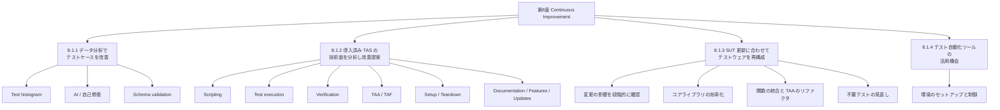

### 1.6 改善サイクルのイメージ

改善は一度きりではなく、**測る → 分析する → 直す → 確かめる**の繰り返しです。

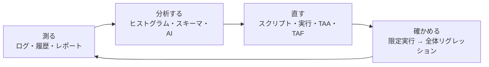

---

## 2. 8.1.1 データ収集と分析でテストケースを改善する（K3）

第6章で学んだ「ログやレポートの収集」を土台に、**そのデータを使ってテストケース自体を良くする**ための3つの切り口が示されています。

| 切り口 | 何をするか | 得られる効果 |
|---|---|---|
| Test histogram | テスト結果データの傾向を可視化 | 壊れやすいテストの特定・リファクタ対象の選定 |
| Artificial Intelligence | ロケータ変更の検知と自己修復など | メンテナンス工数の削減 |
| Schema validation | API・DB の構造をスキーマで一括検証 | テストコードの短縮と欠陥検出効率の向上 |

### 2.1 Test histogram（テストヒストグラム）

#### 2.1.1 何のためのものか

- CI/CD ツールやテストレポートツールは、テスト結果と付随データ（例外ログ、エラーメッセージ、スクリーンショットなど）を表示できます。
- それらを**ヒストグラム（度数分布）などの視覚レポートにする**と、テストケースごとのデータ傾向が一目で分かります。
- 目的は、**壊れやすい（fragile）テストケースを見つけ、追加の改善や実装の考え直しでリファクタする**ことです。

#### 2.1.2 具体例（イメージをつかむための例）

> 以下の数値は説明用の**架空データ**です。シラバスが指定した形式ではなく、考え方を示す例です。

直近 30 回の CI 実行で、テストケースごとの「失敗回数」を集計したとします。

| テストケース | 失敗回数（30 回中） | 主なエラーメッセージ | 判断 |
|---|---|---|---|
| TC-001 ログイン成功 | 0 | なし | 安定 |
| TC-014 カート追加 | 2 | 要素が見つからない | 経過観察 |
| TC-027 注文確定 | 11 | Timeout waiting for element | **fragile：待機方法を見直す** |
| TC-033 検索結果表示 | 9 | Stale element reference | **fragile：ロケータ／再取得を見直す** |

Mermaid でも簡易グラフにできます。

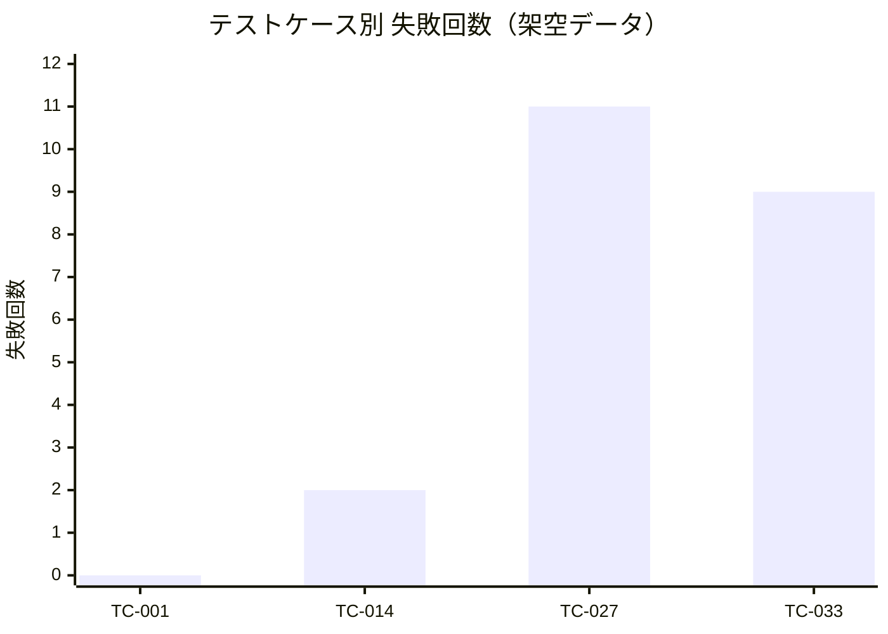

#### 2.1.3 分析の手順（ステップバイステップ）

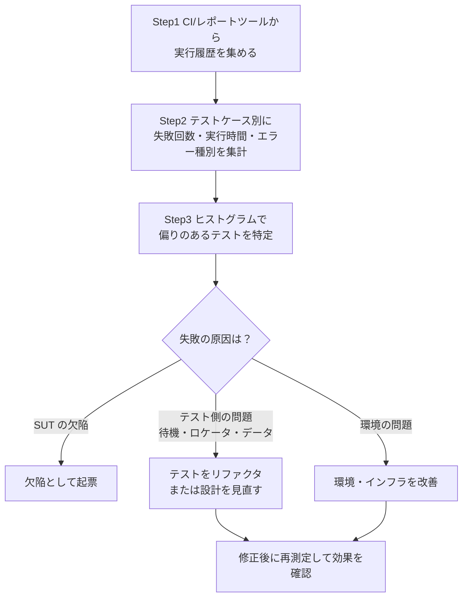

#### 2.1.4 ベストプラクティス

| # | ベストプラクティス | 理由 |
|---|---|---|
| 1 | 失敗の**回数だけでなく原因の種類**（例外・エラーメッセージ・スクリーンショット）も併せて見る | 同じ失敗回数でも原因が SUT かテストかで打ち手が変わる |
| 2 | 実行履歴を**継続的に蓄積**する | 傾向は 1 回の実行では見えない |
| 3 | fragile なテストは**通常の実行から切り離して**原因を調べる（第7章の再現性の考え方と一致） | 不安定なテストが全体の信頼性を下げるのを防ぐ |
| 4 | 直したら**同じ指標で再測定**する | 改善効果を客観的に示せる |

### 2.2 Artificial Intelligence（AI）の活用

#### 2.2.1 何ができるか

- UI テストでは、ロケータ値（要素を特定するための ID・XPath・CSS セレクタなど）も「データ」として扱えます。
- 最近のツールには、**ロケータが変わったことを検知し、機械学習や画像認識で新しいセレクタを特定して、自己修復（self-healing）アルゴリズムでテストケースを直す**ものがあります。
- 変更されたロケータは**テストレポートにも記録**され、その後のバージョン管理への反映やコードメンテナンスを速められます。

#### 2.2.2 自己修復の流れ

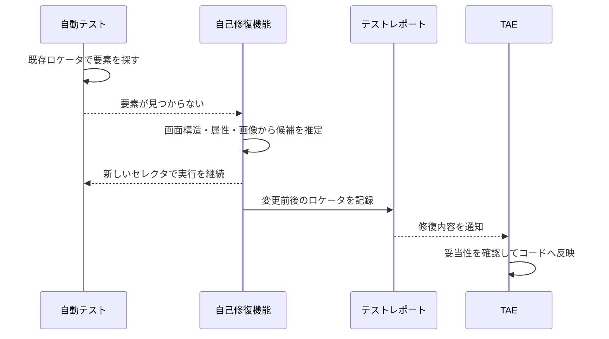

#### 2.2.3 ベストプラクティスと注意点

| 観点 | 推奨 | 補足 |
|---|---|---|
| 修復結果の扱い | **自動修復を鵜呑みにせず、レポートで確認して恒久的にコードへ反映する** | 修復内容はレポートに記録されるので、確認とバージョン管理の材料になる |
| 期待する効果 | 「壊れたロケータ探し」の時間を減らす | 設計の悪さ（例：不安定なロケータ設計）までは解決しない |
| 併用すべき設計 | Page Object Model などでロケータを 1 か所に集約 | 第3章の設計パターンと併用するとメンテナンスが楽になる |
| 失敗原因の切り分け | SUT の欠陥か TAS の欠陥かの判別支援にも使える | 第6章の AI/ML ログ分析と関連 |

### 2.3 Schema validation（スキーマ検証）

#### 2.3.1 何ができるか

- **API のデータ分析**（エンドポイントが返すプロパティなど）と **データベースの分析**（フィールドの許容データ型・値の範囲などの検証ルール）に使います。
- レスポンスが**実際のビジネス仕様に合っているか**を確認できます。
  - 必須要素が含まれているか
  - 各要素のオブジェクト型がスキーマ定義と一致するか
- スキーマが崩れたときは、**どの検証で失敗したか**が返るため、原因特定に役立ちます。

#### 2.3.2 シラバスの例をコードで理解する

シラバスの例：「API に必須のレスポンス要素が 6 つあり、すべて文字列であるべき」。
スキーマ検証ツールを使うと、**6 要素それぞれに型チェック・null チェックの assertion を書かなくてよい**ため、テストコードが短くなり、バックエンドサービスの欠陥検出効率も上がります。

**Before：個別の assertion を並べる場合**

```python
# 要素ごとに手書きで検証（増えるほど長く、抜け漏れも起きやすい）
body = response.json()
assert isinstance(body["id"], str) and body["id"] is not None
assert isinstance(body["name"], str) and body["name"] is not None
assert isinstance(body["email"], str) and body["email"] is not None
assert isinstance(body["status"], str) and body["status"] is not None
assert isinstance(body["role"], str) and body["role"] is not None
assert isinstance(body["createdAt"], str) and body["createdAt"] is not None
```

**After：スキーマ検証を使う場合（JSON Schema と Python の jsonschema の例）**

```python
from jsonschema import validate

user_schema = {
    "type": "object",
    "required": ["id", "name", "email", "status", "role", "createdAt"],
    "properties": {
        "id": {"type": "string"},
        "name": {"type": "string"},
        "email": {"type": "string"},
        "status": {"type": "string"},
        "role": {"type": "string"},
        "createdAt": {"type": "string"},
    },
}

validate(instance=response.json(), schema=user_schema)  # 違反があれば具体的な理由付きで例外
```

#### 2.3.3 使いどころの整理

| 対象 | 検証できること（例） |
|---|---|
| REST API のレスポンス | 必須プロパティの有無、型、null 不可 |
| データベース | フィールドの型、値の範囲、必須項目 |
| メッセージ／イベント | ペイロードの構造 |

#### 2.3.4 スキーマ検証と契約テスト（第5章）の違い

| 観点 | スキーマ検証 | 契約テスト（Contract testing） |
|---|---|---|
| 主な目的 | レスポンス／データが仕様の構造に合っているか | サービス同士が合意したやり取りを守っているか |
| 合意の有無 | 定義済みスキーマとの照合 | **提供側と利用側が許容される相互作用に合意**し、契約として保存して双方が検証 |
| 範囲 | データの形 | やり取りの内容全体（進化への対応も含む） |
| 関係 | 契約テストは**スキーマ検証を超えるもの**（第5章より） | |

#### 2.3.5 ベストプラクティス

| # | ベストプラクティス |
|---|---|
| 1 | スキーマは**手書きの assertion より先に検討**し、テストコードを短く保つ |
| 2 | スキーマ定義は**仕様書（API ドキュメント）と同期**させる（第5章：API ドキュメントはテスト自動化の基準） |
| 3 | 型・必須チェックはスキーマに任せ、**ビジネスルールの検証だけを個別 assertion にする** |
| 4 | スキーマ違反時のメッセージを**ログ・レポートに残す**（原因特定に直結する） |

---

## 3. 8.1.2 導入済み TAS の技術的側面を分析し改善を提案する（K4）

### 3.1 まず押さえる考え方

- 日々の**メンテナンス**（SUT の変更に TAS を追従させる作業）とは別に、TAS には**改善の余地**がたくさんあります。
- 改善の目的は、**効率（手作業の削減）、使いやすさ、機能追加、テスト支援の向上**など。
- **どの改善を行うかは、「プロジェクトにとって最も価値の高い機能は何か」で決めます。**

### 3.2 改善を検討する 9 つの領域

| # | 領域 | 一言でいうと |
|---|---|---|
| 1 | Scripting | スクリプト手法の見直しと実装の改善 |
| 2 | Test execution | 実行時間の短縮・並列化・スケジューリング |
| 3 | Verification | 検証（assertion）処理の標準化 |
| 4 | TAA | SUT のテスト容易性向上に合わせたアーキテクチャ変更 |
| 5 | TAF | コアライブラリのバージョンアップ管理 |
| 6 | Setup and teardown | 繰り返し処理の集約 |
| 7 | Documentation | 自動化コード・TAS 利用者向け・レポート／ログの文書 |
| 8 | TAS features | 使われる機能だけを追加 |
| 9 | TAF updates and upgrades | ツールの更新前にサンプルテストで確認 |

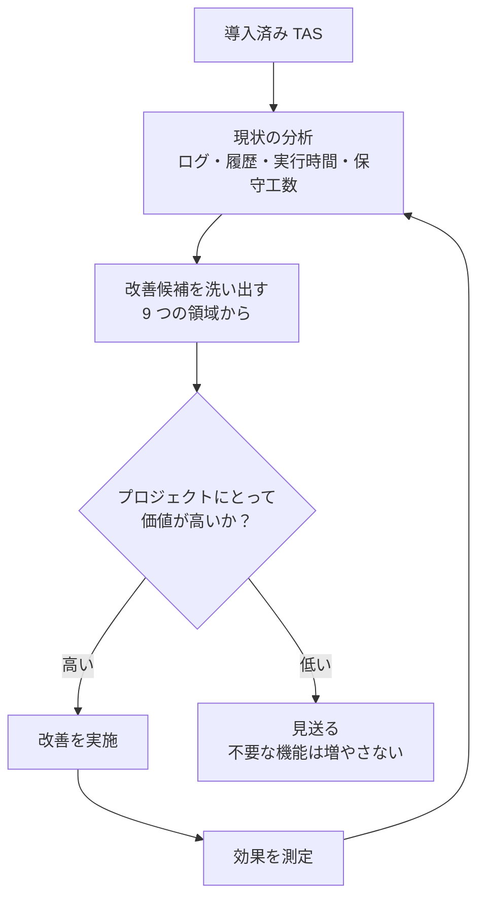

---

### 3.3 領域① Scripting（スクリプティング）

#### 3.3.1 スクリプト手法をアップグレードする

第3章で学んだ手法の進化の方向です。

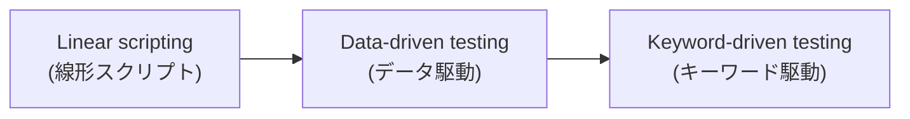

| 選択肢 | 内容 |
|---|---|
| 新規テストのみ新手法にする | 移行コストを抑えられる |
| 既存テストにも新手法を適用する（後付け） | 全部が難しければ、**保守工数が最も大きいテストだけ**でも対象にする |

#### 3.3.2 実装面の改善（3つの例）

**（1）テストスクリプト／ケース／ステップの重複を統合する**

- 似た操作の並びを何度も実装しない。
- 共通のステップを**関数化してライブラリに追加**し、複数のテストで再利用する。
- 同一ではなく「似ている」場合は**パラメータ化**する（キーワード駆動テストでよく使う考え方）。

| Before | After |
|---|---|
| ログイン手順を 30 本のテストに個別コピー | `login(user, password)` を 1 か所に定義し、30 本から呼ぶ |
| 「一般ユーザー用」「管理者用」で別関数 | `login(user, password)` に引数でユーザー種別を渡す |

**（2）失敗からの復旧手順（failure recovery）を用意する**

- スイート実行中に失敗しても、**TAS が復旧して次のテストを続けられる**ようにする。
- SUT 側の失敗では、可能かつ現実的なら**SUT の復旧操作（例：再起動）**を TAS が行う。

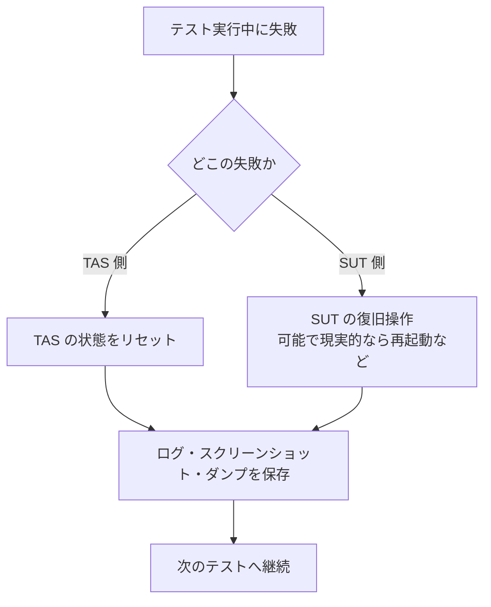

**（3）待機方式（wait mechanism）を見直す**

3つの方式を比較します。**試験頻出**です。

| 方式 | 内容 | 長所 | 短所・注意 |
|---|---|---|---|
| ① 固定待機（hard coded wait） | 決まったミリ秒だけ待つ | 実装が簡単 | ソフトウェアの応答時間は予測しにくく、**自動化の欠陥の原因になりやすい** |
| ② ポーリングによる動的待機 | 状態変化や動作の完了を繰り返し確認する | 必要な時間だけ待つので**時間の無駄がない**。想定より遅くても条件成立まで待てる | **タイムアウト必須**（欠陥があると永遠に待つため） |
| ③ イベント購読 | SUT のイベント機構を購読する | ①②より**信頼性が高い** | スクリプト言語がイベント購読に対応し、SUT がイベントを提供する必要あり。**タイムアウト必須** |

コード例（Selenium の明示的待機。ポーリングの考え方）

```python
from selenium.webdriver.support.ui import WebDriverWait
from selenium.webdriver.support import expected_conditions as EC
from selenium.webdriver.common.by import By

# ダメな例：固定待機
# time.sleep(5)

# 良い例：条件が成立するまで待つ（最大 10 秒＝タイムアウト付き）
button = WebDriverWait(driver, timeout=10).until(
    EC.element_to_be_clickable((By.ID, "submit"))
)
button.click()
```

> **覚え方**：信頼性は「固定待機 < ポーリング < イベント購読」。ただし②③は**必ずタイムアウトを付ける**。

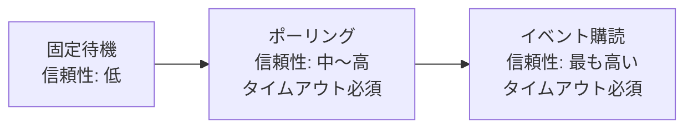

---

### 3.4 領域② Test execution（テスト実行）

#### 3.4.1 課題：リグレッションが時間内に終わらない

| 対策 | 内容 | 制約・注意 |
|---|---|---|
| 複数環境で並行実行 | 別々のテスト環境で同時にテストする | 可能な場合のみ |
| スイートの分割 | 一定時間内（例：一晩）に収まるよう複数部分に分割 | 高価なシステムを使い、単一ターゲットでしか実行できない場合に有効 |
| 重複の排除 | 自動化カバレッジを分析して重複を見つけ、除く | **実行時間の短縮**とさらなる効率化につながる |
| CI/CD でバッチジョブを並列実行 | 実行時間を最適化 | 良い実践として示されている |
| パイプラインのスケジュール実行 | 例：毎朝決まった時刻に実行 | 手作業とやり取りを減らし、開発を速める |

#### 3.4.2 GitHub Actions での実装例（考え方の理解用）

```yaml
name: regression
on:
  schedule:
    - cron: "0 17 * * *"   # 毎日定時に実行（UTC 基準）
  workflow_dispatch:        # 手動実行も可能

jobs:
  test:
    runs-on: ubuntu-latest
    strategy:
      matrix:
        suite: [smoke, api, ui-part1, ui-part2]   # スイートを分割して並列実行
    steps:
      - uses: actions/checkout@v4
      - run: ./run-tests.sh ${{ matrix.suite }}
```

#### 3.4.3 ベストプラクティス

| # | ベストプラクティス |
|---|---|
| 1 | まず**重複の排除**から着手する（並列化の前に総量を減らす） |
| 2 | 分割後も**各部分の実行時間を計測**して偏りを直す |
| 3 | 並列化するテストは**相互に独立**させる（共有データに依存しない） |
| 4 | 朝に結果が見えるよう**夜間実行**にする（第5章の nightly regression と連動） |

---

### 3.5 領域③ Verification（検証）

- **新しい検証関数を作る前に、全テストで使う標準の検証方法のセットを採用する。**
- これにより、複数テストで**検証処理の再実装を避けられる**。
- 検証方法が「同一ではないが似ている」場合は、**パラメータ化**で1つの関数を複数種類のオブジェクトに使えるようにする。

| Before | After |
|---|---|
| テストごとに独自の「表示確認」処理 | 標準の `verify_visible(element)` を全テストで共通利用 |
| 入力欄用・ドロップダウン用・ボタン用で別々の検証関数 | 対象タイプを引数にした共通検証関数 |

---

### 3.6 領域④ TAA（テスト自動化アーキテクチャ）

#### 3.6.1 内容

- **SUT のテスト容易性（testability）を高める**ために、SUT のアーキテクチャと TAS の TAA の両方を変える場合がある。
- 大きな改善につながるが、**SUT／TAS への大きな変更と投資が必要**になりうる。
- 例：SUT がテスト用の API を提供するように変わるなら、**TAS もそれに合わせてリファクタリング**する。

#### 3.6.2 重要ポイント

> **後から追加すると高くつく。** テスト容易性の機能は、テスト自動化の開始時点、および SUT の SDLC の**早い段階**から考えるのがはるかに良い。

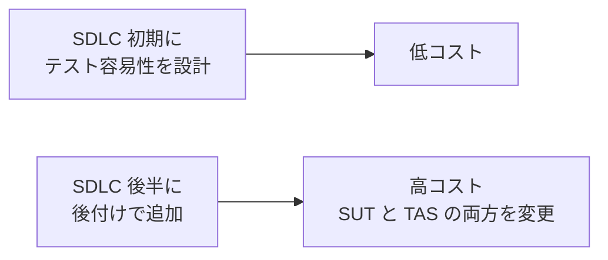

関連：第2章の「観測可能性（Observability）」「制御可能性（Controllability）」「アーキテクチャの透明性」。

---

### 3.7 領域⑤ TAF（コアライブラリのバージョンアップ）

第3章のレイヤー構成（テストスクリプト層 / ビジネスロジック層 / コアライブラリ層）が前提です。

#### 3.7.1 課題

コアライブラリに**メジャーアップデート**が出ても、最新版をすぐに TAF の依存関係に指定すると、**多くのチームのテストが壊れる**おそれがあります。

#### 3.7.2 推奨する進め方

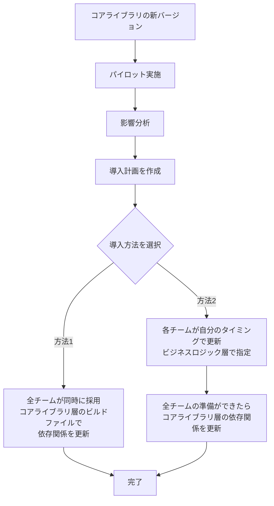

| 方法 | 内容 | 向いている状況 |
|---|---|---|
| 同時採用 | コアライブラリ層のビルドファイルの依存関係を更新し、全チームが同時に新版へ | チーム間の足並みを揃えやすいとき |
| 個別採用 | 各チームがビジネスロジック層で更新時期を決める | チームごとに事情が違うとき。最終的に全チーム準備完了後、コアライブラリ層を更新 |

---

### 3.8 領域⑥ Setup and teardown（セットアップとティアダウン）

- **各テストスクリプトやテストスイートの前後で繰り返される操作・設定は、setup／teardown メソッドに移す。**
- 変更があっても**1 か所の修正で済む**ため、保守工数が減る。
- 例：UI テストの前提条件・後始末に**Web サービス呼び出し**を使う（ユーザー登録、ユーザー削除、プロフィール設定など）。

**pytest のフィクスチャの例**

```python
import pytest

@pytest.fixture
def registered_user(api_client):
    # setup：UI を操作せず API でユーザーを作成（速く安定する）
    user = api_client.post("/users", json={"name": "tester"}).json()
    yield user
    # teardown：テスト後に API で後始末
    api_client.delete(f"/users/{user['id']}")

def test_login_ui(browser, registered_user):
    browser.login(registered_user["name"])
    assert browser.is_logged_in()
```

| ベストプラクティス | 理由 |
|---|---|
| 前提条件は **API で作る**（可能な場合） | UI 操作より速く、UI 変更の影響も受けにくい |
| teardown は**テストが失敗しても必ず実行**される仕組みにする | データが残ると次のテストに影響する |
| setup／teardown の処理は **1 か所に集約** | 変更箇所を最小にできる |

---

### 3.9 領域⑦ Documentation（ドキュメント）

対象は次のすべてです。

| 種類 | 内容の例 |
|---|---|
| 自動化コードの文書 | コードが何をするか、どう使うか |
| TAS の利用者向け文書 | TAS を使う人のためのガイド |
| テストレポート・テストログ | TAS が出力するもの |

> 改善の観点：文書が古くなっていないか、新メンバーが読んで使い始められるか、レポート・ログが分析に十分な情報を含んでいるか。

---

### 3.10 領域⑧ TAS features（TAS の機能）

- 追加候補：**詳細なテストレポート、テストログ、他システムとの連携**など。
- **使われる機能だけを追加する。**
- 使われない機能を増やすと、**複雑さが増し、信頼性と保守性が下がる**。

| 追加してよい機能 | 追加を控えるべき機能 |
|---|---|
| 利用者・ステークホルダーが実際に使う | 「あったら便利かも」という想定だけ |
| 課題（例：原因調査に時間がかかる）を解決する | 誰も使わないダッシュボード |

---

### 3.11 領域⑨ TAF updates and upgrades（TAF の更新・アップグレード）

- 新バージョンで**新機能が使える**、または**不具合が修正される**利点がある。
- **リスク**：既存ツールのアップグレードや新ツールの導入が、既存テストに**悪影響**を与える可能性がある。
- 対策：**本番展開の前に、最新版ツールでサンプルテストを実行する。**
- サンプルテストは、次を**代表するもの**にする。

| サンプルテストが代表すべき対象 |
|---|
| 異なる SUT |
| 異なるテストタイプ |
| （適切なら）異なるテスト環境 |

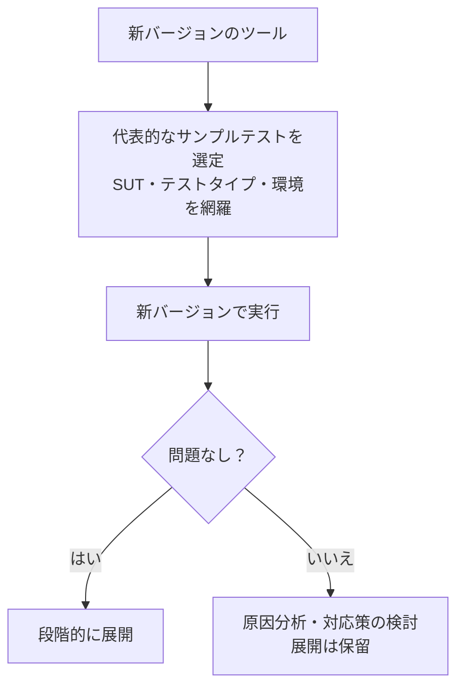

---

## 4. 8.1.3 SUT の更新に合わせてテストウェアを再構成する（K3）

### 4.1 前提

- SUT が変更されると、**TAF とコンポーネントライブラリを含む TAS の更新が必要**になる。
- **どんなに些細な変更でも**、TAS の信頼性・性能に**広範囲の悪影響**を及ぼす可能性がある。

### 4.2 進め方（テスト環境コンポーネントの変更への対応）

| ステップ | 内容 |
|---|---|
| 1 | どの変更・改善が必要かを評価（テストウェア／カスタム関数ライブラリ／OS のどれに影響するか） |
| 2 | **段階的に**変更する（**MVP の考え方**で、まず限定したテストスクリプトで影響を測る） |
| 3 | 副作用がないと確認できたら、**変更を全面適用**する |
| 4 | **完全なリグレッション実行**で最終確認する |
| 5 | 失敗が出たら、レポート・ログ・テストデータ分析で**根本原因**を特定し、改善作業が原因でないか確かめる |

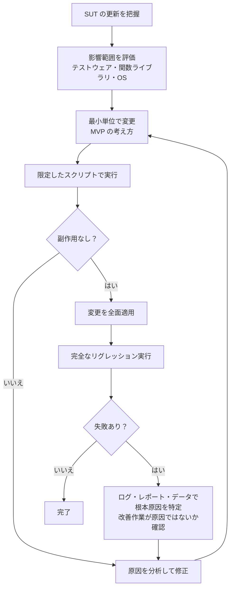

### 4.3 具体的な再構成項目

#### ① コア TAS 関数ライブラリの効率と効果を高める

- TAS が成熟すると、**作業をより効率的に行う新しい方法**が見つかる。
- 例：関数内のコード最適化、より新しい OS ライブラリの利用。
- こうした新技術は、**現行プロジェクトと今後のプロジェクトが使うコア関数ライブラリに取り込む**。

#### ② 同じコントロール種別に作用する複数関数を統合する

自動テストの大部分は、GUI コントロールの状態確認（表示／非表示、有効／無効、サイズ、データなど）です。

| 状況 | 改善 |
|---|---|
| ドロップダウン専用など、専門化した関数が多数ある | 関数を**引数で指定して汎用的に扱える少数の関数**に統合する |
| 結果 | 同じ結果を得ながら**メンテナンスを最小化** |

```python
# Before：種類ごとに別関数
def select_dropdown(el, value): ...
def type_into_field(el, value): ...
def read_field(el): ...

# After：操作を引数にした共通関数（考え方の例）
def act_on_control(el, action, value=None):
    if action == "select": ...
    elif action == "type": ...
    elif action == "read": ...
```

#### ③ SUT の変更に対応して TAA をリファクタリングする

- SUT が進化・成熟するにつれ、**土台となる TAA も進化させる**。
- 機能拡張は**「継ぎ足し（bolt-on）」で実装しない**。TAA で**分析し、変更する**。
- これにより、新しい SUT 機能に必要な新しいテストスクリプトを、**互換性のあるコンポーネントで受け止められる**。

| 継ぎ足し（避ける） | TAA の見直し（推奨） |
|---|---|
| 目先の機能だけ追加する | 分析し、アーキテクチャの中に位置づける |
| 将来のテスト追加時に再び継ぎ足しが必要 | 新しいテストを受け入れる土台がすでにある |

#### ④ 命名規則と標準化

- 変更時に新しい自動化コード・関数ライブラリの**命名規則を、既存の標準（4.3.1 節）と一貫**させる。
- 例：`loginButton`、`resetPasswordButton` のように対象が分かる名前（第4章）。

#### ⑤ 既存テストスクリプトの見直し・廃止の評価

| 状況 | 対応 |
|---|---|
| 複雑で実行に時間がかかるテスト | **より小さなテストに分解**するほうが有効で効率的な場合がある |
| ほとんど、あるいはまったく実行されないテスト | **廃止の対象**にして TAS の複雑さを減らし、保守すべき対象を明確にする |

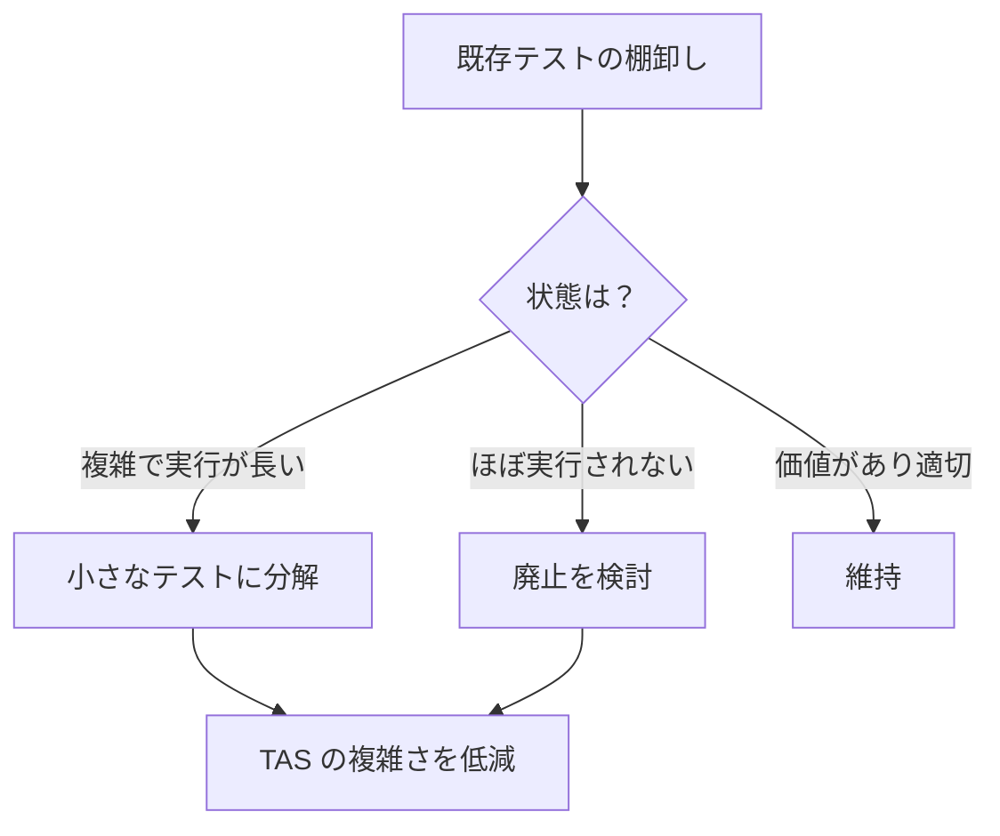

---

## 5. 8.1.4 テスト自動化ツールの活用機会（K2）

### 5.1 考え方

テスト自動化ツールは「テストそのものの実行」以外の、**テスト関連の付随活動**も助けられます。

### 5.2 環境のセットアップと制御（Environment setup and control）

シラバスに記載されている内容は次のとおりです。

| 観点 | 内容 |
|---|---|
| テストデータの作成 | テストデータを作るスクリプトを、**setup メソッドに組み込み**、新しいテスト環境に多様なテストデータを作成できる |
| 複数プロフィールのユーザー作成 | 異なるデータ入力に基づく複数プロフィールのユーザーが必要なとき、**Web サービスのエンドポイントを呼び出してユーザーを登録する自動テストスクリプト**を使える |
| インフラのセットアップ制御 | テストスクリプトで**テストインフラのセットアップを制御**し、**後片付け（クリーンアップ）にも利用**できる |

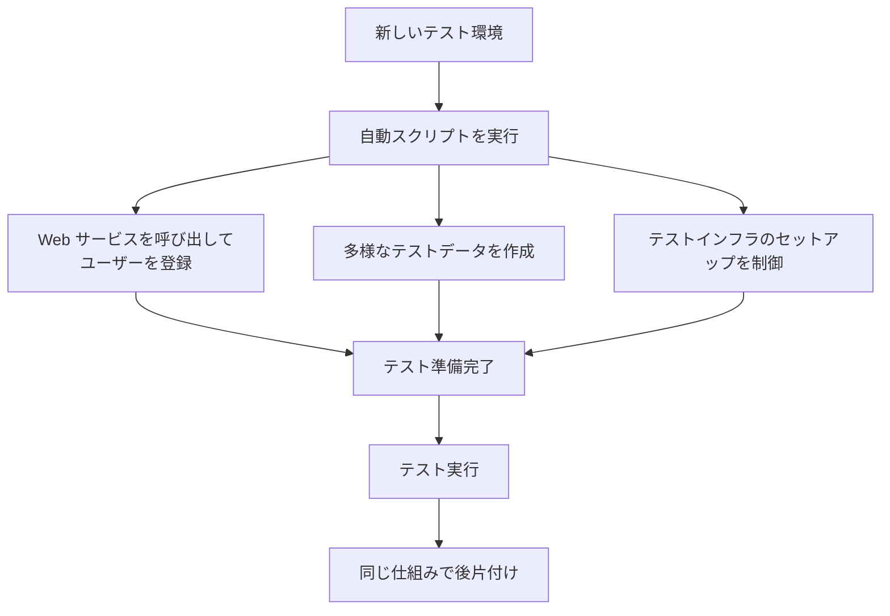

### 5.3 ベストプラクティス

| # | ベストプラクティス | 理由 |
|---|---|---|
| 1 | 環境準備は**手作業ではなくスクリプト化**する | 再現性が上がり、準備時間が減る |
| 2 | **準備と後片付けをセットで**自動化する | 前回のデータが次回に影響するのを防ぐ |
| 3 | 環境準備のスクリプトも**バージョン管理**する | 第5章のテストウェアの構成管理の考え方と同じ |
| 4 | 接続や権限は事前にチェックする | 第7章：TAS 導入後の前提条件確認の考え方と一致 |

> 補足：8.1.4 の原文は「テスト以外の非特定なテスト活動」として複数の例を挙げていますが、本ガイド作成時に原文の取得がこの項の途中で切れたため、上記は**原文で確認できた範囲**に限っています。最終確認は公式シラバス PDF の 52〜53 ページで行ってください（詳細は[注記](#10-本ガイドに関する注記)）。

---

## 6. 試験対策：ひっかけポイントと確認問題

### 6.1 ひっかけポイント表

| # | 論点 | 正しい理解 | ありがちな誤解 |
|---|---|---|---|
| 1 | test histogram の目的 | **fragile なテストを特定**しリファクタする | 実行時間の短縮だけが目的 |
| 2 | 自己修復 | 変更ロケータは**レポートに記録**され、後続のバージョン管理・保守を速める | 人の確認が一切不要になる |
| 3 | schema validation | 個別 assertion を書かずに**型・必須要素をまとめて検証**できる | ビジネスロジックまですべて検証できる |
| 4 | 待機方式の信頼性 | 固定待機 < ポーリング < **イベント購読** | ポーリングが最も信頼できる |
| 5 | タイムアウト | ポーリングと**イベント購読の両方**で必要 | ポーリングだけで必要 |
| 6 | 固定待機 | 応答時間が予測できず**自動化の欠陥の原因**になりやすい | 最も確実な方法 |
| 7 | TAA の変更 | 後から加えると**高コスト**。早期から検討すべき | 後半に対応すればよい |
| 8 | コアライブラリの更新 | まず**パイロットと影響分析**、その後に導入計画 | 最新版を即時に依存関係へ反映する |
| 9 | TAS 機能の追加 | **使われる機能だけ**追加する | 多いほど良い |
| 10 | ツールのアップグレード | **代表的なサンプルテスト**で事前確認 | 全テストを一度に本番で試す |
| 11 | SUT 変更への対応 | **段階的（MVP）**に変更し、最後に**完全リグレッション** | 最初から全面適用する |
| 12 | 機能の実装 | **継ぎ足し（bolt-on）ではなく TAA を分析・変更**して実装 | 目先の機能を継ぎ足す |
| 13 | 実行されないテスト | **廃止を検討**して TAS を簡素化 | すべて保持する |
| 14 | 複雑で長いテスト | **小さなテストに分解**する場合がある | 1 本のまま維持する |

### 6.2 確認問題（自己チェック）

**Q1.** API のレスポンスに 6 つの必須文字列要素があります。個別の assertion を 6 本書く代わりに、テストコードを短くしつつ型と必須要素を確認できる方法は？

<details>
<summary>答えを見る</summary>

**Schema validation（スキーマ検証）**。スキーマ違反時は実際の検証結果が返るため、原因特定にも役立つ。

</details>

**Q2.** 「固定待機」「ポーリング」「イベント購読」のうち、最も信頼性が高いのはどれ？ その条件は？

<details>
<summary>答えを見る</summary>

**イベント購読**。ただし、テストスクリプト言語がイベント購読に対応し、SUT がイベントを TAS に提供する必要がある。**タイムアウト機構も必要**。

</details>

**Q3.** コアライブラリのメジャーアップデートが出ました。どう進めるのが適切？

<details>
<summary>答えを見る</summary>

まず**パイロットと影響分析**を行い、**導入計画**を作る。全チーム同時採用（コアライブラリ層のビルドファイルで依存関係を更新）か、各チームが個別に更新（ビジネスロジック層）し、最終的に全チームの準備が整ってからコアライブラリ層を更新する。

</details>

**Q4.** SUT が更新されました。テストウェアの変更を安全に進める最終確認の手段は？

<details>
<summary>答えを見る</summary>

まず限定したテストスクリプトで副作用がないことを確認して変更を全面適用し、最後に**完全なリグレッション実行**で確認する。失敗が出たら、その原因が改善作業によるものでないかをログ・レポート・データ分析で確認する。

</details>

**Q5.** 「テストにあったら便利そう」という理由で、誰も使わないレポート機能を TAS に追加する提案がありました。適切な判断は？

<details>
<summary>答えを見る</summary>

**追加しない**。使われない機能は複雑さを増し、信頼性と保守性を下げる。使われる機能だけを追加する。

</details>

**Q6.** 何か月も実行されていない複雑なテストスクリプトがあります。どう対処する？

<details>
<summary>答えを見る</summary>

**廃止の対象として評価**する。TAS の複雑さを減らし、何を保守すべきかが明確になる。複雑で長いだけのテストなら、小さなテストへの分解も検討する。

</details>

---

## 7. ベストプラクティス総まとめ

### 7.1 項目別

| 領域 | ベストプラクティス |
|---|---|
| データ分析 | 履歴を蓄積し、ヒストグラムで fragile なテストを見つけ、改善後に再測定する |
| AI・自己修復 | 修復結果はレポートで確認し、恒久的にコードへ反映する |
| スキーマ検証 | 型・必須チェックはスキーマに任せ、ビジネスルールだけ個別に検証する |
| スクリプト | 重複はライブラリ関数化し、似た処理はパラメータ化する |
| 失敗復旧 | 失敗後も次のテストへ継続できる復旧手順を TAS と SUT の両方に用意する |
| 待機 | 固定待機を避け、ポーリングまたはイベント購読に。必ずタイムアウトを付ける |
| 実行 | 重複排除 → 並列化・分割 → スケジュール実行の順に検討する |
| 検証 | 全テスト共通の標準検証メソッドを用意し、似た検証はパラメータ化する |
| TAA | テスト容易性は SDLC の早期に設計し、後付けを避ける |
| TAF | コアライブラリ更新は、パイロット → 影響分析 → 導入計画 |
| setup/teardown | 繰り返し処理を集約し、前提条件には API を活用する |
| ドキュメント | 自動化コード・TAS 利用者向け・レポート／ログを最新に保つ |
| TAS 機能 | 使われる機能だけ追加する |
| ツール更新 | 代表的なサンプルテストで事前に確認してから展開する |
| SUT 更新対応 | 段階的に変更 → 副作用確認 → 全面適用 → 完全リグレッション |
| 関数統合 | 同じコントロール種別に作用する関数は少数に統合する |
| 拡張 | 継ぎ足しでなく、TAA を分析して変更する |
| 命名 | 既存の命名規則・標準に合わせる |
| テスト棚卸し | 長大なテストは分解、実行されないテストは廃止を検討する |
| 環境準備 | スクリプト化し、準備と後片付けをセットにする |

### 7.2 改善提案を書くときの型（K4 対策）

K4 問題では「状況の分析 → 原因の特定 → 推奨」の流れで考えると整理しやすくなります。

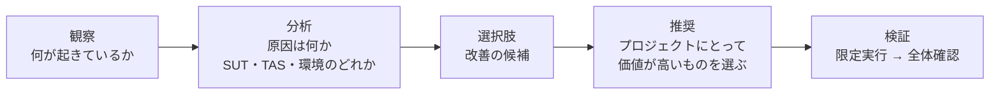

| 観察された状況 | 分析 | 推奨される改善 |
|---|---|---|
| 特定のテストだけ Timeout で頻繁に失敗 | 固定待機が原因の可能性 | ポーリングまたはイベント購読に変更（タイムアウト付き） |
| 同じログイン手順が数十本に重複 | 保守性の問題 | ライブラリ関数化・パラメータ化 |
| 夜間に終わらないリグレッション | 実行時間の問題 | 重複排除、並列実行、スイート分割 |
| コアライブラリ更新で他チームのテストが壊れた | 導入手順の問題 | パイロット、影響分析、導入計画 |
| UI 変更のたびにロケータ修正 | ロケータ管理の問題 | 自己修復ツールの活用に加え、ロケータの集約 |
| API のレスポンス検証コードが長大 | assertion の冗長さ | スキーマ検証の導入 |

---

## 8. 用語集

| 用語 | 意味 |
|---|---|
| test histogram | テストデータの傾向を示す視覚レポート。fragile なテストの特定に使う |
| schema validation | データ構造の定義（スキーマ）に基づき、型・必須要素などを検証すること |
| fragile test | 壊れやすい（不安定な）テスト |
| self-healing | ロケータ変更などを検知し、テストを自動で修復する仕組み |
| wait mechanism | 待機方式（固定待機・ポーリング・イベント購読） |
| polling | 条件が成立したかを繰り返し確認する方式 |
| timeout | 待機の上限時間。無限待機を防ぐ |
| failure recovery | 失敗後に TAS／SUT を復旧し、テストを継続する仕組み |
| setup / teardown | テストの前提条件を整える処理 / 後始末をする処理 |
| bolt-on | 既存の設計を見直さず継ぎ足して機能を追加すること（避けるべき） |
| MVP mindset | 最小限の変更から始めて影響を測る考え方 |
| TAA | テスト自動化アーキテクチャ |
| TAF | テスト自動化フレームワーク |
| TAS | テスト自動化ソリューション |
| core libraries | SUT に依存しない共通ライブラリの層（第3章） |
| business logic layer | SUT 依存のライブラリを置く層（第3章） |

---

## 9. 出典（ソース）URL

### 9.1 一次情報（本ガイドの根拠）

| # | 出典 | URL | 根拠にした箇所 |
|---|---|---|---|
| 1 | ISTQB CTAL-TAE v2.0 認定ページ | https://istqb.org/certifications/certified-tester-advanced-level-test-automation-engineering-ctal-tae-v2-0/ | 試験の位置づけ・公式資料の入口 |
| 2 | ISTQB CTAL-TAE Syllabus v2.0（PDF） | https://istqb.org/wp-content/uploads/2024/11/ISTQB_CTAL-TAE_Syllabus_v2.0.pdf | 第8章 8.1.1〜8.1.4（47〜53 ページ）。第3・4・5・6・7章の関連記述 |

### 9.2 補足資料（コード例・実装の理解用）

| # | テーマ | URL |
|---|---|---|
| 3 | 待機（Selenium） | https://www.selenium.dev/documentation/webdriver/waits/ |
| 4 | 自動待機（Playwright） | https://playwright.dev/docs/actionability |
| 5 | JSON Schema | https://json-schema.org/ |
| 6 | 契約テスト（Pact） | https://docs.pact.io/ |
| 7 | フィクスチャ（pytest） | https://docs.pytest.org/en/stable/how-to/fixtures.html |
| 8 | 不安定なテスト（Martin Fowler） | https://martinfowler.com/articles/nonDeterminism.html |
| 9 | Page Object（Martin Fowler） | https://martinfowler.com/bliki/PageObject.html |
| 10 | GitHub Actions のマトリクス戦略 | https://docs.github.com/en/actions/using-jobs/using-a-matrix-for-your-jobs |
| 11 | GitHub Actions のスケジュール実行 | https://docs.github.com/en/actions/writing-workflows/choosing-when-your-workflow-runs/events-that-trigger-workflows#schedule |
| 12 | セマンティックバージョニング | https://semver.org/ |

> 補足資料（#3〜#12）は、シラバスの内容を実装レベルで理解するための一般的な技術資料です。**試験範囲の根拠は #2 のシラバス**です（シラバスの引用元として挙げられた標準・書籍は試験範囲外で、シラバスに要約された内容のみが対象）。

---

## 10. 本ガイドに関する注記

1. **シラバス原文の取得範囲**：本ガイド作成時、公式 PDF の本文取得が 8.1.4「Summarize Opportunities for Use of Test Automation Tools」の冒頭（Environment setup and control の途中）で切れました。そのため 8.1.1〜8.1.3 は原文全体を確認して記述していますが、**8.1.4 は原文で確認できた範囲のみ**を記載しています。52〜53 ページの残りの項目は、公式 PDF で必ずご確認ください。
2. **例・数値・コードについて**：ヒストグラムの数値、Python／YAML のコード、Before／After の対比は、理解を助けるために本ガイドが作成した**説明用の例**です。シラバスの記載ではありません。
3. **試験範囲**：ISTQB の規定により、シラバス内で参照されている標準・書籍の内容は、シラバスに要約されている範囲を除いて試験範囲外です。
4. **最新情報**：シラバスや試験構成は改訂される可能性があります。受験前に必ず [ISTQB 公式ページ](https://istqb.org/certifications/certified-tester-advanced-level-test-automation-engineering-ctal-tae-v2-0/) で最新情報を確認してください。
