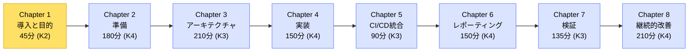
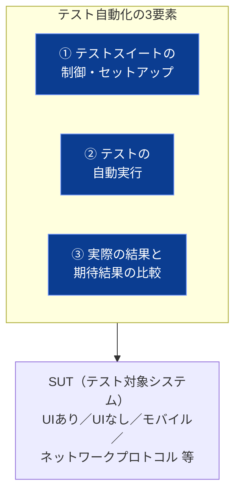
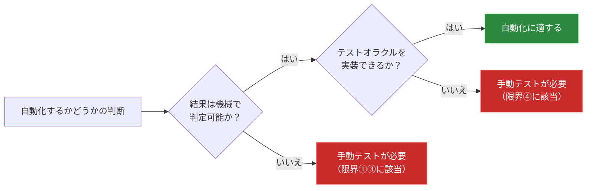
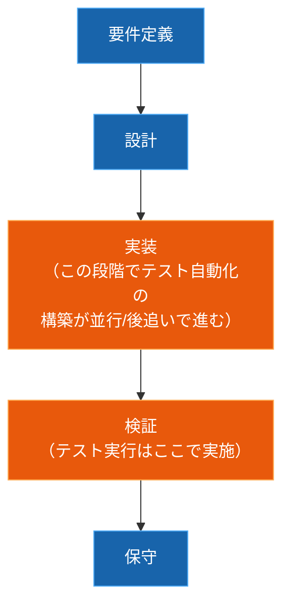
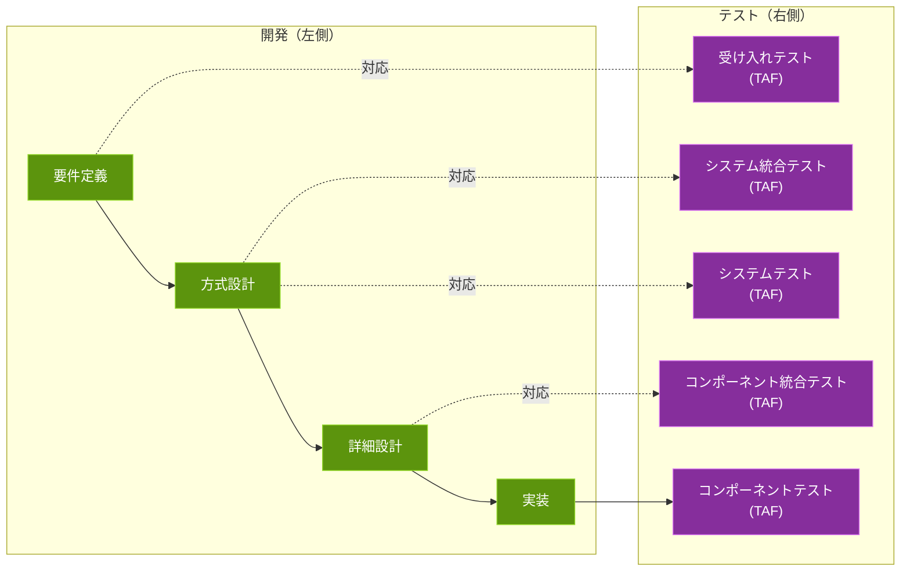
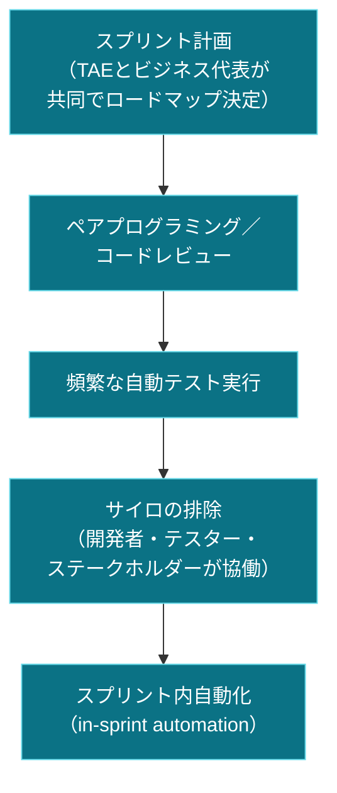
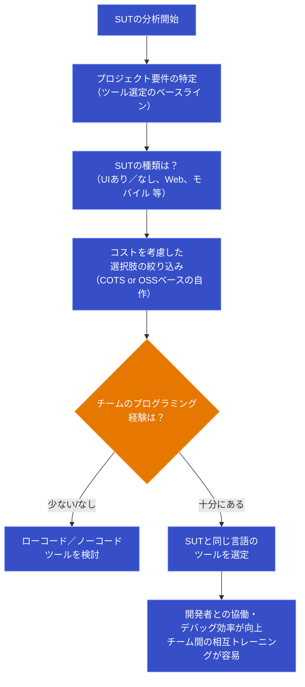

# CTAL-TAE v2.0 Chapter 1「Introduction and Objectives for Test Automation」初学者向け解説ガイド

> 対象試験：ISTQB® Certified Tester Advanced Level Test Automation Engineering (CTAL-TAE) v2.0
> 対象章：Chapter 1 - Introduction and Objectives for Test Automation（試験時間配分：45分、認知レベル K2）
> 本ガイドの目的：初学者が Chapter 1 の出題範囲を体系的に理解し、実務で使えるベストプラクティスまで押さえられるようにすること

---

## 目次

1. [Chapter 1 の位置づけと全体像](#1-chapter-1-の位置づけと全体像)
2. [キーワードと学習目標（Learning Objectives）](#2-キーワードと学習目標learning-objectives)
3. [1.1 テスト自動化の目的（Purpose of Test Automation）](#3-11-テスト自動化の目的purpose-of-test-automation)
4. [1.2 ソフトウェア開発ライフサイクルにおけるテスト自動化](#4-12-ソフトウェア開発ライフサイクルにおけるテスト自動化)
5. [章末チェックリストと試験対策のポイント](#5-章末チェックリストと試験対策のポイント)
6. [参考文献・出典](#6-参考文献出典)

---

## 1. Chapter 1 の位置づけと全体像

CTAL-TAE v2.0 シラバスは全8章構成で、認定トレーニングコースには最低21時間の講習時間が求められています。Chapter 1 はその導入部にあたり、**「なぜテスト自動化を行うのか」「テスト自動化はソフトウェア開発ライフサイクル（SDLC）の中でどう位置づけられるのか」**という、以降の章（アーキテクチャ設計、実装、CI/CD統合、レポーティング、検証、継続的改善）を学ぶための土台を作る章です。

Chapter 1 は認知レベルが **K2（理解する）** のみで構成されており、Chapter 2 以降の K3（適用する）・K4（分析する）に比べると出題形式は「概念の説明」「該当するものを選ぶ」が中心になります。ただし、シラバスの Introduction（0章）と Appendix を除く全章が試験範囲となるため、Chapter 1 の内容も油断せず押さえる必要があります。

> **試験の前提条件**：CTAL-TAE 試験を受験するには、ISTQB® Foundation Level 認定を先に取得している必要があります。また、ソフトウェアテストまたは開発の実務経験（目安6か月程度）があることが推奨されています。

---

## 2. キーワードと学習目標（Learning Objectives）

### 2.1 キーワード

シラバスの見出し直下に記載されているキーワードは、学習目標に明示されていなくても暗記が必須とされています。

| キーワード（英語） | 日本語訳 | 本ガイドでの主な解説箇所 |
|---|---|---|
| system under test (SUT) | テスト対象システム | 1.1、1.2.2 |
| test automation | テスト自動化 | 1.1 全体 |
| test automation engineer (TAE) | テスト自動化エンジニア | 1.1、1.2.2 |

### 2.2 学習目標（Learning Objectives）一覧

| 番号 | 学習目標 | 認知レベル |
|---|---|---|
| TAE-1.1.1 | テスト自動化のメリット・デメリットを説明できる | K2 |
| TAE-1.2.1 | 異なるソフトウェア開発ライフサイクルモデルにおいて、テスト自動化がどのように適用されるかを説明できる | K2 |
| TAE-1.2.2 | 与えられたテスト対象システム（SUT）に適したテスト自動化ツールを選定できる | K2 |

> **ベストプラクティス（学習の進め方）**
> - K2レベルの章は「暗記」ではなく「なぜそうなるのか」を人に説明できるレベルまで理解することが得点につながります。
> - 学習目標の動詞（Explain／Select）に着目し、「Explain」は説明・比較問題、「Select」はシナリオ問題（SUTの特徴が示され最適な選択肢を選ぶ）として出題されやすい点を意識しましょう。

---

## 3. 1.1 テスト自動化の目的（Purpose of Test Automation）

### 3.1 テスト自動化とは何か

シラバスでは、テスト自動化（自動テスト実行とテストレポーティングを含む）を、以下のいずれか、または複数の活動と定義しています。

- 専用のソフトウェアツールを使ってテストスイートの制御・セットアップを行うこと
- テストを自動的な方法で実行すること
- 実際の結果（actual results）と期待される結果（expected results）を比較すること

テスト自動化はテスト対象システム（SUT: System Under Test）と相互作用する重要な機能・能力を提供します。対象範囲も幅広く、UIのあるSUT、UIのないSUT、モバイルアプリケーション、ネットワークプロトコル・接続など、多様なソフトウェアをカバーできます。

### 3.2 テスト自動化のメリット（Advantages）

| # | メリット | 解説 |
|---|---|---|
| 1 | ビルドあたりの実行テスト数増加 | 手動テストより多くのテストを1ビルドで実行できる |
| 2 | 手動では不可能なテストの実現 | リアルタイム応答、リモートテスト、並行（並列）テストなど |
| 3 | より複雑なテストの実行 | 手動より複雑な条件・シナリオを扱える |
| 4 | 実行速度の向上 | 手動テストより高速に実行できる |
| 5 | ヒューマンエラーの低減 | 人為的ミスの影響を受けにくい |
| 6 | テストリソースの効率的活用 | 人的リソースをより効果的・効率的に使える |
| 7 | 迅速なフィードバック | SUTの品質について早期にフィードバックが得られる |
| 8 | システム信頼性の向上支援 | 可用性・回復性（availability, recoverability）などの向上に貢献 |
| 9 | テスト実行の一貫性向上 | テストサイクルをまたいで一貫した実行結果が得られる |

### 3.3 テスト自動化のデメリット（Disadvantages）

| # | デメリット | 解説 |
|---|---|---|
| 1 | 追加コストの発生 | TAE（テスト自動化エンジニア）の採用、新規ハードウェア購入、トレーニング費用など |
| 2 | 初期投資の必要性 | テスト自動化ソリューション構築のための初期投資が必要 |
| 3 | 開発・保守にかかる時間 | ソリューションの開発と継続的なメンテナンスに時間がかかる |
| 4 | 明確な目的設定の必要性 | 成功のためには明確なテスト自動化の目的定義が不可欠 |
| 5 | テストの硬直性 | SUTの変更に対する適応力が手動テストより低い場合がある |
| 6 | 新たな欠陥混入のリスク | テスト自動化自体が新たな欠陥を持ち込む可能性がある |

### 3.4 テスト自動化の限界（Limitations）

デメリットとは別に、シラバスでは「テスト自動化そのものが持つ限界」も明示しています。試験では「デメリット」と「限界」の区別を問われることがあるため注意しましょう。

- すべての手動テストが自動化できるわけではない
- 自動化されたテストは、プログラムされた内容しか検証できない
- テスト自動化は機械で解釈可能な結果しか確認できないため、品質特性の一部は自動化で検証できない場合がある
- テスト自動化は、自動化されたテストオラクル（test oracle）で検証可能な結果しか確認できない

### 3.5 ベストプラクティス：1.1 テスト自動化の目的

- **メリット・デメリット・限界を分けて整理する**：面接や社内提案の場でも「デメリット（コストや保守負荷）」と「限界（原理的にできないこと）」を混同すると誤解を招くため、常に分離して説明できるようにしておく。
- **自動化の目的（objective）を最初に定義する**：デメリットの1つである「明確な目的設定の必要性」に対応するため、自動化プロジェクトの開始前に「何を、どのレベルで、なぜ自動化するのか」を明文化する。
- **テストオラクルの実現可能性を事前検証する**：機械判定できない品質特性（UIの見た目の美しさなど）は自動化の対象から除外するか、別の検証手段（探索的テスト等）を組み合わせる。
- **ROI（投資対効果）を継続的に可視化する**：初期投資と保守コストがかかる特性を踏まえ、自動化によるコスト削減・品質向上の効果を定量的に追跡し、経営層への説明材料とする。

---

## 4. 1.2 ソフトウェア開発ライフサイクルにおけるテスト自動化

### 4.1 SDLCモデルごとのテスト自動化の適用（1.2.1）

#### ウォーターフォールモデル（Waterfall）

線形かつ逐次的なSDLCモデルで、要件定義・設計・実装・検証・保守という明確なフェーズを持ち、各フェーズは通常、承認が必要なドキュメント作成で終わります。テスト自動化の実装は、実装フェーズと並行して、または実装フェーズの後に行われるのが一般的です。ソフトウェアコンポーネントがテスト可能になるのが検証フェーズであるため、テスト実行も通常このフェーズで行われます。

#### Vモデル（V-model）

Vモデルも逐次的に実行されるSDLCモデルですが、プロジェクトが高レベル要件から低レベル要件へと定義されるのに対応して、それぞれのテスト・統合活動が定義される点が特徴です。ここから、CTFLセクション2.2で説明されている伝統的なテストレベル（コンポーネント、コンポーネント統合、システム、システム統合、受け入れ）が導き出されます。**各テストレベルごとにテスト自動化フレームワーク（TAF）を用意することが可能であり、推奨されています。**

#### アジャイルソフトウェア開発（Agile）

アジャイル開発では、テスト自動化の可能性が非常に多岐にわたります。ウォーターフォールやVモデルと異なり、TAE（テスト自動化エンジニア）とビジネス側の代表者が、ロードマップやタイムライン、計画されたテストの提供時期を共同で決定できます。この方法では、コードレビュー、ペアプログラミング、頻繁な自動テスト実行といったベストプラクティスが存在します。開発者・テスター・その他ステークホルダー間のサイロ（分断）を排除することで、チームはすべてのテストレベルを適切な量・深さの自動化でカバーでき、**「スプリント内自動化（in-sprint automation）」**と呼ばれる目標を達成できます。

> 詳細は ISTQB CT-TAS（Test Automation Strategy）シラバス セクション3.2 に記載されています。

#### SDLCモデル比較表

| 観点 | ウォーターフォール | Vモデル | アジャイル |
|---|---|---|---|
| プロセスの流れ | 線形・逐次 | 逐次（開発と対応するテストを対で定義） | 反復・漸進的 |
| 自動化構築のタイミング | 実装フェーズと並行 or 実装後 | 各テストレベルの定義に合わせて計画的に構築 | スプリントごとに継続的に構築・拡張 |
| テスト実行のタイミング | 検証フェーズ | 各テストレベル（コンポーネント〜受け入れ）ごと | スプリント内で継続的（in-sprint automation） |
| 推奨されるTAF構成 | 特に規定なし | テストレベルごとにTAFを用意することを推奨 | チーム横断で協働しつつ全レベルをカバー |
| 意思決定の主体 | フェーズごとの承認プロセス | 要件定義側とテスト側の対応関係 | TAEとビジネス代表者が共同決定 |

### 4.2 ベストプラクティス：SDLCモデルとテスト自動化

- **モデルに応じて自動化の着手タイミングを設計する**：ウォーターフォールでは実装フェーズの終盤から自動化スクリプトの並行開発を始め、検証フェーズでボトルネックにならないよう準備する。
- **Vモデルではテストレベルごとに責任分界を明確にする**：コンポーネントレベルは開発者、システム統合・受け入れレベルはTAE/テストチームというように、各レベルのTAFの所有者を明確にする。
- **アジャイルではサイロを解消する仕組みを作る**：デイリースクラムやペアプログラミングに自動化の話題を組み込み、開発者とTAEが同じ定義（Definition of Done）を共有する。
- **in-sprint automation を目標に段階的に導入する**：いきなり全テストレベルの自動化を目指すのではなく、まずスモークテストレベルから自動化し、スプリントごとにカバレッジを拡大する。

### 4.3 与えられたSUTに適したテスト自動化ツールの選定（1.2.2）

適切なテストツールを識別するには、まず**SUTを分析すること**が出発点になります。TAEは、ツール選定のベースラインとなるプロジェクト要件を特定する必要があります。

異なるテスト自動化ツールの機能は、UIソフトウェアとWebサービスなどでは異なるため、プロジェクトが長期的に何を達成したいのかを理解することが重要です。使用・選定できるテスト自動化ツールや機能の数に上限はありませんが、**コストは常に考慮する必要があります**。商用パッケージ製品（COTS）を使うか、オープンソース技術に基づくカスタムソリューションを実装するかは、いずれも複雑なプロセスになり得ます。

次に評価すべき点は、**チームのテスト自動化における構成と経験**です。テスターがプログラミング経験をほとんど、あるいは全く持たない場合は、ローコード／ノーコードのソリューションが有効な選択肢となり得ます。

プログラミング知識を持つ技術系テスターに対しては、**SUTの言語と一致する言語のツールを選ぶこと**が有用です。これにより、開発者とテスト自動化の欠陥をより効率的にデバッグできる、チーム間でメンバーを相互トレーニングしやすい、といった利点が得られます。

### 4.4 ベストプラクティス：ツール選定プロセス

- **要件定義を先にツール選定より優先する**：ツールありきで進めるのではなく、SUTの技術特性（UI/API/モバイル/ネットワーク）とプロジェクトの長期ゴールを先に明文化する。
- **コストは「ライセンス費用」だけで判断しない**：教育コスト、保守コスト、拡張性（将来的なSUTの変化への追従コスト）まで含めたトータルコストで比較する。
- **チームのスキルセットを正直に評価する**：プログラミング経験が乏しいチームに高度なコードベースのフレームワークを導入すると、保守が属人化・停滞するリスクが高いため、ローコード／ノーコードの選択肢も候補から外さない。
- **SUTと自動化ツールの言語親和性を重視する**：同一言語であれば開発者とテスターの相互レビューやペアデバッグが容易になり、結果的に欠陥の早期発見・修正につながる。
- **PoC（概念実証）で複数候補を比較する**：本番導入前に小規模なパイロットで複数ツールを試し、実際のSUTに対する適合度を確認してから本格導入する（この評価プロセスの詳細はChapter 2で扱われます）。

---

## 5. 章末チェックリストと試験対策のポイント

- [ ] テスト自動化の定義（3つの活動）を自分の言葉で説明できる
- [ ] メリット9項目・デメリット6項目・限界4項目を区別して説明できる
- [ ] ウォーターフォール・Vモデル・アジャイルそれぞれで、自動化の「構築タイミング」と「実行タイミング」の違いを説明できる
- [ ] Vモデルにおいて「テストレベルごとにTAFを用意することが推奨される」という記述を覚えている
- [ ] アジャイルにおける「in-sprint automation」という用語とその意味を説明できる
- [ ] ツール選定において、SUTの分析→要件特定→コスト検討→チームスキル評価→言語親和性、という流れを説明できる
- [ ] キーワード（system under test, test automation, test automation engineer）を正確に説明できる

> **ベストプラクティス（試験対策）**
> - Chapter 1 はK2レベルのため、選択肢問題では「一見正しそうだが微妙にニュアンスが異なる」ダミー選択肢（例：デメリットと限界の入れ替え）が出やすい傾向があります。表形式で整理した項目を「デメリットか限界か」を即座に判別できるレベルまで整理しておきましょう。
> - シラバス本文の因果関係（例：「プログラミング経験が少ない→ローコード/ノーコードが有効」）はシナリオ問題として出題されやすいため、単なる暗記でなく「なぜその選択が妥当なのか」を説明できるようにしておくことが重要です。

---

## 6. 参考文献・出典

| 資料名 | URL |
|---|---|
| ISTQB® Certified Tester Advanced Level Test Automation Engineering (CTAL-TAE) v2.0 認定ページ | https://istqb.org/certifications/certified-tester-advanced-level-test-automation-engineering-ctal-tae-v2-0/ |
| ISTQB® CTAL-TAE Syllabus v2.0（本ガイドの一次情報源、Chapter 1: pp.14-16） | https://istqb.org/wp-content/uploads/2024/11/ISTQB_CTAL-TAE_Syllabus_v2.0.pdf |

> 本ガイドは上記シラバス（2024年5月3日 GA Release, v2.0）の Chapter 1 の内容を初学者向けに要約・図解したものです。本文中で言及されている関連シラバス（ISTQB CT-TAS：Test Automation Strategy 等）については、必要に応じて ISTQB® 公式サイト（https://istqb.org ）で最新情報をご確認ください。試験の正式な出題範囲は必ず原文シラバスでご確認ください。
