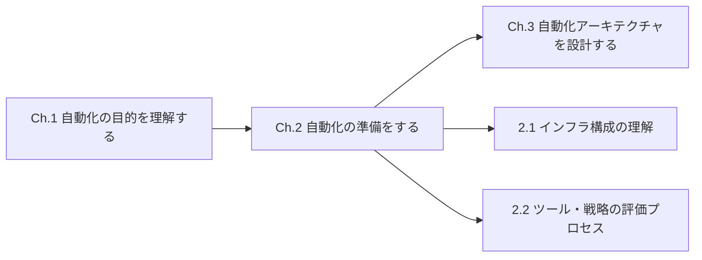
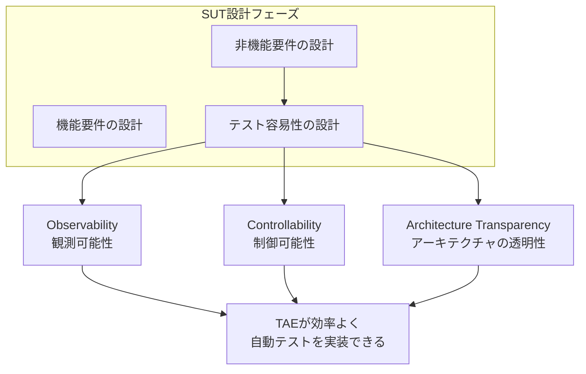
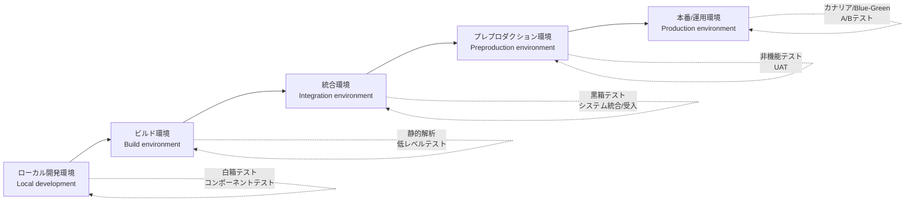
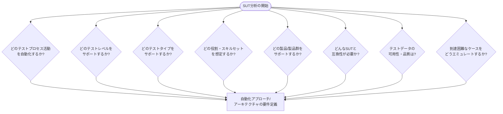
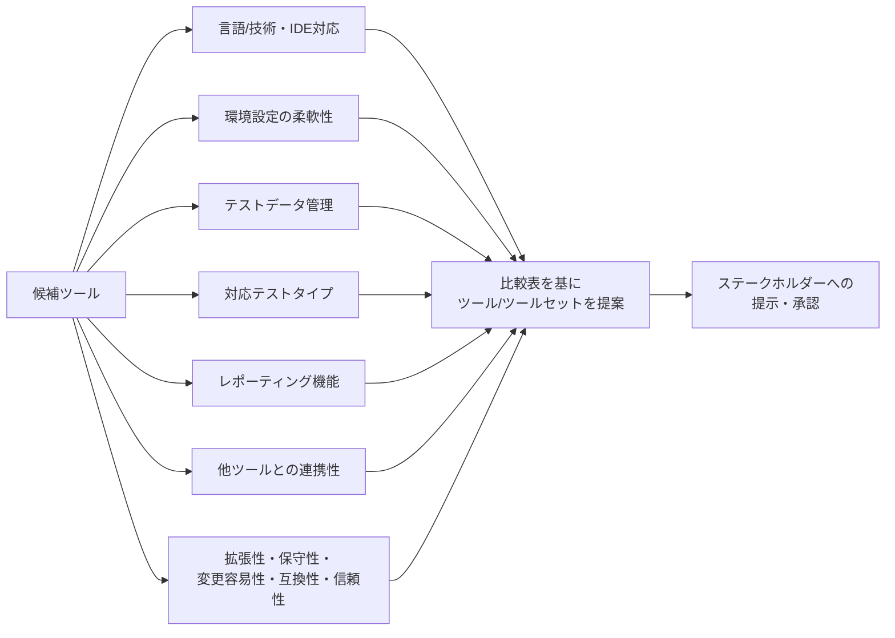
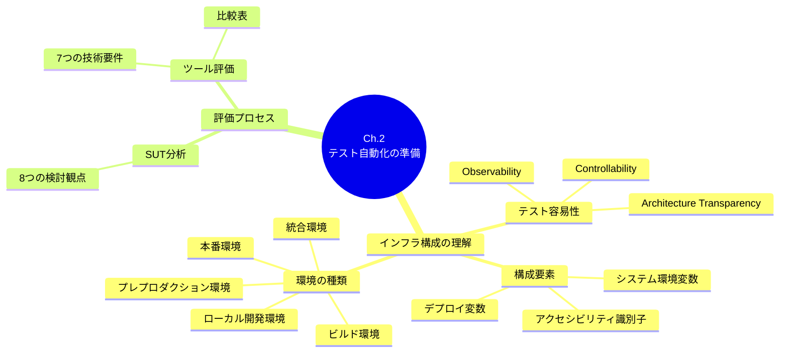

# CTAL-TAE v2.0 Chapter 2「Preparing for Test Automation（テスト自動化の準備）」初学者向け解説ガイド

> 対象試験：ISTQB® Certified Tester Advanced Level Test Automation Engineering (CTAL-TAE) v2.0
> 本章の試験時間配分：180分／認知レベル：K4（分析）
> 本ガイドは公式シラバスに基づいて作成した学習用の要約・解説であり、公式教材の代替ではありません。

---

## 0. この章の位置づけ

Chapter 1では「なぜテスト自動化を行うのか」を学びました。Chapter 2では、実際にテスト自動化を始める **前段階** として、以下の2つの大きなテーマを扱います。

1. **インフラ構成の理解**：SUT（System Under Test：テスト対象システム）がテスト可能（testable）であるために、どのようなインフラ・環境設計が必要か
2. **ツール・戦略の評価プロセス**：SUTを分析し、適切な自動化ソリューションとツールをどう選び、どう関係者に説明するか

### 学習目標（Learning Objectives）

| ID | 認知レベル | 内容 |
|---|---|---|
| TAE-2.1.1 | K2（理解） | テスト自動化の実装を可能にするインフラの構成ニーズを記述できる |
| TAE-2.1.2 | K2（理解） | テスト自動化が異なる環境内でどのように活用されるかを説明できる |
| TAE-2.2.1 | K4（分析） | SUTを分析し、適切なテスト自動化ソリューションを判断できる |
| TAE-2.2.2 | K4（分析） | ツール評価の技術的所見を図示（整理・提示）できる |

### キーワード（覚えておくべき用語）

- **API testing**（APIテスト）
- **GUI testing**（GUIテスト）
- **testability**（テスト容易性）

---

## 1. 2.1 テスト自動化を可能にするインフラの構成の理解

### 1.1 テスト容易性（Testability）とは何か

テスト自動化を成功させる大前提は、**SUT自体が「テストしやすい」ように設計されていること**です。これを **テスト容易性（testability）** と呼びます。

> テスト容易性とは、SUTの制御（controllability）と観測（observability）を可能にするソフトウェアインターフェースが用意されている度合いのことです。

重要なのは、テスト容易性は **後付けで足すもの ではなく、SUTの他の機能設計と並行して、ソフトウェアアーキテクトが設計・実装すべき非機能要件** だという点です。実務では、TAE（Test Automation Engineer）がアーキテクトと協働し、「どこを改善すればテストしやすくなるか」を具体的に特定する役割を担います。

### 1.2 テスト容易性を支える3つの設計側面

| 側面 | 説明 | 具体例 |
|---|---|---|
| **Observability（観測可能性）** | SUTの内部状態を外部から把握できるインターフェースを提供すること。テストケースはこのインターフェースを使い、実際の結果が期待結果と一致するかを判定する | ログ出力、ステータスAPI、監視エンドポイント |
| **Controllability（制御可能性）** | SUTに対してアクションを実行できるインターフェースを提供すること | UI要素、関数呼び出し、TCP/IPやUSBなどの通信要素、物理/論理スイッチへの電子信号 |
| **Architecture Transparency（アーキテクチャの透明性）** | アーキテクチャのドキュメントが、各テストレベルで観測性・制御性を確保できるよう、コンポーネントとインターフェースを明確かつ理解しやすい形で示していること | 明確なAPI仕様書、コンポーネント図、インターフェース定義書 |

**ベストプラクティス**
- テスト容易性の議論は、要件定義・アーキテクチャ設計の初期段階からTAEを巻き込んで行う（後工程で追加しようとすると改修コストが跳ね上がる）。
- Observability（見える化）とControllability（操作性）は必ずセットで検討する。見えるだけ・操作できるだけでは自動テストは成立しない。
- アーキテクチャドキュメントは「テストの立場から読んでも、どこにどう介入・観測できるか分かる」レベルの粒度で整備する。

### 1.3 テスト容易性を実現するための構成要素

テスト容易性を高めるための代表的な仕組みと、それぞれの設定方法（構成ニーズ）は以下の通りです。

| 構成要素 | 概要 | 設定方法 |
|---|---|---|
| **アクセシビリティ識別子（Accessibility identifiers）** | UI要素などを一意に特定するための識別子 | 開発フレームワークが自動生成する場合と、開発者が手動で設定する場合がある |
| **システム環境変数（System environment variables）** | アプリケーションの挙動を変更するパラメータ | 管理者権限などを通じて、テストしやすいように動的に変更できる |
| **デプロイ変数（Deployment variables）** | システム環境変数と似ているが、デプロイ開始前に設定される | デプロイパイプラインの設定ファイルなどで事前定義する |

**ベストプラクティス**
- アクセシビリティ識別子は「開発者が機能を作った後に付け足す」のではなく、コンポーネント設計時に命名規則を決めて自動生成される仕組みを整える。
- 環境変数・デプロイ変数は、テスト環境ごとに値が変わることを前提に、TAF（Test Automation Framework）側の設定ファイルやシークレット管理の仕組みと連携させる。

---

## 2. さまざまな環境でのテスト自動化の活用（2.1.2）

同じ自動テストスイートでも、**どの環境で実行するか** によって目的・実施可能なテストタイプ・監視の有無が異なります。シラバスでは代表的な5つの環境を、開発からリリースまでのパイプラインに沿って紹介しています。

### 2.1 各環境の特徴と自動化の役割

| 環境 | 主な目的 | 実施されるテスト | 特記事項 |
|---|---|---|---|
| **ローカル開発環境** | ソフトウェアの初期作成、コンポーネント単位での機能適合性の検証 | コンポーネントテスト、GUIテスト、APIテスト | IDEを使うことで、白箱テストにより早期にコード品質・設計の問題を発見できる |
| **ビルド環境** | ソフトウェアをビルドし、ビルド結果の正しさを検証する | コンポーネントテスト、コンポーネント統合テスト、静的解析 | ローカル開発環境そのもの、またはCI/CDエージェント上で実行され、他環境へのデプロイは行わない |
| **統合環境** | 完全に統合されたリリース候補を対象に検証する | UIテストまたはAPIテストによる自動テストスイート（黒箱テストのみ） | **監視（モニタリング）が導入される最初の環境**。障害調査を効率的に行うための基盤となる |
| **プレプロダクション環境** | 非機能品質特性（性能効率性など）を評価する | 既存の自動テストスイートの再実行、ビジネス関係者によるUAT（受入テスト） | 本番に最も近い構成のため重点的に利用される。監視も継続される |
| **本番/運用環境** | 実際のユーザー利用下で機能・非機能品質特性を評価する | 監視をベースとしたテスト | カナリアリリース、ブルー/グリーンデプロイ、A/Bテストなどのベストプラクティスと組み合わせる |

**ベストプラクティス**
- 環境が下流（本番側）に進むほど、**ホワイトボックス視点からブラックボックス視点へ移行する**ことを意識してテスト設計を分ける。統合環境以降はブラックボックステストが中心になる。
- 統合環境より先の環境では必ず監視（モニタリング）を組み込み、テスト失敗時に「どこで何が起きたか」を追跡できるようにする。
- コンテナや仮想化技術を使えば、環境ごとの差異を減らし、同一のテスト自動化ソリューションを複数環境で再利用しやすくなる。
- 本番環境でのテストは、カナリアリリースやブルー/グリーンデプロイなど、**利用者への影響を最小化する手法とセット**で導入する。

---

## 3. 2.2 適切なツール・戦略を選定するための評価プロセス

### 3.1 SUTの分析（2.2.1）

自動化ソリューションを決める前に、まず対象となるSUTを分析し、**要件を集める**必要があります。SUTの種類（Webサービス、モバイル、Webアプリなど）によって、技術的に必要な自動化アプローチは異なります。

> この調査は、手動テスト担当者、ビジネス関係者、ビジネスアナリストなど、**他のステークホルダーと協働して行うことが推奨されています**。これにより、リスクとその緩和策をできるだけ多く洗い出し、将来にわたって有益な自動化ソリューションにつなげることができます。

**分析で検討すべき8つの観点**

| # | 観点 | 具体的な問い |
|---|---|---|
| 1 | テストプロセス活動 | テスト管理・テスト設計・テスト生成・テスト実行のどれを自動化するか |
| 2 | テストレベル | コンポーネント／統合／システム／受入のどのレベルを対象とするか |
| 3 | テストタイプ | 機能テスト、性能テスト、セキュリティテストなど、どのタイプを対象とするか |
| 4 | 役割・スキルセット | どの役割（テスト分析者、TAEなど）がどのスキルで関与するか |
| 5 | 対象製品・製品ライン | ソリューションの適用範囲・寿命をどう定義するか |
| 6 | SUTとの互換性 | 対象となるSUTの技術スタックとの互換性 |
| 7 | テストデータ | テストデータの入手可能性と品質 |
| 8 | 到達困難なケースのエミュレーション | サードパーティ連携など、直接テストできない部分をどう模倣するか |

**ベストプラクティス**
- 「自動化ありき」で進めず、必ずSUTの技術的特性（UIの有無、プロトコル、モバイル/Web/APIなど）を先に把握してから要件を定義する。
- 要件収集は一人で行わず、テスト分析者・ビジネスアナリスト・ビジネス関係者を巻き込み、**リスクの見落としを減らす**。
- 8つの観点はチェックリストとして使い、抜け漏れなく初期要件をドキュメント化しておくと、後のツール比較（2.2.2）で判断がぶれない。

### 3.2 ツール評価の技術的所見の図示（2.2.2）

SUTの分析と要件収集が終わったら、次に候補となるテストツールを比較します。シラバスは「**すべての要件を満たす単一のツールは存在しないことが多い**」と明言しており、ステークホルダーもその前提を理解しておく必要があります。

#### 比較表（Comparison Table）の作り方

推奨されるのは、ツールを列に、要件を行にした **比較表** を作ることです。各セルには、そのツールがその要件をどの程度満たすか（および優先度）を記載します。

| 要件 \ ツール | ツールA | ツールB | ツールC |
|---|---|---|---|
| 対応言語／技術・IDE | ◎ | ○ | △ |
| 環境設定の柔軟性（動的/静的値） | ○ | ◎ | ○ |
| テストデータ管理（バージョン管理連携） | △ | ◎ | ○ |
| 対応テストタイプ | ○ | ○ | ◎ |
| レポーティング機能 | ◎ | ○ | ○ |
| 他ツール連携（CI/CD、タスク管理、テスト管理） | ○ | ◎ | △ |
| 拡張性・保守性・変更容易性・互換性・信頼性 | ○ | ◎ | ○ |

> 凡例：◎＝十分に満たす／○＝ある程度満たす／△＝要追加検討・優先度が低い

#### 評価すべき7つの技術要件

| # | 要件 | 確認ポイント |
|---|---|---|
| 1 | 言語／技術／IDE | ツールの実装言語・対応IDEはSUTやチームのスキルセットと合っているか |
| 2 | 環境設定の柔軟性 | 複数の実行環境・実行構成に対応でき、動的/静的な設定値を扱えるか |
| 3 | テストデータ管理 | ツール内でテストデータを管理できるか。中央リポジトリでのバージョン管理と統合できるか |
| 4 | 対応テストタイプ | テストタイプごとに異なるツールが必要になる場合がある点を考慮しているか |
| 5 | レポーティング機能 | プロジェクトのテストレポーティング要件と整合しているか |
| 6 | 他ツールとの連携 | CI/CD、タスク管理、テスト管理、レポーティングなど組織内の既存ツール群と統合できるか |
| 7 | アーキテクチャ拡張性 | スケーラビリティ・保守性・変更容易性・互換性・信頼性の観点で将来の拡張に耐えられるか |

**ベストプラクティス**
- 比較表は「ツールの機能一覧」ではなく、**2.2.1で洗い出した要件に対する適合度** を軸に作る。要件起点で評価することが重要。
- 唯一絶対のツールは存在しない前提で、**複数ツールの組み合わせ（ツールセット）** を選択肢として提示する。
- 最終判断のプロセス（誰がどう決めるか）はプロジェクトごとに異なってよいが、**必ず提案内容をステークホルダーに提示し承認を得るステップを設ける**。
- コスト（ライセンス費用、学習コスト、保守コスト）も比較軸に含め、機能面だけで判断しない。

---

## 4. 章のまとめとチェックリスト

### 学習到達度チェックリスト

- [ ] Observability・Controllability・Architecture Transparencyの3つを、それぞれ自分の言葉で説明できる
- [ ] アクセシビリティ識別子・システム環境変数・デプロイ変数の違いと設定方法を説明できる
- [ ] 5つの環境（ローカル開発／ビルド／統合／プレプロダクション／本番）の目的と、それぞれで実施される代表的なテストを言える
- [ ] 監視（モニタリング）が最初に導入される環境がどこかを説明できる
- [ ] SUT分析で検討すべき8つの観点を挙げられる
- [ ] ツール比較表の作り方（列＝ツール、行＝要件）と、評価すべき7つの技術要件を説明できる
- [ ] 「単一のツールがすべての要件を満たすとは限らない」という前提を踏まえた提案の進め方を説明できる

---

## 5. 参考文献・情報源（URL）

本ガイドは、以下の公式情報源の内容に基づいて作成しています。

- ISTQB® CTAL-TAE v2.0 認定ページ
  https://istqb.org/certifications/certified-tester-advanced-level-test-automation-engineering-ctal-tae-v2-0/
- ISTQB® CTAL-TAE v2.0 シラバス（PDF、Chapter 2「Preparing for Test Automation」pp.17–21）
  https://istqb.org/wp-content/uploads/2024/11/ISTQB_CTAL-TAE_Syllabus_v2.0.pdf
- ISTQB® 公式サイト（用語集・関連資料へのリンク）
  https://www.istqb.org/

> 注：本シラバスが参照するISO/IEC 25010（品質特性）などの外部標準規格は、シラバス内で要約されている範囲のみが出題対象であり、規格文書そのものは試験範囲外です（シラバス 0.8節「Handling of Standards」参照）。
