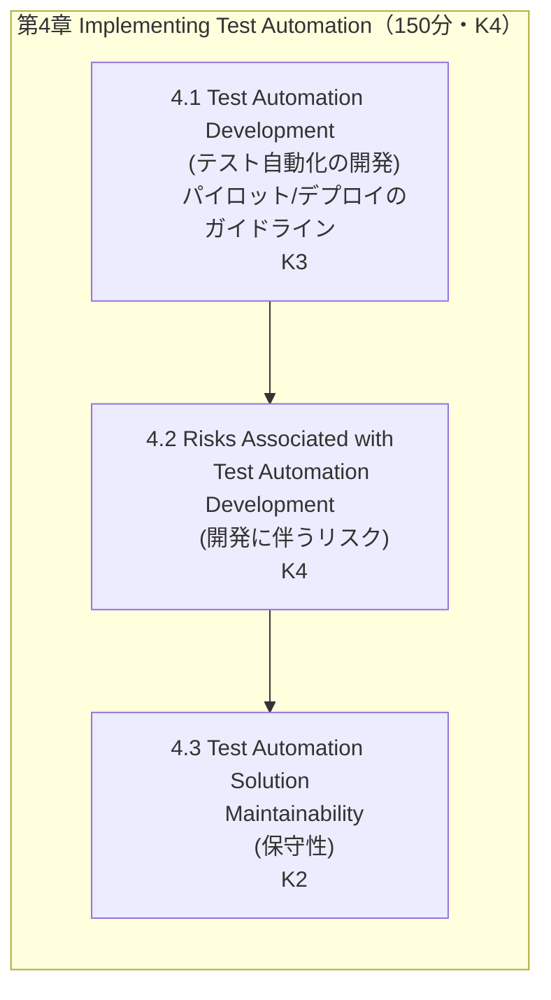
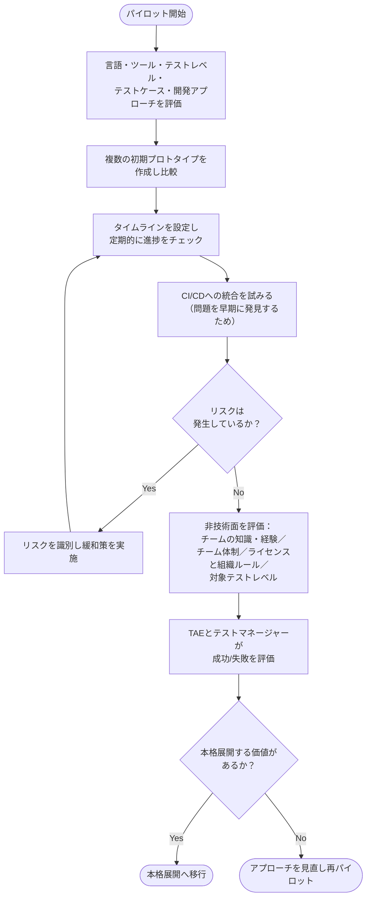
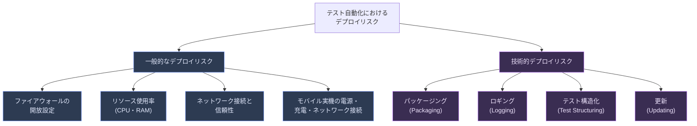
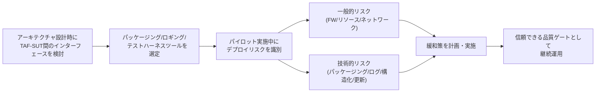
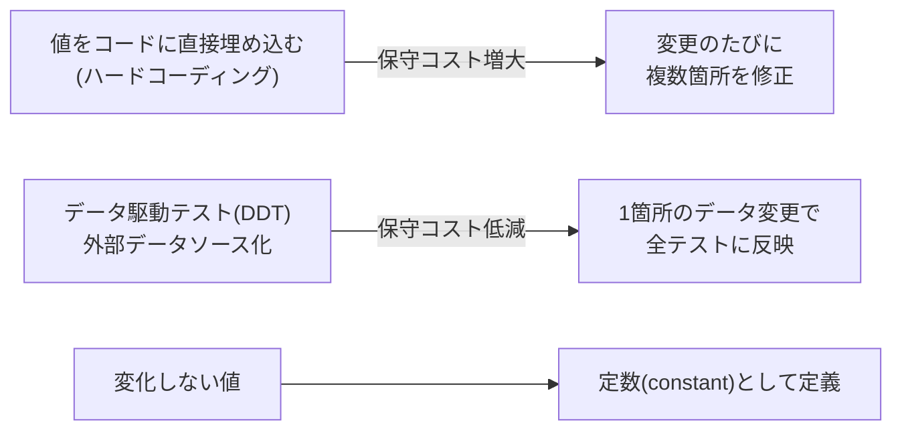
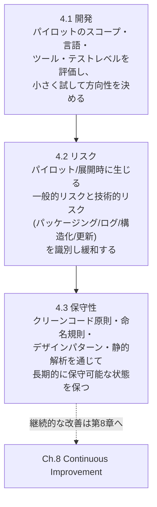

# CTAL-TAE v2.0 第4章「Implementing Test Automation（テスト自動化の実装）」初学者向け解説ガイド

> 対象試験：ISTQB® Certified Tester Advanced Level Test Automation Engineering (CTAL-TAE) v2.0
> 対象章：Chapter 4 – Implementing Test Automation（学習時間目安：150分、認知レベル：K4）
> 公式ページ：https://istqb.org/certifications/certified-tester-advanced-level-test-automation-engineering-ctal-tae-v2-0/
> シラバスPDF：https://istqb.org/wp-content/uploads/2024/11/ISTQB_CTAL-TAE_Syllabus_v2.0.pdf

---

## 目次

1. [第4章の全体像](#1-第4章の全体像)
2. [キーワードと学習目標](#2-キーワードと学習目標)
3. [4.1 テスト自動化の開発（パイロット＆デプロイのガイドライン）](#3-41-テスト自動化の開発パイロットデプロイのガイドライン)
4. [4.2 テスト自動化開発に伴うリスク](#4-42-テスト自動化開発に伴うリスク)
5. [4.3 テスト自動化ソリューションの保守性](#5-43-テスト自動化ソリューションの保守性)
6. [章全体のまとめ](#6-章全体のまとめ)
7. [出典・参考資料](#7-出典参考資料)

---

## 1. 第4章の全体像

第3章では「Test Automation Architecture（テスト自動化アーキテクチャ）」という**設計**の話をしました。第4章はその設計を実際に**実装・パイロット・展開（デプロイ）していく実務プロセス**が中心です。ISTQBのシラバス構成上、この章は次の3つの学習領域（Learning Objective群）で構成されています。

第3章で決めた**アーキテクチャ**を、実際に「小さく試してみる（パイロット）」→「そのときに起きるリスクを洗い出し、対策する」→「長期的に保守できる形にする」という**時間軸に沿った実装の流れ**を扱うのが第4章だと理解すると全体像がつかみやすくなります。

> 出典：ISTQB CTAL-TAE Syllabus v2.0, Section 0.11「How this Syllabus is Organized」（p.12）
> https://istqb.org/wp-content/uploads/2024/11/ISTQB_CTAL-TAE_Syllabus_v2.0.pdf

---

## 2. キーワードと学習目標

### 2.1 本章のキーワード（試験で暗記が求められる用語）

| 用語 | 説明 |
|---|---|
| risk（リスク） | テスト自動化の導入・展開時に発生しうる、望ましくない事象の可能性。技術的リスクと非技術的リスクの両方を扱う |
| test fixture（テストフィクスチャ） | テストが実行されるために必要な前提条件・環境要素。前処理（setup）・後処理（teardown）を通じてテストの再現性・独立性を担保する仕組み |

### 2.2 学習目標（Learning Objectives）一覧

| 節 | LOコード | 認知レベル | 内容 |
|---|---|---|---|
| 4.1 テスト自動化の開発 | TAE-4.1.1 | K3（適用） | 効果的なテスト自動化のパイロットおよびデプロイ活動を支援するガイドラインを適用する |
| 4.2 テスト自動化開発に伴うリスク | TAE-4.2.1 | K4（分析） | テスト自動化のデプロイリスクを分析し、緩和戦略を計画する |
| 4.3 テスト自動化ソリューションの保守性 | TAE-4.3.1 | K2（理解） | テスト自動化ソリューションの保守性を支え、また影響を与える要因を説明する |

> 出典：ISTQB CTAL-TAE Syllabus v2.0, Chapter 4 冒頭（p.29）
> https://istqb.org/wp-content/uploads/2024/11/ISTQB_CTAL-TAE_Syllabus_v2.0.pdf

---

## 3. 4.1 テスト自動化の開発（パイロット／デプロイのガイドライン）

### 3.1 なぜ「パイロットプロジェクト」から始めるのか

いきなり本格的なテスト自動化基盤（TAS：Test Automation Solution）を全面導入するのはリスクが高すぎます。そこでシラバスは、**小規模な検証（パイロット）から始めて、成功パターンを確認してから本格展開する**というアプローチを推奨しています。

初学者向けに言い換えると、パイロットとは「本格的に投資する前の“お試し期間”」です。期間は短くても、その結果がプロジェクト全体の自動化方針を左右するほどインパクトが大きい、という点がポイントです。

### 3.2 パイロットで評価すべき5つの項目

シラバスは、SUT（System Under Test：テスト対象システム）とプロジェクト要件から集めた情報をもとに、次の5項目を評価してガイドラインを定めるべきだとしています。

| # | 評価項目 | 具体的に検討する内容 |
|---|---|---|
| 1 | 使用するプログラミング言語 | SUTの開発言語と揃えるか、テストに適した言語を別途選ぶか |
| 2 | 適切な商用ツール／OSS（オープンソース）ツール | ライセンス費用・コミュニティのサポート状況・機能要件との適合 |
| 3 | カバーすべきテストレベル | コンポーネント／統合／システム／受入のどこを自動化対象にするか |
| 4 | 選定するテストケース | パイロットでの検証に十分な代表性を持つテストケース群 |
| 5 | テストケース開発アプローチ | 第3章で学んだ線形スクリプティング／構造化スクリプティング／データ駆動／キーワード駆動／BDD等のどれを採用するか |

これらの評価結果をもとに、TAE（Test Automation Engineer）は**初期プロトタイプを複数作成**し、それぞれの長所・短所を比較したうえで進むべき方向性を決定します。

### 3.3 パイロット実行時の運用プラクティス

シラバス本文から、パイロット期間中に実施すべき運用上のポイントを整理すると以下の通りです。

とくに重要なのは、**パイロットの早い段階でCI/CDへの統合を試すこと**です。シラバスは「これによりSUT側・TAS側・組織内ツール連携のいずれかに存在する問題が早期に露見しうる」と明記しています。問題を後工程で発見するよりも、パイロットの時点で発見するほうが手戻りコストが小さいためです。

またテストケース数が増えてくると、当初決めたCI/CD構成（実行タイミングや実行方法）を見直す必要が出てくる点も述べられています。

### 3.4 技術面以外に評価すべき観点

自動化の成否は技術だけで決まりません。シラバスは以下の非技術的な観点もパイロット中に評価すべきとしています。

- チームメンバーの知識・経験
- チーム体制（組織構造）
- ライセンスおよび組織のルール
- 計画されているテストの種類と、自動化対象とするテストレベル

パイロット完了後は、TAEとテストマネージャーが共同で成果を評価し、**継続するか・方向転換するか**を意思決定します。

### 3.5 ベストプラクティス（4.1）

> 💡 パイロット計画のベストプラクティス
> - パイロットの**スコープと評価範囲を最初に明文化**し、目的を関係者間で合意する
> - タイムラインを設定し、**定期的な進捗チェックポイント**を設けてリスクを早期に発見する
> - 可能な限り早い段階でCI/CDパイプラインへ組み込み、統合上の問題を先に洗い出す
> - 技術評価だけでなく、チームのスキルセット・体制・ライセンス条件も並行して評価する
> - パイロット終了時は**TAEとテストマネージャーの両者で成功/失敗を判断**し、意思決定の記録を残す

---

## 4. 4.2 テスト自動化開発に伴うリスク

### 4.1 リスクの全体像

TAF（Test Automation Framework）をSUTにインターフェースさせる設計は、アーキテクチャ設計の一部として検討する必要があります。その後、パッケージング、テストロギング、テストハーネスツールを選定していく流れになりますが、この過程では様々な**デプロイリスク**が識別されます。

シラバスは、デプロイリスクを大きく「一般的なデプロイリスク」と「技術的デプロイリスク」に分けて説明しています。

> 出典：ISTQB CTAL-TAE Syllabus v2.0, Section 4.2.1（p.30-32）
> https://istqb.org/wp-content/uploads/2024/11/ISTQB_CTAL-TAE_Syllabus_v2.0.pdf

これらのリスクはテスト自動化に固有のものだけではありませんが、TAEは「信頼できる有益な品質ゲートを提供するために、これらの条件がすべて満たされていることを確認する責任」を負う、とシラバスは強調しています。たとえばモバイル実機を使ったテスト自動化では、実機の電源投入・十分なバッテリー残量・ネットワーク接続・SUTへのアクセス確保といった一見テストと直接関係なさそうな条件も、リスクとして事前に管理する対象になります。

### 4.2 技術的デプロイリスクの詳細

#### （1）パッケージング（Packaging）

テストウェア（testware：テストスクリプト・テストデータ・設定ファイルなどテスト自動化に関わる成果物の総称）も、SUTと同様に**バージョン管理**が重要です。組織内・オンプレミス・クラウドを問わず、リポジトリへアップロードして共有できる状態にしておく必要があります。

#### （2）ロギング（Logging）

テストロギングは、テスト結果に関する最も重要な情報源です。シラバスでは以下の6段階のログレベルが定義されています。それぞれ用途が異なるため、レベルの使い分けを理解することが重要です。

| ログレベル | 用途 |
|---|---|
| Fatal | テスト実行そのものを中断させる可能性があるエラーイベントを記録する |
| Error | 条件や相互作用が失敗し、テストケース自体も失敗となる場合に使用する |
| Warn | フローを止めるほどではないが、予期しない条件・動作が発生した場合に使用する |
| Info | テストケースの基本情報や実行中に何が起きているかを表示する |
| Debug | 通常の基本ログには不要だが、テスト失敗調査の際に有用な実行詳細情報を格納する |
| Trace | Debugと似ているが、さらに詳細な情報を含む |

> 出典：ISTQB CTAL-TAE Syllabus v2.0, Section 4.2.1「Logging」（p.31）

初学者向けの覚え方としては、**「上から重大度が高い順」に並んでおり、下に行くほど開発者・TAE向けの詳細なデバッグ情報になる**とイメージすると分かりやすいです。

#### （3）テスト構造化（Test Structuring）

TAS（Test Automation Solution）の最も重要な部分は、**テストハーネス**と、その中に含まれる**テストフィクスチャ**（test fixture）です。テストフィクスチャとは、テストが実行される前に用意されていなければならない要素のことで、以下のような役割を持ちます。

- テスト環境とテストデータをコントロールするための自由度を提供する
- テスト実行における事前条件（precondition）・事後条件（postcondition）を定義できる
- テストケースをさまざまな方法でテストスイートにグルーピングできる
- テストを**反復可能（repeatable）かつ独立（atomic）**にする

この「反復可能」「独立（アトミック）」という2つの性質は、自動テストの信頼性を支える重要な概念です。同じテストを何度実行しても同じ結果が得られること（反復可能性）と、あるテストが他のテストの実行結果に影響を与えたり受けたりしないこと（独立性）は、テストフィクスチャの適切な設計によって実現されます。

#### （4）更新（Updating）

最も一般的な技術リスクのひとつが、**テストハーネス（エージェントなど）の自動更新やデバイスのバージョン変更**です。これらは以下のような対策で緩和できます。

- 十分な電源供給の確保
- 適切なネットワーク接続の確保
- 適切なデバイス構成計画の策定

### 4.3 リスク分析から緩和策までの流れ（まとめ図）

### 4.4 ベストプラクティス（4.2）

> 💡 デプロイリスク対応のベストプラクティス
> - テストウェアはSUTと同様に**バージョン管理・リポジトリ管理**の対象とする
> - ログレベル（Fatal〜Trace）を**用途に応じて正しく使い分け**、後から原因調査しやすい粒度で記録する
> - テストフィクスチャを設計する際は「**反復可能性**」と「**独立性（アトミック性）**」を必ず担保する
> - デバイス・エージェントの**自動更新はスケジュールと構成管理でコントロール**し、予期しないタイミングでの更新によるテスト失敗を防ぐ
> - モバイル実機など物理リソースを使う場合は、電源・充電・ネットワークといった**非機能的な前提条件も明示的にチェックリスト化**する

---

## 5. 4.3 テスト自動化ソリューションの保守性

### 5.1 保守性を左右する要因

シラバスは、TAS（テスト自動化ソリューション）の**保守性（maintainability）は、プログラミング標準とTAE同士の相互期待によって大きく左右される**と述べています。そのうえで、黄金律（golden rule）として**Robert C. Martin氏のクリーンコード原則**（"Clean Code: A Handbook of Agile Software Craftsmanship", 2008）に従うことを推奨しています。

### 5.2 クリーンコード原則の8項目

| # | 原則 | 内容 |
|---|---|---|
| 1 | 共通の命名規則 | クラス・メソッド・変数に意味のある名前を、共通の命名規則に沿って付ける |
| 2 | 論理的で共通のプロジェクト構造 | ファイルやフォルダの構成を一貫させる |
| 3 | ハードコーディングの回避 | 値をコードに埋め込まず、外部から変更可能にする |
| 4 | メソッドの入力パラメータを増やしすぎない | パラメータが多すぎるメソッドは可読性・保守性を下げる |
| 5 | 長く複雑なメソッドを避ける | 単一責任を意識し、メソッドを小さく保つ |
| 6 | ロギングを使用する | 実行状況を追跡できるようにする |
| 7 | 有益かつ必要な場合にデザインパターンを使用する | 過剰適用は避けつつ、適切な場面で活用する |
| 8 | テスタビリティに焦点を当てる | コード自体がテストしやすい構造になっているかを意識する |

> 出典：ISTQB CTAL-TAE Syllabus v2.0, Section 4.3.1（p.32）、原典：Robert C. Martin, *Clean Code: A Handbook of Agile Software Craftsmanship*, 2008

### 5.3 命名規則の重要性

わかりやすい変数名（例：`loginButton`、`resetPasswordButton`）は、どのコンポーネントを対象にしているかをTAEが直感的に理解する助けになります。命名規則が統一されていないコードベースは、後から参加したメンバーがコードを理解するコストを大きく増加させます。

### 5.4 ハードコーディングの回避とデータ駆動テストの関係

**ハードコーディング**とは、値を変更不可能な形でソフトウェアに直接埋め込むことです。シラバスは次のように整理しています。

- ハードコーディングは開発時間を短縮できるが、**データが頻繁に変わる場合は保守コストが増大する**ため推奨されない
- 第3章で学んだ**データ駆動テスト（DDT）**を活用し、テストデータを共通のソースから取得する構成にすることで回避できる
- 頻繁に変化しないと想定される値は**定数（constant）**として扱うことで、保守対象箇所を減らせる

### 5.5 デザインパターンと静的解析の活用

第3章（3.1.5）で学んだデザインパターン（Facadeパターン、Singletonパターン、Page Object Model、Flow Modelパターンなど）を適切に用いることで、**構造化され保守性の高いテスト自動化コード**を実装できます。

さらに、テスト自動化コードの品質を確保するために、以下のツール・慣行の活用が推奨されています。

- **静的解析ツール（static analyzer）**：コード品質の問題を検出する
- **コードフォーマッタ（IDE組み込みが一般的）**：可読性を向上させる
- **ブランチ戦略**：機能追加・リリース・不具合修正ごとに異なるブランチを用意し、ブランチの中身を把握しやすくする（バージョン管理における合意されたブランチ構造・戦略の採用）

### 5.6 ベストプラクティス（4.3）

> 💡 保守性向上のベストプラクティス
> - Robert C. Martinのクリーンコード原則（8項目）を**チームの共通ルールとして明文化**し、コードレビューの観点に組み込む
> - 変数・メソッド名は**役割が一目でわかる命名**にし、命名規則をドキュメント化してチーム全体で共有する
> - 頻繁に変化する値は**データ駆動テスト**で外部化し、変化しない値のみ定数として管理する
> - デザインパターン（Facade／Singleton／Page Object Model／Flow Model）は「**必要な場面でのみ**」適用し、過剰な抽象化を避ける
> - **静的解析ツールとコードフォーマッタをCIパイプラインに組み込み**、レビュー前に機械的にチェックできる状態にする
> - **ブランチ戦略**（feature／release／hotfix等）をチームで合意し、テストウェアのバージョン管理にも一貫して適用する

---

## 6. 章全体のまとめ

第4章「Implementing Test Automation」の学習内容を、実装の時間軸に沿って整理すると次のようになります。

第3章で「どう設計するか」を学び、第4章で「どう小さく試し、リスクを管理しながら、保守可能な形で実装するか」を学ぶという流れです。この後の第5章では、ここで実装したテスト自動化を**CI/CDパイプラインへ統合する具体的な戦略**（テストレベルごとの組み込み方、設定管理、API依存関係）へと話が続いていきます。

---

## 7. 出典・参考資料

| 資料名 | URL |
|---|---|
| CTAL-TAE v2.0 認定ページ（ISTQB公式） | https://istqb.org/certifications/certified-tester-advanced-level-test-automation-engineering-ctal-tae-v2-0/ |
| CTAL-TAE v2.0 シラバス（PDF、本記事の一次情報源） | https://istqb.org/wp-content/uploads/2024/11/ISTQB_CTAL-TAE_Syllabus_v2.0.pdf |
| Robert C. Martin, *Clean Code: A Handbook of Agile Software Craftsmanship* (2008)（4.3節のクリーンコード原則の原典としてシラバスが引用） | シラバス本文 Section 4.3.1 に書誌情報あり（上記シラバスPDFを参照） |

> 本ガイドはISTQB® CTAL-TAE v2.0シラバス（Copyright © International Software Testing Qualifications Board, 2024）の内容を要約・翻訳し、初学者向けに再構成したものです。試験対策としてご利用の際は、必ず上記の公式シラバスPDFの該当章（Chapter 4, p.29-32）とあわせてご確認ください。
