# CTAL-TAE v2.0 第6章「Test Automation Reporting and Metrics」初学者向け解説ガイド

> **対象試験**：ISTQB® Certified Tester Advanced Level Test Automation Engineering（CTAL-TAE）v2.0
> **対象シラバス**：Syllabus Version 2.0（2024/05/03 リリース）第6章（シラバス p.37〜p.42）
> **学習時間の目安**：150分（認知レベル K4）
> **作成日**：2026-09-28

---

## 目次

- [0. この章の全体像](#0-この章の全体像)
- [1. 最初に押さえる用語](#1-最初に押さえる用語)
- [2. 6.1.1 データ収集方法の適用（K3）](#2-611-データ収集方法の適用k3)
- [3. 6.1.2 データ分析による結果理解（K4）](#3-612-データ分析による結果理解k4)
- [4. 6.1.3 テスト進捗レポートの作成と公開（K2）](#4-613-テスト進捗レポートの作成と公開k2)
- [5. 項目別ベストプラクティス総まとめ](#5-項目別ベストプラクティス総まとめ)
- [6. 試験対策ポイントと確認問題](#6-試験対策ポイントと確認問題)
- [7. 学習チェックリスト](#7-学習チェックリスト)
- [8. 参考文献・ソース URL](#8-参考文献ソース-url)

---

## 0. この章の全体像

第6章は、**自動テストが「動いた」だけで終わらせず、結果を集め、原因を読み解き、関係者に伝える**ところまでを扱います。

### 0.1 学習目標（Learning Objectives）

| LO 番号 | 認知レベル | 内容 | 本ガイドの節 |
|---|---|---|---|
| TAE-6.1.1 | K3（適用） | TAS と SUT からのデータ収集方法を適用する | 第2章 |
| TAE-6.1.2 | K4（分析） | TAS と SUT のデータを分析して結果をより良く理解する | 第3章 |
| TAE-6.1.3 | K2（理解） | テスト進捗レポートがどう作られ公開されるかを説明する | 第4章 |

**キーワード（暗記対象）**：measurement（測定）、metric（メトリクス）、test log（テストログ）、test progress report（テスト進捗レポート）、test step（テストステップ）

> 💡 **学習のヒント**
> シラバスでは「キーワードは学習目標に明記されていなくても覚えておくこと」とされています。上の5語は必ず自分の言葉で説明できるようにしましょう。

### 0.2 章の流れ（3ステップ）

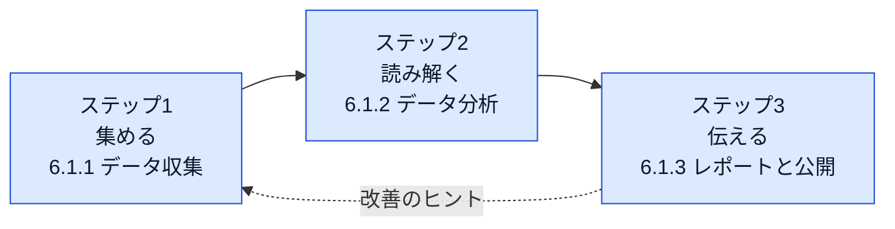

### 0.3 データの流れ（全体マップ）

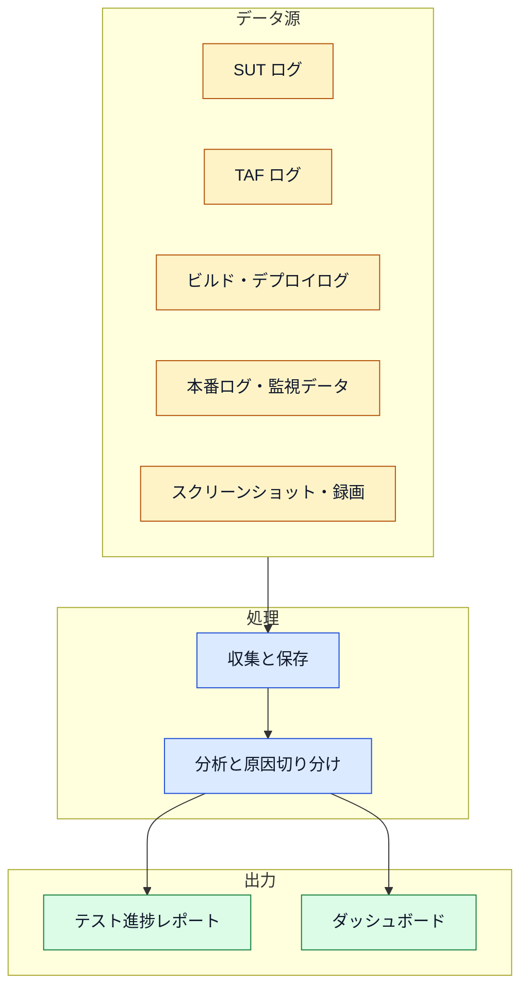

---

## 1. 最初に押さえる用語

| 用語 | 意味（やさしい言い換え） |
|---|---|
| SUT（System Under Test） | テスト対象のシステム |
| TAS（Test Automation Solution） | 自動テストの仕組み全体（ツール、ライブラリ、スクリプト、環境など） |
| TAF（Test Automation Framework） | TAS の土台。テストハーネス（テストランナー）、ライブラリ、スクリプト、スイートを含む |
| TAE（Test Automation Engineer） | 自動テストを設計・実装・保守する人 |
| テストログ（test log） | テスト実行中の出来事の記録。欠陥分析の主要な情報源 |
| 測定（measurement）／メトリクス（metric） | 数値で捉えること／その指標（合格率、実行時間など） |
| テスト進捗レポート | 実行後に作る簡潔な要約。結果・SUT 情報・環境情報を含む |
| テストステップ（test step） | テストケースを構成する個々の操作と確認 |
| アサーション（assertion） | 実際の結果と期待結果を自動で比較する仕組み |
| 相関 ID／トレース ID | 1つのリクエストを複数システムにまたがって追跡するための一意の ID |

> ℹ️ **補足**：SUT や TAF など第1〜5章で登場した用語は、本章でも前提知識として使われます。

---

## 2. 6.1.1 データ収集方法の適用（K3）

**この節のゴール**：どこから、どのようにデータを集めればよいかを、状況に合わせて選べるようになること。

### 2.1 ステップ1：データ源を知る

シラバスが挙げるデータ源は次のとおりです。

| データ源 | 具体例 | 主な使いどころ |
|---|---|---|
| SUT ログ | Web／モバイル UI、API、アプリケーション、Web サーバー、DB サーバーのログ | SUT 側の欠陥の原因調査 |
| TAF ログ | TAF が出力する実行記録 | 監査証跡（audit trail）として利用 |
| ビルドログ | ビルド工程の出力 | ビルド失敗と自動テスト失敗の切り分け |
| デプロイログ | デプロイ工程の出力 | デプロイ起因の不具合の切り分け |
| 本番ログ・監視データ | 本番のパフォーマンス監視、性能テスト環境の負荷・ストレス・スパイクテストログ | 傾向分析（trend analysis） |
| スクリーンショット・画面録画 | ツール標準機能、または第三者ツール | 失敗時の SUT の状態確認 |

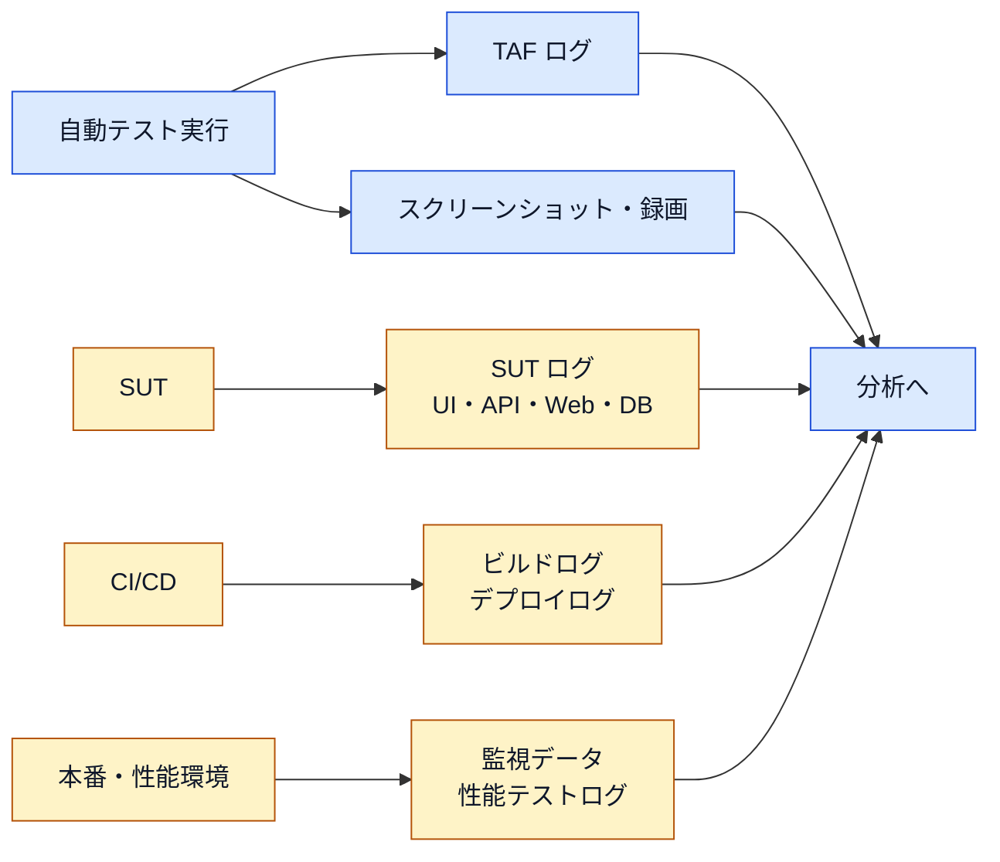

> 💡 **ベストプラクティス：データ源の選び方**
> 1. まず TAF ログ（一次情報）で「どのテストのどのステップで失敗したか」を特定する。
> 2. 次に SUT ログ・スクリーンショットで「そのとき SUT がどんな状態だったか」を確認する。
> 3. 環境全体が怪しいときだけ、ビルド・デプロイログや監視データまで広げる。

### 2.2 ステップ2：テストウェアに記録機能を組み込む

TAS の中心は自動化されたテストウェア（テストスクリプトやライブラリ）です。そのため、**下位のテストウェアに記録機能を足すと、上位の全テストスクリプトがその恩恵を受けます。**

シラバスの例：下位のテストウェアに「テストの開始・終了時刻の記録」を追加すれば、ほとんどすべてのテストに効果があります。

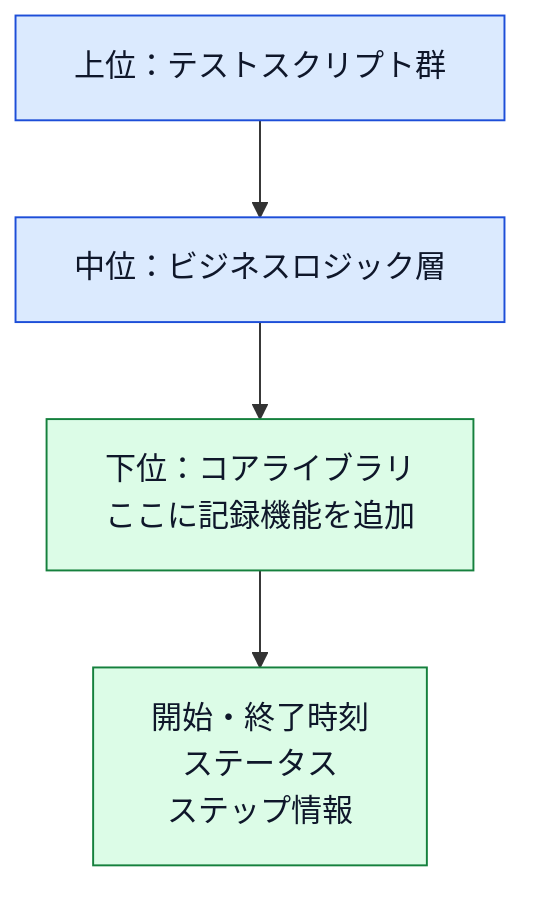

> 💡 **ベストプラクティス**
> - ログ出力はテストスクリプトごとに書かず、**共通フック（setup／teardown、フィクスチャ、リスナー）に1回だけ実装**する。
> - 記録項目を増やしたいときも下位層を直せば全テストに反映される。第3章の「レイヤー化」「Facade パターン」の考え方と同じです。

### 2.3 ステップ3：測定とレポート生成を支える機能を使う

| 機能 | 内容 | 覚えるポイント |
|---|---|---|
| 実行前・中・後の記録 | 多くのテストツールのスクリプト言語には、個別テストやスイート全体の前後で情報を記録する機能がある | 測定・レポートの土台 |
| 過去実行との比較分析 | 複数回の実行結果を踏まえ、成功率の変化などの傾向を示す | 「1回の結果」ではなく「推移」を見る |
| アサーションによる比較 | 実際の結果と期待結果の比較はツールのアサーションで行うのが最適 | 合否（passed／failed）を正しく判定する |
| 失敗時の追加情報 | failed のときは原因把握のための情報（例：スクリーンショット）が必要 | 合否だけでは調査できない |
| 期待される差異の無視 | 日付・時刻など、毎回変わって当然の差異は比較から除外し、想定外の差異だけを目立たせる | 誤検知（偽の失敗）を減らす |

> ⚠️ **注意**：テスト状況（合否）が正しく判定されないと、以降のレポートやメトリクスはすべて信頼できなくなります。

### 2.4 ステップ4：テストロギングの設計

#### 2.4.1 ログレベル（第4章の復習）

| レベル | 用途 |
|---|---|
| Fatal | テスト実行の中断につながりうるエラー |
| Error | 条件や操作が失敗し、テストケースも失敗になる |
| Warn | 想定外の状況が起きたが、テストの流れは止まらない |
| Info | テストケースと実行中の基本情報 |
| Debug | 通常は不要だが、失敗調査に役立つ実行時の詳細 |
| Trace | Debug よりさらに詳細 |

#### 2.4.2 TAS ロギングで記録すべき内容

シラバスが挙げる項目を、目的別に整理しました。

| 分類 | 記録する内容 |
|---|---|
| 実行の特定 | 実行中のテストケース、開始・終了時刻 |
| ステータス | passed／failed／**TAS failure**（欠陥が SUT ではない場合）。inconclusive（結論不能）になることもあるため、組織で明確に定義する |
| 詳細 | 重要なテストステップと時間情報 |
| SUT の動的情報 | サードパーティツールで検出したメモリリークなど。失敗は実行していたスイートと共に記録 |
| 反復 | 信頼性テスト・ストレステストでは実行回数のカウンタ |
| ランダム要素 | ランダムなパラメータや選択があるときは、その値・選択を記録 |
| 再現性 | すべての操作を、同じステップ・同じタイミングで再生できる形で記録 |
| 証拠 | スクリーンショット、クラッシュダンプ、スタックトレース |
| 上書き対策 | 循環バッファなど上書きされうるログは、失敗時に別の場所へ退避 |
| 見やすさ | 色分け（例：欠陥は赤、進捗は緑） |

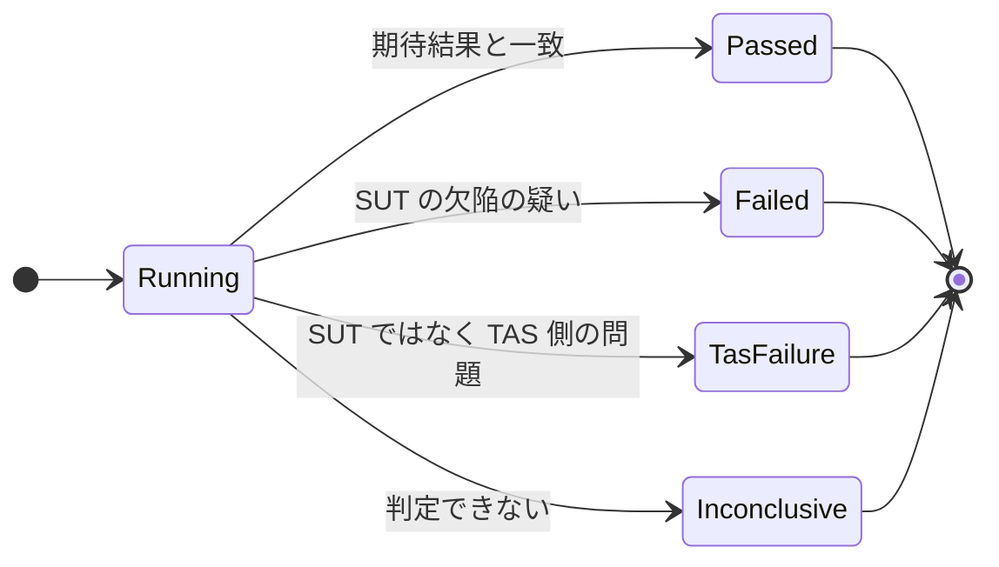

> 💡 **ベストプラクティス：ステータス定義**
> - 「passed／failed」だけでなく **TAS failure** を分けて集計する。分けないと「SUT の品質が悪い」のか「テストが壊れている」のかが混ざり、メトリクスが誤解を生みます。
> - inconclusive の扱い（再実行するか、欠陥扱いにするか）を、チームで文書化しておく。

#### 2.4.3 SUT ロギングで押さえること

| 項目 | 内容 |
|---|---|
| 欠陥情報 | 日時、欠陥の発生箇所（ソース位置）、エラーメッセージ |
| 起動時の構成情報 | ソフトウェア／ファームウェアのバージョン、SUT の構成、OS の構成をファイルに記録 |
| 検索性と同期 | TAS のテストログで見つけた失敗を SUT ログで簡単に探せる（逆も同様）ように、**タイムスタンプで各ログを同期**する |

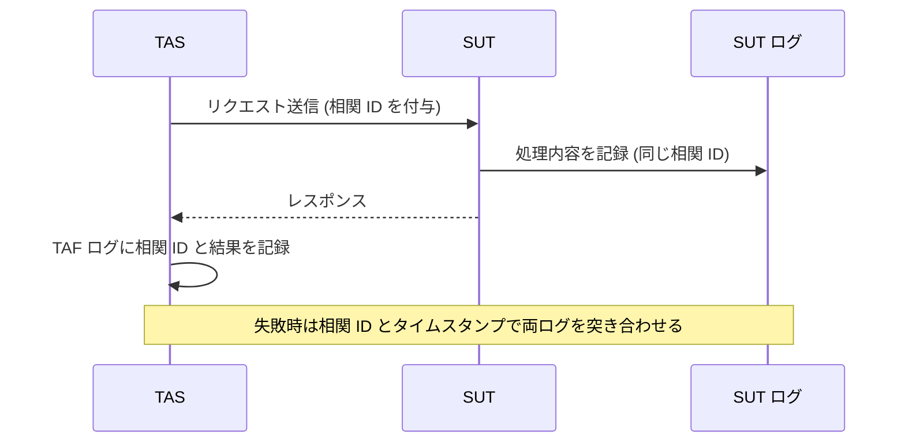

### 2.5 ステップ5：サードパーティツールとの連携と可視化

| 項目 | 内容 | ベストプラクティス |
|---|---|---|
| 他ツール連携 | 表計算、XML、ドキュメント、DB、レポートツールなどで追跡・報告できる形式で結果を出力する（例：トレーサビリティ情報の更新）。ツール標準のエクスポート形式か、カスタムレポートで実現 | 標準的な形式（例：JUnit 形式の XML）で出力しておくと、多くの CI/CD やレポートツールが読み取れる |
| 結果の可視化 | グラフで表現。信号機のような色付きアイコンで全体状態を示すと、判断しやすい。管理者は視覚的な要約を好み、必要ならドリルダウンで詳細へ | 最上段に全体状態、そこから詳細へ掘り下げられる構成にする |

### 2.6 実践例：コードで見る収集設定

> ℹ️ 以下は**理解を助けるための一例**で、シラバスの内容ではありません。ツールの詳細は各公式ドキュメントで確認してください。

#### 例1：Playwright でレポートとトレースを収集する設定

```typescript
// playwright.config.ts
import { defineConfig } from '@playwright/test';

export default defineConfig({
  reporter: [
    ['list'],
    ['html', { open: 'never' }],
    ['junit', { outputFile: 'results/junit.xml' }],
    ['json', { outputFile: 'results/results.json' }],
  ],
  use: {
    trace: 'retain-on-failure',
    screenshot: 'only-on-failure',
    video: 'retain-on-failure',
  },
});
```

| 設定 | 役割 |
|---|---|
| html／junit／json | 人が読む形と、他ツールが読む形の両方を出力 |
| trace／screenshot／video | 失敗時だけ証拠を残す（容量と調査効率のバランス） |

#### 例2：相関 ID を付与して TAF ログに残す（Python）

```python
import json
import logging
import time
import uuid
from urllib.parse import urlsplit, urlunsplit

import requests

logger = logging.getLogger("taf")


def call_api(base_url: str, path: str, test_id: str) -> requests.Response:
    trace_id = uuid.uuid4().hex                      # 32桁の16進数
    span_id = uuid.uuid4().hex[:16]                  # 16桁の16進数
    headers = {"traceparent": f"00-{trace_id}-{span_id}-01"}

    url = f"{base_url}{path}"
    # クエリやフラグメントにはトークンなどの秘密情報が含まれうるため、ログには載せない
    parts = urlsplit(url)
    logged_url = urlunsplit((parts.scheme, parts.netloc, parts.path, "", ""))

    # time.time() はシステム時刻の補正で巻き戻りうるため、経過時間は単調増加の perf_counter() で測る
    started = time.perf_counter()
    try:
        response = requests.get(url, headers=headers, timeout=10)
    except requests.RequestException as exc:
        # 失敗時も相関 ID を残し、SUT ログと突き合わせられるようにしてから再送出する
        logger.error(json.dumps({
            "test_id": test_id,
            "trace_id": trace_id,
            "url": logged_url,
            "error": f"{type(exc).__name__}: {exc}",
            "elapsed_ms": int((time.perf_counter() - started) * 1000),
        }))
        raise

    logger.info(json.dumps({
        "test_id": test_id,
        "trace_id": trace_id,
        "url": logged_url,
        "status": response.status_code,
        "elapsed_ms": int((time.perf_counter() - started) * 1000),
    }))
    return response
```

`traceparent` は W3C Trace Context で定められたヘッダーです（形式の詳細は[参考文献](#8-参考文献ソース-url)を参照）。SUT 側もこの ID をログに出す構成であれば、TAF ログと SUT ログを ID で突き合わせられます。

### 2.7 この節のベストプラクティス（まとめ）

| 対象 | ベストプラクティス | 根拠 |
|---|---|---|
| ログ出力の実装場所 | 下位のテストウェア（共通層）に実装し全テストへ波及させる | シラバス 6.1.1 |
| ステータス | passed／failed／TAS failure を区別し、定義を組織で統一 | シラバス 6.1.1 |
| 失敗時の証拠 | スクリーンショット、スタックトレース、クラッシュダンプを保存 | シラバス 6.1.1 |
| ログの寿命 | 上書きされるログは失敗時に退避 | シラバス 6.1.1 |
| 再現性 | 操作を再生できる粒度で記録。ランダム値も記録 | シラバス 6.1.1 |
| ログ間の対応付け | 時刻同期と相関 ID | シラバス 6.1.1、6.1.2 |
| 比較の精度 | 日時など期待される差異は無視し、想定外の差異だけ強調 | シラバス 6.1.1 |
| 連携 | 標準的なエクスポート形式で出力 | シラバス 6.1.1 |

---

## 3. 6.1.2 データ分析による結果理解（K4）

**この節のゴール**：失敗の原因が SUT・TAS・環境のどこにあるかを、ログから筋道立てて切り分けられること。

### 3.1 一次データと二次データ

> **分析では、TAS から集めたデータが一次（primary）、SUT から集めたデータが二次（secondary）です。**

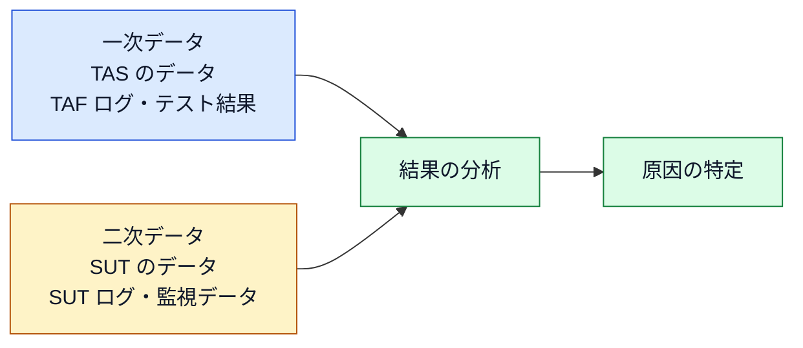

### 3.2 分析で見るもの

| 観点 | 具体例 |
|---|---|
| テスト環境データ | クラスタやリソース（CPU、RAM）。クラウド上での自動テストの適正な規模の判断に使う。単一ブラウザか複数ブラウザ（クロスブラウザ）かも含む |
| 過去の実行との比較 | 結果の推移、同じ失敗が過去にもあったか |
| Web ログの活用 | ソフトウェアの利用状況の監視方法を決める |

### 3.3 テスト実行失敗の分析手順（5ステップ）

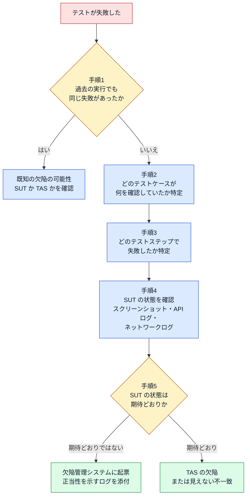

| 手順 | やること | 使う情報 |
|---|---|---|
| 1 | 過去の実行で同じ失敗がなかったか確認する。既知の欠陥（SUT または TAS）の可能性がある。TAS に過去のテスト結果を記録させておくと分析しやすい | 履歴ログ |
| 2 | 既知でなければ、失敗したテストケースと確認内容を特定する。テスト管理システム上の ID がログに出ていれば探しやすい | テスト ID |
| 3 | テストケースのどのテストステップで失敗したかを特定する | TAS ログ |
| 4 | ログの情報から SUT の状態が期待結果と合うかを分析する | スクリーンショット、API ログ、ネットワークログなど |
| 5 | SUT の状態が期待と異なれば、欠陥管理システムに起票する。欠陥だと言える根拠となるログを添える | 欠陥情報とログ |

### 3.4 「失敗したのに原因が見当たらない」ケース

| ケース | 起きていること | 対処の方向性 |
|---|---|---|
| 実際の結果と期待結果が一致しているのに失敗 | 多くの場合、**TAS 側に欠陥**がある。または目に見えない不一致が存在する | TAS（テストコードや比較ロジック）を修正する |
| テスト環境が使えない、または一部だけ使えない | 全テストが同じ理由で失敗する。一部が落ちているだけなら、本物の失敗に見える失敗も出る | SUT ログを分析し、テスト実行時刻に環境の停止がなかったか確認する |

### 3.5 相関 ID（トレース ID）による追跡

SUT がユーザー操作（UI セッションや API 呼び出し）の**監査ログ**を出している場合、結果の分析が容易になります。

| 項目 | 内容 |
|---|---|
| 仕組み | 操作に一意の ID を付け、その後の呼び出しや連携でも同じ ID を使う |
| 呼び名 | 相関 ID（correlation ID）またはトレース ID（trace ID） |
| 効果 | ID を知っていれば、システムの挙動を追跡してさかのぼれる |
| TAS でやること | この ID を TAS もログに残し、テスト結果の分析に使う |

### 3.6 原因の切り分け整理表（実務上の整理）

> ℹ️ 以下はシラバスの記述を初学者向けに整理した**実務上のまとめ**です。分類名そのものは試験の暗記対象ではありません。

| 原因の所在 | 典型的な兆候 | 確認するデータ | 次のアクション |
|---|---|---|---|
| SUT の欠陥 | SUT の状態が期待と異なる | SUT ログ、スクリーンショット、API ログ | 欠陥として起票 |
| TAS の欠陥 | 実際の結果と期待結果が一致しているのに失敗、または壊れたロケーター | TAF ログ、比較ロジック | テストコード・ライブラリを修正 |
| テスト環境 | 大量のテストが同時に同じ理由で失敗 | SUT ログ、監視データ、環境のリソースデータ | 環境を復旧し再実行 |
| 既知の問題 | 過去の実行でも同じ失敗 | テスト結果の履歴 | 既存の欠陥や課題に紐づける |

### 3.7 この節のベストプラクティス

| 対象 | ベストプラクティス |
|---|---|
| 分析の順序 | TAS のデータ（一次）から始め、SUT のデータ（二次）で裏付ける |
| 履歴 | TAS にテスト結果の履歴を記録させ、既知の失敗を素早く判別 |
| テスト ID | テスト管理システムの ID をログに出力する |
| 欠陥起票 | 必要な欠陥情報と、欠陥だと示すログをそろえて起票 |
| 環境停止の疑い | 大量失敗のときは、まず環境停止を疑い SUT ログで確認 |
| 相関 ID | TAS が相関 ID を記録し、SUT の監査ログと突き合わせ |
| リソース分析 | CPU・RAM などの利用状況から、自動テストの規模（クラウド上のサイジング）を決める |

---

## 4. 6.1.3 テスト進捗レポートの作成と公開（K2）

**この節のゴール**：レポートに何を載せ、誰に、どう届けるかを説明できること。

### 4.1 なぜログだけでは足りないのか

- テストログは、テストステップ・操作・期待される応答といった**詳細**を与えてくれる。
- しかし、ログだけでは**全体の結果の概観**は得られない。
- そこで、テストスイートの実行後に**簡潔なテスト進捗レポート**を作成し、公開する。レポートジェネレーターを使うことができる。

### 4.2 レポートの内容

| 必須の内容 | 説明 |
|---|---|
| テスト結果 | どのテストが失敗し、その理由は何か |
| SUT 情報 | どのバージョン・構成の SUT をテストしたか |
| テスト環境の記録 | どの環境でテストを実行したか |
| 実行履歴と担当者 | 一般に、そのテストを作成または最後に更新した人。原因調査、欠陥起票、修正のフォローアップ、修正確認を担当 |
| TAF 構成要素の診断 | レポートは TAF 自体の不具合の診断にも使う |

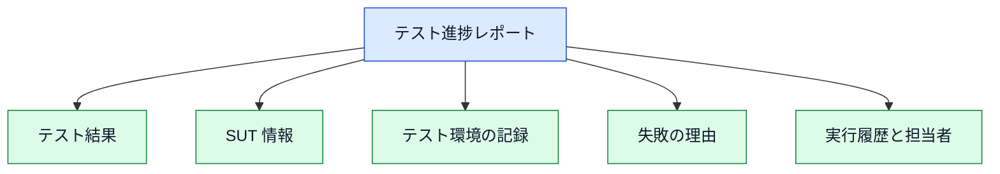

### 4.3 レポートの作成から公開までの流れ

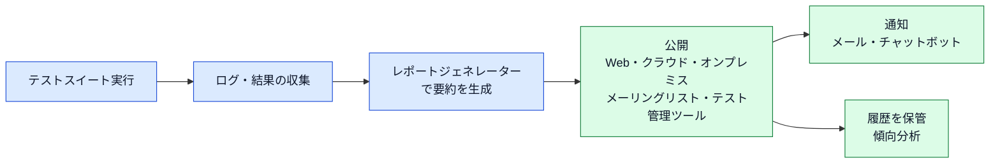

| 公開の選択肢 | 補足 |
|---|---|
| Web サイトへのアップロード | クラウド上でもオンプレミスでもよい |
| メーリングリストへの送信 | 購読者にメールで届く |
| 他ツールへのアップロード | テスト管理ツールなど |
| チャットへの投稿 | チャットボットによるメッセージ投稿。購読すれば、レポートがレビュー・分析される可能性が高まる |

**履歴の活用**：SUT の問題のある部分を特定し、テストレポートの履歴を保管すると、頻繁に回帰（リグレッション）するテストケースやテストスイートの統計を集めて**傾向分析**ができます。

### 4.4 関係者ごとの関心

シラバスは報告先を3種類に分けています。

| 区分 | 典型的な役割 | 主な関心 |
|---|---|---|
| 管理層（Management） | ソリューション／エンタープライズアーキテクト、プロジェクト／デリバリーマネージャー、プログラムマネージャー、テストマネージャー、テストディレクター | **傾向**：前回実行からの追加テストケース数、合否比率の変化、TAS と SUT の信頼性 |
| 運用層（Operational） | プロダクトオーナー／マネージャー、ビジネス担当者、ビジネスアナリスト | **製品の利用に関連するメトリクス** |
| 技術層（Technical） | チームリーダー、スクラムマスター、Web 管理者、DB 開発者／管理者、テストリーダー、TAE、テスター、開発者 | **低レベルの詳細** |

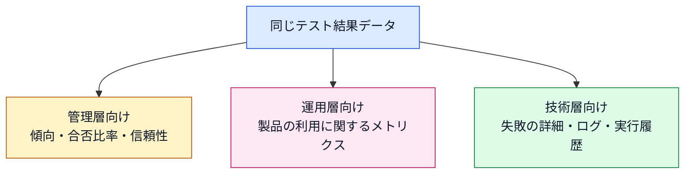

> 💡 **ベストプラクティス：受け手に合わせた出し分け**
> - 元になるデータは1つにして、**見せ方を受け手ごとに変える**（データの二重管理を避ける）。
> - 管理層向けは「信号機＋傾向グラフ」、技術層向けは「失敗テストの一覧＋ログ・スクリーンショットへのリンク」のように構成する。

### 4.5 ダッシュボード

最新のレポートツールは、ダッシュボード、カラフルなグラフ、詳細なログの収集、テストログの自動分析などを提供します。

| 項目 | 内容 |
|---|---|
| 集約できるデータ源 | パイプライン実行のテストログ、プロジェクト管理ツール、コードリポジトリなど |
| 見えるようになる傾向 | 欠陥のクラスター、特定のテスト環境への欠陥の伝播の増減、SUT の性能劣化、ビルドの信頼性 |
| 効果 | 関係者が傾向を見て判断できる |

### 4.6 AI／機械学習によるテストログ分析

近年、機械学習（ML）アルゴリズムを含む、またはそれに基づくテスト自動化ツールがあります。大量のテストログの自動分析は、TAE の次の作業時間を減らします。

| AI／ML が支援すること | 内容 |
|---|---|
| 壊れたロケーターの検出 | 探す時間の削減 |
| 失敗原因の分析 | SUT の欠陥か TAS の欠陥かの判別 |
| 共通の欠陥のグルーピング | テストレポート用の集約 |

> ⚠️ **注意**：AI の分析結果は「候補」として扱い、最終判断は TAE が根拠ログで確認する運用が安全です。（これは実務上の推奨であり、シラバスの記述ではありません。）

### 4.7 メトリクスの例（実務上の整理）

> ℹ️ シラバス第6章は具体的なメトリクス一覧を規定していません。以下は、シラバスの記述（合否比率、追加テストケース数、信頼性、性能劣化など）に沿った**実務上の例**です。

| メトリクスの例 | 何がわかるか | 主な受け手 |
|---|---|---|
| 合格率（pass rate）の推移 | 品質と変更の影響の傾向 | 管理層 |
| 前回実行からの追加テストケース数 | 自動化の進み具合 | 管理層 |
| TAS failure の割合 | TAS の信頼性 | 管理層、技術層 |
| 実行時間 | 自動テストの効率、規模の適正 | 技術層 |
| 頻繁に失敗するテスト（回帰の多いテスト） | 問題のある SUT 領域、またはテストの脆さ | 技術層 |
| 欠陥のクラスター | 欠陥が集中している領域 | 運用層、技術層 |

### 4.8 この節のベストプラクティス

| 対象 | ベストプラクティス |
|---|---|
| レポートの構成 | 結果、SUT 情報、環境情報を必ず含める |
| 担当者 | 各失敗の担当者を明確にし、起票から修正確認までのフォローを任せる |
| 公開 | 購読可能な形（メール、チャット、テスト管理ツール）で届ける |
| 履歴 | レポート履歴を保管し、傾向分析に使う |
| 出し分け | 管理層は傾向、運用層は利用メトリクス、技術層は詳細 |
| ダッシュボード | 複数のデータ源を集約して傾向を可視化 |
| AI／ML | ロケーター破損の検出や失敗のグルーピングに活用 |

---

## 5. 項目別ベストプラクティス総まとめ

### 5.1 サービス・機能別の使い分け（例）

> ℹ️ 以下のツール名は代表例です。試験ではツール名は問われません。導入前に各公式ドキュメントで最新の機能を確認してください。

| 目的 | 機能・ツールの例 | 使いどころ | 注意点 |
|---|---|---|---|
| テスト結果レポート（HTML） | Playwright の HTML レポーター、Allure Report | 人が読む詳細レポート | 保管先と公開方法を決める |
| CI 連携用の結果出力 | JUnit 形式の XML、JSON | CI/CD やテスト管理ツールへの取り込み | ツールが読める形式を事前確認 |
| 失敗時の証拠 | スクリーンショット、動画、トレース | 失敗の再現と原因分析 | 失敗時のみ保存にして容量を抑える |
| 失敗分析の補助（AI／ML） | ReportPortal など | 大量ログの分類、失敗傾向の把握 | 判定は根拠ログで検証する |
| ダッシュボード | Grafana など | 傾向の可視化 | データ源と更新頻度を明確にする |
| 分散追跡 | W3C Trace Context に沿った `traceparent` ヘッダー、OpenTelemetry | TAS ログと SUT ログの突き合わせ | SUT 側も ID をログに出す必要がある |

### 5.2 6.1.1〜6.1.3 横断のチェックリスト

| フェーズ | 確認事項 |
|---|---|
| 収集 | ログ、証拠、時刻、ID が失敗調査に十分か |
| 分析 | 一次データ→二次データの順で、SUT・TAS・環境を切り分けられるか |
| 報告 | 受け手に合った粒度か。履歴は保管されているか |
| 自動化の信頼性 | TAS failure を分けて集計しているか。結果の合否判定は正しいか |

### 5.3 他の章との関係

| 関連する章 | 関係 |
|---|---|
| 第3章 アーキテクチャ | レイヤー構造に記録機能を組み込む（gTAA のテスト実行にロギング・レポート機能が含まれる） |
| 第4章 実装 | ログレベル、テスト構造化（フィクスチャ）、パッケージング |
| 第5章 CI/CD | パイプラインのビルドログ・デプロイログ、パイプライン内のテスト結果 |
| 第7章 TAS の検証 | ログやレポートが正確な情報を出しているかの検証 |
| 第8章 継続的改善 | 収集データを基にした改善（テストヒストグラム等） |

---

## 6. 試験対策ポイントと確認問題

### 6.1 K レベル別の出題イメージ

| LO | K レベル | 問われ方のイメージ |
|---|---|---|
| 6.1.1 | K3（適用） | シナリオを与えられ、「どのデータ源から」「どの情報をログに記録するか」を選ぶ |
| 6.1.2 | K4（分析） | ログや状況から、原因が SUT・TAS・環境のどこにあるかを推論する |
| 6.1.3 | K2（理解） | レポートの内容、受け手ごとの関心、公開方法を説明できるか |

### 6.2 覚えておくべき要点

| 要点 | 内容 |
|---|---|
| 一次と二次 | TAS のデータが一次、SUT のデータが二次 |
| TAS failure | 欠陥が SUT にない状況に付けるステータス |
| 期待と実際が一致して失敗 | 多くは TAS の欠陥 |
| 全テスト失敗 | 環境停止を疑い、SUT ログで確認 |
| 相関 ID／トレース ID | 操作を追跡してさかのぼるための一意の ID |
| ログの同期 | タイムスタンプで各ログを同期 |
| レポートの受け手 | 管理層（傾向）、運用層（利用メトリクス）、技術層（詳細） |

### 6.3 確認問題

**問1**：あるテスト実行で、ほぼすべてのテストが同じ時間帯から一斉に失敗した。最初に確認すべきものとして最も適切なものはどれか。

- A. 各テストのアサーションをすべて書き直す
- B. SUT ログで、その時間帯にテスト環境の停止がなかったか確認する
- C. すべてのテストを欠陥として起票する
- D. レポートの色を変更する

<details>
<summary>解答と解説</summary>

**正解：B**。テスト環境が使えない（または一部だけ使えない）と、すべてのテストが失敗しうるとシラバスに記載があります。SUT ログで環境停止の有無を確認します。

</details>

**問2**：テスト失敗の分析で、実際の結果と期待結果が一致しているにもかかわらずテストが失敗していた。最も可能性が高い原因はどれか。

- A. SUT の欠陥
- B. TAS の欠陥、または見えない不一致
- C. ネットワークの遅延のみ
- D. レポートの公開先の誤り

<details>
<summary>解答と解説</summary>

**正解：B**。この場合、多くはテスト自動化ソリューション側に欠陥があるとされています。

</details>

**問3**：管理層のステークホルダーが特に関心を持つ情報として、シラバスの記述に最も合うものはどれか。

- A. 個々のテストステップの低レベルな実行ログ
- B. 前回実行からの追加テストケース数、合否比率の変化、TAS と SUT の信頼性といった傾向
- C. データベースのスキーマ定義
- D. IDE の設定ファイル

<details>
<summary>解答と解説</summary>

**正解：B**。管理層は傾向に注目します。詳細（A）は技術層の関心です。

</details>

**問4**：失敗を SUT ログと TAS のテストログで簡単に突き合わせるために、シラバスが挙げる方法はどれか。

- A. ログを手作業で印刷して照合する
- B. 各テストログのタイムスタンプを同期する
- C. すべてのログを1つのファイルに手で統合する
- D. Debug レベルのログを無効にする

<details>
<summary>解答と解説</summary>

**正解：B**。タイムスタンプでテストログを同期すると、失敗の報告時に何が起きたかを対応付けやすくなります。

</details>

**問5**：テスト進捗レポートが必ず含むべき内容の組み合わせとして正しいものはどれか。

- A. テスト結果、SUT 情報、テスト環境の記録
- B. ソースコード全体、ライセンス契約、給与情報
- C. 使用した IDE の一覧のみ
- D. テストケースの作成者の履歴書

<details>
<summary>解答と解説</summary>

**正解：A**。シラバスは、テスト結果、SUT 情報、テストを実行した環境の記録を、各関係者に適した形式で含めるとしています。

</details>

---

## 7. 学習チェックリスト

- [ ] 第6章のキーワード5語（measurement、metric、test log、test progress report、test step）を説明できる
- [ ] SUT ログ、TAF ログ、ビルドログ、デプロイログ、本番ログ、スクリーンショットの違いを説明できる
- [ ] 下位のテストウェアに記録機能を組み込む利点を説明できる
- [ ] passed／failed／TAS failure／inconclusive の違いを説明できる
- [ ] TAS ロギングで記録する内容を挙げられる
- [ ] SUT ロギングで押さえる内容とタイムスタンプ同期の意義を説明できる
- [ ] 一次データ（TAS）と二次データ（SUT）の違いを説明できる
- [ ] 失敗分析の5ステップを順に言える
- [ ] 「期待と実際が一致しているのに失敗」「全テスト失敗」の原因を説明できる
- [ ] 相関 ID（トレース ID）の役割を説明できる
- [ ] テスト進捗レポートの必須内容と公開方法を説明できる
- [ ] 管理層・運用層・技術層の関心の違いを説明できる
- [ ] ダッシュボードと AI／ML 分析の役割を説明できる

---

## 8. 参考文献・ソース URL

### 8.1 一次情報（試験の根拠）

| 資料 | URL | 備考 |
|---|---|---|
| ISTQB CTAL-TAE v2.0 認定ページ | https://istqb.org/certifications/certified-tester-advanced-level-test-automation-engineering-ctal-tae-v2-0/ | 試験の公式ページ |
| ISTQB CTAL-TAE Syllabus v2.0（PDF） | https://istqb.org/wp-content/uploads/2024/11/ISTQB_CTAL-TAE_Syllabus_v2.0.pdf | 第6章は p.37〜p.42。本ガイドの根拠 |
| ISTQB Glossary | https://glossary.istqb.org/ | 用語の公式定義の確認用 |

### 8.2 シラバスが参照する関連シラバス（章内の言及）

| 関連シラバス | 言及箇所 | URL |
|---|---|---|
| CT-PT（Performance Testing） | 6.1.1 本番でのパフォーマンス監視 | https://istqb.org/ |
| CT-AI（AI Testing） | 6.1.3 AI／ML によるテストログ分析 | https://istqb.org/ |

> ℹ️ 上記2つは、ISTQB 公式サイトのトップから該当シラバスを検索して確認してください。

### 8.3 補足資料（実務の例に関する参考情報。試験範囲外）

| 資料 | URL | 本ガイドでの用途 |
|---|---|---|
| W3C Trace Context | https://www.w3.org/TR/trace-context/ | `traceparent` ヘッダーの形式 |
| OpenTelemetry ドキュメント | https://opentelemetry.io/docs/ | 分散トレースの一般情報 |
| Playwright Test Reporters | https://playwright.dev/docs/test-reporters | レポーター設定の例 |
| Playwright Trace Viewer | https://playwright.dev/docs/trace-viewer | 失敗時のトレース収集の例 |
| Allure Report ドキュメント | https://allurereport.org/docs/ | HTML レポートツールの例 |
| ReportPortal | https://reportportal.io/ | AI／ML を活用した結果分析ツールの例 |
| Grafana ドキュメント | https://grafana.com/docs/ | ダッシュボードツールの例 |

---

*本ガイドは、ISTQB® CTAL-TAE v2.0 シラバス第6章の内容を初学者向けに整理した学習補助資料です。ISTQB® は International Software Testing Qualifications Board の登録商標です。試験の出題範囲・正式な定義は、必ず公式シラバスで確認してください。実務上の整理や外部ツールの例は、シラバスの記述ではない旨を各所に明記しています。*
