# CTAL-TAE v2.0 第7章「Verifying the Test Automation Solution」初学者向けガイド

> **対象試験**：ISTQB Certified Tester Advanced Level Test Automation Engineering (CTAL-TAE) v2.0
> **対象シラバス**：Syllabus Version 2.0（2024/05/03 リリース）第7章（135分・K3）
> **作成日**：2026-09-28
> **読者**：テスト自動化の経験が浅い方、初めて Advanced Level を受験する方

---

## 目次

1. [この章の全体像](#1-この章の全体像)
2. [前提知識と用語の整理](#2-前提知識と用語の整理)
3. [7.1.1 テスト自動化環境（ツールのセットアップを含む）の検証を計画する（K3）](#3-711-テスト自動化環境ツールのセットアップを含むの検証を計画するk3)
4. [7.1.2 自動テストスクリプト／スイートの正しい振る舞いを説明する（K2）](#4-712-自動テストスクリプトスイートの正しい振る舞いを説明するk2)
5. [7.1.3 テスト自動化が予期しない結果を出す箇所を特定する（K2）](#5-713-テスト自動化が予期しない結果を出す箇所を特定するk2)
6. [7.1.4 静的解析がテスト自動化コードの品質向上にどう役立つか（K2）](#6-714-静的解析がテスト自動化コードの品質向上にどう役立つかk2)
7. [ベストプラクティス総まとめ](#7-ベストプラクティス総まとめ)
8. [試験対策ポイント](#8-試験対策ポイント)
9. [確認問題（解答付き）](#9-確認問題解答付き)
10. [用語集](#10-用語集)
11. [参考URL（根拠ソース）](#11-参考url根拠ソース)

---

## 1. この章の全体像

### 1.1 この章で学ぶこと

第7章のテーマは「**自動テストの仕組みそのもの（TAS）が正しく動いていることを、どう確かめるか**」です。

テストは SUT（テスト対象システム）の品質を測る道具です。ところが道具自体が壊れていると、次のような事態になります。

- SUT は正常なのに、テストが失敗する（誤った失敗）
- SUT に不具合があるのに、テストが成功する（見逃し）
- 実行のたびに結果が変わり、誰もテスト結果を信用しなくなる

つまり「テストを信頼できる状態に保つための検証」がこの章の中心です。

### 1.2 学習目標（Learning Objectives）

| LO 番号 | 認知レベル | 内容 | 本ガイドの節 |
|---|---|---|---|
| TAE-7.1.1 | K3（適用） | テスト自動化環境（テストツールのセットアップを含む）を検証する計画を立てる | 3 |
| TAE-7.1.2 | K2（理解） | 自動テストスクリプト／スイートの正しい振る舞いを説明する | 4 |
| TAE-7.1.3 | K2（理解） | テスト自動化が予期しない結果を出す箇所を特定する | 5 |
| TAE-7.1.4 | K2（理解） | 静的解析がテスト自動化コードの品質にどう役立つかを説明する | 6 |

> 章のキーワード（試験で必ず覚える用語）：**static analysis（静的解析）**

### 1.3 全体マップ

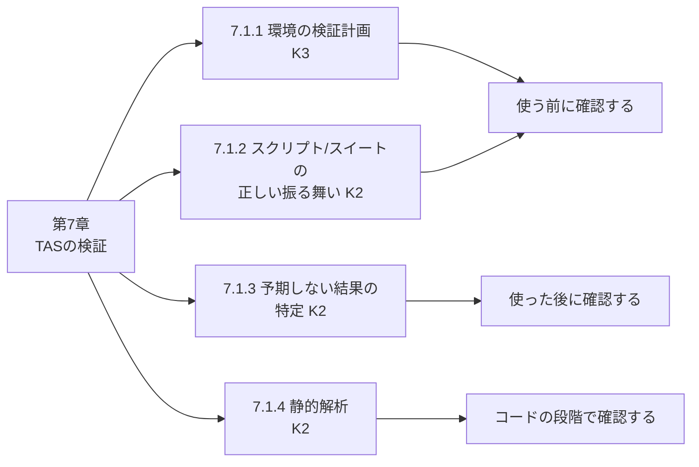

| 観点 | 対応する LO | 検証のタイミング |
|---|---|---|
| 環境とツール | 7.1.1 | 自動テストを始める前 |
| テストスイートの中身 | 7.1.2 | スイートを実行可能にする前・新機能を使う初回 |
| 結果の妥当性 | 7.1.3 | 実行して、想定外の合否が出たとき |
| コードの品質 | 7.1.4 | コミット・ビルドなど開発の早い段階 |

---

## 2. 前提知識と用語の整理

第7章は、第3章（アーキテクチャ）と第6章（レポートとメトリクス）の知識を前提にします。最低限の用語を押さえましょう。

| 用語 | 意味 | 第7章での関わり |
|---|---|---|
| SUT（System Under Test） | テスト対象のシステム | 検証対象ではなく「テストされる側」 |
| TAS（Test Automation Solution） | 自動テストの解決策全体（ツール、フレームワーク、環境、アダプタなど） | この章で「検証する対象」 |
| TAF（Test Automation Framework） | TAS の土台。テストハーネス、テストライブラリ、スクリプト、スイートを含む | コンポーネントテストの対象 |
| TAA（Test Automation Architecture） | TAS の技術設計 | 環境の構成要素の前提 |
| テストウェア（testware） | テスト自動化で使う成果物一式（スクリプト、データ、設定など） | 完全性・バージョンの確認対象 |
| テストハーネス | テストを実行する仕組み（テストランナー） | セットアップ検証の対象 |
| TAE（Test Automation Engineer） | テスト自動化エンジニア | 検証を計画・実施する主役 |

### 2.1 「SUT のテスト」と「TAS の検証」の違い

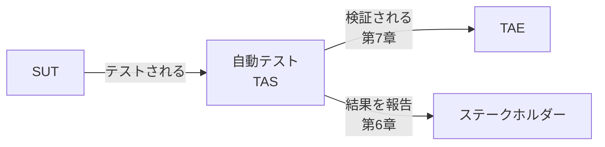

| 比較項目 | SUT のテスト | TAS の検証（第7章） |
|---|---|---|
| 目的 | SUT の不具合を見つける | 自動テストが信頼できることを確認する |
| 対象 | SUT の機能・非機能 | 環境、ツール、TAF、スクリプト、スイート |
| 失敗の意味 | SUT の欠陥の可能性 | TAS 自体の欠陥の可能性もある |

> 補足（第6章の復習）：テスト実行の状態には passed、failed に加えて **TAS failure（欠陥が SUT ではない失敗）** があり、組織として定義を統一する必要があります。第7章はこの「TAS failure をどう減らすか」を扱う章と捉えると理解しやすくなります。

---

## 3. 7.1.1 テスト自動化環境（ツールのセットアップを含む）の検証を計画する（K3）

### 3.1 なぜ環境の検証が必要か

シラバスは、TAS の環境やコンポーネントが期待どおり動くかは**必ず検証が必要**で、これらのチェックは例えば**テスト自動化を始める前**に行うと述べています。K3（適用）なので、「用語を知っている」だけでなく、**与えられた状況に対して検証計画を組み立てられること**が求められます。

シラバスが挙げる検証の観点は次の4つです。

| # | 検証観点（シラバスの見出し） | 一言でいうと |
|---|---|---|
| 1 | テストツールのインストール、セットアップ、構成、カスタマイズ | ツールが正しく入り、正しく設定されているか |
| 2 | テスト環境のセットアップ／ティアダウンの再現性 | 何度作り直しても同じ状態になるか |
| 3 | 内部・外部システム／インターフェースとの接続性 | SUT や周辺システムにつながるか |
| 4 | TAF コンポーネントのテスト | 自動化の部品自体にバグがないか |

### 3.2 検証の進め方（全体フロー）

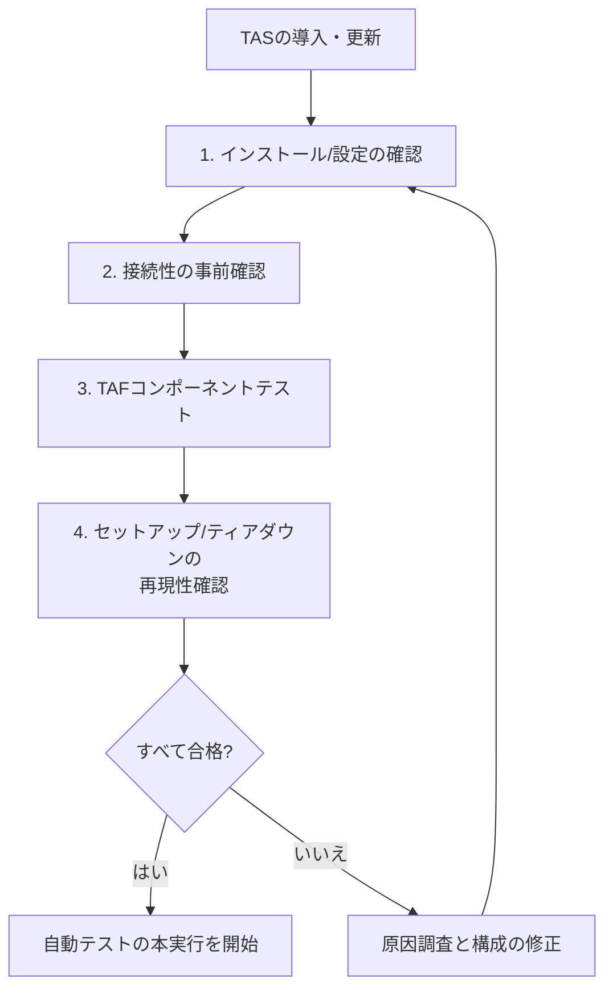

> 注意：上図は理解のための整理です。シラバスは4項目を列挙しており、番号順の実施を義務づけてはいません。実際には CI/CD パイプラインに組み込み、環境を作るたびに繰り返し実行します。

### 3.3 観点1：テストツールのインストール・セットアップ・構成・カスタマイズ

#### 何を確認するか

TAS は多くのコンポーネントで構成されます。シラバスは、中核として次を挙げています。

- 実行可能コンポーネント
- 対応する関数ライブラリ
- 支えるデータ・設定ファイル

セットアップの方法は「自動インストールスクリプト」から「手作業でフォルダにファイルを置く」まで幅があります。また、テストツールも OS などと同様にサービスパックがあったり、SUT 環境との互換性のために**オプションまたは必須のアドイン**が必要だったりします。

#### 自動インストールやリポジトリからのコピーの利点

| 利点 | 説明 |
|---|---|
| 同一バージョンの保証 | 異なる SUT でのテストを、同じバージョンの TAS で実施したことを担保できる |
| 同一構成の保証 | 同じ TAS 構成で実施したことを担保できる（適切な場合） |
| アップグレードの一元化 | TAS のアップグレードをリポジトリ経由で行える |

シラバスは、リポジトリの使い方と新バージョンへのアップグレード手順を**標準的な開発ツールと同じにすべき**としています。

#### 具体例（補足）

以下は理解のための例です（シラバスの記述ではありません）。

| やりたいこと | 手段の例 |
|---|---|
| ツールのバージョンを固定する | 依存関係のロックファイル（package-lock.json、requirements.txt にバージョン固定など） |
| ブラウザとドライバの組み合わせを揃える | コンテナイメージにブラウザとドライバを同梱し、イメージのタグで固定する |
| 設定を環境ごとに切り替える | 環境変数や設定ファイルを環境別に用意し、リポジトリで管理する |

> 💡 **ベストプラクティス（インストール・構成）**
> - TAS のバージョンと構成をリポジトリで管理し、手作業のインストールを避ける
> - 「ツールのバージョン」「アドインの有無」「設定値」を一覧にして文書化する
> - アップグレードは開発ツールと同じ手順（レビュー、段階的展開）で行う

### 3.4 観点2：テスト環境のセットアップ／ティアダウンの再現性

#### 何を確認するか

TAS は、さまざまなシステム、サーバー、そして CI/CD パイプラインの上で動きます。どの環境でも正しく動くために、TAS を**環境へ読み込み、取り除く体系的な方法**が必要です。

シラバスは、この再現性が達成された状態を、**TAS を構築・再構築しても、複数のテスト環境の内外で動作に目立った差がないこと**と説明しています。

| 達成すべきこと | シラバスの根拠 |
|---|---|
| 構成管理で「決まった構成を確実に作れる」ようにする | TAS コンポーネントの構成管理により、所定の構成を確実に作成できる |
| コンポーネントを文書化する | SUT 環境が変わったとき、TAS のどこに影響し、どこを変える必要があるかが分かる |

#### 再現性の確認方法（補足）

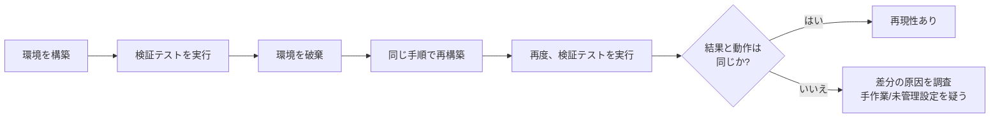

「手順書どおり」ではなく、**スクリプトなどで機械的に何度でも作り直せる**状態が理想です。差が出る原因の多くは、手作業の設定、バージョンを固定していない依存関係、環境に残った前回のデータです。

> 💡 **ベストプラクティス（再現性）**
> - 環境の構築と破棄を自動化し、毎回同じ手順で実行する
> - 「作って壊して作り直す」を実際に試して、結果の差を確認する
> - 環境に依存する値（URL、認証情報など）はコードに埋め込まず、構成管理する

### 3.5 観点3：内部・外部システム／インターフェースとの接続性

#### 何を確認するか

TAS を SUT 環境にインストールしたら、SUT を使う前に、内部システム、外部システム、インターフェースへの接続が可能かを確認する**一連のチェック（事前条件）**を実施します。シラバスは次を良い習慣として挙げています。

| チェック項目 | 内容 |
|---|---|
| サーバーへのログイン | 必要なサーバーにログインできる |
| ツールの起動 | テスト自動化ツールを起動できる |
| SUT へのアクセス | ツールから SUT にアクセスできる |
| 設定の目視確認 | 構成設定を手動で確認する |
| 権限の確認 | テストログとテストレポートを、システム間で出力・共有するための権限が正しい |

シラバスは、このように**テスト自動化の事前条件を確立することが、TAS が正しくインストール・構成されたことを保証するために不可欠**だと述べています。

#### 事前チェックの流れ（補足）

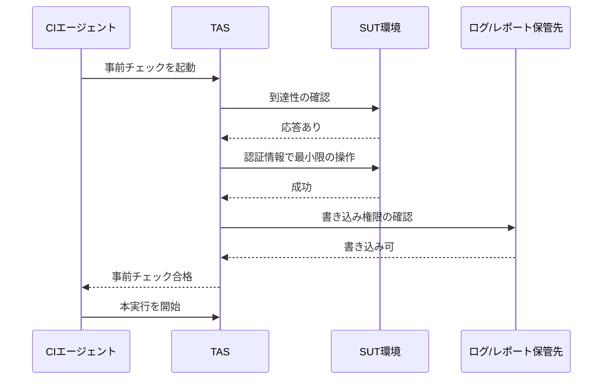

#### コード例（補足）：pytest による事前チェック

```python
# conftest.py — 本実行の前に一度だけ実行する事前チェックの例
import os
import pathlib
import tempfile
from urllib.parse import urlsplit

import pytest
import requests

REPORT_DIR = pathlib.Path(os.environ.get("REPORT_DIR", "reports"))


@pytest.fixture(scope="session", autouse=True)
def preflight_check():
    """接続性と権限を確認し、失敗したら本実行を中止する。"""
    # 1. 必須の環境変数（未設定でも import 時に KeyError にならないよう、ここで確認してから読む）
    for name in ("SUT_BASE_URL", "TEST_USER", "TEST_PASSWORD"):
        assert os.environ.get(name), f"環境変数 {name} が未設定です"
    base_url = os.environ["SUT_BASE_URL"]           # 環境ごとに切り替える

    # 2. SUT への到達性（ヘルスチェック用エンドポイントを想定）
    res = requests.get(f"{base_url}/health", timeout=10)
    assert res.status_code == 200, "SUT に到達できません"

    # 3. 認証の確認（認証が必要な API へ最小限のリクエストを送る。/api/me は想定のエンドポイント）
    #    Basic 認証は資格情報を平文（Base64）で送るため、HTTPS 以外の URL には送信しない
    if urlsplit(base_url).scheme != "https":
        pytest.fail("SUT_BASE_URL は https:// で指定してください（資格情報を平文で送らないため）")
    auth = (os.environ["TEST_USER"], os.environ["TEST_PASSWORD"])
    #    リダイレクトを追跡すると、認証情報が意図しない送信先へ渡るおそれがあるため無効にする
    res = requests.get(f"{base_url}/api/me", auth=auth, timeout=10, allow_redirects=False)
    assert res.status_code == 200, f"TEST_USER で認証できません（status={res.status_code}）"

    # 4. ログ・レポートの書き込み権限（一意な一時ファイルを使い、既存ファイルを上書き・削除しない）
    REPORT_DIR.mkdir(parents=True, exist_ok=True)
    with tempfile.NamedTemporaryFile(dir=REPORT_DIR, prefix=".write_probe_") as probe:
        probe.write(b"ok")
        probe.flush()
```

事前チェックが失敗したときに、個々のテストが大量に失敗する状況を避けられます。これは第6章で学んだ「テスト環境が利用できないと、すべてのテストが同じ原因で失敗する、または一部が本物の失敗のように見える」問題への対策にもなります。

#### CI/CD での組み込み例（補足）

```yaml
# .github/workflows/e2e.yml（抜粋）
jobs:
  preflight:
    runs-on: ubuntu-latest
    steps:
      - uses: actions/checkout@v4
      - run: pytest tests/preflight -q     # 接続性・設定の確認のみ

  e2e:
    needs: preflight                        # 事前チェックが通ったときだけ本実行
    runs-on: ubuntu-latest
    steps:
      - uses: actions/checkout@v4
      - run: pytest tests/e2e
```

> 💡 **ベストプラクティス（接続性）**
> - 本実行の前に「事前チェック専用のジョブまたはテスト」を置き、失敗したら本実行を止める
> - 到達性、認証、権限、ログ出力先の書き込みを最小限の操作で確認する
> - 事前チェックの結果もログに残し、環境障害とテスト失敗を切り分けやすくする

### 3.6 観点4：TAF コンポーネントのテスト

#### 何を確認するか

TAS も一種のソフトウェア開発です。シラバスは、**TAF の各コンポーネントも、通常の開発プロジェクトと同様に個別にテスト・検証する**必要があると述べています。機能テストだけでなく、非機能テストも対象です。

| 種類 | 例（シラバスの記述に基づく） |
|---|---|
| 機能テスト | GUI のオブジェクト検証コンポーネントを、幅広いオブジェクトクラスでテストし、正しく検証できることを確認する |
| 機能テスト | テストログとテストレポートが、テスト自動化の状態と SUT の振る舞いを正確に出力することを確認する |
| 非機能テスト | TAF の性能劣化を把握する |
| 非機能テスト | システムリソースの使用状況から、メモリリークなどの欠陥の兆候を見つける |
| 非機能テスト | TAF 内外のコンポーネント間の相互運用性の欠如を確認する |

#### 具体例（補足）

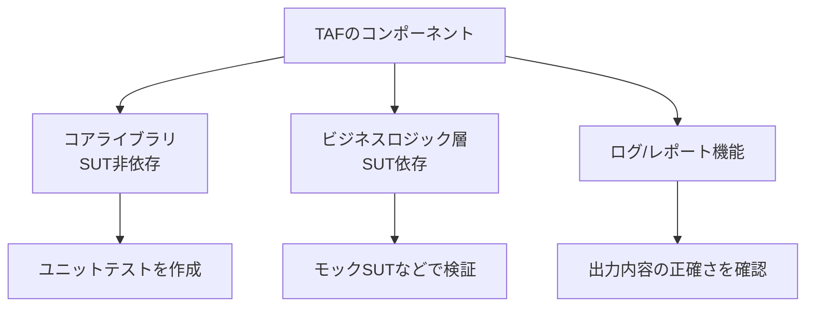

> 💡 **ベストプラクティス（TAF コンポーネントテスト）**
> - コアライブラリ（SUT に依存しない部品）には単体テストを書き、ビルドのたびに実行する
> - 検証用の関数（オブジェクト検証など）は、代表的な複数パターンで動作を確認する
> - 長時間の実行でメモリ使用量が増え続けないか、性能が劣化しないかも観察する
> - ログとレポートの出力内容は、期待するステータス（passed、failed、TAS failure）と一致するかを確認する

### 3.7 K3 として試験に出やすい形

K3 は「適用」なので、シナリオ問題が出ます。次のように考えると整理できます。

| シナリオの手がかり | 対応する観点 |
|---|---|
| 「新しいテストサーバーに TAS を配置した」 | インストール・構成、接続性 |
| 「環境を再構築したら挙動が違った」 | 再現性（構成管理・文書化） |
| 「実行前にどのチェックを入れるか」 | 接続性の事前条件（ログイン、ツール起動、SUT アクセス、権限） |
| 「自動化ライブラリの部品が怪しい」 | TAF コンポーネントテスト（機能・非機能） |

---

## 4. 7.1.2 自動テストスクリプト／スイートの正しい振る舞いを説明する（K2）

### 4.1 何を確認するか

自動テストスイートは、**網羅性、一貫性、正しい振る舞い**についてテストされる必要があります。シラバスは、スイートがいつでも使える状態にあること、または使用に適していることを判断するために、次の検証を挙げています。

| # | 検証項目 | 要点 |
|---|---|---|
| 1 | テストスイートの構成を確認する | 網羅性と、TAF・SUT の正しいバージョン |
| 2 | TAF の新機能に焦点を当てた新しいテストを検証する | 初回は近くで監視する |
| 3 | テストの再現性を考慮する | 何度実行しても結果が同じか |
| 4 | 自動テストツールの侵入性を考慮する | ツールが SUT に与える影響 |

### 4.2 項目1：テストスイートの構成を確認する

シラバスは、**完全性**（例：すべてのテストケースに期待結果があり、テストデータが存在する）と、**TAF と SUT の正しいバージョン**を確認するとしています。

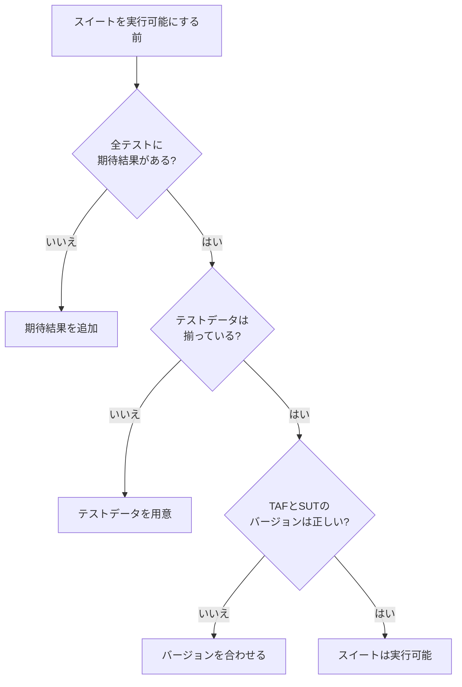

| 確認対象 | 具体例（補足） |
|---|---|
| 期待結果 | アサーション（検証コマンド）が各テストに入っている |
| テストデータ | 参照するファイル、DB のレコード、テストユーザーが存在する |
| バージョン | ブランチやタグで、テストウェアと SUT のバージョンが対応している |

> 補足：第5章で学んだように、テストウェアを SUT と同じバージョンでリリースし、タグやブランチで管理すると、SUT のバージョンと検証できるテストの対応が明確になります。

### 4.3 項目2：TAF の新機能に焦点を当てた新しいテストの検証

TAF の新機能を**初めてテストケースで使うとき**は、その機能が正しく動いているかを確認し、**綿密に監視**します。

| 場面（補足） | 監視のしかた |
|---|---|
| 新しい待機ヘルパー関数を初めて使う | ログで待機時間と結果を確認し、意図どおりに動くか見る |
| 新しいレポート出力機能を追加 | 出力内容を手作業のテスト結果と照合する |
| ツールのメジャーアップグレード後 | 代表的なサンプルテストで先に動作を確認する |

### 4.4 項目3：テストの再現性（Repeatability）

シラバスは、テストを繰り返したときは**結果が常に同じ**であるべきだと述べています。**信頼できない結果を返すテストケース**（例：競合状態が原因）は、アクティブな自動テストスイートから**外して**、根本原因を別に分析します。外さないと、同じ失敗の分析に何度も時間を使うことになるからです。

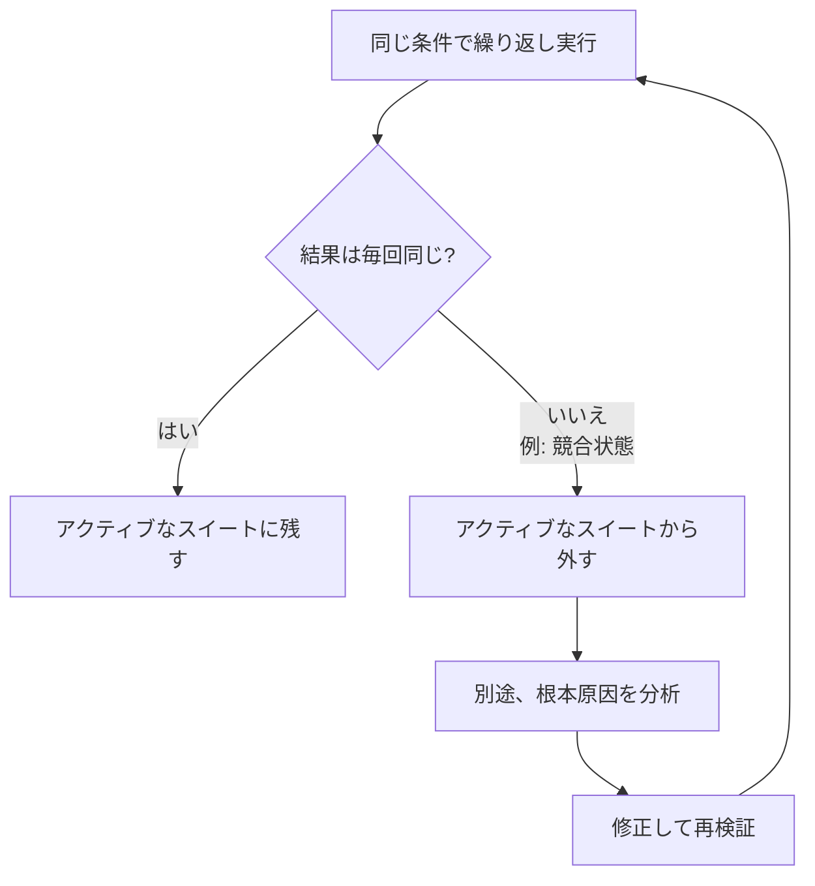

#### コード例（補足）：不安定なテストの隔離

```ini
# pytest.ini
[pytest]
markers =
    quarantine: 不安定で原因調査中のテスト（通常のスイートから除外する）
```

```python
import pytest

@pytest.mark.quarantine   # 原因調査中。チケット番号などを理由に書く
def test_order_status_updates_after_payment():
    ...
```

```bash
# 通常のパイプライン：隔離したテストを除外して実行
pytest -m "not quarantine"

# 調査用：隔離したテストだけを繰り返し実行して再現条件を探る
pytest -m quarantine --count=20   # 繰り返し実行するプラグインが必要
```

> 注意：リトライで「たまたま成功すれば合格」にしてしまうと、不安定さの原因を隠すことになります。リトライを使う場合も、リトライが発生した事実をレポートに残しましょう。
>
> 💡 **ベストプラクティス（再現性）**
> - 不安定なテストは放置せず、隔離して原因を調査し、直したらスイートに戻す
> - 隔離の理由・担当者・期限を記録し、隔離したまま忘れない
> - 固定の待機ではなく、状態を確認する待機を使う（詳細は第8章の待機メカニズム）

### 4.5 項目4：自動テストツールの侵入性（Intrusiveness）

シラバスは次のように説明しています。

- TAS は SUT と**密結合**になりがち。これは互換性や連携レベルを高めるために意図的な設計でもある
- しかし密接な統合は**悪影響**も生む。例えば TAS が SUT 環境の内側にあると、手動テストのときと SUT の機能が異なる可能性があり、性能にも影響しうる
- 侵入の度合いが高いと、**本番では見られない失敗**がテストで現れることがある。その失敗で自動テストが失敗すると、**TAS への信頼が大きく低下**する
- 開発者から、自動テストが見つけた失敗を**手動で再現**するよう求められることがある

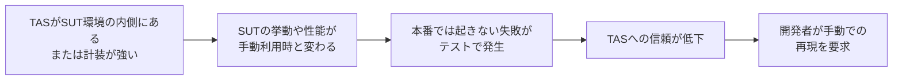

#### 侵入性の例と対策（補足）

| 侵入性の例（補足） | 起こりうる影響 | 対策の例 |
|---|---|---|
| テスト用のフックや計装コードが SUT に入っている | 本番にはない挙動や遅延 | 侵入の範囲を最小にし、影響を把握する |
| TAS が SUT と同じサーバーで動く | CPU、メモリの取り合い | TAS の実行環境を分離する |
| 詳細すぎるログを常時出力する | I/O 負荷で性能が変わる | ログレベルを調整する（Debug、Trace は調査時のみ） |

> 補足：ログレベル（Fatal、Error、Warn、Info、Debug、Trace）は第4章で学んだ内容です。
>
> 💡 **ベストプラクティス（侵入性）**
> - TAS を SUT から分離できるなら分離し、侵入の度合いを意識して設計する
> - 自動テストで見つけた失敗は、可能なら手動でも再現できるか確認してから報告する
> - 侵入によって生じた失敗と、本物の欠陥を区別できるよう、環境情報をレポートに残す

---

## 5. 7.1.3 テスト自動化が予期しない結果を出す箇所を特定する（K2）

### 5.1 何を確認するか

テストスクリプトが**予期せず失敗したり、予期せず成功したり**したときは、根本原因分析（root cause analysis）を行わなければなりません。シラバスは、次を確認するとしています。

| 確認対象 | 内容 |
|---|---|
| テストログ | テストケース、SUT、TAF それぞれのログ |
| 性能データ | 実行時の性能に異常がないか |
| セットアップとティアダウン | テストスクリプトの前後処理が正しく動いたか |

### 5.2 「予期しない」は失敗だけではない

多くの初学者が見落とす点として、**予期せず成功するテスト**も調査対象です。

| 現象 | 例 | 危険性 |
|---|---|---|
| 予期しない失敗 | SUT は正常なのにテストが失敗する | 無駄な調査、信頼の低下 |
| 予期しない成功 | SUT に不具合があるのにテストが成功する | 不具合の見逃し |

シラバスは、**アサーションがすべて入っているかを確認する**こと、そして**アサーションが欠けていると結論が出ない（inconclusive）テスト結果になりうる**ことを述べています。

#### コード例（補足）：アサーションが欠けたテスト

```python
# NG: 例外が起きなければ「成功」になる。何も検証していない
def test_create_user_bad(api):
    api.post("/users", json={"name": "alice"})

# OK: 期待結果を明示的に検証している
def test_create_user_good(api):
    res = api.post("/users", json={"name": "alice"})
    assert res.status_code == 201
    assert res.json()["name"] == "alice"
```

### 5.3 不具合が潜みうる場所

シラバスは、不具合の場所として次の5つを挙げています。

| 不具合の場所 | 例（補足） |
|---|---|
| テストケース | 期待値の誤り、アサーション不足、データ依存 |
| SUT | 本物の欠陥 |
| TAF | ヘルパー関数のバグ、ドライバとの不整合 |
| ハードウェア | 実機の電源・バッテリー、リソース不足 |
| ネットワーク | 遅延、切断、ファイアウォール |

### 5.4 調査の進め方

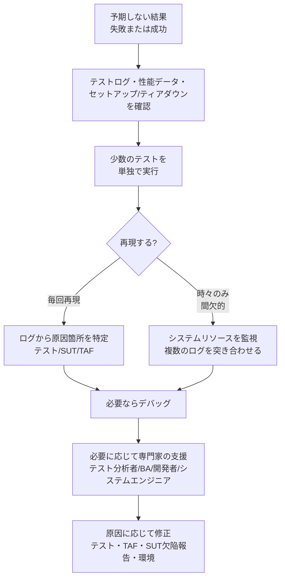

シラバスに基づく要点は次のとおりです。

| 手段 | 説明 |
|---|---|
| いくつかのテストを単独で実行する | 他のテストの影響を排除して切り分ける |
| 間欠的な失敗は分析が難しい | 再現条件が不明なため、特に注意が必要 |
| システムリソースを監視する | 根本原因の手がかりになりうる |
| テストケース・SUT・TAF のログを分析する | 欠陥の根本原因の特定を助ける |
| デバッグ | 必要になる場合がある |
| 他の役割の支援 | テスト分析者、ビジネスアナリスト、開発者、システムエンジニアの協力が必要になりうる |

#### 第6章の分析手順との関係

第6章の 6.1.2 は、失敗を分析する5ステップ（過去の失敗の確認、テストケースの特定、失敗したステップの特定、SUT の状態の確認、欠陥の記録）を示していました。第7章の 7.1.3 は、その考え方を「TAS の検証」という視点で広げたものです。

| 場面 | 第6章（結果の分析） | 第7章（TAS の検証） |
|---|---|---|
| 主な問い | この失敗は SUT の欠陥か、TAS の欠陥か | 予期しない合否の原因はどこにあるか |
| 見る対象 | TAS のデータが主、SUT のデータが副 | テスト、SUT、TAF、ハードウェア、ネットワーク |

> 💡 **ベストプラクティス（予期しない結果の調査）**
> - 失敗と同様に「予期しない成功」も調査対象にする
> - 失敗時にはログ、スクリーンショット、スタックトレースなど、後の分析に必要な情報を自動で保存する
> - 間欠的な失敗は、テストログ、SUT のログ、TAF のログを時刻で突き合わせる
> - 調査結果は、テストの修正、TAF の修正、SUT の欠陥報告、環境の修正のどれにあたるか区別して記録する

---

## 6. 7.1.4 静的解析がテスト自動化コードの品質向上にどう役立つか（K2）

### 6.1 静的解析とは

シラバスは、**静的コード解析（static code analysis）**は、プログラムコードの**脆弱性や欠陥を見つける**のに役立つと述べています。対象は **SUT だけでなく TAF も含みます**。

| 項目 | 説明 |
|---|---|
| 仕組み | 自動スキャンでコードを検査し、リスクを減らす |
| 位置づけ | 事前（プロアクティブ）な欠陥検出技術 |
| DevSecOps | セキュリティを重視した DevOps において重要な役割を果たす |
| 実行タイミング | SDLC の早い段階、パイプライン内で実行し、開発チームにすぐフィードバックを返す |

> 静的解析は、コードを**実行せずに**検査する点が特徴です。テストの実行結果を待たずに問題を見つけられます。

### 6.2 静的解析の出力と支援機能

| シラバスの記述 | 意味 |
|---|---|
| 欠陥は重大度で分類される（critical、high、medium、low） | 開発チームが修正の優先順位を決められる |
| 修正案を提示するツールもある | 問題のあるコード行と、可能な修正例を見せてくれる |
| TAE を支援する機能 | 品質の測定、コメントを付けるべき箇所の提案、リソース処理を最適化する設計改善（try/catch ブロックの活用、より良いループ構造）、不適切なライブラリ呼び出しの除去 |

### 6.3 なぜ「テスト自動化コード」にも静的解析が必要か

テスト自動化ツールはプログラミング言語を使うため、**不適切なテスト自動化コードが SDLC に持ち込まれるリスク**があります。

シラバスの例：テスト自動化ではユーザー名とパスワードを使うことが多く、TAE が誤って**パスワードを平文のまま**1つまたは複数のテストスクリプトに書いてしまうことがありえます。

| 誤解しやすい点 | 正しい理解（シラバス） |
|---|---|
| 「テストコードは製品にデプロイされないので安全」 | デプロイされなくても、付随する自動テストスクリプトからパスワードが見つかれば脆弱性になりうる |
| 「静的解析は SUT のコードだけが対象」 | TAF や、テスト自動化コードにもスキャンを広げるのが重要（TAE の責務） |

#### コード例（補足）：認証情報の扱い

```python
# NG: パスワードの平文をコードに埋め込んでいる（静的解析や秘密情報スキャンで検出したい）
def login_bad(driver):
    driver.find_element("id", "user").send_keys("test_admin")
    driver.find_element("id", "password").send_keys("P@ssw0rd-1234")


# OK: 実行環境から取得する（CI のシークレットや環境変数）
import os

def login_good(driver):
    driver.find_element("id", "user").send_keys(os.environ["TEST_USER"])
    driver.find_element("id", "password").send_keys(os.environ["TEST_PASSWORD"])
```

### 6.4 パイプラインへの組み込み

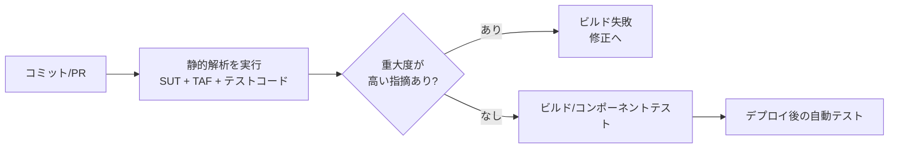

#### ツールの例（補足：シラバスには記載のない一般的な例）

| 目的 | ツール例 |
|---|---|
| コード品質・保守性の解析 | SonarQube、ESLint（JavaScript）、Pylint や Ruff（Python） |
| セキュリティ上の問題の検出 | Semgrep など |
| 秘密情報（パスワード、トークン）の検出 | Gitleaks、TruffleHog、GitHub の secret scanning |
| 整形（読みやすさの向上） | IDE のコードフォーマッター、Prettier、Black など |

> 💡 **ベストプラクティス（静的解析）**
> - SUT のコードだけでなく、TAF とテストスクリプトも同じスキャン対象にする
> - パイプラインの早い段階で実行し、プルリクエストの時点でフィードバックを返す
> - 重大度（critical、high、medium、low）に基づき、失敗にする基準（ゲート）を決める
> - 認証情報は環境変数やシークレット管理に移し、秘密情報の検出も併用する
> - フォーマッターで書き方を揃え、可読性と保守性を高める（第4章のクリーンコード原則とも一致）

---

## 7. ベストプラクティス総まとめ

| 対象 | ベストプラクティス | 根拠となる章・項目 |
|---|---|---|
| ツール導入 | バージョンと構成をリポジトリで管理し、自動インストールを使う | 7.1.1 |
| 環境の構築 | 構築・再構築を自動化し、差が出ないことを確認する | 7.1.1 |
| 接続性 | 本実行の前に、到達性・認証・権限の事前チェックを実施する | 7.1.1 |
| TAF の部品 | 機能テストと非機能テスト（性能、メモリ、相互運用性）を行う | 7.1.1 |
| スイート構成 | 期待結果、テストデータ、TAF と SUT のバージョンの完全性を確認する | 7.1.2 |
| 新機能 | TAF の新機能の初回利用は綿密に監視する | 7.1.2 |
| 再現性 | 不安定なテストは外して原因分析し、直してから戻す | 7.1.2 |
| 侵入性 | TAS が SUT に与える影響を意識し、手動での再現確認を可能にする | 7.1.2 |
| 予期しない結果 | ログ、性能データ、前後処理を確認し、単独実行で切り分ける | 7.1.3 |
| アサーション | 欠けていないかを確認する | 7.1.3 |
| 静的解析 | テスト自動化コードにも適用し、パイプラインで早期に実行する | 7.1.4 |
| 秘密情報 | 平文のパスワードをコードに書かない | 7.1.4 |

---

## 8. 試験対策ポイント

### 8.1 出題の構造

| LO | 認知レベル | 問われやすい形 |
|---|---|---|
| 7.1.1 | K3 | 状況に対して、どの検証（インストール、再現性、接続性、TAF テスト）をどう計画するかを選ぶ |
| 7.1.2 | K2 | スイート検証の4項目、再現性、侵入性の説明 |
| 7.1.3 | K2 | 予期しない結果の原因箇所、調査方法、アサーション欠落 |
| 7.1.4 | K2 | 静的解析の目的、TAF にも適用する理由、平文パスワードの例 |

### 8.2 間違えやすいポイント

| ひっかけ | 正しい理解 |
|---|---|
| 検証対象は SUT だけ | 第7章は TAS（環境、ツール、TAF、スイート）自体の検証 |
| 静的解析は SUT のコード専用 | TAF やテスト自動化コードも対象 |
| テストコードは本番に出ないから秘密情報を書いてよい | 付随するスクリプトから漏れれば脆弱性になりうる |
| 不安定なテストはスイートに残して監視すればよい | アクティブなスイートから外して根本原因を別に分析する |
| 失敗したテストだけを調べればよい | 予期しない成功も根本原因分析の対象 |
| アサーションがなくてもテストは成功なので問題ない | アサーション欠落は inconclusive な結果につながりうる |
| 侵入性が高いのは自動化の宿命で、気にしなくてよい | 本番で見られない失敗を生み、TAS への信頼を下げる |
| 環境の検証は一度行えば十分 | 環境を作るたび、TAS を更新するたびに繰り返す（再現性の観点） |

### 8.3 暗記用チェックリスト

- [ ] 環境検証の4観点（インストール・構成、再現性、接続性、TAF コンポーネントテスト）を言える
- [ ] 接続性の事前条件（ログイン、ツール起動、SUT へのアクセス、設定の確認、権限）を言える
- [ ] スイート検証の4項目（構成、新機能、再現性、侵入性）を言える
- [ ] 不具合の場所の5つ（テストケース、SUT、TAF、ハードウェア、ネットワーク）を言える
- [ ] 静的解析の重大度（critical、high、medium、low）を言える
- [ ] 静的解析が DevSecOps で果たす役割を説明できる

---

## 9. 確認問題（解答付き）

> 試験形式の練習用に作成したオリジナル問題です（公式問題ではありません）。

**問1（K3）** 新しく用意した CI エージェントに TAS を配置した。本実行の前に実施すべき接続性の確認として、最も適切なものはどれか。

- A. 全テストを1回実行し、失敗数を数える
- B. サーバーへのログイン、ツールの起動、ツールから SUT へのアクセス、ログ・レポート出力の権限を確認する
- C. TAF のコードを静的解析にかける
- D. 手動テストの結果と比較する

<details>
<summary>解答と解説</summary>

**B**。シラバス 7.1.1 は、接続性の事前条件として、サーバーへのログイン、ツールの起動、SUT へのアクセス確認、設定の目視確認、テストログ・レポートの権限確認を挙げています。A は本実行そのものであり、事前確認ではありません。C は 7.1.4 の内容で、接続性とは別の観点です。

</details>

**問2（K2）** 「TAS を構築・再構築しても、複数のテスト環境の内外で動作に目立った差がない」状態を表す観点はどれか。

- A. 侵入性
- B. セットアップ／ティアダウンの再現性
- C. TAF コンポーネントテスト
- D. アサーションの網羅性

<details>
<summary>解答と解説</summary>

**B**。7.1.1 の「テスト環境のセットアップ／ティアダウンの再現性」の説明です。

</details>

**問3（K2）** 競合状態が原因で、実行するたびに結果が変わるテストケースへの対応として、シラバスに沿った説明はどれか。

- A. 成功するまでリトライして合格とする
- B. アクティブなスイートに残し、失敗のたびに分析する
- C. アクティブなスイートから外し、根本原因を別途分析する
- D. 削除して二度と使わない

<details>
<summary>解答と解説</summary>

**C**。7.1.2 は、信頼できない結果のテストは、アクティブな自動テストスイートから外して、根本原因を別に分析するとしています。B だと、同じ失敗の分析を繰り返すことになります。

</details>

**問4（K2）** 自動テストツールの「侵入性」が高い場合に起こりうることとして、正しいものはどれか。

- A. 本番では見られない失敗がテストで現れ、TAS への信頼が下がる
- B. テストの実行速度が必ず向上する
- C. 静的解析が不要になる
- D. アサーションを書く必要がなくなる

<details>
<summary>解答と解説</summary>

**A**。7.1.2 の記述どおりです。B、C、D はシラバスに根拠がありません。

</details>

**問5（K2）** 自動テストが予期せず「成功」した。まず確認すべき事項として、シラバスの内容に最も近いものはどれか。

- A. 予期しない成功は問題ないので確認しない
- B. すべてのアサーションが入っているかを確認する
- C. 静的解析のレポートだけを確認する
- D. SUT のバージョンを更新する

<details>
<summary>解答と解説</summary>

**B**。7.1.3 は、アサーションがすべて入っているかを確認するよう述べ、欠けていると結論が出ない結果になりうるとしています。

</details>

**問6（K2）** テスト自動化コードに静的解析を適用する理由として、シラバスの記述に合うものはどれか。

- A. テスト自動化コードは本番にデプロイされるため
- B. テスト自動化コードに平文のパスワードなどが含まれると、デプロイされなくても脆弱性になりうるため
- C. 静的解析ツールはテスト自動化に使われるプログラミング言語に対応していないため
- D. テスト自動化コードは品質を測る必要がないため

<details>
<summary>解答と解説</summary>

**B**。7.1.4 の記述に一致します。A は誤りです（シラバスは「必ずしもデプロイされるわけではない」としています）。C は逆で、静的解析ツールはテスト自動化ソフトウェアが使う言語を含め、多くの言語に対応するとされています。

</details>

---

## 10. 用語集

| 用語 | 説明 |
|---|---|
| 静的解析（static analysis） | コードを実行せずに検査して、欠陥や脆弱性を見つける技術。第7章のキーワード |
| DevSecOps | セキュリティを重視した DevOps |
| 根本原因分析（root cause analysis） | 問題の直接原因ではなく、根本にある原因を突き止める分析 |
| 再現性（repeatability） | 同じ条件で繰り返したとき、同じ結果になる性質 |
| 侵入性（intrusiveness） | テストツールが SUT の挙動に与える影響の度合い |
| 競合状態（race condition） | 処理のタイミング次第で結果が変わる状態。不安定なテストの原因になりうる |
| TAS failure | 欠陥が SUT ではない失敗（第6章） |
| inconclusive | 結論が出ない状態。アサーション欠落などで起こりうる |
| セットアップ／ティアダウン | テストの前後に行う準備と後片付けの処理 |
| テストフィクスチャ | テストが実行できるために用意されるもの（第4章） |
| 事前条件（precondition） | 処理や検証を始める前に満たすべき条件 |

---

## 11. 参考URL（根拠ソース）

### 11.1 一次情報（第7章の根拠）

| 資料名 | URL | 使った箇所 |
|---|---|---|
| ISTQB CTAL-TAE v2.0 認定ページ | https://istqb.org/certifications/certified-tester-advanced-level-test-automation-engineering-ctal-tae-v2-0/ | 試験概要 |
| CTAL-TAE Syllabus v2.0（PDF） | https://istqb.org/wp-content/uploads/2024/11/ISTQB_CTAL-TAE_Syllabus_v2.0.pdf | 第7章（7.1.1〜7.1.4）の全記述。他章（第3、4、5、6、8章）の参照箇所 |
| ISTQB Glossary | https://glossary.istqb.org/ | 用語の確認 |

> 本ガイドの「シラバスの記述」にあたる部分は、上記 PDF の第7章（Page 43〜46）に基づきます。「補足」「具体例」「コード例」と明記した部分は、理解を助けるための一般的な例であり、シラバスの記述ではありません。

### 11.2 補足の参考資料（シラバス外・ベストプラクティスの補強）

| 資料名 | URL | 関連する節 |
|---|---|---|
| Martin Fowler「Eradicating Non-Determinism in Tests」 | https://martinfowler.com/articles/nonDeterminism.html | 4.4 再現性、不安定なテストの隔離 |
| Google Testing Blog「Flaky Tests at Google and How We Mitigate Them」 | https://testing.googleblog.com/2016/05/flaky-tests-at-google-and-how-we.html | 4.4 不安定なテスト |
| OWASP「Static Code Analysis」 | https://owasp.org/www-community/controls/Static_Code_Analysis | 6 静的解析 |
| OWASP Secrets Management Cheat Sheet | https://cheatsheetseries.owasp.org/cheatsheets/Secrets_Management_Cheat_Sheet.html | 6.3 認証情報の扱い |
| GitHub Docs「About secret scanning」 | https://docs.github.com/en/code-security/secret-scanning/introduction/about-secret-scanning | 6.4 秘密情報の検出 |
| Gitleaks | https://github.com/gitleaks/gitleaks | 6.4 秘密情報の検出 |
| SonarQube ドキュメント | https://docs.sonarsource.com/ | 6.4 静的解析ツール |
| ESLint ドキュメント | https://eslint.org/docs/latest/ | 6.4 静的解析ツール |
| pytest ドキュメント（マーカー） | https://docs.pytest.org/en/stable/how-to/mark.html | 4.4 隔離のコード例 |
| ISO/IEC 25010 品質特性の解説 | https://iso25000.com/index.php/en/iso-25000-standards/iso-25010 | 非機能テストの観点（シラバスが品質特性の枠組みとして参照） |

> 補足資料の URL は、執筆時点で公開されている公式・準公式のページです。ページ構成の変更により、リンク切れが生じる可能性があります。試験対策ではまず一次情報（シラバス PDF）を優先してください。

---

*本ガイドは学習支援を目的とした非公式の解説資料です。試験の出題範囲・内容は必ず ISTQB 公式のシラバスおよび各国 Member Board の最新情報で確認してください。ISTQB® は International Software Testing Qualifications Board の登録商標です。*
