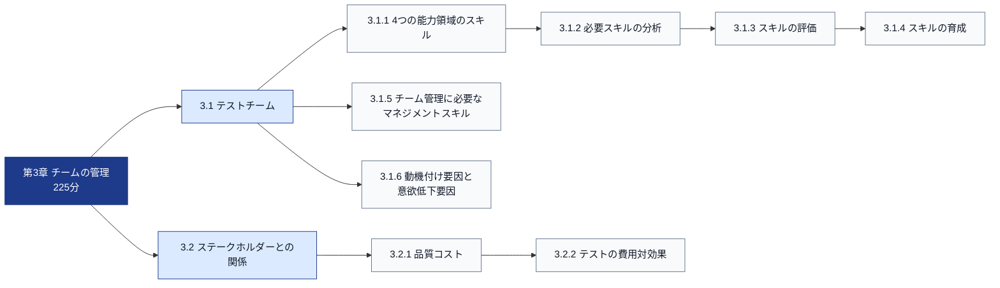
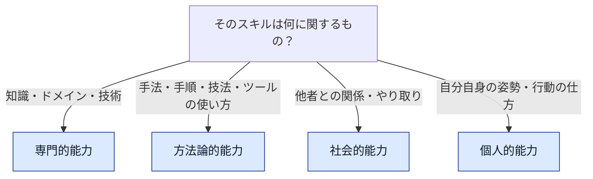
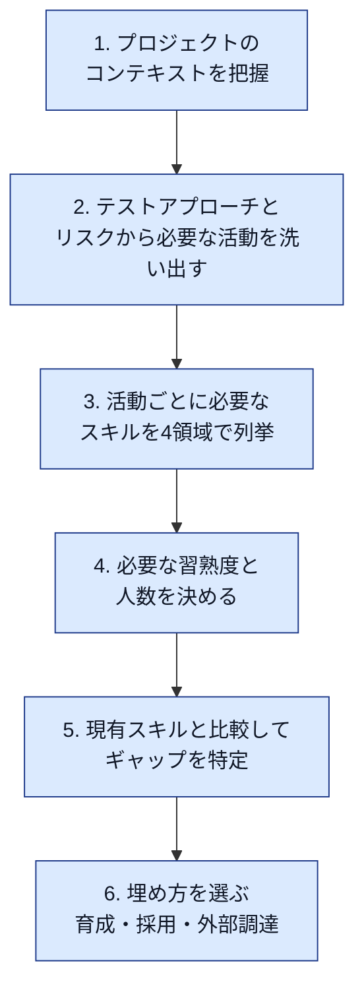
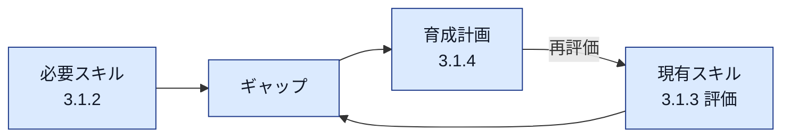
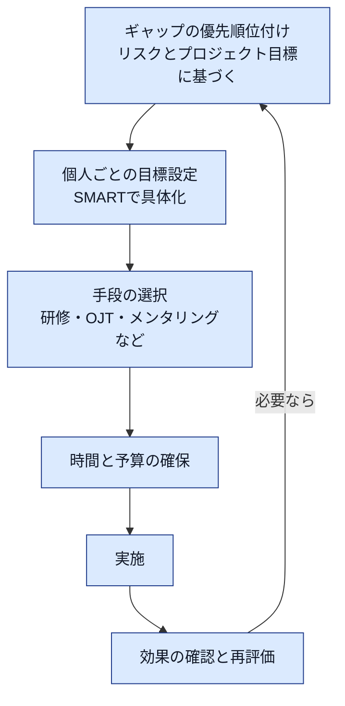
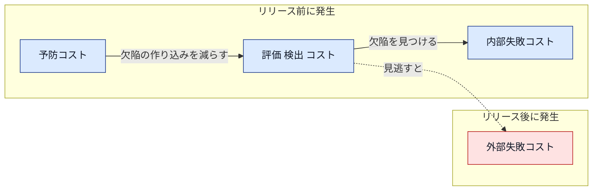
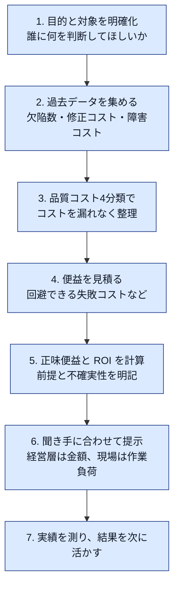

# CTAL-TM v3.0 第3章「チームの管理」初学者向け解説ガイド

> ISTQB® Certified Tester Advanced Level Test Management (CTAL-TM) v3.0
> Chapter 3: Managing the Team（学習時間 225 分）を、初学者向けにステップバイステップで解説します。

---

## 0. この文書の読み方と「根拠の確度」

この文書では、内容ごとに根拠の確度を次の記号で示します。

| 記号 | 意味 |
|------|------|
| 🟢 | ISTQB 公式ページ／公式シラバス PDF の原文で直接確認できた内容（目次・章の概要・他章の記述など） |
| 🟡 | 一般的な実務知識・ISTQB 用語集・二次情報で補足した内容。第3章の本文（シラバス p.65〜74）で表現や範囲を必ず確認してください |

> ⚠️ 重要な注意
> 本ガイドの作成時、公式シラバス PDF の取得が第1章の途中（p.45 付近）で打ち切られたため、第3章の本文（p.65〜74）そのものは原文で確認できていませんでした。
> その後 Version 3.0.J04 で、3.1.1（4つの能力領域）・3.1.6（動機付け要因と衛生要因）・3.2.1（品質コストの4カテゴリーと「評定コスト」の用語）を原文と突き合わせ済みです。それ以外の節は引き続き 🟡 を含みます。
> 第3章の節構成・学習時間・章の狙い・第1章からの参照は 🟢 ですが、各節の詳細説明は 🟡 を含みます。
> 試験対策として使う前に、日本語版シラバス（JSTQB 版 **Version 3.0.J04**：最新版）の第3章（p.65〜74）と突き合わせてください。このページ範囲は Version 3.0.J04 の目次で確認済みです（3.1 は p.66、3.1.6 は p.70、3.2 は p.72、3.2.1 品質コストは p.72、3.2.2 は p.73〜74。p.75 から「4 参考文献」）。Version 3.0.J02 / J01 は旧版で、差分確認用として参照してください。URL は「9. 出典」にあります。

---

## 目次

1. 第3章の全体像
2. 3.1 テストチーム
3. 3.2 ステークホルダーとの関係
4. 第1章・第2章とのつながり
5. 試験対策
6. ベストプラクティス総まとめ
7. アンチパターン集
8. 学習チェックリスト
9. 出典

---

## 1. 第3章の全体像

### 1.1 章の基本情報（🟢）

| 項目 | 内容 |
|------|------|
| 章タイトル | Managing the Team（チームの管理） |
| 最低学習時間 | 225 分（第1章 750 分、第2章 390 分、第3章 225 分の合計 1,365 分） |
| 節構成 | 3.1 The Test Team ／ 3.2 Stakeholder Relationships |
| 対応するビジネスアウトカム | TM_07（必要なスキルを特定し、チーム内で育成する）、TM_08（テストのビジネスケースを、コストと期待される便益とともに準備・提示する） |
| 試験の形式 | 50 問、120 分（非母語は +25%）、満点 88 点、合格 58 点 |

シラバスの序論は、第3章で学ぶことを次の3点にまとめています（🟢）。

1. プロジェクトのコンテキストを分析し、テストチームに必要なスキルを特定する
2. ホールチームアプローチ（whole team approach）に沿ってチームを管理する
3. プロジェクトにおけるテスト活動のビジネスケースを定義する

### 1.2 全体マップ

### 1.3 学習の進め方（ステップバイステップ）

| ステップ | やること | 目安 |
|----------|----------|------|
| 1 | 3.1.1 で「4つの能力領域」を覚える | 30 分 |
| 2 | 3.1.2〜3.1.4 を「分析 → 評価 → 育成」の1本の流れとして理解する | 60 分 |
| 3 | 3.1.5〜3.1.6 で、マネージャーとして何をするかを整理する | 40 分 |
| 4 | 3.2.1〜3.2.2 で品質コストの4分類と計算手順を身に付ける | 60 分 |
| 5 | 「5.2 想定問題」で確認する | 35 分 |

---

## 2. 3.1 テストチーム（The Test Team）

### 2.0 前提となる用語（🟢）

シラバスは「テストチームメンバー（test team member）」を、組織のコンテキストや他の役割に関係なく、テストマネジメントまたはテストをする役割でテストを実施するすべての人と定義しています（Version 3.0.J04 p.15 の用語説明で確認）。

- テストチームは、さまざまなスキルと能力を持つ個人で構成されます
- メンバーの経験や資格（Foundation／Advanced／Expert）も異なります
- 使うテストアプローチやプロセスモデル（アジャイルテスト、モデルベースドテスト、リスクベースドテストなど）によって、役割と責任も変わります

第1章の役割比較表（Table 1）には、シーケンシャル開発ではテストマネージャーが意思決定とチーム管理を担い、スクラムのようなイテレーティブ開発では役割が統合され、ファシリテーターやコーチが従来のテストマネージャーの代わりになる、という趣旨の記述があります（🟢）。

つまり、第3章の「チームの管理」は、テストマネージャーという肩書きの人だけの話ではなく、テストチーム全体を良い状態にするための考え方だと捉えると理解しやすくなります。

### 2.1 3.1.1 4つの能力領域における典型的なスキル（🟡）

#### ステップ1：4つの領域を知る

チームメンバーのスキルは、次の4つの能力領域（areas of competence）に分けて整理します。

| 能力領域 | 英語 | 一言でいうと | テストにおける具体例 |
|----------|------|--------------|----------------------|
| 専門的能力 | Professional competence | 専門的な業務を遂行するためのスキル | テスト技法のスキル、アプリケーション領域における技術的専門知識、ビジネス専門知識、プロジェクトマネジメントスキル |
| 方法論的能力 | Methodological competence | ある領域で独自に使用でき、複雑度または新規性の高い課題を独自に遂行できる一般的な能力 | 分析力、概念力、判断力 |
| 社会的能力 | Social competence | 他者とどう関わるか（対人） | コミュニケーション、チームワーク、交渉、対立の解消、共感、フィードバックの授受、ステークホルダーへの説明 |
| 個人的能力 | Personal competence | 自分をどう律するか（自己） | 自信を持って行動する力、レジリエンス、自己管理、主体性、学習意欲、ストレス耐性 |

> 🟡 補足：試験対策向けの二次資料でも「自信を持って行動する能力」は個人的能力に分類される、という趣旨の出題例が確認できました。ただし正式な分類語彙は日本語版シラバスの訳語で確認してください。

#### ステップ2：見分け方のコツ

迷ったときは、次の質問で判定します。

| 例 | 領域 | 理由 |
|----|------|------|
| 医療機器の薬事規制に詳しい | 専門的能力 | ドメイン知識 |
| 同値分割と境界値分析を使い分けられる | 方法論的能力 | テスト技法の運用 |
| 開発者と対立せずに欠陥の重要度を交渉できる | 社会的能力 | 他者との関係の築き方 |
| 締切前でも落ち着いて自分のタスクを管理できる | 個人的能力 | 自己管理・レジリエンス |

> 💡 ベストプラクティス
> 採用・育成・アサインの議論で「あの人はスキルが高い」と曖昧に言わず、4領域のどこが強くどこが弱いかを分けて話します。テスト技法（方法論）は強いがドメイン（専門）が弱い、といった具体的な処方に直結します。

### 2.2 3.1.2 必要なテストチームメンバーのスキルの分析（🟡＋🟢）

#### ステップ1：なぜ分析が必要か

第1章の 1.4.2 は、テストアプローチを選ぶために分析すべき要素として「テストリソース（テストツール、インフラ、利用可能なテスト担当者とそのスキル）」を挙げ、詳細を 3.1 に参照させています（🟢）。例として次のような記述があります。

- 経験ベースドテストには、ドメイン知識の豊富なテスト担当者が必要
- モバイルアプリのテストには限られた数の実機が必要
- ツールの利用はライセンス数に制約される

さらに 1.3.3 では、品質リスクの発生可能性を高める要因として、スキル・可用性・モチベーション・自律的な働き方、使用中の SDLC に関する知識の問題、チーム内の対立、地理的に分散したチームなどが挙げられています（🟢）。1.3.4 では「最もリスクの高いテストアイテムは、最も適任の人がテストすべき」とされています（🟢）。

つまり、必要なスキルはプロジェクトの文脈から逆算して決めます。

#### ステップ2：分析の流れ

#### ステップ3：コンテキストと必要スキルの対応表

| コンテキスト要因（第1章 1.4.2 の観点） | 必要になりやすいスキル | 主な領域 |
|------------------------------------------|--------------------------|----------|
| ドメイン（医療・金融・保険など） | ドメイン知識、規制・標準の理解、文書化の厳密さ | 専門 |
| 組織の目標（自動化率向上、テスト成熟度向上） | 自動化ツール、CI/CD、メトリクス分析 | 方法論・専門 |
| プロジェクト目標とタイプ（受託か製品開発か） | 契約上の受入基準の読解、交渉 | 専門・社会 |
| テストリソース（ツール、環境、要員） | ツール操作、環境構築、見積り | 方法論・専門 |
| SDLC（シーケンシャル／アジャイル／ハイブリッド） | アジャイルの作法、開発者との協働、継続的テスト | 方法論・社会 |
| 他システムとのインタフェース | 統合テストの設計、他チームとの調整 | 方法論・社会 |
| テストデータの可用性 | 匿名化、データ生成、データ検証 | 専門・方法論 |

#### ステップ4：具体例（架空）

> 状況：医療系データ管理 Web アプリ。要件は規制対応が必須。スクラムで開発し、CI で回帰テストを自動実行したい。

| 必要な活動 | 必要スキル | 領域 |
|------------|------------|------|
| 患者安全リスクに基づくテスト設計 | リスク分析、ドメイン知識 | 方法論・専門 |
| スプリント内でのテスト | 開発者とのペア作業、迅速なフィードバック | 社会・方法論 |
| 回帰テストの自動化 | 自動化ツールとパイプラインの理解 | 方法論・専門 |
| 規制当局向けの証跡整備 | 文書化、トレーサビリティ | 専門・方法論 |
| 逼迫時の判断 | 冷静さ、優先順位付け | 個人 |

> 💡 ベストプラクティス
>
> - スキルの要件は「人の名前」からでなく「活動」から導出する
> - 必須スキルと歓迎スキルを分ける
> - 単一人物への依存（バス係数 1）になっているスキルを必ず洗い出す
> - ハイブリッド開発では、構造化プロセスとアジャイルの柔軟性の両方をこなせるかを評価する（1.2.3 🟢）

### 2.3 3.1.3 テストチームメンバーのスキルの評価（🟡）

#### ステップ1：評価の目的

評価の目的は、優劣をつけることではなく、必要スキルと現有スキルのギャップを見える化して、育成やアサインの判断材料にすることです。

#### ステップ2：主な評価方法

| 方法 | 内容 | 長所 | 注意点 |
|------|------|------|--------|
| 自己評価 | 本人がスキルの習熟度を申告する | 手軽、本人の納得感 | 過大・過小評価が起きる |
| マネージャー評価 | 上長が観察に基づき評価 | 一貫した基準 | 観察できていない領域は評価できない |
| ピア評価・360度評価 | 同僚や関係者から評価 | 社会的能力の把握に有効 | 心理的安全性が前提 |
| 実務成果のレビュー | テストケース、欠陥報告書、レポートを確認 | 客観的 | 時間がかかる |
| 面談・インタビュー | 経験と考え方を対話で確認 | 個人的能力を把握しやすい | 面談者の力量に依存 |
| 認定資格・研修履歴 | ISTQB などの資格や研修の受講記録 | 定量的で比較しやすい | 資格は実務能力の一部のみを示す |

#### ステップ3：スキルマトリクス（skills matrix）の例

習熟度を 0〜3 で表します。0 は未経験、1 は指導が必要、2 は自立して実施可能、3 は他者を指導できる、という定義です。

| メンバー | ドメイン知識（専門） | テスト技法（方法論） | 自動化（方法論） | 交渉・調整（社会） | 自己管理（個人） |
|----------|----------------------|------------------------|--------------------|--------------------|--------------------|
| A さん | 3 | 2 | 1 | 2 | 3 |
| B さん | 1 | 3 | 3 | 1 | 2 |
| C さん | 2 | 2 | 0 | 3 | 2 |
| 必要水準 | 2 | 2 | 2 | 2 | 2 |

読み取り例は次のとおりです。

- 自動化は、B さんだけが必要水準を満たす。B さんへの依存リスクがある
- C さんは自動化が未経験。育成対象の候補
- B さんは交渉・調整が弱く、ステークホルダー対応は他のメンバーが補う

> 💡 ベストプラクティス
>
> - 評価基準（習熟度の定義）を事前に合意し、全員に公開する
> - 評価は個人攻撃ではなく育成のために行うと明言する
> - 定期的に再評価し、マトリクスを更新し続ける
> - 資格や研修履歴だけでなく、実務成果も見る

### 2.4 3.1.4 テストチームメンバーのスキルの育成（🟡）

#### ステップ1：育成手段の選択肢

| 手段 | 内容 | 向いているスキル | 注意点 |
|------|------|------------------|--------|
| 公式トレーニング | 認定トレーニングプロバイダーの講座 | 体系的な知識、資格取得 | コストと時間が必要 |
| 自己学習 | 書籍・動画・シラバスでの学習 | 専門知識の補強 | 定着確認が別途必要 |
| OJT（実務を通じた学習） | 実プロジェクトで経験する | 方法論、専門 | 失敗のコストを許容する範囲を設計する |
| メンタリング／コーチング | 経験者が伴走する | 社会的・個人的能力 | 指導者の時間確保が必要 |
| ペアワーク／モブワーク | 二人以上で同時に作業 | 技法、ツール、ドメイン | 相性と役割の設計 |
| ジョブローテーション／クロストレーニング | 別の役割・領域を経験 | 属人化の解消 | 短期的な生産性は下がる |
| 勉強会・実践コミュニティ | 社内で知識共有 | 全般 | 継続の仕組み化が必要 |

第1章の 1.6.1（🟢）では、ツール導入のベストプラクティスとして「ツール利用者へのトレーニング・コーチング・メンタリングを提供する」「ツールの所有者を定義する」が挙げられています。これは、育成をツール導入計画の一部として計画に組み込むべきだという実例です。

#### ステップ3：育成計画の立て方

第1章の 1.4.3（🟢）にある S.M.A.R.T.（Specific、Measurable、Achievable、Relevant、Timely）は、テスト目的や終了基準だけでなく、育成目標にも同じ考え方で適用できます（🟡）。

> 例：悪い目標「自動化を頑張る」／良い目標「3か月以内に、C さんが回帰テスト10件を自動化し、レビューで指摘ゼロで承認される」
>
> 💡 ベストプラクティス
>
> - 研修だけで終わらせず、学んだことを実務で使う機会を必ず設計する
> - 高リスク領域のスキルほど早く、厚く育成する
> - 育成の時間をプロジェクト計画（見積り）に最初から組み込む。第1章 1.6.3 が指摘する機会コスト（学習や導入に費やす時間はテスト作業に使えない時間）と同じ考え方
> - 育成の成果をレトロスペクティブで振り返る

### 2.5 3.1.5 テストチームの管理に必要なマネジメントスキル（🟡）

#### ステップ1：ホールチームアプローチ（🟢＋🟡）

シラバスは、第3章で「ホールチームアプローチに沿ってチームを管理する」ことを学ぶと述べています（🟢）。1.5.4 では、レトロスペクティブはチーム全員で実施され、ホールチームアプローチを支え、継続的改善を促す、と書かれています（🟢）。

一般にホールチームアプローチとは、品質に関する責任をテスト担当者だけに負わせず、開発者・プロダクトオーナー・運用担当などチーム全員で共有する考え方です（🟡、ISTQB Foundation Level v4.0 の用語）。1.3.2 にも「品質はみんなの関心事であることを明確にする」というテストマネージャーの役割の記述があります（🟢）。

#### ステップ2：必要なマネジメントスキル

| スキル | 具体的にやること | 主な領域 |
|--------|------------------|----------|
| リーダーシップ | 目標とビジョンを示し、意思決定の方針を明確にする | 社会・個人 |
| コミュニケーション | 状況を相手に合わせて伝える。テスト結果を「リスクの言葉」で説明する（1.3.4 🟢） | 社会 |
| 交渉・対立解消 | 開発者やプロジェクトマネージャーとの合意形成 | 社会 |
| 委任と権限移譲 | 適切な人に適切なタスクと責任を任せる | 方法論・社会 |
| 動機付け | 3.1.6 を参照 | 社会・個人 |
| 計画・優先順位付け | リソース制約下でのスコープと優先度の決定 | 方法論 |
| 分散チームの調整 | オンサイト／オフサイトなど、同期とコミュニケーション規約の整備（1.2.7 🟢） | 社会・方法論 |
| 変化への対応 | 組織変更、ハイブリッド開発への移行時のチームの支援（1.2.3 🟢） | 社会・個人 |

#### ステップ3：状況別の使い分け

| 状況 | 推奨されるマネジメントの重心 |
|------|-------------------------------|
| 新人が多い | 指示を具体的にし、レビューと伴走を厚くする |
| 熟練者が多い | 目的と制約を伝え、やり方は任せる |
| 分散チーム | 通信規約、共通ツール、定例の同期を整える |
| アジャイル | 促進型（ファシリテーター／コーチ）、自己組織化の支援 |
| 規制の厳しい領域 | 手順と証跡を明確にし、逸脱を早期に検知する |

> 💡 ベストプラクティス
>
> - 品質を「テストチームの仕事」に閉じ込めず、チーム全体の目標にする
> - 意思決定の理由を透明にする
> - 問題は早期に、責める口調でなく事実とデータで扱う

### 2.6 3.1.6 特定の状況におけるテストチームの動機付け要因と意欲低下要因（🟡）

#### ステップ1：考え方

同じ施策でも、状況が違えばチームのやる気を高めることも下げることもあります。マネージャーは、状況ごとに何が効いて何が逆効果かを見分ける必要があります。

#### ステップ2：要因の一覧

シラバスは**動機付け衛生理論**に基づき、「モチベーションを上げる要因（動機付け要因）」と「衛生要因」を区別しています。
衛生要因は**満たしても自動的に満足度が上がるわけではないが、欠けているとモチベーションが下がる**点が動機付け要因との決定的な違いです。

| 種類 | 性質 | 要因の例 |
|------|------|----------|
| 動機付け要因 | 意識的に認識され、成長と満足感につながる | 仕事の達成に対する承認と評価（インセンティブ、個別アプローチ）、責任と自律性の向上（テストチーム内でのテストプロセスの定義）、達成可能かつ努力する価値がある興味深く有意義でやりがいのあるタスク（テスト自動化の新ツールの選定と導入）、プロフェッショナルとしての昇進と成長 |
| 衛生要因 | 通常は当然のものと見なされる。満たしても満足度は自動的には上がらないが、欠けるとモチベーションが下がる | 適切な報酬（市場に見合った給与、時間外手当、社会保障）、評価される人事方針とマネジメントスタイル（現実的な目標、外部干渉や過負荷からの保護）、快適な労働条件（曖昧でない仕様、成熟したテスト対象、適切に修正された欠陥、安定したテスト環境）、最低限必要な安全性、良好な対人関係 |
| 意欲低下要因 | 上記を踏まえた一般的な整理（🟡） | 目標や優先順位の頻繁な変更、テストが軽視される文化、過度な残業と締切圧力、成果に見合わない評価、不明確な役割、頻繁なやり直し、スキルの停滞、批判的で心理的安全性のない雰囲気 |

テストマネジメントは、**モチベーションを下げる要因を継続的に排除しつつ、モチベーションを上げる要因を作り出し強化する**ことが求められます。

#### ステップ3：状況別の対処例

| 状況 | 起こりやすい意欲低下 | マネージャーの対応例 |
|------|------------------------|------------------------|
| 納期直前に大量の欠陥が見つかる | 疲弊、責任の押し付け合い | 優先順位を絞り、残業の上限を設け、進捗を可視化してリスクベースで判断する |
| 上流工程の遅れでテスト期間が圧縮される | 「テストが最後のしわ寄せ」という不満 | 圧縮の影響をリスクとして経営層に報告し、スコープの再交渉をする（1.3.4 の「延長するか残存リスクを受け入れるか」の根拠づくり 🟢） |
| 手作業の反復が続く | 単調さによる意欲低下 | 自動化を推進し、探索的テストなど創造的な作業を組み込む |
| オフサイト／分散チーム | 孤立感、情報格差 | 定例の同期、共通ツール、対面や交流の機会を設ける |
| ハイブリッド開発への移行 | 不安、やり方の混乱 | 期待を明確にし、役割の変化を説明し、育成機会を提供する |
| 手厚いレビューで欠陥が減った | 「テストが不要では」という誤解による軽視感 | 品質コストの観点（3.2）で、予防・検出の価値を示す |

> 💡 ベストプラクティス
>
> - 個別に話を聞く場と、チーム全体で話す場（レトロスペクティブ）の両方を持つ
> - 成果は公に称え、問題は個別に丁寧に伝える
> - 「動機付け」を気合いの問題にせず、環境・目標・成長・公正さの設計の問題として扱う

---

## 3. 3.2 ステークホルダーとの関係（Stakeholder Relationships）

### 3.1 3.2.1 品質コスト（Cost of Quality）（🟡、用語は ISTQB 用語集に準拠）

#### ステップ1：定義

ISTQB 用語集では、品質コスト（cost of quality）を、品質に関する活動や問題に費やした総コストであり、多くの場合、予防コスト、評定（アプレイザル）コスト、内部失敗コスト、外部失敗コストに分けられるもの、と定義しています。

#### ステップ2：4分類

| 分類 | 英語 | 内容 | 具体例 |
|------|------|------|--------|
| 予防コスト | Prevention cost | 欠陥を作らないための活動 | 研修、標準やチェックリストの整備、要件レビュー、プロセス改善、静的解析の導入 |
| 評定（アプレイザル）コスト | Appraisal cost | 欠陥検出を目的とした活動 | テストの設計と実行、レビュー、テスト環境・テストツールの費用 |
| 内部失敗コスト | Internal failure cost | リリース前に見つかった欠陥の対応 | 欠陥の修正、再テスト、手戻り、スケジュール遅延 |
| 外部失敗コスト | External failure cost | リリース後に見つかった欠陥の対応 | 障害対応、返金、保証、ペナルティ、評判の低下、緊急パッチ |

第1章 1.3.4（🟢）にも、すべてのテストアイテムをできるだけ早くテストすることで、ライフサイクル後半で重大な欠陥を見つけて内部失敗コストと遅延が大きくなるリスクを軽減できる、という趣旨の記述があります。

#### ステップ3：基本の考え方

- 欠陥は、見つかるのが遅いほど直すコストが大きくなる傾向がある
- 予防や早期検出に投資すると、外部失敗コストを下げられる
- 予防と検出に投資しすぎると、投資対効果が下がる。バランスが重要

### 3.2 3.2.2 テストの費用対効果の関係（Cost-benefit Relationship of Testing）（🟡）

#### ステップ1：目的

第3章の狙いの一つは、テスト活動のビジネスケースを定義することです（🟢）。ビジネスケースとは、経営層などに対して「テストにこれだけ投資する価値がある」ことを、コストと期待される便益で示す説明資料です。TM_08 の「コストと期待される便益を示すビジネスケースを準備し提示する」に対応します（🟢）。

#### ステップ2：計算の基本式

| 項目 | 式 |
|------|----|
| 回避できる外部失敗コスト（便益） | 想定欠陥数 × 1件あたりの外部失敗コスト |
| リリース前コスト（投資） | 予防コスト ＋ 評定コスト ＋ 内部失敗コスト |
| 正味便益 | 便益 − 投資 |
| 費用対効果（ROI） | 正味便益 ÷ 投資 |

第1章 1.6.3 でも、ツール導入では「繰り返し発生するコストと一度だけ発生するコスト」「機会コスト」「リスクと便益」を分けて ROI を評価することが説明されています（🟢）。テスト全体のビジネスケースでも、同じ考え方で漏れなくコストを洗い出します。

#### ステップ3：計算例（架空の数値）

条件：テストで見つかると想定される欠陥数は 100 件。

| 項目 | 金額 |
|------|------|
| 予防コスト（固定） | 500,000 円 |
| 評定コスト（1件あたり） | 20,000 円 |
| 内部失敗コスト（1件あたり） | 30,000 円 |
| 外部失敗コスト（1件あたり、リリース後に見つかった場合） | 300,000 円 |

計算は次のとおりです。

1. 回避できる外部失敗コスト = 100 件 × 300,000 円 = 30,000,000 円
2. リリース前コスト = 500,000 円 + 100 件 × (20,000 円 + 30,000 円) = 5,500,000 円
3. 正味便益 = 30,000,000 円 − 5,500,000 円 = 24,500,000 円
4. ROI = 24,500,000 円 ÷ 5,500,000 円 ≒ 4.45（約 445%）

> ⚠️ 注意
> この計算は「テストで見つけた欠陥のすべてが、テストがなければ本番で見つかっていた」と仮定した単純化です。実務では、実際に本番に流出する確率や、流出しても影響が小さい欠陥の割合で便益を割り引きます。経営層への説明では前提条件を必ず併記します。

#### ステップ4：欠陥検出率（DDP）による補足（🟡）

欠陥検出率（Defect Detection Percentage）は、テストの効果を測る指標の一つです。

- DDP = リリース前に見つけた欠陥数 ÷（リリース前に見つけた欠陥数 ＋ リリース後に見つかった欠陥数）
- 例：リリース前 200 件、リリース後 100 件の場合、DDP = 200 ÷ 300 ≒ 66.7%

DDP が低い場合は「テストが足りなかった」だけでなく、「予防・要件レビューなど上流の対策が弱い」可能性も検討します。

#### ステップ5：ビジネスケース作成の手順

#### ステップ6：ステークホルダーに合わせた伝え方

第1章 1.2.2（🟢）のステークホルダーマトリクス（パワー／関心マトリクス）は、ビジネスケースの提示先を決めるときにも使えます。

| 区分（原文の呼称） | 影響力 | 関心 | ビジネスケース提示での重点 |
|--------------------|--------|------|------------------------------|
| Promoters（推進者） | 高 | 高 | 詳細な数値と前提を共有し、意思決定に巻き込む |
| Latents（潜在的） | 高 | 低 | 結論とリスク、必要な意思決定に絞って簡潔に伝える |
| Defenders（擁護者） | 低 | 高 | 定期的に更新し、現場の声を吸い上げる |
| Apathetics（無関心） | 低 | 低 | 大きなマイルストーンのときだけ更新する |

> 💡 ベストプラクティス
>
> - 過去プロジェクトの実績データ（欠陥数、修正時間、障害コスト）を継続的に蓄積する
> - 便益は保守的に見積り、前提を明記する
> - 金額に換算しにくい便益（信頼、規制適合、患者安全）も併記する
> - 予算削減の議論では、「テストを減らした場合に増える外部失敗コスト」を試算して示す
> - 結果を計測し、次回のビジネスケースの精度を上げる

---

## 4. 第1章・第2章とのつながり（🟢）

第3章は単独ではなく、他章と結び付けて出題されます（シラバスも、試験の解答は複数の節の内容を必要とする場合がある、と述べています）。

| 第3章の内容 | つながる箇所 | つながり方 |
|--------------|--------------|------------|
| 3.1.2 必要スキルの分析 | 1.4.2 テストアプローチの選定 | テストリソースの制約（要員とスキル）を 3.1 に参照している |
| 3.1.2 必要スキルの分析 | 1.3.3 品質リスクの評価 | スキル不足・チーム内の対立・分散チームなどは発生可能性を高める要因 |
| 3.1.2 必要スキルの分析 | 1.3.4 リスクの軽減 | 最も適任の人が最もリスクの高いテストアイテムをテストする |
| 3.1.4 スキルの育成 | 1.6.1 ツール導入のグッドプラクティス | トレーニング、コーチング、メンタリング、ツール所有者の定義 |
| 3.1.5 マネジメントスキル | 1.5.4 レトロスペクティブ | ホールチームアプローチを支え、継続的改善を促す |
| 3.1.5 マネジメントスキル | 1.2.4 SDLC 別のテストマネジメント | 役割がテストマネージャーからファシリテーター／コーチに変わる |
| 3.2 ビジネスケース | 1.6.3 ROI の評価 | 繰り返し／一度だけのコスト、機会コスト、便益とリスク |
| 3.2 ビジネスケース | 1.2.2 ステークホルダーマトリクス | 提示先ごとに伝え方を変える |
| 3.2 ビジネスケース | 第2章 テストメトリクス（2.1） | 費用対効果の実績を測る根拠データ |

---

## 5. 試験対策

### 5.1 押さえるべきポイント

| 優先度 | ポイント |
|--------|----------|
| 高 | 4つの能力領域の分類（専門・方法論・社会・個人）と具体例の振り分け |
| 高 | 品質コスト4分類の区別（特に、内部失敗と外部失敗の境目はリリース時点） |
| 高 | 費用対効果の計算（回避できる外部失敗コストとリリース前コストの比較） |
| 中 | スキルの分析 → 評価 → 育成の流れ、スキルマトリクスの読み取り |
| 中 | ホールチームアプローチとテストマネージャー／コーチの役割 |
| 中 | 状況に応じた動機付け・意欲低下要因への対応 |

### 5.2 想定問題（本ガイド作成者による練習問題）

> 以下は理解確認用に作成した練習問題であり、公式サンプル問題ではありません。公式のサンプル試験は「9. 出典」のリンクから入手できます。

**問1** 「自信を持って行動できる」はどの能力領域か。

- A. 専門的能力
- B. 方法論的能力
- C. 社会的能力
- D. 個人的能力

> 答え：D。自分自身の姿勢・行動に関するスキルは個人的能力です。

**問2** リリース後に見つかった欠陥の緊急パッチ対応費用は、品質コストのどの分類か。

- A. 予防コスト
- B. 評価コスト
- C. 内部失敗コスト
- D. 外部失敗コスト

> 答え：D。リリース後に見つかった欠陥への対応は外部失敗コストです。

**問3** 予防コスト 100 万円、想定欠陥 40 件、評定コスト 1 件 2 万円、内部失敗コスト 1 件 3 万円、外部失敗コスト 1 件 30 万円の場合、正味便益はいくらか（テストで見つかる欠陥はすべて、テストがなければ本番で見つかると仮定する）。

> 答え：便益 = 40 × 30 万円 = 1,200 万円。投資 = 100 万円 + 40 × (2 万円 + 3 万円) = 300 万円。正味便益 = 1,200 万円 − 300 万円 = 900 万円。

**問4** 自動化スキルを持つのが 1 人だけで、その人が長期休暇に入る。最初にすべきことは何か。

> 答え：スキルマトリクスでその依存リスクを可視化し、他のメンバーへの育成（ペアワークやメンタリング）と、当面の代替策（外部調達や作業の優先順位の見直し）を計画する。

### 5.3 覚え方

| テーマ | 覚え方 |
|--------|--------|
| 4つの能力領域 | 「知識（専門）・やり方（方法論）・人づきあい（社会）・自分の律し方（個人）」 |
| 品質コスト4分類 | 「防ぐ・見つける・社内で直す・お客様の前で直す」（前の3つはリリース前、最後だけリリース後） |
| 費用対効果 | 「防げた失敗の損失 − 事前にかけたコスト」 |

---

## 6. ベストプラクティス総まとめ

| 項目 | ベストプラクティス |
|------|--------------------|
| 4領域の把握 | スキルは4領域に分けて語り、強み・弱みを具体的にする |
| 必要スキルの分析 | コンテキストとリスクから逆算し、必須と歓迎を区別する |
| 評価 | 基準を事前に合意し、複数の方法を組み合わせ、育成目的であることを明示する |
| 育成 | 学びを実務で使う機会を設計し、高リスク領域を優先し、育成時間を計画に含める |
| チーム管理 | 品質をチーム全体の責任にし、意思決定の理由を透明にする |
| 動機付け | 目標・成長・裁量・公正さを設計し、状況ごとに施策を変える |
| 品質コスト | 4分類で漏れなく整理し、予防と検出のバランスを取る |
| ビジネスケース | 実績データに基づき、前提を明記し、聞き手に合わせて伝える |
| 改善の循環 | レトロスペクティブで振り返り、スキルマトリクスとビジネスケースを更新し続ける |

---

## 7. アンチパターン集

| アンチパターン | 何が問題か | 対処 |
|------------------|------------|------|
| 資格の有無だけでスキルを判断する | 実務能力の一部しか見えない | 実務成果、面談、ピア評価を併用する |
| 特定の 1 人に重要スキルが集中している | 休暇・離職で品質リスクが急上昇する | クロストレーニング、ペア作業、ドキュメント化 |
| 研修を受けさせただけで終わる | 学びが定着せず、現場で使われない | OJT とレビューをセットにする |
| 評価を人事評価と混同して伝える | 自己申告が歪み、ギャップが見えなくなる | 育成目的であることを明示し、安心して話せる場にする |
| 締切前の長時間労働を常態化する | 意欲低下、ミス増加、離職 | 優先順位付けとスコープ再交渉で負荷を制御する |
| テスト費用だけを提示して「高い」と言われる | 便益（回避できる失敗）が見えない | 品質コストとビジネスケースで説明する |
| 楽観的な前提で ROI を算出する | 後で信頼を失う | 保守的な前提と不確実性を併記する |

---

## 8. 学習チェックリスト

- [ ] 第3章の3つの学習ポイントを説明できる
- [ ] 4つの能力領域を挙げ、具体例を正しく振り分けられる
- [ ] コンテキストから必要スキルを導出する手順を説明できる
- [ ] スキルマトリクスを読み取り、ギャップと依存リスクを指摘できる
- [ ] スキルの育成手段を 5 つ以上挙げ、使い分けを説明できる
- [ ] ホールチームアプローチの考え方を説明できる
- [ ] 状況別に動機付け要因・意欲低下要因への対応を挙げられる
- [ ] 品質コスト4分類を、リリース前後の区別とともに説明できる
- [ ] 回避できる外部失敗コストとリリース前コストから正味便益を計算できる
- [ ] ステークホルダーの種類に応じたビジネスケースの伝え方を説明できる
- [ ] 日本語版シラバスの p.65〜74 と本ガイドの 🟡 部分を突き合わせた

---

## 9. 出典

### 9.1 公式（一次情報）

| 資料 | URL | 本ガイドでの用途 |
|------|-----|------------------|
| ISTQB：CTAL-TM v3.0 認定ページ | <https://istqb.org/certifications/certified-tester-advanced-level-test-management-ctal-tm-v3-0/> | 章構成（The Test Team、Stakeholder Relationship）、試験構成、ビジネスアウトカム |
| ISTQB：CTAL-TM シラバス v3.0（英語 PDF、ダウンロードリンク） | <https://istqb.org/?sdm_process_download=1&download_id=3445> | 序論、第1章・第2章の記述、目次（第3章の節構成 3.1.1〜3.2.2、225 分） |
| ISTQB：シラバスのダウンロードページ | <https://istqb.org/sdm_downloads/istqb_ctal-tm_syllabus_v3-0/> | シラバスの入手先 |
| ISTQB：サンプル試験 A 問題 | <https://istqb.org/?sdm_process_download=1&download_id=3449> | 公式の出題形式の確認 |
| ISTQB：サンプル試験 A 解答 | <https://istqb.org/?sdm_process_download=1&download_id=3451> | 解答と根拠の確認 |
| ISTQB：サンプル試験 B 問題 | <https://istqb.org/?sdm_process_download=1&download_id=9612> | 追加の演習 |
| ISTQB：サンプル試験 B 解答 | <https://istqb.org/?sdm_process_download=1&download_id=9614> | 解答と根拠の確認 |
| ISTQB：用語集（品質コスト、テストチーム関連の用語） | <https://glossary.istqb.org/> | 品質コストの定義（cost of quality を検索） |
| ISTQB：試験構成とルール | <https://istqb.org/?sdm_process_download=1&download_id=3829> | 試験形式・ルールの確認 |

### 9.2 日本語版（JSTQB）

| 資料 | URL | 用途 |
|------|-----|------|
| JSTQB：Advanced Level シラバス日本語版 テストマネジメント Version 3.0.J04（主参照・最新版） | <https://www.jstqb.jp/wordpress/wp-content/uploads/2026/06/JSTQB-Syllabus.Advanced_TM_VersionV3.0.J04.pdf> | 第3章（p.65〜74）の日本語訳の確認 |
| JSTQB：Advanced Level シラバス日本語版 テストマネジメント Version 3.0.J02 | <https://jstqb.jp/dl/JSTQB-Syllabus.Advanced_TM_VersionV3.0.J02.pdf> | 旧版（差分確認用） |
| JSTQB：Advanced Level シラバス日本語版 テストマネジメント Version 3.0.J01 | <https://jstqb.jp/dl/JSTQB-Syllabus.Advanced_TM_VersionV30.J01.pdf> | 旧版（差分確認用） |
| JSTQB：シラバス・用語集一覧 | <https://www.jstqb.jp/syllabus/> | 最新版の入手先 |
| JSTQB 日本語版 v3.0 公開のプレスリリース（2025 年 8 月 4 日公開） | <https://prtimes.jp/main/html/rd/p/000000044.000054604.html> | 3章構成への再編、試験問題数の変更などの背景 |

### 9.3 発展学習

| 資料 | URL | 用途 |
|------|-----|------|
| ISTQB：Expert Level Managing the Test Team (CTEL-TM-MTT) | <https://istqb.org/certifications/certified-tester-expert-level-test-management-managing-the-test-team-ctel-tm-mtt/> | 採用、目標設定、評価、動機付け、分散チームなど、チーム管理の発展的内容 |

### 9.4 本ガイドの根拠の限界（再掲）

- 🟢 の内容は、上記 ISTQB 公式ページと公式シラバス PDF の原文（序論、第1章の記述、目次、章の概要）で確認しました
- 🟡 の内容は、ISTQB 用語集と一般的な実務知識に基づく補足です。第3章本文（p.65〜74）の表現・粒度と異なる可能性があります
- 計算例と練習問題は、理解のために本ガイドで作成した架空の例です
