# ISTQB CTAL-TM v3.0 Chapter 1「テスト活動の管理」初学者向け完全ガイド

> **対象資格**：Certified Tester Advanced Level Test Management（CTAL-TM）v3.0
> **対象章**：Chapter 1 *Managing the Test Activities*（最小学習時間 750 分）
> **一次情報**：ISTQB 公式シラバス v3.0（2024/05/03 リリース版）
> **読者**：ISTQB Foundation Level（FL）v4.0 を学習済み、またはこれからテストマネジメントを学ぶ方

---

## 0. このガイドの使い方

### 0.1 Chapter 1 の位置づけ

CTAL-TM v3.0 は 3 章構成です。Chapter 1 は全体の約 55% を占める、最重要の章です。

| 章 | タイトル | 最小学習時間 | 全体に占める割合（算出） | 主題 |
|---|---|---|---|---|
| **1** | **Managing the Test Activities（テスト活動の管理）** | **750 分** | **約 55%** | 計画・監視・コントロール・完了、コンテキスト、リスクベースドテスト、テスト戦略、プロセス改善、ツール |
| 2 | Managing the Product（プロダクトの管理） | 390 分 | 約 29% | メトリクス、見積り、欠陥管理 |
| 3 | Managing the Team（チームの管理） | 225 分 | 約 16% | チームのスキル、ステークホルダー関係、ビジネスケース |

> 合計 1,365 分（22.75 時間）に対する割合は、本ガイド作成者が算出した参考値です。

### 0.2 試験の基本情報（ISTQB 公式ページより）

| 項目 | 内容 |
|---|---|
| 問題数 | 50 問 |
| 満点 | 88 点 |
| 合格点 | 58 点 |
| 試験時間 | 120 分（非母語受験者は +25%） |
| 受験前提 | Foundation Level 認定（v4.0 または旧バージョン）＋実務経験（詳細は各 Member Board / 試験提供機関に確認） |

サンプル試験では 1 点問題と 3 点問題が確認できます。Chapter 1 は K4（分析）問題を含むため、**単なる暗記では得点しにくい章**です。

### 0.3 学習目標（Learning Objectives）と認知レベル

Chapter 1 には 28 個の学習目標があります。認知レベルの内訳は次のとおりです。

| レベル | 意味 | 個数 | 該当する学習目標 |
|---|---|---|---|
| K2 | 理解する（説明・比較・要約） | 22 | 大半の項目 |
| K3 | 適用する | 2 | TM-1.4.3（S.M.A.R.T.）、TM-1.5.4（レトロスペクティブ） |
| K4 | 分析する | 4 | TM-1.2.7、TM-1.3.4、TM-1.4.2、TM-1.6.3 |

> シラバスの規則として、すべての内容は最低でも K1（用語を思い出せる）レベルで出題され得ます。各章の冒頭に並ぶ**キーワードは必ず覚える**必要があります。

### 0.4 学習の進め方


### 0.5 Chapter 1 全体の関係図

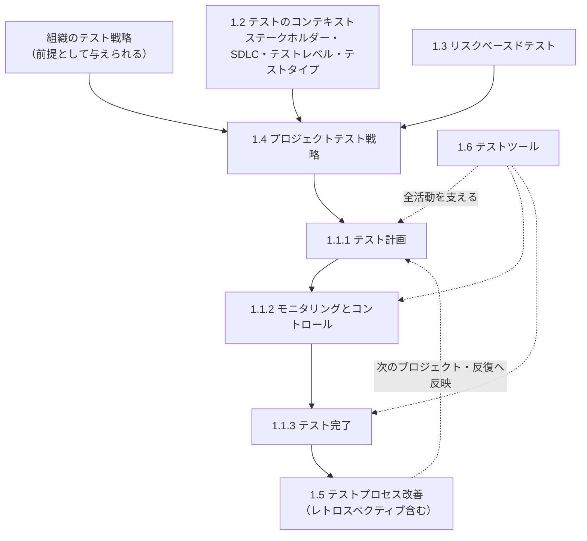

### 0.6 最初に押さえる用語（Chapter 1 の基礎）

| 用語（英） | 日本語 | かんたんな説明 |
|---|---|---|
| Test strategy | テスト戦略 | 「テスト目的を達成するために、どうテストするか」の説明。組織・プロジェクト・テストレベル・テストタイプなど、さまざまな範囲で存在し得る |
| Organizational test strategy | 組織のテスト戦略 | 組織全体で「テストはこう行う」と定めた高レベルの戦略。本シラバスでは**与えられたもの**として扱う |
| Project test strategy | プロジェクトテスト戦略 | 特定のプロジェクト／リリース／製品向けに具体化した戦略。**テスト計画の主要な成果物** |
| Test approach | テストアプローチ | テスト作業を実施する方法。テストレベル・テストタイプ・テスト技法（静的／動的）・その他の実践（スクリプト化テスト、手動テスト等）の**選択と組み合わせ** |
| Test plan | テスト計画書 | 戦略・スコープ・目的・終了基準などを記述する文書。戦略が別文書に書かれる場合もある |
| Test policy | テストポリシー | 組織がテストに求める方針（計画の出発点となる） |
| Test manager / Test management role | テストマネージャー／テストマネジメント役割 | 逐次型モデルでは独立した役割として置かれることが多い。役割の名称や範囲はコンテキストで異なる |
| Product risk / Quality risk | プロダクトリスク／品質リスク | 製品に品質上の問題が存在し得る潜在的状況 |
| SDLC | ソフトウェア開発ライフサイクル | 逐次型、反復型、増分型、アジャイル、ハイブリッドなど |

> 💡 **つまずきやすい点**：このシラバスは「**プロジェクトレベル**のテストマネジメント」に焦点を当てています。組織レベルのテストマネジメント（組織戦略の策定など）は、Expert Level や Agile Test Leadership at Scale の範囲です。

---

## 1. テストプロセス（Section 1.1）

**学習目標**：TM-1.1.1〜1.1.3（すべて K2）

### 1.1 なぜこの節が重要か

FL v4.0 のテストプロセスは 7 つの活動で構成されます。

- テスト計画
- テストのモニタリングとコントロール
- テスト分析
- テスト設計
- テスト実装
- テスト実行
- テスト完了

CTAL-TM では、このうち**マネジメントに直結する 3 つ**（計画／モニタリングとコントロール／完了）を深掘りします。これらの活動は SDLC やプロジェクトの状況に応じて、**反復的あるいは並行して**実施され、**テーラリング（調整）が通常必要**です。

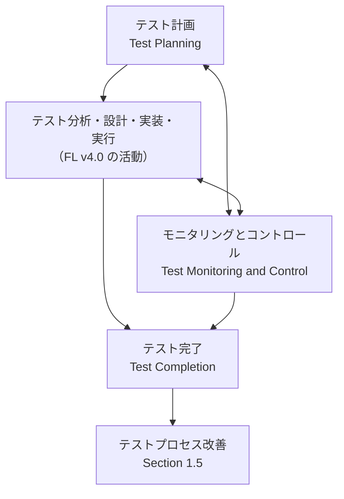

また、ISO/IEC/IEEE 29119-2 がこれらのテストマネジメントプロセスを定義しており、**プロジェクト、プログラム、ポートフォリオ**といった異なるレベルで適用できます。各レベルは、上位レベルのテスト計画と整合した独自のテスト計画を持てます。

> ⚠ 標準（ISO/IEC/IEEE 29119 等）は**参考情報であり、試験範囲ではありません**。シラバス内で要約されている範囲だけを押さえれば十分です。

### 1.2 テスト計画活動（TM-1.1.1）

#### 1.2.1 何をするのか

テスト計画は、**テスト目的を達成するために必要な活動とリソースを特定する**活動です。対象範囲は次のように多様です。

| 計画のスコープ | 例 |
|---|---|
| プロジェクト全体 | マスターテスト計画 |
| テストレベル | システムテスト計画 |
| テストタイプ | 性能テスト計画、セキュリティテスト計画 |
| リリース／反復／スプリント | アジャイルのスプリント計画 |

スコープによって、計画の開始・終了時点が異なります。

#### 1.2.2 計画のタイミング

- 開発プロセスのできるだけ**早い時期**に開始する（できれば要件が特定される前が望ましい）
- プロジェクトの進行に合わせて**更新**する
- 変更やフィードバックに対応するため、**反復的に再計画**する

#### 1.2.3 テスト計画の 5 つのタスク

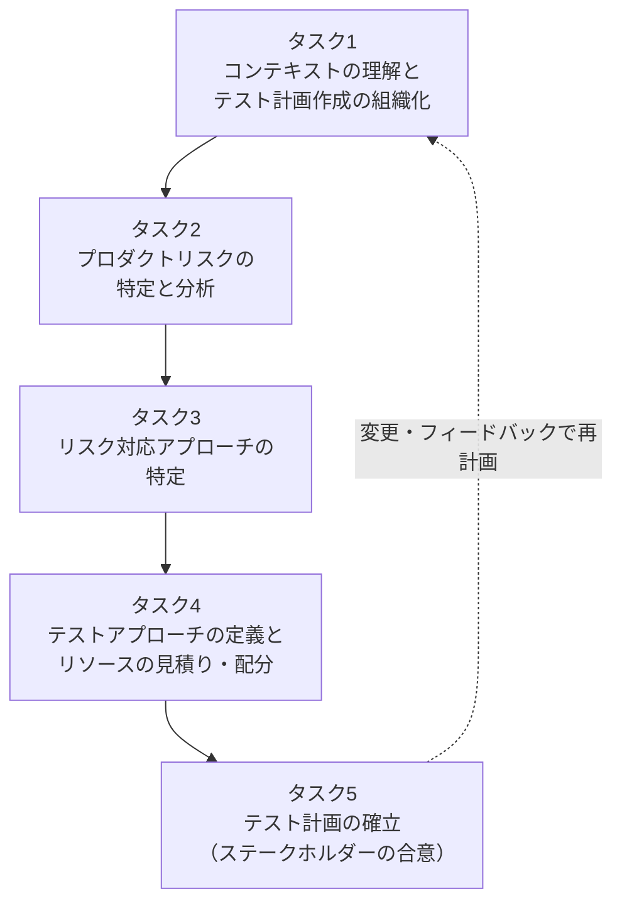

| # | タスク | 内容（要点） | ベストプラクティス |
|---|---|---|---|
| 1 | コンテキストを理解し、計画作成を組織化する | テストポリシー、組織のテスト戦略、テストのスコープ、テスト対象（テストアイテム）を把握する。計画作成の活動とスケジュールについて、ステークホルダー（プロダクトオーナー、プロジェクトマネージャー、開発チームマネージャー等）の承認を得る | 計画に着手する前に、**入力情報（方針・戦略・スコープ）を一覧化**し、欠けている情報は早めにステークホルダーへ確認する |
| 2 | プロダクトリスクを特定・分析する | 発生**可能性**と**影響**を評価する（詳細は Section 1.3） | リスク分析は**計画の入力**。計画書を書き終えてから後付けにしない |
| 3 | リスク対応アプローチを特定する | 分析結果に基づき、予防・是正・軽減などの対応方針を選び、**テスト計画に記載**する | 「テストで対応するリスク」と「他の手段（回避策・移転・受容）で対応するリスク」を切り分けて記録する |
| 4 | テストアプローチの定義とリソースの見積り・配分 | 組織のテスト戦略、規制標準、プロジェクトの制約、リスク対応アプローチを踏まえ、**現在のスコープ**のテストアプローチを定義する。要員、ツール、環境、データなどを見積り、活動に割り当てる | 人だけでなく、**ツール・環境・テストデータ**も見積り対象に含める（見落としやすい） |
| 5 | テスト計画を確立する | テスト計画は**すべてのステークホルダーに受け入れられる**必要がある。意見の相違は解消する | 合意の証跡（レビュー記録・承認記録）を残す。未解決の相違は**リスクとして計画に記載**する |

> 💡 **かんたん言い換え**
> 「計画」とは、①状況を理解し → ②リスクを見つけ → ③対応方針を決め → ④どうテストするか・何が必要かを決め → ⑤みんなで合意する、という一連の流れです。

#### 1.2.4 試験でよく問われるポイント

| 論点 | 正しい理解 |
|---|---|
| 計画はいつ行うか | プロジェクト開始時の 1 回だけではなく、**継続的に見直す**。可能な限り早期に着手する |
| 計画の成果物 | プロジェクトテスト戦略は**テスト計画の主要な成果** |
| 承認 | すべてのステークホルダーの**受け入れ**が必要。相違は解消する |
| 標準との関係 | ISO/IEC/IEEE 29119-2 に類似したタスク構成だが、標準自体は試験範囲外 |

### 1.3 テストのモニタリングとコントロール（TM-1.1.2）

#### 1.3.1 モニタリングとコントロールの違い

| 活動 | 目的 | 主な内容 |
|---|---|---|
| **モニタリング（監視）** | 状況を**把握する** | テスト結果の収集・記録、計画からの逸脱の特定、テストを必要とする新たなリスクの特定・分析、既知リスクの変化の監視 |
| **コントロール（統制）** | 状況に応じて**手を打つ** | 実績と計画の比較、是正措置の実施、テストが戦略と目的を満たすよう誘導、必要に応じて計画活動を見直す |

この 2 つは**継続的に行われる活動**です。

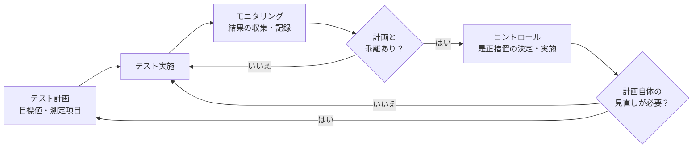

#### 1.3.2 モニタリングの枠組み（フレームワーク）を用意する

効率的なテストコントロールのため、次を整えておく必要があります。

- テストの状況と進捗を追跡できる**テストスケジュール**と**モニタリングの枠組み**
- テスト作業成果物とリソースの状況を、計画や戦略目標に関連付ける**詳細な測定値と目標値**

小規模で単純なプロジェクトでは関連付けが比較的容易ですが、一般には**より詳細な目的を定義**する必要があります（例：テスト目的の達成に必要な測定値・目標値、テストベースのカバレッジ）。

特に重要なのは、**プロジェクトやビジネスのステークホルダーが理解でき、かつ自分に関係があると感じる形**で状況を伝えることです。

#### 1.3.3 コントロールの 5 つの活動

| # | 活動 | 説明 |
|---|---|---|
| 1 | テスト計画とコントロール指示の実施 | 計画を実行し、統制のための指示を出す |
| 2 | 計画からの逸脱の管理 | スケジュール遅延、カバレッジ不足などに対処する |
| 3 | 新規・変更リスクへの対応 | モニタリングで見つかったリスクを扱う |
| 4 | テスト開始準備の確立 | テストを始められる状態（環境、データ、入力成果物など）を整える |
| 5 | **終了基準に基づくテスト完了の承認** | 終了基準を満たしていることを確認し、承認を与える／得る |

#### 1.3.4 ベストプラクティス

| 観点 | ベストプラクティス |
|---|---|
| 指標の設計 | 指標は**計画時に**定義し、目標値とセットにする（後付けの指標は判断基準が曖昧になる） |
| 報告の粒度 | 受け手（経営層／プロジェクト管理者／開発者）に応じて粒度を変える |
| リスクの追跡 | モニタリングに**リスク監視を含め**、リスク台帳を更新し続ける |
| 是正措置 | 逸脱の原因を確認してから措置を選ぶ（症状だけを見て対応しない） |
| 計画の見直し | 措置で対応しきれない場合は**計画活動に戻る**（再計画を「失敗」と考えない） |

### 1.4 テスト完了活動（TM-1.1.3）

#### 1.4.1 いつ行うか

テスト完了は、通常**プロジェクトのマイルストーン**（リリース、反復の終わり、テストレベルの完了）で行われます。未解決の欠陥については、**変更要求やプロダクトバックログアイテムを作成**します。**終了基準を満たした後**、主要な成果物を捕捉・アーカイブし、関係者に提供します。

#### 1.4.2 テスト完了の 5 つのタスク

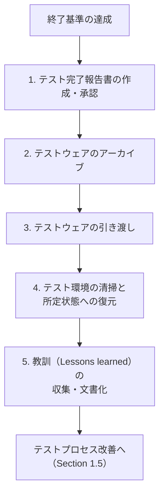

| # | タスク | 内容（要点） | ベストプラクティス |
|---|---|---|---|
| 1 | テスト完了報告書の作成と承認 | 全テストが実施され目的が達成されたことを確認する。テスト計画・結果・進捗報告・欠陥報告などのテストウェアから情報を収集・評価・要約し、承認を得て、関係者に周知する | 報告書は「実施したこと」だけでなく、**残存する課題（未解決欠陥、リスク）を明記**する |
| 2 | テストウェアのアーカイブ | 将来再利用できそうなテストウェア（典型的にはテストケース）を特定し、後から使いやすい形にする。テスト結果、ログ、報告書などは構成管理システムに一時的にアーカイブする | 再利用対象は「**誰が見ても分かる**」状態（前提条件・対象バージョンなど）にして保管する |
| 3 | テストウェアの引き渡し | 必要とする人に価値ある成果物を届ける。例：延期または受容された既知の欠陥を、製品の利用者や保守担当者に伝える | 引き渡し先（運用・保守・次期プロジェクト）を明確にし、**既知欠陥一覧**を必ず添付する |
| 4 | テスト環境の清掃と復元 | 次のテストサイクルやプロジェクトのために、テストデータ、ツール、ドライバ、スタブ、スクリプトなどを削除し、環境を元の（または所定の）状態に戻す | 復元手順を**チェックリスト化**し、環境を共有するチームと引き継ぎ確認を行う |
| 5 | 教訓の収集・文書化 | レトロスペクティブで得られた教訓を議論・記録する。SDLC 全体に関する発見を含む場合がある。プロセス改善（Section 1.5）に活用できる | 「良かった点」と「改善点」の両方を残す。責任追及ではなく**プロセスに着目**する |

#### 1.4.3 3 活動の比較（試験直前の整理用）

| 観点 | 計画 | モニタリング／コントロール | 完了 |
|---|---|---|---|
| 時期 | できるだけ早期から、継続的に更新 | テスト期間を通じて継続 | マイルストーン（リリース、反復終了、テストレベル完了） |
| 主な問い | 何を・どう・誰が・いつまでに？ | 計画どおりか？ずれたらどうする？ | 目的は達成できたか？何を残し、何を学んだか？ |
| 代表的な成果物 | テスト計画書、リスク対応方針 | 進捗報告、是正措置 | テスト完了報告書、アーカイブ、教訓 |
| 入力 | 方針、組織戦略、コンテキスト | 計画、測定値、リスク情報 | 終了基準の達成、テストウェア一式 |

---

## 2. テストのコンテキスト（Section 1.2）

**学習目標**：TM-1.2.1〜1.2.6（K2）、**TM-1.2.7（K4）**

### 2.0 この節の要点

テストのコンテキストとは、テストプロセスに影響を与える**独自の条件や制約**の集まりです。製品の種類、業界、規制要件、そして特に **SDLC** によって異なります。

> テストマネージャーは、テスト戦略や技法を「**開発する**」というより、確立された戦略を**適用**し、技法を**選択**します。そして、プロジェクトの文脈に合わせたテスト計画を作る役割を担います。

### 2.1 テストのステークホルダー（TM-1.2.1）

ステークホルダーとは、製品の品質に**直接または間接の関心**を持つ個人・グループです。

| ステークホルダー | テストへの関心・関わり |
|---|---|
| 開発者、開発リード、開発マネージャー | テスト対象システムを実装し、テスト結果に対応する。コンポーネントテストなどに参加・貢献する |
| テスター、テストリード、テストマネージャー | テストウェア（テスト計画等）を作成し、要件分析、テスト設計、実行、欠陥の追跡と報告、テスト自動化、進捗報告などを行う |
| プロジェクトマネージャー、プロダクトオーナー、ビジネスユーザー | 要件を明示し、求める品質レベルを定め、認識したリスクに基づく必要なカバレッジを推奨する。成果物をレビューし、受け入れテスト（UAT）に参加し、テスト結果に基づいて判断する |
| 運用チーム | 運用受け入れテストに関与し、システムが本番稼働できる状態かを確認する。非機能要件の定義にも寄与する |
| 顧客とユーザー | 顧客は製品を購入し、ユーザーは直接利用する。どちらも要件定義で重要で、UAT に関与して製品が自分たちのニーズを満たすか検証する |

> ⚠ 上の表はすべてを網羅していません。テストマネージャーは、**テスト戦略・テスト計画の作成の一環としてステークホルダー分析**を行い、自分のプロジェクトのステークホルダーを特定します。

#### ベストプラクティス

- ステークホルダー**一覧を計画の初期に作成**し、関心事（品質・納期・コスト・規制など）を併記する
- 「誰がテスト結果の**意思決定者**か」を明確にする
- 一覧は**定期的に更新**する（人事異動や体制変更で変わる）

### 2.2 ステークホルダーの知識の重要性（TM-1.2.2）

#### 2.2.1 ステークホルダーマトリクス（パワー／関心マトリクス）

ステークホルダーを、**影響力**と**関心**の 2 軸で 4 象限に分類します。

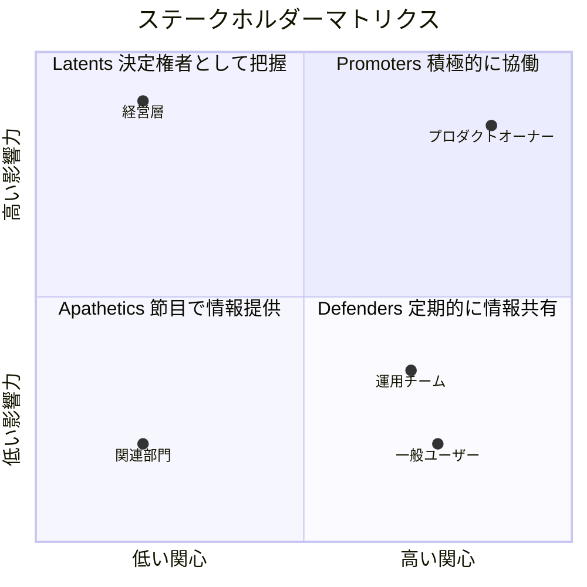

> 上の配置は**説明用のイメージ**です。実際の位置づけはプロジェクトごとに分析して決めます。

| 象限 | 影響力 | 関心 | シラバスの説明（要約） | 関わり方の例 |
|---|---|---|---|---|
| **Promoters** | 高 | 高 | 影響力・関心ともに高い重要な協働者。テスト戦略と計画の形成に不可欠 | 計画レビューや意思決定に**積極的に巻き込む** |
| **Latents** | 高 | 低 | 日々の作業への関心は薄いが、リソース配分や高レベルの方向性を左右する決定を行う | 要点を絞った報告で、必要な意思決定の場面に**確実に参加**してもらう |
| **Defenders** | 低 | 高 | 定性的なフィードバックを提供することが多い。定期的な更新や特定の議論への参加で関与を維持できる | **定期報告**と、特定テーマでの意見収集 |
| **Apathetics** | 低 | 低 | 密接には関与しないが、重要なマイルストーンの報告や、特定の課題への意見依頼が有益な洞察につながり得る | **節目での報告**、必要時の意見依頼 |

#### 2.2.2 ステークホルダーの知識を活用する理由（シラバスの 3 点）

1. **専門知識を活用できる**：エンドユーザーや技術チームは、性能やセキュリティについてのフィードバックと洞察を提供できる
2. **リスクマネジメントを支える**：関心と影響力が明らかになるほど、事前の軽減策を促せる
3. **多様な視点を尊重できる**：有益なフィードバックが得られる

テストマネージャーの役割は、**詳細なステークホルダー一覧の作成**と、**各人がテスト活動とどう関係するかの理解**、そしてマトリクスの活用です。

### 2.3 ハイブリッド開発モデルにおけるテスト管理（TM-1.2.3）

#### 2.3.1 ハイブリッドとは

**逐次型の進め方とアジャイルの実践を組み合わせた**開発モデルです。シラバスは、V モデル、反復型、増分型、アジャイルなどの要素を組み合わせるアプローチとして位置づけています（組み合わせ方の例：初期の計画・要件分析は V モデル、設計・開発・テストはアジャイル）。

#### 2.3.2 ハイブリッドが使われる主な理由

| 理由 | 説明 |
|---|---|
| **アジャイルへの移行手段** | 従来型からアジャイルへの移行は、ワークフロー・文化・チームの力学が大きく変わり困難。ハイブリッドは、従来の構造とアジャイルの柔軟性を組み合わせて移行を和らげる |
| **目的への適合（fit for purpose）** | アジャイルへ移行できない組織やプロジェクトもある。高リスクなプロジェクトでは、ある部分は逐次的に、ある部分はアジャイルで進める必要がある |

> 実際には、これら以外の理由もあり得ます。

#### 2.3.3 ハイブリッド環境でのテスト管理活動

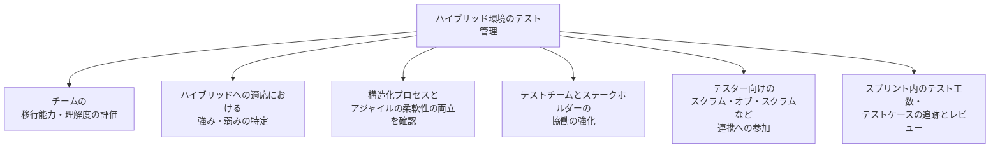

| 活動 | ベストプラクティス |
|---|---|
| 能力評価 | 逐次型とアジャイルの**両方の経験**があるメンバーを把握し、研修や配置で補う |
| 協働 | スプリント内テストと従来のテストフェーズの**接点（引き渡し条件）**を明文化する |
| 連携 | テスターがスクラム・オブ・スクラムに参加し、テストの観点を全体目標に反映する |
| 追跡 | スプリント内のテスト工数と結果を追跡し、アジャイルの実践と整合しているか確認する |

### 2.4 SDLC モデルごとのテスト管理活動（TM-1.2.4）

テストマネージャーは、組織で使われる各 SDLC モデルを理解し、その知識で**開発活動とテストの整合**を取ります。

| 観点 | 逐次型（例：V モデル） | 反復型（例：スクラム） |
|---|---|---|
| 見積り | 各テストレベルについて**早期に詳細な見積り**を行う | 反復ごとに見積り。ストーリー計画の一部として行う |
| テストウェア | 戦略、計画、テストケース、スケジュール、報告書などを含む | 受け入れ基準と Definition of Done が中心。文書は最小限 |
| 役割 | テストマネージャーが意思決定とチーム管理を担う | 役割は統合される。従来のテストマネージャーに代わり、ファシリテーターやコーチが担う |
| ツール | フェーズ型テストに適した**テスト管理ツール**が中心 | **CI/CD と自動化**のツールが中核で、継続的テストを支える |
| テストアプローチ | 事前にスケジュールされ、プロジェクトのフェーズに対応 | 反復に組み込まれ、適応性とフィードバックを重視 |
| テスト自動化 | 戦略的に導入。さまざまな段階で実施され得る | 開始時から組み込み。CI/CD での**自動回帰テスト**を重視 |
| モニタリングと報告 | マイルストーン単位の報告。自動ダッシュボードは任意 | リアルタイムのダッシュボードと日次の状況更新による**継続的な報告** |
| メトリクス | 従来のテストメトリクスと欠陥管理（テスト実行率、欠陥率など） | 従来のメトリクスに加え、反復追跡用のアジャイルメトリクス（チームベロシティ、バーンダウンチャートなど） |

> 試験ではこの表の**行ごとの対比**（例：「役割」「ツール」「報告」）を問う出題が想定されます。

### 2.5 テストレベルごとのテスト管理活動（TM-1.2.5）


| テストレベル | テスト管理活動（要点） | ベストプラクティス |
|---|---|---|
| **コンポーネントテスト**（単体テスト） | スコープ・目的・完了基準を定義する。コードレビューなど、従来のテスト役割を超えた活動にテスターを関与させ、分析力を活かす。問題解決や単体テストへの貢献で開発チームと調整する | 完了基準を**開発チームと合意**し、単体テストの状況を可視化する |
| **コンポーネント統合テスト** | 開発チームと協力して統合順序とテストの組み合わせを決める（SDLC・ツール・プロセスを考慮）。システムテスト・受け入れテストの戦略と整合するよう進捗を監督する。開発者と協力して管理する | 統合順序を**リスクと依存関係**から決め、スタブ／ドライバの準備を計画に含める |
| **システム統合テスト** | スコープと目的を明確にし、リスク評価と品質目標に合致させる。進捗、結果、課題管理を監督する | 他チーム・外部システムとの**インタフェース**調整窓口を置く |
| **システムテスト** | SDLC に合わせて計画し、リソース配分、ツール選定、スケジュールに注意する。**アジャイルでは**反復的なストーリーテストと統合し、独立したテストフェーズを避けて継続的に行う。逐次型では計画された段階に沿うことがある | SDLC に応じ、アジャイルでは**継続的**、逐次型では**段階的**に管理する |
| **受け入れテスト** | 受け入れ基準の充足を確認し、UAT でのユーザーテストの管理を含む活動を計画する。顧客サイトでのテスト実施など**ロジスティクス**を調整する。UAT の課題解決を促し、受け入れ基準を満たした後のサインオフをステークホルダーに案内する | 受け入れ基準を**契約・要件と紐づけ**、サインオフの手順を事前に合意する |

### 2.6 テストタイプごとのテスト管理活動（TM-1.2.6）

| テストタイプ | 管理の焦点 | 主な活動 |
|---|---|---|
| **機能テスト** | すべての機能が十分にテストされ、定義された要件を満たすこと | **戦略計画と進捗追跡**（機能要件とプロジェクト目標に整合した戦略）、**リソース調整**（人と技術リソースの効率的配分） |
| **非機能テスト** | 性能やセキュリティなどのシステム属性の検証 | **性能ベンチマークの確立**とテスト管理、**コンプライアンス検証**（セキュリティ、ユーザビリティ、信頼性などの非機能基準への適合） |
| **ブラックボックステスト** | テストがユーザー視点で、外部とのあらゆる相互作用を網羅すること | **テストカバレッジ分析**（ユーザーシナリオとビジネス要件の網羅）、**フィードバックの取り込み**（ステークホルダーの意見でアプローチを改善し、欠陥修正を管理） |
| **ホワイトボックステスト** | コード構造の理解と、内部ロジックの十分な網羅 | **コードカバレッジの最適化**（カバレッジツールでギャップを特定し資源を振り向ける）、**技術的知見の統合**（内部構造の理解をテスト計画に組み込む） |

> 💡 **関連する用語**：機能テストと非機能テストは「**何を**テストするか」の分類、ブラックボックスとホワイトボックスは「**どう**テストするか（何を根拠にテストを導出するか）」の分類です。

### 2.7 計画・モニタリング・コントロールの管理活動（TM-1.2.7、K4）

この学習目標は **K4（分析）** です。与えられたプロジェクトの状況を読み取り、**計画・モニタリング・コントロールのどこを強調すべきか**を判断します。

#### 2.7.1 シラバスが示す 3 領域の活動

**テスト計画**

| 活動 | 内容（要点） |
|---|---|
| 包括的なスコープ定義 | 機能・非機能要件をすべて特定し、完全なカバレッジを確保する。ブラックボックス／ホワイトボックス双方の意味合いも考慮する |
| リスク評価と軽減計画 | 詳細なリスク分析で、プロジェクトの流れと最終製品の両方に影響し得る脆弱性・課題を特定し、事前の軽減策を策定する |
| リソース配分戦略 | 配分にとどまらず、**チーム構造、役割、コミュニケーションのルール**を定義する。オンサイト／オフサイトなど分散環境では特に重要 |

**テストモニタリング**

| 活動 | 内容（要点） |
|---|---|
| 実行の監督 | テスト実行を計画と継続的に照合し、テストケースの進捗と発生した欠陥を管理する。リスク評価と状況の変化に応じて優先度を調整する |
| ツールと環境の最適化 | ツールと環境が **CI/CD パイプラインに統合**されているか監視し、継続的テストと即時フィードバックを可能にする |
| 開発との協働 | 開発チームとの緊密な関係を保ち、ホワイトボックス／ブラックボックス双方の知見を活用して問題を未然に防ぐ |

**テストコントロール**

| 活動 | 内容（要点） |
|---|---|
| 適応的なプロセス管理 | 新たな知見・課題・プロジェクトの変化に応じて、テストプロセスを動的に調整する。状況を反映してアプローチを変更できる柔軟性が必要 |
| **品質ゲート管理** | テストライフサイクル内の品質ゲートが何かを定義し、テストフェーズの進行について情報に基づいた判断を行う |

#### 2.7.2 K4 問題の解き方

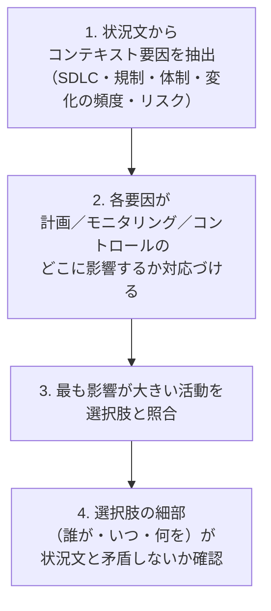

#### 2.7.3 状況とマネジメント活動の対応（考え方の例）

> 以下は理解を助けるための**考え方の例**です（シラバスの記述を状況に当てはめた整理）。

| 状況の手がかり | 強調すべき活動 | 理由・具体策 |
|---|---|---|
| 要件変更が頻繁で反復開発 | モニタリング／コントロール | ダッシュボードで日次に把握し、リスクに応じて優先度を柔軟に調整する |
| 開発とテストが地理的に分散 | 計画（リソース配分） | チーム構造、役割、コミュニケーションのルールを計画時に明確にする |
| 安全性・規制要件が厳しい | 計画（リスク評価）＋コントロール（品質ゲート） | 詳細なリスク分析と、進行判断のための品質ゲートを定義する |
| CI/CD を導入済み | モニタリング（ツールと環境） | パイプライン統合の状態を継続的に確認する |
| 新機能の追加で不確実性が高い | 計画（スコープとリスク） | スコープ定義とリスク軽減計画を先に固める |

---

## 3. リスクベースドテスト（Section 1.3）

**学習目標**：TM-1.3.1〜1.3.3、1.3.5、1.3.6（K2）、**TM-1.3.4（K4）**

### 3.0 リスクベースドテスト（RBT）とは

リスクの**特定・評価・監視・軽減**によってテストを**駆動する**考え方です。リスクは多様なステークホルダーが特定し、テストの**選択と優先順位付け**に使います。

> 原則：**リスクレベルが高いほど、テストは早く始め、より強く、より長く行う。**

### 3.1 リスク軽減活動としてのテスト（TM-1.3.1）

#### 3.1.1 テストがリスクを軽減する仕組み

| テスト結果 | リスクに対する意味 |
|---|---|
| 欠陥が見つかった | 欠陥の存在を認識でき、**リリース前に対処する機会**が得られる → プロダクトリスクの軽減に貢献 |
| 欠陥が見つからなかった | プロダクトリスクのレベルが**想定より低い**ことを示す |

テストマネージャーは、製品品質について**正確で信頼できる評価**を提供する責任があります。そのため、**品質保証に関連するプロジェクトリスク**（例：あいまいな要件が後工程の検証で大問題になる、テスト環境の不足でテスト実行が妨げられる）のリスク管理にも積極的に関与する必要があります。

#### 3.1.2 リスクマネジメントの一般プロセス

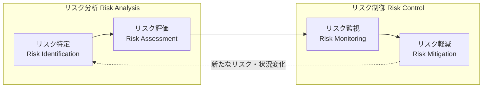

これらの活動は論理的には順に並びますが、**重なり合うこと**があります。

| 活動 | 分類 | 内容 |
|---|---|---|
| Risk identification | リスク分析 | リスクを見つける |
| Risk assessment | リスク分析 | 発生可能性と影響を評価する |
| Risk monitoring | リスク制御 | リスクの変化を監視する（テストモニタリングに含める） |
| Risk mitigation | リスク制御 | リスクを下げる対策を行う |

#### 3.1.3 テストマネージャーの役割

- 品質リスク分析の**主要なステークホルダー**として、活動を理解・監視し、**進行役（モデレーター）**を務める
- テストモニタリングに**リスク監視を含める**（既知リスクの推移、新しい品質リスクの分析、**リスク台帳の調整**）
- リスク軽減を推進する**複数人のうちの 1 人**（軽減は複数のテスト活動に分散する）

| テスト活動 | リスク結果の使われ方 |
|---|---|
| テスト計画 | 適切な領域に、適切な技法でテストを集中させる |
| テスト分析 | リスクレベルが、カバーすべき**テスト条件の選択**を導く |
| テスト実行 | リスクに基づく優先順位が**実行順序**を決める |

### 3.2 品質リスクの特定（TM-1.3.2）

テストマネージャーの仕事は、**ステークホルダーからリスクを集める**ことです。

#### 3.2.1 リスク特定の技法（シラバスの 7 つ）

| 技法 | 概要 | 向いている場面 |
|---|---|---|
| 専門家インタビュー | 有識者に個別にヒアリングする | 特定領域の深い知見が必要なとき |
| 独立した評価 | 第三者が評価する | 客観性を確保したいとき |
| レトロスペクティブ | 過去の振り返りからリスクを洗い出す | 反復型／過去プロジェクトの知見が豊富なとき |
| リスクワークショップ | 関係者が集まって議論する | 多様な視点を短時間で集めたいとき |
| ブレインストーミング | 自由に案を出し合う | 想定外のリスクを広く拾いたいとき |
| チェックリスト | 既存の項目一覧を使う | 抜け漏れを防ぎたいとき |
| 過去の経験の参照 | 過去の事例を参照する | 類似プロジェクトの経験があるとき |

#### 3.2.2 ベストプラクティス

| ポイント | 内容 |
|---|---|
| **関係者の網羅** | できるだけ広範なステークホルダーを巻き込むと、重要なプロダクトリスクの多くが特定できる。参加者リストは網羅的にし、**プロジェクトマネージャーと合意**する |
| 欠席者への配慮 | 参加できない場合でも、**参加の機会**または**代理を立てる機会**を保証する。重要な関係者が抜けていないかは、**キックオフミーティング**で確認できる |
| リスクの偏り | リスクはテスト対象の中で**均一ではない**。例：セルフサービスアプリの顧客向け部分と管理部分ではユーザビリティリスクが異なる。テストアイテムごとに特定する |
| 副産物の活用 | リスク特定では、プロダクトリスク以外（製品・プロジェクトへの一般的な疑問、要件や設計書の問題）も**副産物**として見つかる。プロジェクトリスクも見つかるが、**RBT の焦点ではない**。テストマネージャーは、副産物を明示して「品質は全員の関心事」と示す役割を担える |
| 要件の不備 | 要件が乏しい・欠けている状態は、計画・準備段階のより根本的な問題の兆候であることが多い |

### 3.3 品質リスクの評価（TM-1.3.3）

#### 3.3.1 評価の基本

リスク評価では、まず**分類**（プロダクトリスクか、プロジェクトリスクか。影響を受ける品質特性は何か）を行い、各リスク項目について次の 2 つを評価します。

- **リスクの発生可能性（Likelihood）**：発生する見込み
- **リスクの影響（Impact）**：発生した場合の影響

> **リスクレベル = 発生可能性 と 影響 の組み合わせ**

#### 3.3.2 発生可能性に影響する要因

| カテゴリ | 要因（シラバス記載） |
|---|---|
| 技術・複雑性 | 技術、ツール、システムアーキテクチャの**複雑さ** |
| 組織 | 組織の**成熟度**／マネジメントや技術リーダーシップの**弱さ**／時間・リソース・予算・経営陣の**プレッシャー** |
| 人・チーム | スキル、可用性、モチベーション、自律的な働き方、使用中の SDLC に関する知識などの**人的な課題**／チーム内の**対立**／**地理的に分散**したチーム |
| 外部 | 供給業者との**契約上の問題** |
| プロセス | **早期の品質保証活動の不足** |
| 変化 | テストベース、製品、または要員の**変更率が高い** |

#### 3.3.3 影響に影響する要因

| カテゴリ | 要因（シラバス記載） |
|---|---|
| 機能・利用 | 影響を受ける機能の**使用頻度**／**重要度**／影響を受けるビジネス目標の**重要度** |
| 信用・経済 | **評判**への損害／**事業収入**の損失／財務的、生態的、社会的損失、または責任 |
| 法的 | 民事または刑事の**法的制裁** |
| 技術 | **インタフェースと統合**の問題 |
| 回避可能性 | 妥当な**回避策がない** |
| 安全 | **安全上**の必要性 |

#### 3.3.4 定量評価と定性評価

| 方式 | 条件 | 計算・表現 |
|---|---|---|
| **定量評価** | 広範で統計的に妥当なリスクデータがある | 発生可能性を**確率（%）**、影響を**金額**で表し、**積**でリスクレベルを算出 |
| **定性評価**（典型） | データが不十分 | 「非常に高い・高い・中・低・非常に低い」のような**順序尺度**で評価し、**リスクマトリクス**で総合リスクレベルを得る |

> ⚠ 定性評価の総合リスクレベルは、**順序尺度上の相対的な評価**として解釈します。統計的に妥当なデータに基づかない限り、リスク分析は**ステークホルダーの主観的な認識**に基づきます。

**リスクマトリクスの例（説明用の 3×3 の例）**

| 影響＼発生可能性 | 低 | 中 | 高 |
|---|---|---|---|
| **高** | 中 | 高 | **非常に高** |
| **中** | 低 | 中 | 高 |
| **低** | 非常に低 | 低 | 中 |

**定量評価の計算例（説明用）**

| リスク項目 | 発生可能性 | 影響（損失額） | リスクレベル（積） |
|---|---|---|---|
| 決済処理の不具合 | 10% | 5,000 万円 | 500 万円 |
| 管理画面の表示崩れ | 30% | 100 万円 | 30 万円 |

### 3.4 適切なテストによる品質リスクの軽減（TM-1.3.4、K4）

#### 3.4.1 テスト以外の軽減策

ソフトウェア開発では**テストが最も重要な軽減活動**で、故障の可能性を下げます。その他の軽減策は次のとおりです。

| 軽減策 | 例 |
|---|---|
| コンティンジェンシープラン | 回避策の提供 |
| リスク移転 | コンポーネントのベンダーなど第三者への移転 |
| リスク受容 | 残存リスクを受け入れる |

#### 3.4.2 リスクレベルに比例した労力

- **高リスク**：テストを**早く開始**し、**より厳格な技法**を使う
- **低リスク**：**遅く開始**してもよく、**厳格さの低い技法**でよい

#### 3.4.3 テストアプローチを選ぶための 6 つのコンテキスト要因

| 要因 | 考慮内容 |
|---|---|
| **テストアイテム** | 同じリスクタイプでも、アイテムごとにレベルが違う。テスト対象を**均一な厳格さでテストする必要はない** |
| **品質特性** | 特定の品質特性のリスクは、それに対応するテストタイプで軽減し、**専用の工数・環境・スキル**が必要 |
| **テストレベルとテストタイプ** | 特定レベルでの動的テストでのみ検出可能なもの、静的テスト（静的解析、保守性のコードレビュー）が向くもの、両方の組み合わせが必要なもの（例：アーキテクチャレビュー＋統合システムでのセキュリティ脆弱性の動的テスト）がある。**可能な限り早期にテスト**すると、後工程での重大欠陥発見による内部失敗コストと遅延を避けられる |
| **SDLC** | テスト活動には固有の開始基準があり、SDLC によって満たされる時期が異なる |
| **テストチーム** | **最も熟練した人**を、**最も高リスクのアイテム**のテストに充てる |
| **規制要件** | 安全関連の標準（例：IEC 61508）は、**完全性レベルに応じて**テスト技法と必要なカバレッジを規定する。テストマネージャーは遵守を確保する |

さらに、リスクレベルは次のような**品質管理上の判断**にも影響します。

- テストケースなどの成果物に対する**レビューの実施**
- 開発からの**テストの独立性**のレベル
- **回帰テストの範囲**

#### 3.4.4 リスクレベル別の対応（K4 の考え方の例）

> 以下は K4 問題で「リスクレベルに応じて適切な活動を選ぶ」際の**整理の例**（シラバスの原則を表にしたもの）です。

| 観点 | 高リスク | 低リスク |
|---|---|---|
| 開始時期 | 早期 | 後でもよい |
| テスト技法 | より厳格・体系的 | 軽量・簡易 |
| 担当者 | 最も熟練した人 | 経験が浅い人でもよい（ただし支援体制を確保） |
| レビュー | テストケースをレビュー | 省略または簡易 |
| 独立性 | 高いテストの独立性 | 低くてもよい |
| 回帰テスト | 範囲を広く | 範囲を絞る |

#### 3.4.5 リスクに基づく進捗報告

テストのモニタリングとコントロールの間、RBT では**残存リスクレベル**で進捗を報告できます。これにより、開発チームとステークホルダーは、残存リスクレベルに基づいて**リリース判断**などを行えます。ただし、**ステークホルダーが理解できる形**でテスト結果をリスクの観点から報告する必要があります。

#### 3.4.6 リスクに基づくテストの優先順位付け：深さ優先と幅優先

テスト実装の間、優先順位付けは**リスクレベルに基づく**ことで、テスト実行中に最も重要な領域を早くカバーし、最高レベルのリスクを軽減します。

| 方式 | 内容 | 適する状況 |
|---|---|---|
| **深さ優先（depth-first）** | カバーするリスクレベルが**高い順に厳密に**テストを実行する | 最高レベルのリスクを**できるだけ早く**軽減することが重要な場合 |
| **幅優先（breadth-first）** | **各リスクに対して少なくとも 1 つのテスト**を最高優先度にする。残りは、カバーするリスクレベルに基づいて優先順位を付ける | ステークホルダーが**製品品質の全体像をできるだけ早く**知りたい場合 |

実務では、テストは深さ優先で始まり、時間が限られてくると幅優先に切り替え、**残りのすべてのリスク項目を少なくとも 1 回はテスト**することが多いです。

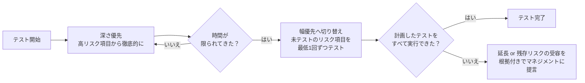

**実行順序の例（説明用）**

| リスク項目 | リスクレベル | テスト |
|---|---|---|
| R1 決済 | 非常に高 | T1, T2, T3 |
| R2 認証 | 高 | T4, T5 |
| R3 検索 | 中 | T6 |
| R4 ヘルプ表示 | 低 | T7 |

| 方式 | 実行順序 |
|---|---|
| 深さ優先 | T1 → T2 → T3 → T4 → T5 → T6 → T7 |
| 幅優先 | **T1 → T4 → T6 → T7**（各リスクに 1 つずつ）→ T2 → T3 → T5 |

> 深さ優先でも幅優先でも、テスト時間が**すべての計画テストを実行する前に尽きる**ことがあります。このとき RBT は、**テストを延長するか、残存リスクを受容するか**について根拠のある提言をマネジメントに行うことを可能にします。

### 3.5 リスクベースドテストの技法（TM-1.3.5）

技法には形式度合いが異なる 2 つの基本タイプ（**重量級／軽量級**）があります。適切さは、プロジェクト・プロセス・製品の状況で決まります。**安全重要システム**では重量級が多く、**非安全重要**では軽量級が通常使われます。

| 観点 | 重量級（Heavyweight） | 軽量級（Lightweight） |
|---|---|---|
| 形式度 | **形式的**。定められた手順と詳細な文書 | 網羅性は低く、テストチームとステークホルダーの**労力が少ない** |
| ステークホルダー | **広範なグループ**が関与 | 範囲が広くないことがある |
| リスク評価 | 発生可能性と影響を詳細な要因に分解し、**数式**で算出 | リスク要因は通常、**順序尺度の影響と発生可能性**に集約 |
| 代表例 | ハザード分析、Cost of exposure、FMEA とその派生、フォールトツリー解析 | SST、PRAM、PRISMA |
| 適する対象 | 安全重要システム | 非安全重要アプリケーション |

#### 3.5.1 重量級技法の 4 例

| 技法 | 概要 |
|---|---|
| **ハザード分析（Hazard analysis）** | 分析プロセスを上流に拡張し、**各リスクの根底にあるハザード**を特定しようとする |
| **Cost of exposure** | 各品質リスク項目について、**故障の可能性**、**典型的な故障による損失コスト**、**その故障に対するテストのコスト**を決定する |
| **FMEA（故障モード影響解析）とその派生** | 品質リスク、その**潜在的な原因**、**予想される影響**を特定し、**重大度・優先度・検出率**を割り当てる |
| **フォールトツリー解析（FTA）** | 潜在的な故障を、それを引き起こし得る**欠陥**に関連づけ、さらにその欠陥を引き起こす**エラー**へと、**根本原因**が特定されるまで遡る |

#### 3.5.2 軽量級技法の 3 例

| 技法 | 特徴 |
|---|---|
| **SST（Systematic Software Testing）** | **要件仕様が提供される場合にのみ**使用できる |
| **PRAM（Pragmatic Risk Analysis and Management）** | 要件やその他の仕様を入力に使うが、**ステークホルダーの入力のみで機能**できる |
| **PRISMA（Product Risk Management）** | PRAM と同様に、仕様を入力に使うが、**ステークホルダーの入力のみで機能**できる |

### 3.6 RBT の成功メトリクスと課題（TM-1.3.6）

#### 3.6.1 成功の確認（レトロスペクティブでの 6 つの問い）

レトロスペクティブで、RBT の効果をどの程度実現できたかを、**メトリクスと関係者との協議**で確認します。

| # | 問い |
|---|---|
| 1 | 関連するステークホルダーは、リスク分析に**関与または代表**されていたか |
| 2 | リスク分析へのステークホルダーの**関与は適切**だったか |
| 3 | 重大な欠陥が**本番に流出**した事象がある場合、それらは**解決**されたか |
| 4 | 優先度の高い欠陥の**大半が、テスト実行の早期**に見つかったか |
| 5 | テストチームは、テスト結果を**リスクの観点でステークホルダーに説明**できたか |
| 6 | **スキップされたテスト**は、実行されたテストよりも**関連するリスクレベルが低かった**か |

成功した RBT では、通常これらすべてに肯定的に答えられます。長期的には、成功メトリクスの**プロセス改善目標**を設定し、リスク分析の効率を高める努力が必要です。

#### 3.6.2 よくある困難とその解決策（シラバスの 5 項目）

| 困難 | 内容 | 解決策 |
|---|---|---|
| **リスクレベル評価の難しさ** | 影響と発生可能性の見積りが非常に難しい | **過去データ**を使い、主要なプロジェクトステークホルダーに評価を依頼する |
| **Keen beginnings（熱意ある開始）** | 短期的な成功へのプレッシャーの中で、RBT の確立と維持がおろそかになりがち | リスクを**定期的に監視し、ステークホルダーに報告**する |
| **Déjà vu（既視感）** | 毎回同じリスクが挙がり、リスクに対して**慢心**が生まれる | リスク特定に**適切な人を関与**させ、重要と判断されたリスクだけを軽減する |
| **重要なリスクの見落とし** | 経験の浅い人や不適切な人の関与が根本原因になりやすい | **適切な人を関与させ、訓練**する |
| **ステークホルダーの入れ替わり** | ステークホルダーは変わり、新しいリスクも出てくる | リスク分析は**継続的・反復的**に行い、最初の 1 回で終わらせない |

---

## 4. プロジェクトテスト戦略（Section 1.4）

**学習目標**：TM-1.4.1（K2）、**TM-1.4.2（K4）**、**TM-1.4.3（K3）**

### 4.0 前提：3 つの文書・概念の関係

- **組織のテスト戦略**は、本シラバスでは**与えられたもの**として扱います（策定・維持は ISO/IEC/IEEE 29119-3、Expert Level Test Management、Agile Test Leadership at Scale の範囲）
- 組織のテスト戦略が**存在しない**、または必要な観点を**カバーしていない**場合、テストマネジメントは、欠けている詳細を関連ステークホルダーと**明確化する**必要がある
- **プロジェクトテスト戦略**は、プロジェクト・リリース・製品などの詳細なテスト戦略の例で、**特定の文脈で組織の目標（特に製品品質とテスト活動に関するもの）を達成するためのアプローチ**を示す
- プロジェクトテスト戦略は**テスト計画の主要な成果**で、通常はテスト計画書、または他の文書の一部として記述される

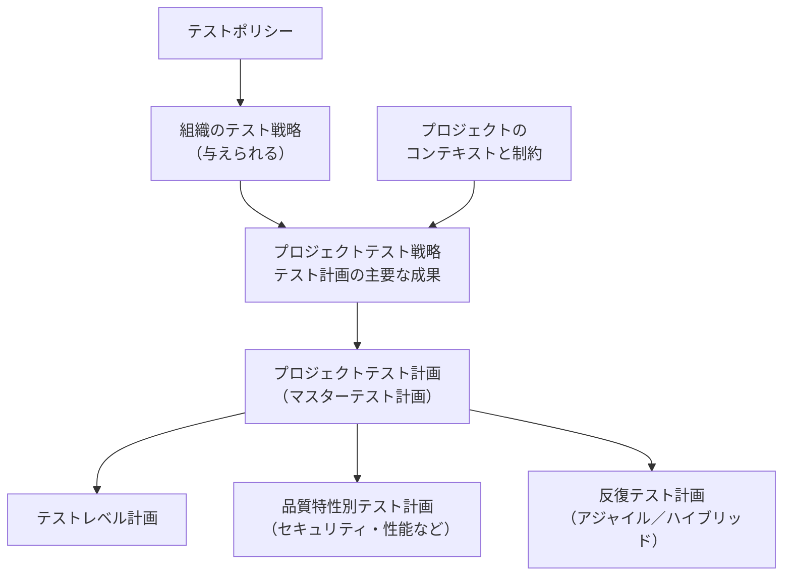

**文書化のガイドライン**

| 観点 | 内容 |
|---|---|
| 推奨 | 戦略の**文書化は推奨**されるが、必ずしも正式なテスト計画書の形式である必要はない |
| 判断基準 | 文書化の必要性は**テストのコンテキスト**（Section 1.2）に依存する |
| 逐次型 | プロジェクトテスト戦略は通常文書化される。**テスト計画書に記述するのが望ましい** |
| 外部要求 | 契約、合意、規制当局、法律により文書化が求められることも多い |

### 4.1 テストアプローチの選択（TM-1.4.1）

プロジェクトテスト戦略は、プロジェクト内のすべてのテスト活動を導き、**目的、リソース、スケジュール、責任**を詳述します。プロジェクト固有の要件に合わせて調整する必要があります。

#### 4.1.1 主要な意思決定

| 選択項目 | 例 |
|---|---|
| テストレベル | コンポーネント／統合／システム／受け入れ |
| テストタイプ | 機能／非機能 など |
| テスト技法 | 静的テスト／動的テスト |
| その他のテスト実践 | スクリプト化テスト、手動テスト、バックツーバックテスト など |

#### 4.1.2 理論と実務のギャップ

- 理論上は、**どのテストタイプも、どのテストレベルでも**実施でき、**どのテスト技法も**任意のテストレベルの任意のテストタイプに適用できる
- 実務では、これらの**選択と組み合わせが、テストの有効性と効率に大きく影響する**

| 評価したいこと | より効果的・効率的な選択の例（シラバス） |
|---|---|
| コードの保守性 | **静的コード解析**やコードレビュー |
| 性能効率性 | 内部コンポーネントの相互作用があるため、**スクリプト化されたシステムテスト** |
| 機能の有用性 | ユーザーと**協働で作成した手動の受け入れテスト** |

### 4.2 組織のテスト戦略、プロジェクトのコンテキスト、その他の側面の分析（TM-1.4.2、K4）

適切なテストアプローチを選ぶために、通常次の **7 つの要因**を分析します。

| # | 要因 | 内容 | シラバスの例 |
|---|---|---|---|
| 1 | **ドメイン** | 製品が作成・変更される領域。ドメイン固有の規制・標準・慣行により、テストの厳格さ、必要な文書、詳細度が変わる | 製薬・医療では、**患者の健康リスク**に焦点を当てた集中的な UAT を機能ユーザー要件に基づくテストケースで実施することが多い。一方、Web の保険アプリでは、ユーザビリティや **A/B テスト**による契約増加に焦点を当てることがある |
| 2 | **組織の目標と全体的な品質特性** | テストの価値を示す必要性、テスト自動化の程度の向上、テストプロセスの成熟度、欠陥検出の効率など。実施すべきテストレベル・テストタイプを左右し得る | — |
| 3 | **プロジェクトの目標とプロジェクトの種類** | 予算・時間・品質の目標、顧客固有開発か市場向け製品開発か。制約・リスク・機会を含む | 予算と時間が厳しい場合は**リスクベースドテストを徹底**してテストケースを優先度付けする。顧客向け開発では**契約上の受け入れ基準**を網羅するテストが必要になる |
| 4 | **テストリソース** | ツール、インフラ、技術、開発環境、要員とスキル（Section 3.1 参照） | **経験ベースドテスト**にはドメイン知識のあるテスターが必要。モバイルアプリでは限られた**デバイス**でのテストになる。ツールは**ライセンス数**に制限される |
| 5 | **SDLC モデル** | テストレベル、工数、開始基準・終了基準を決める（FL v4.0 の 2.2 と 5.1 参照） | **継続的インテグレーション**を伴うライフサイクルは、ウォーターフォールの一回限りの開発より**自動テストが多く必要** |
| 6 | **他システムとのインタフェース** | システム・オブ・システムズでは、他のチームやプロジェクトとの整合とテストレベル選択（特にシステム統合テスト）が不可欠 | **RBT** はシステム統合テストの優先順位付けと規模調整に役立つ |
| 7 | **テストデータの可用性** | 本番から**匿名化**したテストデータが必要、特定のテストデータの作成・検証が難しい（例：AI テストのデータ）などの制約 | **モデルベースドテスト**はテストデータの作成・管理を支援できる |

**結論：** テストマネージャーは、組織のテスト戦略、プロジェクトのコンテキスト、その他の制約を満たす**最適なアプローチとして、テスト技法・テストレベル・テストタイプの組み合わせを決定**します。

#### 4.2.1 K4 問題の解き方（分析フロー）

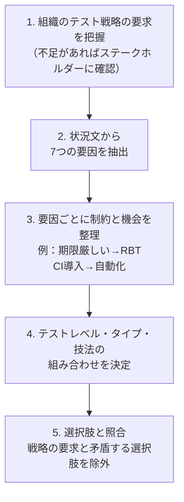

#### 4.2.2 状況から選択するアプローチ（考え方の例）

| 状況の手がかり | 選択の例 | 根拠となる要因 |
|---|---|---|
| 医薬品の業務システムで規制が厳しい | 患者リスクに焦点を当てた詳細な UAT と、要件に基づく文書化 | ドメイン |
| 期限と予算が非常に厳しい | RBT による優先度付け | プロジェクトの目標 |
| CI/CD を運用している | 自動回帰テストを中核に据える | SDLC モデル |
| 外部システムと多数連携している | RBT で統合テストの優先順位と規模を調整 | インタフェース |
| 実データを使えない | 匿名化データの整備やモデルベースドテストの活用 | テストデータ |
| ドメイン知識のある要員が少ない | 経験ベースドテストへの依存を抑える | テストリソース |

### 4.3 テスト目的の定義（TM-1.4.3、K3）

#### 4.3.1 テスト計画に含めるもの

テスト計画は各テストプロジェクトで定義し、**テストスコープ、テスト目的、終了基準**などを含めます。

| 計画の種類 | 説明 |
|---|---|
| プロジェクトテスト計画（マスターテスト計画） | リリースレベルで設定できる |
| テストレベル計画 | 必要に応じて、異なるテストレベルごとに定義 |
| 品質特性別テスト計画 | セキュリティテスト計画、性能テスト計画など |
| 反復テスト計画 | **アジャイル**および**ハイブリッド**のプロジェクトで合意できる |

各リリース・反復で、提供される**機能の範囲とその非機能特性**をテスト計画で定義し、ステークホルダーが合意します。

#### 4.3.2 S.M.A.R.T. 目標設定法

プロジェクトのテスト目的と終了基準は、**S.M.A.R.T.** で定義できます。

| 文字 | 意味 | 内容 | 悪い例 → 良い例（説明用） |
|---|---|---|---|
| **S** | Specific（具体的） | 明確で曖昧さがない | 「品質を高める」→「重大度が高の未解決欠陥を 0 件にする」 |
| **M** | Measurable（測定可能） | 定量化でき、達成の判断基準がある | 「十分にテストする」→「要件カバレッジ 95% 以上」 |
| **A** | Achievable（達成可能） | 利用可能なリソース、期間、能力を考慮して実現可能 | 「2 日で全機能の性能テストを完了」→「主要 3 機能の性能テストを 5 日で完了」 |
| **R** | Relevant（関連性がある） | プロジェクト全体の目的と整合している | 「使わない機能のカバレッジ 100%」→「主要業務フローのカバレッジ 100%」 |
| **T** | Timely（期限がある） | 具体的な期間と完了期限がある | 「いつか自動化率を上げる」→「リリース 2 までに回帰テストの自動化率を 60% にする」 |

> 目的は、**測定可能または評価可能**である限り、品質と量の**対象となるすべての側面**に対応する必要があります。

#### 4.3.3 プロジェクトテスト目的の例（シラバス）

| 目的の種類 | 例 |
|---|---|
| 終了基準の達成 | 定義された期間内に、指定された終了基準を達成する |
| 組織の品質目標 | 例：製品に関する顧客クレーム件数を KPI として測定 |
| 規制・法令遵守 | 業界固有の規則と規制を遵守する |
| アクセス制御 | データが**認可されたユーザーのみ**に利用可能であること（アクセス権限など） |
| データ移行 | データ移行の機能完全性、機能正確性、性能効率性、移植性、セキュリティを確認 |
| 自動化 | 回帰テストや性能テストの自動化レベルを、**定義した割合**で強化する |
| リファクタリング | 技術的負債を減らしながら既存機能を維持し、**回帰テスト**で新たな欠陥が入っていないことを示す |
| インタフェースのセキュリティ | XML メッセージを **XSD**（XML Schema Definition）に照らして検証し、悪意あるデータが拒否されることを確認 |
| ユーザビリティ | オンラインショップでの**特定タスクの所要時間**を測定するなどして、副特性の達成度を確認 |

数値による測定に加えて、**ドメインの専門家やステークホルダーによる品質レベルの評価**も検討します。

#### 4.3.4 テスト環境に関する注意

- プロジェクトの状況とテスト目的によっては、利用可能なリソースやツールを備えた**複数のテスト環境**が必要になる
- テスト環境が**同時に利用できない**こともある
- 達成可能な目的と終了基準を定式化する際に、これを考慮する必要がある

#### 4.3.5 S.M.A.R.T. の適用例（説明用）

| 項目 | 内容 |
|---|---|
| 目的 | 決済機能のリリース判定の品質基準を定義する |
| 終了基準 1 | 重大度 1・2 の未解決欠陥が 0 件（S・M） |
| 終了基準 2 | 決済関連の要件に対するテスト実行率 100%、合格率 98% 以上（M・R） |
| 終了基準 3 | 性能テストで、ピーク時の応答時間が目標値以内（M・A） |
| 期限 | 2026 年 11 月 30 日のリリース判定会議までに達成（T） |
| 補足 | テスト環境が 2 面のみのため、性能テストは 11 月 15 日までに完了（A） |

---

## 5. テストプロセスの改善（Section 1.5）

**学習目標**：TM-1.5.1〜1.5.3（K2）、**TM-1.5.4（K3）**

### 5.0 なぜテストプロセスを改善するのか

- テストはソフトウェア開発の重要な部分で、**総プロジェクトコストの少なくとも 30〜40%** を占めることが多い
- 複雑さ・規模の増大、新技術、多様なデバイス・OS、セキュリティ脆弱性など、技術的課題が増えており、テストの**有効性と効率**を高める必要がある
- 既存のベストプラクティスや**自分たちの過ちから学ぶ**ことで、プロセスを改善できる

| 観点 | 内容 |
|---|---|
| 改善のきっかけ（例） | 現在のテスト結果への不満、予期せぬ欠陥、状況の変化、ベンチマーク結果、コミュニケーション不足 |
| 組織レベルとプロジェクトレベル | 組織レベルの改善のほうが通常有用。ただし、**プロジェクト／チームレベルでも可能で有益**（ニーズに合わせて調整する） |
| 適用範囲 | 本節の技法は**逐次型・アジャイル／増分型**のどちらにも適用できる |
| 深掘り | ISTQB Expert Level「Improving the Test Process」シラバスが詳しい |

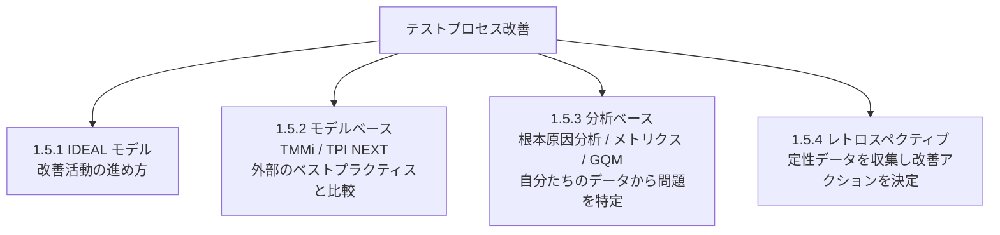

### 5.1 IDEAL モデル（TM-1.5.1）

IDEAL は、よく知られた **PDCA サイクル**と似た考え方に基づく、改善実施のためのモデルです。頭文字は次のとおりです。

| 文字 | 英語 | 日本語 |
|---|---|---|
| **I** | Initiating | 開始 |
| **D** | Diagnosing | 診断 |
| **E** | Establishing | 確立 |
| **A** | Acting | 実行 |
| **L** | Learning | 学習 |

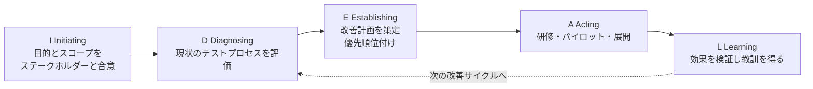

| フェーズ | 内容（要点） | ベストプラクティス |
|---|---|---|
| **Initiating** | 改善プロセスの開始時に、改善の**目的とスコープ**をステークホルダーが合意する | プロジェクトレベルでは規模が**はるかに小さい**。関係者が少ないので短時間で合意する |
| **Diagnosing** | 現在のテストプロセスを評価して、改善可能な点を特定する。**モデルベース**（標準フレームワークに照らす）か、**分析ベース**（特定メトリクスの分析）で行う | プロジェクトレベルでは、**レトロスペクティブ**で診断することが多く、規模も小さい |
| **Establishing** | **テストプロセス改善計画**を作る。正式な文書のことも、非常に軽量で非公式なこともある。改善候補の一覧は**優先順位付け**する（基準：**ROI**、リスク、プロジェクト／チーム戦略との整合、測定可能な定量的・定性的な便益） | 一度に多くの改善を抱え込まず、**優先順位の高いものから**着手する |
| **Acting** | 計画を実行する。**研修**、変更プロセスの**パイロット**、プロジェクト／チームへの**全面展開**を含むことが多い | まず小さく試して（パイロット）から展開する |
| **Learning** | 全面展開後、計画された便益・予期せぬ便益を**検証**する。うまくいったこと・いかなかったことから学び、その情報に基づき行動し、**その後に次の改善サイクル**が始まる | 便益の検証を省略しない。「やりっぱなし」にしない |

**プロジェクトレベルでの IDEAL の適用**
IDEAL はもともと**組織レベル**の改善を支援するために定義されましたが、**プロジェクトやアジャイルチームのレベル**でも適用できます。主な違いは **Initiating フェーズが大幅に小さい**ことです。診断（レトロスペクティブ経由）と計画確立も小規模になりますが、**Acting と Learning は同様に重要**です。

### 5.2 モデルベースのテストプロセス改善（TM-1.5.2）

#### 5.2.1 基本的な考え方

モデルベース改善とアナリティカル改善はいずれも、「**製品品質は、使用・適用されるプロセスの品質に大きく左右される**」という前提に立ちます。モデルベースでは**テスト改善モデル**を使います。これらのモデルは**テストのベストプラクティス**に基づき、テスト改善を**段階的に**整理します。

| 項目 | 内容 |
|---|---|
| 代表的モデル | **TMMi®**（Test Maturity Model integration）と **TPI NEXT®** |
| プロジェクトレベルでの適用 | モデルの中で**プロジェクトレベルの活動**（例：テスト計画、テスト設計）に関わるプロセス領域・キーエリアに焦点を当て、**組織レベルの領域**（例：テストポリシー、テスト組織）はほぼ省略する。あるいは、組織レベルの実践を**プロジェクトの文脈に合わせて調整**して適用する |
| 深掘り | ISTQB Expert Level「Improving the Test Process」シラバス |

#### 5.2.2 TMMi® と TPI NEXT® の比較

| 観点 | TMMi® | TPI NEXT® |
|---|---|---|
| 構造 | **5 つの成熟度レベル**。レベル 1 を除く各レベルにテストプロセス領域と改善目標がある | **16 のキーエリア**（例：テスト戦略、テストメトリクス、テストツール、テスト環境）。各キーエリアに **4 つの成熟度レベル** |
| 支援要素 | 実装を支援するプラクティス、サブプラクティス、事例 | 各キーエリアの各成熟度レベルを評価する**具体的なチェックポイント** |
| 結果の可視化 | 成熟度レベルごとの達成状況 | 評価結果を、全キーエリアをカバーする**成熟度マトリクス**で要約・可視化 |
| 補足 | 当初は **CMMI** を補完する目的で開発されたが、現在は CMMI と**独立して広く**使われる。アジャイル開発向けに**専用ガイドライン**も存在する | — |
| 参考 URL | www.tmmi.org | www.tmap.net |

> 💡 **モデルベースの特徴**：プロジェクトやチームのテストアプローチを、**外部のベストプラクティスと比較**して改善を導入します。

### 5.3 分析ベースのテストプロセス改善（TM-1.5.3）

#### 5.3.1 モデルベースとの違い

| アプローチ | 問題の見つけ方 | データ |
|---|---|---|
| モデルベース | 外部のベストプラクティスとの**比較** | モデルの基準 |
| **分析ベース** | **プロジェクトやチーム自身のデータ**から問題を特定 | 定量的データと定性的データ |

- 分析ベースは、モデルベースと**併用**して、結果の検証と多様性の確保に使える
- 本節（1.5.3）は主に、テストプロセスと**欠陥データ**の**定量的データ**を使う手法を紹介する。**定性的データ**を扱うのは 1.5.4 のレトロスペクティブ
- データ分析は、**客観的な**プロセス改善に重要。純粋に定性的な評価は、データに裏付けられない**不正確な提言**につながり得る

#### 5.3.2 代表的な 3 つの分析アプローチ

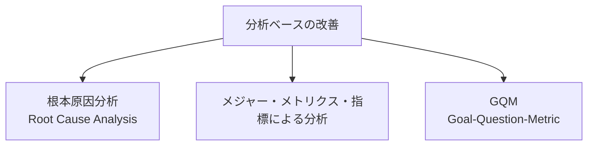

| アプローチ | 内容 |
|---|---|
| **根本原因分析（RCA）** | 問題の**根本原因**を特定する研究。目先の症状だけに対処するのではなく、**原因を取り除く**解決策を特定できる |
| **メジャー・メトリクス・指標** | テストプロセスがどの程度うまく実行されているかを**定量的**に評価する。考慮すべき主要属性は**有効性・効率・予測可能性**。属性ごとに 1 つ以上のメトリクスを選び、データを収集・分析して改善が必要な領域を特定する |
| **GQM（Goal-Question-Metric）** | ステークホルダーの**情報ニーズ**に合わせたメトリクスを定義・分析するためのフレームワーク |

#### 5.3.3 根本原因分析の手順


#### 5.3.4 GQM の流れ

| ステップ | 内容 |
|---|---|
| **Goal（目標）** | 特定の目的・視点・状況で測定すべき**品質の側面**を定義する |
| **Question（質問）** | 目標を、ステークホルダーの視点から品質の側面を定義する**質問に洗練**する |
| **Metric（メトリクス）** | 質問に答えるために必要な情報を提供する**メトリクスを選定**する |
| 評価 | 収集したデータが質問に答え、測定目標を評価し、ステークホルダーの情報ニーズを満たす |

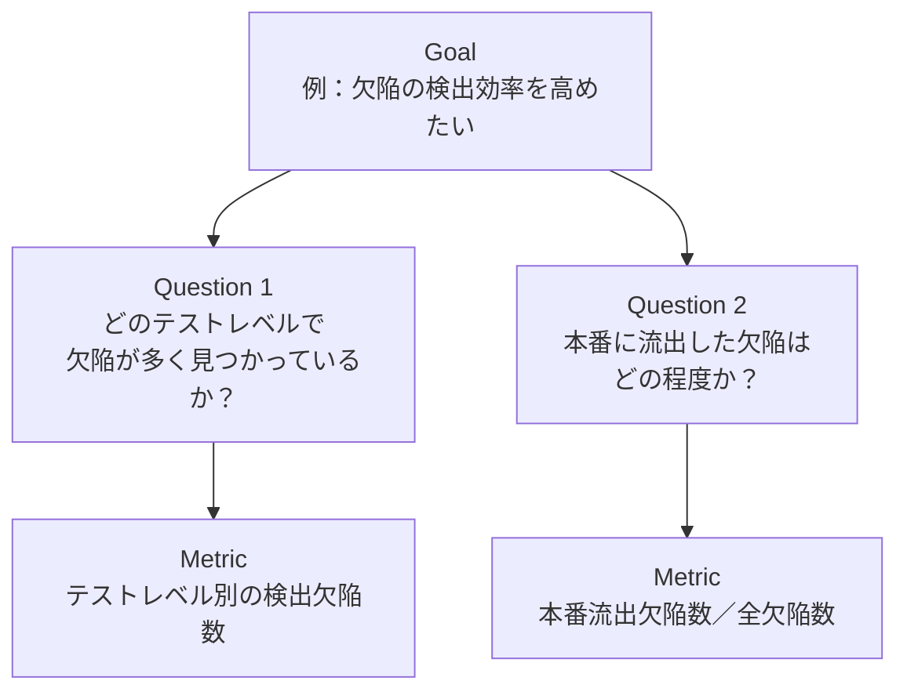

> 上の GQM は**説明用の例**です。

### 5.4 レトロスペクティブ（TM-1.5.4、K3）

#### 5.4.1 定義と位置づけ

レトロスペクティブは、チームが**方法と協力体制を見直し**、良い点・悪い点の**教訓を捉え**、改善のための**変更とアクションを決める**会議です（テストに関する課題と、それ以外の課題の**両方**が対象）。扱うテーマは、プロセス、人、組織、協働、ツールなどです。

| 観点 | 逐次型 | アジャイル |
|---|---|---|
| 位置づけ | **テスト完了の一部** | 通常、**各反復の終わり**に実施 |
| 目的 | 将来のプロジェクトをより良く管理するための**教訓を生み出す** | 何が成功し、何を改善すべきか、その改善を**次の反復にどう取り込むか**を議論する |
| 文書化 | 発見事項・結論・提言を、組織のメンバーに**理解しやすい形で配布・伝達** | 問題とアクションを文書化し、**次の反復で**アクションとその影響を**確認できる**ようにする |

- レトロスペクティブは**チーム全体**で実施し、**ホールチームアプローチ**を支え、継続的改善を促進する
- **テスト課題に特化した**専用のレトロスペクティブが必要なこともある
- テスターはチームの一員として、**独自の視点**でテスト関連（およびその他）の問題を提起し、改善を促せる

#### 5.4.2 典型的な 5 ステップ

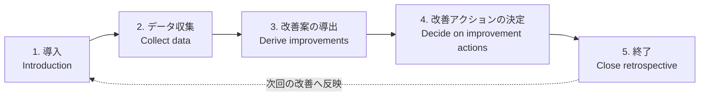

| # | ステップ | 内容 | ベストプラクティス |
|---|---|---|---|
| 1 | **導入** | 目的とアジェンダを確認し、**非難や判断なしに**問題を議論できる、**相互信頼の雰囲気**をつくる | 冒頭で「人ではなくプロセスを見る」ルールを明示する |
| 2 | **データ収集** | 反復・プロジェクトで起きたことのデータを集める。**定性的**（主要イベントの時系列、各メンバーの感じ方など）と、**定量的**（テスト進捗、欠陥検出、テストの有効性・効率、予測可能性など）の両方 | 感覚だけでなく、**メトリクスを併用**して客観性を確保する |
| 3 | **改善案の導出** | データを分析して現状を理解し、改善アイデアを生む。例：**根本原因分析**で根本原因を特定し、**ブレインストーミング**で解決アイデアを出す | 症状ではなく**原因**に対する案を出す |
| 4 | **改善アクションの決定** | アイデアを実行するアクションを導き、**優先順位付け**する。改善計画と責任者を定義。アクションの効果を評価するための目標とメトリクスも定義できる | **一度に多くを実施しない**（検証可能なステップで管理しにくくなる）。担当者と期限を決める |
| 5 | **終了** | レトロスペクティブ自体を振り返り、良い点と改善点を確認する。**定期的**に実施し（特にアジャイル）、レトロスペクティブ自体にも継続的改善を適用する | 次回の運営改善（時間配分、進行方法）を記録する |

> K3（適用）の問題では、**状況文の内容が 5 ステップのどこに当たるか**、または**ステップの順序や内容が適切か**を問われる形が想定されます。

---

## 6. テストツール（Section 1.6）

**学習目標**：TM-1.6.1、1.6.2、1.6.4、1.6.5（K2）、**TM-1.6.3（K4）**

### 6.0 導入：ツールの 2 つの見方

シラバスは、**ビジネスツール**の 3 つのタイプと、**技術ツール**（テスト自動化ツール、テスト管理ツールなど）に言及しています。

| ビジネスツールのタイプ | 特徴（1.6.2 の記述に基づく） |
|---|---|
| **商用ツール** | 規制・セキュリティ要件のある組織では、必要な標準を満たす・認証を持つ傾向があり、選ばれやすい。**一括購入価格**と**継続的なライセンス費用**がかかる場合がある |
| **オープンソースツール** | 通常、**初期コストが低い**（コミュニティの支援・開発による）。すべての要件を詳細に満たすとは限らない |
| **カスタムツール** | 初期コストの**見積りが難しい**（要件と開発段階に依存）。個別要件をすべて満たすのに最適な選択となり得る。**他に必要な機能を持つツールがない**場合にも有効 |

ビジネスツールを選ぶときは、**組織とステークホルダーの要件および規制**をすべて考慮する必要があります。

### 6.1 ツール導入のグッドプラクティス（TM-1.6.1）

テストマネージャーは、ツール導入に**関与**するか、導入プロセスを**促進・支援**することがあります。通常、専用のテストツール、または要件管理・欠陥管理・モニタリングなど**テストに関連するツール**の責任を持ちます。

```mermaid
flowchart TB
    subgraph EVAL["評価・選定の段階"]
        E1["プロセス改善の機会を特定"] --> E2["組織の技術との互換性を確認"]
        E2 --> E3["SDLC への技術的・組織的な統合を理解"]
        E3 --> E4["明確な要件と客観的基準で評価"]
        E4 --> E5["ベンダー（商用）／サポート体制（OSS）を評価"]
        E5 --> E6["研修・コーチング・メンタリングの要件を特定"]
        E6 --> E7["ライセンスモデルの長短を検討"]
        E7 --> E8["最終ステップ：概念実証（PoC）"]
    end
    subgraph ROLL["導入・展開の段階"]
        R1["パイロットプロジェクト<br/>選定基準・要件を検証"] --> R2["プロセスとツールを<br/>相互に調整"]
        R2 --> R3["ツール利用ガイドラインの定義"]
        R3 --> R4["利用者への研修・コーチング・メンタリング"]
        R4 --> R5["組織へ段階的に展開"]
        R5 --> R6["実利用からの情報収集の仕組み"]
        R6 --> R7["ツールの所有者（オーナー）を定義"]
    end
    E8 --> R1
```

| 段階 | グッドプラクティス（シラバス） | 補足・ベストプラクティス |
|---|---|---|
| 評価・選定 | プロセス改善の機会を、適切なツールの支援とともに特定する | 「ツールありき」でなく、**課題起点**で選ぶ |
| 評価・選定 | 組織で使われる技術を理解し、互換性のあるツールを選ぶ | 既存ツールとの**連携（API／統合）**を確認する |
| 評価・選定 | ツールが SDLC に**技術的・組織的にどう統合**されるかを理解する | CI/CD などとの接続、運用フローへの影響を確認する |
| 評価・選定 | **明確な要件と客観的な基準**でツールを評価する | 評価基準の一覧（必須／推奨）を事前に作る |
| 評価・選定 | 商用ツールなら**ベンダーを評価**し、非商用（OSS など）なら**サポート**を評価する | OSS は、コミュニティの活発さやサポート体制を確認する |
| 評価・選定 | ツール利用のための**研修・コーチング・メンタリング**の内部要件を特定する | 学習時間を**コストとして見積る** |
| 評価・選定 | 各種**ライセンスモデル**の長短を検討する | ライセンス数がボトルネックにならないか確認する |
| 評価・選定 | **最終ステップ**として、**概念実証（PoC）**を実施する | PoC の成功基準を事前に決める |
| 導入・展開 | **パイロットプロジェクト**を実行し、選定基準と要件を検証し、既存のプロセス・慣行との適合を評価する | 影響範囲の小さいプロジェクトで試す |
| 導入・展開 | ツールの使用に合わせて**プロセスを適応・改善**する。必要に応じて、既存のプロセスに合わせて**ツールを調整**する | 双方向の調整 |
| 導入・展開 | ツール使用の**ガイドライン**を定義する | 命名規則、運用ルールなど |
| 導入・展開 | ユーザーへの**研修、コーチング、メンタリング** | — |
| 導入・展開 | 組織へ**段階的に**展開する | 一斉展開を避ける |
| 導入・展開 | 実際の使用から情報を収集し、**さらなる改善**に生かす仕組みを作る | 定期的なフィードバック会 |
| 導入・展開 | ツールの**所有者（オーナーシップ）**を定義する | 誰が管理・更新・問い合わせ窓口かを明確にする |

### 6.2 ツール決定に関する技術面・ビジネス面（TM-1.6.2）

ツールの導入・使用の決定には多くの要因が影響します。テストマネージャーはこれらを**理解し、対処する**必要があります。

| 要因 | 内容（シラバス） | 影響の例 |
|---|---|---|
| **規制とセキュリティ** | 安全重要・ミッションクリティカルなソフトウェアを開発する組織、または規制順守が必要な組織は、必要な標準を満たし適切な認証を持つことが多い**商用ツール**を好む場合がある | 認証済みツールの要求 → 商用ツール優先 |
| **財務面** | OSS は通常、初期コストが低い。商用ツールは一括購入価格に加え継続的ライセンス費用が発生し得る。カスタムツールの初期コストは見積りが困難。**初期コスト以外に、ツールの生涯にわたる研修と保守のコスト**も計算・考慮する。**どのツールも保守・サポートコストが高くなる可能性**がある | 総所有コストで判断する |
| **ステークホルダーの要件** | **すべてのステークホルダー**から要件を収集し、最適なツールを評価・特定することが重要。商用・OSS は詳細な要件をすべて満たすとは限らない。カスタムツールは、個別要件をすべて満たすのに最善の選択となり得る | 要件の充足度を比較表で確認 |
| **既存のソフトウェア環境とツール戦略** | 既存のツール構成（ソフトウェアランドスケープ）とツール戦略を評価する。優先ベンダーや**ロックイン**、他製品への依存を持つ統合システム、規制のある**フルサービスサポートモデル**があり得る | 既存の統合基盤との整合 |

### 6.3 選定プロセスの考慮事項と ROI 評価（TM-1.6.3、K4）

テストツールは、**長期的な投資**になり得ます（単一プロジェクトの複数反復にわたる、あるいは多数のプロジェクトに適用される）。したがって、候補のツールは**さまざまな観点**から検討する必要があります。

#### 6.3.1 立場ごとの観点

| 立場 | 重視すること |
|---|---|
| **経営層** | **プラスの ROI** |
| **サポート・運用チーム** | 組織全体で使うツールが**限られた必要数**であること。ツールの数、ライセンス管理、ツールスタック管理に**コストや時間がかからない**こと |
| **プロジェクトリーダー** | プロジェクトや組織に**測定可能な価値**を加えること |
| **ツールの利用者** | **使いやすさ**（タスクの支援、学習しやすさ、操作性） |
| **運用要員** | **保守性** |

機能は、ビジネスと技術の各ツールタイプごとに分析します。分析の観点には、**テストマネジメント、（技術的）テスト分析、テスト自動化、開発**などがあります。**ツールの責任者（ツールオーナー）**が、この分析の実施と、上記の観点の考慮を確実にします。

#### 6.3.2 ROI と費用便益分析

- テストプロセスに導入するすべてのツールは、組織に**プラスの ROI** をもたらす必要がある
- ROI の計算とさらなる評価は**テストマネージャーの責任**（アジャイルでは**開発チーム全体**の責任になり得る）
- ツールの取得・構築の前に、**費用便益分析**を行い、**繰り返し発生するコスト**と**一度だけのコスト**の両方を考慮する

| 区分 | 内容（シラバス） |
|---|---|
| **一度だけ発生する活動とコスト（非反復）** | ツール要件の定義と決定／ツールとベンダーの評価・選定と PoC／初期利用のためのツールの購入・調整・開発／利用ガイドラインの定義／初期研修／既存ツール環境への統合／ツールを支えるハードウェア・ソフトウェアの調達 |
| **継続的に発生する活動とコスト（反復）** | 継続的なライセンス・サポート費用／保守コスト／継続的な研修コスト／別環境へのツールの移植 |
| **機会費用** | ツールの評価、管理、研修、使用に費やした時間は、**実際のテスト作業**に使えた可能性がある。ツールを意図した活動に使えるようになるまで、**より多くのテストリソース**が必要になることがある |

**ROI に関するリスク**

| リスク | 内容 |
|---|---|
| 組織の未成熟 | ツールの**非効率な使用**につながる |
| ベンダーの保守ポリシーの変更 | **作業負荷が増える** |
| 想定以上のコスト | 予算超過 |
| 想定以下の便益 | 期待した効果が出ない |

**テストツールの便益**

| 便益 | 例 |
|---|---|
| 手作業の反復の削減 | 回帰テスト |
| テストサイクル時間の短縮 | 自動化による高速化 |
| テスト実行コストの節約 | 手作業の減少による |
| カバレッジの向上 | ツールが支援する特定のテストタイプ |
| 人的エラーの削減 | 手作業が減るため |

#### 6.3.3 K4 問題の解き方（ツール選定計画の作成）

```mermaid
flowchart TB
    A["1. 状況文から<br/>要件・制約・立場を抽出"] --> B["2. 6.2 の4要因で整理<br/>規制／財務／要件／既存環境"]
    B --> C["3. 6.3.1 の立場別観点で<br/>評価基準を決める"]
    C --> D["4. コスト（一度／継続／機会）と<br/>便益・リスクを比較"]
    D --> E["5. PoC → パイロット → 段階展開<br/>の計画に落とし込む"]
```

**ROI の計算例（説明用の単純化した例）**

| 項目 | 金額（年間） |
|---|---|
| 便益：手動回帰テストの工数削減（400 時間 × 5,000 円） | 200 万円 |
| コスト：ライセンス費用 | 60 万円 |
| コスト：保守・運用 | 40 万円 |
| コスト：継続的な研修 | 20 万円 |
| **年間の純便益** | **80 万円** |

> 初年度は、**一度だけのコスト**（要件定義、PoC、初期研修、統合など）も加えて評価します。これは**説明用の数値例**で、ROI の算出式自体はシラバスで規定されていません。

### 6.4 ツールのライフサイクル（TM-1.6.4）

> ⚠ **確認をお願いする箇所**：本ガイド作成時、公式シラバス PDF の取得が **1.6.3 の途中（p.45）で途切れました**。1.6.4 と 1.6.5 は、シラバス原文を確認できていません。以下は、目次と学習目標、旧版（2012）シラバスで使われた一般的な整理に基づく**補足**です。**試験前に、シラバス p.45–46 の原文で必ず確認してください。**

学習目標は「ツールのライフサイクルの**段階を区別する**」（K2）です。一般的には、次の流れで整理されます。

```mermaid
flowchart LR
    A["取得<br/>Acquisition"] --> B["サポートと保守<br/>Support and maintenance"]
    B --> C["進化<br/>Evolution"]
    C --> D["廃止<br/>Retirement"]
```

| 段階（一般的な整理） | 内容の例 |
|---|---|
| 取得 | 要件定義、評価・選定、PoC、購入または開発、導入 |
| サポートと保守 | 日常の運用、ライセンス管理、不具合対応、利用者の支援 |
| 進化 | 環境やニーズの変化に伴う、バージョンアップ、機能追加、他ツールとの統合の見直し |
| 廃止 | 代替ツールへの移行、データの引き継ぎ・アーカイブ、契約終了 |

### 6.5 ツールメトリクス（TM-1.6.5）

> ⚠ 6.4 と同様に、原文を未確認です。学習目標は「**ツールを使ったメトリクスの収集と評価の例**を挙げる」（K2）です。

ツールは、テストマネジメントのためのメトリクスを**自動的に収集・集計**するために使われます。一般的な例は次のとおりです。

| ツールの種類 | 収集できるメトリクスの例 |
|---|---|
| テスト管理ツール | テストケース数、実行数、合格・不合格数、進捗率 |
| 欠陥管理ツール | 欠陥数（重大度別、状態別、機能別）、欠陥の経過期間 |
| 要件管理ツール | 要件とテストのトレーサビリティ、要件カバレッジ |
| テスト自動化ツール | 自動化率、自動テストの実行結果、実行時間 |
| CI/CD ツール | ビルド成功率、デプロイの頻度 |
| コードカバレッジ／静的解析ツール | コードカバレッジ、静的解析の指摘件数 |

> Chapter 2「Test Metrics」で、メトリクスの詳細を扱います。

---

## 7. Chapter 1 のまとめと試験対策

### 7.1 学習目標と要点の一覧

| 学習目標 | K | 一言まとめ |
|---|---|---|
| 1.1.1 テスト計画 | K2 | 5 タスク：コンテキスト理解 → リスク分析 → リスク対応 → アプローチ・リソース → 計画確立 |
| 1.1.2 モニタリング／コントロール | K2 | 監視で状況を把握し、コントロールで是正。継続的に実施 |
| 1.1.3 テスト完了 | K2 | 報告書、アーカイブ、引き渡し、環境復元、教訓の 5 タスク |
| 1.2.1 ステークホルダー | K2 | 関心事は立場で異なる。分析はテスト戦略・計画作成の一環 |
| 1.2.2 ステークホルダーの知識 | K2 | 影響力／関心の 4 象限（Promoters, Latents, Defenders, Apathetics） |
| 1.2.3 ハイブリッド | K2 | 移行手段、または fit for purpose。能力評価・協働・スクラム・オブ・スクラム |
| 1.2.4 SDLC 別活動 | K2 | 逐次型と反復型を、見積り・役割・ツール・報告などで対比 |
| 1.2.5 テストレベル別 | K2 | 5 レベルごとの管理活動 |
| 1.2.6 テストタイプ別 | K2 | 機能／非機能／ブラックボックス／ホワイトボックス |
| 1.2.7 計画・監視・統制 | **K4** | 状況を分析して強調する活動を選ぶ。品質ゲートに注意 |
| 1.3.1 RBT の対応策 | K2 | リスク分析（特定・評価）とリスク制御（監視・軽減） |
| 1.3.2 リスク特定 | K2 | 7 つの技法。ステークホルダーを網羅 |
| 1.3.3 リスクレベル要因 | K2 | 発生可能性の要因と影響の要因。定量／定性 |
| 1.3.4 軽減活動の選択 | **K4** | 6 つのコンテキスト要因。深さ優先／幅優先 |
| 1.3.5 重量級／軽量級 | K2 | FMEA・FTA 等 vs SST・PRAM・PRISMA |
| 1.3.6 成功メトリクスと困難 | K2 | 6 つの問い。5 つの困難と解決策 |
| 1.4.1 テストアプローチ | K2 | レベル・タイプ・技法・実践の選択と組み合わせ |
| 1.4.2 戦略の分析 | **K4** | 7 つの要因（ドメイン〜テストデータ） |
| 1.4.3 S.M.A.R.T. | **K3** | 目的と終了基準を測定可能に定義 |
| 1.5.1 IDEAL | K2 | Initiating → Diagnosing → Establishing → Acting → Learning |
| 1.5.2 モデルベース | K2 | TMMi、TPI NEXT |
| 1.5.3 分析ベース | K2 | RCA、メトリクス、GQM |
| 1.5.4 レトロスペクティブ | **K3** | 5 ステップ。過剰な改善を同時に実施しない |
| 1.6.1 ツール導入 | K2 | 評価（PoC まで）→ パイロット → 段階展開 |
| 1.6.2 ツール決定の要因 | K2 | 規制・財務・要件・既存環境 |
| 1.6.3 選定計画と ROI | **K4** | 立場別観点、一度／継続／機会費用、便益とリスク |
| 1.6.4 ツールライフサイクル | K2 | ⚠ 原文確認が必要 |
| 1.6.5 ツールメトリクス | K2 | ⚠ 原文確認が必要 |

### 7.2 混同しやすいポイント

| 混同しやすい点 | 整理 |
|---|---|
| テスト戦略とテストアプローチ | 戦略＝**どうテストするかの説明**。アプローチ＝**テストレベル・タイプ・技法などの選択と組み合わせ**で、戦略を形成する重要な決定 |
| 組織のテスト戦略とプロジェクトテスト戦略 | 前者は**与えられる**、後者は**テスト計画の主要な成果** |
| モニタリングとコントロール | 監視＝**把握**、統制＝**是正措置** |
| プロダクトリスクとプロジェクトリスク | RBT の焦点は**品質リスク（プロダクトリスク）**。プロジェクトリスクは副産物として見つかる |
| 深さ優先と幅優先 | 深さ優先＝**高リスクから徹底**。幅優先＝**各リスクに最低 1 つずつ**先にテスト |
| 重量級と軽量級 | 重量級＝形式的・広範・数式（**安全重要**）。軽量級＝順序尺度・少ない労力 |
| モデルベースと分析ベース | 前者＝**外部のベストプラクティスと比較**。後者＝**自分たちのデータで問題特定** |
| IDEAL の適用レベル | 元は組織レベル向けだが、プロジェクト・チームでも適用でき、**Initiating が小さくなる** |
| 定量評価と定性評価 | 定量＝**統計的に妥当なデータ**が必要で、**積**で算出。定性＝**順序尺度**とマトリクス |
| ツールの ROI の責任者 | **テストマネージャー**。アジャイルでは**開発チーム全体**の場合もある |

### 7.3 練習問題（本ガイド作成者による**オリジナル**問題、公式問題ではありません）

**Q1（K2）** テスト完了活動に**含まれない**ものはどれか。
- A. テスト完了報告書の作成と承認
- B. テストウェアのアーカイブ
- C. テスト環境を所定の状態に復元
- D. テストアプローチの初期定義

**Q2（K2）** ステークホルダーマトリクスで、**影響力が高く関心が低い**ステークホルダーは何と呼ばれるか。
- A. Promoters
- B. Latents
- C. Defenders
- D. Apathetics

**Q3（K2）** リスクベースドテストで、最高レベルのリスクを**できるだけ早く**軽減することが重要なときに適する優先順位付けの方法はどれか。
- A. 幅優先
- B. 深さ優先
- C. ランダム
- D. 実行しやすい順

**Q4（K2）** **重量級**のリスクベースドテスト技法はどれか。
- A. PRAM
- B. PRISMA
- C. FMEA
- D. SST

**Q5（K3）** あるチームが、テスト目的を「品質を十分に高める」とした。S.M.A.R.T. のどの要素が**最も欠けている**か。
- A. Specific と Measurable
- B. Achievable と Relevant
- C. Timely のみ
- D. Relevant のみ

**Q6（K4）** 開発が 2 つの拠点に分散し、要件が頻繁に変わる反復開発のプロジェクトで、テストマネージャーが**特に強調すべき**活動の組み合わせはどれか。
- A. 計画時の役割・コミュニケーションの明確化と、継続的なモニタリング・優先度調整
- B. 完了時の詳細な文書化のみ
- C. 一度作った計画を変更しない厳格な運用
- D. テストを最終フェーズに集約

**Q7（K3）** レトロスペクティブの手順として**正しい順序**はどれか。
- A. データ収集 → 導入 → 改善案の導出 → アクション決定 → 終了
- B. 導入 → データ収集 → 改善案の導出 → アクション決定 → 終了
- C. 導入 → 改善案の導出 → データ収集 → 終了 → アクション決定
- D. 終了 → 導入 → データ収集 → 改善案の導出 → アクション決定

**Q8（K2）** ツール導入で、評価・選定の**最終ステップ**として推奨されるのはどれか。
- A. ライセンスモデルの比較
- B. 概念実証（PoC）の実施
- C. 全社への一斉展開
- D. ツールオーナーの任命

#### 解答と解説

| 問 | 正解 | 解説 |
|---|---|---|
| Q1 | D | アプローチの定義は**計画**の活動（1.1.1 のタスク 4）。完了は、報告書、アーカイブ、引き渡し、環境復元、教訓 |
| Q2 | B | 高影響・低関心が **Latents**。Promoters は高影響・高関心、Defenders は低影響・高関心、Apathetics は低影響・低関心 |
| Q3 | B | **深さ優先**はリスクレベルが高い順に厳密にテストする。幅優先は全体像を早く得たい場合 |
| Q4 | C | **FMEA** は重量級。PRAM、PRISMA、SST は軽量級 |
| Q5 | A | 「十分に高める」は具体的でなく、測定もできない。**S と M** が欠けている |
| Q6 | A | 分散→役割・コミュニケーションの計画、頻繁な変更→継続的な監視と優先度調整（コントロール） |
| Q7 | B | 導入 → データ収集 → 改善案の導出 → アクションの決定 → 終了 |
| Q8 | B | 評価・選定の**最終ステップは PoC**。展開・オーナーの定義は導入・展開の段階 |

> 公式の練習問題は、次節のサンプル試験で確認してください。

### 7.4 学習チェックリスト

| チェック項目 | 自己評価 |
|---|---|
| 計画の 5 タスクを順に説明できる | ☐ |
| モニタリングとコントロールの違いを説明できる | ☐ |
| テスト完了の 5 タスクを挙げられる | ☐ |
| ステークホルダーマトリクスの 4 象限を説明できる | ☐ |
| 逐次型と反復型のテスト管理の違いを 5 つ挙げられる | ☐ |
| 5 つのテストレベルの管理活動を説明できる | ☐ |
| リスク特定の技法を 7 つ挙げられる | ☐ |
| 発生可能性と影響の要因を挙げられる | ☐ |
| 深さ優先と幅優先の違いを例で説明できる | ☐ |
| 重量級と軽量級の技法を分類できる | ☐ |
| テストアプローチ選択の 7 要因を挙げられる | ☐ |
| S.M.A.R.T. で終了基準を書き換えられる | ☐ |
| IDEAL の 5 フェーズと、プロジェクトレベルでの違いを説明できる | ☐ |
| TMMi と TPI NEXT の違いを説明できる | ☐ |
| RCA と GQM の流れを説明できる | ☐ |
| レトロスペクティブの 5 ステップを説明できる | ☐ |
| ツール導入の手順（評価から展開まで）を説明できる | ☐ |
| ツールの一度きりのコスト、継続コスト、機会費用を挙げられる | ☐ |

---

## 8. 参考ソース（URL）

### 8.1 一次情報（公式）

| 資料 | URL | 備考 |
|---|---|---|
| ISTQB 公式ページ：CTAL-TM v3.0 | https://istqb.org/certifications/certified-tester-advanced-level-test-management-ctal-tm-v3-0/ | 試験構成（50 問／88 点／合格 58 点／120 分）、ビジネスアウトカム、教材ダウンロード |
| CTAL-TM v3.0 シラバス（PDF・ISTQB） | https://istqb.org/?sdm_process_download=1&download_id=3445 | 本ガイドの根拠。Chapter 1 は p.16〜46 |
| CTAL-TM v3.0 シラバス（PDF・実体 URL） | https://istqb.org/wp-content/uploads/2026/08/ISTQB_CTAL-TM_Syllabus_v3.0.pdf | 上記ダウンロードのリダイレクト先 |
| CTAL-TM v3.0 シラバス（PDF・ASTQB ミラー） | https://astqb.org/assets/documents/ISTQB_CTAL-TM_Syllabus_v3.0.pdf | 同一内容（2024/05/03 版） |
| CTAL-TM シラバス ダウンロードページ | https://istqb.org/sdm_downloads/istqb_ctal-tm_syllabus_v3-0/ | — |
| サンプル試験 A（問題） | https://istqb.org/?sdm_process_download=1&download_id=3449 | 公式サンプル |
| サンプル試験 A（解答） | https://istqb.org/?sdm_process_download=1&download_id=3451 | — |
| サンプル試験 B（問題） | https://istqb.org/?sdm_process_download=1&download_id=9612 | — |
| サンプル試験 B（解答） | https://istqb.org/?sdm_process_download=1&download_id=9614 | — |
| 試験構成と規則 | https://istqb.org/?sdm_process_download=1&download_id=3829 | Exam Structures and Rules |
| ISTQB 用語集 | https://glossary.istqb.org/en_US/search?term= | 用語の定義確認 |

### 8.2 シラバスが参照している外部情報

| 資料 | URL | 備考 |
|---|---|---|
| TMMi Foundation | www.tmmi.org | TMMi の情報（シラバスの記載） |
| TMap / TPI NEXT | www.tmap.net | TPI NEXT の情報（シラバスの記載） |
| ISO/IEC/IEEE 29119（Part 2, Part 3） | （有償の国際標準） | シラバスが参照。**試験範囲外** |

### 8.3 本ガイドと出典の対応

| 本ガイドの節 | シラバスの節 | ページ |
|---|---|---|
| 1. テストプロセス | 1.1 | p.18–20 |
| 2. テストのコンテキスト | 1.2 | p.21–27 |
| 3. リスクベースドテスト | 1.3 | p.28–33 |
| 4. プロジェクトテスト戦略 | 1.4 | p.34–37 |
| 5. テストプロセスの改善 | 1.5 | p.38–41 |
| 6. テストツール | 1.6 | p.42–46（1.6.4・1.6.5 は原文未確認） |

### 8.4 注意事項

- 本ガイドは、ISTQB 公式シラバス v3.0 の内容を**日本語で要約・再構成**した学習資料で、原文の全訳ではありません。**試験の準拠先は、常にシラバス原文**です。
- 「説明用」「考え方の例」「オリジナル問題」と明記した表・例・数値は、理解のために作成者が作った**補足**で、シラバスに記載された内容ではありません。
- シラバスは著作権で保護されています。引用・再利用の条件は、シラバス冒頭の **Copyright Notice** を確認してください。
- 日本語版シラバスの有無や、日本での受験方法は、日本の ISTQB Member Board（JSTQB）に確認してください。

---

*作成日：2026 年 9 月 21 日 ／ 対象：ISTQB CTAL-TM v3.0（2024/05/03 リリース版シラバス）Chapter 1*