# CTAL-TM v3.0 第2章「プロダクトのマネジメント（製品の管理）」初学者向けステップバイステップ解説ガイド

> ISTQB® Certified Tester Advanced Level Test Management（CTAL-TM）v3.0 の **第2章 Managing the Product（JSTQB日本語版の章題：プロダクトのマネジメント、390分）** を、初学者向けに「なぜ → 何を → どうやって → 落とし穴」の順で解説します。
> 各項目に **ベストプラクティス** と **出典（URL・シラバス該当ページ）** を付けています。
> 参照日：2026-09-21 ／ 根拠：ISTQB 英語版シラバス v3.0（2024/05/03 発行）と JSTQB 日本語版 Version3.0.J04（2026/06 掲載）

---

## 目次

1. 本ガイドの読み方と第2章の全体像
2. 2.1 テストメトリクス（LO：TM-2.1.1 〜 TM-2.1.3）
3. 2.2 テスト見積り（LO：TM-2.2.1 〜 TM-2.2.3）
4. 2.3 欠陥マネジメント（LO：TM-2.3.1 〜 TM-2.3.6）
5. 章全体のまとめ（用語対訳表・試験対策）
6. 確認問題（筆者作成・10問）
7. 参考資料・出典一覧

---

## 1. 本ガイドの読み方と第2章の全体像

### 1.1 ご依頼の「製品の管理」と公式の章題の対応

| 呼び方 | 内容 |
|---|---|
| ご依頼の表記 | 第2章「製品の管理」 |
| ISTQB（英語） | Chapter 2: Managing the Product |
| JSTQB（日本語版シラバス） | 第2章：プロダクトのマネジメント |
| 学習時間（認定トレーニングの最低時間） | 390分（全体 1,365分＝22.75時間の約29％） |

出典：[JSTQB日本語版シラバス（PDF）](https://www.jstqb.jp/wordpress/wp-content/uploads/2026/06/JSTQB-Syllabus.Advanced_TM_VersionV3.0.J04.pdf) の 0.10 節（p.14〜15）、第2章冒頭（p.49）

### 1.2 第2章で学ぶ3つのテーマ

第2章は「テストという仕事の**成果物（プロダクト）を数字と記録で管理する**」章です。第1章が「どう進めるか（活動のマネジメント）」、第3章が「誰がやるか（チームのマネジメント）」であるのに対し、第2章は次の3つを扱います。

| 節 | テーマ | 一言でいうと | 章冒頭に書かれた学習内容 |
|---|---|---|---|
| 2.1 | テストメトリクス | テストの進み具合と品質を**測って報告する** | テスト目的の達成をメトリクスでモニタリング／コントロールし、進捗を報告する |
| 2.2 | テスト見積り | テストにどれだけ**時間・工数・コストがかかるか予測する** | 開発モデルやチームに合った見積り技法を選ぶ |
| 2.3 | 欠陥マネジメント | 見つけた欠陥を**記録し、決定し、直し、学ぶ** | シーケンシャル／アジャイル／ハイブリッドに合う欠陥ワークフローを定義する |

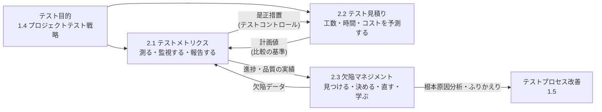

**図の読み方**：見積り（2.2）で立てた計画値と、テスト中に集めたメトリクス（2.1）を比べることで進捗が分かります。欠陥（2.3）の数・種類・原因は、そのままメトリクスの材料になり、最終的にはプロセス改善（第1章 1.5）へつながります。3つの節は独立した知識ではなく、ひとつの循環です。

### 1.3 学習の目的（LO）一覧と認知レベル

シラバスでは、章見出しの下のキーワードは **K1（記憶）** として全部覚える必要があり、LOごとに K2（理解）／K3（適用）／K4（分析）が指定されています。

| LO | 内容（要約） | Kレベル | 試験での聞かれ方の目安 |
|---|---|---|---|
| TM-2.1.1 | テスト目的を達成するためのメトリクスの例を挙げる | K2 | 例を挙げられるか |
| TM-2.1.2 | テストメトリクスを用いてテストの進捗をコントロールする方法を説明する | K2 | 仕組みを説明できるか |
| TM-2.1.3 | ステークホルダーの意思決定に役立つテストレポートを作成するためにテスト結果を分析する | **K4** | シナリオを分析して選ぶ・判断する |
| TM-2.2.1 | テスト見積りで考慮すべき要因を説明する | K2 | 説明できるか |
| TM-2.2.2 | テスト見積りに影響を与える要因の例を挙げる | K2 | 例を挙げられるか |
| TM-2.2.3 | 特定のコンテキストで適切な見積り技法・アプローチを選択する | **K4** | 状況を分析して技法を選ぶ |
| TM-2.3.1 | 欠陥ワークフローを含む欠陥マネジメントプロセスを実装する | **K3** | 手順を適用できるか |
| TM-2.3.2 | 効果的な欠陥マネジメントに必要なプロセスと参加者を説明する | K2 | 説明できるか |
| TM-2.3.3 | アジャイルソフトウェア開発における欠陥マネジメントを詳細に説明する | K2 | 説明できるか |
| TM-2.3.4 | ハイブリッドソフトウェア開発における欠陥マネジメントの課題を説明する | K2 | 説明できるか |
| TM-2.3.5 | 欠陥マネジメントで収集すべきデータと分類情報を利用する | **K3** | 手順を適用できるか |
| TM-2.3.6 | 欠陥レポートの統計情報がプロセス改善の考案にどう使えるか説明する | K2 | 説明できるか |

出典：[JSTQB日本語版シラバス（PDF）](https://www.jstqb.jp/wordpress/wp-content/uploads/2026/06/JSTQB-Syllabus.Advanced_TM_VersionV3.0.J04.pdf) 第2章「第2章の学習の目的」（p.49）、付録A（p.78〜80）

### 1.4 K1 として暗記するキーワード

| 区分 | 日本語 | 英語 |
|---|---|---|
| キーワード | 不正 | anomaly |
| | 欠陥 | defect |
| | 欠陥レポート | defect report |
| | 欠陥ワークフロー | defect workflow |
| | 故障 | failure |
| | メトリクス | metric |
| | テスト見積り | test estimation |
| | テスト目的 | test objective |
| | テスト進捗状況 | test progress |
| ドメイン固有キーワード | プランニングポーカー | planning poker |
| | 三点見積り | three-point estimation |
| | ワイドバンドデルファイ | wideband Delphi |

> 💡 **学習のヒント**：**欠陥・故障・不正**の関係を最初に押さえると2.3が楽になります。作業成果物に混入した誤りが**欠陥**、欠陥が実行時に表面化して外部から見える誤動作になったものが**故障**、テスト担当者が観察する「期待結果と実際の結果の食い違い」が**不正**です。この3つは必ず一列に連鎖するわけではありません。欠陥があっても実行されなければ故障は起きませんし、観察された不正の原因は欠陥とは限らず、テストデータ・テストスクリプト・テスト環境・要件の理解違いなど別の原因のこともあります。したがって実務では、**不正の観察は「原因の調査を始める合図」**であって、欠陥の確定ではありません（だからこそ観測された事象は欠陥と呼び分けて「不正」と記録します）。

### 1.5 試験の基本情報（ISTQB公式ページより）

| 項目 | 内容 |
|---|---|
| 問題数 | 50問 |
| 合格点 | 58点（満点 88点） |
| 試験時間 | 120分（英語以外が母語の受験者は +25％） |
| 前提資格 | Foundation Level（CTFL v4.0 または旧版）の保有に加え、十分な実務経験。具体的な実務経験の基準は Member Board / Exam Provider に確認すること |

出典：[ISTQB CTAL-TM v3.0 認定ページ](https://istqb.org/certifications/certified-tester-advanced-level-test-management-ctal-tm-v3-0/)（Exam Structure）

---

## 2. 【シラバス2.1】テストメトリクス

> 学習の目的：TM-2.1.1（K2）／TM-2.1.2（K2）／TM-2.1.3（K4）

### ステップ1：なぜテストにメトリクスが必要なのか

マネジメントの世界には「測定できるものは達成できる」という格言があります。逆に、測られないものは無視されやすく、達成されにくくなります。

ここで第1章の **テスト目的** を思い出してください。テスト目的は「**なぜテストするのか**」の答えです（1.4 節）。目的が達成できたかどうかを判断するには、それを**測る方法**を先に決めておく必要があります。その「測る方法」がテストメトリクスです。

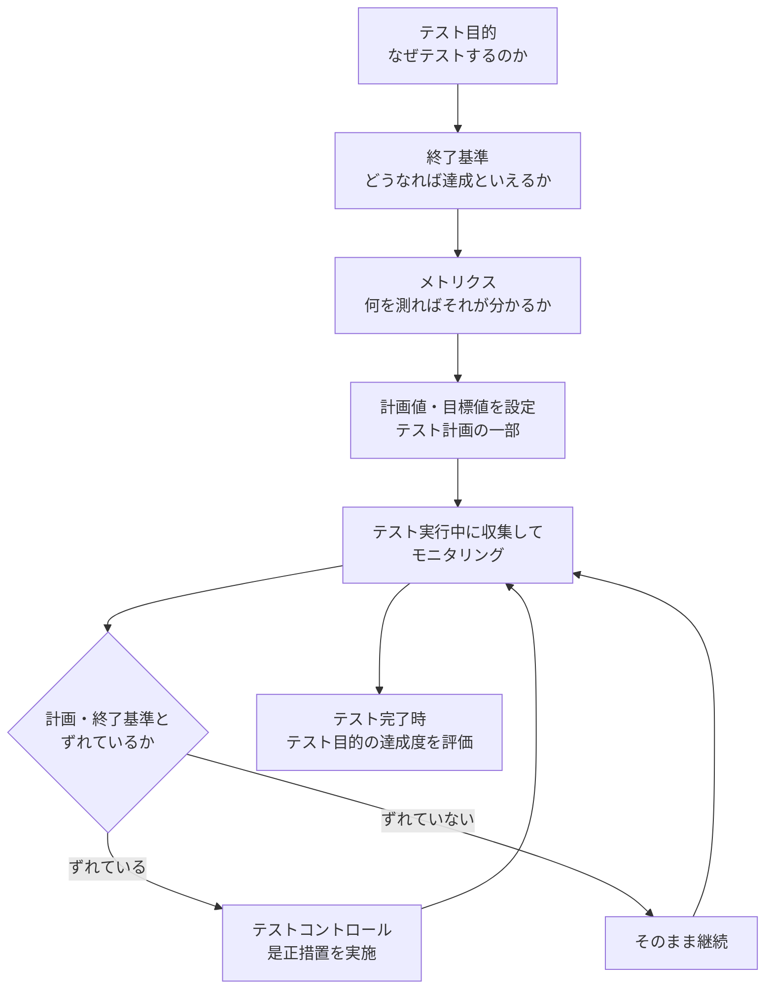

**ポイント**：テストマネジメントは、**テスト計画の段階で**、モニタリング・コントロール・完了それぞれに使うメトリクスを定義できなければなりません。また、各メトリクスは「定義 → 測定 → モニタリング → 報告」まで一貫して運用する必要があります。

### ステップ2：メトリクスを3つに分類する

| 分類 | 何を測るか | 例 | 答える問い |
|---|---|---|---|
| プロジェクトメトリクス | 既存のプロジェクト終了基準に対する**進捗** | テストの実行率、合格率、不合格率 | 予定どおり進んでいるか |
| プロダクトメトリクス | プロダクトが想定ユーザーの期待する**品質**をどの程度満たすか | リスクカバレッジ、欠陥密度、残存リスク | 品質は十分か |
| プロセスメトリクス | テストプロセスの**能力**とテストの**有効性** | 欠陥検出率（DDP）など | テストのやり方は効果的・効率的か |

補足：プロダクト／プロセスメトリクスの詳細は ISTQB Expert Level（Test Management、Improving the Test Process）の範囲です。Advanced Level では「分類と役割」を理解すれば十分です。

> 💡 **ベストプラクティス**（シラバス根拠：2.1 導入）
>
> - メトリクスは**テスト目的から逆算して**選ぶ（先に「何を知りたいか」、次に「何を測るか」）。
> - 3分類のバランスを取る。プロジェクトメトリクス（進捗）だけを追うと「終わったが品質は不明」になりやすい。
> - 測定できないものは「評価（専門家・ステークホルダーによるアセスメント）」で補う（1.4.3 節の考え方）。

### ステップ3（TM-2.1.1）：テストマネジメント活動ごとのメトリクスの例

テストマネジメントの主要活動は次の3つ（テスト計画／テストモニタリングとテストコントロール／テスト完了）で、それぞれにメトリクスが関係します。

| 活動 | メトリクスの役割 |
|---|---|
| テスト計画 | プロジェクトテスト戦略とテスト目的に合うメトリクスを**定義**する |
| テストモニタリング／テストコントロール | テスト活動の**進捗**を測る（テスト進捗レポートで報告） |
| テスト完了 | 終了基準に対する**テスト目的の達成度**を測る（テスト完了レポートで報告） |

シラバスの「表2」に載っている代表的なメトリクスは次のとおりです。

| メトリクス | 何を見るか | 使いどころ |
|---|---|---|
| 要件カバレッジ | 要件のうちテストでカバーできた割合 | モニタリング／コントロール **と** 完了の両方 |
| プロダクトリスクカバレッジ | 識別したプロダクトリスクのうち、テストで軽減できた割合 | モニタリング／コントロール **と** 完了の両方 |
| テストケースのステータス別実行割合（不合格、ブロックなど）対 計画したテストケース | 計画に対する実行状況 | モニタリング／コントロール **と** 完了の両方 |
| コードカバレッジ | テストで実行されたコードの割合 | **テスト完了** |
| テスト活動の実績 対 計画時の見積り（時間単位） | 工数の計画値と実績 | **モニタリング／コントロール** |
| 欠陥解決数累計 対 欠陥数累計 | 見つかった欠陥のうち解決済みの割合 | **モニタリング／コントロール** |
| 実際の自動化テストケース 対 計画した自動化テストケース | 自動化の達成度 | **テスト完了** |
| 実際のテストコスト 対 計画したテストコスト | 予算に対する実績 | **モニタリング／コントロール** |

> 📌 **表2の読み方**：表2は「○」の位置（どの列に付くか）で使いどころを示します。上の3行（要件カバレッジ・プロダクトリスクカバレッジ・テストケースのステータス別実行割合）はモニタリング／コントロールと完了の両方に○が付き、残りの5行はどちらか一方だけに○が付きます（Version 3.0.J04 の表2で確認済み）。区別の考え方は次のとおりです。
>
> - 「進捗」を示すもの（工数の計画対実績、欠陥の解決状況、コストの計画対実績）は**モニタリング／コントロール**
> - 「目的の達成度」を示すもの（コードカバレッジ、自動化の達成度）は**テスト完了**

補足：テストの有効性をモニタリングするメトリクスとして**欠陥検出率**（DDP：Defect Detection Percentage）もあります。DDP は Expert Level（テストプロセス改善）で詳しく扱われる範囲です。

出典：[JSTQB日本語版シラバス（PDF）](https://www.jstqb.jp/wordpress/wp-content/uploads/2026/06/JSTQB-Syllabus.Advanced_TM_VersionV3.0.J04.pdf) 2.1 導入・2.1.1（p.50〜51）、[ISTQB英語版シラバス（PDF）](https://istqb.org/?sdm_process_download=1&download_id=3445) 2.1 節（p.48〜49）

> 💡 **ベストプラクティス**（実務補足）
>
> - メトリクスごとに「**計画値・目標値・測定方法・報告頻度・責任者**」を1行で定義した一覧（メトリクス定義表）を、テスト計画書に入れる。
> - 「計画に対する実績」の形（対 計画）で持つ。実績だけの数字では良し悪しが判断できない。
> - ツール（テストマネジメントツール、欠陥マネジメントツール、CI/CD）から**自動収集できる**指標を優先し、手作業の集計コストを下げる（1.6.5 節「ツールメトリクス」との関連）。

### ステップ4（TM-2.1.2）：モニタリング・コントロール・完了の違い

3つの言葉は似ていますが、役割がはっきり違います。

| 用語 | 定義（やさしく言うと） | 具体例 |
|---|---|---|
| テストメトリクス | テストがどこまで進んだか、終了基準や関連タスクが達成されたかを示す**指標** | 実行率、合格率、要件カバレッジ |
| テストモニタリング | テストと関連する評価・アセスメントの**データを集める**活動。進捗の評価と、終了基準の達成確認に使う | 毎日の実行結果の集計、新しいリスクの識別 |
| テストコントロール | モニタリングの情報を使い、効果的・効率的にテストするための**ガイダンスと是正措置**を与える活動 | 下の4例 |
| テスト完了 | 完了したテスト活動のデータを集め、教訓・テストウェアなどを**統合する**活動 | テスト完了レポート、ふりかえり |

**テストコントロールの具体例（シラバス記載）**

1. 識別したリスクが**課題事項になった**場合に、テストを再優先順位付けする
2. **手戻り**により、テストアイテムが開始基準／終了基準を満たすかを再評価する
3. **テスト環境の提供遅れ**を考慮して、テストスケジュールを調整する
4. 必要なときに必要な場所へ**新しいリソースを追加**する

**テスト完了が発生するタイミング**：テストレベルの完了、イテレーションの完了、テストプロジェクトの完了（または中止）、メンテナンスリリースの完了など、プロジェクトのマイルストーンです。

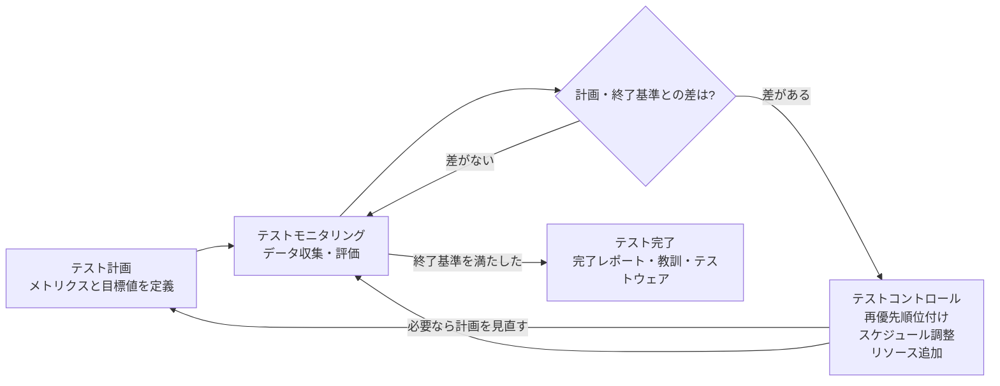

出典：[JSTQB日本語版シラバス（PDF）](https://www.jstqb.jp/wordpress/wp-content/uploads/2026/06/JSTQB-Syllabus.Advanced_TM_VersionV3.0.J04.pdf) 2.1.2（p.51〜52）、1.1.2 テストモニタリングとコントロールの活動（p.20）

> 💡 **ベストプラクティス**（シラバス根拠：2.1.2 ＋ 実務補足）
>
> - モニタリング（見る）とコントロール（動く）を**セットで運用**する。「見るだけ」のダッシュボードは是正措置につながらない。
> - コントロールの発動条件（例：ブロックされたテストが全体の10％を超えたらエスカレーション）を**あらかじめ**決めておく（実務補足）。
> - テストモニタリングとテストコントロールで使うメトリクスは、テスト完了時のものと**異なってよい**。進捗用と達成度用を意識して分ける。

### ステップ5（TM-2.1.3・K4）：テストレポートを作るために結果を分析する

K4（分析）なので、「知っている」だけでなく**状況を読み解いて判断する力**が問われます。

#### テストレベルによって「使えるメトリクス」が違う

| テストレベル | 主なテストベース | 適したカバレッジ・メトリクスの例 |
|---|---|---|
| コンポーネントテスト | コード・詳細設計 | 構造カバレッジ（例：ステートメントカバレッジ） |
| コンポーネント統合テスト | インターフェース仕様・アーキテクチャ | 構造カバレッジ（例：インターフェースカバレッジ） |
| システムテスト／システム統合テスト／受け入れテスト／セキュリティテスト | 要件仕様書、ユースケース、ユーザーストーリー、プロダクトリスク | 要件カバレッジ、プロダクトリスクカバレッジ |

重要な注意が2つあります。

- コードカバレッジは「テストがテスト対象の構造をどの程度実行したか」の測定に使えますが、**上位のテスト結果の報告は、プロジェクトの文脈とニーズに合わせる**べきです。たとえば頻繁に変更がある環境では、コードカバレッジで「コード変更がテストスイートに与える影響」を監視し、ギャップやリスクを見つける使い方が有用です。
- コンポーネントテストとコンポーネント統合テストで**構造カバレッジ100％を達成しても**、欠陥と品質リスクは**より上位のテストレベルで対処する必要が残ります**。

#### 報告の形式：スナップショットとトレンド

- **スナップショット**：ある時点の値（例：本日時点の合格率78％）
- **トレンド**：時系列の変遷（例：過去2週間の未解決欠陥数の推移）

報告の目的は、マネジメントが**情報を素早く理解する**ことです。スナップショットは「今どこか」、トレンドは「どちらへ向かっているか」を示します。

#### 目的別メトリクスの一覧

| 目的 | メトリクス | 何が分かるか |
|---|---|---|
| プロダクトリスク | すべてのテストが合格したリスクの割合 | 軽減済みのリスク |
| | 一部またはすべてのテストが不合格になったリスクの割合 | 問題が見つかっているリスク |
| | まだ全部テストできていないリスクの割合 | 残っているリスク |
| 欠陥 | 欠陥数累計に対する解決済み欠陥数累計 | 欠陥解決の進み具合 |
| | 内訳（テストアイテム／発生源／テストリリース／混入・検出・修正件数／優先度・重要度／根本原因／ステータス） | 欠陥が多い領域、テストの効率性・有効性 |
| テスト進捗 | テスト実行状況（計画・実装・実行・合格・不合格・ブロック・スキップの総数） | 実行の進み具合 |
| | テスト工数（リソース時間の計画対実績） | 労力の消化状況 |
| カバレッジ | 要件カバレッジ／プロダクトリスクカバレッジ／コードカバレッジ | どこまで確認できたか |
| コスト・労力 | テストしていないコンポーネントの残存リスク | 未テスト部分に欠陥がある場合の影響と可能性 |
| | テストコスト（計画対実績） | 予算の消化状況 |

さらに、異なるカテゴリを**組み合わせる**と、理解が深まります。

- 未解決欠陥の傾向と、実行したテストの傾向の**相関**
- 要件で見つかった欠陥の数から、**テストベースの品質**を示す指標
- テスト実行を続けても新たに識別される欠陥が減ってきたら、**終了基準に照らして**テスト終了を判断できる（メトリクスと合意済みの終了基準に基づくこと）

#### 手順：意思決定に役立つテストレポートの作り方（ステップバイステップ）

> この手順は、シラバスの記述（目的別メトリクス、スナップショット／トレンド、コンテキストへの適合）を実務で使いやすいように筆者が整理したものです。

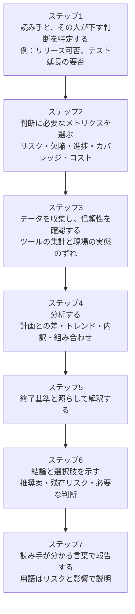

#### 具体例（架空のデータ）：リリース判定会議向けのテストレポート

ある業務システムのシステムテスト終了時点で、次の数値が得られたとします。

| 区分 | 指標 | 値 |
|---|---|---|
| プロダクトリスク（全20件） | すべて合格 | 11件（55％） |
| | 一部または全部が不合格 | 6件（30％） |
| | 未完了 | 3件（15％） |
| 欠陥 | 検出累計／解決累計 | 118件／104件（解決率88％） |
| | 未解決の重要度「高」 | 3件（すべて決済機能に関するもの） |
| 進捗 | 工数（計画400h に対し実績） | 430h（＋7.5％） |
| カバレッジ | 要件カバレッジ | 92％ |

**分析（ステップ4〜6）**

1. リスクの30％（6件）が不合格、15％（3件）が未完了。ただし**この表は各リスクの重要度を示していない**ため、「重大リスクは全件合格」という終了基準をそのまま適用することはできない。まず**6件の不合格リスクと3件の未完了リスクのうち、どれが重大リスクに該当するかを判定する**必要がある。判定の結果、重大リスクが1件でも含まれていれば終了基準を満たしていないと結論できる。
2. 未解決の重要度「高」3件が決済機能に集中している → 事業影響が大きい領域で**残存リスクが高い**。
3. 工数超過は7.5％。ただし**この数値だけでは許容可否を判断できない**。テストコントロールは実績を計画と比較して是正処置を取るものであり（2.1.2、日本語版 p.51〜52）、シラバスは「何％までなら許容」という数値基準を定めていない。判断するには、**合意済みの許容差（変動幅）・予算の予備費（コンティンジェンシー）・ステークホルダーが承認した判断基準**のいずれかが前提として必要であり、それが無い場合は「許容範囲内」と結論づけず、超過の事実と判断材料をステークホルダーに提示して判断を仰ぐ。

**報告の結論の例**：「決済機能の重要度『高』3件が未解決のため、現時点でのリリースは推奨しません。（案A）1週間テストを延長し、修正と再テストを実施する。（案B）リスクを受容してリリースし、決済は暫定的に機能を無効化する。リスクの最終判断をお願いします。」

このように、**数字を並べるだけでなくリスクに翻訳し、判断の選択肢まで示す**のが K4 レベルの「意思決定に役立つレポート」です。

出典：[JSTQB日本語版シラバス（PDF）](https://www.jstqb.jp/wordpress/wp-content/uploads/2026/06/JSTQB-Syllabus.Advanced_TM_VersionV3.0.J04.pdf) 2.1.3（p.52〜53）、1.3.4 適切なテストによる品質リスク軽減（p.31〜32：残存リスクレベルによる報告）

> 💡 **ベストプラクティス**（シラバス根拠：2.1.3 ＋ 実務補足）
>
> - **リスクの言葉で報告する**：テスト結果を、ステークホルダーが理解できる方法で「リスクの観点」から報告する（1.3.4 節）。
> - **メトリクスを1枚に詰め込みすぎない**。読み手ごと（経営層・プロジェクトリーダー・開発者）に、判断に必要な3〜5指標へ絞る（実務補足）。
> - **スナップショットとトレンドを併記**する。特に欠陥の未解決数は、傾向で見ないと収束しているのか悪化しているのか分からない。
> - **構造カバレッジ100％を品質の証明として扱わない**（上位テストレベルの欠陥・リスクが残るため）。
> - 高いレベルのテストは、要件・ユースケース・ユーザーストーリー・プロダクトリスクを基準にカバレッジを測る。

#### 2.1 節でよくある間違い（試験の引っかけ）

| 誤解 | 正しい理解 |
|---|---|
| テストモニタリングとテスト完了のメトリクスは同じでなければならない | 目的が違うため、**異なってよい**（進捗用と目的達成度用） |
| コンポーネントテストで構造カバレッジ100％なら、上位レベルのテストは不要 | 上位レベルでも欠陥と品質リスクへの対処が必要 |
| 実績値だけで進捗を判断できる | **計画値との比較**があって初めて判断できる |
| 欠陥数が多い＝テストの質が高い | 内訳（発生源・重要度・根本原因）と合わせて解釈する |
| プロセスメトリクスはテスト対象の品質を測る | プロセスメトリクスは**テストプロセスの能力と有効性**を測る（品質はプロダクトメトリクス） |

---

## 3. 【シラバス2.2】テスト見積り

> 学習の目的：TM-2.2.1（K2）／TM-2.2.2（K2）／TM-2.2.3（K4）

### ステップ1（TM-2.2.1）：テスト見積りとは何を見積ることか

**テスト見積り**とは、テストマネジメントの活動のひとつで、「あるタスクを完了するまでに、どれだけの**時間・工数・コスト**がかかるか」を予測することです。シラバスは、テストマネジメントにおける**主要かつ重要なタスク**と位置付けています。

システム／ソフトウェアエンジニアリング全般に見積りのよい実践例があり、テスト見積りは、それらを**テストの活動に適用**したものです。

#### 3つの軸：工数・時間・コスト

| 軸 | 意味 | 問い | ポイント |
|---|---|---|---|
| 工数（effort） | タスクを完了するのに必要な労力。人時（人日）やストーリーポイントで表す | 何人時かかるか | テスト工数と**テスト期間（経過時間）は異なる**ことが多い |
| 時間（duration） | プロジェクトを完了するのに必要な時間 | どれくらいで終わるか | テスト計画では、工数を**カレンダー日数と稼働日数**に換算する。すべてのプロジェクトにはマイルストーンと納期がある |
| コスト | プロジェクトの予算。テストリソース、ツール、インフラの費用を含む | いくらかかるか | テストプロジェクトにはどれくらいの費用が必要か |

**具体例（架空）**：テスト実行に60人日の工数が必要で、テスト担当者が3人、各自がテストに使える時間が稼働時間の80％だとします。

```text
期間（稼働日）＝ 60人日 ÷ （3人 × 0.8）＝ 25稼働日
```

工数は60人日ですが、期間は25稼働日（約5週間）です。工数と期間を混同すると、納期の計画が大きくずれます。

#### 見積りの進め方

テストは、（大規模な）プロジェクトの**サブプロジェクト**であることが多く、複数のテスト拠点（テストセンターなど）に分散していることもあります。

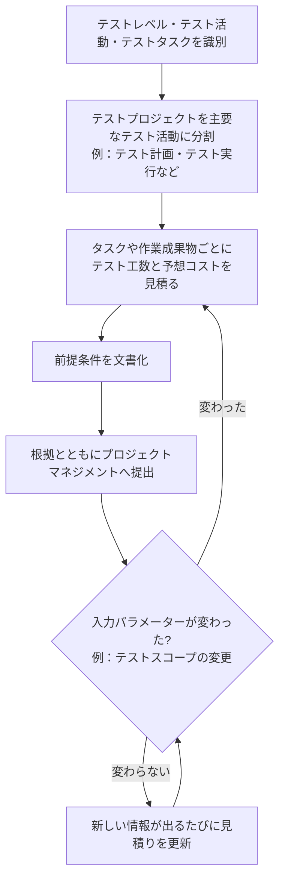

**アジャイルの場合**：テスト活動は開発作業の中で見積もることが多く、テストだけを個別の値として見積ることはしません。

#### 時間・コスト・品質の三角形

テストはプロジェクトのサブプロジェクトなので、見積りには常に**プロジェクト制約**が影響し、**妥協**が必要になります。時間・コスト・品質は互いに影響し合う3つの値で、**どれかを恣意的に動かすことはできません**（品質マネジメントで知られる「時間-コスト-品質の三角形」）。

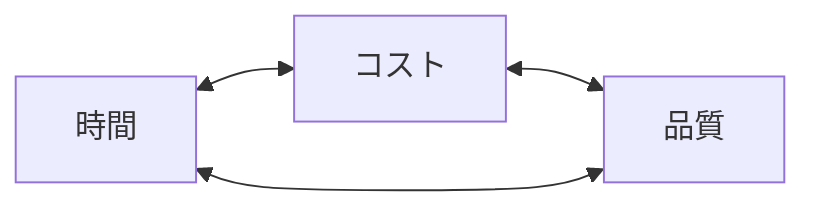

例：納期（時間）を短縮したいのにテスト範囲（品質）を維持するなら、人員追加（コスト）が必要になります。コストも時間も固定なら、テスト範囲やレベル（品質側）の見直しが必要です。

出典：[JSTQB日本語版シラバス（PDF）](https://www.jstqb.jp/wordpress/wp-content/uploads/2026/06/JSTQB-Syllabus.Advanced_TM_VersionV3.0.J04.pdf) 2.2 導入・2.2.1（p.54）、[ISTQB英語版シラバス（PDF）](https://istqb.org/?sdm_process_download=1&download_id=3445) 2.2 節（p.52）

> 💡 **ベストプラクティス**（シラバス根拠：2.2.1 ＋ 実務補足）
>
> - **工数・期間・コストを分けて**見積る。特に期間は、稼働率・休暇・並行作業を考慮してカレンダー日数に換算する。
> - 見積りの粒度は、テストレベル → 活動 → タスクの順に分解する（分解が粗いと誤差が大きくなる）。
> - 「品質を下げずに納期だけ縮める」といった依頼には、三角形を示して**トレードオフを可視化**し、ステークホルダーに選択してもらう。

### ステップ2（TM-2.2.2）：テスト工数に影響を与える要因

テスト工数の見積りは、特定のプロジェクト、リリース、イテレーションの**テスト目的を達成するために必要な作業量を予測する**ことです。工数に影響する要因を、シラバスは5つの区分で整理しています。

| 区分 | 具体的な要因 | 影響のしかた（考え方） |
|---|---|---|
| プロダクト | テストベースの品質、テスト対象の大きさ、プロダクトドメインの複雑度（環境・インフラ・歴史など）、品質特性（セキュリティや信頼性など）をテストする要件 | 仕様があいまいだったり規模が大きいほど、分析・設計・実行が増える |
| 開発プロセス | 組織の開発プロセスの安定性と成熟度、使用する開発モデル（アジャイル／イテレーティブ／ハイブリッドなど）、物理的な要因（テスト自動化、ツール、テスト環境の可用性） | プロセスが不安定なら手戻りや待ちが増える。環境が使えなければ実行できない |
| 人 | 人々の満足度（祝祭日、休暇、その他の期待する福利厚生など）、関与する人のスキル・経験（特に類似のプロジェクトやプロダクトの経験、ドメイン知識） | 人は最も必要なリソースであり、不安定な状況は見積りに反映が必要（3.1 節も参照） |
| テスト結果 | テスト実行中に発見された欠陥の数と重要度、必要な再作業の量 | 欠陥が多いほど、再テスト・確認テスト・再作業が増える |
| テストコンテキスト | 複数の組織にわたるテストの分散、チームの構成と所在地、プロジェクトの複雑度（複数のサブシステムなど）、働き方（バーチャルかオンサイトか） | 分散・複雑なほど調整コストが増える（1.2 節も参照） |

**過去の統計は見積りの助けになります**。「テスト結果」に関する要因を過去データとして持っていれば、より正確な値で見積りができます。

**具体例（架空）**：「テストベースの品質が低い」場合の影響

- 要件があいまい → テスト分析で疑問点の確認に時間がかかる（工数↑）
- 要件が頻繁に変わる → テストケースの修正が増える（工数↑）
- 欠陥が多く見つかる → 確認テスト・リグレッションテストが増える（工数↑）

出典：[JSTQB日本語版シラバス（PDF）](https://www.jstqb.jp/wordpress/wp-content/uploads/2026/06/JSTQB-Syllabus.Advanced_TM_VersionV3.0.J04.pdf) 2.2.2（p.55〜56）

> 💡 **ベストプラクティス**（実務補足）
>
> - 見積りシートに、5区分（プロダクト・開発プロセス・人・テスト結果・テストコンテキスト）のチェックリストを用意し、**リスク要因を漏れなく洗い出す**。
> - 「テスト結果」に関わる係数（欠陥の再テスト率など）は、過去プロジェクトの実績から**自組織のデータ**を蓄積して使う。
> - 見積りの前提となった要因（例：テスト環境は第2週から利用可）を**前提条件として明記**し、変化が起きたら再見積りする。

### ステップ3（TM-2.2.3・K4）：適切なテスト見積り技法を選ぶ

#### 見積りで最初に決めるべき考え方

- テスト見積りは、**テストプロセスに関わるすべての活動**を対象にすべきです。
- 中でも、**テスト実行のコスト、工数、特に期間**の見積りは、テストマネジメントに最も影響が大きいことが多いです。
- ただし、ソフトウェアの品質が低い、または品質が不明な場合は、テスト実行の見積りが**難しくなる**傾向があります。また、そのプロダクトに慣れている経験も見積りの質に影響します。
- 一般的な実践例は、**テストベース（要件・ユーザーストーリーなど）から導いたテストケースの数を見積る**ことです。
- 見積りの**前提条件は、常に見積りの一部として文書化**します。

#### 技法の分類

| 分類 | 考え方 | 代表的な技法（Foundation Level v4 の 5.1.4 で説明されているもの） |
|---|---|---|
| メトリクスベース | 過去データや現在の実測値などの**数値**から計算する | 比率による見積り、外挿 |
| エキスパートベース | 経験のある**専門家・チームメンバーの知識と判断**を集約する | ワイドバンドデルファイ、プランニングポーカー、三点見積り |

> ⚠️ 上の「代表的な技法」の分類・説明は、CTAL-TM シラバスが参照している Foundation Level v4（5.1.4）に基づいて筆者が整理したものです。CTAL-TM シラバス自体は、技法の詳細を FL v4 に委ねています。三点見積りは、「見積り誤差（標準偏差）」を計算できる技法として本シラバスでも言及されます。

#### 技法の選択に影響する5つの要因（シラバス）

| 要因 | 意味 | 例（シラバスの記述） |
|---|---|---|
| 見積り誤差 | 見積りの不確実性やばらつき（標準偏差）を把握できるか | 三点見積りは、楽観的・悲観的・最も可能性の高い推定値から、期待値と標準偏差を計算する |
| データの可用性 | 過去プロジェクトや類似プロジェクトの**履歴データ**が入手でき、信頼できるか | 比率による見積りや外挿は、過去データから比率や傾向を導くため、データがないと使いにくい |
| 専門家の可用性 | 正確で現実的な見積りができる知識・経験をもつ**専門家**が参加できるか | デルファイ法やプランニングポーカーは、専門家やチームメンバーの意見・判断に依存する |
| モデリングの知識 | 数学的モデルや数式を扱うスキルがあるか | 外挿や三点見積りは、数式で期待値と標準偏差を導く |
| 時間的制約 | 見積りにかけられる時間・労力 | プランニングポーカーは簡単にできるが、外挿は難しいかもしれない |

**技法の選択はテストのコンテキスト**（SDLC、ステークホルダー、テストレベル・テストタイプ）**に大きく依存します**。また、組織をまたぐ1つのプロジェクトで異なるSDLCが混在する場合には、テストマネージャーは技法を**調整して適用できる**必要があります。

#### シラバスが挙げる選択の目安

| 状況 | 適した技法の例 |
|---|---|
| 対象の複雑度が**低い** | メトリクスベースの技法 |
| 対象の複雑度が**高い** | エキスパートベースの技法 |
| **シーケンシャル**開発モデル | ワイドバンドデルファイ |
| **アジャイル**ソフトウェア開発モデル | プランニングポーカー |

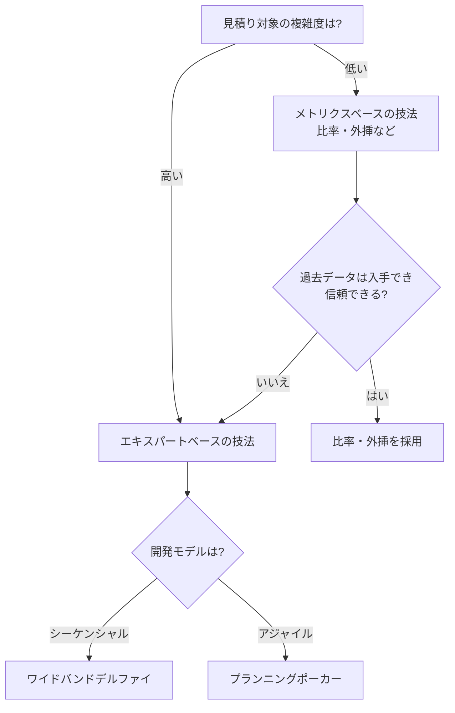

> ⚠️ 上の図のうち、A から D・E・F までの分岐はシラバスの例示に沿った内容です。G（過去データの有無による分岐）は、「データの可用性」の要因を考慮するための**筆者による補足**です。

#### 計算例（架空）：三点見積り

三点見積りでは、次の3つの推定値を使います（Foundation Level v4 の式）。

- a：楽観的推定値（うまくいった場合）
- m：最も可能性の高い推定値
- b：悲観的推定値（うまくいかなかった場合）

```text
期待値 E ＝ （a ＋ 4m ＋ b） ÷ 6
標準偏差 SD ＝ （b － a） ÷ 6
```

たとえば、あるテスト実行タスクで a＝10人日、m＝16人日、b＝40人日とします。

```text
E  ＝ （10 ＋ 4×16 ＋ 40） ÷ 6 ＝ 114 ÷ 6 ＝ 19人日
SD ＝ （40 － 10） ÷ 6 ＝ 5人日
```

期待値は19人日、標準偏差は5人日と説明できます。なお「19 ± 5人日（14〜24人日）」は期待値 ± 1標準偏差の幅を示すもので、この幅にどの程度の確率で収まるかは、分布の仮定（正規分布とみなすなど）を置かない限り決まりません。確率つきの区間として示す場合は、前提とする分布とカバー率（例：正規分布を仮定して約68％）を明記してください。いずれにせよ、悲観的推定値が大きく離れているため標準偏差が大きく、**不確実性が高いタスク**であることが読み取れます。

#### 計算例（架空）：比率による見積り

過去の類似プロジェクトで「開発工数：テスト工数 ＝ 3：2」だったとします。今回の開発工数が300人日と見積られているなら、テスト工数の目安は 300 × 2/3 ＝ 200人日です。ただし、**今回のプロダクトの複雑度や品質要件が過去と大きく異なる場合は、比率をそのまま使えません**（この点が、データの可用性と、コンテキストの類似性を確認する理由です）。

#### 見積りは「一度作って終わり」ではない

- 一度作った見積りは、**正当な理由とともにプロジェクトマネジメントに提出**します。
- テストスコープなどの入力パラメーターが変わるため、見積りは**調整されることが頻繁にあります**。
- 理想的には、最終的なテスト見積りは、**品質・スケジュール・予算・機能**の領域で、組織のゴールとプロジェクトのゴールの**可能な限り最良のバランス**を表します。
- 見積りは**作成時点で有効な情報**に基づきます。プロジェクトの初期は情報が限られ、時間とともに情報が変わるため、**新しい情報が出たら更新**して正確さを保ちます。

出典：[JSTQB日本語版シラバス（PDF）](https://www.jstqb.jp/wordpress/wp-content/uploads/2026/06/JSTQB-Syllabus.Advanced_TM_VersionV3.0.J04.pdf) 2.2.3（p.56〜57）、[ISTQB英語版シラバス（PDF）](https://istqb.org/?sdm_process_download=1&download_id=3445) 2.2.3（p.53〜54）

> 💡 **ベストプラクティス**（シラバス根拠：2.2.3 ＋ 実務補足）
>
> - **前提条件を必ず文書化**し、見積りとセットで提出する。前提が崩れたら再見積りのトリガーにする。
> - **複数の技法を併用**して結果を突き合わせる（例：比率による見積りとプランニングポーカー）。大きく食い違う場合は前提の見落としを疑う（実務補足）。
> - 見積りは**レンジ（幅）で示す**。三点見積りの標準偏差のように、不確実性を数字で伝える。
> - 過去プロジェクトの**実績データ**（工数、欠陥数、再テスト率）を蓄積し、次の見積りの精度向上に活用する。
> - 複数チーム・複数SDLCが混在するときは、チームごとに適した技法を使い、**全体のプロジェクト計画に統合**する。

#### 2.2 節でよくある間違い（試験の引っかけ）

| 誤解 | 正しい理解 |
|---|---|
| 工数と期間は同じ | **異なる**ことが多い。工数（人時）を稼働日数に換算して期間を見積る |
| 見積りは最初に1回作れば十分 | 新しい情報や変更に合わせて**更新**する |
| 見積りの前提は口頭共有でよい | **文書化**が必要 |
| 履歴データがなくても比率・外挿は使える | 履歴データが必要。なければエキスパートベースを検討 |
| アジャイルでもテスト工数は独立した項目として見積る | 開発作業の中で見積り、個別の値としては見積らないことが多い |
| 複雑度が高い対象にはメトリクスベースが向いている | 複雑度が高い場合は**エキスパートベース**の例が示されている |

---

## 4. 【シラバス2.3】欠陥マネジメント

> 学習の目的：TM-2.3.1（K3）／TM-2.3.2（K2）／TM-2.3.3（K2）／TM-2.3.4（K2）／TM-2.3.5（K3）／TM-2.3.6（K2）

### 導入：欠陥マネジメントとは

期待結果と異なる実際の結果を**観察した後**に始まる一連の活動を、本シラバスは**欠陥マネジメント**と呼びます。

| 用語の違い | 説明 |
|---|---|
| 欠陥マネジメント | 本シラバスでの呼び方 |
| インシデントマネジメント | ISO/IEC/IEEE 29119-3 標準の用語 |
| 不正マネジメント | TMAP の用語 |

「インシデント」や「不正」という言葉を使う標準がある理由は、**プロセスの初期段階では、その食い違いが作業成果物の欠陥によるものか、他の原因**（例：自動テストの故障、テスト担当者の要件の誤解）**によるものか分からない**からです。

効果的な欠陥マネジメントの価値は次のとおりです。

- テストチームと他のステークホルダーが、SDLC全体を通して**プロジェクトの状態を把握**できる
- **どの欠陥を修正するかを決定**するために重要（欠陥修正への労力を適切に配分できる）
- 欠陥データを長期にわたって収集・分析すると、テストと他のプロセス（例：アーキテクチャ・技術設計の改善による**欠陥予防**）の**改善領域**が見えてくる

テストマネージャーは、**欠陥マネジメントプロセスと選択したツールの両方が適切に使われるよう推進**する役割を持ちます。また、テストマネージャーとテスト担当者（アジャイルではチーム全体）は、**どのデータを取得することが重要か**を熟知していなければなりません。

出典：[JSTQB日本語版シラバス（PDF）](https://www.jstqb.jp/wordpress/wp-content/uploads/2026/06/JSTQB-Syllabus.Advanced_TM_VersionV3.0.J04.pdf) 2.3 導入（p.58）

### ステップ1（TM-2.3.1・K3）：欠陥のライフサイクルと欠陥ワークフロー

#### 1-1 欠陥は「早く見つけて、同じフェーズで取り除く」ほど安い

- SDLC の**各フェーズ**には、潜在的な欠陥を検出し取り除く活動を入れるべきです。たとえば、設計仕様書・要件仕様書・コードに対して、**後続の活動に渡す前に**静的テスト技法（レビュー、静的解析）を使えます。
- **各欠陥を早期に検出して取り除く**ほど、プロダクトの全体的な**品質コスト**は下がります。
- 欠陥が**混入したのと同じフェーズ内で取り除ける**（フェーズ内封じ込めが完全に達成される）とき、品質コストは**最小化**されます。

#### 1-2 不正が観察されてから欠陥レポートまで

| 段階 | 内容 |
|---|---|
| 静的テスト | 欠陥そのものを**探す** |
| 動的テスト | 欠陥が**故障**を引き起こしたときに、欠陥の存在が明らかになる |
| 不正 | 実際のテスト結果と期待するテスト結果の**違い** |
| 偽陰性 | 不正が観測されなかった（見落とした）場合の結果 |
| 調査 | 不正を観察したら**さらに調査**する。通常は、定義された**テスト／欠陥マネジメントプロセスにしたがって欠陥レポートを作成**することから始まる |

**テストが不合格でも、欠陥レポートを作るとは限りません**。たとえばテスト駆動開発（TDD）では、自動化されたコンポーネントテストが「実行可能な設計仕様書」として使われます。コンポーネントの開発が完了するまでは、最初はテストの一部または全部が不合格でなければなりません。このような不合格は必ずしも欠陥が原因ではなく、通常は**欠陥レポートで追跡されません**。

#### 1-3 単純な欠陥ワークフロー

欠陥レポートは**ワークフロー**（多くの欠陥マネジメントツールと合わせるため、シラバスは「欠陥ワークフロー」と呼びます）に沿って進み、一連の**状態**を通過します。ほとんどの状態では、**1人が欠陥レポートを所有**し、分析・欠陥除去・確認テストなどのタスクを担当します。

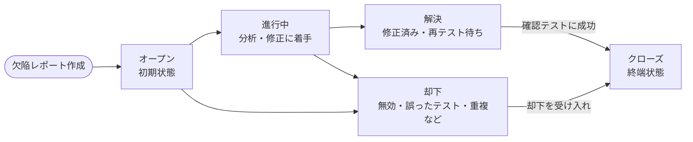

> ⚠️ 原文の図2は矢印の向きが画像で示されており、私が参照した本文抽出では、矢印の向きまでは確認できませんでした。上の図は**本文の説明に沿った典型形**です。試験対策では、原文の図2（英語版 p.56、日本語版 p.59〜60）で矢印の向きを確認してください。

| 状態 | 意味（シラバス） | 典型的な所有者・担当（組織によって異なる） |
|---|---|---|
| オープン（新規） | 欠陥レポートが作成されたときの**初期状態** | 起票者／トリアージ担当 |
| 進行中 | チームが欠陥レポートの**分析や修正**に取り組んでいる | 開発者・アナリスト |
| 却下 | 処理した人（通常は開発者やアナリスト）が**却下**した。理由（無効な情報、誤ったテスト、重複など）を欠陥レポートに追記する | 却下した開発者・アナリスト |
| 解決（修正済み／再テスト待ち） | テスト担当者が、欠陥レポートの**再現手順**にしたがって**確認テスト**を行い、修正で本当に解決したかを判断する | テスト担当者 |
| クローズ | **終端状態**。これ以上の作業予定はない。確認テストが成功した後、または却下を受け入れたときにテスト担当者が遷移させる | テスト担当者 |

単純なワークフローは多くの組織で使われ、コンテキストに応じて**他の状態**（再オープン、受け入れ、明確化、見送りなど）で**拡張**されます。次の図は、拡張の**一例**です（シラバスが示す状態名を使った筆者の例示）。

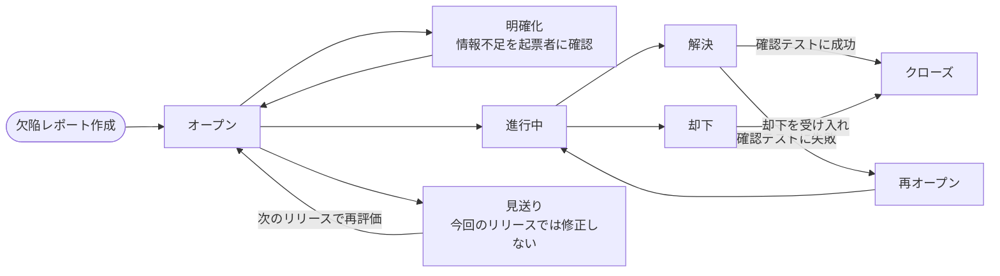

**ワークフローは組織ごとに異なってよい**部分があります：状態の名称、状態間の遷移ルール、特定の状態のタスクに責任を持つ役割。**アジャイルでは、欠陥ワークフローはシーケンシャル開発モデルより単純**なことが多く、**与えられたコンテキストに適応させる**べきです。

#### 1-4 欠陥ワークフロー設計のよい実践（シラバスの7項目）

| No. | ルール | 理由・狙い（考え方） | ルールを破ったときの例 |
|---|---|---|---|
| 1 | 可能なら**組織全体で**定義し、全プロジェクトで統一する | 統一された欠陥マネジメントで、プロジェクト間の比較・集計ができる | プロジェクトごとに状態名が違い、全社集計ができない |
| 2 | 重複欠陥・偽陽性欠陥は、**別のステータス**、または**却下理由の選択＋却下ステータス**で表す | テストプロセス改善のための欠陥分析に役立つ | 「クローズ」に混ぜてしまい、レポート品質の分析ができない |
| 3 | **終端ステータスは1つ**（例：クローズ）にし、遷移時に**終結の理由**を選択させる | プロセスアセスメントや改善活動に役立つ | 「クローズ」「完了」「無効」が乱立し、集計が複雑になる |
| 4 | ステータス名は、他のエンティティ（ユーザーストーリー、テストタスクなど）の**類似ステータスと同じ名前**にする | 作業を簡単にし、混乱を防ぐ | 同じ意味の状態が別名で管理され、伝達ミスが起きる |
| 5 | **連続する欠陥ステータスは異なる責任を持つ役割**に割り当てる。同じ役割に連続で割り当てる場合は**正当な理由**を持つ（例：ステータスに費やした時間を測定するため） | 責任が交代する点で状態を区切る | 同じ人が3つの連続状態を持ち、状態遷移が形骸化する |
| 6 | **終端ステータスを除く各ステータス**に**1つ以上の遷移先**を持たせる。例外は正当化する | 次のステップの責任を持つ役割を判断できるようにする | 行き止まりの状態があり、欠陥が放置される |
| 7 | ステータス遷移時に**入力を要求する属性**は、欠陥マネジメントに**実質的な価値を与えるもの**に限る | 入力の手間で現場が疲弊するのを避ける | 遷移のたびに20項目を必須にして、入力が雑になる |

#### 1-5 手順：欠陥マネジメントプロセスを実装する（TM-2.3.1・K3）

> この手順は、シラバスの要素（組織標準、ワークフロー設計のよい実践、委員会、必須項目など）を、実装の順序として筆者が整理したものです。

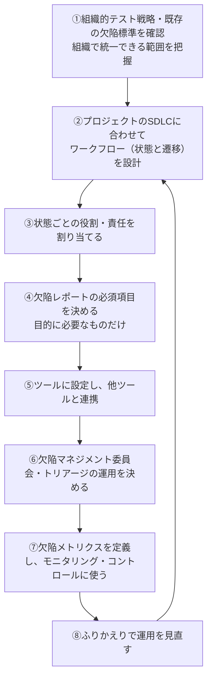

出典：[JSTQB日本語版シラバス（PDF）](https://www.jstqb.jp/wordpress/wp-content/uploads/2026/06/JSTQB-Syllabus.Advanced_TM_VersionV3.0.J04.pdf) 2.3.1（p.58〜60）、[ISTQB英語版シラバス（PDF）](https://istqb.org/?sdm_process_download=1&download_id=3445) 2.3.1（p.55〜57）

> 💡 **ベストプラクティス**（シラバス根拠：2.3.1）
>
> - ワークフローは**シンプルに始め**、必要になった状態だけ追加する。
> - 状態遷移のたびに必要となる入力項目は最小限にする。
> - 重複・却下・偽陽性の**理由を構造化して記録**する。あとでレポート品質の分析（2.3.6）に使える。
> - SDLC の各フェーズに、欠陥を検出し取り除く活動（レビュー、静的解析、テスト）を**最初から計画に組み込む**。

### ステップ2（TM-2.3.2・K2）：機能横断的な欠陥マネジメント

#### 誰が、どのプロセスで欠陥を扱うか

- テスト組織とテストマネージャーは、**全体的な欠陥マネジメントプロセスとツール**を所有していることが多いです。
- ただし、特定のプロジェクトの欠陥マネジメントは、通常**機能横断的なチーム**が担当します。このチームを**欠陥マネジメント委員会**と呼ぶことがあります。

| 委員会の構成メンバー（シラバスの例） |
|---|
| テストマネージャー |
| 開発の代表者 |
| サプライヤー |
| プロジェクトマネジメント |
| プロダクトマネジメント |
| プロダクトオーナー |
| テスト対象ソフトウェアに関心のあるその他のステークホルダーの代表者 |

#### 委員会（トリアージミーティング）が行うこと

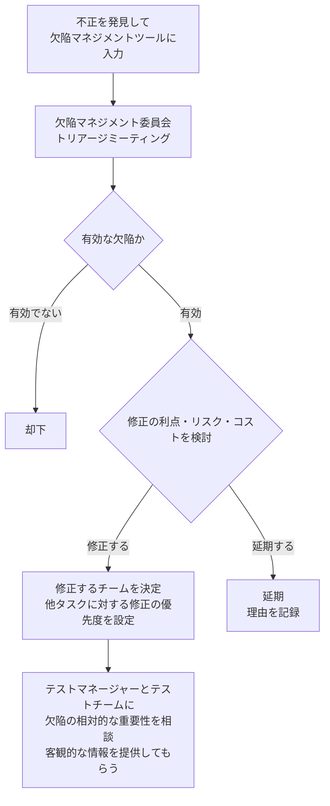

- 各欠陥レポートが**有効な欠陥か**を判断する
- 有効な欠陥を**修正すべきか、却下すべきか、延期すべきか**を決める（複数の開発チームが関与する場合は、**どのチームが修正するか**も決める）
- 判断には、修正に関連する**利点・リスク・コスト**を検討する（ミーティング＝**トリアージミーティング**で議論すると有益）
- 修正する場合は、**他のタスクに対する優先度**を設定する
- 欠陥の**相対的な重要性**は、テストマネージャーとテストチームに相談し、**有効な客観的情報**を提供してもらう

#### 専任の欠陥マネージャー

**非常に大規模なプロジェクト**では、委員会での意思決定の準備・フォローに必要な労力を考えると、**専任の欠陥マネージャー**を任命するのが適切なことがあります。少なくとも、テストが最も集中的に行われる SDLC フェーズには必要になるかもしれません。他の状況では、複数の大規模プロジェクトで欠陥マネージャーを**共有**することもあります。

#### ツールと委員会は「コミュニケーションの代用」ではない

- 欠陥マネジメントツールを、**優れたコミュニケーションの代用**として使ってはいけません。
- 欠陥マネジメント委員会も、**優れた欠陥マネジメントツールを効果的に使うことの代用**にはなりません。
- 効果的で効率的な欠陥マネジメントには、次の**4つすべて**が必要です。

| 必要な要素 | 内容 |
|---|---|
| コミュニケーション | 対話・共有 |
| 適切なツールサポート | 欠陥マネジメントツール |
| 明確に定義された欠陥ワークフロー | 欠陥レポートの属性を含む |
| 欠陥マネジメントチームの積極的な関与 | 委員会・担当者の関与 |

出典：[JSTQB日本語版シラバス（PDF）](https://www.jstqb.jp/wordpress/wp-content/uploads/2026/06/JSTQB-Syllabus.Advanced_TM_VersionV3.0.J04.pdf) 2.3.2（p.60）

> 💡 **ベストプラクティス**（シラバス根拠：2.3.2 ＋ 実務補足）
>
> - トリアージミーティングの**事前に**、重複の整理・再現性の確認・影響範囲の下調べを済ませる（実務補足）。ミーティングは判断に集中する。
> - 判断結果（修正する・却下・延期）と**その理由**を、必ず欠陥レポートに記録する。
> - 大規模プロジェクトでは、意思決定の準備・フォローを担う**欠陥マネージャー**の任命を検討する。

### ステップ3（TM-2.3.3・K2）：アジャイルチームにおける欠陥マネジメントの特徴

#### 基本方針：軽量でよいが、必要なときはレポートを作る

アジャイルでは、欠陥マネジメントは**シーケンシャル開発モデルより軽量的で、形式的でない**ことが多いです。同じ場所で働く、またはコミュニケーション手段が十分に確立されているチームでは、**形式的な欠陥レポートがなくても**、テスト担当者・顧客担当者・開発者の間で欠陥や故障の情報が交換されます。

しかし、次の場合には**欠陥レポートを作成すべき**です。

| 欠陥レポートを作成すべき場合 | 理由（考え方） |
|---|---|
| 他のスプリント活動（開発・テスト・その他）を**ブロック**し、チーム内ですぐに修正できない | 全員に見える形で管理する必要がある |
| **同じイテレーション内で解決できない** | 未解決を追跡する必要がある。チームによっては「故障を発見した**その日のうちに**解決できないならレポートを作る」というルールにしている |
| 複合チーム組織で、**他のチームによって（または協力して）解決**しなければならない | チーム間の受け渡しと追跡が必要 |
| **サプライヤー**が解決しなければならない | 外部とのやりとりの記録・証跡が必要 |
| 欠陥レポートが**明示的に求められている**（例：開発者がすぐに修正に取りかかれない） | 依頼者の要求に応じる |

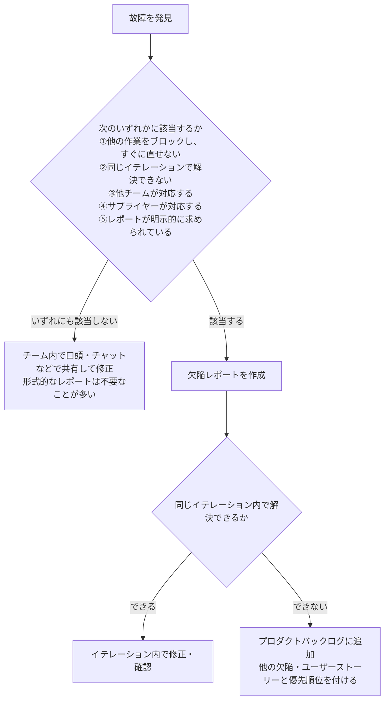

**一般的な実践**：同じイテレーション内で解決できない欠陥は、**プロダクトバックログ**に追加し、後のイテレーションのために、他の欠陥やユーザーストーリーの中で**優先順位を付けられる**ようにします。

#### 形式化のレベルを決める7つの要素

欠陥マネジメントの基本は**組織的テスト戦略で定める**べきですが、形式化のレベル、レポート作成のトリガー、取り込む属性などは、**アジャイルチームの合意**に委ねられます。次の要素を反映して決めます。

| 反映すべき要素 | 例（考え方） |
|---|---|
| チームメンバーの共通の作業場所 | 同室ならその場で共有できる。離れているほど記録が必要 |
| 時間帯を超えたチームメンバーの配置 | 時差があるほど非同期で読める記録が必要 |
| プロダクト開発に参画するチームの数 | チームが多いほど、共通の形式が必要 |
| チームの成熟性 | 成熟したチームは軽量な運用に耐えられる |
| チームの規模 | 大きいほど形式化が必要 |
| プロダクトに関するリスク | リスクが高いほど記録を厳密にする |
| 規制・契約・その他の要件（該当する場合） | 証跡が必要な場合は形式化が必須 |

**アジャイルチームによる欠陥マネジメントの最終決定は、常に文書化**すべきです（例：ナレッジマネジメントツールのガイドラインに記載）。

出典：[JSTQB日本語版シラバス（PDF）](https://www.jstqb.jp/wordpress/wp-content/uploads/2026/06/JSTQB-Syllabus.Advanced_TM_VersionV3.0.J04.pdf) 2.3.3（p.60〜61）

> 💡 **ベストプラクティス**（シラバス根拠：2.3.3 ＋ 実務補足）
>
> - 「どんなときに欠陥レポートを作るか」を**チームの作業合意（ワーキングアグリーメント）に明記**する。
> - 未解決で残る欠陥は**プロダクトバックログに集約**し、ユーザーストーリーと同じ土俵で優先順位を付ける。
> - 形式化のレベルは、チームの成熟・規模・リスク・規制などの変化に合わせて**ふりかえりで見直す**（実務補足）。

### ステップ4（TM-2.3.4・K2）：ハイブリッドソフトウェア開発における欠陥マネジメントの課題

実際のプロジェクトでは、**複数のチームが協業**してシステム（またはシステムオブシステムズ）を開発・提供することが多く、次のような**ハイブリッド**状況が生まれます。

- **顧客がアジャイル**、サプライヤーの1つが**シーケンシャル開発モデル**を使っている
- **シーケンシャル開発モデルの組織**が、**アジャイルチーム**からサブシステムの提供を受ける

このような複合チーム環境では、次の3つの課題が発生します。

| 課題 | 何が問題か | 対応の方向性（シラバス） |
|---|---|---|
| ①欠陥の属性と欠陥マネジメントツールの**整合性** | 理想は全チームが**1つのツール**を使うことだが、実際には各チームが別のツールを使うのが一般的（特に複数のサプライヤーが貢献する場合） | ツール間の**同期**を確立する（できれば**自動**で） |
| ②欠陥の**優先順位付け** | 開発の速さがチームごとに異なり、優先順位の判断が遅れる／ずれる | **プロダクトオーナー**が欠陥マネジメントミーティングに関与し、欠陥の結果とリスクの情報を**積極的に求める**。アジャイルの速さに合わせ、ミーティングを**頻繁に**（ただし**短く**）開催する。**少数のステークホルダーが最終判断**を下すことも有益 |
| ③**新規開発と欠陥修正のテスト計画書の整合性と透明性** | チームごとに計画がばらばらだと、欠陥修正が全体計画に乗らない | すべてのチームの仕事（**欠陥修正を含む**）を**同じプロジェクト計画書**に合わせる。全チームのメンバーが計画プロセスに**積極的に参加**する（例：シーケンシャルのチームがアジャイルのミーティングに参加して欠陥を議論・優先順位付け）。計画の**透明性**は、ダッシュボードやプロダクトバックログを介して共有して高める |


出典：[JSTQB日本語版シラバス（PDF）](https://www.jstqb.jp/wordpress/wp-content/uploads/2026/06/JSTQB-Syllabus.Advanced_TM_VersionV3.0.J04.pdf) 2.3.4（p.61〜62）

> 💡 **ベストプラクティス**（シラバス根拠：2.3.4 ＋ 実務補足）
>
> - ツールが複数ある場合は、**共通の必須属性（ID・タイトル・重要度・優先度・ステータス・所有者）を最初に合意**し、ステータス名の対応表を作る（実務補足）。
> - 優先順位の最終判断者は**少数**にし、判断の場は**短く頻繁に**回す。
> - **1つの計画・1つの見える化**（ダッシュボードやバックログ）を全チームで共有し、欠陥修正も同じ計画に載せる。

### ステップ5（TM-2.3.5・K3）：欠陥レポートに記載する情報と、その使い方

#### 欠陥レポート情報の4つの目的

欠陥レポートに書く情報は、次の目的に**十分**でなければなりません。

1. 欠陥のライフサイクルを通じた**欠陥レポートのマネジメント**
2. **プロジェクト全体の状況**（特にプロダクト品質やテスト進捗）のアセスメント
3. プロダクト品質の観点から、**プロダクトインクリメントの状況**のアセスメント
4. **プロセス能力**のアセスメント

#### 収集する情報の考え方

- 必要な情報は、欠陥が**SDLCのどの時点で検出されたか**によって変わります。
- **非機能品質特性**に関する欠陥レポートは、より多くの情報が必要なことがあります（例：性能課題の**負荷条件**）。
- ただし、**核となる情報は、SDLC全体で、理想的には組織内のすべてのプロジェクトで一貫**しているべきです。
- 項目を増やすたびに、レポート作成の時間が長くなり、入力者が**混乱**する可能性があります。**特定のコンテキストの欠陥マネジメントに必要なデータ、またはプロセス改善に使うデータのみを収集**します。

#### 必須の項目と、ツールが自動で作る項目

| 区分 | 項目 |
|---|---|
| ほとんどの環境で**必須** | ①欠陥のタイトルと不正の**簡単な概要** |
| | ②故障を再現する手順を含む、不正の**詳細な説明** |
| | ③テスト対象システム／プロダクトの**ステークホルダーへの影響の重要度** |
| | ④不正を修正する**優先度** |
| **ツールが作成**することが多い | 欠陥レポートの一意な**識別子** |
| | 欠陥レポートの**作成日時** |
| | 不正を**発見・報告した人**の名前 |
| | 不正が発見された**プロジェクトとSDLCフェーズ** |
| | 欠陥レポートの**ステータス** |
| | 現在の**所有者** |
| | 変更履歴（切り分け・修正・修正確認のために行ったアクションと日時） |
| | **参照**（テストケースや関連する欠陥など） |

> 💡 **重要**：**重要度**（ステークホルダーへの影響の大きさ）と**優先度**（修正する順序・緊急度）は**別の項目**です。影響が大きい欠陥でも、回避策があれば優先度を下げる判断があり得ます。逆に、影響は小さくても、リリース直前にお客様が必ず目にする表示の誤りなら優先度が高いことがあります。

#### 目的別にグループ化した追加情報

| 目的 | 追加する情報（シラバスの例） |
|---|---|
| 欠陥解決に役立てる | 欠陥が存在する**サブシステム／コンポーネント**、不正が観察された**テストアイテムとリリース番号**、欠陥が観察された**テスト環境** |
| プロジェクト全体の状況をアセスメントする | 欠陥を**修正する／修正しない**ことに関連する**リスク・コスト・機会・利益**、取り得る**回避策**の説明、欠陥によって**影響を受ける要件** |
| プロダクトインクリメントの状態を品質の観点からアセスメントする | 欠陥の**種類**（通常は欠陥分類法に対応）、欠陥が**混入した作業成果物**、影響を受けた**品質特性／副特性** |
| プロセス能力をアセスメントする | 欠陥または欠陥の根本原因に対する、**混入・検出・除去のSDLCフェーズ** |

コンテキストによっては、トレーサビリティなど、さらに情報を収集する場合もあります（詳細は ISO/IEC/IEEE 29119-3 を参照）。

#### 手順：欠陥レポート項目を決めて使う（K3）

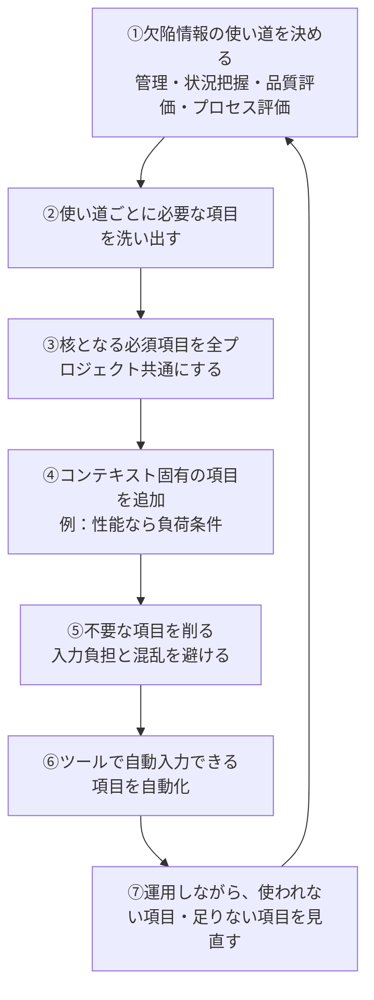

#### 具体例（架空）：欠陥レポートのサンプル

| 項目 | 記入例 |
|---|---|
| 識別子（ツールが自動付与） | DEF-1024 |
| タイトル | 「注文確定」ボタンを2回押すと注文が二重登録される |
| 概要 | ネットワークが遅い状態で、注文確定ボタンを連続で押すと、同一内容の注文が2件作成される |
| 詳細な説明（再現手順） | 1．カートに商品Aを1点入れる　2．「注文確定」を素早く2回押す　3．注文履歴を開く　→　期待結果：注文が1件。実際の結果：同一注文が2件 |
| 重要度 | 高（誤課金につながる） |
| 優先度 | 高（次回リリース前に修正） |
| ステータス／所有者（ツール） | オープン／（未割り当て） |
| 発見者・発見日時（ツール） | テスト担当者A／2026-09-21 10:30 |
| プロジェクト・SDLCフェーズ（ツール） | ECサイト刷新・システムテスト |
| テスト環境・リリース番号 | ステージング環境／build 2026.09.3 |
| 影響を受ける要件 | REQ-ORDER-012（注文の重複防止） |
| 参照 | テストケース TC-ORD-045 |
| 欠陥の種類・混入した作業成果物（判明後に追記） | 制御の抜け（二重送信対策）／画面詳細設計書 |
| 混入・検出フェーズ（判明後に追記） | 混入：詳細設計、検出：システムテスト |

出典：[JSTQB日本語版シラバス（PDF）](https://www.jstqb.jp/wordpress/wp-content/uploads/2026/06/JSTQB-Syllabus.Advanced_TM_VersionV3.0.J04.pdf) 2.3.5（p.62〜63）、[ISTQB英語版シラバス（PDF）](https://istqb.org/?sdm_process_download=1&download_id=3445) 2.3.5（p.59）

> 💡 **ベストプラクティス**（シラバス根拠：2.3.5 ＋ 実務補足）
>
> - **再現手順・期待結果・実際の結果**を、他人が読んで再現できる粒度で書く。
> - **重要度と優先度を分けて**入力させる。重要度は影響の大きさ、優先度は修正の緊急度。
> - 核となる情報は組織内の全プロジェクトで一貫させ、非機能欠陥のような**特別な条件（負荷条件など）だけを追加項目**にする。
> - 混入フェーズ・根本原因などは、**欠陥が解決してから追記**する項目として設計し、起票時の入力負担を増やさない（実務補足）。

### ステップ6（TM-2.3.6・K2）：欠陥レポート情報からプロセス改善アクションを導く

欠陥レポートは、プロジェクトの状況の**モニタリングと報告**に役立つだけでなく、ふりかえりで議論する**プロセス改善**の材料になります。テストマネージャーは、欠陥レポートが**開発とテストのプロセス能力のアセスメント**にどんな意味を持つかを認識しておくべきです。

#### 欠陥情報 → 改善のヒント（シラバスの7つの例）

| No. | 使う欠陥情報 | 分析の内容 | 導ける改善 |
|---|---|---|---|
| 1 | 欠陥の**混入・検出・除去のフェーズ** | **フェーズ内封じ込め**のアセスメント、**品質コスト分析** | 各フェーズの欠陥検出効果を上げ、欠陥関連コストを最小化する |
| 2 | **混入フェーズ**の情報 | 欠陥が最も多く混入するフェーズを分析 | 欠陥予防のための**的を絞った改善** |
| 3 | 欠陥の**根本原因** | 根本原因の集計・分析 | 欠陥の総数を減らすプロセス改善 |
| 4 | 欠陥の**発生箇所** | 欠陥の**クラスター分析** | 技術的リスクの理解（リスクベースドテストへ活用）、問題のあるコンポーネントの**リファクタリング** |
| 5 | **再オープンした欠陥** | デバッグ時の**実装の品質**をアセスメント | 修正作業の質の改善 |
| 6 | **重複した欠陥・却下した欠陥** | **欠陥レポート作成の品質**をアセスメント | レポートの書き方・ガイドの改善 |
| 7 | エラーを未然に防ぐ積極的な手段を導入 | 欠陥の総数を減らす | 予防的なプロセス改善（例：チェックリスト、ペアレビュー） |


#### 具体例（架空）：混入フェーズ×検出フェーズのマトリクスで「フェーズ内封じ込め」を評価する

欠陥200件を、**混入フェーズ**（どこで作り込まれたか）と**検出フェーズ**（どこで見つかったか）で集計したとします。

| 混入フェーズ＼検出フェーズ | 要件レビュー | 設計レビュー | コード／コンポーネントテスト | システムテスト | 本番 | 合計 | 同じフェーズで検出できた割合 |
|---|---|---|---|---|---|---|---|
| 要件定義 | 12 | 6 | 2 | 14 | 6 | 40 | 30％（12÷40） |
| 設計 | — | 20 | 8 | 17 | 5 | 50 | 40％（20÷50） |
| コーディング | — | — | 55 | 45 | 10 | 110 | 50％（55÷110） |
| 合計 | 12 | 26 | 65 | 76 | 21 | 200 | — |

**読み取り（分析→改善案）**

1. 要件定義で混入した欠陥は、同じフェーズで見つかった割合が30％と最も低く、**6件が本番まで流出**している → **要件レビューの強化**（観点の追加、ステークホルダーの参加）が最も効果的そう。
2. 本番流出は全体で21件（約10.5％）。外部失敗コストは高いため、**品質コスト**の観点でも優先度が高い。
3. コーディングで混入した欠陥は、50％が同一フェーズで検出されており、**コードレビューや静的解析の追加**で、さらに前倒しできる余地がある。

これは「欠陥が最も多く混入するフェーズはどこか」「フェーズ内封じ込めはどの程度達成できているか」を判断する典型的な使い方です。

#### 欠陥を追跡しないことのリスク

チームが、**効率性の名の下に、またはプロセスのオーバーヘッドを減らすため**に、SDLCの一部または全部のフェーズで発見された欠陥を**追跡しない**と決めることがあります。しかし、これは**ソフトウェア開発とテストのプロセス能力の可視性を大幅に低下**させます。信頼できるデータが不足し、上記の改善を実施することが**難しくなります**。

補足：テストプロセスの**有効性と効率性**をアセスメントするメトリクスの使い方は、ISTQB Expert Level の Improving the Test Process シラバスで説明されています。また、品質コストの考え方（欠陥予防・評定・内部失敗・外部失敗の4カテゴリ）は第3章 3.2.1 節にあり、2.3.6 の改善提案と密接に関連します。

出典：[JSTQB日本語版シラバス（PDF）](https://www.jstqb.jp/wordpress/wp-content/uploads/2026/06/JSTQB-Syllabus.Advanced_TM_VersionV3.0.J04.pdf) 2.3.6（p.63〜64）、3.2.1 品質コスト（p.72）

> 💡 **ベストプラクティス**（シラバス根拠：2.3.6 ＋ 実務補足）
>
> - 欠陥レポートに**混入・検出・除去フェーズ**と**根本原因**を必ず残し、ふりかえりで定期的に集計する。
> - 欠陥のクラスター（集中箇所）は、リスクベースドテストの**リスク見直し**とリファクタリングの判断材料にする。
> - 重複・却下・再オープンの割合を、**欠陥レポートの品質・修正の品質のモニタリング指標**として使う。
> - オーバーヘッドを減らすために欠陥追跡を止めるのではなく、**入力項目を絞って**続ける。

#### 2.3 節でよくある間違い（試験の引っかけ）

| 誤解 | 正しい理解 |
|---|---|
| テストが不合格なら必ず欠陥レポートを作る | TDDなどでは、不合格が想定内で、**欠陥レポートで追跡しない**場合がある |
| 終端ステータスは複数あるほうが分析しやすい | **1つの終端ステータス**（＋終結理由の選択）が推奨される |
| アジャイルでは欠陥レポートは一切不要 | ブロック・同一イテレーションで解決不可・他チーム／サプライヤー対応などでは**作成すべき** |
| 欠陥ツールがあれば委員会やコミュニケーションは不要 | ツール・委員会は**コミュニケーションの代用にならない**（4要素すべてが必要） |
| 重要度と優先度は同じ意味 | 重要度は**影響の大きさ**、優先度は**修正の緊急度・順序** |
| ハイブリッドでは欠陥ツールを1つに統一しなければならない | 理想は1つだが、実際は複数。**同期**（できれば自動）を確立する |
| 効率化のために、一部フェーズの欠陥追跡をやめてもプロセス改善に影響しない | **プロセス能力の可視性が下がり**、改善が難しくなる |

---

## 5. 章全体のまとめ

### 5.1 第2章の要点（1ページまとめ）

| 節 | 最重要ポイント | 覚え方 |
|---|---|---|
| 2.1 テストメトリクス | メトリクスは**テスト目的**から導く。プロジェクト／プロダクト／プロセスの3分類。モニタリングは「見る」、コントロールは「動く」。上位レベルは要件・リスクでカバレッジを測る。**構造カバレッジ100％でも上位テストは必要** | 「目的→終了基準→メトリクス」 |
| 2.2 テスト見積り | 工数・時間・コスト。工数≠期間。影響要因は5区分。技法は**メトリクスベース**と**エキスパートベース**。選択の要因は**誤差・データ・専門家・モデリング・時間**。前提は文書化し、更新し続ける | 見積り誤差・データ・専門家・モデリング・時間（頭文字で「誤・デ・専・モ・時」） |
| 2.3 欠陥マネジメント | 不正→調査→欠陥レポート→ワークフロー。**単純な5状態**（オープン・進行中・却下・解決・クローズ）。委員会とトリアージ。アジャイルは軽量だが5条件で作成。ハイブリッドの課題は**ツール・優先順位・計画の整合性**。必須項目は4つ。フェーズ内封じ込めと根本原因で改善 | 「欠陥は早く・同じフェーズで・記録して学ぶ」 |

### 5.2 他の章とのつながり

| 第2章の内容 | つながる箇所 | どうつながるか |
|---|---|---|
| メトリクスの元になる**テスト目的・終了基準** | 第1章 1.4.3 スマートの法則 | 測定可能な目的があって初めてメトリクスを決められる |
| リスクカバレッジ・残存リスク | 第1章 1.3 リスクベースドテスト | リスクの観点で報告する |
| ツールで得るメトリクス | 第1章 1.6.5 ツールメトリクス | 収集の自動化 |
| テスト見積りの要因（人・スキル） | 第3章 3.1 テストチーム | スキル・経験が工数に影響 |
| 欠陥情報によるプロセス改善 | 第1章 1.5（IDEAL・根本原因分析・ふりかえり） | 欠陥データが分析の材料になる |
| 欠陥のフェーズ内封じ込め | 第3章 3.2.1 品質コスト | 早期検出ほど品質コストが下がる |
| 欠陥マネジメントとツール | 第1章 1.6 テストツール | ツール選定・導入・運用 |

### 5.3 用語対訳表（日本語・英語）

| 日本語 | 英語 |
|---|---|
| テストメトリクス | test metric |
| プロジェクトメトリクス／プロダクトメトリクス／プロセスメトリクス | project metric／product metric／process metric |
| テストモニタリング／テストコントロール／テスト完了 | test monitoring／test control／test completion |
| テスト進捗レポート／テスト完了レポート | test progress report／test completion report |
| 要件カバレッジ／プロダクトリスクカバレッジ／コードカバレッジ | requirements coverage／product risk coverage／code coverage |
| 欠陥検出率（DDP） | defect detection percentage |
| テスト見積り | test estimation |
| メトリクスベース／エキスパートベース | metrics-based／expert-based |
| 三点見積り／ワイドバンドデルファイ／プランニングポーカー | three-point estimation／wideband Delphi／planning poker |
| 不正 | anomaly |
| 故障／欠陥 | failure／defect |
| 欠陥レポート／欠陥ワークフロー | defect report／defect workflow |
| 欠陥マネジメント委員会 | defect management committee |
| フェーズ内封じ込め | phase containment |
| 確認テスト | confirmation testing |
| 偽陰性 | false negative |
| 品質コスト | cost of quality |

### 5.4 試験対策のコツ（K レベル別）

| K レベル | 該当LO | 問われ方 | 対策 |
|---|---|---|---|
| K2（理解） | 2.1.1、2.1.2、2.2.1、2.2.2、2.3.2、2.3.3、2.3.4、2.3.6 | 例を挙げる・説明する・比較する | 「表の項目（要因の5区分、ワークフローの7ルール、アジャイル5条件など）」を自分の言葉で説明できるようにする |
| K3（適用） | 2.3.1、2.3.5 | 手順・技法を与えられた状況に適用する | 欠陥ワークフローの設計、欠陥レポート項目の選定を**自分で作ってみる** |
| K4（分析） | 2.1.3、2.2.3 | 状況を分析して選ぶ・優先付けする | 「読み手は誰か・どの判断をするか」「複雑度・データ・専門家・時間」といった**判断軸で消去法**を使う |
| K1（記憶） | キーワード全般 | 用語の想起・認識 | 1.4 節のキーワード表を暗記する |

---

## 6. 確認問題（筆者作成・10問）

> ISTQB公式のサンプル問題ではありません。第2章の理解確認用に、シラバスの記述をもとに筆者が作成しました。公式のサンプル問題は、7章の参考資料に載せたリンク（Sample Exam A・B）から入手できます。まず自力で答えてから、後ろの解答表で確認してください。

| No. | 問題 | 関連LO |
|---|---|---|
| Q1 | 「テストプロセスの能力とテストの有効性を測る」メトリクスは、プロジェクト・プロダクト・プロセスのどれか | TM-2.1.1 |
| Q2 | コンポーネントテストで構造カバレッジ100％を達成した。上位のテストレベルで欠陥と品質リスクへの対処は不要になるか | TM-2.1.3 |
| Q3 | テストコントロールの具体例を2つ挙げよ | TM-2.1.2 |
| Q4 | テスト実行の工数が60人日、テスト担当者が4人で、各自がテストに使える時間が稼働時間の75％。期間は何稼働日か | TM-2.2.1 |
| Q5 | 三点見積りで a＝6、m＝12、b＝30（人日）のとき、期待値 E と標準偏差 SD を求めよ | TM-2.2.3 |
| Q6 | 複雑度が高く、シーケンシャル開発モデルのプロジェクトで、シラバスが例示する見積り技法は何か | TM-2.2.3 |
| Q7 | 欠陥ワークフローの終端ステータスは、いくつが推奨されるか。また、その遷移時に何を選択させると有用か | TM-2.3.1 |
| Q8 | アジャイルチームが欠陥レポートを作成すべき場合を3つ挙げよ | TM-2.3.3 |
| Q9 | ハイブリッド開発で、チームごとに欠陥マネジメントツールが異なるとき、望ましい対応は何か | TM-2.3.4 |
| Q10 | 再オープンした欠陥に関する情報から、何をアセスメントできるか | TM-2.3.6 |

### 解答と根拠

| No. | 解答 | 根拠 |
|---|---|---|
| Q1 | **プロセスメトリクス** | 2.1 導入 |
| Q2 | **不要にならない**。構造カバレッジ100％でも、欠陥と品質リスクは上位のテストレベルで対処する必要が残る | 2.1.3 |
| Q3 | 例：識別したリスクが課題事項になった場合のテストの**再優先順位付け**、テスト環境の提供遅れを考慮した**スケジュール調整**、手戻りによる開始／終了基準の**再評価**、新しい**リソースの追加**（この4つから任意の2つ） | 2.1.2 |
| Q4 | 60 ÷ （4 × 0.75）＝ **20稼働日** | 2.2.1（工数と期間は異なる） |
| Q5 | E ＝ （6 ＋ 4×12 ＋ 30） ÷ 6 ＝ 84 ÷ 6 ＝ **14人日**。SD ＝ （30 － 6） ÷ 6 ＝ **4人日** | 2.2.3（FL v4 の三点見積り） |
| Q6 | エキスパートベースの技法のうち、シーケンシャルでは**ワイドバンドデルファイ** | 2.2.3 の例示 |
| Q7 | **1つ**（例：クローズ）。遷移時に**終結の理由**を選択させると、プロセスアセスメント・改善に有用 | 2.3.1 のよい実践 |
| Q8 | 例：他のスプリント活動を**ブロック**して即時に直せない／**同じイテレーション内で解決できない**／**他チーム**が対応する／**サプライヤー**が対応する／レポートが**明示的に求められている**（この5つから任意の3つ） | 2.3.3 |
| Q9 | 欠陥マネジメントツール間の**同期を確立**する（できれば自動で） | 2.3.4 |
| Q10 | デバッグ時の**実装の品質** | 2.3.6 |

---

## 7. 参考資料・出典一覧

### 7.1 一次情報（試験の根拠）

| 資料名 | URL | 用途 |
|---|---|---|
| ISTQB CTAL-TM v3.0 認定ページ | <https://istqb.org/certifications/certified-tester-advanced-level-test-management-ctal-tm-v3-0/> | 試験構成（50問、合格点58／88点、120分）、ビジネス成果、教材ダウンロード |
| ISTQB CTAL-TM シラバス v3.0（英語版PDF） | <https://istqb.org/?sdm_process_download=1&download_id=3445> | 第2章の原文（英語版 p.47〜61） |
| JSTQB 日本語版シラバス CTAL-TM Version3.0.J04（PDF） | <https://www.jstqb.jp/wordpress/wp-content/uploads/2026/06/JSTQB-Syllabus.Advanced_TM_VersionV3.0.J04.pdf> | 第2章の日本語版（p.49〜64）、用語 |
| JSTQB シラバス（学習事項）・用語集ページ | <https://www.jstqb.jp/syllabus/> | 最新の日本語版シラバス（改訂版）を確認する入口 |
| JSTQB プレスリリース（Advanced Level テストマネジメント V3.0 公開） | <https://prtimes.jp/main/html/rd/p/000000044.000054604.html> | シラバス公開経緯、章構成の変更点、試験開始時期 |
| ISTQB 用語集 | <https://glossary.istqb.org/en_US/search?term=> | 用語の公式定義（英語） |

### 7.2 サンプル試験（ISTQB公式）

| 資料名 | URL |
|---|---|
| CTAL-TM Sample Exam A – Questions | <https://istqb.org/?sdm_process_download=1&download_id=3449> |
| CTAL-TM Sample Exam A – Answers | <https://istqb.org/?sdm_process_download=1&download_id=3451> |
| CTAL-TM Sample Exam B – Questions | <https://istqb.org/?sdm_process_download=1&download_id=9612> |
| CTAL-TM Sample Exam B – Answers | <https://istqb.org/?sdm_process_download=1&download_id=9614> |

### 7.3 シラバスが参照する標準・関連シラバス（試験範囲外だが理解の助け）

| 資料 | 備考 |
|---|---|
| ISO/IEC/IEEE 29119-2（テストプロセス）、29119-3（テストドキュメント） | 標準の内容そのものは試験対象外（シラバスの要約部分のみ対象）。URLは未確認のため書名のみ記載 |
| ISTQB Foundation Level Syllabus v4.0 | 見積り技法（比率・外挿・ワイドバンドデルファイ・三点見積り）、確認テスト等の基礎。JSTQB 日本語版は上記の JSTQB シラバスページから入手可能 |
| ISTQB Expert Level Test Management／Improving the Test Process（2011） | プロダクト・プロセスメトリクス、DDP 等の詳細 |

### 7.4 本ガイドの根拠の区分と、確認が必要な箇所

| 区分 | 内容 |
|---|---|
| シラバスの記述に基づく | 各節の定義、表、リスト、よい実践、LO、キーワード、試験構成 |
| 筆者による整理・補足（「実務補足」「筆者整理」と明記） | テストレポート作成手順、欠陥マネジメント実装手順、ベストプラクティスのうちシラバス根拠のないもの、架空の計算例・サンプル、確認問題 |
| Foundation Level v4 の知識に基づく | 三点見積りの式、見積り技法の分類（メトリクスベース／エキスパートベース） |
| **原文で要確認** | 図2（2.3.1）の矢印の向き（本ガイドは本文の説明に沿った典型形） |

> ⚠️ **バージョンに関する注意**：本ガイドが参照する日本語版シラバスは Version3.0.J04（2026/06 掲載）であり、本文中のページ番号も Version3.0.J04（全 91 ページ）の目次で確認済みです。受験前には上記 JSTQB シラバスページで**最新版の版数と変更点**を確認してください。
