# 🌀 ISTQB® CTFL-AT Chapter 1: アジャイルソフトウェア開発

## 完全解説ガイド【中級者〜上級者向け・ステップバイステップ】

> **対応資格**: ISTQB® Certified Tester Foundation Level – Agile Tester (CTFL-AT)
> **対応章**: Chapter 1 "Agile Software Development"（150分想定）
> **シラバス版**: CTFL-AT Syllabus Version 2014（現行の最新版）
> **前提資格**: ISTQB® CTFL（Foundation Level）必須
> **最終更新**: 2025年（本ガイド作成時点の最新公式情報に基づく）

📌 **公式認定ページ**: <https://istqb.org/certifications/certified-tester-foundation-level-agile-tester-ctfl-at/>
📌 **公式シラバスPDF**: <https://istqb.org/wp-content/uploads/2024/11/ISTQB-CTFL-AT_Syllabus_v1.0.pdf>

---

## ⚠️ 重要な最新情報：CTFL-AT のサンセット（廃止予定）について

本ガイドの執筆時点で、ISTQB® は CTFL-AT の**サンセット（段階的廃止）**を正式に発表しています。学習を始める前に必ず確認してください。

| 項目 | 内容 |
|------|------|
| **後継資格** | CTAL-AT v2.0（Certified Tester Advanced Level Agile Tester）が新設 |
| **英語試験の提供終了日** | 2027年5月6日（再受験含む） |
| **非英語試験の提供終了日** | 2027年11月6日（再受験含む） |
| **既存資格の扱い** | サンセット後も取得済みのCTFL-AT認定は有効なまま失効しない |
| **代替となる学習先** | ① CTFL v4.0（Foundation Levelにアジャイル概念が統合済み）<br>② CTAL-AT v2.0（本格的なアジャイルテスト専門知識） |

> 💡 **なぜCTFL-ATを学ぶ価値があるのか**：ISTQB公式サイトでも言及されている通り、CTFL v4.0のシラバスには既にアジャイル開発の基礎概念が統合されています。しかし、CTFL-AT Chapter 1はアジャイル開発とテストの関係を**体系的かつ深く**扱っており、実務でアジャイルチームに参画するテスター・エンジニアにとって、シラバスの構成そのものが優れた学習ロードマップになっています。本ガイドはCTFL-AT公式シラバス（2014年版、現行最新）の記述に忠実に、かつ2025年時点の実務動向（Scrum Guide 2020など）との差分も補足しながら解説します。

📌 サンセット公式アナウンス: <https://www.istqb.org/certifications/agile-tester>
📌 CTFL v4.0（統合先）: <https://istqb.org/certifications/certified-tester-foundation-level-ctfl-v4-0/>

---

## 📚 目次

1. [CTFL-AT 試験概要とロードマップ](#0-ctfl-at-試験概要とロードマップ)
2. [Chapter 1 全体構成マップ](#chapter-1-全体構成マップ)
3. [1.1 アジャイルソフトウェア開発の基礎](#11-アジャイルソフトウェア開発の基礎)
   - [1.1.1 アジャイルソフトウェア開発とアジャイルマニフェスト](#111-アジャイルソフトウェア開発とアジャイルマニフェスト)
   - [1.1.2 ホールチームアプローチ（Whole-Team Approach）](#112-ホールチームアプローチwhole-team-approach)
   - [1.1.3 早期かつ頻繁なフィードバック](#113-早期かつ頻繁なフィードバック)
4. [1.2 アジャイルアプローチの諸側面](#12-アジャイルアプローチの諸側面)
   - [1.2.1 アジャイルソフトウェア開発アプローチ（XP・Scrum・Kanban）](#121-アジャイルソフトウェア開発アプローチxpscrumkanban)
   - [1.2.2 協調的なユーザーストーリー作成](#122-協調的なユーザーストーリー作成)
   - [1.2.3 レトロスペクティブ（振り返り）](#123-レトロスペクティブ振り返り)
   - [1.2.4 継続的インテグレーション（CI）](#124-継続的インテグレーションci)
   - [1.2.5 リリース計画とイテレーション計画](#125-リリース計画とイテレーション計画)
5. [学習目標（Learning Objectives）一覧とK-Level対応表](#学習目標learning-objectives一覧とk-level対応表)
6. [章末チェックリスト・重要暗記事項](#章末チェックリスト重要暗記事項)
7. [演習問題（オリジナル作成・K1〜K3）](#演習問題オリジナル作成k1k3)
8. [2025年時点の実務との差分・補足](#2025年時点の実務との差分補足)
9. [参照URL一覧（全件）](#参照url一覧全件)

---

## 0. CTFL-AT 試験概要とロードマップ

### 0.1 資格ロードマップにおける位置づけ

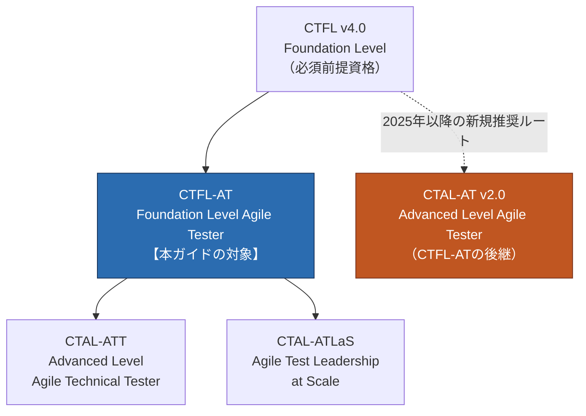

**読み方**：CTFL-AT は CTFL 取得後に進む「アジャイルストリーム」の入口です。ただし2025年時点では、新規学習者は直接 CTAL-AT v2.0 を目指すルートも用意されています（サンセット期間中はCTFL-ATも引き続き受験可能）。

### 0.2 試験仕様（公式データ）

| 項目 | 内容 | 出典 |
|------|------|------|
| 問題数 | 40問 | ISTQB公式ページ |
| 出題形式 | 多肢選択式 | ISTQB公式ページ |
| 前提資格 | ISTQB CTFL（Foundation Level）必須 | ISTQB公式ページ |
| 認知レベル（K-Level） | K1（記憶）・K2（理解）・K3（適用） | シラバスPDF |
| Chapter 1 想定学習時間 | 150分 | シラバスPDF §1 |

📌 出典: <https://istqb.org/certifications/certified-tester-foundation-level-agile-tester-ctfl-at/>

### 0.3 認知レベル（K-Level）の考え方

CTFL-ATシラバスの原則として、**「シラバス全体はK1レベルで出題されうる」**と明記されています。つまり各章の学習目標に明示されたK-Levelは「最低限到達すべきレベル」であり、K3指定の項目は必ず「適用」できる状態まで理解を深める必要があります。

| レベル | 意味 | Chapter 1での例 |
|--------|------|-----------------|
| **K1** | Remember（記憶） | アジャイルソフトウェア開発のアプローチ（XP/Scrum/Kanban）を想起できる |
| **K2** | Understand（理解） | ホールチームアプローチの利点を説明できる／CIの目的を理解している |
| **K3** | Apply（適用） | 開発者・ビジネス代表者と協調して、テスト可能なユーザーストーリーを実際に書ける |

📌 出典: シラバスPDF p.8 "Learning Objectives for Agile Software Development"（<https://istqb.org/wp-content/uploads/2024/11/ISTQB-CTFL-AT_Syllabus_v1.0.pdf>）

---

## Chapter 1 全体構成マップ

Chapter 1「Agile Software Development」は、大きく2つの節（1.1・1.2）× 合計8つのサブセクションで構成されています。

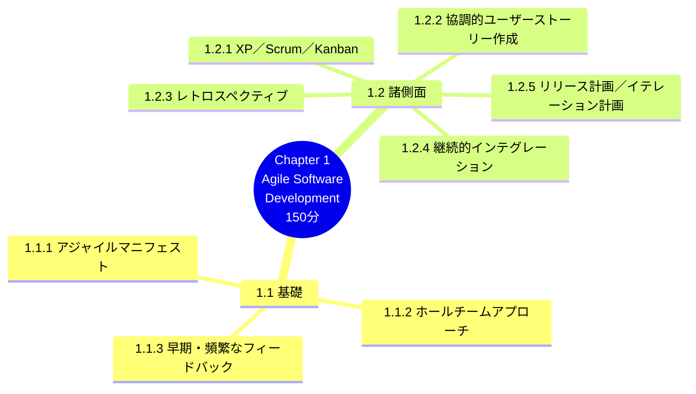

キーワード（シラバス指定）: Agile Manifesto, Agile software development, incremental development model, iterative development model, software lifecycle, test automation, test basis, test-driven development, test oracle, user story

📌 出典: シラバスPDF p.8（Keywords セクション）

---

## 1.1 アジャイルソフトウェア開発の基礎

> 📖 シラバス該当箇所: Section 1.1 "The Fundamentals of Agile Software Development"

アジャイルプロジェクトにおけるテスターは、伝統的（シーケンシャル）なプロジェクトのテスターとは**異なる働き方**をします。テスターは、アジャイルプロジェクトを支える価値観・原則を理解し、開発者・ビジネス代表者と共に「ホールチームアプローチ」の不可欠な一員として機能する必要があります。アジャイルプロジェクトのメンバーは早期かつ頻繁にコミュニケーションを取り、これが欠陥の早期除去と高品質な製品開発に貢献します。

📌 出典: シラバスPDF p.9

---

### 1.1.1 アジャイルソフトウェア開発とアジャイルマニフェスト

> **学習目標**: `FA-1.1.1 (K1)` アジャイルマニフェストに基づくアジャイルソフトウェア開発の基本概念を想起できる

#### 誕生の背景

2001年、当時広く使われていた軽量ソフトウェア開発手法を代表する17名の技術者たちが米国ユタ州スノーバードに集まり、共通の価値観と原則について合意しました。これが**「アジャイルソフトウェア開発宣言」（Manifesto for Agile Software Development、通称アジャイルマニフェスト）**です。

📌 公式サイト: <https://agilemanifesto.org/>
📌 原則（英語原文）: <https://agilemanifesto.org/principles.html>

#### 4つの価値観（Values）

アジャイルマニフェストは以下4つの価値観の対比として表現されます。

| 左側（より重視される） | 右側（価値はあるが重視度は低い） |
|---|---|
| **個人と対話**（Individuals and Interactions） | プロセスやツール（Processes and Tools） |
| **動くソフトウェア**（Working Software） | 包括的なドキュメント（Comprehensive Documentation） |
| **顧客との協調**（Customer Collaboration） | 契約交渉（Contract Negotiation） |
| **変化への対応**（Responding to Change） | 計画に従うこと（Following a Plan） |

> ⚠️ **試験での頻出誤解ポイント**：アジャイルマニフェストは「右側の項目に価値がない」とは言っていません。**"while there is value in the items on the right, we value the items on the left more"**（右側にも価値はあるが、左側により大きな価値を置く）という**相対的な優先順位**を示したものです。

#### 各価値観の意味（シラバスの解説に基づく）

**① 個人と対話（Individuals and Interactions）**
アジャイル開発は非常に人間中心的です。ソフトウェアを構築するのはチームであり、ツールやプロセスへの依存よりも、継続的なコミュニケーションと対話を通じてこそ、チームは最も効果的に機能します。

**② 動くソフトウェア（Working Software）**
顧客視点では、過度に詳細なドキュメントよりも「動くソフトウェア」の方がはるかに有用で価値が高く、開発チームへの迅速なフィードバックの機会を提供します。また、機能が限定的であっても動くソフトウェアが開発ライフサイクルの早い段階で利用可能になるため、アジャイル開発は大きなタイム・トゥ・マーケットの優位性をもたらします。問題や解決策が不明瞭な、急速に変化するビジネス環境において特に有用です。

**③ 顧客との協調（Customer Collaboration）**
顧客は自分が本当に必要としているシステムを明確に仕様化することにしばしば困難を感じます。顧客と直接協調することで、顧客が本当に求めているものを正確に理解できる可能性が高まります。契約も重要ですが、顧客と密接かつ定期的に協調して働くことの方が、プロジェクトをより成功に導く可能性が高いのです。

**④ 変化への対応（Responding to Change）**
ソフトウェアプロジェクトにおいて変化は不可避です。ビジネスを取り巻く環境、法規制、競合の動向、技術の進歩などが、プロジェクトとその目標に大きな影響を与えます。これらの要因は開発プロセスの中で受容されなければなりません。したがって、変化を受け入れる柔軟な作業実践を持つことは、単に計画に厳密に従うことよりも重要です。

📌 出典: シラバスPDF p.9（1.1.1節）

#### 12の原則（Principles）

アジャイルマニフェストのコアとなる価値観は、**12の原則**として具体化されています。試験では原則の内容を分類・識別できることが求められます。

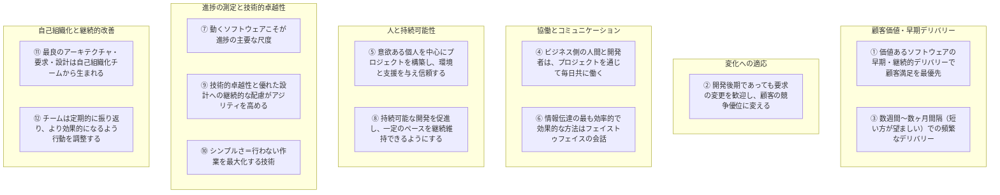

📌 出典: シラバスPDF p.10（12 Principles）／原文: <https://agilemanifesto.org/principles.html>

> 💡 **実務Tips（2025年補足）**：Agile Alliance も同様の12原則の解説ページを公開しており、コミュニティによる注釈や実践例が豊富です。試験対策としては「どの原則がどの価値観を支えているか」を対応づけて覚えると理解が深まります。
> 📌 <https://agilealliance.org/agile101/12-principles-behind-the-agile-manifesto/>

「異なるアジャイル手法は、これらの価値観と原則を行動に移すための**規範的な実践（プラクティス）**を提供する」——これがシラバスの重要な一文です。次節以降で扱うXP・Scrum・Kanbanは、いずれもこの12原則を異なる形で実装したものだと理解してください。

---

### 1.1.2 ホールチームアプローチ（Whole-Team Approach）

> **学習目標**: `FA-1.1.2 (K2)` ホールチームアプローチの利点を理解できる

#### 定義とステップバイステップ解説

**ホールチームアプローチ**とは、アジャイルプロジェクトにおいて、必要なスキルを持つメンバー全員（テスター、開発者、ビジネス代表者など）が**一つのチームとして共同で品質に責任を持つ**という考え方です。伝統的な開発では「開発チーム」と「テストチーム」が別組織・別フェーズで分離されがちですが、アジャイルではこの壁を取り払います。

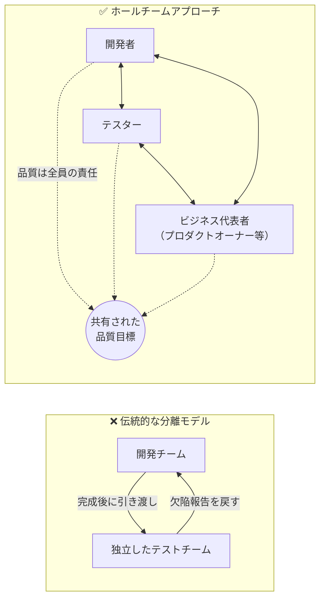

**ステップ1：役割の再定義**
アジャイルチームでは、テスターは「品質の門番」ではなく、「品質を作り込むプロセスの一員」として機能します。テスト活動はプロジェクト終盤にまとめて行うのではなく、開発の最初から最後まで**継続的に統合**されます。

**ステップ2：「パワー・オブ・スリー（Power of Three）」の実践**
シラバスは特に、**ビジネス代表者・開発者・テスター**の3者が協働してユーザーストーリーの詳細化・分析・テストケース設計を行う実践を重視しています（1.2.2で詳述）。

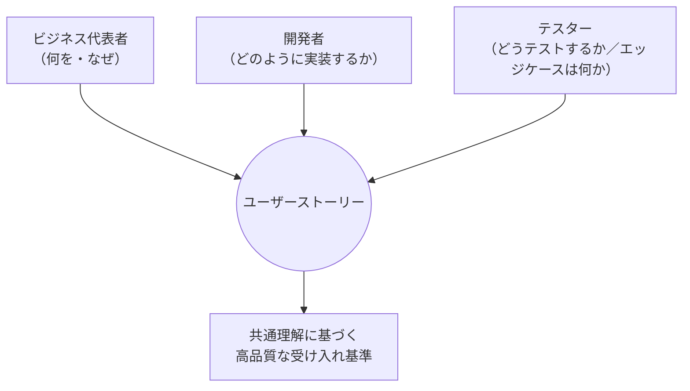

**ステップ3：スキルの相互補完**
ホールチームアプローチでは、テスターは開発者に「テストの視点」を提供し、逆に開発者はテスターに技術的な実装の知見を共有します。この双方向の知識移転により、チーム全体のテストに対する意識（テストマインドセット）が向上します。

#### ホールチームアプローチの利点（試験頻出）

| 利点 | 説明 |
|------|------|
| **早期の欠陥検出** | テスターが要求定義・設計段階から関与するため、実装前に問題を発見できる |
| **コミュニケーションの改善** | チーム間の壁がなくなり、誤解に基づく手戻りが減少する |
| **品質に対する集合的責任** | 「テストは他人の仕事」という意識がなくなり、全員が品質に当事者意識を持つ |
| **知識の共有** | テスターの分析スキルと開発者の技術スキルが相互に浸透する |
| **迅速なフィードバックループ** | チームが分離していないため、欠陥やリスクへの対応が速くなる |

📌 出典: シラバスPDF p.10（1.1.2節）

> 💡 **注意点（K2レベルの理解として重要）**：ホールチームアプローチは「専門性が不要になる」という意味ではありません。テスターは依然として専門的なテストスキル（技法・技術）を持ち続けますが、それをチーム全体のために**より統合的に**適用する、という点がポイントです。

---

### 1.1.3 早期かつ頻繁なフィードバック

> **学習目標**: `FA-1.1.3 (K2)` 早期かつ頻繁なフィードバックの利点を理解できる

#### なぜ「早期・頻繁」が重要なのか

伝統的なシーケンシャル（ウォーターフォール型）開発モデルでは、フィードバックはプロジェクトのほぼ最終段階（システムテストや受け入れテストの時点）でしか得られません。この場合、要求の誤解や設計上の欠陥がプロジェクトの非常に遅い段階で発覚し、修正コストが著しく高くなります。

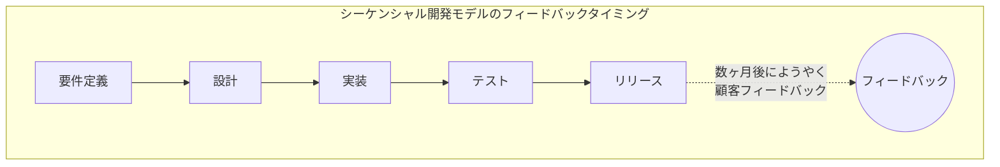

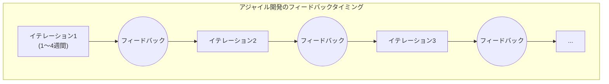

**比較すると明らかなように**、アジャイル開発では各イテレーション終了時に「動くソフトウェア」を顧客・ステークホルダーに提示し、フィードバックを得ることで、誤った方向への手戻りを最小限に抑えます。

#### フィードバックが得られる複数のレベル

シラバスでは、早期かつ頻繁なフィードバックが以下の複数のレベルで発生することを説明しています。

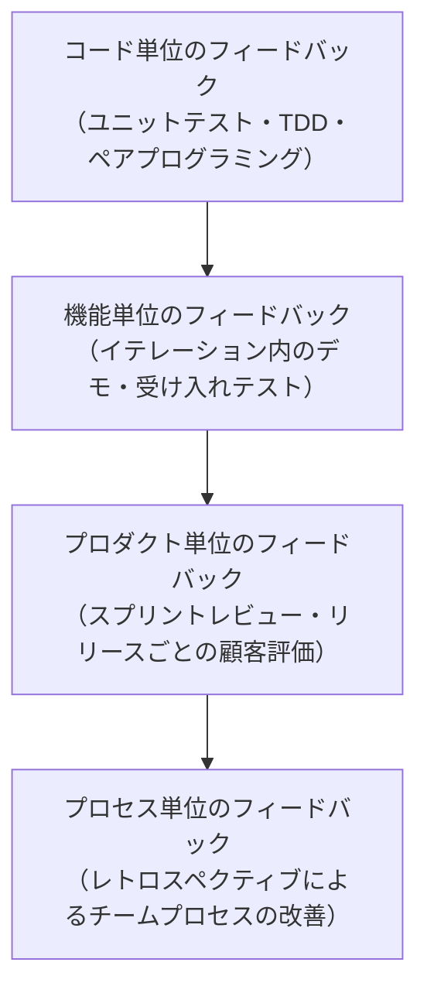

| フィードバックのレベル | 主な手段 | 誰から得るか |
|---|---|---|
| コードレベル | TDD、ペアプログラミング、静的解析、コードレビュー | 開発チーム内 |
| 機能レベル | イテレーション内でのデモ、受け入れテスト（ATDD） | プロダクトオーナー・テスター |
| プロダクトレベル | スプリントレビュー、リリース後の利用状況 | 顧客・エンドユーザー |
| プロセスレベル | レトロスペクティブ | チーム自身 |

#### 早期・頻繁なフィードバックの利点（試験頻出）

- ✅ **欠陥の早期発見・早期除去**：欠陥は発生したフェーズに近いほど修正コストが低い
- ✅ **要求の誤解を早期に修正できる**：顧客が実際に動くソフトウェアを見ることで、書面だけでは伝わらない誤解に早く気づける
- ✅ **リスクの早期低減**：技術的リスク・ビジネスリスクの双方を早い段階で可視化できる
- ✅ **チームの学習と適応**：フィードバックのたびにチームのプロセス・見積もり精度が改善される

📌 出典: シラバスPDF p.11（1.1.3節）

> 💡 **テスターの役割としての補足**：早期かつ頻繁なフィードバックの実現には、テスターが単体テスト・統合テストの自動化や、受け入れ基準のレビューに**開発の最初期から**関与することが不可欠です。これは1.2.4（継続的インテグレーション）とも密接に関連します。

---

## 1.2 アジャイルアプローチの諸側面

> 📖 シラバス該当箇所: Section 1.2 "Aspects of Agile Approaches"

### 1.2.1 アジャイルソフトウェア開発アプローチ（XP・Scrum・Kanban）

> **学習目標**: `FA-1.2.1 (K1)` アジャイルソフトウェア開発アプローチを想起できる

アジャイルマニフェストの価値観・原則を実装する方法は複数存在します。CTFL-ATシラバスでは、その代表例として **エクストリーム・プログラミング（XP）**・**Scrum**・**Kanban** の3つを取り上げています。

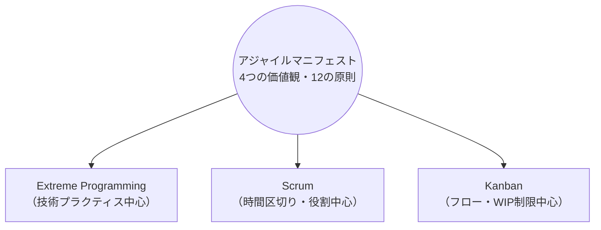

---

#### A. エクストリーム・プログラミング（XP）

Kent Beck が提唱したXPは、**価値観・原則・プラクティス**の3階層構造で構成される、技術的なプラクティスを特に重視するアジャイル手法です。

📌 出典: シラバスPDF p.11-12／原著: Beck, K. (2004) *Extreme Programming Explained*

**XPの5つの価値観**

| 価値観 | 説明 |
|--------|------|
| コミュニケーション（Communication） | チームメンバー間の緊密で頻繁な対話を重視 |
| シンプルさ（Simplicity） | 今必要な最小限の設計・実装のみを行う |
| フィードバック（Feedback） | テストや顧客レビューから継続的に学ぶ |
| 勇気（Courage） | 必要であれば設計変更・リファクタリングを恐れず行う |
| 尊重（Respect） | チームメンバー同士がお互いを尊重する |

**XPの13の追加原則（ガイドライン）**

人間性（Humanity）、経済性（Economics）、相互利益（Mutual Benefit）、自己相似性（Self-Similarity）、改善（Improvement）、多様性（Diversity）、内省（Reflection）、フロー（Flow）、機会（Opportunity）、冗長性（Redundancy）、失敗（Failure）、品質（Quality）、ベイビーステップ（Baby Steps）、責任の受容（Accepted Responsibility）

**XPの主要プラクティス（試験で問われやすいもの）**

| プラクティス | 内容 | テストとの関連 |
|---|---|---|
| **テストファースト開発／TDD** | 実装前にテストを書く | テスターにとって最重要関連プラクティス |
| **ペアプログラミング** | 2人1組で実装 | リアルタイムのコードレビュー効果 |
| **継続的インテグレーション** | 頻繁にコードを統合しビルド・テストを自動実行 | 1.2.4で詳述 |
| **リファクタリング** | 振る舞いを変えずにコード構造を改善 | 回帰テストの重要性が増す |
| **シンプルな設計** | YAGNI（You Aren't Gonna Need It）原則 | 過剰設計を避ける |
| **小さなリリース** | 頻繁に小さい単位でリリース | 早期フィードバックの実現 |
| **オンサイト顧客** | 顧客がチームと常駐・密接に協働 | 受け入れ基準の即時確認 |
| **共同所有権** | コードはチーム全体の所有物 | 誰でも改善・修正可能 |

**XPの開発サイクル（週次・四半期サイクル）**

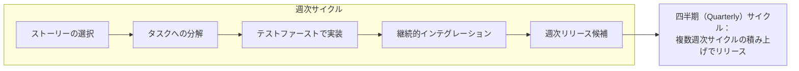

📌 参考: Extreme Programming公式解説 <http://www.extremeprogramming.org/>

---

#### B. Scrum

Scrumは、**時間区切り（タイムボックス）のイテレーション「スプリント」**を中心に構成される、最も広く採用されているアジャイルフレームワークです。

> ⚠️ **重要な注記（2025年時点の正確性のために）**：CTFL-ATシラバス（2014年版）は当時の「Scrum Guide」に基づいて「Development Team（開発チーム）」という用語を使用し、「チームリーダーは存在せず、チームが意思決定する」と説明しています。しかし、現行の**Scrum Guide 2020年版**（Ken Schwaber & Jeff Sutherland による最新の公式ガイド）では、用語が整理され「Developers（開発者）」という呼称に変更され、「self-organizing（自己組織化）」から**「self-managing（自己管理型）」**という表現に更新されています。試験ではシラバスの用語（Development Team等）を基準に解答する必要がありますが、実務では現行のScrum Guide 2020の用語を使うのが標準です。本ガイドでは両方を併記します。
>
> 📌 現行Scrum Guide（2020年版）公式: <https://scrumguides.org/scrum-guide.html>
> 📌 Scrum Guide改訂履歴: <https://scrumguides.org/revisions.html>

**Scrumの3つの役割（シラバス準拠 / カッコ内は現行Scrum Guide 2020の呼称）**

| 役割 | 責任 |
|------|------|
| **プロダクトオーナー（Product Owner）** | プロダクトバックログを管理し、開発する機能の優先順位を決定。ビジネス価値の最大化に責任を持つ |
| **開発チーム（Development Team／現行: Developers）** | プロダクトを開発・テストする。自己組織化（現行: 自己管理型）でクロスファンクショナル |
| **スクラムマスター（Scrum Master）** | チームがScrumのプロセスを正しく実践できるよう支援するファシリテーター・コーチ役 |

**Scrumの主要成果物（Artifacts）**

| 成果物 | 説明 |
|---|---|
| **プロダクトバックログ（Product Backlog）** | プロダクトに必要な全ての要求事項の優先順位付きリスト |
| **スプリントバックログ（Sprint Backlog）** | 現在のスプリントで開発チームが取り組むと選択した項目 |
| **インクリメント（Increment）** | スプリントで完成した「完了の定義（Definition of Done）」を満たす動くソフトウェア |

**Scrumのイベント（スプリントサイクル全体図）**

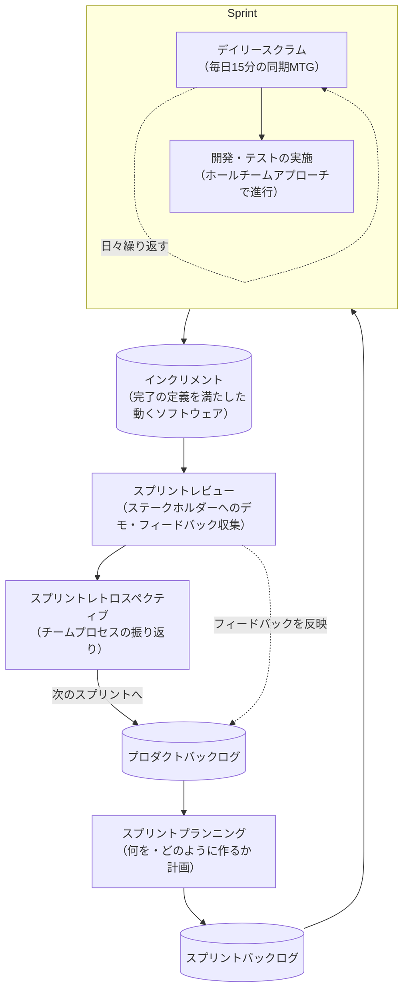

**Scrumにおけるテストの位置づけ（試験頻出ポイント）**

> シラバスは明確に指摘しています：**「Scrum（XPとは対照的に）は特定のソフトウェア開発技法（例：テストファーストプログラミング）を規定しない。さらに、Scrumはスプリント内でどのようにテストを行うべきかについてのガイダンスを提供しない」**

これは非常に重要な試験ポイントです。Scrumは「枠組み（フレームワーク）」であり、XPのような具体的な技術プラクティスを指定しません。そのため、**Scrumチームは自らテスト戦略・テスト技法・自動化アプローチを定義する必要があります**。

📌 出典: シラバスPDF p.12（1.2.1節、Scrum部分）／Scrum Guide 2020: <https://scrumguides.org/scrum-guide.html>

**Scrumのタイムボックス（現行Scrum Guide 2020の規定）**

| イベント | 目安の長さ（スプリント4週間の場合） |
|---|---|
| スプリント | 1〜4週間（固定長） |
| スプリントプランニング | 最大8時間 |
| デイリースクラム | 毎日15分 |
| スプリントレビュー | 最大4時間 |
| スプリントレトロスペクティブ | 最大3時間 |

📌 出典: <https://scrumguides.org/docs/scrumguide/v2020/2020-Scrum-Guide-US.pdf>

---

#### C. Kanban

Kanbanは、トヨタ生産方式に起源を持ち、David J. Anderson によってソフトウェア開発向けに体系化された、**継続的なフロー（流れ）を可視化・最適化する**アプローチです。ScrumやXPと異なり、固定長のイテレーション（スプリント）を必須としません。

📌 公式ガイド: <https://kanban.university/kanban-guide/>

**Kanbanの中核となる要素**


**Kanbanの3つの基本要素（試験頻出）**

| 要素 | 説明 |
|---|---|
| **Kanbanボード（Kanban Board）** | 管理すべきバリューチェーンを可視化するボード。列（カラム）はワークフローの各ステージを表す |
| **Kanbanカード（Kanban Card）** | 個々の作業項目（ユーザーストーリー・タスク・欠陥など）を表す |
| **WIP制限（Work-in-Progress Limit）** | 各ステージで同時に進行できる作業項目数の上限。プル型システムを実現し、流れを最適化する |

**Kanbanの6つの一般プラクティス（Kanban University公式）**

| # | プラクティス | 内容 |
|---|---|---|
| 1 | 可視化（Visualize） | ワークフローをボード上で可視化する |
| 2 | WIPの制限（Limit WIP） | 進行中の作業数を制限し、過負荷を防ぐ |
| 3 | フローの管理（Manage Flow） | スムーズで予測可能な作業の流れを維持する |
| 4 | ポリシーの明示化（Make Policies Explicit） | 「完了」の基準やプル基準を明文化する |
| 5 | フィードバックループの活用（Implement Feedback Loops） | 定期的なレビュー・改善の場を設ける |
| 6 | 協調的な改善・実験的な進化（Improve Collaboratively, Evolve Experimentally） | 小さな変更を試しながら継続的に改善する |

📌 出典: Kanban University公式ガイド <https://kanban.university/wp-content/uploads/2023/04/The-Official-Kanban-Guide_A4.pdf>

> 💡 **WIP制限がなぜ重要か（K2理解のポイント）**：WIP（Work in Progress）を制限しないシステムは、しばしば「過負荷（Overburdened）」状態になり、結果としてスループット・予測可能性・品質のすべてが低下します。WIP制限は、チームが「今始めた仕事を終わらせてから次を始める」という規律を作り、コンテキストスイッチのコストを削減します。
>
> 📌 出典: <https://kanban.university/kanban-guide/>

---

#### XP・Scrum・Kanban の比較表（試験対策用）

| 観点 | XP | Scrum | Kanban |
|---|---|---|---|
| **中心となる考え方** | 技術的卓越性のプラクティス | タイムボックス化されたイテレーション + 役割定義 | 継続的フローの可視化とWIP制限 |
| **固定長イテレーション** | あり（週次サイクル） | あり（スプリント：1〜4週間） | **必須ではない** |
| **役割の規定** | 明確には規定しない | プロダクトオーナー／開発チーム／スクラムマスター | 明確には規定しない（既存の役割を維持することが多い） |
| **テスト技法の規定** | あり（TDD等を明示的に推奨） | **規定しない**（チームに委ねられる） | 規定しない |
| **変更への対応** | イテレーション内では比較的固定 | スプリント内では原則変更しない | いつでもバックログに追加可能（柔軟） |
| **主な可視化ツール** | タスクボード | スプリントバックログ／バーンダウンチャート | Kanbanボード／累積フロー図 |

📌 総合出典: シラバスPDF p.11-13（1.2.1節全体）

**学習目標のK-Level再確認**: `FA-1.2.1` はK1（想起）指定のため、試験では「XP・Scrum・Kanbanという3つのアプローチが存在し、それぞれの基本的な特徴を思い出せること」が最低ラインですが、実務者としては上記の比較表レベルの理解（K2相当）を持っておくことを強く推奨します。

---

### 1.2.2 協調的なユーザーストーリー作成

> **学習目標**: `FA-1.2.2 (K3)` 開発者・ビジネス代表者と協調して、テスト可能なユーザーストーリーを記述できる

このセクションはChapter 1で**唯一K3（適用）指定**の学習目標であり、CTFL-AT試験の中でも特に重要です。「知っている」だけでなく「実際に書ける」レベルまで習得する必要があります。

#### ユーザーストーリーとは何か

ユーザーストーリーは、ソフトウェアの機能に対する要求を、エンドユーザーまたは顧客の視点から簡潔に記述したものです。伝統的な詳細仕様書とは異なり、**「会話（Conversation）」を促すための出発点**として意図的に簡潔に書かれます。

**標準的な記述形式**

```text
As a [ユーザーの役割]
I want [実現したいこと]
So that [得られる価値・理由]
```

**具体例**

```text
As a 登録済みの顧客
I want パスワードをリセットする
So that アカウントへのアクセスを再取得できる
```

#### 3つのC（3 C's）：ユーザーストーリーの本質

ユーザーストーリーを理解する上で最も重要な概念が、Ron Jeffries が提唱した**「3つのC」**です。

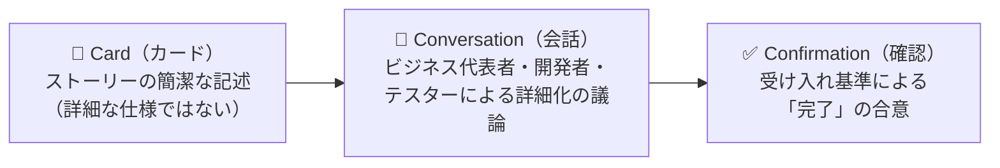

| C | 説明 | テスターの関与 |
|---|---|---|
| **Card（カード）** | ストーリーそのものは詳細な仕様書ではなく、後の会話のための「プレースホルダー」 | ストーリーの曖昧さ・欠落を早期に指摘する |
| **Conversation（会話）** | ビジネス代表者・開発者・テスターが集まり、要求の詳細、エッジケース、制約について議論する | テスト視点からの質問（境界値・異常系・非機能要件）を提起する |
| **Confirmation（確認）** | 「このストーリーが完了したとみなされる条件」＝受け入れ基準を明文化する | 受け入れ基準がテスト可能な形で書かれているかをレビューする |

📌 出典: シラバスPDF p.13（1.2.2節）

#### パワー・オブ・スリー（Power of Three）による協調作成プロセス

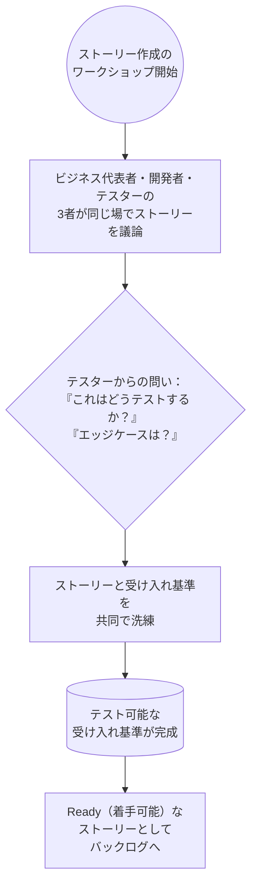

このプロセスにより、テスターは実装が始まる**前**にストーリーの品質・テスト可能性に影響を与えることができます。これはシフトレフトの実践そのものです。

#### 良いユーザーストーリーの条件：INVEST基準

Bill Wake が提唱した **INVEST** は、良いユーザーストーリーを評価するための基準として広く使われています（CTFL-ATシラバス本文には明記されていない場合がありますが、ユーザーストーリー品質の実務的な業界標準として、上位資格CTAL-TA/CTAL-ATTでも扱われる重要概念のため、本ガイドでは実務補足として併せて解説します）。

| 頭文字 | 意味 | 説明 |
|---|---|---|
| **I** | Independent（独立性） | 他のストーリーへの依存が最小限であること |
| **N** | Negotiable（交渉可能性） | 詳細は固定されておらず、チームで議論・調整できること |
| **V** | Valuable（価値） | ビジネスまたはユーザーにとって明確な価値があること |
| **E** | Estimable（見積もり可能性） | チームが規模・工数を見積もれる程度に明確であること |
| **S** | Small（小ささ） | 1回のイテレーション内で完了できる十分小さなサイズであること |
| **T** | Testable（テスト可能性） | 合格・不合格を判定できる明確な受け入れ基準があること |

> ⚠️ 本セクションの「T（Testable）」が、CTFL-AT試験で最も重視される観点です。テスターは「この受け入れ基準は主観的すぎないか？」「境界値は明示されているか？」を問う責任があります。

#### 受け入れ基準の書き方：Given-When-Then形式

受け入れ基準は、テスト可能性を高めるために**Gherkin記法（Given-When-Then）**で書かれることが多くあります。

```gherkin
Feature: パスワードリセット機能

  Scenario: 有効な登録メールアドレスでのパスワードリセット
    Given 顧客が有効な登録メールアドレスを持っている
    When  「パスワードを忘れた」リンクからメールアドレスを送信する
    Then  リセット用リンクを含むメールが5分以内に送信される

  Scenario: 未登録のメールアドレスでのリセット試行
    Given 入力されたメールアドレスがシステムに登録されていない
    When  「パスワードを忘れた」リンクからメールアドレスを送信する
    Then  情報漏洩を避けるため、登録有無に関わらず同一の確認メッセージが表示される
```

#### 曖昧なストーリー vs テスト可能なストーリー（比較）

| ❌ テストしにくい受け入れ基準 | ✅ テスト可能な受け入れ基準 |
|---|---|
| 「レスポンスは高速であること」 | 「95パーセンタイルのレスポンスタイムが2秒以内であること」 |
| 「ユーザーフレンドリーな画面であること」 | 「入力エラー発生時、該当フィールドの横に具体的なエラーメッセージが表示されること」 |
| 「システムはセキュアであること」 | 「5回連続でログイン失敗した場合、アカウントが30分間ロックされること」 |

📌 出典（3C・ユーザーストーリー概念の原典）: シラバスPDF p.13／Jeffries, R. "Essential XP: Card, Conversation, Confirmation" <https://ronjeffries.com/xprog/articles/expcardconversationconfirmation/>
📌 INVEST原典: Wake, B. "INVEST in Good Stories, and SMART Tasks" <https://xp123.com/articles/invest-in-good-stories-and-smart-tasks/>

> 💡 **テスターの実務的な貢献ポイント（K3適用として押さえるべきこと）**
>
> 1. ストーリー作成会議に必ず参加し、曖昧な表現に対して「テストできますか？」と問いかける
> 2. 正常系だけでなく異常系・境界値・非機能要件（性能・セキュリティ等）の観点をストーリーに反映させる
> 3. 受け入れ基準を、可能であればGiven-When-Then形式など構造化された記法で書く
> 4. 受け入れ基準がそのまま自動化された受け入れテスト（ATDD）の基礎になるよう意識する

---

### 1.2.3 レトロスペクティブ（振り返り）

> **学習目標**: `FA-1.2.3 (K2)` レトロスペクティブがアジャイルプロジェクトにおけるプロセス改善のメカニズムとしてどのように使われるかを理解できる

#### レトロスペクティブとは何か

**レトロスペクティブ（Retrospective）**は、各イテレーション（スプリント）の終わりに実施される、チームが自らの**作業プロセス**（プロダクトそのものではなく、プロダクトを作る「やり方」）を振り返り、継続的改善のためのアクションを特定する会議です。アジャイルマニフェストの12番目の原則「チームは定期的に振り返り、より効果的になるよう行動を調整する」を実践する場そのものです。

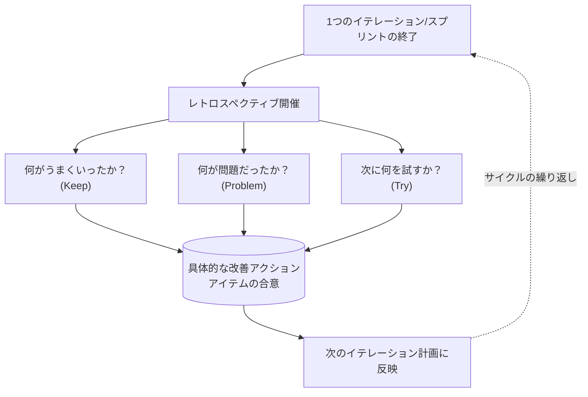

#### レトロスペクティブとスプリントレビューの違い（試験で混同しやすいポイント）

| 観点 | スプリントレビュー | レトロスペクティブ |
|---|---|---|
| **焦点** | プロダクト（作られたもの） | プロセス（作り方） |
| **主な参加者** | 開発チーム＋ステークホルダー（顧客含む） | 開発チームのみ（内部向け） |
| **目的** | インクリメントを検査し、フィードバックを得る | チームの働き方を改善する |
| **成果物** | プロダクトバックログの更新 | 改善アクションアイテム |

#### レトロスペクティブがプロセス改善に貢献する仕組み（K2理解のポイント）

1. **安全な場の提供**：チームメンバーが批判を恐れずに問題点を共有できる、心理的安全性のある場を意図的に設計する
2. **具体性のあるフィードバック**：抽象的な「良かった／悪かった」ではなく、具体的な出来事に基づいた振り返りを行う
3. **アクションアイテムへの変換**：単なる不満の共有で終わらせず、必ず「次に何を変えるか」という実行可能なアクションに落とし込む
4. **繰り返しによる漸進的改善**：1回のレトロスペクティブで全てを解決しようとせず、イテレーションごとに小さな改善を積み重ねる
5. **テストプロセスの継続的改善**：テスターにとっては、フレイキーテストの削減、テスト自動化率の向上、欠陥の早期発見率の改善など、テスト活動そのものを継続的に見直す重要な機会となる

#### レトロスペクティブの代表的なフォーマット例

| フォーマット | 内容 |
|---|---|
| **KPT（Keep / Problem / Try）** | 継続すべきこと・問題点・次に試すことの3列で整理 |
| **Start / Stop / Continue** | 始めるべきこと・やめるべきこと・続けるべきことを整理 |
| **4Ls（Liked / Learned / Lacked / Longed for）** | 好きだったこと・学んだこと・足りなかったこと・望んでいたことを整理 |
| **Sailboat（帆船）** | 帆船の比喩で、追い風（推進要因）・錨（阻害要因）・岩（リスク）・島（ゴール）を可視化 |

📌 出典: シラバスPDF p.13-14（1.2.3節）／Scrum Guide 2020（スプリントレトロスペクティブの位置づけ）: <https://scrumguides.org/scrum-guide.html>

> 💡 **テスターとしての実務Tips**：レトロスペクティブでは、テストに関する具体的なメトリクス（例：「今スプリントで検出された欠陥の何%が本番流出したか」「テスト自動化のカバレッジはどう変化したか」）を持ち込むことで、感覚的な議論ではなくデータに基づいた改善提案が可能になります。

---

### 1.2.4 継続的インテグレーション（CI）

> **学習目標**: `FA-1.2.4 (K2)` 継続的インテグレーションの使用と目的を理解できる

#### 継続的インテグレーションとは何か

**継続的インテグレーション（Continuous Integration: CI）**とは、開発者が自分のコード変更を頻繁に（少なくとも1日に1回以上）共有のメインリポジトリに統合し、その都度**自動ビルドと自動テストを実行する**開発プラクティスです。XPの実践プラクティスの一つとして生まれ、現在ではほぼ全てのアジャイル開発（Scrum・Kanban問わず）で採用されています。

#### なぜCIが必要なのか：統合の遅延がもたらす問題

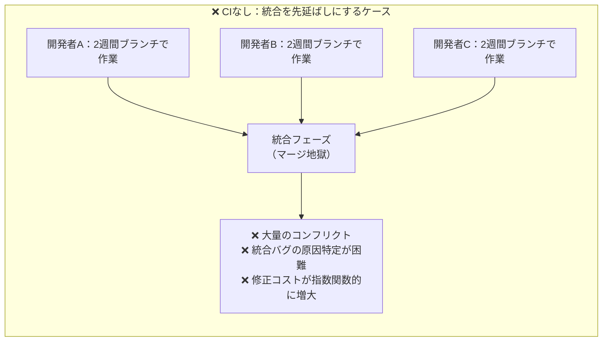

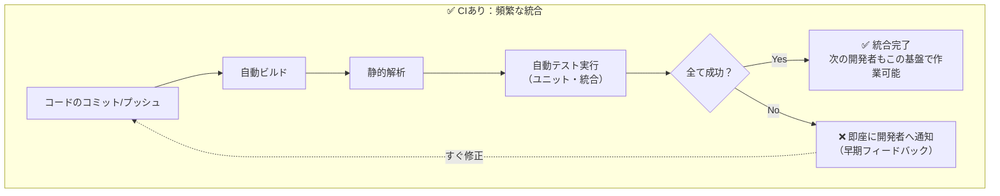

#### CIパイプラインの典型的な流れ

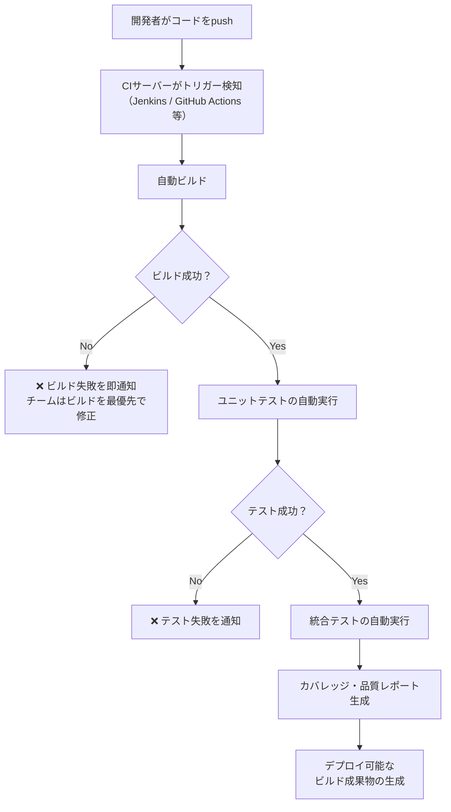

#### CIの中核的な原則（試験頻出）

| 原則 | 説明 |
|---|---|
| **単一のソースリポジトリを使用する** | コードの一元管理により、統合の混乱を防ぐ |
| **ビルドを自動化する** | 手動ビルドによるヒューマンエラーを排除する |
| **ビルドにテストを含める** | ビルドが「通る」ことだけでなく「正しく動く」ことも自動確認する |
| **全員が毎日メインラインにコミットする** | 統合の粒度を小さく保ち、コンフリクトを最小化する |
| **ビルドを高速に保つ** | フィードバックが遅いとCIの価値が失われる（目安：10分以内） |
| **本番環境に近いクローンでテストする** | 環境差異による「動くはずが動かない」問題を防ぐ |
| **誰もが最新のビルド結果を見られるようにする** | 透明性の確保 |
| **壊れたビルドは即座に修正する** | ビルドが壊れたままの状態を放置しない文化 |

📌 出典: シラバスPDF p.14（1.2.4節）

#### CIの利点

- ✅ **早期の欠陥検出**：統合の問題やリグレッションを、発生直後の小さい変更差分の中で発見できるため、原因特定が容易
- ✅ **「動くソフトウェア」の常時維持**：いつでもデモ・リリース可能な状態に近いビルドを保てる
- ✅ **手動作業の削減**：ビルド・テスト・デプロイの手作業を自動化し、人的ミスと工数を削減
- ✅ **チームの信頼性向上**：「自分のマシンでは動く」問題を排除し、統合済みコードへの信頼を高める
- ✅ **1.1.3（早期・頻繁なフィードバック）の実現基盤**：CIはコードレベルでのフィードバックループを技術的に支える仕組み

#### CIにおけるテスターの関わり方

| 活動 | テスターの役割 |
|---|---|
| テスト自動化スイートの設計 | どのテストをCIパイプラインのどの段階（コミット時／夜間バッチ等）で実行するか設計に関与 |
| フレイキーテストの管理 | CIの信頼性を損なう不安定なテストを特定し、修正または隔離する |
| テストピラミッドの意識 | ユニットテスト（多い・速い）を土台に、統合・E2Eテスト（少ない・遅い）を積み上げる構成を推奨する |
| 品質ゲートの定義 | カバレッジ率や重大欠陥ゼロなど、CIパイプラインを通過するための基準策定に関与 |

📌 CI/CDの実務的な補足参考: GitHub Actions公式ドキュメント <https://docs.github.com/en/actions>

> 💡 **K2理解として重要な一文（シラバスの趣旨）**：CIは単なる「自動化ツールの導入」ではなく、**「頻繁に統合し、常にフィードバックを得る」というアジャイルの価値観そのものを技術的に実装したプラクティス**です。1.1.3のフィードバックの概念、1.1.1のアジャイルマニフェストの「動くソフトウェア」の価値観と、CIは直接結びついています。

---

### 1.2.5 リリース計画とイテレーション計画

> **学習目標**: `FA-1.2.5 (K1)` イテレーション計画とリリース計画の違いを知り、テスターがそれぞれの活動でどのように価値を付加するかを知っている

#### 2つの計画レベルの全体像

アジャイルプロジェクトの計画は、粒度の異なる**2つの階層**で行われます。

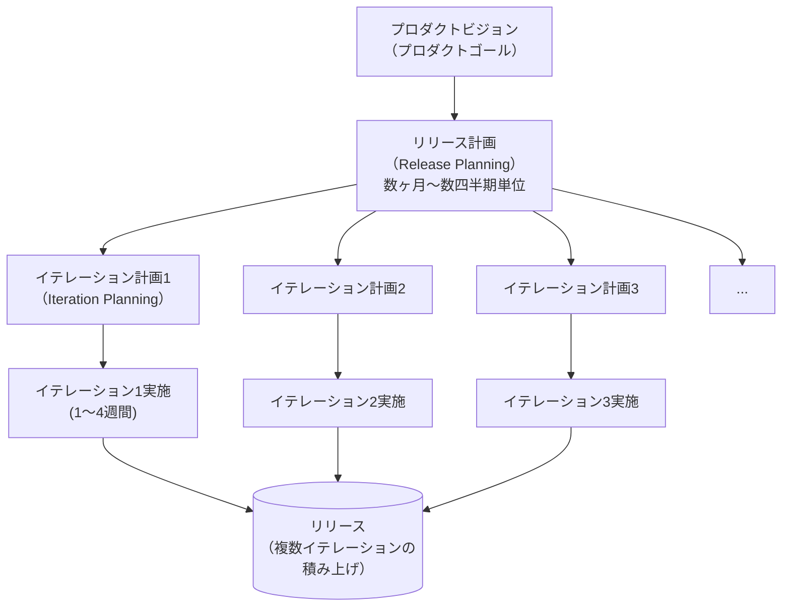

#### リリース計画（Release Planning）

**リリース計画**は、プロダクトの大きな方向性を決める、より長期的な計画活動です。複数のイテレーションにまたがる範囲で「何を、いつまでに、どの順序でリリースするか」を決定します。

| 検討項目 | 内容 |
|---|---|
| スコープ | このリリースに含める機能・含めない機能 |
| 期間・マイルストーン | リリース予定日、主要な中間目標 |
| 優先順位 | ビジネス価値・リスクに基づく機能の順序付け |
| リソース | 必要なチーム構成・スキルセット |
| 主要リスク | ビジネスリスク・技術リスク・品質リスクの識別 |

**リリース計画におけるテスターの価値付加**

- ✅ 各機能領域の**品質リスクを識別**し、テスト工数の重点配分に関する情報を提供する
- ✅ 過去の欠陥データや複雑度から、**テストが多くの時間を要する領域**を早期に警告する
- ✅ 必要なテスト環境・テストデータ・テストツールの準備をリリース単位で見積もる
- ✅ 非機能要件（性能・セキュリティ・互換性など）がリリース計画に含まれているかを確認する

#### イテレーション計画（Iteration Planning）

**イテレーション計画**（Scrumでは「スプリントプランニング」に相当）は、直近の1回のイテレーション（通常1〜4週間）で「具体的に何を、どのように完成させるか」を詳細に計画する、短期的な活動です。

| 検討項目 | 内容 |
|---|---|
| 対象ストーリーの選定 | プロダクトバックログから、このイテレーションで着手するストーリーを選ぶ |
| タスクへの分解 | 各ストーリーを実装可能な単位のタスクに分解する（テストタスクを含む） |
| 見積もり | チームのキャパシティに対して現実的な作業量かを確認する |
| 受け入れ基準の最終確認 | ストーリーが「テスト可能」な状態になっているかを再確認する |

**イテレーション計画におけるテスターの価値付加**

- ✅ 各ストーリーの**テスト工数を見積もり**、タスク分解に反映する
- ✅ ストーリーの受け入れ基準の**曖昧さ・テスト不可能な記述**をこの場で指摘し修正を促す（1.2.2との連携）
- ✅ 必要なテストデータ・テスト環境がイテレーション開始までに準備可能かを確認する
- ✅ テスト自動化タスクを明示的にイテレーション計画に含めるよう働きかける

#### リリース計画 vs イテレーション計画：比較表（試験頻出）

| 観点 | リリース計画 | イテレーション計画 |
|---|---|---|
| **時間軸** | 数ヶ月〜数四半期 | 1〜4週間（1イテレーション分） |
| **粒度** | 粗い（機能・エピック単位） | 細かい（タスク単位） |
| **主な関与者** | プロダクトオーナー・ステークホルダー・チームリード | 開発チーム全体（テスター含む） |
| **見直し頻度** | リリースごと、または定期的に見直し | イテレーションごとに毎回実施 |
| **テスターの主な貢献** | リスクベースでのテスト工数配分・非機能要件の確認 | ストーリー単位のテスト可能性確認・テスト工数見積もり |

📌 出典: シラバスPDF p.14-15（1.2.5節）

#### 計画階層とテスト活動の関係（まとめ図）

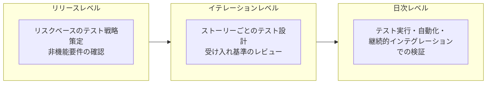

> 💡 **K1理解として押さえるべき最重要ポイント**：「イテレーション計画とリリース計画は**時間軸の粒度が異なる、階層的な計画活動**であり、テスターはどちらのレベルにおいても、単なる『後工程の実行者』ではなく『計画そのものに価値を加える参加者』である」——これがシラバスが伝えたい核心的なメッセージです。

---

## 学習目標（Learning Objectives）一覧とK-Level対応表

Chapter 1の全学習目標を、シラバス番号・K-Level・対応セクションとともに一覧化します。試験直前の最終確認に活用してください。

| 学習目標ID | K-Level | 内容 | 対応セクション |
|---|---|---|---|
| FA-1.1.1 | K1 | アジャイルマニフェストに基づくアジャイルソフトウェア開発の基本概念を想起できる | 1.1.1 |
| FA-1.1.2 | K2 | ホールチームアプローチの利点を理解できる | 1.1.2 |
| FA-1.1.3 | K2 | 早期かつ頻繁なフィードバックの利点を理解できる | 1.1.3 |
| FA-1.2.1 | K1 | アジャイルソフトウェア開発アプローチを想起できる | 1.2.1 |
| FA-1.2.2 | **K3** | 開発者・ビジネス代表者と協調して、テスト可能なユーザーストーリーを記述できる | 1.2.2 |
| FA-1.2.3 | K2 | レトロスペクティブがプロセス改善のメカニズムとしてどのように使われるかを理解できる | 1.2.3 |
| FA-1.2.4 | K2 | 継続的インテグレーションの使用と目的を理解できる | 1.2.4 |
| FA-1.2.5 | K1 | イテレーション計画とリリース計画の違いを知り、テスターの価値付加を知っている | 1.2.5 |

📌 出典: シラバスPDF p.8-9（Learning Objectives for Agile Software Development）

> 💡 **試験対策の優先順位付け**：K3指定のFA-1.2.2（ユーザーストーリー作成）は最も出題の応用度が高く、シナリオ問題として出題される可能性が高い項目です。次いでK2指定の4項目（ホールチーム／フィードバック／レトロスペクティブ／CI）は概念説明・比較問題として頻出します。K1指定の2項目（マニフェスト／各種アプローチ／計画の違い）は用語・分類の正確な記憶が問われます。

---

## 章末チェックリスト・重要暗記事項

学習の総仕上げとして、以下のチェックリストで理解度を自己診断してください。

### ✅ 1.1 アジャイルソフトウェア開発の基礎

- [ ] アジャイルマニフェストの**4つの価値観**を、左右セットで正確に言える
- [ ] 「右側の項目に価値がない」という誤解を説明できる（相対的優先順位であることを理解している）
- [ ] **12の原則**を、少なくとも6つ以上、内容を要約して言える
- [ ] ホールチームアプローチにおける**テスター・開発者・ビジネス代表者**の関係性を図で説明できる
- [ ] ホールチームアプローチの利点を3つ以上挙げられる
- [ ] シーケンシャル開発とアジャイル開発の**フィードバックタイミングの違い**を説明できる
- [ ] 早期・頻繁なフィードバックが得られる4つのレベル（コード／機能／プロダクト／プロセス）を説明できる

### ✅ 1.2 アジャイルアプローチの諸側面

- [ ] XPの**5つの価値観**を全て言える
- [ ] XPの主要プラクティス（TDD・ペアプログラミング・CI・リファクタリング等）を5つ以上挙げられる
- [ ] Scrumの**3つの役割**とその責任を説明できる
- [ ] Scrumの**3つの成果物**（プロダクトバックログ／スプリントバックログ／インクリメント）を説明できる
- [ ] 「**Scrumはテスト技法を規定しない**」という重要ポイントを説明できる
- [ ] Kanbanの**WIP制限**の目的を説明できる
- [ ] Kanbanの6つの一般プラクティスを挙げられる
- [ ] XP・Scrum・Kanbanの違いを比較表なしで口頭説明できる
- [ ] ユーザーストーリーの**3つのC**（Card / Conversation / Confirmation）を説明できる
- [ ] **パワー・オブ・スリー**の概念とテスターの役割を説明できる
- [ ] テスト可能な受け入れ基準の書き方（Given-When-Then等）を実際に書ける
- [ ] レトロスペクティブと**スプリントレビューの違い**を説明できる
- [ ] レトロスペクティブの代表的フォーマット（KPT等）を1つ以上言える
- [ ] CIの**中核的な原則**を3つ以上挙げられる
- [ ] CIパイプラインの典型的な流れ（コミット・ビルド・テスト・レポート生成の順序）を図で説明できる
- [ ] **リリース計画とイテレーション計画の違い**（時間軸・粒度・主な関与者）を表で説明できる
- [ ] 各計画レベルにおけるテスターの価値付加を、それぞれ2つ以上挙げられる

---

## 演習問題（オリジナル作成・K1〜K3）

> 以下はシラバスの学習目標に基づいて本ガイドが独自に作成したオリジナル問題です。実際の試験問題そのものではありませんが、理解度確認に活用してください。

---

**問1（K1 / 1.1.1）**

アジャイルマニフェストにおいて、「動くソフトウェア」と対比される右側の価値観として正しいものはどれか。

A) プロセスやツール
B) 包括的なドキュメント
C) 契約交渉
D) 計画に従うこと

<details>
<summary>📌 解答を見る</summary>

**正解: B（包括的なドキュメント）**

アジャイルマニフェストの4つの対比は以下の通り：

- 個人と対話 vs プロセスやツール
- **動くソフトウェア vs 包括的なドキュメント**
- 顧客との協調 vs 契約交渉
- 変化への対応 vs 計画に従うこと

</details>

---

**問2（K2 / 1.1.2）**

ホールチームアプローチに関する記述として、最も適切なものはどれか。

A) テスターの専門的なテストスキルは不要になる
B) 開発チームとテストチームを明確に分離し、責任範囲を独立させる
C) 品質はチーム全員の共有された責任であり、テスターは開発の初期段階から関与する
D) ビジネス代表者はテストプロセスに関与すべきではない

<details>
<summary>📌 解答を見る</summary>

**正解: C**

ホールチームアプローチは、テスター・開発者・ビジネス代表者が一体となって品質に責任を持つ考え方です。テスターの専門スキルが不要になるわけではなく（A誤り）、チームを分離するものでもなく（B誤り）、ビジネス代表者も積極的に関与します（D誤り）。

</details>

---

**問3（K2 / 1.2.1）**

Scrumに関する記述として正しいものはどれか。

A) Scrumはテストファーストプログラミングなどの特定の技術プラクティスを規定している
B) Scrumはスプリント内でどのようにテストを行うべきかの具体的なガイダンスを提供する
C) Scrumは特定のソフトウェア開発技法を規定せず、スプリント内でのテスト方法についてもガイダンスを提供しない
D) ScrumはXPと同一のフレームワークである

<details>
<summary>📌 解答を見る</summary>

**正解: C**

シラバスは明確に「Scrum（XPとは対照的に）は特定のソフトウェア開発技法を規定しない。さらに、Scrumはスプリント内でどのようにテストを行うべきかについてのガイダンスを提供しない」と述べています。

</details>

---

**問4（K3 / 1.2.2）**

以下のユーザーストーリーの受け入れ基準のうち、「テスト可能性（Testable）」の観点から**最も適切**なものはどれか。

A) 「システムは使いやすいこと」
B) 「レスポンスは十分速いこと」
C) 「5回連続でログインに失敗した場合、アカウントが30分間ロックされること」
D) 「セキュリティが確保されていること」

<details>
<summary>📌 解答を見る</summary>

**正解: C**

C以外の選択肢は主観的・曖昧な表現であり、合格／不合格を客観的に判定できません。Cは具体的な数値（5回・30分間）を含み、明確にテスト可能です。INVEST基準の「T（Testable）」を満たす典型例です。

</details>

---

**問5（K2 / 1.2.3）**

レトロスペクティブとスプリントレビューの違いに関する記述として正しいものはどれか。

A) 両者とも同じ目的・参加者で実施される
B) レトロスペクティブはプロダクトを検査し、スプリントレビューはプロセスを改善する
C) スプリントレビューはプロダクト（成果物）に焦点を当て、レトロスペクティブはプロセス（作り方）に焦点を当てる
D) レトロスペクティブには通常、顧客・ステークホルダーが参加する

<details>
<summary>📌 解答を見る</summary>

**正解: C**

スプリントレビューはインクリメント（プロダクト）を検査してフィードバックを得る場であり、ステークホルダーも参加します。レトロスペクティブはチームの作業プロセスを振り返り改善する、主に内部（開発チーム）向けの場です。

</details>

---

**問6（K2 / 1.2.4）**

継続的インテグレーション（CI）の中核的な原則として**適切でない**ものはどれか。

A) 単一のソースリポジトリを使用する
B) ビルドを自動化し、テストも含める
C) 統合作業は、コンフリクトを避けるため月に1回程度にまとめて行う
D) 壊れたビルドは即座に修正する

<details>
<summary>📌 解答を見る</summary>

**正解: C**

CIの本質は「頻繁な統合」（少なくとも1日1回以上）にあります。統合を月次にまとめることは、統合の遅延によるコンフリクトの増大やフィードバックの遅れを招くため、CIの原則に反します。

</details>

---

**問7（K1 / 1.2.5）**

リリース計画とイテレーション計画の違いに関する記述として正しいものはどれか。

A) リリース計画はイテレーション計画よりも短い時間軸で実施される
B) イテレーション計画は数四半期単位の粗い粒度で実施される
C) リリース計画はより長期的・粗い粒度であり、イテレーション計画はより短期的・詳細な粒度である
D) テスターはイテレーション計画にのみ関与し、リリース計画には関与しない

<details>
<summary>📌 解答を見る</summary>

**正解: C**

リリース計画は数ヶ月〜数四半期単位の長期的・粗い粒度の計画であり、イテレーション計画は1回のイテレーション（1〜4週間）単位の短期的・詳細な計画です。テスターはどちらの計画レベルにも価値を付加する参加者として関与します（D誤り）。

</details>

---

## 2025年時点の実務との差分・補足

CTFL-ATシラバス（2014年版）は現行の最新公式シラバスですが、10年以上前に発行されたため、いくつかの用語・実務慣行は2025年時点の標準と差異があります。実務でアジャイルチームに参画する際の参考として整理します。

| シラバス（2014年版）の記述 | 2025年時点の実務・最新公式ガイドとの差分 |
|---|---|
| Scrumの「Development Team」という用語、「チームリーダーは存在しない」 | 現行Scrum Guide 2020では「Developers」という用語に整理され、「self-organizing」から「self-managing（自己管理型）」という表現に変更されている |
| XP・Scrum・Kanbanの3つを「代表的アプローチ」として紹介 | 実務ではこれらを組み合わせた「Scrumban」、大規模化フレームワークの「SAFe」「LeSS」なども広く普及している |
| CIについての一般原則の記述 | 現在はCI単体でなく、CD（継続的デリバリー／継続的デプロイメント）まで含めた「CI/CD パイプライン」がクラウドネイティブな標準として定着している（GitHub Actions・GitLab CI等） |
| ユーザーストーリー・受け入れ基準の記述形式 | ATDD・BDDの実務浸透により、Given-When-Then（Gherkin）形式やpytest-bdd・Cucumber等のツールでの自動化連携が一般化している |

> 💡 **学習者へのアドバイス**：試験対策としてはシラバスの記述（2014年版）に忠実に解答することが必須ですが、実務者として現場に立つ際は、必ず現行のScrum Guide 2020や各種公式ドキュメントで最新情報を確認する習慣を持ってください。ISTQBの上位資格（CTAL-ATT、CTAL-AT v2.0）では、より現代的なアジャイル実務（サービス仮想化、CI/CT/CD、DevOpsとの統合等）が扱われています。

---

## 参照URL一覧（全件）

本ガイドの作成にあたり参照した、全ての情報源のURLを分野別に整理しています。

### 🏛️ ISTQB® 公式リソース

| リソース | URL |
|---|---|
| **CTFL-AT 公式認定ページ**（試験概要・サンセット情報） | <https://istqb.org/certifications/certified-tester-foundation-level-agile-tester-ctfl-at/> |
| **CTFL-AT 公式シラバスPDF（v1.0／2014年版・現行最新）** | <https://istqb.org/wp-content/uploads/2024/11/ISTQB-CTFL-AT_Syllabus_v1.0.pdf> |
| CTFL v4.0 認定ページ（アジャイル概念の統合先） | <https://istqb.org/certifications/certified-tester-foundation-level-ctfl-v4-0/> |
| ISTQB® グロッサリー | <https://glossary.istqb.org/en_US/search?term=> |
| 試験プロバイダー検索 | <https://istqb.org/exam-providers/> |
| 研修プロバイダー検索 | <https://istqb.org/training-providers/> |

### 📖 アジャイルマニフェスト・原則（一次情報源）

| リソース | URL |
|---|---|
| **アジャイルソフトウェア開発宣言（公式）** | <https://agilemanifesto.org/> |
| **アジャイルマニフェストの背後にある12の原則（公式）** | <https://agilemanifesto.org/principles.html> |
| Agile Alliance：12原則の解説 | <https://agilealliance.org/agile101/12-principles-behind-the-agile-manifesto/> |
| Atlassian：アジャイルマニフェスト解説 | <https://www.atlassian.com/agile/manifesto> |

### 🔄 Scrum 公式リソース

| リソース | URL |
|---|---|
| **Scrum Guide 2020（現行公式・英語版）** | <https://scrumguides.org/scrum-guide.html> |
| Scrum Guide 2020 PDF（英語） | <https://scrumguides.org/docs/scrumguide/v2020/2020-Scrum-Guide-US.pdf> |
| Scrum Guideの改訂履歴 | <https://scrumguides.org/revisions.html> |
| Scrum.org：スプリントバックログとは | <https://www.scrum.org/resources/what-is-a-sprint-backlog> |
| Scrum.org：Definition of Doneとは | <https://www.scrum.org/resources/what-definition-done> |

### 📋 Kanban 公式リソース

| リソース | URL |
|---|---|
| **Kanban University：公式Kanbanガイド** | <https://kanban.university/kanban-guide/> |
| Kanban University：公式ガイドPDF | <https://kanban.university/wp-content/uploads/2023/04/The-Official-Kanban-Guide_A4.pdf> |
| Kanban Method 用語集（公式） | <https://kanban.university/wp-content/uploads/2023/04/The-Official-Kanban-Guide_Glossary.pdf> |
| Atlassian：KanbanのWIP制限の実践 | <https://www.atlassian.com/agile/kanban/wip-limits> |

### 🛠️ エクストリーム・プログラミング（XP）

| リソース | URL |
|---|---|
| Extreme Programming 公式解説サイト | <http://www.extremeprogramming.org/> |

### 📝 ユーザーストーリー・INVEST・3C

| リソース | URL |
|---|---|
| Ron Jeffries：Card, Conversation, Confirmation（3Cの原典） | <https://ronjeffries.com/xprog/articles/expcardconversationconfirmation/> |
| Bill Wake：INVEST in Good Stories, and SMART Tasks（INVEST原典） | <https://xp123.com/articles/invest-in-good-stories-and-smart-tasks/> |

### 🔧 CI/CD 関連

| リソース | URL |
|---|---|
| GitHub Actions 公式ドキュメント | <https://docs.github.com/en/actions> |

### 🎓 補足学習リソース（二次情報源）

| リソース | URL |
|---|---|
| ISTQB.Guru：CTFL-AT 概要解説 | <https://www.istqb.guru/agile-tester/> |

---

## 🏁 まとめ：Chapter 1 理解のための5つの核心

```mermaid
mindmap
  root((Chapter 1<br/>核心メッセージ))
    価値観と原則が全ての土台
      4つの価値観
      12の原則
      XP/Scrum/Kanbanはその実装形態
    テスターは分離された存在ではない
      ホールチームアプローチ
      品質は全員の責任
    フィードバックの速度が品質を決める
      早期・頻繁なフィードバック
      継続的インテグレーション
    ストーリーは会話から生まれる
      3つのC
      パワー・オブ・スリー
      INVESTとテスト可能性
    改善は仕組み化されている
      レトロスペクティブ
      リリース計画とイテレーション計画の階層
```

1. **価値観と原則が全ての土台**：XP・Scrum・Kanbanという個別のプラクティスを覚える前に、それらが共通してアジャイルマニフェストの4つの価値観・12の原則を実装したものであるという構造を理解することが、応用問題（K3）への対応力を高めます。

2. **テスターは「後工程」の存在ではない**：ホールチームアプローチの本質は、テスターが要求分析・設計・実装のあらゆる段階に、専門性を保ちながら統合的に関わることです。

3. **フィードバックの速度が品質を決める**：早期かつ頻繁なフィードバック（1.1.3）と継続的インテグレーション（1.2.4）は、コンセプトと技術的実装という表裏一体の関係にあります。

4. **良いストーリーは一人で書くものではない**：3つのC・パワー・オブ・スリー・INVEST基準は、いずれも「対話を通じてテスト可能な要求を作り上げる」という同じ思想の異なる表現です。

5. **改善は偶然ではなく仕組み化されている**：レトロスペクティブによるプロセス改善、リリース計画とイテレーション計画という階層的な計画構造は、いずれも「継続的に学び、調整する」というアジャイルの根本原則を運用レベルに落とし込んだ仕組みです。

---

> **📌 本ガイドの対象範囲**: CTFL-AT公式シラバス v1.0（2014年版・現行最新）Chapter 1「Agile Software Development」全編（1.1〜1.2、全8サブセクション）
> **📌 次のステップ**: Chapter 2「Basic Agile Testing Guidelines, Procedures, and Processes」／Chapter 3「Tools and Technology」の学習へ進むことを推奨します
> **📌 サンセット後の学習継続先**: CTFL v4.0（統合済み基礎）／ CTAL-AT v2.0（本格的なアジャイルテスト専門資格）
>
> 🔗 **公式リソース**: <https://istqb.org/certifications/certified-tester-foundation-level-agile-tester-ctfl-at/>

---

> ⚠️ **免責事項**: 本ガイドはISTQB®が公認したトレーニング資料ではありません。内容は2025年時点で入手可能な公式シラバス・公式ガイド・一次情報源に基づいて作成していますが、学習の最終確認は必ず公式サイト（istqb.org）および各フレームワークの公式ドキュメントで行ってください。CTFL-ATはサンセット（段階的廃止）が予定されているため、最新の資格体系については必ずISTQB公式サイトをご確認ください。
