# ISTQB® CTFL-AT Chapter 2: アジャイルテストの基本原則

**― Fundamental Agile Testing Principles, Practices, and Processes 完全解説 ―**

> **対象読者**: JSTQB Foundation Level（CTFL）取得済み、またはソフトウェアテストの基礎知識を持つ中級〜上級エンジニア
> **学習時間目安（シラバス公式）**: 105分
> **前提章**: Chapter 1「アジャイルソフトウェア開発の基本」（Agile Manifesto、Scrum/Kanban/XP、ユーザーストーリー、レトロスペクティブ、CI、リリース/イテレーション計画）

---

## 0. この記事の位置づけと重要な注意事項

### 0.1 CTFL-AT資格の現在の状況（2026年7月時点）

本記事の執筆にあたり最新の公式情報を確認したところ、**CTFL-AT（Certified Tester Foundation Level Agile Tester）は現在サンセット（廃止移行）フェーズに入っています**。ISTQBは新たに上位資格である**CTAL-AT v2.0（Certified Tester Advanced Level Agile Tester）**を導入し、アジャイルテストの基礎知識はCTFL v4.0（Foundation Levelの本体シラバス）に統合される方針です。

| 項目 | 内容 |
|---|---|
| 英語版の試験・トレーニング提供期限 | 2027年5月6日 |
| 非英語版の試験・トレーニング提供期限 | 2027年11月6日 |
| 期限後 | CTFL-AT・CT-ATTは提供終了。既取得の認定は有効なまま失効しない |
| 後継 | Foundation LevelはCTFL v4.0へ、Advanced相当はCTAL-AT v2.0へ |

つまり、**CTFL-AT自体は今からでも受験可能で、既に本シラバスで学習を進める価値は十分にある**一方、長期的な資格戦略としてはCTFL v4.0やCTAL-AT v2.0の動向も併せて把握しておくことをお勧めします。詳細は本記事末尾の参考文献セクションを参照してください。

### 0.2 本記事の範囲

本記事は、CTFL-AT シラバス（2014年版、日本語訳はJSTQBが提供）の**「2. Fundamental Agile Testing Principles, Practices, and Processes（基本的なアジャイルテストの原則、プラクティス、プロセス）」**、すなわち**Chapter 2**の内容を、公式シラバスに基づき中級〜上級エンジニア向けに再構成・詳細化したものです。TDD/ATDD/BDD、テストピラミッド、テスト象限（Testing Quadrants）、リスクベースドテスト、探索的テストといったトピックはシラバス上のChapter 3（Agile Testing Methods, Techniques, and Tools）に属するため、本記事では扱いません。

---

## 1. 章の全体構造

Chapter 2は3つの大項目から構成されています。

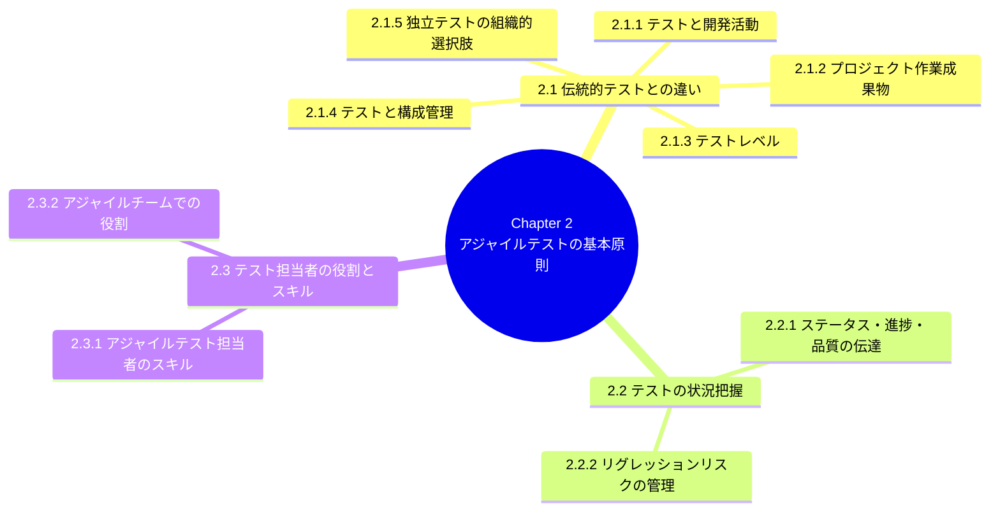

### 1.1 学習目的（Learning Objectives）一覧

CTFL-ATの学習目的はすべて**K1〜K3の認知レベル**で定義されています。K1（記憶）は最も基本的な想起、K2（理解）は概念の説明、K3（適用）は実務シナリオへの応用を意味します。Chapter 2はすべてK2レベルで統一されているのが特徴です（Chapter 3ではK3の応用問題が中心になります）。

| ID | K-level | 学習目的 |
|---|---|---|
| FA-2.1.1 | K2 | アジャイルプロジェクトと非アジャイルプロジェクトにおけるテスト活動の違いを説明できる |
| FA-2.1.2 | K2 | アジャイルプロジェクトにおいて開発活動とテスト活動がどのように統合されるかを説明できる |
| FA-2.1.3 | K2 | アジャイルプロジェクトにおける独立したテストの役割を説明できる |
| FA-2.2.1 | K2 | アジャイルプロジェクトにおけるテストの進捗・プロダクト品質のステータスを伝達するためのツールと技法を説明できる |
| FA-2.2.2 | K2 | 複数イテレーションにわたってテストが進化していくプロセスを説明し、リグレッションリスク管理におけるテスト自動化の重要性を説明できる |
| FA-2.3.1 | K2 | アジャイルチームにおけるテスト担当者に求められるスキル（対人・ドメイン・テスト）を理解している |
| FA-2.3.2 | K2 | アジャイルチームにおけるテスト担当者の役割を理解している |

**キーワード**: build verification test（ビルド検証テスト）、configuration item（構成アイテム）、configuration management（構成管理）

---

## 2.1 伝統的アプローチとアジャイルアプローチにおけるテストの違い

シーケンシャルなVモデルや反復型のRUPのような伝統的ライフサイクルと、アジャイルライフサイクルとでは、テスト活動が根本的に異なる形で組み込まれます。両者の違いを理解し、プロジェクトの実態（多くの組織はアジャイルの理想形からある程度カスタマイズして運用している）に応じて柔軟に適応できることが、アジャイルテスト担当者にとって重要な成功要因です。

違いが生じる観点は主に5つあります。

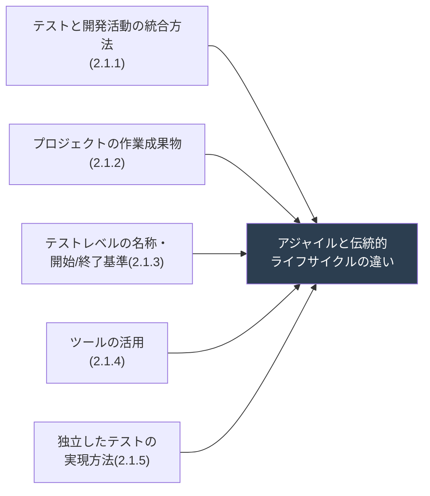

### 2.1.1 テストと開発活動

#### イテレーションという単位が生む構造的な違い

伝統的ライフサイクルとアジャイルライフサイクルの最大の違いは、**「非常に短いイテレーション」**という単位で開発が進む点です。各イテレーションは、ビジネスステークホルダーに価値をもたらす機能を含んだ「動作するソフトウェア」を生成することをゴールとします。

プロジェクト全体の流れは、次のようになります。

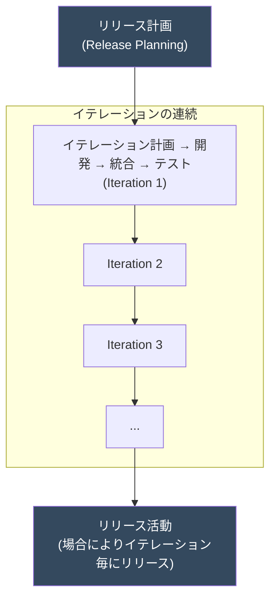

各イテレーションの内部では、開発・統合・テストが**高い並行性と重なり合い（overlap）を持って**進行します。伝統的なフェーズ型と異なり、テストは最終工程としてではなく、イテレーションを通じて継続的に発生します。

#### イテレーション内でのテスト活動の役割分担

開発者・テスト担当者・ビジネスステークホルダーの三者は、それぞれ異なる形でテストに関与します。

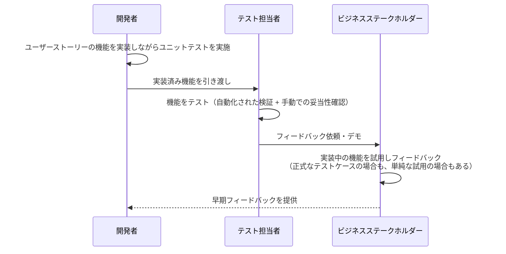

ポイントは、ビジネスステークホルダーが必ずしも「正式なテストケース」で確認するわけではなく、**機能を実際に使ってみることで開発チームに素早いフィードバックを返す**という点です。これは、伝統的プロジェクトでプロジェクト完了間際にしか顧客が製品を見られない状況とは対照的です。

#### ハーデニング（安定化）イテレーションと「Fix Bugs First」

一部のプロジェクトでは、残存欠陥や技術的負債を解消するための**ハーデニング（安定化）イテレーション**を周期的に設けることがあります。ただし、ベストプラクティスとされるのは「**システムに統合されテストされるまで、いかなる機能もDoneとみなさない**」という考え方です。

もう一つの一般的なプラクティスが「**Fix Bugs First（まずバグを直す）**」です。前イテレーションから持ち越された欠陥を、次イテレーションの冒頭で最優先に対応するというルールです。ただし、これには批判もあります。

> **実務上の注意点**: 「Fix Bugs First」を採用すると、そのイテレーションで実施すべき総作業量が事前に確定できなくなり、機能の完了時期の見積もりが難しくなるという副作用があります。チームで採用する際は、見積もり手法（ベロシティ計算など）への影響を合わせて検討する必要があります。

#### リスクベースドテストの適用タイミング

品質リスクの分析は、アジャイルプロジェクトでは**2つのタイミング**で行われます。

| タイミング | 分析の粒度 | 主導者 |
|---|---|---|
| リリース計画時 | ハイレベルなリスク分析 | テスト担当者が主導することが多い |
| イテレーション計画時 | イテレーション固有の具体的な品質リスクを識別・評価 | チーム全体 |

このリスク分析結果は、開発の順序や、機能ごとのテストの優先度・深さ、さらにテスト工数の見積もり（詳細はChapter 3の3.2で扱う）にまで影響を与えます。

#### ペアリング（Pairing）とテスト担当者の「コーチ」的役割

Extreme Programming（XP）などの一部のアジャイルプラクティスでは、**ペアリング**が用いられます。

- テスト担当者同士が2人1組で機能をテストするペアリング
- テスト担当者が開発者と協働し、機能の開発とテストを同時に進めるペアリング

分散チームではペアリングが難しくなる場合がありますが、ツールとプロセスの工夫によって分散環境でのペアリングを支援できます。

また、テスト担当者は**テスト・品質のコーチ**として、チーム内でテストに関する知識を共有し、品質保証活動を支援する役割を担うことがあります。これにより、プロダクト品質に対する**集団的な当事者意識（collective ownership）**が醸成されます。

#### テスト自動化がもたらす手動テストの質的変化

多くのアジャイルチームでは、あらゆるテストレベルでテスト自動化が実施されます。その結果、以下のような分業と技術要件の変化が生まれます。

- 開発者: 主にユニットテストの作成に集中
- テスト担当者: 自動化された統合テスト・システムテスト・システム統合テストの作成に注力
- 手動テストの比重: **経験ベース・欠陥ベースの技法**（ソフトウェア攻撃、探索的テスト、エラー推測など）に高い割合でシフトする傾向がある

この結果、アジャイルチームは**強い技術力とテスト自動化のバックグラウンドを持つテスト担当者を好む傾向**があるとシラバスは指摘しています。

#### 変更とドキュメンテーションのトレードオフ

アジャイルの核となる原則の一つは「**プロジェクトを通じて変更が起こりうる**」という前提です。そのため、作業成果物のドキュメンテーションは意図的に軽量化されます。既存機能への変更は、特にリグレッション観点でテストへの影響を伴うため、自動化テストの活用がその工数を管理する重要な手段になります。

> ⚠️ **重要な留意点**: 変更を管理する自動テストがあっても、**「変更の速度」がプロジェクトチームの対応能力を超えてはならない**という点がシラバスで強調されています。自動化があるからといって無制限に変更を許容してよいわけではありません。

### 2.1.2 プロジェクトの作業成果物

伝統的プロジェクトでは要件仕様書やテスト計画書といった重厚なドキュメントが作成される一方、アジャイルプロジェクトの作業成果物は**軽量**で、しばしば**非公式（informal）**です。シラバスでは、アジャイルプロジェクトの作業成果物を3つのカテゴリに分類しています。

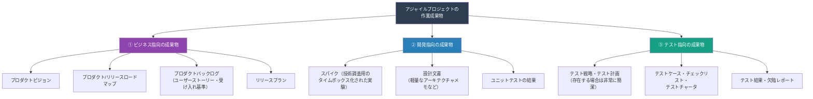

#### なぜドキュメントが軽量なのか

この背景には、Agile Manifestoの価値観「包括的なドキュメントよりも動くソフトウェアを」が反映されています。ただし、これは**「ドキュメントが不要」という意味ではない**点に注意が必要です。テスト担当者は、実装の裏付けとなる**テストベース（test basis）**が各イテレーションで十分に整っている必要があります。変更を柔軟に受け入れつつも、テストの根拠となる情報がタイムリーに提供されなければならないというジレンマが常に存在します。

#### テスト担当者にとっての実務的示唆

| 観点 | 伝統的プロジェクト | アジャイルプロジェクト |
|---|---|---|
| 要求仕様の形式 | 詳細な要件仕様書（SRS） | ユーザーストーリー + 受け入れ基準（簡潔） |
| テスト計画 | 独立した重厚なテスト計画書 | 軽量、または暗黙知としてチームに保持 |
| テストケースの粒度 | 網羅的で形式的なテストケース文書 | チェックリスト、テストチャータ、自動化コードそのもの |
| ドキュメントの更新頻度 | フェーズの節目 | イテレーションごとに継続的に更新 |

### 2.1.3 テストレベル

伝統的ライフサイクルでは「コンポーネントテスト → 統合テスト → システムテスト → 受け入れテスト」という明確な順序でテストレベルが実行されます。アジャイルプロジェクトでも同様のテストレベルの概念は存在しますが、**呼び方や実行タイミングが異なり、レベル間の境界がより流動的（overlapする）**という特徴があります。

#### イテレーション内でのテストレベルの進行

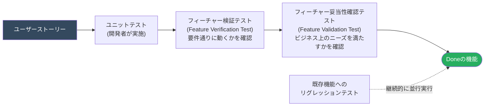

シラバスでは、多くのアジャイルプロジェクトにおいて次の2種類のテストが、伝統的な「システムテスト」に相当する役割を果たすとしています。

| テストの種類 | 目的 | 対応するV字モデルの相当レベル |
|---|---|---|
| **フィーチャー検証テスト**（Feature Verification Test） | ユーザーストーリーの技術的な受け入れ基準を満たしているかを検証（Verification：正しく作られているか） | コンポーネント統合テスト〜システムテスト |
| **フィーチャー妥当性確認テスト**（Feature Validation Test） | ビジネスステークホルダーの意図・実際のニーズを満たしているかを確認（Validation：正しいものを作っているか） | ユーザー受け入れテストの一部 |

> 💡 **VerificationとValidationの違い（K2で頻出のポイント）**
> - **Verification（検証）**: 「仕様通りに作られているか」＝要件・受け入れ基準との整合性確認
> - **Validation（妥当性確認）**: 「本当に使う人が求めているものか」＝実際のニーズとの整合性確認
>
> アジャイルではこの2つが、フィーチャー単位で毎イテレーション繰り返される点が伝統的手法との大きな違いです。

#### 受け入れテストの複数形態

アジャイルプロジェクトにおいても、伝統的プロジェクトと同様に、さまざまな形態の受け入れテストが実施されます。それぞれ実施タイミングが「各イテレーションの終了時」「一連のイテレーションの終了後」など柔軟です。

| 受け入れテストの種類 | 概要 |
|---|---|
| 内部アルファテスト | 社内の別チーム・関係者による試用テスト |
| 外部ベータテスト | 実際のエンドユーザー・顧客候補による試用テスト |
| ユーザー受け入れテスト（UAT） | 想定ユーザーによる業務適合性の確認 |
| 運用受け入れテスト（OAT） | 運用チームによる非機能要件（バックアップ、リカバリなど）の確認 |
| 規制受け入れテスト | 法規制・業界標準への準拠確認（医療機器・金融など） |
| 契約受け入れテスト | 契約上の合意事項を満たしているかの確認 |

#### システムテストの自動化とその技術的手段

アジャイルチームは、統合テスト・システムテストレベルにおいても高い割合で自動テストを実装します。実現手段としては次のようなものが挙げられます。

- **GUIを介さないAPIレベルでの機能テスト自動化**（サービス層・ビジネスロジック層への直接呼び出し）
- オープンソースまたは商用の**UI自動化フレームワーク**を用いた機能テストの自動化
- CIフレームワークに統合された自動テストの実行

機能テストの実行に時間がかかる場合、ユニットテストとは切り離し、**実行頻度を落として**（例：夜間バッチ、日次ビルド後など）運用されることもあります。

### 2.1.4 テストと構成管理

アジャイルプロジェクトの高速な開発サイクルを支えるためには、**構成管理（Configuration Management）**とテストプロセスの緊密な連携が不可欠です。

#### 継続的インテグレーション（CI）パイプラインにおけるテストの位置づけ

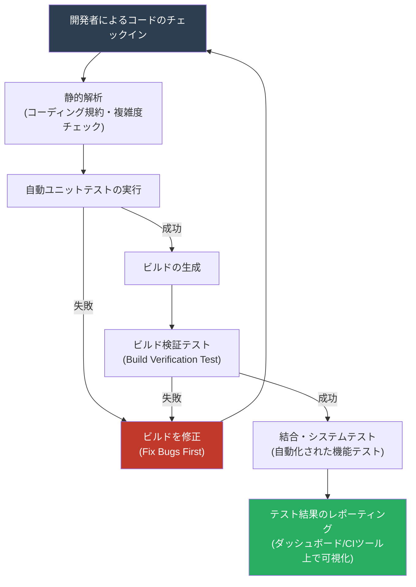

**ビルド検証テスト（Build Verification Test, BVT）**は、新しいビルドが「その後の本格的なテストに値するか」を判定するための、短時間で実行できるテストセットです。伝統的な「スモークテスト」に近い役割を果たします。BVTが失敗した場合、それ以上のテストは実施せず、直ちに開発チームへフィードバックします。

#### 構成管理ツールに求められる要件

アジャイルプロジェクトでは、頻繁なビルド・頻繁なリリースに対応するため、構成管理ツールには次のような能力が求められます。

| 要件 | 説明 |
|---|---|
| バージョン管理の粒度 | コード・テストケース・テストデータ・環境設定を一体として構成アイテムとして管理できること |
| ビルドの自動化・追跡可能性 | どのコード変更がどのビルドに含まれているかをトレース可能にすること |
| テスト自動化との連携 | チェックイン・ビルド生成をトリガーとして自動テストを起動できること |
| 複数バージョンの並行管理 | 並行して走る複数のイテレーション・ブランチの構成を区別できること |

> ⚠️ **注意点**: シラバスは、ユニットテストだけに依存した「グリーンビルド＝安全」という誤解を戒めています。ユニットテストの網羅性（カバレッジ）は品質の必要条件であって十分条件ではなく、統合・システムレベルでの自動テストや、経験ベースの手動テストと組み合わせて初めて、リグレッションリスクを十分に低減できます。

### 2.1.5 独立したテストのための組織的選択肢

アジャイルの「ホールチームアプローチ（whole-team approach）」は、開発者・テスト担当者・ビジネスステークホルダーが一体となって品質に責任を持つという考え方です。しかし、これは**「独立した視点によるテスト」の価値を否定するものではありません**。認知的な偏り（同じ人が実装もテストも行うと見落としが生じやすい）を補うため、多くの組織では何らかの形で独立性を確保する工夫をしています。

シラバスは、独立したテストを実現する組織構造として、主に3つの選択肢を挙げています。

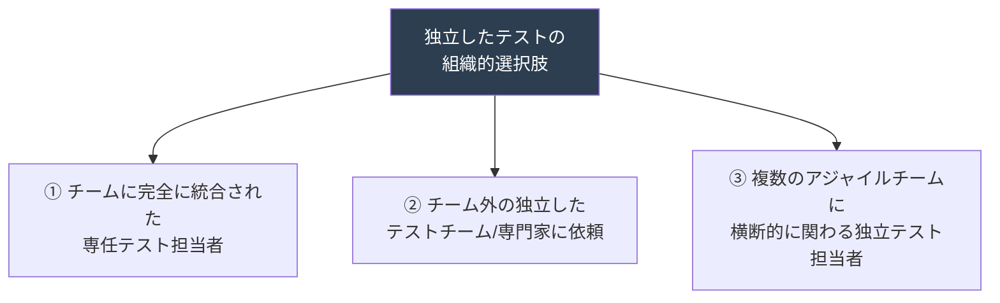

| 選択肢 | メリット | デメリット・リスク |
|---|---|---|
| ① チーム専任のテスト担当者 | チームとの密な連携、コンテキスト理解が深い | チームに同化しすぎて客観性・独立した視点を失うリスク |
| ② チーム外の独立組織へ依頼 | 高い客観性、専門的な技術（性能・セキュリティなど）を活用可能 | チームの文脈理解に時間がかかる、依頼・待ち時間によるボトルネックの発生リスク |
| ③ 複数チームを横断する独立テスト担当者 | ①と②のバランスを取れる、チーム間の知見共有が進む | 複数チームを掛け持つことによる負荷・優先順位の競合 |

#### 実務での使い分けの考え方

どの選択肢が適切かは、プロジェクトのリスクプロファイル、組織の成熟度、規制要件などによって異なります。例えば、医療機器や金融システムのように規制対応が求められるドメインでは、②のような独立組織による受け入れテスト・監査的なテストが併用されるケースも珍しくありません。逆に、少人数で高速に価値を届けたいスタートアップ的なチームでは、①の形態が中心になりやすい傾向があります。

いずれの形態を採用するにせよ、シラバスが強調するのは、**「独立した視点」と「チームへの当事者意識（ownership）」を両立させる工夫が必要**だという点です。

---

## 2.2 アジャイルプロジェクトにおけるテストの状況

アジャイルプロジェクトは、伝統的プロジェクトに比べて**進捗の伝達手段が非公式かつ高頻度**になる傾向があります。分厚いステータスレポートの代わりに、チームメンバー全員がリアルタイムで状況を把握できる仕組み（いわゆる「情報ラジエーター／information radiator」）が活用されます。

### 2.2.1 テストステータス、進捗、プロダクト品質のコミュニケーション

#### アジャイルにおける主要なコミュニケーション手段

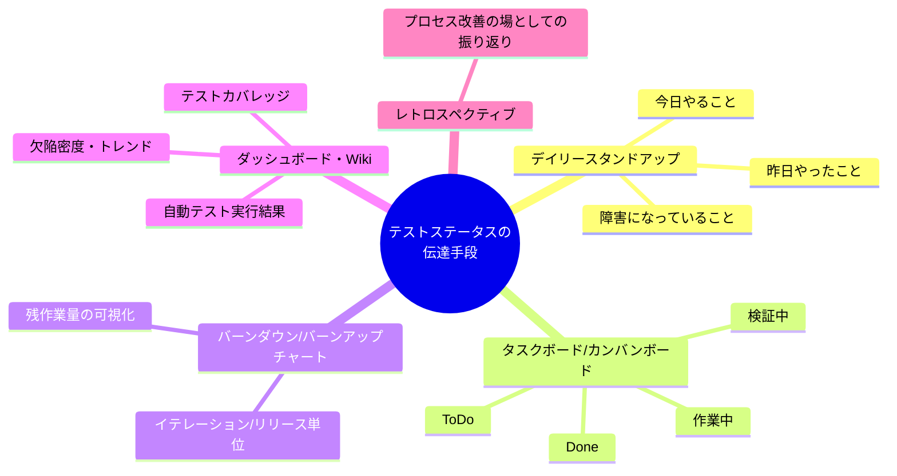

#### タスクボードの例（カンバン形式）

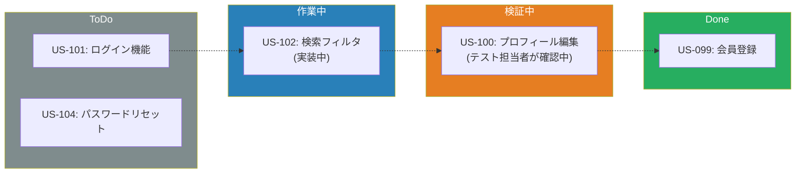

このようなタスクボードは、テスト担当者にとって「どのユーザーストーリーがテスト待ちで滞留しているか」を一目で把握できる重要なツールです。「検証中」の列に長時間とどまっているカードがあれば、テストのボトルネックとして早期に気づくことができます。

#### 進捗指標として使われる主な情報

シラバスが言及する、テストステータス・プロダクト品質を伝えるための代表的な情報は以下の通りです。

| 情報の種類 | 具体例 |
|---|---|
| テストの実行状況 | 計画済み/実施済み/合格/不合格のテスト件数 |
| 欠陥の状況 | 新規発見数、修正済み数、再発（リグレッション）数、深刻度別分布 |
| テスト自動化のカバレッジ | 自動化されたテストの割合、コードカバレッジ |
| リスクの状況 | 未着手・未検証のハイリスク項目 |
| ベロシティ・バーンダウン | チームの生産性トレンド、残作業の消化ペース |

> 💡 **ポイント**: これらの情報は、伝統的プロジェクトのように「最終報告書」として提示されるのではなく、**イテレーションを通じて継続的に、かつ視覚的に**（多くの場合、物理的またはデジタルなタスクボード・ダッシュボードとして）チーム内外に開示され続けます。これにより、問題の早期発見と迅速な意思決定が可能になります。

### 2.2.2 進化する手動・自動テストケースによるリグレッションリスクの管理

#### なぜリグレッションリスクがアジャイルで特に重要なのか

アジャイルプロジェクトでは、毎イテレーションで新機能の追加・既存機能の変更が発生します。これは裏を返せば、**「既存の動いている機能を壊してしまうリスク（リグレッションリスク）」が毎イテレーション発生し続ける**ということを意味します。伝統的プロジェクトのようにフェーズの最後にまとめてリグレッションテストを行う余裕はなく、**継続的にリグレッションテストを実行し続ける仕組み**が必須になります。

#### 自動テストの階層と実行タイミング

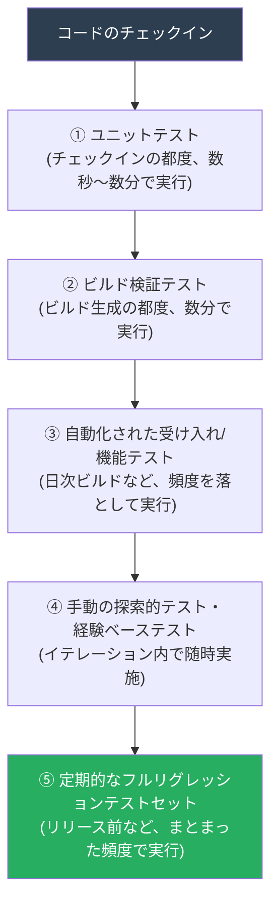

このように、テストの実行頻度は「軽くて速いテストほど頻繁に」「重くて時間のかかるテストほど頻度を落として」実行するのが基本的な考え方です。これは後の章（Chapter 3）で扱う「テストピラミッド」の思想にも通じますが、Chapter 2の時点では、あくまで**「継続的なリグレッションテストの仕組みづくり」**という文脈で説明されています。

#### テストケースは「進化」する

シラバスが強調する重要な視点の一つが、**テストケース自体もイテレーションを重ねるごとに進化し続ける**という点です。

- 新しいユーザーストーリーが追加されれば、新しいテストケースが作られる
- 既存機能が変更されれば、既存のテストケースも更新される必要がある
- 陳腐化した（もう価値を生まない）テストケースは、積極的に**引退（retire）**させるべきである
- 手動テストのうち、繰り返し実行する価値が高いものは、**自動化の候補**として継続的に見直される

この「テストケースのメンテナンスサイクル」を怠ると、テストスイートが肥大化し、実行時間が伸び、かえってフィードバックの速度を損なうという逆効果を生みます。

#### 自動化すべき、テスト実行以外の周辺タスク

シラバスは、リグレッションテストの効率を支えるために、テスト実行そのもの以外にも自動化すべきタスクがあると指摘しています。

| 自動化対象のタスク | 目的 |
|---|---|
| テストデータの生成 | 毎回同じ状態からテストを開始できるようにする |
| テストデータのロード・環境のセットアップ | テスト環境構築にかかる手作業を排除する |
| テスト対象のデプロイ | ビルドから即座にテスト可能な状態を作る |
| 環境・データの復元（リストア） | テスト後にクリーンな状態へ戻す |
| 実際の結果と期待結果の比較 | 判定作業（オラクル問題）の一部を自動化する |

これらの周辺タスクを自動化することで、テスト担当者は**手動でしか価値を生まない探索的テストや経験ベーステストに集中**できるようになります。これは、限られたイテレーション期間内で品質を担保するための、非常に実務的な工夫です。

---

## 2.3 アジャイルチームにおけるテスト担当者の役割とスキル

「ホールチームアプローチ」の下では、品質は全員の責任です。しかし、それは**「専門的なテストスキルが不要になる」という意味ではありません**。むしろ、アジャイルテスト担当者には、伝統的プロジェクトのテスト担当者以上に幅広いスキルセットが求められます。

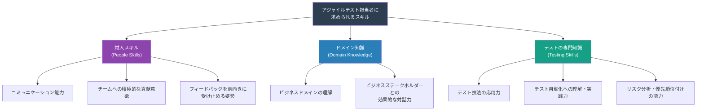

### 2.3.1 アジャイルテスト担当者のスキル

シラバスは、アジャイルテスト担当者に求められる資質・スキルを以下のように整理しています。

#### 対人スキル（People Skills）

アジャイルは「個人と対話」を重視する開発手法であるため、テスト担当者にも高いレベルの対人スキルが求められます。

- **積極性・自発性**: 指示を待つのではなく、自らチームの品質向上に貢献しようとする姿勢
- **コミュニケーション能力**: 開発者・プロダクトオーナー・ビジネスステークホルダーなど、多様な役割の人々と効果的に対話できる能力
- **フィードバックへの前向きな姿勢**: 自分の作業やテスト結果に対する指摘を、成長の機会として受け止められる柔軟性
- **チームプレイヤーとしての振る舞い**: 「自分のタスク」だけでなく、チーム全体のゴール達成を優先する意識

#### ドメイン知識・ビジネス知識

アジャイルテスト担当者は、単に「テスト技法に詳しい」だけでなく、**プロダクトが解決しようとしているビジネス課題そのものへの理解**が求められます。これにより、以下のような場面で価値を発揮できます。

- ユーザーストーリーの受け入れ基準を、ビジネス上意味のある形で具体化・洗練させる
- 曖昧な要求に対して、的確な質問を投げかけられる
- ビジネスステークホルダーが気づいていないエッジケースやリスクを先回りして指摘できる

#### テストに関する専門知識・技術スキル

もちろん、テスト担当者としての中核的な専門性も欠かせません。

- テスト技法（ブラックボックス・ホワイトボックス・経験ベース）の使い分け
- テスト自動化フレームワークの理解、または自ら実装できる技術力
- 品質リスク分析に基づいた、テスト対象・深さの優先順位付け
- 探索的テストのようなセッションベースのテスト実施能力

> 💡 **実務上のポイント**: アジャイルチームは、しばしば**「テスト自動化のバックグラウンドを持つ、より技術力の高いテスト担当者」を求める傾向がある**とシラバスは述べています（2.1.1でも触れた通り）。これは、モダンなQAエンジニア・SDET（Software Developer Engineer in Test）という職種が生まれてきた背景とも一致します。

### 2.3.2 アジャイルチームにおけるテスト担当者の役割

#### アジャイルチーム内でテスト担当者が担う典型的な活動

シラバスは、アジャイルチームのテスト担当者が担う役割の例として、次のような活動を挙げています。

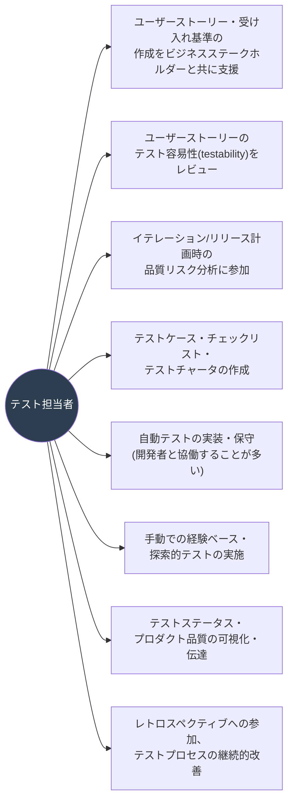

#### 独立したテストを実現する上での組織的リスク

2.1.5で触れた「独立したテストの組織的選択肢」は、テスト担当者の役割にも直結する重要なテーマです。シラバスは、テスト担当者がアジャイルチームに深く組み込まれることで生じうる**組織的リスク**を明示的に指摘しています。

| リスク | 説明 |
|---|---|
| **客観性の喪失** | チームに同化しすぎることで、自分たちの成果物を批判的に見る視点が弱まる |
| **技術的な視野の狭窄** | 特定のプロダクト・チームの文脈に閉じてしまい、他プロジェクトの知見やテスト技法の広がりを取り込みにくくなる |
| **専門職としてのキャリアパスの不透明化** | テスト専門組織が存在しない場合、テスト担当者としてのスキル育成・評価制度が曖昧になりやすい |

これらのリスクへの対応として、シラバスは以下のような工夫を推奨しています。

- 複数のアジャイルチームを横断する「コミュニティ・オブ・プラクティス（Community of Practice）」的な場を設け、テスト担当者同士の知見共有を促す
- テスト専門のマネージャーやテストリードを置き、キャリアパス・スキル育成の道筋を明確にする
- 定期的に外部レビューや監査的なテスト（2.1.5の選択肢②）を組み合わせ、客観性を補完する

> 📝 **まとめのポイント**: 「ホールチームアプローチ」と「テスト専門性の独立性」は、対立する概念ではなく、**組織設計によって両立させるべきもの**だという考え方が、Chapter 2全体を貫く重要なメッセージです。

---

## 3. 章のまとめ

Chapter 2「アジャイルテストの基本原則」の要点を、学習目的（Learning Objectives）に対応させて振り返ります。

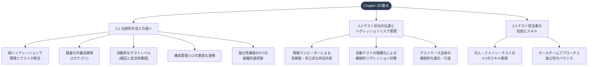

### 3.1 重要用語チェックリスト

試験・実務の両面で押さえておきたいキーワードを整理しました。

| 用語 | 一言で説明 |
|---|---|
| Build Verification Test（BVT） | ビルドがさらなるテストに値するかを判定する短時間テスト |
| Feature Verification Test | ユーザーストーリーの受け入れ基準（要件）通りに動くかの検証 |
| Feature Validation Test | ビジネスの実際のニーズを満たすかの妥当性確認 |
| Configuration Item（構成アイテム） | 構成管理の対象となる単位（コード・テストケース・環境設定など） |
| Configuration Management（構成管理） | 変更を追跡・制御し、再現可能なビルド・テスト環境を保証する仕組み |
| ホールチームアプローチ | 品質はチーム全員の責任であるという考え方 |
| リグレッションリスク | 変更によって既存の動作が壊れるリスク |
| ハーデニング（安定化）イテレーション | 欠陥・技術的負債解消に充てる周期的イテレーション（ベストプラクティスではないとされる） |

### 3.2 学習到達度セルフチェック

以下の質問に、資料を見ずに口頭で説明できるかを確認してみてください。

1. アジャイルプロジェクトにおいて、開発者・テスト担当者・ビジネスステークホルダーは、イテレーション内でどのようにテストに関与するか説明できるか？
2. 「Feature Verification Test」と「Feature Validation Test」の違いを、VerificationとValidationという言葉を使って説明できるか？
3. ビルド検証テスト（BVT）が失敗した場合、CIパイプライン上で何が起こるべきか説明できるか？
4. 独立したテストを実現するための3つの組織的選択肢と、それぞれのメリット・デメリットを説明できるか？
5. テストケースが「進化」するとはどういうことか、具体例を挙げて説明できるか？
6. アジャイルテスト担当者に求められる3つのスキル領域を挙げ、それぞれ具体例を説明できるか？
7. テスト担当者がチームに深く統合されることで生じうる組織的リスクとその対策を説明できるか？

---

## 4. 参考文献・出典（すべて2026年7月時点で最新の情報を確認）

本記事の作成にあたり、以下の一次情報源・信頼できるソフトウェアテスト関連サイトを参照しました。

### 4.1 ISTQB公式・一次資料

| No. | 資料名 | URL |
|---|---|---|
| 1 | ISTQB® Certified Tester Foundation Level Agile Tester (CTFL-AT) 公式ページ（サンセット情報含む） | https://istqb.org/certifications/certified-tester-foundation-level-agile-tester-ctfl-at/ |
| 2 | ISTQB® Foundation Level Extension Agile Tester Syllabus（英語版シラバス原文、2014年版） | https://astqb.org/assets/documents/ISTQB-Foundation-Agile-Syllabus-.pdf |
| 3 | ISTQB® Certified Tester Foundation Level Syllabus v4.0.1（本体シラバス、アジャイル関連統合内容） | https://istqb.org/?sdm_process_download=1&download_id=3345 |
| 4 | ISTQB® Certified Tester Advanced Level Agile Tester (CTAL-AT) v2.0 公式ページ（CTFL-ATからの移行情報） | https://www.istqb.org/certifications/agile-tester |
| 5 | JSTQB Foundation Level Extension シラバス アジャイルテスト担当者 日本語版（Version 2014.J02） | https://jstqb.jp/dl/JSTQB-SyllabusFoundation-AgileExt_Version2014.J02.pdf |
| 6 | JSTQB Foundation Level シラバス 日本語版（V4.0） | https://jstqb.jp/dl/JSTQB-SyllabusFoundation_VersionV40.J02.pdf |

### 4.2 補足・実務解説記事

| No. | 資料名 | URL |
|---|---|---|
| 7 | CTFL-AT Syllabus and Exam Details（ProcessExam） | https://www.processexam.com/istqb/istqb-ctfl-at-certification-exam-syllabus |
| 8 | Certified Tester Foundation Level Agile Tester (CTFL-AT) 解説記事 | https://www.istqb.guru/agile-tester/ |
| 9 | ISTQB Study Material 2026（CTFL v4.0との関係整理） | https://www.istqb.guru/istqb-study-material/ |
| 10 | ISTQB Syllabus & Practice Exams（ASTQB提供、公式シラバスダウンロード窓口） | https://astqb.org/resources/ |
| 11 | ISTQB Agile Testerを受験してみた（実体験に基づく学習法・出題傾向の解説） | https://teamspirit.hatenablog.com/entry/2022/01/18/100253 |
| 12 | JSTQBが「CTFL v4.0」の日本語翻訳版をリリース（v3.1・Agile v2014との変更点比較） | https://www.co-well.jp/blog/softwaretest_jstqb_v4.0 |
| 13 | ソフトウェアテストの学習に役立つJSTQBのシラバスと試験のご紹介（Agile Japan 2025 発表資料） | https://2025.agilejapan.jp/wp-content/uploads/2025/11/1113_1400-1420_JSTQB_AgileJapan2025_20251105%E6%8F%90%E5%87%BA%E7%94%A8.pdf |

> **出典の使い分けについて**: No.1〜6は本記事の技術的内容（学習目的、K-level、章構成、用語定義）の根拠として直接使用した一次資料です。No.7〜13は、資格の位置づけ・学習方法・最新動向に関する背景情報の裏付けとして使用しました。

### 4.3 次のステップ（Chapter 3への橋渡し）

本記事はChapter 2の範囲に限定していますが、続くChapter 3「Agile Testing Methods, Techniques, and Tools」では、TDD/ATDD/BDD、テストピラミッド、**Brian Marickが考案しLisa CrispinとJanet Gregoryが発展させたテスト象限（Testing Quadrants）**、探索的テスト、非機能テストなど、より実践的な技法が扱われます。学習を継続する場合は、以下も有用な一次情報源です。

| No. | 資料名 | URL |
|---|---|---|
| 14 | The Agile Testing Quadrants（Lisa Crispin公式ブログ、最新版の象限モデル） | https://lisacrispin.com/2024/10/11/the-agile-testing-quadrants/ |
| 15 | Testing Quadrants（PMI Disciplined Agile、象限モデルの実務解説） | https://www.pmi.org/disciplined-agile/agile/testingquadrants |

---

*本記事は教育目的で作成されたものであり、ISTQB®・JSTQB®の著作物そのものを複製するものではありません。正確な学習・受験対策のためには、必ず上記の公式シラバス原文を参照してください。*
