# Chapter 3: アジャイルテスト技法とツール

## ISTQB® CTFL-AT (Certified Tester Foundation Level Agile Tester) 準拠 実践解説ガイド

> **対象読者**: すでにCTFLまたは実務でのテスト経験があり、アジャイル開発におけるテスト技法・ツールを体系的かつ実践的に理解したい中級〜上級のテスト・QAエンジニア、開発者、スクラムマスター、プロダクトオーナー。
>
> **本ガイドの位置づけ**: 本章は ISTQB® Certified Tester Foundation Level Agile Tester (CTFL-AT) Syllabus v1.0 (2024年11月公開) の **Chapter 3: Agile Testing Methods, Techniques and Tools** を主たる典拠とし、各技法・ツールの解説を最新(2026年)の業界動向・一次情報で補強したものです。シラバス自体は「What」(何を知っておくべきか)を簡潔に定義するにとどまるため、本ガイドでは「Why」(なぜそれが重要か)と「How」(どう実践するか)をMermaid図・比較表・コード例を交えてステップバイステップで掘り下げます。
>
> **免責事項**: 本ガイドは学習・実務理解を目的とした二次解説であり、公式シラバスの逐語再現ではありません。試験直前の一言一句の確認は、必ず ISTQB® 公式サイトで公開されている最新版シラバスPDFをご参照ください。
>
> - 公式シラバス certification page: <https://istqb.org/certifications/certified-tester-foundation-level-agile-tester-ctfl-at/>
> - シラバスPDF (ダウンロードリンク経由): <https://istqb.org/?sdm_process_download=1&download_id=3647>

---

## 0. Chapter 3 の全体マップ

CTFL-AT Chapter 3 は、アジャイルプロジェクトにおける「テストの手法(Methods)」「見積りとリスク評価」「具体的な技法(Techniques)」「それらを支えるツール(Tools)」という4つの層で構成されています。まず全体像をMermaidで俯瞰します。

```mermaid
flowchart TD
    A["Chapter 3<br/>Agile Testing Methods, Techniques and Tools"] --> B["3.1 アジャイルテスト手法<br/>TDD / ATDD / BDD"]
    A --> C["3.2 品質リスク評価と<br/>テスト工数見積り"]
    A --> D["3.3 アジャイルプロジェクトの<br/>技法"]
    A --> E["3.4 アジャイルにおける<br/>ツール"]

    B --> B1["3.1.1 TDD<br/>Red-Green-Refactor"]
    B --> B2["3.1.2 ATDD<br/>受け入れ基準の事前合意"]
    B --> B3["3.1.3 BDD<br/>Given-When-Then"]

    C --> C1["3.2.1 品質リスク評価<br/>Product Risk Workshop"]
    C --> C2["3.2.2 内容とリスクに基づく<br/>工数見積り"]

    D --> D1["3.3.1 テスティング<br/>クアドラント"]
    D --> D2["3.3.2 非機能テスト /<br/>技術的負債の考慮"]
    D --> D3["3.3.3 リグレッションテストと<br/>テスト自動化ピラミッド"]
    D --> D4["3.3.4 探索的テスト<br/>Exploratory Testing"]

    E --> E1["3.4.1 タスク管理・<br/>追跡ツール"]
    E --> E2["3.4.2 コミュニケーション・<br/>情報共有ツール"]
    E --> E3["3.4.3 ソフトウェアビルド・<br/>配布ツール"]
    E --> E4["3.4.4 構成管理ツール"]
    E --> E5["3.4.5 テスト設計・実装・<br/>実行ツール"]
    E --> E6["3.4.6 クラウド・<br/>仮想化ツール"]

    style A fill:#1a2744,stroke:#4a9eff,color:#fff
    style B fill:#1e3a5f,stroke:#4a9eff,color:#fff
    style C fill:#1e3a5f,stroke:#4a9eff,color:#fff
    style D fill:#1e3a5f,stroke:#4a9eff,color:#fff
    style E fill:#1e3a5f,stroke:#4a9eff,color:#fff
```

**なぜこの構造なのか**: アジャイル開発では「テストを後工程に置く」従来型ではなく、「テストを開発サイクルに織り込む(shift-left)」ことが前提になります。そのため、まず開発と一体化した手法(3.1)を学び、次に限られたイテレーション期間でどこにテスト労力を割くかというリスクベースの判断(3.2)を学び、そのうえで具体的な技法(3.3)とそれを支えるツールチェーン(3.4)を理解する、という積み上げ構造になっています。

参考: ISTQB®の資格体系では、本ガイドが扱うFoundation Level Agile Tester (CTFL-AT) の上位に、より高度な実務経験を持つテスターを対象としたAdvanced Level Agile Tester (CTAL-AT) が位置づけられています。本章で学ぶ内容は、その上位資格に進むための土台となる基礎知識です。
URL: <https://istqb.org/>

---

## 3.1 アジャイルテスト手法(TDD・ATDD・BDD)

### 3.1.0 なぜ3つも「駆動開発」があるのか

アジャイル開発では「テストファースト」という考え方が中心にありますが、**誰が・何を対象に・どのレベルで**テストを先に書くかによって3つの流派に分かれます。この違いを最初に押さえることが理解の近道です。

| 手法 | 主な担当者 | 対象レベル | 記述形式 | 主目的 |
|---|---|---|---|---|
| **TDD** (Test-Driven Development) | 開発者 | 単体(コード単位) | テストコード(xUnit等) | 内部設計・実装の品質を駆動する |
| **ATDD** (Acceptance Test-Driven Development) | 開発者・テスター・ビジネス代表(Three Amigos) | 受け入れ(ユーザーストーリー単位) | 受け入れ基準・受け入れテスト | 「何を作るべきか」の認識合わせ |
| **BDD** (Behavior-Driven Development) | 開発者・テスター・ビジネス代表 | 振る舞い(シナリオ単位) | 自然言語(Given-When-Then) | ビジネス言語でテストを表現し自動化する |

> 💡 **ポイント**: TDD/ATDD/BDDは排他的ではなく、実務では **ATDD/BDDで「何を作るか」を合意 → TDDで「どう作るか」を実装** という形で併用されるのが一般的です。

---

### 3.1.1 Test-Driven Development (TDD)

**定義**: プロダクションコードを書く前に、まず失敗するテストコードを書き、そのテストを通す最小限の実装を行い、その後リファクタリングするという開発サイクル。Kent Beckが体系化したことで知られています。

#### Red-Green-Refactorサイクル

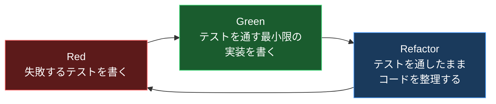

**ステップバイステップの流れ**:

1. **Red**: これから実装する振る舞いを表す、失敗するテストを1つだけ書く。まだ実装がないのでコンパイルエラーまたはアサーション失敗になる。
2. **Green**: そのテストを通すためだけの、最も単純な実装を書く(ハードコードでもよい)。過剰設計をしない。
3. **Refactor**: テストがGreenのまま、重複除去・命名改善・構造整理を行う。テストが安全網になっているため、大胆なリファクタリングが可能。
4. 次の振る舞いについて1に戻る。

**コード例(TypeScript / Jest)**:

```typescript
// Step 1: Red - 失敗するテストを先に書く
describe("PriceCalculator", () => {
  it("税込み価格を計算できる", () => {
    const calculator = new PriceCalculator(0.10); // 消費税10%
    expect(calculator.withTax(1000)).toBe(1100);
  });
});

// Step 2: Green - 最小限の実装
class PriceCalculator {
  constructor(private taxRate: number) {}
  withTax(price: number): number {
    return price + price * this.taxRate;
  }
}

// Step 3: Refactor - 端数処理など仕様が明確になった時点で整理
class PriceCalculator {
  constructor(private readonly taxRate: number) {}
  withTax(price: number): number {
    return Math.round(price * (1 + this.taxRate));
  }
}
```

**TDDがアジャイルで重視される理由**:

- イテレーションが短いアジャイル開発では、後工程での大規模な手戻りが許容されない。TDDは実装と同時に回帰テストのセーフティネットを構築する。
- 「動くコード」を頻繁にデモする必要があるため、常にテストが通る状態(Green)を保ちながら進められるTDDのリズムと相性が良い。
- 設計の副産物として、テスト容易性(testability)の高い疎結合な設計が自然に導かれる。

**参考文献**:

- Agile Alliance, "TDD" 用語解説: <https://www.agilealliance.org/glossary/tdd/>
- Martin Fowler, "TestDrivenDevelopment": <https://martinfowler.com/bliki/TestDrivenDevelopment.html>

---

### 3.1.2 Acceptance Test-Driven Development (ATDD)

**定義**: ユーザーストーリーの実装に着手する前に、開発者・テスター・ビジネス代表(プロダクトオーナー等)の三者が協働して受け入れテスト(Acceptance Test)を定義する手法。この三者協働は「Three Amigos」(スリーアミーゴ)と呼ばれます。

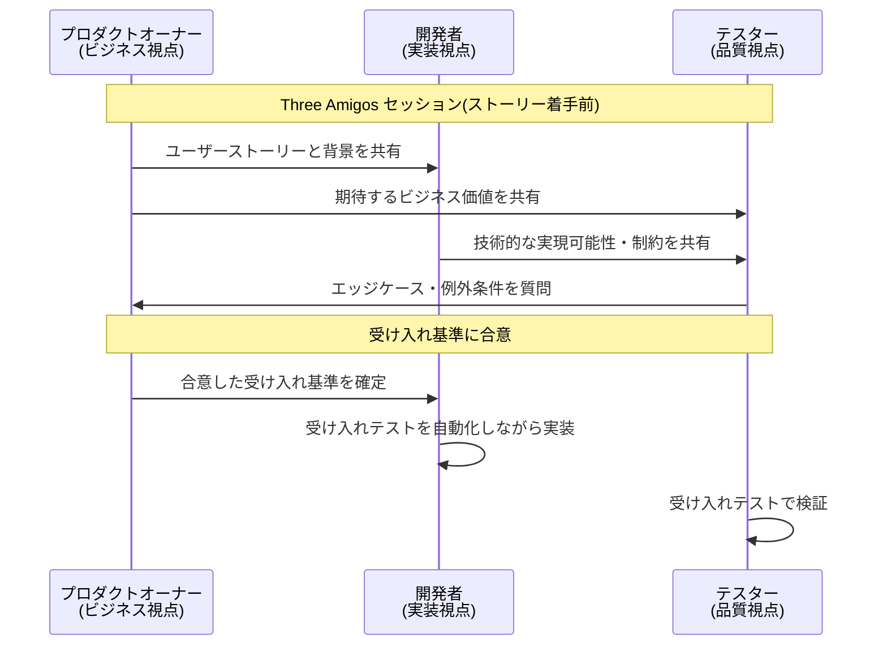

**ステップバイステップ**:

1. **ストーリーの選定**: スプリントプランニングや直前のリファインメントで対象ユーザーストーリーを決める。
2. **Three Amigosセッションの実施**: 実装着手前に三者が集まり、要求の曖昧さを洗い出す。
3. **受け入れ基準(Acceptance Criteria)の合意**: Given-When-Then形式や箇条書きで、「完了の定義」を明文化する。
4. **受け入れテストの自動化**: 合意した基準をそのまま自動テストとして落とし込む(BDDツールと組み合わせることが多い)。
5. **実装**: 開発者は受け入れテストをパスすることを目標にTDDサイクルで実装する。
6. **検証**: 完成後、自動化された受け入れテストと必要に応じた探索的テストで確認する。

**ATDDの効果**:

- 「作ってから仕様がずれていたことに気づく」という手戻りを防ぐ(shift-left)。
- テスターが実装後ではなく**要求定義の段階**から品質に関与できる。
- 受け入れ基準がそのまま生きたドキュメント(living documentation)になる。

**参考文献**:

- Agile Alliance, "Acceptance Test-Driven Development (ATDD)": <https://www.agilealliance.org/glossary/atdd/>
- Ministry of Testing, "Three Amigos" 実践解説: <https://www.ministryoftesting.com/dojo/lessons/three-amigos>

---

### 3.1.3 Behavior-Driven Development (BDD)

**定義**: システムの振る舞いを自然言語に近い構文(Given-When-Then)で記述し、それを自動テストとして直接実行可能にする手法。Dan Northが提唱し、ビジネス・開発・テストの共通言語(Ubiquitous Language)を作ることを目的とします。

#### Gherkin構文とGiven-When-Then


**コード例(Gherkin / Cucumber形式)**:

```gherkin
機能: ATMからの現金引き出し
  顧客が正しい残高範囲内で現金を引き出せることを保証する

  シナリオ: 残高内での引き出し成功
    前提 口座残高が10000円である
    もし 3000円の引き出しを要求する
    ならば 引き出しは成功する
    かつ 口座残高は7000円になる

  シナリオ: 残高不足時の引き出し失敗
    前提 口座残高が2000円である
    もし 3000円の引き出しを要求する
    ならば 引き出しは失敗する
    かつ エラーメッセージ「残高不足」が表示される
```

**このシナリオをステップ定義に接続する(TypeScript例)**:

```typescript
import { Given, When, Then } from "@cucumber/cucumber";
import assert from "assert";

Given("口座残高が{int}円である", function (balance: number) {
  this.account = new Account(balance);
});

When("{int}円の引き出しを要求する", function (amount: number) {
  this.result = this.account.withdraw(amount);
});

Then("引き出しは成功する", function () {
  assert.strictEqual(this.result.success, true);
});

Then("口座残高は{int}円になる", function (expected: number) {
  assert.strictEqual(this.account.balance, expected);
});
```

**BDDの3つの価値**:

1. **共通言語**: 非エンジニアも読める形式のため、ビジネス代表がテストシナリオを直接レビューできる。
2. **生きた仕様書(Living Documentation)**: `.feature`ファイル自体が常に最新の振る舞い仕様となる。
3. **自動化との直結**: シナリオがそのまま実行可能なテストになるため、仕様とテストの乖離が起きにくい。

**代表的なBDDツール**: Cucumber(多言語対応)、SpecFlow(.NET)、Behave(Python)、JBehave(Java)。

**参考文献**:

- Cucumber公式ドキュメント "Gherkin Reference": <https://cucumber.io/docs/gherkin/reference/>
- Dan North, "What's in a Story?": <https://dannorth.net/whats-in-a-story/>
- Agile Alliance, "Behavior-Driven Development": <https://www.agilealliance.org/glossary/bdd/>

---

### 3.1.4 TDD・ATDD・BDDの関係性を1枚で理解する

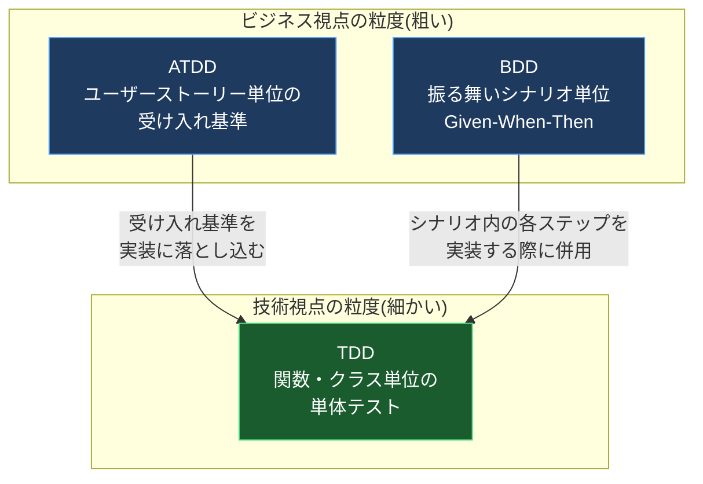

**まとめ表**:

| 観点 | TDD | ATDD | BDD |
|---|---|---|---|
| 起点 | 開発者の設計意図 | ビジネス要求(ユーザーストーリー) | ビジネス要求(振る舞い) |
| 記述言語 | プログラミング言語 | 自然言語 or 表形式 | 制御された自然言語(Gherkin) |
| 主な参加者 | 開発者単独が多い | Three Amigos(3者協働) | Three Amigos(3者協働) |
| テストの粒度 | 単体・コンポーネント | 受け入れ(機能単位) | シナリオ(振る舞い単位) |
| ドキュメントとしての価値 | 低い(実装者向け) | 中程度 | 高い(非エンジニアも読める) |

---

## 3.2 品質リスクの評価とテスト工数の見積り

アジャイル開発では、ウォーターフォールのような包括的なテスト計画書を最初に固定するのではなく、**イテレーションごとに軽量なリスク評価と見積りを繰り返す**アプローチを取ります。ここでは「何を・どれだけ深くテストすべきか」を判断するための2つの実践技法を扱います。


### 3.2.1 アジャイルプロジェクトにおける品質リスク評価

**なぜ従来型のリスク評価と違うのか**:
従来のリスクベースドテスト(Risk-Based Testing)では、プロジェクト開始時に詳細なリスク分析を1回実施しますが、アジャイルでは要求(バックログ)自体が継続的に変化するため、**軽量かつ反復的**なリスク評価が求められます。

**ステップバイステップ: プロダクトリスクワークショップの進め方**

1. **参加者を集める**: プロダクトオーナー、開発者、テスター、必要に応じてUX担当者やビジネスアナリストを含む。
2. **対象範囲を決める**: 直近のリリース、または着手予定のエピック/ストーリー群を対象とする。
3. **リスク項目を洗い出す**: 「もし〇〇が壊れたら、ユーザー・ビジネスにどんな影響があるか」をブレインストーミングする。典型的なリスクカテゴリ:
   - 機能的リスク(誤った計算結果、業務ロジックの欠陥)
   - 非機能的リスク(性能劣化、セキュリティ脆弱性、可用性低下)
   - 技術的リスク(複雑な外部連携、新技術の採用)
4. **発生確率(Likelihood)と影響度(Impact)を評価する**: 通常は「高・中・低」の3段階、またはPoker形式の相対値で評価する。
5. **リスクレベルからテストの深さを決める**: 高リスク項目には多くのテスト技法(自動化+探索的テスト+非機能テスト)を割り当て、低リスク項目には最小限のスモークテストのみを割り当てる。
6. **合意事項をバックログに反映する**: リスクの高いストーリーには「受け入れ基準」や「テストタスク」として明示的に追記する。

**リスクレベルとテスト深度のマトリクス例**:

| 発生確率 \ 影響度 | 低 | 中 | 高 |
|---|---|---|---|
| **高** | 中程度のテスト(主要シナリオ+境界値) | 手厚いテスト(自動化+探索的+性能) | 最優先・全技法を投入(自動化・探索的・非機能・セキュリティ) |
| **中** | 最小限(スモークテストのみ) | 標準的なテスト(機能テスト+代表的な異常系) | 手厚いテスト(自動化+探索的) |
| **低** | 最小限、または省略 | 最小限(スモークテストのみ) | 中程度のテスト |

**参考文献**:

- ISTQB Advanced Level Test Analyst Syllabus における product risk analysis の考え方(参考): <https://istqb.org/>
- Rex Black, "Risk-Based Testing" 解説記事(ISTQB系著者による一般解説): <https://www.rbcs-us.com/resources/articles/risk-based-testing/>
- Agile Alliance, "Risk-Based Testing": <https://www.agilealliance.org/glossary/risk-based-testing/>

---

### 3.2.2 内容とリスクに基づくテスト工数の見積り

アジャイルでは、テスト工数を独立した見積り項目として切り出すのではなく、**ストーリー全体の見積りの中にテスト活動を織り込む**のが一般的です。

**ステップバイステップ: プランニングポーカーによる見積り**

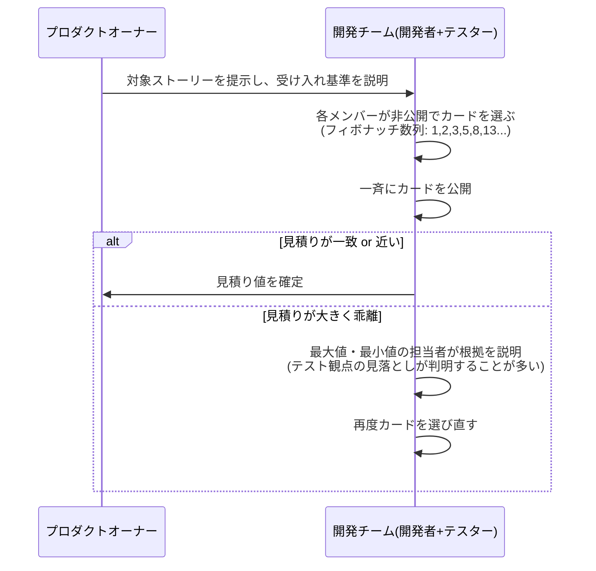

**なぜフィボナッチ数列を使うのか**: 数値が大きくなるほど間隔が広がるため、「見積りの精度は規模が大きいほど粗くなる」という現実(不確実性コーン)を自然に表現できます。テストタスク(異常系の網羅、性能検証など)は特に規模が大きくなるほど見落としが発生しやすいため、この粗さが安全側に働きます。

**見積りに影響する典型的なテスト関連要因**:

| 要因 | テスト工数への影響 |
|---|---|
| 受け入れ基準の数と複雑さ | 基準が多い・曖昧なほど工数増加 |
| 外部システムとの連携有無 | スタブ/モック作成や結合テストの工数が追加 |
| 非機能要件(性能・セキュリティ) | 専門的なテスト技法・ツール準備が必要 |
| 既存機能への影響範囲 | リグレッションテストの範囲が拡大 |
| テスト自動化の既存資産の有無 | ゼロから自動化する場合は工数が大きく増加 |
| データ準備の複雑さ | テストデータ生成・匿名化などの前処理が必要 |

**内容(Content)に基づく見積りのポイント**:
「ストーリーポイント」は本質的にはストーリー全体の複雑さ・不確実性・作業量を表す相対値であり、テストだけを別枠で見積もるのではなく、**開発・テスト・レビューを含めた「完了の定義(Definition of Done)」を満たすために必要な全作業**を含めて見積もることが、アジャイルテスト工数見積りの基本原則です。

**参考文献**:

- Mike Cohn, "Planning Poker" 解説(Mountain Goat Software): <https://www.mountaingoatsoftware.com/agile/planning-poker>
- Scrum.org, "What is Definition of Done?": <https://www.scrum.org/resources/what-definition-done>

---

## 3.3 アジャイルプロジェクトにおける技法

### 3.3.1 テスティング・クアドラント(Testing Quadrants)

**なぜ必要か**: アジャイルチームは「どのテストを」「いつ」「誰が」「何のために」実施するかを整理する共通言語を必要とします。Brian MarickのAgile Testing Matrixを基に Lisa Crispin と Janet Gregory が体系化した**テスティング・クアドラント**は、テストを2つの軸で4象限に分類するモデルです。

- **横軸**: ビジネス視点(Business-Facing) vs 技術視点(Technology-Facing)
- **縦軸**: チームを支援する(Supporting the Team) vs プロダクトを批評する(Critiquing the Product)

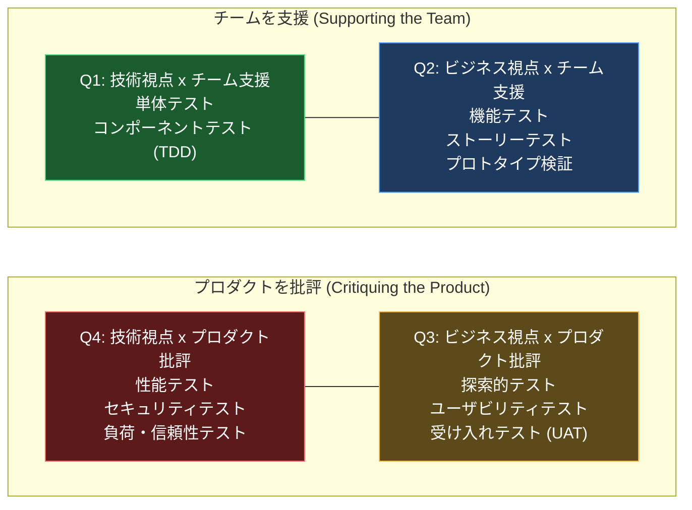

*凡例: 図の左側(Q1, Q4)が「技術視点(Technology-Facing)」、右側(Q2, Q3)が「ビジネス視点(Business-Facing)」を表し、上段(Q1, Q2)が「チームを支援」、下段(Q4, Q3)が「プロダクトを批評」を表します。*

**各象限の詳細**:

| 象限 | 名称 | 目的 | 代表的なテスト | 主な自動化可否 |
|---|---|---|---|---|
| **Q1** | 技術視点・チーム支援 | 開発を内側から支える | 単体テスト、コンポーネントテスト、コンポーネント統合テスト | 高い自動化が前提(TDD由来) |
| **Q2** | ビジネス視点・チーム支援 | 「作るべきものを正しく作っているか」を確認 | 機能テスト、ストーリーテスト、受け入れ基準の検証、プロトタイプ検証 | 自動化推奨(ATDD/BDD) |
| **Q3** | ビジネス視点・プロダクト批評 | 実際のユーザー視点で製品を評価 | 探索的テスト、ユーザビリティテスト、UAT、シナリオベースのE2Eテスト | 手動が中心(人間の判断が価値を生む) |
| **Q4** | 技術視点・プロダクト批評 | システムの非機能特性を評価 | 性能テスト、負荷テスト、セキュリティテスト、信頼性テスト、保守性テスト | 専用ツールによる自動化が中心 |

**ステップバイステップ活用法**:

1. 対象ストーリー・リリースについて、4象限それぞれに該当するテストタスクが漏れなく検討されているかチェックリストとして使う。
2. 「Q1・Q2に偏っていてQ4(非機能)が手薄」といった**テスト戦略の偏り**を可視化する。
3. スプリントレビューやリリース判定会議で、各象限の消化状況を報告し、意思決定の材料にする。

**参考文献**:

- Lisa Crispin, "Using the Agile Testing Quadrants": <https://lisacrispin.com/2011/11/08/using-the-agile-testing-quadrants/>
- Agile Alliance, "Agile Testing Quadrants": <https://www.agilealliance.org/glossary/agile-testing-quadrants/>

---

### 3.3.2 非機能テストと技術的負債の考慮

アジャイルの短いイテレーションでは、機能要件(Q2/Q3)の実装に意識が向きがちで、性能・セキュリティ・保守性といった**非機能要件(Q4)**や、応急的な実装によって蓄積する**技術的負債(Technical Debt)**が後回しにされるリスクがあります。

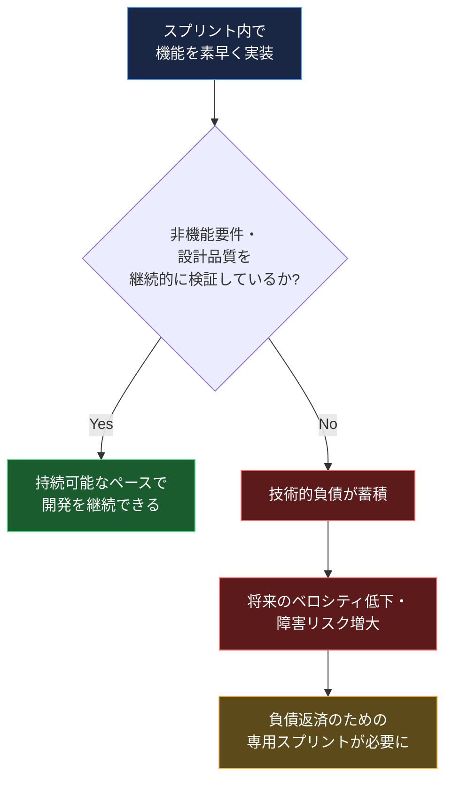

**実践上の対応策**:

1. **Definition of Doneに非機能基準を組み込む**: 「性能テストに合格」「静的解析ツールの警告ゼロ」などをストーリー完了の条件に含める。
2. **継続的インテグレーション(CI)に自動チェックを組み込む**: 単体テストと同様に、性能回帰テストやセキュリティスキャンをCIパイプラインに組み込み、負債を早期発見する(3.4.3で詳述)。
3. **技術的負債を可視化してバックログ管理する**: 「負債チケット」として明示的にバックログに登録し、プロダクトオーナーと優先順位を協議する。
4. **リファクタリングを継続的な作業として計画に含める**: TDDのRefactorステップだけでなく、スプリントの一定割合を保守性向上に充てる。

**参考文献**:

- Martin Fowler, "TechnicalDebt": <https://martinfowler.com/bliki/TechnicalDebt.html>
- Agile Alliance, "Technical Debt": <https://www.agilealliance.org/glossary/technical-debt/>

---

### 3.3.3 リグレッションテストとテスト自動化ピラミッド

イテレーションのたびに新機能を追加しながら、**既存機能が壊れていないこと**を継続的に確認する必要があります。これがリグレッションテストであり、アジャイルではその大部分を自動化に依存します。自動化戦略のバランスを示す代表的なモデルが**テスト自動化ピラミッド**です。

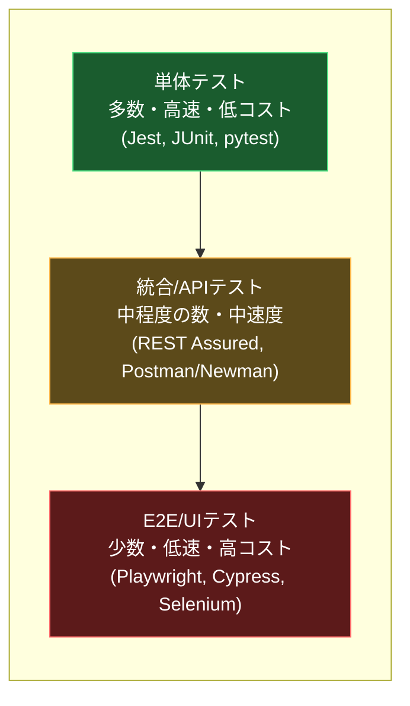

**なぜピラミッド型が推奨されるのか**:

| レイヤー | 実行速度 | 保守コスト | フィードバックの速さ | 推奨比率(目安) |
|---|---|---|---|---|
| 単体テスト | 非常に速い(ms単位) | 低い | 即座 | 全体の約60-70% |
| 統合/APIテスト | 中程度(秒単位) | 中程度 | 数分以内 | 全体の約20-30% |
| E2E/UIテスト | 遅い(分単位) | 高い(UI変更に弱い) | 数十分〜 | 全体の約5-10% |

> ⚠️ **アンチパターン「アイスクリームコーン」**: E2Eテストばかりを増やし単体テストが少ない逆三角形の構成は、実行が遅く、壊れやすく(flaky)、失敗原因の特定が困難になるため避けるべきとされています。

**リグレッションテストの選択戦略**:

1. **リスクベースの選択**: 3.2.1のリスク評価結果を用いて、高リスク領域を優先的に自動化・再実行する。
2. **変更影響分析**: バージョン管理システム(3.4.4)の差分情報から、変更されたモジュールに関連するテストを優先実行する。
3. **CI/CDへの統合**: プルリクエストごとに該当レイヤーのテストを自動実行し、マージ前に回帰を検出する(3.4.3で詳述)。

**参考文献**:

- Martin Fowler, "TestPyramid": <https://martinfowler.com/bliki/TestPyramid.html>
- Google Testing Blog, "Just Say No to More End-to-End Tests": <https://testing.googleblog.com/2015/04/just-say-no-to-more-end-to-end-tests.html>

---

### 3.3.4 探索的テスト(Exploratory Testing)

**定義**: 事前に詳細なテストケースを設計するのではなく、テスターが**学習・テスト設計・テスト実行を同時並行**で行いながら、システムに対する理解を深めつつ欠陥を発見していくアプローチ。自動化では見つけにくい「想定外の使われ方」や「体験としての違和感」を発見するのに優れています。

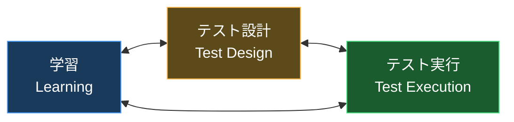

上図が示すように、探索的テストでは3つの活動が**同時に、双方向に**影響し合いながら進みます。これが事前に全テストケースを固定する「スクリプトテスト」との決定的な違いです。

**ステップバイステップ: セッションベーステストマネジメント(SBTM)**

アジャイルでは、探索的テストを場当たり的にせず、時間管理・記録・報告を伴う「セッション」単位で構造化する**Session-Based Test Management (SBTM)** がよく用いられます。

1. **チャーター(Charter)の作成**: そのセッションで探索する目的・範囲・重点を1〜2文で定義する。
   - 例: 「チェックアウト画面で、クーポン適用と配送先変更を組み合わせた際の価格計算の妥当性を調査する」
2. **タイムボックスの設定**: 通常60〜120分の固定時間を設定する。
3. **セッション実行**: チャーターに沿って自由に探索しつつ、気づいた点(発見した欠陥、追加調査が必要な事項、テスト対象の理解)をリアルタイムでメモする。
4. **セッションレポートの作成**: 以下の観点で記録する。
   - 実施した内容の要約
   - 発見した欠陥・懸念事項
   - 追加で必要なテストチャーター(派生課題)
   - 実際に探索に使った時間 vs 環境準備やバグ報告に使った時間の内訳
5. **デブリーフィング(振り返り)**: テストリードやペアと結果を共有し、次のチャーターを決める。

**探索的テストとスクリプトテストの比較**:

| 観点 | スクリプトテスト | 探索的テスト |
|---|---|---|
| テスト設計のタイミング | 実行前に事前設計 | 実行と同時に設計 |
| 再現性 | 高い(手順が固定) | 低い(都度異なる可能性) |
| 未知の欠陥発見力 | 限定的(想定内のみ) | 高い(想定外の発見に強い) |
| 必要なスキル | 手順に従う能力 | ドメイン知識・批判的思考・観察力 |
| 適した場面 | 回帰確認、規制対応の証跡が必要な場合 | 新機能の初回検証、UI/UX確認、探索的な脆弱性発見 |

**アジャイルで探索的テストが重視される理由**:
自動化された回帰テスト(3.3.3)が「既知の振る舞いの維持」を保証する一方、探索的テストは「まだ誰も気づいていない問題」を発見する役割を担います。テスティング・クアドラント(3.3.1)ではQ3(ビジネス視点・プロダクト批評)に位置づけられ、短いイテレーションの中でも**新機能に対する一次検証**として組み込まれることが多い技法です。

**参考文献**:

- James Bach, "Session-Based Test Management": <https://www.satisfice.com/sbtm>
- Ministry of Testing, "What is Exploratory Testing?": <https://www.ministryoftesting.com/dojo/lessons/what-is-exploratory-testing>
- Elisabeth Hendrickson, "Explore It!" 概要(著者サイト): <https://testobsessed.com/exploreit/>

---

## 3.4 アジャイルにおけるツール

CTFL-ATシラバスでは、アジャイルプロジェクトを支えるツールを6つのカテゴリに分類しています。ここではそれぞれの目的・代表的なツール・選定時の考慮点を、2026年時点の最新動向を交えて解説します。

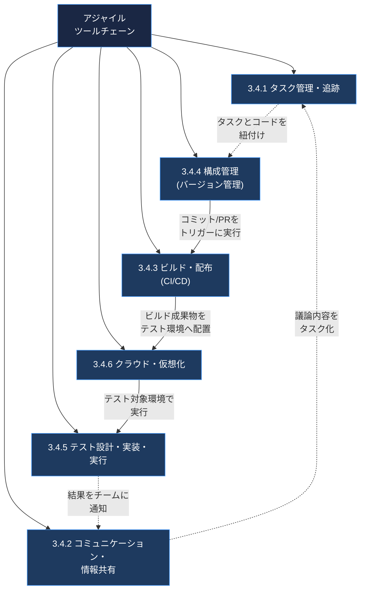

**このループが表す実践の流れ**: タスク管理ツールで計画されたストーリーが → 構成管理ツール上のコード変更として実装され → ビルド・配布ツール(CI/CD)によって自動検証・デプロイされ → クラウド・仮想化環境で稼働し → テストツールで検証され → その結果がコミュニケーションツールを通じてチームにフィードバックされ → 次のタスクに反映される、という一連の**ツールチェーン**を理解することが重要です。

---

### 3.4.1 タスク管理・追跡ツール(Task Management and Tracking Tools)

**目的**: プロダクトバックログ、スプリントバックログ、タスクボード(カンバン)を可視化し、チームの作業状況・進捗をリアルタイムに共有する。

**主要ツールと特徴(2026年時点)**:

| ツール | 特徴 | 適した規模・用途 |
|---|---|---|
| **Jira** | スクラム/カンバンボード標準搭載、豊富なプラグイン、レポート機能(バーンダウン等) | 中〜大規模、複雑なワークフローが必要なチーム |
| **Trello** | シンプルなカンバンボード、Power-Upsによる拡張 | 小規模チーム、シンプルな運用を好むチーム |
| **Azure DevOps Boards** | Microsoftエコシステムとの統合、Azure Pipelinesとの連携 | .NET/Microsoft中心の開発組織 |
| **Asana / monday.com / ClickUp** | タスク管理+コラボレーション機能を統合 | 開発以外の部門も含む横断的なチーム |

Jiraはアジャイルなソフトウェアチームが利用する代表的なプロジェクト管理ツールであり、スクラムボード、カンバンボード、ロードマップ、レポート機能や他ツールとの連携を提供する。プロジェクト管理ツールを選ぶ際は、チームの連携ニーズ、既存ツールとの統合性、導入のしやすさを評価基準とすることが推奨される。

**選定時の考慮点(ステップバイステップ)**:

1. チームの分散度合い(同一拠点か、リモート混在か)を確認する。
2. 既存の構成管理・CI/CDツールとの連携可否を確認する(例: Jira ⇔ GitHub/GitLabの課題連携)。
3. 必要なレポート(ベロシティ、バーンダウン/バーンアップチャート)が標準搭載されているか確認する。
4. チームの成熟度に合わせて過剰な機能によるオーバーヘッドを避ける。

**参考文献**:

- Atlassian, "9 best agile project management tools for your team": <https://www.atlassian.com/agile/project-management/tools>
- GeeksforGeeks, "Overview of Agile Project Management Tools": <https://www.geeksforgeeks.org/software-engineering/overview-of-agile-project-management-tools/>

---

### 3.4.2 コミュニケーション・情報共有ツール(Communication and Information Sharing Tools)

**目的**: デイリースタンドアップ、リファインメント、レトロスペクティブなどのセレモニーを支え、特にリモート/分散チームにおいて非同期・同期双方のコミュニケーションを円滑にする。ドキュメントやナレッジを蓄積するWikiも含まれる。

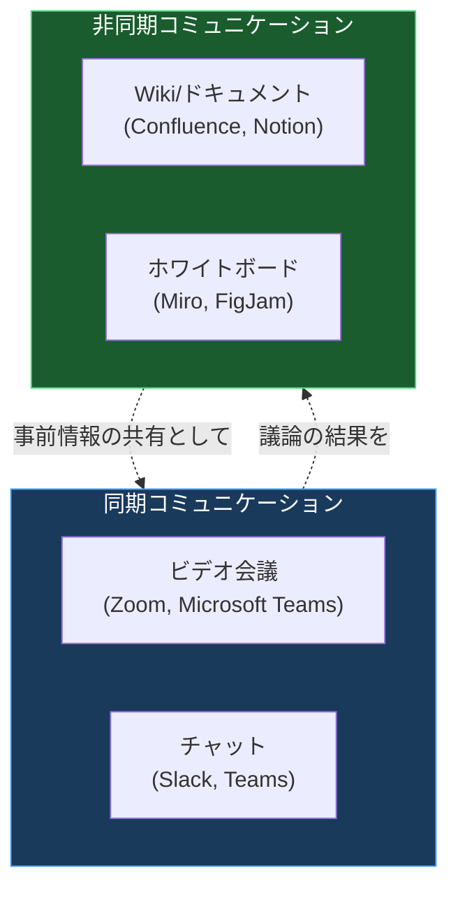

**主要ツールと特徴(2026年時点)**:

| カテゴリ | 代表ツール | 特徴 |
|---|---|---|
| チャット/インスタントメッセージング | Slack, Microsoft Teams | チャンネルやダイレクトメッセージ、スレッドによる会話の整理が可能で、コラボレーション機能はメッセージングにとどまらない |
| Wiki/ナレッジ共有 | Confluence, Notion | タグ付き・フィルタ可能なデータベースでタスクやリソース、アイデアを柔軟な表示形式で整理できる |
| ホワイトボード/可視化 | Miro, FigJam | リモートでのブレインストーミング、リファインメント時のストーリーマッピングに活用 |
| ビデオ会議 | Zoom, Microsoft Teams | デイリースタンドアップ、レトロスペクティブの実施 |

**なぜこのカテゴリが「テストツール」として扱われるのか**: アジャイルテストは個人作業ではなく**チーム全体での情報共有**が品質に直結します。欠陥情報、テスト観点の議論、探索的テストのチャーター共有などがこれらのツール上で行われるため、CTFL-ATではコミュニケーションツールも重要なテスト支援ツールの一つとして位置づけています。

**選定時の考慮点**:

1. タスク管理ツール(3.4.1)との連携(例: Slack上でJiraチケットのステータス変更を通知)を確認する。
2. 検索性(過去の議論を後から追跡できるか)を重視する。
3. 非同期コミュニケーションを前提とした分散チームでは、タイムゾーンをまたいだ情報の非同期共有(録画、要約)の仕組みを整える。

**参考文献**:

- Chanty, "10 Communication Tools in Project Management": <https://www.chanty.com/blog/project-management-communication-tools/>
- Neatro, "The Best Tools for Agile Teams": <https://www.neatro.io/blog/agile-team-tools/>

---

### 3.4.3 ソフトウェアビルド・配布ツール(Software Build and Distribution Tools)

**目的**: コードのコミットから、ビルド・自動テスト・パッケージング・環境へのデプロイまでを自動化する継続的インテグレーション/継続的デリバリー(CI/CD)のパイプラインを構築する。3.3.3の自動化ピラミッドを実行するための土台となる。

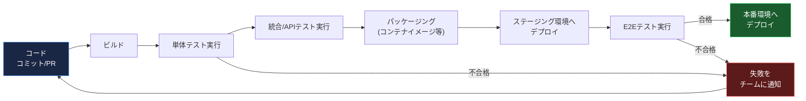

**主要ツールと2026年時点の採用動向**:

| ツール | 特徴 | 2026年時点の位置づけ |
|---|---|---|
| **GitHub Actions** | GitHubとのネイティブ統合、YAML定義、豊富なMarketplaceアクション | 組織利用でのCI/CD採用率トップ(約33%)であり、パイプライン構築の摩擦の低さが評価されている |
| **Jenkins** | 老舗のOSS自動化サーバー、1,800以上のプラグインで高い柔軟性 | 組織利用で2位(約28%)。複雑なカスタマイズやオンプレミス/エアギャップ環境を要する企業で根強い需要 |
| **GitLab CI/CD** | SCM・CI/CD・セキュリティスキャンまで含む統合DevOpsプラットフォーム | コード管理からCI/CD、セキュリティスキャン、監視、コンプライアンスまでを一つのプラットフォームで提供する「オールインワン」型として2026年時点で評価されている |
| **CircleCI** | 高速な並列実行、モノレポ対応に強み | ビルド時間短縮を優先するチーム向け |
| **Azure DevOps Pipelines** | Microsoftエコシステムとの統合 | .NET中心の組織で採用 |

**ツール選定の判断フロー**:

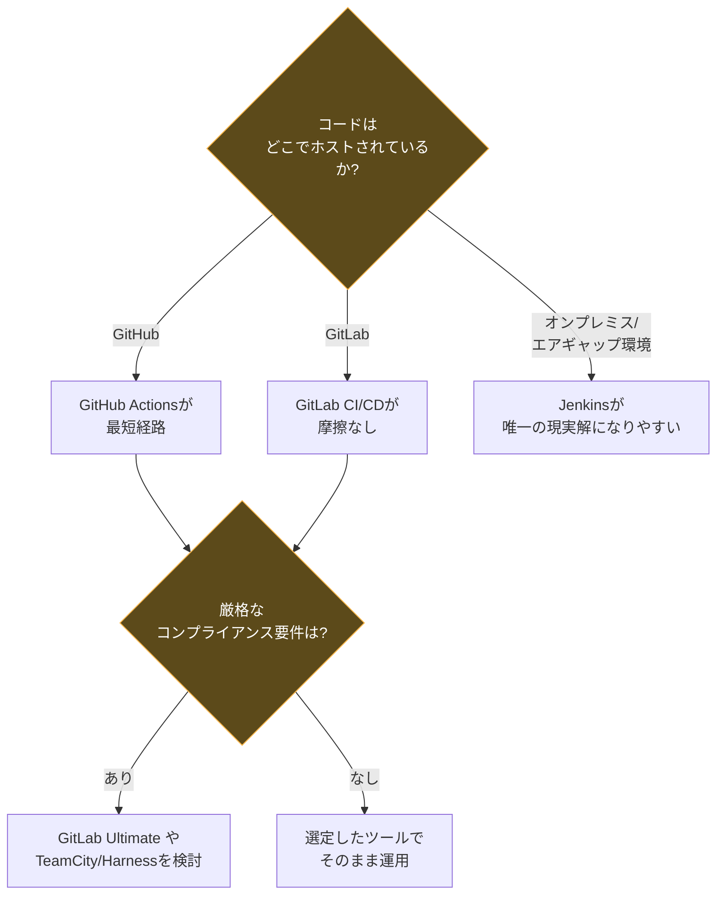

**参考文献**:

- Let's Talk DevOps, "Best CI/CD Tools Comparison 2026": <https://devopstales.com/devops/best-ci-cd-tools-comparison-2026/>
- EITT, "Jenkins vs GitHub Actions vs GitLab CI — 2026 verdict": <https://eitt.academy/knowledge-base/jenkins-vs-github-actions-vs-gitlab-ci-cicd-2026/>
- JetBrains Blog, "Best CI/CD Tools for 2026": <https://blog.jetbrains.com/teamcity/2026/03/best-ci-tools/>

---

### 3.4.4 構成管理ツール(Configuration Management Tools)

**目的**: ソースコード、テストウェア、環境設定、ビルド成果物など、変化するあらゆる成果物の**バージョン・変更履歴・依存関係**を管理する。アジャイルの頻繁な変更に耐えるための基盤technology。

**中心となるのはバージョン管理システム(Git)であり、ブランチ戦略がチームの開発フローを規定します。**

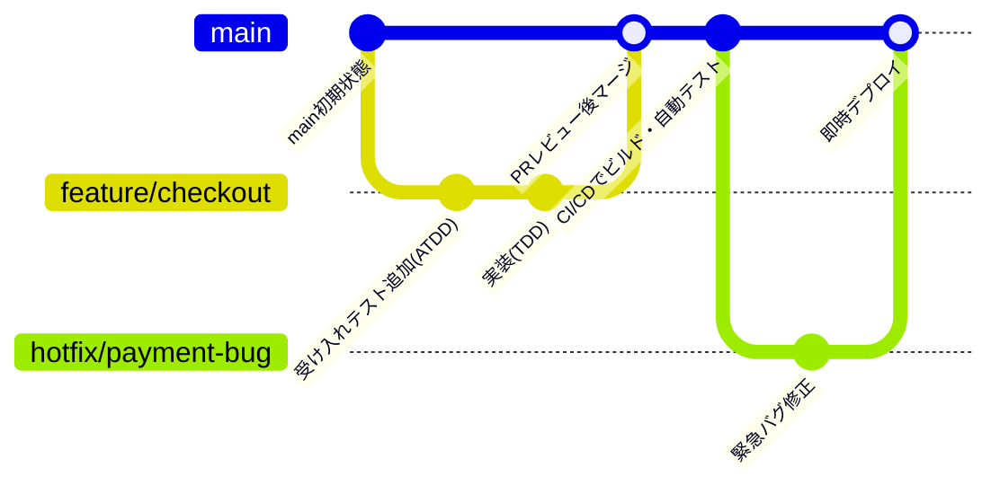

**構成管理が支える3つの領域**:

| 領域 | 具体例 | アジャイルにおける意味 |
|---|---|---|
| ソースコード管理 | Git(GitHub, GitLab, Bitbucket) | 頻繁なコミット・ブランチ・マージを支える |
| テストウェア管理 | テストコード、テストデータ、`.feature`ファイルもコードと同様にバージョン管理する | BDDシナリオ(3.1.3)を本体コードと同じリポジトリで履歴管理 |
| 環境構成管理 | Infrastructure as Code(Terraform, Ansible)、コンテナ定義(Dockerfile) | 環境差異による「私の環境では動く」問題を防止(3.4.6と連携) |

**ブランチ戦略の比較(アジャイルでよく使われる代表例)**:

| 戦略 | 特徴 | 適した場面 |
|---|---|---|
| **トランクベース開発** | 短命なブランチのみを許容し、頻繁にmain(トランク)へマージ | 高頻度リリース、CI/CDが成熟したチーム |
| **GitHub Flow** | mainブランチ+フィーチャーブランチ+PRレビューのシンプルな流れ | 継続的デプロイを行うWebサービス開発 |
| **Git Flow** | develop/feature/release/hotfixなど役割別ブランチを持つ | リリースサイクルが長い・バージョン管理が厳格な製品 |

**参考文献**:

- Atlassian, "Git Branching Strategies": <https://www.atlassian.com/git/tutorials/comparing-workflows>
- trunk-based development公式サイト: <https://trunkbaseddevelopment.com/>

---

### 3.4.5 テスト設計・実装・実行ツール(Test Design, Implementation, and Execution Tools)

**目的**: 3.1〜3.3で解説した各種テスト技法(TDD/BDD/自動化ピラミッドの各層/探索的テスト)を実際に実行するための専用ツール群。

**Webブラウザ自動化ツールの比較(2026年時点)**:

| ツール | アーキテクチャ | 対応言語 | 強み | 弱み |
|---|---|---|---|---|
| **Playwright** | ブラウザへ直接接続(WebSocketベース) | JS/TS, Python, .NET, Java | 週間npmダウンロード数は約3,000万に達し、Cypressの約650万を大きく上回っている。並列実行が標準搭載でコンテナ環境でのコスト効率も高い | 比較的新しく、ブラウザベンダーのAPI変更への追従が必要 |
| **Cypress** | ブラウザのJSランタイム内で直接実行 | JavaScript/TypeScript | 開発者体験(DX)に優れ、デバッグが直感的 | Chromium系ブラウザのみ対応で、FirefoxやSafariは標準サポート外 |
| **Selenium** | WebDriverプロトコル経由でブラウザを外部制御 | Java, Python, C#, JavaScript, Ruby等 | 31,000社以上が利用し約22%の市場シェアを持つなど、最も広い言語・ブラウザ互換性を持つ。Appium連携でネイティブモバイルにも対応 | プロトコルのオーバーヘッドで実行速度がやや劣る |

**選定フローチャート**:

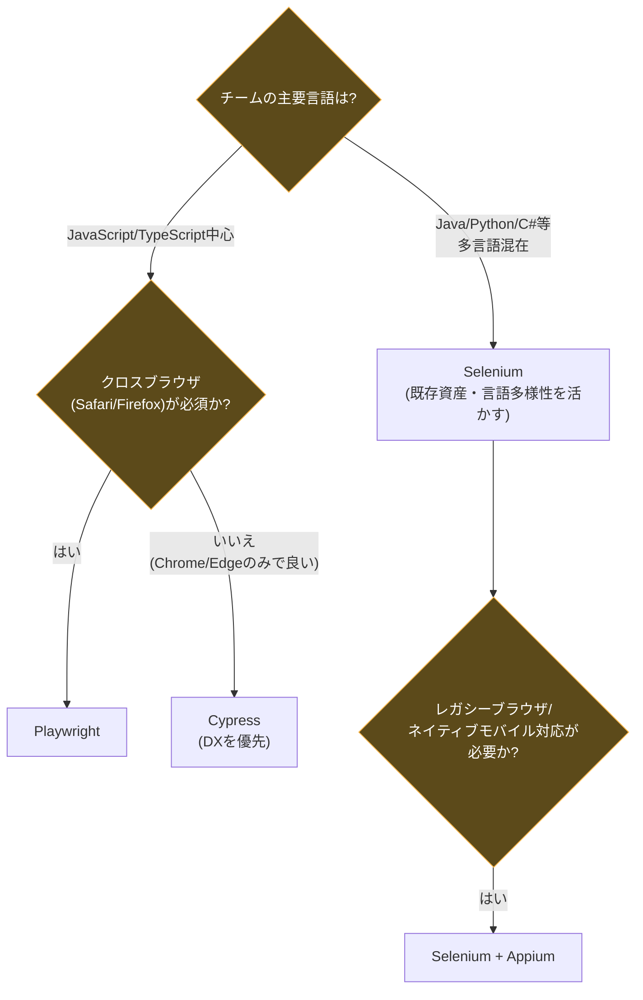

**テスト管理・その他関連ツールのカテゴリ**:

| カテゴリ | 目的 | 代表例 |
|---|---|---|
| テスト管理ツール | テストケース管理、実行結果の追跡、要件とのトレーサビリティ | TestRail, Xray(Jira連携), Zephyr |
| APIテストツール | REST/GraphQL APIの機能・契約テスト | Postman, REST Assured, Karate |
| モバイル自動化 | ネイティブ/ハイブリッドアプリの自動操作 | Appium |
| 静的解析ツール | コード品質・セキュリティ脆弱性の早期発見(3.3.2と連携) | SonarQube, ESLint |
| 探索的テスト支援 | セッション記録、バグ報告の効率化(3.3.4と連携) | qTest Explorer, Session Tester |

**参考文献**:

- Tech Insider, "Playwright vs Cypress vs Selenium: 30M vs 6.5M Downloads": <https://tech-insider.org/playwright-vs-cypress-vs-selenium-2026/>
- Quash, "Best Test Automation Tools 2026": <https://quashbugs.com/blog/best-test-automation-tools-2026-playwright-vs-selenium-vs-cypress-vs-appium>
- Master Software Testing, "Selenium vs Playwright vs Cypress: Complete Comparison Guide for 2026": <https://mastersoftwaretesting.com/automation-academy/ui-automation/selenium-vs-playwright-vs-cypress>

---

### 3.4.6 クラウドコンピューティング・仮想化ツール(Cloud Computing and Virtualization Tools)

**目的**: テスト環境の迅速な構築・破棄、本番同等環境でのテスト実行、スケーラブルなテスト実行基盤の提供。アジャイルの「頻繁なリリース」を支えるインフラ技術。

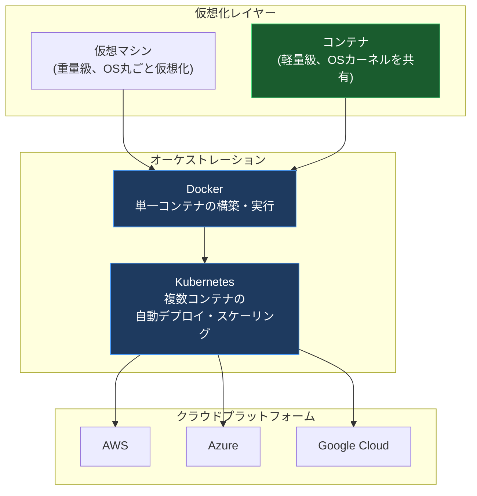

**アジャイルテストにおける活用場面**:

| 活用場面 | 説明 |
|---|---|
| **使い捨てテスト環境** | コンテナでテスト対象+依存サービス(DB等)を毎回クリーンな状態で起動し、テスト間の状態汚染を防ぐ |
| **並列テスト実行によるスケーリング** | クラウド上で多数のテストランナー(コンテナ/VM)を並列起動し、E2Eテストの実行時間を短縮 |
| **本番同等環境の再現** | Infrastructure as Codeでステージング環境を本番と同一構成にし、環境差異に起因する欠陥の見逃しを防ぐ |
| **ネットワーク・障害注入テスト** | クラウドの機能やChaos Engineeringツールを用い、非機能テスト(3.3.2 Q4)の一環として障害耐性を検証 |

**CI/CDとの統合(3.4.3との関係)**:
現代のCI/CDパイプラインでは、GitHub Actions・GitLab CI・Jenkinsのいずれも、テスト実行時にDockerコンテナを起動し、その中でSelenium/Playwright(3.4.5)を実行するという構成が一般的です。クラウドネイティブなエンジニアリング組織における2026年時点で最も一般的なアーキテクチャは、CIでコンテナイメージをビルド・テストし、ArgoCDのようなCDツールがGitの変更を検知してクラスタに反映するという構成である。

**参考文献**:

- Opsio, "CI/CD Pipeline Tools Compared": <https://opsiocloud.com/blogs/ci-cd-pipeline-tools-jenkins-github-actions-gitlab-argocd/>
- Docker公式ドキュメント: <https://docs.docker.com/>
- Kubernetes公式ドキュメント: <https://kubernetes.io/docs/home/>

---

## 4. Chapter 3 全体の振り返り

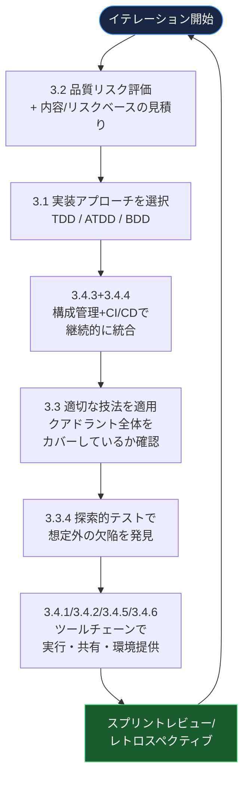

このように、Chapter 3の各節は独立した知識ではなく、**1つのイテレーションを回すための一貫したサイクル**として理解することが、CTFL-ATの学習における最大のポイントです。

---

## 5. 学習チェックリスト(K-レベル別)

ISTQBシラバスは学習目標を認知レベル(K1: 記憶、K2: 理解、K3: 適用)で分類しています。以下は本章の内容に対する自己チェック用リストです。

| # | チェック項目 | レベル目安 | 完了 |
|---|---|---|---|
| 1 | TDD・ATDD・BDDそれぞれの目的と違いを説明できる | K2 | ☐ |
| 2 | Red-Green-Refactorサイクルを実際のコード例で示せる | K3 | ☐ |
| 3 | Three Amigosセッションの進め方を説明できる | K2 | ☐ |
| 4 | Given-When-Then形式でシナリオを自分で書ける | K3 | ☐ |
| 5 | アジャイルにおける品質リスク評価の進め方を説明できる | K2 | ☐ |
| 6 | リスクレベルに応じたテスト深度の判断ができる | K3 | ☐ |
| 7 | プランニングポーカーによる見積りプロセスを説明できる | K2 | ☐ |
| 8 | テスティング・クアドラントの4象限を図示し分類できる | K3 | ☐ |
| 9 | 技術的負債がアジャイル開発に与える影響を説明できる | K2 | ☐ |
| 10 | テスト自動化ピラミッドの各層の役割と比率を説明できる | K2 | ☐ |
| 11 | 探索的テストとスクリプトテストの違いを説明できる | K2 | ☐ |
| 12 | セッションベーステストマネジメントの手順を実践できる | K3 | ☐ |
| 13 | 3.4の6つのツールカテゴリをそれぞれ具体例と共に列挙できる | K1 | ☐ |
| 14 | CI/CDパイプラインの一連の流れを図示できる | K2 | ☐ |
| 15 | Git構成管理と自動化ピラミッド・CI/CDの関係を説明できる | K2 | ☐ |

---

## 6. 実践演習(サンプル問題)

以下はCTFL-AT試験形式を模した練習問題です(選択式・K2/K3レベル相当)。実際の出題形式・難易度は必ず公式サンプル問題でご確認ください。

**Q1.** あるチームが、ユーザーストーリーの実装着手前にプロダクトオーナー・開発者・テスターの三者でセッションを行い、受け入れ基準を明文化してから実装に入っている。この手法の名称として最も適切なものはどれか。

A. Test-Driven Development (TDD)
B. Acceptance Test-Driven Development (ATDD)
C. Session-Based Test Management (SBTM)
D. 探索的テスト

<details>
<summary>解答を見る</summary>

**正解: B**
実装前に三者(Three Amigos)が協働して受け入れ基準を合意するプロセスはATDDの特徴です。TDDは開発者主導で単体テストを先に書く手法であり、SBTMと探索的テストはテスト実行段階の技法です。
</details>

---

**Q2.** テスティング・クアドラントにおいて、性能テストやセキュリティテストが分類される象限はどれか。

A. Q1(技術視点・チーム支援)
B. Q2(ビジネス視点・チーム支援)
C. Q3(ビジネス視点・プロダクト批評)
D. Q4(技術視点・プロダクト批評)

<details>
<summary>解答を見る</summary>

**正解: D**
性能・セキュリティ・負荷・信頼性テストは「技術視点」かつ「プロダクトを批評する」性質を持つため、Q4に分類されます。
</details>

---

**Q3.** テスト自動化ピラミッドにおいて、実行速度が最も速く、最も多くのテストを配置すべき層はどれか。

A. E2E/UIテスト層
B. 統合/APIテスト層
C. 単体テスト層
D. 探索的テスト層

<details>
<summary>解答を見る</summary>

**正解: C**
単体テストは実行速度が最も速く保守コストが低いため、ピラミッドの土台として最も多く配置することが推奨されます。なお探索的テストはピラミッドの構成要素(自動テスト)には含まれません。
</details>

---

**Q4.** チームがコードのコミットからテスト実行・パッケージング・デプロイまでを自動化したいと考えている。このために導入すべきツールカテゴリとして最も適切なものはどれか。

A. タスク管理・追跡ツール
B. コミュニケーション・情報共有ツール
C. ソフトウェアビルド・配布ツール(CI/CDツール)
D. クラウドコンピューティング・仮想化ツール

<details>
<summary>解答を見る</summary>

**正解: C**
コミットからビルド・テスト・デプロイまでの自動化はCI/CDツール(ソフトウェアビルド・配布ツール)の役割です。クラウド・仮想化ツールはその実行基盤を提供しますが、パイプライン自体の自動化機能ではありません。
</details>

---

## 7. 参考文献・URL一覧(節ごとの一次情報源)

本ガイド内で言及したすべてのURLを、節ごとに再掲します。

### 公式シラバス・認定資格情報

| 出典 | URL |
|---|---|
| ISTQB® CTFL-AT certification概要ページ | <https://istqb.org/certifications/certified-tester-foundation-level-agile-tester-ctfl-at/> |
| ISTQB® CTFL-AT シラバスPDFダウンロード | <https://istqb.org/?sdm_process_download=1&download_id=3647> |
| ISTQB®公式サイト(資格体系全体) | <https://istqb.org/> |

### 3.1 アジャイルテスト手法(TDD/ATDD/BDD)

| 出典 | URL |
|---|---|
| Agile Alliance, "TDD" 用語解説 | <https://www.agilealliance.org/glossary/tdd/> |
| Martin Fowler, "TestDrivenDevelopment" | <https://martinfowler.com/bliki/TestDrivenDevelopment.html> |
| Agile Alliance, "ATDD" 用語解説 | <https://www.agilealliance.org/glossary/atdd/> |
| Ministry of Testing, "Three Amigos" | <https://www.ministryoftesting.com/dojo/lessons/three-amigos> |
| Cucumber公式ドキュメント, "Gherkin Reference" | <https://cucumber.io/docs/gherkin/reference/> |
| Dan North, "What's in a Story?" | <https://dannorth.net/whats-in-a-story/> |
| Agile Alliance, "BDD" 用語解説 | <https://www.agilealliance.org/glossary/bdd/> |

### 3.2 品質リスク評価とテスト工数見積り

| 出典 | URL |
|---|---|
| RBCS (Rex Black), "Risk-Based Testing" | <https://www.rbcs-us.com/resources/articles/risk-based-testing/> |
| Agile Alliance, "Risk-Based Testing" | <https://www.agilealliance.org/glossary/risk-based-testing/> |
| Mountain Goat Software, "Planning Poker" | <https://www.mountaingoatsoftware.com/agile/planning-poker> |
| Scrum.org, "What is Definition of Done?" | <https://www.scrum.org/resources/what-definition-done> |

### 3.3 アジャイルプロジェクトにおける技法

| 出典 | URL |
|---|---|
| Lisa Crispin, "Using the Agile Testing Quadrants" | <https://lisacrispin.com/2011/11/08/using-the-agile-testing-quadrants/> |
| Agile Alliance, "Agile Testing Quadrants" | <https://www.agilealliance.org/glossary/agile-testing-quadrants/> |
| Martin Fowler, "TechnicalDebt" | <https://martinfowler.com/bliki/TechnicalDebt.html> |
| Agile Alliance, "Technical Debt" | <https://www.agilealliance.org/glossary/technical-debt/> |
| Martin Fowler, "TestPyramid" | <https://martinfowler.com/bliki/TestPyramid.html> |
| Google Testing Blog, "Just Say No to More End-to-End Tests" | <https://testing.googleblog.com/2015/04/just-say-no-to-more-end-to-end-tests.html> |
| James Bach (Satisfice), "Session-Based Test Management" | <https://www.satisfice.com/sbtm> |
| Ministry of Testing, "What is Exploratory Testing?" | <https://www.ministryoftesting.com/dojo/lessons/what-is-exploratory-testing> |
| Elisabeth Hendrickson, "Explore It!" | <https://testobsessed.com/exploreit/> |

### 3.4 アジャイルにおけるツール

| 出典 | URL |
|---|---|
| Atlassian, "9 best agile project management tools" | <https://www.atlassian.com/agile/project-management/tools> |
| GeeksforGeeks, "Overview of Agile Project Management Tools" | <https://www.geeksforgeeks.org/software-engineering/overview-of-agile-project-management-tools/> |
| Chanty, "10 Communication Tools in Project Management" | <https://www.chanty.com/blog/project-management-communication-tools/> |
| Neatro, "The Best Tools for Agile Teams" | <https://www.neatro.io/blog/agile-team-tools/> |
| Let's Talk DevOps, "Best CI/CD Tools Comparison 2026" | <https://devopstales.com/devops/best-ci-cd-tools-comparison-2026/> |
| EITT, "Jenkins vs GitHub Actions vs GitLab CI — 2026 verdict" | <https://eitt.academy/knowledge-base/jenkins-vs-github-actions-vs-gitlab-ci-cicd-2026/> |
| JetBrains Blog, "Best CI/CD Tools for 2026" | <https://blog.jetbrains.com/teamcity/2026/03/best-ci-tools/> |
| Atlassian, "Comparing Workflows"(ブランチ戦略) | <https://www.atlassian.com/git/tutorials/comparing-workflows> |
| Trunk Based Development 公式サイト | <https://trunkbaseddevelopment.com/> |
| Tech Insider, "Playwright vs Cypress vs Selenium 2026" | <https://tech-insider.org/playwright-vs-cypress-vs-selenium-2026/> |
| Quash, "Best Test Automation Tools 2026" | <https://quashbugs.com/blog/best-test-automation-tools-2026-playwright-vs-selenium-vs-cypress-vs-appium> |
| Master Software Testing, "Selenium vs Playwright vs Cypress" | <https://mastersoftwaretesting.com/automation-academy/ui-automation/selenium-vs-playwright-vs-cypress> |
| Opsio, "CI/CD Pipeline Tools Compared" | <https://opsiocloud.com/blogs/ci-cd-pipeline-tools-jenkins-github-actions-gitlab-argocd/> |
| Docker 公式ドキュメント | <https://docs.docker.com/> |
| Kubernetes 公式ドキュメント | <https://kubernetes.io/docs/home/> |

---

## 8. 次のステップ

本章の内容を実務に定着させるための推奨アクション:

1. **チームでテスティング・クアドラント(3.3.1)の棚卸しをする**: 直近のリリースで実施したテストを4象限に分類し、偏りがないか確認する。
2. **1つのユーザーストーリーでATDD/BDDを試す**: Three Amigosセッションを実際に開催し、Gherkinシナリオを1本書いてみる。
3. **CI/CDパイプラインの現状を可視化する**: 3.4.3のフロー図を自チームのパイプラインに置き換えて描いてみて、ボトルネックを特定する。
4. **探索的テストのチャーターを1つ作成し、60分のセッションを実施してみる**(3.3.4)。
5. **公式サンプル問題で理解度を確認する**: <https://istqb.org/> の Exam Resources セクションから最新のサンプル問題を入手する。
