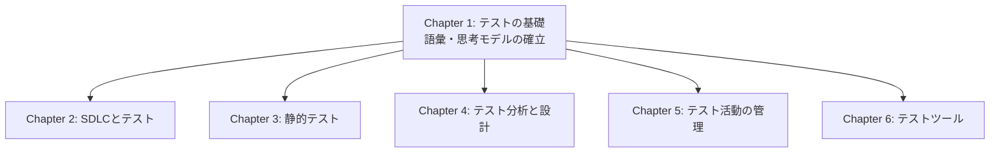
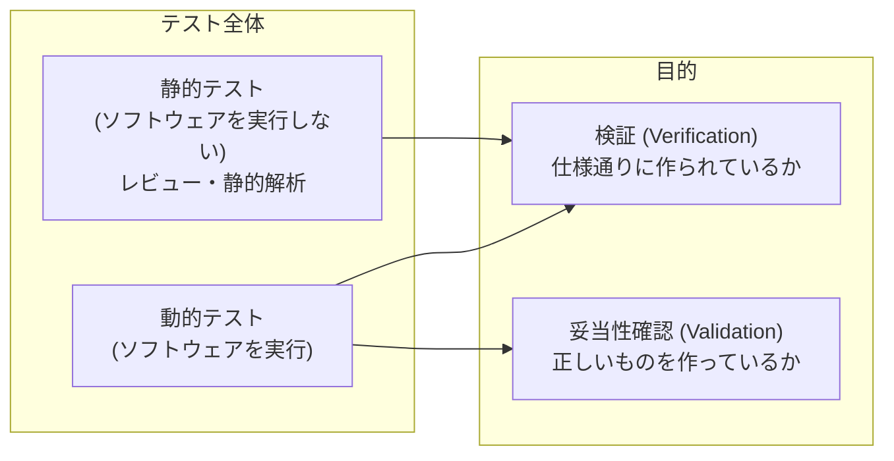
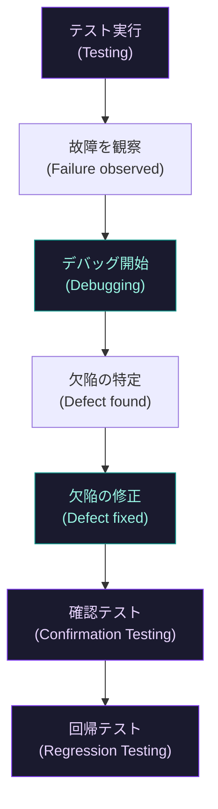
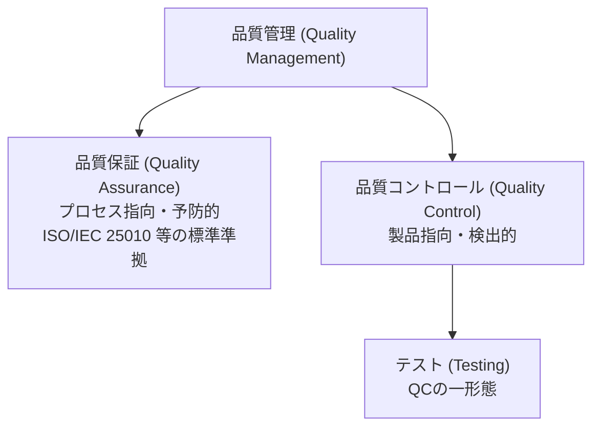
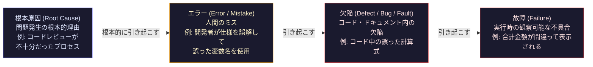
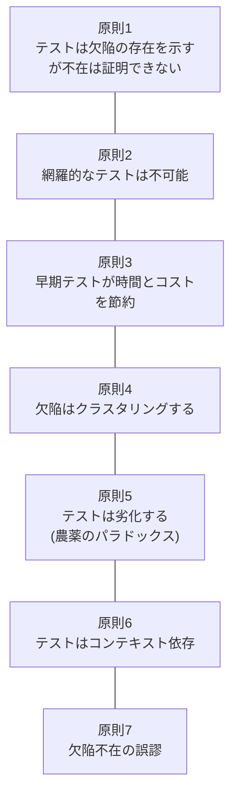
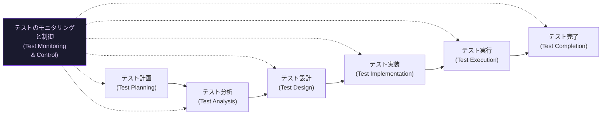
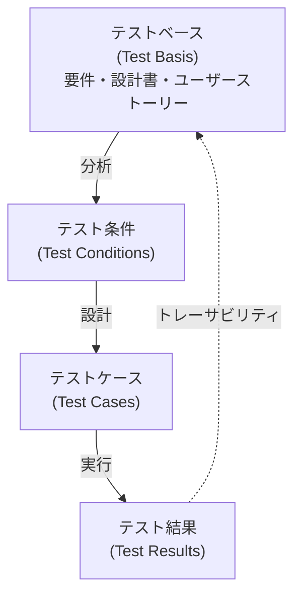
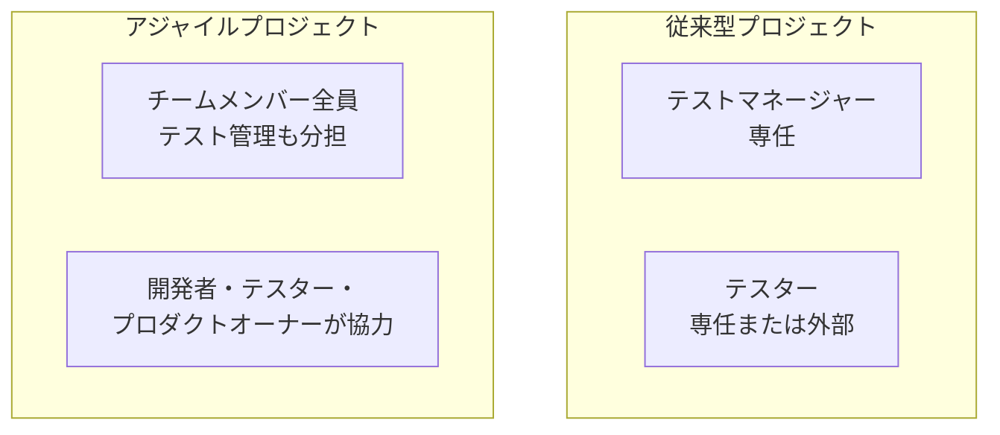
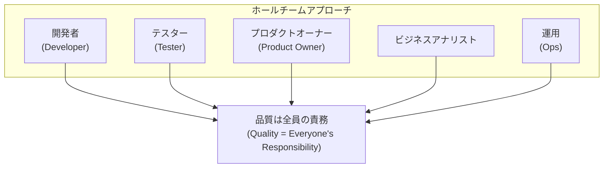

# ISTQB CTFL v4.0 Chapter 1: テストの基礎

## 中級者〜上級者向け完全解説ガイド

> **対象バージョン:** ISTQB Certified Tester Foundation Level Syllabus v4.0.1 (2024-09-15)
> **試験配点:** Chapter 1 = 8問 / 40問 (K1×2, K2×6)
> **学習目安時間:** 180分

---

## 目次

1. [Chapter 1 の全体像と学習目標](#1-chapter-1-の全体像と学習目標)
2. [1.1 テストとは何か (What is Testing?)](#2-11-テストとは何か)
3. [1.2 テストはなぜ必要か (Why is Testing Necessary?)](#3-12-テストはなぜ必要か)
4. [1.3 テストの原則 (Testing Principles)](#4-13-テストの原則-7原則)
5. [1.4 テスト活動・テストウェア・テストの役割](#5-14-テスト活動テストウェアテストの役割)
6. [1.5 テストに必要な本質的スキルと良い実践](#6-15-テストに必要な本質的スキルと良い実践)
7. [用語集](#7-用語集)
8. [試験対策チェックリスト](#8-試験対策チェックリスト)
9. [参照リソース](#9-参照リソース)

---

## 1. Chapter 1 の全体像と学習目標

### 1.1 シラバスにおける位置づけ

Chapter 1 は CTFL v4.0 全体の「語彙と思考モデル」を提供する章です。ここで定義される用語は Chapter 2〜6 全体で繰り返し使用されるため、理解の甘さが後続章の習得に直接影響します。

### 1.2 学習目標 (Learning Objectives) 一覧

| LO ID | 認知レベル | 内容 |
|---|---|---|
| FL-1.1.1 | K1 | 典型的なテスト目標を識別する |
| FL-1.1.2 | K2 | テストとデバッグを区別する |
| FL-1.2.1 | K2 | テストが必要な理由を例示する |
| FL-1.2.2 | K1 | テストと品質保証の関係を説明する |
| FL-1.2.3 | K2 | 根本原因・エラー・欠陥・故障を区別する |
| FL-1.3.1 | K2 | 7つのテスト原則を説明する |
| FL-1.4.1 | K2 | 各テスト活動とタスクを説明する |
| FL-1.4.2 | K2 | コンテキストがテストプロセスに与える影響を説明する |
| FL-1.4.3 | K2 | テスト活動を支えるテストウェアを区別する |
| FL-1.4.4 | K2 | トレーサビリティ維持の価値を説明する |
| FL-1.4.5 | K2 | テストにおける異なるロールを比較する |
| FL-1.5.1 | K2 | テストに必要な汎用スキルの例を示す |
| FL-1.5.2 | K1 | ホールチームアプローチの利点を説明する |
| FL-1.5.3 | K2 | テストの独立性のメリット・デメリットを区別する |

> K1 = 記憶 (Remember) / K2 = 理解 (Understand) / K3 = 適用 (Apply)

---

## 2. 1.1 テストとは何か

### 2.1 テストの定義

CTFL v4.0 では、ソフトウェアテストを次のように定義しています。

> **ソフトウェアテスト**とは、欠陥を発見し、ソフトウェア作業成果物の品質を評価するための一連の活動である。

#### 重要な視点の転換

従来の「テスト = ソフトウェアを実行して結果を確認する」という認識は **誤解** です。v4.0 ではテストを以下の2次元で捉えます。

| 次元 | 種別 | 説明 |
|---|---|---|
| 実行有無 | **動的テスト (Dynamic Testing)** | ソフトウェアを実際に実行して行うテスト |
| 実行有無 | **静的テスト (Static Testing)** | ソフトウェアを実行せずに行うテスト（レビュー・静的解析） |
| 目的 | **検証 (Verification)** | システムが仕様を満たすかを確認する ("Are we building the product right?") |
| 目的 | **妥当性確認 (Validation)** | システムがユーザーのニーズを満たすかを確認する ("Are we building the right product?") |

### 2.2 テスト目標 (Test Objectives)

v4.0 で定義される典型的なテスト目標は以下の9つです。試験では「どのシナリオがどのテスト目標に該当するか」を問う問題が出題されます。

| # | テスト目標 | 実務例 |
|---|---|---|
| 1 | 要件・ユーザーストーリー・設計・コードなどの作業成果物の評価 | 要件レビューで曖昧な仕様を検出する |
| 2 | 故障を引き起こし欠陥を発見する | 境界値テストでクラッシュを再現する |
| 3 | テスト対象の必要なカバレッジを確保する | 命令カバレッジ 100% を達成する |
| 4 | 不十分なソフトウェア品質のリスクレベルを低減する | リスクベーステストで重要機能を優先する |
| 5 | 指定要件が満たされているかを検証する | 受け入れ基準に対するシステムテスト |
| 6 | 契約・法的・規制上の要件への準拠を検証する | 医療機器のFDA規制適合確認 |
| 7 | 意思決定に必要な情報をステークホルダーに提供する | テスト進捗レポートでリリース可否を判断 |
| 8 | テスト対象の品質への信頼を構築する | 本番リリース前の回帰テスト合格 |
| 9 | テスト対象が完全でステークホルダーの期待通りに動作するかを妥当性確認する | UAT（ユーザー受け入れテスト）実施 |

### 2.3 テストとデバッグの違い (FL-1.1.2)

これは試験頻出の区別です。

| 活動 | 担当 | 目的 |
|---|---|---|
| **テスト (Testing)** | テスター | 故障を引き起こす / 欠陥を直接発見する |
| **デバッグ (Debugging)** | 開発者 | 故障の原因（欠陥）を見つけて修正する |

> **ポイント:** テストは「症状」を見つける活動。デバッグは「原因」を見つけて排除する活動。異なる人が行うのが原則です。

#### デバッグの典型的なプロセス

1. 故障の再現 (Reproduction of a failure)
2. 診断：欠陥の特定 (Diagnosis / finding the defect)
3. 欠陥の修正 (Fixing the defect)

修正後は **確認テスト (Confirmation Testing)** で修正が効いたかを確認し、さらに **回帰テスト (Regression Testing)** で修正が他の箇所に悪影響を与えていないかを確認します。

---

## 3. 1.2 テストはなぜ必要か

### 3.1 テストの貢献 (FL-1.2.1)

ソフトウェアは現代社会に深く組み込まれており、障害が発生すると金銭的損失・時間損失・ブランド毀損、最悪の場合は人命に関わる問題が生じます。テストは以下の観点でプロジェクト成功に貢献します。

| 貢献領域 | 具体的価値 |
|---|---|
| 欠陥の早期発見 | 後工程で発見するよりも修正コストが大幅に低い |
| リスク低減 | 本番障害の発生確率を下げる |
| 意思決定支援 | リリース可否判断のための客観的データを提供 |
| 品質評価 | 現状の品質レベルを定量的に示す |
| コンプライアンス | 規制・契約要件への適合を証明 |

### 3.2 テストと品質保証 (QA) の関係 (FL-1.2.2)

v4.0 でよく混同される重要な概念の区別です。

| 観点 | 品質保証 (QA) | テスト (Testing) |
|---|---|---|
| 定義 | 品質要件が満たされるという信頼を提供することに焦点を当てたプロセス指向の活動 | 品質を評価し欠陥を発見するための活動 |
| 種別 | プロアクティブ（予防的） | リアクティブ（検出的） |
| 対象 | プロセス全体 | 特定の作業成果物・製品 |
| 位置づけ | より広い品質管理 (QM) の一部 | 品質管理 (QC) の一形態 |

### 3.3 エラー・欠陥・故障・根本原因 (FL-1.2.3)

CTFL v4.0 試験で最も頻繁に問われる概念の一つです。ISO/IEC/IEEE 29119 標準と整合した定義を使用します。

| 用語 | 英語 | 定義 | 実例（ECサイト購入処理） |
|---|---|---|---|
| **エラー** | Error / Mistake | 誤った結果を生み出す人間の行為 | 開発者が税率の計算ロジックを逆に実装 |
| **欠陥** | Defect / Bug / Fault | コンポーネントや成果物の不備 | コード中の `tax * price` が `price / tax` になっている |
| **故障** | Failure | テスト対象が期待した範囲で動作しないこと | 決済確認画面で表示金額が正しくない |
| **根本原因** | Root Cause | 問題発生の根本的な理由 | 要件定義書に税率の取り扱い仕様が記載されていなかった |

> **試験の罠:** 「テストが欠陥を見つけた」ではなく、正確には「テストが故障を観察し、そこから欠陥を推定した」です。テストは出力（故障）を見るのであって、コード（欠陥）を直接見ているわけではありません。

#### 根本原因分析の重要性

根本原因分析 (Root Cause Analysis) を実施することで、類似した故障や欠陥の将来的な発生を **防止** できます。これはテストの「欠陥予防」という目標に直結します。

---

## 4. 1.3 テストの原則 (7原則)

v4.0 で定義される7つのテスト原則は、すべてのテスト活動に適用される汎用ガイドラインです。試験では「このシナリオはどの原則に該当するか」という適用問題が出ます。

### 原則 1: テストは欠陥の存在を示すが、欠陥の不在は証明できない

- テストで欠陥が見つかったとしても、すべての欠陥が発見されたとは言えない
- テストに合格しても「欠陥ゼロ」の証明にはならない
- **実務的意味:** リリース判断はテスト結果 + リスク評価の総合判断が必要

### 原則 2: 網羅的なテストは不可能 (Exhaustive testing is impossible)

- 境界値・入力値の組み合わせ・実行パスをすべてテストすることは（小規模なケースを除き）現実的でない
- **対策:** リスクと優先度に基づいてテスト範囲を絞り込む（リスクベーステスト）

### 原則 3: 早期テストが時間とコストを節約 (Early testing saves time and money)

- 欠陥の発見が遅れるほど修正コストは指数的に増大する
- 要件フェーズで見つけた欠陥の修正コスト vs 本番で見つけた場合の差は10〜100倍になることもある

| フェーズ | 修正コストの相対値 |
|---|---|
| 要件定義 | 1× |
| 設計 | 3〜6× |
| 実装 | 10× |
| テスト | 15〜40× |
| 本番リリース後 | 40〜1000× |

### 原則 4: 欠陥はクラスタリングする (Defects cluster together)

- 少数のモジュールやコンポーネントに欠陥が集中する傾向がある（パレートの法則）
- **実務的意味:** 過去に欠陥が多く見つかった箇所を重点的にテストする

### 原則 5: テストは劣化する (Tests wear out) — 農薬のパラドックス

- 同じテストを繰り返すと、新たな欠陥を発見する能力が低下する
- **対策:** テストケースを定期的に見直し、新しいテストを追加する
- **例外:** 自動化された回帰テストは目的が「既知の動作確認」なので、繰り返しても有効

### 原則 6: テストはコンテキスト依存 (Testing is context dependent)

- 普遍的に通用するテストアプローチは存在しない
- 安全クリティカルシステム vs ECサイト、ウォーターフォール vs アジャイルで最適な手法が異なる

| コンテキスト例 | テストの特徴 |
|---|---|
| 医療機器（安全クリティカル） | 形式的な文書・高い独立性・規制準拠 |
| スタートアップのWebアプリ | 探索的テスト・CI/CD統合・スピード優先 |
| 金融システム | セキュリティ・パフォーマンス・コンプライアンス重視 |
| 組み込みシステム | リアルタイム制約・ハードウェア連携テスト |

### 原則 7: 欠陥不在の誤謬 (Absence-of-defects fallacy)

- テストに全合格しても、ユーザーのニーズを満たすシステムが出来上がるとは限らない
- **具体例:** バグのない給与計算システムが、実際のビジネスルールと合っていない
- 検証 (Verification) だけでなく、妥当性確認 (Validation) も必要

---

## 5. 1.4 テスト活動・テストウェア・テストの役割

### 5.1 テスト活動とタスク (FL-1.4.1)

v4.0 のテストプロセスは以下の7つの主要活動で構成されます。これらは順次実行される場合もあれば、繰り返し・並行実行される場合もあります。

各活動の詳細：

| 活動 | 主なタスク | 主な成果物 |
|---|---|---|
| **テスト計画** | テストの範囲・アプローチ・リソース・スケジュールの定義 | テスト計画書 |
| **テストのモニタリングと制御** | 進捗の追跡、逸脱時の是正措置 | テスト進捗レポート |
| **テスト分析** | テストベースを分析し、テスト条件を特定する | テスト条件、欠陥レポート（テストベース内の欠陥） |
| **テスト設計** | テスト条件をテストケース・テストデータに変換する | テストケース、テストチャーター |
| **テスト実装** | テストケースをテスト手順・テストスイートに整理する | テスト手順、テストスイート、テストスケジュール |
| **テスト実行** | テスト手順を実行し、結果を記録する | テストログ、欠陥レポート |
| **テスト完了** | テスト活動を終了し、教訓を文書化する | テスト完了レポート、改善提案 |

### 5.2 コンテキストがテストプロセスに与える影響 (FL-1.4.2)

テストプロセスはプロジェクトのコンテキストによって大きく異なります。影響要因の例：

| 影響要因 | 具体例 |
|---|---|
| ソフトウェア開発ライフサイクル (SDLC) | ウォーターフォール、アジャイル、DevOps |
| テスト対象の種類 | Webアプリ、組み込み、モバイル |
| リスクレベル | 安全クリティカル vs 一般業務システム |
| ビジネスコンテキスト | 競争優位のためのスピード重視 vs 規制準拠重視 |
| チーム規模・スキル | 専任テスターあり vs 開発者がテストも兼任 |

### 5.3 テストウェア (Testware) (FL-1.4.3)

テストウェアとは、テスト活動の成果として生成・維持されるあらゆる作業成果物の総称です。

| テスト活動 | 生成されるテストウェア |
|---|---|
| テスト計画 | テスト計画書、リスク登録簿 |
| テスト分析 | テスト条件、欠陥レポート（テストベースの不備） |
| テスト設計 | テストケース、テストデータ、テストチャーター |
| テスト実装 | テスト手順（テストスクリプト）、テストスイート、テスト実行スケジュール |
| テスト実行 | テストログ、欠陥レポート（実行時の欠陥） |
| テスト完了 | テスト完了レポート、改善アクションアイテム、教訓 |

> **テストウェアの管理:** テストウェアは **構成管理 (Configuration Management)** の対象であり、バージョン管理と変更追跡が必要です（Chapter 5で詳述）。

### 5.4 テストベースとテストウェア間のトレーサビリティ (FL-1.4.4)

**テストベース (Test Basis)** とは、テスト分析を行う際に参照するすべての情報（要件、ユーザーストーリー、設計書、コードなど）の総称です。

トレーサビリティを維持する価値：

| 価値 | 説明 |
|---|---|
| 影響分析 | 要件変更時に影響を受けるテストケースを即座に特定できる |
| カバレッジ評価 | どの要件が十分にテストされているかを把握できる |
| 進捗報告 | テスト結果を要件にひも付けてステークホルダーに報告できる |
| 監査対応 | テストの根拠を規制当局や顧客に証明できる |
| リスク管理 | リスクとテスト対応状況のひも付けが明確になる |

### 5.5 テストにおけるロール (FL-1.4.5)

v4.0 ではテストの主要なロールを2つに整理しています。

| ロール | 主な責務 |
|---|---|
| **テスト管理ロール (Test Management Role)** | テスト計画・テストのモニタリングと制御・テスト完了に関する活動全般 |
| **テストロール (Testing Role)** | テスト分析・テスト設計・テスト実装・テスト実行に関する活動全般 |

#### アジャイルコンテキストでのロールの違い

| プロジェクト形態 | テスト管理ロール | テストロール |
|---|---|---|
| 従来型（ウォーターフォール） | 専任のテストマネージャー | 専任のテスター（内部・外部） |
| アジャイル | チームメンバー全員で分担 | 開発者・テスター・PO・QEが協力 |

---

## 6. 1.5 テストに必要な本質的スキルと良い実践

### 6.1 テストに必要な汎用スキル (FL-1.5.1)

テスターには技術スキルだけでなく、幅広い汎用スキルが求められます。

| スキルカテゴリ | 具体的スキル |
|---|---|
| **テスト固有の知識** | テスト技法、テストプロセス、SDLC、ツール、欠陥分類 |
  | **ドメイン知識** | テスト対象のビジネス・技術領域の理解 |
| **分析的思考** | 複雑な状況を分解し、欠陥の原因を推論する能力 |
| **批判的思考** | 前提を疑い、要件や設計の問題点を発見する能力 |
| **コミュニケーション** | 欠陥報告の明確な記述、ステークホルダーとの効果的な対話 |
| **好奇心と注意深さ** | 「この部分はどう動くのか」を常に問いかける姿勢 |
| **協調性** | 開発者・PO・ユーザーとの建設的な関係構築 |
| **慎重さと系統性** | 網羅的で体系的なアプローチによるテスト実施 |

### 6.2 ホールチームアプローチ (Whole Team Approach) (FL-1.5.2)

アジャイル開発から来た概念で、CTFL v4.0 では特に重要視されています。

ホールチームアプローチの主要な利点：

| 利点 | 説明 |
|---|---|
| 品質の共同責任 | 品質保証が特定の部門・ロールだけの仕事でなくなる |
| チームの効率向上 | スキルを持つメンバーが状況に応じてテスト活動に参加できる |
| 早期フィードバック | ビジネス代表者がアクセプタンス基準定義に早期から参加 |
| コラボレーション促進 | テスターと開発者が共同でテスト自動化を構築 |

> **重要:** ホールチームアプローチが常に適切とは限りません。安全クリティカルな領域など、高い独立性が必要な場合は例外です。

### 6.3 テストの独立性 (Independence of Testing) (FL-1.5.3)

独立性とは、テスターが作業成果物の作者から切り離されている度合いです。

| 独立性レベル | メリット | デメリット |
|---|---|---|
| 低（作者自身） | コードへの深い理解・スピード | 認知バイアスで見落としが多い |
| 中（同一チーム） | バランスの取れた知識 | 部分的なバイアスが残る |
| 高（組織内別チーム） | 外部視点・客観的評価 | コンテキスト理解に時間が必要 |
| 非常に高（外部組織） | 完全な客観性・専門知識 | コスト高・コンテキスト習得困難 |

#### 独立性の価値と限界

**メリット:**

- 作者と異なる認知バイアスを持つため、見落としていた欠陥を発見しやすい
- 要件の別解釈による欠陥を発見できる

**デメリット:**

- 独立したテスターは開発者ほどコードやシステムの詳細を知らない
- 開発チームとテストチームの間に「壁」（サイロ化）ができることがある
- 情報の引き継ぎに時間がかかる

**実務的結論:** 多くのプロジェクトでは **複数の独立性レベルを組み合わせる** のが最善です（例: 開発者が単体テストを行い、独立したQAチームがシステムテストを行う）。

---

## 7. 用語集

| 用語（日本語） | 用語（英語） | 定義 |
|---|---|---|
| カバレッジ | Coverage | テスト対象がどの程度テストされたかの割合 |
| デバッグ | Debugging | 欠陥の原因を特定・分析・除去するプロセス |
| 欠陥 | Defect / Bug / Fault | コンポーネントや成果物の不備 |
| エラー | Error | 誤った結果を生み出す人間の行為 |
| 故障 | Failure | テスト対象が期待した範囲で実行されないこと |
| 品質 | Quality | 製品・サービスが明示的・暗黙的なニーズを満たす度合い |
| 品質保証 | Quality Assurance (QA) | 品質要件が満たされるという信頼を提供するプロセス指向の活動 |
| 根本原因 | Root Cause | 問題発生の根本的な理由 |
| テスト分析 | Test Analysis | テストベースを評価し、テスト条件を特定する活動 |
| テストベース | Test Basis | テスト分析の根拠となる情報（要件・設計書等） |
| テストケース | Test Case | 事前条件・入力値・期待結果・事後条件のセット |
| テスト完了 | Test Completion | テスト活動を終了しテスト成果物を引き渡す活動 |
| テスト条件 | Test Condition | テストの根拠となる、テスト対象の測定可能な側面 |
| テスト制御 | Test Control | テスト計画との乖離を是正する活動 |
| テストデータ | Test Data | テスト実行時に使用する入力データ |
| テスト設計 | Test Design | テスト条件をテストケース・手順に変換する活動 |
| テスト実行 | Test Execution | テストケースを実際に動作させ結果を記録する活動 |
| テスト実装 | Test Implementation | テストケースをテスト手順にまとめ実行可能な状態にする活動 |
| テストのモニタリング | Test Monitoring | テスト活動の進捗を継続的に確認する活動 |
| テスト対象 | Test Object | テストの対象となるコンポーネント・システム・成果物 |
| テスト目標 | Test Objective | テスト活動の目的・目標 |
| テスト計画 | Test Planning | テストの目的・アプローチ・リソース等を定義する活動 |
| テスト手順 | Test Procedure | テストケースを実行順に並べた手順書 |
| テストプロセス | Test Process | テスト計画〜テスト完了までの一連の活動 |
| テスト結果 | Test Result | テストケース実行後の実際の出力 |
| テスト | Testing | 欠陥発見と品質評価のための一連の活動 |
| テストウェア | Testware | テスト活動の成果として生成・維持される作業成果物 |
| トレーサビリティ | Traceability | テストベースと他の成果物の関係を追跡できる性質 |
| 妥当性確認 | Validation | システムがユーザーニーズを満たすかを確認すること |
| 検証 | Verification | システムが仕様要件を満たすかを確認すること |

---

## 8. 試験対策チェックリスト

Chapter 1 の試験対策として、以下のすべての項目を確実に説明できるかを確認してください。

### 1.1 テストとは何か

- [ ] テスト目標を9つすべて列挙・説明できる
- [ ] 動的テストと静的テストの違いを説明できる
- [ ] 検証 (Verification) と妥当性確認 (Validation) の違いを説明できる
- [ ] テストとデバッグのプロセスの違いを図示できる
- [ ] 確認テストと回帰テストの役割を区別できる

### 1.2 テストはなぜ必要か

- [ ] エラー・欠陥・故障・根本原因の連鎖を具体例を使って説明できる
- [ ] 品質保証 (QA) とテストの違いを説明できる
- [ ] テストが成功に貢献する方法を複数挙げられる

### 1.3 テストの原則

- [ ] 7つのテスト原則を名称と説明を含めてすべて言える
- [ ] 各原則を具体的なシナリオに適用できる
- [ ] 「農薬のパラドックス」とその対策を説明できる
- [ ] 「欠陥不在の誤謬」が妥当性確認の重要性とどう繋がるかを説明できる

### 1.4 テスト活動・テストウェア・テストの役割

- [ ] 7つのテスト活動を順番通りに挙げ、各成果物を言える
- [ ] テストベースとテストウェアを区別できる
- [ ] トレーサビリティ維持の5つの価値を説明できる
- [ ] テスト管理ロールとテストロールの責務を区別できる

### 1.5 本質的スキルと良い実践

- [ ] ホールチームアプローチの利点を4つ以上説明できる
- [ ] 4段階の独立性レベルを各メリット・デメリットとともに説明できる
- [ ] ホールチームアプローチが適切でない場合を説明できる

---

## 9. 参照リソース

| リソース | URL | 備考 |
|---|---|---|
| ISTQB CTFL v4.0 公式概要ページ | <https://istqb.org/certifications/certified-tester-foundation-level-ctfl-v4-0/> | 試験概要・出題構成 |
| ISTQB CTFL Syllabus v4.0.1 (PDF) | <https://istqb.org/wp-content/uploads/2024/11/ISTQB_CTFL_Syllabus_v4.0.1.pdf> | 一次情報・全文PDF (2024-09-15) |
| ISTQB CTFL v4.0 リリースアナウンス | <https://istqb.org/istqb-releases-certified-tester-foundation-level-v4-0-ctfl/> | v4.0 改訂の背景と主要変更点 |
| ISTQB 公式グロッサリー | <https://glossary.istqb.org/en_US/search?term=> | 用語の公式定義検索 |
| CTFL v4.0 Chapter-by-Chapter Deep Dive | <https://www.istqb.guru/ctfl-v4-syllabus-chapter-by-chapter-deep-dive/> | 各章の試験ポイント解説 (2026) |
| Defect vs Failure vs Error vs Mistake | <https://www.istqb.guru/defect-vs-failure-vs-error-vs-mistake-istqb/> | 頻出概念の詳細解説 (2026) |
| ISTQB CTFL v4.0 Certification Guide 2026 | <https://www.istqb.com/ctfl-v4-0/> | 試験ガイドと章別学習時間 |
| ISTQB CTFL v4.0 Overview (testing101.net) | <https://www.testing101.net/post/overview-of-the-istqb-certified-tester-foundation-level-ctfl-v4-0-new> | v3.1からv4.0への変更点解説 |
| ISTQB Glossary 2026: 200+ Testing Terms | <https://www.istqb.guru/istqb-glossary/> | 用語の波別学習アドバイス |

---

> **最終確認:**
>
> - 本ガイドは ISTQB CTFL Syllabus **v4.0.1** (2024-09-15) に準拠しています
> - v4.0.1 はv4.0の著作権・ロゴ更新のみで、試験出題内容に変更はありません
> - v3.1シラバスは英語試験について **2024年5月9日** をもって終了しています
> - 試験: 40問・60分・26問正解(65%)以上で合格
> - Chapter 1 は全40問中 **8問** (K1×2, K2×6)
