# ISTQB CTFL v4.0 — Chapter 2: SDLCとテスト 完全解説ガイド

> **対象読者:** 中級〜上級エンジニア（実務経験2年以上、CTFL受験準備中）
> **参照シラバス:** ISTQB CTFL Syllabus v4.0.1（2024年9月15日改訂）
> **試験配点:** 全40問中 **7問**（K1: 2問 / K2: 5問）
> **推奨学習時間:** 約80分

---

## 目次

1. [Chapter 2 の全体像と試験戦略](#chapter-2-の全体像と試験戦略)
2. [2.1 SDLCのコンテキストにおけるテスト](#21-sdlcのコンテキストにおけるテスト)
   - [2.1.1 SDLCモデルとテスト活動の影響](#211-sdlcモデルとテスト活動の影響)
   - [2.1.2 良いテスト実践とSDLCへの統合](#212-良いテスト実践とsdlcへの統合)
   - [2.1.3 テストファーストアプローチ（TDD / ATDD / BDD）](#213-テストファーストアプローチtdd--atdd--bdd)
   - [2.1.4 DevOpsとテスト](#214-devopsとテスト)
   - [2.1.5 シフトレフト（Shift Left）](#215-シフトレフトshift-left)
   - [2.1.6 レトロスペクティブとプロセス改善](#216-レトロスペクティブとプロセス改善)
3. [2.2 テストレベルとテストタイプ](#22-テストレベルとテストタイプ)
   - [2.2.1 テストレベル（5段階）](#221-テストレベル5段階)
   - [2.2.2 テストタイプ（4種類）](#222-テストタイプ4種類)
   - [2.2.3 確認テストとリグレッションテスト](#223-確認テストとリグレッションテスト)
4. [2.3 メンテナンステスト](#23-メンテナンステスト)
5. [試験対策: 頻出問題パターンと落とし穴](#試験対策-頻出問題パターンと落とし穴)
6. [参照URL一覧](#参照url一覧)

---

## Chapter 2 の全体像と試験戦略

### Chapter 2 が扱う3つの大テーマ

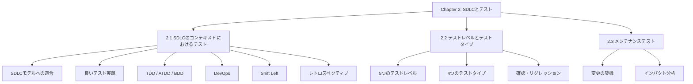

### 試験配点マップ

| セクション | 問題数 | K-レベル | 頻出トピック |
|-----------|--------|---------|-------------|
| 2.1 SDLCのコンテキスト | 2問 | K1/K2 | DevOps特性、Shift Left手法 |
| 2.2 テストレベル/タイプ | 4問 | K2 | 各レベルの目的・テスト基盤・テスト対象 |
| 2.3 メンテナンステスト | 1問 | K2 | 変更の種類、インパクト分析 |

> **試験戦略:** Chapter 2は「定義の正確な理解」が鍵。特に **v4.0での新設事項**（コンポーネント統合テストとシステム統合テストの分離、DevOps追加）を重点的に押さえること。

---

## 2.1 SDLCのコンテキストにおけるテスト

### 2.1.1 SDLCモデルとテスト活動の影響

SDLCの選択はテストのあらゆる側面に影響する。シラバスはこの関係を明示的に定義している。

#### SDLCモデルの分類

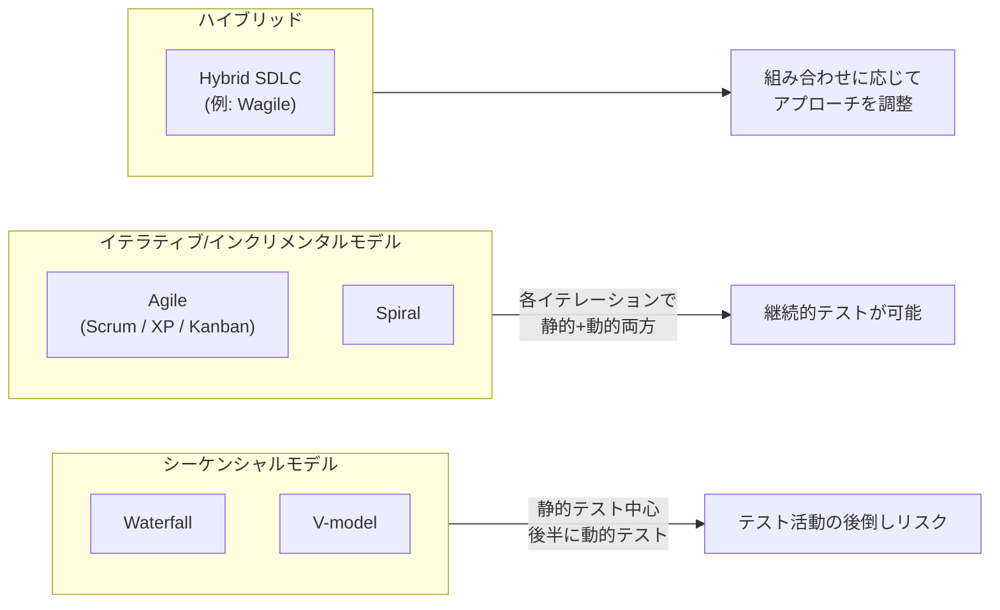

#### SDLCモデルごとのテスト活動の違い

| 側面 | シーケンシャル（Waterfall/V-model） | イテラティブ/インクリメンタル（Agile） |
|------|-------------------------------------|--------------------------------------|
| **テストの開始時期** | 後半フェーズが中心 | 各イテレーション内で並行 |
| **静的テスト** | 要件・設計レビューとして前半に実施 | 各スプリントで継続的に実施 |
| **動的テスト** | コード完成後に集中 | 各スプリント内で完結 |
| **テスト文書** | 詳細・フォーマル | 軽量・Just Enough |
| **自動化の位置づけ** | プロジェクト後半 | リグレッション防止として初期から |
| **テスターの関与** | 後半フェーズに集中 | 要件定義から継続的に関与 |

> **重要ポイント:** シラバスは「どのSDLCモデルが優れているか」を問うのではなく、「テストをSDLCに適合させる方法」を問う。正しい問いは「このSDLCでテストをどう統合するか？」である。

#### V-model: テストレベルと開発フェーズの対応

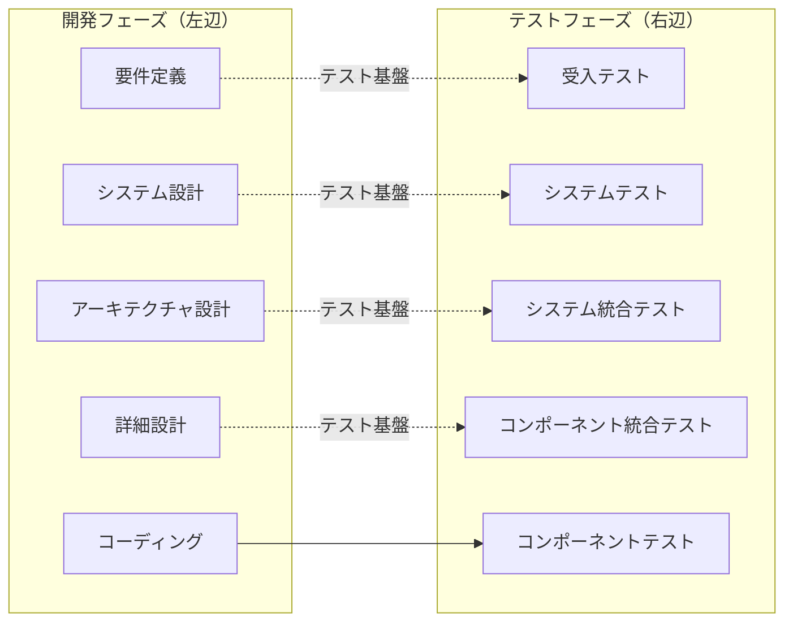

---

### 2.1.2 良いテスト実践とSDLCへの統合

シラバスは「良いテスト実践（Good Testing Practices）」として、SDLCモデルによらず適用できる原則を定めている。

#### 4つの良いテスト実践

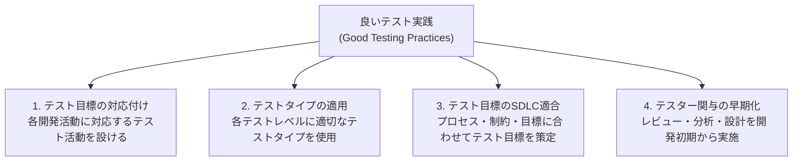

**具体的な実践例:**

| 開発活動 | 対応するテスト活動 | 根拠 |
|---------|-------------------|------|
| 要件定義 | 要件レビュー、受入基準作成 | 欠陥の早期発見（Shift Left） |
| 設計 | テスト設計（テスト条件の特定） | アーキテクチャの問題を設計段階で検出 |
| コーディング | コンポーネントテスト、コードレビュー | 単体レベルの欠陥除去 |
| 統合 | 統合テスト | インターフェース欠陥の検出 |
| リリース | 受入テスト、回帰テスト | デプロイ判断の根拠取得 |

---

### 2.1.3 テストファーストアプローチ（TDD / ATDD / BDD）

v4.0の重要な追加事項。3つのアプローチはいずれも「テストが開発を駆動する」という共通原則を持つ。

#### 3アプローチの比較

| アプローチ | 正式名称 | テスト記述者 | テスト形式 | 目的 |
|-----------|---------|------------|----------|------|
| **TDD** | Test-Driven Development | 開発者 | プログラミング言語のテストコード | コードの設計を改善 |
| **ATDD** | Acceptance Test-Driven Development | 開発者・テスター・ビジネス | 自然言語ベースの受入基準 | 全員の共通理解を形成 |
| **BDD** | Behavior-Driven Development | 開発者・テスター・ビジネス | Given/When/Then 形式 | システムの振る舞いを仕様化 |

#### TDD サイクル

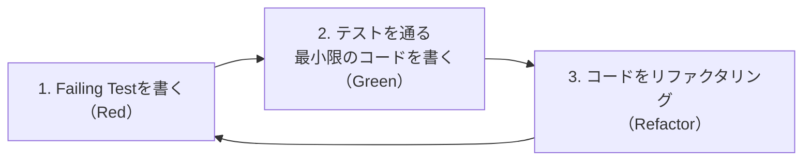

#### BDD の Given/When/Then 形式

```
Feature: ショッピングカートへの商品追加

  Scenario: 在庫ありの商品をカートに追加する
    Given ユーザーが商品詳細ページを閲覧している
    When ユーザーが「カートに追加」ボタンをクリックする
    Then カート内の商品数が1増加する
    And 「カートに追加しました」のメッセージが表示される
```

#### 3アプローチの共通点と相違点

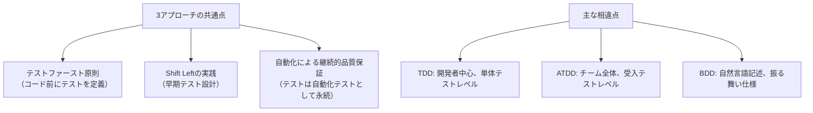

> **試験の落とし穴:** BDDはGiven/When/Then形式を使用するが、ATDDは必ずしもこの形式を使わない。ATDDは「受入基準からテストを派生させる」ことが本質であり、形式は問わない。

---

### 2.1.4 DevOpsとテスト

v4.0で新設されたセクション。CI/CDパイプラインにおけるテストの役割を明確化。

#### DevOpsの定義（シラバスの定義）

DevOpsは開発（テストを含む）とオペレーションが共通目標に向けて協働するための**組織変革**である。技術的プラクティスに加え、**文化的変革**が必須。

#### DevOpsの主要特性

| 特性 | 説明 | テストへの影響 |
|------|------|--------------|
| **チームの自律性** | 各チームがエンドツーエンドの責任を持つ | テスターが開発チームに埋め込まれる |
| **高速フィードバック** | CIによる自動テスト実行 | 数分以内に品質フィードバックを取得 |
| **統合ツールチェーン** | CI/CDパイプラインの自動化 | テスト自動化が必須インフラに |
| **継続的インテグレーション（CI）** | コードの頻繁なマージ + 自動ビルド/テスト | リグレッション即時検出 |
| **継続的デリバリー（CD）** | 常にリリース可能な状態を維持 | 全テストレベルの高速化が前提 |

#### DevOps CI/CDパイプラインにおけるテストフロー

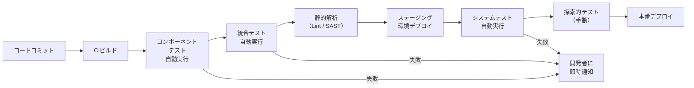

#### DevOpsのテストにおけるメリットとリスク

**メリット:**

- 安定した環境でのテストが可能（Infrastructure as Code）
- 非機能テスト（性能・セキュリティ）をパイプラインに組み込み可能
- テストカバレッジの可視化と品質メトリクスの継続的収集

**リスク・課題:**

- テスト自動化の初期構築コストが高い
- 手動テスト（探索的テスト等）の位置づけが不明確になりがち
- パイプラインの維持・管理に専門知識が必要

---

### 2.1.5 シフトレフト（Shift Left）

シフトレフトは「テストを早期に実施する」という原則の実践的手法。

#### シフトレフトの本質

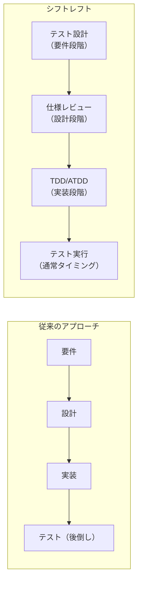

#### シフトレフトの具体的手法

| 手法 | タイミング | 目的 |
|------|----------|------|
| 仕様・要件のレビュー | 要件定義フェーズ | 曖昧さ・矛盾の早期検出 |
| コード実装前のテスト設計 | 設計フェーズ | テスト容易性を設計に反映 |
| CI/CDでの自動テスト | コミット時 | 即時フィードバック |
| 静的解析 | コミット/ビルド時 | コード品質の継続的確認 |
| TDD / ATDD | 実装フェーズ | テストによる設計駆動 |

> **重要:** シフトレフトは「後半テストをなくす」ことではなく、「前半にもテスト活動を追加する」ことで全体の品質を向上させる考え方。後半のテストは依然として必要。

---

### 2.1.6 レトロスペクティブとプロセス改善

#### シラバスにおけるレトロスペクティブの定義

レトロスペクティブ（振り返り会議）はプロジェクト、フェーズ、リリース、またはイテレーションの終了時に実施し、**テストプロセスの継続的改善**に活用する。

#### レトロスペクティブの目的

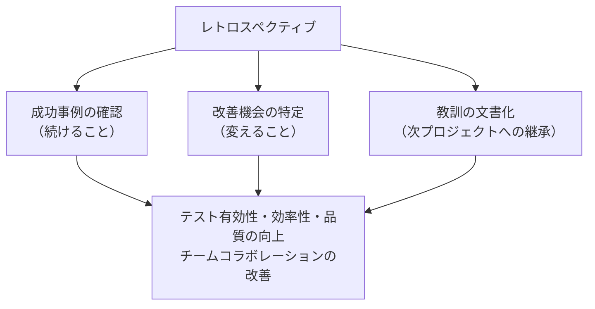

#### テスト観点でのレトロスペクティブ活動例

| 議題 | 改善内容の例 |
|------|------------|
| テストカバレッジ | 不足していたテスト観点の特定と次回への反映 |
| 欠陥の傾向分析 | 繰り返し発生する欠陥パターンの根本原因分析 |
| テスト自動化 | 手動で繰り返したテストの自動化候補の洗い出し |
| テスト環境の問題 | 環境起因の障害への対策 |
| テストプロセスの効率化 | テスト設計・実行の所要時間の見直し |

---

## 2.2 テストレベルとテストタイプ

### 2.2.1 テストレベル（5段階）

> **v4.0の重要変更:** v3.1では「統合テスト」1段階だったが、v4.0では **コンポーネント統合テスト** と **システム統合テスト** に分離された。これは試験頻出事項。

#### 5つのテストレベルの全体構造

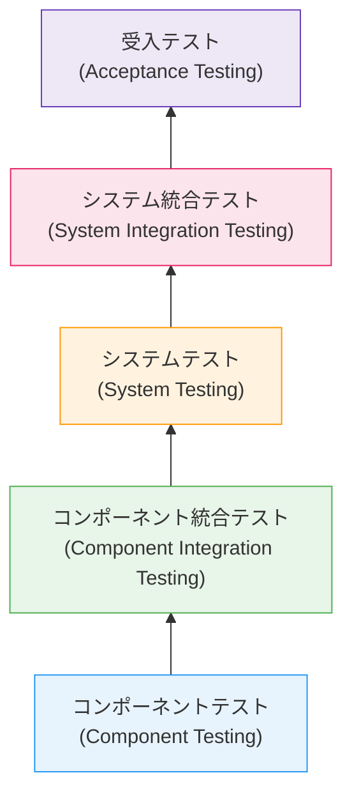

#### 各テストレベルの詳細比較

| 属性 | コンポーネントテスト | コンポーネント統合テスト | システムテスト | システム統合テスト | 受入テスト |
|------|------------------|-----------------------|--------------|-----------------|----------|
| **目的** | 個別コンポーネントの動作確認 | コンポーネント間インターフェースの確認 | システム全体の動作確認 | 外部システムとの統合確認 | ビジネス要件を満たすか確認 |
| **テスト対象** | 1つのコンポーネント/クラス/モジュール | コンポーネント群のインターフェース | システム全体 | 他システム・サードパーティとの結合 | システム全体（本番同等環境） |
| **テスト基盤** | 詳細設計、コンポーネント仕様 | インターフェース設計、アーキテクチャ設計 | システム要件仕様 | システムインターフェース設計 | ユーザー要件、ユースケース、契約 |
| **テスト担当者** | 主に開発者 | 開発者/テスター | テスター | テスター/統合チーム | ユーザー/顧客/テスター |
| **環境** | 開発環境 | 開発/統合環境 | テスト環境 | テスト/ステージング環境 | 本番同等環境 |
| **代表的な欠陥** | ロジックエラー、アルゴリズムの誤り | インターフェース不整合、データ変換エラー | 機能要件の未達、性能問題 | 外部システムとの通信エラー | ビジネス要件の未達、ユーザビリティ問題 |

#### 受入テストの4サブタイプ

受入テストはシラバスで特に詳しく定義されている。試験で問われやすい。

| サブタイプ | 略称 | 実施者 | 目的 |
|-----------|------|--------|------|
| ユーザー受入テスト | UAT | 実際のユーザー | 実際の利用シナリオでの検証 |
| 運用受入テスト | OAT | システム管理者 | バックアップ・リカバリ・メンテナンス性の確認 |
| 契約・規制受入テスト | — | テスター/外部監査 | 契約条件・法規制・標準への準拠確認 |
| アルファ/ベータテスト | — | 限定ユーザー | 実際の利用環境での問題検出 |

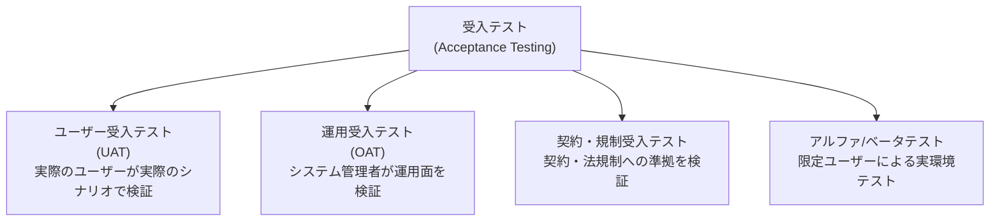

---

### 2.2.2 テストタイプ（4種類）

テストタイプは「何を評価するか」を定義する。テストレベルとは独立しており、**すべてのテストレベルで全タイプを適用できる**。

#### 4つのテストタイプの概要

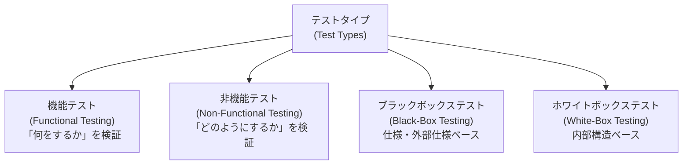

#### テストタイプ詳細

| テストタイプ | 評価対象 | 代表的な技法 | 主なテスト基盤 |
|------------|---------|------------|--------------|
| **機能テスト** | 機能要件（完全性・正確性・適切性） | 同値分割、境界値分析、デシジョンテーブル | 要件仕様、ユースケース、ユーザーストーリー |
| **非機能テスト** | 品質特性（性能・セキュリティ・信頼性・使いやすさ等） | 性能テスト、セキュリティテスト、ユーザビリティテスト | 性能要件、セキュリティ基準、UI仕様 |
| **ブラックボックステスト** | 外部仕様との整合性（内部実装を見ない） | 同値分割、境界値分析、ユースケーステスト | 仕様書、要件 |
| **ホワイトボックステスト** | 内部構造の網羅性 | ステートメントカバレッジ、ブランチカバレッジ | コード、アーキテクチャ図 |

#### 非機能テストの品質特性（ISO/IEC 25010）

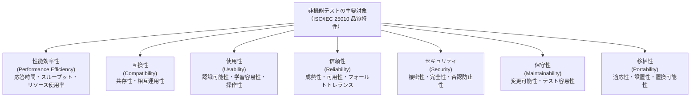

> **試験のポイント:** テストタイプはテストレベルとは**独立**。例えば「コンポーネントレベルで非機能テスト（例：単体レベルの性能計測）」も「システムレベルでホワイトボックステスト」も理論上は可能。

---

### 2.2.3 確認テストとリグレッションテスト

欠陥修正後に実施する2種類のテスト。混同しやすいため、区別を明確に理解する。

#### 比較表

| 属性 | 確認テスト (Confirmation Testing) | リグレッションテスト (Regression Testing) |
|------|----------------------------------|----------------------------------------|
| **別名** | リテスト (Re-test) | 回帰テスト |
| **目的** | 欠陥修正が正しく行われたことを確認 | 修正によって他の部分に影響が出ていないことを確認 |
| **実施タイミング** | 欠陥修正後 | 欠陥修正後、変更後、環境変更後 |
| **テスト範囲** | 修正された欠陥に関連するテストのみ | 修正の影響範囲全体（場合によってはシステム全体） |
| **自動化の推奨度** | 低〜中（修正内容に依存） | 高（繰り返し実行のため）|

#### 欠陥修正後のテストフロー

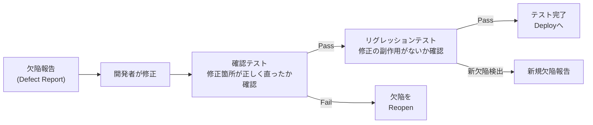

> **重要:** リグレッションテストはDevOps/Agile環境では**CI/CDパイプラインで自動実行**することが強く推奨される。頻繁な変更に対応するためには手動実行は非効率。

---

## 2.3 メンテナンステスト

システムのリリース後に行われるテスト活動。リリース前のテストとは異なる特性を持つ。

### 変更の種類とメンテナンステストのトリガー

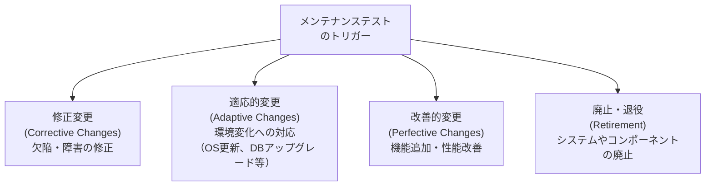

### 変更の種類ごとのメンテナンステストの特性

| 変更の種類 | 例 | テストの焦点 | リスクレベル |
|-----------|------|------------|------------|
| **修正変更** | バグフィックスのパッチ適用 | 確認テスト + 限定的リグレッション | 中 |
| **適応的変更** | OSバージョンアップ、クラウド移行 | 互換性テスト + 全体リグレッション | 高 |
| **改善的変更** | 新機能追加、UI刷新 | 新機能テスト + 影響範囲のリグレッション | 中〜高 |
| **廃止・退役** | 旧システムの廃止、データ移行 | データ移行テスト、並行稼働テスト | 高 |

### インパクト分析（Impact Analysis）

メンテナンステストの計画において中核となるプロセス。

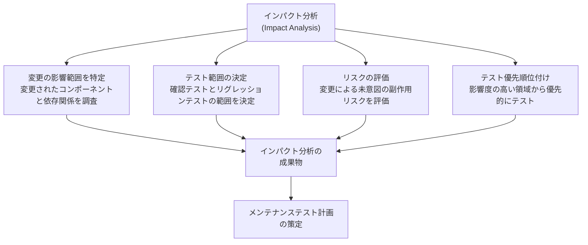

### メンテナンステストの難しさ

通常のプロジェクトテストと比較したメンテナンステスト固有の課題:

| 課題 | 理由 | 対策 |
|------|------|------|
| テスト基盤の陳腐化 | 長年の変更でドキュメントが実装と乖離 | 変更都度のドキュメント更新、逆エンジニアリング |
| 変更範囲の不明確さ | 依存関係が複雑化しているシステム | 依存関係分析ツールの活用、コードカバレッジ計測 |
| 本番環境での直接テスト | テスト環境が整備されていない | 本番同等環境の整備、フィーチャーフラグの活用 |
| 開発者知識の喪失 | 担当者離脱による知識断絶 | テスト自動化、テストドキュメントの充実 |

---

## 試験対策: 頻出問題パターンと落とし穴

### v4.0で新たに追加・変更された重要ポイント

| 変更内容 | v3.1 | v4.0 |
|---------|------|------|
| 統合テストの分離 | 統合テスト（1段階） | コンポーネント統合テスト + システム統合テスト（2段階） |
| DevOpsセクション | なし | 2.1.4として新設 |
| Shift Leftセクション | なし | 2.1.5として新設 |
| テストファーストアプローチ | TDD/ATDDのみ | TDD / ATDD / BDD（3種類）を明確化 |
| レトロスペクティブ | なし | 2.1.6として新設 |

### よくある誤解と正しい理解

| よくある誤解 | 正しい理解 |
|------------|-----------|
| BDD = TDDの発展形 | BDDとTDDは異なるアプローチ。BDDは振る舞い仕様に焦点、TDDはコード設計に焦点 |
| シフトレフト = テストを前倒しにするだけ | テスト活動全体の前倒し + 後半テストとの組み合わせ |
| DevOps = 手動テストの廃止 | 手動テスト（探索的テスト等）は依然として重要な役割を持つ |
| 確認テスト = リグレッションテスト | 目的が異なる。確認テストは修正確認、リグレッションは副作用確認 |
| テストタイプはテストレベルに紐付く | テストタイプはすべてのテストレベルで適用可能 |

### 試験頻出のK2問題パターン例

**問題タイプ1: シナリオと適切なテストレベルの対応**

> *開発チームが外部決済APIとの統合後、決済フローの問題を検出した。どのテストレベルが最も適切か？*
> → **システム統合テスト**（外部システムとの結合を確認するため）

**問題タイプ2: 手法の識別**

> *テストチームがコードを書く前に、Gherkinを使ってGiven/When/Then形式でテストシナリオを定義している。どのアプローチか？*
> → **BDD**（Given/When/Then形式 + テストファースト）

**問題タイプ3: DevOpsにおけるテストの役割**

> *DevOpsチームがCIパイプラインでビルドのたびに自動テストを実行している。このテストの主要な目的は何か？*
> → **リグレッション防止と即時フィードバック**

---

## 参照URL一覧

| 資料 | URL | 最終確認日 |
|------|-----|----------|
| ISTQB CTFL v4.0 公式ページ | <https://istqb.org/certifications/certified-tester-foundation-level-ctfl-v4-0/> | 2026-06-29 |
| CTFL Syllabus v4.0.1（PDF） | <https://istqb.org/wp-content/uploads/2024/11/ISTQB_CTFL_Syllabus_v4.0.1.pdf> | 2026-06-29 |
| ISTQB リリースアナウンス（v4.0） | <https://istqb.org/istqb-releases-certified-tester-foundation-level-v4-0-ctfl/> | 2026-06-29 |
| ISTQB 用語集 | <https://glossary.istqb.org/> | 2026-06-29 |
| ASTQB版 Syllabus v4.0.1（PDF） | <https://astqb.org/assets/documents/ISTQB_CTFL_Syllabus_v4.0.1.pdf> | 2026-06-29 |
| ISTQB.com — CTFL v4.0 ガイド | <https://www.istqb.com/ctfl-v4-0/> | 2026-06-29 |
| istqb.guru — Chapter別解説 | <https://www.istqb.guru/ctfl-v4-syllabus-chapter-by-chapter-deep-dive/> | 2026-06-29 |
| testing101.net — CTFL v4.0 概要 | <https://www.testing101.net/post/overview-of-the-istqb-certified-tester-foundation-level-ctfl-v4-0-new> | 2026-06-29 |
| ISO/IEC 25010（品質モデル）概要 | <https://www.iso.org/standard/78176.html> | 2026-06-29 |
| CTFL-AT（Agile Tester）公式ページ | <https://istqb.org/certifications/certified-tester-foundation-level-agile-tester-ctfl-at/> | 2026-06-29 |

---

> **著作権表示:** 本資料はISTQB CTFL Syllabus v4.0.1の学習用解説資料です。ISTQB®はInternational Software Testing Qualifications Boardの登録商標です。シラバスの著作権は各著者およびISTQBに帰属します。
>
> **最終更新:** 2026年6月29日
