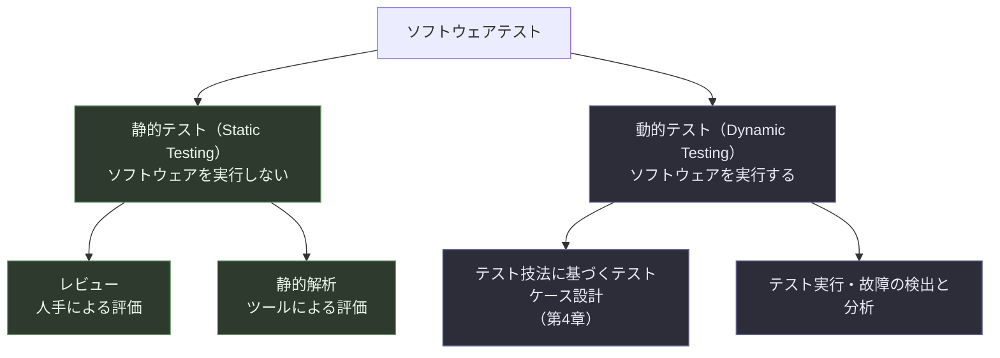
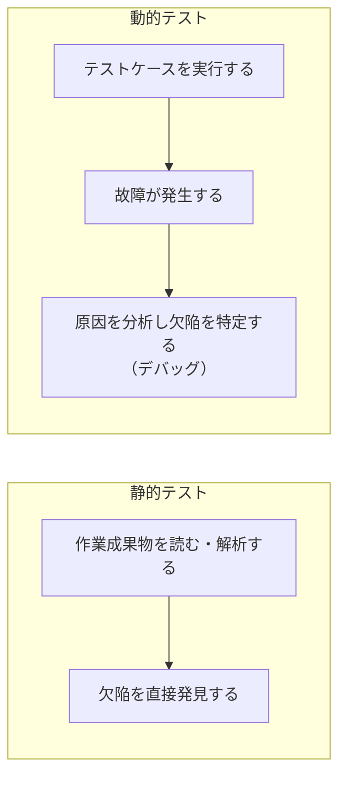

# CTFL v4.0 第3章：静的テスト 徹底解説

> 本資料は ISTQB® Certified Tester Foundation Level (CTFL) v4.0.1 シラバスの **Chapter 3「静的テスト（Static Testing）」** を、中級者〜上級者のソフトウェアエンジニア・QAエンジニア向けにステップバイステップで解説したものです。公式シラバス（英語版・日本語版）および ISO/IEC 20246 等の関連標準、現場で使われる静的解析ツールの動向を調査したうえで、シラバスの構成に沿って独自にまとめています。各セクション末尾に出典URLを明記していますので、一次情報の確認にご活用ください。

---

## 0. この章の位置づけ

CTFL v4.0 シラバスは全6章で構成され、Chapter 3「静的テスト」の標準学習時間は **80分** と、6章の中では最も短い部類に入ります。とはいえ、出題範囲としての重要度が低いわけではなく、「欠陥をできるだけ早く・安く見つける」というテストの大原則（第1章で学ぶ7原則の3番目「早期テストは時間とコストを節約する」）を実践するうえでの中核技法がここに詰まっています。

第2章で学ぶ「シフトレフト」の考え方とも直結しており、コードがまだ実行できない段階（要件定義・設計フェーズ）から欠陥を発見できる唯一の手段が静的テストです。動的テストが「動かして壊れ方を見る」アプローチだとすれば、静的テストは「動かす前に、人の目とツールでミスを見つける」アプローチだと整理すると理解しやすくなります。

### 学習目標（Learning Objectives）一覧

| 項番 | 学習目標 | 認知レベル |
|---|---|---|
| FL-3.1.1 | 静的テストで検証できる作業成果物の種類を認識する | K1（記憶） |
| FL-3.1.2 | 静的テストの価値を説明する | K2（理解） |
| FL-3.1.3 | 静的テストと動的テストを比較対比する | K2（理解） |
| FL-3.2.1 | 早期かつ頻繁なステークホルダーからのフィードバックの利点を識別する | K1（記憶） |
| FL-3.2.2 | レビュープロセスの活動を要約する | K2（理解） |
| FL-3.2.3 | レビューの主要な役割にどの責務が割り当てられるかを想起する | K1（記憶） |
| FL-3.2.4 | さまざまなレビュー種別を比較対比する | K2（理解） |
| FL-3.2.5 | レビューを成功させる要因を想起する | K1（記憶） |

キーワード（本シラバスで暗記必須とされる用語）：**anomaly（不正）、dynamic testing（動的テスト）、formal review（公式レビュー）、informal review（非公式レビュー）、inspection（インスペクション）、review（レビュー）、static analysis（静的解析）、static testing（静的テスト）、technical review（テクニカルレビュー）、walkthrough（ウォークスルー）**

> 出典：ISTQB® Certified Tester Foundation Level Syllabus v4.0.1（2024-09-15）, Chapter 3, p.32-33 
> <https://istqb.org/wp-content/uploads/2024/11/ISTQB_CTFL_Syllabus_v4.0.1.pdf>

---

## 1. 3.1 静的テストの基本

### 1.1 静的テストとは何か

静的テストは、対象のソフトウェアを実際に動かさずに、要件定義書・設計書・ソースコードといった作業成果物を**人手による精査（レビュー）**、あるいは**ツールによる自動チェック（静的解析）**によって評価するアプローチです。動的テストとの最大の違いは「実行するかどうか」であり、静的テストは実行不可能な文書段階の成果物にも適用できる点が大きな強みになります。

静的テストの目的は、欠陥の検出だけにとどまりません。可読性・完全性・正確性・試験性・一貫性といった品質特性を評価し、成果物全体の品質を底上げすることも狙いの一つです。さらに、静的テストは「仕様通りに作られているか」を確認する**検証（Verification）**と、「本当にユーザーが欲しいものになっているか」を確認する**妥当性確認（Validation）**の両方に活用できます。たとえば、ユーザーストーリーのレビューでは「受け入れ基準が記載通りに実装可能か（検証）」と「そのユーザーストーリーがそもそもユーザーの課題を解決しているか（妥当性確認）」の両方を確認することになります。

近年のアジャイル開発では、テスト担当者・ビジネス側の代表者（プロダクトオーナーやビジネスアナリスト）・開発担当者が共同で行う**Example Mapping（実例マッピング）**、**ユーザーストーリーの共同執筆**、**バックログリファインメント**といった協働作業も、広い意味での静的テストに含まれます。これらの場では、ユーザーストーリーが「Definition of Ready（準備完了の定義）」を満たしているか、受け入れ基準がテスト可能な形になっているかを、適切な質問を投げかけながら確認していきます。

### 1.2 静的テストで検証可能な作業成果物（3.1.1）

レビューの対象になり得る作業成果物は非常に幅広く、「人が読んで理解できるもの」であればほぼすべてが対象になります。一方、静的解析の対象にするには、検査の前提となる構造（コードの文法、モデルの記法など）が必要です。

| 分類 | 静的テストの対象となる作業成果物の例 |
|---|---|
| 要求関連 | 要件仕様書、ユーザーストーリー、受け入れ基準 |
| 設計関連 | システムアーキテクチャ仕様書、詳細設計書、データモデル、画面遷移図 |
| 実装関連 | ソースコード、ビルドスクリプト、設定ファイル |
| テスト関連 | テスト計画書、テストケース、テストチャーター、自動化スクリプト |
| プロジェクト管理関連 | プロジェクト計画書、契約書、製品バックログアイテム |

一方で、静的テストに適さない作業成果物も存在します。具体的には、人間にとって解釈が困難なもの（例：機械生成された難読化コード）や、ツールで分析すべきでない成果物が該当します。代表例として挙げられるのが**サードパーティの実行可能コード**です。これは多くの場合ライセンス契約上の制約によって、逆コンパイルや静的解析ツールでの分析自体が認められていないためです。この「静的テストに適さない成果物」という観点は、シラバスv4.0で新たに明文化された考え方であり、実務でOSSライブラリやベンダー提供のバイナリを扱う際に意識しておくべきポイントです。

> 出典：ISTQB® CTFL Syllabus v4.0.1, Section 3.1.1, p.33 
> <https://istqb.org/wp-content/uploads/2024/11/ISTQB_CTFL_Syllabus_v4.0.1.pdf>

### 1.3 静的テストの価値（3.1.2）

静的テストの価値は、大きく次の4つに整理できます。

**(1) 最も早い段階で欠陥を検出できる**
コードが1行も書かれていない要件定義の段階からレビューを始められるため、「早期テストの原則」を最も忠実に実践できる手段です。要件の段階で見つかる矛盾や曖昧さは、設計・実装・テストの各工程に伝播する前に取り除けます。

**(2) 動的テストでは発見しにくい欠陥を見つけられる**
たとえば次のような欠陥は、動的テストでは原理的に発見が難しいか、非常に手間がかかります。

- 到達不能コード（どんな条件分岐をたどっても実行されないコードの塊）
- 意図したとおりに実装されていない設計パターン
- ドキュメントなど、そもそも「実行できない」成果物に内在する欠陥

**(3) 成果物の品質に対する信頼を積み上げ、共通理解を醸成する**
レビューを通じて要件を確認するプロセスは、書かれた要件が本当にステークホルダーの真のニーズを反映しているかを早期に検証する機会にもなります。これにより、開発に関わる人々の間で「何を作るべきか」についての認識のずれを防ぎ、コミュニケーションの質も向上します。

**(4) 結果的にプロジェクト全体のコストを削減する**
レビューの実施自体にはコストがかかりますが、後工程での手戻りコストを考えれば、レビューを行わない場合よりもプロジェクト全体のコストは下がるのが一般的です。同様に、静的解析で検出できる種類のコード欠陥は、動的テストで見つけるよりも効率的に検出でき、結果としてコード欠陥の件数自体の減少と、開発工数全体の削減につながります。

ここで静的解析についても補足しておくと、静的解析はテストケースを必要とせず、ツールによって自動実行できるため、レビューよりも少ない工数で多くの欠陥候補を洗い出せるという特徴があります。多くの組織では、CI（継続的インテグレーション）パイプラインに静的解析を組み込み、コードがコミットされるたびに自動でチェックする運用が一般的になっています。静的解析は主にコードの欠陥検出に使われますが、保守性やセキュリティの評価にも活用され、スペルチェッカーや文章の読みやすさを評価するツールも広い意味では静的解析の一種です。

> 出典：ISTQB® CTFL Syllabus v4.0.1, Section 3.1.2, p.33-34 
> <https://istqb.org/wp-content/uploads/2024/11/ISTQB_CTFL_Syllabus_v4.0.1.pdf>

### 1.4 静的テストと動的テストの違い（3.1.3）

静的テストと動的テストは対立する技法ではなく、互いの弱点を補い合う**補完関係**にあります。「欠陥を検出する」という目的は共通していますが、検出のメカニズムや得意領域は異なります。

両者の違いを観点ごとに整理すると、以下のようになります。

| 観点 | 静的テスト | 動的テスト |
|---|---|---|
| ソフトウェアの実行 | 不要 | 必要 |
| 欠陥の発見プロセス | 欠陥を直接発見する | テスト実行が故障を引き起こし、その後の分析で欠陥を特定する |
| 適用できる対象 | 実行不可能な成果物（文書・モデルなど）にも適用可能 | 実行可能な成果物のみが対象 |
| 検出が得意な品質特性 | 保守性など、コードを実行しなくても評価できる特性 | 性能効率性など、実際にコードを動かさないと評価できない特性 |
| めったに実行されない処理経路の欠陥 | 比較的見つけやすい | 動的テストだけでは到達・再現が難しい場合がある |

実務上特に重要なのは、「静的テストでしか見つからない欠陥」と「動的テストでしか見つからない欠陥」がそれぞれ存在するという点です。たとえば実行時のパフォーマンス劣化は動的テストでなければ確認できませんが、コーディング規約違反や到達不能コードは動的テストではほぼ検出できません。したがって、どちらか一方に偏ったテスト戦略はリスクが高く、両方を組み合わせることが推奨されます。

シラバスでは、静的テストによって早期かつ安価に検出しやすい欠陥の代表例として、次の7カテゴリが挙げられています。

| 欠陥カテゴリ | 具体例 |
|---|---|
| 要件の欠陥 | 矛盾、曖昧な表現、記載漏れ、不正確な記述、重複した記載 |
| 設計の欠陥 | 非効率なデータベース構造、モジュール分割の悪さ |
| 一部のコーディング欠陥 | 未定義値のままの変数、未宣言変数の使用、到達不能コード、コードの重複、過度に複雑なロジック |
| コーディング標準からの逸脱 | 命名規則などコーディング規約への不適合 |
| インタフェース仕様の誤り | パラメータの数・型・順序の不一致 |
| 特定のセキュリティ脆弱性 | バッファオーバーフローなど |
| テストベースに対するカバレッジの不備 | ある受け入れ基準に対応するテストが漏れている、など |

> 出典：ISTQB® CTFL Syllabus v4.0.1, Section 3.1.3, p.34 
> <https://istqb.org/wp-content/uploads/2024/11/ISTQB_CTFL_Syllabus_v4.0.1.pdf>

---

## 2. 3.2 フィードバックとレビュープロセス

### 2.1 早期かつ頻繁なステークホルダーフィードバックの利点（3.2.1）

レビューの議論に入る前に、なぜそもそも「早期かつ頻繁なフィードバック」が重要なのかを押さえておきます。

開発の初期段階でステークホルダーの関与が乏しいと、開発チームが作っているものが、ステークホルダーが本来思い描いていたビジョンとずれていく危険があります。このずれに気づくのが終盤であればあるほど、軌道修正のコストは指数関数的に増大し、最悪の場合は納期遅延や責任の押し付け合い、プロジェクト自体の失敗に直結します。

逆に、開発ライフサイクル全体を通じて頻繁にフィードバックを得られれば、要件に対する誤解を未然に防ぎ、要件の変更が必要になった場合にも早い段階で気づき、対応できます。これは開発チーム自身が「自分たちが何を作っているのか」をより深く理解することにもつながり、ステークホルダーにとって価値の高い機能や、リスクへの影響が大きい部分に開発の力を集中させやすくなるという副次的な効果もあります。

レビューは、この「早期かつ頻繁なフィードバック」を構造的に実現するための代表的な手段の一つだと位置づけられます。

> 出典：ISTQB® CTFL Syllabus v4.0.1, Section 3.2.1, p.35 
> <https://istqb.org/wp-content/uploads/2024/11/ISTQB_CTFL_Syllabus_v4.0.1.pdf>

### 2.2 レビュープロセスの活動（3.2.2）

レビューには様々な形式があり、案件の重要度やリスクに応じて柔軟に調整される必要があります。シラバスでは、その柔軟性の土台として ISO/IEC 20246 規格が定義する汎用的なレビュープロセスを参照しています。ISO/IEC 20246 は、インスペクション・レビュー・ウォークスルーといった作業成果物レビュー全般について、ライフサイクルのどの段階でも使える汎用的なプロセス、活動、タスク、レビュー技法、文書テンプレートを定めた国際標準です。「より公式なレビューが必要であれば、以下の各活動でより多くのタスクをこなすことになる」という考え方が基本になります。

なお、対象となる作業成果物のサイズが大きい場合、1回のレビューですべてをカバーしきれないことがあります。その場合は、同じ成果物に対してレビュープロセス全体を複数回繰り返す（章やモジュール単位で分割してレビューする）運用も想定されています。

レビュープロセスは、次の5つの活動から構成されます。

各活動の内容を、表で具体的に整理します。

| 活動 | 主な目的 | 具体的なタスクの例 |
|---|---|---|
| ① 計画 | レビューのスコープを定義する | レビューの目的・対象成果物・評価する品質特性・重点領域・終了基準・参照すべき標準・工数とスケジュールを決定する |
| ② レビューの開始 | 参加者と成果物の準備を整える | 参加者全員が対象成果物にアクセスできる状態にし、各自の役割と責務を理解させ、レビューに必要な情報を行き渡らせる |
| ③ 個々のレビュー | レビューアが各自で成果物を精査する | チェックリストベースドレビューやシナリオベースドレビューなどの技法を用いて、不正（anomaly）・提案・疑問点を識別し記録する |
| ④ コミュニケーションと分析 | 見つかった不正を議論し合意する | レビューミーティングなどを通じて、各不正のステータス・担当者・必要な対応を決定し、成果物全体の品質レベルとフォローアップの要否を判断する |
| ⑤ 修正と報告 | 欠陥を修正し結果を報告する | 欠陥ごとに欠陥レポートを作成し、是正措置を追跡できるようにする。終了基準を満たした時点で成果物を受け入れ、レビュー結果を関係者に報告する |

ここで重要な用語の整理をしておきます。レビューア個人が気づいた「気になる点」は、確定した欠陥（defect）ではなく、まず**不正（anomaly）**として扱われます。不正は、レビューミーティングなどでの議論・分析を経て初めて、欠陥として認定されるか、あるいは「問題なし」と判断されるかが決まります。この「いきなり欠陥と決めつけない」という姿勢は、後述するレビューの成功要因（参加者を責めない文化づくり）とも密接に関係しています。

> 出典：ISTQB® CTFL Syllabus v4.0.1, Section 3.2.2, p.35-36 
> <https://istqb.org/wp-content/uploads/2024/11/ISTQB_CTFL_Syllabus_v4.0.1.pdf> 
> ISO/IEC 20246:2017 Software and systems engineering — Work product reviews（概要） 
> <https://www.iso.org/standard/67407.html>

### 2.3 レビューでの役割と責務（3.2.3）

レビューには複数のステークホルダーが関わり、それぞれが異なる役割を担います。1人が複数の役割を兼任することも一般的ですが、シラバスでは以下の6つの principal role（主要な役割）が定義されています。

| 役割 | 主な責務 |
|---|---|
| マネージャー | 何をレビュー対象とするかを決定し、要員や時間といったリソースを提供する |
| 作成者（オーサー） | レビュー対象の作業成果物を作成し、指摘された不正・欠陥を修正する |
| モデレーター（ファシリテーターとも呼ばれる） | レビューミーティングが効果的に進行するよう、議論の調整・時間管理・誰もが安心して発言できる雰囲気づくりを担う |
| 書記（スクライブ、レコーダーとも呼ばれる） | レビューアから集まった不正情報をまとめ、ミーティング中の決定事項や新たに見つかった不正を記録する |
| レビューア | 実際にレビューを行う。プロジェクトに関わる人だけでなく、その分野の専門家やその他のステークホルダーが担うこともある |
| レビューリーダー | 誰を関与させるか、いつ・どこでレビューを行うかなど、レビュー全体に対して最終的な責任を持つ |

より詳細な役割分担は ISO/IEC 20246 でさらに細かく定義されていますが、CTFL試験で問われるのはこの6つの基本形です。

> **実務・試験で押さえておきたいポイント**：最も公式なレビュー種別である**インスペクション**では、客観性を担保するために**作成者がレビューリーダーや書記を兼任することはできません**。これは作成者自身が自分の成果物の評価プロセスをコントロールしてしまうことを防ぐための仕組みであり、CTFL試験でも頻出のポイントです。
>
> 出典：ISTQB® CTFL Syllabus v4.0.1, Section 3.2.3, p.36 
> <https://istqb.org/wp-content/uploads/2024/11/ISTQB_CTFL_Syllabus_v4.0.1.pdf>

### 2.4 レビュー種別（3.2.4）

レビューには「非公式」から「非常に公式」まで、さまざまな形式が存在します。どの程度の公式さが必要かは、採用しているSDLC、開発プロセスの成熟度、対象成果物の重要度や複雑さ、法規制や監査証跡の必要性といった要因によって決まります。同じ成果物に対して、まず非公式レビューを行い、その後でより公式なレビューを実施するという段階的な運用も可能です。

右に進むほど公式度・プロセスの厳密さが高まり、それに比例して文書化の要求レベルや、必要な準備工数も増えていきます。シラバスで定義される4種別を、観点ごとに比較します。

| 観点 | 非公式レビュー | ウォークスルー | テクニカルレビュー | インスペクション |
|---|---|---|---|---|
| 主な目的 | 不正の検出 | 品質評価・信頼の醸成・レビューアへの教育・合意形成・新しいアイデアの創出・作成者の改善動機づけなど、複数の目的を持ちうる | 技術的な合意形成・意思決定に加えて、不正の検出・品質評価・信頼の醸成・改善動機づけ | 不正を最大限に検出すること。加えて品質評価・信頼の醸成・改善動機づけも目的に含まれる |
| 主導者 | 特に定めなし | 作成者 | モデレーター | モデレーター（作成者は主導しない） |
| プロセスの定義・文書化 | 定義されたプロセスはなく、公式な文書化された結果も求められない | 比較的軽量。個々のレビューは事前に行われることもあるが必須ではない | ある程度形式的。個々のレビューを伴うのが一般的 | シラバスで説明される汎用プロセス（2.2節）の全工程に従う、最も公式な形式 |
| メトリクスの収集 | 通常なし | 通常なし | 行われることがある | 収集したメトリクスをSDLCやインスペクションプロセス自体の改善に活用する |
| 典型的な利用シーン | ペアプログラミングでの相互チェックなど | 設計内容の共有を兼ねたミーティング、ステークホルダーへのデモを兼ねた説明 | アーキテクチャ選定など技術的な意思決定が必要な場面 | 安全性・ミッションクリティカルな成果物に対する厳格な品質保証 |

実務での感覚としては、非公式レビューはコードレビューツール上での気軽なコメントのやり取りに近く、インスペクションは監査証跡が必要な規制産業（医療機器・航空宇宙・金融システムなど）でよく採用される、というイメージを持つと理解しやすくなります。

> 出典：ISTQB® CTFL Syllabus v4.0.1, Section 3.2.4, p.36-37 
> <https://istqb.org/wp-content/uploads/2024/11/ISTQB_CTFL_Syllabus_v4.0.1.pdf>

### 2.5 レビューの成功要因（3.2.5）

最後に、レビューを「やって終わり」にせず、実効性のある活動にするための成功要因を整理します。シラバスでは9つの要因が挙げられています。

| # | 成功要因 | 補足 |
|---|---|---|
| 1 | 明確な目的と測定可能な終了基準を定義する | **参加者個人の評価を目的に含めてはならない**。あくまで成果物の品質向上が目的であることを徹底する |
| 2 | 目的に合った適切なレビュー種別を選ぶ | 成果物の種類・参加者・プロジェクトのニーズやコンテキストに応じて、非公式レビューからインスペクションまでの中から選択する |
| 3 | 対象を小さな単位に分割して実施する | 1回のレビューで扱う範囲を絞ることで、個々のレビューやレビューミーティングで集中力が途切れるのを防ぐ |
| 4 | レビュー結果をフィードバックする | 結果をステークホルダーや作成者に返し、成果物だけでなく今後の活動そのものの改善につなげる |
| 5 | 参加者に十分な準備時間を与える | 事前に成果物を読み込んで個々のレビューを行える時間を確保する |
| 6 | マネジメントからの支援を得る | レビュープロセスが組織として正式にサポートされている状態をつくる |
| 7 | レビューを組織文化の一部にする | 学習とプロセス改善を促す文化として、レビューを特別なイベントではなく当たり前の習慣にしていく |
| 8 | 参加者に適切なトレーニングを提供する | 全員が自分の役割を理解し、果たせるようにする |
| 9 | ミーティングを適切にファシリテーションする | 議論が脱線したり停滞したりしないよう、効果的に進行を管理する |

特に1番目の「参加者個人の評価を目的にしない」という原則は、レビュー文化を定着させるうえで最も重要なポイントだと言えます。レビューで指摘された不正の件数を個人の人事評価に直結させてしまうと、参加者は不正を見つけても報告をためらうようになり、レビュー本来の目的である品質向上が機能しなくなります。心理的安全性が確保された環境でこそ、率直な指摘とそれに対する前向きな受け止め方が成立し、レビューが効果を発揮します。

> 出典：ISTQB® CTFL Syllabus v4.0.1, Section 3.2.5, p.37 
> <https://istqb.org/wp-content/uploads/2024/11/ISTQB_CTFL_Syllabus_v4.0.1.pdf>

---

## 3. シラバス補足：実務における静的解析ツールの活用

ここからはシラバス本体の範囲を超えた補足情報として、2026年時点での静的解析ツールの実務動向を整理します。CTFL試験の直接の出題範囲ではありませんが、「静的解析」を実務でどう活用するかをイメージできると、3.1節の理解がより立体的になります。

### 3.1 代表的な静的解析ツールの位置づけ

静的解析ツールは大きく「言語特化型のリンター」と「横断的な品質プラットフォーム」の2層に分かれます。リンターはエディタやコミット前のフックで即座にフィードバックを返す一方、単一ファイル単位の解析にとどまり、ファイルをまたいだ解析や品質ゲートの仕組みは持たないのが一般的です。これに対してプラットフォーム型のツールは、複数ファイル・複数言語を横断して解析し、品質の推移をダッシュボードで追跡し、しきい値を下回るコードのマージを品質ゲートでブロックするといった機能を備えています。

| 分類 | 代表的なツール | 主な特徴 |
|---|---|---|
| 言語特化型リンター | ESLint（JavaScript / TypeScript）、Pylint・Ruff（Python）、RuboCop（Ruby）、golangci-lint（Go） | 軽量・高速で、エディタ上やコミット前フックでのリアルタイムなフィードバックに向く。基本的に単一ファイル・単一言語の解析にとどまる |
| 横断的な品質プラットフォーム | SonarQube、Codacy、DeepSource | 複数言語・複数ファイルを横断して解析し、技術的負債やコード重複・セキュリティ脆弱性を可視化。CI/CDパイプラインに組み込み、品質ゲートとしてマージをブロックする運用が一般的 |
| セキュリティ特化型（SAST） | Semgrep、Bandit（Python） | ファイルをまたぐデータフロー解析により、インジェクション系の脆弱性などを検出する |

実務でよく採用される組み合わせとしては、「開発中はエディタ上のリンターで即時フィードバックを得て、CI/CDパイプライン上ではプラットフォーム型ツールで品質ゲートを通す」という二段構えの運用が紹介されています。これは、エディタでの即時フィードバックとパイプライン上の包括的な解析を組み合わせることで、開発の初期段階での問題検出とリリース前の品質保証の両方を実現する考え方であり、3.1.2節で説明した「シフトレフト」の実践そのものと言えます。

> 出典：SonarQube vs ESLint: Code Quality Platform vs JavaScript Linter（2026） 
> <https://dev.to/rahulxsingh/sonarqube-vs-eslint-code-quality-platform-vs-javascript-linter-2026-i55> 
> 12 Best Code Quality Tools in 2026 
> <https://dev.to/rahulxsingh/12-best-code-quality-tools-in-2026-platforms-linters-and-metrics-a12>

### 3.2 静的解析はレビューの代替にはならない

ここで強調しておきたいのは、静的解析はあくまで「機械的に検出できる種類の欠陥」を効率よく洗い出すための手段であり、シラバス3.1.2で説明した「人手によるレビュー」を置き換えるものではないという点です。静的解析ツールは構文上の問題やパターン化された欠陥（未使用変数、コーディング規約違反、既知の脆弱性パターンなど）の検出には強い一方、「この設計はビジネス要件を正しく満たしているか」「このユーザーストーリーの受け入れ基準は本当に妥当か」といった、文脈理解を要する判断は依然として人手によるレビューでなければ評価できません。CTFL試験的な整理をするなら、静的解析は3.1節（静的テストの基本）の話であり、レビュープロセス（3.2節）はあくまで人を中心とした活動である、という区別を意識しておくとよいでしょう。

---

## 4. よくある誤解・試験で問われやすいポイント

CTFL試験の過去の出題傾向や受験者の体験談を踏まえ、特に誤解されやすいポイントを整理しておきます。

| 誤解されがちな点 | 正しい理解 |
|---|---|
| 「静的テスト＝コードレビューのこと」 | 静的テストはコードに限らず、要件・設計・テストケース・契約書など、人が読んで理解できるあらゆる作業成果物が対象になる |
| 「静的解析にはテストケースが必要」 | 静的解析はテストケースを必要とせず、ツールによって自動的に実行できる点が静的テストの効率の良さの理由の一つ |
| 「静的テストは欠陥を見つけるだけ」 | 検証だけでなく妥当性確認にも使え、品質特性（可読性・保守性など）の評価や、ステークホルダー間の共通理解の醸成にも貢献する |
| 「インスペクションが常に最善のレビュー種別」 | 公式度が高いほど準備・実施のコストも増える。プロジェクトのリスクや成果物の重要度に見合った種別を選ぶことが重要で、常にインスペクションが正解とは限らない |
| 「レビューでの指摘＝確定した欠陥」 | レビューアが個々のレビューで見つけたものはまず「不正（anomaly）」であり、コミュニケーションと分析の活動を経て初めて欠陥かどうかが判断される |
| 「レビューの成果を担当者の評価に使ってよい」 | シラバスは明確に「参加者の評価をレビューの目的にしてはならない」としている。これを破ると心理的安全性が損なわれ、レビューが形骸化する |
| 「インスペクションでは作成者がリーダーを兼任できる」 | インスペクションでは客観性確保のため、作成者はレビューリーダーにも書記にもなれない |

---

## 5. まとめ

第3章「静的テスト」の要点を、もう一度俯瞰しておきます。

1. **静的テストはソフトウェアを実行せずに行うテストであり、レビュー（人手）と静的解析（ツール）の2本柱から成る。**
2. **静的テストの最大の価値は「最も早い段階で、かつ動的テストでは見つけにくい種類の欠陥を検出できる」ことにある。** 早期テストの原則・シフトレフトと直結する。
3. **静的テストと動的テストは対立関係ではなく補完関係にあり、両方を組み合わせて初めて効果的な品質保証が成立する。**
4. **レビュープロセスは「計画→開始→個々のレビュー→コミュニケーションと分析→修正と報告」の5活動で構成され、ISO/IEC 20246がその汎用フレームワークを提供している。**
5. **レビューには6つの主要な役割（マネージャー・作成者・モデレーター・書記・レビューア・レビューリーダー）があり、特にインスペクションでは作成者がリーダーや書記を兼任できない。**
6. **レビュー種別は非公式レビュー・ウォークスルー・テクニカルレビュー・インスペクションの順に公式度が高まり、目的や成果物の重要度に応じて選択する。**
7. **レビューを成功させる鍵は、明確な終了基準・適切な種別選択・小さな単位での実施・フィードバックの還元・組織文化への定着など多岐にわたるが、「参加者を評価しない」という原則が土台になる。**

静的テストは、動的テストに比べて地味に見えるかもしれませんが、コストパフォーマンスの高い品質向上手段として、現場での実践価値は非常に高い領域です。次章（第4章：テスト分析と設計）では、動的テストにおけるテストケースの導出技法を扱いますが、本章で学んだ「早期にレビューで欠陥を取り除く」という発想は、第4章以降のテスト設計の土台としても活きてきます。

---

## 6. 参考文献・出典一覧

| # | 資料名 | URL |
|---|---|---|
| 1 | ISTQB® Certified Tester Foundation Level Syllabus v4.0.1（英語版、2024-09-15） | <https://istqb.org/wp-content/uploads/2024/11/ISTQB_CTFL_Syllabus_v4.0.1.pdf> |
| 2 | ISTQB® CTFL v4.0 認定情報ページ | <https://istqb.org/certifications/certified-tester-foundation-level-ctfl-v4-0/> |
| 3 | JSTQB テスト技術者資格制度 Foundation Level シラバス Version 2023V4.0.J02（日本語版） | <https://jstqb.jp/dl/JSTQB-SyllabusFoundation_VersionV40.J02.pdf> |
| 4 | ISO/IEC 20246:2017 Software and systems engineering — Work product reviews（概要） | <https://www.iso.org/standard/67407.html> |
| 5 | ISO/IEC 20246 関連解説（Stuart Reid, 2018） | <https://www.stureid.info/wp-content/uploads/2018/01/Software-Reviews.pdf> |
| 6 | SonarQube vs ESLint: Code Quality Platform vs JavaScript Linter（2026） | <https://dev.to/rahulxsingh/sonarqube-vs-eslint-code-quality-platform-vs-javascript-linter-2026-i55> |
| 7 | 12 Best Code Quality Tools in 2026 | <https://dev.to/rahulxsingh/12-best-code-quality-tools-in-2026-platforms-linters-and-metrics-a12> |
| 8 | SonarQube 公式製品ページ（SonarSource） | <https://www.sonarsource.com/products/sonarqube/> |

> 本資料はISTQB®／JSTQB®の公式シラバスの内容を独自に要約・解説したものであり、公式シラバス本文の逐語的な転載ではありません。試験対策としては必ず公式シラバス原文（上記出典1・3）を一次情報として参照してください。
