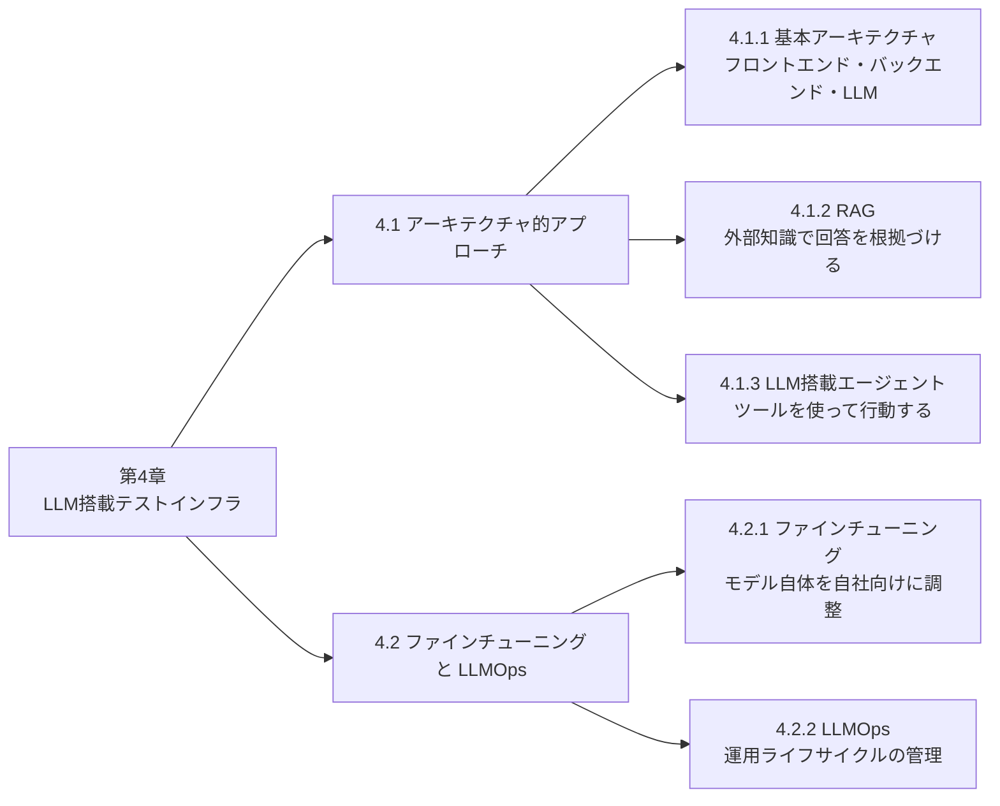
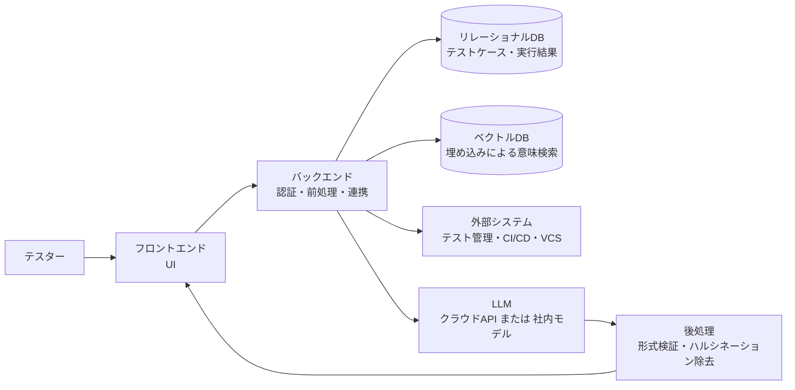
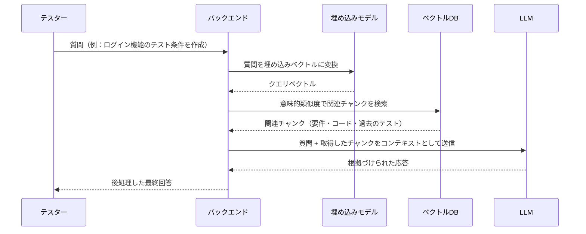
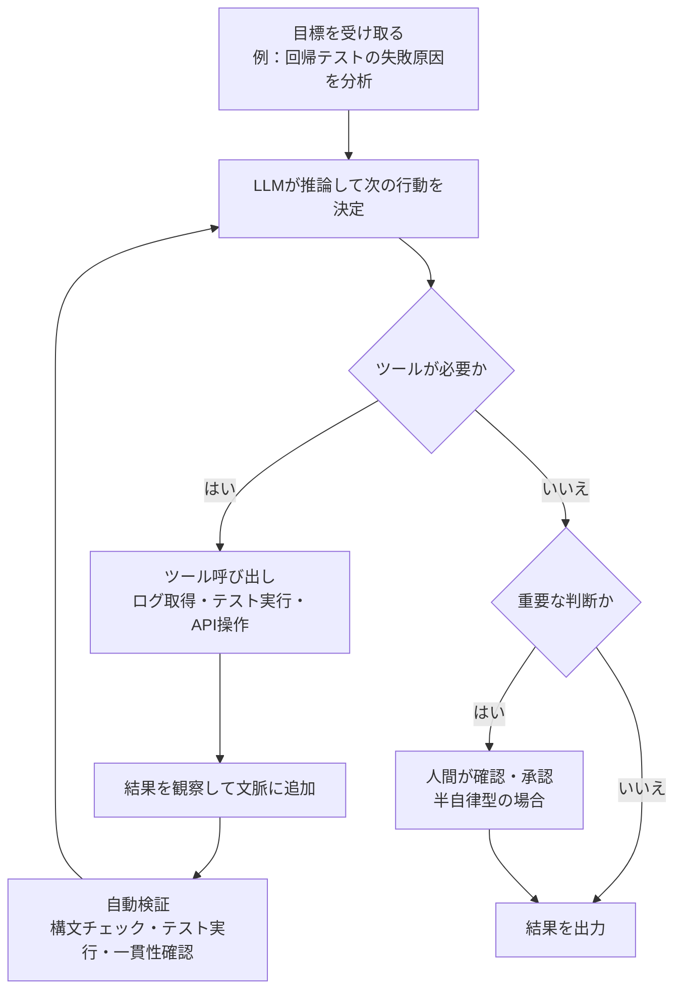
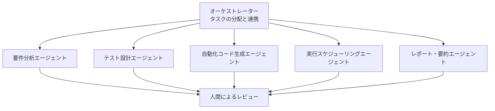
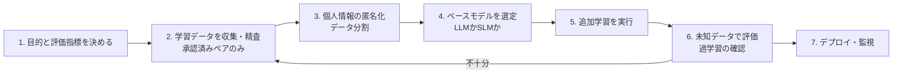
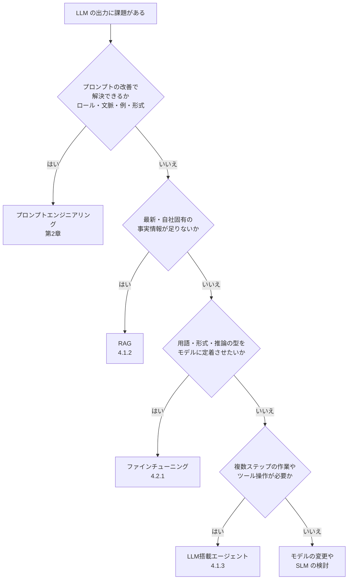

# ISTQB CT-GenAI 第4章 ソフトウェアテストのためのLLM搭載テストインフラ 完全ガイド（初学者向け）

> 対象試験：ISTQB® Certified Tester Specialist Level – Testing with Generative AI（CT-GenAI）
> 対象章：第4章（v1.0 の章題は「LLM-Powered Test Infrastructure for Software Testing」、v1.1 の章題は「LLM-Powered Solutions for Software Testing」）
> 学習時間の目安：シラバス上の配分は 110 分（試験全体 40 問・60 分・合格ライン 30/46 点＝65%）
> 想定読者：CTFL 取得済みで、RAG・エージェント・ファインチューニング・LLMOps を初めて体系的に学ぶテスター、テスト自動化エンジニア、テストマネージャ

---

## 0. 本ガイドの読み方と根拠ソースについて

### 0.1 記号の意味

| 記号 | 意味 |
|------|------|
| 【シラバス】 | ISTQB 公式シラバス（v1.0 原文、および v1.1 準拠の教材）に書かれている内容。試験に直結する |
| 【補足】 | シラバスには書かれていないが、理解を助けるための一般的な業界知見やベストプラクティス。試験範囲外の可能性があるので、暗記対象ではなく実務の参考として読む |
| 💡 ベストプラクティス | 各項目・サービス・機能を実務で使うときの推奨事項 |
| K2 | 「説明できる」レベルの学習目標（第4章の学習目標はすべて K2） |

### 0.2 バージョンについての重要な注意

- ISTQB 公式ページによると、CT-GenAI シラバスは v1.0（2025-07-25 公開）から v1.1 に更新されています。v1.1 の第4章の章題は「LLM-Powered Solutions for Software Testing」で、内部は「4.1 アーキテクチャ的アプローチ」「4.2 ファインチューニングと LLMOps」の 2 節構成です。
- 本ガイドは次の 2 種類の一次・準一次資料を突き合わせて作成しました。
  1. v1.0 シラバス PDF（ISTQB 公式の配布物）の第4章原文
  2. v1.1 準拠を明記した Exactpro 社の第4章教材（Reading Materials）
- v1.1 のシラバス PDF そのものは、本ガイド作成時に本文を機械的に取得できませんでした。v1.0 と v1.1 で大きな構造差はありませんが、受験前には必ず最新の公式 PDF で用語と記述を照合してください（URL は末尾の「参考文献」を参照）。

### 0.3 試験で問われる「型」

第4章の学習目標はすべて K2（理解・説明）です。つまり「〜を説明せよ」「〜の役割を選べ」「AとBの違いはどれか」という形式が中心で、計算問題や手順の実装問題は出にくい章です。用語の定義と「なぜそれが必要か」を自分の言葉で言えるようにしましょう。

---

## 目次

1. 第4章の全体像
2. 4.1.1 LLM搭載テストインフラの主要なアーキテクチャ構成要素と概念
3. 4.1.2 Retrieval-Augmented Generation（RAG）
4. 4.1.3 テストプロセス自動化における LLM 搭載エージェントの役割
5. 4.2.1 テストタスクのための LLM ファインチューニング
6. 4.2.2 LLMOps：テスト用 LLM のデプロイと運用管理
7. 手法の使い分け（プロンプト・RAG・ファインチューニング・エージェント）
8. 第4章 用語集（キーワード）
9. 学習目標とハンズオン目標の対応表
10. 確認問題（自己採点用）
11. 試験直前チェックリスト
12. 参考文献（根拠となるソース URL）

---

## 1. 第4章の全体像

### 1.1 一言でいうと

第2章では「プロンプトの書き方」、第3章では「GenAI のリスクと対策」を学びました。第4章は、それらを**組織の仕組み（インフラ）として実装・運用する方法**を扱います。チャットボットに質問するだけの使い方から一歩進んで、「社内のテスト資産を読ませる」「ツールを操作させる」「自社仕様に合わせて学習させる」「安全に運用し続ける」ための技術要素です。

### 1.2 章の構成

### 1.3 各項目の位置づけ（初学者向けたとえ話）

| 項目 | たとえ | 何を解決するか |
|------|--------|----------------|
| 4.1.1 基本アーキテクチャ | 受付（フロント）・事務局（バック）・専門家（LLM）がいる相談窓口 | 安全で構造化された形で LLM をテスト業務に組み込む |
| 4.1.2 RAG | 専門家が回答の前に社内資料を調べてから答える | 古い知識・自社固有情報の欠落・ハルシネーション |
| 4.1.3 エージェント | 専門家に「道具箱」を渡し、自分で作業を進めてもらう | 複数ステップの作業の自動化 |
| 4.2.1 ファインチューニング | 専門家に自社研修を受けさせて、自社流に慣れてもらう | 自社用語・出力形式・ドメイン特有の推論 |
| 4.2.2 LLMOps | 窓口全体を継続的に監視・保守する運営体制 | 実験止まりを脱し、安定・安全・低コストで運用 |

### 1.4 キーワード（シラバス記載）

| 区分 | キーワード |
|------|------------|
| 一般 | test infrastructure |
| GenAI 固有 | fine-tuning、LLM-powered agent、Large Language Model Operations（LLMOps）、retrieval-augmented generation（RAG）、vector database |

出典：[CT-GenAI Syllabus v1.0（PDF）](https://isqi.org/media/3d/d9/7e/1762964279/CT-GenAI-Syllabus-v1.0_EN_.pdf)

---

## 2. 4.1.1 LLM搭載テストインフラの主要なアーキテクチャ構成要素と概念（K2）

### 2.1 まず用語：「テストインフラ」とは

【シラバス】LLM搭載テストインフラとは、**LLM をテストプロセスに組み込み、自動化・推論・意思決定を強化するシステム**のことです。単に会話するだけの従来型 AI チャットボットと違い、LLM搭載テストツールは「テスト関連の問い合わせの処理」「要件の分析」「テストケースの生成」「出力の評価」といったテスト業務の支援を目的に設計されています。

### 2.2 チャットボットと LLM搭載テストツールの違い（第1章 1.2.2 の復習）

| 観点 | AI チャットボット | LLM搭載テストアプリケーション |
|------|-------------------|--------------------------------|
| 主な用途 | 会話形式の質問・壁打ち・探索的テストの補助 | 明確に定義されたテストタスクの（多くは自動化された）実行 |
| 接続方法 | Web/アプリのチャット画面 | API 経由で LLM を組み込む |
| カスタマイズ性 | 一般的なチャットボットでは低い傾向（主にプロンプトで工夫する） | 高い（社内データ連携・後処理・権限制御が可能） |
| 拡張性 | 一般的なチャットボットでは個人利用が中心になりやすい | 組織全体・CI/CD にスケールできる |
| 典型例 | 要件のあいまいさの指摘、テスト観点のブレスト | テストケース自動生成、欠陥分析、テストデータ合成 |

### 2.3 典型アーキテクチャ：3 つの主要コンポーネント

【シラバス】典型的な構成は、**フロントエンド・バックエンド・LLM**（＋外部データソース）から成ります。

| コンポーネント | 役割 | 具体例（v1.1 教材の記述に基づく） |
|----------------|------|------------------------------------|
| フロントエンド | テスターが操作するユーザーインターフェース。プロンプト入力、テスト成果物のアップロード、テスト操作の依頼 | Web ダッシュボード、コマンドライン、テスト管理ツールのプラグイン、チャット風 UI |
| バックエンド | 舞台裏の調整とロジックのすべて。認証・アクセス制御、プロンプトの前処理（コンテキスト収集、整形、サニタイズ）、関連するテスト成果物の検索、構造化プロンプトの LLM への送信、外部システム連携 | テスト管理ツール、CI/CD パイプライン、バージョン管理システムとの連携 |
| LLM | 構造化されたプロンプトに基づいて応答を生成。バックエンドが渡した情報だけを受け取る | サードパーティのクラウドモデル（API 経由）、または組織内でホストするカスタムモデル |

### 2.4 全体のデータフロー

### 2.5 従来のクライアント・サーバ型との違い（試験頻出）

【シラバス】LLM搭載テストインフラは、従来のクライアント・サーバモデルを超えて、次のような「知的な処理コンポーネント」を組み込みます。

| # | 特徴 | 説明 |
|---|------|------|
| 1 | LLM は推論エンジン | 単なるサーバではなく、テスト成果物（テストケース、要件、ログ、コード）を解釈し、意味理解に基づいて推論する処理コンポーネント |
| 2 | 動的な生成 | ルールベースのチャットボットは台本どおりに応答するが、LLM搭載ツールは要件・コード・テスト結果などの文脈から、その都度テストの示唆を生成する |
| 3 | マルチソースのデータ統合 | バックエンドは複数のデータソースを統合する。構造化データにはリレーショナルデータベース、意味検索にはベクトルデータベース |
| 4 | 後処理による強化 | LLM の生の出力をバックエンドが加工し、テストプロセスの条件に整合させてからフロントエンドへ返す |

### 2.6 2 種類のデータベースの使い分け

| データベース | 保存するもの | 検索の仕方 | テストでの例 |
|--------------|--------------|------------|--------------|
| リレーショナルDB | 構造化データ（テストケース、実行結果、ユーザーアカウント、メタデータ） | SQL による厳密な条件検索 | 「先週失敗したテストケースの一覧」 |
| ベクトルDB | 埋め込み（ベクトル）に変換した文書の断片 | 意味の近さ（類似度）による検索 | 「ログイン機能に関係しそうな要件」 |

### 2.7 後処理（Post-processing）で何をするか

【シラバス】バックエンドは LLM の生の出力を後処理して、テストプロセスの条件に整合させます。v1.1 教材では次の例が挙げられています。

| 後処理の例 | 目的 |
|------------|------|
| 形式・構造の検証 | JSON や Gherkin などの決まった形式になっているかを確認 |
| テストベースとの整合性確認 | 存在しない受け入れ基準を検証するテストなど、根拠のない出力を弾く |
| ハルシネーションのフィルタリング | 明らかな誤りや無関係な内容を除去 |
| 組織固有ルールの適用 | 命名規約・必須項目・禁止事項のチェック |
| テンプレート変換 | テストケーステンプレートや自動化スクリプトへ整形 |

> 💡 **ベストプラクティス（アーキテクチャ設計）**
>
> - 【シラバス根拠】認証・アクセス制御・プロンプトのサニタイズはバックエンドで一元管理し、LLM には**必要な情報だけ**を渡す（LLM は「バックエンドが渡した情報のみ」を受け取る設計）。第3章の「データ最小化」と一致する。
> - 【シラバス根拠】LLM の出力は必ず後処理（形式検証・整合性チェック）を通してからテスターに返す。
> - 【補足】LLM の出力をそのまま下流システム（CI/CD、DB、実行環境）に渡さない。OWASP は「不適切な出力処理」を LLM アプリの主要リスクの一つに挙げている。
> - 【補足】LLM 呼び出しは 1 か所（ゲートウェイ層）に集約し、ログ・レート制限・コスト上限・モデル切り替えを一元化しておくと、LLMOps（4.2.2）が格段に楽になる。
> - 【シラバス根拠】LLM のホスティング先（サードパーティ API か社内ホストか）は、データの機密度で決める（第3章 3.2.3）。

出典：[CT-GenAI Syllabus v1.0（PDF）](https://isqi.org/media/3d/d9/7e/1762964279/CT-GenAI-Syllabus-v1.0_EN_.pdf)、[Exactpro Chapter 4 Reading Materials（v1.1）](https://speakerdeck.com/exactpro/chapter-4-llm-powered-testformat-reading-materials-self-study-or-guided-reading)、[OWASP Top 10 for LLM Applications](https://genai.owasp.org/llm-top-10/)

### 2.7.1 この節の試験ポイント

- 3 コンポーネント（フロントエンド、バックエンド、LLM）それぞれの**責務の切り分け**が問われる。
- 「認証」「プロンプト準備」「データ検索」「LLM とのやりとり」はバックエンドの責務。
- 「リレーショナルDB＝構造化データ」「ベクトルDB＝意味検索」の対応を押さえる。
- 「後処理」がなぜ必要か（出力を組織のテスト条件・形式に整合させるため）を説明できること。

---

## 3. 4.1.2 Retrieval-Augmented Generation（RAG）（K2）

### 3.1 RAG とは何か

【シラバス】RAG は、**外部のデータソースを回答生成プロセスに取り込むことで、LLM の出力の関連性と正確性を高める**手法です。検索システムと言語モデルを組み合わせ、文脈に沿った（grounded な）応答を生成します。

初学者向けに言い換えると、LLM に「事前学習で覚えた知識だけで答えさせる」のではなく、「質問に関係する社内資料を先に探して、それを読ませてから答えさせる」仕組みです。

### 3.2 なぜテストで RAG が必要か

| LLM 単体の弱点 | RAG による改善 |
|----------------|----------------|
| 事前学習後の最新仕様・最新の要件を知らない | 最新の要件書・仕様書を実行時に検索して参照する |
| 自社固有のテスト資産（既存テストケース、欠陥履歴）を知らない | 社内データベースやリポジトリから関連情報を取得する |
| 根拠のない出力（ハルシネーション）をしやすい | 取得した信頼できるデータに根拠づけて生成する |
| コンテキストウィンドウに全資料は入らない | 関連する断片だけを選んで入れる |

【シラバス】テストにおける RAG は、LLM搭載テストインフラが**企業のデータソース（データベース、ドキュメント、リポジトリ）にリアルタイムでアクセス**し、テスト分析・テスト設計などが最新の仕様・要件・既存テストデータと整合するようにします。

### 3.3 RAG の仕組み：2 つのフェーズ

RAG は「事前準備（インデックス作成）」と「実行時（問い合わせ処理）」の 2 フェーズで動きます。

#### フェーズ1：事前処理（前処理・インデックス作成）

| ステップ | 内容（シラバス記述） | 補足 |
|----------|----------------------|------|
| チャンク分割 | 大きな文書を小さな断片（例：256〜512 トークン）に分割し、検索を絞り込み、モデルのコンテキストウィンドウに収まるようにする | チャンクが大きすぎると無関係な内容が混ざり、小さすぎると文脈が失われる |
| クリーニング | 各チャンクをクリーニング・処理する | 不要な書式、ヘッダー・フッター、重複などを除去 |
| 埋め込み化 | 事前学習済みモデルで高次元ベクトル（埋め込み）にエンコードする | 意味が近い文章は、ベクトル空間でも近くに配置される |
| 保存 | 埋め込みをベクトルデータベースに格納 | 実行時に類似度ベースの効率的な検索が可能になる |

#### フェーズ2：実行時（ユーザープロンプト処理）

【シラバス】実行時の処理は次の 2 ステップです。

| ステップ | 内容 |
|----------|------|
| 1. 検索（Retrieval） | ユーザーのクエリをエンコードし、以前に作成したベクトルデータベースから関連情報を検索する。検索は通常、プロンプトの埋め込みとチャンクの埋め込みの**意味的類似度**に基づく |
| 2. 生成（Generation） | 取得した情報を LLM に渡し、LLM が既存の知識と新たに得たデータを組み合わせて応答を生成する |

### 3.4 「関連性のある応答（relevant response）」とは

【シラバス】関連性のある応答とは、検索プロセスで収集された**関連性が高く、正確で、文脈に適した情報に深く根ざした LLM の出力**のことです。モデルの事前学習だけに基づくのではなく、プロンプトに関する正確なデータで補強されているため、信頼性と有用性が高まります。

### 3.5 キーワード検索とベクトル検索の違い

| 観点 | キーワード検索 | ベクトル（意味）検索 |
|------|----------------|----------------------|
| 一致の基準 | 文字列の一致 | 意味の近さ |
| 「ログインできない」で検索したとき | 「ログインできない」を含む文書のみ | 「認証に失敗する」「サインイン不可」なども見つかる |
| 弱点 | 言い換えに弱い | 型番・略語・エラーコードなど固有名詞の完全一致に弱い場合がある |

> 【補足】実務では、キーワード検索とベクトル検索を組み合わせた「ハイブリッド検索」や、検索結果を再評価して並べ替える「リランキング」が使われます（下のベストプラクティス参照）。シラバス本文には登場しないので、暗記は不要です。

### 3.6 RAG を使ったテスト業務の例

| テスト活動 | RAG で参照させるデータ | 得られる効果 |
|------------|------------------------|--------------|
| テスト分析 | 最新の要件書、ユーザーストーリー、リリースノート | 古い仕様に基づく誤ったテスト条件を防ぐ |
| テスト設計 | 既存のテストケース、テスト設計標準 | 重複を避け、組織のテストケース様式に合わせる |
| 欠陥分析 | 過去の欠陥データベース、障害報告 | 類似欠陥の再発パターンを見つける |
| カバレッジ評価 | 要件とテストケースの対応表 | 抜け漏れの検出 |
| API テスト | API ドキュメント、OpenAPI 仕様 | 仕様変更に追随したテスト生成 |

### 3.7 RAG とファインチューニングの違い（比較）

| 観点 | RAG | ファインチューニング（4.2.1） |
|------|-----|------------------------------|
| 何を変えるか | モデルは変えず、渡す情報を変える | モデルの重み（パラメータ）を追加学習で変える |
| 知識の更新 | 文書を更新・再インデックスすれば即反映 | 再学習が必要で、時間とコストがかかる |
| 主な得意分野 | 最新かつ自社固有の事実知識への根拠づけ | 用語、出力形式、推論の型、口調の定着 |
| 根拠の追跡 | 取得したチャンクを提示でき、出典を示しやすい | 学習済み知識のため、根拠の追跡が難しい |
| 初期コスト | 比較的低い（インデックス基盤が必要） | 高い（学習データ準備・GPU など） |

第3章のまとめとして、シラバスは「RAG とファインチューニングは LLM の結果を改善する**補完的な**技術」と位置づけています。どちらか一方を選ぶのではなく、組み合わせることも多いです。

### 3.8 RAG のリスクと限界

| 課題 | 内容 | 対策の方向性 |
|------|------|--------------|
| 検索の質に依存 | 関連しないチャンクが取得されると、誤った根拠で回答してしまう | チャンク設計の見直し、検索方式の改善、評価データセットでの検証 |
| 古い・矛盾した文書 | インデックスに古い文書が残ると、古い仕様で回答する | 文書の更新フローと再インデックスの自動化 |
| 機密情報の混入 | インデックスに個人情報や機密情報が入ると漏えいリスク | アクセス制御、匿名化・マスキング（第3章 3.2.3） |
| ハルシネーションは残る | RAG で「減る」が「ゼロにはならない」 | 人間によるレビュー、自動検証（第3章 3.1.3） |

> 💡 **ベストプラクティス（RAG）**
>
> 1. 【シラバス根拠】文書は 256〜512 トークン程度のチャンクに分割し、クリーニングしてから埋め込む。クエリにも、チャンクと同じクリーニング処理を適用する（【補足】Microsoft のアーキテクチャガイドが同様の注意を示している）。
> 2. 【補足】チャンクサイズは文書の構造（見出し・表・コード）に合わせて調整する。チャンクごとに出典メタデータ（文書名、版、更新日、ID）を保存して、回答に出典を付けられるようにする。
> 3. 【補足】ベクトル検索のみに頼らず、キーワード検索との「ハイブリッド検索」と、検索後のリランキングを検討する。型番・エラーコード・略語の検索精度が上がる。
> 4. 【補足】検索（Retrieval）と生成（Generation）を分けて評価する。検索で正しい文書が取れているか、生成が取得内容に忠実か、をそれぞれ確認する。まず実際のテスト質問で小さな評価セットを作ってから、プロンプトを調整する。
> 5. 【補足】失敗ケースを意図的にテストする（古い文書、重複チャンク、矛盾する資料、インデックスに答えがない質問）。「答えがない」場合に、推測せず「わからない」と返せるかを見る。
> 6. 【シラバス根拠（第3章）】機密情報は最小化し、匿名化・アクセス制御を行う。RAG の検索対象に入れてよいデータの範囲を、公開前に決める。
> 7. 【補足】文書の更新に合わせて再インデックスする仕組み（CI/CD 連携など）を用意する。RAG の利点である「最新性」は運用しないと失われる。

出典：[CT-GenAI Syllabus v1.0（PDF）](https://isqi.org/media/3d/d9/7e/1762964279/CT-GenAI-Syllabus-v1.0_EN_.pdf)、[Exactpro Chapter 4 Reading Materials（v1.1）](https://speakerdeck.com/exactpro/chapter-4-llm-powered-testformat-reading-materials-self-study-or-guided-reading)、[Microsoft Learn：RAG の情報検索（チャンク・ハイブリッド検索・リランキング）](https://learn.microsoft.com/en-us/Azure/architecture/ai-ml/guide/rag/rag-information-retrieval)、[Lewis ら「Retrieval-Augmented Generation for Knowledge-Intensive NLP Tasks」（RAG の原論文）](https://arxiv.org/abs/2005.11401)

### 3.9 ハンズオン目標 HO-4.1.2（H1）：RAG を試す

【シラバス】与えられたテストタスクについて RAG システムに文書を取り込み、複雑な情報に基づく回答の正確さがどう変わるかを観察します。**RAG あり・なしの出力を比較**し、テストタスクの種類ごとの強みと限界を把握します。ハンズオンは試験範囲外ですが、次の手順で自習できます。

| 手順 | やること |
|------|----------|
| 1 | 小さな要件書（数ページ）と、そこにしか書かれていない固有ルールを含む質問を 3〜5 個用意する |
| 2 | RAG なし（LLM 単体）で質問し、回答を記録する |
| 3 | 要件書を RAG に取り込んで同じ質問をし、回答と「取得されたチャンク」を記録する |
| 4 | 正確さ・出典の妥当性・「わからない」と答えるべき質問での挙動を比較する |
| 5 | 間違えた質問について、取得チャンクが悪かったのか、生成が悪かったのかを切り分ける |

### 3.10 この節の試験ポイント

- RAG の 2 ステップ（検索 → 生成）と、事前準備（チャンク分割 → 埋め込み → ベクトルDB 保存）の流れ。
- チャンクサイズの目安（256〜512 トークン）。
- 「意味的類似度で検索する」こと。キーワード一致ではない。
- RAG の利点は、**最新の社内データに基づく根拠づけ**と、それによる精度・関連性の向上。

---

## 4. 4.1.3 テストプロセス自動化における LLM 搭載エージェントの役割（K2）

### 4.1 LLM搭載エージェントとは

【シラバス】LLM搭載エージェントとは、LLM を中核にした、**定義されたタスクの半自律的または自律的な処理**を行う専門的な GenAI アプリケーションです。自然言語の理解・生成に LLM を使い、さらに指示の処理、コンテキストの取得、知的な行動を行えます。

従来のチャットボットが「質問に答える」だけなのに対し、エージェントは「**ツール（あらかじめ定義された関数）を呼び出して外部システムに働きかける**」ことができます。ここが最大の違いです。

### 4.2 チャットボット・RAG・エージェントの違い

| 観点 | チャットボット | RAG 搭載システム | LLM搭載エージェント |
|------|----------------|------------------|----------------------|
| 主な動作 | 質問に応答 | 検索して根拠づけた応答を生成 | 推論し、ツールを使って行動する |
| 外部システムへの操作 | できない | 読み取りのみ（検索） | 実行可能（テスト管理ツール API、CI/CD、ファイル操作など） |
| 複数ステップの作業 | 人が指示を繰り返す | 基本は 1 回の検索と生成 | 計画して連続的に実行できる |
| 人間の関与 | 毎回 | 毎回 | 自律度に応じて変わる |

【シラバス（v1.1 教材）】エージェントは、LLM の能力（言語理解・推論・生成）、コンテキスト取得（RAG、データベース、API から）、機能実行（ツール呼び出し）の 3 つを組み合わせたものです。

### 4.3 エージェントの動作イメージ

### 4.4 エージェントが呼び出せる「ツール」の例

【シラバス（v1.1 教材）】エージェントは、次のような事前定義済みツールを呼び出せます。

| ツールの種類 | できること（例） |
|--------------|------------------|
| テスト管理システムの API | テストケースの作成、テスト結果の更新、レポートの更新 |
| ファイルの読み書き | 要件書やログの読み込み、生成物の保存 |
| コード実行ツール | スクリプトの実行、簡易な検証 |
| CI/CD パイプラインのコマンド | ビルド・テストの実行、結果の取得 |
| テスト自動化フレームワーク | 自動テストの実行 |
| データ検索関数 | RAG、データベース、API による情報取得 |

### 4.5 自律度の違い

【シラバス】エージェントの自律度は用途とリスクに応じて異なります。

| 種類 | 特徴 | 向いているテスト作業 | リスク |
|------|------|----------------------|--------|
| 自律型エージェント | 人間の介入を最小限にして独立に動く。あらかじめ定義されたルール、強化学習、適応的なフィードバックループなどを使う | テスト結果の継続的な監視、テスト実行のトリガー、テストスイートの保守など、繰り返しの多い作業 | 誤りが人間に気付かれないまま連鎖・拡大する |
| 半自律型エージェント | 定期的な人間の監督（チェックポイント）のもとで動き、出力がユーザー定義の目標に合うことを確認する | 重要度の高いタスク、誤りの影響が大きい作業（テスト自動化コードの生成、欠陥分析の結論など） | 人間の確認負荷が発生する |

### 4.6 マルチエージェントとオーケストレーション

【シラバス】**マルチエージェントアーキテクチャ**は、専門的な役割を持つ複数のエージェントが通信・調整して複雑な問題を解決する協調システムです。この協調のことを**オーケストレーション**と呼びます。

| 単一エージェント | マルチエージェント |
|------------------|--------------------|
| 1 つのエージェントに全役割を持たせる | 役割ごとに専門化したエージェントが情報を渡し合う |
| 構成がシンプル | 設計・監視・デバッグが複雑になる |
| 大きなタスクで文脈が膨らみ精度が落ちやすい | 役割ごとに文脈を絞れるので、効率と信頼性が上がる場合がある |

### 4.7 エージェントが担えるテスト作業

| テスト作業 | エージェントの動き |
|------------|--------------------|
| 要件分析 | 要件のギャップを検出し、質問を生成する |
| テスト設計 | テスト条件・テストケースを生成する |
| テスト自動化 | 自動化スクリプトを作成・更新する |
| 回帰テスト | 回帰テストを実行し、結果を集める |
| ログ分析 | ログやエラーメッセージを評価する |
| レポート | 構造化されたレポートを作成する |

【シラバス（v1.1 教材）】これらにより、テスト自動化は「スクリプトベースの実行」から「**目標駆動型のエージェントベース自動化**」に移行していきます。

### 4.8 エージェントのリスクと対策

【シラバス】エージェントも LLM と同じ問題（ハルシネーション、推論エラー、バイアス、非決定的な挙動）を抱えます。誤った・誤解を招く結果を出し、自動化されたテストプロセスの信頼性を損なう恐れがあります。

| リスク | テストでの具体例 | 対策（シラバス記載） |
|--------|------------------|----------------------|
| ハルシネーション | 存在しない受け入れ基準を検証するテストを作る | 自動検証手順（構文チェッカー、テストランナー、一貫性チェック）で出力を検証する |
| 推論エラー | リスクを誤って計算し、優先度を誤る | 高リスク・安全性が重要なタスクでは**半自律型エージェント**を使い、人間が監督する |
| バイアス | 特定の種類のテストばかり生成し、非機能テストが不足する | 出力のレビュー、複数モデルでの比較 |
| 非決定的な挙動 | 同じ入力でも実行ごとに結果が変わる | 自動検証、温度設定の調整（第3章 3.1.4） |

> 💡 **ベストプラクティス（エージェント）**
>
> 1. 【シラバス根拠】重要・高リスクなタスクは半自律型にし、人間のチェックポイントを設ける。低リスクで繰り返し多い作業から自律化を始める。
> 2. 【シラバス根拠】エージェントの出力は、構文チェック・テスト実行・一貫性チェックなどで**自動検証**する。「エージェントが正しいと言ったから正しい」としない。
> 3. 【補足】Anthropic の解説では、まず最も単純な解決策を探し、必要なときだけ複雑さを増すことが推奨されている。固定手順の「ワークフロー」で足りるタスクにエージェントを使うと、遅延・コスト・誤りの連鎖が増える。手順が予測できるなら、ワークフロー（あらかじめ決めたコード経路で LLM とツールを組み合わせる方式）を優先する。
> 4. 【補足】ツールは最小権限にする。読み取り専用で足りる作業に、書き込み・削除・本番環境の権限を与えない。OWASP は「過剰なエージェンシー（Excessive Agency）」を LLM アプリの主要リスクとして挙げている。
> 5. 【補足】外部から取り込む文書（Web、チケット、ログ）に、エージェントへの命令が混入するリスク（プロンプトインジェクション）を想定する。外部コンテンツは信頼できないデータとして扱い、破壊的な操作の前に確認を挟む。
> 6. 【補足】サンドボックス環境で先に試し、停止条件（最大ステップ数、最大コスト、タイムアウト）を決めてから本番に導入する。
> 7. 【補足】エージェントの行動ログ（どのツールをどの引数で呼んだか）を記録し、後から監査・再現できるようにする。

出典：[CT-GenAI Syllabus v1.0（PDF）](https://isqi.org/media/3d/d9/7e/1762964279/CT-GenAI-Syllabus-v1.0_EN_.pdf)、[Exactpro Chapter 4 Reading Materials（v1.1）](https://speakerdeck.com/exactpro/chapter-4-llm-powered-testformat-reading-materials-self-study-or-guided-reading)、[Anthropic「Building effective agents」](https://www.anthropic.com/engineering/building-effective-agents)、[OWASP Top 10 for LLM Applications](https://genai.owasp.org/llm-top-10/)

### 4.9 ハンズオン目標 HO-4.1.3（H0）：エージェントの実演を観察する

【シラバス】反復的なテストタスクを LLM搭載エージェントが実行するデモを観察します。エージェントに渡される入力データ、その挙動、行動の結果を見ることで、エージェントベースのソリューションをテストプロセスに統合する際の論点を理解します。観察時は次の点に注目すると理解が深まります。

| 観察ポイント | 見るべき内容 |
|--------------|--------------|
| 入力 | エージェントに渡された目標・コンテキスト・権限 |
| 判断 | どのツールを、なぜ選んだか |
| 検証 | 出力をどう確認しているか（人間か自動か） |
| 失敗時 | 間違えたとき、誰がどう気付くか |

### 4.10 この節の試験ポイント

- エージェントとチャットボットの違いは、**ツール（関数）を呼び出して行動できること**。
- 自律型と半自律型の違い、および高リスクなタスクには半自律型が向く理由。
- マルチエージェントとオーケストレーションの定義。
- エージェントにも LLM と同じリスク（ハルシネーション・推論エラー・バイアス）があり、自動検証や人間の監督で緩和する。

---

## 5. 4.2.1 テストタスクのための LLM ファインチューニング（K2）

### 5.1 ファインチューニングとは

【シラバス】ファインチューニングは、**事前学習済みの言語モデル（LLM または SLM）を、特定のタスクやドメインに合わせて適応させる**ことです。ゼロから学習するのではなく、対象を絞ったデータセットで追加学習を行い、ドメイン固有の知識やニュアンスを学ばせます。

たとえるなら、一般的な教育を終えた新入社員（事前学習済みモデル）に、自社のテストの進め方や書式を教える社内研修（ファインチューニング）を行うイメージです。

### 5.2 LLM と SLM

【シラバス（第1章 1.1.2）】

| 種類 | 説明 |
|------|------|
| LLM（Large Language Model） | 大規模データで学習した大規模モデル。幅広い推論能力を持つ |
| SLM（Small Language Model） | パラメータ数の少ないコンパクトなモデル。軽量で、特定用途に絞った GenAI ソリューション向け |

| 観点 | LLM のファインチューニング | SLM のファインチューニング |
|------|----------------------------|----------------------------|
| 得意なこと | 広い推論・言語カバレッジが必要なタスク | 狭く明確に定義されたタスク |
| 計算資源 | 高性能 GPU や AI アクセラレータ、大容量ストレージが必要 | 少なくて済む（速度・コスト面で有利） |
| 運用コスト | 高い | 低い |
| 適した場面 | 複雑な推論・多目的 | 速度、コスト効率、ドメイン特化が重要な運用環境 |

### 5.3 どんなときにファインチューニングが有効か

【シラバス（v1.1 教材）】汎用 LLM が次のような状況のときに特に有効です。

| 状況 | ファインチューニングで得られる効果 |
|------|------------------------------------|
| 組織固有の語彙を理解しない | 社内テスト用語や略語を使えるようになる |
| 出力形式が期待と違う | 社内のテストケーステンプレートに従う |
| ドメイン特有の推論パターンが不足している | 金融・医療・自動車などのドメインルールに沿う |

### 5.4 テストでの具体例

【シラバス】ファインチューニングにより、LLM または SLM が、組織のコンテキストに特有の出力形式で、**ユーザーストーリーからテストケースを生成**できるようになります。組織の実際のユーザーストーリーと、それに対応する**承認済みのテストケースのペア**で学習させることで、モデルは組織固有のテストプロセスと用語に整合します。

| 入力（学習データの左側） | 出力（学習データの右側） |
|--------------------------|--------------------------|
| 実際のユーザーストーリー | 承認済みのテストケース（社内書式） |

### 5.5 ファインチューニングの手順（一般的な流れ）

【補足】シラバスは手順の詳細を規定していませんが、実務では次の流れが一般的です（HO-4.2.1 のデモ観察の理解にも役立ちます）。

### 5.6 ファインチューニングの課題（試験頻出）

【シラバス】ファインチューニングには次の課題があります。

| 課題 | 内容 | 対策 |
|------|------|------|
| バイアスや不正確な結果 | 学習データの質がそのままモデルの質になる（garbage-in, garbage-out）。誤り・古い慣行・偏りがあると、モデルがそれを再現する | 高品質でタスクに特化した学習データセットを使う |
| 過学習（overfitting） | モデルが学習データに特化しすぎ、新しい未知のシナリオでうまく動作しなくなる | 汎化性能を評価し、学習データの多様性を確保する |
| 推論の不透明性 | LLM はブラックボックス的で、なぜそのテストケースを生成したかを説明しにくい。デバッグ、規制環境での検証、ステークホルダーの信頼獲得が難しくなる | 出力のレビュー、評価指標の継続的な確認、記録と追跡 |
| 計算資源の要求（LLM の場合） | 高性能 GPU や AI アクセラレータ、大量のストレージ、実験管理、多額の費用が必要 | 運用環境では、ファインチューニングした SLM を使う選択肢を検討する |

> 補足：v1.0 のシラバス PDF は「Mitigating overfitting」の途中までしか取得できなかったため、課題 3 と 4 の記述は v1.1 準拠の Exactpro 教材に基づいています。受験前に公式 PDF で表現を確認してください。

### 5.7 ファインチューニングと「プロンプトエンジニアリング」「RAG」の使い分け

| やりたいこと | 第一候補 | 理由 |
|--------------|----------|------|
| 出力形式を指定したい（まず試す） | プロンプト（ロール・制約・出力形式、few-shot） | 学習不要で最も安価・高速 |
| 最新の社内文書に基づいて答えさせたい | RAG | 知識の更新が容易で出典を示せる |
| 社内独自の用語・書式・推論の型を定着させたい | ファインチューニング | プロンプトに毎回書かずに済み、出力が安定する |
| 特定の狭いタスクを低コスト・高速に大量処理したい | ファインチューニングした SLM | 運用コストが低い |

> 💡 **ベストプラクティス（ファインチューニング）**
>
> 1. 【補足】まずプロンプトエンジニアリングと RAG で目的が達成できないかを試す。それで足りない場合にのみ、ファインチューニングを検討する（コストと運用負荷が大きく上がるため）。
> 2. 【シラバス根拠】学習データは、内容を精査した**高品質で承認済みのペア**だけを使う。古い書式・誤ったテストケース・偏った例を混入させない。
> 3. 【シラバス根拠（第3章）】学習データから個人情報・機密情報を除去（匿名化・仮名化）し、データ最小化を守る。
> 4. 【シラバス根拠】過学習を防ぐため、学習に使っていない未知のデータ（別のアプリ、別の要件スタイル）で評価する。評価指標は第2章 2.3.1 の指標（正確性、適合率、再現率、関連性、多様性、実行成功率など）が使える。
> 5. 【シラバス根拠】運用環境では、狭いタスクなら LLM ではなく**ファインチューニングした SLM**を優先して検討する（コスト・速度・計算資源）。
> 6. 【補足】パラメータ効率の良い手法（たとえば LoRA）を使うと、全パラメータを更新するより計算資源を抑えられる（詳細は試験範囲外）。
> 7. 【補足】学習データの版、学習設定、評価結果を実験管理として記録する。再現性と規制環境での説明責任（不透明性への対処）に役立つ。
> 8. 【補足】新しいモデルが出たときにやり直せるよう、学習データ資産とパイプラインを維持する（LLMOps とつなげる）。

出典：[CT-GenAI Syllabus v1.0（PDF）](https://isqi.org/media/3d/d9/7e/1762964279/CT-GenAI-Syllabus-v1.0_EN_.pdf)、[Exactpro Chapter 4 Reading Materials（v1.1）](https://speakerdeck.com/exactpro/chapter-4-llm-powered-testformat-reading-materials-self-study-or-guided-reading)、[Hu ら「LoRA: Low-Rank Adaptation of Large Language Models」](https://arxiv.org/abs/2106.09685)

### 5.8 ハンズオン目標 HO-4.2.1（H0）：ファインチューニングの実演を観察する

【シラバス】与えられたテストタスクと言語モデルについて、ファインチューニングの実例を観察します。観察の際は「どんな学習データを使うか」「学習前後で出力がどう変わるか」「未知の入力でどうなるか」に注目してください。

### 5.9 この節の試験ポイント

- ファインチューニングの定義（事前学習済みモデルを対象データで追加学習）。
- LLM と SLM の使い分け（広い推論は LLM、速度・コスト・ドメイン特化は SLM）。
- 4 つの課題（データ品質とバイアス、過学習、不透明性、計算資源）。
- テストでの例（ユーザーストーリーとテストケースのペアで学習）。

---

## 6. 4.2.2 LLMOps：テスト用 LLM のデプロイと運用管理（K2）

### 6.1 LLMOps とは

【シラバス（v1.1 教材）】LLMOps（Large Language Model Operations）とは、**本番環境で LLM の開発・デプロイ・監視・保守を管理するための、構造化された手法・ツール・プロセスの集まり**です。テストにおいては、GenAI ソリューションが次の状態を保てるようにします。

| 目標 | 意味 |
|------|------|
| 運用上の安定 | 止まらず、性能が劣化しない |
| セキュアでコンプライアンス準拠 | データ保護と規制の遵守 |
| コスト管理 | 利用量とコストを監視・制御できる |
| 継続的な監視 | 品質とリスクを見続ける |

LLMOps がないと、GenAI の利用は実験的で信頼性の低い状態にとどまり、企業レベルのテストプロセスに統合するには不適切になります。

【補足】LLMOps は、MLOps（機械学習の運用）や DevOps の考え方を LLM 特有の課題（プロンプト管理、幻覚の監視、トークンコストなど）に合わせたものと説明されるのが一般的です。

### 6.2 LLMOps のライフサイクル

【補足】一般的な LLMOps のサイクルを、テストの文脈で整理した図です。シラバスの記述は「開発・デプロイ・監視・保守」ですが、下の図は理解のための概念図です。

### 6.3 GenAI をテストプロセスに導入する 3 つのアプローチ

【シラバス（v1.1 教材）】組織は、次の 3 つの実装アプローチでテストプロセスに GenAI を導入できます。アプローチごとに、LLMOps 上の判断（ガバナンス、リスク、コスト、技術管理）が変わります。

| # | アプローチ | 主な LLMOps 上の考慮点 | 典型的な用途 | 制御度 / 運用責任 |
|---|------------|--------------------------|--------------|--------------------|
| 1 | AI チャットボットの利用 | データプライバシーとセキュリティ、コスト最適化。LLM-as-a-Service（サードパーティがホスト）か、オープンソース LLM の社内デプロイかを選ぶ。ベンダーの保証、または社内のセキュリティ能力を厳格に評価する | 要件分析、テストアイデア生成、探索的テストの支援などアドホックな支援 | 低 / 小さい |
| 2 | GenAI 機能を内蔵したテストツールの利用 | チャットボットと同様の考慮点（プライバシー、セキュリティ、インフラの信頼性、運用コスト）に加え、ベンダーのデータ保護保証、AI 機能の性能と可用性、既存のテストプロセス・ツールチェーンとの統合品質を評価する。費用対効果分析とリスク評価も必要 | 既存のテストワークフローの拡張（日々のテスト実行など） | 中 / 中 |
| 3 | GenAI ベースのテストツールの社内開発 | データプライバシー・セキュリティの完全な制御、計算資源・データストレージ・モデル保守・スタッフのトレーニングなど AI リソース利用の計画、GenAI コンポーネントを検証・監視・保守する正式なプロセスの確立。ML インフラ、セキュアなモデルデプロイ、プロンプトエンジニアリングとファインチューニング、LLM搭載テストインフラ設計の高い専門性が必要 | 機密性要件が高い、または専門的なテストニーズのある大規模組織 | 高 / 大きい |

【シラバス】これら 3 つは**排他的ではありません**。たとえば探索的分析にはチャットボット、日々のテスト実行には市販の GenAI 対応テストツール、機密性の高い・ビジネスクリティカルなシステムには社内開発ツール、という組み合わせも可能です。さらに、どのアプローチも RAG や、LLM／SLM のファインチューニングといった技術を併用して、精度・適応性・関連性を高められます。

### 6.4 アプローチ選択の考え方

【補足】下のフローは、判断の順序を整理するための例です。実際には組織のポリシーや規制に従ってください。

```mermaid
flowchart TD
    s1{"扱うデータは<br/>機密性が高いか"} -->|高い| s2{"社内で ML インフラと<br/>専門人材を確保できるか"}
    s1 -->|低〜中| s3{"既存のテストツールに<br/>GenAI 機能があるか"}
    s2 -->|はい| s4["社内開発<br/>アプローチ3"]
    s2 -->|いいえ| s5["セキュアなクラウド環境<br/>または契約で保護されたサービス"]
    s3 -->|ある| s6["GenAI 内蔵テストツール<br/>アプローチ2"]
    s3 -->|ない| s7["AI チャットボットの<br/>ガイドライン付き利用<br/>アプローチ1"]
```

### 6.5 データの機密度に応じた環境の選択

【シラバス（第3章 3.2.3）】機密性のレベルに応じて、次のような安全な運用環境を選べます。

| 選択肢 | 説明 |
|--------|------|
| LLM プロバイダーの商用セキュア提供 | ベンダーの契約・保証に依存する |
| セキュアなクラウドでの LLM 運用 | 自組織のクラウド環境内でモデルを動かす |
| 組織のインフラへの LLM インストール | 最も制御度が高いが、運用責任も最大 |

### 6.6 LLMOps で監視・管理すべき項目

【補足】シラバスは LLMOps の役割を包括的に述べていますが、具体的な運用項目は次のように整理できます。

| 領域 | 監視・管理する内容 | テストでの例 |
|------|--------------------|--------------|
| 品質 | 出力の正確性、ハルシネーション率、実行成功率（第2章の指標） | 生成テストスクリプトの実行成功率を毎週計測 |
| コスト | トークン使用量、API 費用、GPU 費用 | プロジェクトごとの利用量を集計し上限を設定 |
| セキュリティ | アクセス制御、個人情報の混入、プロンプトインジェクション | 入力のサニタイズと出力のフィルタリングの確認 |
| 性能 | 応答時間、可用性 | CI/CD での待ち時間の悪化を検知 |
| 変更管理 | プロンプト、モデル、RAG の文書、ファインチューニング版のバージョン | モデル更新前後で回帰評価セットを実行 |
| ガバナンス | 利用ポリシー、規制・標準への準拠（ISO/IEC 42001、EU AI Act、NIST AI RMF など） | 利用ログの保管と監査への対応 |
| 環境 | 不要なモデル呼び出しの削減（第3章 3.3） | 小さなモデルで足りるタスクは小型モデルに振り分ける |

> 💡 **ベストプラクティス（LLMOps）**
>
> 1. 【シラバス根拠】導入アプローチ（チャットボット／内蔵ツール／社内開発）ごとに、データプライバシー、セキュリティ、コスト、運用責任を評価してから選ぶ。ベンダーのデータ保護保証を必ず確認する。
> 2. 【シラバス根拠】ツール導入前に、費用対効果分析とリスク評価を行い、GenAI が実際の運用価値を生むか確認する。
> 3. 【補足】プロンプト、システムプロンプト、RAG の文書、モデルのバージョンをコードと同様に版管理し、変更のたびに回帰評価セットで品質を確認する（第2章 2.3 の A/B テストや指標を運用に組み込む）。
> 4. 【補足】品質・コスト・セキュリティのメトリクスを継続的に監視し、閾値を超えたらアラートを出す。ドリフト（入力データや外部環境の変化による性能低下）を見逃さない。
> 5. 【補足】利用者からのフィードバックを収集して改善に反映する。第2章のプロンプト改善サイクルと接続する。
> 6. 【補足】モデルの入れ替えを前提に設計する（LLM 呼び出しの抽象化層を設ける）。ベンダー依存とモデル更新のリスクを下げる。
> 7. 【シラバス根拠（第5章）・補足】GenAI を非公式に使う「シャドー AI」を防ぐため、承認された環境と利用ガイドラインを整備する。
> 8. 【補足】社内開発する場合は、ML インフラ、セキュアなデプロイ、プロンプトエンジニアリング、ファインチューニングの専門人材と、教育計画を確保する。

出典：[Exactpro Chapter 4 Reading Materials（v1.1）](https://speakerdeck.com/exactpro/chapter-4-llm-powered-testformat-reading-materials-self-study-or-guided-reading)、[CT-GenAI Syllabus v1.0（PDF）](https://isqi.org/media/3d/d9/7e/1762964279/CT-GenAI-Syllabus-v1.0_EN_.pdf)、[Google Cloud「What is LLMOps?」](https://cloud.google.com/discover/what-is-llmops)、[IBM「What is LLMOps?」](https://ibm.com/think/topics/llmops)

### 6.7 この節の試験ポイント

- LLMOps の定義（本番環境での LLM のデプロイ・監視・保守・ガバナンス）と目的（安定・セキュア・コスト管理・継続的な品質監視）。
- 3 つの導入アプローチと、それぞれの主な考慮点の違い。
- 3 つのアプローチは**排他的ではなく併用できる**こと。
- どのアプローチでも RAG やファインチューニングを併用できること。

---

## 7. 手法の使い分け（プロンプト・RAG・ファインチューニング・エージェント）

### 7.1 判断フロー

【補足】試験対策というより、実務で「何を使うか」を判断するための整理です。

### 7.2 比較表

| 手法 | 変えるもの | 得意なこと | 主なコスト | 主なリスク |
|------|------------|------------|------------|------------|
| プロンプトエンジニアリング | 入力の書き方 | 形式・役割・例による誘導 | 低い | 非決定性、プロンプトの肥大化 |
| RAG | 渡す文脈 | 最新・自社固有の知識への根拠づけ | 中（検索基盤） | 検索品質、機密情報の混入 |
| ファインチューニング | モデルの重み | 用語・形式・推論パターンの定着 | 高い（特に LLM） | 過学習、バイアス、不透明性 |
| LLM搭載エージェント | 行動の自動化 | ツールを使う複数ステップの作業 | 中〜高（設計・監視） | 誤りの連鎖、過剰な権限 |
| LLMOps | 運用の仕組み | 上記すべての継続的な運用と統制 | 中〜高（組織的投資） | 形骸化、監視の欠如 |

---

## 8. 第4章 用語集（キーワード）

| 用語 | 定義（初学者向け要約） |
|------|------------------------|
| テストインフラ（test infrastructure） | テスト活動を支える環境・ツール・仕組みの総称。ここでは LLM を組み込んだもの |
| フロントエンド | 利用者が操作する UI |
| バックエンド | 認証、プロンプト準備、データ検索、LLM 連携、後処理などを担う中間層 |
| LLM / SLM | 大規模言語モデル / 小規模言語モデル |
| 埋め込み（embedding） | 文章などを意味を反映した数値ベクトルに変換したもの |
| ベクトルデータベース（vector database） | 埋め込みを保存し、類似度で検索できるデータベース |
| チャンク | RAG で文書を分割した小さな断片（目安 256〜512 トークン） |
| RAG（Retrieval-Augmented Generation） | 検索で得た情報を LLM の入力に加え、根拠づけた応答を生成する手法 |
| LLM搭載エージェント（LLM-powered agent） | LLM を中核に、ツールを呼び出して半自律・自律的にタスクを実行するアプリケーション |
| 自律型 / 半自律型エージェント | 人間の介入が最小限 / 定期的な人間の監督つき |
| マルチエージェント | 専門役割を持つ複数エージェントの協調システム |
| オーケストレーション | 複数エージェントの調整・協調 |
| ファインチューニング | 事前学習済みモデルを対象データで追加学習し、特定のタスクやドメインに適応させること |
| 過学習（overfitting） | 学習データに特化しすぎて、未知のデータで性能が落ちること |
| LLMOps | LLM の開発・デプロイ・監視・保守を本番環境で管理する手法・ツール・プロセス |
| 後処理（post-processing） | LLM の生の出力を、形式・整合性・組織ルールに合わせて整える処理 |

---

## 9. 学習目標とハンズオン目標の対応表

| ID | レベル | 内容 | 本ガイドの節 |
|----|--------|------|--------------|
| GenAI-4.1.1 | K2 | LLM搭載テストインフラの主要なアーキテクチャ構成要素と概念を説明する | 2 |
| GenAI-4.1.2 | K2 | RAG を要約する | 3 |
| HO-4.1.2 | H1 | 与えられたテストタスクで RAG を試す | 3.9 |
| GenAI-4.1.3 | K2 | テストプロセスの自動化における LLM搭載エージェントの役割と適用を説明する | 4 |
| HO-4.1.3 | H0 | 反復的なテストタスクを LLM搭載エージェントが支援する様子を観察する | 4.9 |
| GenAI-4.2.1 | K2 | 特定のテストタスクのための言語モデルのファインチューニングを説明する | 5 |
| HO-4.2.1 | H0 | 与えられたテストタスクと言語モデルのファインチューニングの例を観察する | 5.8 |
| GenAI-4.2.2 | K2 | LLMOps と、テストタスク用 LLM のデプロイ・管理における役割を説明する | 6 |

出典：[CT-GenAI Syllabus v1.0（PDF）](https://isqi.org/media/3d/d9/7e/1762964279/CT-GenAI-Syllabus-v1.0_EN_.pdf)

---

## 10. 確認問題（自己採点用）

> 以下は本ガイド独自の練習問題です。公式サンプル試験ではありません。公式サンプル試験は末尾の参考文献から入手できます。

**問1** LLM搭載テストインフラで、認証・アクセス制御、プロンプトの前処理、関連データの検索、LLM との通信を担う要素はどれか。

- A. フロントエンド
- B. バックエンド
- C. LLM
- D. ベクトルデータベース

答えと解説

**B**。これらはバックエンドの責務です。フロントエンドは UI、LLM は応答生成、ベクトルデータベースは意味検索のためのデータ保存先です。

**問2** RAG の実行時の処理順序として正しいものはどれか。

- A. 生成 → 検索
- B. 検索 → 生成
- C. チャンク分割 → 生成
- D. ファインチューニング → 検索

答えと解説

**B**。ユーザークエリを埋め込みに変換して関連チャンクを検索し、その結果をコンテキストとして LLM に渡して生成します。チャンク分割は事前処理（インデックス作成）の段階です。

**問3** RAG が、LLM単体の利用と比べてテストタスクで特に有効な点はどれか。

- A. モデルの重みを直接更新できる
- B. 最新の社内仕様・要件・既存テストデータに根拠づけた出力が得られる
- C. ハルシネーションを完全になくせる
- D. 人間のレビューが不要になる

答えと解説

**B**。RAG は最新の社内データを実行時に取得して根拠づけます。A はファインチューニングの説明、C と D は誤りです（RAG でもハルシネーションは残るため、レビューや検証が必要です）。

**問4** チャットボットと LLM搭載エージェントの最も本質的な違いはどれか。

- A. 大規模言語モデルを使うかどうか
- B. 日本語に対応しているかどうか
- C. 事前定義されたツールを呼び出して外部システムに働きかけられるか
- D. ベクトルデータベースを使うかどうか

答えと解説

**C**。エージェントは「ツール」と呼ばれる関数を呼び出して行動できる点が特徴です。

**問5** 安全性が重要なテストタスクで、LLM搭載エージェントのリスクを緩和するために最も適切なのはどれか。

- A. 自律型エージェントを使い、人間の関与を減らす
- B. 半自律型エージェントを使い、人間の監督と自動検証を組み合わせる
- C. 温度を最大に設定する
- D. すべての出力を検証せずに採用する

答えと解説

**B**。シラバスは、自動検証手順の導入と、重要なタスクでの半自律型エージェントの利用を緩和策として挙げています。

**問6** ファインチューニングに関する記述として最も適切なものはどれか。

- A. 実行時に外部データを検索して回答に付け加える手法である
- B. 事前学習済みモデルを、特定タスク向けのデータセットで追加学習する手法である
- C. モデルを毎回ゼロから学習する手法である
- D. プロンプトの書き方だけを工夫する手法である

答えと解説

**B**。A は RAG、D はプロンプトエンジニアリングの説明です。ファインチューニングは、ゼロからの学習ではなく追加学習です。

**問7** ファインチューニングの課題として、シラバスの趣旨に**当てはまらない**ものはどれか。

- A. 学習データの品質に依存し、偏りや誤りが反映される
- B. 過学習により未知のシナリオで性能が落ちる
- C. 推論の根拠が不透明になりやすい
- D. 学習データが一切不要である

答えと解説

**D**。ファインチューニングには高品質な対象データが不可欠です。A、B、C は課題として挙げられている内容です。

**問8** 運用コストを抑えつつ、狭く明確に定義されたテストタスクに特化させたい場合の選択肢として、最も適切なのはどれか。

- A. 大規模 LLM をゼロから事前学習する
- B. ファインチューニングした SLM を使う
- C. エージェントをすべて自律型にする
- D. RAG のチャンクを最大にする

答えと解説

**B**。SLM は軽量で、ファインチューニングすると狭いタスクで高い性能を低コストで得られます。

**問9** LLMOps の説明として最も適切なものはどれか。

- A. 新しい LLM を研究開発するための学術的な枠組み
- B. 本番環境で LLM をデプロイ・監視・保守・統制するための手法・ツール・プロセス
- C. テストケースを自動生成するプロンプトの書式
- D. ベクトルデータベースの一種

答えと解説

**B**。LLMOps は運用ライフサイクル全体の管理を指します。

**問10** GenAI のテストプロセスへの導入アプローチに関する記述として正しいものはどれか。

- A. 3 つのアプローチ（チャットボット、内蔵ツール、社内開発）は同時に併用できない
- B. 社内開発は制御度が最も高いが、運用責任も最も大きい
- C. AI チャットボットの利用では、データプライバシーを考慮する必要がない
- D. RAG やファインチューニングは、社内開発でしか使えない

答えと解説

**B**。3 つのアプローチは併用可能で、RAG やファインチューニングはどのアプローチにも組み込めます。チャットボットでもデータプライバシーとセキュリティの評価が必要です。

---

## 11. 試験直前チェックリスト

- [ ] フロントエンド・バックエンド・LLM の責務を区別して説明できる
- [ ] リレーショナルDB とベクトルDB の用途の違いを説明できる
- [ ] 後処理が必要な理由と、その具体例を挙げられる
- [ ] RAG の事前処理（チャンク分割 → クリーニング → 埋め込み → ベクトルDB）の流れを言える
- [ ] RAG の実行時 2 ステップ（検索 → 生成）を説明できる
- [ ] チャンクサイズの目安（256〜512 トークン）を覚えている
- [ ] RAG とファインチューニングの違いを説明できる
- [ ] エージェントがチャットボットと違う点（ツール呼び出し）を説明できる
- [ ] 自律型と半自律型の違い、半自律型が向く場面を説明できる
- [ ] マルチエージェントとオーケストレーションを定義できる
- [ ] エージェントのリスクと緩和策（自動検証、半自律型）を挙げられる
- [ ] ファインチューニングの定義と、LLM と SLM の使い分けを説明できる
- [ ] ファインチューニングの 4 つの課題を挙げられる
- [ ] LLMOps の定義と目的を説明できる
- [ ] 3 つの導入アプローチとそれぞれの考慮点の違いを説明でき、併用可能であることを知っている
- [ ] 公式の最新シラバス（v1.1）で用語の表現を最終確認した

---

## 12. 参考文献（根拠となるソース URL）

### 12.1 ISTQB 公式・公式準拠資料（試験範囲の根拠）

| 資料 | URL | 用途 |
|------|-----|------|
| ISTQB CT-GenAI 認定ページ（シラバス v1.1、サンプル試験、Exam Structures のダウンロード） | https://istqb.org/certifications/gen-ai/ | 章構成、試験形式（40 問、合格 30/46 点、60 分）、最新資料の入手 |
| CT-GenAI Syllabus v1.1（公式 PDF ダウンロード） | https://istqb.org/?sdm_process_download=1&download_id=6295 | 受験前の最終確認（本ガイド作成時は本文を取得できなかった） |
| CT-GenAI Syllabus v1.0（PDF、第4章の原文を確認） | https://isqi.org/media/3d/d9/7e/1762964279/CT-GenAI-Syllabus-v1.0_EN_.pdf | 4.1.1〜4.1.3、4.2.1 の原文 |
| CT-GenAI Sample Exam A Questions v1.1 | https://istqb.org/?sdm_process_download=1&download_id=6309 | 出題形式の確認 |
| CT-GenAI Sample Exam A Answers v1.1 | https://istqb.org/?sdm_process_download=1&download_id=6301 | 解答と解説の確認 |
| ISTQB Glossary | https://glossary.istqb.org/en_US/search?term= | 用語の公式定義 |
| Exactpro：Chapter 4 Reading Materials（v1.1 準拠） | https://speakerdeck.com/exactpro/chapter-4-llm-powered-testformat-reading-materials-self-study-or-guided-reading | v1.1 準拠の詳細解説（4.1.1 の構成要素、4.2.1 の課題、4.2.2 の LLMOps と 3 アプローチ） |
| Exactpro：Chapter 4 Slides（v1.1 準拠） | https://speakerdeck.com/exactpro/chapter-4-llm-powered-test-slides | 上記のスライド版 |

### 12.2 ベストプラクティスの補足ソース（試験範囲外・実務の参考）

| 領域 | 資料 | URL |
|------|------|-----|
| RAG | Microsoft Learn：RAG の情報検索（インデックス設定、ハイブリッド検索、リランキング） | https://learn.microsoft.com/en-us/Azure/architecture/ai-ml/guide/rag/rag-information-retrieval |
| RAG | Lewis ら「Retrieval-Augmented Generation for Knowledge-Intensive NLP Tasks」（原論文） | https://arxiv.org/abs/2005.11401 |
| エージェント | Anthropic「Building effective agents」 | https://www.anthropic.com/engineering/building-effective-agents |
| セキュリティ | OWASP Top 10 for LLM Applications（プロンプトインジェクション、過剰なエージェンシー、不適切な出力処理など） | https://genai.owasp.org/llm-top-10/ |
| ファインチューニング | Hu ら「LoRA: Low-Rank Adaptation of Large Language Models」 | https://arxiv.org/abs/2106.09685 |
| LLMOps | Google Cloud「What is LLMOps?」 | https://cloud.google.com/discover/what-is-llmops |
| LLMOps | IBM「What is LLMOps?」 | https://ibm.com/think/topics/llmops |

### 12.3 出典に関する注意

- 【シラバス】と表記した内容は、上記 12.1 の資料に基づいています。v1.0 の原文と v1.1 準拠の教材の間で、表現が異なる箇所は v1.1 準拠の教材の表現を優先しつつ、意味が一致することを確認しています。
- 【補足】と表記した内容は、12.2 の資料と一般的な業界知見に基づく参考情報で、試験の出題範囲であるとは限りません。
- Exactpro の教材は、ISTQB® CT-GenAI シラバス v1.1 に準拠した非公式の教材（Speaker Deck 上の公開資料）です。公式の試験範囲は、必ず ISTQB 公式のシラバスで確認してください。
- 標準・規制（ISO/IEC 42001、EU AI Act、NIST AI RMF など）は第3章で扱われるトピックで、本章では LLMOps のガバナンスの文脈で関連します。
