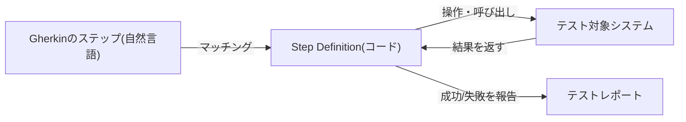
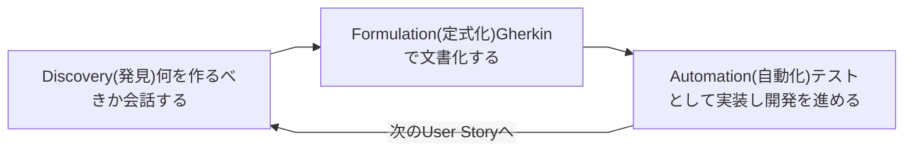
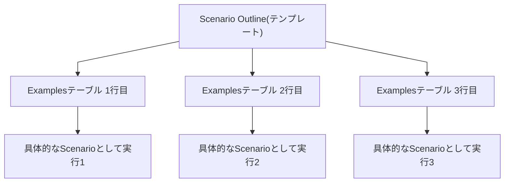
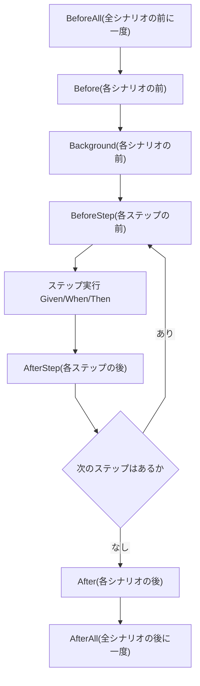
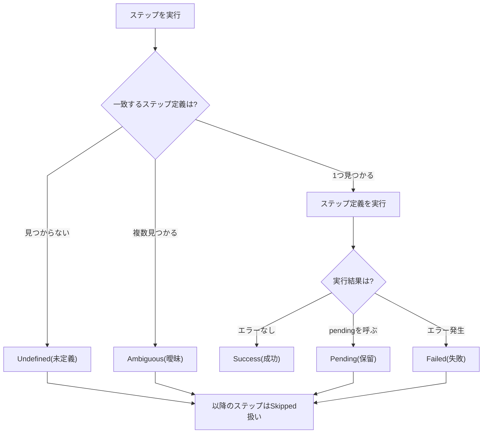
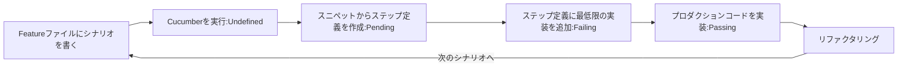
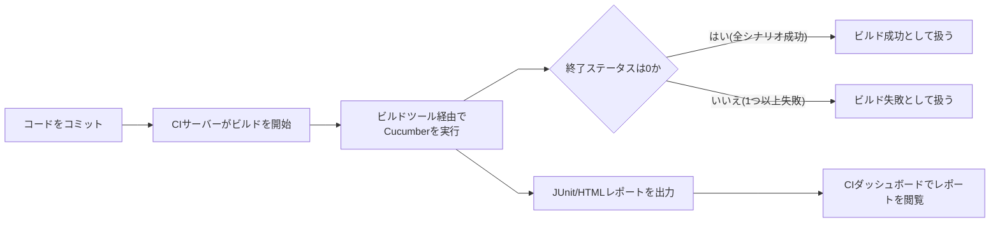

# Cucumber 入門ガイド ― BDD (振る舞い駆動開発) ではじめる自動テスト

> 本ガイドは [cucumber.io/docs](https://cucumber.io/docs) を中心とした公式ドキュメントの内容をもとに、Cucumberを初めて学ぶ方向けにステップバイステップでまとめたものです。各セクションの末尾に参照元URLを明記しています。

## 対象読者

- ソフトウェアテストやQAに関わり始めたばかりのエンジニア
- BDD (Behaviour-Driven Development) という言葉を聞いたことはあるが、実際に何をするものか分からない方
- Cucumberを使ったプロジェクトに参加することになったが、Gherkinの書き方から知りたい方

前提知識は不要です。プログラミングの基礎知識があれば読み進められます。

---

## 目次

1. [Cucumberとは何か](#1-cucumberとは何か)
2. [BDD (振る舞い駆動開発) を理解する](#2-bdd-振る舞い駆動開発-を理解する)
3. [Gherkin構文を理解する](#3-gherkin構文を理解する)
4. [ステップ定義 (Step Definitions) を書く](#4-ステップ定義-step-definitions-を書く)
5. [Cucumber Expressionsでステップを賢くマッチさせる](#5-cucumber-expressionsでステップを賢くマッチさせる)
6. [Hooks (フック) でセットアップ・後片付けを行う](#6-hooks-フック-でセットアップ後片付けを行う)
7. [Tags (タグ) でシナリオを整理する](#7-tags-タグ-でシナリオを整理する)
8. [ステップの実行結果を理解する](#8-ステップの実行結果を理解する)
9. [Cucumberをインストールする](#9-cucumberをインストールする)
10. [実践: 10分でCucumberを動かしてみる](#10-実践-10分でcucumberを動かしてみる)
11. [テスト結果をレポートする](#11-テスト結果をレポートする)
12. [ベストプラクティスとアンチパターン](#12-ベストプラクティスとアンチパターン)
13. [CI/CDに組み込む](#13-cicdに組み込む)
14. [エディタ・IDEサポート](#14-エディタideサポート)
15. [まとめと次のステップ](#15-まとめと次のステップ)
16. [参考文献・出典一覧](#16-参考文献出典一覧)

---

## 1. Cucumberとは何か

Cucumberは **Behaviour-Driven Development (BDD、振る舞い駆動開発)** をサポートするツールです。よくある誤解ですが、Cucumberは単体の「テストツール」ではなく、平易な自然言語で書かれた「実行可能な仕様書 (executable specification)」を読み取り、実際のソフトウェアがその仕様通りに動くかを検証するツールです。

仕様は複数の **example (例)** または **scenario (シナリオ)** の集まりとして表現されます。次のような形式です。

```gherkin
Scenario: Breaker guesses a word
  Given the Maker has chosen a word
  When the Breaker makes a guess
  Then the Maker is asked to score
```

各シナリオは **step (ステップ)** のリストであり、Cucumberはこのステップを順番に実行します。そして各シナリオについて成功 (✅) か失敗 (❌) かを示すレポートを生成します。

### Gherkinとの関係

Cucumberがシナリオを理解するためには、決められた文法ルールに従う必要があります。このルールを **Gherkin** と呼びます。Gherkinには3つの役割があります。

| 役割 | 説明 |
|---|---|
| 曖昧さのない実行可能仕様 | 人間にもコンピュータにも読める形式でシステムの振る舞いを定義する |
| Cucumberによる自動テスト | 書かれた仕様がそのまま自動テストとして実行される |
| ドキュメント | システムが実際にどう振る舞うかを文書化する |

Gherkinの文書は `.feature` という拡張子のテキストファイルに保存され、通常はソースコードと一緒にバージョン管理されます。

### ステップ定義との関係

Gherkinのステップとプログラムコードを結びつけるのが **Step Definition (ステップ定義)** です。ステップ定義は、ステップによって実行されるべきアクションを実際に処理するコードです。つまり、仕様(Gherkin)と実装(コード)をつなぐ「配線」の役割を果たします。

Cucumberの全体像を図にすると、次のような一方向の流れになります。



JavaScriptによるステップ定義の例:

```javascript
When('{maker} starts a game', maker => {
  maker.startGameWithWord({ word: 'whale' })
})
```

**参考:**
- [Introduction | Cucumber](https://cucumber.io/docs/)
- [Cucumber公式サイト](https://cucumber.io/)

---

## 2. BDD (振る舞い駆動開発) を理解する

CucumberはBDDというソフトウェア開発プロセスをサポートするために作られました。BDDそのものはCucumberより大きな概念であり、ツールの話ではなくチームの「働き方」の話です。

### BDDの3つの目的

BDDは、ビジネス側の人間と技術側の人間のギャップを埋めるための働き方であり、次の3点を重視します。

1. さまざまな役割の人が協力し、解決すべき問題について共通理解を築くこと
2. 小さく素早い反復作業でフィードバックと価値提供のスピードを上げること
3. システムの振る舞いに対して自動的に検証されるドキュメントを生み出すこと

BDDは既存のアジャイル手法(スクラムなど)を置き換えるものではなく、その上に乗せる「拡張機能」のようなものだと説明されています。

### Discovery → Formulation → Automation の3ステップ

BDDの日々の活動は、次の3段階の反復プロセスとしてまとめられます。

| 段階 | 英語名 | 内容 |
|---|---|---|
| 発見 | Discovery | User Storyについて、具体的な例を使ってチームで会話し、何を作るべきかを合意する |
| 定式化 | Formulation | 合意した例を、人間にもコンピュータにも読める形式(Gherkin)で文書化する |
| 自動化 | Automation | 文書化した例を1つずつ自動テストとして実装し、プロダクションコードを実装していく |



- **Discovery** では、「Discovery workshop(発見ワークショップ)」と呼ばれる構造化された会話を通じて、ユーザー視点の具体例からチームの共通理解を深めます。初めてBDDに取り組むなら、まずこのDiscoveryから始めるのが良いとされています。
- **Formulation** では、合意した例を実行可能な仕様として書き出します。これにより「本当にチーム全員が同じものを作ろうとしているか」を素早く確認できます。
- **Automation** では、1つの例をテストとして自動化し、そのテストを通すために最小限の実装を行います。実装が完了した自動化例は「ガードレール」として、将来の変更が既存の振る舞いを壊していないかを保証してくれます。

**参考:**
- [Behaviour-Driven Development | Cucumber](https://cucumber.io/docs/bdd/)

---

## 3. Gherkin構文を理解する

Gherkinは、平文テキストにCucumberが理解できる構造を与えるための、特別な**キーワード**の集合です。ほとんどの行はこれらのキーワードのいずれかで始まります。

### 主要キーワード一覧

| キーワード | コロン(:)が必要か | 役割 |
|---|---|---|
| `Feature` | 必要 | 機能の概要を説明し、関連するシナリオをグループ化する |
| `Rule` | 必要 | 1つのビジネスルールを表し、複数のシナリオをグループ化する(Gherkin 6以降) |
| `Example` / `Scenario` | 必要 | ビジネスルールを説明する具体的な例。両者は同義語 |
| `Given` | 不要 | シナリオの初期状態(過去に起きたこと)を記述する |
| `When` | 不要 | イベントやアクションを記述する |
| `Then` | 不要 | 期待される結果を記述する |
| `And` / `But` | 不要 | 直前のステップと同種のステップを読みやすく続ける |
| `*` | 不要 | Given/When/Thenの代わりに使える汎用のステップ記号 |
| `Background` | 必要 | すべてのシナリオの前に共通して実行するGivenステップをまとめる |
| `Scenario Outline` / `Scenario Template` | 必要 | 同じシナリオを異なる値で複数回実行するテンプレート |
| `Examples` / `Scenarios` | 必要 | Scenario Outlineに与えるデータ行の一覧 |

補助的なキーワードとして、`"""` (Doc Strings)、`|` (Data Tables)、`@` (Tags)、`#` (コメント) があります。

コメントは行頭に `#` を書くことで表現し、ブロックコメントはサポートされていません。インデントにはスペースまたはタブが使えますが、推奨はスペース2つです。

### Feature

`Feature` はGherkin文書の最初のキーワードで、機能の概要を短い文章で説明します。1つの `.feature` ファイルには `Feature` を1つだけ書けます。

```gherkin
Feature: Guess the word

  The word guess game is a turn-based game for two players.
  The Maker makes a word for the Breaker to guess. The game
  is over when the Breaker guesses the Maker's word.

  Example: Maker starts a game
```

`Feature` の直下に書ける自由記述の説明文は、Cucumberの実行には影響しませんが、公式HTMLフォーマッタなどのレポートには表示されます。

### Rule (Gherkin 6以降)

`Rule` は「1つのビジネスルール」を表すためのオプションのキーワードです。関連する複数のシナリオをまとめる役割を持ちます。

```gherkin
Feature: Highlander
  Rule: There can be only One

    Example: Only One -- More than one alive
      Given there are 3 ninjas
      And there are more than one ninja alive
      When 2 ninjas meet, they will fight
      Then one ninja dies (but not me)
      And there is one ninja less alive

    Example: Only One -- One alive
      Given there is only 1 ninja alive
      Then they will live forever ;-)
```

### Example / Scenario とステップ

`Example` (`Scenario` はその同義語) は、あるビジネスルールを説明する具体的な例です。ステップ数は3〜5個程度が推奨されており、多すぎると仕様・ドキュメントとしての表現力が失われてしまいます。

シナリオは基本的に次の3部構成に従います。

- 初期状態を表す `Given` ステップ
- イベントを表す `When` ステップ
- 期待される結果を表す `Then` ステップ

Cucumberはキーワード自体をステップの識別には使いません。つまり、次の2つのステップは(キーワードが違っても)**同じ意味の重複したステップ**とみなされます。

```gherkin
Given there is money in my account
Then there is money in my account
```

これは制約というより、より明確な言葉を使うよう促す仕組みです。次のように書き換えると意図が明確になります。

```gherkin
Given my account has a balance of £430
Then my account should have a balance of £430
```

#### Given

`Given` は「シナリオの舞台設定」であり、通常は過去に起きたことを表します。Cucumberがこのステップを実行するときは、システムを既知の状態にします(オブジェクトの作成、テストDBへのデータ投入など)。ユーザー操作の話はここに書かず、`When` に譲ります。

#### When

`When` はイベントやアクション、つまり人やほかのシステムがシステムと相互作用する場面を表します。実装の詳細(UIのボタン名など)は避け、「1922年に(コンピュータがなかった時代に)人が手作業で行える操作」をイメージして書くとよい、とされています。

#### Then

`Then` は期待される結果を表します。ステップ定義側ではアサーション(実際の結果と期待される結果の比較)を行います。検証すべきなのは「外部から観測できる出力」(画面表示やメッセージなど)であり、データベースの中身のような外部から見えないものを直接検証するのは避けるべきとされています。

#### And, But, *

連続する `Given` や `Then` は `And` / `But` で読みやすく続けられます。

```gherkin
Example: Multiple Givens
  Given one thing
  And another thing
  And yet another thing
  When I open my eyes
  Then I should see something
  But I shouldn't see something else
```

また、箇条書きのように見せたい場合はアスタリスク `*` も使えます。

```gherkin
Scenario: All done
  Given I am out shopping
  * I have eggs
  * I have milk
  * I have butter
  When I check my list
  Then I don't need anything
```

### Background

複数のシナリオで同じ `Given` ステップが繰り返される場合、それらは「本質的でない前提条件」である可能性が高いので、`Background` としてまとめられます。`Background` は最初の `Scenario` より前、同じインデントレベルに配置します。

```gherkin
Feature: Multiple site support
  Only blog owners can post to a blog, except administrators,
  who can post to all blogs.

  Background:
    Given a global administrator named "Greg"
    And a blog named "Greg's anti-tax rants"
    And a customer named "Dr. Bill"
    And a blog named "Expensive Therapy" owned by "Dr. Bill"

  Scenario: Dr. Bill posts to his own blog
    Given I am logged in as Dr. Bill
    When I try to post to "Expensive Therapy"
    Then I should see "Your article was published."
```

`Background` は `Feature` または `Rule` ごとに1つしか持てません。異なるシナリオ群で異なるBackgroundが必要な場合は、`Rule` や `Feature` を分割することが推奨されています。

`Background` を使う際のポイント:

- 複雑な状態設定には使わない(クライアントに関係ない詳細ならより抽象的なステップにする)
- 短く保つ(4行を超えたら見直しを検討)
- 印象的な固有名詞を使い、ストーリーとして記憶しやすくする
- シナリオ自体も短く保つ(Backgroundが画面外にスクロールすると全体像が把握しづらくなる)

### Scenario Outline と Examples

同じシナリオを異なる値の組み合わせで何度も実行したい場合、コピー&ペーストは非効率です。`Scenario Outline` を使うと `< >` で囲んだパラメータでテンプレート化できます。

```gherkin
Scenario Outline: eating
  Given there are <start> cucumbers
  When I eat <eat> cucumbers
  Then I should have <left> cucumbers

  Examples:
    | start | eat | left |
    |    12 |   5 |    7 |
    |    20 |   5 |   15 |
```

`Scenario Outline` は1つ以上の `Examples` セクションを必ず持ち、そのテーブルの各行(見出し行を除く)ごとに1回ずつ実行されます。



### Step Arguments: Doc StringsとData Tables

1行に収まらない大きなデータをステップに渡したいとき、GherkinにはDoc StringsとData Tablesという仕組みがあります。

#### Doc Strings

`"""` (または3つのバッククォート) で囲むことで、長いテキストをステップ定義に渡せます。ステップ定義側では、このテキストを自動的に最後の引数として受け取ります。

```gherkin
Given a blog post named "Random" with Markdown body
  """
  Some Title, Eh?
  ===============
  Here is the first paragraph of my blog post. Lorem ipsum dolor sit amet,
  consectetur adipiscing elit.
  """
```

コンテンツタイプ(`"""markdown` のように)を明示的に指定することもできます。

#### Data Tables

`|` で区切ったテーブル形式で、値のリストをステップ定義に渡せます。こちらもDoc Stringsと同様、ステップ定義の最後の引数として渡されます。

```gherkin
Given the following users exist:
  | name   | email             | twitter         |
  | Aslak  | aslak@example.com | @aslak_hellesoy |
  | Julien | julien@example.com | @jbpros        |
```

セル内で改行を使いたい場合は `\n`、`|` 自体を使いたい場合は `\|`、`\` を使いたい場合は `\\` とエスケープします。

### Spoken Languages (多言語対応)

Gherkinは70以上の話し言葉にローカライズされています。ファイルの先頭に `# language: xx` ヘッダーを書くことで、日本語を含む各国語のキーワードを使うことができます(省略した場合は英語 `en` が使われます)。

```gherkin
# language: no
Funksjonalitet: Gjett et ord
  Eksempel: Ordmaker starter et spill
    Når Ordmaker starter et spill
    Så må Ordmaker vente på at Gjetter blir med
```

Gherkinで使う言語は、その分野の専門家(ドメインエキスパート)が普段使っている言語と合わせるべきとされています。翻訳による齟齬を避けるためです。

**参考:**
- [Gherkin Reference | Cucumber](https://cucumber.io/docs/gherkin/reference)
- [Gherkin Localisation | Cucumber](https://cucumber.io/docs/gherkin/languages)

---

## 4. ステップ定義 (Step Definitions) を書く

**Step Definition** は、1つ以上のGherkinステップと結びつく「式(expression)」を持ったメソッドです。Cucumberはシナリオ内のGherkinステップを実行するとき、マッチするステップ定義を探して実行します。

例えば次のシナリオがあるとします。

```gherkin
Scenario: Some cukes
  Given I have 48 cukes in my belly
```

`Given` の後ろのテキスト `I have 48 cukes in my belly` は、次のようなステップ定義とマッチします(Java の例)。

```java
package com.example;

import io.cucumber.java.en.Given;

public class StepDefinitions {

    @Given("I have {int} cukes in my belly")
    public void i_have_n_cukes_in_my_belly(int cukes) {
        System.out.format("Cukes: %d\n", cukes);
    }
}
```

JavaScriptでは次のように書きます。

```javascript
const { Given } = require('@cucumber/cucumber')

Given('I have {int} cukes in my belly', function (cukes) {
  console.log(`Cukes: ${cukes}`)
});
```

### マッチングの仕組み

1. Cucumberはステップの文字列をステップ定義の正規表現(またはCucumber Expression)と照合する
2. 一致した場合、キャプチャグループや変数を取り出す
3. それらを引数としてステップ定義のメソッドに渡し、実行する

ステップ定義の**先頭のキーワード(Given/When/Then/And/But)自体には意味がなく**、登録・検索の際は無視されます。つまり `Given` で定義したステップを `Then` として呼び出すこともできます。

### 式 (Expressions) の種類

ステップ定義の式には、**正規表現(Regular Expression)** または **Cucumber Expression** のどちらかを使えます。正規表現の場合、キャプチャグループがそのままステップ定義メソッドの引数として渡されます。Cucumber Expressionを使う場合は、パラメータタイプの `regexp` と一致するキャプチャグループが自動的に型変換されます。上の例では `{int}` パラメータタイプの正規表現が `\d+` であるため、`cukes` 引数は自動的に整数型に変換されます。

**参考:**
- [Step definitions | Cucumber](https://cucumber.io/docs/cucumber/step-definitions)

---

## 5. Cucumber Expressionsでステップを賢くマッチさせる

**Cucumber Expressions** は正規表現の代替となる、より直感的な構文です。例えば次のGherkinステップ(`Given` を除く)にマッチさせたいとします。

```
I have 42 cucumbers in my belly
```

最もシンプルな方法はテキストそのままを書くことですが、`{int}` という**出力パラメータ**を使えばより汎用的に書けます。

```
I have {int} cucumbers in my belly
```

このように書くと、テキストとマッチしたときに `42` という数値が `{int}` パラメータから抽出され、ステップ定義に渡されます。

### 組み込みパラメータタイプ

| パラメータタイプ | 説明 |
|---|---|
| `{int}` | 整数にマッチ (例: `71`, `-19`)。プラットフォームが対応していれば32bit符号付き整数に変換 |
| `{float}` | 浮動小数点数にマッチ (例: `3.6`, `.8`, `-9.2`)。32bit floatに変換 |
| `{word}` | 空白を含まない単語にマッチ (例: `banana`。`banana split` にはマッチしない) |
| `{string}` | シングルクォートまたはダブルクォートで囲まれた文字列にマッチ (例: `"banana split"`) |
| `{}` (匿名) | あらゆる文字列にマッチ (`/.*/` と同等) |
| `{bigdecimal}` | `{float}` と同様だが `BigDecimal` に変換 |
| `{double}` | `{float}` と同様だが64bit floatに変換 |
| `{biginteger}` | `{int}` と同様だが `BigInteger` に変換 |
| `{byte}` / `{short}` / `{long}` | `{int}` と同様だが、それぞれ8/16/64bit整数に変換 |

### オプションのテキスト

「1 cucumbers」は文法的に誤りなので、複数形の `s` をオプションにしたい場合は括弧で囲みます。

```
I have {int} cucumber(s) in my belly
```

正規表現では括弧はキャプチャグループを意味しますが、Cucumber Expressionsでは「オプションのテキスト」を意味する点に注意してください。

### 代替テキスト

言い回しの揺らぎを許容したい場合はスラッシュで代替候補を区切ります(間に空白は入れられません)。

```
I have {int} cucumber(s) in my belly/stomach
```

### エスケープ

`()` や `{}` をリテラルとしてマッチさせたい場合は、バックスラッシュでエスケープします。

```
I have {int} \{what} cucumber(s) in my belly \(amazing!)
```

### カスタムパラメータタイプ

独自の型に自動変換したい場合は、カスタムパラメータタイプを定義できます。例えば `{color}` というパラメータを `Color` オブジェクトに変換する場合(JavaScript/TypeScriptの例):

```javascript
import { defineParameterType } from '@cucumber/cucumber'

defineParameterType({
    name: 'color',
    regexp: /red|blue|yellow/,
    transformer: s => new Color(s)
})
```

カスタムパラメータタイプ定義時の主な引数は以下の通りです。

| 引数 | 説明 |
|---|---|
| `name` | 出力パラメータとして認識される名前 |
| `regexp` | パラメータにマッチする正規表現(キャプチャグループを含んでもよい) |
| `type` | 変換後の戻り値の型 |
| `transformer` | 正規表現のマッチ結果を変換する関数 |
| `useForSnippets` | デフォルト `true`。未定義ステップのスニペット生成に使うかどうか |
| `preferForRegexpMatch` | デフォルト `false`。正規表現を使うステップ定義でこのパラメータタイプを優先するかどうか |

**参考:**
- [Cucumber Expressions | Cucumber](https://cucumber.io/docs/cucumber/cucumber-expressions)
- [cucumber/cucumber-expressions (GitHub README)](https://github.com/cucumber/cucumber-expressions#readme)

---

## 6. Hooks (フック) でセットアップ・後片付けを行う

**Hooks** はCucumberの実行サイクルの様々なタイミングで実行できるコードのブロックで、主に各シナリオの前後の環境セットアップ・後片付けに使われます。フックをどこで宣言するかは、どのシナリオ・ステップに適用されるかには影響しません(タグを使えば絞り込めます)。

### フックの種類

| フック | 実行タイミング |
|---|---|
| `Before` | 各シナリオの最初のステップの前 |
| `After` | 各シナリオの最後のステップの後(結果がfailed/undefined/pending/skippedでも実行される) |
| `Around`(Rubyのみ) | シナリオの実行を丸ごと囲む |
| `BeforeStep` | 各ステップの前 |
| `AfterStep` | 各ステップの後 |
| `BeforeAll` | 全シナリオの実行前に一度だけ |
| `AfterAll` | 全シナリオの実行後に一度だけ |

`Before` フックで行ったことは、Featureファイルだけを読む人には見えません。読みやすさを重視するなら、`Background` を使うことを検討し、`Before` フックはブラウザの起動やDBのクリーンアップのような低レベルな処理に限定するのがよいとされています。

### シナリオ実行のライフサイクル



### コード例(JavaScript)

```javascript
const { Before, After } = require('@cucumber/cucumber')

Before(async function () {
  // 各シナリオの前に実行する処理
})

After(async function (scenario) {
  // 各シナリオの後に実行する処理
  // scenario引数から成功/失敗の状態を取得できる
})
```

### 実行順序の指定

複数のフックがある場合、明示的な順序を指定できます(Javaの例)。

```java
@Before(order = 10)
public void doSomething(){
    // 各シナリオの前に実行する処理
}
```

### 条件付きフック (Conditional Hooks)

タグ式を使うことで、特定のシナリオにのみフックを適用できます。

```java
@After("@browser and not @headless")
public void doSomethingAfter(Scenario scenario){
    driver.quit()
}
```

**参考:**
- [Cucumber reference | Cucumber (Hooksセクション)](https://cucumber.io/docs/cucumber/api/#hooks)

---

## 7. Tags (タグ) でシナリオを整理する

**Tags** はFeatureやScenarioを整理するための仕組みです。主に次の2つの目的で使われます。

- シナリオの一部だけを実行する
- フックを特定のシナリオ群にのみ適用する(条件付きフック)

タグは `Feature`、`Rule`、`Scenario`、`Scenario Outline`、`Examples` の上に置くことができます。`Background` やステップ (`Given`/`When`/`Then` など) の上には置けません。

```gherkin
@billing
Feature: Verify billing

  @important
  Scenario: Missing product description
    Given hello

  Scenario: Several products
    Given hello
```

1つの要素に複数のタグを付けることもできます(スペース区切り)。

```gherkin
@billing @bicker @annoy
Feature: Verify billing
```

### タグの継承

タグは子要素に継承されます。`Feature` に付けたタグは `Rule`、`Scenario`、`Scenario Outline`、`Examples` に継承され、同様に `Scenario Outline` に付けたタグは `Examples` に継承されます。

### タグ式 (Tag Expressions)

タグ式は「中置のブール式」で、次のような書き方ができます。

| タグ式 | 意味 |
|---|---|
| `@fast` | `@fast` タグが付いたシナリオ |
| `@wip and not @slow` | `@wip` が付いていて、かつ `@slow` が付いていないシナリオ |
| `@smoke and @fast` | `@smoke` と `@fast` の両方が付いたシナリオ |
| `@gui or @database` | `@gui` または `@database` のどちらかが付いたシナリオ |
| `(@smoke or @ui) and (not @slow)` | 括弧でグループ化した、より複雑な条件式 |

### タグを使った一部シナリオの実行

Maven(Java)の例:

```shell
mvn test -Dcucumber.filter.tags="@smoke and @fast"
```

Cucumber-JSの例:

```shell
./node_modules/.bin/cucumber.js --tags "@smoke and @fast"
```

逆に特定のタグを除外して実行したい場合は `not` を使います。

```shell
cucumber --tags "not @smoke"
```

### タグをドキュメントとして活用する

タグは外部システム(要件管理ツール、課題管理ツールなど)のIDと紐づけたり、開発プロセス上の状態(`@qa_ready` など)を表すためにも使えます。

```gherkin
@BJ-x98.77 @BJ-z12.33
Feature: Convert transaction
```

**参考:**
- [Cucumber reference | Cucumber (Tagsセクション)](https://cucumber.io/docs/cucumber/api/#tags)

---

## 8. ステップの実行結果を理解する

Cucumberの各ステップは、実行後に次のいずれかの結果になります。

| 結果 | 色 | 説明 |
|---|---|---|
| Success(成功) | 緑 | マッチするステップ定義が見つかり、エラーなく実行された |
| Undefined(未定義) | 黄 | マッチするステップ定義が見つからなかった。以降のステップはSkippedになる |
| Pending(保留) | 黄 | ステップ定義内で `pending` メソッドが呼ばれた。「まだ実装が必要」という意味 |
| Failed(失敗) | 赤 | ステップ定義の実行中にエラー(アサーション失敗など)が発生した |
| Skipped(スキップ) | シアン | Undefined/Pending/Failedの後に続くステップは実行されない |
| Ambiguous(曖昧) | ― | 同じステップに複数のステップ定義がマッチしてしまい、Cucumberが解決できない状態 |

ステップ定義から何を `return` しても、その値自体には意味がありません(`null` や `false` を返しても失敗にはなりません)。失敗として扱われるのは、あくまでエラー(例外)が発生した場合です。



**参考:**
- [Cucumber reference | Cucumber (Step resultsセクション)](https://cucumber.io/docs/cucumber/api/#step-results)

---

## 9. Cucumberをインストールする

Cucumberはほとんどの主要なプログラミング言語に対応しています。公式は「プロダクションコードと同じプラットフォーム・言語の実装を選ぶこと」を推奨しています。

実装は次の4種類に分類されます。

| 分類 | 説明 |
|---|---|
| official(公式) | [cucumber](https://github.com/cucumber) 組織でホストされている |
| semi-official(準公式) | 別の場所でホストされているが、cucumberのコンポーネントを利用している |
| unofficial(非公式) | 別の場所でホストされ、cucumberのコンポーネントを使っていない |
| unmaintained(メンテナンスされていない) | 公式だが、メンテナが不在で更新が止まっている |

### 主な言語別実装(抜粋)

| 実装 | 言語 | 分類 |
|---|---|---|
| Cucumber-JS | JavaScript | official |
| Cucumber-JVM | Java / Kotlin | official |
| Cucumber-Ruby | Ruby | official |
| Cucumber-Scala | Scala | official |
| Cucumber.cpp | C++ | official |
| Behat | PHP | semi-official |
| Behave | Python | semi-official |
| Pytest-BDD | Python | semi-official |
| Reqnroll | .NET (C#, F#, VB) | semi-official |
| gocuke | Go | semi-official |
| Cucumber-Rust | Rust | unofficial |

### JavaScriptでのインストール例

Cucumber-JSはnpmパッケージとして提供されています。

```shell
npm install --save-dev @cucumber/cucumber
```

**参考:**
- [Installation | Cucumber](https://cucumber.io/docs/installation/)
- [Cucumber-JS | Cucumber](https://cucumber.io/docs/installation/javascript)

---

## 10. 実践: 10分でCucumberを動かしてみる

ここでは公式の「10-minute tutorial」の流れに沿って、Cucumberを使ったBDDの基本的なワークフローを確認します(例はJavaベースです)。

### BDDのワークフロー全体像



### ステップ1: プロジェクトを作成する

Maven archetypeを使ってプロジェクトを作成します。

```shell
mvn archetype:generate \
"-DarchetypeGroupId=io.cucumber" \
"-DarchetypeArtifactId=cucumber-archetype" \
"-DarchetypeVersion=7.34.3" \
"-DgroupId=hellocucumber" \
"-DartifactId=hellocucumber" \
"-Dpackage=hellocucumber" \
"-Dversion=1.0.0-SNAPSHOT" \
"-DinteractiveMode=false"
```

### ステップ2: インストールを確認する

```shell
mvn test
```

「0 scenarios」のように、まだ何も実行対象がないことが表示されればOKです。

### ステップ3: シナリオを書く

`src/test/resources/hellocucumber/is_it_friday_yet.feature` を作成します。

```gherkin
Feature: Is it Friday yet?
  Everybody wants to know when it's Friday

  Scenario: Sunday isn't Friday
    Given today is Sunday
    When I ask whether it's Friday yet
    Then I should be told "Nope"
```

### ステップ4: Undefinedを確認する

再度 `mvn test` を実行すると、1つのシナリオと3つのステップが `undefined` と報告され、実装のスニペットが提案されます。

```java
@Given("today is Sunday")
public void today_is_Sunday() {
    // Write code here that turns the phrase above into concrete actions
    throw new io.cucumber.java.PendingException();
}
```

このスニペットを `src/test/java/hellocucumber/StepDefinitions.java` にコピーします。

### ステップ5: Pendingを確認する

再実行すると、ステップ定義は見つかったものの `PendingException` により「保留」として報告されます。まだ実装が必要という意味です。

### ステップ6: Failingにしてみる

コメントに書かれている通り、フレーズを具体的な処理に置き換えます。

```java
public class StepDefinitions {
    private String today;
    private String actualAnswer;

    @Given("today is Sunday")
    public void today_is_Sunday() {
        today = "Sunday";
    }

    @When("I ask whether it's Friday yet")
    public void i_ask_whether_it_s_Friday_yet() {
        actualAnswer = IsItFriday.isItFriday(today);
    }

    @Then("I should be told {string}")
    public void i_should_be_told(String expectedAnswer) {
        assertThat(actualAnswer).isEqualTo(expectedAnswer);
    }
}
```

`isItFriday` メソッドはまだ `null` を返す仮実装なので、テストは失敗(Failing)します。これは意図した動作です。

### ステップ7: Passingにする

最小限の実装でテストを通します。

```java
static String isItFriday(String today) {
    return "Nope";
}
```

これで最初のシナリオがグリーン(Passing)になります。

### ステップ8: もう1つのシナリオを追加する

「Friday」の場合も検証するシナリオを追加し、対応するステップ定義も追加します。すると2つ目のシナリオは失敗するので、正しいロジックを実装します。

```java
static String isItFriday(String today) {
    return "Friday".equals(today) ? "TGIF" : "Nope";
}
```

### ステップ9: Scenario Outlineでまとめる

すべての曜日を検証したくなったら、`Scenario` を `Scenario Outline` に書き換え、`Examples` テーブルでまとめます。

```gherkin
Feature: Is it Friday yet?
  Everybody wants to know when it's Friday

  Scenario Outline: Today is or is not Friday
    Given today is "<day>"
    When I ask whether it's Friday yet
    Then I should be told "<answer>"

  Examples:
    | day             | answer |
    | Friday          | TGIF   |
    | Sunday          | Nope   |
    | anything else!  | Nope   |
```

ステップ定義側も、文字列をそのまま受け取る形に一本化します。

```java
@Given("today is {string}")
public void today_is(String today) {
    this.today = today;
}
```

これで3つのシナリオ(9ステップ)がすべてパスします。

### ステップ10: リファクタリングする

テストが通った状態(グリーン)になったら、次のようなリファクタリングを検討します。

- `isItFriday` メソッドをテストコードからプロダクションコードへ移動する
- 複数箇所で使うヘルパーメソッドをステップ定義から抽出する

このように「Given実装→Undefined→Pending→Failing→Passing→リファクタリング」というサイクルを繰り返すことが、CucumberによるBDDの基本ワークフローです。

**参考:**
- [10-minute tutorial | Cucumber](https://cucumber.io/docs/guides/10-minute-tutorial)

---

## 11. テスト結果をレポートする

Cucumberは「レポータープラグイン(フォーマッタ)」を使って、シナリオの成功・失敗に関する情報を含むレポートを生成します。

### Cucumber Reportsサービス

最も手軽に始められる方法は、[Cucumber Reports](https://reports.cucumber.io/) というホスティングサービスにレポートを送信することです。以下のバージョン以降で対応しています。

| 実装 | 対応バージョン |
|---|---|
| Cucumber-JVM | 6.7.0以降 |
| Cucumber-Ruby | 5.1.1以降 |
| Cucumber-JS | 7.0.0以降 |

### ビルトインのレポータープラグイン

外部サービスを使わずローカルでレポートを生成したい場合、次のビルトインフォーマッタが使えます。

| フォーマッタ名 | 概要 |
|---|---|
| `message` | Cucumber Messages形式の生データを出力 |
| `progress` | ドットで進捗を表示するシンプルな形式 |
| `pretty` | 人が読みやすい形式でコンソールに出力 |
| `html` | HTMLレポートを生成 |
| `json` | JSON形式でレポートを出力 |
| `rerun` | 失敗したシナリオだけを再実行するためのファイルを出力 |
| `junit` | JUnit形式のXMLレポートを出力(多くのCIツールが解釈可能) |
| `testng` | TestNG形式のレポート(JVMのみ) |

### カスタムフォーマッタ

Cucumberの各実装は拡張可能なため、独自のフォーマッタを作成したり、サードパーティ製のフォーマッタ(Allure、Masterthoughtなど)を利用することもできます。フォーマッタはイベントベースのAPIで動作し、Cucumber Messagesという共通の仕様に基づいています。

**参考:**
- [Reporting | Cucumber](https://cucumber.io/docs/cucumber/reporting)

---

## 12. ベストプラクティスとアンチパターン

### 宣言的スタイル vs 命令的スタイル

Gherkinシナリオは**何が起こるか(What)**を書くべきであり、**どうやって実現するか(How)**を書くべきではありません。次の2つの書き方を比較します。

**命令的(避けたい)スタイル:**

```gherkin
Given I visit "/login"
When I enter "Bob" in the "user name" field
  And I enter "tester" in the "password" field
  And I press the "login" button
Then I should see the "welcome" page
```

**宣言的(推奨される)スタイル:**

```gherkin
When "Bob" logs in
```

命令的スタイルは実装の詳細(URL、フィールド名、ボタン名)に強く依存するため、実装が変わるたびにシナリオも修正が必要になります。宣言的スタイルであれば、ログイン方法がパスワード認証から生体認証に変わっても、シナリオ自体は変更せずに済みます。

「実装が変わったら、この記述も変える必要があるか?」と自問し、答えが「はい」なら実装依存の記述を見直す、というのが良い目安です。

### アンチパターン1: Feature-coupled step definitions(機能に結合したステップ定義)

特定のFeatureやScenarioでしか再利用できないステップ定義は、ステップ定義の爆発的な増加、コードの重複、保守コストの増大を招きます。

**対策:**

- ステップ定義はドメイン概念ごとに整理する(Feature名やScenario名ではなく)
- 例: `EmployeeStepDefinitions.java`、`EducationStepDefinitions.java`、`AuthenticationStepDefinitions.java` のように分割する

### アンチパターン2: Conjunction steps(接続詞的ステップ)

複数の異なる要素を1つのステップに詰め込むと、そのステップは特殊化しすぎて再利用性が下がります。

```gherkin
# 避けたい書き方
Given I have shades and a brand new Mustang
```

```gherkin
# 望ましい書き方
Given I have shades
And I have a brand new Mustang
```

Cucumberが `And`/`But` をサポートしているのは、まさにこのようなケースのためです。

### ステップ定義の整理

プロジェクトが成長するにつれ、ステップ定義は意味のあるグループに分割すべきです。

- 主要なドメインオブジェクトごとに1ファイルを用意する
- 実際に使われていないステップ定義は書かない(不要なコードは掃除が必要な「残骸」になる)
- 似たようなステップ定義の重複を避け、ヘルパーメソッドで抽象化する

```gherkin
# 重複しがちな例
Given I go to the home page
Given I check the about page of the website
Given I get the contact details
```

```gherkin
# ヘルパーメソッドで抽象化した例
Given I go to the {string} page
```

Cucumberは対象のプログラミング言語のDSLラッパーに過ぎないため、ステップ定義ファイルの中では通常のプログラミング言語の機能(ヘルパーメソッドの抽出など)を自由に使えます。ただし、Feature ファイルの中の記述は必ずGherkin構文に従う必要があります。

**参考:**
- [Writing better Gherkin | Cucumber](https://cucumber.io/docs/bdd/better-gherkin)
- [Anti-patterns | Cucumber](https://cucumber.io/docs/guides/anti-patterns)
- [Step organization | Cucumber](https://cucumber.io/docs/gherkin/step-organization)

---

## 13. CI/CDに組み込む

CucumberをCI(継続的インテグレーション)環境で使うのは比較的シンプルです。`cucumber` の実行コマンドは、1つでもシナリオが失敗すると `0` 以外の終了ステータス(exit status)を返します。CIサーバーはこの終了ステータスだけを見れば、ビルドを成功/失敗として扱えます。

### 典型的な構成

多くのCI構成は何らかのビルドツールを経由してCucumberを実行します。代表的なビルドツールは次の通りです。

- Rake(Ruby)
- Ant(Java)
- Maven(Java)

### JUnit形式の出力を使う

多くのCIサーバーは、Ant JUnitタスクが生成するXML形式のレポートを解釈してHTML表示できます。中には時系列のレポートを作れるものもあります。このようなCIサーバーを使っている場合は、Cucumberの `JUnit` フォーマッタを使うことが推奨されます。

例えばJenkinsでは、ビルドステップとして `cucumber -f junit --out WORKSPACE` を追加し、「Publish JUnit test result report」を有効化して `*.xml` をテストレポートのXMLパスに指定することで、Cucumberのレポートを取り込めます。

### Jenkins用プラグイン

Jenkinsには専用の [Cucumber Reports plugin](https://github.com/jenkinsci/cucumber-reports-plugin) が用意されており、見やすいレポートを生成できます。



**参考:**
- [Continuous Integration | Cucumber](https://cucumber.io/docs/guides/continuous-integration)

---

## 14. エディタ・IDEサポート

主要なテキストエディタの多くは、Gherkin構文のシンタックスハイライトに対応しています。一部のIDEは、IDE内からCucumberを実行したり、結果を表示したり、GherkinステップとStep Definitionの間をジャンプしたりする高度な機能も備えています。

| エディタ/IDE | サポート内容 |
|---|---|
| Visual Studio Code | 「Cucumber for VSCode」(公式)や「Cucumber (Gherkin) Full Support」などの拡張機能でGherkinをサポート |
| Atom | Cucumber向けの各種パッケージが利用可能 |
| TextMate | `Cucumber.tmbundle` によるサポート |
| Nova | Cucumber拡張機能によるGherkin言語サポート |
| IntelliJ IDEA / Eclipse | Java向けのCucumberプラグインでシナリオの実行・ナビゲーションが可能 |

**参考:**
- [Tools | Cucumber](https://cucumber.io/docs/tools/)

---

## 15. まとめと次のステップ

このガイドで扱った内容を振り返ります。

1. **Cucumberとは**: Gherkinで書かれた実行可能な仕様を検証するBDDツール
2. **BDDの本質**: Discovery(発見) → Formulation(定式化) → Automation(自動化) という協働のプロセス
3. **Gherkin構文**: Feature、Rule、Scenario、Given/When/Then、Background、Scenario Outlineなど
4. **Step Definitions**: Gherkinのステップと実装コードをつなぐ「配線」
5. **Cucumber Expressions**: 正規表現よりも読みやすいステップのマッチング方法
6. **Hooks**: シナリオの前後で共通処理を行う仕組み
7. **Tags**: シナリオを整理し、一部だけ実行するための仕組み
8. **ステップの実行結果**: Success/Undefined/Pending/Failed/Skipped/Ambiguousの6種類
9. **インストール**: 使用中の言語に応じた公式・準公式の実装を選ぶ
10. **10分チュートリアル**: Undefined→Pending→Failing→Passingのサイクルを体験
11. **レポーティング**: ビルトインフォーマッタやCucumber Reportsサービスの活用
12. **ベストプラクティス**: 宣言的スタイル、ステップの整理、アンチパターンの回避
13. **CI/CD**: 終了ステータスとJUnit形式の出力を使ったビルド連携

### 次に学ぶと良いこと

- 実際に手を動かして [10-minute tutorial](https://cucumber.io/docs/guides/10-minute-tutorial) を自分の使用言語で試す
- チームで [Example Mapping](https://cucumber.io/docs/bdd/example-mapping) ワークショップを行い、Discoveryを体験する
- [Browser automation](https://cucumber.io/docs/guides/browser-automation) や [API automation](https://cucumber.io/docs/guides/api-automation) のガイドを読み、実際のテスト自動化に応用する
- [Parallel execution](https://cucumber.io/docs/guides/parallel-execution) を読み、テスト実行時間を短縮する方法を学ぶ

---

## 16. 参考文献・出典一覧

本ガイドの作成にあたり参照した、Cucumber公式ドキュメントおよび関連リポジトリのURL一覧です(2026年7月時点の情報)。

| No. | ページ | URL |
|---|---|---|
| 1 | Introduction | https://cucumber.io/docs/ |
| 2 | Cucumber公式サイト | https://cucumber.io/ |
| 3 | Behaviour-Driven Development | https://cucumber.io/docs/bdd/ |
| 4 | Writing better Gherkin | https://cucumber.io/docs/bdd/better-gherkin |
| 5 | Gherkin Reference | https://cucumber.io/docs/gherkin/reference |
| 6 | Gherkin Localisation | https://cucumber.io/docs/gherkin/languages |
| 7 | Step organization | https://cucumber.io/docs/gherkin/step-organization |
| 8 | Step definitions | https://cucumber.io/docs/cucumber/step-definitions |
| 9 | Cucumber reference (Hooks / Tags / Steps) | https://cucumber.io/docs/cucumber/api/ |
| 10 | Cucumber Expressions | https://cucumber.io/docs/cucumber/cucumber-expressions |
| 11 | cucumber/cucumber-expressions (README) | https://github.com/cucumber/cucumber-expressions#readme |
| 12 | Reporting | https://cucumber.io/docs/cucumber/reporting |
| 13 | State (sharing state, dependency injection) | https://cucumber.io/docs/cucumber/state |
| 14 | Installation | https://cucumber.io/docs/installation/ |
| 15 | Cucumber-JS Installation | https://cucumber.io/docs/installation/javascript |
| 16 | Guides (index) | https://cucumber.io/docs/guides/ |
| 17 | 10-minute tutorial | https://cucumber.io/docs/guides/10-minute-tutorial |
| 18 | Anti-patterns | https://cucumber.io/docs/guides/anti-patterns |
| 19 | Continuous Integration | https://cucumber.io/docs/guides/continuous-integration |
| 20 | Tools | https://cucumber.io/docs/tools/ |
| 21 | Terminology | https://cucumber.io/docs/terms/ |

> 注記: Cucumber公式ドキュメントは継続的に更新されています。本ガイド内の情報は取得時点(2026年7月)のものであり、最新の詳細は上記URLから直接ご確認ください。
