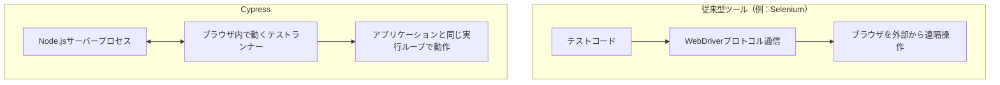
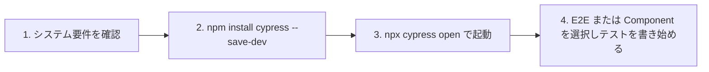
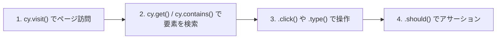
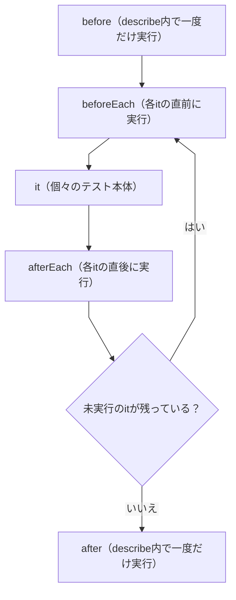
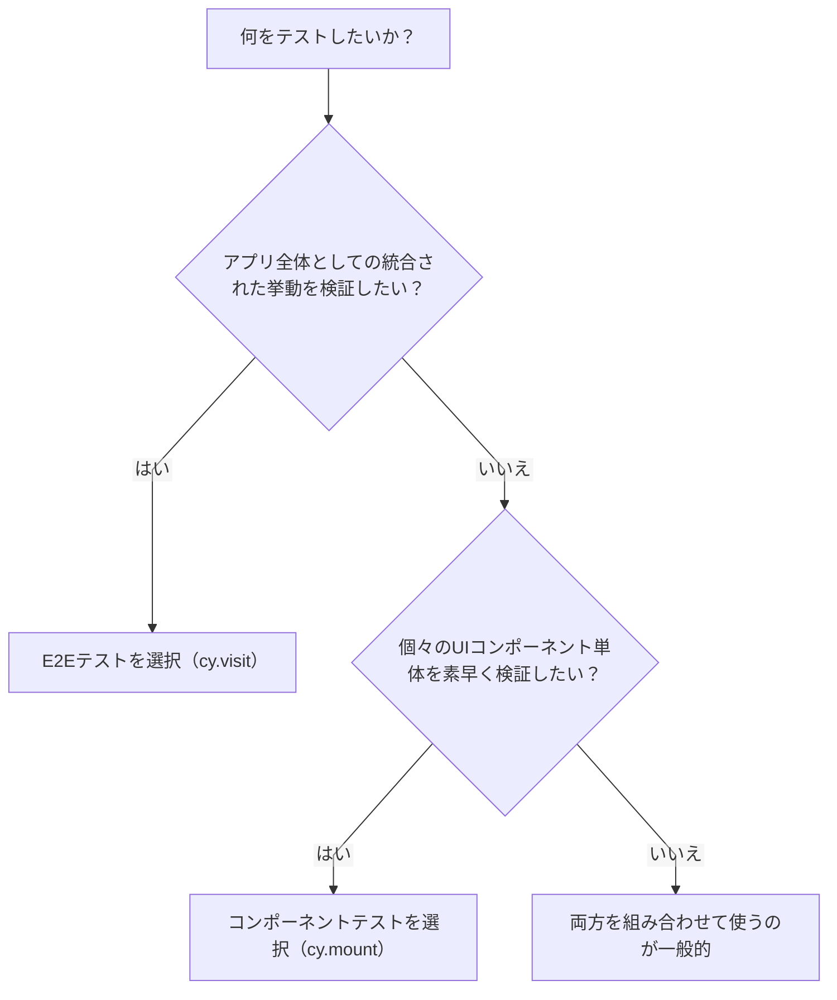

# Cypress入門ガイド：初学者のためのステップバイステップ解説

> 本ガイドは、Cypress公式ドキュメント（[Why Cypress?](https://docs.cypress.io/app/get-started/why-cypress)を中心に）および[cypress.io](https://www.cypress.io/)公式サイト、比較対象としてPlaywright公式サイトの情報をもとに、2026年7月時点の最新情報として作成しています。各セクションの末尾に参照元URLを明記しているので、詳細を確認したい場合はそちらもあわせてご覧ください。

## この記事の対象読者

- これからCypressでE2E（End-to-End）テストやコンポーネントテストを始めたい方
- SeleniumやPlaywrightなど他のテストツールとの違いを整理したい方
- 実際に手を動かしながらCypressの基本を身につけたい初学者〜中級者

---

## 目次

1. [Cypressとは何か](#1-cypressとは何か)
2. [なぜCypressが選ばれるのか](#2-なぜcypressが選ばれるのか)
3. [Cypress vs Selenium vs Playwright：アーキテクチャの違い](#3-cypress-vs-selenium-vs-playwrightアーキテクチャの違い)
4. [インストール手順](#4-インストール手順)
5. [プロジェクト構成を理解する](#5-プロジェクト構成を理解する)
6. [はじめてのテストを書く](#6-はじめてのテストを書く)
7. [テストの構造：describe・it・hooks](#7-テストの構造describeithooks)
8. [テストの種類：E2Eテスト vs コンポーネントテスト](#8-テストの種類e2eテスト-vs-コンポーネントテスト)
9. [セレクター戦略とベストプラクティス](#9-セレクター戦略とベストプラクティス)
10. [コマンドラインの使い方](#10-コマンドラインの使い方)
11. [CI/CDへの統合：GitHub Actionsの例](#11-cicdへの統合github-actionsの例)
12. [Cypress CloudとAI機能](#12-cypress-cloudとai機能)
13. [Cypressのトレードオフと制限事項](#13-cypressのトレードオフと制限事項)
14. [まとめと次のステップ](#14-まとめと次のステップ)
15. [参考文献・出典一覧](#15-参考文献出典一覧)

---

## 1. Cypressとは何か

### 1-1. 概要

Cypressは、モダンなWebアプリケーションを開発するチームのための「品質プラットフォーム」です。E2Eテスト、コンポーネントテスト、アクセシビリティチェック、そしてテストカバレッジの可視化までを一つのワークフローにまとめており、ローカル環境でもCI環境でも同じ仕組みで動作します。

多くのチームは「フロントエンドのテストをもっと良い方法で書きたい」という理由でCypressを使い始めますが、チームやアプリケーションが成長するにつれて、単なるテストツール以上の役割を果たすようになるのが特徴です。1人の開発者が最初のテストを書く場面から、QAチームが数千のテストスペックを管理する場面、そしてリリース判断を行うエンジニアリングリーダーまで、同じプラットフォーム上でカバーできます。

> 出典: [Why Cypress? - Cypress Documentation](https://docs.cypress.io/app/get-started/why-cypress)

### 1-2. Cypressが提供する4つの製品

| 製品 | 概要 | 位置づけ |
|---|---|---|
| **Cypress App** | テストの作成・実行を行う、無料かつオープンソースのローカルアプリ | 無料 |
| **Cypress Cloud** | テスト結果の記録・可視化・分析を行う有料サービス | 有料 |
| **UI Coverage** | アプリの各ページ・コンポーネントに対するテストカバレッジを可視化するプレミアム機能 | プレミアム |
| **Cypress Accessibility** | アクセシビリティ上の問題を自動検出するプレミアム機能 | プレミアム |

Cypress AppはGitHub上でオープンソースとして公開されており、テストコード自体は特定の有料サービスに縛られることなく単独で動作します。

> 出典: [Why Cypress? - Products](https://docs.cypress.io/app/get-started/why-cypress#Products)

### 1-3. Cypressのミッション

Cypressチームは「実際に機能するテストプロセス」を作ることをミッションに掲げています。ドキュメントは「何を」だけでなく「なぜ」を理解できるように書かれるべきだという考え方に基づいており、オープンソースエコシステムを大切にする姿勢を明言しています。テストコードは特定の有料サービスに結合されることなく、常に単独で動作するように設計されています。

> 出典: [Why Cypress? - Our mission](https://docs.cypress.io/app/get-started/why-cypress#Our-mission)

---

## 2. なぜCypressが選ばれるのか

### 2-1. チームの成長段階に合わせた使い方

Cypressの使い方は、チームの成熟度に応じて段階的に広がっていく設計になっています。

| 段階 | やること | 得られるもの |
|---|---|---|
| 1. 導入期 | Cypress Appをインストールし、開発と同時にテストを書く | Time Travel（実行状態のスナップショット）、自動待機、Studio AIによるアサーション提案 |
| 2. CI移行期 | Cypress CloudにテストをレコードしCIパイプラインに組み込む | Test Replay、フレーキーテスト検知、Branch Review、Smart Orchestration |
| 3. スケール期 | UI CoverageやCypress Accessibilityを導入 | テストカバレッジの可視化、アクセシビリティ問題の継続的検出 |

> 出典: [Why Cypress? - How Cypress grows with your team](https://docs.cypress.io/app/get-started/why-cypress#How-Cypress-grows-with-your-team)

### 2-2. Cypress Appの主な機能

| 機能 | 内容 |
|---|---|
| Time Travel | テスト実行中の各コマンドのスナップショットを記録し、実行後にホバーして状態を確認できる |
| Debuggability | ブラウザのDevToolsから直接デバッグでき、読みやすいエラーメッセージとスタックトレースを提供 |
| Automatic Waiting | コマンドやアサーションの完了を自動的に待つため、`wait`や`sleep`を手動で書く必要がない |
| Spies, Stubs, and Clocks | 関数やサーバーレスポンス、タイマーの挙動を検証・制御できる |
| Network Traffic Control | サーバーを介さずにネットワーク通信をスタブ化・制御できる |
| Consistent Results | SeleniumやWebDriverを使わない独自アーキテクチャにより、flake（不安定な失敗）の少ない一貫した結果を得られる |
| Cypress Studio / Studio AI | アプリ内の操作を記録してテストを自動生成し、Studio AIがアサーションを提案する |
| Cross Browser Testing | Firefox、Chrome系ブラウザ（Edge・Electron含む）でローカル・CI双方で実行可能 |

> 出典: [Why Cypress? - Features](https://docs.cypress.io/app/get-started/why-cypress#Features)

### 2-3. アーキテクチャ図解

Cypressの最大の特徴は「ブラウザの外側からリモート操作する」のではなく「アプリケーションと同じ実行ループの中で動作する」という点です。裏側にはNode.jsのサーバープロセスがあり、Cypress本体と常に通信・同期しながらタスクを分担しています。これにより、ブラウザ内外の出来事をCypressがすべて把握でき、他のツールよりも一貫性の高い結果を実現しています。



この「ブラウザ内で動く」という設計により、`window`・`document`・DOM要素・アプリケーションのインスタンス・タイマー・Service Workerなど、あらゆるオブジェクトへネイティブにアクセスできます。また、[`cy.session()`](https://docs.cypress.io/api/commands/session)によってログイン状態をキャッシュできるため、テストごとにログイン画面を経由する必要がなくなり実行時間を短縮できます。

> 出典: [Why Cypress? - Key Differences（Architecture / Native access / Shortcuts）](https://docs.cypress.io/app/get-started/why-cypress#Key-Differences)

---

## 3. Cypress vs Selenium vs Playwright：アーキテクチャの違い

### 3-1. 実行モデルの比較

| 項目 | Cypress | Selenium | Playwright |
|---|---|---|---|
| 実行モデル | ブラウザと同じ実行ループ内で動作。裏側のNode.jsプロセスと常時通信 | WebDriverプロトコル経由でブラウザを外部から遠隔操作 | Node.jsプロセスからブラウザを外部制御し、非同期(async/await)で操作を待つ |
| 対応ブラウザ | Chrome系（Chrome・Edge・Electron）、Firefox、WebKit（実験的） | 事実上すべての主要ブラウザ（WebDriver実装があるもの） | Chromium・Firefox・WebKit |
| ブラウザの取得方法 | マシンに既にインストールされているブラウザを使用し、Cypress自体はブラウザバイナリをダウンロードしない | 別途WebDriverと対応ブラウザが必要 | Playwright専用にビルドされたブラウザバイナリを自前でダウンロード・管理する |
| 待機処理 | コマンド・アサーションが自動的にリトライ待機する（auto-wait） | 明示的な待機（WebDriverWaitなど）が基本的に必要 | 要素がアクション可能になるまで自動待機し、アサーションも自動リトライする |
| コードの書き方 | コマンドをキューに積んで連鎖させる方式。`async/await`は不要 | 各言語の同期/非同期APIに依存 | `async/await`を用いた非同期コード |
| テストランナー | Mocha + Chaiをベースに構築 | 各言語のテストフレームワークに依存（JUnit、pytestなど） | Playwright独自のテストランナー（Playwright Test） |

> 出典: [Why Cypress? - Architecture](https://docs.cypress.io/app/get-started/why-cypress#Architecture)、[Trade-offs](https://docs.cypress.io/app/references/trade-offs)、[Migrate from Playwright to Cypress](https://docs.cypress.io/app/guides/migration/playwright-to-cypress)、[Playwright（GitHub公式）](https://github.com/microsoft/playwright)

### 3-2. CypressとPlaywrightの詳細比較

ユーザーの要望に応じて、Cypress公式の移行ガイドとPlaywright公式情報をもとに、より実務的な観点で両者を比較します。

| 項目 | Cypress | Playwright |
|---|---|---|
| 設定ファイル | `cypress.config.ts`（E2E固有の設定は`e2e`オブジェクト配下） | `playwright.config.ts`（`use`ブロックがフラットな構造） |
| テスト定義の書き方 | `describe()` / `it()`（Mocha由来） | `test.describe()` / `test()` |
| ロケーター取得の考え方 | `data-*`属性を用いたセレクターを推奨（`cy.get('[data-testid="..."]')`） | `getByRole()`・`getByLabel()`・`getByTestId()`などロールベースのロケーターを標準搭載 |
| 並列実行 | Cypress Cloudの「Smart Orchestration」が過去の実行時間をもとに動的にスペックを分配 | `--workers`によるローカル並列化と、`--shard`による手動シャーディング |
| デバッグ用リプレイ機能 | Cypress CloudのTest Replayでネットワーク・コンソール・DOMスナップショットを再生 | `--trace on`で記録し、Trace Viewerで確認 |
| コンポーネントテスト | React・Angular・Vue・Svelte向けに公式マウントライブラリを提供し、Vite・Webpack双方に対応 | React・Vue・Svelte向けの実験的パッケージを提供し、Viteのみに対応 |
| ブラウザ間のタブ・ウィンドウ操作 | 標準では1ブラウザのみ制御可能（複数タブは`@cypress/puppeteer`プラグインで対応） | `page.context()`など複数ページ・複数コンテキストをネイティブにサポート |
| クロスオリジンナビゲーション | 1テストにつき1つのスーパードメインが基本。別オリジンへは`cy.origin()`で明示的にスコープを切る必要がある | 通常のページ遷移として扱いやすい |

> 出典: [Migrate from Playwright to Cypress: Complete Migration Guide](https://docs.cypress.io/app/guides/migration/playwright-to-cypress)、[Trade-offs](https://docs.cypress.io/app/references/trade-offs)、[Playwright（GitHub公式）](https://github.com/microsoft/playwright)、[Browsers | Playwright](https://playwright.dev/docs/browsers)

### 3-3. どちらを選ぶべきか

どちらのツールも活発に開発が続く高品質なE2Eテストフレームワークであり、優劣を一概に決められるものではありません。一般的な目安としては、次のような判断軸が参考になります。

- **Cypressが向いているケース**：ブラウザ内部の状態（DOM・アプリのインスタンス・タイマーなど）に直接アクセスしてスタブ化したい場合、Time Travelによる視覚的なデバッグ体験を重視する場合、Mocha/Chaiに慣れているチーム
- **Playwrightが向いているケース**：複数タブ・複数ブラウザコンテキストを頻繁に扱う場合、Chromium・Firefox・WebKitを同一の設定で厳密に固定したい場合、`async/await`ベースの記述に慣れているチーム

なお、Cypress公式ドキュメントには[Playwrightからの移行ガイド](https://docs.cypress.io/app/guides/migration/playwright-to-cypress)が、Playwright側にもチュートリアルや比較記事が多数存在するため、実際に両方を試してからチームに合う方を選ぶのが確実です。

---

## 4. インストール手順

### 4-1. システム要件

インストール前に、以下の要件を満たしているか確認します。

**OS要件**

| OS | バージョン |
|---|---|
| macOS | 13.5以上（Intel／Apple Silicon 64bit） |
| Linux | Ubuntu 22.04以上、Debian 11以上、Fedora 43以上（x64／arm64） |
| Windows | 10・11（x64）、Windows 11 25H2（arm64、x64エミュレーションで動作・プレビュー） |
| Windows Server | 2019・2022・2025（x64） |

**Node.jsとパッケージマネージャー**

| ツール | 必要バージョン |
|---|---|
| Node.js | 20.x、22.x、24.x以上 |
| npm | 10.1.0以上 |
| Yarn（Classic） | 1.22.22以上 |
| Yarn（Modern／Berry） | 4.x以上 |
| pnpm | 8.x以上 |
| Bun | 1.2.22以上 |

**対応ブラウザ**：CypressにバンドルされたElectron（Chromiumベース）に加え、Google Chrome・Microsoft Edge・Mozilla Firefox（最新3メジャーバージョン）、WebKitは実験的サポートです。

**ハードウェア**：ローカルは一般的な開発マシンで問題ありません。CI環境では最低2CPU・4GB RAM、動画録画や長時間実行には8GB以上を推奨します。

> 出典: [Install using npm, Yarn, pnpm, or Bun - System requirements](https://docs.cypress.io/app/get-started/install-cypress#System-requirements)

### 4-2. ステップバイステップ・インストール



**ステップ1：プロジェクトルートでインストール**

```shell
npm install cypress --save-dev
```

これによりCypressがdevDependencyとしてプロジェクトにローカルインストールされます。

**ステップ2：Cypressを開く**

```shell
npx cypress open
```

Cypress Appが起動し、End-to-End Testing（E2E）かComponent Testing（CT）かを選択できます。

**ステップ3：はじめてのテストを書く**

セットアップが完了すると、`cypress.config.js`（または`.ts`）と`cypress/`ディレクトリが自動生成されます。ここから[はじめてのテストを書く](#6-はじめてのテストを書く)に進みます。

> 出典: [Install using npm, Yarn, pnpm, or Bun - Install & Run](https://docs.cypress.io/app/get-started/install-cypress#Install--Run)

### 4-3. npm実行スクリプトのブロック対策（重要）

npm 12以降、依存パッケージのインストールスクリプト（`postinstall`など）がデフォルトでブロックされる場合があります。Cypressの`postinstall`スクリプトがブロックされるとバイナリがダウンロードされないため、以下のいずれかの対応が必要です。

```shell
npm approve-scripts cypress
```

または、バイナリのみを明示的にインストールします。

```shell
npx cypress install
```

> 出典: [Install using npm, Yarn, pnpm, or Bun - npm configuration](https://docs.cypress.io/app/get-started/install-cypress#npm-configuration)

### 4-4. Linux環境の追加設定

Linux環境（特にCIコンテナ）では、以下のような追加パッケージが必要になる場合があります（Ubuntu 22.04・Debianの例）。

```shell
apt-get install libgtk-3-0 libgbm-dev libnotify-dev libnss3 libxss1 libasound2 libxtst6 xauth xvfb
```

これらの依存関係を毎回手動でインストールする代わりに、必要なパッケージが事前にインストール済みの[Cypress公式Dockerイメージ](https://github.com/cypress-io/cypress-docker-images)を利用することもできます。

> 出典: [Install using npm, Yarn, pnpm, or Bun - Linux Prerequisites](https://docs.cypress.io/app/get-started/install-cypress#Linux-Prerequisites)

---

## 5. プロジェクト構成を理解する

Cypressは「設定より規約（convention over configuration）」を重視しており、プロジェクトを追加すると自動的に以下のフォルダー構成が生成されます。すべて設定ファイルで変更可能ですが、初めてのプロジェクトではデフォルトのまま進めることが推奨されています。

### 5-1. デフォルトフォルダー構成

| パス | 役割 |
|---|---|
| `cypress.config.js`（または`.ts`） | Cypress全体の設定ファイル |
| `cypress/fixtures/example.json` | テストで使う静的なテストデータ（フィクスチャ） |
| `cypress/support/commands.js` | カスタムコマンドを定義する場所 |
| `cypress/support/e2e.js` | E2Eテスト実行前に毎回読み込まれるサポートファイル |
| `cypress/support/component.js` | コンポーネントテスト用のサポートファイル |
| `cypress/e2e/` | E2Eテストのスペックファイルを配置する場所（デフォルト） |
| `cypress/downloads/` | テスト中にダウンロードしたファイルの保存先 |
| `cypress/screenshots/` | スクリーンショットの保存先 |
| `cypress/videos/` | 実行動画の保存先 |

> 出典: [Writing and organizing Cypress tests - Project structure](https://docs.cypress.io/app/core-concepts/writing-and-organizing-tests#Project-structure)

### 5-2. specファイルの命名規則

Cypressはテストフォルダー内のすべてのファイルをテストとして扱うわけではありません。ファイル名に`.cy.`という接尾辞が含まれるファイルのみを`specPattern`として認識します。

- E2E: `cypress/e2e/**/*.cy.{js,jsx,ts,tsx}`
- Component: `**/*.cy.{js,jsx,ts,tsx}`

たとえば`cypress/e2e/login.js`は認識されませんが、`cypress/e2e/login.cy.js`は認識されます。テストが一覧に表示されない場合は、まずこのファイル名の規則を疑うとよいでしょう。

> 出典: [Writing and organizing Cypress tests - Spec files](https://docs.cypress.io/app/core-concepts/writing-and-organizing-tests#Spec-files)

### 5-3. サポートファイルとフィクスチャ

サポートファイル（`cypress/support/e2e.js`など）は、すべてのスペックファイルより先に毎回読み込まれるため、カスタムコマンドやグローバルな`beforeEach`フックを定義するのに最適な場所です。ただし、ここでインポートしたものはすべてのスペック実行のたびにコストがかかるため、軽量に保つことが推奨されています。

フィクスチャ（`cypress/fixtures/`）は、`cy.fixture()`でテスト内に読み込んだり、`cy.intercept()`のレスポンスとして指定したりできる静的データです。`.json`・`.js`・`.html`・`.csv`・`.png`など多様な形式をサポートしています。

> 出典: [Writing and organizing Cypress tests - Support file / Fixtures](https://docs.cypress.io/app/core-concepts/writing-and-organizing-tests#Support-file)

---

## 6. はじめてのテストを書く

### 6-1. 空のspecファイルを作成する

Cypress Appの「Create new empty spec」ボタンから新しいスペックファイルを作成します。デフォルトのファイル名のまま作成すると、`cypress/e2e`配下に自動的に配置され、Cypressがファイルの変更を監視して即座に一覧へ反映します。

> 出典: [Your First Test - Add a test file](https://docs.cypress.io/app/end-to-end-testing/writing-your-first-end-to-end-test#Add-a-test-file)

### 6-2. 最初のテストを書いてみる

まずは動作確認のため、シンプルなアサーションだけのテストを書きます。

```javascript
describe('My First Test', () => {
  it('Does not do much!', () => {
    expect(true).to.equal(true)
  })
})
```

保存するとブラウザが自動的にリロードされ、緑色でパスしたことが表示されます。`true`を`false`に変えて保存すると、今度は赤色で失敗し、詳細なスタックトレースとコードフレームが表示されます。

ここで使われている`describe`・`it`は[Mocha](https://mochajs.org)、`expect`は[Chai](https://www.chaijs.com)というライブラリに由来しており、Cypressはこれらの実績あるライブラリの上に構築されています。

> 出典: [Your First Test - Write your first test](https://docs.cypress.io/app/end-to-end-testing/writing-your-first-end-to-end-test#Write-your-first-test)

### 6-3. 実際のテストを組み立てる（4ステップ）

しっかりとしたテストは、一般的に「①アプリケーションの状態を準備する→②操作を行う→③結果となる状態をアサーションする」という3フェーズ（「Given/When/Then」や「Arrange/Act/Assert」とも呼ばれます）で構成されます。Cypressの基本コマンドに当てはめると、次の4ステップになります。



**ステップ1：ページを訪問する**

```javascript
describe('My First Test', () => {
  it('Visits the Kitchen Sink', () => {
    cy.visit('https://example.cypress.io')
  })
})
```

**ステップ2：要素を検索する**

```javascript
cy.visit('https://example.cypress.io')
cy.contains('type')
```

`cy.contains()`のようなコマンドの多くは「見つからなければ失敗する」という暗黙のアサーションを内蔵しています。存在しない文字列を指定すると、即座に失敗するのではなく、Cypressが自動的にリトライしながら数秒間待機したうえで失敗する点がポイントです（デフォルトのタイムアウトは約4秒）。

**ステップ3：要素をクリックする**

```javascript
cy.contains('type').click()
```

**ステップ4：アサーションを行う**

```javascript
cy.url().should('include', '/commands/actions')
```

**完成した一連のテスト例**

```javascript
describe('My First Test', () => {
  it('Gets, types and asserts', () => {
    cy.visit('https://example.cypress.io')

    cy.contains('type').click()

    // 新しいURLに '/commands/actions' が含まれることを確認
    cy.url().should('include', '/commands/actions')

    // 入力欄を取得して文字を入力
    cy.get('.action-email').type('[email protected]')

    // 入力した値が反映されていることを確認
    cy.get('.action-email').should('have.value', '[email protected]')
  })
})
```

このテストが2ページにまたがっている点にも注目してください。Cypressはページ遷移イベントを自動的に検出し、次のページの読み込みが完了するまでコマンドの実行を一時停止します。通常4秒のタイムアウトも、ページ遷移が検出されると自動的に60秒まで延長されます。

> 出典: [Your First Test - Write a real test](https://docs.cypress.io/app/end-to-end-testing/writing-your-first-end-to-end-test#Write-a-real-test)

---

## 7. テストの構造：describe・it・hooks

### 7-1. BDD構文

Cypressのテストインターフェースは、Mocha由来の`describe()`・`context()`・`it()`・`specify()`から構成されます。`describe()`で関連するテストをグループ化し、`it()`で個々のテストを定義します。`context()`は`describe()`と、`specify()`は`it()`と全く同じ動作をするエイリアスです。

```javascript
describe('Account settings', () => {
  beforeEach(() => {
    cy.visit('/account')
  })

  it('shows the current user name', () => {
    cy.get('[data-testid="profile-name"]').should('have.value', 'Jane Lane')
  })
})
```

> 出典: [Writing and organizing Cypress tests - Test Structure](https://docs.cypress.io/app/core-concepts/writing-and-organizing-tests#Test-Structure)

### 7-2. フック（before / beforeEach / afterEach / after）

セットアップやクリーンアップの処理を各テストの中で繰り返し書く代わりに、フックを使ってまとめて定義できます。



**注意点**：Cypress公式ドキュメントは「状態のクリーンアップを`after`や`afterEach`で行う」ことをアンチパターンとして明確に挙げています。理由は、テストの途中でCypressをリフレッシュした場合に`after`系フックが実行される保証がないためです。状態のリセットが本当に必要な場合は、`before`や`beforeEach`側で行うべきとされています。

> 出典: [Writing and organizing Cypress tests - Hooks](https://docs.cypress.io/app/core-concepts/writing-and-organizing-tests#Hooks)、[Cypress best practices - Using after Or afterEach Hooks](https://docs.cypress.io/app/core-concepts/best-practices#Using-after-Or-afterEach-Hooks)

### 7-3. テストの独立性（Test Isolation）

Cypressは各テストの前にブラウザの状態をクリーンアップする「Test Isolation」をデフォルトで有効にしています（`testIsolation: true`）。これにより、1つのテストの動作が別のテストに影響を与えることを防ぎ、テストをどの順序・どの組み合わせで実行しても再現性のある結果が得られます。あるテストが単独では失敗するのに他のテストと一緒に実行すると成功する場合、それはテスト同士が暗黙的に依存している兆候です。

> 出典: [Writing and organizing Cypress tests - Test Isolation](https://docs.cypress.io/app/core-concepts/writing-and-organizing-tests#Test-Isolation)

---

## 8. テストの種類：E2Eテスト vs コンポーネントテスト

Cypressを使い始める際に最初に決めるべきことの一つが、E2Eテストとコンポーネントテストのどちらを書くかです。両方を組み合わせて使うのが一般的です。

### 8-1. 比較表

| 項目 | E2Eテスト | コンポーネントテスト |
|---|---|---|
| テスト対象 | アプリの全レイヤー（フロントエンドからバックエンドまで） | 個々のコンポーネント単体 |
| 特徴 | 包括的だが実行が遅く、flakeが発生しやすい | 専門特化していて高速・安定 |
| 主な用途 | アプリ全体が一体として正しく動くことの検証 | 個々のコンポーネントの機能検証 |
| 実装者 | 開発者、QAチーム、SDET | 開発者、デザイナー |
| CIインフラ | 複雑なセットアップが必要になることが多い | 特別なインフラ不要 |
| 初期化コマンド | `cy.visit(url)` | `cy.mount(<MyComponent />)` |

> 出典: [Testing Types - Testing Type Comparison](https://docs.cypress.io/app/core-concepts/testing-types#Testing-Type-Comparison)

### 8-2. どちらを選ぶかの判断フロー



E2Eテストは、認証フローや購入フローのような重要な業務フローの検証、複数画面にまたがるデータの永続化の確認、デプロイ前のスモークテストに向いています。一方でコンポーネントテストは、日付ピッカーのような複雑なUI部品の様々なシナリオ検証や、フォームの表示・非表示ロジックの検証、デザインシステムから切り出されたコンポーネントの検証に向いています。

> 出典: [Testing Types - What is E2E Testing / What is Component Testing](https://docs.cypress.io/app/core-concepts/testing-types)

---

## 9. セレクター戦略とベストプラクティス

### 9-1. 良いセレクター・悪いセレクター

Cypress公式ドキュメントは、テストの壊れやすさを大きく左右する「セレクター選び」について明確な指針を示しています。次のようなHTMLがあるとします。

```html
<button
  id="main"
  class="btn btn-large"
  name="submission"
  role="button"
  data-cy="submit"
>
  Submit
</button>
```

| セレクター | 推奨度 | 理由 |
|---|---|---|
| `cy.get('button')` | 非推奨 | 汎用的すぎて文脈がない |
| `cy.get('.btn.btn-large')` | 非推奨 | スタイルに結合しており変更に弱い |
| `cy.get('#main')` | 限定的に可 | スタイルやJSのイベントリスナーと結合しやすい |
| `cy.get('[name="submission"]')` | 限定的に可 | HTML意味論を持つ`name`属性に結合している |
| `cy.contains('Submit')` | 状況による | テキストが変わる可能性があると壊れる |
| `cy.get('[data-cy="submit"]')` | 最推奨 | CSSやJSの変更から完全に独立している |

`data-*`属性はCSSのスタイル変更やJavaScriptの挙動変更の影響を受けないため、最も堅牢なセレクター戦略とされています。[`eslint-plugin-cypress`](https://github.com/cypress-io/eslint-plugin-cypress)の`cypress/require-data-selectors`ルールを使えば、この規約をリント時点で強制することもできます。

> 出典: [Cypress best practices - Selecting Elements](https://docs.cypress.io/app/core-concepts/best-practices#Selecting-Elements)

### 9-2. テキストコンテンツを使うべきかの判断基準

「そのテキストが変わったらテストを失敗させたいか？」を自問するのがコツです。

- **はい**（そのテキストが重要な意味を持つ）→ `cy.contains()`を使う
- **いいえ**（テキストは変わりうる）→ `data-*`属性を使う

> 出典: [Cypress best practices - Text Content](https://docs.cypress.io/app/core-concepts/best-practices#Text-Content)

### 9-3. 代表的なアンチパターンと推奨パターン

| アンチパターン | 推奨されるベストプラクティス |
|---|---|
| シークレット情報をテストコードにハードコーディングする | `cy.env()`でセンシティブな値を扱い、公開設定は`Cypress.expose()`を使う |
| UIを経由してログインする、複数テスト間でページオブジェクトを共有する | プログラム的にログインし、テストは独立させてアプリの状態を直接コントロールする |
| コマンドの戻り値を`const`・`let`・`var`に代入しようとする | エイリアスとクロージャ（`.as()` / `cy.get('@alias')`）を使う |
| 自分がコントロールできない外部サイトを訪問・操作する | 自分の管理下にあるドメインのみをテストし、外部連携は`cy.request()`で扱う |
| 前のテストの状態に依存したテストを書く | `it.only`を付けて単独実行してもパスするように書く |
| ユニットテストのように1アサーションずつ細かくテストを分割する | 1つのテストに複数のアサーションを含めてもよい（E2Eではむしろ推奨） |
| `after`・`afterEach`で状態をクリーンアップする | クリーンアップは`before`・`beforeEach`で行う |
| `cy.wait(数値)`で決め打ちの時間待機をする | ルートエイリアスやアサーションでCypressに待機条件を伝える |
| Cypressスクリプトからバックエンドサーバーを起動しようとする | Cypressを実行する前にWebサーバーを起動しておく |
| `baseUrl`を設定せず、`cy.visit()`にフルURLを書く | `cypress.config.js`で`baseUrl`をグローバル設定する |

**不要な待機の悪い例と良い例**

```javascript
// 悪い例：決め打ちの待機時間
cy.intercept('GET', '/users', [{ name: 'Maggy' }, { name: 'Joan' }])
cy.get('#fetch').click()
cy.wait(4000) // ← これは不要
cy.get('table tr').should('have.length', 2)
```

```javascript
// 良い例：ルートエイリアスを明示的に待つ
cy.intercept('GET', '/users', [{ name: 'Maggy' }, { name: 'Joan' }]).as('getUsers')
cy.get('[data-testid="fetch-users"]').click()
cy.wait('@getUsers') // ← このリクエストの完了を明示的に待つ
cy.get('table tr').should('have.length', 2)
```

> 出典: [Cypress best practices](https://docs.cypress.io/app/core-concepts/best-practices)

---

## 10. コマンドラインの使い方

Cypressをインストールした後は、プロジェクトルートから以下のコマンドを実行できます（`npx`・`yarn`・`pnpm`のいずれかを頭に付けます）。

### 10-1. 主要コマンド

| コマンド | 用途 |
|---|---|
| `cypress open` | インタラクティブなCypress Appを開く |
| `cypress run` | すべてのテストをヘッドレスモードで一括実行する（デフォルト動作） |
| `cypress info` | 検出されたブラウザや環境変数などの診断情報を表示する |
| `cypress verify` | Cypressが正しくインストールされているか検証する |
| `cypress version` | インストール済みのバージョン情報を表示する |
| `cypress cache list` | キャッシュされているCypressバージョン一覧を表示する |

### 10-2. `cypress run`の主なオプション

| オプション | 説明 |
|---|---|
| `--browser`, `-b` | 実行するブラウザを指定する（例：`chrome`） |
| `--headed` | ブラウザを表示した状態で実行する |
| `--spec`, `-s` | 実行するスペックファイルを限定する |
| `--config`, `-c` | 設定値をコマンドラインから上書きする |
| `--env`, `-e` | センシティブな環境変数を`cy.env()`用に渡す |
| `--record` | Cypress Cloudへ記録する |
| `--parallel` | Cypress Cloudで並列実行する |
| `--reporter`, `-r` | Mochaレポーターを指定する |
| `--group` | 記録したテストをグループにまとめる |

```shell
# ヘッドレスモードで単一スペックを実行し、Cypress Cloudに記録する例
bunx cypress run --record --spec "cypress/e2e/my-spec.cy.js"
```

### 10-3. package.jsonへのスクリプト登録

頻繁に使うコマンドは`package.json`の`scripts`に登録しておくと便利です。

```json
{
  "scripts": {
    "e2e:chrome": "cypress run --browser chrome"
  }
}
```

```shell
bun run e2e:chrome
```

> 出典: [Command Line - Cypress Documentation](https://docs.cypress.io/app/references/command-line)

---

## 11. CI/CDへの統合：GitHub Actionsの例

Cypressは公式の[Cypress GitHub Action](https://github.com/marketplace/actions/cypress-io)を提供しており、依存関係のインストール・キャッシュ・テスト実行をまとめて扱えます。

### 11-1. 基本的なワークフロー例

```yaml
name: Cypress Tests

on: push

jobs:
  cypress-run:
    runs-on: ubuntu-24.04
    steps:
      - name: Checkout
        uses: actions/checkout@v6
      - name: Cypress run
        uses: cypress-io/github-action@v7
        with:
          build: bun run build
          start: bun run start
```

このワークフローは、pushをトリガーにUbuntu環境を起動し、リポジトリをチェックアウトしたうえで、依存関係のインストール・ビルド・アプリの起動・Electronブラウザでのテスト実行までを自動的に行います。

### 11-2. 特定ブラウザでの実行

GitHub Actionsのホスト型ランナーにはあらかじめChrome・Firefox・Edgeがインストールされています（macOSランナーにはSafariも含まれます）。`browser`パラメーターで使用ブラウザを指定できます。

```yaml
- name: Cypress run
  uses: cypress-io/github-action@v7
  with:
    build: bun run build
    start: bun run start
    browser: chrome
```

### 11-3. 並列実行（Parallelization）

Cypress Cloudに記録することで、GitHub Actionsの[matrix strategy](https://docs.github.com/en/actions/reference/workflow-syntax-for-github-actions#jobsjob_idstrategymatrix)を使った並列実行が可能になります。以下は5並列で実行する例の要点です。

```yaml
jobs:
  cypress-run:
    runs-on: ubuntu-24.04
    needs: install
    strategy:
      fail-fast: false
      matrix:
        containers: [1, 2, 3, 4, 5]
    steps:
      - name: Cypress run
        uses: cypress-io/github-action@v7
        with:
          record: true
          parallel: true
          group: 'UI-Chrome'
          start: bun run start
```

`record: true`によってCypress Cloudへ結果を記録し、プルリクエスト上でのステータスチェックやフレーキーテストの検知が可能になります。`parallel: true`は、実行時間の履歴に基づいてスペックを動的に振り分けるSmart Orchestrationを利用します。

> 出典: [Run Cypress in GitHub Actions](https://docs.cypress.io/app/continuous-integration/github-actions)

---

## 12. Cypress CloudとAI機能

Cypress Cloudは、CI上でのテスト結果を「解釈すべき情報の山」から「チーム全員が行動できるシグナル」に変える有料サービスです。主な機能は以下の通りです。

| 機能 | 内容 |
|---|---|
| Test Replay | 記録されたテストをネットワークリクエスト・コンソール出力・DOMスナップショットとともに、CI上で実行されたとおりに再生できる |
| Smart Orchestration | 過去の実行時間に基づく負荷分散（Load Balancing）、失敗したスペックを優先して再実行するSpec Prioritization、一定数の失敗でランを打ち切るAuto Cancellationを含む |
| Flaky test management | 再試行後にパスするテスト（flake）を自動的に特定し、傾向を追跡する |
| Branch Review | プルリクエストがテストスイートに与える影響を、失敗・flaky・追加・変更ごとに一覧できる |
| Cloud MCP | AIコーディングアシスタントに、テストの実行結果や失敗コンテキストをIDE内から直接渡せる |

さらに、Cypress Studio（レコーディングによるテスト自動生成）にCypress Cloudアカウントを組み合わせると「Studio AI」が有効になり、記録した操作に対してアサーションを自動提案してくれます。cypress.io公式サイトのトップページでは、この一連の体験が「Create（作成）→ Debug（デバッグ）→ Improve（改善）→ Collaborate（連携）」という4ステップのワークフローとして紹介されています。

> 出典: [Why Cypress? - Cypress Cloud](https://docs.cypress.io/app/get-started/why-cypress#Cypress-Cloud)、[cypress.io トップページ](https://www.cypress.io/)

Cypressは、6M以上（週間ダウンロード数）、50K以上（GitHubスター数）、150万以上（依存リポジトリ数）という規模で利用されているオープンソースプロジェクトです。

> 出典: [cypress.io トップページ - Loved by OSS, trusted by Enterprise](https://www.cypress.io/)

---

## 13. Cypressのトレードオフと制限事項

Cypressは独自アーキテクチャによってこれまでにない機能を実現している一方で、明確なトレードオフも存在します。公式ドキュメントは、これらの制約の多くが「悪いテスト・遅いテスト・不安定なテストを書かせないための、良い意味での境界線」であると位置づけています。

### 13-1. 恒久的なトレードオフ

| 制約 | 内容 |
|---|---|
| 汎用自動化ツールではない | Webのインデックス作成やスパイダリング、パフォーマンステスト、サードパーティサイトのスクレイピングには向いていない |
| ブラウザ内で実行される | テストコードはNode.jsではなくブラウザ内のJavaScriptとして評価されるため、サーバーサイドのライブラリを直接`import`できない（`cy.exec()`・`cy.task()`・`cy.request()`経由でNode側とやり取りする） |
| 同時に複数ブラウザを開けない | 1つのブラウザのみ制御可能。複数タブが必要な場合は`@cypress/puppeteer`プラグインで対応する |
| 1テスト=1スーパードメインが基本 | 別オリジンへのナビゲーションを行う場合は`cy.origin()`で明示的にスコープする必要がある |

### 13-2. 将来的に改善が見込まれる一時的な制約

- `cy.hover()`コマンドが存在しない（回避策あり）
- ネイティブ／モバイルアプリのイベントには非対応
- iframeサポートは限定的（同一オリジンのiframeはネイティブにクエリ可能）

> 出典: [Trade-offs - Cypress Documentation](https://docs.cypress.io/app/references/trade-offs)

---

## 14. まとめと次のステップ

ここまでの内容を振り返ると、Cypressは以下のような流れで学んでいくのがおすすめです。

1. [インストール](#4-インストール手順)して`npx cypress open`を実行する
2. [はじめてのテスト](#6-はじめてのテストを書く)で`cy.visit()` → `cy.get()` → `.click()` → `.should()`の基本パターンを体に染み込ませる
3. [ベストプラクティス](#9-セレクター戦略とベストプラクティス)を意識し、`data-*`属性でセレクターを組み立てる習慣をつける
4. 自分のアプリケーションに対してE2Eテストとコンポーネントテストを組み合わせて書く
5. [GitHub Actionsなど](#11-cicdへの統合github-actionsの例)のCIパイプラインに組み込む
6. 必要に応じてCypress Cloudを導入し、Test ReplayやSmart Orchestrationでスケールさせる

Cypressチームは、ベストプラクティスを実践的なシナリオで学べる[Real World App（RWA）](https://github.com/cypress-io/cypress-realworld-app)というフルスタックのサンプルアプリケーションを公開しています。複数ブラウザ・複数デバイスサイズでのE2Eテスト、ビジュアルリグレッションテスト、APIテスト、ユニットテストを、効率的なCIパイプラインの中でどのように組み合わせるかを学ぶのに最適です。

また、SeleniumやProtractor、Playwrightから移行する場合は、公式の移行ガイドが充実しているので参照してください。

> 出典: [Why Cypress? - Cypress in the Real World](https://docs.cypress.io/app/get-started/why-cypress#Cypress-in-the-Real-World)

---

## 15. 参考文献・出典一覧

本ガイドの作成にあたり、以下の一次情報源（2026年7月時点の最新版）を参照しました。

### Cypress公式ドキュメント

- [Why Cypress? - Cypress Documentation](https://docs.cypress.io/app/get-started/why-cypress)
- [Install using npm, Yarn, pnpm, or Bun - Cypress Documentation](https://docs.cypress.io/app/get-started/install-cypress)
- [Your First Test - Cypress Documentation](https://docs.cypress.io/app/end-to-end-testing/writing-your-first-end-to-end-test)
- [Writing and organizing Cypress tests - Cypress Documentation](https://docs.cypress.io/app/core-concepts/writing-and-organizing-tests)
- [Testing Types - Cypress Documentation](https://docs.cypress.io/app/core-concepts/testing-types)
- [Cypress best practices - Cypress Documentation](https://docs.cypress.io/app/core-concepts/best-practices)
- [Command Line - Cypress Documentation](https://docs.cypress.io/app/references/command-line)
- [Trade-offs - Cypress Documentation](https://docs.cypress.io/app/references/trade-offs)
- [Migrate from Playwright to Cypress: Complete Migration Guide - Cypress Documentation](https://docs.cypress.io/app/guides/migration/playwright-to-cypress)
- [Run Cypress in GitHub Actions - Cypress Documentation](https://docs.cypress.io/app/continuous-integration/github-actions)

### Cypress公式サイト

- [cypress.io（トップページ）](https://www.cypress.io/)
- [cypress.io/app#create](https://www.cypress.io/app#create)

### Playwright公式情報（比較参照用）

- [Browsers | Playwright](https://playwright.dev/docs/browsers)
- [Installation | Playwright](https://playwright.dev/docs/intro)
- [GitHub - microsoft/playwright](https://github.com/microsoft/playwright)

### サンプルリポジトリ

- [cypress-io/cypress-realworld-app（GitHub）](https://github.com/cypress-io/cypress-realworld-app)
- [cypress-io/eslint-plugin-cypress（GitHub）](https://github.com/cypress-io/eslint-plugin-cypress)

---

*本ガイドは学習・社内共有目的で作成された二次資料です。最新の公式情報は必ず上記リンク先でご確認ください。*
