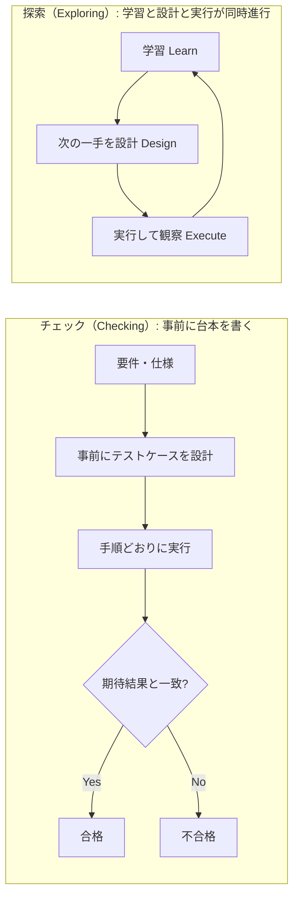
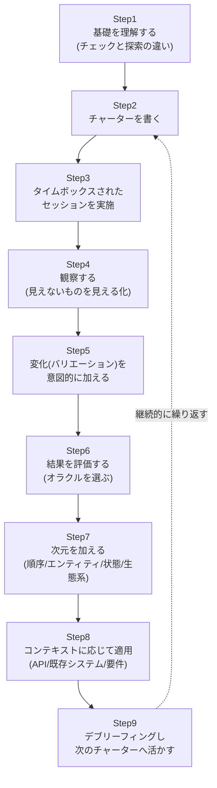
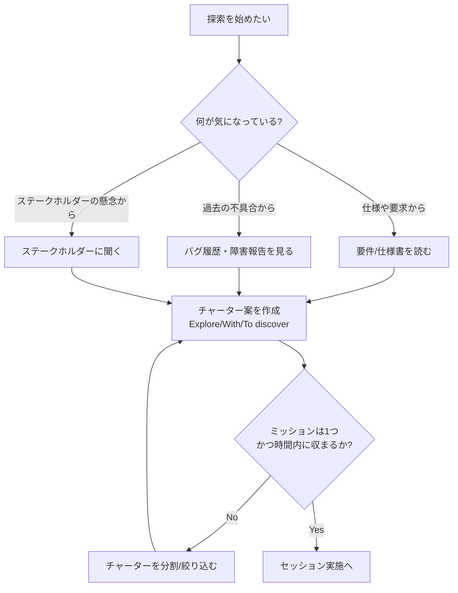
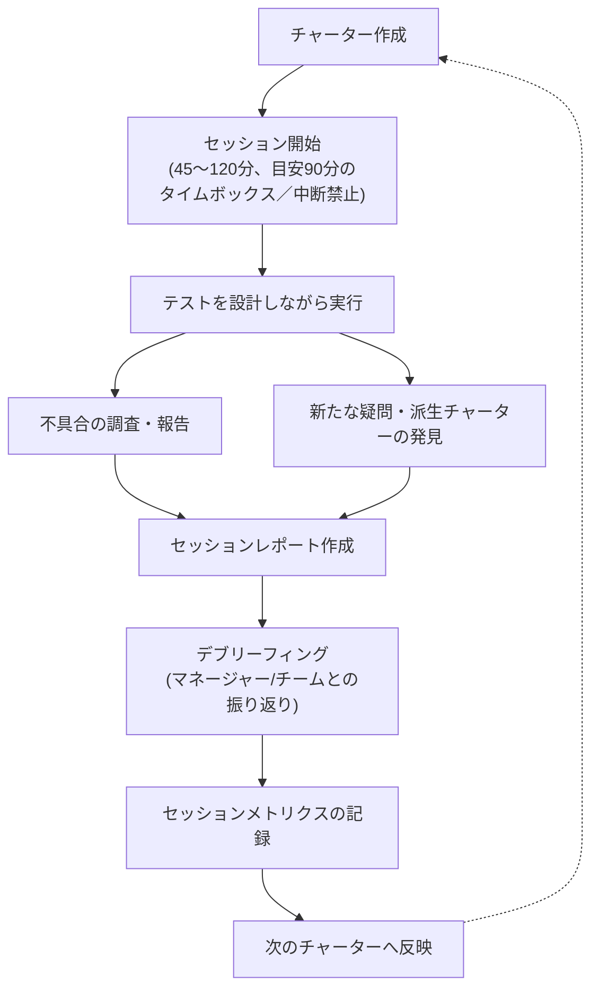
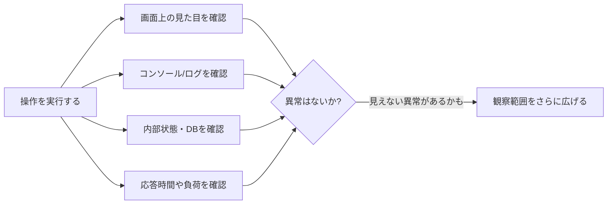
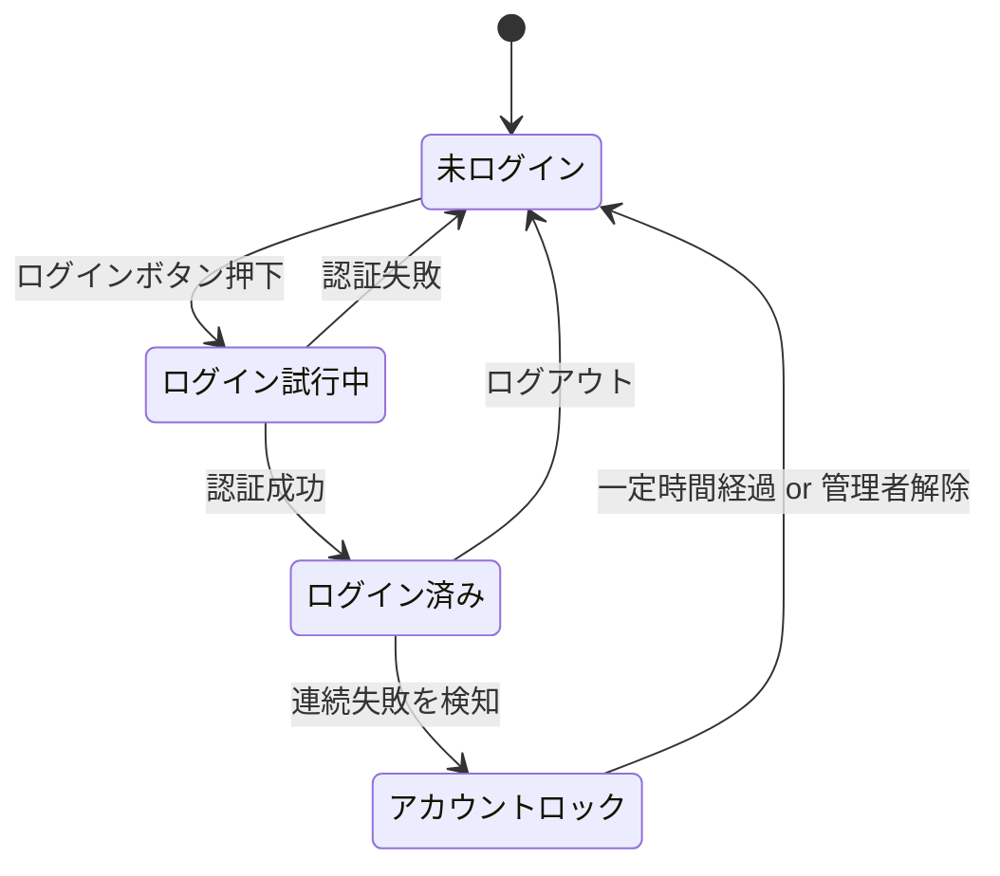
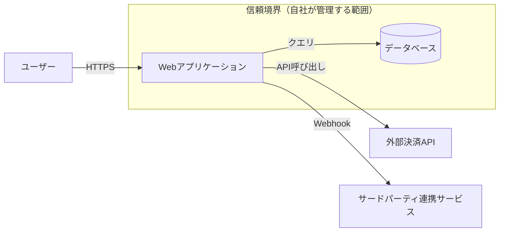

# Explore It! を読み解く ― 初学者のための探索的テスト実践ガイド

> 原著: *Explore It!: Reduce Risk and Increase Confidence with Exploratory Testing*
> 著者: Elisabeth Hendrickson（Pragmatic Bookshelf, 2013年初版）
> 参照ページ: https://www.oreilly.com/library/view/explore-it/9781941222584/f_0000.html

本ガイドは、ソフトウェアテストの古典的名著と評される『Explore It!』の内容を、**探索的テスト（Exploratory Testing）を初めて学ぶ方**に向けて、ステップバイステップのベストプラクティスとして整理し直したものです。図解はすべてMermaidで作成し、比較・整理はMarkdown表を用いています。

---

## 目次

1. [この本はどんな本か](#1-この本はどんな本か)
2. [なぜ探索的テストが必要なのか](#2-なぜ探索的テストが必要なのか)
3. [探索的テストの本質的要素](#3-探索的テストの本質的要素)
4. [実践ロードマップ（全体像）](#4-実践ロードマップ全体像)
5. [Step 1: チャーター（探索の指針）を書く](#5-step-1-チャーター探索の指針を書く)
6. [Step 2: セッションを構造化する（Session-Based Test Management）](#6-step-2-セッションを構造化するsession-based-test-management)
7. [Step 3: 観察力を鍛える ― 見えないものを見えるようにする](#7-step-3-観察力を鍛える--見えないものを見えるようにする)
8. [Step 4: 「面白い変化（バリエーション）」を見つける](#8-step-4-面白い変化バリエーションを見つける)
9. [Step 5: 結果を評価する（オラクル問題）](#9-step-5-結果を評価するオラクル問題)
10. [Step 6: 探索に「次元」を加える](#10-step-6-探索に次元を加える)
11. [Step 7: コンテキストに応じて探索を適用する](#11-step-7-コンテキストに応じて探索を適用する)
12. [Step 8: デブリーフィングと継続的改善](#12-step-8-デブリーフィングと継続的改善)
13. [テストヒューリスティック・チートシート](#13-テストヒューリスティックチートシート)
14. [2026年現在：AI時代における探索的テストの位置づけ](#14-2026年現在aiテストの時代における探索的テストの位置づけ)
15. [初学者向けチェックリスト](#15-初学者向けチェックリスト)
16. [参考文献・出典URL一覧](#16-参考文献出典url一覧)

---

## 1. この本はどんな本か

**Elisabeth Hendrickson** は1980年からコードを書き始めたベテランのテスター/開発者/アジャイル実践者で、2010年にAgile AllianceのGordon Pask Award（アジャイルコミュニティへの貢献に贈られる賞）を受賞しています。彼女はGoogleのTech Talkでのアジャイルテスト講演や、後述する「Test Heuristics Cheat Sheet（テストヒューリスティック・チートシート）」でも広く知られています。

`Agile Testing`の共著者であるJanet Gregoryは、本書について「開発チームの全員の机に置かれるべき本であり、探索的テストをチームに導入する際にいつも持ち歩いている本だ」という趣旨の推薦の言葉を寄せています。

本書は3部構成・全13章＋付録2つで構成されています。

| Part | テーマ | 主な内容 |
|---|---|---|
| Part 1: Establishing Foundations（基礎を固める） | 探索的テストの土台となるスキル | チャーター、観察、バリエーション探し、結果評価 |
| Part 2: Adding Dimensions（次元を加える） | 探索の切り口を広げる | 操作の順序、エンティティと関係、状態遷移、エコシステム |
| Part 3: Putting It in Context（文脈に当てはめる） | 実務での応用 | UIがない場合、既存システム、要件定義の場、テスト戦略全体への統合 |

対象読者は「初級から上級まで」とされており、テスターに限らず開発者・プロダクトオーナーが読んでも実践的な発見がある構成になっています。

---

## 2. なぜ探索的テストが必要なのか

### チェック（Checking）と探索（Exploring）は別物

ThoughtWorksのチーフサイエンティストであり、多くのソフトウェア開発者に影響を与えてきた**Martin Fowler**は、自身のbliki（ブログ+wiki）で探索的テストを次のように整理しています。

- **スクリプト化されたテスト（Checking）**：あらかじめ書かれた手順と期待結果に沿って実行し、一致しなければ失敗と判定する。
- **探索的テスト（Exploring）**：ソフトウェアの特性そのものを探りながら、発見した挙動が「妥当」か「不具合」かをその場で判断していく、学習・設計・実行が一体化したスタイル。

Fowlerは自動化されたセルフテストの強力な推進者として知られますが、それでも「自動テストは頑丈なバグ捕獲網を提供するが、その網が本当に必要な範囲を覆っているかどうかを確かめるには探索的テストが必要だ」という趣旨を述べています。

探索的テストという用語自体は、**Cem Kaner**が1984年に提唱したとされ、Wikipediaに引用されている定義では「個々のテスターが自身の作業品質を継続的に最適化する、個人の自由と責任を重視するテストスタイルであり、テストに関連する学習・設計・実行・結果解釈を、プロジェクトを通じて並行して行う相互補完的な活動として扱うもの」とされています。**James Marcus Bach**とKanerは、探索的テストは手法というより「思考様式（マインドセット）」であり、わずかに探索的なもの（曖昧・緩いスクリプト）から完全に自由な探索まで連続体（スペクトラム）をなす、とも説明しています。

Hendrickson自身の言葉としてよく引用される定義は、「探索的テストとは、テスト対象のソフトウェアについて学習しながら、同時にテストを設計・実行し、直前のテストで得たフィードバックを次のテストに活かしていく活動である」というものです。

### 図解：チェックと探索の違い



チェックは「安全網（セーフティネット）」であり、探索はその網がカバーしきれていない領域を能動的に探しに行く活動、という対比がよく使われます。実務では、両者は対立するものではなく、状況に応じて配分が変わる**連続体**として組み合わせて使うのが基本です。

---

## 3. 探索的テストの本質的要素

本書 第1章（On Testing and Exploration）では、探索的テストを成立させる要素として次のようなものが挙げられています。

| 要素 | 説明 |
|---|---|
| タイムボックス化されたセッション | 探索を「時間で区切った作業単位」として扱い、集中と説明責任を両立させる |
| チャーター（憲章／指針） | 何を、何を使って、何のために探索するかを事前に短く言語化する |
| 同時並行の学習・設計・実行 | あらかじめ全テストを設計せず、直前の結果から次の一手を組み立てる |
| 観察力 | 画面だけでなくログ・コンソール・裏側の状態まで注意深く見る |
| バリエーションの発見 | 「変化しうるもの（変数）」を洗い出し、意図的にそれを変えてみる |

これらは独立した技法ではなく、**1つのセッションの中で循環的に使われるスキルセット**である点が本書の重要なメッセージです。

---

## 4. 実践ロードマップ（全体像）

初学者がゼロから探索的テストを実務に取り入れる際の全体の流れを、本書の構成に沿って1つのループとして可視化すると、以下のようになります。



以降の章で、各ステップを順番に詳しく解説します。

---

## 5. Step 1: チャーター（探索の指針）を書く

本書 第2章「Charter Your Explorations」の中心テーマです。探索的テストは自由度が高い分、**何も指針がないと「ただ画面をクリックしているだけ」になりがち**です。それを防ぐのがチャーター（憲章）です。

### シンプルなチャーターテンプレート

多くの実務者・ブログ記事で紹介されている基本形は次の3要素です。

```
Explore（探索対象）: [対象領域・機能]
With（使うもの）　　: [使用するツール・データ・リソース]
To discover（発見したいこと）: [気になっているリスク・情報・不具合]
```

例：

| 項目 | 記入例 |
|---|---|
| Explore（対象） | 新規会員登録フォーム |
| With（使うもの） | 全角文字・絵文字・非常に長い文字列を含むテストデータ |
| To discover（目的） | 入力バリデーションの抜け漏れと、エラーメッセージの分かりやすさ |

このテンプレートの利点は、「何を厳密にやるか」ではなく「どこに焦点を当て、何を使い、何を知りたいのか」という**方向性だけ**を示す点です。手順を細かく書きすぎるとチャーターの目的である「自由な探索」を阻害してしまうため、具体的すぎず、かといって曖昧すぎない粒度が重要とされています。

### 良いチャーターの条件

本書やそれを紹介する多くの実務記事に共通する「良いチャーター」の条件を整理すると、以下のようになります。

- **1つのミッションが明確である**（複数の目的を1つのチャーターに詰め込まない）
- **リスクや疑問に基づいている**（「なんとなく触ってみる」ではなく、仕様・過去の不具合・ステークホルダーの懸念などから発想する）
- **時間内に完了できる粒度である**（大きすぎる場合は分割する）
- **対象外（スコープ外）も明示できるとなお良い**（何をテストしないかを書くことで、後の解釈のブレを防ぐ）

### チャーター作成の流れ



> 補足：本書ではチャーターを事前に大量生成しておく「チャーター・ライブラリ」を作る発想や、「悪夢の見出しゲーム（The Nightmare Headline Game）」— もしこの機能が原因でニュースの見出しになるとしたら、それはどんな見出しか？を考えることでリスクを洗い出す — といった、チャーターのアイデア出しを支援するワークも紹介されています。

---

## 6. Step 2: セッションを構造化する（Session-Based Test Management）

チャーターを書いたら、実際に**タイムボックス化されたセッション**として実行します。ここで参照される代表的な方法論が、**James Bach と Jonathan Bach（兄弟）**が2000年に考案した **Session-Based Test Management（SBTM）** です。これは探索的テストに対してよく向けられる「再現性がない」「測定できない」「説明責任が果たせない」という批判に応えるために生まれた仕組みで、探索的テストに構造とアカウンタビリティを与えるものとして広く実務で採用されています。

### SBTMの基本サイクル



### セッションの長さの目安

| セッションの種類 | 目安時間 | 主な用途 |
|---|---|---|
| ショートセッション | 〜45分程度 | 集中しにくい環境、細かい機能確認 |
| ノーマルセッション | 60〜90分 | 標準的な探索セッション。90分が最適とされることが多い |
| ロングセッション | 90〜120分以上 | 複雑な機能、深く追いかけたい調査 |

セッション中はメール・チャット通知などをオフにし、**中断されない集中した時間**として扱うことがポイントです。セッション終了後は「デブリーフィング（振り返り）」を行い、発見した情報・不具合・新たな疑問をチームに共有します（デブリーフィングの詳細はStep 8で扱います）。

---

## 7. Step 3: 観察力を鍛える ― 見えないものを見えるようにする

本書 第3章「Observe the Details」のテーマです。この章でHendricksonが取り上げる有名な例え話が「**ムーンウォークするクマ（Moonwalking Bear）**」で、これは注意を1点に向けていると、視界の中の明らかな異常（着ぐるみでムーンウォークするクマ）にすら気づかなくなる、という**非注意性盲目（inattentional blindness）**の心理学的現象を指しています。テスターも同様に、「期待した結果が出たかどうか」だけに注意を向けていると、画面の隅で起きている別の異常を見逃してしまう、というのがこの章の教訓です。

### 観察のためのベストプラクティス

- **期待した結果だけでなく、画面全体・周辺の変化にも意識的に注意を向ける**
- **テスタビリティ（testability）を高める**：システムの内部状態を「見えるように」する工夫（ログ出力、デバッグコンソール、管理画面など）を積極的に活用する
- **コンソールやログを常時確認する**：UI上は正常に見えても、裏側でエラーが出ていることは珍しくない
- **「何も表示されない」ことも1つの情報として扱う**：エラーが握りつぶされて画面に何も出ないケースこそ危険な場合がある



---

## 8. Step 4: 「面白い変化（バリエーション）」を見つける

本書 第4章「Find Interesting Variations」は、複数のレビュー記事で「本書の中で最も価値が高い章」「ソフトウェアテスト本の中で一番好きな章」と評されるほど、実務者からの評価が高い章です。LogiGear社のブログでは、この章だけで書籍の価格に見合う価値がある、と評されています。

この章の核心は、「**変数（variables）とは、変化しうるすべてのもの**」という考え方です。

### 変数の分類

| 変数の種類 | 具体例 |
|---|---|
| 入力変数 | フォームの入力値、アップロードファイル、APIパラメータ |
| 出力変数 | 表示されるメッセージ、レスポンス、生成されるファイル |
| 隠れた変数 | セッション状態、キャッシュ、タイムゾーン、ロケール設定 |
| 微妙な変数（subtle variables） | 文字エンコーディング、浮動小数点の丸め、並び順、同時実行のタイミング |

「微妙な変数」ほど見落とされやすく、それが原因で大きな不具合（本書の言う "Subtle Variables, Big Disasters"）につながることが強調されています。

### バリエーションを見つけるための問いかけ

- この画面・機能に関わる「変数」を、思いつく限りすべて書き出してみたか？
- 入力だけでなく、環境・タイミング・順序・組み合わせも変数として捉えられているか？
- 「普段は固定だと思っている値」（言語設定、通貨、日付書式など）は、本当に固定か？

---

## 9. Step 5: 結果を評価する（オラクル問題）

本書 第5章「Evaluate Results」のテーマです。探索的テストでは、事前に「正解」が書かれたテストケースが存在しないため、**「これは正しい挙動か、それともバグか」をその場で判断する基準（オラクル）**が必要になります。

### オラクルの種類（本書の考え方の整理）

| オラクルの種類 | 判断基準の例 |
|---|---|
| Never / Always ヒューリスティック | 「絶対に〜してはいけない」「常に〜であるべき」という一般原則（例：クレジットカード番号を平文でログに出力してはいけない） |
| 代替リソース（Alternative Resources） | 仕様書、既存の類似機能、競合製品、過去のバージョンとの比較 |
| 近似（Approximations） | 厳密な正解がなくても、「おおよそ妥当な範囲」で判断する（パフォーマンス値など） |

初学者にとって重要なのは、**「仕様書に書いていないから正解が分からない」という状態でも、判断のための手がかりは複数存在する**という点です。オラクルを複数持っておくことで、仕様の不備そのものにも気づきやすくなります。

---

## 10. Step 6: 探索に「次元」を加える

Part 2「Adding Dimensions」（第6〜9章）では、探索の「切り口」を広げるための具体的な技法が紹介されます。基礎スキル（チャーター・観察・バリエーション・評価）を土台に、以下の4つの視点を追加していきます。

| 章 | 次元 | 中心的な問い |
|---|---|---|
| 第6章: Vary Sequences and Interactions | 操作の順序・組み合わせ | 名詞（対象）と動詞（操作）を洗い出し、想定外の順番で操作したらどうなるか？ ランダムなナビゲーションやペルソナ（利用者像）を使うとどんな発見があるか？ |
| 第7章: Explore Entities and Their Relationships | エンティティと依存関係 | データの作成・参照・更新・削除（CRUD）の各操作は整合しているか？ データの流れを最後まで追えるか？ |
| 第8章: Discover States and Transitions | 状態と遷移 | システムには「状態」と「イベント」がいくつ存在するか？ 想定していない遷移が起きないか？ |
| 第9章: Explore the Ecosystem | システムを取り巻く環境 | このシステムは何と連携しているか？ 信頼境界（trust boundary）はどこにあるか？「もし〜だったら（What If?）」を問い続ける |

### CRUDのライフサイクルを図で捉える（第7章）


### 状態遷移モデルの例（第8章）

本書では、状態モデル図を描くことで「想定していない遷移」や「本来あってはならない状態」を見つけやすくなる、という技法が紹介されています。例えば認証機能を単純化すると次のようになります。



この図を描いた上で、「ログイン試行中に別タブでログアウトしたら？」「ロック中に正しいパスワードを入力したら？」のように、**図に描かれていない・想定されていない遷移**を意図的に探しにいくのが、状態モデルを使った探索の勘所です。

### エコシステムと信頼境界の図（第9章）



信頼境界をまたぐポイント（図でいえば外部決済APIやサードパーティ連携との接続部分）は、探索的テストで重点的に狙うべきリスクの高い領域として本書で強調されています。

---

## 11. Step 7: コンテキストに応じて探索を適用する

Part 3「Putting It in Context」（第10〜13章）では、探索的テストを様々な現場の状況に適用する方法が紹介されます。

| 章 | 状況 | ポイント |
|---|---|---|
| 第10章: Explore When There Is No User Interface | UIが存在しない対象（API、プログラミング言語、Webサービス） | REPLやコンソールを使い、不具合の「性質を特徴づける（characterizing bugs）」ことに焦点を当てる |
| 第11章: Explore an Existing System | 既存の（ドキュメントが乏しい）システム | 「偵察セッション（Recon Session）」から始め、観察内容をチームで共有し、ステークホルダーへのインタビューから疑問を集める |
| 第12章: Explore Requirements | 要件定義の会議そのもの | 会議に同席し、「〜性（-ilities：可用性、拡張性など）」に耳を傾け、アクティブリーディングでチャーターの種を見つける |
| 第13章: Integrate Exploration Throughout | プロジェクト全体 | テスト戦略の一部として探索を組み込む、ペア探索（Paired Exploration）、問題の根本原因（systemic sources）の発見、探索にどれだけ時間を割くべきかの見積もり |

第13章でHendricksonが述べている考え方として、「テスト戦略にチェックと探索の両方が含まれ、チームがテストで得られた情報をもとに行動するとき、非常に高品質なソフトウェアが生まれる」という趣旨のメッセージが紹介されています。これは、探索的テストを「片手間の作業」ではなく、**チーム全体の意思決定プロセスの一部**として位置づける本書の一貫した主張の集約点といえます。

---

## 12. Step 8: デブリーフィングと継続的改善

セッションを実施したら終わりではなく、**デブリーフィング（debrief）**を通じて次のサイクルに知見をつなげることが重要です。

### デブリーフィングで確認すべきこと

- このセッションで**何を学んだか**（機能そのものについて／システムのリスクについて）
- **見つかった不具合**とその重要度
- チャーターから**外れた（off-charter）**探索があった場合、それは正当だったか
- 次のセッションで**チャーターにすべき新しい疑問**が生まれたか
- 「もう十分に探索した」と判断できる材料は何か（本書 第13章「How to Tell When You Have Explored Enough」で扱われるテーマ）

デブリーフィングの内容は、ステークホルダーへの報告（本書でいう "Debriefing Stakeholders"）や、チーム内のナレッジとして蓄積される「有用な知恵の断片（Capturing Useful Nuggets of Wisdom）」としても活用されます。

---

## 13. テストヒューリスティック・チートシート

Hendricksonは、James Lyndsay・Dale Emeryと共に **「Test Heuristics Cheat Sheet（テストヒューリスティック・チートシート）」** という2ページのチートシートを作成しており、BBST（Black Box Software Testing）コースの必読教材にも採用されるなど、探索的テスト分野で広く参照されている資料です。このチートシートは本書と対（ペア）で使われることが多く、探索セッション中に「次に何を試すか」のアイデア出しを助けるツールです。

代表的なカテゴリを整理すると以下のとおりです。

| カテゴリ | 着眼点の例 |
|---|---|
| Variable Analysis（変数分析） | 入力・出力・隠れた変数・微妙な変数をすべて洗い出す |
| Touch Points（接点） | このデータ・機能が影響を及ぼす他の画面・システムはどこか |
| Boundaries（境界値） | 最小値・最大値・ゼロ・空・境界を1つ超えた値 |
| CRUD | 作成・参照・更新・削除の一連の整合性 |
| Configurations（構成） | OS・ブラウザ・言語設定・画面解像度などの組み合わせ |
| Interruptions（中断） | 処理中に通信が切れる、ページを閉じる、戻るボタンを押す |
| Sequences（順序） | 操作の順番を変える、通常と逆順で行う |
| State Analysis（状態分析） | 取りうる状態と、その間の遷移をすべて洗い出す |

> このチートシートは複数の教育プラットフォーム（Ministry of Testingなど）で改訂・拡張版が公開されています（詳細は参考文献セクションのURLを参照してください）。

---

## 14. 2026年現在：AIテストの時代における探索的テストの位置づけ

2026年時点の業界動向を確認すると、AIエージェントによる自動テスト生成・自己修復（self-healing）テストの活用が急速に広がっている一方で、**探索的テストの重要性はむしろ再確認されている**という論調が複数の業界メディアで見られます。

- 回帰テストやスモークテスト、APIコントラクトテストのような「予測可能で反復的な作業」はAIエージェントに任せ、人間のテスターは**探索的で判断力を要する作業や、ステークホルダーとの対話が必要な作業**に集中する、という役割分担が2026年の実務トレンドとして紹介されています。
- AIエージェントは新機能を自律的に操作して問題を発見する探索的カバレッジを提供し始めていますが、「ユーザビリティ評価」「アクセシビリティ評価」「複雑な探索的テスト」「新規状況でのビジネス文脈の理解」については、依然として人間の判断に及ばないとされています。
- チャーターに基づく構造化された探索セッションを、スプリントの中に定期的に組み込むチームが増えている、という指摘もあります。

つまり、『Explore It!』が2013年に体系化した「チャーター」「セッション」「観察」「バリエーション」といった基本スキルは、AIがテストを支援する時代においても、**人間が担うべき探索的テストの核となる思考法**として引き続き有効である、というのが2026年時点での大方の見方です。

---

## 15. 初学者向けチェックリスト

はじめて探索的テストのセッションを行う際に確認するとよいポイントをまとめました。

- [ ] チャーター（Explore / With / To discover）を1文〜数行で書いたか
- [ ] セッションの時間（60〜90分が目安）を決め、タイムボックス化したか
- [ ] セッション中は通知をオフにし、集中できる環境を作ったか
- [ ] 画面だけでなく、ログ・コンソール・レスポンスにも注意を向けたか
- [ ] 入力・出力・隠れた変数・微妙な変数を意識的に変化させてみたか
- [ ] 「これは正しいか？」を判断するための根拠（オラクル）を複数持っているか
- [ ] 操作の順序・エンティティの関係・状態遷移・外部連携（エコシステム）のいずれかの視点を加えたか
- [ ] セッション終了後にデブリーフィングを行い、発見と次のチャーター候補を記録したか

---

## 16. 参考文献・出典URL一覧

本ガイドの作成にあたり、2026年9月5日時点でWeb検索により確認した一次情報・著名な実務者による解説記事を以下に示します。

| No. | ソース | URL |
|---|---|---|
| 1 | O'Reilly Online Learning「Explore It!」書誌情報・目次 | https://www.oreilly.com/library/view/explore-it/9781941222584/f_0000.html |
| 2 | Amazon「Explore It!」書籍紹介（著者略歴・Janet Gregoryによる推薦文を含む） | https://www.amazon.com/Explore-Increase-Confidence-Exploratory-Testing/dp/1937785025 |
| 3 | Hexawise Blog「Book Review of "Explore It!"」 | https://hexawise.com/posts/book-review-of-explore-it-elisabeth-hendricksons-excellent-new-book-on-software-testing |
| 4 | LogiGear Blog「Book Review: Elizabeth Hendrickson's Explore It!」 | https://www.logigear.com/blogs/test-methods/Book-Review-Elizabeth-Hendricksons-Explore-It |
| 5 | Steveo1967 Blog「Book Review - Explore it! by Elisabeth Hendrickson」 | http://steveo1967.blogspot.com/2013/11/book-review-explore-it-by-elizabeth.html |
| 6 | Test Engineering Notes「Beyond the test case: 5 Insights from Elisabeth Hendrickson's 'Explore It!'」（2026年） | https://testengineeringnotes.com/posts/2026-07-02-explore-it-review/ |
| 7 | Martin Fowler「bliki: Exploratory Testing」 | https://martinfowler.com/bliki/ExploratoryTesting.html |
| 8 | Martin Fowler「Testing Guide」 | https://martinfowler.com/testing/ |
| 9 | Wikipedia「Exploratory testing」（Cem Kaner, James Marcus Bachの定義を含む） | https://en.wikipedia.org/wiki/Exploratory_testing |
| 10 | Wikipedia「Session-based testing」（James Bach, Jonathan Bachの手法解説） | https://en.wikipedia.org/wiki/Session-based_testing |
| 11 | TechWell「Use Session-Based Testing to Structure Exploratory Testing」 | https://www.techwell.com/techwell-insights/2013/02/use-session-based-testing-structure-exploratory-testing |
| 12 | Virtuoso QA「What is Session Based Test Management (SBTM)?」 | https://www.virtuosoqa.com/post/session-based-test-management |
| 13 | Tricentis Blog「Exploratory Testing Techniques: Session-based Testing」 | https://www.tricentis.com/blog/exploratory-testing-techniques-session-based-testing |
| 14 | The Testing-Library-Project「Session-Based Test Management by James Bach」 | https://tstlibrary.wordpress.com/whitepapers/session-based-test-management-by-james-bach/ |
| 15 | yrkan.com「Test Charter Writing for Exploratory Testing」 | https://yrkan.com/blog/test-charter-writing/ |
| 16 | Xray Blog「How to use test charters for effective exploratory testing」 | https://www.getxray.app/blog/test-charters-exploratory-testing |
| 17 | Medium (Karlo Smid / Tentamen)「Testing Heuristics Cheat Sheet」 | https://tentamen.medium.com/testing-heuristics-cheat-sheet-tentamen-software-testing-blog-c6979f20caf0 |
| 18 | BBST Courses「Elisabeth Hendrickson, James Lyndsay, and Dale Emery: Test Heuristics Cheat Sheet」 | https://bbst.courses/elisabeth-hendrickson-james-lyndsay-and-dale-emery-test-heuristics-cheat-sheet/ |
| 19 | Ministry of Testing「Test Heuristics Cheat Sheet」 | https://www.ministryoftesting.com/articles/ab1cd85c |
| 20 | testomat.io「Software Testing Trends 2026」 | https://testomat.io/blog/software-testing-trends/ |
| 21 | PC Tech Magazine「Best AI Agents for Software Testing in 2026」 | https://pctechmag.com/2026/04/best-ai-agents-for-software-testing-in-2026/ |
| 22 | QASkills.sh「Agentic AI Testing: The Complete Guide to AI Agent Test Automation 2026」 | https://qaskills.sh/blog/agentic-ai-testing-guide-2026 |

> 注記：本ガイドは上記ソースおよび公開されている書籍の目次情報をもとに、初学者向けに要約・再構成したものであり、原著からの長文引用は行っていません。より詳細で正確な内容は、必ず原著『Explore It!』（Elisabeth Hendrickson著、Pragmatic Bookshelf）をご参照ください。
