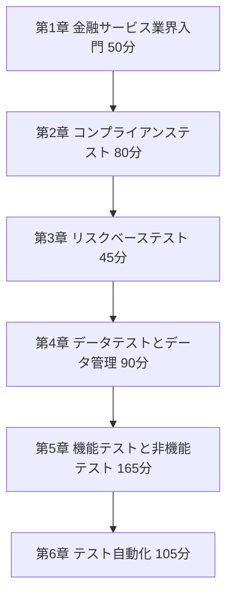
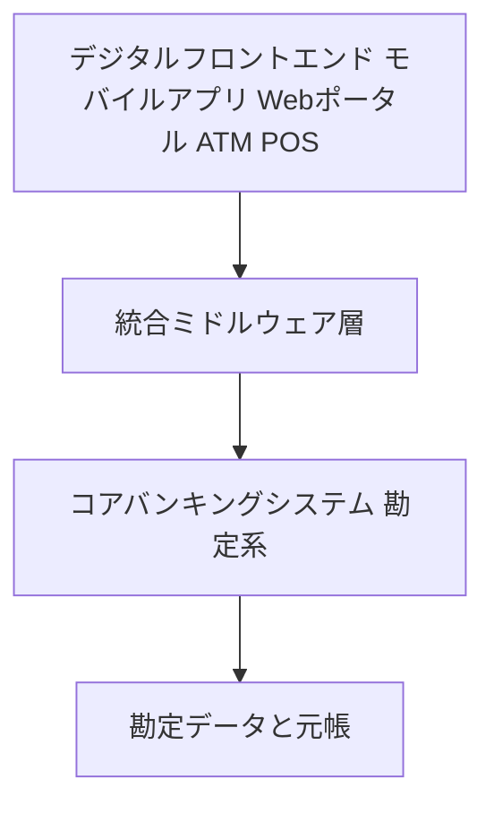
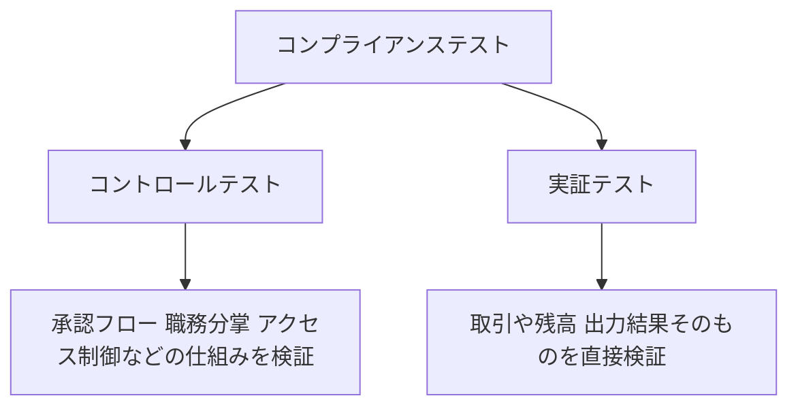
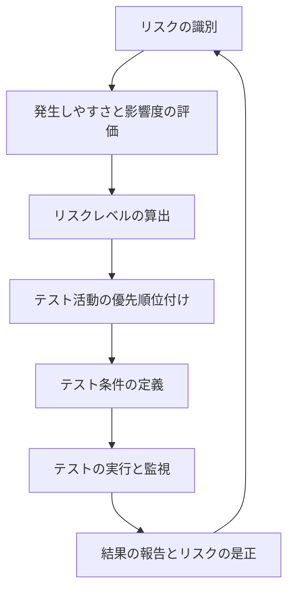
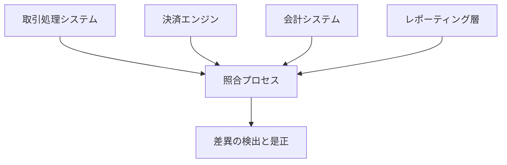
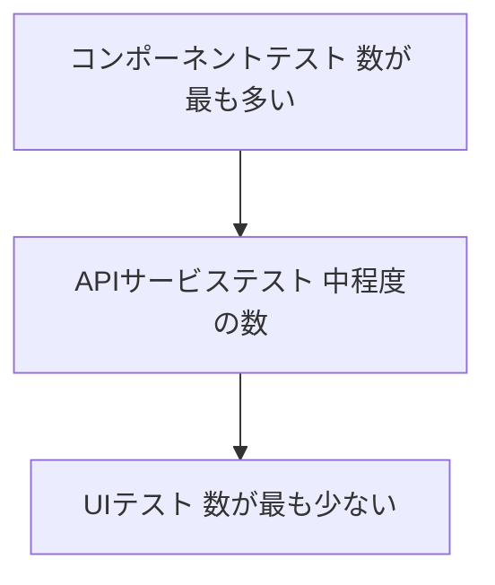

# ISTQB® Certified Tester – Finance Testing（CT-FT）完全ガイド
## 初学者のためのステップバイステップ解説

> 🎯 **[algo-beginner スキル発火]**
> 言語/カテゴリ: ドキュメント（README/技術解説）
> 適用ルールセット: 共通5ルール + ドキュメント固有ルール
> 参照ファイル: references/common.md + references/doc-readme.md

---

## この記事について

このガイドは、ISTQB®（International Software Testing Qualifications Board＝国際ソフトウェアテスト資格認定委員会）が2026年3月にリリースした **Certified Tester – Finance Testing（CT-FT）** シラバス v1.0 を土台に、金融分野のソフトウェアテスト（＝ファイナンステスト）を初めて学ぶ人向けに、ステップバイステップで解説したものです。ISTQB公式シラバスの内容に加えて、実務系のQA専門メディアや、GDPR・PSD2・DORA・PCI DSSなどの一次規制情報源も参照し、単なる試験対策にとどまらない実務理解を目指しています。

各章の末尾には📖用語集と、その章で参照した情報源のURLを掲載しています。巻末には全体の参考文献一覧（**第8章**）もまとめてあります。

> ⚠️ **重要な前提知識**：ISTQB CT-FTは、**Certified Tester Foundation Level（CTFL）**（＝ソフトウェアテストの入門資格）を取得済みであることが受験の前提条件です。本ガイドはCTFLの基礎用語（テストケース、テストレベル、同値分割など）をある程度理解している人を想定しつつ、金融特有の用語は都度補足します。

---

## 目次

0. [CT-FTとは何か](#0-ct-ftとは何か)
1. [第1章：金融サービス業界とファイナンステスト入門](#1-第1章金融サービス業界とファイナンステスト入門)
2. [第2章：コンプライアンステスト](#2-第2章コンプライアンステスト)
3. [第3章：リスクベーステスト](#3-第3章リスクベーステスト)
4. [第4章：データテストとデータ管理](#4-第4章データテストとデータ管理)
5. [第5章：機能テストと非機能テスト](#5-第5章機能テストと非機能テスト)
6. [第6章：テスト自動化](#6-第6章テスト自動化)
7. [学習ロードマップとまとめ](#7-学習ロードマップとまとめ)
8. [参考文献・引用元URL一覧](#8-参考文献引用元url一覧)

---

## 0. CT-FTとは何か

💡 この章では、CT-FT資格の全体像（対象者・前提資格・試験構成）を説明します。ここを理解しておくと、以降の各章がどのレベル感の知識を求めているのかが分かりやすくなります。

CT-FT（Certified Tester – Finance Testing）は、銀行・フィンテック（金融＋テクノロジーの造語で、決済アプリや家計簿アプリなどを提供する企業を指す）・保険・証券会社など、金融サービス業界のソフトウェアをテストする人向けに設計されたISTQB®の資格です[0-1]。銀行の勘定系システムから証券取引プラットフォーム、保険の契約管理システムまで、「お金」を扱うソフトウェアは一般的な業務システムと比べて、正確性・コンプライアンス（法令遵守）・セキュリティへの要求がとりわけ厳しいという特徴があります。CT-FTは、そうした金融特有の難しさに対応するための知識体系を提供します。

### 対象者

CT-FTは、テスター・テストアナリスト・テスト自動化エンジニア・テストマネージャーだけでなく、ビジネスアナリスト・開発者・コンプライアンス担当者・監査人・規制当局の担当者・ITリスク/セキュリティ/運用担当者まで、幅広い職種を対象としています[0-1]。「テスト」という言葉から連想される役割よりも、はるかに広い読者層を想定した資格だと考えると分かりやすいです。

### 前提資格と試験構成

| 項目 | 内容 |
|---|---|
| 前提資格 | ISTQB® Certified Tester Foundation Level（CTFL）v4.0、または旧バージョンの保有[0-1] |
| 出題数 | 40問 |
| 合格点 | 45点満点中30点 |
| 試験時間 | 60分（英語を母語としない受験者は+25%の延長あり） |

出典：ISTQB CT-FT公式ページ「Exam Structure」[0-1]

### シラバスの構成（全6章・合計8.75時間相当）

CT-FTシラバスは、以下の6つの試験対象章から構成されています。各章の学習時間の目安もあわせて示します[0-2]。

（下の図は、シラバス全体の学習の流れを示しています。上から下へ読み進めてください。）

各ノードの意味：
- 「第1章」〜「第6章」：CT-FTシラバスの試験対象範囲。番号順に依存関係があるわけではありませんが、金融ドメインの基礎（第1章）→守るべきルール（第2章）→優先順位の付け方（第3章）→データの扱い方（第4章）→具体的なテスト技法（第5章）→自動化への発展（第6章）という流れで学ぶと理解しやすい構成になっています。

### 業務成果（Business Outcomes）

CT-FT取得者が到達できる状態として、ISTQB®は次の6点を挙げています[0-2]。

1. 金融業界の構造・機関・システム・プロセスを理解し、このドメイン特有のテストの難しさを説明できる
2. 監査可能性・トレーサビリティ（＝要件とテストの対応関係を追跡できる性質）・文書化要件を満たしながら、金融規制への準拠を支えるテスト活動を実践できる
3. ビジネス・技術・規制の観点からリスクを評価し、リスクベーステストを金融システムに適用できる
4. マスキング（＝データの一部を伏せ字化する技術）やアノニマイゼーション（＝個人を特定できないよう匿名化する技術）を含め、データの正確性・一貫性・保護を実現するテスト手法を理解している
5. パフォーマンス・信頼性・セキュリティに重点を置いた、金融ドメイン特有の機能・非機能テスト技法を適用できる
6. レガシーシステムと最新システムの両方において、規制上の制約を考慮しながらテスト自動化戦略を実践できる

📖 このセクションで登場した用語
- ISTQB®：International Software Testing Qualifications Board。ソフトウェアテスト資格を国際的に標準化している非営利団体
- CTFL：Certified Tester Foundation Level。ソフトウェアテストの入門資格で、CT-FT受験の前提条件
- トレーサビリティ：ある要件がどのテストケースでカバーされているか、逆にあるテスト結果がどの要件に対応するかを追跡できる性質

**この章の参照元**
- ISTQB® CT-FT公式ページ：https://istqb.org/certifications/certified-tester-finance-testing-ct-ft/
- ISTQB® CT-FT Syllabus v1.0（PDF）：https://istqb.org/wp-content/uploads/2026/05/ISTQB-CT-FT-Syllabus-Release-v1.0.pdf

---

## 1. 第1章：金融サービス業界とファイナンステスト入門

💡 この章では、「ファイナンステストとは何か」という定義から始め、金融システムの種類・アーキテクチャ・そこで求められるドメイン知識までを説明します。以降の全ての章の土台となる部分です。

### 1.1 ファイナンステストの定義と目的

ファイナンステスト（Finance Testing）とは、銀行・フィンテック・ノンバンク金融機関（NBFI＝銀行免許を持たない保険会社や年金基金、リース会社などの総称）・その他の専門的な金融サービスで使われるソフトウェアを検証・妥当性確認するプロセスです[1-1]。単に「バグがないか」を確認するのではなく、内部処理・外部ユーザーインターフェース・サードパーティ連携まで含めた、金融サービスを実行するために必要なエコシステム全体を検証する点が特徴です。

ファイナンステストが目指す主な目的は、次の6点にまとめられます[1-1]。

| 目的 | 内容の例え |
|---|---|
| 機能的正確性 | 利息計算や元利均等返済の計算など、定義された精度と許容誤差の範囲で処理されているかを検証する。会計の締め処理で1円のズレも許されない状況をイメージすると分かりやすいです |
| 規制準拠 | ソフトウェアが各国・地域の法規制に準拠しているかを検証し、法的責任や罰金のリスクを軽減する |
| データ完全性 | 取引記録や財務データが、複数のデータベース・システム間で一貫し、破損していないことを確認する |
| セキュリティ保証 | 顧客データや金融資産をサイバー攻撃・不正利用・不正アクセスから守る、堅牢なセキュリティ制御があるかを検証する |
| 運用レジリエンス（＝障害からの回復力）とパフォーマンス | 高負荷時のスループット（＝単位時間あたりの処理件数）や応答時間、フェイルオーバー（＝障害発生時に予備システムへ自動的に切り替える仕組み）の動作を確認する |
| 顧客の信頼 | 製品が確実に動作し、利用者の利益を守り、金融機関の評判を維持できるという安心感を築く |

### 1.2 金融テスト環境の種類

金融業界のテスト対象は一様ではありません。シラバスでは、システムアーキテクチャや業務領域によって、代表的な4つのテスト環境タイプが例示されています[1-1]。

| テスト環境 | 該当領域 | テストの主な観点 |
|---|---|---|
| オムニチャネル型消費者環境 | リテール銀行・法人向け銀行業務 | モバイルアプリ・Webポータル・店舗・ATM・IVR（自動音声応答）間でのブランド体験の一貫性、チャネル間のデータ同期、レガシー勘定系との相互運用性 |
| 高スループット・低レイテンシー環境 | 投資・取引（証券取引所エンジン、アルゴリズム取引） | 1秒あたり数百万件の取引をミリ秒未満の応答時間で処理する能力、スループット、最小限のレイテンシー、実行の決定性（同じ入力に対して常に同じ結果が出ること） |
| ロジック密度が高く耐障害性を要するAPI環境 | フィンテック | マイクロサービスアーキテクチャによる複雑なビジネスロジックの処理、障害の局所化（1つのサービス障害が他のサービスに連鎖しないこと） |
| スキーマ駆動型メッセージング環境 | 銀行間の専門システム | ISO 20022（後述）やFIX（Financial Information Exchange＝証券取引で使われる通信プロトコル）などの標準に基づくメッセージスキーマの検証 |
| 時間依存・保険数理環境 | 保険・住宅ローン | 保険料算定や複利計算などの数理モデルの精度、タイムトラベルテスト（＝システムの内部時計を意図的に変更して、時間依存の機能が正しく動作するか検証する技法）|

出典：ISTQB CT-FTシラバス 1.1.2節[1-1]

### 1.3 金融システムアーキテクチャとテスト対象ワークフロー

金融機関のシステムは、一般的に複数の層が積み重なった構造をしています。それぞれの層で異なるテストの観点が求められます[1-1]。

（下の図は、金融機関の典型的なシステム構成を上位層から下位層へ向かって表しています。上から下へ読み進めてください。）

各ノードの意味：
- 「デジタルフロントエンド」：利用者が直接触れる画面。デバイスをまたいだ挙動の一貫性や生体認証、オフライン時の安定性が検証対象になります
- 「統合ミドルウェア層」：フロントエンドと勘定系をつなぐ配線のような存在。データの整合性維持と、障害の連鎖を防ぐ隔離性が重要です
- 「コアバンキングシステム」：口座管理や取引処理を担う中枢システム。アーキテクチャ上の複雑さとトランザクションの依存関係が主な検証対象です
- 「勘定データと元帳」：最終的な会計記録。ここでのデータの正しさが、財務報告全体の信頼性を左右します

さらに、金融システムでテスト対象となる代表的な業務ワークフローには、次のようなものがあります[1-1]。

- **取引ワークフロー**：支払指示のライフサイクル全体（状態遷移、決済ロジック、異常時のロールバック挙動）
- **コンプライアンス・本人確認ワークフロー**：KYC（Know Your Customer＝本人確認）に基づく顧客登録の正当性検証、AML（Anti-Money Laundering＝マネーロンダリング対策）のアラート生成や制裁リスト照合
- **投資・トレジャリーワークフロー**：OMS/EMS（Order Management System/Execution Management System＝注文管理・執行管理システム）を通じた注文執行から決済までのライフサイクル
- **オペレーション・バックオフィスワークフロー**：フロントオフィスから総勘定元帳までの照合整合性、End-of-Day/月次/年次の締め処理
- **保険特有のワークフロー**：契約のライフサイクル管理、保険料計算、保険金請求の査定と不正検知

（下の図は、代表的な支払取引の一生を、開始から記帳までの流れとして示しています。左から右へ読み進めてください。）

各ノードの意味：
- 「取引開始」：顧客が振込や送金を指示するタイミング
- 「入力時検証」：取引が正しく捕捉・検証される段階
- 「承認と決済処理」：複数システムをまたいでデータの整合性が保たれる段階
- 「清算・決済・通貨換算」：システム間でクリアリング（清算）や為替換算が行われる段階
- 「元帳への記帳」：最終状態が会計記録に正確に反映される段階
- 「監査証跡の記録」：後から検証・監査ができるよう記録が残される段階

### 1.4 なぜ一般的なテストスキルだけでは不十分なのか

金融ドメインでは、汎用的なテストスキルだけでは対応しきれない、いくつかの固有の課題があります[1-1]。ドメイン知識（＝金融業務そのものへの深い理解）は、これらの課題を軽減するための重要な手がかりになります。

- **テストオラクル問題（＝正しい期待結果が何かを判断すること自体が難しいという問題）の解決**：デリバティブ価格算定や保険数理計算のように、複雑な数理モデルの裏付けがある処理では、期待結果を独自に導出できるドメイン知識が必要になります
- **規制要件をテスト条件へ翻訳すること**：法律の条文は抽象的で解釈の余地が大きいため、それを実行可能なテストケースに落とし込むには、ドメインに精通していることが欠かせません
- **データ依存関係の把握**：特定の取引種別には特定の税区分が必要、といった金融データ特有の制約を理解していないと、有効なテストデータを作れません
- **エンドツーエンドの取引ライフサイクル検証**：取引がフロントオフィス→ミドルオフィス（清算・決済）→バックオフィス（元帳）と複数の異種システムをまたぐため、状態の一貫性を追跡するにはドメイン知識が必要です
- **リスクベーステストにおける優先順位付けの精度**：外見上は些細な不具合と、財務損失や規制違反につながる重大な不具合を見分けるには、業務への理解が欠かせません

📖 このセクションで登場した用語
- NBFI：Non-Banking Financial Institution。銀行免許を持たない保険会社・年金基金・リース会社などの総称
- KYC：Know Your Customer。顧客の本人確認プロセス
- AML：Anti-Money Laundering。マネーロンダリング（資金洗浄）対策
- テストオラクル問題：ある入力に対する「正しい」期待結果が何かを判断すること自体が難しいという問題
- タイムトラベルテスト：システムの内部時計を意図的に変更し、時間依存の機能が正しく動くか検証する技法

**この章の参照元**
- ISTQB® CT-FT Syllabus v1.0（第1章）：https://istqb.org/wp-content/uploads/2026/05/ISTQB-CT-FT-Syllabus-Release-v1.0.pdf
- ISO 20022公式サイト（金融メッセージング標準）：https://www.iso20022.org/about-iso-20022

---

## 2. 第2章：コンプライアンステスト

💡 この章では、金融業界特有の「コンプライアンステスト」がどのようなアプローチで行われ、どの規制がどのようにテストに影響するのか、そして監査可能性や自動化された継続的コンプライアンス検証（CACV）の考え方を説明します。

### 2.1 コンプライアンステストの目的とアプローチ

コンプライアンステスト（＝conformance testingやregulatory testingとも呼ばれる、規約・法律・契約への準拠性を検証するテスト）は、非機能テストに分類されることが多いものの、金融業界では実際のビジネスロジックやデータそのものを規制要件と照合して検証する、機能テストに近い性質も持ちます[2-1]。

コンプライアンステストの主な目的は次の4つです[2-1]。

1. **準拠の検証**：システムと取引が関連する規制枠組みや社内方針に準拠していることの合理的な保証を得る
2. **リスクの識別**：重大な非準拠のリスクを識別・評価し、法令違反を早期に検知して罰則・損失・評判リスクを軽減する
3. **統制の妥当性検証**：内部統制の仕組みが、非準拠を防止・検知・是正する上で有効に機能しているかを評価する
4. **証跡の提供**：デューデリジェンス（＝然るべき注意義務を尽くしたこと）と規制順守を示す、十分で信頼できる監査証跡を生成する

コンプライアンス保証を達成するための2つの補完的なアプローチが「コントロールテスト」と「実証テスト」です[2-1]。

（下の図は、コンプライアンステストの中にある2つのアプローチの関係を示しています。上から下へ読み進めてください。）

各ノードの意味：
- 「コントロールテスト」：内部統制の仕組みが設計どおりに、かつ継続的に有効に機能しているかという「プロセス」に注目する
- 「実証テスト」：統制の有無にかかわらず、システムが生成するデータや結果そのものの正確性・完全性・妥当性を直接検証する。「何が出力されたか」に注目する

### 2.2 主要な金融規制とテストへの影響

金融業界のコンプライアンス環境は、法的拘束力を持つ規制から、業界のベストプラクティスをガイドするものまで、様々な階層の規制・標準・ガイドラインによって形作られています[2-1]。以下は代表的な規制とテストとの関係をまとめた表です（ISTQB CT-FTシラバス Table 1を基に、一次情報源のURLを付記して再構成）。

| 焦点領域 | 規制・標準 | テストへの影響 | 一次情報源 |
|---|---|---|---|
| データ保護・プライバシー | GDPR（General Data Protection Regulation＝EU一般データ保護規則） | 同意処理・データ主体の権利・アクセス制御・プライバシーバイデザインの適法性を検証し、マスキング/合成PII（Personally Identifiable Information＝個人識別情報）を使い、データ保持と法域の制限を守る | https://eur-lex.europa.eu/eli/reg/2016/679/oj/eng |
| 財務の透明性 | SOX（Sarbanes-Oxley Act＝米国サーベンス・オクスリー法） | 職務分掌・承認フロー・改ざん不可能な監査ログ・匿名化データセットを使った財務履歴の保存など、内部統制を検証する | https://pcaobus.org/about/History/Documents/PDFs/Sarbanes_Oxley_Act_of_2002.pdf |
| 決済セキュリティ | PCI DSS（Payment Card Industry Data Security Standard） | 暗号化・強力な認証・安全な取引フローによるカード会員データの保護を確認し、トークン化されたPAN（Primary Account Number＝カード番号）とマスキングされたログのみを使う | https://www.pcisecuritystandards.org/standards/pci-dss/ |
| 運用レジリエンス | DORA（Digital Operational Resilience Act＝EUデジタル・オペレーショナル・レジリエンス法） | 災害復旧・事業継続計画（DR/BCP）、フェイルオーバー、シナリオベーステストによるICT（情報通信技術）レジリエンスを、匿名化された複製データセットで評価する | https://eur-lex.europa.eu/eli/reg/2022/2554/oj/eng |
| 決済・オープンバンキング | PSD2（Payment Services Directive 2＝EU改正決済サービス指令） | 強力な顧客認証（SCA）・多要素認証（MFA）・API セキュリティ・同意ライフサイクル管理を、合成アカウントでテストし、安全なオープンバンキング運用を確認する | https://eur-lex.europa.eu/EN/legal-content/summary/revised-rules-for-payment-services-in-the-eu.html |
| 銀行の自己資本とリスク | Basel III/IV（バーゼル銀行監督委員会による国際規制枠組み） | ストレステストとシナリオベーステストを通じて、信用・市場・流動性リスクモデルの検証を、大規模な匿名化・合成ポートフォリオを使って支える | https://www.bis.org/bcbs/basel3.htm |
| マネーロンダリング対策 | AMLD5/AMLD6（EU第5次・第6次マネーロンダリング指令） | KYCフロー・制裁リスト照合・アラート生成・リスクフラグ付けロジックを、現実的な合成の顧客・取引パターンで検証する | https://eur-lex.europa.eu/legal-content/EN/TXT/?uri=celex%3A32018L0843 |
| 暗号資産 | MiCA（Markets in Crypto-Assets Regulation＝EU暗号資産市場規則） | カストディの安全対策・注文の整合性・市場濫用検知を、合成ウォレットと匿名化された暗号資産取引でテストする | https://eur-lex.europa.eu/eli/reg/2023/1114/oj/eng |

⚠️ 金融規制は地域・法域ごとに異なるため、コンプライアンスの枠組み・統制の仕組み・報告基準をテストプロセス内で地域ごとに適応させる必要があります[2-1]。

### 2.2.2 非準拠がもたらす結果

規制・コンプライアンス要件を満たせなかった場合、財務・法律・評判・運用の4つの側面で深刻な結果を招く可能性があります[2-1]。

| 影響の種類 | 具体例 |
|---|---|
| 財務的な罰則 | マネーロンダリング対策違反やデータプライバシー法違反、誤った財務報告に対する巨額の罰金 |
| 法的・規制上の制裁 | 訴訟、刑事責任、強制的な組織再編、外部経営陣の任命など |
| 評判・市場での地位への損害 | ネガティブな報道、投資家の懸念、顧客離れ |
| 事業の停止 | サービス停止、免許制限、規制当局の介入による収益減少や市場シェアの低下 |
| 運用リスクと技術的負債 | セキュリティ統制の不備によるデータ侵害や不正のリスク増大 |

### 2.3 規制下でのテストに特有の性質

一般的なソフトウェア開発とは異なり、金融システムのテストは以下のような固有の特徴を持ちます[2-1]。

- **規制変更駆動型のテスト**：市場のフィードバックよりも、外部からの法改正によってテストの必要性が発生することが多い
- **規制を意識した要件分析**：法律やコンプライアンス上の要求を、テスト可能なソフトウェア仕様に落とし込む専門的なプロセス
- **規制上の必要性としてのネガティブテスト**：不正利用や制裁対象の取引など、「一見有効に見えるが禁止されている入力」を使ってシステムが正しく拒否できるかを確かめる
- **コンプライアンスが重要な意味を持つテストデータ管理**：本番データをそのままテストに流用できる非規制業界とは異なり、法規制がテストデータの扱い方そのものを制約する（詳細は第4章）
- **証跡重視のテスト**：欠陥検出よりも、デューデリジェンスの証明と統制の実効性の証明に重心が置かれる
- **必須の非機能テスト**：パフォーマンスと信頼性のテストが、単なるビジネス上の選好ではなく、法的な義務として求められる

### 2.4 監査可能性とCACV（継続的自動コンプライアンス検証）

**監査可能性（Auditability）**とは、テスト活動やシステムの挙動を、独立した第三者が再構築・レビュー・検証できる能力のことです[2-1]。監査可能性を支える主な要素は次のとおりです。

- **双方向トレーサビリティ**：規制要件からテストケースへ（順方向）、テスト結果からその根拠となった規制要件へ（逆方向）と、両方向に追跡できること
- **不変な証跡の保存**：テスト計画、承認済み要件、実行ログ、スクリーンショットなどを、改ざん不可能な形式で保存すること
- **証跡の完全性とプライバシー**：監査ログにマスキング技術を組み込み、機密性の高い金融情報が露出しないようにすること
- **再現性**：独立した監査人がテストを再実行し、同じ結果を得られるように、環境設定や入力パラメータを十分に記録すること

**CACV（Continuous Automated Compliance Validation＝継続的自動コンプライアンス検証）**は、規制・セキュリティ統制をソフトウェア配信ライフサイクル全体に組み込む実践です。定期的な監査に頼る従来型の手法とは異なり、CACVは自動化を通じてリアルタイムに近い継続的な保証を提供します[2-1]。

（下の図は、CACVの実装サイクルを示しています。矢印の向きに沿って、時計回りに読み進めてください。）

各ノードの意味：
- 「要件の詳細化と定義」：規制の枠組みを分析し、テスト可能な要件へ落とし込む段階
- 「開発」：コンプライアンス要件を実行可能なコードとして実装し、規制ルールとの対応関係（トレーサビリティ）を確立する段階
- 「自動実行と検査」：CI/CD（Continuous Integration/Continuous Deployment＝継続的インテグレーション・デリバリー）パイプライン内で自動テストが継続的に実行され、非準拠のコードが本番環境へ昇格するのを「品質ゲート」がブロックする段階
- 「評価と報告」：テスト結果から改ざん不可能な監査証跡と違反レポートを生成し、本番環境における設定ドリフト（＝正しく設定されていたシステムが、後から手動変更されて非準拠状態に陥ること）を検出し、修復ワークフローを起動する段階

CACVを支える具体的な技術要素には、Compliance as Code（規制要件をコードとして表現し、バージョン管理・自動実行できるようにする手法）、CI/CDパイプラインへの統合と品質ゲート、そして本番環境の継続監視（Continuous Control Monitoring）があります[2-1]。

📖 このセクションで登場した用語
- コントロールテスト：内部統制の仕組みが有効に機能しているかという「プロセス」を検証するテスト
- 実証テスト：システムが生成する実際のデータや結果そのものを直接検証するテスト
- 監査可能性（Auditability）：テスト活動とシステムの挙動を、独立した第三者が再構築・検証できる能力
- CACV：Continuous Automated Compliance Validation。規制・セキュリティ統制をソフトウェア配信ライフサイクルに継続的に組み込む実践
- 設定ドリフト：正しく設定されていたシステムが、後から手動変更などによって非準拠状態に陥ること

**この章の参照元**
- ISTQB® CT-FT Syllabus v1.0（第2章）：https://istqb.org/wp-content/uploads/2026/05/ISTQB-CT-FT-Syllabus-Release-v1.0.pdf
- GDPR（EU規則2016/679）：https://eur-lex.europa.eu/eli/reg/2016/679/oj/eng
- Sarbanes-Oxley Act（2002年）原文：https://pcaobus.org/about/History/Documents/PDFs/Sarbanes_Oxley_Act_of_2002.pdf
- PCI DSS公式解説：https://www.pcisecuritystandards.org/standards/pci-dss/
- DORA（EU規則2022/2554）：https://eur-lex.europa.eu/eli/reg/2022/2554/oj/eng
- PSD2（EU指令2015/2366）概要：https://eur-lex.europa.eu/EN/legal-content/summary/revised-rules-for-payment-services-in-the-eu.html
- Basel III（BIS公式）：https://www.bis.org/bcbs/basel3.htm
- AMLD5（EU指令2018/843）：https://eur-lex.europa.eu/legal-content/EN/TXT/?uri=celex%3A32018L0843
- マネーロンダリング関連指令の要約（AMLD5/6含む）：https://eur-lex.europa.eu/legal-content/EN/TXT/?uri=LEGISSUM:money_laundering
- MiCA（EU規則2023/1114）：https://eur-lex.europa.eu/eli/reg/2023/1114/oj/eng
- 実務解説：Software Testing in Banking（aqua cloud）：https://aqua-cloud.io/banking-financial-software-testing-ultimate-guide/

---

## 3. 第3章：リスクベーステスト

💡 この章では、限られた時間の中で「どこを優先してテストするか」を決めるためのリスクベーステストの考え方を、金融システム特有のリスク分類と合わせて説明します。

### 3.1 金融システムにおけるリスクの分類

リスクベーステストとは、機能ごとに想定される障害の起こりやすさとビジネスへの影響度を掛け合わせて、テストの優先順位を決める戦略的アプローチです[3-1]。金融分野では、リスクは大きく3つの軸に分類されます。

| リスクの軸 | 内容の例 |
|---|---|
| ビジネス・財務リスク | 機密データの移行に伴うリスク、データ処理の欠陥、計算誤り、ルール適用の誤り |
| 技術・運用リスク | スコープの肥大化、ツールサポートの不足、特定ツールやAPIへの過度な依存 |
| 規制・コンプライアンスリスク | サードパーティのベンダーが規制・セキュリティ・パフォーマンス義務を満たせないリスク（特にDORAの下で重要）、法改正への対応遅れ |

また、ISTQB® Foundation Levelシラバスでは「プロジェクトリスク」（スケジュール・予算・スコープに関わるリスク）と「プロダクトリスク」（製品の品質特性に関わるリスク）が区別されます[3-1]。プロダクトリスクの評価軸としてよく使われるのが、**ISO/IEC 25010:2023**（SQuaRE＝Systems and software Quality Requirements and Evaluationファミリーの一部）が定義する製品品質モデルです[3-2]。

| 品質特性 | 説明の要点 |
|---|---|
| 機能適合性 | 意図した機能を正確に、かつ完全に提供できるか |
| 性能効率性 | 定められた時間・スループットの範囲内で機能を実行できるか |
| 互換性 | 他の製品と情報を交換し、相互に利用できるか |
| 対話性（旧：使用性） | ユーザーが目的のタスクを達成するために対話できるか |
| 信頼性 | 定められた条件下で、定められた期間、機能を維持できるか |
| セキュリティ | 権限を持つ人や他システムだけが情報や機能にアクセスできる状態を保てるか |
| 保守性 | 変更・修正が効率的かつ効果的に行えるか |
| 移植性 | ある環境から別の環境へ効果的かつ効率的に移せるか |
| 安全性（2023年版で追加） | 人の生命・健康・財産・環境へのリスクを一定条件下で回避できるか |

出典：ISO/IEC 25010:2023[3-2]、ISTQB CT-FTシラバス 3.1節[3-1]

金融分野では、9つの特性すべてが重要ですが、とりわけ**セキュリティ**と個人・財務情報の**プライバシー保護**は死活的に重要です。データ侵害は、顧客情報の露出、企業の評判の毀損、多額の財務損失、法的な罰則につながる可能性があります[3-1]。

### 3.2 金融システムにおけるリスクベーステストの原則

金融システムでは欠陥のコストが極めて高く（金銭的損失・規制罰則・評判の毀損など）、リスクベーステストの重要性が一段と高まります[3-1]。チームはまず各リスクの「発生しやすさ（likelihood）」と「発生した際の影響度（impact）」を評価し、その掛け合わせとして「リスクレベル」を算出します。リスクレベルは定量的（例：20%の遅延発生確率）にも、定性的（例：低・中・高）にも表現できます。

「リスクマトリクス」（likelihood-impact matrix＝発生しやすさと影響度を軸にしたグリッド）を使うと、最も発生しやすく、最も影響が大きいリスクにテストの優先度を最も高く割り当てることができます。市場や規制環境は変化し続けるため、リスクレベルは定期的に再評価されるべきものとされています（これを動的リスク評価と呼びます）[3-1]。

リスクベーステストを行う理由としては、限られたリソースの効率的な配分、開発の早い段階での欠陥検出（シフトレフト）、重要機能へのテストの集中、そしてビジネス価値の向上が挙げられます[3-1]。

（下の図は、リスクベーステストを実践する際の一連の流れを示しています。上から下へ読み進めてください。）

各ノードの意味：
- 「リスクの識別」：ビジネスアナリスト・コンプライアンス担当・技術チーム・リスクマネージャーなど、複数のステークホルダーが関与して行う
- 「発生しやすさと影響度の評価」：機能的リスク（例：利息計算の欠陥）と非機能的リスク（例：高負荷時のパフォーマンス低下）の両方を対象にする
- 「テストの実行と監視」：テストスイートを実行しながら、結果を継続的にモニタリングする
- 「結果の報告とリスクの是正」：発見した欠陥を文書化し、リスク回避・軽減・移転・受容のいずれかの対応方針を選ぶ
- 一番下から一番上へ矢印が戻っているのは、リスク評価が一度きりではなく、継続的に繰り返される性質を持つことを表しています

### 3.3 リスクベーステストに関連するテスト活動

リスクの優先順位付けには、いくつかの体系的な手法が使われます[3-1]。

| 手法 | 概要 |
|---|---|
| FMEA（Failure Mode and Effect Analysis＝故障モード影響解析） | 発生前に潜在的な故障を体系的に識別・優先順位付け・軽減するプロアクティブな手法 |
| FTA（Fault Tree Analysis＝フォールトツリー解析） | ブール論理ゲート（AND、OR）を使い、望ましくないシステムレベルの事象の根本原因を、上から下へ図式的にたどるトップダウン型の解析手法 |
| PRISMA（Product RISk MAnagement） | 最もビジネス・技術リスクが高い領域を識別するアプローチ |

識別されたリスクの高い領域をカバーするテスト条件を定義し、トレーサビリティマトリクス（リスク→テスト条件→テスト結果の対応表）を使って完全性を確保します。テスト実行後は、リスク軽減戦略として「リスク回避」「テストによるリスク軽減」「リスク移転（保険など）」「リスク受容」のいずれかを選択します[3-1]。なお、ISO 31000:2018（リスクマネジメントの国際規格）は、こうしたリスクマネジメントを組織の意思決定プロセスへ統合するための追加ガイダンスを提供しています[3-3]。

📖 このセクションで登場した用語
- リスクレベル：発生しやすさ×影響度で算出される、リスクの重大性の指標
- リスクマトリクス：発生しやすさと影響度を軸にしたグリッドで、リスクを可視化するツール
- シフトレフト：開発ライフサイクルの早い段階でテストや品質活動を行う考え方
- FMEA / FTA / PRISMA：リスクの優先順位付けに使われる代表的な分析手法

**この章の参照元**
- ISTQB® CT-FT Syllabus v1.0（第3章）：https://istqb.org/wp-content/uploads/2026/05/ISTQB-CT-FT-Syllabus-Release-v1.0.pdf
- ISO/IEC 25010:2023（製品品質モデル）：https://www.iso.org/standard/78176.html
- ISO 31000:2018（リスクマネジメント）：https://www.iso.org/standard/65694.html

---

## 4. 第4章：データテストとデータ管理

💡 この章では、金融システムにおける「データの正しさ」をどう検証するか、複数システム間でのデータ照合の考え方、そしてテストで扱うデータのプライバシー保護について説明します。

### 4.1 データ正確性とデータ一貫性

**データ正確性（data accuracy）**とは、データが実際の金融情報をどれだけ正しく表しているかという指標です。**データ一貫性（data consistency）**とは、複数のシステム・コンポーネント・データベースをまたいで、データが同じ形式・値・意味で表現されている状態を指します[4-1]。

これらが崩れることの影響は、金融システムでは特に深刻です。

| 影響領域 | 内容 |
|---|---|
| 財務報告 | わずかな不正確さやデータの不一致が、誤った計算・誤解を招く要約・信頼できない財務インサイトへと連鎖する |
| リスクと意思決定支援 | リスク評価や分析モデルは、大量の履歴データ・取引データに依存するため、不整合な入力があると予測やリスクプロファイルの精度が落ちる |
| システム統合と自動化 | 取引処理・顧客管理・照合システムなど複数の連携コンポーネントの間で、一貫したデータが手動介入や運用上の摩擦を減らす |

典型的なデータ不正確・不一致の例としては、明細への重複取引の表示、元帳とサブレジャー間の残高差異、オンボーディングと本人確認システム間の顧客データのばらつき、クロスボーダー取引での通貨の不一致、移行・変換作業中のデータ損失や破損などが挙げられます[4-1]。

### 4.2 複数システム間でのデータ照合

**データ照合（data reconciliation）**は、金融エコシステム内の複数システムを移動するデータの整合性を確認する活動です。取引処理システム・決済エンジン・会計プラットフォーム・レポーティング層といった複数のプラットフォームを取引が通過する中で、各システムが処理ロジック・タイミング・データ変換の違いにもかかわらず、同じ財務結果を反映していることを確かめます[4-1]。

（下の図は、複数のシステムから照合プロセスへとデータが集約される流れを示しています。上から下へ読み進めてください。）

各ノードの意味：
- 「取引処理システム」「決済エンジン」「会計システム」「レポーティング層」：それぞれ異なるタイミング・ロジックでデータを処理するシステム群
- 「照合プロセス」：残高・取引件数・記帳日・ステータスといった照合ポイントを比較する段階
- 「差異の検出と是正」：許容範囲内の差異（為替換算による端数など）と、本当の不整合を切り分け、後者を調査・是正する段階

データ照合で特に重要な観点は次のとおりです[4-1]。

- **システム間のデータ整合**：取引の状態・金額・タイムスタンプが、インターフェースをまたいで一致しているか
- **照合範囲の明確化**：残高・取引件数・記帳日・ステータスといった照合ポイントを明確に定義する
- **許容誤差と例外**：為替換算による端数差など、許容範囲内の差異を真の不整合と区別する
- **バッチ処理と締め時刻の扱い**：月末などの締め処理のタイミングでの、完全性の確認と重複防止
- **元帳・残高照合**：取引レベルのデータをサブレジャーと総勘定元帳に整合させる
- **照合の頻度と量の処理**：リアルタイム・日中・日次終了時のいずれで照合するか、ピーク時の取引量でも安定して動作するか
- **データ変換・マッピングの検証**：手数料適用・利息計算・通貨換算などの変換ルールが、システム間で一貫した結果を生むか
- **複数通貨・クロスボーダー取引**：為替レート・決済通貨・タイミングの違いによる追加的な照合の複雑さ

特にコアバンキングのマイグレーション（システム移行）やプラットフォームのアップグレード時には、技術的には正しく動作していても、システム間でデータが揃っていないと、残高の誤り・取引の欠落・不整合なレポーティングにつながる可能性がある点に注意が必要です[4-1]。

### 4.3 ファイナンステストにおけるデータプライバシーとデータ保護

**データプライバシー**は、個人情報・財務情報の適切な収集・利用・保存・共有・削除に関わる考え方です。テストで確認すべき代表的な観点には、ユーザーの役割に応じたアクセス制御、画面・レポート・エクスポート・エラーメッセージにおける機密データの表示制限、同意に基づく利用目的の遵守、データ保持・削除ルールの正しい実装などがあります[4-1]。

**データ保護**は、テスト環境における機密情報の保護に関わる考え方です。強くマスキング・匿名化されていない限り、本番データをそのまま使うことは避けるべきとされ、可能な限り合成データ・匿名化データ・仮名化データ・マスキングデータを使うことが推奨されます[4-1]。

| 手法 | 内容 |
|---|---|
| マスキング（データ匿名化） | 個人識別子を除去・伏せ字化し、構造的にはリアルだがGDPRなどの規制上「個人データ」に該当しなくなるようにする |
| 合成テストデータ生成 | 現実の特徴を模倣した人工的なデータセットを作成し、規制上の制約を受けないようにする |
| 仮名化 | 識別子を別の値に置き換え、個人データの露出を減らす |

📖 このセクションで登場した用語
- データ正確性：データが実際の金融情報をどれだけ正しく表しているかの指標
- データ一貫性：複数システムをまたいでデータが同じ形式・値・意味で表現されている状態
- データ照合：複数システム間を移動するデータの整合性を比較・確認する活動
- マスキング：データの一部（個人識別子など）を伏せ字化・除去する匿名化技術
- 仮名化：識別子を別の値に置き換え、個人データの露出を減らす技術

**この章の参照元**
- ISTQB® CT-FT Syllabus v1.0（第4章）：https://istqb.org/wp-content/uploads/2026/05/ISTQB-CT-FT-Syllabus-Release-v1.0.pdf
- GDPR（EU規則2016/679）：https://eur-lex.europa.eu/eli/reg/2016/679/oj/eng
- 実務解説：Financial Services Testing Data Environment Challenges（TestRail）：https://www.testrail.com/blog/software-testing-in-financial-services/

---

## 5. 第5章：機能テストと非機能テスト

💡 この章では、金融システム特有の機能テスト技法、パフォーマンステストの考え方、セキュリティ・可用性テスト、そして生成AI（GenAI）がファイナンステストにどう活用され始めているかを説明します。

### 5.1 金融システムの機能テスト

金融システムは機微な金融データと実際の金銭取引を扱うため、失敗のコストが非常に高いという特徴があります。したがって、包括的でコンプライアンスに準拠し、リスクベースのテストが求められ、強固なドメイン知識と規制・リスクへの意識が不可欠です[5-1]。

金融分野では、CTFLで学ぶ標準的なブラックボックステスト技法（＝内部構造を見ずに入出力の関係から検証する手法）を、以下のように応用します[5-1]。

| テスト技法 | 金融分野での適用例 |
|---|---|
| 同値分割 | 取引の機能的な正確性と一貫性の検証 |
| 境界値分析 | 通貨精度（例：0.01単位）での金額の境界値検証。最小単位での丸め処理や、限度額のすぐ下/ちょうど/すぐ上の値を検証する |
| デシジョンテーブルテスト | ビジネスルールと条件の組み合わせを検証する。複数条件の組み合わせテストに向いている |
| 状態遷移テスト | 口座のアクティブ/非アクティブ/凍結といった状態遷移の検証 |

さらに、金融ソフトウェア特有の追加的なテスト技法として、以下のものが紹介されています[5-1]。

| 技法 | 長所・短所・課題 |
|---|---|
| 計算テスト（既知の関数・公式を使って値を再計算する手法。キャッシュフローの正味現在価値やオプション価格の算出などに使う） | 長所：信頼性の高い結果が得られ、文書化しやすい。短所：複雑な分析テストへの適用範囲は限定的で、文書化・実装の手間が大きい。課題：深いドメイン知識が必要 |
| 探索的テスト（明示的な計算を行わずに、金融値の挙動パターンを発見的に検証する手法） | 長所：実行が速く、カバレッジが広く、オーバーヘッドが小さい。短所：自動化フレームワークやCI/CDパイプラインへの組み込みが難しい。課題：強い専門性とドメイン知識が必要 |
| バックトゥバックテスト（新旧バージョンの出力結果を突き合わせて比較する手法） | 長所：リグレッションテストに効果的。短所：テスト環境の構築と入力パラメータの同期が難しい場合がある。課題：差異の分析には両システムへの深い理解が必要 |

たとえばATMのテストでは、最小・最大送金額の境界値分析のような基本的な技法に加えて、バックトゥバックテスト、手数料・通貨計算の機能的正確性テスト、新型ATM向けの探索的テストなど、複数の技法を組み合わせることが有効とされています[5-1]。

### 5.2 金融分野におけるパフォーマンスリスク

金融機関は、大量の取引処理・決済サービス・投資管理・規制順守を支えるために、信頼できるソフトウェアシステムに依存しています。とりわけ取引量のピーク時に、許容できる性能効率性を維持する必要があります[5-1]。

代表的なパフォーマンス課題には、次のようなものがあります。

- **スケーラビリティ**：祝日・クリスマス・ブラックフライデー・市場暴落時など、負荷が増大するタイミングで決済処理システムがパフォーマンス障害を起こす
- **並行性の欠陥**：同時リクエストの処理に失敗する。大規模障害後、取引プラットフォームの利用者が一斉にページを再読み込みして負荷が増大する例など
- **インフラの制約**：古いハードウェアや非効率な構成が最適なパフォーマンスを妨げる
- **データ整合性の侵害**：高負荷下で取引データが失われたり破損したりする
- **技術的負債のリスク**：ソフトウェアと老朽化したハードウェアの両方を更新する必要が生じ、保守コストが増大する
- **サードパーティ依存**：外部ソフトウェアベンダー・クラウドサービス・決済ゲートウェイの提供者への依存が、内部のパフォーマンスに影響する

こうしたリスクを軽視すると、財務的損失や深刻な評判の毀損につながる恐れがあります。対策としては、継続的なモニタリング、従業員向けトレーニング、定期監査、負荷メトリクスの静的分析、そして定期的なパフォーマンステスト・可用性テストが挙げられます[5-1]。

### 5.3 金融文脈におけるパフォーマンステスト

パフォーマンステスト（負荷テスト・ストレステストなど）は、規制環境において必須の活動とされています[5-1]。本番環境に近い専用のテスト環境を用意し、構成の整合性・同期手順・依存関係管理・外部サービスのバージョンの一貫性を確保することが求められます。

パフォーマンステストが必要とされる典型的なタイミングは、初回の本番デプロイや大規模リリース、データベースの大規模バージョン移行やモノリスからマイクロサービスへの移行のようなアーキテクチャ変更、そして新規拠点の開設などによる負荷プロファイルの変化などです[5-1]。

以下は、金融ソフトウェア特有の追加的なパフォーマンステスト活動の一覧です（ISTQB CT-FTシラバス Table 4を基に再構成）。

| アクティビティ | 説明 |
|---|---|
| 負荷テスト | 1秒あたりの取引数などのメトリクスを使い、指定された負荷レベルでの機能を検証する |
| ストレステスト | 通常やピーク想定を上回る負荷（例：200%）での挙動を確認する。性能低下や部分的な障害が起きても、完全にクラッシュせず、意味のあるエラーを返して優雅に失敗し、負荷が戻れば性能も回復することを期待する |
| エンデュランス（耐久性）テスト | 長時間の持続的な負荷下でシステムが安定して動作するかを判定する。メモリリークなどの劣化をCPU使用率などのメトリクスで検出する |
| 外部システム可用性テスト | 依存する外部システムが遅延・タイムアウト・利用不可になった際の、システムの性能・安定性を測定する。サーキットブレーカーやリトライといった障害処理ロジックが、性能劣化やリソースリークを起こさないことを確認する |
| フェイルオーバーテスト | 再起動時の安定性、クラッシュへの耐性、復旧速度、バックアップを検証する。急激な負荷スパイクからの回復力を確かめるスパイクテストにも応用できる |
| データセンター可用性テスト | ダウンタイム時のデータセンター間のリクエスト振り分けの正しさを検証する |

### 5.4 セキュリティテストと可用性テスト

金融ソフトウェアのセキュリティテストは、データの機密性・完全性・可用性を保護し、不正・財務損失を防ぐことを目的とします。開発ライフサイクル全体を通じて、脅威モデリング（＝想定される攻撃経路を洗い出す手法）や専門家によるアーキテクチャレビューを組み込むことが推奨されます[5-1]。

セキュリティテストの種類には、脆弱性スキャン、ペネトレーションテスト、SAST/DAST（Static/Dynamic Application Security Testing＝静的・動的アプリケーションセキュリティテスト）、サードパーティコンポーネントの依存関係分析などがあります。ベストプラクティスとしては、専用ツールの活用、OWASP[5-2]のような標準への準拠、DevSecOps（開発プロセスへのセキュリティの組み込み）、脅威モデリング、サードパーティ・サプライチェーンリスクの管理などが挙げられます[5-1]。

**可用性テスト**は、ピーク負荷時にも継続的な運用ができるかを判定し、取引の喪失・収益への影響・顧客の信頼喪失を防ぐことを目指します。主なメトリクスには次のようなものがあります[5-1]。

| メトリクス | 意味 |
|---|---|
| RTO（Recovery Time Objective） | ITサービスをどれだけの時間で復旧させる目標か |
| RPO（Recovery Point Objective） | 主要取引をどの時点まで遡って復旧できる必要があるか |
| MTBF（Mean Time Between Failures） | 平均故障間隔 |
| MTTF（Mean Time To Failure） | 平均故障時間 |
| MTTR（Mean Time To Repair） | 平均修復時間 |

### 5.5 ファイナンステストにおけるGenAI（生成AI）

生成AI（GenAI＝大規模な事前学習モデルを使い、人間らしいテキスト・画像・コードを生成するAI技術）をファイナンステストに組み込むことで、規制の厳しい環境における効率性と一貫性を高めることができます。プロンプトエンジニアリング（＝AIへの指示文を工夫する技術）を活用することで、GenAIはテスト分析・テスト設計・テスト実装・テストの監視とコントロール・テスト完了まで、テストプロセス全体を支援できます[5-1]。

（下の図は、テストプロセスの主要な段階とGenAIによる支援の対応関係を示しています。左から右へ読み進めてください。）

各ノードの意味：
- 「テスト分析」：AIアシスタントがAPIを解析し、要件やテスト条件の候補をレビュー用に提案する段階
- 「テスト設計と実装」：AIアシスタントがコードからテストモデルを構築・同期し、要件からUI/APIのテストケースを生成し、情報セキュリティ要件への違反がないかを確認する段階
- 「テスト監視とコントロール」：AIアシスタントがテストログを分析し、異常や欠陥を検出する段階
- 「テスト完了」：AIアシスタントがテストレポートや欠陥レポートの作成・検証を支援する段階

以下は、金融組織のSDLC（Software Development Life Cycle＝ソフトウェア開発ライフサイクル）に組み込める代表的なAIアシスタントの活用領域です（ISTQB CT-FTシラバス Table 5を基に再構成）[5-1]。

| テスト活動 | AIアシスタントの役割 |
|---|---|
| 開発段階でのテスト | 組織のコーディング規約に合わせたモデルで、単体テストの生成や軽微な欠陥の自動修正を支援する |
| テスト分析 | APIを分析し、要件・テスト条件の候補をレビュー用に提案する |
| テスト設計・実装 | コードからのテストモデル構築、要件からのUI/APIテストケース生成、情報セキュリティ要件違反のチェック、ローコード/ノーコードでのテスト自動化支援 |
| テスト監視・コントロール | テストログを分析し、異常や欠陥を検出する |
| テスト完了 | テストレポート・欠陥レポートの作成と検証を支援する |

GenAIの活用には、高品質なラベル付きデータの入手可能性の低さやコストの高さといった課題も伴います。金融機関がGenAIの価値を最大化するには、データの完全性・規制順守・スキル開発・インフラ改善を優先し、パイロット導入と現実的な計画を通じて経済的リスクを管理することが求められます[5-1]。

📖 このセクションで登場した用語
- SAST/DAST：Static/Dynamic Application Security Testing。コードを実行せずに解析する静的テストと、実行時に解析する動的テストの手法
- RTO/RPO：Recovery Time Objective/Recovery Point Objective。障害復旧までの目標時間と、復旧すべきデータの時点
- MTBF/MTTF/MTTR：平均故障間隔・平均故障時間・平均修復時間
- GenAI：Generative Artificial Intelligence。大規模な事前学習モデルを用いてテキストやコードなどを生成するAI技術

**この章の参照元**
- ISTQB® CT-FT Syllabus v1.0（第5章）：https://istqb.org/wp-content/uploads/2026/05/ISTQB-CT-FT-Syllabus-Release-v1.0.pdf
- OWASP Top 10（公式）：https://owasp.org/www-project-top-ten/
- 実務解説：Fintech QA Guide 2026（DeviQA）：https://www.deviqa.com/blog/fintech-application-testing-the-complete-qa-guide-for-2026/
- 実務解説：Software Testing for BFSI（SmartDev）：https://smartdev.com/software-testing-for-bfsi-methodologies-best-practices/

---

## 6. 第6章：テスト自動化

💡 この章では、金融システムにおけるテスト自動化の役割、legacy（従来型）システムと最新システムの両方に対応する戦略、そして規制環境・モバイル/フロントエンド/バックエンドそれぞれの自動化における課題を説明します。

### 6.1 ファイナンステストにおけるテスト自動化の役割

複利計算・与信スコアの検証・大規模なリグレッションテストスイートの実行など、精度とスピードが不可欠な金融分野では、テスト自動化は手動テストに対して大きな優位性を持ちます[6-1]。

テスト自動化がもたらす代表的な利点は次のとおりです。

- 一貫したテスト実行と、手動入力ミスによるばらつきの最小化
- リリース後の迅速なリグレッションテストにより、手動テスターが複雑なシナリオに集中できる
- デプロイのタイミングに合わせた自動テストスクリプトの実行によるフィードバックの高速化
- ピーク負荷シナリオのシミュレーションと、複数環境での一貫した実行
- PCI DSSやAML/CFT（Combating the Financing of Terrorism＝テロ資金供与対策）統制などの標準への準拠を体系的に検証し、監査可能な証跡を生成できる
- 与信履歴・請求書・カード・取引テンプレートを持つ顧客など、複雑なエンドツーエンドのテストデータを自動生成できる

一方で、金融ドメイン特有の課題として、複雑さ（住宅ローン登録のような業務は、スコアリング・所得確認・外部レジストリとの連携まで幅広くカバーする必要がある）、コスト（自動化の投資対効果は、手動テストの削減よりも、サービス停止や規制罰則といった高コストな障害のリスク軽減によって測られることが多い）、そしてスキルギャップ（金融のビジネスロジックと自動化技術の両方に精通した人材の不足）が挙げられます[6-1]。

### 6.2 テスト自動化戦略

（下の図は、テストピラミッドの考え方を示しています。下から上へ、テストの数が徐々に絞り込まれていく様子を表しています。下から上へ読み進めてください。）

各ノードの意味：
- 「コンポーネントテスト」：最も実行が速く、数を多く持てる層
- 「APIサービステスト」：コンポーネントとUIの中間層で、業務ロジックの結合を確認する
- 「UIテスト」：実行コストが高いため、最も重要なシナリオに絞り込む層

テストの分布パターンには、ピラミッド型のほかにも複数の形が存在します[6-1]。

| 分布パターン | 特徴 |
|---|---|
| ピラミッド型 | 下位層（コンポーネント）ほどテスト数が多く、上位層（UI）ほど少ない、最も推奨される形 |
| アイスクリームコーン型 | UIテストが多く、下位層のテストが少ない、避けるべきとされる形 |
| 砂時計型 | 中間層（API/サービス）にテストが集中する形 |
| アンブレラ型 | 複数のテストレベルを横断的にカバーする形 |

金融組織では、レガシーシステムと新規実装で異なる戦略が必要になります。**シフトレフト**（開発の早い段階でテスト自動化とコンプライアンスを組み込む考え方）は本番投入前の品質を高め、**シフトライト**（本番環境でリアルタイムの品質・取引の整合性・不正検知を監視する考え方）は運用後の品質を支えます[6-1]。

金融分野特有の追加的な考慮事項としては、次のようなものがあります。

- **高い精度要求**：通貨値のデータ型や計算精度がシステムによって異なるため、非金融分野より厳格な精度検証が必要
- **相互接続システムをまたぐエンドツーエンド自動化の複雑さ**：特に複雑な請求ワークフローを持つ会計システムなどで顕著
- **リアルタイムに近いデータの利用**：季節や商品構成によって変化する顧客の取引パターンを反映するため、匿名化された本番前データや定期更新されるテストデータを使う
- **自動テストオラクル（疑似オラクル）**：新システムの開発時に、参照アプリケーションと結果を比較する手法。ただし両システムを同期し続ける難しさがある
- **自動リグレッションテストのアプローチ**：現行の計算結果を過去バージョンや参照結果と比較し、二重のテスト環境を維持するコストも考慮する

### 6.3 規制環境におけるテスト自動化の課題

GDPR・SOX・PCI DSS・DORAなど、複数の国内・国際規則への準拠が求められる金融組織では、テスト自動化戦略の立案時に以下の課題を考慮する必要があります[6-1]。

| 課題 | 内容 | 対応策の例 |
|---|---|---|
| 規制の複雑さ | データ保護・プライバシー・セキュリティに関する厳格な要件が自動化設計に影響する（例：ATM取引テストにおけるPCI DSS準拠） | 規制要件ごとの影響領域・テストデータ要件・重要テスト条件をまとめた「テストマップ」の作成、データの匿名化（マスキング）、合成テストデータ生成 |
| 保守の問題 | アプリケーションコードの変更・テストスクリプトとライブラリの管理・外部連携の更新・テストスイートの調整などが継続的に発生する | 共通のDTO（Data Transfer Object＝データ転送オブジェクト）の使用、テストロジックとリソース（UI詳細やテストデータ）の分離、コード変更ごとの自動テスト起動 |
| ログと立証可能性 | 監査人の検証のために、業務トランザクションログとテストログの両方を保持する必要がある | エンドツーエンドのテストログの実装、コンプライアンス重視の機能のカバレッジと実行履歴を示す自動監査レポートの作成 |
| 特殊な自動化ツール | 生体認証やPOS/ATMテスト向けのツールなど、独自開発の自動化ツールを使うことが多く、市場での認知度やサポートが限定的 | 社内リポジトリでのソースコードの共有（インナーソース）、標準プロトコル（REST APIなど）による統合の考慮 |

### 6.4 モバイル・フロントエンド・バックエンド別の自動化課題

クラウドコンピューティング・サービス指向アーキテクチャ・AI・モバイルプラットフォームの進化により、金融システムはますます複雑になっています。テスト自動化は効率化に役立つ一方、対象領域ごとに固有の課題があります[6-1]。

| 対象領域 | 主な課題 |
|---|---|
| モバイルアプリケーションの自動化 | セキュリティ・コンプライアンス、ユーザビリティ、ネットワーク条件の変動、バッテリー寿命の最適化、デバイスの断片化、暗号化に関するコンプライアンス上の課題 |
| フロントエンドWebアプリケーションの自動化 | ユーザビリティ・アクセシビリティ・コンプライアンスの検証、ブラウザ間互換性、動的コンテンツの処理、GUI自動化の不安定さ（フレーキーさ）、ヘッドレスブラウザでの自動化 |
| バックエンドの自動化 | データ整合性・統合・ビジネスロジック、API連携の複雑さ、データ整合性の保証、負荷分散とスケーラビリティの欠陥 |
| セキュリティテストの自動化 | 機密データのマスキングの義務化、誤検知/誤検知なし（false-positive/false-negative）の割合の高さと定期的な手動検証の必要性、暗号化通信・認証の扱い |

こうした課題への対応策としては、リスクベースのテストピラミッドの採用、CI/CD内でのテストデータ管理と環境の隔離、信頼性の高いロケーターや明示的な待機、冪等性（べきとうせい＝同じ操作を何度行っても結果が変わらない性質）を持つセットアップ/ティアダウンによるフレーキーさの低減、そしてモバイル向けにはデバイス/ネットワークのマトリクス定義とデバイスクラウドの活用などが挙げられます[6-1]。

📖 このセクションで登場した用語
- DTO：Data Transfer Object。異なる層・コンポーネント間でデータを効率的に受け渡すための設計パターン
- シフトレフト/シフトライト：開発の早い段階で品質活動を行う考え方（シフトレフト）と、本番環境でリアルタイムに品質を監視する考え方（シフトライト）
- テストピラミッド：コンポーネントテストを土台に、APIテスト・UIテストへと数を絞り込んでいくテスト分布のモデル
- フレーキーテスト：実行するたびに結果が変わってしまう、不安定なテスト

**この章の参照元**
- ISTQB® CT-FT Syllabus v1.0（第6章）：https://istqb.org/wp-content/uploads/2026/05/ISTQB-CT-FT-Syllabus-Release-v1.0.pdf
- 実務解説：Fintech QA Guide 2026（DeviQA）：https://www.deviqa.com/blog/fintech-application-testing-the-complete-qa-guide-for-2026/

---

## 7. 学習ロードマップとまとめ

💡 この章では、これまでの学習内容を振り返りつつ、試験対策のポイントと、CT-FT取得後に進むべき次のステップを整理します。

### 章ごとの学習時間の目安

| 章 | タイトル | 学習時間の目安 | 主な学習到達目標 |
|---|---|---|---|
| 第1章 | 金融サービス業界とファイナンステスト入門 | 50分 | ファイナンステストの目的を記憶し、金融テスト環境の特徴を要約できる |
| 第2章 | コンプライアンステスト | 80分 | コンプライアンステストの目的とアプローチを要約し、主要規制のテストへの関連性を説明できる |
| 第3章 | リスクベーステスト | 45分 | 金融システムのリスクカテゴリとリスクベーステストの原則を説明できる |
| 第4章 | データテストとデータ管理 | 90分 | データ照合技術を複数システムにまたがる金融プロセスに適用できる |
| 第5章 | 機能テストと非機能テスト | 165分 | 機能テストを金融システムの検証に適用し、パフォーマンス・セキュリティ・可用性テストの必要性を説明できる |
| 第6章 | テスト自動化 | 105分 | レガシー環境・最新環境の両方でテスト自動化戦略を適用し、規制環境下での課題を説明できる |

出典：ISTQB CT-FTシラバス 0.10節「How this Syllabus is Organized」[0-2]

### 試験対策のポイント

- CT-FTの出題範囲は「序文」と「付録」を除く全章が対象です。標準・書籍は参考文献として掲載されていますが、シラバス本文に要約された範囲を超えては出題されません[0-2]。
- 学習目標（Learning Objectives）は、K1（記憶）・K2（理解）・K3（適用）の3段階で分類されています。各章の冒頭に示されたキーワードは、K1レベルで正確な名称と定義を覚えておく必要があります[0-2]。
- 1問の設問が複数の章にまたがる知識を要求することがあるため、章ごとに孤立させず、章をまたいだ関連性（例：第2章のコンプライアンス要件と第6章の規制下での自動化課題の関係）を意識して学習すると効果的です。

### 次のステップ

CT-FT取得後は、ISTQB®のキャリアパスとして、Core Advanced Level（Test Analyst、Technical Test Analyst、Test Management）や、その先のExpert Levelへ進む道が用意されています。また、Specialistストリームでは、Agile Testing・AI Testing・Mobile App Testingといった特定のテストアプローチや、Gambling/Gamingのような業界特化型のテスト知識を深めることができます[0-2]。ファイナンステストと関連が深いものとしては、ISTQB® Security Tester／Security Test Engineerのシラバスも、セキュリティテストの詳細を学ぶ上で参考になります[5-1]。

---

## 8. 参考文献・引用元URL一覧

### ISTQB®公式資料

| 資料 | URL |
|---|---|
| ISTQB® Certified Tester – Finance Testing（CT-FT）公式ページ | https://istqb.org/certifications/certified-tester-finance-testing-ct-ft/ |
| ISTQB® CT-FT Syllabus v1.0（PDF全文） | https://istqb.org/wp-content/uploads/2026/05/ISTQB-CT-FT-Syllabus-Release-v1.0.pdf |
| ISTQB® Certified Tester Foundation Level（CTFL）v4.0公式ページ | https://istqb.org/certifications/certified-tester-foundation-level-ctfl-v4-0/ |
| ISTQB® Glossary（用語集） | https://glossary.istqb.org/en_US/search?term= |

### 規制・標準の一次情報源

| 規制・標準 | URL |
|---|---|
| GDPR（EU規則2016/679） | https://eur-lex.europa.eu/eli/reg/2016/679/oj/eng |
| Sarbanes-Oxley Act of 2002（原文） | https://pcaobus.org/about/History/Documents/PDFs/Sarbanes_Oxley_Act_of_2002.pdf |
| PCI DSS（PCI Security Standards Council公式） | https://www.pcisecuritystandards.org/standards/pci-dss/ |
| DORA（EU規則2022/2554） | https://eur-lex.europa.eu/eli/reg/2022/2554/oj/eng |
| PSD2（EU指令2015/2366）概要 | https://eur-lex.europa.eu/EN/legal-content/summary/revised-rules-for-payment-services-in-the-eu.html |
| Basel III（Bank for International Settlements公式） | https://www.bis.org/bcbs/basel3.htm |
| AMLD5（EU指令2018/843） | https://eur-lex.europa.eu/legal-content/EN/TXT/?uri=celex%3A32018L0843 |
| マネーロンダリング関連指令（AMLD5/AMLD6含む）要約 | https://eur-lex.europa.eu/legal-content/EN/TXT/?uri=LEGISSUM:money_laundering |
| MiCA（EU規則2023/1114） | https://eur-lex.europa.eu/eli/reg/2023/1114/oj/eng |
| ISO 20022（金融メッセージング標準）公式解説 | https://www.iso20022.org/about-iso-20022 |
| ISO/IEC 25010:2023（製品品質モデル） | https://www.iso.org/standard/78176.html |
| ISO 31000:2018（リスクマネジメント） | https://www.iso.org/standard/65694.html |
| OWASP Top 10（公式） | https://owasp.org/www-project-top-ten/ |

### 実務・業界解説記事（補足情報源）

| 記事 | URL |
|---|---|
| Software Testing in Banking: Essential Guide for 2026（aqua cloud） | https://aqua-cloud.io/banking-financial-software-testing-ultimate-guide/ |
| Fintech application testing: The complete QA guide for 2026（DeviQA） | https://www.deviqa.com/blog/fintech-application-testing-the-complete-qa-guide-for-2026/ |
| Software Testing for BFSI: Methodologies & Best Practices（SmartDev） | https://smartdev.com/software-testing-for-bfsi-methodologies-best-practices/ |
| Software Testing in Financial Services: A Guide（TestRail） | https://www.testrail.com/blog/software-testing-in-financial-services/ |
| Software Testing Practices for Secure Financial Systems（Sedstart） | https://sedstart.com/blog/software-testing-in-financial-services/ |
| Financial Application Testing: Fintech QA Playbook for 2026（Testfort） | https://testfort.com/blog/financial-application-testing |

---

> 📌 **注記**：本ガイドはISTQB® CT-FT Syllabus v1.0（2026年3月13日リリース版、2026年5月27日ISTQB総会承認）の内容を、独自の言葉で要約・再構成し、教育目的の解説を加えたものです。試験の公式な出題範囲・正確な文言については、必ずISTQB®公式シラバス原文（上記リンク）を参照してください。ISTQB®は国際ソフトウェアテスト資格認定委員会の登録商標です。