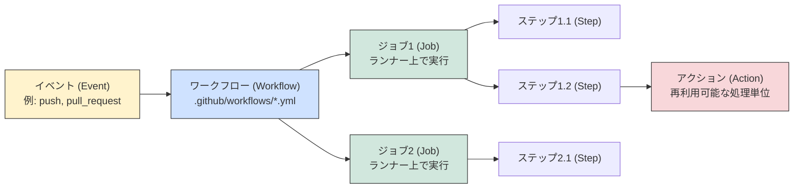
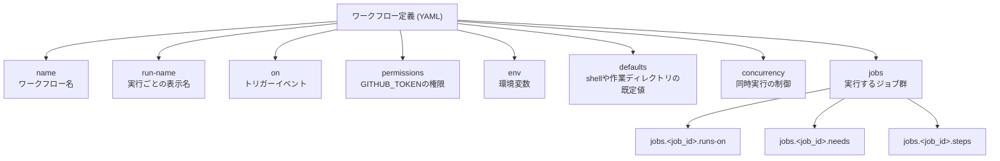
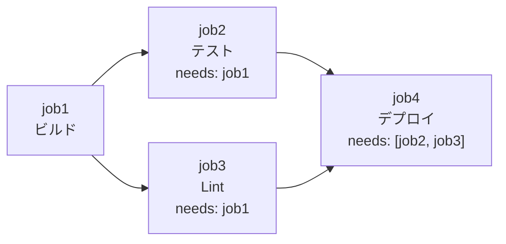
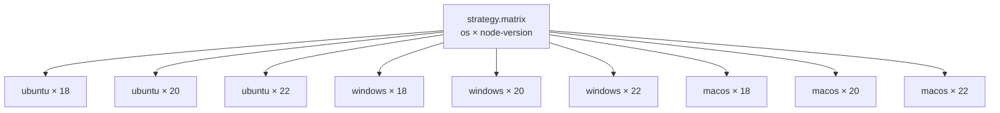
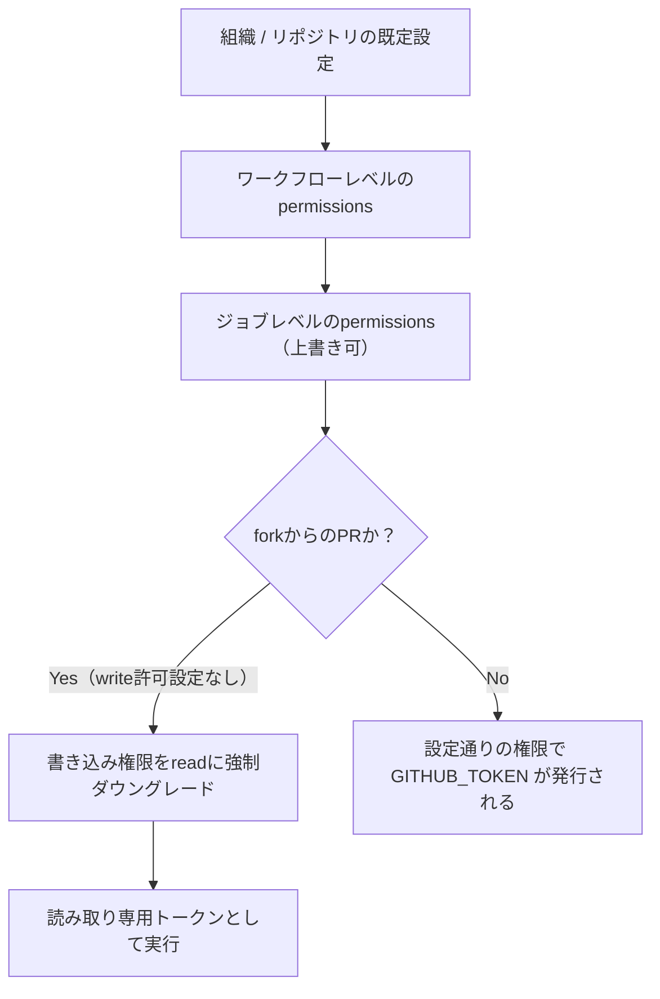
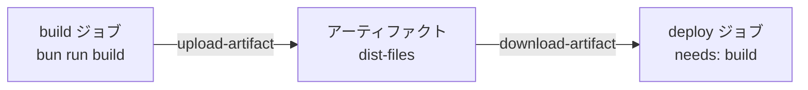
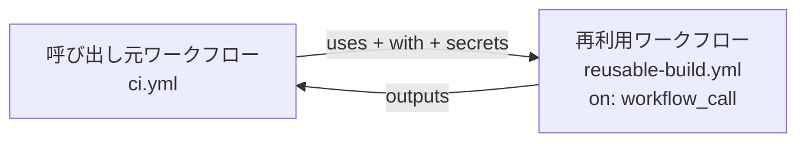
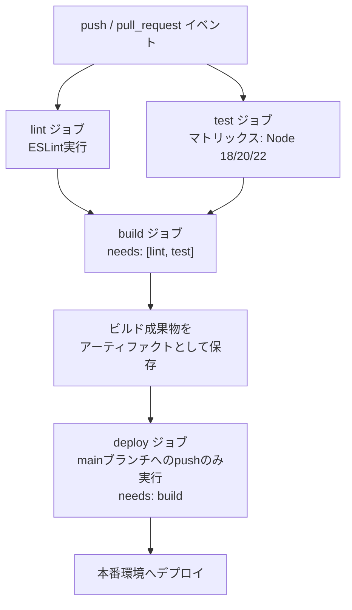

# GitHub Actions 完全ガイド 〜初学者向けステップバイステップ解説〜

> 本ガイドは [GitHub Actions公式ドキュメント](https://docs.github.com/en/actions) および GitHub 公式サイトの各種リファレンスページを一次情報源として、2026年7月時点の最新仕様に基づき作成しています。各セクションには参照元URLを明記していますので、より詳しく知りたい場合はリンク先を参照してください。

---

## 目次

1. [GitHub Actionsとは何か](#1-github-actionsとは何か)
2. [基本概念を理解する](#2-基本概念を理解する)
3. [クイックスタート：最初のワークフローを作る](#3-クイックスタート最初のワークフローを作る)
4. [ワークフローファイルの基本文法](#4-ワークフローファイルの基本文法)
5. [トリガーイベント（on）を使いこなす](#5-トリガーイベントonを使いこなす)
6. [ジョブとランナー（実行環境）](#6-ジョブとランナー実行環境)
7. [ジョブの依存関係と条件分岐](#7-ジョブの依存関係と条件分岐)
8. [マトリックス戦略で複数環境をテストする](#8-マトリックス戦略で複数環境をテストする)
9. [シークレットと変数の管理](#9-シークレットと変数の管理)
10. [GITHUB_TOKENと権限（permissions）](#10-github_tokenと権限permissions)
11. [依存関係のキャッシュで高速化する](#11-依存関係のキャッシュで高速化する)
12. [アーティファクト：成果物の保存と共有](#12-アーティファクト成果物の保存と共有)
13. [再利用可能なワークフロー（Reusable Workflows）](#13-再利用可能なワークフローreusable-workflows)
14. [実践編：Node.jsアプリのCI/CDパイプラインを作る](#14-実践編nodejsアプリのcicdパイプラインを作る)
15. [セキュリティのベストプラクティス](#15-セキュリティのベストプラクティス)
16. [トラブルシューティング](#16-トラブルシューティング)
17. [まとめと次のステップ](#17-まとめと次のステップ)
18. [参考文献・参照リンク一覧](#18-参考文献参照リンク一覧)

---

## 1. GitHub Actionsとは何か

**GitHub Actions**は、ソフトウェア開発のビルド・テスト・デプロイのパイプラインを自動化できる、GitHubに統合されたCI/CD（継続的インテグレーション／継続的デリバリー）プラットフォームです。リポジトリへのプルリクエストのたびにビルドとテストを実行したり、マージされたプルリクエストを自動的に本番環境へデプロイしたりするワークフローを作成できます。

GitHub Actionsは単なるDevOpsツールにとどまらず、リポジトリ内で発生する様々なイベント（Issueの作成、ラベル付けなど）に応じてワークフローを実行することも可能です。GitHubはLinux・Windows・macOSの仮想マシンを提供しており、これらを使ってワークフローを実行するほか、自社のデータセンターやクラウドインフラにセルフホストランナーを構築して実行することもできます。

参照: [Understanding GitHub Actions](https://docs.github.com/en/actions/get-started/understand-github-actions), [GitHub Actions 製品ページ（日本語）](https://github.com/features/actions?locale=ja)

### 1.1 GitHub Actionsでできること（代表例）

| ユースケース | 説明 |
|---|---|
| CI（継続的インテグレーション） | プッシュやプルリクエストのたびに自動でビルド・テストを実行 |
| CD（継続的デリバリー／デプロイ） | mainブランチへのマージ後、自動で本番・ステージング環境にデプロイ |
| Issue／PR管理の自動化 | ラベル付け、古いIssueのクローズ、コメント自動応答など |
| パッケージの公開 | npm・Docker・Mavenなどのパッケージを自動ビルド・公開 |
| スケジュール実行 | cronのようなスケジュールで定期的にジョブを実行 |
| セキュリティスキャン | コードスキャン、依存関係の脆弱性チェックなどを自動実行 |

参照: [Continuous integration](https://docs.github.com/en/actions/get-started/continuous-integration), [Continuous deployment](https://docs.github.com/en/actions/get-started/continuous-deployment)

---

## 2. 基本概念を理解する

GitHub Actionsを理解する上で欠かせない6つの用語があります。まずはこれらの関係性を図で把握しましょう。



### 2.1 各要素の説明

| 用語 | 説明 |
|---|---|
| **ワークフロー (Workflow)** | 1つ以上のジョブから構成される、設定可能な自動化プロセス。`.github/workflows`ディレクトリに配置するYAMLファイルで定義される |
| **イベント (Event)** | リポジトリ内で発生し、ワークフローの実行トリガーとなる特定のアクティビティ（例: pull requestの作成、issueのオープン、pushなど） |
| **ジョブ (Job)** | 同一のランナー上で実行される、一連のステップの集合。デフォルトでは各ジョブは並列に実行される |
| **ステップ (Step)** | ジョブ内で実行される個々の処理単位。シェルスクリプトの実行、またはアクションの実行のいずれか |
| **アクション (Action)** | 頻繁に繰り返されるタスクをまとめた再利用可能なコード単位（リポジトリのチェックアウト、ビルド環境のセットアップなど） |
| **ランナー (Runner)** | ワークフローがトリガーされたときにジョブを実行するサーバー。GitHubホスト型と、自身で用意するセルフホスト型がある |

参照: [Understanding GitHub Actions - The components of GitHub Actions](https://docs.github.com/en/actions/get-started/understand-github-actions#the-components-of-github-actions)

### 2.2 ワークフローの保存場所

ワークフローファイルは必ずリポジトリの `.github/workflows` ディレクトリに配置し、拡張子は `.yml` または `.yaml` である必要があります。1つのリポジトリに複数のワークフローを持たせることができ、それぞれ異なるタスク（PRのビルド・テスト、リリースごとのデプロイ、Issueへのラベル付けなど）を担当させられます。

参照: [Understand GitHub Actions - Workflows](https://docs.github.com/en/actions/get-started/understand-github-actions#workflows)

---

## 3. クイックスタート：最初のワークフローを作る

ここでは実際に手を動かして最初のワークフローを作成してみましょう。

### 3.1 手順

1. リポジトリ内に `.github/workflows/github-actions-demo.yml` というファイルを作成します。`.github/workflows` ディレクトリが存在しない場合は、ファイルを作成すると同時に自動的に生成されます。
2. 以下のYAMLを貼り付けます。
3. 「Commit changes」でコミットします（デフォルトブランチへの直接コミット、またはブランチを切ってPRを作成するかを選べます）。
4. コミットにより `push` イベントが発火し、ワークフローが自動的に実行されます。

```yaml
name: GitHub Actions Demo
run-name: ${{ github.actor }} is testing out GitHub Actions 🚀
on: [push]
jobs:
  Explore-GitHub-Actions:
    runs-on: ubuntu-latest
    steps:
      - run: echo "🎉 The job was automatically triggered by a ${{ github.event_name }} event."
      - run: echo "🐧 This job is now running on a ${{ runner.os }} server hosted by GitHub!"
      - run: echo "🔎 The name of your branch is ${{ github.ref }} and your repository is ${{ github.repository }}."
      - name: Check out repository code
        uses: actions/checkout@v7
      - run: echo "💡 The ${{ github.repository }} repository has been cloned to the runner."
      - run: echo "🖥️ The workflow is now ready to test your code on the runner."
      - name: List files in the repository
        run: |
          ls ${{ github.workspace }}
      - run: echo "🍏 This job's status is ${{ job.status }}."
```

### 3.2 実行結果を確認する

1. リポジトリの **Actions** タブを開く
2. サイドバーから該当のワークフロー名（例: "GitHub Actions Demo"）をクリック
3. 実行履歴の一覧から見たい実行（run）を選択
4. 左サイドバーの **Jobs** から `Explore-GitHub-Actions` ジョブをクリック
5. 各ステップのログを展開して詳細を確認できる

参照: [Quickstart for GitHub Actions](https://docs.github.com/en/actions/get-started/quickstart)

> 💡 **Tip**: GitHubには言語やフレームワークを解析して最適な**ワークフローテンプレート**を提案してくれる機能があります。テンプレート一覧は [actions/starter-workflows](https://github.com/actions/starter-workflows) リポジトリで確認できます。

---

## 4. ワークフローファイルの基本文法

ワークフローファイルはYAML形式で記述します。ここでは頻出するトップレベルキーを解説します。



### 4.1 name / run-name

```yaml
name: CI Pipeline
run-name: Deploy to ${{ inputs.deploy_target }} by @${{ github.actor }}
```

- `name`: Actionsタブに表示されるワークフロー名。省略時はファイルパスが表示される
- `run-name`: 個々の実行に付けられる名前。`github`コンテキストや`inputs`コンテキストを利用した式を含められる

参照: [Workflow syntax - name / run-name](https://docs.github.com/en/actions/reference/workflows-and-actions/workflow-syntax#name)

### 4.2 env（環境変数）

```yaml
env:
  SERVER: production
```

ワークフロー全体・ジョブ単位・ステップ単位のいずれでも`env`を設定でき、より具体的なスコープ（ステップ > ジョブ > ワークフロー）の値が優先されます。

### 4.3 defaults（既定値）

```yaml
defaults:
  run:
    shell: bash
    working-directory: ./scripts
```

すべての`run`ステップに適用されるデフォルトのシェルや作業ディレクトリを指定できます。

サポートされる`shell`の値は以下の通りです。

| プラットフォーム | shellの値 | 内部で実行されるコマンド |
|---|---|---|
| Linux/macOS | 未指定（既定） | `bash -e {0}` |
| 全OS | `bash` | `bash --noprofile --norc -eo pipefail {0}` |
| 全OS | `pwsh` | `pwsh -command ". '{0}'"` |
| 全OS | `python` | `python {0}` |
| Linux/macOS | `sh` | `sh -e {0}` |
| Windows | `cmd` | `%ComSpec% /D /E:ON /V:OFF /S /C "CALL "{0}""` |
| Windows | `powershell` | `powershell -command ". '{0}'"` |

参照: [Workflow syntax - defaults.run.shell](https://docs.github.com/en/actions/reference/workflows-and-actions/workflow-syntax#defaultsrunshell)

### 4.4 steps（ステップ）の主なキー

| キー | 説明 |
|---|---|
| `name` | ステップの表示名 |
| `uses` | 使用するアクション（例: `actions/checkout@v7`） |
| `run` | 実行するシェルコマンド |
| `with` | アクションに渡す入力パラメータ |
| `env` | ステップ単位の環境変数 |
| `if` | 条件付き実行 |
| `continue-on-error` | 失敗してもワークフローを継続するか |
| `timeout-minutes` | ステップのタイムアウト時間 |
| `working-directory` | 作業ディレクトリの指定 |

参照: [Workflow syntax - jobs.<job_id>.steps](https://docs.github.com/en/actions/reference/workflows-and-actions/workflow-syntax#jobsjob_idsteps)

---

## 5. トリガーイベント（on）を使いこなす

`on`キーでワークフローが実行される条件を定義します。イベントは非常に多くの種類がありますが、ここでは初学者が押さえておくべき主要なものを紹介します。

```mermaid
flowchart LR
    subgraph リポジトリ操作
    P[push]
    PR[pull_request]
    PRT[pull_request_target]
    REL[release]
    end
    subgraph 手動・外部
    WD[workflow_dispatch]
    RD[repository_dispatch]
    WC[workflow_call]
    end
    subgraph スケジュール
    SC[schedule<br/>cron]
    end
    P --> WF["ワークフロー実行"]
    PR --> WF
    PRT --> WF
    REL --> WF
    WD --> WF
    RD --> WF
    WC --> WF
    SC --> WF
```

### 5.1 主要なイベント一覧

| イベント | 発火タイミング | 主な用途 |
|---|---|---|
| `push` | ブランチまたはタグへのpush | CIビルド・テスト |
| `pull_request` | PRのopen/synchronize/reopenなど | PRごとのCI |
| `pull_request_target` | forkからのPRでも書き込み権限のトークンで実行 | forkからのPRにラベル付け等（注意が必要） |
| `schedule` | cron式で指定した時刻 | 定期実行バッチ、夜間ビルド |
| `workflow_dispatch` | UI/CLI/APIから手動実行 | 手動デプロイなど |
| `release` | リリースの作成・公開など | リリース時のパッケージ公開 |
| `workflow_call` | 他のワークフローから呼び出された時 | 再利用可能ワークフロー |
| `repository_dispatch` | 外部からのREST API呼び出し | GitHub外のイベント連携 |
| `issues` / `issue_comment` | Issueやコメントの作成・編集など | Issue自動管理 |
| `workflow_run` | 他のワークフローの完了時 | 権限を分離した後続処理 |

参照: [Events that trigger workflows](https://docs.github.com/en/actions/reference/workflows-and-actions/events-that-trigger-workflows)

### 5.2 単一イベント・複数イベントの指定

```yaml
# 単一イベント
on: push

# 複数イベント（いずれか1つが発生すれば実行される）
on: [push, fork]
```

### 5.3 ブランチ・タグ・パスによるフィルタリング

```yaml
on:
  push:
    branches:
      - main
      - 'releases/**'
    paths:
      - '**.js'
    tags:
      - 'v*.*.*'
```

- `branches` / `branches-ignore`: 対象・除外するブランチ名パターン
- `tags` / `tags-ignore`: 対象・除外するタグ名パターン
- `paths` / `paths-ignore`: 変更されたファイルパスによるフィルタ

`branches`と`paths`を同時に指定した場合は、**両方の条件を満たした場合のみ**ワークフローが実行される点に注意してください。

参照: [Workflow syntax - on.push.<branches|tags|...>](https://docs.github.com/en/actions/reference/workflows-and-actions/workflow-syntax#onpushbranchestagsbranches-ignoretags-ignore)

### 5.4 スケジュール実行（cron）

```yaml
on:
  schedule:
    - cron: '30 5 * * 1-5'
      timezone: "America/New_York"
```

cron構文は5つのフィールドから構成されます。

| フィールド | 意味 | 値の範囲 |
|---|---|---|
| 1番目 | 分 | 0-59 |
| 2番目 | 時 | 0-23 |
| 3番目 | 日 | 1-31 |
| 4番目 | 月 | 1-12 または JAN-DEC |
| 5番目 | 曜日 | 0-6 または SUN-SAT |

| 演算子 | 意味 | 例 |
|---|---|---|
| `*` | すべての値 | `15 * * * *`（毎時15分） |
| `,` | 値のリスト | `2,10 4,5 * * *`（4時・5時台の2分と10分） |
| `-` | 範囲 | `30 4-6 * * *`（4〜6時台の30分） |
| `/` | ステップ値 | `20/15 * * * *`（20分から59分まで15分おき） |

デフォルトのタイムゾーンはUTCで、実行間隔の最短は5分です。`@yearly`や`@daily`のような非標準構文はサポートされていません。

参照: [Workflow syntax - on.schedule](https://docs.github.com/en/actions/reference/workflows-and-actions/workflow-syntax#onschedule), [crontab guru](https://crontab.guru/)

### 5.5 手動実行（workflow_dispatch）と入力パラメータ

```yaml
on:
  workflow_dispatch:
    inputs:
      logLevel:
        description: 'Log level'
        required: true
        default: 'warning'
        type: choice
        options:
          - info
          - warning
          - debug
      print_tags:
        description: 'True to print to STDOUT'
        required: true
        type: boolean

jobs:
  print-tag:
    runs-on: ubuntu-latest
    if: ${{ inputs.print_tags }}
    steps:
      - run: echo "Log level is ${{ inputs.logLevel }}"
```

`workflow_dispatch`はデフォルトブランチ上にワークフローファイルが存在する場合のみUIに表示され、手動でトリガーできます。入力の型には `boolean` / `choice` / `number` / `environment` / `string` が指定できます。

参照: [Workflow syntax - on.workflow_dispatch.inputs](https://docs.github.com/en/actions/reference/workflows-and-actions/workflow-syntax#onworkflow_dispatchinputs)

---

## 6. ジョブとランナー（実行環境）

### 6.1 ジョブの基本

1回のワークフロー実行は1つ以上の**ジョブ**から構成され、デフォルトでは**並列**に実行されます。ジョブを順番に実行したい場合は`needs`キーで依存関係を明示します。

```yaml
jobs:
  my_first_job:
    name: My first job
    runs-on: ubuntu-latest
    steps:
      - run: echo "Hello"
  my_second_job:
    name: My second job
    needs: my_first_job
    runs-on: ubuntu-latest
    steps:
      - run: echo "World"
```

参照: [Workflow syntax - jobs](https://docs.github.com/en/actions/reference/workflows-and-actions/workflow-syntax#jobs)

### 6.2 GitHubホスト型ランナー

`runs-on`で指定するラベルにより、GitHubが提供する仮想マシン（またはセルフホストランナー）を選択します。パブリックリポジトリでは標準ランナーの利用は無料かつ無制限です。

| OS | CPU | メモリ | ストレージ | アーキテクチャ | ワークフローラベル |
|---|---|---|---|---|---|
| Linux | 1 | 5GB | 14GB | x64 | `ubuntu-slim` |
| Linux | 4 | 16GB | 14GB | x64 | `ubuntu-latest`, `ubuntu-24.04`, `ubuntu-22.04` |
| Linux | 4 | 16GB | 14GB | arm64 | `ubuntu-24.04-arm`, `ubuntu-22.04-arm` |
| Windows | 4 | 16GB | 14GB | x64 | `windows-latest`, `windows-2025`, `windows-2022` |
| Windows | 4 | 16GB | 14GB | arm64 | `windows-11-arm` |
| macOS | 3 (M1) | 7GB | 14GB | arm64 | `macos-latest`, `macos-14`, `macos-15` |
| macOS | 4 | 14GB | 14GB | Intel | `macos-15-intel` |

```yaml
jobs:
  build:
    runs-on: ubuntu-latest
    steps:
      - uses: actions/checkout@v7
```

参照: [Workflow syntax - Standard GitHub-hosted runners for public repositories](https://docs.github.com/en/actions/reference/workflows-and-actions/workflow-syntax#standard-github-hosted-runners-for-public-repositories), [GitHub-hosted runners](https://docs.github.com/en/actions/concepts/runners/github-hosted-runners)

### 6.3 セルフホストランナー

自前のマシンやクラウドインスタンスをランナーとして登録できます。特定のOSやハードウェア（GPUなど）が必要な場合、あるいはネットワークの制約でGitHub提供のランナーが使えない場合に有効です。

```yaml
jobs:
  build:
    runs-on: [self-hosted, linux, x64, gpu]
```

複数のラベルを配列で指定すると、**すべてのラベルに一致する**ランナーが選ばれます。

参照: [Self-hosted runners](https://docs.github.com/en/actions/concepts/runners/self-hosted-runners), [Add runners](https://docs.github.com/en/actions/how-tos/manage-runners/self-hosted-runners/add-runners)

### 6.4 コンテナ上でジョブを実行する

```yaml
jobs:
  build:
    runs-on: ubuntu-latest
    container:
      image: oven/bun:1
    steps:
      - uses: actions/checkout@v7
      - run: bun install --frozen-lockfile
```

参照: [Run jobs in a container](https://docs.github.com/en/actions/how-tos/write-workflows/choose-where-workflows-run/run-jobs-in-a-container)

---

## 7. ジョブの依存関係と条件分岐

### 7.1 needsによる順序制御



```yaml
jobs:
  job1:
    runs-on: ubuntu-latest
    steps: [ ]
  job2:
    needs: job1
    runs-on: ubuntu-latest
    steps: [ ]
  job3:
    needs: [job1, job2]
    runs-on: ubuntu-latest
    steps: [ ]
```

依存先のジョブが失敗またはスキップされると、それに依存するジョブも通常はスキップされます。依存先の成否に関わらず必ず実行したい場合は`if: ${{ always() }}`を使用します。

参照: [Workflow syntax - jobs.<job_id>.needs](https://docs.github.com/en/actions/reference/workflows-and-actions/workflow-syntax#jobsjob_idneeds)

### 7.2 if による条件付き実行

```yaml
jobs:
  production-deploy:
    if: github.repository == 'octo-org/octo-repo-prod'
    runs-on: ubuntu-latest
    steps:
      - uses: actions/checkout@v7
```

`if`式の先頭が`!`で始まる場合は、YAMLの予約文字と衝突するため`${{ }}`または引用符での囲みが必須です。

```yaml
if: ${{ !startsWith(github.ref, 'refs/tags/') }}
```

参照: [Workflow syntax - jobs.<job_id>.if](https://docs.github.com/en/actions/reference/workflows-and-actions/workflow-syntax#jobsjob_idif)

### 7.3 concurrency（同時実行の制御）

同じconcurrencyグループに属する実行は同時に1つしか走らせない、という制御ができます。CI/CDで「同じブランチへの連続pushの場合、古い実行はキャンセルして最新のものだけ実行する」といった用途で頻繁に使われます。

```yaml
concurrency:
  group: ${{ github.workflow }}-${{ github.ref }}
  cancel-in-progress: true
```

参照: [Workflow syntax - concurrency](https://docs.github.com/en/actions/reference/workflows-and-actions/workflow-syntax#concurrency)

---

## 8. マトリックス戦略で複数環境をテストする

マトリックス戦略を使うと、OSやランタイムバージョンなど変数の組み合わせごとに、同一ジョブを自動的に複数回実行できます。

```yaml
jobs:
  test:
    strategy:
      matrix:
        os: [ubuntu-latest, windows-latest, macos-latest]
        bun-version: [1.0, 1.1, 1.2]
    runs-on: ${{ matrix.os }}
    steps:
      - uses: actions/checkout@v7
      - uses: oven-sh/setup-bun@v2
        with:
          bun-version: ${{ matrix.bun-version }}
      - run: bun install --frozen-lockfile
      - run: bun test
```

上記の例では、3種類のOS × 3種類のNode.jsバージョン = **9通りの組み合わせ**でジョブが並列実行されます。



`fail-fast: false`を指定すると、いずれかの組み合わせが失敗しても他の組み合わせの実行を継続します。`max-parallel`で同時実行数の上限を制御できます。

```yaml
strategy:
  fail-fast: false
  max-parallel: 3
  matrix:
    node-version: [18, 20, 22]
```

参照: [Workflow syntax - jobs.<job_id>.strategy.matrix](https://docs.github.com/en/actions/reference/workflows-and-actions/workflow-syntax#jobsjob_idstrategymatrix)

---

## 9. シークレットと変数の管理

### 9.1 シークレットとは

シークレットは、組織・リポジトリ・環境単位で作成できる機密情報の保管先です。GitHub Actionsは、ワークフロー内で明示的に参照されたシークレットのみを読み取ることができます。

シークレットは[Libsodium sealed boxes](https://libsodium.gitbook.io/doc/public-key_cryptography/sealed_boxes)方式で暗号化されてGitHubに送信されるため、GitHubのインフラ内での偶発的なログ出力などによる漏えいリスクが低減されています。ログに出力されたシークレットの値は自動的にマスク（redact）されますが、この仕組みは完全ではないため、シークレットの値自体を意図的にログへ出力しないよう注意が必要です。

```yaml
steps:
  - name: Deploy
    env:
      API_KEY: ${{ secrets.API_KEY }}
    run: ./deploy.sh
```

参照: [Secrets](https://docs.github.com/en/actions/concepts/security/secrets), [Use secrets in GitHub Actions](https://docs.github.com/en/actions/how-tos/write-workflows/choose-what-workflows-do/use-secrets)

### 9.2 組織レベル・環境レベルのシークレット

- **組織レベル**: 複数リポジトリで共通のシークレットを共有し、更新の手間を削減
- **環境シークレット**: 環境ごと（例: staging/production）に異なる値を設定でき、必須レビュアーによる承認フローも設定可能

### 9.3 変数（Variables）

機密ではない設定値には`vars`コンテキストを使う変数機能が利用できます。

```yaml
steps:
  - run: echo "Deploying to ${{ vars.ENVIRONMENT_NAME }}"
```

参照: [Use variables in GitHub Actions](https://docs.github.com/en/actions/how-tos/write-workflows/choose-what-workflows-do/use-variables)

### 9.4 認証情報の権限を最小限にする

個人の認証情報を使う代わりに、デプロイキーやサービスアカウントの利用を推奨します。個人アクセストークンを発行する場合は、必要最小限のスコープのみを選択してください。ユーザーに紐付かず、細かい権限設定と短命なトークンを持つ**GitHub App**の利用も選択肢の一つです。

参照: [Secrets - Limiting credential permissions](https://docs.github.com/en/actions/concepts/security/secrets#limiting-credential-permissions)

---

## 10. GITHUB_TOKENと権限（permissions）

### 10.1 GITHUB_TOKENとは

各ワークフロージョブの開始時に、GitHubは一意の`GITHUB_TOKEN`シークレットを自動生成します。これはリポジトリにインストールされたGitHub Appのインストールアクセストークンであり、ワークフロー内の認証に利用できます。

- **GitHubホスト型ランナー**: 最大ジョブ実行時間は6時間で、トークンの有効期間もそれに準じる
- **セルフホストランナー**: 最大ジョブ実行時間は5日だが、トークンは最大24時間までしか延長できないため、24時間を超えるジョブでは個人アクセストークンなど別の認証方式が必要

`GITHUB_TOKEN`を使って行った操作（pushなど）は、原則として新たなワークフロー実行をトリガーしません（無限ループ防止のため）。ただし`workflow_dispatch`・`repository_dispatch`は例外で、常にワークフロー実行を作成します。

参照: [GITHUB_TOKEN](https://docs.github.com/en/actions/concepts/security/github_token)

### 10.2 permissionsで最小権限を設定する

`GITHUB_TOKEN`の既定権限は、最小権限の原則に従ってワークフロー単位・ジョブ単位で調整すべきです。

```yaml
permissions:
  contents: read
  pull-requests: write
```

主な権限スコープの一部を紹介します。

| 権限キー | 説明 |
|---|---|
| `contents` | リポジトリ内容の読み書き（コミット一覧の取得、リリース作成など） |
| `pull-requests` | プルリクエストの操作（ラベル追加など） |
| `issues` | Issueの操作（コメント追加など） |
| `id-token` | OpenID Connect (OIDC) トークンの取得（`write`が必要） |
| `packages` | GitHub Packagesへのアップロード・公開 |
| `checks` | チェックランの作成・更新 |
| `actions` | ワークフロー実行のキャンセルなど |

`permissions: read-all` / `permissions: write-all` ですべての権限を一括指定することも可能ですが、実運用では**必要な権限だけを個別指定**することが推奨されます。

```yaml
permissions: {}   # すべての権限を無効化（明示的にnoneにする）
```

参照: [Workflow syntax - permissions](https://docs.github.com/en/actions/reference/workflows-and-actions/workflow-syntax#permissions)

### 10.3 権限フロー図



参照: [How permissions are calculated for a workflow job](https://docs.github.com/en/actions/reference/workflows-and-actions/workflow-syntax#how-permissions-are-calculated-for-a-workflow-job)

---

## 11. 依存関係のキャッシュで高速化する

GitHubホスト型ランナーは毎回クリーンな仮想マシンから起動するため、依存パッケージ（Bun、Maven、Gradle、pipなど）を都度ダウンロードし直す必要があり、実行時間・ネットワーク利用量・コストが増加します。**依存関係キャッシュ**を使うことでこれを高速化できます。

```yaml
steps:
  - uses: actions/checkout@v7
  - uses: oven-sh/setup-bun@v2
    with:
      bun-version: latest
  - run: bun install --frozen-lockfile
```

`actions/setup-node`など多くの`setup-*`アクションには`cache`オプションが組み込まれており、簡単にキャッシュを有効化できます。より柔軟な制御が必要な場合は汎用の`actions/cache`アクションを使用します。

```yaml
steps:
  - uses: actions/cache@v4
    with:
      path: ~/.bun/install/cache
      key: ${{ runner.os }}-bun-${{ hashFiles('**/bun.lock') }}
      restore-keys: |
        ${{ runner.os }}-bun-
```

### 11.1 キャッシュとアーティファクトの違い

| 観点 | キャッシュ (Cache) | アーティファクト (Artifact) |
|---|---|---|
| 主な用途 | ジョブ／実行間で変化の少ないファイルの再利用（依存パッケージなど） | ワークフロー実行後に閲覧・ダウンロードしたい成果物（ビルド済みバイナリ、ログなど） |
| 典型例 | `node_modules`、Mavenの`.m2`キャッシュ | ビルド済みのバイナリファイル、テストレポート |

参照: [Dependency caching](https://docs.github.com/en/actions/concepts/workflows-and-actions/dependency-caching)

---

## 12. アーティファクト：成果物の保存と共有

ワークフロー実行が生成したファイル（ビルド成果物、ログ、レポートなど）を保存し、実行終了後にダウンロードしたり、同一ワークフロー内の別ジョブに引き継いだりできます。

```yaml
jobs:
  build:
    runs-on: ubuntu-latest
    steps:
      - uses: actions/checkout@v7
      - run: bun install --frozen-lockfile && bun run build
      - name: Upload build artifact
        uses: actions/upload-artifact@v4
        with:
          name: dist-files
          path: dist/

  deploy:
    needs: build
    runs-on: ubuntu-latest
    steps:
      - name: Download build artifact
        uses: actions/download-artifact@v4
        with:
          name: dist-files
          path: dist/
      - run: echo "デプロイ処理をここに記述"
```



参照: [Workflow artifacts](https://docs.github.com/en/actions/concepts/workflows-and-actions/workflow-artifacts), [Store and share data with workflow artifacts](https://docs.github.com/en/actions/tutorials/store-and-share-data)

---

## 13. 再利用可能なワークフロー（Reusable Workflows）

複数のリポジトリやワークフロー間で共通処理を使い回したい場合、**再利用可能なワークフロー (Reusable Workflow)** を作成できます。

### 13.1 呼び出される側（Called workflow）を作る

```yaml
# .github/workflows/reusable-build.yml
name: Reusable build workflow

on:
  workflow_call:
    inputs:
      config-path:
        required: true
        type: string
    secrets:
      token:
        required: true
    outputs:
      build-result:
        description: "ビルド結果"
        value: ${{ jobs.build.outputs.result }}

jobs:
  build:
    runs-on: ubuntu-latest
    outputs:
      result: ${{ steps.build-step.outputs.result }}
    steps:
      - uses: actions/checkout@v7
      - id: build-step
        run: |
          echo "result=success" >> "$GITHUB_OUTPUT"
```

### 13.2 呼び出す側（Caller workflow）を作る

```yaml
# .github/workflows/ci.yml
name: CI

on:
  push:
    branches: [main]

jobs:
  call-reusable:
    uses: ./.github/workflows/reusable-build.yml
    with:
      config-path: .github/config.yml
    secrets:
      token: ${{ secrets.GITHUB_TOKEN }}

  use-output:
    needs: call-reusable
    runs-on: ubuntu-latest
    steps:
      - run: echo "Build result was ${{ needs.call-reusable.outputs.build-result }}"
```

### 13.3 呼び出し関係の図



### 13.4 重要なポイント

- 呼び出す際は `{owner}/{repo}/.github/workflows/{filename}@{ref}` または同一リポジトリ内なら `./.github/workflows/{filename}` の形式で参照する
- `secrets: inherit` を使うと、呼び出し元のすべてのシークレットを暗黙的に引き継げる（同一Organization/Enterprise内に限る）
- ネスト（多重呼び出し）は最大10階層（呼び出し元 + 再利用ワークフロー9段階）まで
- 権限はチェーンをたどるごとに「維持または縮小」のみが可能で、昇格はできない

参照: [Reuse workflows](https://docs.github.com/en/actions/how-tos/reuse-automations/reuse-workflows)

---

## 14. 実践編：Node.jsアプリのCI/CDパイプラインを作る

ここまで学んだ要素を組み合わせて、実践的なCI/CDパイプラインを構築してみましょう。

### 14.1 パイプライン全体像



### 14.2 実装例

```yaml
name: Node.js CI/CD Pipeline

on:
  push:
    branches: [main]
  pull_request:
    branches: [main]

permissions:
  contents: read

concurrency:
  group: ${{ github.workflow }}-${{ github.ref }}
  cancel-in-progress: true

jobs:
  lint:
    runs-on: ubuntu-latest
    steps:
      - uses: actions/checkout@v7
      - uses: oven-sh/setup-bun@v2
        with:
          bun-version: latest
      - run: bun install --frozen-lockfile
      - run: bun run lint

  test:
    runs-on: ${{ matrix.os }}
    strategy:
      fail-fast: false
      matrix:
        os: [ubuntu-latest]
        bun-version: [1.0, 1.1, 1.2]
    steps:
      - uses: actions/checkout@v7
      - uses: oven-sh/setup-bun@v2
        with:
          bun-version: ${{ matrix.bun-version }}
      - run: bun install --frozen-lockfile
      - run: bun test

  build:
    needs: [lint, test]
    runs-on: ubuntu-latest
    steps:
      - uses: actions/checkout@v7
      - uses: oven-sh/setup-bun@v2
        with:
          bun-version: latest
      - run: bun install --frozen-lockfile
      - run: bun run build
      - uses: actions/upload-artifact@v4
        with:
          name: production-build
          path: dist/

  deploy:
    if: github.ref == 'refs/heads/main' && github.event_name == 'push'
    needs: build
    runs-on: ubuntu-latest
    environment: production
    permissions:
      contents: read
      id-token: write   # OIDCでクラウド認証する場合に必要
    steps:
      - uses: actions/download-artifact@v4
        with:
          name: production-build
          path: dist/
      - name: Deploy
        run: echo "ここで実際のデプロイコマンドを実行します"
```

### 14.3 このパイプラインのポイント解説

| 設定 | 目的 |
|---|---|
| `concurrency` + `cancel-in-progress: true` | 同一ブランチへの連続pushで古い実行を自動キャンセルし、リソースを節約 |
| `test`ジョブの`strategy.matrix` | 複数のNode.jsバージョンで並列にテストし、互換性を担保 |
| `build`の`needs: [lint, test]` | LintとTestの両方が成功した場合のみビルドを実行 |
| `deploy`の`if`条件 | mainブランチへの直接pushイベントの場合のみ実行し、PRでは実行しない |
| `environment: production` | GitHub上の環境保護ルール（必須レビュアーなど）を適用可能に |
| `permissions`の最小化 | ジョブごとに必要最小限の権限のみ付与 |

参照: [Continuous integration](https://docs.github.com/en/actions/get-started/continuous-integration), [Node.js building and testing tutorial](https://docs.github.com/en/actions/tutorials/build-and-test-code/nodejs), [Deployment environments](https://docs.github.com/en/actions/concepts/workflows-and-actions/deployment-environments)

---

## 15. セキュリティのベストプラクティス

### 15.1 サードパーティアクションのバージョン固定

アクションをタグ（`@v4`など）ではなく**コミットSHA**で固定することで、アクション提供元が悪意あるコードに差し替えるリスクを軽減できます。

```yaml
# より安全（コミットSHA固定）
- uses: actions/checkout@8e8a3f4f6c8b3e1e9b1e...

# 一般的だが、タグの再割り当てリスクがある
- uses: actions/checkout@v7
```

### 15.2 pull_request_targetおよびworkflow_runの取り扱い注意

`pull_request_target`イベントはデフォルトブランチのコンテキストで実行され、フォークからのPRであっても書き込み権限のある`GITHUB_TOKEN`が発行されます。この特性を悪用され、フォークのPRに含まれる未信頼コードを実行してしまうと、シークレットの窃取やキャッシュポイズニングにつながる恐れがあります。フォークのPRコードをチェックアウトして実行する必要がある場合は、このイベントの使用を避けるか、[Securely using pull_request_target](https://docs.github.com/en/actions/reference/security/securely-using-pull_request_target)のガイドラインに従ってください。

**actions/checkout v7 の注意点：**

`actions/checkout@v7`では、`pull_request_target`および`workflow_run`トリガーのワークフロー内でフォークからのPRコードをデフォルトでチェックアウトする動作が**既定で拒否**されます。これはサプライチェーン攻撃のリスクを軽減するためのセキュリティ強化です。

- `pull_request_target`でフォークのHEADをチェックアウトするには、明示的に`ref: ${{ github.event.pull_request.head.sha }}`を指定し、かつ信頼されたコードのみを実行するよう設計する必要があります。
- `workflow_run`トリガーでも同様に、トリガー元のワークフローのSHAを明示的に指定しない場合、フォーク由来のコードはチェックアウトされません。
- v6以前の挙動に依存したワークフローはv7移行時に動作が変わる可能性があるため、必ず検証してください。

### 15.3 最小権限のpermissions設定

前述の通り、ワークフロー・ジョブ単位で`permissions`を明示的に絞り込み、不要な`write`権限を持たせないようにします。

### 15.4 OpenID Connect (OIDC) の活用

クラウドプロバイダー（AWS、Azure、GCPなど）への認証情報として長期間有効なシークレットを保存する代わりに、OIDCを使って短命なトークンを都度発行させる方式が推奨されています。

```yaml
permissions:
  id-token: write
  contents: read

steps:
  - name: Configure AWS credentials
    uses: aws-actions/configure-aws-credentials@v4
    with:
      role-to-assume: arn:aws:iam::123456789012:role/my-github-actions-role
      aws-region: ap-northeast-1
```

参照: [OpenID Connect](https://docs.github.com/en/actions/concepts/security/openid-connect), [Secure use reference](https://docs.github.com/en/actions/reference/security/secure-use)

### 15.5 シークレットのログ出力に注意

シークレットは自動的にマスクされますが、Base64エンコードなど変換した値やマルチライン文字列などは完全にはredactされない場合があります。デバッグ目的でも`echo`等でシークレットの値を出力しないようにしましょう。

参照: [Secrets - Automatically redacted secrets](https://docs.github.com/en/actions/concepts/security/secrets#automatically-redacted-secrets)

---

## 16. トラブルシューティング

| 症状 | 主な原因 | 対処法 |
|---|---|---|
| ワークフローが全く実行されない | ファイルが`.github/workflows`にない／YAML構文エラー／Actionsが無効化されている | ファイルパスとYAMLの構文を確認、リポジトリ設定でActionsが有効か確認 |
| `pull_request`ワークフローが実行されない | PRにマージコンフリクトがある | コンフリクトを解消する（`pull_request_target`は解消不要だがセキュリティリスクに注意） |
| forkからのPRでチェックが「保留」のまま | 初回コントリビューターの承認待ち | Write権限を持つメンバーが「Approve workflows to run」を実施 |
| シークレットが空になる | forkからのPRで`GITHUB_TOKEN`以外のシークレットが渡されない仕様 | forkからのPRではシークレットに依存する処理を避けるか、`pull_request_target`を慎重に検討 |
| `permissions`関連で403エラー | 必要な権限が`GITHUB_TOKEN`に付与されていない | `permissions`キーで該当スコープに`write`を明示的に付与 |
| キャッシュがヒットしない | `key`に使用したファイルのハッシュが変化した／OSやパスが異なる | `restore-keys`でフォールバックキーを設定、キー設計を見直す |
| スケジュール実行が動かない | パブリックリポジトリで60日間アクティビティがなく自動的に無効化された | ワークフローを手動で再度有効化する |
| ログに詳細情報が出ない | デバッグログが無効 | `ACTIONS_STEP_DEBUG`シークレットを`true`に設定してデバッグログを有効化 |

参照: [Troubleshoot workflows](https://docs.github.com/en/actions/how-tos/troubleshoot-workflows), [Enable debug logging](https://docs.github.com/en/actions/how-tos/monitor-workflows/enable-debug-logging), [Approve runs from forks](https://docs.github.com/en/actions/how-tos/manage-workflow-runs/approve-runs-from-forks)

---

## 17. まとめと次のステップ

本ガイドでは、GitHub Actionsの基本概念（ワークフロー・イベント・ジョブ・ステップ・アクション・ランナー）から始まり、YAML構文、トリガーイベント、ランナーの種類、依存関係と条件分岐、マトリックス戦略、シークレット管理、`GITHUB_TOKEN`と権限設計、キャッシュとアーティファクト、再利用可能なワークフロー、そして実践的なCI/CDパイプラインの構築とセキュリティのベストプラクティスまでを解説しました。

### 次のステップとしておすすめの学習内容

- 使用している言語・フレームワークに応じた[Building and testing tutorials](https://docs.github.com/en/actions/tutorials/create-an-example-workflow)（Go, Java, .NET, Python, Rubyなど）
- [Publishing packages](https://docs.github.com/en/actions/tutorials/publish-packages)（npm、Docker、Maven等のパッケージ公開）
- [Deploy to third-party platforms](https://docs.github.com/en/actions/how-tos/deploy/deploy-to-third-party-platforms)（Azure、AWS、GCPなどへのデプロイ）
- 独自のアクションを作る: [Create a JavaScript action](https://docs.github.com/en/actions/tutorials/create-actions/create-a-javascript-action) / [Create a composite action](https://docs.github.com/en/actions/tutorials/create-actions/create-a-composite-action)
- [GitHub Actions Importer](https://docs.github.com/en/actions/reference/github-actions-importer/supplemental-arguments-and-settings)によるJenkins・CircleCI・GitLab CI/CD等からの移行

GitHub Actionsの習熟度を証明したい場合は、GitHub Certificationsの認定資格取得も検討してみてください。

参照: [Understanding GitHub Actions - Next steps](https://docs.github.com/en/actions/get-started/understand-github-actions#next-steps)

---

## 18. 参考文献・参照リンク一覧

本ガイドの作成にあたって参照した公式ドキュメントのURL一覧です（2026年7月時点の内容）。

### GitHub Actions 公式ドキュメント（英語, docs.github.com）

- GitHub Actions ドキュメントトップ: https://docs.github.com/en/actions
- Quickstart for GitHub Actions: https://docs.github.com/en/actions/get-started/quickstart
- Understanding GitHub Actions: https://docs.github.com/en/actions/get-started/understand-github-actions
- Continuous integration: https://docs.github.com/en/actions/get-started/continuous-integration
- Continuous deployment: https://docs.github.com/en/actions/get-started/continuous-deployment
- Workflow syntax for GitHub Actions: https://docs.github.com/en/actions/reference/workflows-and-actions/workflow-syntax
- Events that trigger workflows: https://docs.github.com/en/actions/reference/workflows-and-actions/events-that-trigger-workflows
- Secrets（Concepts）: https://docs.github.com/en/actions/concepts/security/secrets
- Use secrets in GitHub Actions（How-to）: https://docs.github.com/en/actions/how-tos/write-workflows/choose-what-workflows-do/use-secrets
- Use variables in GitHub Actions: https://docs.github.com/en/actions/how-tos/write-workflows/choose-what-workflows-do/use-variables
- GITHUB_TOKEN（Concepts）: https://docs.github.com/en/actions/concepts/security/github_token
- OpenID Connect: https://docs.github.com/en/actions/concepts/security/openid-connect
- Secure use reference: https://docs.github.com/en/actions/reference/security/secure-use
- Securely using pull_request_target: https://docs.github.com/en/actions/reference/security/securely-using-pull_request_target
- Dependency caching（Concepts）: https://docs.github.com/en/actions/concepts/workflows-and-actions/dependency-caching
- Workflow artifacts（Concepts）: https://docs.github.com/en/actions/concepts/workflows-and-actions/workflow-artifacts
- Store and share data with workflow artifacts（Tutorial）: https://docs.github.com/en/actions/tutorials/store-and-share-data
- Reuse workflows（How-to）: https://docs.github.com/en/actions/how-tos/reuse-automations/reuse-workflows
- Deployment environments（Concepts）: https://docs.github.com/en/actions/concepts/workflows-and-actions/deployment-environments
- GitHub-hosted runners（Concepts）: https://docs.github.com/en/actions/concepts/runners/github-hosted-runners
- Self-hosted runners（Concepts）: https://docs.github.com/en/actions/concepts/runners/self-hosted-runners
- Run jobs in a container: https://docs.github.com/en/actions/how-tos/write-workflows/choose-where-workflows-run/run-jobs-in-a-container
- Troubleshoot workflows: https://docs.github.com/en/actions/how-tos/troubleshoot-workflows
- Enable debug logging: https://docs.github.com/en/actions/how-tos/monitor-workflows/enable-debug-logging
- Approve runs from forks: https://docs.github.com/en/actions/how-tos/manage-workflow-runs/approve-runs-from-forks
- Node.js building and testing tutorial: https://docs.github.com/en/actions/tutorials/build-and-test-code/nodejs
- actions/starter-workflows（GitHub リポジトリ）: https://github.com/actions/starter-workflows

### GitHub 製品ページ

- GitHub Actions 製品ページ（日本語）: https://github.com/features/actions?locale=ja

### 外部リファレンス

- crontab guru（cron式の確認ツール）: https://crontab.guru/
- POSIX cron構文仕様: https://pubs.opengroup.org/onlinepubs/9699919799/utilities/crontab.html#tag_20_25_07
- Libsodium sealed boxes（シークレット暗号化の仕組み）: https://libsodium.gitbook.io/doc/public-key_cryptography/sealed_boxes

---

*本ドキュメントは学習・社内共有目的で作成された非公式の解説資料です。最新の詳細情報は必ず上記の公式ドキュメントを直接ご確認ください。*
