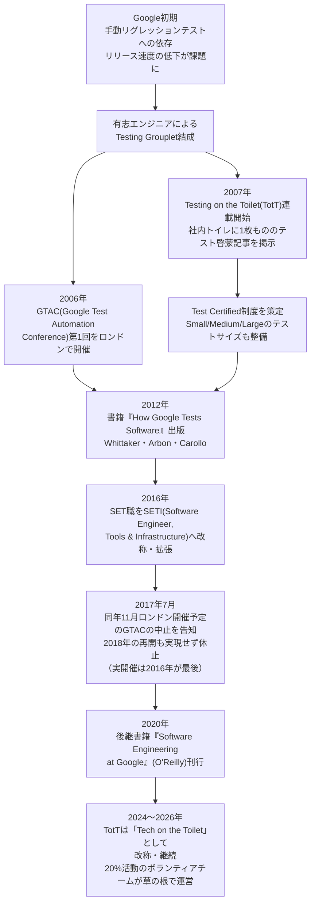
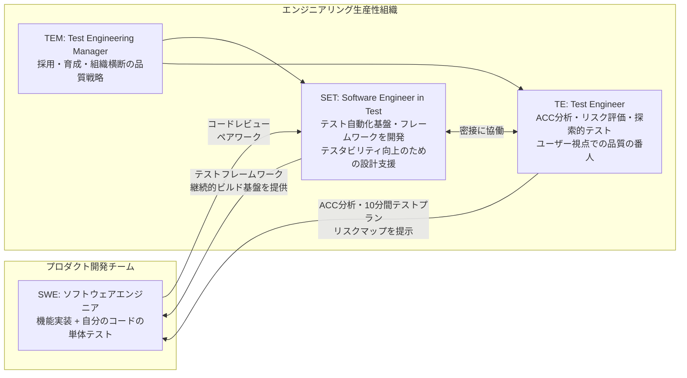
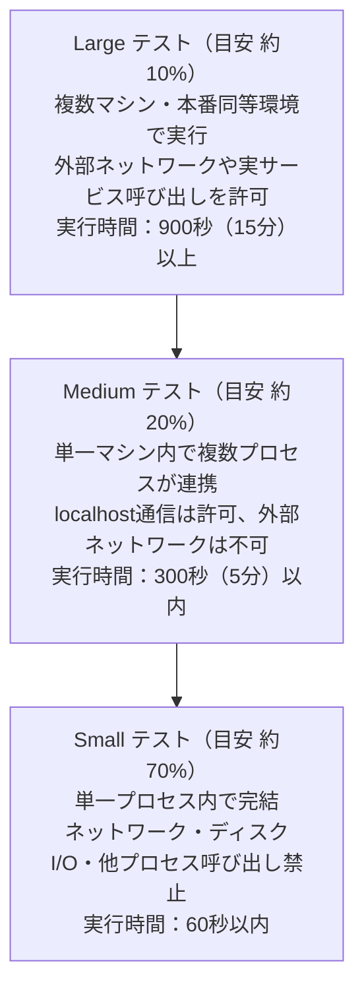
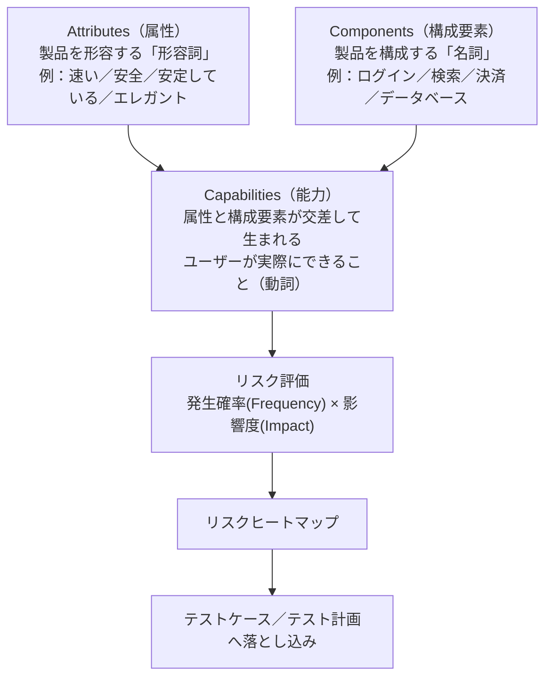
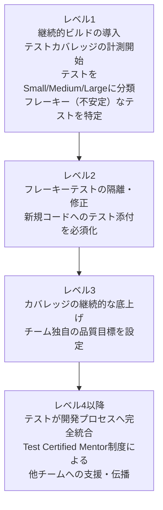
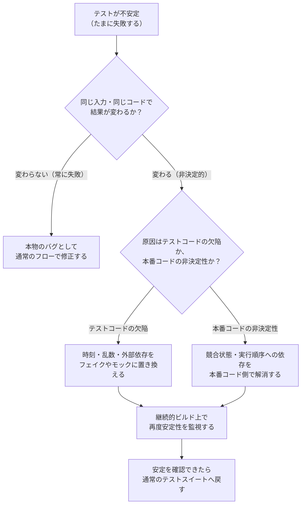
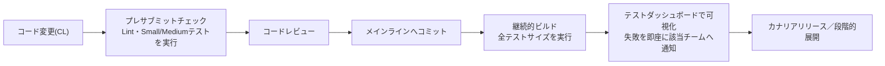

# 『How Google Tests Software』完全ガイド

## ― Googleのソフトウェアテスト文化を初学者向けにステップバイステップで解説 ―

> 原書: *How Google Tests Software*（James A. Whittaker, Jason Arbon, Jeff Carollo 著、Addison-Wesley Professional、2012年3月刊）
> 参考: <a href="https://books.google.co.jp/books/about/How_Google_Tests_Software.html?id=vHlTOVTKHeUC&redir_esc=y" target="_blank" rel="noopener noreferrer">Google Books 紹介ページ</a>

---

## この記事について

『How Google Tests Software』は、Googleでテスト部門を率いた James Whittaker（当時Googleのエンジニアリングディレクター。Chrome・Google Maps・Google+のテストを統括）と、同僚の Jason Arbon、Jeff Carollo が、Google社内のテスト組織・プロセス・文化を初めて外部に体系的に公開した書籍です。前書きは Alberto Savoia と Patrick Copeland（いずれもGoogleでテスト改革を主導した人物）が執筆しており、2012年のJolt Award最終候補にも選ばれました。

本ガイドは、この書籍で語られる考え方に加えて、2026年9月現在までのGoogle公式テストブログ（testing.googleblog.com）や、Testing Grouplet創設メンバーである Mike Bland 氏のブログ、InfoQ（Craig Smith氏によるレビュー・著者インタビュー）などの一次情報を調査し、**「2012年時点の考え方」と「2026年現在どう変化したか」の両方**を初学者にもわかるようにまとめたものです。ASCII図は使用せず、図解はすべてMermaidのフローチャート、一覧はMarkdown表で表現しています。

---

## 目次

1. [なぜGoogleは独自のテスト文化を築いたのか（歴史的背景）](#1-なぜgoogleは独自のテスト文化を築いたのか歴史的背景)
2. [Googleのテスト思想：「品質」と「テスト」は別物](#2-googleのテスト思想品質とテストは別物)
3. [3つのテストエンジニアリングの役割](#3-3つのテストエンジニアリングの役割)
4. [テストサイズという考え方：Small / Medium / Large](#4-テストサイズという考え方small--medium--large)
5. [リスクベースのテスト計画：ACC分析と10分間テストプラン](#5-リスクベースのテスト計画acc分析と10分間テストプラン)
6. [Test Certified：品質改善のはしご](#6-test-certified品質改善のはしご)
7. [フレーキーテスト（不安定なテスト）との戦い方](#7-フレーキーテスト不安定なテストとの戦い方)
8. [クラウドソーシングとドッグフーディング](#8-クラウドソーシングとドッグフーディング)
9. [継続的インテグレーションと「Testing on the Toilet」文化](#9-継続的インテグレーションとtesting-on-the-toilet文化)
10. [初学者のためのステップバイステップ導入ガイド](#10-初学者のためのステップバイステップ導入ガイド)
11. [2012年から2026年までの進化：何が変わり、何が変わらなかったか](#11-2012年から2026年までの進化何が変わり何が変わらなかったか)
12. [批判的視点・初学者が誤解しやすいポイント](#12-批判的視点初学者が誤解しやすいポイント)
13. [原著の章立て一覧](#13-原著の章立て一覧)
14. [まとめ：持ち帰るべき10のポイント](#14-まとめ持ち帰るべき10のポイント)
15. [参考文献・出典URL一覧](#15-参考文献出典url一覧)

---

## 1. なぜGoogleは独自のテスト文化を築いたのか（歴史的背景）

2000年代半ばのGoogleでは、検索・Gmail・Docsといった無料プロダクトを、既存の有料製品より高品質にする必要がありました。しかし当時は手動によるリグレッションテストへの依存が大きく、コードベースが巨大化するにつれてリリースサイクルが遅くなり、バグの発見が遅れるほど修正コストが跳ね上がるという典型的な問題に直面していました。

これに対して、有志のエンジニアたちが「Testing Grouplet」という非公式のボランティア活動を結成し、全社に自動テストの文化を広める活動を始めます。この活動から生まれたのが、後に書籍の土台となる仕組み――Testing on the Toilet（TotT）、Test Certified制度、そしてGTAC（Google Test Automation Conference）でした。

この流れの重要な点は、テスト改革が**トップダウンの命令ではなく、現場のボランティア活動から始まった**ということです。Testing Grouplet の中心人物の一人であった Mike Bland 氏は、当時Google Web Server（GWS）チームのリードだった Bharat Mediratta 氏とともに、「自動テストが付いていない変更は受け付けない」という厳格な方針を導入し、継続的ビルドとカバレッジ計測を定着させたことをブログで振り返っています。

---

## 2. Googleのテスト思想：「品質」と「テスト」は別物

本書で繰り返し強調される最も重要な考え方は、**「品質（Quality）」と「テスト（Test）」はイコールではない**というものです。テストは品質を確認する手段の一つに過ぎず、品質そのものは開発とテストを一体化させたプロセス全体から生まれる、という立場を取っています。

Patrick Copeland は前書きで、「テスターに開発者と同等のコーディングスキルを求め、テストという機能をプロダクトの一機能として扱う」という方針転換の難しさを語っています。エンジニアからは「テストなんてQAの仕事だ」という反発があり、テスター側からも「自分たちの役割が変わることへの抵抗」があったといいます。

またGoogle共同創業者 Larry Page の "Scarcity brings clarity"（乏しさは明確さをもたらす）という言葉が、書籍内で繰り返し引用されています。Googleはプロダクト規模に対してテスターの人数を意図的に絞り込むことで、「本当に必要な部分にだけ人手をかける」という優先順位付けの規律を生み出したとされています。

**初学者へのポイント：** テストを「専門のテスターだけの仕事」と捉えず、開発プロセス自体に組み込むという考え方が、Googleのテスト文化のすべての土台になっています。

---

## 3. 3つのテストエンジニアリングの役割

書籍の第2〜4章は、それぞれ異なる役割に割り当てられています。この3つの役割の関係を理解することが、本書を読み解く鍵になります。

| 役割 | 略称 | 主な仕事 | 求められるスキル |
|---|---|---|---|
| Software Engineer in Test | SET | テスト自動化基盤・実行環境の開発、既存コードのテスタビリティ改善、継続的ビルド／プレサブミット環境の整備 | ソフトウェアエンジニアと同等のコーディング力に加え、テスト設計・ツール開発の専門性 |
| Test Engineer | TE | リスク分析（ACC分析）、テスト計画立案、探索的テスト、クラウドソーシングの活用、バグレポートの精査 | 対象プロダクトのドメイン知識、コーディング力、ユーザー視点での品質へのこだわり |
| Test Engineering Manager | TEM | SET/TEチームの採用・育成、組織横断の品質戦略の立案、他部門（PM・UX・リリースエンジニアリング）との調整 | マネジメント経験に加えて技術的バックグラウンド |

書籍のTE章では、「テストを体系的に教える学校が少ないため、コーディング力と品質へのこだわりを兼ね備えたTEを採用するのは、どの会社にとっても難しい」という趣旨の指摘がなされています。つまりGoogle自身も、この3つの役割にふさわしい人材確保に苦労してきたことが率直に語られている点は、初学者にとって参考になるでしょう。

---

## 4. テストサイズという考え方：Small / Medium / Large

Googleのテスト文化を象徴する概念の一つが、**実行に必要なリソース（プロセス数・メモリ・実行時間・依存先）を基準にした「Small／Medium／Large」という3段階のテストサイズ**です。

ここで重要なのは、このテストサイズが「単体・結合・システム」という従来の分類を**置き換えるものではない**という点です。

- **テストサイズ（Small／Medium／Large）**: テストが消費してよい**リソース**を規定する軸。プロセス数・ネットワーク・ディスクI/O・実行時間の上限を決めます。
- **テストスコープ（Unit／Integration／System）**: テストが検証する**コードの範囲**を規定する軸。1つのクラスを見るのか、複数コンポーネントの連携を見るのか、システム全体を見るのかを表します。

この2つは**独立した軸**であり、組み合わせて使われます。単体テストは多くの場合Smallになりますが、**常にSmallとは限りません**（例えば重い初期化やタイムアウトを伴う単体テストがMediumに分類されることがあります）。逆に、Smallに分類される結合テストも存在し得ます。ビルドシステム上で強制できるのはリソース制約であるサイズ軸だけであるため、Googleは「サイズ」を機械的に管理し、「スコープ」は設計上の語彙として併用しています。

この仕組みは、Testing Grouplet の Mike Bland 氏らが中心となって整備したもので、`*_unittest` や `regression_test` といった旧来のビルドルールを廃止し、`size="..."` 属性を持つ新しい `*_test` ルールに統合する形でビルドシステムに組み込まれました。新人研修（Noogler向けの単体テスト講習）では、Smallを底辺、Largeを頂点とするピラミッド図としてこの比率が説明されていたといいます。

| サイズ | 実行範囲 | 許可される依存関係 | 実行時間の目安（Google公式） | Bazel の既定タイムアウト（`timeout` 未指定時） | 目安の構成比（70/20/10） |
|---|---|---|---|---|---|
| Small | 単一プロセス内 | 不可（ネットワーク・ディスクI/O・他プロセス禁止） | 60秒以内 | `short` = 60秒 | 約70% |
| Medium | 単一マシン内の複数プロセス | localhost通信のみ許可 | 300秒（5分）以内 | `moderate` = 300秒 | 約20% |
| Large | 複数マシン・本番同等環境 | 外部ネットワーク・実サービス呼び出し可 | 900秒（15分）以上 | `long` = 900秒 | 約10% |

Large の「900秒」は上限ではなく下限側の目安である点に注意が必要です。Google公式のテストサイズ定義において Large の実行時間は「900秒以上」と示されており、サイズ分類の判定基準になっているのは実行時間ではなくリソース制約（プロセス数・ネットワーク・ディスクI/Oの可否）です。一方で Bazel は `timeout` 属性が省略された場合にサイズから既定タイムアウトを導出し、`size = "large"` には `long`（900秒）を割り当てます。両者は別個の概念であり、900秒を超える Large テストは `timeout = "eternal"` などを明示して扱われます。

Mike Bland 氏自身がブログで振り返っているとおり、この「70/20/10」という比率は厳密な統計から導かれたものではなく、あくまで議論の出発点として「感覚的に決めた」数字だったといいます。それでも、この語彙（Small/Medium/Large）が定着したことで、社内での議論が「テストの呼び方」を巡る不毛な論争から「テストの目的」を巡る建設的な議論へとシフトした点が重要だとされています。

この分類は後に、**TAP（Test Automation Platform）**と呼ばれる社内基盤にも受け継がれ、「Smallを最優先、次にMedium、最後にLarge」という順序で実行し、分散実行環境と高速なフィードバックループを提供する仕組みへと発展しました。

---

## 5. リスクベースのテスト計画：ACC分析と10分間テストプラン

TE（Test Engineer）章の中核をなすのが、**ACC（Attribute・Component・Capability）分析**と呼ばれるリスクベースのテスト計画手法です。従来の分厚いテスト計画書を書く代わりに、対象システムを3つの要素に素早く分解し、リスクの高い部分から優先的にテストする考え方です。

例えば、モバイルウォレットアプリの「プロフィール」という構成要素（Component）と「設定変更可能」という属性（Attribute）を掛け合わせると、「ユーザーは銀行口座の連携設定を変更できる」「ユーザーは連携口座の有効・無効を切り替えられる」といった具体的な能力（Capability）が導き出されます。この能力ひとつひとつがテストケースの起点になります。

| ACCの要素 | 品詞のたとえ | ECサイトを例にした場合 |
|---|---|---|
| Attribute（属性） | 形容詞 | 「速い」「安全」「使いやすい」 |
| Component（構成要素） | 名詞 | 「カート」「検索」「決済」「レビュー」 |
| Capability（能力） | 動詞（属性×構成要素の交差点） | 「安全にカートへ商品を追加できる」「速く検索結果を絞り込める」 |

Google社内では、この分析結果を記録・可視化するために **Google Test Analytics（GTA）** という社内ツールが開発され、後にオープンソースとしても公開されました。リスクは「発生確率（Frequency of Failure）」と「影響度（Impact）」の2軸で評価され、最終的に優先度の高い領域を示す「リスクヒートマップ」が生成されます。

### 10分間テストプラン

著者の James Whittaker は、あるとき参加者に「10分間で製品のテスト計画を書いてもらう」という実験を行いました。時間制約があるため、参加者は長い文章ではなく、箇条書きや表形式で要点だけをまとめる傾向がありました。この実験から得られた結論は、**「テスト計画は完璧である必要はなく、まず"何をテストすべきか（＝Capability）"を素早く洗い出すことこそが本質だ」**というものです。ACC分析は、この10分間テストプランを体系化したものと位置づけられています。

---

## 6. Test Certified：品質改善のはしご

Test Certified（通称「TC」）は、チームが自動テストの成熟度を段階的に高めていくためのマイルストーン制度です。Mike Bland 氏は「厳密には12ステップではないが、12ステップ・プログラムのようなもの」と表現しています。

レベル1は「1日〜5日程度で達成できる」ように設計されており、まずは現状を可視化するための土台（継続的ビルド、カバレッジ計測、テストサイズの分類、フレーキーテストの洗い出し）を整えることに主眼が置かれています。

この制度の面白い副次効果として、書籍では「Test Certified Mentor に登録すると、テスト人材が慢性的に不足している社内で、通常なら得られないはずのテスト人材の支援を受けられた」という点が挙げられています。つまり、成熟度向上の取り組み自体が、希少なテストリソースを引き寄せる"ゲーミフィケーション"のような機能も果たしていたわけです。

---

## 7. フレーキーテスト（不安定なテスト）との戦い方

フレーキーテストとは、**コードを変更していないのに、実行するたびに成功したり失敗したりする**非決定的なテストのことです。Googleでは2008年の時点ですでにTotT（Testing on the Toilet）でこの問題を取り上げており、現在に至るまで継続的な関心事となっています。

原因は大きく2つに分類されます。

1. **テスト対象のコード自体に非決定的な欠陥がある**（競合状態など）
2. **テストコード自体に欠陥がある**（時刻・乱数・外部依存・共有リソースへの依存など）

Googleでは、フレーキーテストを放置すると「テストが失敗しても誰も気にしなくなる」という信頼崩壊が起きることを重視し、原因不明のまま無視するのではなく、原因を切り分けて修正するか、一時的に隔離するかを明確にルール化しています。この考え方は、後継書籍『Software Engineering at Google』（2020年）でも引き続き重要なテーマとして扱われています。

---

## 8. クラウドソーシングとドッグフーディング

書籍の著者インタビュー（InfoQ掲載）によると、Googleが外部から全面的に取り入れた数少ない「テスト手法」がクラウドソーシングだったといいます。ベータテスターや一般ユーザーからのフィードバックを活用し、社内リソースだけでは網羅しきれない多様な環境・利用シナリオでの検証を補完する狙いがあります。

また、Google社内では自社製品を社員自身が日常的に使う「ドッグフーディング」も広く実践されており、例えばChromeの品質改善では、社内向けの先行ビルドを配布して問題を早期に発見する取り組みが行われてきました。書籍のレビューによれば、Google社内で開発された**BITE（Browser Integrated Test Environment）**という、ブラウザに統合されたテスト支援ツールも紹介されています。

著者の一人は「オープンソースコミュニティ（特にSeleniumやWebDriver）に関わり続けることが、最新のテスト手法をキャッチアップする最良の方法だ」とも語っており、Googleが商用テストツールよりもオープンソースへの貢献を重視してきた姿勢がうかがえます。

---

## 9. 継続的インテグレーションと「Testing on the Toilet」文化

Googleでは、コードの変更（CL: Changelist）がメインラインに取り込まれるまでに、プレサブミットチェック・コードレビュー・継続的ビルドという複数の関門を通過します。

この文化を支えてきたもう一つの仕組みが、社内トイレの個室に1枚ものの記事を掲示する **Testing on the Toilet（TotT）** です。2007年1月に始まったこの取り組みは、コードレビューでの良い応答の仕方、テストダブル（フェイク／モック）の使い分け、変更検出だけのテスト（Change-Detector Tests）を避ける方法など、実践的なトピックを継続的に発信してきました。

2026年9月現在、Google公式テストブログ（testing.googleblog.com）は稼働を続けており、直近では2026年7月21日付で「Prefactoring（先行リファクタリング）」という記事が公開されています。興味深いことに、この連載は2024年12月ごろから**「Tech on the Toilet」**という名称に変わっており、テストに限らずコードレビューでの効果的な返信の仕方や、マップのルックアップ処理の最適化など、より広範なソフトウェアエンジニアリングの実践知を扱うようになっています。テスト専門の連載が、開発全体の品質文化を扱う連載へと役割を広げてきた様子がうかがえます。

---

## 10. 初学者のためのステップバイステップ導入ガイド

ここまでの内容を踏まえ、自分のチーム・プロジェクトにGoogle流の考え方を取り入れるための8つのステップを紹介します。書籍の著者インタビューでも「Googleがやってきたことをコピーして、自分たちのソフトウェアエンジニアリングDNAの一部にしてしまうのが良い」とアドバイスされています。

1. **開発とテストを分離しない文化をつくる**
   「テストは専任者の仕事」という前提を捨て、コードを書いたエンジニア自身がテストにも責任を持つ体制を目指します。

2. **既存のテストをSmall／Medium／Largeに分類し、可視化する**
   実行時間・依存関係を基準に分類するだけで、「なぜこのテストスイートは遅いのか」が可視化されます。

3. **継続的ビルドとプレサブミットチェックを導入する**
   「テストのないコード変更はマージしない」というルールを、ツールで強制できる形にします。

4. **ACC分析でリスクマップを作り、10分間テストプランから始める**
   完璧な計画書を目指さず、まず10分でCapability（できること）を洗い出すところから始めます。

5. **フレーキーテストをゼロトレランスで扱うルールを決める**
   「失敗しても気にしない」文化が定着する前に、原因切り分けと隔離のルールを明文化します。

6. **小さく始めて成熟度のはしごを登る**
   Test Certifiedのように、まず1〜5日で達成できる最初のマイルストーン（継続的ビルド・カバレッジ計測・テスト分類）から着手します。

7. **品質にまつわる知識を共有する仕組みを作る**
   TotTのように、短く・定期的に・実例ベースで知見を発信する仕組み（社内Wiki、Slackの定期投稿など）を用意します。

8. **自動化できる領域を継続的に広げ、テストコストをゼロに近づける**
   書籍の最終章が示唆するように、「自動化・クラウドソーシングでテストコストを下げ続ける」ことをゴールに、定期的に見直します。

---

## 11. 2012年から2026年までの進化：何が変わり、何が変わらなかったか

書籍出版から14年が経った2026年9月時点で、Googleのテスト組織・文化がどう変化したかを整理します。

| 2012年の書籍での呼称・概念 | 2026年現在の状況 |
|---|---|
| SET（Software Engineer in Test） | 2016年にSETI（Software Engineer, Tools & Infrastructure）へ改称。テスト自動化に留まらず、IDE拡張・リリース自動化・本番監視まで含む「Engineering Productivity」全体を担う役割へ拡大 |
| TE（Test Engineer） | 現在も採用が続く職種。製品品質の権威として、リリース候補の自動検証や、機能横断の品質戦略を担う |
| GTAC（外部カンファレンス） | 2006年から毎年開催されていたが、2016年開催を最後に実開催は途絶えた。2017年7月に同年11月のロンドン開催中止と2018年の再開予定が告知されたものの、その再開は実現していない。アーカイブ動画は現在も公開されている |
| Testing on the Toilet（TotT） | 2024年末ごろから「Tech on the Toilet」に改称され、テストに限らないエンジニアリング実践知を扱う連載として2026年現在も継続中 |
| Google Test Analytics（ACC用ツール） | オープンソース版としては公開されていたが、ACCという考え方自体は後継書籍やチームのプラクティスに引き継がれている |
| 書籍そのもの | 後継として『Software Engineering at Google』（2020年、O'Reilly、Titus Winters・Tom Manshreck・Hyrum Wright著）が、より成熟した時代のテスト文化（第12章「Unit Testing」でフレーキーテストやテストダブルを詳述）を無料公開している |
| GoogleTest（gtest、C++用ユニットテストライブラリ） | オープンソースとして開発が継続しており、Android・Chromium・LLVMなどで利用され続けている |

変わらなかった点としては、「開発とテストを一体化させる」という根本思想、テストをリソース消費量で分類する考え方（Small/Medium/Large）、そしてリスクベースでテスト対象を絞り込む発想（ACCの精神）が、形を変えながらも一貫して受け継がれていることが挙げられます。一方で、組織構造や役職名、外部発信の形（カンファレンスからブログ連載へ）は大きく変化しています。

---

## 12. 批判的視点・初学者が誤解しやすいポイント

本書を読む・参考にする際に注意すべき点もあります。

- **「Googleだからできた」問題**：著者自身がインタビューで先回りして反論していますが、「潤沢なリソースがあるからこそ実現できた」という批判は根強くあります。著者は「私たちは優れたテスターだったからGoogleになれたのであり、Googleだから優れたテスターになれたわけではない」と反論していますが、スタートアップや小規模チームがそのまま適用しようとすると、体制や採用基準の面でハードルが高い部分もあります。
- **章ごとの筆致の違い**：InfoQのレビュー（Craig Smith氏）では、3人の著者が分担して執筆したことで、章ごとに文体や構成の一貫性がやや欠ける点が指摘されています。
- **著者全員がその後Googleを退職している**：同レビューでは、執筆時点でGoogleに在籍していた3人の著者が、出版後に全員Googleを離れたという事実にも触れられています。書籍の内容がある種の「過渡期のスナップショット」であることを念頭に置くとよいでしょう。
- **Agile用語をあえて使わない**：著者インタビューでは「Googleはスクラムやスクラムマスターといった用語にはこだわらず、独自の高速な開発プロセスを築いてきた」と説明されています。アジャイル方法論の教科書的な実践とは異なる用語体系である点に注意が必要です。
- **「テスターを増やすな」という主張の文脈**：書籍では意図的にテスターの人数を絞る方針が語られますが、これは「開発者自身がテストに責任を持つ」文化とセットで初めて機能する主張であり、単に人員を削減するだけでは同じ効果は得られません。

---

## 13. 原著の章立て一覧

| 章 | タイトル（原題） | 主な内容 |
|---|---|---|
| 第1章 | Introduction to Google Software Testing | Googleのテスト思想の全体像、開発とテストの融合という基本方針 |
| 第2章 | The Software Engineer in Test | SETの役割、テストサイズの定義、Test Certified制度 |
| 第3章 | The Test Engineer | TEの役割、ACC分析、10分間テストプラン、クラウドソーシングとツール活用 |
| 第4章 | The Test Engineering Manager | TEM/SETチームの採用・育成、組織運営、複数名へのインタビュー集 |
| 第5章 | Improving How Google Tests Software | テストの将来像、ドッグフーディング／クラウドソーシングの拡大、"テストコストをゼロに近づける"という理想 |

---

## 14. まとめ：持ち帰るべき10のポイント

1. 「品質」は「テスト」とイコールではなく、開発プロセス全体で作り込むものである。
2. テストは専任の「テスター」だけの仕事ではなく、コードを書いた人自身の責任でもある。
3. テストは「単体／結合／システム」ではなく、実行に必要なリソース量（Small/Medium/Large）で分類すると議論が建設的になる。
4. リスクベースでテスト対象を絞り込むACC分析（Attribute・Component・Capability）は、完璧な計画書より素早い優先順位付けを重視する。
5. 「10分間テストプラン」のように、まず短時間で要点を洗い出すことがテスト計画の第一歩になる。
6. フレーキーテストは放置せず、原因（テスト側かコード側か）を切り分けて修正・隔離するルールを持つ。
7. 品質改善は一足飛びではなく、Test Certifiedのような段階的なマイルストーンで進める。
8. クラウドソーシングやドッグフーディングは、社内リソースだけでは網羅できない検証を補完する。
9. 継続的ビルド・プレサブミットチェック・コードレビューという複数の関門が、品質を支える仕組みの土台になる。
10. Googleの組織・役職名・発信手段は14年間で大きく変化しており、「今のGoogle」を知るには本書だけでなく後継の情報源（Google Testing Blog、『Software Engineering at Google』）も合わせて参照するとよい。

---

## 15. 参考文献・出典URL一覧

### 書籍・公式レビュー

| 出典 | URL |
|---|---|
| Google Books（原著紹介ページ／本記事の起点） | <a href="https://books.google.co.jp/books/about/How_Google_Tests_Software.html?id=vHlTOVTKHeUC&amp;redir_esc=y" target="_blank" rel="noopener noreferrer">https://books.google.co.jp/books/about/How_Google_Tests_Software.html?id=vHlTOVTKHeUC&redir_esc=y</a> |
| Amazon（書籍情報・著者略歴） | <a href="https://www.amazon.com/Google-Tests-Software-James-Whittaker/dp/0321803027" target="_blank" rel="noopener noreferrer">https://www.amazon.com/Google-Tests-Software-James-Whittaker/dp/0321803027</a> |
| O'Reilly（書籍情報・目次インデックス） | <a href="https://www.oreilly.com/library/view/how-google-tests/9780132851572/index.html" target="_blank" rel="noopener noreferrer">https://www.oreilly.com/library/view/how-google-tests/9780132851572/index.html</a> |
| InfoQ「Interview and Book Review: How Google Tests Software」（Craig Smith） | <a href="https://www.infoq.com/articles/how-google-tests-software/" target="_blank" rel="noopener noreferrer">https://www.infoq.com/articles/how-google-tests-software/</a> |
| InfoQ 提供のサンプル第3章PDF | <a href="https://res.infoq.com/articles/how-google-tests-software/en/resources/SampleChapter-Chapter3.pdf" target="_blank" rel="noopener noreferrer">https://res.infoq.com/articles/how-google-tests-software/en/resources/SampleChapter-Chapter3.pdf</a> |
| Software Testing Magazine によるレビュー | <a href="https://www.softwaretestingmagazine.com/knowledge/how-google-tests-software-by-james-whittaker/" target="_blank" rel="noopener noreferrer">https://www.softwaretestingmagazine.com/knowledge/how-google-tests-software-by-james-whittaker/</a> |

### Google公式テストブログ

| 出典 | URL |
|---|---|
| Google Testing Blog トップページ（2026年7月時点の最新記事を確認） | <a href="https://testing.googleblog.com/" target="_blank" rel="noopener noreferrer">https://testing.googleblog.com/</a> |
| 「Test Sizes」（Small/Medium/Largeの解説） | <a href="https://testing.googleblog.com/2010/12/test-sizes.html" target="_blank" rel="noopener noreferrer">https://testing.googleblog.com/2010/12/test-sizes.html</a> |
| 「What Test Engineers do at Google」 | <a href="https://testing.googleblog.com/2016/09/what-test-engineers-do-at-google.html" target="_blank" rel="noopener noreferrer">https://testing.googleblog.com/2016/09/what-test-engineers-do-at-google.html</a> |
| 「From QA to Engineering Productivity」（SET→SETIへの改称の経緯） | <a href="https://testing.googleblog.com/2016/03/from-qa-to-engineering-productivity.html" target="_blank" rel="noopener noreferrer">https://testing.googleblog.com/2016/03/from-qa-to-engineering-productivity.html</a> |
| 「Evolution of GTAC and Engineering Productivity」 | <a href="https://testing.googleblog.com/2017/07/evolution-of-gtac-and-engineering.html" target="_blank" rel="noopener noreferrer">https://testing.googleblog.com/2017/07/evolution-of-gtac-and-engineering.html</a> |
| 「TotT: Avoiding Flakey Tests」（2008年） | <a href="https://testing.googleblog.com/2008/04/tott-avoiding-flakey-tests.html" target="_blank" rel="noopener noreferrer">https://testing.googleblog.com/2008/04/tott-avoiding-flakey-tests.html</a> |
| Google Test Automation Conference（GTAC）公式概要 | <a href="https://developers.google.com/google-test-automation-conference" target="_blank" rel="noopener noreferrer">https://developers.google.com/google-test-automation-conference</a> |

### 著名な国際的エンジニア・専門メディアによる解説

| 出典 | URL |
|---|---|
| Mike Bland（元Testing Grouplet中心メンバー）「Small, Medium, Large」 | <a href="https://mike-bland.com/2011/11/01/small-medium-large.html" target="_blank" rel="noopener noreferrer">https://mike-bland.com/2011/11/01/small-medium-large.html</a> |
| Mike Bland「Test Certified」 | <a href="https://mike-bland.com/2011/10/18/test-certified.html" target="_blank" rel="noopener noreferrer">https://mike-bland.com/2011/10/18/test-certified.html</a> |
| Mike Bland「The Practice of Testing」 | <a href="https://mike-bland.com/2012/09/11/practice-of-testing.html" target="_blank" rel="noopener noreferrer">https://mike-bland.com/2012/09/11/practice-of-testing.html</a> |
| StickyMinds「Google's New Methodology for Risk-driven Testing」（ACC分析の解説） | <a href="https://www.stickyminds.com/presentation/googles-new-methodology-risk-driven-testing" target="_blank" rel="noopener noreferrer">https://www.stickyminds.com/presentation/googles-new-methodology-risk-driven-testing</a> |
| InformIT「Using Other Influences for Planning」（ACC手法の詳細解説） | <a href="https://www.informit.com/articles/article.aspx?p=2253544&amp;seqNum=3" target="_blank" rel="noopener noreferrer">https://www.informit.com/articles/article.aspx?p=2253544&seqNum=3</a> |
| Software Engineering at Google（無料公開・後継書籍、第12章 Unit Testing） | <a href="https://abseil.io/resources/swe-book/html/ch12.html" target="_blank" rel="noopener noreferrer">https://abseil.io/resources/swe-book/html/ch12.html</a> |
| Wikipedia「Flaky test」 | <a href="https://en.wikipedia.org/wiki/Flaky_test" target="_blank" rel="noopener noreferrer">https://en.wikipedia.org/wiki/Flaky_test</a> |

---

*本ガイドは2026年9月4日時点で確認できる公開情報をもとに作成しています。Googleの組織体制やツールの状況は今後も変化する可能性があるため、最新情報は上記のGoogle公式テストブログ等で随時ご確認ください。*
