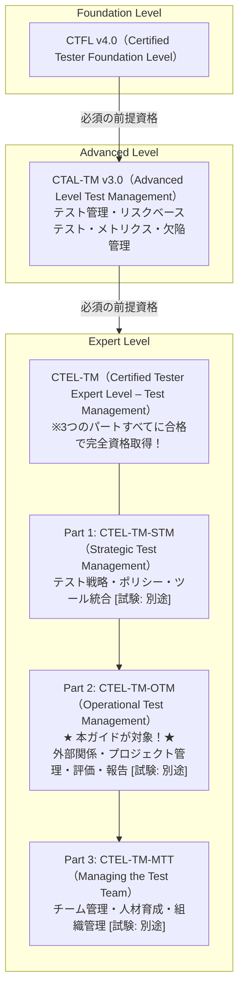
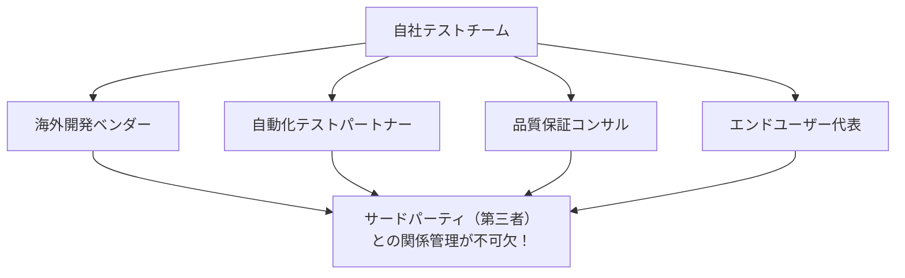
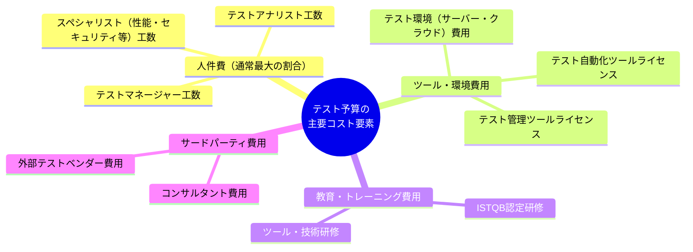
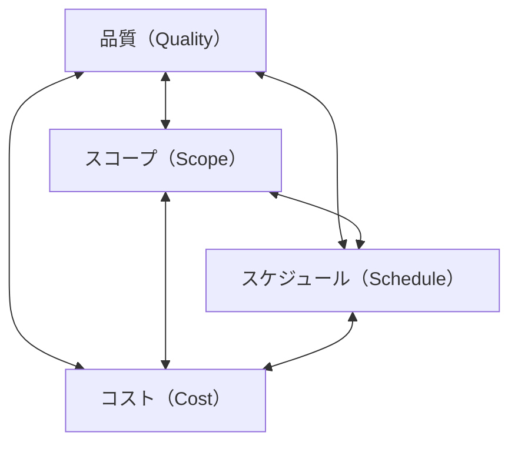

# 🏆 ISTQB® Certified Tester Expert Level – Test Management

## Operational Test Management（CTEL-TM-OTM）完全ガイド 2025

### 初学者から実践者まで｜ステップバイステップ図解解説

> **対応資格**: ISTQB® CTEL-TM-OTM（Expert Level Test Management – Part 2: Operational Test Management）  
> **資格の位置づけ**: CTEL-TM 3部構成のうちの **Part 2**  
> **有効期間**: 7年間  
> **前提資格**: CTFL（Foundation Level）+ CTAL-TM（Advanced Level Test Manager）+ 実務経験5年以上  
> **最終更新**: 2025年  
> 📌 **公式ページ**: https://istqb.org/certifications/certified-tester-expert-level-test-management-operational-test-management-ctel-tm-otm/

---

## 📚 目次

1. [CTEL-TM-OTM 概要と資格ロードマップ](#chapter-0)
2. [Chapter 1: 外部関係の管理（Managing External Relationships）](#chapter-1)
3. [Chapter 2: 組織横断的管理（Managing Across the Organization）](#chapter-2)
4. [Chapter 3: プロジェクト管理の基礎（Project Management Essentials）](#chapter-3)
5. [Chapter 4: テストプロジェクトの評価と報告（Test Project Evaluation and Reporting）](#chapter-4)
6. [Chapter 5: ドメインとプロジェクト要因のテスト考慮事項（Domain and Project Factors）](#chapter-5)
7. [Chapter 6: 有効性と効率性の評価（Evaluating Effectiveness and Efficiency）](#chapter-6)
8. [試験対策・サンプル問題](#exam-tips)
9. [参照URL一覧](#references)

---

<a id="chapter-0"></a>

## 🌟 Chapter 0: CTEL-TM-OTM 概要と資格ロードマップ

### 0.1 ISTQB® 資格体系における位置づけ



### 0.2 CTEL-TM-OTM とは何か？

CTEL-TM-OTM（Operational Test Management）は、テストマネージャーが**サードパーティ（第三者）との関係管理**（契約・コミュニケーション・統合・品質検証の側面を含む）を行うために必要なスキルを考慮したシラバスの一部です。他のマネージャーやチームとの関係を構築・維持する能力、プロジェクトリスク管理を含むプロジェクト管理スキル、効果的なレトロスペクティブ会議の組織化・進行も対象です。終了基準の評価によるテスト結果の報告と解釈、およびテストプロセス管理において重要な役割を担うメトリクスについても詳述されています。

### 0.3 試験概要

| 項目 | 内容 |
| --- | --- |
| **問題形式** | 多肢選択式（Multiple Choice） |
| **試験名** | Part 2 – Operational Test Management |
| **有効期間** | 7年間 |
| **前提条件** | CTFL（必須）＋ CTAL-TM（必須） |
| **実務経験** | テスト業務経験5年以上<br>専門分野（Expert Level）の経験2年以上 |
| **完全資格取得** | 3パート全て合格が必要 |
| **試験プロバイダー** | Brightest / iSQI / Pearson VUE |

### 0.4 OTM が対象とするシラバスの章構成と学習時間

```text
CTEL-TM 全体のシラバス（v1.0, 2011年）における OTM 対象領域：

Chapter 4: 外部関係の管理          ████████████    330分  (OTM★)
Chapter 5: 組織横断的管理          ████████████████████ 780分  (OTM★)
Chapter 6: プロジェクト管理の基礎  ████████████████ 615分  (OTM★)
Chapter 7: テストプロジェクト評価・報告 ████████████ 510分  (OTM★)
Chapter 8: ドメイン・プロジェクト要因  ████████    270分  (OTM★)
Chapter 9: 有効性・効率性の評価    ██████          195分  (OTM★)

※ Chapter 2（テスト戦略）はPart 1 (STM)が中心
※ Chapter 3（チーム管理）はPart 3 (MTT)が中心
```

### 0.5 ビジネスアウトカム（Expert Level Test Managerが実現すること）

Expert Level Test Manager として認定を受けると、以下が実現できます：

| # | ビジネスアウトカム |
|----|-----------------|
| 1 | 組織・プロジェクト・プログラム内のテスト管理をリードし、CEO/取締役会レベルのマネジメントコミットメントで重要な成功要因を特定・管理できる |
| 2 | 品質KPIに基づき、組織全体のコミットメントとコンプライアンスを実装したテスト管理戦略についてビジネス主導の意思決定を行える |
| 3 | テスト管理の現状を評価し、段階的な改善を提案し、それらが組織コンテキスト内でビジネス目標の達成にどう結びつくかを示せる |
| 4 | テスト管理と試験の改善のための戦略的ポリシーを設定し、組織内に実装できる |
| 5 | テスト管理と組織内の他の役割・管理領域との整合に関する特定の問題を分析し、実践的な解決策を提案できる |
| 6 | ビジネス目標を達成・超過するためのガバナンスダッシュボード付きマスターテスト計画を作成できる |
| 7 | 必要な役割・スキル・方法論（ツール）・組織構造を含むテスト管理（プロジェクト）組織の革新的な概念を開発できる |
| 8 | 品質KPIに基づく標準化された提供物を伴う組織（プロジェクト/プログラム）へのテスト管理実装のための標準プロセスを確立できる |
| 9 | テスト管理プロセスを改善し、変革の導入を管理するよう組織をリードできる |
| 10 | テストプロジェクト管理に関連する人的問題を理解し、効果的に管理し、必要な変更を実施できる |

---

<a id="chapter-1"></a>

## 🤝 Chapter 1: 外部関係の管理（Managing External Relationships）

> シラバス Chapter 4 | OTM Part 2 の核心テーマ | 330分

### なぜ外部関係管理が重要か？



### 1.1 外部関係の種類（Types of External Relationships）

```text
サードパーティとの関係パターン（5種類）：

パターン1: ターンキー方式
  → サードパーティが完成品を納品（開発+テスト済み）
  → 内部チームの役割：受入テスト・システム統合テスト

パターン2: 開発外注・テスト内製
  → サードパーティが開発、テストは受注側が担当
  → 内部チームの役割：統合テスト～システムテスト全般

パターン3: 部分コード外注
  → サードパーティが一部のコードを開発・内部コードに統合
  → 内部チームの役割：統合テスト・システムテスト

パターン4: テスト全面外注
  → 内部開発・テストはサードパーティが全て担当
  → 内部チームの役割：テスト管理・品質監視・受入テスト

パターン5: テスト責任共有
  → 内部テストチームとサードパーティが役割分担
  → 最も複雑な管理が必要
```

**学習目標（LO 4.2.1 K3）**: 契約書から、テスト責任に関するサードパーティ関係を定義できる

### 1.2 契約上の問題（Contractual Issues）

テストマネージャーは、法務部門が契約管理を行う場合でも、テストプロジェクトに影響する契約上の問題を把握し、テストサービスの専門家として技術的・方法論的インプットを提供しなければなりません。

| 項目 | 詳細 |
| --- | --- |
| **ターンアラウンド<br>タイム** | 欠陥修正のターンアラウンド時間<br>（重大度・優先度スキームに関連する場合あり）<br>質問・情報要求へのターンアラウンド時間<br>サポートスタッフの利用可能性と連絡方法 |
| **成果物<br>(Deliverables)** | ドキュメント（ユーザーガイド・ヘルプファイル）<br>ビルドスケジュール<br>既知の欠陥に関する情報<br>リリースノート（テスト未対応エリアの通知含む）<br>テストデータ（機密情報を除去したもの） |
| **品質レベル<br>(Quality)** | コードレビューの期待値<br>ユニットテストのカバレッジ（コードカバレッジ）<br>統合テスト・システムテスト結果<br>静的解析テスト<br>許容される残余欠陥数（重大度・優先度別） |

**学習目標（LO 4.3.1 K4）**: 外部ベンダーとの特定プロジェクトに対して、適切なSLAを定義できる

#### SLA 設計の実践例

```python
# SLA 評価フレームワーク（概念コード）

class SLAFramework:
    """サードパーティ契約のSLA評価・管理クラス"""
    
    def __init__(self, vendor_name: str, project_name: str):
        self.vendor = vendor_name
        self.project = project_name
    
    def define_defect_sla(self) -> dict:
        """欠陥解決のSLAを定義する"""
        return {
            "Critical（致命的）": {
                "response_time": "4時間以内",
                "resolution_time": "24時間以内",
                "escalation": "即時エスカレーション"
            },
            "High（高）": {
                "response_time": "8時間以内",
                "resolution_time": "72時間以内",
                "escalation": "24時間後にエスカレーション"
            },
            "Medium（中）": {
                "response_time": "24時間以内",
                "resolution_time": "1週間以内",
                "escalation": "5営業日後"
            },
            "Low（低）": {
                "response_time": "5営業日以内",
                "resolution_time": "次のリリースまで",
                "escalation": "月次レビューで確認"
            }
        }
    
    def define_quality_gates(self) -> dict:
        """品質ゲートの入出基準を定義する"""
        return {
            "ユニットテスト完了基準": {
                "コードカバレッジ": "≥ 85%",
                "欠陥数（Critical）": "0件",
                "欠陥数（High）": "0件"
            },
            "統合テスト入口基準": {
                "静的解析": "エラー0件",
                "コードレビュー": "完了証明書",
                "ユニットテスト": "合格証明書"
            },
            "システムテスト入口基準": {
                "ブロッキング欠陥": "0件",
                "既知欠陥のドキュメント": "全件記録済み"
            }
        }
```

### 1.3 コミュニケーション戦略（Communication Strategies）

| 要素 | 考慮すべき要因 |
| --- | --- |
| **量（Amount）** | プロジェクトの複雑さ・重要度 |
| **詳細度（Detail）** | 技術的複雑さ・サードパーティのスキルレベル |
| **頻度（Frequency）** | プロジェクトの緊急度・リスクレベル |
| **スタイル（Style）** | 文化的違い・組織文化 |
| **形式（Format）** | ドキュメント要件・規制要件 |
| **公式度（Formality）** | 法的・契約的要件 |

**オフショア開発の例（コミュニケーション計画）:**

```yaml
# オフショア開発チームとのコミュニケーション計画例

コミュニケーション計画:
  週次:
    - 種類: 詳細ステータスレポート
    - 担当: オフショアテストリード → テストマネージャー
    - 内容: テスト進捗・欠陥状況・ブロッカー
  
  日次:
    - 種類: 欠陥レポート
    - 担当: オフショアチーム → 内部チーム
    - 内容: 新規欠陥・更新欠陥のサマリー
  
  週2回:
    - 種類: テレビ会議
    - 担当: 両チームのリード
    - 内容: 課題解決・方向性の確認
  
  言語規定:
    - 書面コミュニケーション: 英語（共通言語）
    - 欠陥管理ツール: Jira（共通アクセス）
    - テスト管理ツール: TestRail（共通アクセス）
  
  ミーティングスケジュール:
    - 全タイムゾーン対応（真夜中の会議を避ける）
    - 祝日・休暇スケジュールの事前共有
    - アジャイルの場合: デイリースタンドアップを適用
```

**学習目標（LO 4.4.1 K2）**: 特定のサードパーティ契約に対して潜在的なコミュニケーション戦略を議論できる

### 1.4 外部ソースからの統合（Integrating from External Sources）

テストマネージャーは、サードパーティが提供するものの受け入れにあたって、内部テストチームの関与レベルを定義しなければなりません。

| 納品物のタイプ | テストチームの対応 |
| --- | --- |
| **① ターンキー<br>（開発+テスト済み）** | ・コードカバレッジメトリクスを確認<br>・受入テストのみ実施<br>・SIT（システム統合テスト）の計画 |
| **② 部分テスト済み<br>（ユニットテスト済み）** | ・コードカバレッジメトリクスをレビュー<br>・完全な統合テスト・システムテストを実施<br>・受入テストも実施 |
| **③ テスト未実施<br>（開発のみ）** | ・ユニットテストなしと仮定して統合テストから開始<br>・品質コストのメトリクスを追跡<br>・ユニットテストバイパスのコストを記録 |
| **④ テスト全面委託<br>（テストを外注）** | ・テスト戦略の定義・合意<br>・テストアプローチ・ドキュメント・ツールの規定<br>・テスト進捗の密接な管理・コミュニケーション計画 |

**学習目標（LO 4.5.1 K4）**: 特定のプロジェクトシナリオを分析し、サードパーティを採用した製品に対する内部テストチームの適切なテストレベルを決定できる

### 1.5 テスト戦略のマージ（Merging Test Strategies）

複数の組織・チームがテストに関与する場合、最も困難な管理課題の一つが「テスト戦略のマージ」です。

```text
テスト戦略マージ時の考慮事項（試験頻出！）：

  1. 欠陥管理ツールの統合
     → 異なる欠陥追跡ツールの統合・データ移行

  2. テスト管理ツールの統合
     → 異なるテスト管理ツールの統合

  3. 自動化戦略・ツールの統一
     → フレームワーク・ツール・標準の合意

  4. テストレベルと責任範囲の定義
     → 誰がどのテストレベルを担当するか明確化

  5. 共通のテスト・品質目標の設定
     → KPIと合格基準の共通化

  6. 各チームのテストアプローチの理解
     → 方法論・技法・プロセスの相互理解

  7. 受入・完了基準の定義
     → エントリクライテリア・エグジットクライテリアの合意

  8. 共通用語集の作成
     → 技術用語・テスト用語の共通定義

  9. 共通メトリクスと報告頻度の定義
     → ダッシュボード・KPIの標準化

  10. セキュリティ・機密性問題への対応
      → データ保護・情報共有の範囲規定

  11. 責任範囲とタッチポイントの特定
      → ギャップ（重複なし）と効率性（過剰重複なし）のバランス
```

**学習目標（LO 4.6.1 K2）**: サードパーティ組織とテスト戦略をマージする際に考慮すべき事項をまとめられる

### 1.6 品質の検証（Verifying Quality）

| フェーズ | エントリ基準（→）またはエグジット基準（←） |
| --- | --- |
| **← ユニットテスト完了** | ステートメントカバレッジ ≥ 85% |
| **→ 統合テスト入口** | コード静的解析完了・エラー0件 |
| **← 統合テスト完了** | 全コンポーネントが統合済み（I/F確認済み） |
| **→ システムテスト入口** | ブロッキング欠陥0件<br>全既知欠陥がドキュメント化されている |
| **← システムテスト完了** | 全パフォーマンス要件が満足されている |
| **→ システム統合テスト入口** | 高優先度・高重大度の未解決欠陥0件 |
| **→ 受入テスト入口** | テストグループの全計画テストが完了<br>テスト結果が所定の基準を満足 |
| **← 受入テスト完了** | 受入当事者によるサインオフ |

**重要原則**: 基準は**客観的に測定可能**であること、プロジェクト開始時に**合意**が取れていること、**強制力**があること。

**学習目標（LO 4.7.1 K6）**: 特定のサードパーティプロジェクトシナリオに対して、エントリ基準とエグジット基準のセットを作成できる

---

<a id="chapter-2"></a>

## 🏢 Chapter 2: 組織横断的管理（Managing Across the Organization）

> シラバス Chapter 5 | OTM 対象 | 780分

### 2.1 テストチームのアドボカシー（Advocating the Test Team）

テストマネージャーにとって最も重要な役割の一つが、テストチームを**擁護・推進・防御**することです。

```text
テストチームが直面する脅威（4パターン）：

  ✗ 外部干渉（External Interference）:
     → 開発チームがテスト範囲・深さを指示しようとする
     → テスト戦略の管理権を失うリスク

  ✗ マイクロマネジメント（Micromanagement）:
     → 信頼の欠如の表れ
     → テスト活動への不当な細部管理
     → 解決策: テスト計画・進捗を積極的に可視化する

  ✗ 不尊重（Disrespect）:
     → テストの価値・テスターのスキルへの過小評価
     → 解決策: テストのROI（費用対効果）を定量的に示す

  ✗ 再編成・リソース再配分（Re-organization）:
     → テストチームが不均衡に影響を受けるリスク
     → 解決策: テスト組織の貢献を継続的に可視化する
```

**テストチームを守るための3つの柱:**

```text
1. オープンなコミュニケーション（Open Communication）
   → 問題の早期共有・透明性の確保

2. 良質なドキュメンテーション（Good Documentation）
   → テスト計画・テストアプローチ・役割と責任のマトリクス

3. 強固なプロセス（Strong Processes）
   → ISTQBの基本テストプロセスなどの体系的なアプローチ
```

**テストの価値を伝えるフレームワーク:**

```python
# テストROI（費用対効果）計算の概念フレームワーク

class TestValueCalculator:
    """テストの価値を定量的に計算するクラス"""
    
    def calculate_cost_of_quality(self,
                                   prevention_cost: float,
                                   appraisal_cost: float,
                                   internal_failure: float,
                                   external_failure: float) -> dict:
        """
        品質コスト（CoQ）の計算
        Cost of Quality = 予防コスト + 評価コスト + 内部失敗コスト + 外部失敗コスト
        """
        total = prevention_cost + appraisal_cost + internal_failure + external_failure
        
        return {
            "予防コスト（Prevention）": prevention_cost,
            "評価コスト（Appraisal）": appraisal_cost,
            "内部失敗コスト（Internal Failure）": internal_failure,
            "外部失敗コスト（External Failure）": external_failure,
            "合計（Total CoQ）": total,
            "ROI概算": f"テスト投資 {appraisal_cost}円 → 外部失敗防止 {external_failure}円"
        }
    
    def defect_phase_multiplier(self, phase: str) -> dict:
        """
        フェーズ別欠陥修正コスト乗数（Boehm の研究より）
        """
        multipliers = {
            "要件定義": 1,
            "設計": 5,
            "実装": 10,
            "テスト": 50,
            "本番": 100
        }
        return {"phase": phase, "multiplier": multipliers.get(phase, "不明")}
```

**学習目標（LO 5.2.1 K4）**: テストチームの推進・擁護のための適切なステップを定義できる
**学習目標（LO 5.2.2 K6）**: テストの定量的・定性的メリットを定義し、プロジェクトステークホルダーに効果的に伝えられる

### 2.2 テストチームの配置（Placement of the Test Team）

| 考慮要素 | 詳細 |
| --- | --- |
| **品質フォーカス** | 品質重視の経営チェーンへの報告ライン |
| **情報アクセス** | 開発・BA・ビジネスステークホルダーへの適切なアクセス確保 |
| **スキルミックス** | ドメイン知識・テスト知識・技術スキルのバランス（プロジェクト要件に合わせる） |
| **アジャイル環境** | 開発チームの一員として統合される形式<br>プログラミングスキルが必要な場合あり |

**学習目標（LO 5.3.1 K5）**: 組織構造・使命・製品・顧客・優先事項を評価し、組織内のテストチームの適切な配置オプションを決定できる

### 2.3 ステークホルダーコミュニケーション（Stakeholder Communication）

| ステークホルダー | コミュニケーション頻度・形式 | 内容の焦点 |
| --- | --- | --- |
| **経営層** | 月次・要約レポ | コスト・リスク・ROI |
| **プロジェクト管理者** | 週次・詳細レポ | スケジュール・コスト・リスク |
| **開発チーム** | 日次・インフォーマル | 欠陥・テスト状況・依存関係 |
| **製品オーナー** | スプリント毎・レビュー | 品質状況・受入基準の達成度 |
| **サードパーティ** | 合意した頻度 | 欠陥・SLA達成・統合問題 |

**コミュニケーション効果の定義:**
> コミュニケーションが効果的であるとは、**送信者が意図したメッセージが受信者に正しく受け取られ・理解された**時、または、**コミュニケーションによって期待した行動が実際に行われた**時です。

**学習目標（LO 5.4.1 K3）**: テスト担当以外のスタッフを含むテストステークホルダーと、テストに関する重要な問題について効果的にコミュニケーションできる

### 2.4 関係の構築と維持（Creating and Building Relationships）

```text
テストマネージャーが構築すべき重要な関係（試験頻出！）：

  ✓ プロジェクト管理者（Project Manager）:
     → 開発フェーズの状況・品質期待値・指定された成果物について率直に話せる関係

  ✓ 開発管理者（Development Manager）:
     → 欠陥フィードバック・品質問題の協力的な解決

  ✓ ビジネスアナリスト（Business Analyst）:
     → 要件の詳細理解・テスト条件の明確化

  ✓ ベンダー・サードパーティ:
     → 契約範囲内での効果的なコミュニケーション

  ✓ 製品オーナー（Product Owner）:
     → ビジネス価値・受入基準の明確化

  ✓ キーステークホルダー代表者:
     → ビジネス要件・市場要件の理解

  注意: 関係構築は「作る」だけでなく「維持する」ことが重要
       人員変更・組織変更があっても関係を継続すること
```

**良い例 vs 良くない例（試験頻出！）:**

```text
✅ テストマネージャーとして推奨される行動:
   → 開発マネージャーとランチを共にして率直な情報交換を行う
   → 成功したプロジェクトを認め合う・お互いの成果を称え合う
   → プログラムTMと定期的に確認し責任範囲を明確にする

✗ テストマネージャーとして不適切な行動:
   → クライアントの製品マネージャーと個人的な友情を利用して
     欠陥の重大度評価を下げてもらう（倫理違反！）
   → オフショアTMとの関係構築を他人任せにする（マネジメント責任の放棄）
```

**学習目標（LO 5.5.1 K3）**: 特定の状況において、他のマネージャーやチームとの関係を構築・維持する方法を示せる

### 2.5 ツール統合（Integrating Tools Across the Organization）

```text
マルチユースツールのライフサイクル管理：

  フェーズ1: 購入・選定・取得（Purchasing/Selecting/Acquiring）
  ─────────────────────────────────────────────────────────────
  ✓ 全ステークホルダーを含む選定委員会を設置
  ✓ 全統合ポイント・データ型・転送メカニズムを定義
  ✓ ユーザーロール・管理者ロールの機能を確認
  ✓ ツールの所有権（費用・実装・保守・決定権）を明確化

  フェーズ2: 更新・保守・サポート（Updating/Maintaining/Supporting）
  ─────────────────────────────────────────────────────────────
  ✓ 変更管理プロセスを全ステークホルダーで合意
  ✓ ヘルプデスク機能の責任者を割り当て・予算化
  ✓ ツールカスタマイズのルールを定義・監視
  ✓ 変更時の影響分析（Impact Analysis）を実施
  ✓ バックアップ・リストア要件とSLAを定義

  フェーズ3: 変換（Converting）
  ─────────────────────────────────────────────────────────────
  ✓ データ整合性・サービス継続性・データアクセスを確保
  ✓ 変換計画を慎重に立案・実行

  フェーズ4: 廃止（Retiring）
  ─────────────────────────────────────────────────────────────
  ✓ 代替ツールの準備が整った後にのみ廃止
  ✓ アーカイブデータを保存・保護
  ✓ 必要に応じてアクセス可能な状態を維持
```

### 2.6 倫理的問題の取り扱い（Handling Ethical Issues）

```text
ISTQBの倫理規定に基づくテストマネージャーの倫理的行動：

  1. 倫理的行動の模範:
     → テストマネージャーの行動はチームメンバーへの模範となる
     → トレーニング・レビュー・状況分析で定期的に倫理を強化する

  2. ステークホルダーとの誠実な対応:
     → プロフェッショナルな行動・事実に基づく客観的な報告
     → ISTQBの倫理規定に準拠したインタラクション

  3. 結果の報告:
     → テスト結果の正確な報告（不都合な情報も含む）
     → 状況に左右されない中立的・客観的な報告

  4. テスト管理の倫理:
     → 個人の評価・感情から切り離した公平な判断
     → 政治的圧力から独立したテスト品質の維持
```

---

<a id="chapter-3"></a>

## 📊 Chapter 3: プロジェクト管理の基礎（Project Management Essentials）

> シラバス Chapter 6 | OTM 対象 | 615分

### 3.1 プロジェクト管理タスク（Project Management Tasks）

#### 3.1.1 テスト見積もり（Test Estimation）

```text
テスト工数見積もりの主要技法：

  技法1: 広帯域デルファイ法（Wideband Delphi）
  ──────────────────────────────────────────────
  手順:
  ① ファシリテーターが要件シートを配布
  ② 各専門家が独立して見積もりを記入（匿名）
  ③ 全員の見積もりを公開して議論
  ④ 極端な値を出した人が理由を説明
  ⑤ 再度見積もり（収束するまで繰り返す）

  技法2: 三点見積もり（Three-Point Estimation / PERT）
  ──────────────────────────────────────────────────
  計算式:
    期待値 = (楽観値 + 4×最頻値 + 悲観値) / 6
    標準偏差 = (悲観値 - 楽観値) / 6

  例:
    楽観値（O）= 30時間, 最頻値（M）= 50時間, 悲観値（P）= 100時間
    期待値 = (30 + 4×50 + 100) / 6 = 53.3時間
    標準偏差 = (100 - 30) / 6 = 11.7時間

  技法3: 類推法（Analogical Estimation）
  ──────────────────────────────────────
  過去の類似プロジェクトのデータを基に見積もり
  例: 過去のプロジェクトで100要件 → 300TC → 600時間
      新プロジェクトで120要件 → 360TC → 720時間（推定）
```

```python
# 三点見積もり計算ツール

def three_point_estimate(optimistic: float, most_likely: float, pessimistic: float) -> dict:
    """
    PERT三点見積もりの計算
    Args:
        optimistic: 楽観値（最短で完了した場合）
        most_likely: 最頻値（通常の場合）
        pessimistic: 悲観値（問題が多い場合）
    Returns:
        期待値・標準偏差・90%信頼区間
    """
    expected = (optimistic + 4 * most_likely + pessimistic) / 6
    std_dev = (pessimistic - optimistic) / 6
    
    return {
        "期待値（Expected）": round(expected, 1),
        "標準偏差（Std Dev）": round(std_dev, 1),
        "68%信頼区間": f"{expected - std_dev:.1f} ～ {expected + std_dev:.1f}時間",
        "90%信頼区間": f"{expected - 1.65*std_dev:.1f} ～ {expected + 1.65*std_dev:.1f}時間",
    }

# 実行例
result = three_point_estimate(
    optimistic=30,    # 最短の場合
    most_likely=50,   # 通常の場合
    pessimistic=100   # 問題が多い場合
)
# → 期待値: 53.3時間, 90%信頼区間: 34.0 ～ 72.6時間
```

#### 3.1.2 スケジュール定義（Defining the Testing Schedule）

```text
テストスケジュール設計の主要要素：

  ✓ テスト開始・終了の日程（マイルストーン）
  ✓ テストレベル別の期間設定（単体・統合・システム・受入）
  ✓ 依存関係の明示（前工程の完了が必要な場合）
  ✓ バッファ（リスク対応時間）の設定
  ✓ リソースの可用性（休暇・祝日・並行プロジェクト）
  ✓ 環境セットアップ・データ準備の期間

  重要ポイント：
  → スケジュールは「テスト管理者だけで作る」のではなく
    プロジェクト管理者・開発チームと協議して作成する
  → コミットした後は「根拠のある変更理由」なく変えない
```

#### 3.1.3 予算管理とリソース配分（Budgeting and Resource Allocation）



#### 3.1.4 プロジェクトの管理と追跡（Managing and Tracking a Project）

```text
テストプロジェクト追跡の主要ダッシュボード要素（例）：

  ┌──────────────────────────────────────────────────────────────┐
  │         テストプロジェクト進捗ダッシュボード                     │
  │                                                              │
  │  テスト実行率   ████████████░░  80%  (160/200)              │
  │  テスト合格率   ████████████████ 87%  (139/160)              │
  │  欠陥検出数     🐛 52件 (Critical:2, High:12, Medium:38)     │
  │  欠陥解決率     ████████░░░░░░  60%  (31/52)                │
  │  リスクカバレッジ ███████████░░  78%                         │
  │  スケジュール進捗 ████████████░░  バッファ消費: 20%           │
  └──────────────────────────────────────────────────────────────┘
```

#### 3.1.5 トレードオフの対応（Dealing with Trade-offs）

テストマネージャーは、スコープ・スケジュール・コスト・品質のトレードオフに対応しなければなりません。
**鉄の三角形（Iron Triangle）とテスト管理**



**テストマネージャーの役割：**

- どのトレードオフを受け入れ可能かをステークホルダーと合意する
- 品質を犠牲にするトレードオフは定量的なリスクとして提示する
  → 残余リスクを明示した上で意思決定をサポートする

#### 3.1.6 変更管理（Change Management）

```text
変更管理におけるテストマネージャーの役割（試験頻出！）：

  ✅ 推奨される関与:
  → 変更がスケジュールに影響しないと予想される場合でも
    影響分析に関与する（重要！）
  → テスト以外の側面にも変更管理の役割が及ぶことを理解する
  → 変更の影響をテスト計画・テストケースへ反映する

  ✗ 避けるべき姿勢:
  → 「テスト専門家のみの役割」と限定的に考える
  → 変更管理セッションへの参加を避ける
  → ドキュメント化された変更のみに対応する（アジャイルでは特に注意）
```

### 3.2 プロジェクトリスク管理（Project Risk Management）

```text
テストプロジェクトのリスクマトリクス：

        影響度（Impact）
          低   中   高
発生 低  [ 1 ][ 2 ][ 3 ]
確率 中  [ 2 ][ 4 ][ 6 ]
    高  [ 3 ][ 6 ][ 9 ]

テスト固有のリスク例と対策：

  リスク1: テスト環境の不安定性 (High×High = 9)
  ─────────────────────────────────────────────
  影響: テスト実行遅延・データ不整合
  対策: コンテナ化（Docker）・環境の事前検証・バックアップ環境

  リスク2: サードパーティの品質未達 (High×High = 9)
  ─────────────────────────────────────────────
  影響: テスト計画の遅延・追加テスト工数
  対策: 厳格な入口基準・定期的な品質レビュー・SLAの強化

  リスク3: テスト自動化の技術的問題 (Medium×High = 6)
  ─────────────────────────────────────────────
  影響: 自動化効率の低下・フレイキーテスト
  対策: パイロット評価・段階的導入・代替手動テスト計画

  リスク4: スキル不足 (Medium×High = 6)
  ─────────────────────────────────────────────
  影響: テスト品質低下・工数超過
  対策: 事前スキル評価・トレーニング・メンタリング
```

**2種類のプロジェクトリスク管理:**

```text
1. 内部テストプロジェクトリスク管理（Managing Project Risks）：
   → テストチーム内で発生するリスクの管理
   → テストマネージャーが主体的に管理する

2. 組織全体のリスク管理への参加（Participating in Project-wide Risk Management）：
   → 組織全体のリスク管理プロセスへの積極的参加
   → テスト観点でのリスク識別・評価への貢献
   → プロジェクトリスクレジスターへのテスト固有リスクの追加
```

---

<a id="chapter-4"></a>

## 📈 Chapter 4: テストプロジェクトの評価と報告（Test Project Evaluation and Reporting）

> シラバス Chapter 7 | OTM 対象 | 510分

### 4.1 情報の追跡（Tracking Information）

```text
追跡すべき主要テスト情報：

  テスト実行データ：
  ├── テスト実行率（実行済みTC数/全TC数）
  ├── テスト合格率（合格TC数/実行済みTC数）
  ├── テスト完了率（完了TC数/全TC数）
  └── テスト実行時間（計画 vs 実績）

  欠陥データ：
  ├── 欠陥検出数（重要度別・優先度別）
  ├── 欠陥解決率（解決済み/全欠陥数）
  ├── 欠陥再オープン率（修正品質の指標）
  ├── 欠陥老齢化（未解決期間が長い欠陥数）
  └── 欠陥密度（欠陥数/機能ポイントまたはKLOC）

  リスクデータ：
  ├── リスクカバレッジ率（テスト済みリスク/全識別リスク）
  ├── 残存リスクレベル
  └── 高リスク欠陥の解決状況
```

### 4.2 内部報告（Evaluating and Using Information - Internal Reporting）

```text
内部報告の目的と特徴：

  対象: テストチーム・開発チーム・プロジェクトマネージャー

  特徴:
  ✓ 詳細な技術情報を含む
  ✓ 欠陥の詳細（再現手順・ログ・スクリーンショット）
  ✓ テスト自動化の状況・フレイキーテスト情報
  ✓ ブロッカーと依存関係の明示
  ✓ 頻繁な更新（日次または週次）

  内部ダッシュボード例：
  ┌────────────────────────────────────────────────────────────┐
  │            開発チーム向け詳細報告（日次）                      │
  │                                                            │
  │ 新規欠陥: 8件 (C:1, H:3, M:4)                             │
  │ 解決欠陥: 6件 (C:1, H:2, M:3)                             │
  │ ブロッカー: [TC-045] ログイン機能の認証エラー                 │
  │ 次の優先事項: 決済フローのテスト（高リスク）                   │
  └────────────────────────────────────────────────────────────┘
```

### 4.3 外部報告（Sharing Information - External Reporting）

```text
外部報告（ステークホルダー向け）の設計原則：

  対象: 経営層・顧客・上位マネジメント

  特徴:
  ✓ サマリー形式（1ページ以内が理想）
  ✓ 技術用語を避けビジネス言語で記述
  ✓ 重要な発見事項のみを報告
  ✓ リスクと推奨アクションをセットで提示
  ✓ 週次またはマイルストーン単位

  外部レポートのサンプル構成：
  ┌────────────────────────────────────────────────────────────┐
  │      経営層向けテスト状況サマリー（Week 3 / Sprint 5）        │
  │                                                            │
  │  🟢 総合ステータス: 予定通り                                 │
  │  テスト完了率: 80%  ████████████░░░░ (160/200)             │
  │  重大欠陥(残存): 2件 → 解決見込み: 明日まで                  │
  │                                                            │
  │  📊 リリース判断: 現ペースで予定通り 6/30リリース見込み        │
  │  ⚠️ 注意: 決済モジュールに性能問題を検出。調査中              │
  └────────────────────────────────────────────────────────────┘
```

### 4.4 テスト結果の報告と解釈（Test Results Reporting and Interpretation）

#### 4.4.1 テスト段階別の報告内容

```text
テストプロセス段階別の報告事項：

  段階1: テスト計画・監視・制御
  ────────────────────────────
  ✓ テスト計画書のステータス
  ✓ テスト環境の準備状況
  ✓ リスク登録簿の更新
  ✓ リソース配分の状況

  段階2: テスト分析・設計
  ────────────────────────────
  ✓ テストケース設計の進捗
  ✓ テスト条件のカバレッジ
  ✓ 要件トレーサビリティのギャップ
  ✓ テストデータの準備状況

  段階3: テスト実装・実行
  ────────────────────────────
  ✓ テスト実行進捗（日次・週次）
  ✓ 欠陥状況サマリー
  ✓ リスクカバレッジ達成状況
  ✓ テスト環境の問題

  段階4: 終了基準評価と報告
  ────────────────────────────
  ✓ 全終了基準の達成状況（バイナリ判定）
  ✓ 未達成基準のリスク評価
  ✓ テスト完了レポートの発行
  ✓ 残余リスクの明示

  段階5: テスト終了活動
  ────────────────────────────
  ✓ テスト成果物のアーカイブ
  ✓ 教訓の記録（Lessons Learned）
  ✓ テスト環境のクリーンアップ
  ✓ チームへのフィードバック
```

#### 4.4.2 終了基準の評価（Evaluating Exit Criteria）

| 終了基準 | 目標値 | 現在値 |
| --- | --- | --- |
| **テスト実行率** | ≥ 95% | 97% ✅ |
| **テスト合格率** | ≥ 90% | 87% ⚠️（要確認） |
| **Critical 欠陥** | 0件 | 0件 ✅ |
| **High 欠陥** | ≤ 5件 | 3件 ✅ |
| **コードカバレッジ** | ≥ 80% | 82% ✅ |
| **性能要件（応答時間3秒以内）** | 100%達成 | 95% ⚠️ |

**判断：**
→ 未達成基準（合格率・性能）のリスクを評価
→ ステークホルダーに残余リスクを説明し、リリース決定を求める

### 4.5 統計的品質管理技法（Statistical Quality Control Techniques）

```text
テストマネージャーが活用すべき統計的技法：

  1. コントロールチャート（Control Chart）
  ────────────────────────────────────────
  目的: テストプロセスが管理状態にあるかを判断
  使用: 欠陥数の推移・テスト実行率の推移

  欠陥数
   ↑
  30│  ・ ←UCL（上限管理限界）
   │  ●                    
  20│    ●●               
   │      ●●             
  10│        ●●●         ← 中心線（平均）
   │            ●●●      
   └──────────────────→日数
          └→LCL（下限管理限界）
  
  読み方: 管理限界外の点 → 異常原因（特殊要因）の調査が必要

  2. パレート分析（Pareto Analysis）
  ────────────────────────────────────────
  目的: 最も影響の大きい欠陥タイプを特定（80:20の法則）
  使用: 欠陥分類・根本原因分析

  3. 欠陥密度分析（Defect Density Analysis）
  ────────────────────────────────────────
  計算式: 欠陥密度 = 欠陥数 / コード規模（KLOC or FP）
  使用: モジュール別リスク評価・テスト優先度付け

  4. 欠陥封じ込め効率（Defect Containment Efficiency：DCE）
  ────────────────────────────────────────────────────────
  計算式: DCE = テスト検出欠陥数 / (テスト検出 + 本番流出) × 100
  目標: DCE ≥ 95%（本番流出欠陥を5%以内に抑える）
```

---

<a id="chapter-5"></a>

## 🔧 Chapter 5: ドメインとプロジェクト要因のテスト考慮事項（Domain and Project Factors）

> シラバス Chapter 8 | OTM 対象 | 270分

### 5.1 ライフサイクルモデル別のテスト管理考慮事項

| ライフサイクルモデル | テスト管理観点 |
| --- | --- |
| **ウォーターフォール** | 要件確定後にテスト計画<br>フォーマルなレビューと承認プロセス<br>大規模テストフェーズ |
| **V字モデル** | 各開発フェーズに対応するテストフェーズ<br>早期からテスト設計を並行実施<br>要件⇔受入テスト, 設計⇔統合テスト 等 |
| **アジャイル・Scrum** | スプリントごとのテスト計画（アダプティブ）<br>継続的な回帰テスト自動化<br>テスターが開発チームの一員<br>TDD・BDD・ATDD の適用 |
| **DevOps** | CI/CDパイプラインへのテスト統合<br>本番環境でのモニタリング<br>テスト自動化が不可欠 |

#### アジャイルにおけるテスト管理の特徴

```text
アジャイルチームにおけるテストマネージャーの役割変化：

  従来型のテスト管理:          アジャイルでの役割:
  独立したテストフェーズ    →  各スプリントへの組み込み
  フォーマルな欠陥票        →  バックログアイテム化
  専任テストチーム          →  開発チームの一員
  テスト管理者が計画主導    →  スクラムセレモニーへの参加
  最終的なテスト報告        →  スプリントレビューでの共有
  
  アジャイルでの役割:
  ✓ 品質コーチとしての機能（チーム全体の品質活動を推進）
  ✓ Definition of Done にテスト基準を組み込む
  ✓ テスト自動化パイプラインの整備・維持
  ✓ テスト自動化の推進・フレームワーク設計
  ✓ ベロシティとテスト品質の相関を可視化
```

### 5.2 部分的ライフサイクルプロジェクトの管理（Managing Partial Lifecycle Projects）

#### 5.2.1 統合プロジェクト（Integration Projects）

```text
統合プロジェクトのテスト特性と対策：

  特性:
  → 複数の既存システム・コンポーネントを結合する
  → インターフェース（I/F）の問題が多発しやすい
  → 各コンポーネントは「テスト済み」でも統合すると問題が出る

  テスト戦略:
  ✓ ビッグバン統合 vs インクリメンタル統合の選択
  ✓ スタブ・ドライバの準備（テスト対象以外のI/Fを模倣）
  ✓ I/Fの入出力定義の厳密なレビュー
  ✓ 各コンポーネントのテスト証拠（テスト結果）の確認
```

#### 5.2.2 保守プロジェクト（Maintenance Projects）

```text
保守プロジェクトのテスト特性と対策：

  特性:
  → 既存システムへの変更・修正が対象
  → 回帰テスト（既存機能への影響確認）が重要
  → 変更の影響範囲の特定が困難な場合がある

  テスト戦略:
  ✓ 変更影響分析（Change Impact Analysis）の実施
  ✓ 回帰テストスイートの維持・更新
  ✓ テスト自動化による回帰テストの効率化
  ✓ デバッグテスト（変更点の直接確認テスト）
```

#### 5.2.3 組込みシステム（Hardware/Software and Embedded Systems）

```text
組込みシステムのテスト特性：

  特性:
  → ハードウェアとソフトウェアの密結合
  → リアルタイム要件・信頼性要件が厳格
  → テスト環境の構築が複雑・高コスト

  テスト戦略:
  ✓ HIL（Hardware-in-the-Loop）テストの活用
  ✓ シミュレーション環境での事前テスト
  ✓ 実機テストとシミュレーションテストの組み合わせ
```

#### 5.2.4 安全クリティカルシステム（Safety-Critical Systems）

```text
安全クリティカルシステムのテスト特性：

  特性:
  → 欠陥が人命・財産・環境に重大な影響を与えるシステム
  → 例: 医療機器・自動車制御・航空管制

  適用される規制・標準（例）:
  ✓ ISO 26262（自動車機能安全）
  ✓ DO-178C（航空ソフトウェア）
  ✓ IEC 62304（医療機器ソフトウェア）
  ✓ IEC 61508（機能安全）

  テスト要件:
  ✓ 高いコードカバレッジ要件（MC/DC カバレッジ等）
  ✓ 形式的な検証・妥当性確認プロセス
  ✓ 独立したテストチームの必要性
  ✓ 規制当局への審査・認証プロセス
```

### 5.3 リリース考慮事項（Release Considerations）

テストマネージャーはリリース判断において重要な役割を担います。

```text
リリース判断の3要素：

  1. 市場需要（Market Demand）
  ──────────────────────────────────────────
  → 市場・規制上のデッドラインによるリリース圧力
  → 競合製品・顧客コミットメントへの対応
  → テストマネージャーの役割：残余リスクを明確に提示する

  2. 保守容易性（Ease of Maintenance）
  ──────────────────────────────────────────
  → リリース後の保守・更新の容易さ
  → テストドキュメントの完全性（次のリリースサイクルへの入力）
  → 自動化テストスイートの引き継ぎ可能性

  3. インストール容易性（Ease of Installation）
  ──────────────────────────────────────────
  → エンドユーザーまたは運用チームによるインストールのテスト
  → アップグレードパスのテスト
  → アンインストール・ロールバックのテスト
```

---

<a id="chapter-6"></a>

## 📉 Chapter 6: 有効性と効率性の評価（Evaluating Effectiveness and Efficiency）

> シラバス Chapter 9 | OTM 対象 | 195分

### 6.1 有効性・効率性・満足度のメトリクス（テストプロセス）

| 分類 | 意味・例 |
| --- | --- |
| **有効性<br>(Effectiveness)** | テストが目標を正確・完全に達成しているか<br>例：欠陥検出率・重要リスクのカバレッジ率 |
| **効率性<br>(Efficiency)** | テストが目標を達成するのに必要なリソース<br>例：1欠陥あたりのテストコスト・テスト実行時間 |
| **満足度<br>(Satisfaction)** | テストステークホルダーの主観的な満足感<br>例：テスト報告書の有用性・チームの士気 |

#### 主要メトリクスの計算式

```python
# テストプロセス有効性・効率性メトリクス計算クラス

class TestProcessMetrics:
    """テストプロセスの有効性・効率性・満足度メトリクス計算"""
    
    # =================== 有効性メトリクス ===================
    
    def defect_detection_effectiveness(self, 
                                        defects_found_in_test: int,
                                        total_defects: int) -> float:
        """欠陥検出有効性 = テストで検出した欠陥数 / 全欠陥数 × 100"""
        return (defects_found_in_test / total_defects) * 100
    
    def risk_coverage(self, tested_risks: int, total_risks: int) -> float:
        """リスクカバレッジ率 = テスト済みリスク数 / 全識別リスク数 × 100"""
        return (tested_risks / total_risks) * 100
    
    def requirement_coverage(self, tested_reqs: int, total_reqs: int) -> float:
        """要件カバレッジ率 = テスト済み要件数 / 全要件数 × 100"""
        return (tested_reqs / total_reqs) * 100
    
    # =================== 効率性メトリクス ===================
    
    def cost_per_defect(self, total_test_cost: float, defects_found: int) -> float:
        """欠陥あたりのテストコスト = 総テストコスト / 検出欠陥数"""
        return total_test_cost / defects_found
    
    def test_execution_rate(self, 
                             test_cases_executed: int, 
                             planned_test_cases: int) -> float:
        """テスト実行率 = 実行済みTC数 / 計画TC数 × 100"""
        return (test_cases_executed / planned_test_cases) * 100
    
    def automation_roi(self, 
                        manual_test_cost: float,
                        automation_cost: float) -> float:
        """自動化ROI = (削減されたコスト - 自動化コスト) / 自動化コスト × 100"""
        savings = manual_test_cost - automation_cost
        return (savings / automation_cost) * 100
    
    # =================== 総合評価 ===================
    
    def defect_containment_efficiency(self,
                                       pre_prod_defects: int,
                                       post_prod_defects: int) -> float:
        """
        欠陥封じ込め効率（DCE）
        = テストで検出 / (テスト検出 + 本番流出) × 100
        目標: ≥ 95%
        """
        total = pre_prod_defects + post_prod_defects
        return (pre_prod_defects / total) * 100

# 使用例
metrics = TestProcessMetrics()

# 欠陥封じ込め効率の例
dce = metrics.defect_containment_efficiency(
    pre_prod_defects=47,  # テストで検出した欠陥
    post_prod_defects=3   # 本番で発見された欠陥
)
print(f"欠陥封じ込め効率: {dce:.1f}%")  # → 94.0%（目標の95%未達、要改善）
```

### 6.2 テストポリシー目標のメトリクス

```text
テストポリシー目標達成度を測るメトリクス例：

  目標1: 「リリース前に重要欠陥をゼロにする」
  ─────────────────────────────────────────────
  メトリクス: 未解決Critical/High欠陥数
  目標値: = 0件
  現在値: 2件 → 達成までに2欠陥を解決する必要がある

  目標2: 「テスト自動化率を80%以上にする」
  ─────────────────────────────────────────────
  メトリクス: 自動化テスト数 / 全テスト数 × 100
  目標値: ≥ 80%
  現在値: 65% → 80%達成まで15%の自動化追加が必要

  目標3: 「テストから本番への欠陥漏洩率を5%以内にする」
  ─────────────────────────────────────────────
  メトリクス: 本番流出欠陥数 / (テスト検出 + 本番流出) × 100
  目標値: ≤ 5%
  現在値: 6.0% → 目標未達成（テストカバレッジの強化が必要）
```

### 6.3 プロジェクトレトロスペクティブ（Project Retrospectives）

**レトロスペクティブの実施フレームワーク**

- **目的:**
  - プロセスの継続的改善（PDCA）
  - 成功した取り組みの特定と共有
  - 問題点と改善機会の特定
  - チームの結束と学習文化の醸成
- **典型的なアジェンダ（60〜90分）:**
  - `[ 5分]` 場の設定・目的の確認
  - `[15分]` データ収集（うまくいったこと・改善が必要なこと）
  - `[20分]` インサイト生成（なぜ？の深堀り）
  - `[30分]` アクションアイテムの決定・担当・期限の設定
  - `[10分]` クローズ（次回への橋渡し）

**レトロスペクティブのフォーマット例：**

| 項目 | 内容 |
| --- | --- |
| **うまくいったこと<br>(Went Well)** | ・自動回帰テストで手動工数を40%削減<br>・欠陥報告の品質が向上した<br>・新メンバーの早期戦力化に成功 |
| **改善が必要<br>(Need Improvement)** | ・テスト環境の不安定さで2日間遅延<br>・テストデータの準備に予想以上の時間<br>・仕様変更への追従に苦労した |
| **アクションアイテム<br>(Actions)** | ①環境をDockerに移行（田中：来週完了）<br>②テストデータファクトリー構築（鈴木：2週）<br>③変更管理プロセスの改善（TM：次スプリント） |

**レトロスペクティブを成功させるテストマネージャーの役割:**

```text
テストマネージャーがレトロスペクティブで果たす役割：

  ファシリテーター（Facilitator）として：
  ✓ 安心・安全な発言環境の確保
  ✓ 個人への批判ではなくプロセスへの批判の促進
  ✓ 議論が脱線しないよう軌道修正
  ✓ 全員が発言できるよう促す

  問題分析者（Analyzer）として：
  ✓ 根本原因分析（5-Why分析等）の適用
  ✓ データに基づいた客観的な議論
  ✓ パターンの発見（同じ問題の繰り返し）

  変革推進者（Change Agent）として：
  ✓ アクションアイテムに担当者・期限を設定
  ✓ 次のレトロスペクティブで前回のアクションを確認
  ✓ 改善をチームの習慣にする文化づくり
```

---

<a id="exam-tips"></a>

## 📝 試験対策・サンプル問題

### 試験概要の再確認

```text
CTEL-TM-OTM 試験の特徴：
  ・シナリオベースの問題が多い（実際の状況でどう判断するか）
  ・K4（分析）〜K6（創造）レベルの認知要求
  ・Foundation Level + Advanced Level の知識が前提
  ・実務経験に基づいた判断が求められる
```

### 章別重要ポイント

| 章 | テーマ | 重要度 |
|---|--------|-------|
| Chapter 4 (シラバス) | 外部関係管理・SLA・品質ゲート | ★★★★★ |
| Chapter 5 (シラバス) | 組織横断管理・ステークホルダー | ★★★★ |
| Chapter 6 (シラバス) | プロジェクト管理・リスク管理 | ★★★★★ |
| Chapter 7 (シラバス) | テスト報告・終了基準評価 | ★★★★★ |
| Chapter 8 (シラバス) | ライフサイクル別考慮事項 | ★★★★ |
| Chapter 9 (シラバス) | メトリクス・レトロスペクティブ | ★★★★ |

### 必ず覚える重要概念チェックリスト

```text
✅ 外部関係管理（Chapter 4）:

□ サードパーティ関係の5種類のパターンを説明できる
□ SLAに含めるべき3つの主要カテゴリ（ターンアラウンドタイム・成果物・品質）を説明できる
□ テスト戦略マージ時の11の考慮事項を説明できる
□ 段階別エントリ・エグジット基準の作成ができる
□ 外部ソース統合の4パターンと対応策を説明できる

✅ 組織横断管理（Chapter 5）:

□ テストチームが直面する4種類の脅威を説明できる
□ テストチームを防衛するための3つの柱（コミュニケーション・ドキュメント・プロセス）を説明できる
□ テストの定量的・定性的メリットを説明できる
□ マルチユースツールのライフサイクル管理（4フェーズ）を説明できる
□ ステークホルダー別コミュニケーション戦略を設計できる

✅ プロジェクト管理（Chapter 6）:

□ 三点見積もり（PERT）の計算式を使える
□ リスクマトリクスの作成・評価ができる
□ 変更管理におけるテストマネージャーの役割を説明できる（影響分析への参加含む）
□ スケジュール追跡とバーンダウンチャートの読み方を説明できる

✅ テスト報告（Chapter 7）:

□ テスト段階別の報告内容を説明できる
□ 終了基準の評価と残余リスクの説明ができる
□ 統計的品質管理技法（コントロールチャート・パレート分析・DCE）を説明できる
□ 内部報告と外部報告の違い（対象・内容・形式）を説明できる

✅ ドメイン・プロジェクト要因（Chapter 8）:

□ アジャイルにおけるテスト管理の特徴を説明できる
□ 安全クリティカルシステムのテスト特性と主要標準を説明できる
□ リリース考慮事項（市場需要・保守容易性・インストール容易性）を説明できる

✅ 有効性・効率性の評価（Chapter 9）:

□ 有効性・効率性・満足度メトリクスの違いを説明できる
□ 欠陥封じ込め効率（DCE）の計算ができる
□ レトロスペクティブのファシリテーション方法を説明できる
□ レトロスペクティブ後のアクションアイテム管理方法を説明できる
```

### サンプル問題と解説

---

**問1（K4 / 外部関係管理）**

テストマネージャーが以下の状況に直面している：
「オフショア開発ベンダーが提供するコンポーネントの品質が期待に達していない。ユニットテストのカバレッジが60%しかなく、コードレビューが実施されていない」

この状況に対するテストマネージャーの最も適切な対応はどれか？

A) ベンダーへの支払いを停止し、新しいベンダーを探す  
B) 内部テストチームがユニットテストを実施し、ベンダー側のユニットテストをスキップする  
C) 契約上の品質基準（SLA）を適用し、ベンダーに是正措置を要求する。それと並行して、内部テストチームが統合テストに入る前の品質ゲートチェックを強化する  
D) スケジュールが遅れているため、品質問題を無視して統合テストを開始する  

**解答: C**

SLAに品質基準（コードカバレッジ・コードレビュー）が定義されているはずであり、まずその契約上の権利を行使する。同時に、テストマネージャーとして入口基準を強化し、品質未達のコンポーネントが次のフェーズに持ち込まれないよう管理する。Aは早計、BはROI観点から非効率、Dは品質リスクの無視で最も危険。

---

**問2（K3 / プロジェクト管理）**

アジャイルプロジェクトで変更要求が発生した。開発マネージャーは「この変更はスケジュールに影響しないはずだからテストマネージャーの参加は不要」と言っている。

テストマネージャーの適切な行動はどれか？

A) 開発マネージャーの判断を信頼し、変更管理の影響分析に参加しない  
B) 変更がスケジュールに影響しないと予想される場合でも、影響分析に参加する  
C) 変更要求に関するドキュメントのみを受け取り、自分で影響を評価する  
D) 変更管理はプロジェクトマネージャーの責任であるため、テストマネージャーは関与しない  

**解答: B**

シラバス（LO 6.2.6）によると、テストマネージャーは「変更がスケジュールに影響しないと予想される場合でも影響分析に関与すべき」である。テストマネージャーの役割は「テストの側面だけに限らない」（LO 6.2.6）。

---

**問3（K4 / テスト報告）**

テストプロジェクトの終了基準評価において、以下の状況がある：
- テスト実行率: 97%（目標 ≥ 95%）✅
- テスト合格率: 87%（目標 ≥ 90%）❌
- Critical欠陥残: 0件 ✅
- High欠陥残: 3件（目標 ≤ 5件）✅

この状況でのテストマネージャーの最も適切な行動はどれか？

A) 3つの基準が達成されているため、リリースを推奨する  
B) 全ての基準が達成されていないため、リリースを拒否する  
C) テスト合格率の未達成（13%不合格）の内訳を分析し、残余リスクを定量化してステークホルダーに提示し、リリース判断を求める  
D) テスト合格率の目標を87%に下方修正してリリースを承認する  

**解答: C**

終了基準の未達成は自動的にリリース拒否ではない。テストマネージャーの役割は「残余リスクを明確に提示し、ステークホルダーが情報に基づいたリリース判断を行えるよう支援する」こと。87%の合格率のうち、不合格の13%が低リスクの機能のみであれば、リスクを受容してリリースする判断もある。

---

**問4（K2 / レトロスペクティブ）**

レトロスペクティブの結果、「テスト環境の不安定性」が繰り返し問題として挙がっている。前回のレトロスペクティブでも同じ問題が指摘されたが、アクションアイテムとして記録されただけで改善されていない。

テストマネージャーの最も適切な対応はどれか？

A) 毎回のレトロスペクティブで同じ問題を議論し、チームの意識を高める  
B) この問題はテストマネージャーの管轄外であるため、インフラチームに委ねる  
C) 今回のレトロスペクティブで担当者・期限・成功基準を明確にしたアクションアイテムを設定し、次回レトロスペクティブで必ず進捗を確認する仕組みを作る  
D) 環境の問題はテストプロセスに影響するので、テスト見積もりを増やして対応する  

**解答: C**

レトロスペクティブの目的は「改善を実現すること」であり、アクションアイテムに担当者・期限・成功基準が設定されなければ意味がない。テストマネージャーは改善を「チームの習慣」にすることが求められる。Aは問題の繰り返し（学習なし）、Bは責任放棄、Dは根本原因への対処ではない。

---

<a id="references"></a>

## 📚 参照URL一覧（全件）

### 🏛️ 公式ISTQB® リソース

| リソース | URL |
|---------|-----|
| **CTEL-TM-OTM 公式認定ページ** | https://istqb.org/certifications/certified-tester-expert-level-test-management-operational-test-management-ctel-tm-otm/ |
| **CTEL-TM-STM（Part 1）公式ページ** | https://istqb.org/certifications/certified-tester-expert-level-test-management-strategic-test-management-ctel-tm-sm/ |
| **CTEL-TM-MTT（Part 3）公式ページ** | https://istqb.org/certifications/certified-tester-expert-level-test-management-managing-the-test-team-ctel-tm-mtt/ |
| **CTEL-TM シラバス v1.0（PDF）** | https://istqb.org/wp-content/uploads/2024/11/ISTQB-CTEL-TM_Syllabus_v1.0_2011.pdf |
| **ISTQB グロッサリー** | https://glossary.istqb.org/en_US/search?term= |
| **試験プロバイダー検索** | https://istqb.org/exam-providers/ |
| **研修プロバイダー検索** | https://istqb.org/training-providers/ |
| **Expert Level 詳細情報** | https://istqb.org/certifications/expert-level/ |

### 📢 試験プロバイダー

| リソース | URL |
|---------|-----|
| iSQI（CTEL-TM-OTM 試験情報） | https://isqi.org/en/91-istqb-ctel-tm-part-2-operational-test-management.html |
| iSQI（Part 2 MCQ 試験） | https://isqi.org/ISTQB-CTEL-TM-Part-2-Operational-Test-Management/CT-EL-TM-MCQ-P2.82 |
| Brightest（CTEL-TM-OTM） | https://www.brightest.org/en/certifications/ISTQB-r-CTEL-Test-Management-Operational-Test-Management/ |
| GASQ（試験情報） | https://www.gasq.org/en/exam-modules/istqb-r.html |
| AZSTQB（Arizona State Board） | https://azstqb.org/certifications/expert-level/strategic-test-management |
| ProcessExam（模擬試験・シラバス解説） | https://www.processexam.com/istqb/istqb-ctel-tm-certification-exam-syllabus |
| ProcessExam（無料サンプル問題） | https://www.processexam.com/istqb/istqb-ctel-tm-certification-exam-sample-questions |

### 📖 関連資格

| 資格 | URL |
|------|-----|
| CTFL v4.0（前提資格 - Foundation） | https://istqb.org/certifications/certified-tester-foundation-level/ |
| CTAL-TM v3.0（前提資格 - Advanced） | https://istqb.org/certifications/certified-tester-advanced-level-test-management-ctal-tm-v3-0/ |
| CTEL-TM-STM（Part 1 - Strategic） | https://istqb.org/certifications/certified-tester-expert-level-test-management-strategic-test-management-ctel-tm-sm/ |
| CTEL-TM-MTT（Part 3 - Managing Team） | https://istqb.org/certifications/certified-tester-expert-level-test-management-managing-the-test-team-ctel-tm-mtt/ |
| CTEL-ITP-ATP（テストプロセス改善） | https://istqb.org/certifications/certified-tester-expert-level-improving-the-test-process-assessing-test-processes-ctel-itp-atp/ |

### 🎓 学習リソース

| リソース | URL |
|---------|-----|
| ISTQB.Guru Expert Level ガイド | https://www.istqb.guru/ |
| Software Testing Help（CTAL-TM学習ガイド） | https://www.softwaretestinghelp.com/istqb-test-manager-syllabus-and-study-guide/ |
| Udemy CTAL-TM v3.0 コース | https://www.udemy.com/course/istqb-advanced-level-test-manager-ctal/ |

### 📋 関連標準・参考資料

| 標準 / リソース | 内容 | URL/参照 |
|---------------|------|---------|
| ISO 9241-11:2018 | ユーザビリティ（有効性・効率性・満足度）の定義 | https://www.iso.org/standard/63500.html |
| ISO 26262 | 自動車機能安全規格 | https://www.iso.org/standard/68383.html |
| IEC 62304 | 医療機器ソフトウェア標準 | https://www.iso.org/standard/38421.html |
| DO-178C | 航空ソフトウェア標準 | RTCA/DO-178C |
| TMMi Professional | テストプロセス成熟度モデル | https://www.tmmifoundation.org/ |
| ISTQB 倫理規定 | テスト専門家の倫理基準 | https://istqb.org/about/code-of-ethics/ |
| Google Testing Blog | テスト管理ベストプラクティス | https://testing.googleblog.com/ |

---

## 🏁 まとめ：Expert Level Test Manager（OTM）成功の10原則

```text
1. 🤝 サードパーティ関係は「信頼+契約」で管理する
   → SLAと品質ゲートで客観的な基準を設ける
   → 良好なコミュニケーション関係を構築した上で、
     契約上の権利を行使する勇気を持つ

2. 📋 SLAは「測定可能」で「強制力がある」ことが前提
   → 曖昧な表現（「高品質であること」）は避ける
   → 数値目標（カバレッジ≥85%・Critical欠陥=0件等）で定義する

3. 📢 テストの価値を「ビジネス言語」で常に発信する
   → ROI・リスク削減・コスト回避の観点で説明する
   → 感情的な訴えではなくデータと事実で示す

4. 🔗 組織横断の関係づくりは「投資」である
   → 必要な時だけ連絡するのではなく、日頃から関係を維持する
   → 開発・PM・ビジネスとの相互理解が品質向上につながる

5. 📊 メトリクスは「目的」ではなく「手段」として使う
   → 測定すること自体が目的になってはいけない
   → ステークホルダーが意思決定できる情報を提供する

6. ⚖️ 終了基準は「達成 or 不達成」だけでなく残余リスクを考える
   → 未達成の基準のリスクを定量化してステークホルダーに提示する
   → リリース判断の最終権限はビジネスステークホルダーにある

7. 🔄 レトロスペクティブは「担当者+期限+成功基準」がセット
   → アクションなきレトロスペクティブは時間の無駄
   → 次回のレトロスペクティブで必ず前回アクションを確認する

8. 🛡️ 変更管理には常に関与する（スコープに関わらず）
   → 「スケジュールに影響しない変更」でも影響分析に参加する
   → テスト観点の変更影響を組織全体のリスク管理に貢献する

9. 🌏 ライフサイクルモデルによってアプローチを変える
   → ウォーターフォール・アジャイル・安全クリティカルでは
     テスト管理の方法が根本的に異なる
   → 「万能なアプローチ」はない。コンテキストに適応する

10. 🤖 倫理的・誠実な報告を最優先にする
    → 悪いニュースも素早く・正確に・客観的に伝える
    → 政治的圧力に屈せず、品質の実態を正しく報告する
    → テストマネージャーの信頼性がチーム全体の信頼性を決める
```

---

> **📌 最終更新日**: 2025年  
> **📌 準拠シラバス**: ISTQB® CTEL-TM Syllabus v1.0（2011年11月1日正式リリース）  
> **📌 前提資格**: CTFL（Foundation Level）+ CTAL-TM v3.0（Advanced Level Test Manager）  
> **📌 次のステップ**:
> - Part 1: CTEL-TM-STM（Strategic Test Management）で戦略的テスト管理を学ぶ
> - Part 3: CTEL-TM-MTT（Managing the Test Team）でチーム管理を学ぶ
> - CTEL-ITP（Improving the Test Process）でプロセス改善を学ぶ
>
> 🔗 **公式リソース**: https://istqb.org/certifications/certified-tester-expert-level-test-management-operational-test-management-ctel-tm-otm/

---

> ⚠️ **免責事項**: 本ガイドはISTQB®が公認したトレーニング資料ではありません。
> 公式シラバス・サンプル問題と合わせてご使用ください。
> 試験情報の最終確認は必ず公式サイト（istqb.org）で行ってください。
