# ISO/IEC 11179-1:2023 初学者向けステップバイステップ解説ガイド

> **対象規格**：ISO/IEC 11179-1:2023 *Information technology — Metadata registries (MDR) — Part 1: Framework*（メタデータレジストリ 第1部：フレームワーク）
> **情報基準日**：2026-10-08（調査）／**作成日**：2026-10-09
> **想定読者**：メタデータ管理・データ標準化・データガバナンスを初めて学ぶソフトウェアエンジニア、QAエンジニア、データ設計者
> **表記ルール**：図は Mermaid、表は Markdown。ASCII アートは使用しません。

---

## 目次

- [0. このガイドの使い方](#0-このガイドの使い方)
- [STEP 1：なぜ「メタデータレジストリ」が必要なのか](#step-1なぜメタデータレジストリが必要なのか)
- [STEP 2：規格の基本情報と位置づけ](#step-2規格の基本情報と位置づけ)
- [STEP 3：ISO/IEC 11179 ファミリー全体像](#step-3isoiec-11179-ファミリー全体像)
- [STEP 4：2023年版で何が変わったのか](#step-42023年版で何が変わったのか)
- [STEP 5：コア概念を分解する（データエレメントの構造）](#step-5コア概念を分解するデータエレメントの構造)
- [STEP 6：概念レベルと表現レベルの2層構造](#step-6概念レベルと表現レベルの2層構造)
- [STEP 7：レジストリの運用と役割](#step-7レジストリの運用と役割)
- [STEP 8：他の規格・実システムとの関係](#step-8他の規格実システムとの関係)
- [STEP 9：手を動かして理解する（設計ワークフローと記述例）](#step-9手を動かして理解する設計ワークフローと記述例)
- [STEP 10：よくある誤解と理解度チェック](#step-10よくある誤解と理解度チェック)
- [付録A：用語集](#付録a用語集)
- [付録B：調査の検証ステータスと限界](#付録b調査の検証ステータスと限界)
- [付録C：参考文献・根拠ソースURL](#付録c参考文献根拠ソースurl)

---

## 0. このガイドの使い方

### 0-1. 学習ロードマップ


### 0-2. 先に押さえる3行まとめ

| # | ポイント | 一言で言うと |
|---|---|---|
| ① | 何の規格か | 「データの意味と表現を、組織を超えて共有・再利用できるように記述・登録する仕組み」の**入口となる枠組み** |
| ② | Part 1 の役割 | ISO/IEC 11179 の**各パートをつなぎ、メタデータとレジストリを概念的に理解するための土台**を提供する |
| ③ | 最重要概念 | **データエレメント ＝ データエレメントコンセプト（意味）＋ 値領域（表現）** |

### 0-3. 重要な前提

> ⚠️ **この規格は「データそのもの」ではなく「データを説明する情報（メタデータ）」を扱います。**
> ISO/IEC 11179 の各パートでいう「メタデータ」は *データの記述* を指し、メタデータ全般の包括的な解説書ではありません（ISO公式ページの要旨に基づく整理）。

---

## STEP 1：なぜ「メタデータレジストリ」が必要なのか

### 1-1. 現場で起きる典型的な問題

3つのシステムが同じ「性別」を別々の形式で持っているとします。

| システム | 項目名 | 保存形式 | 値の例 |
|---|---|---|---|
| 電子カルテ | `sex` | 文字（1桁） | `M` / `F` / `U` |
| 治験データ管理 | `GENDER` | 数値（1桁） | `1` / `2` / `9` |
| 受付システム | `性別` | 日本語文字列 | `男` / `女` / `不明` |

見た目は違っても、**「意味」は同じ**です。ところが、意味と表現が分離されていないと次のようなことが起きます。

| 問題 | 具体例 |
|---|---|
| 統合時の誤変換 | `1` を「男」と解釈するシステムと「女」と解釈するシステムが混在する |
| 重複定義 | 同じ意味の項目が部署ごとに別名・別定義で乱立する |
| 説明責任の欠如 | 「この項目は誰が、どの定義で、いつ承認したのか」が追えない |
| テスト困難 | 期待値（許容値の集合）が文書化されておらず、検証観点が属人化する |

### 1-2. 11179 が提案する解決の発想

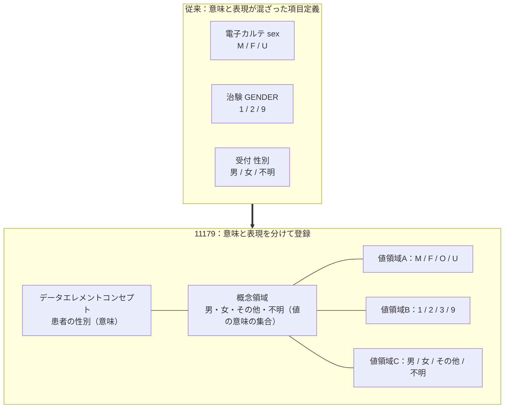

**キーワード**：「**意味（コンセプト）**」と「**表現（値の持ち方）**」を分離し、意味は共通、表現は用途ごとに複数持てるようにする。

> 💡 **ベストプラクティス**
> データ統合や標準化の議論では、まず「それは意味の違いか、表現の違いか」を切り分ける癖をつけると、議論が劇的に整理されます。11179 はこの切り分けの語彙を提供する規格です。

---

## STEP 2：規格の基本情報と位置づけ

### 2-1. 基本情報（ISO公式ページより）

| 項目 | 内容 |
|---|---|
| 規格番号 | ISO/IEC 11179-1:2023 |
| 題名 | Information technology — Metadata registries (MDR) — Part 1: Framework |
| 版 | Edition 4（第4版） |
| 発行 | 2023年1月（公式ライフサイクル上は 2023-01-16 に 60.60「International Standard published」） |
| 状態 | Published（発行済み） |
| ページ数 | 34ページ |
| 担当委員会 | ISO/IEC JTC 1/SC 32（Data management and interchange） |
| ICS | 35.040.50 |
| 旧版 | ISO/IEC 11179-1:2015（Withdrawn＝廃止） |
| 言語 | 英語 |
| SDGs | SDG 9（産業・技術革新・基盤）に貢献と表示 |

### 2-2. 規格の目的（要旨の言い換え）

公式の要旨を要約すると、この規格は次の2点を担います。

1. **ISO/IEC 11179 の各パートを理解し、互いに関連付けるための手段**を提供する
2. **メタデータとメタデータレジストリを概念的に理解するための基礎**となる

加えて、**JTC 1/SC 32 の他の規格・技術仕様・技術報告書（メタデータ関連）との関係**も説明します。

### 2-3. Part 1 は「何を決めない」規格か

| 決める（扱う） | 決めない（扱わない） |
|---|---|
| 11179全体の構成と各パートの役割の整理 | 具体的なテーブル設計やDBスキーマ |
| メタデータ・MDRを理解するための概念枠組み | メタデータ全般の一般論 |
| 他のSC 32規格との関係の説明 | データのビット/バイトレベルの物理表現 |

> ※ 最後の行（物理表現を扱わない）は、Part 1 の姉妹規格である Part 31 の適用範囲の記述から読み取れる方針です。

### 2-4. Part 1 の立ち位置

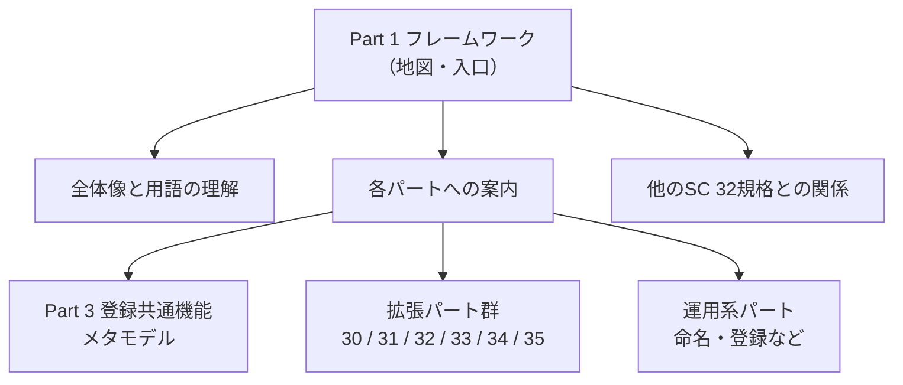

---

## STEP 3：ISO/IEC 11179 ファミリー全体像

### 3-1. パート一覧

Part 1:2023 の目次プレビュー、および関連パートのISO公式ページから確認できた範囲で整理します。

| Part | 名称（英語） | 日本語での役割イメージ | 確認できた状態 |
|---|---|---|---|
| 1 | Framework | 全体の地図・概念基盤 | 2023年1月発行（第4版） |
| 2 | Classification（技術報告書 TR） | 項目の分類 | Part 1 の目次で記載を確認 |
| 3 | Metamodel for registry common facilities | レジストリの**共通機能**のメタモデル（心臓部） | 2023年版が存在（旧版を分割） |
| 4 | Formulation of data definitions | データ定義の書き方 | 旧版系資料で確認（最新版は要確認） |
| 5 | Naming principles | 命名・識別の原則 | Part 1 の目次で記載を確認 |
| 6 | Registration | 登録（ライフサイクル運用） | Part 1 の目次で記載を確認 |
| 30 | Basic attributes of metadata | 完全なMDRが不要な場面で使う**基本属性** | 2023年1月発行（10ページ） |
| 31 | Metamodel for data specification registration | **データ仕様**（データエレメント、各種ドメイン等）の登録 | 2023年1月発行（Edition 1） |
| 32 | Metamodel for concept system registration | **概念体系**の登録 | Part 1 の目次で記載を確認 |
| 33 | Metamodel for data set registration | **データセット**の登録（旧 Part 7:2019 を置換） | 2023年1月発行（Edition 1） |
| 34 | Metamodel for computable data registration | **計算可能なデータ**の登録 | **2024年5月発行**（Edition 1、41ページ） |
| 35 | Metamodel for model registration | **モデル／メタモデル**の登録（旧 ISO/IEC 19763-10:2014 を置換） | 2023年1月発行（Edition 1、66ページ） |

> 📝 **補足**：Part 1:2023 の発行時点では Part 34 は「開発中」の扱いでしたが、その後 **2024年5月に発行**されています（ISO公式ページで確認）。

### 3-2. ファミリーの構造図

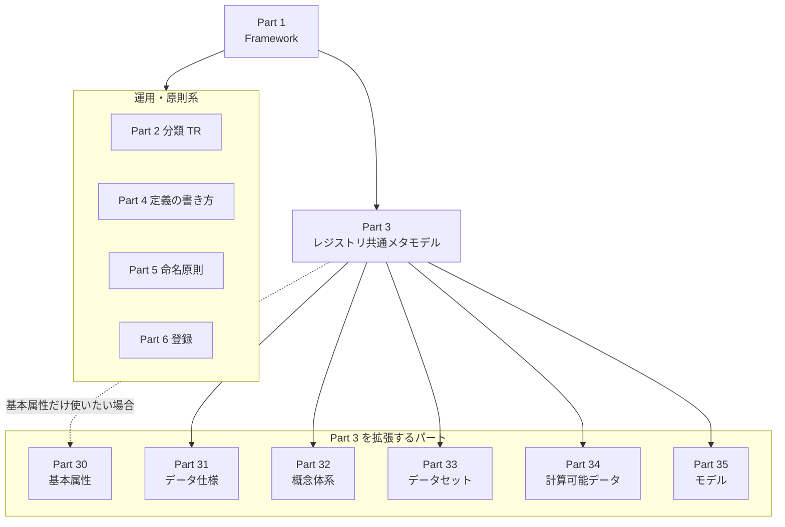

### 3-3. 迷ったときの選び方

| 知りたいこと | まず読むパート |
|---|---|
| 全体像・用語の入口 | **Part 1** |
| レジストリそのものの構造 | Part 3 |
| データ項目（データエレメント等）を登録したい | Part 31 |
| 概念や用語集（概念体系）を登録したい | Part 32 |
| データセット（提供データの塊）を登録したい | Part 33 |
| モデルやマッピングを登録したい | Part 35 |
| 項目名の付け方を決めたい | Part 5 |
| 登録や承認の流れを整えたい | Part 6 |
| 簡易な属性セットだけ使いたい | Part 30 |

---

## STEP 4：2023年版で何が変わったのか

### 4-1. 変更の背景

2015年版（第3版期）までは、Part 3 が非常に大きく、**共通機能とデータ記述の仕組みが同居**していました。2023年版では、「**管理しやすくするために分割**」するという方針が取られました。

### 4-2. 主な変更点（確認できた範囲）

| 観点 | 内容 | 根拠ソース |
|---|---|---|
| 版の更新 | 2015年版を置換（旧版は Withdrawn） | ISO公式ページ [S1] |
| 構成の変更 | 旧 Part 3 を複数パートに分割し、管理しやすくした | Part 3:2023 サンプル [S8] |
| 基本属性 | 旧 Part 3 の「Basic Attributes」を Part 30 へ移動 | Part 3:2023 サンプル [S8] |
| データ記述 | 旧 Part 3 の「Data Description」領域を Part 31 へ移動 | Part 3:2023 サンプル [S8] |
| Part 1 の記述追加 | Part 30〜35 の説明が Part 1 に追加された | Part 1:2023 プレビュー [S7] |
| 他規格との関係 | JTC 1/SC 32 の他規格との関係の記述 | ISO公式ページ [S1]、Part 1 目次 [S7] |

### 4-3. 新旧比較イメージ

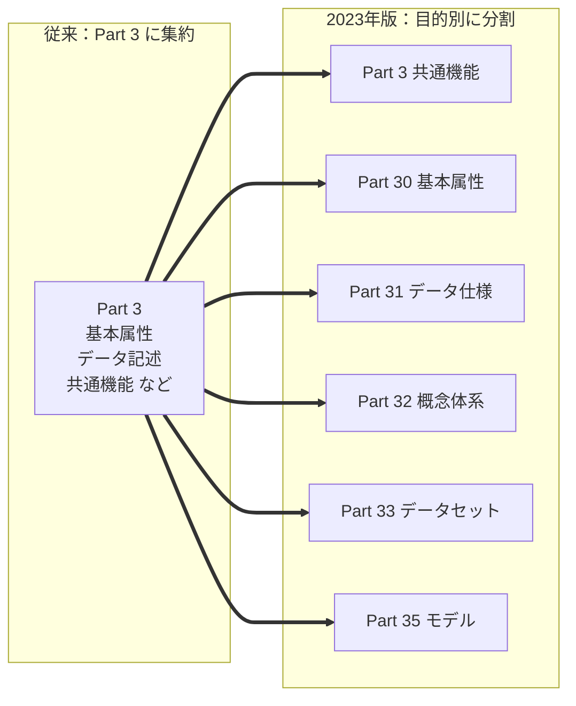

### 4-4. 学習者への影響

| 立場 | 影響 |
|---|---|
| 規格を初めて読む人 | 「どのパートに何が書いてあるか」を Part 1 で俯瞰できるので入りやすい |
| 旧版（2013年版 Part 3 等）で実装した人 | 条項番号の参照先が変わるため、**参照対応表の更新**が必要になり得る |
| 実装者 | 必要な拡張パートだけを選んで採用しやすい（例：基本属性だけなら Part 30） |

> 💡 **ベストプラクティス**
> 社内文書で「11179-3 の 11.5.2.1」のように旧条項番号を引用している場合は、2023年版の分割後にどのパートへ移ったかを確認して更新しましょう。

---

## STEP 5：コア概念を分解する（データエレメントの構造）

ここが **11179 の心臓部**です。ゆっくり進みます。

### 5-1. 全体像：データエレメントを構成する主要概念

> 📌 **読み方**：データエレメント（DE）の**直接の構成要素は DEC と VD の2つだけ**です（DE ＝ DEC ＋ VD）。オブジェクトクラスとプロパティは DEC を形づくる要素、概念領域（CD）は VD に値の意味を与える**関連概念**であり、いずれも DE の直接構成要素ではありません。下図の実線は「組み合わさって上位を作る」関係、点線は「意味を与える」関連を表します。

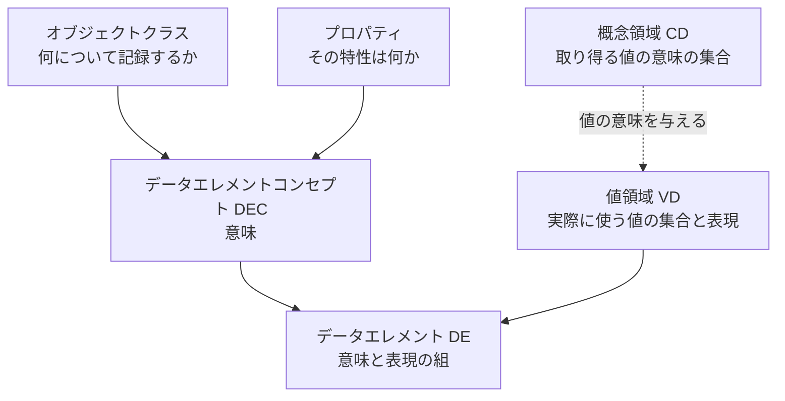

| 概念 | 英語 | DE との関係 | 一言説明 |
|---|---|---|---|
| オブジェクトクラス | Object Class | DEC の構成要素（DE から見れば間接） | **何について**データを集めるのか（例：患者、世帯、雇用主） |
| プロパティ | Property | DEC の構成要素（DE から見れば間接） | その対象を**特徴づける性質**（例：生年月日、収入、性別） |
| データエレメントコンセプト（DEC） | Data Element Concept | **DE の直接構成要素（意味）** | オブジェクトクラス＋プロパティ。**表現から独立した意味** |
| 概念領域（CD） | Conceptual Domain | 関連概念（VD に値の意味を与える） | 取り得る**値の意味（バリューミーニング）の集合** |
| 値領域（VD） | Value Domain | **DE の直接構成要素（表現）** | 実際に許される**値の集合**（表現を伴う） |
| データエレメント（DE） | Data Element | — | **DEC と VD の組合せ**。データの基本単位 |

### 5-2. STEP 5-A：オブジェクトクラスとプロパティ → DEC

資料で繰り返し使われる説明では、高レベルの概念「収入」に、オブジェクトクラス「人」を組み合わせて、データエレメントコンセプト「人の純収入」を作るという例が示されています。

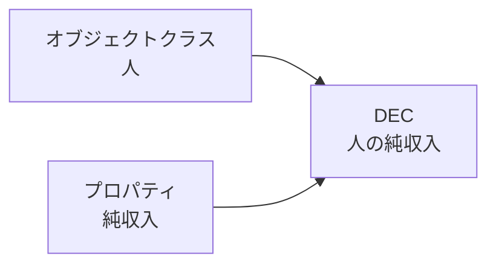

**DEC の最重要ポイント**

| ポイント | 内容 |
|---|---|
| 意味中心 | 「何を表すか」だけを定義し、**どう保存するか**は定義しない |
| 表現独立 | 特定のシステム・テーブル・列・組織に依存しない |
| 再利用性 | 1つの DEC に複数の DE がぶら下がれる |

> 📝 Part 31 では、DEC は「プロパティとオブジェクトクラスの組合せを表現するもの」と暗黙的に関連づけられ、表現とは独立に記述される概念として定義されています（サンプル版の定義より、言い換え）。

### 5-3. STEP 5-B：概念領域（CD）とバリューミーニング

| 用語 | 意味 | 例（性別） |
|---|---|---|
| 概念領域（CD） | 意味のまとまり | 「性別の区分」 |
| バリューミーニング | 個々の**意味**（コードではない） | 男性、女性、その他、不明 |

CD には2種類あると整理されます。

| 種類 | 特徴 | 例 |
|---|---|---|
| 列挙型（Enumerated） | 取り得る意味を**すべて列挙**する | 男性／女性／その他／不明 |
| 非列挙型（Described） | **規則や記述**で意味の範囲を定める | 「西暦で表した日付」 |

> 💡 **ポイント**：**CD は意味、VD は意味に対応する値（コード等）**です。コード `M` は意味「男性」を指し示す表現、という関係になります。

### 5-4. STEP 5-C：値領域（VD）と許容値

値領域は、**どんな値の集合を実際に許すか**を定義します。

| 区分 | 説明 | 例 |
|---|---|---|
| 列挙型 VD | 許容値を一覧で列挙 | `M`, `F`, `O`, `U` |
| 非列挙型 VD | 規則で定義 | 「YYYY-MM-DD 形式の日付」「0〜300 の整数」 |

資料では、データエレメントの**表現**には「値領域・データ型・測定単位」などが含まれる、と整理されています。

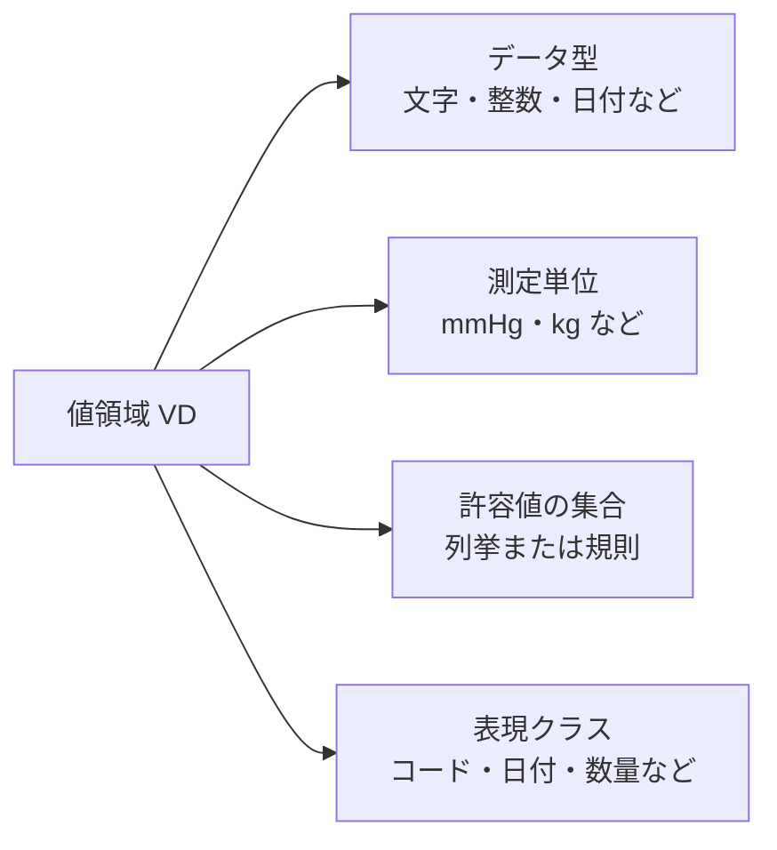

### 5-5. STEP 5-D：データエレメント（DE）＝ DEC ＋ VD

**データエレメントは「意味（DEC）」と「表現（VD）」の組**です。

| DE の例 | DEC（意味） | VD（表現） |
|---|---|---|
| 患者性別コード（文字1桁） | 患者の性別 | `M`/`F`/`O`/`U` |
| 患者性別コード（数値） | 患者の性別 | `1`/`2`/`3`/`9` |
| 患者生年月日（ISO 8601） | 患者の生年月日 | `YYYY-MM-DD` |
| 患者生年月日（和暦） | 患者の生年月日 | 和暦文字列 |

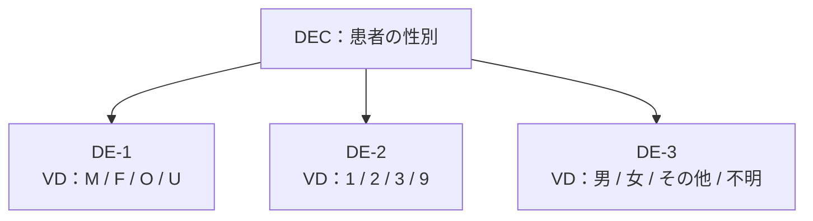

> 💡 **再利用の仕組み**：1つの DEC に複数の VD を組み合わせて複数の DE を作れる。また、同じ VD を複数の DE が共有することもできる。この組み立て式の設計が**再利用性**を生みます。

### 5-6. 具体例で通しで見る（収縮期血圧）

| 部品 | 内容 |
|---|---|
| オブジェクトクラス | 患者 |
| プロパティ | 収縮期血圧 |
| DEC | 患者の収縮期血圧 |
| CD | 収縮期血圧の測定値の意味（心臓収縮時の血圧の大きさ） |
| VD-A | 整数、単位 mmHg、範囲 0〜300 |
| VD-B | 小数、単位 kPa、範囲 0.0〜40.0 |
| DE-A | 患者の収縮期血圧（mmHg 整数） |
| DE-B | 患者の収縮期血圧（kPa 小数） |

**ここで分かること**：**単位の違いは「意味の違い」ではなく「表現の違い」**として整理できます。意味（DEC）を共通にしたまま、VD を切り替えれば変換規則も議論しやすくなります。

### 5-7. 関係のまとめ（クラス図）

> 下図は学習用に**簡略化**した概念図です。多重度や属性の詳細は Part 3 / Part 31 の原典で確認してください。

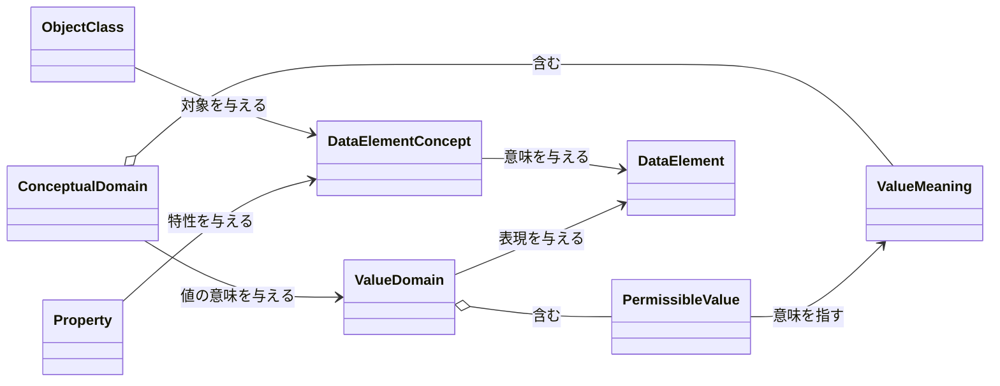

---

## STEP 6：概念レベルと表現レベルの2層構造

MDR（メタデータレジストリ）は、**概念レベル**と**表現レベル**の2つに整理して理解すると見通しが立ちます（LLNL の解説論文の整理に基づく）。

| レベル | 含まれるクラス | 問い |
|---|---|---|
| 概念レベル | データエレメントコンセプト、概念領域 | 「それは**何を意味するか**」 |
| 表現レベル | データエレメント、値領域 | 「それを**どう表すか**」 |

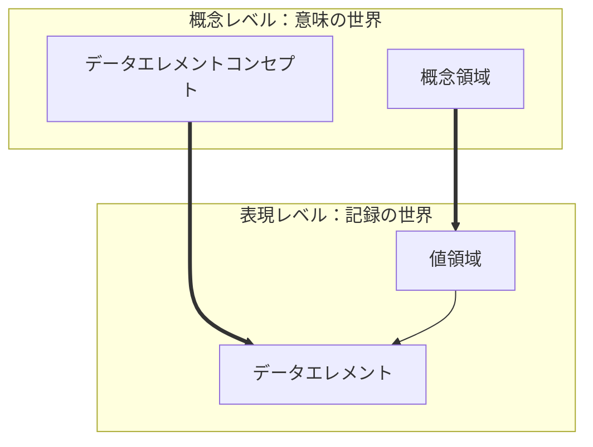

### 6-1. 「semantic（意味）」であって「physical（物理）」ではない

| 観点 | 11179 の構成要素 | 物理テーブル／列 |
|---|---|---|
| 抽象度 | 意味的（semantic） | 物理的（physical） |
| 依存先 | システムに依存しない | DBMS・スキーマに依存 |
| 目的 | 共有・再利用・合意 | 保存・検索・性能 |

> 💡 **実務への示唆**
> 11179 の DE は「物理列の説明」ではなく「**列が従うべき意味と値の約束**」です。物理列は、DE を参照して作る**実装**と捉えるとスッキリします。

---

## STEP 7：レジストリの運用と役割

### 7-1. 「登録して終わり」ではない

MDR は、データエレメントなどの**メタデータ項目（Administered Item）を登録・管理・共有する仕組み**です。そのため、定義だけでなく**誰が責任を持つか**の枠組みが必要になります。

LLNL の解説では、登録と運用に関わる主要な概念として次が挙げられています。

| 役割／概念 | 説明 |
|---|---|
| Registration Authority（RA／登録機関） | MDR を運営する**責任組織** |
| Submitter（提出者） | 新しい項目を**登録申請**する側 |
| Steward（管理者） | 項目の**内容に責任**を持つ側 |
| Registrar（登録官） | 登録の**手続きを担当**する役 |
| Context（コンテキスト） | 項目が**どの文脈で使われるか**の区分 |

### 7-2. 登録の概念的な流れ（イメージ）

> 下図は役割を理解するための**概念図**です。実際の登録状態や手続きの詳細は Part 6 などの原典で確認してください。

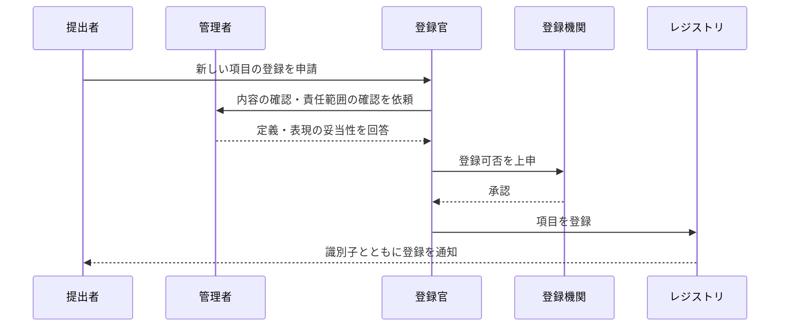

### 7-3. 命名・定義のルールは別パートへ

| テーマ | 担当パート | Part 1 での扱い |
|---|---|---|
| 定義の書き方 | Part 4 | 全体像の案内 |
| 命名・識別の原則 | Part 5 | 全体像の案内 |
| 登録・ライフサイクル | Part 6 | 全体像の案内 |

---

## STEP 8：他の規格・実システムとの関係

### 8-1. 規格間の関係

Part 1:2023 は、JTC 1/SC 32 の他の規格との関係を説明する役割を持ちます。目次プレビューからは、例として **ISO/IEC 19763 系（メタモデル相互運用フレームワーク）** や **ISO/IEC 20943 系（メタデータレジストリ内容の達成手順）** への言及が確認できます。

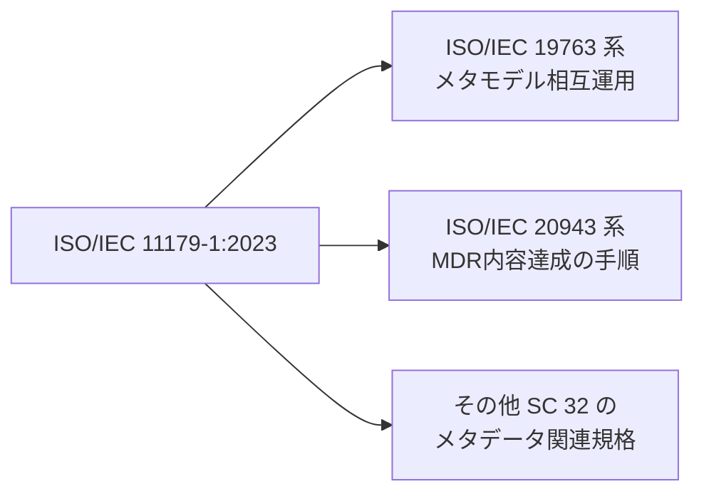

### 8-2. 実システム・コミュニティでの採用例

| 事例 | 概要 | 位置づけ |
|---|---|---|
| **Aristotle Metadata Registry** | ISO/IEC 11179 に基づく**オープンソースのMDRフレームワーク**。Django ベースで、組織が独自のレジストリを運用できる | 実装（OSS） |
| **NCI caDSR（米国国立がん研究所）** | データエレメント、DEC、VD、許容値などを 11179 に沿って管理。オブジェクトクラス・プロパティ・表現の命名に統制語彙を使用 | 大規模な医療研究での運用例 |
| **DDI Lifecycle（社会科学データの記述標準）** | 変数やコンセプト等の構造を 11179 に対応づけている | 他標準とのマッピング |
| **政府系メタデータレジストリ** | アイルランド住宅省、NSW（豪）等が Aristotle ベースで公開 | 行政データの標準化 |
| **医療標準の対応研究** | ODM、ClaML、LOINC、SNOMED CT 等の 11179 への対応づけ研究 | 医療情報の相互運用 |

### 8-3. 実システムの発想を借りるときの注意

| 注意点 | 内容 |
|---|---|
| 版の違い | Aristotle のドキュメントは 2013 年版 Part 3 の要件に基づく記述が中心（2023年版は分割後） |
| 対応範囲 | ツールが 2023 年版の全パート（例：Part 34, 35）に対応しているとは限らない |
| 用語のゆれ | caDSR 等は固有の名称（Qualifier、Representation 等）を併用する |

---

## STEP 9：手を動かして理解する（設計ワークフローと記述例）

### 9-1. 新しいデータ項目を登録するときの判断フロー

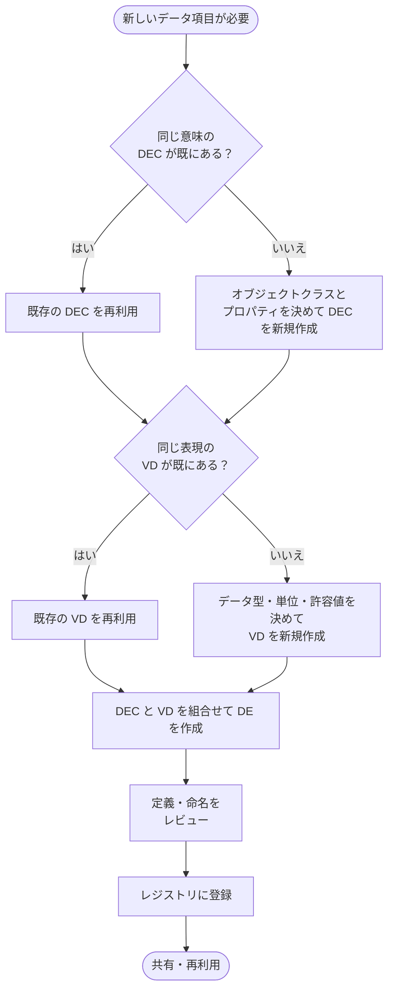

### 9-2. 設計時のチェックリスト

- [ ] 意味（DEC）と表現（VD）を**混ぜずに**書いているか
- [ ] 定義文は**その概念を他の概念から区別できる**か
- [ ] 単位・データ型・許容値が**表現（VD）側**に書かれているか
- [ ] 既存の DEC / VD を**検索して再利用**を検討したか
- [ ] 責任者（Steward）と提出者（Submitter）が**明確**か
- [ ] 命名規則（Part 5）と登録手順（Part 6）に**沿っているか**

### 9-3. 記述例（YAML：学習用の簡略表現）

> これは**学習用の簡略例**です。11179 公式のデータ形式ではありません。登録に使う実際の属性は Part 3 / Part 30 / Part 31 を参照してください。

```yaml
# 意味（DEC）
data_element_concept:
  id: DEC-0001
  name: 患者の収縮期血圧
  object_class: 患者
  property: 収縮期血圧
  definition: 患者の心臓が収縮したときの動脈内の血圧。

# 表現（VD）— 2種類
value_domains:
  - id: VD-0001
    name: 血圧_mmHg_整数
    datatype: integer
    unit: mmHg
    permissible_range: [0, 300]
  - id: VD-0002
    name: 血圧_kPa_小数
    datatype: decimal
    unit: kPa
    permissible_range: [0.0, 40.0]

# データエレメント（DE）= DEC + VD
data_elements:
  - id: DE-0001
    name: 患者収縮期血圧_mmHg
    data_element_concept: DEC-0001
    value_domain: VD-0001
  - id: DE-0002
    name: 患者収縮期血圧_kPa
    data_element_concept: DEC-0001
    value_domain: VD-0002
```

### 9-4. QAエンジニア視点：メタデータからテスト観点を導く

| メタデータ | 導けるテスト観点 |
|---|---|
| VD の許容範囲（0〜300） | 境界値（−1, 0, 300, 301）、同値分割 |
| VD の列挙値（`M/F/O/U`） | 許容値すべて、許容外値、大文字小文字 |
| VD のデータ型 | 型違い入力、桁あふれ、フォーマット違反 |
| DE が共有する DEC | 同じ DEC を使う別システム間での**値変換の一貫性** |
| 単位 | 単位変換時の丸め誤差、換算ミス |

> 💡 **ベストプラクティス**
> テスト設計の「期待値の根拠」を、**レジストリ上の VD・許容値**に紐づけておくと、仕様変更時の影響範囲の追跡が容易になります。

---

## STEP 10：よくある誤解と理解度チェック

### 10-1. よくある誤解

| 誤解 | 正しい理解 |
|---|---|
| 11179 はデータベース設計規格だ | **意味と表現を記述・登録するための枠組み**で、物理設計を決めるものではない |
| Part 1 だけ読めば実装できる | Part 1 は全体の入口。実装には Part 3 や拡張パートが必要 |
| メタデータ全般の百科事典だ | 本規格群でのメタデータは**データの記述**に限定される |
| データエレメント＝列名 | DE は**意味（DEC）と表現（VD）の組**であり、列名は実装の一形態にすぎない |
| 単位が違えば別の意味 | 単位は多くの場合**表現（VD）の違い**として整理できる |
| 2023年版でも Part 3 に全部入っている | 2023年版では**複数パートに分割**されている |

### 10-2. 理解度チェック（自己採点）

| # | 問題 | 解答の目安 |
|---|---|---|
| 1 | ISO/IEC 11179-1:2023 の主目的は？ | 各パートの理解・関連付けの手段と、メタデータ／MDR の概念的基礎を提供すること |
| 2 | データエレメントの構成要素を2つ答えよ | データエレメントコンセプトと値領域 |
| 3 | DEC はどの2つの組合せで作られるか | オブジェクトクラスとプロパティ |
| 4 | 概念領域と値領域の違いは？ | 概念領域は**意味の集合**、値領域は**実際に許す値（表現）の集合** |
| 5 | 「mmHg」と「kPa」は意味の違い？表現の違い？ | 通常は**表現（VD）の違い** |
| 6 | 2023年版で基本属性はどのパートへ？ | Part 30 |
| 7 | データセットの登録を扱うパートは？ | Part 33 |
| 8 | Part 34 の対象は？ | 計算可能なデータの登録（2024年5月発行） |
| 9 | MDR を運営する責任組織は？ | Registration Authority（登録機関） |
| 10 | 11179 の構成要素が「semantic」と言われる理由は？ | データの**意味**を扱い、物理的な保存形式は規定しないため |

---

## 付録A：用語集

| 用語（英） | 用語（日） | 説明 |
|---|---|---|
| Metadata | メタデータ | 本規格群では「データの記述」 |
| Metadata Registry (MDR) | メタデータレジストリ | メタデータを登録・管理・共有する仕組み |
| Administered Item | 管理対象項目 | MDR で登録・管理される項目の総称 |
| Object Class | オブジェクトクラス | 何についてデータを集めるか |
| Property | プロパティ | オブジェクトを特徴づける性質 |
| Data Element Concept (DEC) | データエレメントコンセプト | 表現から独立した、データの意味 |
| Conceptual Domain (CD) | 概念領域 | 値の意味（バリューミーニング）の集合 |
| Value Meaning | バリューミーニング | 個々の値が持つ意味 |
| Value Domain (VD) | 値領域 | 許される値の集合と表現 |
| Permissible Value | 許容値 | 値領域に含まれる個々の値 |
| Data Element (DE) | データエレメント | DEC と VD の組合せ |
| Registration Authority (RA) | 登録機関 | MDR を運営する責任組織 |
| Steward | 管理者 | 項目内容に責任を持つ者 |
| Submitter | 提出者 | 項目の登録を申請する者 |
| Registrar | 登録官 | 登録手続きを担当する者 |
| JTC 1/SC 32 | — | 本規格を所管する技術委員会（Data management and interchange） |

---

## 付録B：調査の検証ステータスと限界

> このガイドは**透明性のため、何をどこまで確認したか**を明記します。

### B-1. 検証できたこと／できなかったこと

| 区分 | 内容 |
|---|---|
| ✅ 確認できた | ISO公式ページの基本情報・要旨・ライフサイクル（版、日付、ページ数、旧版、委員会） |
| ✅ 確認できた | 関連パート（30, 31, 33, 34, 35）の公式ページの要旨・発行日 |
| ✅ 確認できた | Part 1:2023 の目次プレビューおよび変更点リストの断片（ANSI公開プレビュー経由） |
| ✅ 確認できた | Part 3:2023 サンプルにおける分割の説明 |
| ⚠️ 限定的 | Part 1:2023 の**本文全体**は読めていないため、各条項の細部（条項番号や厳密な定義文）は未確認 |
| ⚠️ 限定的 | Part 2 / 4 / 5 / 6 の**最新版の発行年**は未確認（旧版系の資料に基づく概要のみ） |
| ⚠️ 限定的 | 図中の多重度・登録状態などは**学習用の簡略化**であり、原典の厳密な規定とは異なる可能性がある |

### B-2. 「著名で国際的な開発者の投稿」についての正直な報告

要請に沿って実装者・実務家の一次情報を優先しましたが、2023年版 Part 1 を直接取り上げた**個人開発者のブログ投稿はほとんど見つかりませんでした**。代わりに、次のような**実装者・運用者による公開ドキュメント**を根拠としています。

| 区分 | 根拠 |
|---|---|
| OSS 実装者 | Aristotle Metadata Registry（作者：Samuel Spencer）の公式ドキュメント |
| 大規模運用組織 | 米国国立がん研究所（NCI）caDSR の公式Wiki |
| コミュニティ標準 | DDI Alliance の技術ガイド |
| 研究者 | LLNL（米国）の技術報告、UNECE METIS 会合向け資料（Daniel W. Gillman） |

これらは**2015年版や旧版 Part 3 を前提とした記述を含みます**。2023年版との差異に注意してください。

### B-3. 利用上の注意

- ISO の規格本文は著作権で保護されています。本ガイドは**公開情報の要約と学習用の言い換え**であり、規格本文の再掲ではありません。
- 実務での適合性判断・引用には、**必ず ISO 公式の規格原典**をご確認ください。

---

## 付録C：参考文献・根拠ソースURL

### C-1. 一次情報（ISO公式）

| ID | 内容 | URL |
|---|---|---|
| S1 | ISO/IEC 11179-1:2023 公式ページ（基本情報・要旨・ライフサイクル） | <https://www.iso.org/standard/78914.html> |
| S2 | ISO/IEC 11179-31:2023（データ仕様登録のメタモデル） | <https://www.iso.org/standard/78925.html> |
| S3 | ISO/IEC 11179-33:2023（データセット登録のメタモデル） | <https://www.iso.org/standard/81725.html> |
| S4 | ISO/IEC 11179-35:2023（モデル登録のメタモデル） | <https://www.iso.org/standard/81727.html> |
| S5 | ISO/IEC 11179-34:2024（計算可能データ登録のメタモデル） | <https://www.iso.org/standard/81726.html> |
| S6 | ISO/IEC 11179-30:2023（基本属性） | <https://www.iso.org/standard/81743.html> |

### C-2. 規格プレビュー・サンプル（二次配布）

| ID | 内容 | URL |
|---|---|---|
| S7 | Part 1:2023 プレビュー（目次・変更点の断片） | <https://webstore.ansi.org/preview-pages/ISO/preview_ISO+IEC+11179-1-2023.pdf> |
| S8 | Part 3:2023 サンプル（分割の説明） | <https://cdn.standards.iteh.ai/samples/78915/f240deec888846f79d1788dbecc077f3/ISO-IEC-11179-3-2023.pdf> |
| S9 | Part 31:2023 サンプル（DEC 等の定義） | <https://cdn.standards.iteh.ai/samples/78925/45944f6f4d0a4b22950d9043eb5309ac/ISO-IEC-11179-31-2023.pdf> |

### C-3. 実装者・実務家・研究者の公開資料

| ID | 内容 | URL |
|---|---|---|
| S10 | Wikipedia：ISO/IEC 11179（概要・DEC の例・パート一覧） | <https://en.wikipedia.org/wiki/ISO/IEC_11179> |
| S11 | NCI Wiki：caDSR and ISO 11179 | <https://wiki.nci.nih.gov/spaces/caDSR/pages/10861397/caDSR+and+ISO+11179> |
| S12 | LLNL 技術報告（R. K. Pon, D. J. Buttler）Metadata Registry, ISO/IEC 11179 | <https://digital.library.unt.edu/ark:/67531/metadc926399/m2/1/high_res_d/973862.pdf> |
| S13 | Daniel W. Gillman：ISO/IEC 11179-1 Framework for a Metadata Registry（UNECE METIS） | <https://www.unece.org/fileadmin/DAM/stats/documents/ece/ces/2004/02/metis/wp.31.e.ppt> |
| S14 | DDI Lifecycle Technical Guide：ISO/IEC 11179 との対応 | <https://ddi-lifecycle-technical-guide.readthedocs.io/en/latest/Other%20Standards/ISO11179.html> |
| S15 | Aristotle Metadata Registry 公式ドキュメント | <https://aristotle-metadata-registry.readthedocs.io/en/latest/> |
| S16 | Aristotle Metadata Registry ミッションステートメント | <https://aristotle-metadata-registry.readthedocs.io/en/latest/mission_statement.html> |
| S17 | Wikipedia：Aristotle Metadata Registry | <https://en.wikipedia.org/wiki/Aristotle_Metadata_Registry> |
| S18 | アイルランド住宅省メタデータレジストリ：Data Element の説明 | <https://metadata.housing.gov.ie/help/concepts/aristotle_mdr/dataelement> |
| S19 | アイルランド住宅省メタデータレジストリ：About ISO/IEC 11179 | <https://metadata.housing.gov.ie/help/page/about-isoiec-11179> |
| S20 | Metadata.NSW：About Aristotle Metadata Registry | <https://metadata.nsw.gov.au/about/aristotle_mdr> |
| S21 | ScienceDirect：The ISO/IEC 11179 norm for metadata registries: Does it cover healthcare standards in empirical research? | <https://www.sciencedirect.com/science/article/pii/S1532046412001827> |

### C-4. 本文中の主張と根拠の対応

| 本文の主張 | 主な根拠 |
|---|---|
| 版・発行日・ページ数・旧版・委員会 | S1 |
| 要旨（各パートの関連付け・メタデータの限定的な意味） | S1 |
| 2023年版で旧 Part 3 を分割・基本属性とデータ記述の移動 | S8 |
| Part 1 で Part 30〜35 の説明が追加された | S7 |
| Part 31 の適用範囲と DEC・CD・VD 等の記録 | S2, S9 |
| Part 33（Part 7:2019 を置換）、Part 35（19763-10:2014 を置換） | S3, S4 |
| Part 34 の発行（2024年5月） | S5 |
| Part 30 の目的（基本属性） | S6 |
| DEC＝コンセプト＋オブジェクトクラスの例（人の純収入） | S10 |
| 概念レベル／表現レベル、RA・提出者・管理者・登録官 | S12 |
| オブジェクトクラス・プロパティの定義と DE の再利用性 | S13, S11 |
| DE ＝ DEC ＋ VD、VD が許容値を持つ | S11, S18 |
| DDI・医療標準との対応 | S14, S21 |
| Aristotle の位置づけ（OSS、Django） | S15, S16, S17, S20 |

---

*本ガイドは公開情報に基づく学習用の解説です。規格の適合性判断や正式な引用には、ISO/IEC 11179-1:2023 の原典をご確認ください。*
