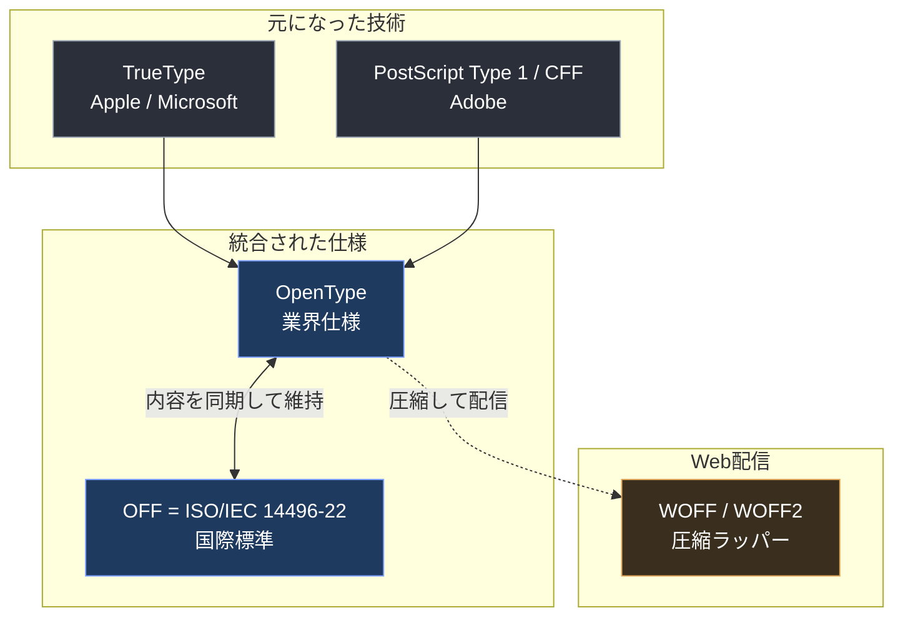
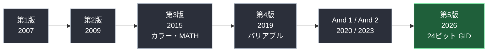
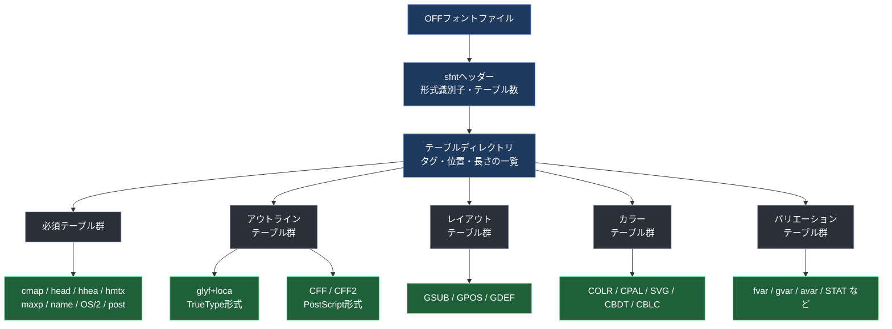
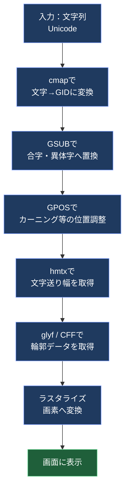
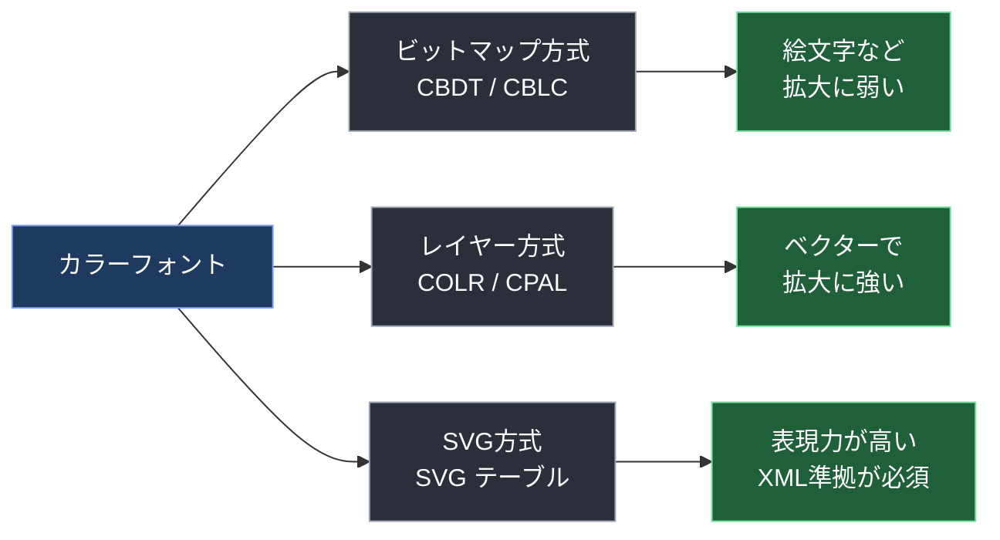
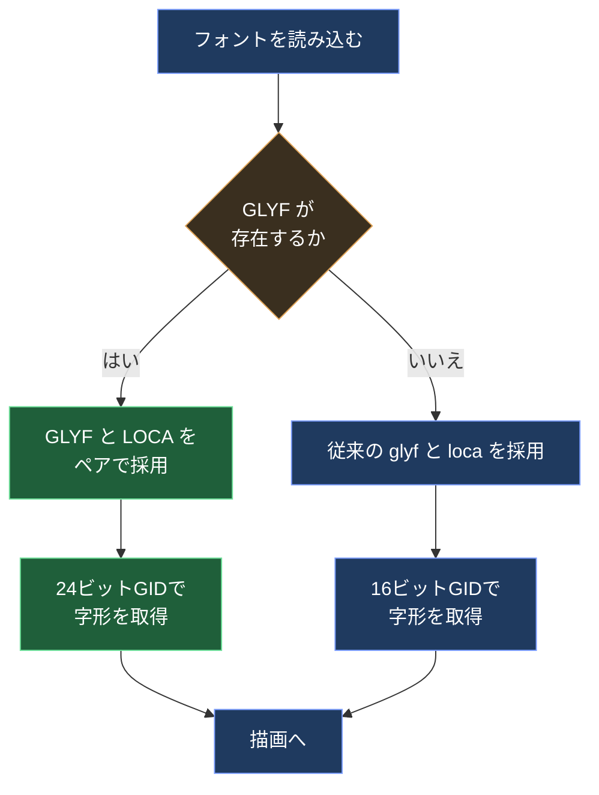
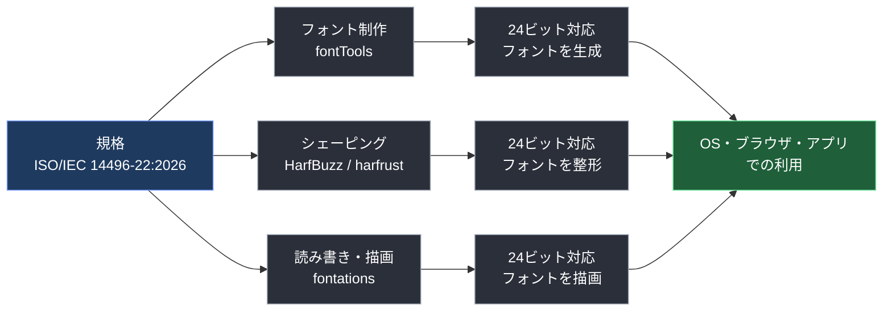
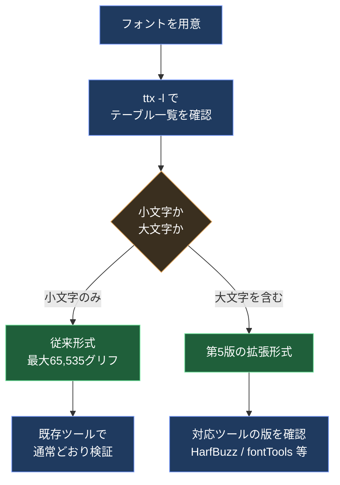

# ISO/IEC 14496-22:2026（Open Font Format）初学者向け解説ガイド

> **対象読者**：フォント・文字表示・テキストレンダリングの規格に初めて触れるソフトウェアエンジニア／QAエンジニア
> **調査基準日**：2026年10月8日までに公開されている情報
> **ゴール**：「OFFとは何か」「OpenTypeとの関係」「2026年の第5版で何が変わったか」を、図と表で順を追って理解する
> **記法**：フローチャートは Mermaid、図解・表は Markdown（ASCII図解は使用しない）

---

## 目次

1. [この規格を一言でいうと](#step-0)
2. [Step 1：基本情報を押さえる](#step-1)
3. [Step 2：OFFとOpenTypeの関係を理解する](#step-2)
4. [Step 3：5つの版の歴史をたどる](#step-3)
5. [Step 4：フォントファイルの構造を知る](#step-4)
6. [Step 5：文字が画面に出るまでの流れを知る](#step-5)
7. [Step 6：規格の主要機能（アウトライン・レイアウト・カラー・バリアブル）](#step-6)
8. [Step 7：2026年・第5版の最大のポイント「64Kの壁」の突破](#step-7)
9. [Step 8：実装側の対応状況（HarfBuzz / fontTools / fontations）](#step-8)
10. [Step 9：手を動かして確認する](#step-9)
11. [Step 10：QAエンジニア視点のテスト観点](#step-10)
12. [学習ロードマップ](#roadmap)
13. [確認できたこと・できていないこと](#caveats)
14. [参考文献・根拠URL](#sources)

---

<a id="step-0"></a>

## 0. この規格を一言でいうと

**ISO/IEC 14496-22 は、「OpenType」とほぼ同じ内容を国際標準として定めた、アウトラインフォントのファイル形式規格**です。正式名称は *Open Font Format*（略称 **OFF**）。

| 質問 | 答え |
|---|---|
| 何を決めている？ | フォントファイルの中身（テーブル構造、字形データ、文字の並べ方のルール） |
| 誰のための規格？ | フォントを**作る人**、フォントを**描画・組版するエンジン**を作る人 |
| 何が新しい（2026年）？ | 1つのフォントに入れられる字形数が **65,535 → 約1,677万（24ビット）** に拡張された第5版 |
| OpenTypeとの違いは？ | ほぼ同じ内容。OpenTypeは業界仕様（Microsoft等が管理）、OFFはISO標準 |

> 💡 **ポイント**：OFFは「Web Open Font Format（WOFF）」とは**別物**です。名前が似ていますが、WOFFはWeb配信用の圧縮ラッパーです（Step 2 で図解します）。

---

<a id="step-1"></a>

## Step 1：基本情報を押さえる

### 1-1. 規格のプロフィール

| 項目 | 内容 |
|---|---|
| 規格番号 | ISO/IEC 14496-22:2026 |
| 正式名称 | Information technology — Coding of audio-visual objects — Part 22: Open font format |
| 通称 | MPEG-4 Part 22 / Open Font Format（OFF） |
| 版 | 第5版（Edition 5） |
| 発行年月 | 2026年7月 |
| ステージ | 60.60（国際規格として発行済み） |
| 担当委員会 | ISO/IEC JTC 1/SC 29 |
| ICS分類 | 35.040.40 |
| 置き換え対象 | ISO/IEC 14496-22:2019（および Amd 1:2020、Amd 2:2023）は撤回済み |

### 1-2. 発行までの経緯（ISOの公開ライフサイクル）


> 用語：**DIS** = Draft International Standard（国際規格案）、**FDIS** = Final Draft International Standard（最終国際規格案）。FDIS段階では「賛成／反対」の投票のみで、内容の修正はできません。

---

<a id="step-2"></a>

## Step 2：OFFとOpenTypeの関係を理解する

### 2-1. 3つの名前を整理する

| 名前 | 何者か | 管理者 |
|---|---|---|
| **OpenType** | 業界仕様。実際のフォント制作で広く使われる名称 | Microsoft の仕様書サイト等で公開・更新 |
| **OFF（Open Font Format）** | OpenTypeとほぼ同内容の**ISO国際規格** | ISO/IEC JTC 1/SC 29（MPEG） |
| **WOFF / WOFF2** | OpenType/TrueTypeフォントを**Web配信用に圧縮**したラッパー形式 | W3C |



### 2-2. 同期の仕組み

- 2007年の初版は、技術的に **OpenType 1.4** 仕様と同等でした。
- 2009年の第2版は、OpenType仕様と「技術的に同等」と宣言され、以後 **OFFとOpenTypeは同期して維持**されています。
- Microsoft の OpenType 1.9.1 仕様ページには、「第5版の予備作業草案の改訂を取り込んでいる」と明記されています。つまり、**OFF第5版の審議中の草案が、OpenType 1.9.1 に取り込まれた**ことが確認できます。

> 🔑 **初学者向けの覚え方**：OpenType = 「現場で使う名前」、OFF = 「国際標準として文書化された名前」。中身はほぼ同じ。

---

<a id="step-3"></a>

## Step 3：5つの版の歴史をたどる

### 3-1. 版ごとの主な出来事

| 版 | 発行年 | ポイント |
|---|---|---|
| 第1版 | 2007 | OpenType 1.4 相当をISO化 |
| 第2版 | 2009 | OpenTypeと「技術的に同等」と宣言。TrueTypeヒンティング言語を含む |
| 第3版 | 2015 | カラーフォント（CBDT/CBLC、COLR/CPAL、SVG）と数式組版（MATH）などを追加 |
| 第4版 | 2019 | Amd 1・Amd 2（2015版への修正）を統合。バリアブルフォント関連を整理 |
| Amd 1 | 2020 | カラーフォント技術などの更新（SVGテーブルの扱い、`chws` 機能など） |
| Amd 2 | 2023 | 4版への追加修正 |
| **第5版** | **2026** | **64Kグリフ上限の突破（24ビット化）、3次ベジェ曲線など** |



### 3-2. 第3版でカラーフォントが入った背景

業界各社が独自に提案したカラー表現を、ISOの枠組みで標準化した経緯があります。

| 提案元 | 方式 | 主なテーブル |
|---|---|---|
| Google | カラービットマップ | `CBDT` / `CBLC` |
| Microsoft | レイヤー方式のカラー | `COLR` / `CPAL` |
| Adobe・Mozilla | SVGベース | `SVG␠` |

> 表記：`␠` は半角スペース（U+0020）を表します。タグは4文字固定のため、`SVG␠` の実際のタグは「SVG」の後ろに半角スペース1つが付いた4バイトです。

---

<a id="step-4"></a>

## Step 4：フォントファイルの構造を知る

### 4-1. 全体像

OFFフォントは、**「ヘッダー → テーブル一覧 → 各テーブル」** という構造です。1つのフォントは複数の**テーブル**（専門データの入れ物）の集まりで、各テーブルは4文字の**タグ**で呼ばれます。



### 4-2. ファイル先頭の「テーブルディレクトリ」

| フィールド | 型 | 意味 |
|---|---|---|
| sfntVersion | uint32 | 形式の識別子（TrueType系かCFF系かの目印） |
| numTables | uint16 | 収録テーブル数 |
| searchRange / entrySelector / rangeShift | uint16 | 二分探索用の補助値 |
| **テーブルレコード**（テーブル数ぶん繰り返し） | | |
| tableTag | 4文字 | テーブル名（例：`glyf`） |
| checksum | uint32 | チェックサム |
| offset | uint32 | ファイル先頭からの位置 |
| length | uint32 | テーブル長 |

> 📝 規格上、**各テーブルは4バイト境界に揃え、ゼロで埋める**（long-aligned and padded with zeroes）と定められています。

### 4-3. 主要テーブルの早見表

| タグ | 日本語名 | 役割 |
|---|---|---|
| `cmap` | 文字→字形対応表 | 「文字コード」から「字形番号（グリフID）」を引く |
| `head` | フォントヘッダー | 全体設定（座標の単位など） |
| `hhea` / `hmtx` | 水平メトリクス | 横組みの文字送り幅 |
| `maxp` | 最大プロファイル | **グリフ総数**などの上限値 |
| `name` | 名前表 | フォント名・著作権など多言語文字列 |
| `OS/2` | OS/2メトリクス | 太さ・幅・各種指標 |
| `post` | PostScript情報 | グリフ名など |
| `glyf` / `loca` | TrueTypeアウトライン | 字形の輪郭データと位置索引 |
| `CFF␠` / `CFF2` | CFFアウトライン | PostScript系の輪郭データ |
| `GSUB` | グリフ置換 | 合字・異体字などの置換 |
| `GPOS` | グリフ位置調整 | カーニングなどの位置調整 |

> 表記：`␠` は半角スペース（U+0020）を表します。`CFF␠` の実際のタグは「CFF」の後ろに半角スペース1つが付いた4バイトです。
>
> **用語**：**グリフ（glyph）** = 画面に描く1つの字形。**グリフID（GID）** = そのグリフの通し番号。後述の第5版は、この **GIDの桁数** が主役です。

---

<a id="step-5"></a>

## Step 5：文字が画面に出るまでの流れを知る

規格は「フォント描画エンジンとテキストシェーピングエンジンを、規格準拠で作るための詳細」を定義する、と明記されています。実際の流れを追うと、テーブルの役割がつかめます。



| 段階 | 担当 | 初学者向けの例え |
|---|---|---|
| 文字→GID | `cmap` | 辞書で「あ」の字形番号を引く |
| 置換 | `GSUB` | 「fi」を1つの合字に置き換える |
| 位置調整 | `GPOS` | 「AV」の間隔を詰める |
| 輪郭取得 | `glyf` / `CFF` | 字形の設計図を取り出す |
| 描画 | ラスタライザ | 設計図を画素で塗る |

> この「**シェーピング（GSUB/GPOS）→ 描画**」の2段階を担う代表的なオープンソース実装が **HarfBuzz**（シェーピング）です。Step 8 で触れます。

---

<a id="step-6"></a>

## Step 6：規格の主要機能

### 6-1. 2種類のアウトライン形式

| 項目 | TrueType形式（`glyf`） | CFF / CFF2形式 |
|---|---|---|
| 曲線の種類（従来） | 2次ベジェ | 3次ベジェ |
| 由来 | Apple / Microsoft | Adobe（PostScript） |
| 向いている用途 | 画面表示、ヒンティング重視 | 印刷・DTP、データ量の効率 |
| 識別 | TrueType系の識別子 | `OTTO` 系の識別子 |

> 🆕 **第5版**では、`glyf` 側でも**3次ベジェ曲線**を扱えるようにする拡張が入りました（Step 7）。

### 6-2. レイアウト機能（OFF Layout）

規格は、フォント制作者が国際的・高度な組版を設計できるよう、**グリフ置換・グリフ位置調整・ベースライン情報**などを持つレイアウトテーブルを定義しています。

| テーブル | 役割 | 例 |
|---|---|---|
| `GSUB` | グリフ置換 | 合字、異体字、縦書き用字形 |
| `GPOS` | グリフ位置調整 | カーニング、アクセント位置 |
| `GDEF` | グリフ定義 | グリフの分類、合字のキャレット位置 |
| `BASE` | ベースライン | 欧文・和文の混植時の基準線 |
| `JSTF` | 両端揃え | 行末調整の情報 |

> 日本語組版では、縦書き用の機能（`vert` など）や、約物の幅調整（`chws` 機能が Amd 1 で追加）が重要になります。

### 6-3. カラーフォント



> Amd 1:2020 では、SVGテーブルは TrueType・CFF・CFF2 のいずれのアウトラインを持つフォントでも使え、SVG文書はXML定義に準拠しなければならない、と整理されています。

### 6-4. バリアブルフォント

1つのフォントファイルの中に**太さ・幅などの連続的な変化（軸）**を持たせる仕組みです。

| テーブル | 役割 |
|---|---|
| `fvar` | 軸の定義（太さ、幅など） |
| `gvar` | TrueTypeアウトラインの変化データ |
| `CFF2` | 変化に対応したCFF |
| `avar` / `cvar` / `HVAR` / `MVAR` / `VVAR` | 軸の補正、メトリクスの変化 |
| `STAT` | スタイル属性 |

> 第4版（2019）の規格本文に「OFF Font variations」の節があり、この仕組みが標準として整理されています。

---

<a id="step-7"></a>

## Step 7：2026年・第5版の最大のポイント「64Kの壁」の突破

### 7-1. なぜ問題だったのか

従来、グリフIDは **16ビット**で表されていたため、1つのフォントに入れられる字形数は**最大65,535個**でした。OpenType 1.7時代の推奨事項にも「1つのフォントに含められるグリフ数は64kに制限される」と書かれていました。

CJK（中国語・日本語・韓国語）の漢字、異体字、絵文字、多言語統合フォントでは、この上限が実務上の制約になっていました。

| 桁数 | 表現できる数 | 状況 |
|---|---|---|
| 16ビット（従来） | 65,536通り（GIDは最大65,535） | 多言語統合フォントで足りない |
| **24ビット（第5版）** | **16,777,216通り** | 事実上の上限を大幅に緩和 |

### 7-2. 仕組み：「大文字タグのテーブル」を新設

第5版の拡張は、既存の小文字タグのテーブル（`glyf`、`loca`、`maxp` など）を**直接書き換えるのではなく、24ビット対応の「大文字タグ」の新テーブルを並べる**方式です。

| 従来（小文字） | 第5版の拡張（大文字） | 主な変更点 |
|---|---|---|
| `maxp` | `MAXP` | グリフ数が**24ビット** |
| `hhea` / `hmtx` | `HHEA` / `HMTX` | 長いメトリクスの数が**32ビット** |
| `vhea` / `vmtx` | `VHEA` / `VMTX` | 同上（縦組み） |
| `glyf` / `loca` | `GLYF` / `LOCA` | 合成グリフの参照が**24ビット**可能、3次曲線のフラグ |
| `gvar` | `GVAR` | 24ビットのグリフ数・グリフ単位のデータ位置 |
| `cmap` | cmap フォーマット15 | 拡張グリフIDに対応 |



> 上の分岐は、実装者（HarfBuzzの作者でもある Behdad Esfahbod 氏）がfontationsへ出したPRの説明に基づく**実装上の選択ルール**です。「`GLYF` があれば、旧 `loca` へはフォールバックしない」と書かれています。規格本文そのものは本稿では確認できていません（[確認できなかったこと](#caveats)を参照）。

### 7-3. 合わせて入った拡張

実装者のPR説明から読み取れる、第5版（beyond-64k）関連の拡張一覧です。

| 分類 | 内容 |
|---|---|
| ファイル構造 | TTCヘッダーのバージョン 1.1 / 2.1 |
| 文字対応 | `cmap` フォーマット15（フォーマット14より優先） |
| アウトライン | 3次ベジェ曲線（`GLYF` 内で扱える）、24ビットのコンポーネント参照 |
| メトリクス | `MAXP`、`HHEA`/`HMTX`、`VHEA`/`VMTX` |
| バリエーション | `GVAR` |
| 縦組み | `VORG` バージョン2 |
| カラー | `COLR` の `PaintGlyph2`（24ビットのアウトラインGIDに対応） |
| レイアウト | Coverage / ClassDef の拡張形式、GSUB/GPOS の拡張サブテーブル、GDEF 1.4、BASE フォーマット4、JSTF 1.1 |

### 7-4. 3次ベジェ曲線とは

| 項目 | 2次ベジェ | 3次ベジェ |
|---|---|---|
| 制御点の数（1区間） | 1個 | 2個 |
| 表現の自由度 | 低い（曲線を多く分割する必要） | 高い（少ない点で滑らか） |
| 従来の主な採用 | TrueType（`glyf`） | CFF / PostScript |

> 提案文書（WG 3 の提案資料）では、`glyf` の「フォーマット1」で2次と3次を混在でき、簡易グリフ用フラグに **CUBIC（ビット7）** を追加し、これは**オフカーブ点にのみ**使う、と説明されています。ただしこれは**審議中の提案文書**の記述であり、最終版の文面とは差がありうる点に注意してください。

---

<a id="step-8"></a>

## Step 8：実装側の対応状況

規格が発行されたあと、世界的に使われるオープンソースのフォントツールが対応を進めています。以下は2026年10月8日までに確認できた公開情報です。

| プロジェクト | 領域 | 確認できた内容 |
|---|---|---|
| **HarfBuzz** | テキストシェーピング | 「最終版の第5版規格に更新する」PR #5655。`MAXP`、`GLYF`/`LOCA`、`HHEA`/`HMTX`、`GVAR`、GSUB/GPOS拡張、GDEF 1.4 などの実装を含む |
| **fontTools** | フォント編集・生成 | 「最終版の第5版のbeyond-64k補助テーブル」をサポートするPR #4097 |
| **fontations**（Google Fonts） | Rust製フォントライブラリ | `MAXP`/メトリクス（#2208→#2221）、`GLYF`/`LOCA`と3次アウトライン（#2209→#2222）、`GVAR`（#2210→#2223）、`COLR` の `PaintGlyph2`（#2212）が順次提出 |
| **harfrust** | HarfBuzzのRust移植 | GSUB/GPOS/GDEF の拡張対応（#495）が提出 |

### 実装者が実際に作ったテストフォント

| 出典 | 内容 |
|---|---|
| HarfBuzz PR #5655 | NotoSansを統合した（絵文字・CJKを除く）フォントで、**グリフ数 106,958、Unicode数 26,984** |
| fontations PR #2209 | 統合テストフォントの **104,404グリフ**をすべて描画し、**103,186個の非空グリフ**をwrite-fontsで往復検証 |

### 実装者が報告した「仕様からの逸脱」

HarfBuzz PR #5655 のコメントで、実装者は「提案仕様では、拡張LookupListのLookupへのオフセットが16ビットのままで、目的を損なう。そこでオフセットを32ビットに広げたところ、fontTools.mergeでの統合が高速に成功した」と報告しています。これは**提案段階の議論**であり、最終版の文面での扱いは本稿では確認できていません。



---

<a id="step-9"></a>

## Step 9：手を動かして確認する

### 9-1. 手元のフォントのテーブル構成を見る（fontTools）

```bash
pip install fonttools
ttx -l YourFont.ttf
```

出力される**テーブル一覧**を、Step 4-3 の早見表と見比べてください。

### 9-2. Pythonでグリフ数とテーブルを確認する

```python
from fontTools.ttLib import TTFont

font = TTFont("YourFont.ttf")

# テーブルタグの一覧（小文字の glyf か、大文字の GLYF かを見分ける）
print(sorted(font.keys()))

# グリフ数（従来のmaxpがある場合）
if "maxp" in font:
    print("numGlyphs =", font["maxp"].numGlyphs)

# 24ビット対応の大文字テーブルが含まれているか
for tag in ("MAXP", "GLYF", "LOCA", "HHEA", "HMTX"):
    print(tag, "あり" if tag in font else "なし")
```

> ⚠️ 大文字テーブルの読み書きは、fontTools の対応状況（PR #4097）に依存します。お使いの版で対応しているかは、リリースノートで確認してください。

### 9-3. 確認のステップ



---

<a id="step-10"></a>

## Step 10：QAエンジニア視点のテスト観点

> 以下は、本稿の筆者（Claude）が、調査結果をもとに整理した**テスト観点の提案**です。規格や実装者の公式な推奨ではありません。

### 10-1. なぜQAの対象になるのか

フォント対応は「**表示される／されない**」が環境ごとに分かれやすい領域です。特に第5版は、**古い実装が新しいフォントを正しく扱えない**可能性があり、後方互換性が主要なリスクです。

### 10-2. テスト観点の一覧

| 観点 | 確認したいこと | 具体例 |
|---|---|---|
| 境界値 | グリフ数 65,535 / 65,536 / 65,537 の前後 | GID 65,536 の字形が描画されるか |
| 後方互換 | 小文字のみのフォントが従来どおり動くか | 既存の日本語フォントで表示崩れがないか |
| テーブル選択 | 大文字・小文字が混在するフォントでの優先順位 | `GLYF` があるのに旧 `loca` を参照していないか |
| 合成グリフ | 24ビット参照を含む合成グリフ | 16ビットと24ビット参照の混在 |
| 曲線 | 3次ベジェと2次の混在、境界での不正な連続 | 混在した制御点列を不正として扱えるか |
| メトリクス | 文字送り幅・縦組みの取得 | `HMTX` の長いメトリクス数が32ビットのとき |
| サブセット化 | 不要な字形を削ったフォントの整合性 | サブセット後も参照先GIDが壊れないか |
| 不正入力 | 壊れたヘッダー・不整合なグリフ数 | クラッシュせず拒否できるか（安全性） |
| 性能 | 10万グリフ超フォントの読み込み時間・メモリ | 起動時間の悪化がないか |

### 10-3. リスクの優先度（筆者の見立て）

| 優先度 | リスク | 発生しやすさ | 影響 |
|---|---|---|---|
| ★★★ 最優先 | 旧実装での表示欠け | 高 | 大 |
| ★★★ 最優先 | テーブル選択の誤り（`GLYF` と `glyf` の取り違え） | 中〜高 | 大 |
| ★★★ 最優先 | 不正入力でのクラッシュ | 中 | 大 |
| ★★ 重点 | 境界値 GID 65,536 | 高 | 中〜大 |
| ★★ 重点 | 従来フォントの退行 | 低〜中 | 大 |
| ★ 余裕があれば | 大規模フォントの性能 | 中 | 中 |

---

<a id="roadmap"></a>

## 学習ロードマップ


| 段階 | 目標 | おすすめの題材 |
|---|---|---|
| 基礎 | グリフとGIDの違いを説明できる | 手元のフォントを `ttx` で開く |
| 構造 | 必須テーブルを言える | Microsoft の OpenType 仕様の各テーブルの章 |
| 描画の流れ | cmap→GSUB→GPOS→描画の順を説明できる | HarfBuzz の解説 |
| 発展 | バリアブルとカラーの違いを説明できる | 仕様書の該当章 |
| 最新 | 64Kの壁と24ビット化の仕組みを説明できる | 本稿 Step 7、実装者のPR |
| 実践 | 境界値のテストフォントを作れる | fontTools の FontBuilder |

---

<a id="caveats"></a>

## 確認できたこと・できていないこと

調査の透明性のため、本稿の根拠の強さを分けて記します。

### ✅ 公式情報で確認できたこと

| 事項 | 根拠 |
|---|---|
| 発行年月（2026年7月）、第5版、ステージ60.60、ICS、委員会 | ISO公式ページ |
| 発行日が 2026-07-16、FDIS投票終了が 2026-04-29 | ISO公式ページのライフサイクル |
| 2019年版・Amd 1・Amd 2 が撤回済み | ISO公式ページ |
| OpenType 1.9.1 が第5版の予備作業草案の改訂を取り込んでいる | Microsoft OpenType 仕様ページ |
| 初版2007年〜第5版2026年の発行年 | 日本語Wikipedia（二次情報） |

### 🔶 実装者の一次発言から読み取った事項

| 事項 | 根拠 |
|---|---|
| `GLYF`/`LOCA`、24ビット参照、3次曲線、`MAXP`、`HHEA`/`HMTX` などの存在と挙動 | fontations PR（Behdad Esfahbod 氏）、HarfBuzz PR、fontTools PR |
| テストフォントのグリフ数（106,958 / 104,404） | HarfBuzz PR、fontations PR |

### ❓ 本稿では確認できていないこと

| 事項 | 理由 |
|---|---|
| **第5版の本文（約1,000ページ）の逐条確認** | ISOページはプレビューまでの公開で、本文を読んでいない |
| 最終ページ数 | FDIS時点の掲載値が1,003ページ。発行版の値は未確認 |
| 第5版の入手方法・価格 | 第4版までは無料ダウンロードの記載があったが、第5版は未確認。ISOページで確認を推奨 |
| `CUBIC` フラグの最終的なビット位置・名称 | 提案文書の記述。最終版との一致は未確認 |
| 実装PRのマージ状況（2026年10月8日時点） | PRの一部は「Open」や「Closed（再提出）」で、各リポジトリで要確認 |
| 各OS・ブラウザ（Windows、macOS、Chrome等）の対応状況 | 公式情報を確認できていない |

> 🔑 **おすすめの確認手順**：まず ISO公式ページ（本稿末尾の参考文献）で本文を入手し、本稿の Step 7 の表と照らして確認してください。

---

<a id="sources"></a>

## 参考文献・根拠URL

### 一次情報（規格団体・仕様管理者）

| # | 内容 | URL |
|---|---|---|
| 1 | ISO公式：ISO/IEC 14496-22:2026（ご指定のページ） | https://www.iso.org/standard/14496-22 |
| 2 | ISO公式：FDIS 14496-22（最終国際規格案、ライフサイクルと1,003ページの記載） | https://www.iso.org/standard/87621.html |
| 3 | ISO公式：ISO/IEC 14496-22:2009（第2版の概要・目標） | https://www.iso.org/standard/52136.html |
| 4 | IEC Webstore：ISO/IEC 14496-22:2019（第4版、628ページ、撤回日） | https://webstore.iec.ch/en/publication/64608 |
| 5 | MPEG公式：Open Font Format の標準ページ | https://mpeg.chiariglione.org/standards/mpeg-4/open-font-format |
| 6 | MPEG公式：カラーフォント・MATH対応の提案募集 | https://mpeg.chiariglione.org/standards/mpeg-4/open-font-format/call-proposals-isoiec-14496-22-open-font-format-color-font.html |
| 7 | MPEG公式GitHub：OpenFontFormat（課題の議論リポジトリ） | https://github.com/MPEGGroup/OpenFontFormat |
| 8 | Microsoft：OpenType 仕様 1.9.1（第5版予備草案の取り込みを明記） | https://learn.microsoft.com/en-us/typography/opentype/spec/ |
| 9 | Microsoft：OpenType 変更履歴 | https://learn.microsoft.com/en-us/typography/opentype/spec/changes |
| 10 | Microsoft：`glyf` テーブル（OpenType 1.9.1） | https://learn.microsoft.com/en-us/typography/opentype/spec/glyf |

### 著名な国際的開発者・プロジェクトの一次発言

| # | 内容 | 発信者 | URL |
|---|---|---|---|
| 11 | HarfBuzz：最終版の第5版規格へ更新（beyond-64k） | Behdad Esfahbod 氏ほか（HarfBuzz） | https://github.com/harfbuzz/harfbuzz/pull/5655 |
| 12 | fontTools：最終版の第5版 beyond-64k 実装 | Behdad Esfahbod 氏ほか（fontTools） | https://github.com/fonttools/fonttools/pull/4097 |
| 13 | fontations：`GLYF`/`LOCA` と3次アウトライン（2026年10月4日） | Behdad Esfahbod 氏（Google Fonts） | https://github.com/googlefonts/fontations/pull/2209 |
| 14 | fontations：`MAXP` と拡張メトリクス | 同上 | https://github.com/googlefonts/fontations/pull/2208 |
| 15 | fontations：`GVAR` | 同上 | https://github.com/googlefonts/fontations/pull/2210 |
| 16 | 提案資料：WG 3「otf improvements」（3次曲線・64K超の提案） | HarfBuzz の boring-expansion-spec | https://github.com/harfbuzz/boring-expansion-spec/blob/main/iso_docs/WG03_otf-improvements.pdf?raw=true |
| 17 | fontTools ドキュメント：`GVAR`（24ビットのグリフ変化テーブル） | fontTools プロジェクト | https://fonttools.readthedocs.io/en/latest/ttLib/tables/G_V_A_R_.html |

### 二次情報（補助的な参照）

| # | 内容 | URL |
|---|---|---|
| 18 | 日本語Wikipedia：OpenType（OFFの歴史・各版の発行年） | https://ja.wikipedia.org/wiki/OpenType |
| 19 | 英語Wikipedia：OpenType（カラーフォントの標準化経緯） | https://en.wikipedia.org/wiki/OpenType |
| 20 | NISP：ISO/IEC 14496-22（第2版の概要） | https://nisp.nw3.dk/standard/iso-iec-14496-22.html |
| 21 | 第4版（2019）の本文PDF（Internet Archive） | https://ia801609.us.archive.org/view_archive.php?archive=%2F25%2Fitems%2Fopentype-1.9%2Fc074461_ISO_IEC_14496-22_2019.zip&file=C074461e.pdf |
| 22 | Amd 1:2020 の本文PDF（Internet Archive） | https://archive.org/download/opentype-1.9/ISO_IEC_14496-22_2019_Amd_1_2020-Character_PDF_document(en).pdf |

---

## 用語集

| 用語 | 意味 |
|---|---|
| OFF | Open Font Format。ISO/IEC 14496-22 の通称 |
| sfnt | フォントファイルの基本コンテナ構造の名称 |
| グリフ | 画面に描く1つの字形 |
| GID | グリフID。グリフの通し番号 |
| アウトライン | 字形の輪郭を曲線で表現したデータ |
| シェーピング | 文字列を、合字・位置調整などを経て字形列に変換する処理 |
| ヒンティング | 小さいサイズで字形を崩さないための補正 |
| バリアブルフォント | 太さ・幅などを連続的に変えられるフォント |
| beyond-64k | 65,535を超えるグリフ数を扱う拡張の通称（実装者が使う呼び名） |
| DIS / FDIS | 国際規格案 / 最終国際規格案 |

---

*本ガイドは、2026年10月8日までに公開されていた情報と、ご指定のISOページを根拠に作成しました。第5版の規格本文そのものは未確認のため、実装や製品への適用前に、必ずISO公式の発行版でご確認ください。*
