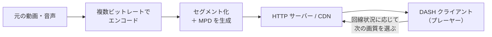
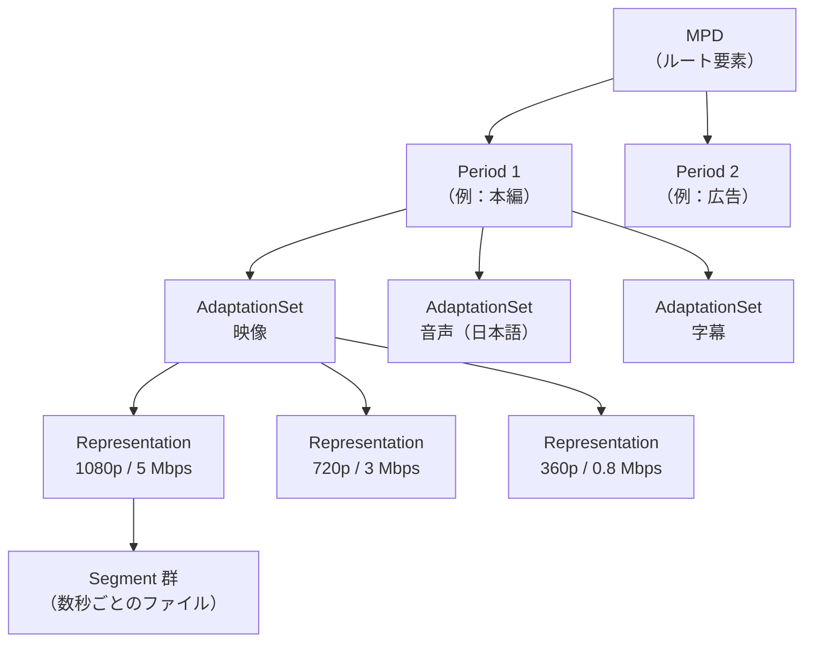
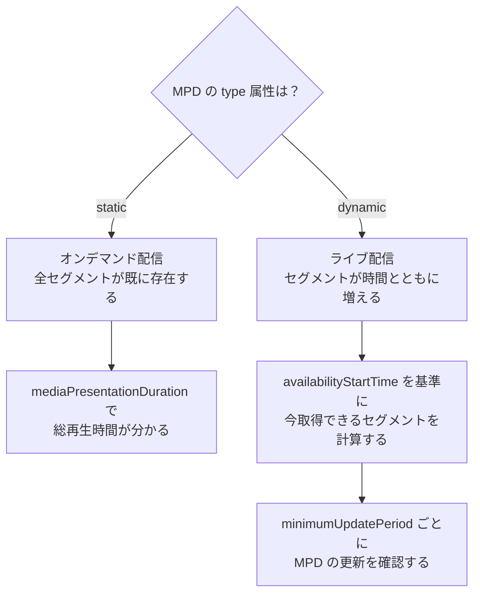
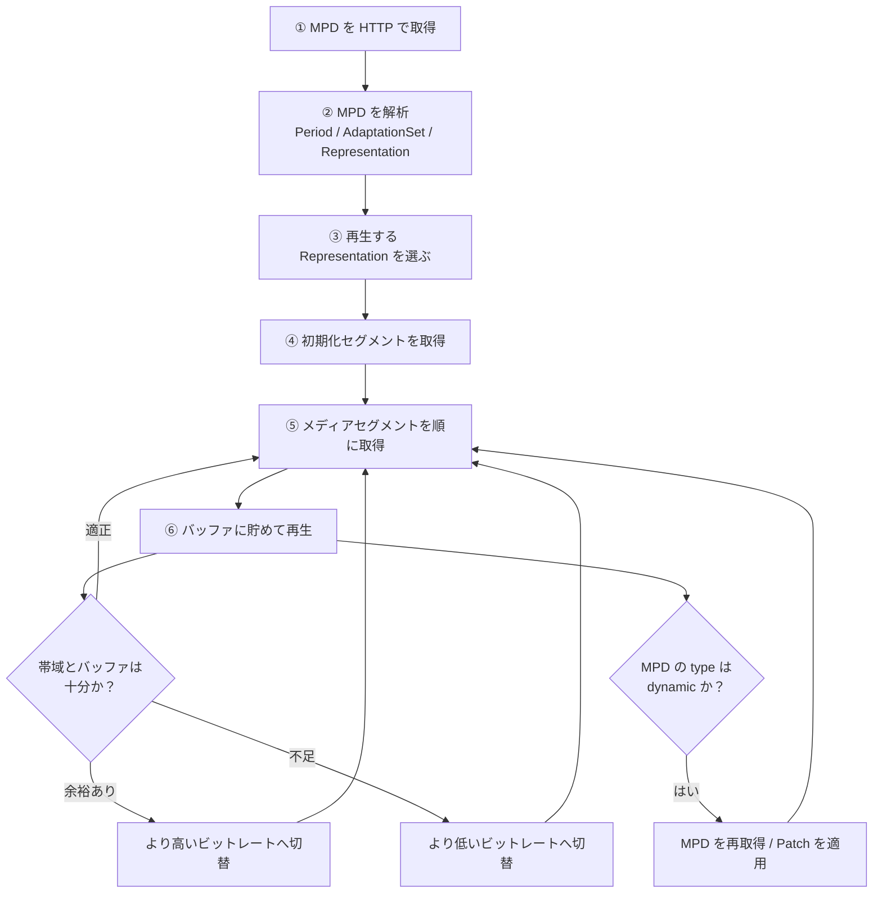
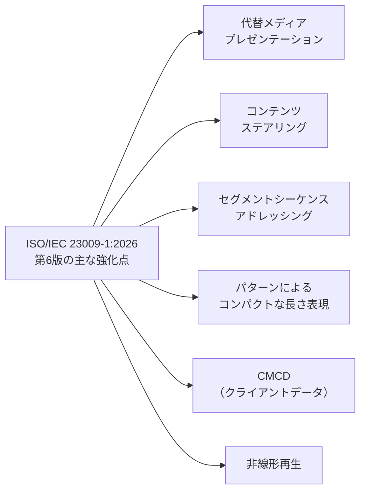
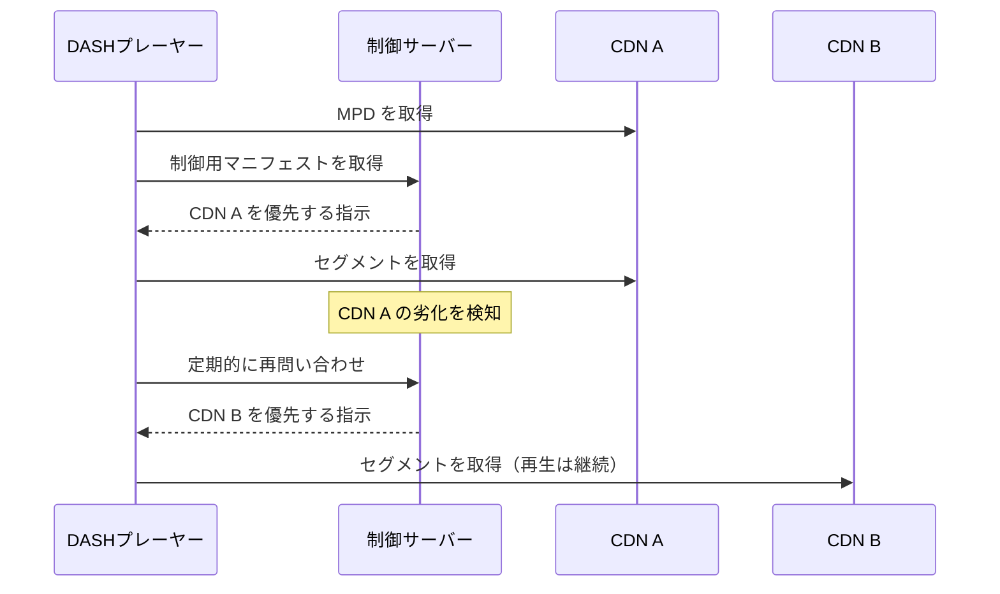

# ISO/IEC 23009-1:2026 初学者向け解説ガイド

**Dynamic adaptive streaming over HTTP（DASH）— Part 1: Media presentation description and segment formats（MPD とセグメント形式）**

> 一般に **MPEG-DASH** と呼ばれる、インターネット動画配信の中核となる国際規格の「第6版（Edition 6）」を、初学者向けにステップバイステップで解説します。
> 調査時点は **2026年10月8日** です。ウェブ検索で確認できた一次情報（ISO・MPEG公式）と、MPEG-DASH の編集者である Christian Timmerer 氏（Bitmovin / クラーゲンフルト大学）らの発信、Shaka Player・dash.js といった代表的な OSS の公開情報を根拠にしています。

---

## 目次

1. [このガイドの前提と読み方](#0-このガイドの前提と読み方)
2. [規格の基本情報（早見表）](#1-規格の基本情報早見表)
3. [Step 1：そもそも DASH とは何か](#step-1そもそも-dash-とは何か)
4. [Step 2：規格ファミリー（ISO/IEC 23009）の中での Part 1 の位置づけ](#step-2規格ファミリーisoiec-23009の中での-part-1-の位置づけ)
5. [Step 3：Part 1 が決めている 2 つのもの（MPD とセグメント）](#step-3part-1-が決めている-2-つのものmpd-とセグメント)
6. [Step 4：MPD の階層構造を理解する](#step-4mpd-の階層構造を理解する)
7. [Step 5：セグメントの場所を示す 4 つの方法（アドレッシング）](#step-5セグメントの場所を示す-4-つの方法アドレッシング)
8. [Step 6：オンデマンド（static）とライブ（dynamic）](#step-6オンデマンドstaticとライブdynamic)
9. [Step 7：プロファイルとは何か](#step-7プロファイルとは何か)
10. [Step 8：DASH クライアントの動き方](#step-8dash-クライアントの動き方)
11. [Step 9：版の歴史（第1版〜第6版）](#step-9版の歴史第1版第6版)
12. [Step 10：第6版（2026）の主な強化点](#step-10第6版2026の主な強化点)
13. [Step 11：発行後の動きと実装エコシステム](#step-11発行後の動きと実装エコシステム)
14. [Step 12：QA エンジニア視点のテスト観点](#step-12qa-エンジニア視点のテスト観点)
15. [用語集](#用語集)
16. [根拠となるソース一覧（URL）](#根拠となるソース一覧url)
17. [調査の限界と注意事項](#調査の限界と注意事項)

---

## 0. このガイドの前提と読み方

### 想定読者

- 動画配信や ABR（Adaptive Bitrate：適応ビットレート）を初めて学ぶソフトウェアエンジニア・QA エンジニア
- DASH の MPD（XML ファイル）を見たことはあるが、規格として何が決まっているのかを整理したい人

### 表記ルール

| 表記 | 意味 |
|---|---|
| **【根拠あり】** | 末尾のソース一覧にある公開情報で確認できた内容 |
| **【一般知識】** | DASH の基本的な仕組みとして広く知られている内容（今回の検索で個別に再確認していないもの） |
| **【筆者の解釈・提案】** | 公開情報をもとにした筆者の解釈や、実務上の提案（規格が定めている内容ではない） |

> **重要**：ISO/IEC 23009-1:2026 の本文（375ページ）は有償規格であり、本ガイドは本文を逐条で読んだものではありません。第6版の新機能は、MPEG 公式のプレスリリースと、規格編集者による会合レポートに基づいています。詳細は「[調査の限界と注意事項](#調査の限界と注意事項)」を必ず確認してください。

---

## 1. 規格の基本情報（早見表）

**【根拠あり】** ISO 公式ページ（<https://www.iso.org/standard/23009-1>）の掲載内容は次のとおりです。

| 項目 | 内容 |
|---|---|
| 規格番号 | ISO/IEC 23009-1:2026 |
| 正式名称 | Information technology — Dynamic adaptive streaming over HTTP (DASH) — Part 1: Media presentation description and segment formats |
| 版（Edition） | 第6版（Edition 6） |
| ステータス | Published（国際規格として発行済み、ステージ 60.60） |
| 発行年月 | 2026年7月 |
| ページ数 | 375 ページ |
| 担当委員会 | ISO/IEC JTC 1/SC 29（MPEG が属する分科委員会） |
| ICS | 35.040.40 |
| 置き換える規格 | ISO/IEC 23009-1:2022（第5版） |

> 補足：ISO の過去の掲示では「Under publication（発行準備中）、発行予定 2026年6月」と表示されていた時期があり、最終的に **2026年7月発行** となっています。

---

## Step 1：そもそも DASH とは何か

### 1-1. 解決したい課題

インターネットの回線速度は、利用者・場所・時間帯によって大きく変わります。固定の画質で動画を配信すると、遅い回線では止まり、速い回線では画質がもったいなくなります。

### 1-2. DASH の考え方

**【根拠あり】** MPEG 公式は、DASH を「既存の HTTP インフラ（サーバー、CDN、プロキシ、キャッシュなど）を使って、マルチメディアを効率よく簡単にストリーミングするための規格群」と説明しています。オンデマンドとライブの両方に対応し、MPEG-4 ファイル形式と MPEG-2 トランスポートストリームには特別な規定がありますが、任意のメディア形式で利用できます。

**【一般知識】** 仕組みの要点は次の3つです。

1. 同じ動画を **複数のビットレート（画質）** でエンコードしておく
2. 各画質を **数秒程度の小さなファイル（セグメント）** に分割して HTTP サーバーや CDN に置く
3. **クライアント（プレーヤー）が自分の回線状況を見て、次に取る画質を自分で選ぶ**

つまり「サーバーが賢い」のではなく **「クライアントが賢い」** 方式です。サーバー側は普通の HTTP ファイル配信だけで済むため、既存の CDN にそのまま載せられます。

### 1-3. 全体像



---

## Step 2：規格ファミリー（ISO/IEC 23009）の中での Part 1 の位置づけ

**【根拠あり】** MPEG 公式の DASH ページには、少なくとも次の Part が掲載されています。

| Part | 内容 | ひとことで言うと |
|---|---|---|
| **Part 1** | Media Presentation Description and Segment Formats | **本ガイドの対象。MPD とセグメントの形式を定義する中核** |
| Part 4 | Segment Encryption and Authentication | セグメントの暗号化と認証（メディア形式に依存しない） |
| Part 5 | Server and Network assisted DASH（SAND） | サーバー・ネットワーク支援の DASH |
| Part 6 | DASH with Server Push and WebSockets | サーバープッシュ、WebSocket との組み合わせ |
| Part 7 | Delivery of CMAF content with DASH | CMAF コンテンツを DASH で配信する方法 |

**【根拠あり】** また、Part 8（Session-based DASH）が FDIS（最終国際規格案）に進んだことが、Bitmovin のブログ（Timmerer 氏）で報告されています。

**【一般知識】** Part 2（適合性試験・参照ソフトウェア）と Part 3（実装ガイドライン）も存在します。MPEG 側の公式解説では、第1版の後に「参照ソフトウェアと適合性試験ツール、ガイドライン、追加の展開シナリオ向けの拡張」を含む6つの Part が追加されたと説明されています。

> **ポイント**：Part 1 を理解すれば、DASH の「データの形」の 9 割は理解できます。他の Part は「暗号化」「配信最適化」「CMAF との組み合わせ」といった追加の話題です。

---

## Step 3：Part 1 が決めている 2 つのもの（MPD とセグメント）

**【根拠あり】** ISO の抄録（第1版の説明）では、Part 1 が主に次の 2 つを定義するとされています。

### ① MPD（Media Presentation Description）

- **XML 形式** の文書
- 「どんなメディアが、どんな画質・言語で、どこにあるか」を説明する **目次** のようなもの
- セグメントの **HTTP-URL（バイト範囲を組み合わせることもある）** を伝える

### ② セグメント形式

- クライアントが送る HTTP リクエストの形式と、セグメントの中身の形式
- 具体的には **ISO Base Media File Format（ISO/IEC 14496-12）** ベースと **MPEG-2 TS（ISO/IEC 13818）** ベースの形式を記述

| 比較項目 | MPD | セグメント |
|---|---|---|
| 役割 | 目次・地図 | 本体（実際の映像・音声データ） |
| 形式 | XML | MP4 の断片（fMP4）など |
| 取得頻度 | 最初に1回（ライブでは更新のたびに） | 再生中ずっと連続的に |
| 例えるなら | 本の目次 | 本の各ページ |

---

## Step 4：MPD の階層構造を理解する

**【一般知識】** MPD は次の階層で構成されます。まずこの形を頭に入れてください。



### 各階層の意味

| 階層 | 意味 | 具体例 |
|---|---|---|
| **MPD** | 配信全体の説明書 | 1本の動画またはライブ番組 |
| **Period** | 時間軸上の区間 | 本編・広告・次の番組などの切れ目 |
| **AdaptationSet** | 切り替え可能な同種メディアの集合 | 映像、日本語音声、英語音声、字幕 |
| **Representation** | 同じ内容の 1 つの品質版 | 1080p/5Mbps、720p/3Mbps など |
| **Segment** | 実際に HTTP で取得する小さなファイル | 4 秒ごとの fMP4 断片 |

**【根拠あり】** 特許公報などに引用されている DASH の定義でも、Period は「メディアプレゼンテーションの区間」であり、すべての Period を連続して並べたものがメディアプレゼンテーション全体になる、と説明されています。

> **覚え方**：「Period（いつ）→ AdaptationSet（何を）→ Representation（どの画質で）→ Segment（どの断片か）」

---

## Step 5：セグメントの場所を示す 4 つの方法（アドレッシング）

**【一般知識】** MPD は、各セグメントの URL を決める方法をいくつか用意しています。代表的なものは次のとおりです。

| 方法 | 概要 | 向いている用途 |
|---|---|---|
| **BaseURL + SegmentBase** | 1 つの MP4 ファイルの中のバイト範囲（インデックス）で位置を示す | オンデマンド（単一ファイル） |
| **SegmentList** | セグメントの URL を MPD に列挙する | 小規模なオンデマンド |
| **SegmentTemplate（Number）** | `$Number$` を連番に置き換えて URL を作る | ライブ・オンデマンド |
| **SegmentTemplate + SegmentTimeline** | 各セグメントの開始時刻と長さを明示して URL を作る | 長さが不揃いなセグメント、ライブ |

### 5-1. オンデマンド向けの最小例（学習用に簡略化）

```xml
<?xml version="1.0" encoding="UTF-8"?>
<MPD xmlns="urn:mpeg:dash:schema:mpd:2011"
     type="static"
     mediaPresentationDuration="PT10M"
     minBufferTime="PT2S"
     profiles="urn:mpeg:dash:profile:isoff-on-demand:2011">
  <Period>
    <AdaptationSet contentType="video" mimeType="video/mp4" segmentAlignment="true">
      <Representation id="v1080" bandwidth="5000000" width="1920" height="1080" codecs="avc1.640028">
        <BaseURL>video_1080.mp4</BaseURL>
        <SegmentBase indexRange="800-1500"/>
      </Representation>
      <Representation id="v360" bandwidth="800000" width="640" height="360" codecs="avc1.64001e">
        <BaseURL>video_360.mp4</BaseURL>
        <SegmentBase indexRange="800-1500"/>
      </Representation>
    </AdaptationSet>
  </Period>
</MPD>
```

### 5-2. ライブ向けの最小例（SegmentTemplate + SegmentTimeline）

```xml
<MPD xmlns="urn:mpeg:dash:schema:mpd:2011"
     type="dynamic"
     availabilityStartTime="2026-10-08T00:00:00Z"
     minimumUpdatePeriod="PT2S"
     timeShiftBufferDepth="PT30S"
     minBufferTime="PT2S"
     profiles="urn:mpeg:dash:profile:isoff-live:2011">
  <Period id="1" start="PT0S">
    <AdaptationSet contentType="video" mimeType="video/mp4" segmentAlignment="true">
      <SegmentTemplate timescale="90000"
                       initialization="video_$RepresentationID$_init.mp4"
                       media="video_$RepresentationID$_$Time$.m4s">
        <SegmentTimeline>
          <S t="0" d="360000" r="9"/>
        </SegmentTimeline>
      </SegmentTemplate>
      <Representation id="v720" bandwidth="3000000" width="1280" height="720" codecs="avc1.64001f"/>
    </AdaptationSet>
  </Period>
</MPD>
```

**読み方**：`<S t="0" d="360000" r="9"/>` は、`timescale="90000"` のもとで「開始時刻 0、長さ 360000（= 4 秒）のセグメントを、最初の 1 個＋繰り返し 9 回（= 計 10 個）」という意味です。`$Time$` の部分に各セグメントの開始時刻が入って URL になります。

> ⚠️ **この例はライブ再生には使えません【筆者の注記】**：`availabilityStartTime` を固定日時にし、SegmentTimeline も 40 秒分（10 個）で止めた、構造を説明するための **有限の模式図** です。実際のライブ配信では、`availabilityStartTime` を実際のストリーム開始時刻に合わせ、パッケージャーが `minimumUpdatePeriod` ごとに MPD を更新して SegmentTimeline に新しいセグメントを追記し続け、`timeShiftBufferDepth` から外れた古いエントリを取り除きます。この例をそのままプレーヤーに読み込ませると、現在時刻が timeline の範囲外になり、取得できるセグメントがない状態になります。
>
> **第6版との関係**：後述するとおり、第6版では「SegmentTimeline で **セグメント長のパターン** を簡潔に表せる」ようになったと報告されています。MPD が長くなる問題（特にライブ）を減らす狙いです。

---

## Step 6：オンデマンド（static）とライブ（dynamic）

**【一般知識】** MPD のルート要素の `type` 属性で、2 つの動作モードが切り替わります。



| 比較項目 | static（オンデマンド） | dynamic（ライブ） |
|---|---|---|
| MPD の更新 | 基本的に不要 | 必要（または Patch で差分更新） |
| 総再生時間 | 決まっている | 決まっていない（無制限もある） |
| シーク | 全区間に可能 | `timeShiftBufferDepth` の範囲内 |
| 時刻同期 | ほぼ不要 | **重要**（クライアントとサーバーの時刻ずれが問題になる） |

**【根拠あり】** Bitmovin のブログ（Timmerer 氏）によると、第4版（2019）の第1アメンドメントで **DASH と CMAF の調和**、**イベントとタイムドメタデータのタイミング／処理モデル**、**XML Patch（IETF RFC 5261）を使った MPD の部分更新（MPD Patch）** などが整備されました。

---

## Step 7：プロファイルとは何か

**【一般知識】** DASH 規格は機能が非常に多いため、全機能をすべてのプレーヤーが実装するのは現実的ではありません。そこで **プロファイル（profile）** が「この MPD は、この機能の範囲だけを使っています」という宣言（`profiles` 属性）として使われます。

| プロファイル名（URN の例） | 概要 |
|---|---|
| `urn:mpeg:dash:profile:isoff-on-demand:2011` | ISO BMFF のオンデマンド向け |
| `urn:mpeg:dash:profile:isoff-live:2011` | ISO BMFF のライブ向け |
| `urn:mpeg:dash:profile:isoff-main:2011` | ISO BMFF の汎用 |

**【根拠あり】** 第4版の第1アメンドメントでは「CMAF 向けの DASH プロファイル」も追加されています（Bitmovin ブログ）。

> **QA のヒント**：実運用では、MPD の `profiles` 宣言と、実際に MPD が使っている機能（例：SegmentTimeline、MPD Patch など）が一致しているかが典型的な確認ポイントです【筆者の提案】。

---

## Step 8：DASH クライアントの動き方

**【一般知識】** プレーヤーは概ね次の順で動きます。



### ABR ロジックは規格の対象外

**【一般知識】** どのタイミングでどの画質に切り替えるか（ABR アルゴリズム）は **規格では定められておらず、プレーヤー実装の領域** です。規格が定めるのは「選べる選択肢とその取得方法（MPD とセグメント）」です。だからこそ、dash.js・Shaka Player など各実装で挙動が異なります。

---

## Step 9：版の歴史（第1版〜第6版）

| 版 | 年 | 補足 | 根拠 |
|---|---|---|---|
| 第1版 | 2012 | MPEG が 3GPP と協力して初版を策定。現在は Withdrawn（廃止） | ISO、Bitmovin |
| 第2版 | 2014 | 2014年5月と引用されている | 特許公報の引用 |
| 第3版 | 2017年頃 | 今回の検索では個別確認できていません | 【一般知識】 |
| 第4版 | 2019（12月） | CSA 規格の注記に「ISO/IEC 23009-1:2019, fourth edition, 2019-12」とある | CSA/ANSI |
| 第5版 | 2022 | 第4版への Amendment（Preroll 等）を統合した版。2023年時点で最新版 | Timmerer 氏 |
| **第6版** | **2026（7月）** | **本ガイドの対象。375ページ** | ISO |

**【根拠あり】** 第5版（ISO/IEC 23009-1:2022）が最新であった 2023年9月時点で、Timmerer 氏は次の3つのアメンドメントが進行中であると報告しています。

| Amendment | 内容 |
|---|---|
| AMD 1 | Preroll、非線形再生、その他の拡張 |
| AMD 2 | EDRAP（Extended Dependent Random Access Point）ストリーミングなど |
| AMD 3 | ランダムアクセスと切替のための Segment sequences（ライブの tune-in 時間短縮が狙い） |

また 2024年1月時点で、第6版は 2024年中の予定とされ、すべてのアメンドメントを含むとは限らない旨も述べられていました（実際の発行は 2026年7月）。

### 第6版に至るまでの流れ（MPEG 会合ベース）

| 時期 | MPEG 会合 | 出来事 |
|---|---|---|
| 2023年7〜8月 | 第143回 | 第6版のドラフトテキスト作成が進行 |
| 2024年1月 | 第145回 | CMCD の `sid`/`cid` を MPD URL 経由で渡せる、SegmentTimeline でのセグメント長パターン、バックグラウンド動作モードなどを採択 |
| 2024年5月 | 第146回 | DIS 段階のテキストの改善案 |
| 2025年1月 | 第148〜149回 | 第6版が **FDIS（最終国際規格案）** に昇格 |
| 2025年7月〜2026年5月 | 第151〜154回 | 第6版に対する AMD 1（メディア認証、CMCD 拡張など）の作業文書が継続 |
| 2026年7月 | — | ISO が **第6版を発行**（375ページ） |

---

## Step 10：第6版（2026）の主な強化点

**【根拠あり】** MPEG 公式の第149回会合プレスリリースが、第6版の主な強化点を次の6点で紹介しています。



| # | 強化点 | 何が嬉しいか（公式の説明） | 初学者向けの補足【筆者の解釈】 |
|---|---|---|---|
| 1 | **代替メディアプレゼンテーション** | メインのストリームと代替ストリームの間をシームレスに切り替えられる | 広告・差し替え素材・別アングルなどへの切替に使われる発想 |
| 2 | **コンテンツステアリング** | 複数の CDN をまたぐ配信を最適化するためのシグナリング | 「どの CDN から取るか」を配信側が誘導できる |
| 3 | **セグメントシーケンスのアドレッシング強化** | 低遅延配信と高速な tune-in（視聴開始）を改善 | ライブで再生開始までの待ち時間を短縮 |
| 4 | **パターンによるコンパクトな長さ表現** | MPD のオーバーヘッドを削減 | セグメント長が規則的なら「パターン」で短く書ける |
| 5 | **CMCD（Common Media Client Data）対応** | クライアント側の分析（アナリティクス）を改善 | プレーヤーの状態を CDN などへ伝える標準的な仕組み |
| 6 | **非線形再生** | インタラクティブなストーリーラインなど次世代のメディア体験に対応 | 分岐するストーリー、選択型コンテンツなど |

### 追加で確認できた採択内容（第145回会合・2024年1月）

**【根拠あり】** Timmerer 氏の会合レポートによると、後に第6版となる ISO/IEC 23009-1 に次の内容が採択されました。

| 内容 | 概要 |
|---|---|
| CMCD の `sid` / `cid` を MPD URL で渡せる | セッション ID・コンテンツ ID を MPD の取得 URL 経由で扱える |
| SegmentTimeline でのセグメント長パターン | 長さの繰り返しパターンを簡潔に記述 |
| **バックグラウンド動作モード** | プレーヤーが、メディアの復号や描画をせずに MPD 更新の受信とイベントのリスニングだけを行える |

### コンテンツステアリングの動き（概念図）

**【根拠あり】** DASH-IF のコンテンツステアリング仕様では、外部の「制御サーバー」が、再生開始時と再生中の両方で、プレーヤーが使う CDN を切り替えられます。Silhavy 氏・Pham 氏・Giladi 氏・Balk 氏・Begen 氏・Law 氏らの SMPTE 論文（dash.js での実装）がこの仕組みを解説しています。下図は、その考え方を学習用に単純化したものです【筆者による単純化】。



---

## Step 11：発行後の動きと実装エコシステム

### 11-1. 発行後も規格は進化している

**【根拠あり】** MPEG 公式の DASH Part 1 ページには、次の作業文書が掲載されています。

| MPEG 会合 | 日付 | 文書 |
|---|---|---|
| 第152回 | 2025-10-15 | 第6版 AMD 1「メディア認証、CMCD 拡張、その他の強化」の予備ドラフト |
| 第153回 | 2026-01-29 | 同 AMD 1 の作業原案（WD） |
| 第154回 | 2026-05-07 | 同 AMD 1 の作業原案（WD） |
| 各回 | — | 「Technologies under Consideration for DASH」（将来技術の候補集） |

つまり「第6版が出たら終わり」ではなく、**第6版に対する AMD 1 がすでに準備されています**。実務では「第6版 + 今後の AMD」を意識するのが安全です。

また、Timmerer 氏は 2024年1月に、触覚（haptics）のシグナリング、最大セグメントレートの通知、著作権ライセンス通知の拡張などが「Technologies under Consideration」に入っていると報告しています。

### 11-2. 代表的な実装での扱い

| 実装 | 提供元・位置づけ | 確認できた事実 |
|---|---|---|
| **dash.js** | DASH Industry Forum（DASH-IF）の参照実装 | MPD Patch、ギャップ処理、CMCD、CMAF 低遅延などをサポートしてきたと DASH-IF の資料に記載 |
| **Shaka Player** | Google 主導の OSS プレーヤー | API ドキュメントで **ISO/IEC 23009-1:2026 の Annex K（ServiceDescription）** や K.4.2.7.2（CMCD 報告のデスクリプタ）を参照して実装 |

**【根拠あり・要注意】** Shaka Player のドキュメントには、dash.js が受け入れる DASH-IF の別名スキーム `urn:dashif:cta-5004:2025` について「レジストリに項目がないため、あえて受け入れていない」という趣旨の記述があります。**同じ規格でも実装ごとに解釈や受け入れ範囲が異なる** ことの実例です。

**【二次情報】** 解説記事（Fora Soft）によれば、コンテンツステアリングは hls.js 1.4 以降、Shaka 4.6 以降、dash.js 4.7 以降で対応済みで、HLS と DASH で同じ形式の制御マニフェストを共有できるとされています。ただし二次情報のため、導入時は各プロジェクトの公式リリースノートで確認してください。

---

## Step 12：QA エンジニア視点のテスト観点

> この章は **【筆者の提案】** です。規格が定めるテスト項目ではなく、公開情報から導いた実務上のチェック観点です。

### 12-1. MPD そのものの検証

| 観点 | 確認内容 |
|---|---|
| スキーマ妥当性 | XML が MPD のスキーマに沿っているか |
| `profiles` 宣言の整合 | 宣言したプロファイルの範囲を超える機能を使っていないか |
| Period の連続性 | Period の境目で時間が欠落・重複していないか |
| セグメント URL | テンプレートから生成される URL が全て 200 で取得できるか |
| セグメント長の整合 | SegmentTimeline の合計と実ファイルの長さが一致するか |

### 12-2. 再生・ABR の検証

| 観点 | 確認内容 |
|---|---|
| 初期画質 | 起動直後の Representation 選択が妥当か |
| 帯域低下 | 帯域を制限したとき、リバッファを起こさず画質を下げるか |
| 帯域回復 | 回復後に画質が適切に戻るか（過度な振動がないか） |
| シーク | シーク後の再開時間は許容範囲か |
| 音声・字幕切替 | AdaptationSet の切替が映像と同期しているか |

### 12-3. ライブ特有の検証

| 観点 | 確認内容 |
|---|---|
| 時刻同期 | クライアント時刻がずれても、取得可能なセグメントを正しく計算できるか |
| MPD 更新 | `minimumUpdatePeriod` に沿って更新を取得できているか |
| 低遅延 | 目標レイテンシと再生レートの調整が機能しているか |
| DVR | `timeShiftBufferDepth` の範囲でシークできるか |

### 12-4. 第6版の新機能に関する検証（導入する場合）

| 機能 | 確認の例 |
|---|---|
| コンテンツステアリング | 制御サーバーの指示で CDN を切り替えても再生が途切れないか。制御サーバーが落ちたときの挙動は適切か |
| CMCD | 送信されるパラメータが仕様どおりか。個人情報にあたる値を含めていないか |
| 代替メディア・非線形再生 | メイン⇄代替の切替が滑らかか。戻り先が正しいか |
| バックグラウンドモード | 映像を描画しない間も MPD 更新・イベントを受信し続けるか |
| セグメント長パターン | パターンから復元した時刻が実ファイルと一致するか |

---

## 用語集

| 用語 | 意味 |
|---|---|
| ABR（Adaptive Bitrate） | 回線状況に合わせて画質（ビットレート）を切り替える方式 |
| MPD | Media Presentation Description。DASH の目次にあたる XML 文書 |
| Period | MPD 内の時間区間 |
| AdaptationSet | 切り替え可能な同種メディアの集合（映像、音声、字幕など） |
| Representation | AdaptationSet 内の 1 つの品質版 |
| Segment | HTTP で個別に取得するメディアの断片 |
| 初期化セグメント | 復号に必要な情報を持つ最初のセグメント |
| ISO BMFF | ISO Base Media File Format（ISO/IEC 14496-12）。MP4 の元になる形式 |
| CMAF | Common Media Application Format（ISO/IEC 23000-19）。HLS と DASH で共通のセグメントを使うための形式 |
| CDN | Content Delivery Network。コンテンツ配信網 |
| CMCD | Common Media Client Data（CTA-5004）。クライアントの状態を伝える標準 |
| コンテンツステアリング | 制御サーバーが、プレーヤーの使う CDN を誘導する仕組み |
| EDRAP | Extended Dependent Random Access Point。ランダムアクセスの符号化効率を高める仕組み（VVC で採用） |
| FDIS | Final Draft International Standard。国際規格として発行される直前の最終段階 |
| DASH-IF | DASH Industry Forum。DASH の相互運用性を推進する業界団体 |
| tune-in | 視聴開始（再生開始）の手続き・時間 |

---

## 根拠となるソース一覧（URL）

### A. 規格・標準化団体の一次情報

| # | 内容 | URL |
|---|---|---|
| A1 | ISO 公式：ISO/IEC 23009-1:2026（Edition 6、2026-07、375ページ、Published） | <https://www.iso.org/standard/23009-1> |
| A2 | ISO 公式：第6版の旧ページ（Under publication 時点の表示。ISO/IEC 23009-1:2022 を置換と記載） | <https://www.iso.org/standard/89027.html> |
| A3 | ISO 公式：第1版（2012、Withdrawn）。MPD・セグメントの概要抄録 | <https://www.iso.org/standard/57623.html> |
| A4 | MPEG 公式：第149回会合プレスリリース（第6版 FDIS、6つの強化点） | <https://www.mpeg.org/149th-meeting-of-mpeg/> |
| A5 | MPEG 公式：MPEG-DASH 概要（Part 1/4/5/6/7 の紹介） | <https://www.mpeg.org/standards/MPEG-DASH/> |
| A6 | MPEG 公式：DASH Part 1 の会合別文書一覧（第6版 AMD 1 の WD など） | <https://www.mpeg.org/standards/MPEG-DASH/1/> |

### B. 国際的な開発者・研究者の発信（規格編集者・業界団体・主要 OSS）

| # | 内容 | URL |
|---|---|---|
| B1 | Christian Timmerer 氏（Bitmovin / AAU）：第143回会合レポート（第5版と AMD 1〜3） | <https://records.sigmm.org/2023/09/05/mpeg-column-143rd-mpeg-meeting-in-geneva-switzerland/> |
| B2 | 同氏：第145回会合レポート（第6版に採択された内容：CMCD sid/cid、セグメント長パターン、バックグラウンドモード） | <https://records.sigmm.org/2024/02/22/mpeg-column-145th-mpeg-meeting-virtual-online/> |
| B3 | 同氏（Bitmovin ブログ）：第143回会合（EDRAP、Segment sequences） | <https://bitmovin.com/blog/143nd-mpeg-meeting-takeaways/> |
| B4 | 同氏（Bitmovin ブログ）：第144回会合（第6版の予定、触覚シグナリング） | <https://bitmovin.com/blog/144th-mpeg-meeting-takeaways/> |
| B5 | 同氏（Bitmovin ブログ）：第132回会合（DASH と CMAF の調和、MPD Patch） | <https://bitmovin.com/132nd-mpeg-meeting-takeaways/> |
| B6 | 同氏（Bitmovin ブログ）：第137回会合（MPEG の Emmy 受賞、DASH の概要） | <https://bitmovin.com/blog/137th-mpeg-meeting-takeaways/> |
| B7 | 同氏（Bitmovin ブログ）：第133回会合（Part 8 Session-based DASH が FDIS へ） | <https://bitmovin.com/133rd-mpeg-meeting-takeaways/> |
| B8 | MPEG 会合レポート（第149回、Research aspects 付き） | <https://multimediacommunication.blogspot.com/2025/03/mpeg-news-report-from-149th-meeting.html> |
| B9 | Silhavy 氏、Pham 氏、Giladi 氏、Balk 氏、Begen 氏、Law 氏：コンテンツステアリング（SMPTE Motion Imaging Journal, 2024-07） | <https://journal.smpte.org/periodicals/SMPTE%20Motion%20Imaging%20Journal/133/4/20/> |
| B10 | Shaka Player API ドキュメント：ServiceDescriptionParser（ISO/IEC 23009-1:2026 Annex K を参照） | <https://shaka-project.github.io/shaka-player/docs/api/shaka.dash.ServiceDescriptionParser.html> |
| B11 | DASH-IF：dash.js リポジトリ | <https://github.com/Dash-Industry-Forum/dash.js/> |
| B12 | DASH-IF：dash.js の概要資料（MPD Patch、CMCD、低遅延などの対応状況） | <https://github.com/Dash-Industry-Forum/dash.js/files/8989954/overview.pdf> |

### C. 二次情報（参考。導入判断は一次情報で再確認してください）

| # | 内容 | URL |
|---|---|---|
| C1 | Fora Soft：dash.js の解説（Shaka・hls.js との比較） | <https://www.forasoft.com/learn/video-streaming/articles-streaming/dash-js-deep-dive> |
| C2 | Fora Soft：コンテンツステアリング用語解説（対応プレーヤーのバージョン） | <https://www.forasoft.com/learn/video-streaming/glossary/terms-streaming/content-steering> |
| C3 | GlobalSpec：ISO/IEC 23009-1 の規格履歴（アメンドメント一覧） | <https://standards.globalspec.com/std/14555626/iso-iec-23009-1> |
| C4 | ANSI Webstore：CSA 版（第4版 2019-12 の採用規格） | <https://webstore.ansi.org/standards/csa/csaisoiec230092020> |

---

## 調査の限界と注意事項

| 項目 | 内容 |
|---|---|
| 規格本文の未確認 | ISO/IEC 23009-1:2026 の本文（375ページ）は有償のため、本ガイドは本文を直接確認していません。第6版の機能は MPEG 公式のプレスリリース・会合レポートに基づく概要レベルです |
| 第5版→第6版の差分 | 条項番号や正確な属性名・要素名（例：新しい要素の名称）は、本文または DASH-IF の仕様で確認してください |
| 第3版の年 | 今回の検索では確認できていません（表では「2017年頃」としています） |
| 実装の対応状況 | dash.js・Shaka Player 等の第6版機能への対応状況は、各プロジェクトの最新リリースノートで確認してください（Shaka が Annex K を参照している事実のみ確認） |
| 時点 | 情報は 2026年10月8日までに確認できた範囲です。第6版 AMD 1 は作業中のため、内容が変わる可能性があります |
| MPD 例 | Step 5 の XML は学習用に簡略化した例であり、そのまま本番配信に使える完全な MPD ではありません |

> **次のステップ**：本文を入手できる場合は、まず「MPD の意味論（要素・属性の表）」「セグメント情報（SegmentTemplate/SegmentTimeline）」「Annex K（ServiceDescription）」の順に読むと、本ガイドの Step 4〜10 と対応づけやすくなります。
