# ISO/IEC/IEEE 29119-1:2022 初学者向け解説ガイド

> **ソフトウェアおよびシステムエンジニアリング — ソフトウェアテスト — 第1部: 一般概念（General concepts）**
>
> 対象読者: テスト・QA の初学者 / 29119 シリーズを初めて読む人
> 情報の基準日: 2026年9月28日
> 図解ルール: フローチャートは Mermaid、表と構造化された説明は Markdown

---

## 0. はじめに（このガイドの読み方）

### 0.1 このガイドで分かること

| 知りたいこと | 対応する章 |
|---|---|
| 29119-1 は何の規格で、なぜ必要なのか | 1, 2 |
| 2013年版から何が変わったのか | 3 |
| 規格の中身（章立て）と読み順 | 4 |
| テストの基本概念（静的/動的、テストオラクル等） | 5 |
| リスクベースドテストとテスト戦略 | 6 |
| テストプロセス・文書・メトリクスの全体像 | 7 |
| テスト設計・実行の考え方（テストモデル、技法、探索的テスト等） | 8 |
| 現場での使い方、批判的な見解、学習ロードマップ | 9〜12 |

### 0.2 重要な注意（情報の確度について）

- 規格本文は ISO/IEEE の著作物で有料です。**本ガイドは、公開されている情報（ISO公式ページ、序文・目次・用語定義を含む公開プレビュー、規格策定関係者の公開記事など）をもとに、筆者の言葉で要約・再構成したもの**です。規格の条文の代替にはなりません。
- 公開プレビューで**本文を直接確認できた範囲**は「まえがき（改訂点）」「序文」「目次」「第3章 用語定義（冒頭部分）」です。第4章（概念）の各節は、**目次・序文の記述と 29119 シリーズ全体の知識**にもとづいて解説しています。正確な条文が必要な場合は、必ず正式な規格書を確認してください。
- 本ガイドの「例」「たとえ話」「サンプル」は理解のための筆者の作例であり、規格の記載ではありません。

---

## 1. 29119-1 とは何か（Step 1）

### 1.1 基本情報

| 項目 | 内容 |
|---|---|
| 規格番号 | ISO/IEC/IEEE 29119-1:2022 |
| 名称 | Software and systems engineering — Software testing — Part 1: General concepts |
| 版 | 第2版（Edition 2） |
| 発行 | 2022年2月（ISOステージ 60.60: 国際規格発行済み） |
| ページ数 | 47ページ |
| 担当委員会 | ISO/IEC JTC 1/SC 7（ソフトウェアおよびシステムエンジニアリング）＋ IEEE Computer Society |
| 前版 | ISO/IEC/IEEE 29119-1:2013（廃止） |
| ICS分類 | 35.080（ソフトウェア） |
| 種別 | **参考（informative）**: 適合を主張するための「要求事項」は含まない |

### 1.2 一言でいうと

**「ソフトウェアテストの共通の考え方と言葉を定める、29119 シリーズの入口となる規格」** です。

規格のスコープ（適用範囲）は非常に短く、次の趣旨です。

- ソフトウェアテストの一般概念を規定する
- 29119 シリーズ全体の鍵となる概念を示す

### 1.3 なぜ「共通の言葉」が必要なのか

テストの現場では、同じ言葉が人によって違う意味で使われがちです。

| よくある言葉 | 起こりがちな食い違い |
|---|---|
| 「テスト」 | 実行して確認することだけ？ レビューも含む？ |
| 「テストケース」 | 手順書のこと？ 入力と期待結果の組？ |
| 「バグ」「障害」「不具合」 | 原因？ 現象？ 報告書？ |
| 「回帰テスト」と「再テスト」 | 同じ？ 違う？ |

29119-1 は、こうした食い違いを減らすために、**用語（第3章）と概念（第4章）を整理**しています。

---

## 2. 29119 シリーズの中での位置づけ（Step 2）

### 2.1 全体像

29119-1 は「概念の土台」で、実際に「何をするか（プロセス）」「何を書くか（文書）」「どう設計するか（技法）」は他のパートが担当します。

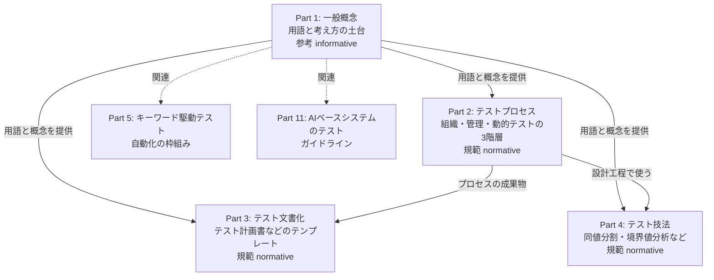

### 2.2 各パートの役割

| パート | 主題 | 一言でいうと | 適合性を主張できるか |
|---|---|---|---|
| 29119-1 | 一般概念 | 共通の言葉と考え方 | 主張対象の要求事項なし（参考） |
| 29119-2 | テストプロセス | 誰が・いつ・何をするか | できる（規範） |
| 29119-3 | テスト文書化 | 何を書き残すか | できる（規範） |
| 29119-4 | テスト技法 | どうテストを設計するか | できる（規範） |
| 29119-5 | キーワード駆動テスト | 自動化のための共通枠組み | パート内の規定に従う |
| 29119-11 | AIベースシステムのテスト | AI特有の論点 | ガイドライン |

> 序文には「29119-1 は参考（informative）であり、29119-2・3・4 は規範（normative）で、適合を主張したい人への要求事項を含む」旨が書かれています。

### 2.3 併用される他の規格

序文では、29119 シリーズは単独でも、より大きな規格群の一部としても使えるとされています。たとえば、ソフトウェアのライフサイクル定義に ISO/IEC/IEEE 12207（システム側は 15288）を使い、テストについては 29119 を参照する、という使い方です。

| 併用する規格 | 役割 |
|---|---|
| ISO/IEC/IEEE 12207 | ソフトウェアライフサイクルプロセス |
| ISO/IEC/IEEE 15288 | システムライフサイクルプロセス |
| ISO/IEC/IEEE 24765 | システム・ソフトウェア工学の用語集（SEVOCAB） |
| ISO/IEC 25010 | 製品品質モデル（品質特性の分類） |

---

## 3. 2013年版から何が変わったか（Step 3）

まえがきに列挙されている主な変更点は次のとおりです。

| # | 変更点 | 初学者向けの意味 |
|---|---|---|
| 1 | 他パートで扱わない用語定義を削除。**タイトルを「Concepts and definitions」から「General concepts」へ変更** | 「用語集」から「概念の解説書」へ性格が変わった |
| 2 | テスト概念の扱いをより簡潔にし、並べ替え | 読みやすく整理された |
| 3 | **テストサブプロセスの概念を削除**（複雑なため）。代わりに「テストプロセスのインスタンス化」の説明を追加 | プロセスをプロジェクトに合わせて当てはめる考え方が中心に |
| 4 | **テスト戦略に期待される内容を明確化** | 戦略に何を書くべきかが分かりやすくなった |
| 5 | **簡略化されたテスト設計プロセス**。テストケースは「テスト条件」ではなく「テストモデル」から導出 | 設計の流れがシンプルになった（8章で詳述） |
| 6 | **メトリクスと測定の説明を附属書から本文へ移動** | 測定が本編の重要事項になった |
| 7 | ライフサイクルモデルとテストの関係を説明していた附属書を削除 | 特定モデルに寄りすぎない方針 |
| 8 | **新附属書**: 各領域のシステムの特性と、関連するテストアプローチの例 | 「この種のシステムならこのテストを検討」の手がかり |

### 3.1 変更の流れ

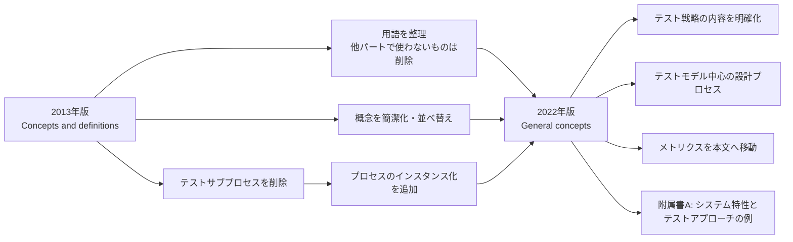

---

## 4. 規格の構成と読み順（Step 4）

### 4.1 章立て

| 章 | 内容 | 本ガイドの章 |
|---|---|---|
| 1 | 適用範囲（Scope） | 1 |
| 2 | 引用規格（この文書には規範的引用なし） | - |
| 3 | 用語と定義 | 付録A |
| 4.1 | ソフトウェアテストの概要 | 5 |
| 4.2 | テスト計画とテスト戦略 | 6 |
| 4.3 | テストフレームワーク | 7 |
| 4.4 | テスト設計と実行 | 8 |
| 4.5 | プロジェクトマネジメントとテスト | 9 |
| 4.6 | コミュニケーションと報告 | 9 |
| 4.7 | 欠陥とインシデントの管理 | 9 |
| 附属書A（参考） | システム特性とテスト（例） | 9 |
| 附属書B（参考） | テストの役割 | 9 |

### 4.2 初学者向けのおすすめ読み順

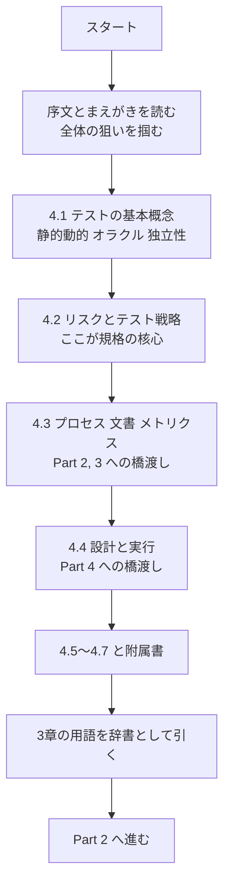

---

## 5. テストの基本概念（4.1）（Step 5）

### 5.1 概念マップ

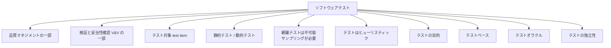

### 5.2 各概念の解説

#### (1) 品質マネジメントとの関係（4.1.2）

テストは、品質を「作る」活動そのものではなく、**品質の状態についての情報を得て、リスクを扱う活動**です。開発や品質保証など、組織の品質マネジメントの一部として位置づけられます。

#### (2) 検証（Verification）と妥当性確認（Validation）（4.1.3）

| 観点 | 検証 | 妥当性確認 |
|---|---|---|
| 問い | 仕様どおりに**正しく作れているか** | **正しいものを作ったか**（利用者のニーズに合うか） |
| たとえ話 | 設計図どおりに家が建ったか | 住む人が望む家になっているか |

テストは、このどちらにも使われます。

#### (3) テスト対象（Test item）（4.1.4）

テストされる「もの」のことです。プログラム全体だけでなく、コンポーネント、システム、ドキュメントなども含みます。用語定義でも「テスト対象」という言葉が繰り返し使われます。

#### (4) 静的テストと動的テスト（4.1.5）

| 種類 | 定義（要約） | 例 |
|---|---|---|
| **静的テスト** | 対象を**実行せずに**評価する | レビュー、静的解析、ドキュメントの点検 |
| **動的テスト** | 対象を**実行して**評価する（規格の定義：テスト対象を実行することで評価するテスト） | 画面操作、API呼び出し、自動テスト |

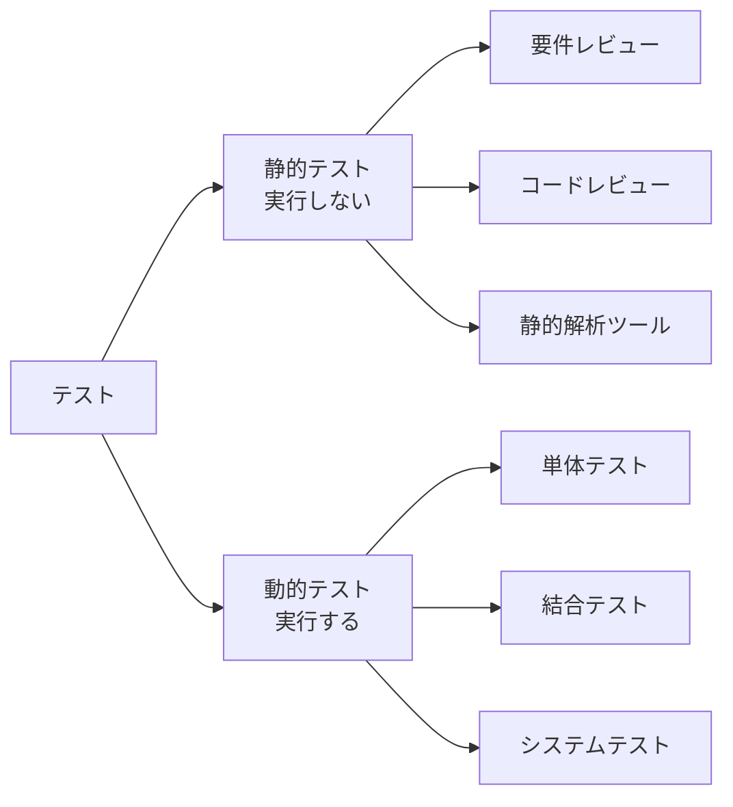

> 補足: 29119 シリーズのプロセス（Part 2）は動的テストの階層を中心に記述されています。公開情報では、静的テストを含めることについて作業部会内で合意が得られなかった経緯が言及されています。

#### (5) 網羅テストとサンプリング（4.1.6）

規格の用語定義では、**網羅テスト**（入力値と事前条件のすべての組合せをテストするアプローチ）に対し、「ほぼすべての現実的な状況で、テストの数が多すぎて不可能」と注記されています。

たとえば、たった 10 個の入力項目があり、それぞれ 10 通りの値を取り得るだけで 10 の 10 乗、つまり 100 億通りです。したがって、**限られたテストを賢く選ぶ（サンプリングする）**ことが必要になります。この「賢く選ぶ」ための考え方が、次章で説明するリスクベースドテストです。

#### (6) ヒューリスティックとしてのテスト（4.1.7）

テストは「バグがないことを証明する」ものではなく、**経験則にもとづく有限のサンプリングで、欠陥の存在や品質の状況を推定する手段**です。したがって、合格しても「欠陥ゼロ」の証明にはなりません。

#### (7) テストの目的（4.1.8）

テストの目的は複数あります（筆者の整理）。

| 目的 | 例 |
|---|---|
| 欠陥を見つける | 不具合を早期に検出する |
| 情報を提供する | リリース可否の判断材料を出す |
| 信頼を築く | 要求が満たされているという確信を得る |
| リスクを低減する | 重大な問題が残るリスクを減らす |

#### (8) テストベースとテストオラクル（4.1.9, 4.1.10）

| 用語 | 意味 | 例 |
|---|---|---|
| **テストベース** | テストを設計する際の**根拠となる情報** | 要件定義書、ユーザーストーリー、設計書、過去の障害情報 |
| **テストオラクル** | 期待結果を決める**判断の拠り所** | 仕様、既存システムの出力、計算式、専門家の判断 |

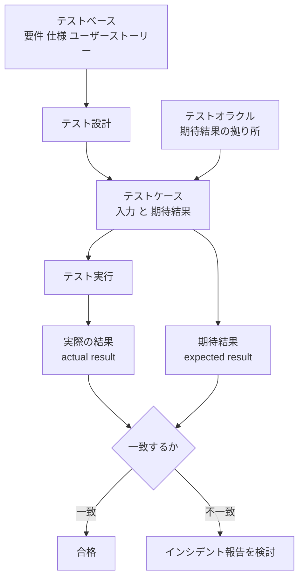

用語定義では、**期待結果**は「仕様やその他の情報源にもとづく、特定条件下でのテスト対象の観察可能な予測された振る舞い」、**実際の結果**は「テスト実行の結果として観察された、テスト対象やデータ・テスト環境の振る舞いや状態」と説明されています。

#### (9) テストの独立性（4.1.11）

「作った人」と「テストする人」が同じだと、思い込みで見落としが起きやすくなります。序文でも**テスト独立性のメリット**が導入されています。独立性には程度があります（筆者の整理）。

| 独立性の程度 | 例 |
|---|---|
| 低い | 開発者が自分のコードをテスト |
| 中 | 同じチームの別の人がテスト |
| 高い | 別組織・第三者がテスト |

---

## 6. テスト計画とテスト戦略（4.2）（Step 6）

### 6.1 ここが29119の核心: リスクベースドテスト

序文は、リスクベースドテストを「テスト戦略立案とテスト管理の**推奨アプローチ**であり、テストの優先順位づけと焦点の基礎になる」と説明しています。また「テストはソフトウェア開発におけるリスク対応の主要な手段」とも述べています。

規格策定作業部会（WG26）の議長 Stuart Reid 氏は、公開記事で「29119 シリーズはすべてのテストがリスクベースであることを求める」旨を述べています。

### 6.2 2種類のリスク

| 種類 | 定義（要約） | 例 |
|---|---|---|
| **プロダクトリスク** | 製品が機能・品質・構造の面で欠陥を持つリスク | 決済の二重請求、個人情報の漏えい |
| **プロジェクトリスク** | プロジェクトの管理に関するリスク（用語定義の例：人員不足、厳しい納期、要求の変更） | メンバーの離脱、納期短縮 |

### 6.3 リスクベースドテストの基本の流れ

Reid 氏の解説では、リスクの扱いは「特定・見積り・対応」の3段階で説明されています。

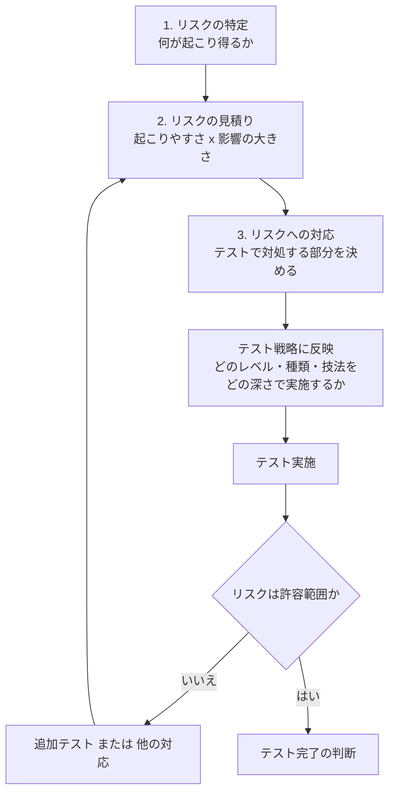

### 6.4 リスクの見積り例（筆者の作例）

| 機能 | 起こりやすさ | 影響 | 優先度 | 方針 |
|---|---|---|---|---|
| ログイン | 中 | 大 | 高 | 詳細に設計、自動化 |
| 決済 | 中 | 特大 | 最高 | 複数技法を組合せ、独立性を高める |
| プロフィール画像の変更 | 低 | 小 | 低 | 簡易な確認のみ |

### 6.5 テスト計画とテスト戦略の違い

| 項目 | テスト戦略 | テスト計画 |
|---|---|---|
| 主な問い | **どういう考え方・方針**でテストするか | **具体的に**いつ・誰が・何を・どこまでやるか |
| 性質 | 方針（アプローチ、優先度、技法の選択） | 実行計画（スケジュール、体制、環境、完了基準） |
| 関係 | 計画の土台になる | 戦略を具体化する |

### 6.6 テストアプローチ（4.2.4）

**テストアプローチ**とは、テストをどう進めるかの方針のことです。テストレベル、テストタイプ、テスト設計技法（およびその測定指標）は、この戦略の中に含まれる要素として説明されます。

#### テストレベル（一般的な例）

#### テストタイプ（用語定義に登場するものの例）

| テストタイプ | 何を評価するか |
|---|---|
| 性能テスト | 時間やリソースの制約の中で機能を果たす度合い |
| 負荷テスト | 低・通常・ピーク時の負荷での振る舞い |
| 互換性テスト | 他製品との共存や情報交換（相互運用性） |
| 保守性テスト | 修正のしやすさ |
| 移植性テスト | 別の環境へ移せる容易さ |
| アクセシビリティテスト | 多様な利用者が操作できる度合い |
| 手順テスト | 操作手順の指示が利用者の要求に合うか |

### 6.7 開発・保守ライフサイクルでのテスト（4.2.5）

2022年版では、ライフサイクルを説明していた附属書は削除されました。序文でも、オブジェクト指向、従来型、アジャイル、DevOps など多様な方法論のもとで使えることが強調されています。

| 開発スタイル | テストの考え方（筆者の整理） |
|---|---|
| ウォーターフォール / V字 | フェーズごとにレベル別のテストを計画 |
| アジャイル | 反復ごとに小さく回し、継続的に見直す |
| DevOps | 自動化と継続的テストでフィードバックを高速化 |
| 保守 | 変更影響の範囲を見極め、回帰テストを重視 |

### 6.8 領域とシステム特性（4.2.6）

システムの種類（IT、PC、組込み、モバイル、科学技術計算など）や特性によって、必要なテストは変わります。詳細は附属書Aで例示されます（9章）。

### 6.9 テスト戦略に含まれる内容（4.2.7）

2022年版では「戦略に期待される内容」が明確化されました。正確な項目は規格本文を参照してください。ここでは、序文と本文構成から読み取れる**戦略の主な構成要素**を整理します（筆者の整理であり、規格の項目リストそのものではありません）。

| 構成要素 | 内容 |
|---|---|
| リスクと優先順位 | 何を重点的にテストするか |
| テストレベル・テストタイプ | 何の観点で、どの範囲を見るか |
| テスト設計技法と測定指標 | どの技法で、どこまで網羅するか |
| 自動化・ツールの方針 | 何を自動化するか |
| テスト環境・データ | どこで、どのデータを使うか |
| 独立性 | 誰がテストするか |
| 完了基準 | どうなれば完了とするか（完了基準は用語定義にも登場） |

---

## 7. テストフレームワーク（4.3）（Step 7）

### 7.1 テストプロセス（4.3.1）: 3階層モデル

29119-2 で詳細が定められるテストプロセスモデルは、次の3階層で構成されます。序文でも「組織レベル、テスト管理レベル、動的テストレベル」を扱うと述べられています。

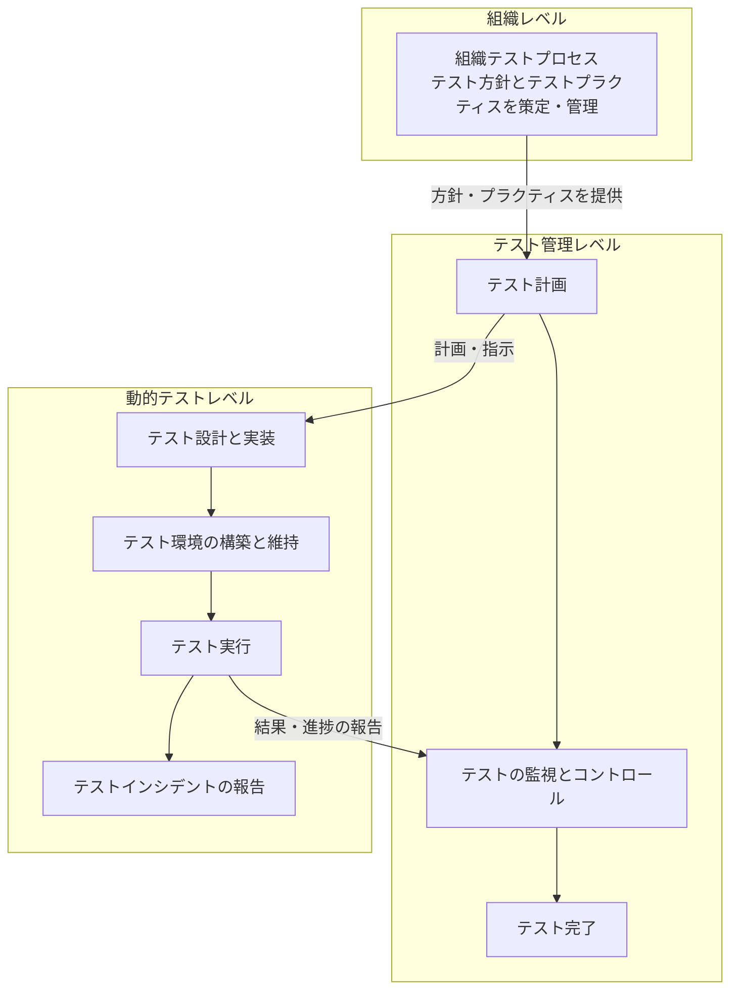

| 階層 | 目的 | 対応する文書（Part 3） |
|---|---|---|
| 組織 | 組織全体の共通ルール | 組織テスト方針、組織テストプラクティス |
| 管理 | プロジェクトのテストを計画・管理 | テスト計画書、進捗報告、完了報告 |
| 動的テスト | 実際にテストを設計・実行 | テスト設計仕様、テストケース、インシデント報告 |

#### 組織テスト仕様書の用語（第3章から）

| 用語 | 意味（要約） |
|---|---|
| 組織テスト方針 | 組織のテストに対する基本姿勢を示す |
| 組織テストプラクティス | 組織内で推奨されるテストの進め方・方法を詳細に記述したもの。組織テスト方針と整合させる |
| 組織テスト仕様書 | プロジェクト固有でない、組織向けのテスト情報の文書（上記2つが代表例） |

> 用語定義の注記では、組織テストプラクティスは、モバイルアプリ向けと安全重要システム向けのように、状況が大きく異なる場合は複数用意してよいとされています。

### 7.2 テストプロセスの「インスタンス化」

2022年版では、複雑さを理由にサブプロセスの概念を削除し、代わりに**プロセスのインスタンス化**の説明が追加されました。ここでの意味合いは次のとおりです（筆者の解釈）。

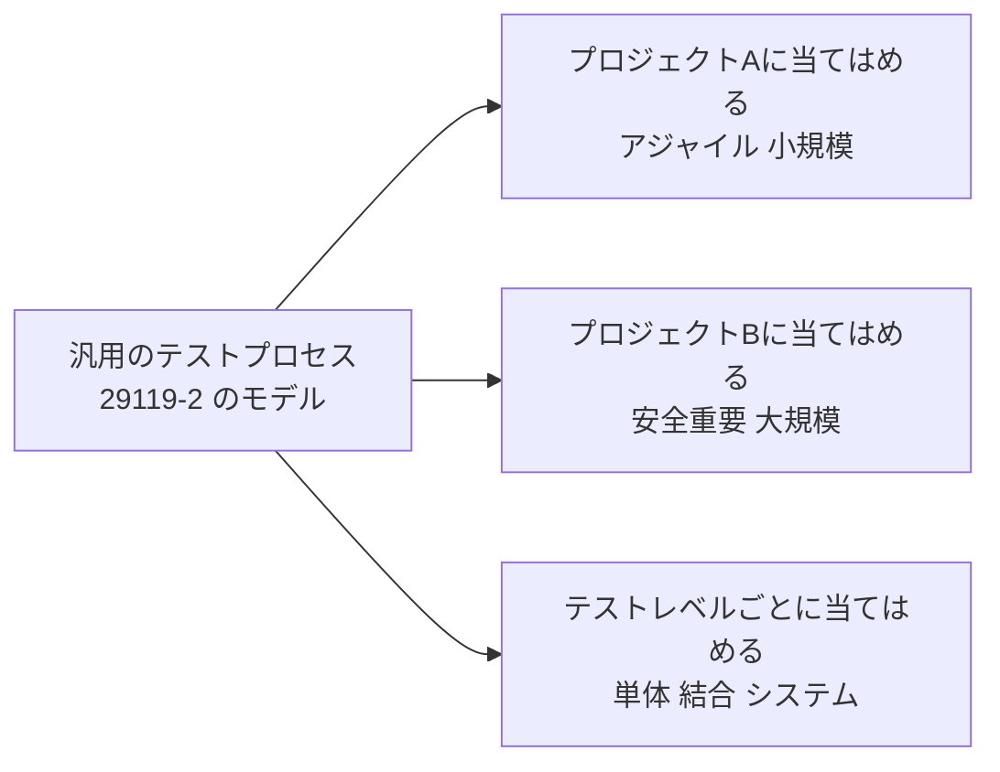

### 7.3 テスト文書化（4.3.2, 4.3.3）

テストで作る文書のテンプレートや例は Part 3 で定義されます。29119-1 では「どのような文書があるか」「文書化の要求は何で決まるか」という考え方を説明します。

### 7.4 構成管理とテスト（4.3.4）

テスト成果物（テストケース、データ、環境設定など）も版管理の対象です。「どの版のテスト対象を、どの版のテストで確認したか」を追跡できないと、結果の信頼性が損なわれます。

### 7.5 ツールによる支援（4.3.5）

| 支援対象 | ツール例（一般例） |
|---|---|
| テスト管理 | テスト管理ツール、課題管理ツール |
| テスト設計 | 組合せ生成ツール、モデリングツール |
| テスト実行 | テスト自動化フレームワーク、CI/CD |
| 分析 | カバレッジ測定、静的解析 |

### 7.6 プロセス改善とテスト（4.3.6）

テストプロセス自体も改善の対象です。序文でも「テストプロセス（および改善）」が言及されています。

### 7.7 テストメトリクス（4.3.7）

2022年版で、メトリクスは附属書から**本文へ移されました**。測定は、進捗の把握、品質の判断、改善の根拠に使われます。

| 種類 | 例（一般的な例） |
|---|---|
| 進捗 | 実施済みテスト数 / 計画数 |
| 品質 | 検出した欠陥数、重大度別の分布 |
| カバレッジ | ステートメントカバレッジ、ディシジョンカバレッジ、要件カバレッジ |
| 効率 | 1テストあたりの工数、自動化率 |

> 注意: 数字は「状況を考えるための材料」です。数値だけで品質を断定するのは危険です（12章で触れる批判的な見解も参照）。

---

## 8. テスト設計と実行（4.4）（Step 8）

### 8.1 2022年版の簡略化されたテスト設計プロセス

2013年版の「テスト条件」を中心とする流れから、**テストモデルを起点とする流れ**に簡略化されました。

Stuart Reid 氏が公開している論文（Test Design using Test Models）でも、テスト条件をやめて、より単純な「テストモデル」の概念から、テストカバレッジアイテム、そしてテストケースを導出する設計プロセスが説明されています。

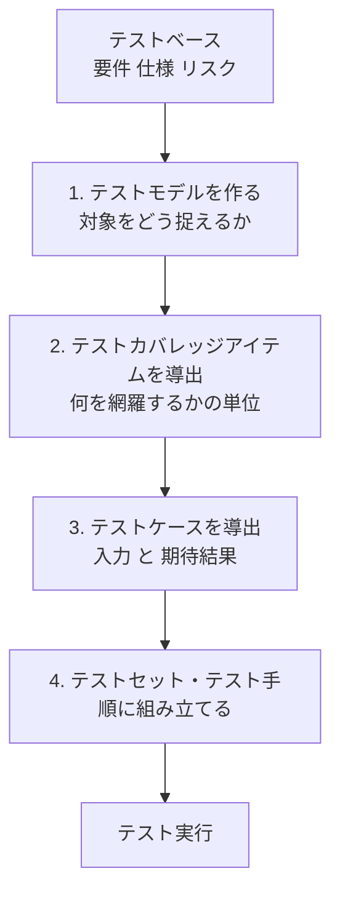

### 8.2 具体例で理解する（筆者の作例）

**題材**: 「年齢によって入場料金が決まる」機能

| 年齢の区分（テストモデル: 同値分割） | 料金 |
|---|---|
| 0〜5歳 | 無料 |
| 6〜12歳 | 子ども料金 |
| 13〜64歳 | 大人料金 |
| 65歳以上 | シニア料金 |

- **テストモデル**: 年齢を4つの区分に分けたモデル
- **テストカバレッジアイテム**: 4つの区分（同値パーティション）、さらに境界値（5と6、12と13、64と65）
- **テストケース**: 例）入力 5 → 期待結果「無料」、入力 6 → 「子ども料金」

### 8.3 テスト設計技法（4.4.4）

用語定義には、次の3系統の技法が出てきます。

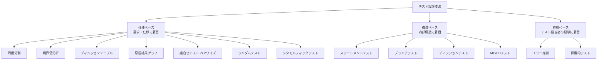

| 技法 | 定義（要約） | 初学者向けの一言 |
|---|---|---|
| 同値分割 | 同じように扱われる入力・出力のクラスから代表値を選ぶ | 似た入力をまとめて代表だけ試す |
| 境界値分析 | 同値クラスの境界を試す | 「以上・未満」の境目は間違えやすい |
| ディシジョンテーブル | 条件と結果の組（ルール）を表にして網羅 | 条件が複数絡む業務ルールに強い |
| 原因結果グラフ | 論理条件と結果の関係をグラフ化して網羅 | ディシジョンテーブルの前段の整理に使う |
| ペアワイズ | すべての「2つの入力項目の組合せ」を網羅 | 組合せ爆発を抑える定番手法 |
| ランダムテスト | ランダムに選んだ入力で実施 | 意外な入力を試す |
| メタモルフィックテスト | 既存テストと「入力を変えると出力がどう変わるか」の関係から新テストを作る | オラクルが作りにくいAI・科学計算で有用 |
| ブランチ/ディシジョンテスト | 制御フローの分岐結果を網羅 | if の真偽の両方を通す |
| MC/DCテスト | 個々の条件が単独で判定結果に影響することを示す | 安全重要領域で使われる厳密な基準 |
| エラー推測 | 過去の故障や故障モードの知識からテストを導出 | バグの傾向表（バグ分類）が役立つ |
| 探索的テスト | テストを同時進行で設計・実行し、直前の結果も活かす | 学びながらテストする |

> 各技法の詳細な手順は Part 4 で規定されます。

### 8.4 モデルベーステスト（4.4.2）

テストモデルを、状態遷移図や決定表のような**形式的・準形式的なモデル**として明確に表現し、そこからテストケースを（場合により自動で）導出するアプローチです。

### 8.5 スクリプト化テストと探索的テスト（4.4.3, 4.4.5）

| 観点 | スクリプト化テスト | 探索的テスト |
|---|---|---|
| 設計と実行 | **事前に**設計し、後で実行 | **同時に**進める |
| 強み | 再現性、監査しやすさ、自動化しやすい | 想定外の問題の発見、学習のスピード |
| 弱み | 事前想定にない問題に弱い | 記録や再現の工夫が必要 |
| 位置づけ | どちらか一方ではなく、**組み合わせて使う** | 同左 |

用語定義では、探索的テストは経験ベーステストの一種で、テスト担当者が既存の知識、それまでの探索結果、一般的なソフトウェアの振る舞いや故障に関する経験則にもとづき、その場でテストを設計・実行するものと説明されています。

### 8.6 再テストと回帰テスト（4.4.6）

| 種類 | 目的 | 例 |
|---|---|---|
| **再テスト** | **直した欠陥が本当に直ったか**を確認 | 不具合 #123 を修正 → 同じ手順でもう一度確認 |
| **回帰テスト** | **変更によって他が壊れていないか**を確認 | 修正後に周辺機能の既存テストを流す |

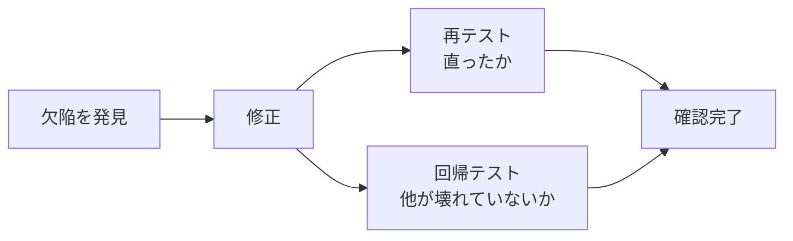

### 8.7 手動テストと自動テスト（4.4.7）

| 観点 | 手動テスト | 自動テスト |
|---|---|---|
| 実行主体 | 人が入力し結果を確認（用語定義） | ツール、ロボット、テスト実行エンジンが実施 |
| 向くもの | 探索、使い勝手、一度きりの確認 | 繰り返し実行、回帰、大量データ |
| 注意 | 属人化しやすい | 保守コストがかかる |

### 8.8 その他のテストアプローチ（4.4.8〜4.4.11）

| アプローチ | 説明（要約） |
|---|---|
| 継続的テスト | 開発の流れの中で継続的にテストしてフィードバックを得る |
| バックトゥバックテスト（差分テスト） | 別バージョンのシステムに同じ入力を与え、その結果を期待結果として比較する。別チーム開発、別言語実装、既存システムなどが使える |
| A/Bテスト（スプリットランテスト） | 2つのシステム・構成のどちらが優れるかを統計的に判定する |
| 数学的テスト・ファズテスト | 大量のランダム（またはほぼランダム）な入力で堅牢性を調べる。AI領域でも言及される |

### 8.9 AIに関する用語も追加されている

2022年版の第3章には、AI関連の用語（機械学習、ニューラルネットワーク、ニューロンカバレッジ、非決定的システム、自律システム、AIベースシステム等）が含まれます。

| 用語 | 意味（要約） |
|---|---|
| AIベースシステム | AIを実装する1つ以上のコンポーネントを含むシステム |
| 非決定的システム | 同じ入力・開始状態でも、常に同じ出力・最終状態になるとは限らないシステム |
| ニューロンカバレッジ | テストセットで活性化したニューロンの割合（活性化値が0を超えると活性化とみなす） |
| メタモルフィック関係 | テスト入力の変化が期待出力にどう影響するかの記述 |

### 8.10 テスト環境とテストデータ管理（4.4.12, 4.4.13）

| 項目 | ポイント |
|---|---|
| テスト環境 | 本番と差異がある場合、その差がリスクになる。構築・維持もテストプロセスの一部 |
| テストデータ | 準備、保護（個人情報の扱い）、再利用、リセットの管理が必要 |

---

## 9. 管理・報告・欠陥、附属書（4.5〜4.7、附属書A/B）

### 9.1 プロジェクトマネジメントとテスト（4.5）

テストはプロジェクトの一部です。スケジュール、コスト、体制、プロジェクトリスクと連動して管理します。

### 9.2 コミュニケーションと報告（4.6）

報告で重要なのは、「数字を並べる」ことより、**相手の意思決定に役立つ情報を、分かる言葉で伝える**ことです。

### 9.3 欠陥とインシデントの管理（4.7）

用語定義には次の区別があります。

| 用語 | 意味（要約） |
|---|---|
| インシデント | プロジェクト、製品、サービス、システムのライフサイクル中に起きる異常・予期しない出来事や状況 |
| インシデント報告 | インシデントの発生・性質・状態を記録した文書 |

> 注記: インシデント報告は、異常報告、バグ報告、欠陥報告、エラー報告、問題報告、トラブル報告などとも呼ばれます。

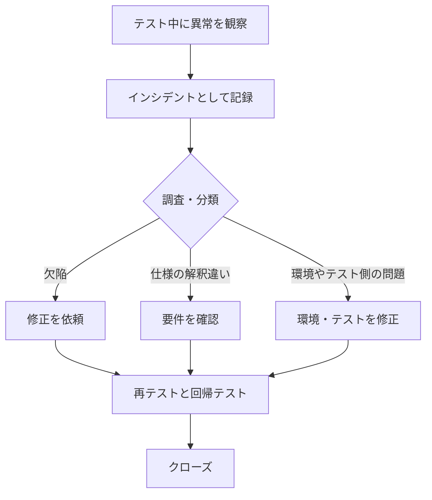

### 9.4 附属書A（参考）: システム特性とテスト

序文の説明では、附属書Aは**システムの特性**と、それに関連して**提案されるテストアプローチ**を簡潔に示します。テスト担当者が、対象システムにどの特性が当てはまるかを見極め、その特性に対応する専門的なテストを戦略に含めるべきかを検討する、という使い方です。

### 9.5 附属書B（参考）: テストの役割

序文の説明では、いくつかの汎用的なテストの役割と、その責任が簡潔に紹介されます。自社の職種名（QAエンジニア、SDET、テストリード等）と対応づけて読むとよいでしょう。

---

## 10. 適合性と「テーラリング」（Step 9）

### 10.1 29119-1 自体には適合要求はない

29119-1 は参考文書のため、「この規格に適合している」と主張するための要求事項はありません。適合性は、要求事項を含む Part 2, 3, 4 の各適合条項で定められます。

### 10.2 テーラード適合（Tailored conformance）

序文には、すべての要求に従わない正当な理由がある場合（たとえばアジャイルで開発・テストを行う場合）でも、**調整の程度とその根拠が記述され、合意されていれば「テーラード適合」を主張できる**旨が書かれています。

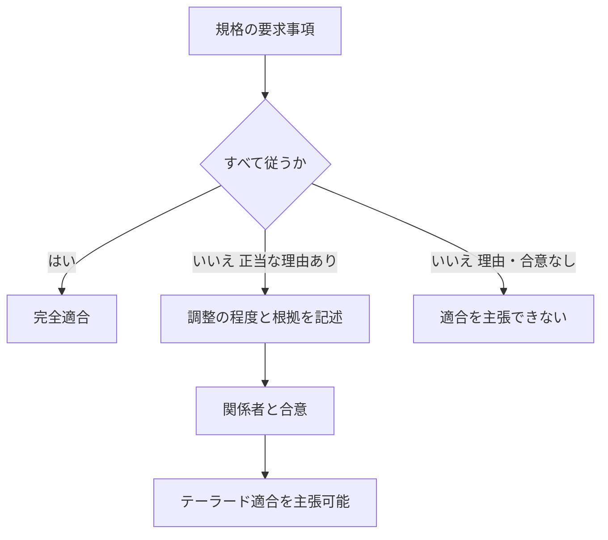

---

## 11. 現場での活用（Step 10）

### 11.1 使いどころ

| 場面 | 29119-1 の使い方 |
|---|---|
| チームの用語統一 | 用語集として共通認識をつくる |
| テスト戦略の作成 | リスクベースの考え方と戦略の構成要素を確認する |
| 新人教育 | 概念の全体像を教える教材にする |
| 監査・規制対応 | 自社プロセスの説明根拠にする |
| 認定資格の学習 | ISTQB 等の用語・概念との対応を確認する |

### 11.2 実務での最初の3ステップ（筆者の提案）

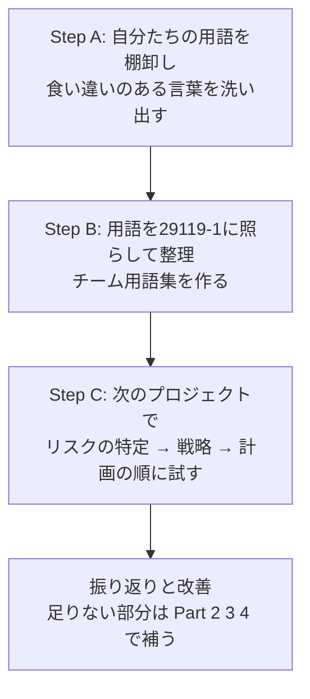

---

## 12. 議論と批判的な見解を知っておく（Step 11）

29119 シリーズには、テスト業界で**賛否の議論**があることも知っておくと、バランスよく学べます。

| 立場 | 主な主張 | 代表的な発信者・媒体 |
|---|---|---|
| 推進側 | 国際的に合意された共通の枠組みで、あらゆる組織・ライフサイクルで使える。リスクベースドテストを基礎に置く | Stuart Reid 氏（WG26 議長）、29119 公式情報サイト |
| 批判側 | プロセスや文書化に偏りがち。コンテキスト駆動の考え方と相性が悪い。標準化の進め方や、規格が有料であることへの疑問 | James Bach 氏、Michael Bolton 氏、James Christie 氏ら |

- 批判の代表例として、2014年に **Stop 29119** の運動が起こりました。
- 一方、序文は「テーラード適合」を認めており、規格が状況に応じた調整を前提としていることも読み取れます。

**初学者への助言**: どちらかを鵜呑みにせず、「規格は**共通言語とチェックリスト**として使い、**自分たちの状況に合わせて調整する**」姿勢が現実的です。

---

## 13. 学習ロードマップ

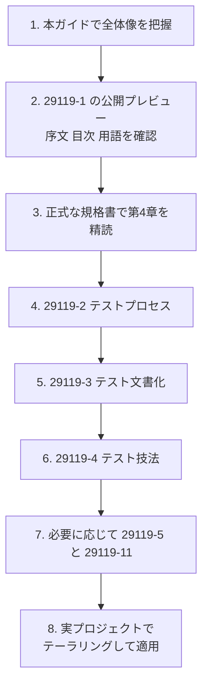

---

## 14. 理解度チェック

| # | 問題 | 答え |
|---|---|---|
| 1 | 29119-1 は規範（normative）と参考（informative）のどちらか | 参考（informative） |
| 2 | 2022年版で、タイトルはどう変わったか | Concepts and definitions → General concepts |
| 3 | 静的テストと動的テストの違いは | 実行しない / 実行する |
| 4 | 網羅テストが現実的でない理由は | 入力値と事前条件の組合せが膨大になるため |
| 5 | 規格が推奨するテスト戦略の考え方は | リスクベースドテスト |
| 6 | プロダクトリスクとプロジェクトリスクの違いは | 製品の欠陥のリスク / プロジェクト管理のリスク |
| 7 | 2022年版のテスト設計は何を起点にするか | テストモデル（テスト条件ではない） |
| 8 | 再テストと回帰テストの違いは | 修正の確認 / 副作用の確認 |
| 9 | 3階層のテストプロセスとは | 組織、テスト管理、動的テスト |
| 10 | 規格の一部の要求を満たせないときに使える考え方は | テーラード適合（調整の程度と根拠を記述し、合意する） |

---

## 付録A. 用語ミニ辞典（第3章から抜粋・要約）

| 用語 | 意味（要約） |
|---|---|
| 実際の結果 | 実行によって観察されたテスト対象・データ・環境の振る舞いや状態 |
| 期待結果 | 仕様等にもとづく、条件下で予測される観察可能な振る舞い |
| 完了基準 | テスト活動を完了とみなす条件 |
| 動的テスト | テスト対象を実行して評価するテスト |
| 網羅テスト | 入力値と事前条件のすべての組合せを試すアプローチ |
| 経験ベーステスト | テスト担当者の経験にもとづくテスト設計技法の総称 |
| 探索的テスト | その場で設計・実行する経験ベーステスト |
| インシデント | ライフサイクル中の異常・予期しない出来事 |
| キーワード駆動テスト | キーワードで組み立てたテストケースによるテスト |
| 手動テスト | 人が入力し結果を確認するテスト |
| プロダクトリスク | 製品に欠陥があるリスク |
| プロジェクトリスク | プロジェクトの管理に関するリスク |
| P-Vペア | テスト対象のパラメータと、その値の組合せ（カバレッジアイテム） |

---

## 付録B. 参考ソース（URL）

### B.1 一次情報（規格の公式情報）

| # | 資料 | URL | 確認できた内容 |
|---|---|---|---|
| 1 | ISO 公式ページ（規格の概要） | https://www.iso.org/standard/81291.html | 版、発行日、ステージ、ページ数、委員会、前版（2013年版は廃止）、要旨 |
| 2 | 公開プレビュー PDF（まえがき・序文・目次・用語定義） | https://cdn.standards.iteh.ai/samples/81291/6694557ff8304df8841bb191a00ecc6f/ISO-IEC-IEEE-29119-1-2022.pdf | 改訂点、序文、章立て、第3章の用語定義の冒頭部分 |
| 3 | 校正版（PRF）のサンプルPDF | https://cdn.standards.iteh.ai/samples/81291/2e08edad03eb48e882e398015d0120fa/ISO-IEC-IEEE-PRF-29119-1.pdf | 序文（リスクベースの位置づけ、規範/参考の区別） |
| 4 | BSI Knowledge（英国規格協会）の製品ページ | https://knowledge.bsigroup.com/products/software-and-systems-engineering-software-testing-general-concepts | 改訂点の要約 |

### B.2 規格策定関係者・国際的に著名な実務家・研究者の情報

| # | 資料 | URL | 参照した論点 |
|---|---|---|---|
| 5 | ISO/IEC/IEEE 29119 公式情報サイト: Risk-Based Testing for AI（Dr Stuart Reid, WG26 Convenor, 2024-11-03） | https://softwaretestingstandard.org/2024/11/03/risk-based-testing-for-ai/ | 29119 がリスクベースを求めること、ISTQB との関係 |
| 6 | 同サイト: Latest News（テストモデルによるテスト設計の論文への言及） | https://softwaretestingstandard.org/latest-news/ | 簡略化されたテスト設計プロセス |
| 7 | Stuart Reid: ISO 29119 Testing Standards | https://www.stureid.info/stuart-reid-software-testing/software-testing-white-papers/iso-29119-testing-standards/ | シリーズ構成、策定の背景 |
| 8 | Stuart Reid: Introduction to Risk-Based Testing | https://www.stureid.info/stuart-reid-software-testing/software-testing-white-papers/risk-based-testing-challenges/ | リスクベースドテストの位置づけ |
| 9 | Stuart Reid: Risk-Based Testing（ワークショップ） | https://www.stureid.info/stuart-reid-software-testing/software-testing-workshops-seminars/risk-based-testing/ | リスクの特定・見積り・対応の3段階 |
| 10 | arc42 Quality Model: ISO/IEC/IEEE 29119 | https://quality.arc42.org/standards/iso-iec-ieee-29119 | シリーズ構成の整理（アーキテクチャ分野の著名な開発者コミュニティ） |
| 11 | Wikipedia: ISO/IEC 29119 | https://en.wikipedia.org/wiki/ISO/IEC_29119 | 各パートの概要（補助的） |
| 12 | 論文: A taxonomy of risk-based testing（arXiv） | https://arxiv.org/pdf/1912.11519 | リスクベースドテストの学術的整理 |

### B.3 批判的な見解（コンテキスト駆動テストのコミュニティ）

| # | 資料 | URL | 参照した論点 |
|---|---|---|---|
| 13 | SD Times: The software testing schism | https://sdtimes.com/applause/software-testing-schism/ | James Bach 氏らの批判、標準化をめぐる対立 |
| 14 | Michael Bolton: Rising Against the Rent-Seekers | https://developsense.com/blog/2014/08/rising-against-the-rent-seekers | Stop 29119 運動の主張 |
| 15 | InfoWorld: Software testers balk at ISO 29119 standards proposal | https://www.infoworld.com/article/2181885/software-testers-balk-at-iso-29119-standards-proposal.html | 批判の概要（プロセスと文書化への偏重） |
| 16 | James Christie's Blog: Has opposition to ISO 29119 really died down? | https://clarotesting.wordpress.com/2018/07/21/has-opposition-to-iso-29119-really-died-down/ | その後の議論の推移 |

### B.4 情報の鮮度に関する注記

- ISO 公式ページ上、2026年9月28日時点でも本規格は「発行済み（Published）」で、第2版（2022年）が最新の版として案内されています。
- 第4章の条文の詳細、附属書A・Bの具体的な内容は、公開プレビューでは確認できません。**実務や試験・監査で厳密な記述が必要な場合は、ISO・IEEE 等の正規販売元から規格書を入手して確認してください。**
- 批判的見解に関する資料（B.3）は主に2014〜2018年のものです。2022年版の内容に対する評価は、その後の状況を各自でご確認ください。

---

*本ガイドは学習支援を目的として作成された解説資料です。規格の正式な内容は、ISO/IEC/IEEE 29119-1:2022 の正規版をご確認ください。*
