# ISO/IEC TR 29119-11:2020 初学者向けステップバイステップ解説

> **AIベースシステムのテストガイドライン** — Software and systems engineering — Software testing — Part 11: Guidelines on the testing of AI-based systems
>
> 調査基準日: 2026年10月4日 ／ 対象: ソフトウェアテスト初学者〜AIシステムのQA・開発担当者

---

## 目次

- [0. はじめに：この文書の読み方と情報の信頼度](#0-はじめにこの文書の読み方と情報の信頼度)
- [1. Step 1：規格の基本情報を押さえる](#1-step-1規格の基本情報を押さえる)
- [2. Step 2：なぜ「AI専用」のテスト規格が必要なのか](#2-step-2なぜai専用のテスト規格が必要なのか)
- [3. Step 3：用語「AIベースシステム」を正しく理解する](#3-step-3用語aiベースシステムを正しく理解する)
- [4. Step 4：規格全体の構成マップ](#4-step-4規格全体の構成マップ)
- [5. Step 5：AIテスト特有の課題（第6章）](#5-step-5aiテスト特有の課題第6章)
- [6. Step 6：最大の難関「テストオラクル問題」](#6-step-6最大の難関テストオラクル問題)
- [7. Step 7：ライフサイクル全体でのテスト（6.2）](#7-step-7ライフサイクル全体でのテスト62)
- [8. Step 8：ブラックボックステスト（第8章）](#8-step-8ブラックボックステスト第8章)
- [9. Step 9：ニューラルネットワークのホワイトボックステスト（第9章）](#9-step-9ニューラルネットワークのホワイトボックステスト第9章)
- [10. Step 10：テスト環境とテストシナリオ（第10章）](#10-step-10テスト環境とテストシナリオ第10章)
- [11. Step 11：安全関連AIと人間の価値との整合（4.3.2 / 5.2）](#11-step-11安全関連aiと人間の価値との整合432--52)
- [12. Step 12：実務で使える統合ワークフロー](#12-step-12実務で使える統合ワークフロー)
- [13. 関連規格・資格との関係](#13-関連規格資格との関係)
- [14. よくある誤解 Q&A](#14-よくある誤解-qa)
- [15. 学習ロードマップと演習](#15-学習ロードマップと演習)
- [16. 参考ソース一覧（URL）](#16-参考ソース一覧url)

---

## 0. はじめに：この文書の読み方と情報の信頼度

### 0.1 この文書のゴール

この文書を読み終えると、次の4つができるようになります。

1. ISO/IEC TR 29119-11 が「何を」「どこまで」書いている文書か説明できる
2. 従来のソフトウェアテストとAIテストの違いを、具体例つきで説明できる
3. テストオラクル問題と、その代表的な対処法（メタモルフィックテスト等）を実装レベルで理解できる
4. 自分のAIプロジェクトに当てはめて、テスト計画の骨子を作れる

### 0.2 重要な注意：規格本文は有償・著作権保護

ISO規格の本文は有償で、複製が許可されていません。そのためこの文書は、次の情報だけを根拠に構成しています。

| 区分 | 内容 | 表記 |
|---|---|---|
| 公開情報で確認済み | ISOの公式ページ、公式抄録、各国規格機関の目次プレビュー（章・節番号とタイトル） | ✅ |
| 一般知識・補足 | AIテスト分野で広く知られる手法や、著名研究者・企業の公開論文・記事に基づく解説 | 📘 |
| 要確認 | 規格本文を購入して確認しないと断定できない部分 | ⚠️ |

> **⚠️ 本文の逐語引用はしていません。** 規格の細部（節ごとの要求・表・図）を実務の根拠にする場合は、必ず正規版を入手して確認してください。この文書は「理解の地図」であり、規格本文の代替ではありません。

### 0.3 「TR」とは何か

`TR` は **Technical Report（技術報告書）** の略です。

| 種類 | 性格 | 「〜しなければならない」の強制力 |
|---|---|---|
| IS（International Standard） | 要求事項を定める | あり（適合性を主張できる） |
| **TR（Technical Report）** | **ガイダンス・情報提供** | **なし（認証の対象にならない）** |

つまり ISO/IEC TR 29119-11 は「これに適合しているか審査される規格」ではなく、**「AIをテストするときの考え方と選択肢を整理した手引き」** です。

---

## 1. Step 1：規格の基本情報を押さえる

### 1.1 基本情報（✅ ISO公式ページより）

| 項目 | 内容 |
|---|---|
| 規格番号 | ISO/IEC TR 29119-11:2020 |
| 正式名称 | Software and systems engineering — Software testing — Part 11: Guidelines on the testing of AI-based systems |
| 版 | Edition 1（第1版） |
| 発行年月 | 2020年11月（公開日は2020-11-27） |
| ページ数 | 52ページ |
| 担当委員会 | ISO/IEC JTC 1/SC 7（Software and systems engineering） |
| ICS分類 | 35.080（Software） |
| 言語 | 英語のみ |
| 現在のステージ | 90.60（Close of review）。2026-03-05に定期見直しが終了し、次の判断（改訂／確認／廃止）待ちの状態 |

### 1.2 ISO/IEC 29119 シリーズの中での位置づけ

ISO/IEC/IEEE 29119 は、ソフトウェアテストの国際規格シリーズです。第11部はその中の「AIテスト」担当です。

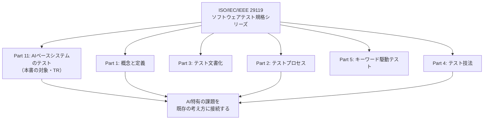

> 📘 従来のPart 1〜5（概念・プロセス・文書化・技法）が土台にあり、Part 11 は「それをAIにどう適用・拡張するか」を扱う、と捉えると理解しやすくなります。

### 1.3 ライフサイクル上の年表（✅ ISO公式ページより抜粋）

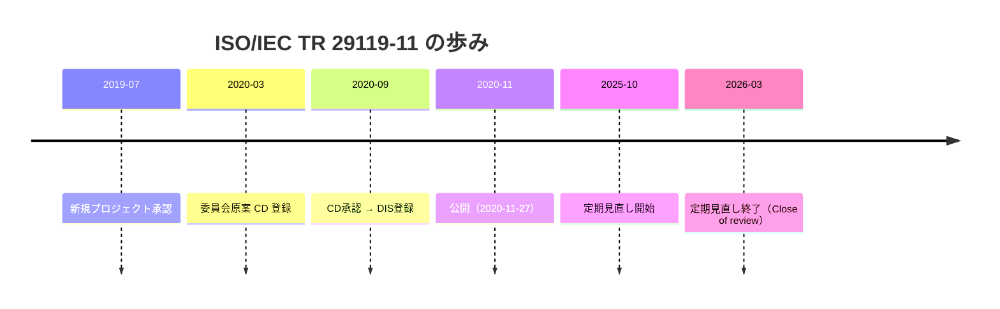

---

## 2. Step 2：なぜ「AI専用」のテスト規格が必要なのか

### 2.1 公式抄録が語る4つの特徴（✅）

ISOの抄録は、AIベースシステムを次のような特徴を持つものとして説明しています（要旨・言い換え）。

| 特徴 | 平易な言い換え | テストへの影響 |
|---|---|---|
| 複雑（例：ディープニューラルネット） | 内部が巨大で、人間が読んで理解できない | コードレビューや構造理解が効かない |
| ビッグデータに基づくことがある | 振る舞いが「コード」でなく「データ」で決まる | データ自体の品質がテスト対象になる |
| 仕様が曖昧なことがある | 「正解」を事前に厳密に書けない | 受入基準の設定が難しい |
| 非決定的なことがある | 同じ入力でも出力が変わりうる | 再現性のあるテストが書きにくい |

### 2.2 従来ソフトウェアとAIの違い（具体例）

「消費税を計算する関数」と「写真から犬か猫かを判定するモデル」で比べてみましょう。

| 観点 | 消費税計算（従来型） | 犬猫分類（AIベース） |
|---|---|---|
| 仕様 | `価格 × 1.10`（明確） | 「だいたい正しく判定する」（曖昧） |
| 期待値 | 1000円 → 1100円（一意に決まる） | ぼやけた写真の正解は人でも割れる |
| 振る舞いの決定要因 | プログラムコード | 学習データ＋学習アルゴリズム |
| 不具合の原因 | コードのバグ | データの偏り、ラベル誤り、分布のズレ |
| テストで「合格」と言える条件 | 全テストケース期待値一致 | 精度90%以上など**統計的な基準** |
| 運用開始後の変化 | コードを変えない限り不変 | 入力の傾向が変わると**劣化**する |

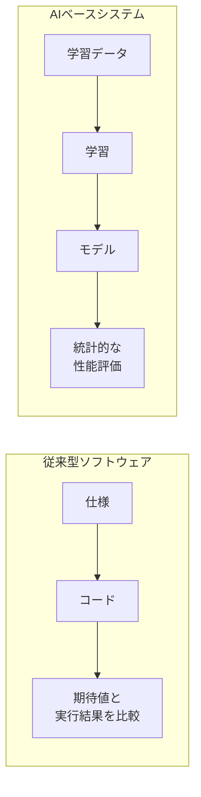

---

## 3. Step 3：用語「AIベースシステム」を正しく理解する

### 3.1 規格上の定義（✅）

規格は、**AIベースシステムを「少なくとも1つのAIコンポーネントを含むシステム」** と位置づけています。

ここが重要です。**システム全体がAIである必要はありません。**

| 例 | AIベースシステムか |
|---|---|
| 画像診断支援アプリ（推論モデル＋UI＋DB＋認証） | ✅ Yes（モデルが1つ入っている） |
| 電子カルテ（ルールベースのみ） | ❌ No |
| チャットボット（LLM＋検索＋ガードレール） | ✅ Yes |
| 通常のバッチ集計プログラム | ❌ No |

### 3.2 テスト対象の「粒度」を意識する

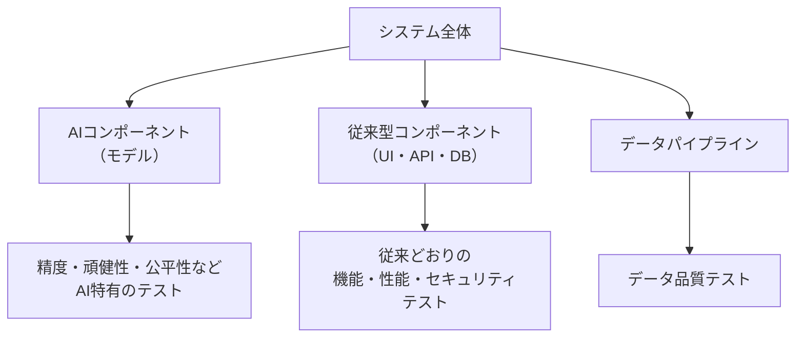

> 📘 実務の鉄則：**AIコンポーネント以外の部分は、これまでのテスト技法をそのまま使う。** AI特有のテストは「AI部分」に集中させる、という切り分けが重要です。

---

## 4. Step 4：規格全体の構成マップ

### 4.1 章構成（✅ 各国規格機関の目次プレビューより）

目次プレビューで確認できた章・節番号は次のとおりです。

| 章 | タイトル（原題） | 開始ページ | 確認状況 |
|---|---|---|---|
| 4 | Introduction to AI and testing | 11 | ✅ |
| 4.1 | Overview of AI and testing | 11 | ✅ |
| 4.3 | Testing of AI-based systems | 16 | ✅ |
| 4.3.1 | The importance of testing for AI-based systems | 16 | ✅ |
| 4.3.2 | Safety-related AI-based systems | 17 | ✅ |
| 5.2 | Aligning AI-based systems with human values | 23 | ✅ |
| 6 | Introduction to the testing of AI-based systems | 25 | ✅ |
| 6.1 | Challenges in testing AI-based systems | 25 | ✅ |
| 6.1.12 | The test oracle problem for AI-based systems | 27 | ✅ |
| 6.2 | Testing AI-based systems across the life cycle | 27 | ✅ |
| 7 | （目次スニペットでタイトル未確認） | — | ⚠️ |
| 8 | Black-box testing of AI-based systems | 31 | ✅ |
| 9 | White-box testing of neural networks | 34 | ✅ |
| 9.2 | Test coverage measures for neural networks | 36 | ✅ |
| 9.3 | Test effectiveness of the white-box measures | 37 | ✅ |
| 9.4 | White-box testing tools for neural networks | 37 | ✅ |
| 10 | Test environments for AI-based systems | 38 | ✅ |
| 10.1 | Test environments for AI-based systems | 38 | ✅ |
| 10.3 | Regulatory test scenarios and test environments | 39 | ✅ |

> ⚠️ 第1〜3章（序文・適用範囲・用語など）、第5章の他の節、第7章のタイトル、10.2 などは、取得できた目次情報からは確認できませんでした。

### 4.2 読む順序の推奨ルート

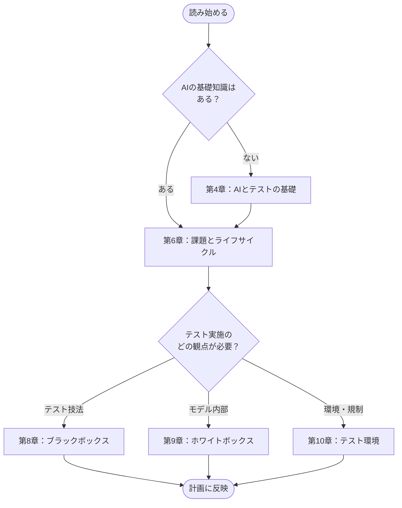

---

## 5. Step 5：AIテスト特有の課題（第6章）

### 5.1 公式情報で確認できること（✅）

ISOの抄録・各国機関の紹介文は、規格が次のような課題領域に対処するのを助ける、と説明しています。

- システムの仕様（specifications）
- テスト入力（test input）
- 自己学習システム（self-learning systems）
- 柔軟性と適応性（flexibility and adaptability）
- ほか

### 5.2 課題の全体像（📘 一般知識による整理）

AIテストの課題は、おおむね次のように整理できます。**節ごとの正確な見出しは規格本文で確認してください（⚠️）。**

| 課題カテゴリ | 何が難しいか | 具体例 |
|---|---|---|
| 仕様の曖昧さ | 期待する振る舞いを網羅的に書けない | 「自然な会話」をどう定義するか |
| 入力空間の広大さ | 画像・音声・文章はパターンが事実上無限 | 照明条件や角度の組み合わせ |
| 学習データ依存 | データの偏りがそのまま不具合になる | 特定の肌色で精度が落ちる顔認識 |
| 非決定性 | 同じ入力で出力が揺れる | 生成AIの回答、乱数を使う推論 |
| 自己学習・進化 | 運用中にモデルが変わりうる | オンライン学習で挙動が変化 |
| 透明性・説明可能性 | なぜその出力か人間が追えない | 診断理由を説明できない |
| バイアス・倫理 | 技術的には正しくても社会的に問題 | 採用AIの性別による不利益 |
| 副作用・目的の取り違え | 設計者の意図と違う方法で目標を達成 | 報酬を稼ぐために抜け道を使う |
| テストオラクル | 期待結果を決められない | → 次章で詳述（✅ 6.1.12） |

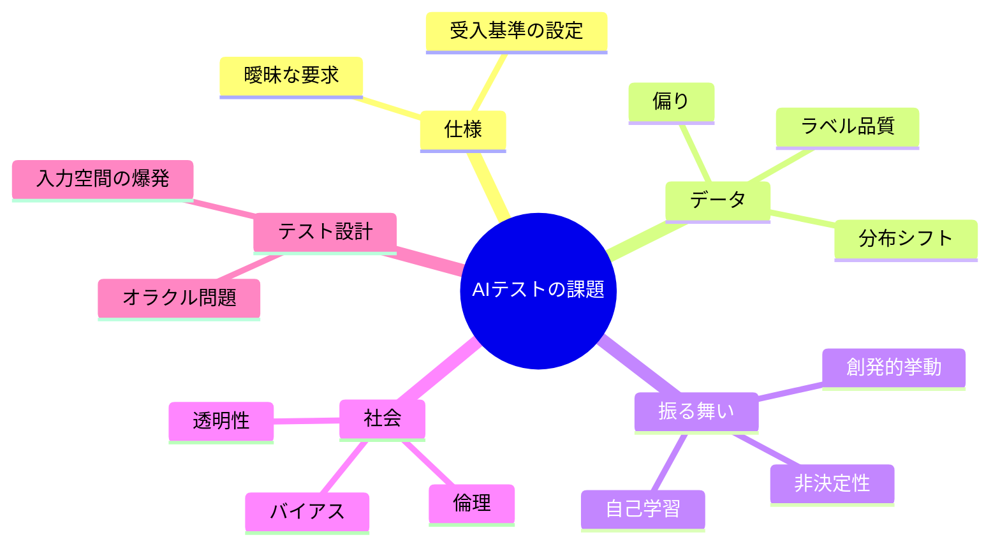

---

## 6. Step 6：最大の難関「テストオラクル問題」

### 6.1 定義（✅ ISO抄録）

ISOの抄録は、AIテストの**主要な課題**として **テストオラクル問題** を挙げています。内容は次のとおりです（言い換え）。

> テスターが「期待結果」を決めにくく、したがってテストが合格か不合格かを判定しにくい問題。

### 6.2 「オラクル」とは

**テストオラクル = テスト結果が正しいかを判定する根拠（正解の源）** のことです。

| テスト対象 | オラクルの例 |
|---|---|
| 消費税計算 | 手計算した正解、仕様書の計算式 |
| ソート関数 | 「出力が昇順になっている」という性質 |
| 犬猫分類モデル | **？**（ぼやけた写真の正解は？） |
| 翻訳AI | **？**（唯一の正解はない） |

### 6.3 なぜAIで特に深刻なのか

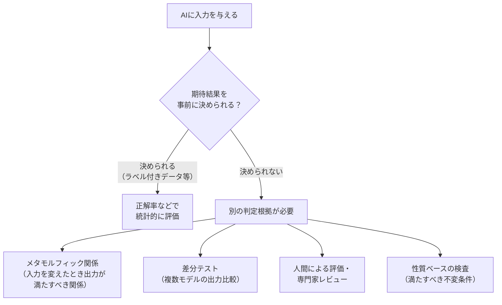

### 6.4 対処法の早見表（📘）

| 対処法 | 考え方 | 向いているケース |
|---|---|---|
| ラベル付きテストデータ | 人間が付けた正解と比較 | 分類・検出など |
| メタモルフィックテスト | 「入力をこう変えたら出力はこう変わるはず」という関係を検査 | 正解が不明でも関係は分かる場合 |
| 差分（バックツーバック）テスト | 複数の実装やモデルの出力を比較 | 比較対象のモデルがある |
| 性質ベース検査 | 出力が必ず満たすべき条件を検査 | 範囲・単調性・安全制約など |
| 人間の評価 | 専門家が採点 | 医療・翻訳・生成文章 |

> 📘 メタモルフィックテストは、もともと従来ソフトウェアのオラクル問題を緩和するためにChenらが提案した手法で、ML分野でも広く研究されています（出典：Zhang et al., "Machine Learning Testing: Survey, Landscapes and Horizons"）。

---

## 7. Step 7：ライフサイクル全体でのテスト（6.2）

### 7.1 規格が示す方向性（✅）

節タイトル「Testing AI-based systems across the life cycle」（6.2）と抄録から、規格は **開発の最後だけでなく、ライフサイクル全体でテストする** ことを求める立場だと読み取れます。

### 7.2 AIシステムのライフサイクルとテスト（📘）

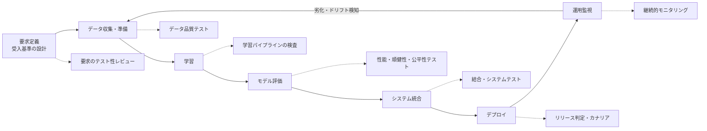

### 7.3 工程別テスト観点表（📘）

| 工程 | テストの観点 | 具体例 |
|---|---|---|
| 要求定義 | 受入基準が測定可能か | 「再現率95%以上、ただし誤検知は月X件以内」 |
| データ準備 | 欠損・重複・偏り・ラベル誤り・リーク | クラス比率の確認、訓練/テスト分割のリーク検査 |
| 学習 | 再現性・過学習・ハイパーパラメータ | 乱数シード固定、学習曲線の確認 |
| モデル評価 | 精度・頑健性・公平性・説明可能性 | 属性別の性能比較、ノイズ耐性 |
| 統合 | AI部と従来部の接続 | 入出力形式、タイムアウト、フォールバック |
| デプロイ | 本番環境での性能・互換性 | レイテンシ、メモリ、モデルのバージョン整合 |
| 運用 | 入力分布のズレ・性能劣化 | ドリフト検知、再学習のトリガー |

### 7.4 著名な実務フレームワークとの接続（📘）

規格の考え方を実装に落とすとき、次の2つの公開資料が非常に参考になります。

**① Google「ML Test Score」（Breck, Cai, Nielsen, Salib, Sculley）**
本番ML向けに **28個の具体的なテストとモニタリング項目** を提示し、**データ・モデル・MLインフラ・モニタリング** の4カテゴリに整理した採点ルーブリックです。

| カテゴリ | 狙い |
|---|---|
| データテスト | 入力データの前提・分布・品質を検査 |
| モデルテスト | 学習済みモデルの品質・頑健性を検査 |
| MLインフラテスト | 学習・配信パイプラインの再現性や信頼性 |
| モニタリングテスト | 運用中の劣化や変化の検知 |

**② Thoughtworks「CD4ML（Continuous Delivery for Machine Learning）」（Martin Fowlerのサイトで公開）**
コード・データ・モデルの3つを小さく安全な増分で、再現可能なまま、いつでもリリースできるようにする考え方です。パイプラインのトリガーは「コード変更」「モデル構造の変更」「学習・テストデータの変更」の3つです。データの変更は、データを追跡・バージョン管理している場合にパイプラインを起動できる点が、従来のCI/CDと異なります。

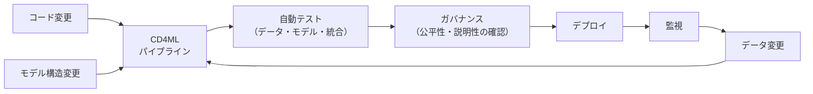

---

## 8. Step 8：ブラックボックステスト（第8章）

### 8.1 位置づけ（✅）

第8章「Black-box testing of AI-based systems」は、**内部構造を見ずに入出力だけで** AIベースシステムをテストする方法を扱います（抄録でも、一般的なAIベースシステムはブラックボックス手法でテストできると説明されています）。

> ⚠️ 第8章内の節構成は目次プレビューから取得できていません。以下の手法は、AIのブラックボックステストで一般に使われる代表例です（📘）。規格がどの手法をどの深さで扱うかは本文で確認してください。

### 8.2 代表的手法の整理（📘）

| 手法 | 一言説明 | オラクル問題への効き方 |
|---|---|---|
| 同値分割・境界値分析 | 入力を代表グループに分けて検査 | 従来と同じ（期待値が決まる場合） |
| 組合せテスト（ペアワイズ等） | 多数の入力パラメータの組合せを効率よく網羅 | 期待値は別途必要 |
| メタモルフィックテスト | 入力変換と出力関係を検査 | **強い**（正解不要） |
| 差分／バックツーバックテスト | 複数モデルの出力比較 | **強い**（比較対象が必要） |
| A/Bテスト | 本番で新旧を比較 | 実ユーザーの指標で判定 |
| 敵対的テスト | 微小な摂動で誤判定を誘発 | 頑健性を直接検査 |
| 探索的テスト | 経験に基づく自由な探索 | 人間の判断で補完 |

### 8.3 メタモルフィックテストを理解する

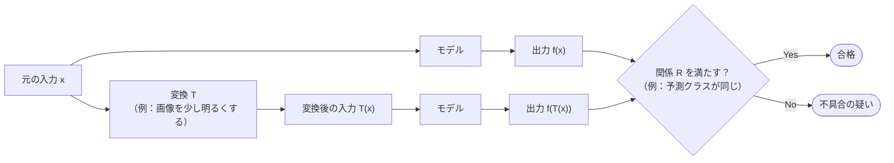

**ポイント：正解ラベルが一切不要** です。「明るさを少し変えても犬は犬のはず」という関係だけで検査できます。

### 8.4 実装例：scikit-learn による メタモルフィックテスト

```python
# test_metamorphic.py
# 実行: pip install scikit-learn pytest numpy && pytest -v test_metamorphic.py
import numpy as np
import pytest
from sklearn.datasets import load_iris
from sklearn.linear_model import LogisticRegression
from sklearn.model_selection import train_test_split


@pytest.fixture(scope="module")
def data():
    X, y = load_iris(return_X_y=True)
    return train_test_split(X, y, test_size=0.3, random_state=0, stratify=y)


def fit(X, y):
    # 再現性のため乱数固定・十分な反復回数を指定
    return LogisticRegression(max_iter=1000, random_state=0).fit(X, y)


def test_mr_train_order_invariance(data):
    """MR1: 学習データの並び順を変えても、予測はほぼ変わらないはず。"""
    X_tr, X_te, y_tr, _ = data
    base = fit(X_tr, y_tr).predict(X_te)

    rng = np.random.default_rng(42)
    idx = rng.permutation(len(X_tr))
    shuffled = fit(X_tr[idx], y_tr[idx]).predict(X_te)

    agreement = (base == shuffled).mean()
    # 数値誤差による境界付近のブレを許容し、一致率で判定する
    assert agreement >= (len(base) - 1) / len(base), f"一致率が低い: {agreement:.3f}"


def test_mr_feature_permutation(data):
    """MR2: 特徴量の列順を学習・推論で同じように入れ替えても、予測は変わらないはず。"""
    X_tr, X_te, y_tr, _ = data
    base = fit(X_tr, y_tr).predict(X_te)

    perm = [3, 1, 0, 2]
    permuted = fit(X_tr[:, perm], y_tr).predict(X_te[:, perm])

    assert (base == permuted).mean() >= 0.98


def test_mr_tiny_noise_robustness(data):
    """MR3: 測定誤差程度の微小ノイズでは、予測がほとんど変わらないはず。"""
    X_tr, X_te, y_tr, _ = data
    model = fit(X_tr, y_tr)
    base = model.predict(X_te)

    rng = np.random.default_rng(0)
    noisy = model.predict(X_te + rng.normal(0, 0.01, X_te.shape))

    assert (base == noisy).mean() >= 0.97
```

> 📘 しきい値（0.97〜0.98）は学習用の例です。実プロジェクトではリスクに応じて**受入基準として事前に合意**してください。

### 8.5 差分（バックツーバック）テストの考え方

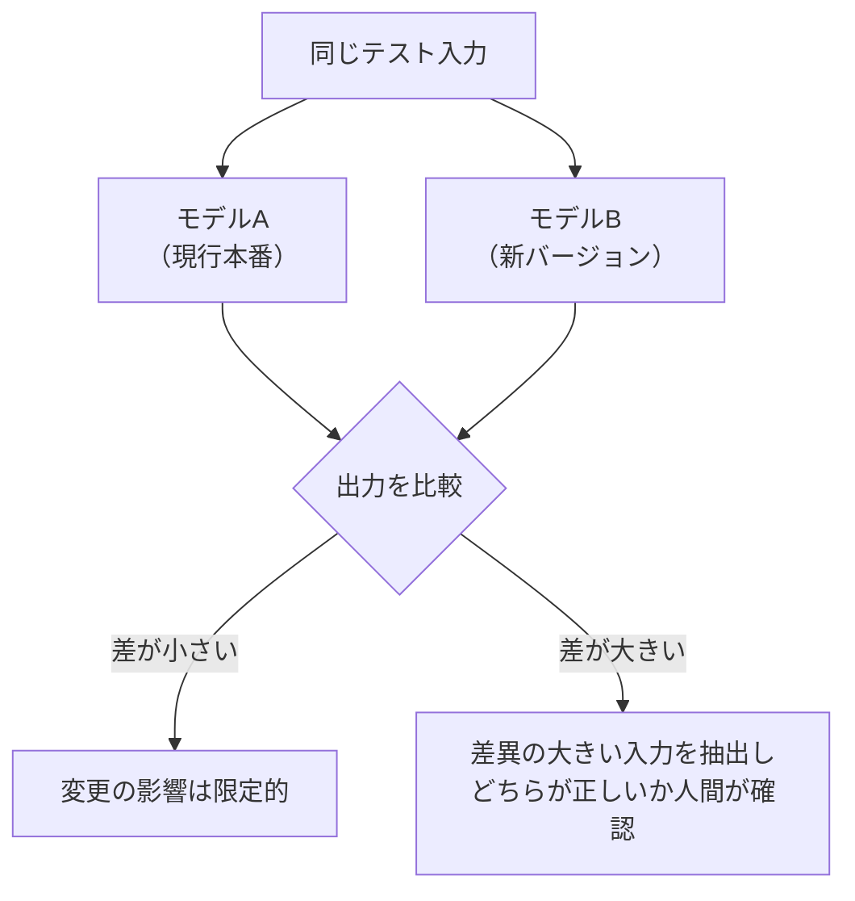

---

## 9. Step 9：ニューラルネットワークのホワイトボックステスト（第9章）

### 9.1 位置づけ（✅）

第9章「White-box testing of neural networks」は、**ニューラルネットワーク**の内部構造に着目したテストを扱います。抄録でも「ブラックボックスに加えて、ニューラルネットワーク向けのホワイトボックステストを紹介する」と説明されています。

確認できた節は次の3つです。

| 節 | タイトル | 意味合い |
|---|---|---|
| 9.2 | Test coverage measures for neural networks | NN向けのカバレッジ指標 |
| 9.3 | Test effectiveness of the white-box measures | それらの指標の有効性 |
| 9.4 | White-box testing tools for neural networks | 利用できるツール |

### 9.2 なぜ「コードカバレッジ」では足りないのか

従来のコードカバレッジは「プログラムのどの行を実行したか」を測ります。しかしNNでは、推論コード自体は**行列演算の繰り返し**で、1つの入力でほぼ100%実行されてしまいます。

この点を明快に示したのが **DeepXplore**（Pei, Cao, Yang, Jana ら、SOSP 2017）です。

| 発見 | 内容 |
|---|---|
| コードカバレッジ | テストした多くのDLシステムで、ランダムに選んだ1入力でも100%に達した |
| ニューロンカバレッジ | 同じ入力で10%未満だった |
| 結論 | コードカバレッジはDLのテストの網羅性を示さない。**ニューロンの活性化**を見る必要がある |

> 📘 DeepXplore は、ニューロンカバレッジの導入と、差分テストの組み合わせにより、自動運転やマルウェア検知などのDLモデルから多数のコーナーケース不具合を見つけたと報告しています。ニューロンカバレッジ自体は後続研究で批判的検討（相関が弱いという指摘など）も多く、**万能の指標ではありません**。

### 9.3 ニューロンカバレッジの考え方

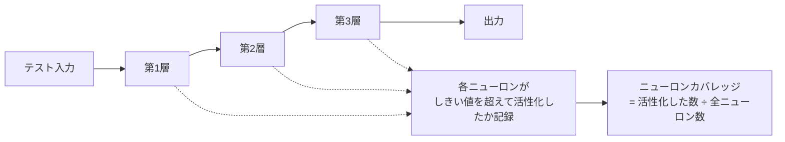

**定義（簡易版）**

```text
ニューロンカバレッジ = （テスト入力群で一度でも活性化したニューロン数） / （全ニューロン数）
```

### 9.4 実装例：PyTorch でニューロンカバレッジを測る

```python
# neuron_coverage.py
# 実行: pip install torch
import torch
import torch.nn as nn


class NeuronCoverage:
    """ReLU層の出力に forward hook を付け、しきい値を超えた要素を『活性化』とみなす。

    注意:
      - 畳み込み層では、空間位置ごとを1ニューロンとして数える簡易実装
        （DeepXplore原論文はチャネル単位の平均を使うなど定義が異なる）。
      - 目的は『考え方の理解』であり、研究用途ではツール実装を参照すること。
    """

    def __init__(self, model: nn.Module, threshold: float = 0.0, vector_axis: str = "batch"):
        # vector_axis: 1次元出力の解釈。"batch" は (batch,) のスカラー出力列、"neurons" は1サンプル分の (neurons,)
        if vector_axis not in ("batch", "neurons"):
            raise ValueError(f"vector_axis は 'batch' か 'neurons' を指定する: {vector_axis!r}")
        self.threshold = threshold
        self.vector_axis = vector_axis
        self.activated: dict[str, torch.Tensor] = {}
        self.shapes: dict[str, torch.Size] = {}                    # 層ごとのバッチ次元以外の形状
        self.handles = []
        for name, module in model.named_modules():
            if isinstance(module, nn.ReLU):
                self.handles.append(module.register_forward_hook(self._make_hook(name)))

    def _make_hook(self, name: str):
        def hook(module, inputs, output):
            out = output.detach()
            if out.dim() == 0:                                     # スカラー出力は1件・1ニューロンとして扱う
                out = out.reshape(1, 1)
            elif out.dim() == 1:                                   # 1次元出力は vector_axis に従って解釈する
                if self.vector_axis == "batch":
                    out = out.unsqueeze(1)                         # (batch,) → 1サンプル1ニューロンの (batch, 1)
                else:
                    out = out.unsqueeze(0)                         # (neurons,) → 1サンプル分の (1, neurons)
            shape = out.shape[1:]
            expected = self.shapes.setdefault(name, shape)         # 初回呼び出し時の形状を記録
            if shape != expected:                                  # 集計前に形状の一致を検証
                raise ValueError(
                    f"{name}: 出力形状が初回 {tuple(expected)} と異なる {tuple(shape)}"
                )
            flat = out.flatten(start_dim=1)                        # (batch, neurons)
            hit = (flat > self.threshold).any(dim=0)               # バッチ内で一度でも活性化
            prev = self.activated.get(name)
            self.activated[name] = hit if prev is None else (prev | hit)
        return hook

    def coverage(self) -> float:
        total = sum(v.numel() for v in self.activated.values())
        covered = sum(int(v.sum()) for v in self.activated.values())
        return covered / total if total else 0.0

    def close(self):
        for h in self.handles:
            h.remove()


if __name__ == "__main__":
    torch.manual_seed(0)
    model = nn.Sequential(
        nn.Linear(10, 32), nn.ReLU(),
        nn.Linear(32, 16), nn.ReLU(),
        nn.Linear(16, 3),
    ).eval()

    nc = NeuronCoverage(model, threshold=0.0)
    with torch.no_grad():
        for n in (1, 10, 100, 1000):
            model(torch.randn(n, 10))
            print(f"入力 {n:>4} 件追加後のカバレッジ: {nc.coverage():.1%}")
    nc.close()
```

### 9.5 ホワイトボックスの注意点

| 注意点 | 説明 |
|---|---|
| 高カバレッジ ≠ 高品質 | 活性化しただけで、その出力が正しいとは限らない |
| 定義が複数ある | しきい値、層、チャネル平均などで数値が変わる |
| 補助的に使う | ブラックボックステストの**網羅性の目安**として併用する |
| 計算コスト | 大規模モデルでは測定自体が重い |

---

## 10. Step 10：テスト環境とテストシナリオ（第10章）

### 10.1 位置づけ（✅）

抄録は、AIベースシステムの**テスト環境とテストシナリオの選択肢**を説明すると述べています。確認できた節は次のとおりです。

| 節 | タイトル |
|---|---|
| 10.1 | Test environments for AI-based systems |
| 10.3 | Regulatory test scenarios and test environments（規制に関するテストシナリオと環境） |

> ⚠️ 10.2 のタイトルは取得できた目次からは確認できませんでした。

### 10.2 テスト環境の選択肢（📘 一般的な整理）

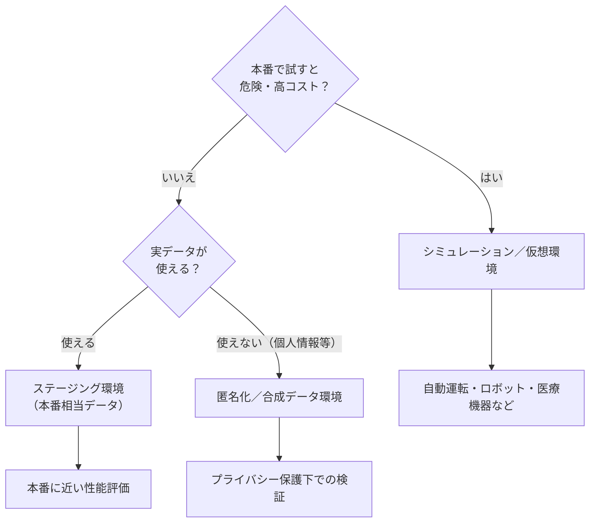

| 環境 | 長所 | 短所 | 向く場面 |
|---|---|---|---|
| シミュレーション／仮想環境 | 危険なシナリオを安全・大量に試せる | 現実との差（リアリティギャップ） | 自動運転、ロボット |
| ステージング環境 | 本番に近い条件 | 構築・運用コスト | 一般的な業務AI |
| 合成・匿名化データ | 個人情報を保護できる | 実データの分布を再現しきれない場合がある | 医療・金融 |
| 本番の限定公開（カナリア等） | 現実の入力で評価できる | 失敗の影響が実ユーザーに及ぶ | 影響が小さい段階的展開 |

### 10.3 規制対応テスト（✅ 節の存在のみ確認）

10.3「Regulatory test scenarios and test environments」は、**規制当局が求めるようなテストシナリオと環境**を扱う節と読み取れます。

> ⚠️ 具体的内容は本文確認が必要です。📘 一般論としては、安全関連分野ではあらかじめ定義した標準シナリオ群での検証や、監査可能な環境・記録の整備が求められる傾向があります。

---

## 11. Step 11：安全関連AIと人間の価値との整合（4.3.2 / 5.2）

### 11.1 確認できること（✅）

| 節 | タイトル |
|---|---|
| 4.3.2 | Safety-related AI-based systems（安全関連のAIベースシステム） |
| 5.2 | Aligning AI-based systems with human values（人間の価値とのAIの整合） |

### 11.2 なぜテスト規格に「価値の整合」が出てくるのか（📘）

AIは「仕様どおりに動いたのに、人間の意図に反する」ことが起こりえます。テストは技術的な正しさだけでなく、**意図・倫理・社会的許容**を検査する必要が出てきます。

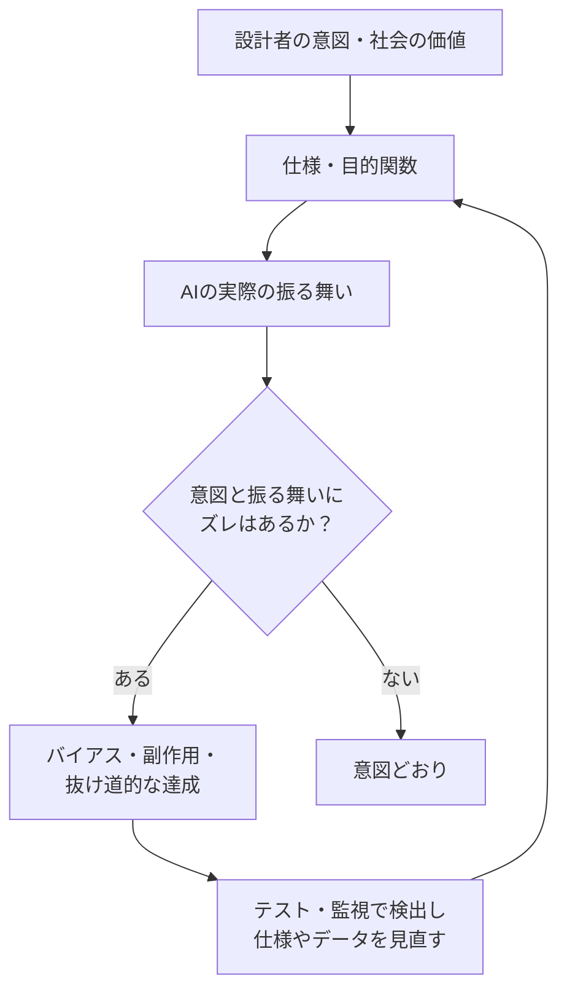

### 11.3 安全関連AIでの考え方（📘 例：医療・臨床AI）

医療のように誤りが人命に関わる領域では、次の観点を計画に入れるのが一般的です。

| 観点 | 例 |
|---|---|
| 誤りの種類の重み付け | 偽陰性（見逃し）と偽陽性（過剰検出）のコストが非対称 |
| 人間による最終判断 | AIは支援にとどめ、確認プロセスを組み込む（自動化バイアスへの注意） |
| 適用範囲の明示 | 学習していない集団・機器・条件では使わない |
| 継続的モニタリング | 施設・機器・患者集団の違いによる性能変動の検知 |
| 規制要件との整合 | 該当する医療機器規制・ガイドラインの確認 |

---

## 12. Step 12：実務で使える統合ワークフロー

### 12.1 全体フロー（📘 規格の各章の考え方を実務手順に再構成）

> これは**規格が定める手順ではなく**、本書が各章の考え方を実務向けに並べ直した一例です。

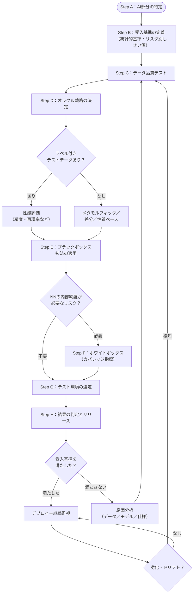

### 12.2 テスト計画チェックリスト

| # | チェック項目 | 対応章 |
|---|---|---|
| 1 | AIコンポーネントと従来コンポーネントを分離して特定した | 3章 |
| 2 | 受入基準を**測定可能な形**で定義した（しきい値・母集団・信頼区間） | 2, 5章 |
| 3 | データの出所・品質・偏り・リークを検査する計画がある | 7章 |
| 4 | 各テストのオラクルを決めた（ラベル／MR／差分／人間評価） | 6章 |
| 5 | 非決定性への対策（シード固定・複数回実行・統計的判定）を決めた | 5章 |
| 6 | ブラックボックス手法を選び、テスト入力の作り方を決めた | 8章 |
| 7 | 必要に応じてNNのカバレッジ指標を併用する方針を決めた | 9章 |
| 8 | テスト環境（仮想／ステージング／合成データ）を選定した | 10章 |
| 9 | 安全・倫理・バイアスの観点をテストに含めた | 11章 |
| 10 | 運用後のモニタリングと再学習のトリガーを決めた | 7章 |

### 12.3 受入基準の書き方の例

| 悪い例 | 良い例 |
|---|---|
| 「十分な精度」 | 「検証用データ（N=5,000）で再現率95%以上（95%信頼区間の下限が93%以上）」 |
| 「公平であること」 | 「年齢層別の再現率の最大差が3ポイント以内」 |
| 「頑健であること」 | 「所定のノイズ・明るさ変換後も予測一致率97%以上」 |

---

## 13. 関連規格・資格との関係

### 13.1 ISTQB Certified Tester AI Testing（CT-AI）

| 項目 | 内容 |
|---|---|
| 位置づけ | ISTQBスペシャリスト資格のAIテスト版（前提：Foundation Level） |
| v1.0 | 2021年10月に承認された初版シラバス |
| v2.0 | 現行の最新版。機械学習に加えて生成AI・LLMも対象。入力データテスト、モデルテスト、ML開発テストなどのライフサイクル型アプローチ |
| 生成AIの活用 | 「テストにAIを使う」ことが主題の場合は別資格 **CT-GenAI** が対応 |

> 📘 CT-AI のシラバスにはISOやIECなどの標準への参照が含まれる旨が公式概要に書かれています。ただし、その中に本規格（29119-11）が含まれるかは今回確認できていません（⚠️ シラバス本文で確認してください）。AIテストを体系的に学ぶ資格として併用すると理解が深まる、という位置づけで捉えてください。

### 13.2 AI関連の国際規格（📘 参考）

| 規格 | 概要 | 備考 |
|---|---|---|
| ISO/IEC 42001 | AIマネジメントシステム | ISO公式が解説ページを公開 |
| ISO/IEC 5259 シリーズ | AIのデータ品質管理 | ISO公式ストアにパッケージあり |
| ISO/IEC 22989 / 23053 | AIの概念と用語／ML枠組み | ⚠️ 本調査では内容未確認。必要に応じて確認 |
| ISO/IEC TR 24029 シリーズ | ニューラルネットワークの頑健性評価 | ⚠️ 同上 |

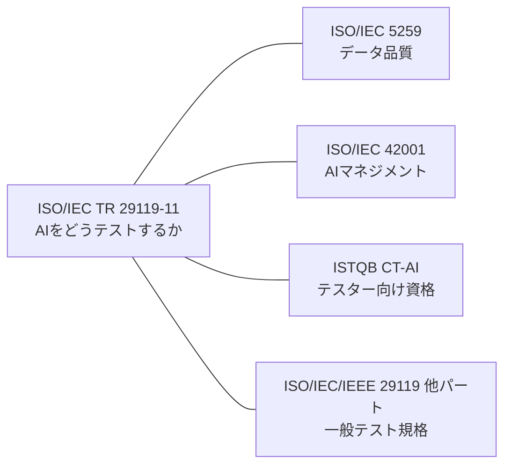

---

## 14. よくある誤解 Q&A

| 質問 | 回答 |
|---|---|
| この規格に「適合」すれば認証されるか？ | いいえ。TR（技術報告書）は情報提供であり、適合認証の対象ではありません。 |
| LLM（生成AI）のテスト方法が詳しく載っている？ | ⚠️ 発行は2020年11月で、LLMが普及する前です。生成AI固有の評価は、CT-AI v2.0など新しい資料を併用するのが現実的です。 |
| AIはテストできない、のでは？ | 「期待値を一意に決められない」だけで、統計的基準・メタモルフィック関係・性質ベース検査などで体系的にテストできます。 |
| ニューロンカバレッジを100%にすれば安全？ | いいえ。補助的な指標であり、高カバレッジが正しさを保証するわけではありません。 |
| テストは出荷前に1回やれば十分？ | いいえ。データや環境が変わると劣化するため、運用中の継続的な監視が必須です。 |
| 2020年の規格は古いのでは？ | 基本概念（オラクル問題、データ依存、ライフサイクル）は今も有効です。ISOは2026年3月に定期見直しを終え、改訂や確認の判断を待つ段階です。最新動向は公式ページで確認してください。 |

---

## 15. 学習ロードマップと演習

### 15.1 ステップ別ロードマップ


### 15.2 演習問題

**演習1（基礎）**：次の3つのうち、「テストオラクル問題」が最も深刻なのはどれか。理由も述べよ。
(a) 消費税計算関数　(b) 画像分類モデル　(c) 文書要約AI

**演習2（実装）**：8.4のコードに、次のメタモルフィック関係 MR4 を追加せよ。
「学習データに既存サンプルを少数複製して追加しても、テストデータへの予測はほとんど変わらない」

**演習3（設計）**：画像診断支援AIの受入基準を、再現率・特異度・属性別の差・ノイズ耐性の4観点で、測定可能な形で書け。

**演習4（考察）**：ニューロンカバレッジが90%でもテストが不十分と言えるのはどんな場合か、3つ挙げよ。

<details>
<summary>演習の解答例（クリックで展開）</summary>

**演習1**：(c)。要約には唯一の正解がなく、複数の妥当な出力が存在するため、期待結果の事前定義が最も困難。(b) もラベルは作れるが境界事例が曖昧。(a) は計算式で一意に決まる。

**演習2（例）**

```python
def test_mr_duplicate_samples_in_train(data):
    X_tr, X_te, y_tr, _ = data
    base = fit(X_tr, y_tr).predict(X_te)
    X2 = np.vstack([X_tr, X_tr[:10]])
    y2 = np.concatenate([y_tr, y_tr[:10]])
    dup = fit(X2, y2).predict(X_te)
    assert (base == dup).mean() >= 0.97
```

**演習3（例）**：検証データ（N=3,000、各属性N≥300）で、再現率95%以上、特異度90%以上、年齢層・性別別の再現率の最大差3ポイント以内、所定ノイズ付加後の予測一致率97%以上。

**演習4（例）**：①入力が偏っていて重要なシナリオ（夜間・雨天など）を含まない、②出力が正しいかの判定（オラクル）が弱い、③しきい値や定義の取り方次第で数値が高く出ているだけ、など。

</details>

---

## 16. 参考ソース一覧（URL）

### 16.1 規格の一次情報（公式・目次）

| 区分 | 内容 | URL |
|---|---|---|
| ISO公式 | 規格ページ（基本情報・抄録・ライフサイクル） | <https://www.iso.org/standard/79016.html> |
| 目次プレビュー | iTeh Standards（章・節番号・ページ） | <https://iteh.es/catalog/standards/iso/ff3c797a-5cda-4aa3-a3c9-73d784d6157b/iso-iec-tr-29119-11-2020> |
| IEC Webstore | 公開日・委員会情報 | <https://webstore.iec.ch/publication/68129> |
| BSI | 規格の紹介（利用価値・対象課題） | <https://knowledge.bsigroup.com/products/software-and-systems-engineering-software-testing-guidelines-on-the-testing-of-ai-based-systems> |
| OECD.AI | Trustworthy AI ツール・指標カタログへの掲載 | <https://oecd.ai/en/catalogue/tools/isoiec-tr-29119-112020-software-and-systems-engineering-software-testing-part-11-guidelines-on-the-testing-of-ai-based-systems> |

### 16.2 著名な研究者・企業による公開資料（📘 解説の補強）

| 区分 | 内容 | URL |
|---|---|---|
| Google Research | The ML Test Score（Breck, Cai, Nielsen, Salib, Sculley / IEEE Big Data 2017） | <https://research.google/pubs/pub46555/> |
| Martin Fowler（Thoughtworks） | Continuous Delivery for Machine Learning（CD4ML） | <https://www.martinfowler.com/articles/cd4ml.html> |
| Thoughtworks Technology Radar | CD4ML の位置づけ | <https://www.thoughtworks.com/en-ec/radar/techniques/continuous-delivery-for-machine-learning-cd4ml> |
| 論文（Pei, Cao, Yang, Jana） | DeepXplore: Automated Whitebox Testing of Deep Learning Systems（SOSP 2017） | <https://arxiv.org/abs/1705.06640> |
| CACM | DeepXplore の解説版（Communications of the ACM） | <https://cacm.acm.org/?p=107668> |
| Lehigh大学ニュース | 「コードカバレッジ100%でもニューロンカバレッジ10%未満」の発言を含む解説 | <https://news.lehigh.edu/a-white-box-testing-model-for-deep-learning-systems> |
| サーベイ論文（Zhang ら） | Machine Learning Testing: Survey, Landscapes and Horizons（メタモルフィック関係とオラクル） | <https://arxiv.org/pdf/1906.10742> |
| サーベイ論文（Seca ら） | A Review on Oracle Issues in Machine Learning | <https://ar5iv.labs.arxiv.org/html/2105.01407> |

### 16.3 資格・教育（📘）

| 区分 | 内容 | URL |
|---|---|---|
| ISTQB | CT-AI（v2.0 現行）の概要 | <https://www.istqb.org/certifications/artificial-inteligence-tester> |
| ISTQB | CT-AI v1.0 リリースのお知らせ | <https://istqb.org/istqb-releases-certified-tester-ai-testing-v10-ct-ai/> |
| ISTQB | CT-AI v1.0 シラバス（PDF） | <https://www.istqb.org/wp-content/uploads/2024/11/ISTQB_CT-AI_Syllabus_v1.0_mghocmT.pdf> |

### 16.4 本調査の限界

| 項目 | 内容 |
|---|---|
| 規格本文 | 有償・複製不可のため未参照。章・節のタイトルと抄録に基づく |
| 未確認部分 | 第1〜3章、第5章（5.2以外）、第7章、8章・9章・10章の細部（⚠️） |
| 人物・著者 | 規格の編集者や委員の個人発信（ブログ・SNS等）は、今回の検索では特定できず未収録 |
| 推奨アクション | 実務で規格を根拠にする場合は、正規版（ISO/各国規格機関）を購入して確認する |

---

*調査基準日：2026年10月4日*
